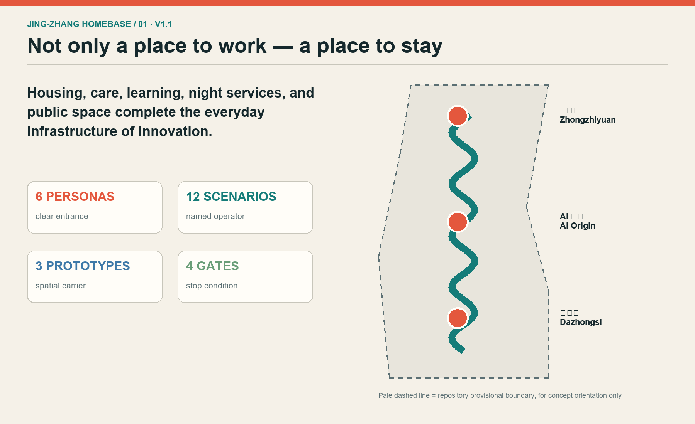
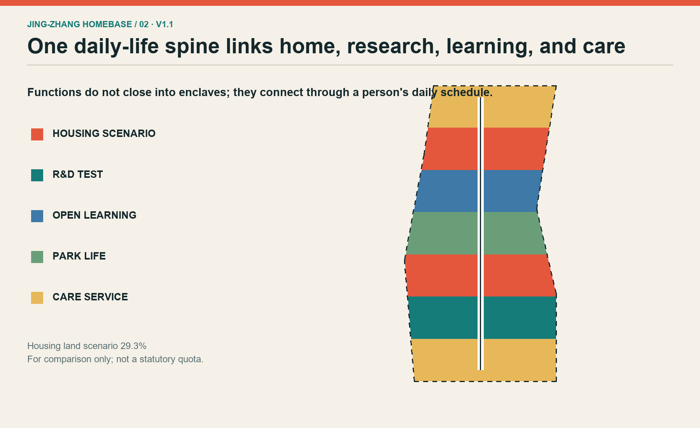
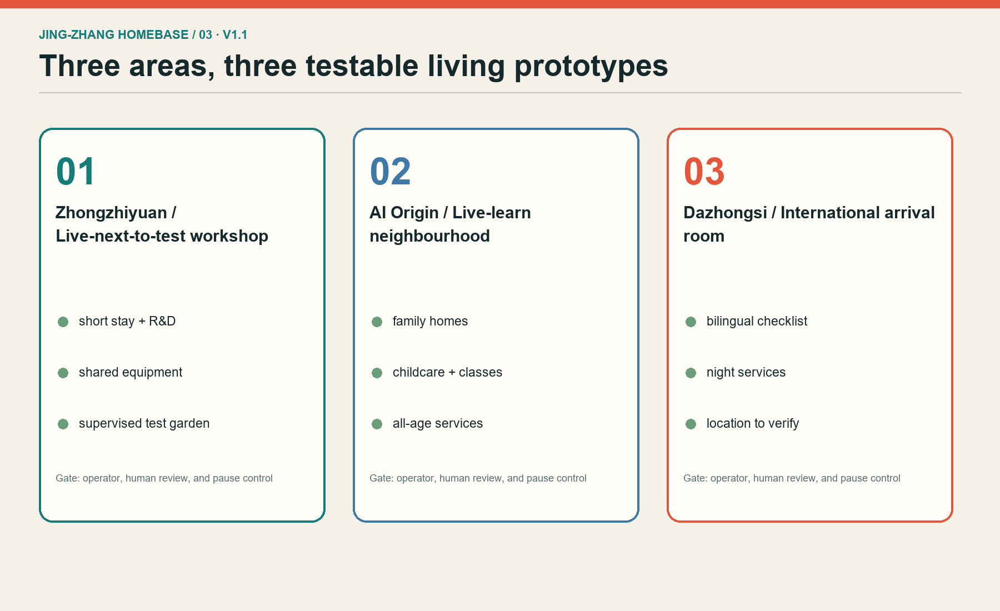
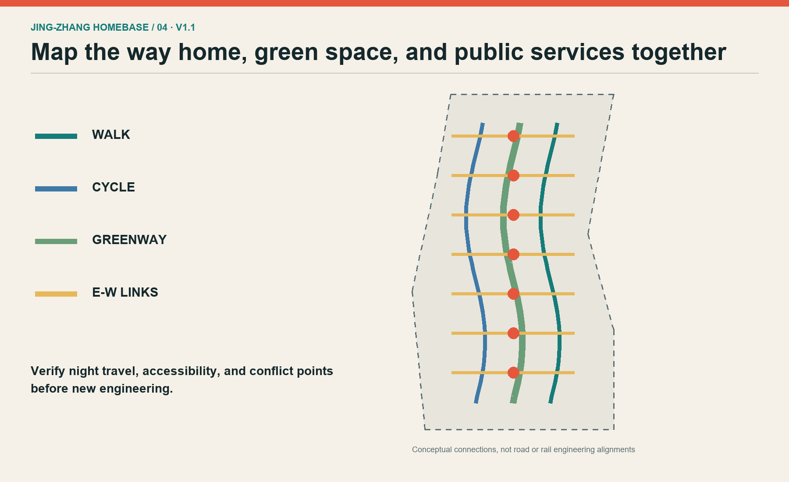
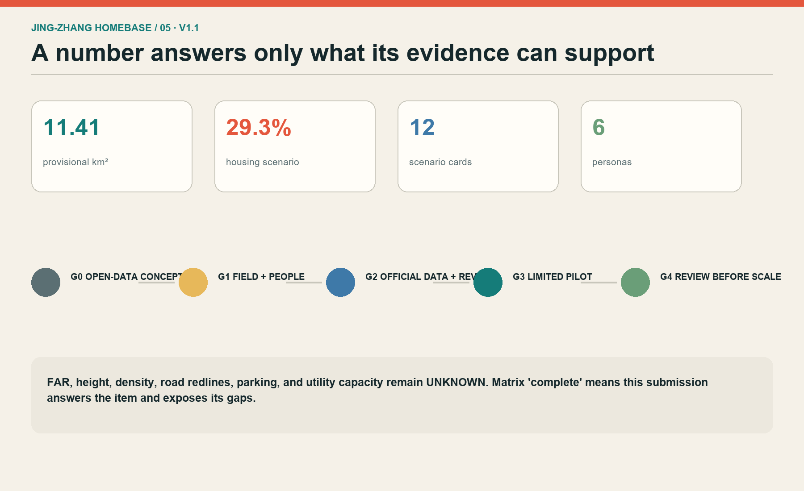

# JING-ZHANG HOMEBASE: Put Daily Life at the Base of Innovation

## Design Basis and Source List

This proposal asks one testable urban-design question: can a person complete an ordinary day here, rather than merely visit a technology district? The official open-call announcement and Agent taskbook define the required work. The repository site package is the only spatial base used. The approximate 11.4-square-kilometre overall scope, three key-area names, and announced approximate areas establish scale, but the current polygons are provisional substitutes inferred from textual limits. They are not official redlines, parcels, or approval evidence. [source:OFFICIAL-ANNOUNCEMENT] [source:SITE-PACKAGE]

Evidence is separated into three levels. Official announcements and standards define questions that must be answered. Repository provisional geometry supports orientation and reproducible scenario calculations only. International cases and Haidian's elderly-service action plan provide transferable methods but no local control values. Every source, access date, use, and limitation is recorded in `sources.json`; every figure is generated from this package without third-party basemaps, logos, portraits, or uncleared imagery. [data:geometry/site_boundary.geojson#PROV-SITE-001]

No site visit, resident interview, business interview, ownership check, or utility survey has yet occurred. The work therefore remains at Gate G0, an open-data concept. Any physical intervention must pass G1 field verification and then G2 professional deepening with official boundaries, control plans, buildings, roads, utilities, heritage, and ownership. Missing a gate leaves only reversible events or desk studies; it never becomes a construction, investment, or government commitment.

## Three-Level Scope Framework

The coordinated research area asks why people would come and which regional innovation actors might cooperate; it is represented by cases and an accountable partnership list, not invented parcels across the approximate 43.6-square-kilometre scope. The overall design area asks how people can live, learn, care, and meet beyond working hours. It contains one daily-life spine along the Jingzhang Heritage Park, three live-work segments, twelve scenario nodes, and two service interfaces. The key-area level asks where a person goes on arrival, using distinct prototypes for Zhongzhiyuan, the Beijing AI Origin Community, and Dazhongsi. [depth:three_level_scope_framework]

All levels use the same acceptance questions: are walking and cycling continuous; do essential services remain after office hours; do households at different income and life stages have choices; can an AI-assisted public service be used with minimal data, refused, exited, and reviewed by a person; and can the spatial work be recalculated when new evidence arrives? Research is checked through relationships and cases, the overall plan through land-use and public-space layers, and key areas through scenario cards, responsible actors, and gates. [data:geometry/key_areas.geojson#PROV-KEY-001]

Provisional boundaries appear as faint dashed constraints while the proposed spine and nodes carry the visual hierarchy. Replacing them requires recalculating every area and topology result. Until the public question over the provisional Dazhongsi polygon is resolved, its design remains a functional type and adjacency brief rather than a station-anchored claim. [metric:site_area_sqm]

## Coordinated Research Area: Industry and Future City Research

JING-ZHANG HOMEBASE treats housing and everyday services as innovation infrastructure. The ecosystem combines research, homes, education, care, public space, computing access, and compliance support. A future professional team should maintain an accountable cooperation list: universities release public research questions; companies offer de-identified test problems; communities state daily needs; operators recruit participants and report incidents; competent public bodies retain rule review and final judgment. A project without a named data steward and exit procedure does not enter testing. [source:AGENT-TASKBOOK]

Six cases support method comparison, not formal transplantation. Punggol Digital District combines education, industry, community, and a shared digital platform. MIT Kendall Square combines research, housing, retail, and open space. Barcelona's later 22@ approach foregrounds residents, affordable rental housing, and greener streets. King's Cross aligns railway heritage, public space, and housing. Helsinki's Re-thinking Urban Housing continuously tests multiple housing models. Quayside consultation material is a caution that public interest, affordability, and digital governance must be disclosed early. [source:JTC-PDD] [source:MIT-KENDALL]

Only three lessons transfer: measure whether talent stays rather than merely arrives; validate housing, childcare, elder support, and night services alongside laboratories; and limit digital platforms to assistive public-service roles. Land, finance, computing, data, and scenarios are discussion interfaces. The proposal invents no firm roster, investment value, output forecast, or fiscal promise.

## Overall Design Area: Urban Renewal and Regulatory-Plan-Level Urban Design

The overall structure is one daily-life spine, three live-work segments, twelve scenario nodes, and two service interfaces. The spine supports continuous walking, cycling, shade, night-time essentials, and heritage reading along Jingzhang Heritage Park. The segments respond to international arrival in the south, open learning in the centre, and research co-testing in the north. The Zhongguancun wing links compliance, entrepreneurship, and professional services; the Xiaoyue River wing links neighbourhoods, schools, elderly care, and public experience. [depth:overall_spatial_structure]

`land_use.geojson` is a comparable concept partition, not a regulatory plan. Housing, research, education, commercial service, community service, and park space use the repository subset of national land-use codes. The strategy tests ground-floor reuse, courtyards, and leftover public spaces before new massing. Building polygons are spatial envelopes, not surveyed buildings or approved footprints. FAR, height, density, statutory green ratio, setbacks, and parking remain unknown because the required controls are absent. [standard:MNR-LAND-USE-CLASSIFICATION-GUIDE]

The visual identity joins two railway lines into a simple roof: rails support a home. Brick red recalls industrial material, rail teal structures information, and living green marks services. This is a proposal identity, not an official belt brand. The figures place the continuous spine, relationships, and implementation gates above the pale provisional outline. [data:geometry/land_use.geojson#HB-LU-04]

## Detailed Design of Key Areas

The Zhongzhiyuan prototype is a test workshop one can live beside: small-team research space sits near short-stay homes, shared equipment, a public kitchen, and a supervised test garden. Tests use authorised data only. Operators provide a safety lead, pause control, incident record, and review. Expansion is discussed only after a small pilot demonstrates fair booking, night safety, complaint closure, and reliable exit. [data:geometry/key_areas.geojson#PROV-KEY-001]

The AI Origin Community prototype is a live-learn neighbourhood. Family housing, a community workshop, childcare, elder support, and open classes create a full daily schedule. Universities or institutions offer voluntary courses and research; qualified staff remain accountable for services. AI does not decide medical diagnosis, admissions, welfare eligibility, or other high-impact outcomes. Acceptance asks whether all six personas find an entrance, human help, and an accessible route. [data:geometry/key_areas.geojson#PROV-KEY-002]

The Dazhongsi prototype is an international arrival living room with short-stay guidance, bilingual city services, night food, modest exhibitions, and remote collaboration rooms. Because the provisional polygon's position is publicly disputed, this concept is not tied to a particular station, block, or property. It describes required adjacency to transit, daily services, and industry. Official geometry and fieldwork must relocate it before professional design. [data:geometry/key_areas.geojson#PROV-KEY-003]

## AI Innovation Ecosystem, Personas, and AI+ Scenarios

Six personas anchor the design: an early-career researcher, a two-person start-up, a night-shift maintenance worker, a household with a child, a long-term resident or older adult, and an international visiting researcher. Each is described by a time schedule, difficulty, and human service entrance rather than a consumer segment. Common safeguards are anonymous access where feasible, minimum collection, explicit exit, human review, accessible alternatives, and no loss of basic service for refusing optional data. [source:HAIDIAN-AI-ELDERLY]

The twelve scenario cards are: safe night-route guidance; continuous accessible routing; shared-equipment booking; childcare and course vacancy guidance; elder-service human transfer; bilingual arrival checklist; heritage interpretation; enclosed low-speed delivery testing; street thermal-comfort sensing; human-reviewed event flows; a small-team compliance assistant; and housing-repair triage. Each identifies user, place, minimum data, operator, risk, human review, and stop condition. [metric:scenario_card_count]

Three are explicit industry validation scenes. Equipment booking stays indoors and limited. Low-speed delivery runs only in enclosed or approved space. Thermal comfort sensing collects environmental data rather than identity. Each follows G1 baseline fieldwork, G2 small sandbox, G3 time-limited staffed pilot, and G4 independent or cross-department review. Without site permission, competent professional review, and public-safety approval, it is not opened or described as approved.

## Land Use, Building Scale, and Retain-Renovate-Demolish Strategy

The land-use scenario alternates housing with research, education, community service, commercial service, and park space so daily needs are not concentrated in one retail node. The housing share is calculated from provisional geometry solely to compare no-housing, limited-housing, and live-work alternatives. It is not a land-supply quota, affordable-housing target, or delivery promise. [metric:housing_land_share_scenario]

Fourteen building polygons are spatial-envelope tests. They examine whether public ground floors, short-stay units, shared kitchens, learning workshops, research workshops, and all-age services can support a continuous day. There is no surveyed building inventory, structural appraisal, ownership record, or heritage inventory, so no real building receives a retain, renovate, or demolish decision. A professional team must first compile five columns for each building: value, safety, ownership intent, carbon impact, and user need. [data:geometry/buildings.geojson#HB-BLD-01]

Controls remain conditional. Live-work mixing is only deepened if official controls permit it and public-service capacity is sufficient. Added envelopes shrink or disappear when heritage, daylight, fire safety, or infrastructure conflicts. Work stops when existing residents bear costs without a clear benefit or consent process. Height, FAR, parking, and underground construction remain unresolved professional questions. [depth:retain_renovate_demolish]

## Transport, Rail, Municipal Infrastructure, and Public Services

The transport concept does not redraw official roads. It marks three interfaces to verify: continuous north-south walking, cycling, and greenway routes; seven east-west stitching points; and short connections from key areas to transit and community services. Every line is conceptual and must be checked against official road redlines, entrances, traffic counts, accessibility, and railway safety. It is not a construction or operations plan. [data:geometry/roads.geojson#HB-ROAD-L-02]

Daily trips take precedence over landmark visits. Can a night worker return safely after the last service? Can a wheelchair or stroller pass continuously? Do riders slow at conflicts? Is there shelter during rain and snow? AI may identify gaps, suggest candidate routes, and aggregate feedback. Road closure, signalling, transit, and emergency decisions remain with competent authorities and professionals. [standard:MOHURD-URBAN-DESIGN-MEASURES]

Utilities and public services use capacity-first gates. No official capacity data is available for water, drainage, power, communications, waste, fire service, schools, healthcare, childcare, or elder care. Pilots therefore use reversible facilities and separate metering. Any housing or laboratory addition waits for capacity assessment. Haidian's AI-plus-elderly-care plan informs demand collection, community pilots, accessibility retrofit, and co-testing, but never replaces care qualifications, medical judgment, or consent.

## Blue-Green Network, Public Space, and Urban Character

The blue-green concept includes a daily-life heritage park, a southern cooling greenway, a northern rain garden, and four public courtyards. The heritage park is not a backdrop for technology displays. It layers commuting, rest, children's play, older adults' walks, historical reading, and low-intensity trials on shared public ground. Ratios are internal concept calculations and must be updated with official boundaries, surveyed trees, water controls, and ownership. [metric:green_ratio] [metric:public_space_ratio]

Three pilgrimage landmarks are useful civic facilities rather than monuments. The Centennial Live-Learn Hall hosts railway-history reading, public classes, and quiet work. The Open Contribution Housebook displays authorised code, design, and community contributions with withdrawal. The 24-Hour City Living Room offers night seating, water, charging, toilet directions, and a human help entrance. Success is measured by daily service hours, inclusion, and maintenance, not check-in traffic. [data:geometry/public_space.geojson#HB-PUBLIC-02]

The character rule is readable old material, removable new equipment, and night light that respects neighbours. Brick red signals railway memory, rail teal guides movement, and living green marks public services. Every screen has a no-screen alternative. Heritage fabric, mature trees, waterways, bridges, and tunnels remain interface principles only until specialist surveys. [depth:blue_green_public_space]

## Renewal Projects, Implementation Policy, and Phasing

Projects are ordered by reversibility: P1 field walking and accessibility audit; P2 informed interviews with six personas; P3 night-service mapping; P4 three temporary daily-life stations; P5 a trial Live-Learn Hall programme; P6 shared-equipment booking sandbox; P7 older-adult and disability co-testing; P8 live-work building prototype study; P9 professional spine mobility and landscape design; P10 integrated key-area deepening. The first seven can test activities, signs, and temporary facilities; the final three require formal data and multi-disciplinary design. [data:geometry/phasing.geojson#HB-PHASE-01]

Phases are gates, not promised dates. G0 is this public-data submission. G1 requires field records, informed participation from six personas, and a confirmed operator. G2 requires official boundary, controls, ownership, buildings, infrastructure, heritage, traffic data, and professional review. G3 permits only small, pausable, staffed pilots. G4 independently reviews public value, complaints, safety, cost, and equity before any expansion. [depth:phasing_implementation]

Suggested accountability is explicit. A coordinating body maintains task and data versions. Local site managers confirm space and safety. Planning, architecture, transport, utilities, landscape, and heritage professionals own their disciplines. Operators own staffing, maintenance, and complaints. Community representatives shape needs and reviews. AI organises evidence, compares options, and flags risk. A Live-One-Day Test Week, Open City Class, and Community Co-test Day are programming ideas, not scheduled commitments.

## Metrics, Area Recalculation, and Compliance Matrix

Metrics have three groups. Reproducible package facts include provisional site area, conceptual envelopes, concept green and public-space ratios, three key areas, twelve scenario cards, and six personas. Statutory values that must remain unknown include FAR, height, density, statutory green ratio, road redlines, parking, and infrastructure capacity. Future pilot measures include night-service access, accessibility-gap closure, human-transfer success, complaint closure time, data-exit success, and differences between user groups. [metric:site_area_sqm]

Areas are calculated in EPSG:4548. Shared cut lines generate `land_use.geojson` to cover the provisional site polygon. Green, public-space, and building layers intentionally overlap other conceptual layers and cannot be added into a land budget. The housing share is a design scenario. Self-checks must cover GeoJSON structure, land coverage and overlap, formulae, HTML metric equality, all five figures, and bilingual pairs. [data:geometry/land_use.geojson#HB-LU-01]

`compliance_matrix.json` addresses all 23 announcement and Agent-taskbook requirements. `standard_matrix.json` covers mandatory reading, and `design_depth_matrix.json` links 15 professional-depth items to evidence and gaps. A matrix status of complete means this submission answers the item and states its evidence boundary; it does not mean statutory or construction design is complete. [depth:metrics_recalculation]

## Risk, Copyright, and Compliance

The primary risk is mistaking provisional boundaries, envelopes, or housing scenarios for public decisions. Controls are repeated provisional labels, unknown statutory metrics, conditional gates, and no station anchoring for Dazhongsi while its provisional position is disputed. The second risk is data and algorithmic harm. Basic services do not require faces or precise personal traces; no automated enforcement, medical diagnosis, admissions, or welfare decision is proposed. Every scenario has human alternatives, appeal, and shutdown. [assumption:A-BOUNDARY-001]

A third risk is rent pressure or harm to current residents. Later work must compare long-term rental, short talent stays, family housing, and existing-resident improvement; talent cannot mean only high-income newcomers. Every renewal choice records who pays, who benefits, and who may refuse or exit. A fourth risk is ownerless operation, so each pilot must identify a space owner, data steward, staffed operator, maintenance resource, and complaint route before launch.

Text, graphics, GeoJSON, HTML, and PDFs were co-created by OpenAI Codex and Xuuyuan from public or cleared sources. Visuals are code-native and contain no external images. The licence is COMMUNITY-DISPLAY-ONLY. All outputs are open co-creation proposals, do not replace formal planning, and do not constitute a government determination. Spatial suggestions are concepts for professional deepening. [source:SOURCE-REGISTRY]

## References

Core project references are the official open-call announcement, the repository Agent taskbook and source registry, the provisional-boundary note, the Measures for Urban Design Management, control-plan requirements, the national land-use classification guide, and accessibility legislation. These materials define required questions and the limits of the proposal. [standard:PROJECT-OFFICIAL-ANNOUNCEMENT]

Case references use official institutional or project pages: JTC for Punggol Digital District, MIT for the Kendall Square Initiative, Barcelona City Council for 22@, the King's Cross development site, the City of Helsinki for Re-thinking Urban Housing, and Waterfront Toronto for Quayside consultation material. They support method lessons on mixed use, housing innovation, heritage reuse, public interest, and long-term operation. They do not prove that the Jingzhang site has identical conditions. [source:BARCELONA-22]

The local service reference is Haidian District's 2026–2028 AI-plus-elderly-care action plan, used only for demand collection, community pilots, accessibility retrofit, and co-testing principles. Full URLs, access dates, intended use, and limitations are in `sources.json`. Every source should be checked before an iteration; official attachments, field evidence, or authoritative geometry must replace provisional inference and trigger a complete rerun. [source:HAIDIAN-AI-ELDERLY]
