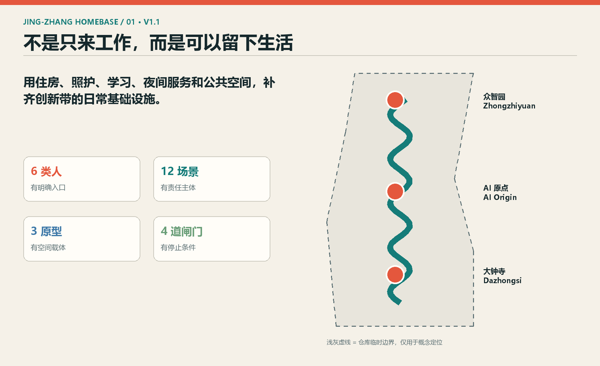
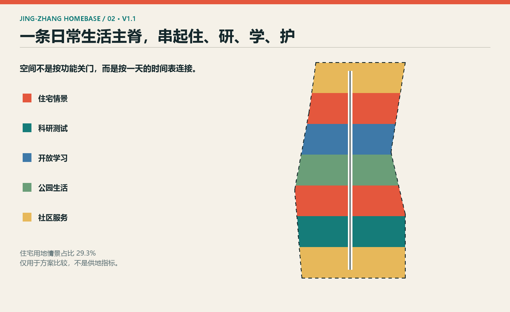
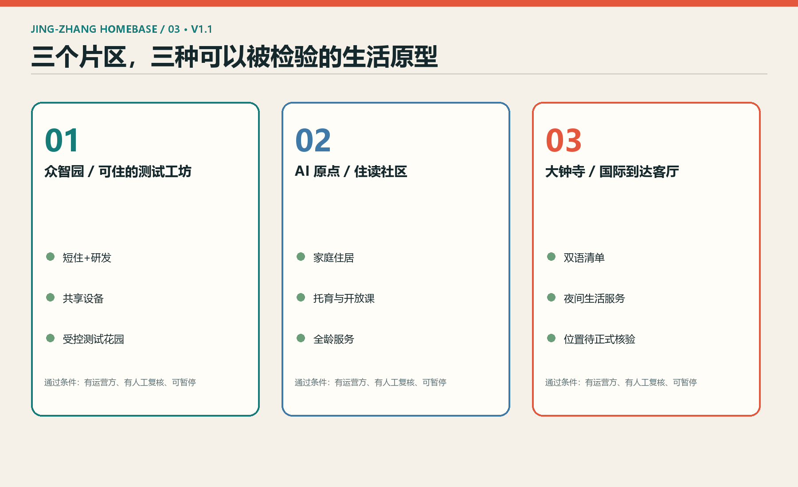
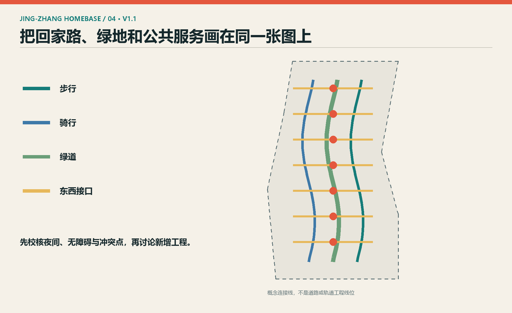
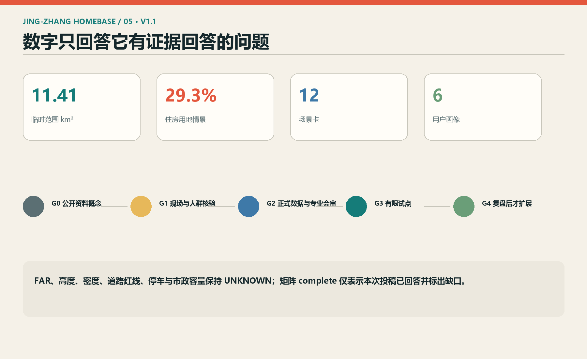

# 京张有家：把生活安在创新带上

## 设计依据与资料清单

本方案把“创新人才是否能在这里过完普通一天”作为城市设计检验题，而不是再增加一组技术口号。法定任务来自征集公告与智能体任务书；空间底图仅采用仓库公开资料包。总体设计范围约 11.4 平方公里、三处重点区域的名称与公告约面积可作为任务尺度，当前 polygon 只是依据文字四至形成的临时替代边界，不能作为红线、权属或审批依据。[source:OFFICIAL-ANNOUNCEMENT] [source:SITE-PACKAGE]

证据分三档：公告、国家与部门标准用于确认必须回答的问题；本仓库 provisional geometry 只用于图面定位和面积复算演示；海外案例与海淀养老行动方案只用于启发设计方法，不移植其指标。来源、发布日期、用途和限制逐条记录在 `sources.json`。图件全部由本方案 GeoJSON、文字与指标生成，没有外部底图、商标、人物肖像或未清权素材。[data:geometry/site_boundary.geojson#PROV-SITE-001]

目前没有现场踏勘、居民访谈、企业访谈和物业权属核验。成果因此停在 G0“公开资料概念方案”。任何进入实体空间的动作必须先完成 G1 现场核验，再获得正式边界、控规、建筑、道路、市政、文保和权属资料进入 G2 专业深化。缺一项，就只保留可逆活动或纸面推演，不宣称可施工、可招商，也不表述为政府决定。[assumption:A-FIELDWORK-001]

## 三层范围工作框架

统筹研究范围回答“人才为何来、与哪些创新节点协作”，用案例、产业链和跨区合作清单表达，不在 43.6 平方公里粗略范围上虚构地块方案。总体设计范围回答“工作之外如何住、学、照护和相遇”，形成一条沿京张遗址公园的日常生活主脊、三类住研混合片段和两侧服务接口。重点区域回答“一个人到了这里具体去哪”，分别给出众智园、AI 原点社区和大钟寺三种原型。[depth:three_level_scope_framework]

三层之间使用同一套验收问题：步行或骑行是否连续；夜间是否仍有基本服务；不同收入与家庭阶段是否有可选择的居住类型；公共 AI 服务能否匿名使用、退出并获得人工帮助；空间方案是否在新资料到达后可重算。统筹层以合作关系图和案例表复核，总体层以用地、慢行、蓝绿、公共空间图层复核，重点层以场景卡、责任表和阶段闸门复核。[data:geometry/key_areas.geojson#PROV-KEY-001]

临时边界在所有图中用浅灰虚线表达，设计主脊与节点用实色表达。正式 polygon 替换后，必须重跑面积、绿地、公共空间、住房情景占比和拓扑检查；若大钟寺临时 polygon 的位置问题仍未解决，只保留“大钟寺功能类型与邻接关系”的文字设计，不把它绑定到具体车站或地块。[metric:site_area_sqm]

## 统筹研究范围产业与未来城市研究

“京张有家”把住房与日常服务视为创新基础设施。产业生态不是只有研发楼和活动，而是由研发、居住、教育、照护、公共空间、算力与合规支持共同组成。面向区域协同，建议建立可供专业团队核验的合作清单：高校与实验室提供公开课题，企业提出可脱敏的测试问题，社区提出生活需求，运营方组织招募与复盘，政府部门保留规则审查和最终判断。没有明确数据责任人和退出机制的项目不进入测试。[source:AGENT-TASKBOOK]

六个案例用于比较方法而非复制形态：新加坡 Punggol Digital District 展示教育、产业、社区和数字平台共址；MIT Kendall Square 展示研究、住房、零售与开放空间混合；Barcelona 22@ 的后续策略强调可负担租住、居民与绿化；King’s Cross 展示铁路遗产、公共空间和住房并行；Helsinki Re-thinking Urban Housing 展示由城市持续测试多种住房原型；Waterfront Toronto 的 Quayside 讨论提醒公共利益、住房可负担与数字治理必须在早期公开。[source:JTC-PDD] [source:MIT-KENDALL]

本地转译只保留三条：第一，把人才的“停留时间”而非到访量作为长期指标；第二，把居住、托育、养老和夜间服务与研发空间同步验证；第三，把数字平台限定为公共服务的辅助工具。土地、资金、算力、数据和场景均只提出供讨论的接口，不编造企业名单、投资额、产值或财政承诺。

## 总体设计范围城市更新与控规深度城市设计

总体结构是“一条日常生活主脊、三个住研片段、十二个场景节点、两翼接口”。主脊沿京张遗址公园组织连续步行、骑行、遮荫、夜间基础服务和历史阅读；住研片段按南部国际到达、中部开放学习、北部研发共测的生活需求组织；中关村科技服务翼连接合规、创业和专业服务，小月河场景赋能翼连接社区、学校、养老与公共体验。[depth:overall_spatial_structure]

`land_use.geojson` 是可比较的概念分区，不是控规：住宅、科研、教育、商业服务、社区服务和公园绿地均使用国土空间调查规划用途分类中的仓库子集编码。空间做法是优先盘活底层、院落和边角公共空间，再讨论新增体量；建筑图层只画“空间包络测试”，不代表现状建筑或批准基底。正式容积率、高度、密度、绿地率、退线均留作 unknown，避免用整齐数字掩盖资料缺口。[standard:MNR-LAND-USE-CLASSIFICATION-GUIDE]

Logo 方向来自京张铁路线的两条平行线，在中间折成一个简化屋顶，形成“轨道托住房子”的符号；主色为砖红、铁青和生活绿。命名只服务本方案，不声称为一带官方品牌。图面不以临时边界大色块作主角，而以连续主脊、节点关系和可执行闸门作主叙事。[data:geometry/land_use.geojson#HB-LU-04]

## 重点区域详细设计

众智园原型是“可住的测试工坊”：小团队研发空间与短租住居、共享设备、公共厨房和可监管测试花园相邻。测试对象只用授权数据，运营方设置安全员、暂停按钮和事故复盘；通过小规模验证后才讨论扩展。验收看设备预约公平、夜间安全、投诉闭环和测试退出是否有效。[data:geometry/key_areas.geojson#PROV-KEY-001]

AI 原点社区原型是“住读社区”：以家庭型人才住居、社区学习工坊、托育、长者服务和开放课堂形成从早到晚的日程。高校或机构只承担自愿参与的课程与课题，社区服务由有资质人员兜底，AI 不做医疗诊断、录取、福利资格等高影响决定。验收看至少六类人群能否找到明确入口、人工帮助和无障碍路径。[data:geometry/key_areas.geojson#PROV-KEY-002]

大钟寺原型是“国际到达客厅”：设置短住咨询、双语城市服务、夜间餐食、轻量展示与远程协作房。由于临时边界位置存在公开争议，本方案不把该原型锚定在某一车站、街坊或物业，只说明应与轨道接驳、生活服务和产业空间步行相连。位置须在正式边界和现场核验后重定。[data:geometry/key_areas.geojson#PROV-KEY-003]

## AI 创新生态、人才画像与 AI+ 场景

六类画像是：初入职研究员、两三人创业团队、夜班运维人员、带儿童家庭、长期居民与长者、国际访问研究者。每类都用“时间表+困难+人工服务入口”描述，不把人简化为消费标签。共同底线是可匿名体验、最少采集、明确退出、可人工复核、无障碍替代和不因拒绝数据授权而失去基本服务。[source:HAIDIAN-AI-ELDERLY]

十二张场景卡分别是：①夜间安全回家导航；②无障碍连续路径；③共享设备预约；④托育与课程空位导航；⑤长者服务人工转接；⑥国际到达双语清单；⑦历史文化导览；⑧低速配送封闭测试；⑨街道热舒适巡测；⑩活动客流人工复核；⑪小团队合规助手；⑫住房维修报修分流。每张卡都记录使用者、空间、最低数据、运营方、风险、人工复核和停用条件。[metric:scenario_card_count]

其中 ③、⑧、⑨ 是产业测试验证场景：设备预约在室内小范围运行，低速配送只在封闭或批准场地运行，热舒适巡测只采环境数据。三个测试都采用 G1 现场基线—G2 小样本沙盒—G3 有限时段试点—G4 第三方复盘流程。未经场地方、专业人员和公共安全审查，不对外开放，也不把测试写成已批准运营。

## 用地、建筑规模与拆改留方案

用地方案把住宅情景带与科研、教育、社区服务、商业服务和公园绿地交替布置，使日常服务不集中在单一商业节点。住房情景占比由临时边界与概念用地计算，仅用来比较“无住房、少量住房、住研混合”三种方向；它不是供地比例、保障房指标或建设承诺。[metric:housing_land_share_scenario]

建筑图层中的十四个矩形是空间包络测试：用于验证底层公共界面、短住单元、共享厨房、学习工坊、研发工坊和全龄服务能否组成连续日程。没有现状建筑普查、结构鉴定、权属和文保资料，因此不对任何真实建筑作拆、改、留判断。后续专业团队应逐栋建立“保留价值—安全状态—权属意愿—碳排影响—使用需求”五栏档案，再由多专业会审提出分类。[data:geometry/buildings.geojson#HB-BLD-01]

尺度控制采用条件句：若正式控规允许混合功能且公共服务容量可承受，才深化住研复合；若文保、日照、消防或市政条件冲突，则缩减或移除新增体量；若原住居民承担成本而收益不清，则停止方案。高度、容积率、停车位与地下空间不作数值结论。[depth:retain_renovate_demolish]

## 交通、轨道、市政与公共服务设施

交通策略不是另画道路，而是给现有网络提出三类待核接口：南北连续的步行线、自行车线和生活绿道；七处东西缝合接口；重点区与轨道、公交、社区服务的短接。所有线位均为概念连接，必须用正式道路红线、出入口、交通流量、无障碍现状和铁路安全要求校核，不能直接用于施工或交通组织。[data:geometry/roads.geojson#HB-ROAD-L-02]

日常出行的验收优先于地标到访：夜班人员在末班交通后是否有安全回家选择，轮椅与婴儿车是否能连续通过，骑行是否在冲突点减速，雨雪天是否有可停留空间。AI 只辅助发现断点、生成候选路径和汇总反馈；封路、信号、公交和应急安排由有权部门与专业人员决定。[standard:MOHURD-URBAN-DESIGN-MEASURES]

市政和公共服务以“容量先行”作为闸门。供水、排水、供电、通信、垃圾、消防、学校、医疗、托育与养老容量均未获得正式资料。场景试点只使用可逆设施和独立计量；任何新增住房或实验设施必须先获得容量评估。海淀 AI+养老行动中的需求收集、社区试点和适老化方向可作为服务流程参考，但不替代医疗、养老资质或个人同意。

## 蓝绿空间、公共空间与城市风貌

蓝绿结构由京张日常生活公园、南段清凉绿廊、北段雨水花园和四个公共院场组成。遗址公园不是科技展厅背景，而是把通勤、休息、儿童活动、长者散步、历史阅读和低强度测试叠合的公共地面。绿地与公共空间比率来自概念图层，只用于方案内部复算，待官方边界、现状树木、水系蓝线和绿地权属资料到位后更新。[metric:green_ratio] [metric:public_space_ratio]

三个“朝圣地标”均是公共使用设施而非巨构：百年住读厅提供铁路史阅读、公开课与安静工作位；开源家谱墙显示经过授权的代码、设计与社区贡献记录，并允许撤回；24 小时城市客厅提供夜间座位、饮水、充电、卫生间指引和人工服务入口。地标价值由日常使用小时、服务覆盖和维护状态衡量，不以打卡流量衡量。[data:geometry/public_space.geojson#HB-PUBLIC-02]

风貌原则是“旧材料可读、新设施可拆、夜间光不过界”。砖红提示铁路工业记忆，铁青用于导视骨架，生活绿标识公共服务；所有显示屏保留无屏替代。涉及遗产本体、古树、水系和桥隧的设计在专项调查前只保留界面原则，不作工程判断。[depth:blue_green_public_space]

## 更新项目清单、实施政策与分期计划

项目清单按可逆性排列：P1 现场步行与无障碍审计；P2 六类人群访谈；P3 夜间服务地图；P4 三处临时生活站；P5 百年住读厅内容试办；P6 共享设备预约沙盒；P7 长者与残障共测；P8 住研混合建筑原型研究；P9 主脊慢行与绿化专业设计；P10 三重点区综合深化。前七项可先用活动、标识和临时设施验证，后三项必须等待正式数据与多专业设计。[data:geometry/phasing.geojson#HB-PHASE-01]

分期不是日期承诺，而是闸门。G0 为本次公开资料概念投稿；G1 要求现场记录、至少六类人群的知情参与和运营主体确认；G2 要求正式边界、控规、权属、建筑、市政、文保与交通底图及专业会审；G3 只允许小范围、可暂停、有人值守的试点；G4 由第三方或跨部门复盘公共价值、投诉、安全、成本和公平性，达标才讨论扩展。[depth:phasing_implementation]

建议责任结构为：牵头协调方维护任务与资料版本；属地和场地方确认空间与安全条件；专业团队对规划、建筑、交通、市政、景观和文保负责；运营方承担值守、维护与投诉；社区代表参与需求与复盘；AI 只做资料整理、选项推演和风险提示。年度活动可设“住一日测试周、开源城市课、社区共测日”，均为运营建议而非确定安排。

## 指标体系、面积复算与合规矩阵

指标分三类。第一类是可复算的提交包事实：临时总体边界面积、概念建筑包络面积、概念绿地与公共空间比率、三处重点区数量、十二张场景卡和六类画像。第二类是必须保持 unknown 的法定指标：容积率、高度、建筑密度、绿地率法定值、道路红线、停车配建和市政容量。第三类是未来试点的运营指标：夜间基本服务可达性、无障碍断点关闭率、人工转接成功率、投诉闭环时长、数据退出成功率和不同人群使用差异。[metric:site_area_sqm]

面积统一在 EPSG:4548 下计算。`land_use.geojson` 由共享切割边界生成，覆盖临时 site polygon；绿地、公共空间和建筑是可以相互叠合的设计表达，不可把三者简单相加成总用地。住房用地占比仅为方案情景。自检必须验证 GeoJSON 结构、用地覆盖与重叠、指标公式、HTML 指标一致性、五张图和双语配对。[data:geometry/land_use.geojson#HB-LU-01]

`compliance_matrix.json` 覆盖公告与智能体任务书全部 23 项，`standard_matrix.json` 覆盖必读标准，`design_depth_matrix.json` 对 15 项专业深度逐项给出证据和缺口。矩阵中的 complete 表示“本次投稿已回答该项及其资料边界”，不表示法定设计已完成。[depth:metrics_recalculation]

## 风险、版权与合规说明

最高风险是把临时边界、空间包络或住房情景误读为政府决定。控制措施是所有图件使用 provisional 注记，FAR 等法定指标保持 unknown，三期写成条件闸门，并在大钟寺位置争议解决前避免站点锚定。第二类风险是数据与算法伤害：不采集人脸和精确轨迹作为基本服务条件，不做自动执法、医疗诊断或福利资格决定；每个场景提供人工替代、申诉和停用机制。[assumption:A-BOUNDARY-001]

第三类风险是居住导入导致租金压力或居民受损。后续必须同时比较长期租住、人才短住、家庭住房和原住居民改善，不把“人才”定义成单一高收入人群；任何更新都要记录谁承担成本、谁获得收益、谁有否决或退出权。第四类风险是运营无人负责，因此每个项目在启动前必须填写空间负责人、数据负责人、现场值守、维护预算来源和投诉渠道。

文本、图形、GeoJSON、HTML 与 PDF 由 OpenAI Codex 与 Xuuyuan 基于公开或清权资料共同生成，视觉为代码原生绘制，不含外部图片。许可采用 COMMUNITY-DISPLAY-ONLY。所有成果是开放共创建议，不替代正式规划，不构成政府审定结论；空间落地内容均为概念建议或供专业团队深化的参考方案。[source:SOURCE-REGISTRY]

## 参考资料

核心项目依据包括北京市规划和自然资源委员会海淀分局发布的征集公告、仓库中的智能体任务书、资料登记册、临时边界说明、住房城乡建设部《城市设计管理办法》、控制性详细规划相关要求、自然资源部国土空间调查规划用途分类指南以及无障碍法等公开文件。[standard:PROJECT-OFFICIAL-ANNOUNCEMENT]

案例资料只采用机构或项目官方页面：JTC 的 Punggol Digital District、MIT Kendall Square Initiative、Barcelona 市政府 22@ 更新材料、King’s Cross 官方开发介绍、Helsinki 市 Re-thinking Urban Housing，以及 Waterfront Toronto 的 Quayside 咨询材料。案例只支持“混合功能、住房创新、遗产再用、公共利益和长期运营”的方法判断，不证明京张地块具备相同条件。[source:BARCELONA-22]

本地公共服务参考为海淀区 2026—2028 年 AI+养老三年行动方案，使用范围限于需求收集、社区试点、适老改造与共测流程。完整 URL、访问日期、用途和限制见 `sources.json`。所有来源都需在后续迭代前复查是否更新；若正式附件、现场资料或权威底图到位，应优先替换临时推断并重跑全套成果。[source:HAIDIAN-AI-ELDERLY]
