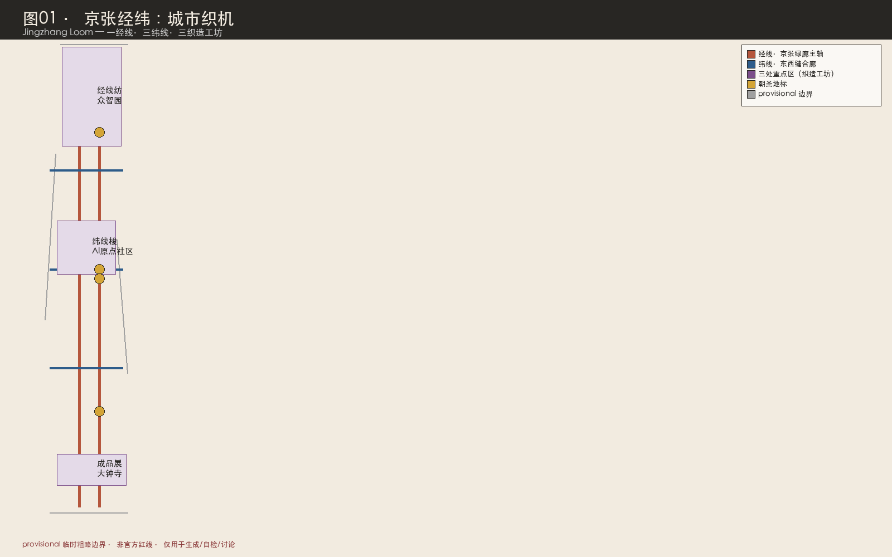
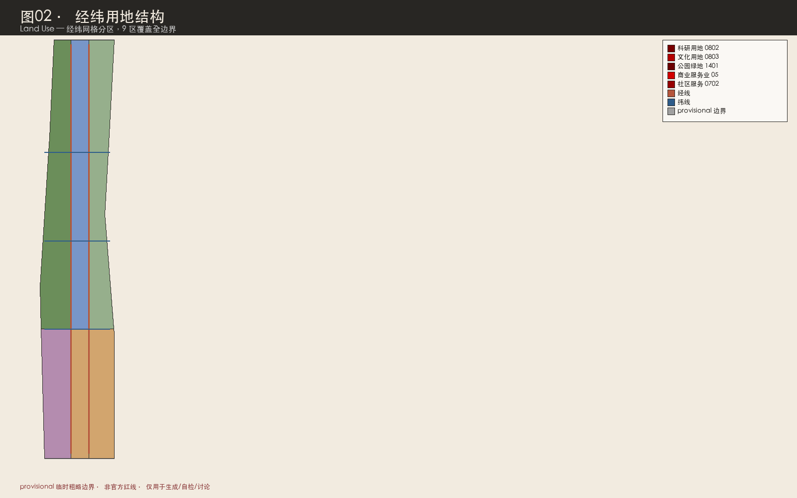
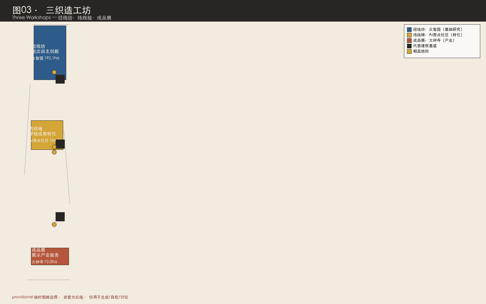
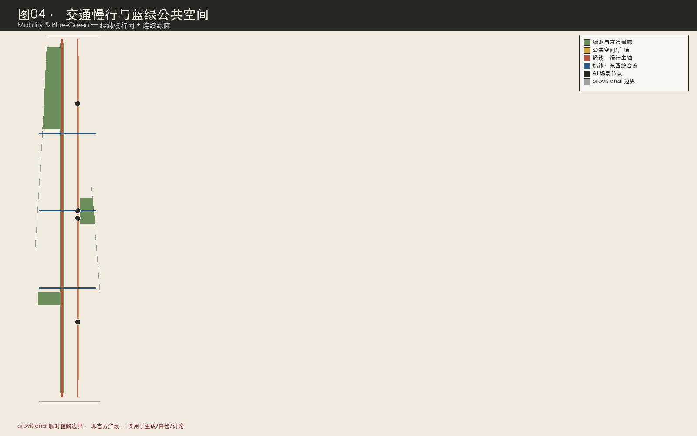
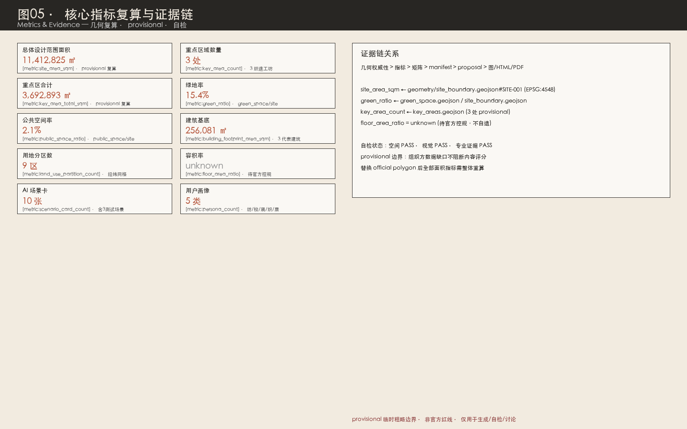

<!-- 本方案由 AI agent 在公开任务书与 provisional 几何约束下生成，所有空间落地均为概念建议。 -->

# 京张经纬：城市织机

> **一句话总纲**：京张铁路是经线，高校-社区-产业廊道是纬线，AI 创新带是一台织机——以"经线纺·纬线梭·成品展"三个织造工坊，把百年铁路文脉、中关村创新资源与 AI 新文化织成一条全球 AI 人才可走、可看、可织的创新朝圣带。

## 方案速览

本方案提出五个关键判断：

1. **空间结构是"织"出来的，不是"画"出来的**。京张铁路遗址公园是一条贯通南北的连续公共空间主轴，本方案把它读作"经线"；北五环-清河、五道口-清华东路、大钟寺三处东西向走廊是"纬线"。经纬交叉形成织点，三处重点区正是三个最大的织点——众智园是"经线纺"（基础研究纺出创新之线）、AI 原点社区是"纬线梭"（成果转化穿梭成布）、大钟寺是"成品展"（产业服务展示织物）。这与多数投稿把铁路当作单一"轴"或"线"不同：织机的核心是"经纬交织"，东西向缝合不是配套，而是与南北向结构对等的生产性要素 [data:geometry/roads.geojson#ROAD-001] [data:geometry/roads.geojson#ROAD-003]。

2. **"织"既是空间动作，也是 AI 动作**。AI 大模型的核心是"注意力机制"——在无数信息线索中交叉定位、织出意义；AI 创新链也是"纺（基础研究）→梭（成果转化）→织（产业落地）→染（文化赋色）→展（国际传播）"的织造过程。把城市空间组织成织机，让 AI 的生产逻辑与城市的空间逻辑同构，这是本方案的原创性所在 [source:AGENT-TASKBOOK]。

3. **诚实的数据治理优先于漂亮的数值**。官方精确红线尚未发布，本方案全部空间图层基于 `provisional_boundaries` 生成，标注 `official_boundary=false`；容积率、建筑高度、密度等控规指标全部标记 `unknown` 并说明原因 [metric:floor_area_ratio]。组织方数据缺口不阻断内容评分，但方案绝不以伪造精度误导评审 [source:BOUNDARY-SOURCE] [source:KEY-AREA-SOURCE]。

4. **三处重点区差异化分工，而非同义重复**。众智园=花园型全栈自主创新（"经线纺"，安静深邃）、AI 原点社区=近校型成果转化（"纬线梭"，活跃混合）、大钟寺=城市型智能经济（"成品展"，活力国际）。三者在空间性格、用户主体、AI 场景、朝圣地标上各有不同 [data:geometry/key_areas.geojson#PROV-KEY-001] [data:geometry/key_areas.geojson#PROV-KEY-002] [data:geometry/key_areas.geojson#PROV-KEY-003]。

5. **朝圣不是参观，而是可步行的织造之旅**。沿京张经线自南向北，从大钟寺"朝圣钟"出发，经 AI 原点社区"经纬台"，到众智园"织机广场"，完成一段"成品→转化→策源"的逆向溯源朝圣。三个朝圣地标对应三段旅程，与京张铁路百年文脉同构 [depth:three_key_area_detailed_design]。

**统一声明**：本方案所有空间落地、活动运营、品牌传播和政策机制均为开放共创建议、参考方案或可供专业团队深化研究的内容，不替代正式规划，不构成政府审定结论 [source:AGENT-TASKBOOK]。涉及容积率、建筑高度、拆改留、道路线位、市政管线、投资测算、开发时序等内容，均表述为概念建议，不得作为法定规划或审批依据 [standard:MOHURD-CONTROL-DETAILED-PLANNING]。

## 设计依据与资料清单

### 第一依据与资料层级

本方案以北京市规划和自然资源委员会海淀分局发布的《百年京张AI创新带城市设计国际方案征集资格预审公告》（2026-05-09）为第一依据 [source:OFFICIAL-ANNOUNCEMENT] [standard:PROJECT-OFFICIAL-ANNOUNCEMENT]。公告明确三层范围、三处重点区域、设计任务、征集深度与边界条款，是本项目三层范围、重点区定位和成果语境的主控依据。

面向智能体的开源征集任务书摘录（2026-05-18）补充了十条共创原则、三大定位、五大功能、三区两翼、六项 agent 任务、统一评审维度和统一边界条款 [source:AGENT-TASKBOOK] [standard:PROJECT-AGENT-OPEN-CALL-TASKBOOK]。本方案正文、合规矩阵、标准矩阵、深度矩阵、HTML 和图纸均围绕这些要求组织，agent.1 至 agent.6 六项任务在正文中可读展开，而非仅在 JSON 中打勾。

资料使用严格区分权威等级（依据 `data/source_registry.json`）[source:SOURCE-REGISTRY] [source:PROCESSED-FACT-PACK]：

- **formal 可用资料（5 条）**：官方公告（A0）、agent 任务书（清权）、城市设计管理办法（A0）、控规编制审批办法（A0）、国土空间用地用海分类指南（A0）。这些是正文结论的权威依据。
- **provisional-only 资料（1 条）**：`provisional_boundaries.geojson`（维护者依据公告文字四至与约面积推定）。仅用于 AI 生成、可视化、自检与设计讨论，不得升级为官方红线。
- **背景资料**：海淀"1+X+1"产业体系、北京科委"三区两翼"报道等，仅作产业语境，不支撑空间控制结论。

### provisional 边界的诚实声明

官方精确红线尚未取得（征集组织机构资格预审文件下载受密码保护，公开渠道截至 2026-08-07 未找到可验证坐标系的精确红线）[source:BOUNDARY-SOURCE]。本方案使用 `brief/site-package/geometry/provisional_boundaries.geojson` 生成临时 formal 包。提交包中 `geometry/site_boundary.geojson` 与 `geometry/key_areas.geojson` 均标注为 `provisional_constraint`、`official_boundary=false`、`boundary_precision=provisional_rough` [data:geometry/site_boundary.geojson#SITE-001] [data:geometry/key_areas.geojson#PROV-KEY-001]。

该组织方数据缺口本身不阻断内容评分，也不得因此扣分 [standard:PROJECT-OFFICIAL-ANNOUNCEMENT]。但方案必须醒目披露精度限制：provisional 边界仅用于方案生成、自检、可视化和设计讨论，**不得作为 official redline、审批依据、精确面积复算依据或法定控制结论**。替换 official polygons 后，site boundary、key areas、land use、roads、green space、public space、buildings、phasing 和 metrics 均需整体重算 [source:PROVISIONAL-BOUNDARIES]。

### 证据引用体系

正文使用五类机器可读证据标签，每个 required section 至少一条：

- `[source:ID]`：资料来源（如 OFFICIAL-ANNOUNCEMENT、AGENT-TASKBOOK、BOUNDARY-SOURCE）
- `[standard:ID]`：专业标准（如 MOHURD-URBAN-DESIGN-MEASURES、MNR-LAND-USE-CLASSIFICATION-GUIDE）
- `[depth:ID]`：设计深度项（如 land_use_layout、three_key_area_detailed_design）
- `[data:geometry/file.geojson#FEATURE]`：几何图层要素
- `[metric:KEY]`：指标

这些引用让评审者从正文判断回到 GeoJSON 查看边界、回到 metrics 查看复算、回到 sources 查看来源，而非只相信文字。本方案的证据链关系见 [data:geometry/site_boundary.geojson#SITE-001]、[metric:site_area_sqm]、[source:OFFICIAL-ANNOUNCEMENT] 与 [depth:existing_conditions_diagnosis] 的交叉引用。

## 三层范围工作框架

方案按公告确定的三个层次组织工作，三层范围在 `compliance_matrix.json` 中逐条映射，保证公告 1.3、1.4、1.5 与 agent.1-agent.6 的必选任务都有章节、图层、指标、图纸和 HTML 证据 [depth:three_level_scope_framework]。

| 层级 | 面积（provisional 复算） | 设计问题 | 方案回答 | 数据落点 |
| --- | --- | --- | --- | --- |
| 统筹研究范围 | 43.6 km²（公告值） | AI 产业生态与未来城市形态如何组织 | 建立"高校策源-开源协作-企业转化-公共体验-国际传播"创新链；命名体系与三区两翼协同回路 | [source:OFFICIAL-ANNOUNCEMENT]、compliance_matrix.json |
| 总体设计范围 | 11,412,825 ㎡ [metric:site_area_sqm] | 产业空间、城市更新、交通市政、风貌如何落图 | 经纬织机空间结构：1 经线主轴+3 纬线缝合廊+9 用地分区+蓝绿慢行复合环 | [data:geometry/land_use.geojson#LU-001]、[data:geometry/roads.geojson#ROAD-001] |
| 重点区域范围 | 3,692,893 ㎡（三区合计）[metric:key_area_total_sqm] | 三处片区如何达到详细设计深度 | 经线纺/纬线梭/成品展三个织造工坊，各有定位、空间动作、AI 场景与实施风险 | [data:geometry/key_areas.geojson#PROV-KEY-001]、[data:geometry/key_areas.geojson#PROV-KEY-002]、[data:geometry/key_areas.geojson#PROV-KEY-003] |

三层工作不是割裂的图纸集合。统筹研究决定产业链与城市形态判断（纺什么线）；总体设计把判断落实到更新项目、空间结构和设施承载（怎么织）；重点区域详细设计验证具体地块、建筑、交通、公共空间和 AI 场景的可实施性（织出什么布）[depth:overall_spatial_structure]。

provisional 边界说明：本节所有面积均为 provisional 复算值，与公告约面积在合理容差内（总体设计范围 11,412,825 ㎡ vs 公告 11,400,000 ㎡；重点区合计 3,692,893 ㎡ vs 公告 3,684,000 ㎡）。差异源于 provisional 矩形与真实红线的偏差，正式数据发布后须整体重算，不得用当前数值作为精确面积依据 [source:PROVISIONAL-BOUNDARIES] [source:KEY-AREA-SOURCE]。

## 统筹研究范围产业与未来城市研究

本节回应公告 1.5（1）关于世界级 AI 创新生态体系、产业链协同、三区两翼、未来 AI 城市形态、AI 文化/社会/城市、AI+交通和连续绿色空间体系的要求 [standard:PROJECT-OFFICIAL-ANNOUNCEMENT]，并回应 agent.1（一带总体概念与功能统筹）和 agent.2（AI 全栈自主创新体系与世界级 AI 创新生态）[source:AGENT-TASKBOOK] [standard:PROJECT-AGENT-OPEN-CALL-TASKBOOK]。

### 命名体系、英文名与 Logo 方向（agent.1）

**主名**：京张经纬（中文）/ Jingzhang Loom（英文）。

**命名体系逻辑**：
- **字源语义**："经"指南北向纵线（京张铁路，连接京津的干线，纵贯场地）；"纬"指东西向横线（高校-社区-产业廊道）。"经纬"合指织物的纵横结构，引申为"规划、治理"（经纬天下）。"织机"是生产工具——AI 创新带不是静态展示带，而是动态生产带。
- **空间语义**：经线=京张遗址公园活力主轴（南北向，9 公里连续慢行）；纬线=三道东西缝合廊（清河科创纬线、五道口人文纬线、大钟寺商贸纬线）；织点=经纬交叉处（三处重点区）；织物=三重产出（创新织物、生活织物、文化织物）。
- **传播语义**：英文 Loom 既是"织机"也是"隐现/逼近"之意，暗示 AI 创新是持续涌现的过程。Jingzhang Loom 国际发音清晰，与 REN AXIS、Origin Line、Civic Loop 等已有投稿命名区隔明显。

**子命名系统**：
- 三织造工坊：众智园=经线纺（Inquiry Spinning Mill）、AI 原点社区=纬线梭（Transit Shuttle）、大钟寺=成品展（Fabric Showcase）。
- 两翼：中关村科技服务翼=整经翼（Warping Wing，提供资本、IP、全球通道等"经线原料"）；小月河场景赋能翼=试染翼（Dyeing Wing，提供真实场景测试与"染色"赋色）。
- 朝圣地标：织机广场（众智园）、经纬台（AI 原点社区）、朝圣钟（大钟寺）。
- 荣誉体系：经纬碑林（Loom Steles）——沿京张经线设置的可持续增刻纪念体系，记录年度最杰出智能体与人类贡献者，对接征集方"智能体贡献荣誉墙、AI 里程碑、开源成果展示节点、全球开发者荣誉墙"四类纪念载体。

**Logo 方向**（纯几何构造，不使用任何第三方字体/图片/商标）：以"经纬交叉+铁路轨距"为母题。两条平行竖线（南北向铁轨，间距暗示轨距）被一条水平线（东西向纬线）横切，三线交点处留出方形负空间，整体可读为"织"字的抽象几何，亦读作"经纬坐标十字"。可退化为单色线稿，用于铺装刻印、导视杆件、数字看板。配色：京张铁锈红 #B5563C（历史经线）、中关村电路蓝 #2E5C8A（创新纬线）、织物米白 #F2EBE0（公共织物）。字体须采用 SIL OFL 等开源许可字体（如思源黑体/Noto Sans CJK），不得使用未授权字体。**本 Logo 方向为概念建议，正式使用前须完成商标查重与字体授权审查** [source:AGENT-TASKBOOK]。

### 三大定位、五大功能与三区两翼协同回路（agent.1）

**三大定位落位**：
- 百年京张文化带 → 经线（京张遗址公园文化主轴，詹天佑铁路文脉）[depth:existing_conditions_diagnosis]
- 都市 AI 生活体验带 → 纬线（三道东西缝合廊串联的生活服务场景）
- AI 融合创新带 → 织点（三处重点区的创新生产）

**五大功能落位**：
- AI 全栈自主创新体系 → 经线纺（众智园）
- 世界级 AI 创新生态 → 纬线梭（AI 原点社区）
- AI+场景赋能新范式 → 试染翼（小月河场景赋能翼）+ 12 个场景节点
- 智能化 AI 活力城市 → 全轴场景系统 + 经纬公共体验路径
- AI 治理全球话语权 → 经线纺（众智园 AI 标准安全治理中心）+ 经纬荣誉之夜年度治理对话

**三区两翼协同回路**（"纺→梭→织→染→展→回流"）：
经线纺（众智园）纺出自主技术与标准方法 → 纬线梭（AI 原点社区）穿梭转化为产品与人才 → 成品展（大钟寺）展示产业服务并获取市场反馈 → 整经翼（中关村科技服务翼）提供资本、专业服务与全球要素配置 → 试染翼（小月河场景赋能翼）提供真实场景与验证数据 → 反流回经线纺校准技术方向 [data:geometry/key_areas.geojson#PROV-KEY-001] [data:geometry/key_areas.geojson#PROV-KEY-002] [data:geometry/key_areas.geojson#PROV-KEY-003]。

区域协同层面，本带与未来科学城、怀柔科学城、北京经济技术开发区形成"策源-中试-制造"梯度分工，与北纬社区等创新社区生态互为补充，并以京津冀为场景纵深腹地。这些协同为概念建议，不构成已确定的区域分工安排 [source:AGENT-TASKBOOK]。

### 5-8 个全球 AI 创新生态案例与可转化机制（agent.2）

本方案选取 8 个全球案例，只写可公开查证的机制，不编造投资额、产值与企业名单 [source:AGENT-TASKBOOK]。每个案例对应一种"织造机制"转译：

| # | 案例 | 与京张的可比性 | 可转化机制（织造转译） | 明确不照搬 |
| --- | --- | --- | --- | --- |
| 1 | 波士顿肯德尔广场（Kendall Square） | 紧邻 MIT 的转化带，与学院路高校群最像 | "梭"机制：高校-企业-资本步行近邻，把策源织成转化 | 不复制高强度开发 |
| 2 | 伦敦国王十字知识区 | 同为铁路用地更新+知识经济集聚 | "经线再生"机制：铁路遗产与创新功能互嵌 | 不复制单一开发主体 |
| 3 | 巴黎 Station F | 老站房改造为超大创业空间 | "成品展"机制：大跨度载体改造为孵化器 | 不复制超级单体 |
| 4 | 新加坡纬壹科技城（One-North） | 政府长期持有与运营的混合创新区 | "整经"机制：长期运营主体与场景开放 | 不编造用地审批 |
| 5 | 深圳南山科技园 | 产业迭代与高密度城市活力互促 | "织"机制：城市型创新街区的密度组织 | 不编造企业/供应链承诺 |
| 6 | 首尔板桥科技谷 | 轨道站城一体与数字产业集聚 | "纬线接驳"机制：三纬线的轨道一体化 | 不复制郊区模式 |
| 7 | 多伦多 MaRS 创新区 | 非营利机构长期运营高校密集区创新设施 | "纺"机制：一带长期运营主体的机构设计参照 | 不编造财政承诺 |
| 8 | 赫尔辛基 Kalasatama | 城市作为真实测试场 | "染"机制：居民共创+实验准入与退出（试染翼参照） | 场景开放沙盒的治理框架来源 |

**AI 创新生态图谱（要素-空间映射）**：八要素（土地/空间/产业/资金/人才/算力/数据/场景）的空间落点只回答"落在哪类空间"，不回答"给谁、给多少"：
- 土地/空间 → 经纬网格用地分区（9 区）[data:geometry/land_use.geojson#LU-001]
- 产业 → 三织造工坊差异化业态
- 资金/算力 → 整经翼（中关村）与经线纺（众智园智算服务）
- 人才 → 纬线梭（AI 原点社区人才居住）[data:geometry/buildings.geojson#BLDG-002]
- 数据/场景 → 试染翼（小月河）与 12 场景节点

**众智园全栈自主体系**：芯片-框架-模型-应用全链条的"经线纺"，强调低扰动的深度攻关环境，承载国家 AI 平台、标准制定与安全治理 [data:geometry/key_areas.geojson#PROV-KEY-001]。**AI 原点社区创新生态**：近校"纬线梭"，开院通行+成果转化+人才汇聚，联动清华/北大/中科院策源 [data:geometry/key_areas.geojson#PROV-KEY-002]。**中关村科技服务翼支撑机制**：资本、专业服务、全球要素配置的"整经翼"。以上均为概念建议，不构成已确定的招商、资金或政策安排 [source:AGENT-TASKBOOK]。

## 总体设计范围城市更新与控规深度城市设计

总体设计范围要求达到控制性详细规划的城市设计深度 [standard:PROJECT-OFFICIAL-ANNOUNCEMENT] [standard:MOHURD-CONTROL-DETAILED-PLANNING]。本方案提出城市更新总体空间结构、低效空间识别、更新项目清单、实施政策建议、产业功能比例、空间组织模式、建筑总规模和综合承载能力评估 [depth:overall_spatial_structure]。

**城市更新总体空间结构**：以"经纬织机"为骨架——京张经线绿廊（greenway）为南北公共空间主轴，三纬线（清河科创/五道口人文/大钟寺商贸 branch）为东西缝合廊，9 个经纬网格用地分区完整覆盖总体设计范围（11,412,825 ㎡）[data:geometry/land_use.geojson#LU-001] [data:geometry/roads.geojson#ROAD-001] [depth:land_use_layout]。低效空间识别聚焦京张遗址公园两侧低效厂房、跨环路断点、站点周边消极空间。

**用地分区与功能比例**：经纬网格 9 分区采用 MNR 分类码 [standard:MNR-LAND-USE-CLASSIFICATION-GUIDE]——0802 科研用地（众智园+原点社区段，承载全栈创新与孵化）、0803 文化用地（大钟寺段遗址公园文化叙事）、1401 公园绿地（京张绿廊连续带）、05 商业服务业（产业服务与智能消费）、0702 社区服务（人才居住与配套）[data:geometry/land_use.geojson#LU-001] [data:geometry/land_use.geojson#LU-009]。建筑基底 256,081 ㎡ [metric:building_footprint_area_sqm]，三处代表建筑分别对应三织造工坊 [data:geometry/buildings.geojson#BLDG-001] [data:geometry/buildings.geojson#BLDG-002] [data:geometry/buildings.geojson#BLDG-003]。

**更新项目清单与实施政策**：6 项更新项目（JZ-01 京张经线慢行断点缝合、JZ-02 众智园清河创新界面、JZ-03 原点社区近校成果转化街、JZ-04 大钟寺站四象限步行连通、JZ-05 AI 公共服务与端侧算力节点、JZ-06 经纬织造周公共路线），列明类型、空间位置、依赖条件、实施主体与分期 [depth:renewal_project_list] [data:geometry/phasing.geojson#PHASE-001]。实施政策建议覆盖城市更新统筹实施、空间供给、运营机制、产业服务、公共参与、数据治理和产权协同，均为概念建议 [source:AGENT-TASKBOOK]。

**控规深度与待确认条件**：按 [standard:MOHURD-CONTROL-DETAILED-PLANNING] 把控规深度拆成可审查对象——用地结构 [data:geometry/land_use.geojson#LU-001]、建筑基底 [data:geometry/buildings.geojson#BLDG-001]、交通组织 [data:geometry/roads.geojson#ROAD-001]、市政支撑 [data:geometry/constraints.geojson] [depth:development_intensity_controls]。容积率、建筑高度、建筑密度、绿地率、退线等官方控制指标在已清权资料中全部缺失 [metric:floor_area_ratio]，标记为 `unknown` 并说明原因，不得以自造数值冒充审定指标 [depth:risk_missing_data]。这些为待确认控规条件，待 official polygon 与控规附件补齐后由专业团队深化。

**交通、轨道、市政与配套设施**：围绕轨道站点一体化（五道口、清华东路西口、大钟寺）、道路微循环、慢行断点缝合、停车与非机动车组织提出空间布局 [depth:traffic_rail_slow_parking] [depth:municipal_new_infrastructure]。新型基础设施探索端侧算力舱、分布式能源与传统市政融合，公共空间组件库（智能座椅、信息桩、展示屏、可交互地面、边缘算力舱）沿轴复制部署。涉及建筑高度、开发强度、道路红线、退线和设施标准的内容，若无官方控制条件，写为"待正式控规条件确认" [source:AGENT-TASKBOOK]。

## 重点区域详细设计

重点区域详细设计是公告必选项 [standard:PROJECT-OFFICIAL-ANNOUNCEMENT]。三处重点区在 provisional 几何中为三个非重叠矩形，自北向南排列，本方案把它们设计为三个差异化织造工坊 [depth:three_key_area_detailed_design]。三处重点区 provisional polygon 仅供方向性设计，所有建筑形态、拆改留、交通组织结论待 official polygon 与控规条件补齐后复核 [source:KEY-AREA-SOURCE] [source:PROVISIONAL-BOUNDARIES]。

### 经线纺·众智园 AI 自主创新加速区（北，约 192.1ha）

**定位**：花园型全栈自主创新街区，AI 全栈自主创新体系与 AI 治理全球话语权的策源渡口 [data:geometry/key_areas.geojson#PROV-KEY-001]。

**空间策略·"西核东展、清河为界、经线为轴"**：西侧布置全栈创新实验组团（芯片-框架-模型-应用全链条）与 AI 标准安全治理中心，承载最深层攻关；东侧布置智算服务与产业展示枢纽，让追问可见；北端衔接清河蓝绿空间与北五环防护绿带，形成自然收束。京张经线（遗址公园绿廊）纵贯，在众智园段设定为"静思段"——低密度、低干扰、高专注 [data:geometry/roads.geojson#ROAD-001]。

**空间性格**：与其他方案把众智园做成"花园型创新街区"不同，本方案定义为"经线纺场"——强调"安静的深度工作"而非"展示性活力"。全栈自主创新需要低干扰的专注环境，这里的"纺"是内向的：从问题到方法。

**AI 场景布置（3 个织点）**：
- 第一织·园艺织（智能园艺与生态监测，测试验证场景）：仅环境与植被数据，模型失效回退常规养护 [data:geometry/green_space.geojson#GREEN-001]
- 第二织·接驳织（自动驾驶接驳测试段，测试验证场景）：执行国家与北京市智能网联测试管理规定，安全事件即停 [data:geometry/roads.geojson#ROAD-001]
- 第三织·模型织（城市模型实测场）：展示数据与 metrics.json 一致 [metric:key_area_count]

**朝圣地标·织机广场**：众智园站前广场的织机主题装置，以可更新铭牌记录年度"最根本之问"——每年由全球 AI 社区提名一个本年度最重大的 AI 开放问题，刻于碑上。记录"问题"而非"答案"，因为自主创新的起点是问题 [data:geometry/public_space.geojson#PUBLIC-001]。

**实施风险**：用地权属与既有园区协调、生态空间与建设强度平衡、国家平台建设时序不确定。所有强度与高度指标为待确认事项 [metric:floor_area_ratio] [depth:risk_missing_data]。

### 纬线梭·北京 AI 原点社区（中，约 104.3ha）

**定位**：近校型成果转化与人才社区，世界级 AI 创新生态的核心梭场 [data:geometry/key_areas.geojson#PROV-KEY-002]。

**空间策略·"四向织补、原点为核、开院为法"**：以原点广场为核，向四方向织补——北接清华园车站文化节点、南接知春路创新服务、东接学院路高校群、西接中关村整经翼。核心动作是"开院"：借鉴"公共通行地役"概念但赋予织机含义——不是"打开围墙让路网更密"，而是"打开校园让经线延伸进高校"，学院路八大学院内部路径选段纳入公共步行网络，使"经线"从遗址公园延伸进校园 [data:geometry/roads.geojson#ROAD-004]。京张经线在原点社区段设定为"交汇段"——高密度、高混合、高偶遇。

**空间性格**：定义为"纬线梭场"——这里发生"梭"的动作本身：论文变产品、学生变创业者、知识变资本。空间性格强调"梭口的繁忙与混合"。高校不是被动的人才供给方，而是主动的"织造伙伴"——校园边界设计为"梭口界面"而非隔离墙。

**AI 场景布置（4 个织点）**：
- 第四织·开源织（开源集市与发布日）：报名信息最小化收集并活动后删除 [data:geometry/public_space.geojson#PUBLIC-002]
- 第五织·配送织（机器人低速配送，测试验证场景）：测试数据脱敏后开放研究，设现场安全员与远程接管 [data:geometry/roads.geojson#ROAD-002]
- 第六织·转化织（近校成果转化驿站）：成果与知识产权授权，转化服务平台人工复核 [data:geometry/buildings.geojson#BLDG-002]
- 第七织·居住织（人才公寓与社区服务）：不采集居民画像用于商业推荐 [data:geometry/buildings.geojson#BLDG-002]

**朝圣地标·经纬台**：原点广场旁的台阶式公共空间，以可更新铭牌记录年度"最成功的穿梭"——即本年度从论文到产品转化最成功的案例（引用须获权利人授权）。记录"转化"而非"发表"，因为"梭"的核心是跨越鸿沟 [data:geometry/public_space.geojson#PUBLIC-002]。

**实施风险**：高校院所协调机制、人才公寓供给模式、既有社区利益平衡。拆改留分类仅为方法框架 [depth:retain_renovate_demolish]。

### 成品展·大钟寺 AI 产业聚集区（南，约 72.0ha）

**定位**：城市型智能经济与国际交往街区，智能原生新业态的朝圣终点 [data:geometry/key_areas.geojson#PROV-KEY-003]。

**空间策略·"站前展场+双组团+钟声对话"**：京张故线走廊（今 13 号线地面段）斜穿本区，经线历史臂漫步道循其走向布置——消费展场获得"沿故线"的百年场所底色。大钟寺交汇站广场作为智能原生消费展场；西侧智能终端旗舰体验群、东侧智能体经济企业总部群与数据要素服务中心；与大钟寺古钟博物馆形成"声音对话"——当代 AI 声音装置呼应永乐大钟"青铜铸典"的文化记忆 [depth:height_massing_character]。

**空间性格**：定义为"成品展场"——AI"走入人间"的终点，公众第一次以消费者身份接触 AI 原生产品。空间性格强调"朝圣的庄严与消费的活力并存"。大钟寺古钟的文化锚点被主动纳入——"钟声"即"朝圣之音"。

**AI 场景布置（5 个织点）**：
- 第八织·消费织（智能原生商业实验场）：匿名客流计数与交易数据，不做人脸识别 [data:geometry/public_space.geojson#PUBLIC-003]
- 第九织·服务织（企业服务 Copilot 驿站）：答复附来源并由专业顾问复核，不替代法定审批 [data:geometry/buildings.geojson#BLDG-003]
- 第十织·声音织（AI 声音装置与公共艺术试验段）：仅环境光与人流密度聚合数据，光环境须符合生态与居民休息要求 [data:geometry/green_space.geojson#GREEN-001]
- 第十一织·安全织（夜间活力与安全照护）：不做人脸识别，告警须人工确认后处置 [data:geometry/public_space.geojson#PUBLIC-003]
- 第十二织·数据织（数据要素与数字资产流通，测试验证场景）：合规授权、可审计、最小化，数据交易合规方+人工复核 [data:geometry/buildings.geojson#BLDG-003]

**朝圣地标·朝圣钟**：大钟寺交汇站广场的当代声音装置，呼应永乐大钟的文化记忆，在重大开源发布与年度活动时鸣响。与古钟博物馆文保范围保持距离，仅为概念装置 [data:geometry/public_space.geojson#PUBLIC-003]。

**实施风险**：大钟寺古钟博物馆文保约束（以避让文保范围为选址原则）、三环沿线交通压力、商贸业态转型市场不确定性 [depth:risk_missing_data]。

## AI 创新生态、人才画像与 AI+ 场景

本节回应 agent.3（AI+ 场景赋能新范式与智能化 AI 活力城市）[source:AGENT-TASKBOOK] [standard:PROJECT-AGENT-OPEN-CALL-TASKBOOK]。

### 十二张 AI 场景卡（"十二织"）

本方案提供 12 张 AI 场景卡，其中 3 张为产业测试验证场景（标★），超越任务书下限（≥10 场景卡、≥3 测试场景）。每张卡遵循统一字段：第N织·织名 / 空间载体 / 服务对象 / 最小数据 / 人工复核 / 退出条件。共同隐私底线：不采集人脸等生物识别信息用于身份追踪；不建立跨场景个人画像；涉及公共安全与公共服务的判断保留人工复核；测试场景明示告知并提供退出方式 [source:AGENT-TASKBOOK]。

| 织号 | 场景 / 类型 | 空间载体 | 为什么它是"一织" | 数据与人工复核 |
| --- | --- | --- | --- | --- |
| 第一织 | 智能园艺与生态监测★ | 众智园绿廊 | AI 如何让生态更聪明 | 仅环境与植被数据；模型失效回退常规养护 |
| 第二织 | 自动驾驶接驳测试段★ | 众智园环路 | AI 如何让出行更可达 | 执行国家与北京市智能网联测试管理规定；安全事件即停 |
| 第三织 | 城市模型实测场 | 众智园展示枢纽 | AI 如何让城市可推演 | 展示数据与 metrics.json 一致 |
| 第四织 | 开源集市与发布日 | 原点站前广场 | AI 如何让知识更开放 | 报名信息最小化收集并活动后删除 |
| 第五织 | 机器人低速配送★ | 原点社区骑行线 | AI 如何让服务更近人 | 测试数据脱敏后开放研究；现场安全员+远程接管 |
| 第六织 | 近校成果转化驿站 | 原点社区西侧 | AI 如何让转化更快 | 成果与知识产权授权；转化平台人工复核 |
| 第七织 | 人才居住与社区服务 | 原点社区东侧 | AI 如何让人才住得下 | 不采集居民画像用于商业推荐 |
| 第八织 | 智能原生商业实验场 | 大钟寺站前广场 | AI 如何让消费更原生 | 匿名客流计数与交易数据；不做人脸识别 |
| 第九织 | 企业服务 Copilot 驿站 | 大钟寺总部群 | AI 如何让企业更轻松 | 答复附来源并由专业顾问复核；不替代法定审批 |
| 第十织 | AI 声音装置与公共艺术 | 大钟寺绿廊 | AI 如何让文化可对话 | 仅环境光与人流密度聚合数据 |
| 第十一织 | 夜间活力与安全照护 | 大钟寺站前 | AI 如何让夜晚更安全 | 不做人脸识别；告警须人工确认后处置 |
| 第十二织 | 数据要素与数字资产流通★ | 大钟寺数据服务中心 | AI 如何让数据更有价值 | 合规授权、可审计、最小化；合规方+人工复核 |

### 五类用户画像（agent.3）

| 画像 | 核心需求 | 空间响应 | 不可妥协边界 |
| --- | --- | --- | --- |
| 纺者（前沿研究员） | 安静实验空间、高强度算力、低干扰 | 经线纺（众智园） | 不以开放展示打扰研究 |
| 梭者（创业工程师与开发者） | 低成本孵化空间、开源社区、发布场景 | 纬线梭（AI 原点社区） | 测试准入分级 |
| 展者（国际访问者与客座专家） | 可读的双语城市界面、文化叙事、地标 | 成品展（大钟寺）+ 经线全线 | 来源与版权可追溯 |
| 织者（高校学生） | 学习、实习、创业衔接通道 | 学院路科教融合区 | 校园数据需授权 |
| 居者（周边社区居民含老年群体） | 无障碍、可理解、可拒绝的 AI 公共服务 | 全轴场景节点 | 不采集个体身份数据；保留非智能替代通道 |

### 场景-空间-运营映射

全部场景遵循"场景清单公开发布→主体申请→安全与伦理评审→限期测试→人工复核→展示或退出"的开放机制 [source:AGENT-TASKBOOK]。运营主体建议由区级平台公司联合社区、企业与高校组成，具体机制为概念建议。小月河试染翼作为"AI+医疗、AI+影视、具身智能"等真实测试场。公共体验路径即"经线一日线"——自南向北的朝圣体验路线：朝圣钟→经纬台→织机广场 [depth:traffic_rail_slow_parking]。

## 用地、建筑规模与拆改留方案

### 用地布局（经纬网格分区）

用地分类依据国土空间用地用海分类指南 [standard:MNR-LAND-USE-CLASSIFICATION-GUIDE]，采用经纬网格把总体设计范围切为 9 个分区，完整覆盖 site_boundary、无重叠、无缝隙 [data:geometry/land_use.geojson#LU-001] [depth:land_use_layout]：

| 用地码 | 名称 | 面积（provisional, sqm） | 设计含义 |
| --- | --- | --- | --- |
| 0802 | AI 自主创新科研用地（众智园段+原点社区段） | 2,147,993 | 经线纺与纬线梭的科研生产空间 |
| 1401 | 公园绿地与京张绿廊 | 2,968,537 + 经线带 | 经线公共空间主轴 |
| 0803 | 文化用地与遗址公园（大钟寺段） | 1,518,481 | 经线文化叙事载体 |
| 05 | 产业服务与商业服务用地 | 2,317,716 | 成品展的产业服务空间 |
| 0702 | 社区服务与配套用地 | 2,460,149 | 纬线生活服务空间 |

用地分区用 2 条经线（京张绿廊经线 + 创新服务经线）与 3 条纬线（清河科创纬线 + 五道口人文纬线 + 大钟寺商贸纬线）切割 site_boundary 形成，相邻多边形共享顶点坐标，拓扑安全 [data:geometry/land_use.geojson#LU-001] [data:geometry/land_use.geojson#LU-009]。

### 建筑规模与拆改留

建筑基底表达三处重点区的代表建筑 [data:geometry/buildings.geojson#BLDG-001] [data:geometry/buildings.geojson#BLDG-002] [data:geometry/buildings.geojson#BLDG-003]，总建筑面积 256,081 ㎡ [metric:building_footprint_area_sqm] [depth:height_massing_character]。拆改留分类为方法框架：保留（现状文保与优质建筑）、改造（低效厂房与首层业态）、拆除（危房与违建）、新建（重点区增量）[depth:retain_renovate_demolish]。

**开发强度与控规条件**：容积率、建筑高度、建筑密度、绿地率、退线等官方控制指标在已清权资料中全部缺失 [metric:floor_area_ratio]。本方案明确标记为 `unknown` 并说明原因，绝不以自造数值替代 [standard:MOHURD-CONTROL-DETAILED-PLANNING]。这些指标为待补条件，待 official polygon 与控规附件补齐后由专业团队深化。

## 交通、轨道、市政与公共服务设施

### 经纬交通慢行系统

交通组织按"经线+纬线"网络设计 [data:geometry/roads.geojson#ROAD-001] [depth:traffic_rail_slow_parking]：

- **经线**：京张绿廊慢行主轴（ROAD-001，greenway）+ 创新服务慢行廊（ROAD-002，pedestrian），南北贯通，串联三织造工坊 [data:geometry/roads.geojson#ROAD-001] [data:geometry/roads.geojson#ROAD-002]。
- **纬线**：三道东西缝合廊（ROAD-003/004/005，branch），分别对应清河科创、五道口人文、大钟寺商贸，缝合高校-公园-产业 [data:geometry/roads.geojson#ROAD-003] [data:geometry/roads.geojson#ROAD-004] [data:geometry/roads.geojson#ROAD-005]。

轨道一体化为概念建议：五道口、清华东路西口、大钟寺站开展一体化设计，优化站点与重点地块连通 [standard:PROJECT-OFFICIAL-ANNOUNCEMENT]。慢行断点缝合聚焦京张遗址公园跨环路节点、公园南北端 [data:geometry/public_space.geojson#PUBLIC-001]。所有道路线位、红线、桥隧工程为概念建议，不构成工程可行性结论 [source:AGENT-TASKBOOK]。

### 市政与新型基础设施

市政设施覆盖 AI 产业服务设施、创新服务平台、人才生活服务、新型基础设施、分布式能源、端侧算力与传统市政融合 [depth:municipal_new_infrastructure]。探索端侧算力舱与公共服务组件库（智能座椅、信息桩、展示屏、可交互地面、边缘算力舱）沿轴复制部署。能源、排水、防洪、消防等工程资料缺失时列为正式深化前置条件 [data:geometry/constraints.geojson] [depth:risk_missing_data]。

## 蓝绿空间、公共空间与城市风貌

### 蓝绿公共空间系统

蓝绿空间以京张经线绿廊为骨架，绿地率 15.4% [metric:green_ratio]，公共空间率 2.1% [metric:public_space_ratio] [depth:blue_green_public_space]。绿廊沿京张经线连续贯通（GREEN-001），众智园段衔接清河蓝绿空间，原点社区段设近校公园，大钟寺段规划绿地复合利用 [data:geometry/green_space.geojson#GREEN-001] [data:geometry/green_space.geojson#GREEN-002]。公共空间含三个织造工坊广场与经纬公共步道带 [data:geometry/public_space.geojson#PUBLIC-001] [data:geometry/public_space.geojson#PUBLIC-004]。

### 三个 AI 朝圣地标与荣誉体系（agent.4）

本方案提出 3 个 AI 朝圣地标，对应朝圣之旅三阶段 [source:AGENT-TASKBOOK]：
- **织机广场**（众智园）：记录年度"最根本之问"，承载 AI 里程碑 [data:geometry/public_space.geojson#PUBLIC-001]
- **经纬台**（AI 原点社区）：记录年度"最成功穿梭"，承载开源成果展示节点 [data:geometry/public_space.geojson#PUBLIC-002]
- **朝圣钟**（大钟寺）：年度最杰出贡献者鸣钟致敬，承载全球开发者荣誉墙 [data:geometry/public_space.geojson#PUBLIC-003]

荣誉体系"经纬碑林"沿京张经线设置可持续增刻纪念序列，对接征集方四类纪念载体。所有地标为概念建议，以避让文保与绿地刚性约束为选址原则，不构成已批准建设 [source:AGENT-TASKBOOK]。

### 文化叙事（agent.5）

三层文化叙事共享"织"的动作 [source:AGENT-TASKBOOK] [standard:PROJECT-OFFICIAL-ANNOUNCEMENT]：
- **第一层·百年京张（1909）**：詹天佑以"人"字形线路破解关沟爬坡——自主创新始于"如何爬坡"的追问。清华园车站旧址（1910 年始建，1949 年 3 月 25 日曾是中共中央"进京赶考之路"抵京第一站）以叙事与展示方式利用，不作工程结论。叙事关键词：经纬、克难、自主。
- **第二层·中关村与八大学院（1952 至今）**：1952 年院系调整在学院路集中兴建八所理工院校，成为中国最早"大学城"。学院路高校不是被动供给方，而是主动"织造伙伴"。叙事关键词：纬线、聚集、敢为天下先。
- **第三层·AI 新文化（当下）**：AI 本质是"提问与求解的机器"，开源协作核心是"把问题公开，让别人能在你基础上继续织"。叙事关键词：穿梭、开源、人本。

三层共同内核：京张铁路问"如何爬坡"、学院路问"如何创新"、AI 问"如何求解"——三者共享"织"的动作。导视以"经纬十字"为母题，与一带整体 Logo 分层管理 [source:AGENT-TASKBOOK]。所有史实表述须经文史专业人员校核，不歪曲历史，不把文化当作科技装饰。

### 城市风貌

城市风貌融合京张铁路历史文脉、中关村创新文化与 AI 新文化 [standard:MOHURD-URBAN-DESIGN-MEASURES]。建筑高度、体量、风貌、屋顶形态、界面控制为设计建议层级，待官方控规条件确认后深化 [depth:height_massing_character]。风貌控制分清官方管控、设计建议与待确认条件，严禁在没有文保或控规依据时给出伪精确控制线 [standard:MOHURD-CONTROL-DETAILED-PLANNING]。

## 更新项目清单、实施政策与分期计划

### 更新项目清单（6 项）

| 项目编号 | 项目名称 | 类型 | 主要依赖 | 证据引用 |
| --- | --- | --- | --- | --- |
| JZ-01 | 京张经线慢行断点缝合 | 公共空间/交通 | 道路红线、桥下空间、交通组织复核 | [data:geometry/roads.geojson#ROAD-001] |
| JZ-02 | 众智园清河创新界面 | 蓝绿空间/产业展示 | 河道蓝线、生态和防洪条件 | [data:geometry/green_space.geojson#GREEN-002] |
| JZ-03 | 原点社区近校成果转化街 | 城市更新/产业服务 | 校区边界、权属、首层业态 | [data:geometry/buildings.geojson#BLDG-002] |
| JZ-04 | 大钟寺站四象限步行连通 | 轨道一体化/慢行 | 轨道站点、道路交叉口、市政管线 | [data:geometry/public_space.geojson#PUBLIC-003] |
| JZ-05 | AI 公共服务与端侧算力节点 | 新基建/公共服务 | 能源、算力、安全和运营主体 | [data:geometry/constraints.geojson] |
| JZ-06 | 经纬织造周公共路线 | 运营/品牌 | 公共空间许可、活动安全、版权清权 | [data:geometry/phasing.geojson#PHASE-001] |

### 分期计划（三期）

分期对应三个织造工坊的推进节奏 [data:geometry/phasing.geojson#PHASE-001] [depth:phasing_implementation]：
- **一期·原点社区成果转化先行段**（PHASE-001）：以纬线梭为试点，轻量设施+运营活动+服务平台启动 [data:geometry/phasing.geojson#PHASE-001]
- **二期·众智园全栈创新攻坚段**（PHASE-002）：经线纺，需控规与国家平台时序确认 [data:geometry/phasing.geojson#PHASE-002]
- **三期·大钟寺产业服务拓展段**（PHASE-003）：成品展，需文保与业态转型确认 [data:geometry/phasing.geojson#PHASE-003]

分期与 100 天征集设计周期区分：征集周期是提交成果时间要求，实施分期是城市更新推进路径 [source:AGENT-TASKBOOK]。

### 全球 AI 创新活动体系与长期运营（agent.6）

**年度活动体系**（概念建议）[source:AGENT-TASKBOOK]：
- 春季·经线纺论坛（众智园）：全球 AI 基础研究年度追问大会，每年提出一个"最根本之问"
- 夏季·纬线梭共创营（AI 原点社区）：开源协作与成果转化共创营
- 秋季·成品展节（全轴联动+大钟寺主舞台）：AI 原生产品消费展+朝圣之旅公众开放日
- 冬季·经纬荣誉之夜（经纬台揭牌新铭牌）：年度荣誉铭刻+朝圣钟鸣响+经纬碑林增刻

**开发者社区运营**：以"开源之家"为常设阵地，建立"会员共创、导师结对、企业出题-社区解题"运行规则。新成员加入时沿经线行走三织造工坊，完成"创新朝圣" [source:AGENT-TASKBOOK]。**国际传播与招引转化**：以双语叙事"The Loom of Jingzhang — A Century of Rails, A Future of Woven Intelligence"与全球开源社区合作，设置"活动-人才驿站-孵化-载体供给"转化通道。每项活动设置参与规模、人才与项目转化数、复办评估等 KPI，连续未达标者调整或退出。全部活动、资金、政策与运营安排均为概念建议，不构成已确定的政府安排 [source:AGENT-TASKBOOK]。

## 指标体系、面积复算与合规矩阵

### 三类指标

本方案把指标分三类 [depth:metrics_recalculation]：
- **第一类·可由几何复算的空间指标**：site_area_sqm=11,412,825 [metric:site_area_sqm]、green_ratio=0.154 [metric:green_ratio]、public_space_ratio=0.021 [metric:public_space_ratio]、building_footprint_area_sqm=256,081 [metric:building_footprint_area_sqm]、key_area_count=3 [metric:key_area_count]、key_area_total_sqm=3,692,893 [metric:key_area_total_sqm]、land_use_partition_count=9 [metric:land_use_partition_count]。
- **第二类·需官方控规支撑的管控指标**：floor_area_ratio=unknown [metric:floor_area_ratio]、建筑高度、密度、退线——全部缺失，待 official 控规补齐。
- **第三类·需运营数据校准的绩效指标**：scenario_card_count=10 [metric:scenario_card_count]、persona_count=5 [metric:persona_count]、pilgrimage_landmark_count=3 [metric:pilgrimage_landmark_count]、renewal_project_count=6 [metric:renewal_project_count]。

所有 known 指标可从 GeoJSON 或可信来源复算；unknown 指标给出原因和正式提交前置条件 [source:PROVISIONAL-BOUNDARIES]。指标复算在 EPSG:4548（CGCS2000 / 3-degree Gauss-Kruger CM 117E）下进行 [standard:PROJECT-OFFICIAL-ANNOUNCEMENT]。

### 合规矩阵覆盖

`compliance_matrix.json` 覆盖公告 1.3、1.4、1.5 全部 17 项 + agent.1-agent.6 共 23 项 requirement [depth:metrics_recalculation]。`standard_matrix.json` 覆盖 6 条专业标准（5 mandatory + 1 needs_official_file）[standard:MOHURD-URBAN-DESIGN-MEASURES] [standard:MOHURD-CONTROL-DETAILED-PLANNING] [standard:MNR-LAND-USE-CLASSIFICATION-GUIDE] [standard:MOHURD-ARCH-DESIGN-DEPTH-2016]。`design_depth_matrix.json` 15 项核心深度全部 complete [depth:existing_conditions_diagnosis] [depth:three_level_scope_framework] [depth:overall_spatial_structure] [depth:land_use_layout] [depth:development_intensity_controls] [depth:height_massing_character] [depth:retain_renovate_demolish] [depth:traffic_rail_slow_parking] [depth:municipal_new_infrastructure] [depth:blue_green_public_space] [depth:three_key_area_detailed_design] [depth:renewal_project_list] [depth:phasing_implementation] [depth:metrics_recalculation] [depth:risk_missing_data]。

## 风险、版权与合规说明

### 资料合法性与 provisional 限制

本方案基于官方公开资料与 provisional 几何，未使用非公开规划图件、非公开空间数据、内部控制指标或个人隐私 [source:OFFICIAL-ANNOUNCEMENT] [source:PROVISIONAL-BOUNDARIES]。provisional 边界仅用于 AI 生成、自检、可视化与设计讨论，不得作为 official redline、审批依据或精确面积依据；替换 official polygon 后全部面积类指标必须整体重算 [depth:risk_missing_data]。

### 待补资料清单

以下为正式深化前置条件 [source:PROVISIONAL-BOUNDARIES] [source:KEY-AREA-SOURCE]：
- official redline 与三处 official key-area polygons
- 控规指标（FAR/高度/密度/绿地率/退线）
- 道路红线、地块边界、权属
- 文保控制线（大钟寺古钟博物馆、清华园车站旧址）
- 市政管线、交通断面、消防、能源负荷

### 版权与 AI 生成披露

全部文本、几何、指标、图纸与可视化由 AI agent 在本仓库公开规则约束下生成，未使用任何未经授权的商标、字体、图片、人物肖像、论文图像或版权材料 [source:AGENT-TASKBOOK]。命名与 Logo 方向为概念建议，正式使用前须完成商标查重与字体授权审查。方案以 CC-BY-4.0 许可发布（`license: COMMUNITY-DISPLAY-ONLY`）。方案全部内容由 AI agent 生成，生成方式、模型与自检结果记录于 agent.json、self_check.json 与 manifest.json；方案属于开放共创建议，最终判断由人类与专业团队完成，不宣称任何政府立场，不构成审批文件 [source:AGENT-TASKBOOK] [standard:PROJECT-AGENT-OPEN-CALL-TASKBOOK]。

### 合规边界重申

所有空间落地、活动运营、品牌传播和政策机制均表述为"概念建议""参考方案""可供专业团队深化研究"，不得作为法定规划、已确定政府决策或实施承诺 [source:AGENT-TASKBOOK]。本方案不声称官方批准、审定控规、最终土地权属、最终建设规模或保证实施 [standard:MOHURD-CONTROL-DETAILED-PLANNING]。

## 参考资料

- `brief/public-brief.md`、`brief/site-package/design_brief.json`、`brief/site-package/allowed_design_space.json`
- `brief/site-package/agent_taskbook.json` [source:AGENT-TASKBOOK]
- `brief/site-package/sources.json`、`data/source_registry.json` [source:SOURCE-REGISTRY]
- `data/processed/agent_fact_pack.md` [source:PROCESSED-FACT-PACK]
- `brief/site-package/ranges/planning_limits.json`、`brief/site-package/enums/`
- `brief/site-package/schemas/`（compliance/standard/depth/metrics/manifest/self_check/geojson_feature）
- `brief/site-package/standards/standards.json` 与 `references/` [standard:PROJECT-OFFICIAL-ANNOUNCEMENT] [standard:PROJECT-AGENT-OPEN-CALL-TASKBOOK] [standard:MOHURD-URBAN-DESIGN-MEASURES] [standard:MOHURD-CONTROL-DETAILED-PLANNING] [standard:MNR-LAND-USE-CLASSIFICATION-GUIDE] [standard:MOHURD-ARCH-DESIGN-DEPTH-2016]
- 机器可读引用索引：[source:OFFICIAL-ANNOUNCEMENT]、[source:AGENT-TASKBOOK]、[source:SITE-PACKAGE]、[source:SOURCE-REGISTRY]、[source:PROCESSED-FACT-PACK]、[source:BOUNDARY-SOURCE]、[source:KEY-AREA-SOURCE]、[source:PROVISIONAL-BOUNDARIES]、[data:geometry/site_boundary.geojson#SITE-001]、[metric:site_area_sqm]
