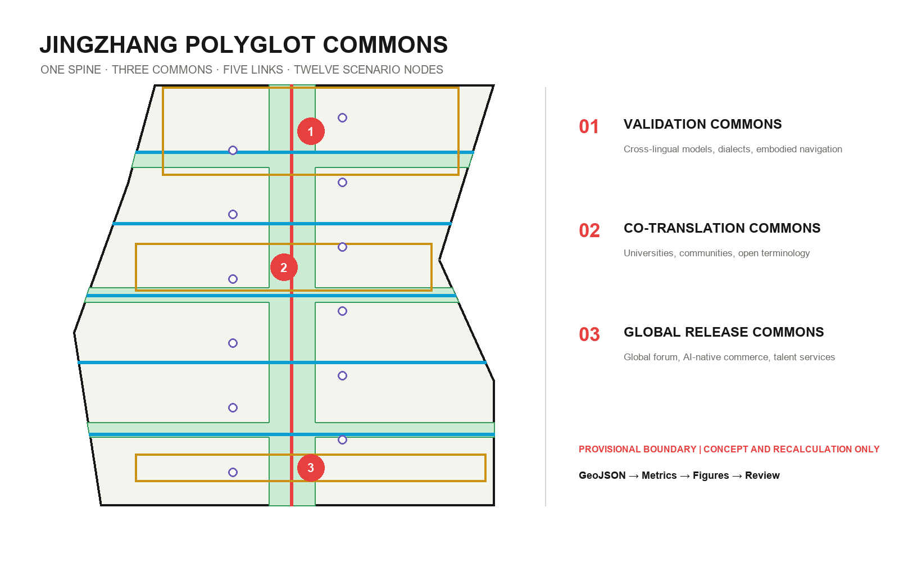
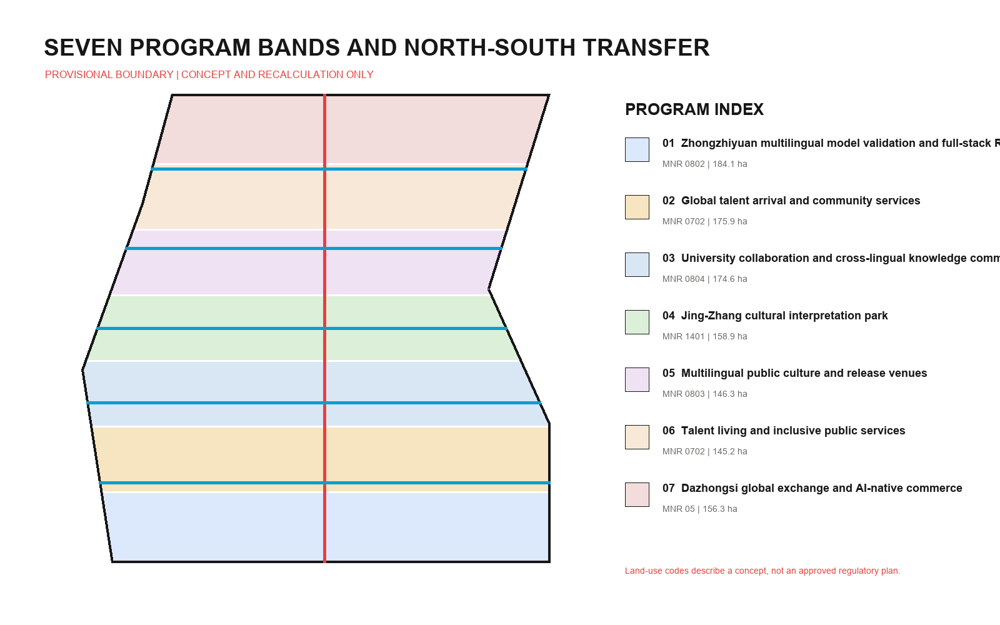
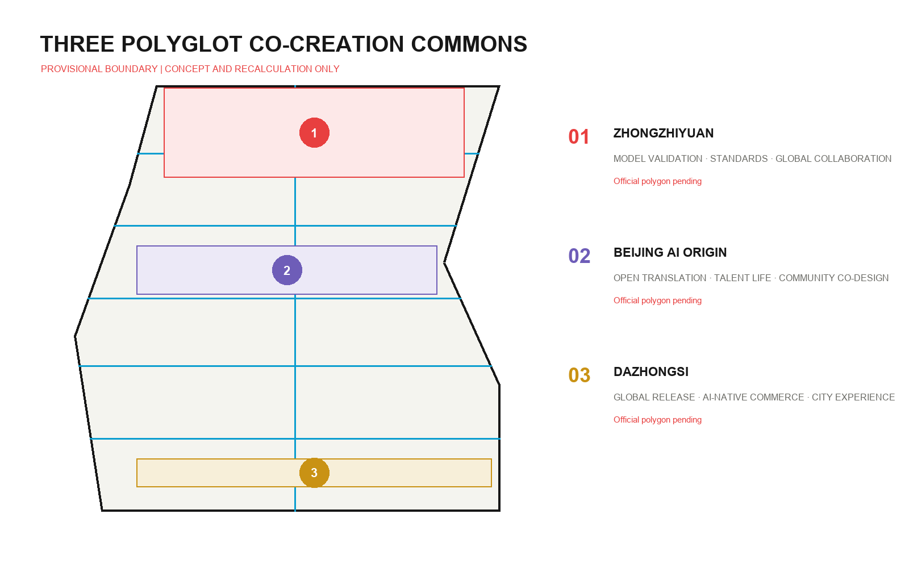
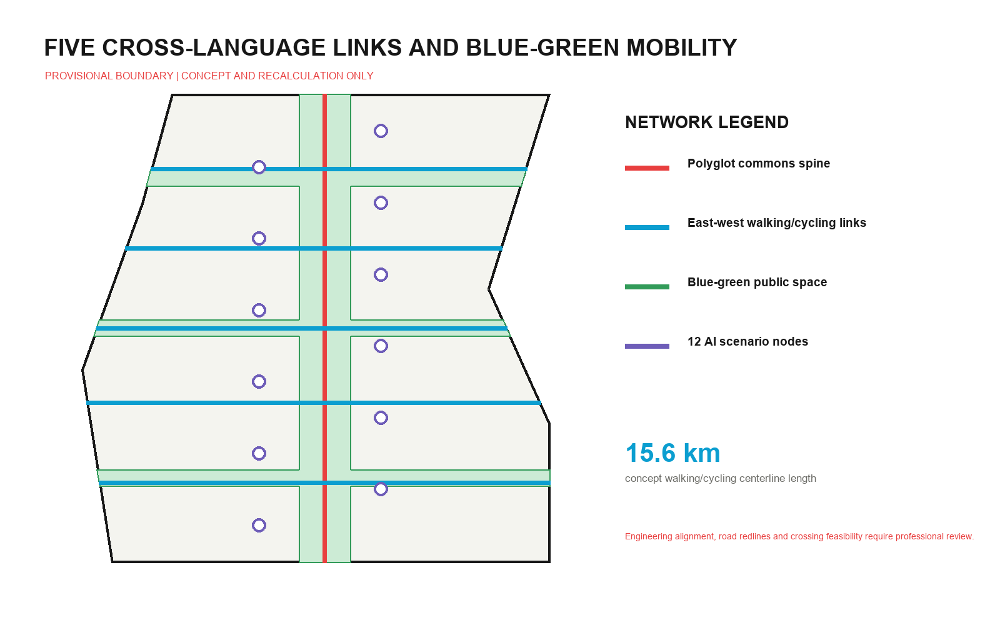
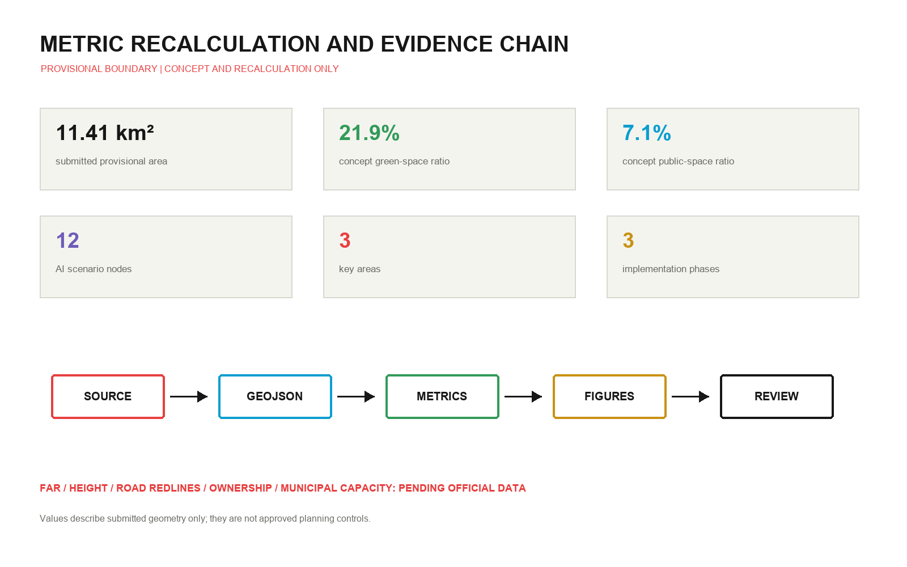

# JINGZHANG POLYGLOT COMMONS

**A multilingual city interface for global AI talent**

Polyglot Commons does not mean covering the city with translation software. It treats cross-language collaboration as shared infrastructure for public space, industrial testing and city services. The Jing-Zhang Railway Heritage Park becomes a walkable, social and co-editable multilingual public spine. It connects the Zhongzhiyuan Validation Commons, the Beijing AI Origin Co-Translation Commons and the Dazhongsi Global Release Commons. Models are tested before they enter real urban services, global talent can find support after arrival, and residents retain human service and non-digital alternatives when AI is unavailable or inappropriate.

Every spatial move is a conceptual recommendation, reference scheme or subject for professional deepening. Nothing in this proposal replaces statutory planning or constitutes government approval, engineering feasibility, investment or an implementation commitment.

## Design Basis and Source List

The proposal first follows the official announcement's three scope levels, three key areas and design tasks. The Agent Taskbook adds requirements for identity, scenarios, operation and public compliance [source:OFFICIAL-ANNOUNCEMENT] [source:AGENT-TASKBOOK]. Local snapshots of professional standards guide the evidence structure; authority flows from GeoJSON and metrics to the three matrices, narrative and display artifacts [source:SITE-PACKAGE].

The public source registry distinguishes formal-ready, background-only and provisional-only materials. No background case is promoted into a site fact, and no provisional polygon is presented as an official planning boundary [source:SOURCE-REGISTRY]. The processed fact pack is a reading guide, not a substitute for the announcement or taskbook [source:PROCESSED-FACT-PACK].

The repository does not contain an official `SITE_BOUNDARY` or official polygons for the three `KEY_AREA` features. The submitted site uses repository-maintained rough provisional geometry only for generation, display, design discussion and intake checks [source:BOUNDARY-SOURCE] [data:geometry/site_boundary.geojson#SITE-001]. The three key areas are also provisional constraints. Once official data arrives, land use, buildings, roads, green space, public space, phasing and every affected metric must be recalculated together [source:KEY-AREA-SOURCE] [data:geometry/key_areas.geojson#PROV-KEY-001].

Existing-condition diagnosis uses three columns: known task evidence, usable evidence and missing material. Known items include the stated areas, text descriptions, tasks and roles of the three key areas. Usable items include provisional geometry and local standard snapshots. Missing items include official boundaries, current parcels and buildings, road redlines, ownership, municipal, heritage and regulatory controls [depth:existing_conditions_diagnosis]. The proposal therefore claims responsibility only for conceptual relationships within the submitted geometry.

## Three-Level Scope Framework

The 43.6-square-kilometre Coordinated Research Area asks how multilingual models, global talent and international collaboration can reinforce Haidian's innovation ecosystem. The roughly 11.4-square-kilometre Overall Design Area asks how a public commons spine can connect industry, everyday life, mobility and blue-green space. Three provisional polygons represent the Key-Area Detailed Design Area and test validation, co-translation and release as professionally deepenable prototypes [depth:three_level_scope_framework] [metric:site_area_sqm].

The overall structure is **one spine, three commons, five links and twelve nodes**. The Polyglot Commons Spine runs north-south. Three commons host industry testing, open co-editing and global release. Five links connect validation, campuses, culture, living and global exchange across the spine. Twelve nodes are AI-enabled scenarios that can be overridden by people, paused and retired [depth:overall_spatial_structure] [data:geometry/roads.geojson#ROAD-001].

The Chinese name is “万语京张” and the English name is **JINGZHANG POLYGLOT COMMONS**. The logo direction uses two parallel rail lines to form an open dialogue frame, with twelve dots for scenario nodes. Red identifies the public-responsibility spine, cyan the cross-links and green the blue-green network. No third-party trademark, portrait or restricted font is used. Naming scales from the belt (Polyglot Commons) to three Commons, five Links and twelve Nodes, allowing the identity to double as a wayfinding and scenario-access system.

The three official positioning statements are translated as follows: the Centennial Jing-Zhang Cultural Belt becomes a history spine readable in many languages; the Metropolitan AI Living Experience Belt becomes everyday service with human takeover; the AI Convergent Innovation Belt becomes an auditable cross-lingual testing network. The five functions map to cross-lingual model evaluation, global collaboration, real-service validation, public interfaces and transparent testing protocols. Among the Three Zones and Two Wings, Zhongzhiyuan validates, AI Origin co-translates and Dazhongsi releases; the Zhongguancun Technology Services Wing supplies legal, capital and knowledge services, while the Xiaoyue River Scenario Enablement Wing supplies everyday applications and feedback [standard:PROJECT-AGENT-OPEN-CALL-TASKBOOK].

## Coordinated Research Area: Industry and Future City Research

Multilingual capability is not a stand-alone language industry. It is an interface among model research, data governance, international collaboration, public service, accessibility and cultural communication. The proposed cycle is: data and corpus governance, model and device research, cross-lingual testing, city-service adoption, public feedback and version iteration. Zhongzhiyuan hosts tests, AI Origin hosts co-editing, Dazhongsi hosts adoption and release, the Zhongguancun wing supplies professional services, and the Xiaoyue River wing supplies real-life scenarios.

The following six cases inform mechanisms only. They do not support any boundary, area, regulatory control or implementation claim for this site:

| Background case | Transferable mechanism | Jing-Zhang interpretation |
| --- | --- | --- |
| Vector Institute | A research institute links talent, companies and application networks [source:CASE-VECTOR] | A cross-lingual model testing community and talent residency |
| City of Helsinki | Public digital-city and planning interfaces [source:CASE-HELSINKI] | Metrics, assumptions and revisions made publicly legible |
| MIT Kendall Square | Interfaces among campus, industry and public realm [source:CASE-KENDALL] | University collaboration materialized through five east-west links |
| STATION F | A visible front door for integrated startup services [source:CASE-STATION-F] | A cross-border startup and adoption foyer at Dazhongsi |
| Singapore AI Verify | An open testing and governance toolchain [source:CASE-AI-VERIFY] | Public test cards and exit conditions for three industry tests |
| Knowledge Quarter London | Coordination among rail-adjacent knowledge institutions [source:CASE-KNOWLEDGE-QUARTER] | A heritage spine connecting universities, communities, culture and companies |

The lesson is not to copy landmarks. It is to define who may enter, where collaboration occurs, how systems are tested, who takes over when they fail, and how useful knowledge remains public. Every mechanism requires local demand validation, rights review and professional adaptation before use.

Seven topology-safe program bands organize multilingual model validation and research, global-talent arrival services, university collaboration, the Jing-Zhang cultural interpretation park, multilingual public culture and release, talent living and inclusive services, and Dazhongsi global exchange and AI-native commerce [data:geometry/land_use.geojson#LU-001] [depth:land_use_layout]. Land-use terminology follows the Ministry of Natural Resources classification logic, but the design is not an approved land-use plan [standard:MNR-LAND-USE-CLASSIFICATION-GUIDE].

## Overall Design Area: Urban Renewal and Regulatory-Plan-Level Urban Design

Urban renewal follows the sequence “open an interface, validate demand, then decide on fixed investment.” Near-term work uses removable service desks, captioning, wayfinding, public test protocols and temporary events. Medium-term work deepens the five links and three commons only after boundaries, transport, municipal and ownership conditions are known. Building renewal and permanent facilities are long-term questions. This sequence prevents provisional geometry from becoming an engineering promise [standard:MOHURD-CONTROL-DETAILED-PLANNING] [depth:development_intensity_controls].

Seven land-use bands partition the same boundary without gaps or overlaps. Fourteen concept building footprints are marked as retain-reference or renovate-reference. They do not identify surveyed existing buildings, demolition need or final scale [data:geometry/buildings.geojson#BLDG-001] [depth:retain_renovate_demolish]. Building footprint area and the design coverage ratio describe the submitted geometry only [metric:building_footprint_area_sqm] [metric:design_building_coverage_ratio].

Conceptual character guidance favours small public-facing ground floors, a continuously open edge along the spine, legible key nodes and a skyline subordinate to future formal controls. Official height, daylight, fire, heritage and aviation conditions are pending, so no fixed height is proposed [depth:height_massing_character]. The unavailable official file for the 2016 architectural design-depth standard is disclosed as a data gap rather than cited as satisfied authority [standard:MOHURD-ARCH-DESIGN-DEPTH-2016].

## Detailed Design of Key Areas

Each key area combines an industry task, public space, service interface and exit condition. Locations use provisional polygons and are unsuitable for precise area, approval or parcel-level demolition decisions [depth:three_key_area_detailed_design] [metric:key_area_count].

**1. Zhongzhiyuan Validation Commons.** Cross-lingual model safety, dialect and low-resource-language robustness, and multilingual embodied navigation become bookable “validation platforms.” Each test declares data provenance, covered languages, failure samples, human takeover and retirement records. Green space hosts removable explanation and discussion only, not unapproved high-risk live testing. Professional deepening requires Qinghe River, Fifth Ring Road, ecology, flood-control and existing-building information [data:geometry/key_areas.geojson#PROV-KEY-001].

**2. Beijing AI Origin Co-Translation Commons.** University, campus and neighbourhood walking links support an open terminology bank, cross-cultural co-design, talent services and public release. Prototypes include an Arrival Foyer with human service, a Co-Translation Court for residents and researchers, and accessible live-caption interfaces. Collection requires informed consent, and community services retain offline windows [data:geometry/key_areas.geojson#PROV-KEY-002].

**3. Dazhongsi Global Release Commons.** Transit access and four-quadrant pedestrian needs frame global release, cross-border startup support, smart-device experience and adoption review. Displays include supported languages, failure boundaries, accountable humans and exit status instead of showing only best results. Station, road-redline, cycle parking, ownership, municipal and commercial operation conditions remain prerequisites [data:geometry/key_areas.geojson#PROV-KEY-003].

## AI Innovation Ecosystem, Personas, and AI+ Scenarios

Six personas turn “global talent” into testable needs rather than an abstract label:

| Persona | Main barrier | Spatial and service response |
| --- | --- | --- |
| Cross-lingual model researcher | Data rights, test-language coverage, reproducible failure | Validation platforms, controlled test rooms, public test cards |
| International founder | Fragmented civic, legal, finance and scenario entry | Dazhongsi cross-border service foyer and human advisors |
| Visiting scholar or student | Broken arrival, housing, medical and campus information | AI Origin arrival assistant, five links and offline service points |
| Local resident or business | Inaccessible technical language and unclear appeal route | Co-Translation Court, plain language, offline fallback and appeal desk |
| Older or Deaf user | Voice-interface, caption and device barriers | Live captions, text/sign/human channels and low-threshold devices |
| City operator or professional | Inconsistent versions and unclear responsibility | Terminology versions, audit records, human approval and rollback |

All twelve cards are spatially registered as `SCENARIO_NODE` features and require human review, non-digital fallback and an exit mechanism [data:geometry/constraints.geojson#SCENARIO-001] [metric:scenario_node_count]:

| ID | Scenario | Type | Data boundary and human review | Space / operation |
| --- | --- | --- | --- | --- |
| S01 | Cross-lingual model safety evaluation | Industry test | Rights-cleared test set; experts confirm risk and stop conditions | Zhongzhiyuan validation platform / quarterly open test |
| S02 | Dialect and low-resource-language robustness test | Industry test | Community consent; sensitive corpus remains restricted | Zhongzhiyuan co-test room / community review |
| S03 | Multilingual embodied-navigation test | Industry test | Enclosed low-speed setting; safety officer can take over | Validation Link / booked periods |
| S04 | Global talent arrival assistant | Public service | Data minimization; offline window in parallel | AI Origin Arrival Foyer / daily service |
| S05 | Multilingual medical navigation | Public service | No diagnosis; clinicians confirm outputs | Talent service point / healthcare partnership |
| S06 | Plain-language legal and civic translation | Public service | Not legal advice; original text shown beside translation | Co-Translation Court / legal volunteer network |
| S07 | Accessible live captioning | Inclusion | Local processing preferred; human correction | Public event interface / year-round |
| S08 | Multilingual Jing-Zhang heritage interpretation | Culture | Historical and linguistic double review | Heritage spine / public route |
| S09 | Open terminology co-editing | Community | Version history, attribution and dispute process | AI Origin Co-Translation Court / monthly edit |
| S10 | Cross-border startup service desk | Enterprise service | Human advisors confirm policy and submissions | Dazhongsi foyer / weekdays |
| S11 | Multilingual urban wayfinding | Mobility | Primary signs remain authoritative; faults do not block travel | Five links / continuous maintenance |
| S12 | Global AI civic forum | Operation | Public agenda, captions and post-event record | Dazhongsi Release Forum / annual event |

Every scenario is a verifiable service prototype, not an approved operating project. AI may not independently decide sensitive medical, legal, mobility or public-service outcomes.

## Land Use, Building Scale, and Retain-Renovate-Demolish Strategy

Seven land-use bands cover the submitted provisional boundary and transfer functions through one north-south commons spine and five east-west links. Research, education, culture, community service, commerce and park categories use common classification codes, but compatibility still requires formal Regulatory Detailed Planning [data:geometry/land_use.geojson#LU-004] [standard:MNR-LAND-USE-CLASSIFICATION-GUIDE].

The building layer does not reconstruct unknown existing conditions. It provides replaceable concept footprints for professional teams. Retain-reference footprints prioritize existing public interfaces; renovate-reference footprints explore open ground floors, shared meeting space, accessibility and reversible facilities. No specific demolition is proposed without ownership, structural safety and value assessment [data:geometry/buildings.geojson#BLDG-007] [depth:retain_renovate_demolish].

Scale control has two columns: known design quantities and items pending official data. Footprint area and design coverage can be recalculated from submitted geometry. FAR, total floor area, height, official Building Coverage Ratio, setbacks and parking remain unknown. Any future value must come from approved controls, survey and professional assessment.

## Transport, Rail, Municipal Infrastructure, and Public Services

The walking and cycling system combines the Polyglot Commons Spine with Validation, Campus, Culture, Living and Global Links. Concept centerline length is recalculated from the road layer [data:geometry/roads.geojson#ROAD-002] [metric:walking_cycling_network_length_m]. It represents connectivity priorities, not road redlines, bridge or tunnel schemes, or construction alignment. Transit access, intersection crossings and Fifth Ring Road conditions require dedicated transport and engineering work [depth:traffic_rail_slow_parking].

Public service uses a three-part configuration: digital assistant, human window and non-digital backup. New-infrastructure recommendations are limited to edge captioning, public terminology versions, privacy tiers, device status and human-takeover interfaces. Energy, computing, communications, drainage, flood control, fire safety and municipal capacity await formal material and specialist calculation [depth:municipal_new_infrastructure].

Accessibility is an entry condition for every node, not a separate feature: continuous walking, readable type and contrast, parallel voice and text, transfer to a person for essential services, and uninterrupted travel during system failure. Exact facility locations require official base mapping and operator collaboration.

## Blue-Green Network, Public Space, and Urban Character

The green layer combines a narrow north-south spine with three cross-green links. The public-space layer contains the Global Arrival Foyer, Open Translation Court, Centennial Language-Rail Plaza and Polyglot Release Forum [data:geometry/green_space.geojson#GREEN-001] [data:geometry/public_space.geojson#PUBLIC-001]. Areas and ratios are recalculated independently and do not claim a statutory green-space ratio [metric:green_ratio].

Urban character follows the national Urban Design Measures' requirement to coordinate public space, building form and local identity, but remains conceptual: restrained materials and continuous walking scale along the heritage spine, colour and information hierarchy distinguishing the three commons, open and reversible ground-floor use, and all heritage, skyline and building control subordinate to future formal files [standard:MOHURD-URBAN-DESIGN-MEASURES] [depth:blue_green_public_space].

Three AI pilgrimage landmarks are usable public knowledge interfaces rather than monumental objects:

1. **Centennial Language-Rail Milestones** record railway engineering terms, AI terms and multilingual equivalents with sources and revision histories.
2. **Open Contribution Wall** displays verifiable code, data, terminology and public-service contributions with correction, withdrawal and version tracking.
3. **Global Dialogue Station** uses circular captioning, human moderation and accessible seating for release and public deliberation at Dazhongsi.

The cultural narrative moves from “building an independent railway” to “co-building an understandable city interface.” Jing-Zhang's engineering autonomy supplies the time axis, Zhongguancun's open innovation supplies the collaborative method, and AI culture is represented through services that can be explained, corrected and co-edited. Wayfinding separates belt identity, place names, operating state and evidence status so that culture is not reduced to technological decoration.

## Renewal Projects, Implementation Policy, and Phasing

| Project | Concept move | Prerequisite | Evaluation / exit |
| --- | --- | --- | --- |
| P01 Polyglot Commons Spine | Continuous walking, captions and terminology milestones | Heritage, park, transport and accessibility work | Continuity and readability; devices removable |
| P02 Zhongzhiyuan Validation Platforms | Three industry tests and public test cards | Rights clearance, safety and operator | Failure samples and takeover rate; failed tests stop |
| P03 AI Origin Co-Translation Court | Terminology co-editing, arrival and public service | Community co-design, privacy and human service | Correction time and offline availability |
| P04 Dazhongsi Release Foyer | Global release, adoption review and startup service | Transit, ownership, municipal and commercial operation | Adoption quality; pause without an accountable operator |
| P05 Five Public Links | Walking/cycling and scenario connection | Road redlines, traffic and engineering study | Reduced breaks; infeasible alignments move |
| P06 Multilingual Public Component Library | Wayfinding, captions, desks and contribution wall | Prototype test, maintenance and rights review | Maintainability; retire at end of life |

`PHASE` geometry divides implementation into three stages [data:geometry/phasing.geojson#PHASE-001] [metric:phase_count]. Phase 1 (2026-2027) validates lightweight services and governance protocols. Phase 2 (2028-2030) connects public spaces and deepens the three commons when formal data permits. Phase 3 (2031+) establishes long-term operation, annual review and asset retirement [depth:phasing_implementation].

Policy concepts include one scenario-access register, cross-lingual data and terminology governance, minimum human-takeover requirements, a non-digital service floor, annual public deliberation, failure and exit records, attributed contribution and withdrawal. Operators, funding, approval and exact schedules remain unconfirmed.

An annual **Polyglot AI Week** combines public cross-lingual model tests, an open terminology editathon, a global-talent city walk, accessible-caption stress testing and the Global AI Civic Forum. Developer residencies, a community translator network, quarterly scenario-access days and annual exit review create the longer cycle. These are operating recommendations, not confirmed government events.

## Metrics, Area Recalculation, and Compliance Matrix

Metrics fall into three groups. Geometry-derived metrics cover submitted provisional area, footprints, concept green and public space, walking/cycling centerlines, scenario nodes and phasing. FAR, height, official Building Coverage Ratio and setbacks await formal controls. Service availability, correction time, takeover rate and completed exit can be observed only after operation [depth:metrics_recalculation].

The submitted provisional area is about 11.41 square kilometres, close in magnitude to the announcement's “about 11.4 square kilometres,” but it is not a precise official area [metric:site_area_sqm]. Concept green-space area and ratio are recalculated from `GREEN-001` [metric:green_space_area_sqm] [metric:green_ratio].

Concept public-space area and ratio sum the four public spaces [metric:public_space_area_sqm] [metric:public_space_ratio]. Footprint area and design coverage check internal consistency only and cannot be quoted as approved development intensity [metric:building_footprint_area_sqm] [metric:design_building_coverage_ratio].

Walking/cycling centerline length, twelve scenario nodes, three key areas and three implementation phases are measured or counted from their respective layers [metric:walking_cycling_network_length_m] [metric:scenario_node_count] [metric:key_area_count]. The phase count is independently checked against `phasing.geojson` [metric:phase_count].

The task-coverage matrix maps every requirement in announcement sections 1.3, 1.4 and 1.5 plus agent.1-agent.6. The professional-standard matrix maps five mandatory references. The design-depth matrix covers diagnosis, scope, structure, land use, intensity, building form, DRR, transport, municipal systems, blue-green space, key areas, projects, phasing, metrics and risk. Matrices retain the complete machine index; prose keeps evidence adjacent to decisions.

## Risk, Copyright, and Compliance

The largest risk is that a provisional boundary could be mistaken for an official planning boundary. Every page, figure and drawing retains a provisional notice. Once official polygons arrive, geometry, metrics, figures, HTML, PDFs and self-checks must all be regenerated [depth:risk_missing_data]. A second risk is treating global-talent needs as established demographic fact; six personas are design hypotheses requiring co-design and survey. A third risk is mistranslation in medical, legal, transport and public service. Essential outputs retain the original text, human confirmation, appeal and non-digital fallback.

The proposal does not claim official approval, approved Regulatory Detailed Planning, final ownership, confirmed development scale, engineering feasibility, investment, recruitment or guaranteed implementation. Approved regulatory plans have legal force; this AI package offers open co-creation material only [standard:PROJECT-OFFICIAL-ANNOUNCEMENT] [standard:MOHURD-CONTROL-DETAILED-PLANNING].

Chinese and English proposals, HTML, A3/A0 PDFs and text-bearing figures are paired. Structured data, prose, figures, HTML and PDFs are original outputs for this open call. No commercial map tiles, news images, third-party trademarks or portraits are used. `gpt-image-2` generated one non-submitted interface concept solely for layout study; it supports no fact, boundary or metric. Every submitted figure is deterministically rendered from local GeoJSON and metrics. See `report/copyright_statement.md` for the complete statement.

## References

The repository files and structured indexes below form the auditable bibliography entry point [source:SITE-PACKAGE].

- `brief/site-package/design_brief.json`
- `brief/site-package/agent_taskbook.json`
- `brief/site-package/allowed_design_space.json`
- `brief/site-package/ranges/planning_limits.json`
- `brief/site-package/standards/standards.json`
- `data/source_registry.json`
- Structured sources and use boundaries: `sources.json`
- Recalculation formulas and unknowns: `metrics.json`
- Assumptions and triggers: `assumptions.json`
- Task, standard and depth coverage: `compliance_matrix.json`, `standard_matrix.json`, `design_depth_matrix.json`
