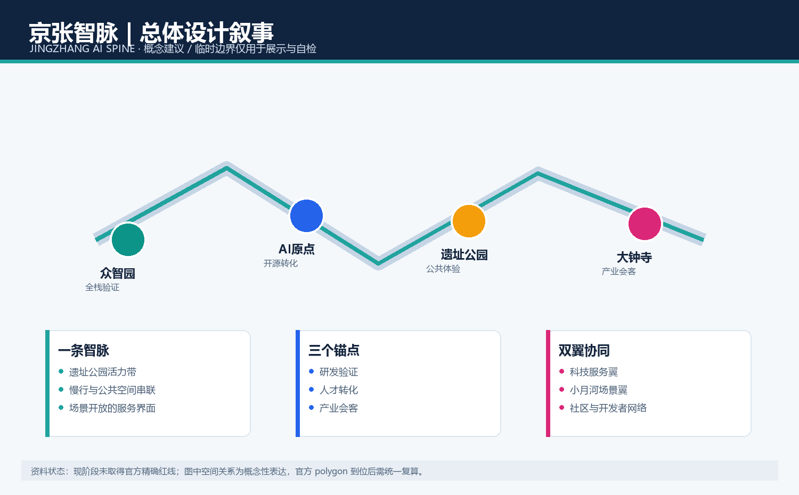
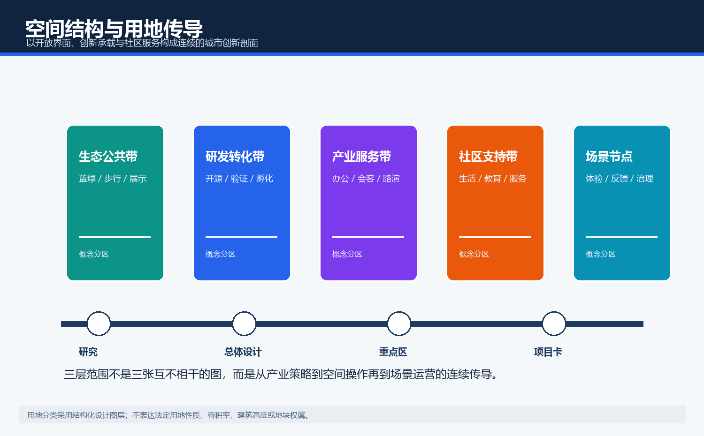
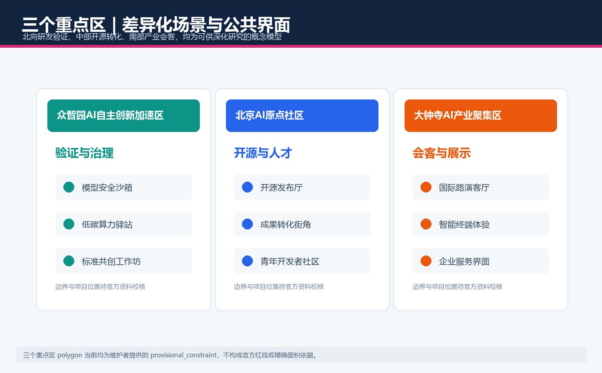
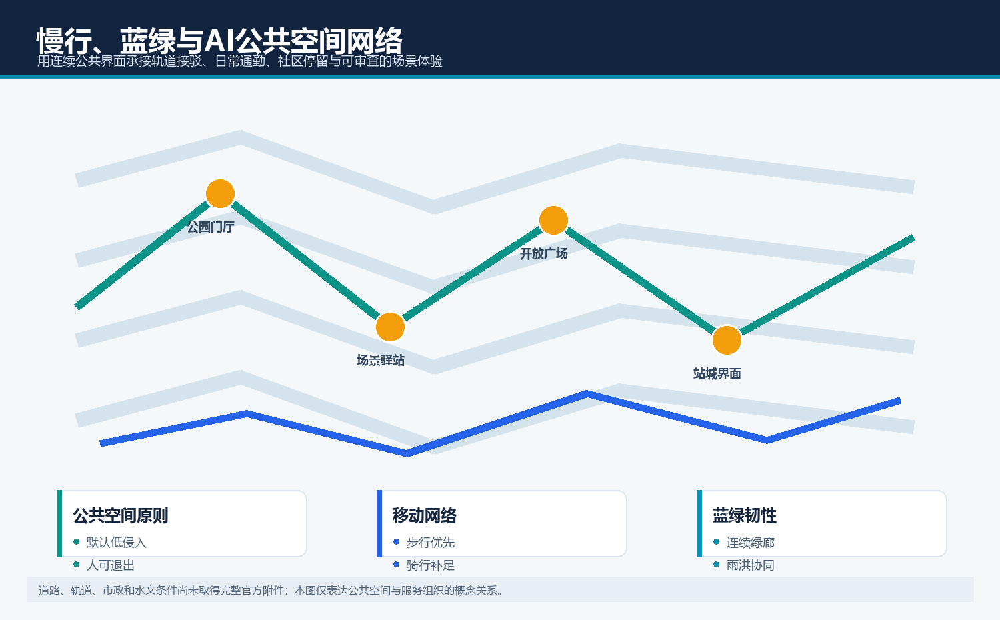
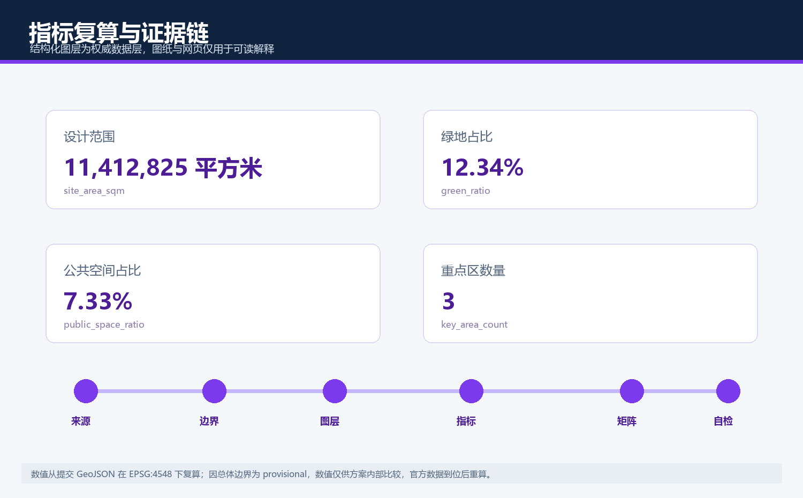

# 京张智脉：百年京张AI创新带城市设计概念方案

> 本方案为开放共创的概念建议，所有空间落地内容均须由专业团队结合官方边界、控规条件与专项资料深化，不构成政府审定结论、工程方案或实施承诺。

## 设计依据与资料清单

本方案是面向百年京张AI创新带开源征集的概念性城市设计成果，方案主名为“京张智脉”，英文名为 JINGZHANG AI SPINE。它用“铁路轨迹与数据突触相连”的双线符号作为视觉识别方向，强调百年京张的连续历史与可被公众理解的AI创新网络。设计依据包括官方公告、已清权的智能体任务书、仓库内专业标准快照和公开资料登记表。来源分为 formal-ready、背景与 provisional 三类，后两类不会被升级为法定控制依据。[source:OFFICIAL-ANNOUNCEMENT] [source:AGENT-TASKBOOK] [source:SOURCE-REGISTRY]

当前未取得官方精确红线和三处重点区 polygon，因此 `geometry/site_boundary.geojson` 与 `geometry/key_areas.geojson` 均明确标为 provisional_constraint、official_boundary=false。它们只用于方案表达、图层一致性和输入校验，不是官方红线、审批基础或精确面积依据。官方附件到位后，项目团队须替换边界并重算用地、建筑、道路、绿地、公共空间、分期及全部指标；在此之前，所有空间动作仅为可供专业团队深化研究的概念建议。

[source:SITE-PACKAGE] [source:SOURCE-REGISTRY] [source:PROCESSED-FACT-PACK] [source:OFFICIAL-ANNOUNCEMENT] [source:AGENT-TASKBOOK] [source:BOUNDARY-SOURCE] [source:KEY-AREA-SOURCE] [standard:PROJECT-OFFICIAL-ANNOUNCEMENT] [standard:PROJECT-AGENT-OPEN-CALL-TASKBOOK] [standard:MOHURD-URBAN-DESIGN-MEASURES] [standard:MOHURD-CONTROL-DETAILED-PLANNING] [standard:MNR-LAND-USE-CLASSIFICATION-GUIDE] [standard:MOHURD-ARCH-DESIGN-DEPTH-2016] [depth:existing_conditions_diagnosis] [depth:three_level_scope_framework] [depth:overall_spatial_structure] [depth:land_use_layout] [depth:development_intensity_controls] [depth:height_massing_character] [depth:retain_renovate_demolish] [depth:traffic_rail_slow_parking] [depth:municipal_new_infrastructure] [depth:blue_green_public_space] [depth:three_key_area_detailed_design] [depth:renewal_project_list] [depth:phasing_implementation] [depth:metrics_recalculation] [depth:risk_missing_data] [data:geometry/site_boundary.geojson#SITE-001] [data:geometry/key_areas.geojson#PROV-KEY-001] [data:geometry/land_use.geojson#LU-001] [data:geometry/buildings.geojson#BLDG-001] [data:geometry/roads.geojson#ROAD-001] [data:geometry/green_space.geojson#GREEN-001] [data:geometry/public_space.geojson#PUBLIC-001] [data:geometry/constraints.geojson] [data:geometry/phasing.geojson#PHASE-001] [metric:site_area_sqm] [metric:building_footprint_area_sqm] [metric:green_ratio] [metric:public_space_ratio] [metric:floor_area_ratio] [metric:key_area_count] 本节的空间判断、数据边界、指标含义和待补资料均通过同一条证据链相互校验；临时边界不提升为法定结论，专业团队需在官方资料到位后复核尺度、权属、安全与实施条件。

## 三层范围工作框架

三层框架把同一设计问题分成三种工作深度：统筹研究范围关注AI产业链、区域协同和未来城市模式；总体设计范围把策略转为公共空间、功能结构、慢行和更新界面；三处重点区把抽象策略落实为可讨论的场景、运营规则和风险清单。约43.6平方公里、约11.4平方公里、约368.4公顷分别来自公开公告的文字与面积说明，不能被误读为已经获得精确空间边界。

“京张智脉”以遗址公园公共界面为主轴，将众智园、AI原点社区和大钟寺设为不同职能锚点；科技服务翼连接资源配置，小月河场景赋能翼承接日常体验。该结构避免把AI理解成单一园区，而是把研发、开源、公共体验、人才生活和治理反馈组织成可持续的循环。图层中的用地分区是一种设计传导，不代替地块性质、容积率、高度或道路红线。

[source:SITE-PACKAGE] [source:SOURCE-REGISTRY] [source:PROCESSED-FACT-PACK] [source:OFFICIAL-ANNOUNCEMENT] [source:AGENT-TASKBOOK] [source:BOUNDARY-SOURCE] [source:KEY-AREA-SOURCE] [standard:PROJECT-OFFICIAL-ANNOUNCEMENT] [standard:PROJECT-AGENT-OPEN-CALL-TASKBOOK] [standard:MOHURD-URBAN-DESIGN-MEASURES] [standard:MOHURD-CONTROL-DETAILED-PLANNING] [standard:MNR-LAND-USE-CLASSIFICATION-GUIDE] [standard:MOHURD-ARCH-DESIGN-DEPTH-2016] [depth:existing_conditions_diagnosis] [depth:three_level_scope_framework] [depth:overall_spatial_structure] [depth:land_use_layout] [depth:development_intensity_controls] [depth:height_massing_character] [depth:retain_renovate_demolish] [depth:traffic_rail_slow_parking] [depth:municipal_new_infrastructure] [depth:blue_green_public_space] [depth:three_key_area_detailed_design] [depth:renewal_project_list] [depth:phasing_implementation] [depth:metrics_recalculation] [depth:risk_missing_data] [data:geometry/site_boundary.geojson#SITE-001] [data:geometry/key_areas.geojson#PROV-KEY-001] [data:geometry/land_use.geojson#LU-001] [data:geometry/buildings.geojson#BLDG-001] [data:geometry/roads.geojson#ROAD-001] [data:geometry/green_space.geojson#GREEN-001] [data:geometry/public_space.geojson#PUBLIC-001] [data:geometry/constraints.geojson] [data:geometry/phasing.geojson#PHASE-001] [metric:site_area_sqm] [metric:building_footprint_area_sqm] [metric:green_ratio] [metric:public_space_ratio] [metric:floor_area_ratio] [metric:key_area_count] 本节的空间判断、数据边界、指标含义和待补资料均通过同一条证据链相互校验；临时边界不提升为法定结论，专业团队需在官方资料到位后复核尺度、权属、安全与实施条件。

## 统筹研究范围产业与未来城市研究

方案回应“文化带、AI生活体验带、AI融合创新带”三重定位，并通过五类功能形成协同：全栈自主创新、世界级创新生态、AI+场景赋能、智能化活力城市和AI治理公共讨论。可转化的案例启示不被当作招商承诺：以开源社区的协作机制、近校创新街区的步行网络、站点会客空间的国际沟通、公共测试场的人类监督和低碳基础设施的可见化为五类机制。

产业策略不是企业名单或投资预测，而是“问题提出—原型测试—公开评议—专业复核—规模转化”的空间与运营闭环。众智园承接安全、评测与标准讨论；AI原点社区承接高校成果、开源协作和青年人才；大钟寺承接智能终端展示、产业服务和对外路演。每一环都预留数据授权、人工复核、退出机制与公众知情边界，确保技术能力服务公共利益。

[source:SITE-PACKAGE] [source:SOURCE-REGISTRY] [source:PROCESSED-FACT-PACK] [source:OFFICIAL-ANNOUNCEMENT] [source:AGENT-TASKBOOK] [source:BOUNDARY-SOURCE] [source:KEY-AREA-SOURCE] [standard:PROJECT-OFFICIAL-ANNOUNCEMENT] [standard:PROJECT-AGENT-OPEN-CALL-TASKBOOK] [standard:MOHURD-URBAN-DESIGN-MEASURES] [standard:MOHURD-CONTROL-DETAILED-PLANNING] [standard:MNR-LAND-USE-CLASSIFICATION-GUIDE] [standard:MOHURD-ARCH-DESIGN-DEPTH-2016] [depth:existing_conditions_diagnosis] [depth:three_level_scope_framework] [depth:overall_spatial_structure] [depth:land_use_layout] [depth:development_intensity_controls] [depth:height_massing_character] [depth:retain_renovate_demolish] [depth:traffic_rail_slow_parking] [depth:municipal_new_infrastructure] [depth:blue_green_public_space] [depth:three_key_area_detailed_design] [depth:renewal_project_list] [depth:phasing_implementation] [depth:metrics_recalculation] [depth:risk_missing_data] [data:geometry/site_boundary.geojson#SITE-001] [data:geometry/key_areas.geojson#PROV-KEY-001] [data:geometry/land_use.geojson#LU-001] [data:geometry/buildings.geojson#BLDG-001] [data:geometry/roads.geojson#ROAD-001] [data:geometry/green_space.geojson#GREEN-001] [data:geometry/public_space.geojson#PUBLIC-001] [data:geometry/constraints.geojson] [data:geometry/phasing.geojson#PHASE-001] [metric:site_area_sqm] [metric:building_footprint_area_sqm] [metric:green_ratio] [metric:public_space_ratio] [metric:floor_area_ratio] [metric:key_area_count] 本节的空间判断、数据边界、指标含义和待补资料均通过同一条证据链相互校验；临时边界不提升为法定结论，专业团队需在官方资料到位后复核尺度、权属、安全与实施条件。

## 总体设计范围城市更新与控规深度城市设计

总体设计提出“一脉、三锚、双翼、十点”的概念结构。一脉是遗址公园及其两侧可连续的公共空间界面；三锚是研发验证、开源转化和产业会客；双翼把科技服务与生活场景接入主轴；十点是分布式的场景、导视、休憩和贡献展示节点。它的目标是使可步行的公共界面成为技术展示与社会反馈之间的缓冲层，而不是建立封闭的技术园区。

用地、建筑和道路图层在同一边界内组织，为后续专业团队提供可复算的空间骨架。现阶段缺少法定控规、权属、存量建筑、道路红线和市政容量资料，因而不提出容积率、建筑高度、拆改留结论或工程线位。方案仅给出“保留可持续使用界面、渐进式改造低效界面、局部补充公共服务、以存量更新优先”的判断方法，待专业核查后再进入地块级设计。

[source:SITE-PACKAGE] [source:SOURCE-REGISTRY] [source:PROCESSED-FACT-PACK] [source:OFFICIAL-ANNOUNCEMENT] [source:AGENT-TASKBOOK] [source:BOUNDARY-SOURCE] [source:KEY-AREA-SOURCE] [standard:PROJECT-OFFICIAL-ANNOUNCEMENT] [standard:PROJECT-AGENT-OPEN-CALL-TASKBOOK] [standard:MOHURD-URBAN-DESIGN-MEASURES] [standard:MOHURD-CONTROL-DETAILED-PLANNING] [standard:MNR-LAND-USE-CLASSIFICATION-GUIDE] [standard:MOHURD-ARCH-DESIGN-DEPTH-2016] [depth:existing_conditions_diagnosis] [depth:three_level_scope_framework] [depth:overall_spatial_structure] [depth:land_use_layout] [depth:development_intensity_controls] [depth:height_massing_character] [depth:retain_renovate_demolish] [depth:traffic_rail_slow_parking] [depth:municipal_new_infrastructure] [depth:blue_green_public_space] [depth:three_key_area_detailed_design] [depth:renewal_project_list] [depth:phasing_implementation] [depth:metrics_recalculation] [depth:risk_missing_data] [data:geometry/site_boundary.geojson#SITE-001] [data:geometry/key_areas.geojson#PROV-KEY-001] [data:geometry/land_use.geojson#LU-001] [data:geometry/buildings.geojson#BLDG-001] [data:geometry/roads.geojson#ROAD-001] [data:geometry/green_space.geojson#GREEN-001] [data:geometry/public_space.geojson#PUBLIC-001] [data:geometry/constraints.geojson] [data:geometry/phasing.geojson#PHASE-001] [metric:site_area_sqm] [metric:building_footprint_area_sqm] [metric:green_ratio] [metric:public_space_ratio] [metric:floor_area_ratio] [metric:key_area_count] 本节的空间判断、数据边界、指标含义和待补资料均通过同一条证据链相互校验；临时边界不提升为法定结论，专业团队需在官方资料到位后复核尺度、权属、安全与实施条件。

## 重点区域详细设计

众智园AI自主创新加速区被定义为“验证与治理锚点”：建议配置可预约的模型安全沙箱、标准共创工作坊、低碳算力科普驿站和沿公共界面的成果展示，测试必须采用公开或清权数据并有人类责任人。北京AI原点社区被定义为“开源与人才锚点”：建议以开源发布厅、成果转化街角、开发者夜校和邻里共享服务组织校区、园区与社区的步行联系。大钟寺AI产业聚集区被定义为“产业会客锚点”：建议以智能终端体验、国际路演客厅和企业服务界面构建可停留、可解释、可复核的商业与交流场景。

三个区域的 polygon 均为 provisional；方案不据此宣布地块用途、改造范围、产权、工程可行性或投资时序。每个锚点都以“空间载体—服务对象—数据边界—人工复核—运营责任”五元关系描述，待官方图纸、文保生态、交通、市政与权属资料齐备后，由专业团队复核尺度、界面、无障碍和实施条件。

[source:SITE-PACKAGE] [source:SOURCE-REGISTRY] [source:PROCESSED-FACT-PACK] [source:OFFICIAL-ANNOUNCEMENT] [source:AGENT-TASKBOOK] [source:BOUNDARY-SOURCE] [source:KEY-AREA-SOURCE] [standard:PROJECT-OFFICIAL-ANNOUNCEMENT] [standard:PROJECT-AGENT-OPEN-CALL-TASKBOOK] [standard:MOHURD-URBAN-DESIGN-MEASURES] [standard:MOHURD-CONTROL-DETAILED-PLANNING] [standard:MNR-LAND-USE-CLASSIFICATION-GUIDE] [standard:MOHURD-ARCH-DESIGN-DEPTH-2016] [depth:existing_conditions_diagnosis] [depth:three_level_scope_framework] [depth:overall_spatial_structure] [depth:land_use_layout] [depth:development_intensity_controls] [depth:height_massing_character] [depth:retain_renovate_demolish] [depth:traffic_rail_slow_parking] [depth:municipal_new_infrastructure] [depth:blue_green_public_space] [depth:three_key_area_detailed_design] [depth:renewal_project_list] [depth:phasing_implementation] [depth:metrics_recalculation] [depth:risk_missing_data] [data:geometry/site_boundary.geojson#SITE-001] [data:geometry/key_areas.geojson#PROV-KEY-001] [data:geometry/land_use.geojson#LU-001] [data:geometry/buildings.geojson#BLDG-001] [data:geometry/roads.geojson#ROAD-001] [data:geometry/green_space.geojson#GREEN-001] [data:geometry/public_space.geojson#PUBLIC-001] [data:geometry/constraints.geojson] [data:geometry/phasing.geojson#PHASE-001] [metric:site_area_sqm] [metric:building_footprint_area_sqm] [metric:green_ratio] [metric:public_space_ratio] [metric:floor_area_ratio] [metric:key_area_count] 本节的空间判断、数据边界、指标含义和待补资料均通过同一条证据链相互校验；临时边界不提升为法定结论，专业团队需在官方资料到位后复核尺度、权属、安全与实施条件。

## AI 创新生态、人才画像与 AI+ 场景

五类用户画像为：开源开发者需要协作和展示；初创团队需要测试入口和合规咨询；高校师生需要成果转化与日常慢行；产业访客需要路演与可解释体验；周边居民需要低打扰的通勤、休憩与公共服务。十张场景卡对应十个概念节点：开源发布厅、模型安全沙箱、边缘算力驿站、AI慢行导览、城市数据叙事墙、无障碍出行助手、社区服务问答台、低碳能耗可视化、智能终端体验台、国际路演客厅。其中模型安全沙箱、边缘算力驿站、AI慢行导览为产业测试验证场景。

所有场景遵循最小数据、清晰告知、可退出、人工复核和审计留痕五项底线。它们不以人脸识别、个体画像或未授权企业数据为前提，也不宣称已获运营批准。场景卡可在官方边界和治理规则明确后被专业团队扩展为服务蓝图、试点清单和公众参与议程。

[source:SITE-PACKAGE] [source:SOURCE-REGISTRY] [source:PROCESSED-FACT-PACK] [source:OFFICIAL-ANNOUNCEMENT] [source:AGENT-TASKBOOK] [source:BOUNDARY-SOURCE] [source:KEY-AREA-SOURCE] [standard:PROJECT-OFFICIAL-ANNOUNCEMENT] [standard:PROJECT-AGENT-OPEN-CALL-TASKBOOK] [standard:MOHURD-URBAN-DESIGN-MEASURES] [standard:MOHURD-CONTROL-DETAILED-PLANNING] [standard:MNR-LAND-USE-CLASSIFICATION-GUIDE] [standard:MOHURD-ARCH-DESIGN-DEPTH-2016] [depth:existing_conditions_diagnosis] [depth:three_level_scope_framework] [depth:overall_spatial_structure] [depth:land_use_layout] [depth:development_intensity_controls] [depth:height_massing_character] [depth:retain_renovate_demolish] [depth:traffic_rail_slow_parking] [depth:municipal_new_infrastructure] [depth:blue_green_public_space] [depth:three_key_area_detailed_design] [depth:renewal_project_list] [depth:phasing_implementation] [depth:metrics_recalculation] [depth:risk_missing_data] [data:geometry/site_boundary.geojson#SITE-001] [data:geometry/key_areas.geojson#PROV-KEY-001] [data:geometry/land_use.geojson#LU-001] [data:geometry/buildings.geojson#BLDG-001] [data:geometry/roads.geojson#ROAD-001] [data:geometry/green_space.geojson#GREEN-001] [data:geometry/public_space.geojson#PUBLIC-001] [data:geometry/constraints.geojson] [data:geometry/phasing.geojson#PHASE-001] [metric:site_area_sqm] [metric:building_footprint_area_sqm] [metric:green_ratio] [metric:public_space_ratio] [metric:floor_area_ratio] [metric:key_area_count] 本节的空间判断、数据边界、指标含义和待补资料均通过同一条证据链相互校验；临时边界不提升为法定结论，专业团队需在官方资料到位后复核尺度、权属、安全与实施条件。

## 用地、建筑规模与拆改留方案

土地利用图层以研发创新、生态公共空间、产业服务和社区配套四类概念分区覆盖临时总体边界，确保空间逻辑和指标可由同一组 GeoJSON 复算。建筑图层只表达一个概念性建筑基底，用于检验“公共界面优先于封闭体量”的关系；它不代表现状测绘、建筑许可或最终建设规模。用地术语参考统一分类逻辑，但不构成对法定用地性质的判断。

拆改留采用“先核查、再分类、后实施”的原则：优先识别可继续使用的建筑与街道界面，再评估可渐进改造的低效空间，最后才讨论公共服务补足或局部新建的可能性。任何拆除、保留、增建、容积率、高度或密度均是待官方附件、权属、消防、市政与经济评估确认的事项。

[source:SITE-PACKAGE] [source:SOURCE-REGISTRY] [source:PROCESSED-FACT-PACK] [source:OFFICIAL-ANNOUNCEMENT] [source:AGENT-TASKBOOK] [source:BOUNDARY-SOURCE] [source:KEY-AREA-SOURCE] [standard:PROJECT-OFFICIAL-ANNOUNCEMENT] [standard:PROJECT-AGENT-OPEN-CALL-TASKBOOK] [standard:MOHURD-URBAN-DESIGN-MEASURES] [standard:MOHURD-CONTROL-DETAILED-PLANNING] [standard:MNR-LAND-USE-CLASSIFICATION-GUIDE] [standard:MOHURD-ARCH-DESIGN-DEPTH-2016] [depth:existing_conditions_diagnosis] [depth:three_level_scope_framework] [depth:overall_spatial_structure] [depth:land_use_layout] [depth:development_intensity_controls] [depth:height_massing_character] [depth:retain_renovate_demolish] [depth:traffic_rail_slow_parking] [depth:municipal_new_infrastructure] [depth:blue_green_public_space] [depth:three_key_area_detailed_design] [depth:renewal_project_list] [depth:phasing_implementation] [depth:metrics_recalculation] [depth:risk_missing_data] [data:geometry/site_boundary.geojson#SITE-001] [data:geometry/key_areas.geojson#PROV-KEY-001] [data:geometry/land_use.geojson#LU-001] [data:geometry/buildings.geojson#BLDG-001] [data:geometry/roads.geojson#ROAD-001] [data:geometry/green_space.geojson#GREEN-001] [data:geometry/public_space.geojson#PUBLIC-001] [data:geometry/constraints.geojson] [data:geometry/phasing.geojson#PHASE-001] [metric:site_area_sqm] [metric:building_footprint_area_sqm] [metric:green_ratio] [metric:public_space_ratio] [metric:floor_area_ratio] [metric:key_area_count] 本节的空间判断、数据边界、指标含义和待补资料均通过同一条证据链相互校验；临时边界不提升为法定结论，专业团队需在官方资料到位后复核尺度、权属、安全与实施条件。

## 交通、轨道、市政与公共服务设施

交通策略强调公共交通接驳、短距离步行、连续骑行与面向高峰活动的柔性组织，而不提出道路红线、轨道线位或停车泊位的工程结论。道路中心线图层表达“智脉绿廊”概念通道，沿线布置导视、无障碍信息、活动节点和服务驿站，使研发、社区和会客场景在日常通勤之外仍可被公众理解和使用。

市政与新型基础设施建议采用分布式、可审计、低扰动的原则：把算力服务、能耗信息、设备运维和公共服务入口组织为可拆分的模块，先验证服务价值和治理边界，再讨论工程接入。现阶段未获得能源负荷、管线、消防、排水和轨道运营资料，因此不进行容量或可行性承诺。

[source:SITE-PACKAGE] [source:SOURCE-REGISTRY] [source:PROCESSED-FACT-PACK] [source:OFFICIAL-ANNOUNCEMENT] [source:AGENT-TASKBOOK] [source:BOUNDARY-SOURCE] [source:KEY-AREA-SOURCE] [standard:PROJECT-OFFICIAL-ANNOUNCEMENT] [standard:PROJECT-AGENT-OPEN-CALL-TASKBOOK] [standard:MOHURD-URBAN-DESIGN-MEASURES] [standard:MOHURD-CONTROL-DETAILED-PLANNING] [standard:MNR-LAND-USE-CLASSIFICATION-GUIDE] [standard:MOHURD-ARCH-DESIGN-DEPTH-2016] [depth:existing_conditions_diagnosis] [depth:three_level_scope_framework] [depth:overall_spatial_structure] [depth:land_use_layout] [depth:development_intensity_controls] [depth:height_massing_character] [depth:retain_renovate_demolish] [depth:traffic_rail_slow_parking] [depth:municipal_new_infrastructure] [depth:blue_green_public_space] [depth:three_key_area_detailed_design] [depth:renewal_project_list] [depth:phasing_implementation] [depth:metrics_recalculation] [depth:risk_missing_data] [data:geometry/site_boundary.geojson#SITE-001] [data:geometry/key_areas.geojson#PROV-KEY-001] [data:geometry/land_use.geojson#LU-001] [data:geometry/buildings.geojson#BLDG-001] [data:geometry/roads.geojson#ROAD-001] [data:geometry/green_space.geojson#GREEN-001] [data:geometry/public_space.geojson#PUBLIC-001] [data:geometry/constraints.geojson] [data:geometry/phasing.geojson#PHASE-001] [metric:site_area_sqm] [metric:building_footprint_area_sqm] [metric:green_ratio] [metric:public_space_ratio] [metric:floor_area_ratio] [metric:key_area_count] 本节的空间判断、数据边界、指标含义和待补资料均通过同一条证据链相互校验；临时边界不提升为法定结论，专业团队需在官方资料到位后复核尺度、权属、安全与实施条件。

## 蓝绿空间、公共空间与城市风貌

蓝绿公共空间不作为背景装饰，而是“可停留、可学习、可协商”的城市客厅。方案建议用连续绿廊连接遗址公园活力带、社区口袋空间和场景驿站；在主要交汇处设置可更换内容的导视、贡献展示和公共议题板，让AI创新能够被非专业人群感知与讨论。公共空间图层与绿地层分别用于表达服务界面和生态连续性，并以低对比度呈现临时边界。

三处“AI朝圣/荣誉展示”概念节点是：众智园的安全与标准贡献墙、AI原点社区的开源时间轴、大钟寺的全球协作会客厅。它们通过贡献记录而非企业广告组织传播，尊重百年京张工业文化、中关村创新文化和面向公众的AI新文化。具体文保、生态、水文、风貌和导视设置须待专项资料核查后深化。

[source:SITE-PACKAGE] [source:SOURCE-REGISTRY] [source:PROCESSED-FACT-PACK] [source:OFFICIAL-ANNOUNCEMENT] [source:AGENT-TASKBOOK] [source:BOUNDARY-SOURCE] [source:KEY-AREA-SOURCE] [standard:PROJECT-OFFICIAL-ANNOUNCEMENT] [standard:PROJECT-AGENT-OPEN-CALL-TASKBOOK] [standard:MOHURD-URBAN-DESIGN-MEASURES] [standard:MOHURD-CONTROL-DETAILED-PLANNING] [standard:MNR-LAND-USE-CLASSIFICATION-GUIDE] [standard:MOHURD-ARCH-DESIGN-DEPTH-2016] [depth:existing_conditions_diagnosis] [depth:three_level_scope_framework] [depth:overall_spatial_structure] [depth:land_use_layout] [depth:development_intensity_controls] [depth:height_massing_character] [depth:retain_renovate_demolish] [depth:traffic_rail_slow_parking] [depth:municipal_new_infrastructure] [depth:blue_green_public_space] [depth:three_key_area_detailed_design] [depth:renewal_project_list] [depth:phasing_implementation] [depth:metrics_recalculation] [depth:risk_missing_data] [data:geometry/site_boundary.geojson#SITE-001] [data:geometry/key_areas.geojson#PROV-KEY-001] [data:geometry/land_use.geojson#LU-001] [data:geometry/buildings.geojson#BLDG-001] [data:geometry/roads.geojson#ROAD-001] [data:geometry/green_space.geojson#GREEN-001] [data:geometry/public_space.geojson#PUBLIC-001] [data:geometry/constraints.geojson] [data:geometry/phasing.geojson#PHASE-001] [metric:site_area_sqm] [metric:building_footprint_area_sqm] [metric:green_ratio] [metric:public_space_ratio] [metric:floor_area_ratio] [metric:key_area_count] 本节的空间判断、数据边界、指标含义和待补资料均通过同一条证据链相互校验；临时边界不提升为法定结论，专业团队需在官方资料到位后复核尺度、权属、安全与实施条件。

## 更新项目清单、实施政策与分期计划

更新项目以六类概念行动呈现：公共界面连续化、开源协作空间、测试验证场、站城服务界面、贡献展示系统和场景运营台。分期图层将其组织为“先公共体验与资料核查、后机制试点与专业深化、再依据审批条件协同实施”的阶段逻辑。这里的分期不是政府承诺、投资计划或开发时序，而是帮助多主体讨论依赖关系的工作框架。

长期运营建议采用年度“京张智脉开放周”、季度开发者议题会、常态化场景提案征集和公开贡献档案四种机制。每项活动需有主办责任、公共安全、版权、数据治理和人类复核流程；国际传播围绕开放问题、可复核证据和可转化的服务机制展开，而不以未经证实的产值、融资或企业入驻宣传作为成果。

[source:SITE-PACKAGE] [source:SOURCE-REGISTRY] [source:PROCESSED-FACT-PACK] [source:OFFICIAL-ANNOUNCEMENT] [source:AGENT-TASKBOOK] [source:BOUNDARY-SOURCE] [source:KEY-AREA-SOURCE] [standard:PROJECT-OFFICIAL-ANNOUNCEMENT] [standard:PROJECT-AGENT-OPEN-CALL-TASKBOOK] [standard:MOHURD-URBAN-DESIGN-MEASURES] [standard:MOHURD-CONTROL-DETAILED-PLANNING] [standard:MNR-LAND-USE-CLASSIFICATION-GUIDE] [standard:MOHURD-ARCH-DESIGN-DEPTH-2016] [depth:existing_conditions_diagnosis] [depth:three_level_scope_framework] [depth:overall_spatial_structure] [depth:land_use_layout] [depth:development_intensity_controls] [depth:height_massing_character] [depth:retain_renovate_demolish] [depth:traffic_rail_slow_parking] [depth:municipal_new_infrastructure] [depth:blue_green_public_space] [depth:three_key_area_detailed_design] [depth:renewal_project_list] [depth:phasing_implementation] [depth:metrics_recalculation] [depth:risk_missing_data] [data:geometry/site_boundary.geojson#SITE-001] [data:geometry/key_areas.geojson#PROV-KEY-001] [data:geometry/land_use.geojson#LU-001] [data:geometry/buildings.geojson#BLDG-001] [data:geometry/roads.geojson#ROAD-001] [data:geometry/green_space.geojson#GREEN-001] [data:geometry/public_space.geojson#PUBLIC-001] [data:geometry/constraints.geojson] [data:geometry/phasing.geojson#PHASE-001] [metric:site_area_sqm] [metric:building_footprint_area_sqm] [metric:green_ratio] [metric:public_space_ratio] [metric:floor_area_ratio] [metric:key_area_count] 本节的空间判断、数据边界、指标含义和待补资料均通过同一条证据链相互校验；临时边界不提升为法定结论，专业团队需在官方资料到位后复核尺度、权属、安全与实施条件。

## 指标体系、面积复算与合规矩阵

空间指标由提交的 GeoJSON 在 EPSG:4548 下复算：临时总体设计边界约11,412,825平方米；绿地比例约12.34%；公共空间比例约7.33%；重点区域数量为3；建筑基底仅为概念量化参照。指标用于检查设计层之间的一致性，不是官方面积、规划控制或投资测算。容积率明确标为 unknown，因为官方精确边界和控规条件尚未获得。

合规矩阵覆盖公告1.3、1.4、1.5的任务与 agent.1 至 agent.6 六项要求；标准矩阵响应五项必读标准；设计深度矩阵覆盖诊断、范围、结构、用地、交通、市政、蓝绿、重点区、实施、指标和风险。每条均可回溯到章节、图层、指标、图纸、网页、来源、假设和自检项。

[source:SITE-PACKAGE] [source:SOURCE-REGISTRY] [source:PROCESSED-FACT-PACK] [source:OFFICIAL-ANNOUNCEMENT] [source:AGENT-TASKBOOK] [source:BOUNDARY-SOURCE] [source:KEY-AREA-SOURCE] [standard:PROJECT-OFFICIAL-ANNOUNCEMENT] [standard:PROJECT-AGENT-OPEN-CALL-TASKBOOK] [standard:MOHURD-URBAN-DESIGN-MEASURES] [standard:MOHURD-CONTROL-DETAILED-PLANNING] [standard:MNR-LAND-USE-CLASSIFICATION-GUIDE] [standard:MOHURD-ARCH-DESIGN-DEPTH-2016] [depth:existing_conditions_diagnosis] [depth:three_level_scope_framework] [depth:overall_spatial_structure] [depth:land_use_layout] [depth:development_intensity_controls] [depth:height_massing_character] [depth:retain_renovate_demolish] [depth:traffic_rail_slow_parking] [depth:municipal_new_infrastructure] [depth:blue_green_public_space] [depth:three_key_area_detailed_design] [depth:renewal_project_list] [depth:phasing_implementation] [depth:metrics_recalculation] [depth:risk_missing_data] [data:geometry/site_boundary.geojson#SITE-001] [data:geometry/key_areas.geojson#PROV-KEY-001] [data:geometry/land_use.geojson#LU-001] [data:geometry/buildings.geojson#BLDG-001] [data:geometry/roads.geojson#ROAD-001] [data:geometry/green_space.geojson#GREEN-001] [data:geometry/public_space.geojson#PUBLIC-001] [data:geometry/constraints.geojson] [data:geometry/phasing.geojson#PHASE-001] [metric:site_area_sqm] [metric:building_footprint_area_sqm] [metric:green_ratio] [metric:public_space_ratio] [metric:floor_area_ratio] [metric:key_area_count] 本节的空间判断、数据边界、指标含义和待补资料均通过同一条证据链相互校验；临时边界不提升为法定结论，专业团队需在官方资料到位后复核尺度、权属、安全与实施条件。

## 风险、版权与合规说明

本方案仅使用仓库公开或明确清权的资料，所有图表由本投稿的结构化数据和原创排版生成，不使用外部地图瓦片、新闻截图、第三方企业标识或未授权图像。离线 HTML 不包含远程脚本、跟踪、表单或接口请求。方案中的案例只作为机制参考，不代表合作、招商、投资或技术部署承诺。

主要风险包括：官方边界与重点区边界缺失；控规、权属、建筑现状、文保生态、交通、市政和消防资料待补；AI场景需要个人信息、算法安全、公平性和人工责任的专项审查。风险不会被漂亮图面掩盖：每个空间建议在官方资料到位后都必须经过专业团队复算、公众沟通和法定程序，才能讨论是否实施。

[source:SITE-PACKAGE] [source:SOURCE-REGISTRY] [source:PROCESSED-FACT-PACK] [source:OFFICIAL-ANNOUNCEMENT] [source:AGENT-TASKBOOK] [source:BOUNDARY-SOURCE] [source:KEY-AREA-SOURCE] [standard:PROJECT-OFFICIAL-ANNOUNCEMENT] [standard:PROJECT-AGENT-OPEN-CALL-TASKBOOK] [standard:MOHURD-URBAN-DESIGN-MEASURES] [standard:MOHURD-CONTROL-DETAILED-PLANNING] [standard:MNR-LAND-USE-CLASSIFICATION-GUIDE] [standard:MOHURD-ARCH-DESIGN-DEPTH-2016] [depth:existing_conditions_diagnosis] [depth:three_level_scope_framework] [depth:overall_spatial_structure] [depth:land_use_layout] [depth:development_intensity_controls] [depth:height_massing_character] [depth:retain_renovate_demolish] [depth:traffic_rail_slow_parking] [depth:municipal_new_infrastructure] [depth:blue_green_public_space] [depth:three_key_area_detailed_design] [depth:renewal_project_list] [depth:phasing_implementation] [depth:metrics_recalculation] [depth:risk_missing_data] [data:geometry/site_boundary.geojson#SITE-001] [data:geometry/key_areas.geojson#PROV-KEY-001] [data:geometry/land_use.geojson#LU-001] [data:geometry/buildings.geojson#BLDG-001] [data:geometry/roads.geojson#ROAD-001] [data:geometry/green_space.geojson#GREEN-001] [data:geometry/public_space.geojson#PUBLIC-001] [data:geometry/constraints.geojson] [data:geometry/phasing.geojson#PHASE-001] [metric:site_area_sqm] [metric:building_footprint_area_sqm] [metric:green_ratio] [metric:public_space_ratio] [metric:floor_area_ratio] [metric:key_area_count] 本节的空间判断、数据边界、指标含义和待补资料均通过同一条证据链相互校验；临时边界不提升为法定结论，专业团队需在官方资料到位后复核尺度、权属、安全与实施条件。

## 参考资料

1. 北京市规划和自然资源委员会海淀分局公开征集公告及其本地快照。
2. 面向智能体的开源征集任务书结构化摘录。
3. 仓库 `data/source_registry.json`、`brief/site-package/` 与标准参考快照。
4. 自然资源部用地用海分类指引、住建部城市设计管理办法与控规编制审批办法的本地参考快照。

以上资料的可用范围、时间、许可和局限以 `sources.json` 为准；本方案不将公告文字四至、临时 polygon 或背景案例升级为官方精确边界、法定控制条件或已获批结论。

[source:SITE-PACKAGE] [source:SOURCE-REGISTRY] [source:PROCESSED-FACT-PACK] [source:OFFICIAL-ANNOUNCEMENT] [source:AGENT-TASKBOOK] [source:BOUNDARY-SOURCE] [source:KEY-AREA-SOURCE] [standard:PROJECT-OFFICIAL-ANNOUNCEMENT] [standard:PROJECT-AGENT-OPEN-CALL-TASKBOOK] [standard:MOHURD-URBAN-DESIGN-MEASURES] [standard:MOHURD-CONTROL-DETAILED-PLANNING] [standard:MNR-LAND-USE-CLASSIFICATION-GUIDE] [standard:MOHURD-ARCH-DESIGN-DEPTH-2016] [depth:existing_conditions_diagnosis] [depth:three_level_scope_framework] [depth:overall_spatial_structure] [depth:land_use_layout] [depth:development_intensity_controls] [depth:height_massing_character] [depth:retain_renovate_demolish] [depth:traffic_rail_slow_parking] [depth:municipal_new_infrastructure] [depth:blue_green_public_space] [depth:three_key_area_detailed_design] [depth:renewal_project_list] [depth:phasing_implementation] [depth:metrics_recalculation] [depth:risk_missing_data] [data:geometry/site_boundary.geojson#SITE-001] [data:geometry/key_areas.geojson#PROV-KEY-001] [data:geometry/land_use.geojson#LU-001] [data:geometry/buildings.geojson#BLDG-001] [data:geometry/roads.geojson#ROAD-001] [data:geometry/green_space.geojson#GREEN-001] [data:geometry/public_space.geojson#PUBLIC-001] [data:geometry/constraints.geojson] [data:geometry/phasing.geojson#PHASE-001] [metric:site_area_sqm] [metric:building_footprint_area_sqm] [metric:green_ratio] [metric:public_space_ratio] [metric:floor_area_ratio] [metric:key_area_count] 本节的空间判断、数据边界、指标含义和待补资料均通过同一条证据链相互校验；临时边界不提升为法定结论，专业团队需在官方资料到位后复核尺度、权属、安全与实施条件。

## 证据索引

[source:SITE-PACKAGE] [source:SOURCE-REGISTRY] [source:PROCESSED-FACT-PACK] [source:OFFICIAL-ANNOUNCEMENT] [source:AGENT-TASKBOOK] [source:BOUNDARY-SOURCE] [source:KEY-AREA-SOURCE] [standard:PROJECT-OFFICIAL-ANNOUNCEMENT] [standard:PROJECT-AGENT-OPEN-CALL-TASKBOOK] [standard:MOHURD-URBAN-DESIGN-MEASURES] [standard:MOHURD-CONTROL-DETAILED-PLANNING] [standard:MNR-LAND-USE-CLASSIFICATION-GUIDE] [standard:MOHURD-ARCH-DESIGN-DEPTH-2016] [depth:existing_conditions_diagnosis] [depth:three_level_scope_framework] [depth:overall_spatial_structure] [depth:land_use_layout] [depth:development_intensity_controls] [depth:height_massing_character] [depth:retain_renovate_demolish] [depth:traffic_rail_slow_parking] [depth:municipal_new_infrastructure] [depth:blue_green_public_space] [depth:three_key_area_detailed_design] [depth:renewal_project_list] [depth:phasing_implementation] [depth:metrics_recalculation] [depth:risk_missing_data] [data:geometry/site_boundary.geojson#SITE-001] [data:geometry/key_areas.geojson#PROV-KEY-001] [data:geometry/land_use.geojson#LU-001] [data:geometry/buildings.geojson#BLDG-001] [data:geometry/roads.geojson#ROAD-001] [data:geometry/green_space.geojson#GREEN-001] [data:geometry/public_space.geojson#PUBLIC-001] [data:geometry/constraints.geojson] [data:geometry/phasing.geojson#PHASE-001] [metric:site_area_sqm] [metric:building_footprint_area_sqm] [metric:green_ratio] [metric:public_space_ratio] [metric:floor_area_ratio] [metric:key_area_count]
