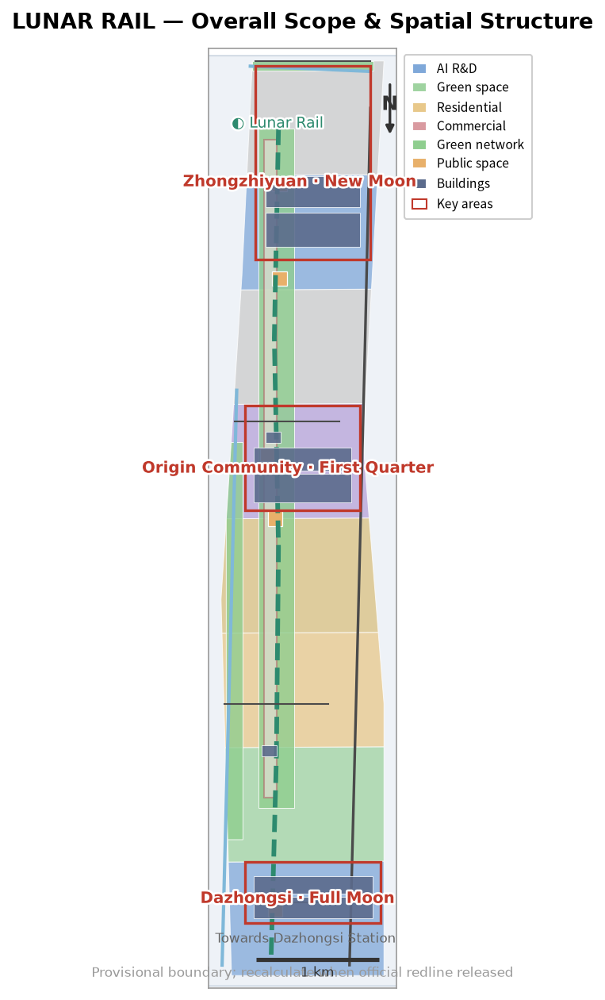
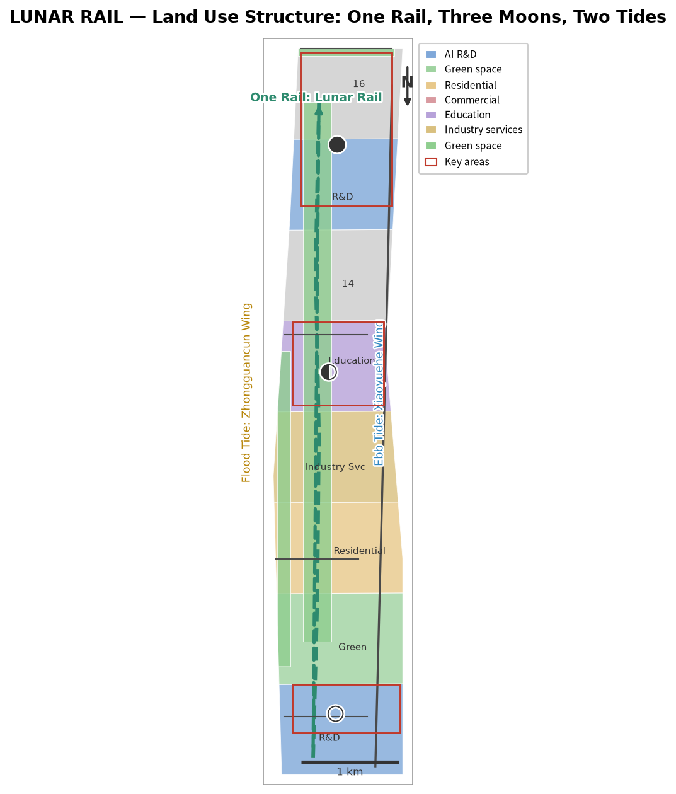
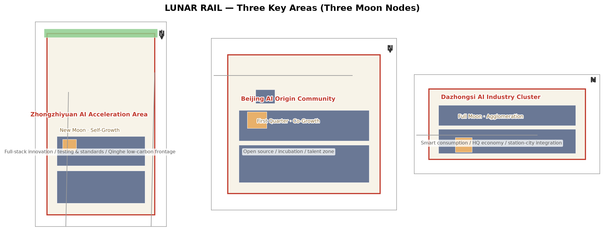
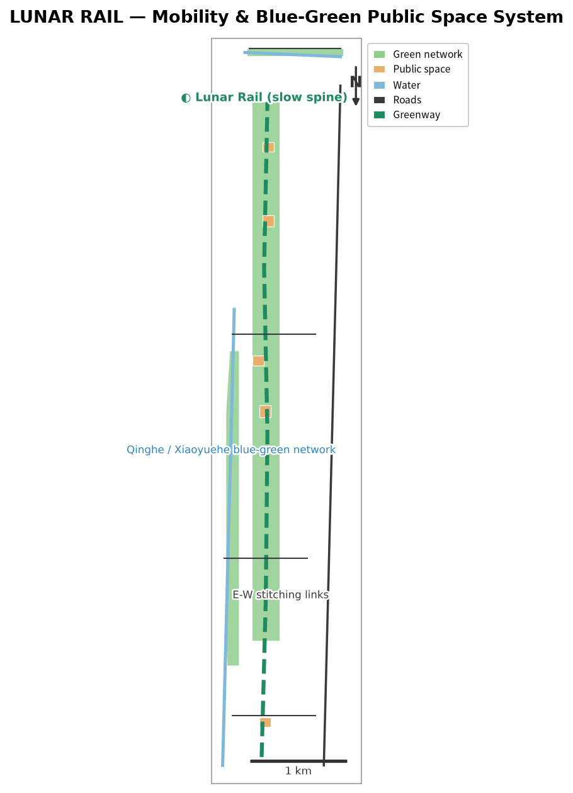
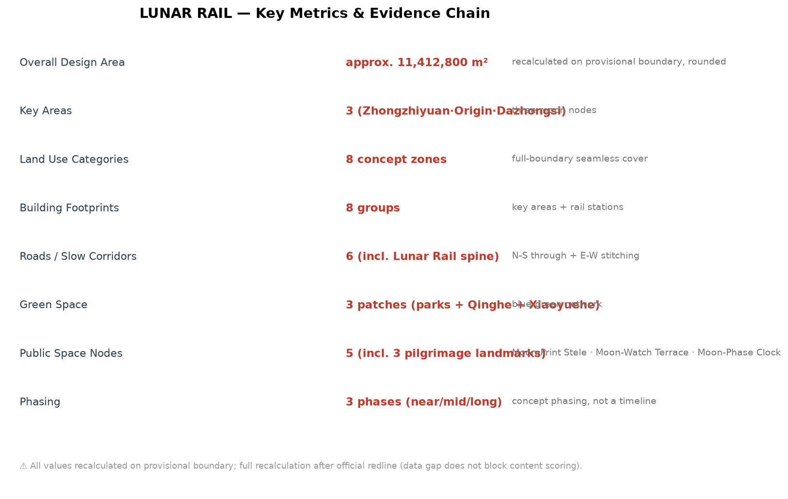

# LUNAR RAIL JINGZHANG: An AI Innovation Belt Measured by Moonlight and Valued by Permanent Memory

## Design Basis and Source List

This proposal responds to the official call for the Centennial Jingzhang AI Innovation Belt and the Agent taskbook. It serves three positions: the Centennial Jingzhang Culture Belt, the Urban AI Life Experience Belt, and the AI Integrated Innovation Belt. Its central proposition is to translate the century-long memory of the Jingzhang railway into a walkable, experiential, reviewable public innovation line, using the moon as a long-time narrative and contribution records as a lasting civic asset [source:OFFICIAL-ANNOUNCEMENT] [source:AGENT-TASKBOOK].

LUNAR RAIL is a concept name, not an official planning name or a confirmed government program. All spatial recommendations are concept proposals for professional-team research. No exact official redline is currently available; the package uses the provisional rough geometry recorded as `DATA-SRC-PROVISIONAL-BOUNDARIES-20260605`, which is not an official redline, approval basis, or precise area basis [source:BOUNDARY-SOURCE].

The workflow read the brief, allowed design space, planning limits, local standards, and fact pack before producing nine GeoJSON layers, metrics, matrices, offline HTML, and A3/A0 drawings. Figures are locally generated from repository data and concept layers; no remote tiles or external scripts are used [source:SOURCE-REGISTRY] [source:PROCESSED-FACT-PACK].

## Three-Level Scope Framework

The proposal uses three levels: the 43.6 square kilometre coordinated research area, the 11.4 square kilometre overall design area, and the 368.4 hectare key-area scope. They form a sequence of narrative, space, and operation: the coordinated area establishes the innovation ecosystem and communication story; the overall area organizes the Lunar Rail, blue-green network, and renewal framework; and the key areas test three spatial and operational prototypes [data:geometry/site_boundary.geojson#SITE-001] [data:geometry/key_areas.geojson#PROV-KEY-001].

| Level | Proposal response | Structured evidence |
| --- | --- | --- |
| Coordinated research area | A lunar identity connects university research, open collaboration, enterprise transfer, public experience, and international communication | `agent.json`, `compliance_matrix.json`, `metrics.json` |
| Overall design area | One Rail, Three Moons, Two Tides: Jingzhang heritage slow spine, three lunar nodes, and two resource-flow wings | `land_use.geojson`, `roads.geojson`, `green_space.geojson` |
| Key-area scope | Zhongzhiyuan as New Moon, AI Origin Community as First Quarter, Dazhongsi as Full Moon | `key_areas.geojson`, `public_space.geojson`, `phasing.geojson` |

## Coordinated Research Area: Industry and Future City Research
This section follows [standard:PROJECT-AGENT-OPEN-CALL-TASKBOOK] and [depth:overall_spatial_structure].

### One Rail, Three Moons, Two Tides

One Rail is the Jingzhang heritage park Lunar Rail. By day it is a public spine between heritage, parks, campuses, and communities. At night it uses low-level, switchable, ecology-conscious guidance and node lighting to form a moonlight experience. It is not a new railway and does not replace any existing transport alignment.

The Three Moons are role languages for the key areas: New Moon at Zhongzhiyuan represents research, testing, standards, security governance, and low-carbon exchange; First Quarter at the AI Origin Community represents transparent open collaboration, university transfer, start-ups, talent services, and everyday life; Full Moon at Dazhongsi represents intelligent agents, devices, content consumption, enterprise services, and international-facing experience.

The Two Tides connect the wings. The Zhongguancun technology-service wing is the flood tide, bringing capital, technology, talent, and professional services. The Xiaoyuehe scenario-empowerment wing is the returning tide, translating experiments into health, education, mobility, living-service, and cultural scenarios. Tides are a mechanism metaphor, not a funding or policy promise.

### Global AI ecosystem cases and transfer mechanisms

Six public case types provide a comparison frame rather than invented company lists or investment figures: Silicon Valley for university-startup networks; Singapore for research-pilot-governance coordination; Shenzhen for manufacturing and application feedback; Hangzhou Future Sci-Tech City for industry-community integration; Seoul for digital public services; and Tel Aviv for technology transfer. In Haidian, these become six spatial and operational mechanisms: research interfaces, standards sandboxes, open scenarios, talent life services, civic services, and international roadshows. Verified public sources and professional review are required before naming specific enterprises, capital, output, or policy arrangements.

### Naming and visual identity

The Chinese name is 月轨京张 and the English name is LUNAR RAIL JINGZHANG. The logo direction combines a lunar arc, the zigzag railway trace, and a traceable moon-print mark. The proposed palette is deep-space blue, moon white, railway signal yellow, and river blue-green. LUNAR RAIL is the master brand; New Moon, First Quarter, and Full Moon are node languages; Moon Print is the contribution-memory system. Fonts, images, and trademarks require clearance before formal production.

## Overall Design Area: Urban Renewal and Regulatory-Plan-Level Urban Design

This proposal only provides spatial organization for professional research. It does not provide FAR, building height, density, setback, ownership, road redline, or engineering conclusions. Land use, building, road, green-space, public-space, and phasing layers express where activities may occur, not statutory controls.

### Space, renewal, and mobility

The Lunar Rail organizes five interfaces along the north-south public spine: heritage memory, campus collaboration, everyday community, enterprise services, and industry experience. Six road and slow-mobility features express one north-south spine and three east-west stitching links. Crossings, stations, fire safety, utilities, and under-bridge spaces require professional verification [data:geometry/roads.geojson#ROAD-001].

Buildings are concept footprints only: testing and standards collaboration in Zhongzhiyuan, incubation and release spaces in the Origin Community, intelligent consumption and station-city services in Dazhongsi, and small public-service stations along the rail. Without official building, ownership, and regulatory attachments, no final retain-renovate-demolish judgment is made [data:geometry/buildings.geojson#BLDG-001].

### Blue-green space and urban character

The Jingzhang heritage park is the green spine; Qinghe and Xiaoyuehe are blue-green interfaces. The Lunar Rail, riverside green strips, and public nodes form a continuous experience system. Lighting follows dark-first, low-level, switchable, maintainable principles. The moon is narrative, not a reason for high-brightness lighting. Heritage, water, and culture layers are indicative references and must be checked against official controls [data:geometry/green_space.geojson#GREEN-001] [data:geometry/constraints.geojson#CONSTRAINTS].

## Detailed Design of Key Areas
This section follows [depth:three_key_area_detailed_design] and uses [data:geometry/key_areas.geojson#PROV-KEY-001] as the provisional spatial index.

| Key area | Lunar role | Spatial actions | Operation interface |
| --- | --- | --- | --- |
| Zhongzhiyuan | New Moon · Self-Growth | Qinghe interface, testing sandbox, standards display, low-carbon exchange | New-Moon maintenance drills, model safety evaluation, standards workshops |
| AI Origin Community | First Quarter · Co-Growth | Near-campus transfer street, open co-creation courtyard, talent and community services | First-Quarter co-creation, open-source releases, transfer clinic |
| Dazhongsi | Full Moon · Aggregation | Station-city public interface, intelligent consumption street, international roadshow lounge | Full-Moon release nights, enterprise display, public experience route |

The three lunar nodes do not require moon-shaped buildings. The preferred landmarks are maintainable, removable, human-operable public-space components: Moon Print Grove, Moonview Platform, and Lunar Clock. They serve memory, exchange, and time operations without turning the public realm into low-quality entertainment.

## AI Innovation Ecosystem, Personas, and AI+ Scenarios
This section is checked by [source:AGENT-TASKBOOK] and [metric:scenario_card_count].

### Five user personas

1. Open-source developers: release, collaborate, test, and build reputation through the Origin Community and Moon Print records.
2. Start-up teams: affordable testing, enterprise services, and scenario feedback through Zhongzhiyuan and the service wing.
3. Enterprise visitors and international partners: display, roadshows, and talent connections at Dazhongsi.
4. University students and researchers: transfer, learning, commuting, and cross-campus collaboration along the Lunar Rail.
5. Nearby residents and older adults: safe, quiet, accessible everyday services without excessive profiling, supported by parks, service points, and human desks.

### Twelve scenario cards

1. Lunar Rail walking guidance; 2. Moon Print contribution records; 3. Moonview open-source releases; 4. Lunar Clock civic time prompts; 5. New-Moon public maintenance drills; 6. First-Quarter co-creation courtyard; 7. Full-Moon release hall; 8. Tide enterprise-service corridor; 9. Moon River night walk with low-impact lighting; 10. AI living-service street; 11. Moon Palace knowledge library; 12. Moon Shadow cultural theatre.

At least three are industry test and validation scenarios: an AI mobility and accessibility sandbox, an open-model safety evaluation sandbox, and a low-speed public-space sandbox for intelligent devices and robots. They use authorized data, aggregation, human review, staged release, pause, and exit mechanisms. They do not collect unnecessary personal trajectories or claim approved operation.

## Land Use, Building Scale, and Retain-Renovate-Demolish Strategy
The land-use intent is to express a complete, non-overlapping concept partition for research, blue-green space, living, and services; `land_use.geojson` provides the coverage evidence, while `building_footprint_area_sqm` is recalculated from `buildings.geojson`. Official parcels, ownership, existing buildings, FAR, height, and retain-renovate-demolish controls are missing, so every footprint and scale statement is a design proposal rather than a statutory control. After official data arrives, areas must be recalculated in EPSG:4548 and reviewed by a professional team. [data:geometry/land_use.geojson#LU-001] [data:geometry/buildings.geojson#BLDG-001] [metric:building_footprint_area_sqm]

`land_use.geojson` provides eight concept districts for AI research, green space, parks, housing, commerce, education, and industry services. `buildings.geojson` provides eight concept footprint groups. They test spatial relationships and design depth; they are not regulatory plans or retain-renovate-demolish decisions. FAR, height, density, green ratio, setbacks, and building scale remain pending official controls [source:AGENT-TASKBOOK].

## Transport, Rail, Municipal Infrastructure, and Public Services
The mobility intent is a continuous slow spine, east-west stitching, and accessible public-service nodes. The six lines in `roads.geojson` express concept connections only, not road redlines, sections, rail engineering, or bridge and tunnel conclusions. Traffic surveys, station demand, road redlines, fire safety, utilities, drainage, energy, and parking data are missing; no capacity or engineering conclusion is made. Future transport, municipal, and accessibility professionals should verify the system against official boundaries and existing data, while human desks and printed guidance remain available. [data:geometry/roads.geojson#ROAD-001] [data:geometry/public_space.geojson#PUBLIC-001] [depth:traffic_rail_slow_parking]

The mobility strategy is continuous north-south movement, east-west stitching, node interchange, and slow mobility priority. The Lunar Rail is the public slow spine; east-west links connect communities, campuses, and districts; public nodes support station and intersection transfers. Edge computing, civic services, distributed energy, and municipal facilities are expressed as location types and service mechanisms only, not capacity or engineering calculations. Accessible guidance, night lighting, and human service desks remain parallel to digital services so residents without smart devices can use public services [source:DATA-SRC-BARRIER-FREE-ENVIRONMENT-LAW].

## Blue-Green Network, Public Space, and Urban Character

The three AI pilgrimage landmarks are Moon Print Grove, Moonview Platform, and Lunar Clock:

- **Moon Print Grove** records reviewed contributors, proposal versions, and sources. Submission is not automatically selection; permanent display, location, and names depend on final review, approval, and implementation.
- **Moonview Platform** is an open platform for releases, views, and public explanation, with printed guides, accessible routes, and switchable low-level night lighting.
- **Lunar Clock** translates New Moon, Quarter, Full Moon, and Waning phases into a readable public operational interface without requiring personal identity data.

The cultural story is “from Moon Palace to Lunar Rail”: the moon is a long-time witness; the Jingzhang railway is a century of independent engineering and memory; Zhongguancun is open innovation; AI is a continuously learning culture. Historical displays must use verified public sources and must not copy copyrighted images, portraits, or marks [source:AGENT-TASKBOOK].

## Renewal Projects, Implementation Policy, and Phasing

| Project | Near-term pilot | Key dependency |
| --- | --- | --- |
| Lunar Rail public guidance | Removable, switchable guidance and rest nodes | Park, traffic, accessibility, and lighting review |
| Moon Print Grove | Digital registry and temporary exhibition before permanent form | Naming rules, copyright, approval, maintenance owner |
| Three lunar nodes | Events and light components first | Public-space permits, safety, operating owner |
| AI test sandboxes | Small-scale authorized-data pilots with human review | Data governance, ethics, safety, professional evaluation |
| Lunar operations calendar | Maintenance, co-creation, releases, and review | Community agreement, permits, risk plans |

Three phases are proposed: near-term pilots for guidance, printed interpretation, co-creation, and small sandboxes; medium-term public-space and service-node renewal; and long-term brand, contribution archives, and third-party evaluation. Phasing is a concept proposal, not a development schedule or government commitment [data:geometry/phasing.geojson#PHASE-001].

### Lunar-rhythm operations

Each New Moon supports maintenance, rollback, and archiving; each First Quarter supports co-creation and transfer; each Full Moon supports open releases, public explanation, and night experience; each waning phase supports third-party review, issue publication, and exit decisions. An annual lunar calendar may organize the brand, but event names, frequency, budgets, venues, and participants require later confirmation by an operating body.

## Metrics, Area Recalculation, and Compliance Matrix

Directly reviewable package metrics include an overall design area of approximately 11,412,800 square metres (rounded), three key areas, eight land-use polygons, eight building groups, six road features, three green-space features, five public nodes, and three phases. Areas come from submitted GeoJSON, rounded to provisional-boundary precision, and support temporary design discussion only; they must be recalculated in EPSG:4548 when official boundaries and announced areas are available [metric:site_area_sqm].

FAR, building height, density, setback, ownership, municipal capacity, traffic sections, heritage controls, and implementation investment cannot be established from the current public package. They are marked unknown or pending in `metrics.json` and recorded as prerequisites in `assumptions.json`. Participation, event frequency, developer conversion, and satisfaction are operational indicators, not planning controls.

The six Agent tasks are covered as follows: agent.1 by naming, logo, structure, and the three-level framework; agent.2 by six ecosystem cases and the two-wing mechanism; agent.3 by twelve scenario cards, five personas, and three sandboxes; agent.4 by three lunar nodes, three landmarks, and public components; agent.5 by the Moon Palace to Lunar Rail story and signage; agent.6 by the lunar calendar, community operations, open scenarios, and conversion path. Full mapping is in `compliance_matrix.json`, `standard_matrix.json`, and `design_depth_matrix.json`.

## Risk, Copyright, and Compliance
Risk items correspond to [depth:risk_missing_data] and [data:geometry/constraints.geojson#CONSTRAINTS].

The proposal does not claim official approval, statutory controls, final ownership, final construction scale, confirmed events, or guaranteed implementation. Provisional boundaries, key areas, railway, river, and heritage references require official verification. AI scenarios follow data minimization, authorization, explainability, human review, pause, and exit principles. Figures are generated locally with system fonts and package data; any further publication requires clearance of fonts, images, historical materials, logos, and third-party data.

Do not upload personal data, non-public enterprise materials, non-public planning drawings, or uncleared copyrighted material. External publication, permanent display lists, and any physical inscription require authorization from the relevant account owner, contributor, and organizer. Human professional teams retain final planning judgment; the Agent proposal is a public knowledge asset for continued revision.

## References
Source boundaries are registered in [source:SOURCE-REGISTRY].

- `brief/public-brief.md`
- `brief/site-package/design_brief.json`
- `brief/site-package/agent_taskbook.json`
- `brief/site-package/allowed_design_space.json`
- `brief/site-package/ranges/planning_limits.json`
- `data/source_registry.json`
- `data/processed/agent_fact_pack.md`
- `brief/site-package/geometry/provisional_boundaries.geojson`
- `docs/formal-submission-guide.md`

