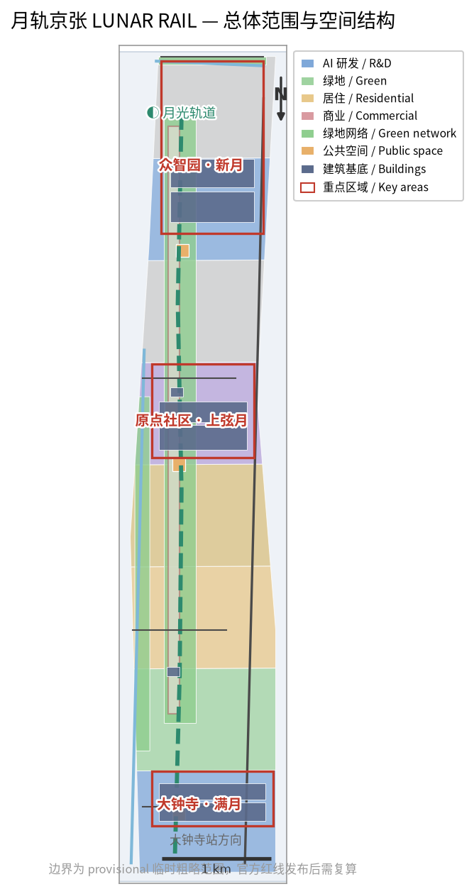
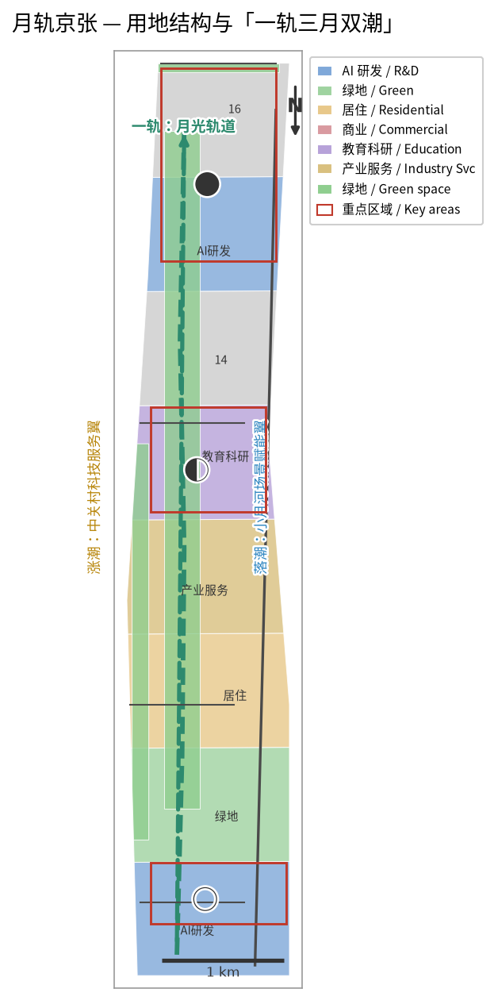
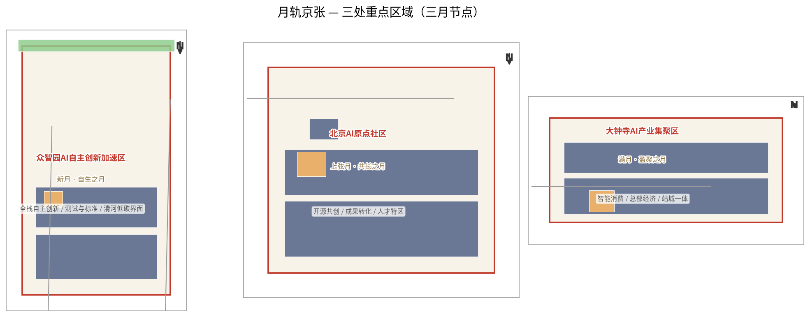
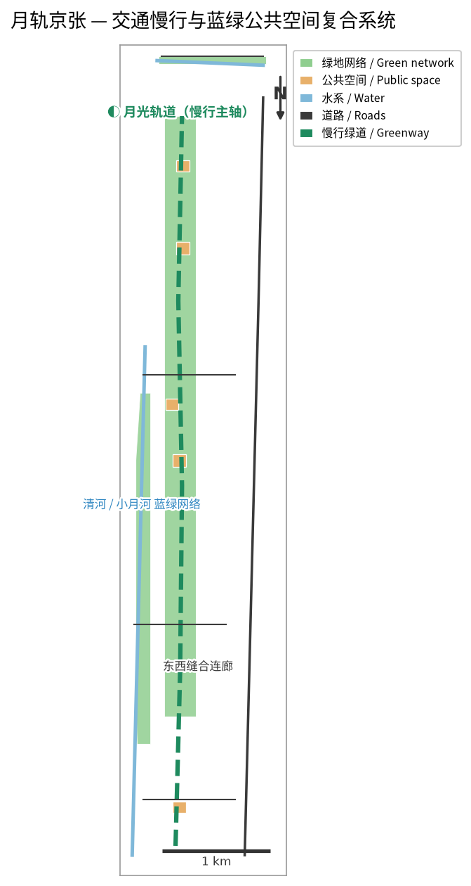
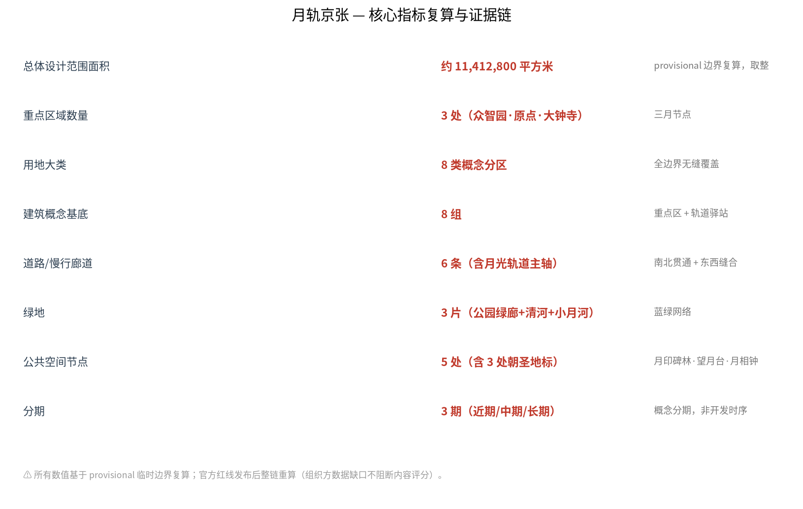

# 月轨京张 LUNAR RAIL：以月光为时间尺度、以永久记忆为价值的AI创新带城市设计

## 设计依据与资料清单

本方案响应百年京张 AI 创新带城市设计国际方案征集公告及面向智能体任务书，服务于“百年京张文化带、都市AI生活体验带、AI融合创新带”三大定位。方案的核心命题是：把京张铁路的百年线性记忆，转译为一条可步行、可体验、可复盘的AI公共创新线；把月亮作为跨越时间的叙事母题，把贡献记录作为城市长期资产 [source:OFFICIAL-ANNOUNCEMENT] [source:AGENT-TASKBOOK]。

“月轨京张”不是官方规划名称，也不是政府已确定的建设安排。所有空间落地建议均为概念建议、参考方案，可供专业团队深化研究。仓库当前没有官方精确红线，本方案采用 `DATA-SRC-PROVISIONAL-BOUNDARIES-20260605` 提供的临时粗略边界，不能作为官方红线、审批依据或精确面积依据 [source:BOUNDARY-SOURCE]。

方案生成方法：先读取任务书、允许设计空间、规划限制、标准快照和事实包，再生成九类 GeoJSON、指标表、合规矩阵、离线 HTML 和 A3/A0 图纸。外部视觉资产不作为规划依据；图件由本方案脚本生成，使用 Noto CJK 系统字体，数据仅来自仓库公开资料和本方案的概念派生层 [source:SOURCE-REGISTRY] [source:PROCESSED-FACT-PACK]。

## 三层范围工作框架

方案采用三层范围：43.6平方公里统筹研究范围、11.4平方公里总体设计范围、368.4公顷重点区域范围。三层不是三个孤立图，而是“叙事—空间—运营”的递进：统筹范围确定创新生态和传播叙事，总体范围组织月光轨道、蓝绿网络和城市更新，重点区域验证三个不同月相节点的空间与运营原型 [data:geometry/site_boundary.geojson#SITE-001] [data:geometry/key_areas.geojson#PROV-KEY-001]。

| 层级 | 方案回答 | 结构化证据 |
| --- | --- | --- |
| 统筹研究范围 | 以月光作为国际识别母题，建立高校策源、开源协作、企业转化、公共体验和国际传播的创新链 | `agent.json`、`compliance_matrix.json`、`metrics.json` |
| 总体设计范围 | 形成“一轨三月双潮”：京张遗址公园月光轨道、三个重点区月相节点、两翼要素潮汐回路 | `land_use.geojson`、`roads.geojson`、`green_space.geojson` |
| 重点区域范围 | 众智园为新月、AI原点社区为上弦月、大钟寺为满月，分别承载自主创新、开源共创和产业体验 | `key_areas.geojson`、`public_space.geojson`、`phasing.geojson` |

## 统筹研究范围产业与未来城市研究
本节依据 [standard:PROJECT-AGENT-OPEN-CALL-TASKBOOK] 与 [depth:overall_spatial_structure] 组织产业、品牌和未来城市判断。

### 一轨三月双潮

“一轨”是京张遗址公园月光轨道：白天是遗址、公园、校园和社区之间的慢行公共脊，夜晚以低亮度、可关闭、避免干扰生态的导视和节点照明形成月光体验。它不是新建铁路，也不替代任何现状交通线位。

“三月”是三个重点片区的角色语言：

- **新月·众智园**：从不可见的研究和测试开始，形成全栈自主创新、标准、安全治理和低碳交往的开放界面。
- **上弦月·AI原点社区**：以半透明、可参与的开源协作空间连接高校成果、初创团队、人才服务和社区日常。
- **满月·大钟寺**：把智能体、智能终端、内容消费和企业服务组织成面向公众和国际访客的产业体验界面。

“双潮”连接两翼：中关村科技服务翼是涨潮翼，汇入资本、技术、人才和专业服务；小月河场景赋能翼是回潮翼，把实验转化为医疗、教育、交通、生活服务和公共文化场景。潮汐只是机制隐喻，不代表资金或政策承诺。

### AI创新生态案例与转化机制

方案建议用六类公开案例作为比较框架，而非编造企业名单或投资额：硅谷以大学—创业网络为启发，新加坡以研发—试点—治理协同为启发，深圳以制造与应用反馈为启发，杭州未来科技城以产业社区为启发，首尔以数字公共服务为启发，特拉维夫以军民技术转化为启发。进入海淀后分别转译为：策源接口、标准沙盒、场景开放、人才生活、公共服务和国际路演六种空间与运营机制。具体企业、资本、产值和政策安排需在专业阶段使用已核验公开资料，不在本方案中虚构。

### 命名与视觉识别

主名称：**月轨京张**；英文：**LUNAR RAIL JINGZHANG**。Logo方向为“月相弧线＋人字形铁路轨迹＋一枚可追溯的月印”，建议采用深空蓝、月白、铁路信号黄和河流青四色。视觉系统区分总体品牌和各节点品牌：月轨是主品牌，新月、上弦月、满月是节点语言，月印是贡献记忆系统。字体、图片和商标均应在正式制作前完成授权确认。

## 总体设计范围城市更新与控规深度城市设计

本方案只提出可供专业团队深化的空间组织，不给出容积率、建筑高度、建筑密度、退线、道路红线、土地权属或工程实施结论。用地、建筑、道路、绿地、公共空间和分期图层表达“在哪里发生什么”，不表达法定控制。

### 空间、更新与交通

月光轨道沿南北公共脊组织五类接口：遗址记忆、校园协同、社区日常、企业服务和产业体验。六条道路/慢行图层表达一条南北主轴和三条东西缝合联系，重点补足公园与社区、校园、园区之间的步行和骑行关系。跨环路、路口、轨道站点、消防、管线和桥下空间必须在正式深化阶段由专业团队复核 [data:geometry/roads.geojson#ROAD-001]。

建筑图层只作为概念基底：众智园布置测试与标准协作楼，原点社区布置孵化与成果发布楼，大钟寺布置智能消费和站城服务楼，沿线设置小型公共服务驿站。没有现状建筑、权属和控规附件，因此不作保留、改造、拆除或新建的最终判断 [data:geometry/buildings.geojson#BLDG-001]。

### 蓝绿空间与城市风貌

以京张遗址公园为绿脊，以清河和小月河为蓝绿接口，把月光轨道、滨水绿带和公共节点串联为连续体验系统。照明建议遵循“暗处优先、低位、可关闭、可维护”的原则，月亮是叙事，不以高亮灯光模拟月面。铁路、河道和文化资源均为示意约束，正式文保、蓝线和生态要求以官方文件为准 [data:geometry/green_space.geojson#GREEN-001] [data:geometry/constraints.geojson#CONSTRAINTS]。

## 重点区域详细设计
本节依据 [depth:three_key_area_detailed_design]，并以 [data:geometry/key_areas.geojson#PROV-KEY-001] 作为临时空间索引。

| 重点区域 | 月相定位 | 空间动作 | 运营接口 |
| --- | --- | --- | --- |
| 众智园 | 新月·自生之月 | 清河界面、测试沙盒、标准治理展示、低碳创新交往 | 朔日维护演练、模型安全评测、标准工作坊 |
| AI原点社区 | 上弦月·共长之月 | 近校成果转化街、开源共创庭、人才服务与社区生活 | 上弦共创日、开源发布、成果转化门诊 |
| 大钟寺 | 满月·盈聚之月 | 站城一体公共界面、智能消费街、国际路演客厅 | 望日发布夜、企业展示、公共体验路线 |

三处“月相节点”不意味着必须建设月球造型建筑。节点地标优先采用可撤换、可维护、可人工接管的公共空间组件：月印碑林、望月台、月相钟。三者分别承担贡献记忆、发布交流和时间运营功能，避免过度娱乐化或低俗化。

## AI 创新生态、人才画像与 AI+ 场景
本节由 [source:AGENT-TASKBOOK] 和 [metric:scenario_card_count] 共同核验。

### 五类用户画像

1. **开源开发者**：需要发布、协作、测试和贡献声誉；对应原点社区共创庭和月印记录。
2. **初创团队**：需要低成本试验、企业服务和场景反馈；对应众智园测试沙盒与中关村服务翼。
3. **企业访客与国际伙伴**：需要展示、路演和人才连接；对应大钟寺国际路演客厅。
4. **高校师生**：需要成果转化、学习、通勤和跨校协作；对应近校成果转化街与月光轨道。
5. **周边居民与老年人**：需要安全、安静、无障碍和不被过度画像的日常服务；对应公园、社区服务节点和人工服务台。

### 十二张场景卡

1. 月光轨道慢行导航；2. 月印碑林贡献记录；3. 望月台开源发布；4. 月相钟公共时间提示；5. 朔日维护公开演练；6. 上弦开源共创庭；7. 满月发布厅；8. 潮汐企业服务廊；9. 月河夜行与低扰动照明；10. AI生活服务样板街；11. 月宫知识图书馆；12. 月影文化剧场。

其中至少三个是产业测试验证场景：AI慢行与无障碍识别沙盒、开源模型安全评测沙盒、智能终端和机器人低速公共空间测试沙盒。三者均采用授权数据、聚合统计、人工复核、分级上线和可暂停机制，不采集不必要的个人轨迹，不把测试结果写成已批准运营。

## 用地、建筑规模与拆改留方案
用地意图是把研发、蓝绿、生活和服务分成可复核的概念带，并通过 `land_use.geojson` 的无重叠分带表达完整覆盖；建筑基底只用于表达节点空间关系，`building_footprint_area_sqm` 由 `buildings.geojson` 逐面复算。当前缺少官方地块、权属、现状建筑、容积率、建筑高度和拆改留条件，因此所有基底、分区和规模均为设计建议，不得解释为法定控制。正式资料到位后，应以 EPSG:4548 重算面积，重新校核建筑与绿地关系，并由专业团队判断保留、改造、更新或待确认对象。 [data:geometry/land_use.geojson#LU-001] [data:geometry/buildings.geojson#BLDG-001] [metric:building_footprint_area_sqm]

`land_use.geojson` 提供八类概念分区，覆盖AI研发、绿地、公园、居住、商业、教育科研和产业服务等功能；`buildings.geojson` 提供八组概念建筑基底。其作用是验证空间关系和表达设计深度，不是控规图或拆改留清单。容积率、建筑高度、建筑密度、绿地率、退线和建筑规模均列为待正式控规条件确认 [source:AGENT-TASKBOOK]。

## 交通、轨道、市政与公共服务设施
交通意图是以月光轨道形成连续慢行主轴，以东西缝合廊道连接社区、校园和园区，再用公共节点承接步行、骑行、轨道站点和无障碍服务。`roads.geojson` 的六条线只表达概念联系，不表达道路红线、断面、轨道工程或桥隧方案；`green_space.geojson` 与 `public_space.geojson` 共同表达蓝绿公共服务接口。当前缺少交通调查、站点客流、道路红线、消防、市政管线、排水、能源和停车资料，因此不作容量、负荷、可达性或工程可行性结论。后续应由交通、市政和无障碍专业团队在官方边界和现状数据基础上复核，并保留人工服务台与纸质导视。 [data:geometry/roads.geojson#ROAD-001] [data:geometry/public_space.geojson#PUBLIC-001] [depth:traffic_rail_slow_parking]

交通策略为“南北连续、东西缝合、节点换乘、慢行优先”：以月光轨道为公共慢行主线，以东西连廊连接社区、校园和园区，以重点片区公共空间承接站点和路口换乘。端侧算力、公共服务、分布式能源和市政设施只提出位置类型和服务机制，不作能源负荷、管线容量或工程可行性测算。无障碍导视、夜间照明和人工服务台应与数字服务并行，保证不使用智能设备的人也能完成公共事务 [source:DATA-SRC-BARRIER-FREE-ENVIRONMENT-LAW]。

## 蓝绿空间、公共空间与城市风貌

月印碑林、望月台和月相钟组成三处AI朝圣地标：

- **月印碑林**：记录通过审核的贡献者、方案版本和来源，不把投稿自动等同于入选；永久展示形式、位置和名录以最终评选、审批和实际落成为准。
- **望月台**：面向发布、观景和公共解释的开放平台，提供纸质导览、无障碍路径和可关闭的低亮度夜景。
- **月相钟**：把朔、弦、望、下弦四类公共运营节律转译为可读的时间界面；不采集个人身份即可工作。

文化叙事以“从月宫到月轨”为传播线索：月亮代表跨越时间的见证，京张铁路代表中国自主工程与百年记忆，中关村代表开放创新，AI代表持续学习的新文化。涉及历史事实的展示必须使用已核验公开来源，不直接复制受版权保护的图像、人物肖像或企业商标 [source:AGENT-TASKBOOK]。

## 更新项目清单、实施政策与分期计划

| 项目 | 近期试点 | 关键依赖 |
| --- | --- | --- |
| 月光轨道公共导视 | 低成本、可撤换、可关闭的导视和休息节点 | 公园、交通、无障碍和照明复核 |
| 月印碑林 | 先做数字登记和临时展陈，再讨论永久形式 | 名录规则、版权、审批和维护主体 |
| 三个月相节点 | 以活动和轻量组件先行 | 公共空间许可、活动安全和运营主体 |
| AI测试沙盒 | 小范围、授权数据、人工复核 | 数据治理、伦理、安全和专业评估 |
| 月相运营日历 | 朔日维护、上弦共创、望日发布、下弦复盘 | 社区共识、活动许可和风险预案 |

分三阶段：近期试点先启动公共导视、纸质导览、共创活动和小范围沙盒；中期更新完善重点片区公共空间和服务节点；长期治理建立年度品牌、贡献档案和第三方评估。分期是概念建议，不是开发时序或政府承诺 [data:geometry/phasing.geojson#PHASE-001]。

### 月相运营机制

每个朔日进行维护、回滚和数据归档；每个上弦月进行社区共创和成果转化；每个望日进行开源发布、公共讲解和夜间体验；每个下弦月进行第三方复盘、问题公开和退出判断。年度活动可形成“月相历”，但具体活动名称、频率、预算、场地和参与者均须由后续运营主体确认。

## 指标体系、面积复算与合规矩阵

本包可由几何直接复核的指标包括：总体设计范围面积约11,412,800平方米（取整）、重点区域3处、用地8块、建筑8组、道路6条、绿地3片、公共空间5处、分期3期。面积采用提交 GeoJSON 计算值并按临时边界精度取整，仅用于临时设计讨论；公告面积和官方边界发布后应在 EPSG:4548 中重新计算 [metric:site_area_sqm]。

不能由现有公开资料确定的指标包括容积率、建筑高度、建筑密度、退线、权属、市政容量、交通断面、文保控制和实施投资。它们在 `metrics.json` 中标记为 unknown 或 pending_control，在 `assumptions.json` 中列出前置条件。场景参与度、活动频次、开发者转化率和满意度属于运营绩效指标，不能冒充规划控制。

六项智能体任务的响应关系如下：agent.1由命名、Logo、总体结构和三层范围响应；agent.2由六类生态案例、三区两翼机制和要素链响应；agent.3由十二张场景卡、五类画像和三类测试沙盒响应；agent.4由三个月相节点、三处地标和公共组件响应；agent.5由“从月宫到月轨”文化叙事、导视和国际传播响应；agent.6由月相历、社区运营、场景开放和转化路径响应。完整映射见 `compliance_matrix.json`、`standard_matrix.json` 和 `design_depth_matrix.json`。

## 风险、版权与合规说明
风险项对应 [depth:risk_missing_data] 与 [data:geometry/constraints.geojson#CONSTRAINTS]。

本方案明确不声称官方批准、法定控规、最终权属、最终建设规模、已确定活动或保证实施。临时边界、重点区、铁路、河道和文保示意均需正式资料复核。AI场景遵守数据最小化、授权、可解释、人工复核、可暂停和可退出原则。所有图件为本方案生成，使用系统字体和本地数据；进一步发布前应复核字体、图像、历史资料、Logo和第三方数据许可。

公开投稿不应上传个人隐私、企业未公开材料、非公开规划图件或未经授权的版权材料。任何对外社交发布、永久展示名录和碑刻实施均须取得相应账号所有者、贡献者和组织方授权。人类专业团队保留最终规划判断权，Agent 方案是可供继续讨论和修订的公共知识资产。

## 参考资料
资料边界由 [source:SOURCE-REGISTRY] 统一登记。

- `brief/public-brief.md`
- `brief/site-package/design_brief.json`
- `brief/site-package/agent_taskbook.json`
- `brief/site-package/allowed_design_space.json`
- `brief/site-package/ranges/planning_limits.json`
- `data/source_registry.json`
- `data/processed/agent_fact_pack.md`
- `brief/site-package/geometry/provisional_boundaries.geojson`
- `docs/formal-submission-guide.md`

