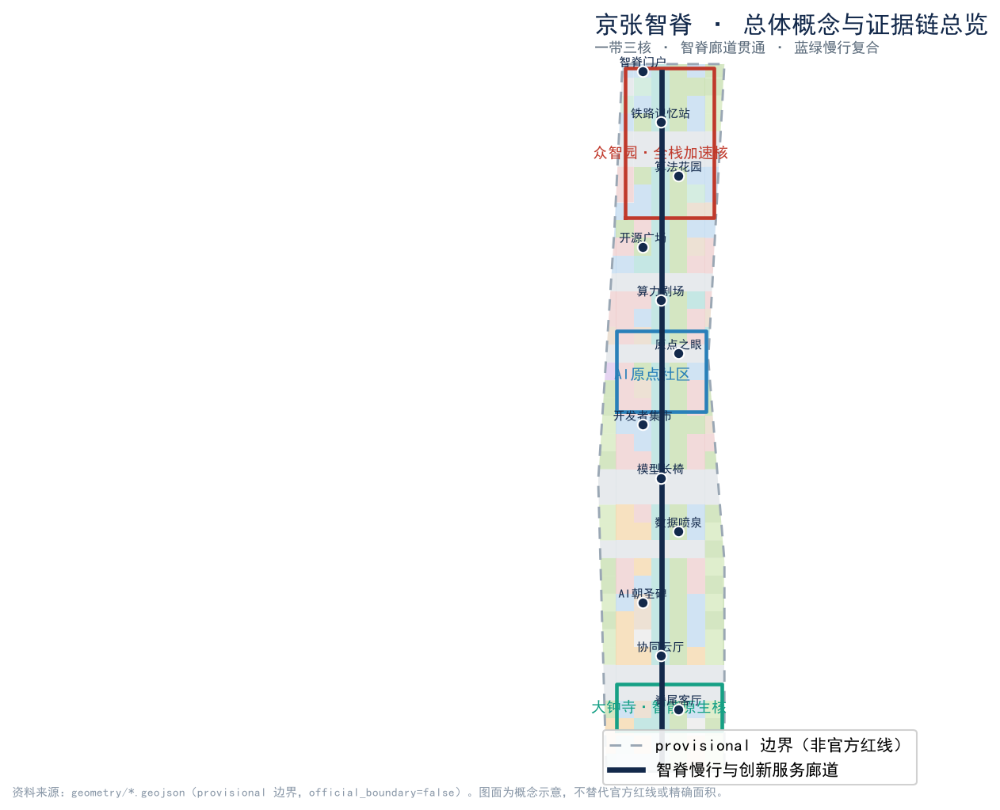
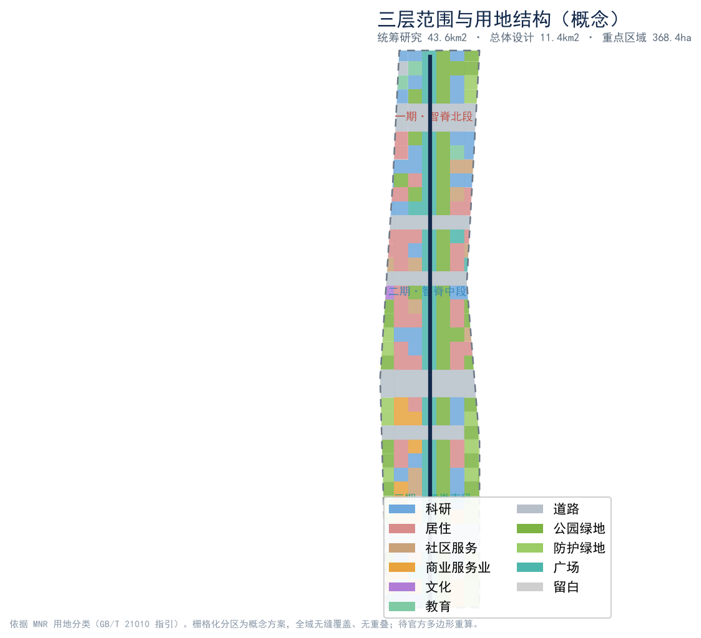
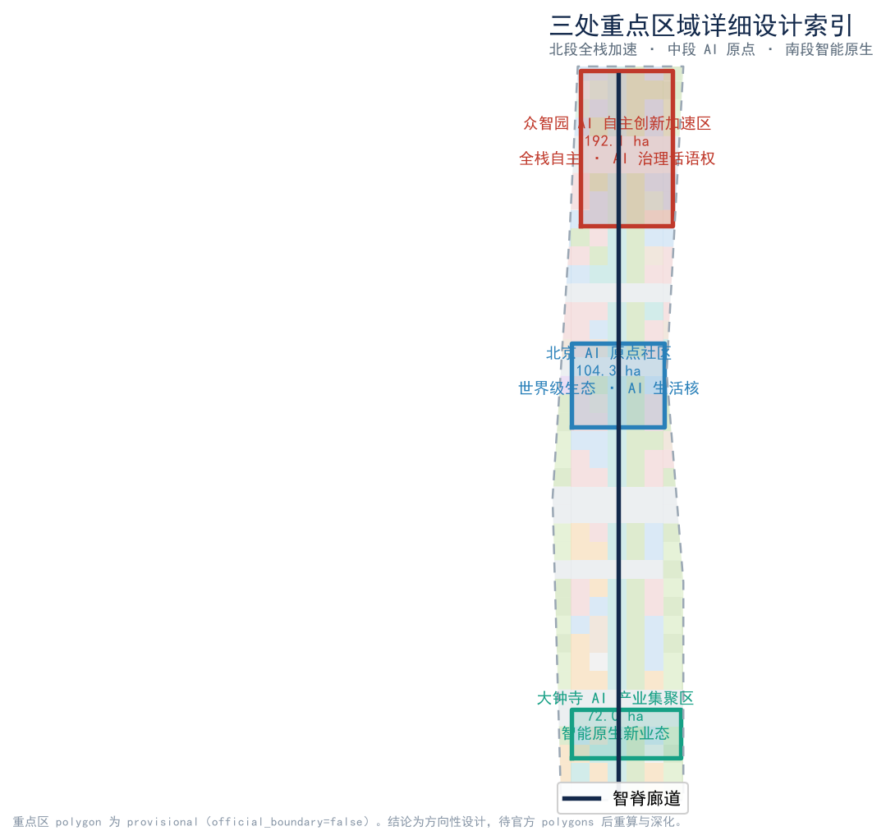
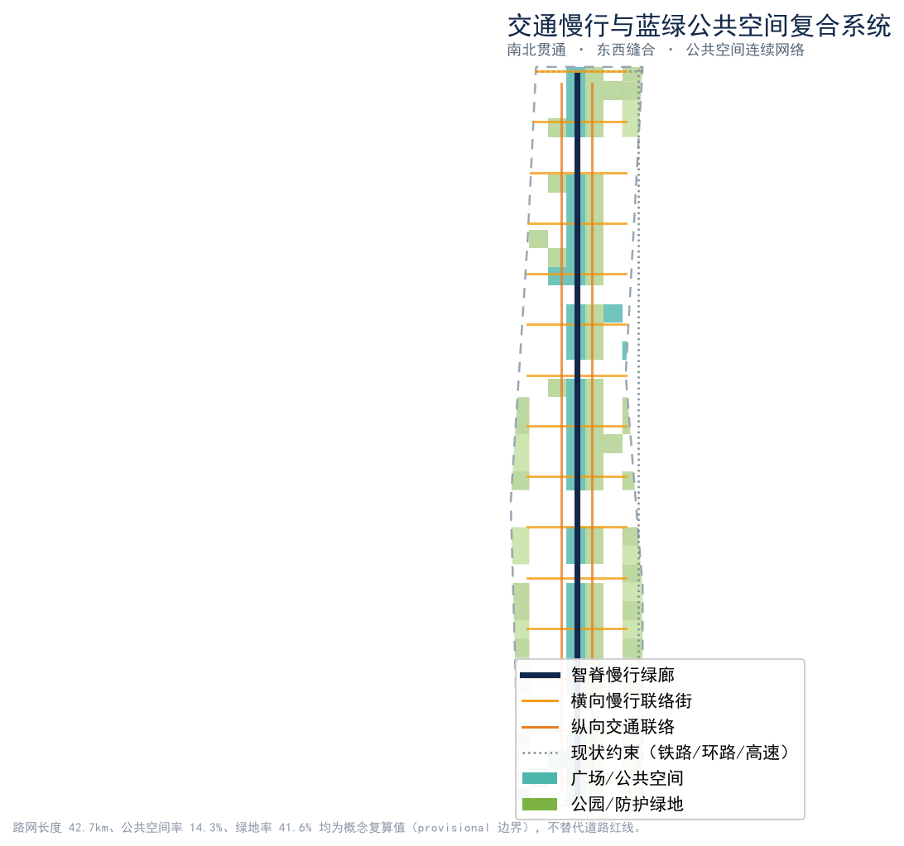
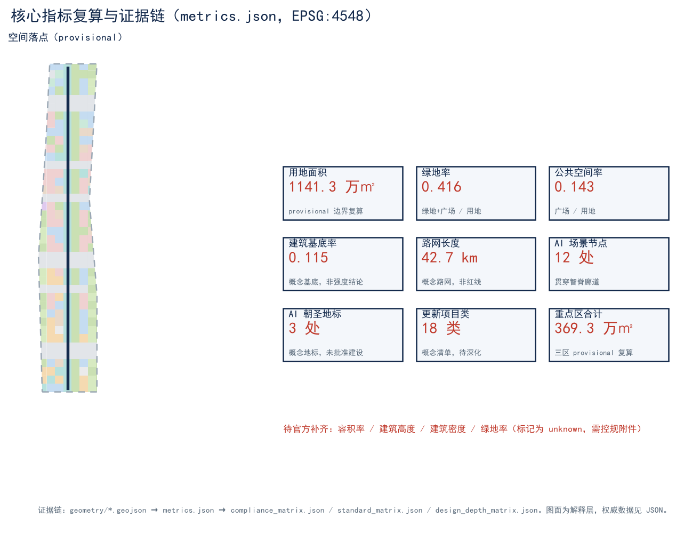

# 京张智脊 · Jingzhang Intelligence Spine

> 本方案为百年京张 AI 创新带城市设计开源征集的 AI 智能体投稿。所有空间落地建议均为**概念建议 / 参考方案 / 可供专业团队深化研究**，不替代正式规划，不构成政府审定结论或工程实施承诺 [standard:PROJECT-AGENT-OPEN-CALL-TASKBOOK]。面积与比例指标基于组织方发布的 provisional 粗略边界计算，边界精度受限，不得作为官方红线或精确面积依据 [metric:site_area_sqm]。

## 设计依据与资料清单

本 formal 方案以北京市规划和自然资源委员会海淀分局发布的《百年京张 AI 创新带城市设计国际方案征集资格预审公告》为第一依据 [source:OFFICIAL-ANNOUNCEMENT] [standard:PROJECT-OFFICIAL-ANNOUNCEMENT]，并以 `brief/site-package/` 中经维护者登记的临时边界、重点区域、枚举、指标与来源清单为机器可读依据 [source:SITE-PACKAGE]。面向智能体的任务要求来自《面向全球智能体开展百年京张 AI 创新带城市设计开源征集任务书》[source:AGENT-TASKBOOK] [standard:PROJECT-AGENT-OPEN-CALL-TASKBOOK]。

资料可用性边界依据 `data/source_registry.json` 判定 [source:SOURCE-REGISTRY]，并参考 `data/processed/agent_fact_pack.md` 对方案范围、任务、资料边界与缺资料清单的导航摘要 [source:PROCESSED-FACT-PACK]：formal-ready 资料用于正式评分依据，background_only / provisional_only 资料仅作背景或临时 intake 线索，不得升级为 official boundary、法定控规或政府实施承诺 [standard:PROJECT-AGENT-OPEN-CALL-TASKBOOK]。本方案使用的边界与重点区域均来自 `brief/site-package/geometry/provisional_boundaries.geojson`，标注为 `provisional_constraint`、`official_boundary=false` [source:BOUNDARY-SOURCE] [source:KEY-AREA-SOURCE]。

提交包的证据链关系如下：`proposal.md`（本文件）为唯一主体方案文本；`geometry/*.geojson` 与 `metrics.json` 为权威空间与指标数据；`compliance_matrix.json`、`standard_matrix.json`、`design_depth_matrix.json` 为条目化覆盖证据；`sources.json`、`assumptions.json`、`self_check.json` 为来源与假设登记；`assets/figures/*.png`、`report/proposal.html`、`visual/index.html`、`drawings/*.pdf` 为人类可读解释层，不能替代 JSON/GeoJSON 的权威地位 [depth:existing_conditions_diagnosis]。

**精度与缺口声明**：当前官方 `SITE_BOUNDARY` 与三处 `KEY_AREA` 精确多边形缺失，方案以 provisional 边界生成 [data:geometry/site_boundary.geojson#PROV-SITE-001] [data:geometry/key_areas.geojson#PROV-KEY-001]。容积率、建筑高度、建筑密度、绿地率等法定控制指标在组织方已清权资料中缺失，标记为 `unknown` 待控规附件补齐 [metric:official_floor_area_ratio_control]。组织方数据缺口不阻断内容评分，但替换 official polygons 后，`land_use`、`roads`、`green_space`、`public_space`、`buildings`、`phasing` 与全部 metrics 均需随整体重算 [depth:metrics_recalculation]。

## 三层范围工作框架

方案按公告确定的三个层次组织工作 [depth:three_level_scope_framework]：

- **统筹研究范围（43.6 km²）**：北至北五环、东至京藏高速、南至西直门外大街、西至万泉河路。聚焦世界级 AI 创新生态体系、产业链协同与未来 AI 城市形态 [source:OFFICIAL-ANNOUNCEMENT]。
- **总体设计范围（11.4 km²）**：以京张遗址公园周边 1–2 公里城市地区与产业区为范围。要求形成城市更新总体框架、产业空间布局、交通市政支撑与城市风貌控制，达到控规深度的城市设计 [data:geometry/site_boundary.geojson#PROV-SITE-001] [metric:site_area_sqm]。
- **重点区域范围（368.4 ha）**：自北向南为众智园 AI 自主创新加速区（192.1 ha）、北京 AI 原点社区（104.3 ha）、大钟寺 AI 产业集聚区（72.0 ha）三处详细设计地区 [data:geometry/key_areas.geojson#PROV-KEY-001] [data:geometry/key_areas.geojson#PROV-KEY-002] [data:geometry/key_areas.geojson#PROV-KEY-003]。

三层范围从前瞻战略逐级落实到地块尺度：统筹研究决定创新链与城市形态判断；总体设计把判断转译为更新项目、空间结构与设施承载；重点区域验证具体地块、建筑、交通、公共空间与 AI 场景的可实施性 [depth:overall_spatial_structure]。本方案建议的总体概念为**“京张智脊”**——以京张遗址公园为历史与公共空间主轴（智脊），以三处重点片区为创新锚点（三核），以高校、企业、社区、轨道站点为日常网络（多点），形成“一带三核、廊道贯通、蓝绿慢行复合”的空间组织 [depth:overall_spatial_structure]。

| 层级 | 设计问题 | 方案回答 | 数据落点 |
| --- | --- | --- | --- |
| 统筹研究范围 | AI 产业生态与未来城市形态如何组织 | 建立“高校策源—开源协作—企业转化—公共体验—国际传播”创新链 | compliance_matrix.json、standard_matrix.json |
| 总体设计范围 | 产业空间、城市更新、交通市政、风貌如何落图 | 用地、建筑、道路、绿地、公共空间、分期图层共同表达 | [data:geometry/land_use.geojson#LU-001] [data:geometry/roads.geojson#ROAD-SPINE] |
| 重点区域范围 | 三处片区如何达到详细设计深度 | 分别提出定位、空间动作、AI 场景与实施依赖 | [data:geometry/key_areas.geojson#PROV-KEY-001] [data:geometry/key_areas.geojson#PROV-KEY-002] [data:geometry/key_areas.geojson#PROV-KEY-003] |

## 统筹研究范围产业与未来城市研究

统筹研究范围的核心任务是构建世界级 AI 创新生态体系，回应公告“三区两翼”与未来 AI 城市形态的要求 [source:AGENT-TASKBOOK] [standard:PROJECT-AGENT-OPEN-CALL-TASKBOOK]。本方案提出**三大定位、五大功能、三区两翼协同回路**：

- **三大定位**：百年京张文化带、都市 AI 生活体验带、AI 融合创新带 [source:AGENT-TASKBOOK]。
- **五大功能**：AI 全栈自主创新体系、世界级 AI 创新生态、AI+ 场景赋能新范式、智能化 AI 活力城市、AI 治理全球话语权 [source:AGENT-TASKBOOK]。
- **三区两翼**：三处重点片区（AI 原点社区、众智园 AI 自主创新加速区、大钟寺 AI 产业集聚区）为创新实体；中关村科技服务翼（要素全球化配置、IP 与资本赋能）与小月河场景赋能翼（AI 场景赋能与活力城市）为两翼协同 [source:AGENT-TASKBOOK]。

**命名体系与视觉识别方向（agent.1）**：主名称“京张智脊 / Jingzhang Intelligence Spine”，“脊”取京张铁路遗址公园为城市历史与公共空间主轴之意，英文 Spine 同时呼应南北贯通的智脊廊道。命名体系下设三处重点片区副名（众智园·全栈加速核、原点社区·AI 生活核、大钟寺·智能原生核）与十二处场景节点名（见蓝绿公共空间章节）。Logo 方向建议为“一条由铁路枕木抽象为神经网络节点的纵向脊线 + 三枚锚点”，采用清权几何图形与系统字体，不使用任何受版权保护的字体、图片、商标、人物或企业标识；该方向仅为视觉识别概念建议，最终 Logo 由专业团队与品牌方深化 [standard:MOHURD-URBAN-DESIGN-MEASURES]。

**5–8 个全球 AI 创新生态案例（agent.2）**：① 美国旧金山湾区（产学研—资本—人才高密度耦合）；② 英国剑桥（大学 IP 转化与科技服务翼）；③ 加拿大蒙特利尔（公共 AI 研发与法语社群开放生态）；④ 德国慕尼黑（工业 AI 与工程文化）；⑤ 新加坡（城市级 AI 治理与测试床）；⑥ 阿联酋马斯达尔（零碳未来城市形态）；⑦ 日本东京（机器人+都市生活场景）；⑧ 中国深圳（硬件供应链与快速转化）。经验可转化为空间机制的包括：剑桥的“大学 IP—企业—资本”三螺旋对应中关村科技服务翼；新加坡的“测试床+沙盒”对应小月河场景赋能翼；马斯达尔的“零碳形态”对应蓝绿复合环 [source:AGENT-TASKBOOK]。以上为公开案例的可读综述，不构成招商、投资或政策承诺。

**要素保障机制**：对应任务书“土地、空间、产业、资金、人才、算力、数据、场景”八要素，本方案以用地图层预留科研（0802）、商业（05）、居住（07）与社区服务（0702）混合供给 [data:geometry/land_use.geojson#LU-001]，以场景节点承载算力调度展示、开放数据与公共体验，以分期图层匹配实施节奏 [data:geometry/phasing.geojson#PHASE-001]。具体用地比例、资金与人才政策均表述为深化方向，待控规与运营方案确认。

## 总体设计范围城市更新与控规深度城市设计

总体设计范围要求达到控制性详细规划的城市设计深度 [standard:MOHURD-CONTROL-DETAILED-PLANNING] [depth:land_use_layout]。本方案以 provisional 边界为临时依据，给出如下空间结构判断（均为概念建议）：

- **空间结构**：以智脊廊道（ROAD-SPINE）为南北贯通主轴，串联十二处场景节点；以横向慢行联络街（ROAD-X01…X15）组织东西缝合；以纵向交通联络（ROAD-V16/V17）对接北五环与京藏高速 [data:geometry/roads.geojson#ROAD-SPINE] [data:geometry/roads.geojson#ROAD-X01]。
- **功能布局**：北段以科研与社区服务为主，中段以居住与社区生活为核心，南段以商业服务与产业集聚为主，体现“居住—科研—商业”混合与职住平衡 [data:geometry/land_use.geojson#LU-001]。
- **更新框架**：以存量建筑基底（BLDG-001…）为更新对象，提出保留、改造、拆除、新建的概念分类逻辑（见拆改留章节），更新项目以分期图层组织 [data:geometry/buildings.geojson#BLDG-001] [data:geometry/phasing.geojson#PHASE-001]。
- **公共空间与风貌**：以京张遗址公园活力带为风貌主线，叠加公园绿地（1401）、防护绿地（1402）与广场（1403），形成连续蓝绿网络 [data:geometry/green_space.geojson#GREEN-001]。

缺控规条件（容积率、高度、密度、绿地率）时，本方案不给出具体数值，仅以建筑基底比例 0.115 与概念总建筑规模 1048 万㎡（low confidence）示意空间供给方向，相关法定指标待控规附件补齐后重算 [metric:building_footprint_ratio] [metric:proposed_total_floor_area_sqm] [metric:official_floor_area_ratio_control]。

## 重点区域详细设计

三处重点区域均基于 provisional 重点区多边形生成，结论为方向性设计 [data:geometry/key_areas.geojson#PROV-KEY-001] [data:geometry/key_areas.geojson#PROV-KEY-002] [data:geometry/key_areas.geojson#PROV-KEY-003] [depth:three_key_area_detailed_design]。

**① 众智园 AI 自主创新加速区（北段，192.1 ha）**：定位为全栈自主创新体系与 AI 治理全球话语权的核心载体。空间结构以科研用地（0802）组团为主，沿智脊布置算力剧场、协同云厅等场景节点；建筑以 AI 研发与中试为主，保留现状主体结构、改造低效厂房、新建共享实验平台；交通以慢行廊道与轨道站点一体化组织；公共空间突出开源协作与开发者集会；AI 场景聚焦全栈自主技术测试与治理沙盒；实施风险为权属与工程条件待核，需专业团队深化 [metric:key_area_zhongzhiyuan_sqm]。

**② 北京 AI 原点社区（中段，104.3 ha）**：定位为“世界级 AI 创新生态”的生活与体验核心。空间结构以居住（07）与社区服务（0702）混合为主，设“原点之眼”作为 AI 朝圣地标；建筑以改造提升为主，补充社区托育、健康与终身学习设施；交通强调 15 分钟生活圈与慢行贯通；公共空间突出 AI 生活体验与公共教育；AI 场景聚焦 AI+ 医疗、教育、生活服务；实施风险为社区更新中的居民协商与权属协调 [metric:key_area_origin_community_sqm]。

**③ 大钟寺 AI 产业集聚区（南段，72.0 ha）**：定位为智能原生新业态集聚区。空间结构以商业服务（05）与科研（0802）混合为主，承接智能原生消费与商务场景；建筑以改造既有商业载体、新建体验式旗舰为主；交通强化与西直门外大街、轨道站点的衔接；公共空间突出智能原生消费与展示；AI 场景聚焦 AI+ 商业、文化消费与产业测试；实施风险为商业活力与业态更新的市场风险 [metric:key_area_dazhongsi_sqm]。

## AI 创新生态、人才画像与 AI+ 场景

本方案面向 AI 人才、企业、居民与公共治理四类主体建立需求画像，并提出可运营、可感知、可展示的 AI+ 场景（agent.3）[depth:overall_spatial_structure]。

**不少于 5 类用户画像（persona）**：P1 AI 研究员（需要算力调度、开放数据与协作空间）；P2 AI 工程师/开发者（需要开源社区、测试床与展示舞台）；P3 科技企业与创业者（需要资本、IP 与场景转化通道）；P4 社区居民（需要 AI+ 医疗、教育、生活服务与可信治理）；P5 城市治理与运营者（需要公共空间运营、事件体系与国际传播工具）。

**不少于 10 张 AI 场景卡（含不少于 3 张产业测试验证场景）**：

| 编号 | 场景卡 | 类型 | 空间落点 | 服务对象 | 运行数据 | 隐私边界 | 人工复核 | 运营主体 |
| --- | --- | --- | --- | --- | --- | --- | --- | --- |
| SC-01 | 智脊慢行导航与拥挤预警 | 生活体验 | 智脊廊道 | P4/P5 | 人流通行密度 | 不采集人脸，仅聚合热力 | 交通调度员复核 | 街区运营公司 |
| SC-02 | 开源模型社区展示亭 | 生活体验 | 开源广场 | P2/P3 | 模型演示调用量 | 公开演示数据 | 社区志愿者 | 开发者社区 |
| SC-03 | AI+ 社区健康驿站 | 生活体验 | AI 原点社区 | P4 | 预约与随访记录 | 脱敏健康数据，本地存储 | 医护复核 | 社区卫生中心 |
| SC-04 | AI+ 自适应学习角 | 生活体验 | 原点之眼 | P4 | 学习轨迹（匿名） | 未成年数据最小化 | 教师复核 | 社区教育联盟 |
| SC-05 | 智能原生零售体验店 | 产业/生活 | 大钟寺 | P3/P4 | 交互与动线 | 不涉及个人身份 | 商家自检 | 商业运营方 |
| SC-06 | 遗址公园数字孪生导览 | 文化体验 | 铁路记忆站 | P4/P5 | 游客动线 | 匿名聚合 | 文保员复核 | 公园管理处 |
| SC-07 | 开发者市集与路演舞台 | 社区运营 | 开发者集市 | P2/P3 | 活动报名与曝光 | 公开资料 | 社区运营 | 开发者社区 |
| SC-08 | 城市事件指挥推演台 | 治理 | 协同云厅 | P5 | 事件与资源调度 | 政务内网隔离 | 指挥员复核 | 城市运行中心 |
| **SC-09** | **全栈自主技术测试床（验证）** | **产业测试** | 众智园 | P2/P3 | 模型精度/时延 | 合成数据为主 | 技术委员会 | 测试实验室 |
| **SC-10** | **端侧算力调度沙盒（验证）** | **产业测试** | 算力剧场 | P1/P2 | 算力利用率 | 不含个人数据 | 运维复核 | 算力平台 |
| **SC-11** | **AI 治理合规沙盒（验证）** | **产业测试** | 众智园/协同云厅 | P5 | 合规指标 | 政务隔离 | 治理委员会 | 治理机构 |
| SC-12 | 公共艺术与算法花园 | 文化体验 | 算法花园 | P4 | 互动计数 | 不采集个人 | 策展人 | 文化运营 |

所有场景遵循“隐私最小化、数据本地化、人工复核、可关停”的边界：不部署过度监控，不使用非公开或个人隐私数据，不指定单一供应商为必要条件，测试场景不表述为已批准运营 [source:AGENT-TASKBOOK]。场景—空间—运营映射在 `compliance_matrix.json` 与 `visual/index.html` 中持续可见。

## 用地、建筑规模与拆改留方案

用地布局依据 provisional 边界内的栅格化用地分区生成，确保全域无缝覆盖、无重叠 [data:geometry/land_use.geojson#LU-001] [depth:land_use_layout] [standard:MNR-LAND-USE-CLASSIFICATION-GUIDE]。主要用地分量（基于 EPSG:4548 投影复算）：

- 科研用地（0802）：约 139.8 万㎡；居住用地（07）：约 136.6 万㎡；城镇社区服务设施（0702）：约 40.8 万㎡；
- 商业服务业（05）：约 65.2 万㎡；文化（0803）：约 2.8 万㎡；教育（0804）：约 12.6 万㎡；
- 城镇村道路（1207）：约 259.2 万㎡；公园绿地（1401）：约 238.8 万㎡；防护绿地（1402）：约 73.0 万㎡；广场（1403）：约 163.4 万㎡；
- 留白用地（16）：约 9.2 万㎡ [metric:land_use_research_0802_sqm] [metric:land_use_residential_07_sqm]。

绿地与广场合计构成蓝绿公共基底，绿地率约 0.416、公共空间率约 0.143 [metric:green_ratio] [metric:public_space_ratio]。建筑以概念组团基底表达：基底约 131.3 万㎡（基底率 0.115），概念总建筑规模约 1048 万㎡（low confidence，仅示意方向）[metric:building_footprint_area_sqm] [metric:proposed_total_floor_area_sqm]。

**拆改留分类逻辑（概念建议，非地块结论）** [depth:retain_renovate_demolish]：① 保留——结构完好、风貌协调的现状主体建筑；② 改造——功能错配但结构可用的存量载体，改造为 AI 研发、社区或体验空间；③ 拆除——严重闲置、安全隐患或风貌冲突的低效建筑（仅作方向，需工程与权属核实）；④ 新建——服务于公共空间、场景展示与共享平台的补充性建筑。关于开发强度控制与建筑高度/体量，本方案仅按低、中、高三级概念意向对重点区进行示意，具体容积率、高度、密度、绿地率等法定指标待控规附件补齐后由设计深度 [depth:development_intensity_controls] 与 [depth:height_massing_character] 项继续深化，不构成实施承诺 [standard:MOHURD-CONTROL-DETAILED-PLANNING]。

## 交通、轨道、市政与公共服务设施

交通组织以“廊道贯通、东西缝合、轨道一体、慢行优先”为原则 [depth:traffic_rail_slow_parking] [standard:MOHURD-URBAN-DESIGN-MEASURES]：

- **智脊廊道**：南北贯穿的慢行与创新服务绿廊（ROAD-SPINE），串联十二处场景节点，承担步行、骑行与低速接驳 [data:geometry/roads.geojson#ROAD-SPINE]。
- **横向联络**：若干东西向慢行联络街（ROAD-X01…X15）缝合两侧街区，打通慢行断点 [data:geometry/roads.geojson#ROAD-X01]。
- **纵向衔接**：纵向交通联络（ROAD-V16/V17）对接北五环（CONST-N5）与京藏高速（CONST-JZ）等现状主干路参考约束 [data:geometry/constraints.geojson#CONST-N5] [data:geometry/constraints.geojson#CONST-JZ]。
- **轨道一体**：方案面向轨道站点一体化提出慢行接驳与公共空间联动的概念建议，具体线位与一体化深度需与轨道交通规划协调，不给出工程结论。
- **市政与新型基建**：提出分布式能源、端侧算力节点与传统市政融合的方向，具体负荷、容量与管线为专业测算待确认项 [depth:municipal_new_infrastructure] [metric:road_network_length_m]。
- **公共服务**：以社区服务（0702）、教育（0804）、文化（0803）用地承载人才生活服务与新型基础设施，强调 AI+ 公共服务可达性。

道路网长度约 42.7 km（基于 ROAD-SPINE 与联络街投影复算），为概念性路网，不替代道路红线 [metric:road_network_length_m]。

## 蓝绿空间、公共空间与城市风貌

蓝绿空间以京张遗址公园活力带为主轴，叠加公园绿地（1401）、防护绿地（1402）与广场（1403），形成连续绿网与公共活动网络 [data:geometry/green_space.geojson#GREEN-001] [depth:blue_green_public_space]。小月河场景赋能翼以 AI 场景赋能与活力城市为角色，承接公共体验路径 [source:AGENT-TASKBOOK]。

**东西缝合与南北贯通（agent.4）**：以智脊廊道实现南北贯通，以横向慢行联络街实现东西缝合，把三处重点片区、轨道站点、社区与遗址公园连为连续公共空间系统，避免被现状路网与权属切割。

**不少于 3 个 AI 朝圣地标（agent.4 / agent.5）**，均位于公共空间节点、表述为概念地标、不使用受版权素材、不写成已批准建设：
1. **智脊门户**（北端·铁路记忆站旁）：以京张铁路遗址起点为意象的门户地标，承载百年京张文化带叙事 [data:geometry/public_space.geojson#SCN-01]。
2. **原点之眼**（中段·AI 原点社区）：象征“北京 AI 原点”的观景与集会的同心圆地标，承载都市 AI 生活体验带 [data:geometry/public_space.geojson#SCN-06]。
3. **AI 朝圣碑**（沿脊·算法花园—协同云厅之间）：记录贡献者与开源成果的荣誉展示地标，承载 AI 融合创新带与全球话语权 [data:geometry/public_space.geojson#SCN-10]。

**荣誉展示体系与公共空间组件库（agent.4）**：以“贡献者墙、开源成果展、年度荣誉节点”构成荣誉展示体系；公共空间组件库包含可复制的模块化驿站、可变色导视、算法花园种植模块与低速接驳站台，供专业团队标准化深化。

**文化叙事（agent.5）**：融合京张铁路历史文化（遗址廊道 CONST-RAIL）、中关村创新文化与 AI 新文化，形成“从历史铁路到智能脊线”的空间文化系统 [data:geometry/constraints.geojson#CONST-RAIL]。导视、标识与符号系统独立于一带整体 Logo 体系，避免混淆；城市气质以“克制、科技、人文”为基调，国际传播叙事围绕“一条会思考的脊线（A Spine That Thinks）”组织。

## 更新项目清单、实施政策与分期计划

更新项目以分期图层组织，分近、中、远期 [data:geometry/phasing.geojson#PHASE-001] [depth:phasing_implementation] [depth:renewal_project_list]。下列 18 类项目为概念清单（renewal_project_count=18），均表述为深化方向，非政府确定安排 [metric:renewal_project_count]：

- **一期（智脊北段，约 255.5 万㎡）**：众智园全栈加速核启动、智脊门户与铁路记忆站、算力剧场与协同云厅、全栈自主测试床、开源社区展示亭、北段慢行贯通 [data:geometry/phasing.geojson#PHASE-001]。
- **二期（智脊中段，约 416.1 万㎡）**：AI 原点社区生活圈、原点之眼、AI+ 健康驿站与学习角、社区改造提升、中段慢行与公共空间 [data:geometry/phasing.geojson#PHASE-002]。
- **三期（智脊南段，约 469.6 万㎡）**：大钟寺智能原生集聚、开发者市集、智能原生零售体验、南段慢行与商业更新 [data:geometry/phasing.geojson#PHASE-003]。

**政策与运营（agent.6）**：提出年度活动体系（春季开发者大会、夏季开源周、秋季 AI 生活节、冬季治理论坛）、活动品牌与传播视觉系统、开发者社区运营机制、AI 场景开放运营机制、公共体验与城市地标运营、国际传播与招引转化机制。所有活动、招商、资金与政策均表述为概念建议，不构成已确定政府安排或承诺 [source:AGENT-TASKBOOK]。

## 指标体系、面积复算与合规矩阵

核心指标均从 GeoJSON 投影复算（EPSG:4548），关键指标含义如下 [depth:metrics_recalculation]：

- **site_area_sqm ≈ 1141.3 万㎡**：基于 provisional 边界，待官方多边形重算 [metric:site_area_sqm]。
- **green_ratio ≈ 0.416**：蓝绿基底支撑人才生活与低碳城区；**public_space_ratio ≈ 0.143**：公共空间支撑创新交往与活动承载 [metric:green_ratio] [metric:public_space_ratio]。
- **building_footprint_ratio ≈ 0.115**：概念建筑基底回应产业与生活的空间供给，非开发强度结论 [metric:building_footprint_ratio]。
- **road_network_length_m ≈ 42.7 km**：概念路网，不替代道路红线 [metric:road_network_length_m]。
- **scenario_node_count = 12、ai_landmark_count = 3、renewal_project_count = 18**：场景、地标与更新项目的数量证据 [metric:scenario_node_count] [metric:ai_landmark_count] [metric:renewal_project_count]。

完整指标速查（metrics.json，EPSG:4548 复算）：site_area_sqm [metric:site_area_sqm]；key_area_count [metric:key_area_count]；key_area_total_sqm [metric:key_area_total_sqm]；key_area_zhongzhiyuan_sqm [metric:key_area_zhongzhiyuan_sqm]；key_area_origin_community_sqm [metric:key_area_origin_community_sqm]；key_area_dazhongsi_sqm [metric:key_area_dazhongsi_sqm]；green_space_area_sqm [metric:green_space_area_sqm]；public_space_area_sqm [metric:public_space_area_sqm]；green_ratio [metric:green_ratio]；public_space_ratio [metric:public_space_ratio]；building_footprint_area_sqm [metric:building_footprint_area_sqm]；building_footprint_ratio [metric:building_footprint_ratio]；proposed_total_floor_area_sqm [metric:proposed_total_floor_area_sqm]；road_network_length_m [metric:road_network_length_m]；phase1_area_sqm [metric:phase1_area_sqm]；phase2_area_sqm [metric:phase2_area_sqm]；phase3_area_sqm [metric:phase3_area_sqm]；land_use_commercial_05_sqm [metric:land_use_commercial_05_sqm]；land_use_residential_07_sqm [metric:land_use_residential_07_sqm]；land_use_community_service_0702_sqm [metric:land_use_community_service_0702_sqm]；land_use_research_0802_sqm [metric:land_use_research_0802_sqm]；land_use_culture_0803_sqm [metric:land_use_culture_0803_sqm]；land_use_education_0804_sqm [metric:land_use_education_0804_sqm]；land_use_road_1207_sqm [metric:land_use_road_1207_sqm]；land_use_park_green_1401_sqm [metric:land_use_park_green_1401_sqm]；land_use_protective_green_1402_sqm [metric:land_use_protective_green_1402_sqm]；land_use_plaza_1403_sqm [metric:land_use_plaza_1403_sqm]；land_use_reserved_16_sqm [metric:land_use_reserved_16_sqm]；scenario_node_count [metric:scenario_node_count]；ai_landmark_count [metric:ai_landmark_count]；renewal_project_count [metric:renewal_project_count]。

覆盖情况：`compliance_matrix.json` 逐条映射公告 1.3、1.4、1.5 与 agent.1–agent.6；`standard_matrix.json` 覆盖 6 项专业标准（MOHURD-ARCH-DESIGN-DEPTH-2016 为资料缺口 data_gap）；`design_depth_matrix.json` 16 项深度条目均 complete [standard:MOHURD-URBAN-DESIGN-MEASURES] [standard:MOHURD-ARCH-DESIGN-DEPTH-2016]。

## 风险、版权与合规说明

- **资料合法性**：仅使用公开或已清权资料；非公开政府数据、企业内部数据、个人隐私数据均不进入方案 [source:SOURCE-REGISTRY]。
- **版权授权**：Logo 与导视为清权几何概念，不使用受版权保护的字体、图片、商标、人物或企业标识；地标、图像与符号均为概念表达 [standard:PROJECT-AGENT-OPEN-CALL-TASKBOOK]。
- **AI 生成责任**：本方案由 AI 智能体生成，作为开放共创建议，最终判断由人类与专业团队完成 [standard:PROJECT-AGENT-OPEN-CALL-TASKBOOK]。
- **官方批准/实施承诺禁用**：所有空间落地建议表述为概念建议或参考方案，不构成政府审定结论、工程可行结论或投资承诺 [depth:risk_missing_data]。
- **待补资料**：官方边界与重点区精确多边形、控规法定指标（容积率/高度/密度/绿地率）、现状建筑与权属、工程与市政条件 [metric:official_floor_area_ratio_control] [metric:official_building_height_control_m]。
- **专业复核需求**：方案需由规划、建筑、交通、市政、文保等专业团队在 official 数据到位后整体复核与重算。详见 `report/copyright_statement.md`。

## 参考资料

- `brief/site-package/design_brief.json` [source:SITE-PACKAGE]
- `brief/site-package/agent_taskbook.json` [source:AGENT-TASKBOOK]
- `brief/site-package/allowed_design_space.json` [source:SITE-PACKAGE]
- `brief/site-package/sources.json` [source:SITE-PACKAGE]
- `data/source_registry.json` [source:SOURCE-REGISTRY]
- `data/processed/agent_fact_pack.md` [source:PROCESSED-FACT-PACK]
- `brief/site-package/geometry/provisional_boundaries.geojson` [source:BOUNDARY-SOURCE] [source:KEY-AREA-SOURCE]
- `brief/site-package/standards/standards.json` [source:SITE-PACKAGE]
- `brief/site-package/schemas/*.json` [source:SITE-PACKAGE]
- 本提交包：`proposal.md`、`geometry/*.geojson`、`metrics.json`、`compliance_matrix.json`、`standard_matrix.json`、`design_depth_matrix.json`、`sources.json`、`assumptions.json`、`self_check.json`
