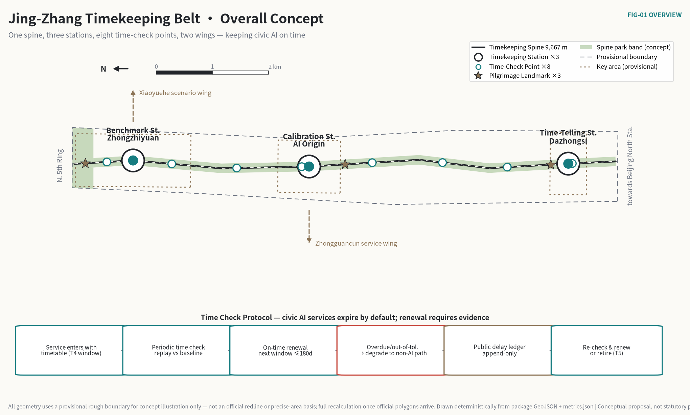
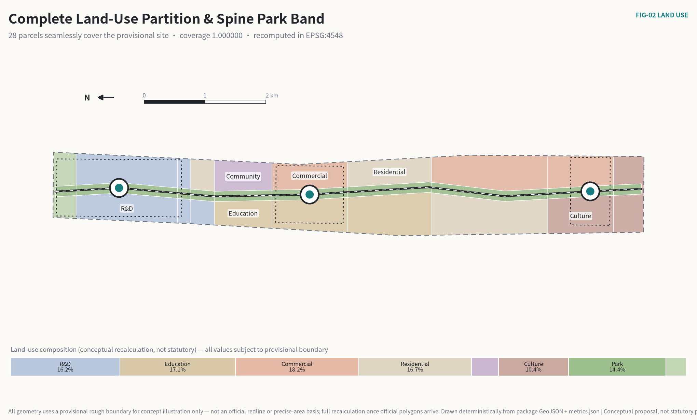
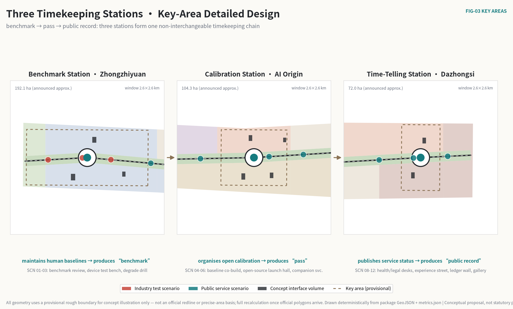
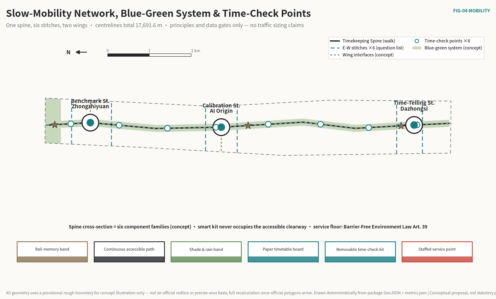
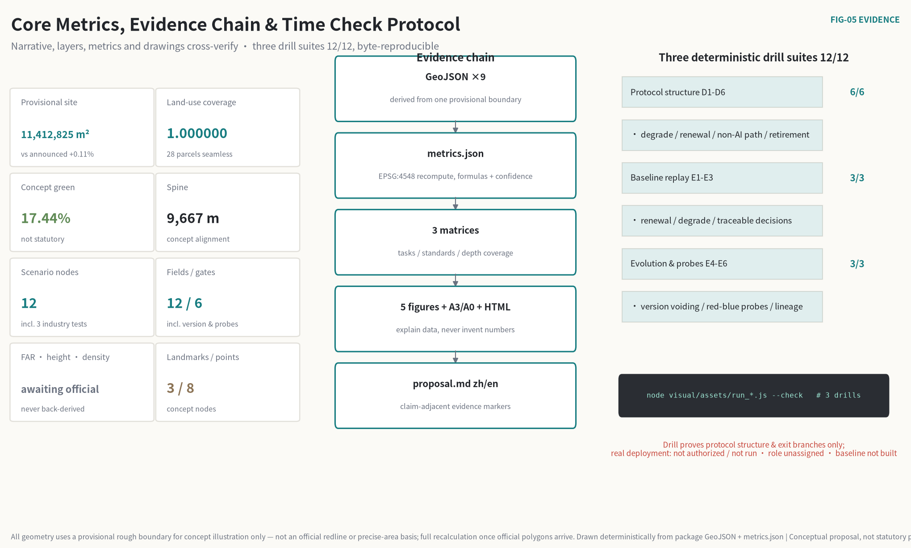

# Jing-Zhang Timekeeping Belt: Keeping Civic AI On Time

> A railway stays safe for a century not because one locomotive never fails, but because of a timetable everyone can read, where delays are recorded and expired services must yield the line.
>
> Cities are handing more judgment to AI under the opposite default: deploy once, valid forever; fix errors quietly; measure drift never; retire pilots never. **This proposal reverses the default — civic AI services expire by default.** Every AI service operating in public space holds a service timetable with an expiry date and is periodically "time-checked" against a human-maintained baseline. An overdue service degrades automatically to its human path; an out-of-tolerance service degrades with public retest conditions; every delay enters a public, append-only ledger.
>
> A technology that serves the public does not need to be proven forever right. It needs to be proven **always on time**.

## One-Page Executive Brief

| The jury will ask | This proposal answers | What can be verified |
| --- | --- | --- |
| What is the core thesis | Trust in civic AI comes from "staying on time": service windows expire by default and renewal requires a periodic time check against a human baseline, so "pilot forever" is structurally impossible | Service-timetable schema (12 required fields, including version binding and probe policy) and six service gates T0–T5 [data:visual/assets/timetable.schema.json] |
| Can a third party test the mechanism | Yes. `node visual/assets/run_timecheck_tabletop.js --check` deterministically replays six checks on four sample timetables: overdue degrade, out-of-tolerance degrade, on-time renewal, non-AI path continuity, five-step retirement | Three deterministic drill suites, 12/12 checks pass (protocol structure 6/6 · baseline replay 3/3 · evolution & probes 3/3); every evidence JSON carries its input hash and is byte-reproducible [metric:timetable_field_count] |
| What was done spatially | A ~9.7 km Timekeeping Spine runs the full overall-design area; three Timekeeping Stations sit on the three key areas (Benchmark Station · Zhongzhiyuan / Calibration Station · AI Origin Community / Time-Telling Station · Dazhongsi); eight Time-Check Points attach to community facilities along the line | Nine GeoJSON layers; seamless land-use partition, coverage ratio 1.000000 [metric:land_use_coverage_ratio] |
| Why are the three service floors enforceable | Not by designer goodwill but by current law and policy: Barrier-Free Environment Law Art. 39 requires retaining staffed traditional service; Generative AI Interim Measures Arts. 14–15 require remediation and complaint feedback; State Council Doc. 2020-45 establishes traditional and smart services in parallel | Three regulatory sources in `sources.json` with local snapshots and article locations [source:BARRIER-FREE-LAW] |
| Who receives the public value | Residents who use no smart device get the same basic service as AI users; any resident may request a review of a reading that affected them at the nearest Time-Check Point | Seven personas; minimum-data and exit terms on twelve scenario cards; eight Time-Check Points located [metric:time_check_point_count] |
| What can start soon | Phase 1 is only 34.5 ha: the protocol text, a pilot segment around the Calibration Station and tabletop-to-sandbox drills for two low-risk services — using no unpublished official data | Eight action packages with entry evidence and stop conditions; three-phase geometry covers the provisional site [metric:phase_1_area_sqm] |
| What is deliberately withheld | FAR, building height, density, setbacks, road redlines, retain/demolish conclusions, engineering alignments, investment estimates | The corresponding `metrics.json` entries are marked pending official data, with preconditions recorded [metric:floor_area_ratio] |
| Where does the method end | A time check measures consistency with a baseline; it cannot prove a service is worth having. Demand-side evidence must come from pre-pilot baselines and public participation — this proposal states that missing half honestly | Risk chapter and assumption register [depth:risk_missing_data] |
| How trustworthy is the data | All geometry uses a provisional rough boundary (0.11% off the announced figure); repository Issue #846 records a reproducible spatial discrepancy between the provisional boundary and the OSM-mapped park — evidence unfavourable to this proposal, disclosed anyway; three sets of official statistics, re-verified on their publishers' original pages, serve as background calibration only and never enter spatial indicators; full recalculation once official polygons arrive | Boundary status, recalculation trigger and the data-baseline translation table [source:BOUNDARY-SOURCE] [metric:provisional_site_area_difference_ratio] |

**中文摘要。** 京张授时带把铁路最古老的运营纪律——时刻表——转译为城市 AI 治理：每个进入公共空间的 AI 服务持有一张有到期日的运行时刻表，定期与人工基准对时；到期未对时自动降级为人工服务，误点记录公开、只增不删。一条授时脊、三座授时站、八个对时点承载这套机制；全部空间内容为临时边界上的概念建议，不替代法定规划。

## Time-Check Day: What the Mechanism Looks Like on the Street

A mechanism written as rules must be walked on the street. Here are ten minutes of persona P4 — a 74-year-old resident who uses no smartphone — passing the Chengfu Road Time-Check Point on "time-check day".

**9:30 a.m., Chengfu Road Time-Check Point (attached to the community service station).** The notice board has new content: this quarter's timetable summary for AI services along the belt — health navigation, last check on time, next check due in 11 days; the accessibility companion service, one out-of-tolerance degrade last quarter, renewed after a passed retest, delay-record number listed. She reads the board without any device. That is part of the design.

**She notices one record about health navigation.** Last quarter it gave three residents the address of a relocated clinic; sampled replay found the referral inconsistent with the public directory — under the protocol that is an "out-of-tolerance" reading, and the service degraded that day to the staffed window plus the paper directory until the directory was synchronised and a new time check passed. **In the two degraded weeks, the service window completed every request.** That is the difference between degrading and shutting down: degrading only returns AI to its guaranteed substitute; the public service itself never breaks.

**What she can do.** The bottom corner of the board reads: any resident may register at this point to request a review of a service reading that affected them; the review result is published beside the original reading. This right sits five minutes' walk from her home — a review channel that requires a special trip to a distant office is no right at all.

No smart device took part in these ten minutes, yet every element of the mechanism — the public timetable, the delay ledger, degrade-without-interruption, the nearby right of review — was present.

## Design Basis and Source Inventory

### Evidence tiers

This proposal first decides what each source can support, then decides what may be drawn. The project name, the three scope levels with textual extents, approximate areas, the three key areas and the design tasks come from the official announcement; the six agent tasks, three positionings, five functions, three-areas-two-wings structure and deliverable requirements come from the cleared agent taskbook. [source:OFFICIAL-ANNOUNCEMENT] [source:AGENT-TASKBOOK]

| Evidence class | How this proposal uses it | Can support | Cannot support |
| --- | --- | --- | --- |
| Official task basis | Announcement and local standard snapshots | Tasks, scope texts, approximate areas, deliverable depth | Exact polygons, statutory controls, engineering conditions |
| Cleared task basis | Agent taskbook | Branding, cases, scenarios, landmarks, culture, operations tasks | Statutory planning, government action or investment commitments |
| Provisional spatial basis | Repository provisional boundaries | Concept generation, topology self-check, relative relations, offline visualisation | Official redlines, ownership, precise areas, approval basis |
| Regulatory baseline | Law snapshots registered in the repository | Legality direction of the three service floors (non-AI path, human review, complaint feedback) | Project-level compliance conclusions or administrative judgments |
| Administrative-scale official statistics | Three publishers' original pages (background) | Calibrating service-pool scale, fallback rigidity and baseline-dataset choice | Corridor flows, facility capacity, spatial allocation or project performance |
| Global institutional cases | Six public institution pages (background) | Mechanism comparison and design inspiration | Local performance analogies, spatial control or implementation guarantees |
| Agent design data | This package's GeoJSON and metrics | Concept zoning, network relations, scenario siting, phasing | As-built surveys, engineering alignments, confirmed retain/demolish |

Three regulatory anchors are the protocol's real foundation, not decoration: Barrier-Free Environment Law Art. 39 states that public service venues "shall retain on-site guidance, staffed processing and other traditional service modes" — the legal prototype of the mandatory "non-AI equivalent path" field on every timetable; Generative AI Interim Measures Art. 14 (remediation duties) and Art. 15 (complaint and feedback mechanisms) correspond to the degrade plan and the public appeal entry of the delay ledger; State Council Doc. 2020-45's principle of traditional and smart services in parallel provides background policy support. [source:BARRIER-FREE-LAW] [source:GENAI-MEASURES] [source:ELDERLY-PLAN-45]

`data/source_registry.json` is the master register for source tiers. The proposal uses no commercial map tiles, uncleared images, internal data or personal data, and upgrades no background material into formal boundaries or control conclusions. [source:SOURCE-REGISTRY]

### Boundary status and unfavourable evidence

All geometry uses the maintainers' provisional rough boundary derived from the announcement text: the overall design area recomputes to 11,412,825.386 m², 0.1125% off the announced ~11.4 km²; the three key-area polygons are likewise provisional substitutes. [metric:site_area_sqm] [metric:provisional_site_area_difference_ratio] [data:geometry/site_boundary.geojson#SITE-001]

One piece of evidence unfavourable to this proposal must be registered honestly: repository Issue #846 and merged cross-check work record that the OSM-mapped Jing-Zhang Railway Heritage Park intersects the provisional overall boundary at zero, with a positional difference of several hundred metres. The Spine drawn along the provisional centreline therefore has an unresolved uncertainty in its relation to the real park. This round does not move any geometry; instead, the arrival of official polygons is set as the full-recalculation trigger: replace the boundary first, rebuild the land-use partition, re-seat the three stations and eight points, then recompute metrics and redraw all drawings. [source:BOUNDARY-SOURCE] [assumption:A-BOUNDARY-001]

### Generation and recomputation method

Geometry is exchanged in EPSG:4326 and recomputed for area and length in EPSG:4548. Land use is partitioned from one boundary with one set of cut lines — coverage ratio 1.000000, no overlaps; green space, public space, buildings, roads and phasing all derive from the same basis. Drawings and pages only explain the structured data and never generate numbers of their own. [metric:land_use_coverage_ratio] [depth:metrics_recalculation] [self_check:METRIC_RECALCULATION]

### Choosing among three candidate scenarios

The proposal does not start from a single inspiration. Before design, three candidate scenarios were compared on seven criteria: overall effect, public interest, AI nativeness, spatial translatability, long-term operation, verifiability of evidence, and robustness to data gaps. The comparison is an inferential framework that explains "why this one"; judgment rests with reviewers and professional teams — it replaces neither field investigation nor statutory planning.

| Candidate | Main strengths | Costs and weaknesses |
| --- | --- | --- |
| A Smart display belt: devices and experience nodes along the spine | Direct to communicate, quick to show | Weak public loop; fast device depreciation; under data gaps it can only fake precision in siting |
| B Benchmark campus belt: test facilities in each of the three parks | Clear industrial logic, maps onto the three key areas | The public remains spectators; governance stops at campus walls; no institutional link between parks |
| C Public timekeeping regime: timetables, check points and a delay ledger | Closes verification, use and oversight into one loop; sites by institution rather than fake precision under data gaps; exit and accountability are built in | Depends on sustained human effort; slower to show results than display schemes |

C is the principal scheme. The losers are not discarded but demoted into use: A's display vocabulary survives as the design language of wayfinding and notice boards; B's campus testing capacity is absorbed into the Benchmark Station. C's weakness is likewise disclosed — **the dependence on sustained human effort is exactly what the time-checker rota clause exists to solve.**

## Three-Level Scope Framework

The announcement organises work into coordinated research, overall design and key detailed-design levels. One "timekeeping" logic runs through all three; each level answers only what its evidence depth allows. [standard:PROJECT-OFFICIAL-ANNOUNCEMENT] [depth:three_level_scope_framework]

| Level | Official scale and tasks | The Timekeeping Belt's answer | Deliverables and honest limits |
| --- | --- | --- | --- |
| Coordinated research (~43.6 km²) | Industry ecosystem, strategy, future urban form | Answers "who maintains the baseline and on what rhythm": six global mechanism comparisons, the time-check ecosystem loop, brand and annual operations | Cases carry mechanisms only, no numbers; no area statistics without official polygons |
| Overall design (~11.4 km²) | Urban renewal at regulatory-plan urban-design depth | One Timekeeping Spine, complete land-use partition, eight Time-Check Points, twelve scenario nodes, eight action packages | Provisional recomputation; statutory intensity, redlines and capacities pending official data |
| Key areas (~368.4 ha) | Three detailed designs | Three non-interchangeable Timekeeping Stations: the Benchmark Station maintains human baselines, the Calibration Station organises open calibration, the Time-Telling Station publishes service status | Provisional key-area polygons; retain/demolish, ownership and heritage conclusions await professional review |

The overall structure is "**one spine, three stations, eight points, two wings**". The spine runs along the Jing-Zhang Heritage Park direction, concept length 9,667.4 m, carrying walking, cultural interpretation and timetable display; the three stations differentiate the timekeeping functions of the key areas; the eight points put the right of review within daily walking range; the western Zhongguancun service wing provides standards, legal and professional referral, and the eastern Xiaoyuehe wing returns scenario feedback. Spine, stations, points and wings are conceptual relations, not new administrative boundaries or engineering redlines. [data:geometry/roads.geojson#ROAD-001] [metric:spine_length_m] [depth:overall_spatial_structure]

The three positionings and five functions each find their place in the time-check loop: the Centennial Jing-Zhang culture belt keeps the operating-culture memory of timetable, signal and delay; the urban AI life-experience belt lets residents perceive AI through readable, exitable, reviewable services; the AI innovation belt organises baseline maintenance, calibration testing and adoption feedback into industrial links. Full-stack innovation lands at the Benchmark Station's testing and standards capacity, the world-class ecosystem at the Calibration Station's open-source organisation, AI+ scenarios along the twelve nodes, the intelligent vibrant city in the dual-channel public services, and the AI-governance voice in the protocol itself — a reproducible, exitable, explainable governance interface is the strongest international narrative. [source:AGENT-TASKBOOK]

## Coordinated Research Area: Industry and Future-City Study

### Brand: from "smart display" to "public timekeeping"

The Chinese principal name "京张授时带" draws on *shoushi* — the ancient public duty of disseminating standard time from an authoritative baseline; *duishi* (time check) is each terminal's periodic act of calibrating itself. English name: `Jing-Zhang Timekeeping Belt`; core protocol: `Time Check Protocol`. Naming grammar: Timekeeping Belt (whole belt) — Timekeeping Station (three: Benchmark / Calibration / Time-Telling) — Time-Check Point (eight) — Service Timetable (one per service). The grammar extends losslessly to wayfinding, events, certificates and digital archives. [source:AGENT-TASKBOOK]

The mark has three elements: a horizontal baseline, a circular dial outline, and a deliberately unclosed gap in the dial. The gap means "there is always a next time check" — every pass is temporary. A standalone SVG principal mark ships with this package, originally generated from basic vector geometry. [data:assets/timekeeping-mark.svg]

The concept visual standard takes the dial diameter `x` as its module: clearspace no less than `0.5x` on all sides; minimum recommended width 32 mm for the horizontal bilingual lock-up and 24 px in digital interfaces. Colours: ink-black `#26221F` as the base; signal red `#B5443A` reserved for degrade, delay and stop states and never decorative; on-time teal `#1F7A72` for services within their window; brick-timber warm grey `#A8917B` for culture and heritage interfaces; monochrome uses black or reversed white. No stretching, rotation, corporate co-branding, or presenting the concept mark as a government identity; **closing the gap is the most complete possible misuse of this mark.** Trademark search, typeface licensing and accessibility contrast remain for brand and legal professionals. [depth:height_massing_character]

### Six global cases: mechanisms only, no numbers

The cases form two families — **timekeeping institutions** and **AI benchmark institutions**; the core judgment of this proposal is precisely their confluence. All information comes from public institutional pages, registered as background, with no performance figures and no local analogies. [source:SOURCE-REGISTRY]

| Case | Verifiable institutional attribute | Transferable mechanism | Jing-Zhang filter |
| --- | --- | --- | --- |
| BIPM | Intergovernmental body maintaining the SI and Coordinated Universal Time | Many national clocks jointly generate one public baseline; no single clock is trusted unconditionally | No metrology system transplant; translated as "baselines maintained by many, no service self-certifies" |
| NPL (UK) | National metrology institute maintaining the UK time scale | Timekeeping is a continuous service, not a one-off calibration; deviations are continuously measured and published | No institutional transplant; translated as "time checks are a periodic duty, not a one-time certificate" |
| NIST (US) | Standards institute publishing time-frequency services and an AI risk framework | One institution guards both the time baseline and AI evaluation baselines with one metrological culture | No regulatory transplant; informs the Benchmark Station's baseline-set maintenance method |
| MLCommons | Industry consortium organising open AI benchmarks | Benchmark rules public, results re-runnable, versions recorded | No test-suite transplant; informs the "sampled replay + version record" calibration flow |
| AI Singapore | National AI capability programme | Research, engineering, talent and governance as one continuum | No programme-structure transplant; informs the annual "problem–calibration–adoption" ledger |
| Vector Institute | AI research institute oriented to trustworthy adoption | Evidence and trust stages between research and adoption | No institutional model transplant; informs "a passed time check precedes adoption" |

The six cases point to one conclusion: **the infrastructure of public trust has never been "the strongest clock" but "a public time-checking institution".** The Timekeeping Belt writes that institution into urban space.

### The AI innovation ecosystem map: a time-check loop

The ecosystem map opens not with an institution list but with an operable loop: **public problems enter the pool → the Benchmark Station builds human baselines → services enter holding timetables → periodic time checks (sampled replay + deviation measurement) → on-time renewal / out-of-tolerance degrade / overdue degrade → delay ledger published → retest or retirement → baselines updated with the city's problems**. The Zhongguancun service wing provides legal, IP, standards and capital referral at the entry and adoption links; the Xiaoyuehe wing organises community and scenario input at the problem-pool and feedback links. All eight factor classes — land, space, industry, capital, talent, compute, data, scenarios — are stated as mechanism suggestions for professional teams to deepen, binding no vendors and promising no fiscal resources. [source:AGENT-TASKBOOK]

Regional synergy fabricates no signings or rosters; it defines only the minimum exchangeable objects — **baselines and delay records are themselves the best synergy interface**:

| Partner | Concept input | Minimum exchangeable output | Entry and exit conditions |
| --- | --- | --- | --- |
| Beiwei community | Resident problems and non-digital service experience | De-identified problem cards, Time-Check Point feedback | Community authorisation; participation never implies consent to deploy |
| Future Science City | Edge-model and device testing directions | Benchmark protocols, failure taxonomies, retest conditions | Test responsibility and IP clarified; results not auto-recognised |
| Huairou Science City | Measurement methods and uncertainty evaluation | Calibration method notes, measurement-uncertainty conventions | Professional responsibility confirmed; no imagined resources |
| Beijing E-Town | Engineering and scale-up feedback | Interoperability time-check records, maintenance requirements, recall conditions | Enterprise-voluntary; no procurement or landing promises |
| Beijing–Tianjin–Hebei | Cross-city rule reuse | De-localised timetable schema and ledger formats | Local statutory review; no coordinates or approvals copied |

Synergy is measured not by signings but by three things: times the timetable schema is reused, completeness of public delay ledgers, and the response rate to resident-initiated reviews. None has an operating baseline yet, so no performance values are filled in.

## Overall Design Area: Urban Renewal at Regulatory-Plan Urban-Design Depth

### Spatial judgment

The overall design does not spread AI functions across 11.4 km²; it forms "a continuous public Timekeeping Spine + differentiated Timekeeping Stations + replaceable functional flanks". The ~170 m park band along the spine takes walking, shade, cultural interpretation and timetable display first; the flanks organise a north-to-south gradient of "research verification — educational calibration — cultural time-telling": northern research land carries baseline maintenance and full-stack verification, the middle education land organises open calibration and near-campus collaboration with the universities, and the southern commercial and cultural land faces the city with AI-native experience and time-telling culture. [data:geometry/land_use.geojson#LU-001] [standard:MNR-LAND-USE-CLASSIFICATION-GUIDE]

Land use adopts a subset of the national classification, expressing conceptual capacity and functional relations only. Recomputed shares: research ~16.2%, commercial ~18.2%, residential ~16.7%, education ~17.1%, culture ~10.4%, park green ~14.4%, protective green ~3.0%, community facilities ~4.0% — recomputed design-proposal values, not statutory indicators, to be rebuilt item by item once formal controls arrive. [metric:land_use_0802_area_sqm] [metric:land_use_0803_area_sqm]

### Renewal method: survey first, classify next, act last

Without cleared building and ownership baselines, this proposal makes no demolish/retain/new-build judgment on any building. Renewal passes four doors: Door A checks ownership, use, age, structure and fire safety; Door B identifies historical, cultural, community-service and public value; Door C compares whole-life impacts of retention, repair, adaptation and partial replacement; Door D forms conclusions through public participation and statutory procedure. No parcel enters classification before all four. [data:geometry/buildings.geojson#BLDG-01] [depth:retain_renovate_demolish]

The ten volumes in `buildings.geojson` are concept interface prototypes — the Baseline Court, the Open Calibration Launch Hall, the Time-Telling Parlour and others — totalling 57,840 m² of footprint, 0.51% of the provisional site, testing only their interface with the spine; they represent no existing building, storey count or construction quantity. [metric:building_footprint_area_sqm] [metric:conceptual_building_coverage_ratio]

### Expressing regulatory-plan depth

Reaching regulatory urban-design depth does not mean inventing regulatory numbers. The package fully expresses land use, spatial structure, massing method, slow-mobility network, public space, character principles, renewal projects, phasing, indicators and risk, with evidence chains in `standard_matrix.json` and `design_depth_matrix.json`; FAR, height, density, green-rate control, setbacks, the four control lines and road redlines are all marked pending official data and never back-derived from concept geometry. [standard:MOHURD-CONTROL-DETAILED-PLANNING] [depth:development_intensity_controls] [assumption:A-CONTROLS-001]

Three public-interface control suggestions: ground floors facing the spine keep a visible service-responsibility interface (who operates it, when the next time check is due — readable on site); information fixtures never occupy the continuous accessible clearway; every time-check display component is removable, repairable and retirable. Height and massing carry only adjacency and heritage-setback principles; numbers await official controls and sight-line analysis. [standard:MOHURD-URBAN-DESIGN-MEASURES]

## Key-Area Detailed Design

The announced approximate areas are Zhongzhiyuan 192.1 ha, AI Origin Community 104.3 ha and Dazhongsi 72.0 ha; the package polygons are provisional substitutes, unusable for parcels, ownership or precise areas. The three stations are deliberately non-interchangeable: the Benchmark Station produces "benchmark", the Calibration Station produces "pass", the Time-Telling Station produces "public record" — together one complete timekeeping chain. [data:geometry/key_areas.geojson#PROV-KEY-001] [metric:key_area_count] [depth:three_key_area_detailed_design]

### Benchmark Station · Zhongzhiyuan: where human baselines live

**Positioning.** The timekeeping expression of full-stack autonomy is not "the strongest model lives here" but "the human baseline is maintained here". For every class of AI service in public space, the baseline answer set used in its time checks — correct accessibility prompts, correct health referrals, factual bounds of cultural narration — is built, versioned and open to challenge here by the relevant professionals. Baseline maintenance is sustained professional labour, and precisely the least replaceable link of "full-stack autonomy" — **who maintains the baseline defines what passing means.**

**Space and buildings.** Conceptually organised as three interfaces — Baseline Court, Standards Sandbox Works, Edge Time-Check Depot: the Court builds baseline sets and adjudicates disputes with bookable public observation; the Works runs controlled model and device calibration; the Depot runs periodic checks of offline degrade, energy and takeover paths. The Qinghe direction keeps an ecological buffer; any waterfront or crossing structure awaits river and ecology data. [data:geometry/buildings.geojson#BLDG-01]

**Scenarios and operation.** Scenarios 01 "public model benchmark review", 02 "edge-device time-check bench" and 03 "robot degrade drill ground" are the three industry test scenarios: 01 periodically re-verifies in-service public models against baselines; 02 checks edge devices' degrade and takeover on schedule; 03 lets low-speed robots rehearse the full "expiry-stop — human takeover — physical exit" chain in a controlled ground. All are test scenarios, not deployment. [metric:industry_test_scenario_count] [data:geometry/public_space.geojson#SCN-01]

**Evidence gate.** Heritage, river, ownership, energy and fire data must precede deepening; a baseline set must first have a named professional maintenance role and dispute rules — without a baseline there is no time check, and without a time check no renewal. [assumption:A-BASELINE-001]

### Calibration Station · AI Origin Community: where open calibration is organised

**Positioning.** The timekeeping expression of a world-class ecosystem: universities, open-source communities and startups organised as a "calibration commons". Open models launch here and register their timetables; university courses join the co-building and review of baseline sets; a startup's service passes its first time check here. A pass is a revocable periodic state, not a one-off certificate — an institutional differentiation from "award-and-plaque" ecosystems that is itself the near-campus advantage.

**Space and buildings.** "Near-campus Study Hall — Open Calibration Launch Hall — Talent Timekeeping Apartments — Community Time-Check Services" organise a daily sequence on both sides of the spine: calibration and clinics by day, courses and public explanation by evening, all ground floors opening to the park band. Slow mobility stresses continuity and substitutes, crossing no campus ownership; rail interfaces carry only walk-transfer and information-continuity principles. [data:geometry/buildings.geojson#BLDG-04]

**Scenarios and operation.** Scenario 04 "baseline co-build room" brings professionals, students and resident representatives into baseline maintenance with version and dissent records; 05 "open-source calibration launch hall" requires every launch to publish a timetable and its first check window; 06 "accessible companion time-check service" runs a 30-day window with representative users joining the replay. [data:geometry/public_space.geojson#SCN-05]

**Staffing the time checks.** Twelve services on periodic windows need roughly 50–100 person-hours of replay-and-record work per month (a concept estimate, to be calibrated in pilots) — too little to justify a standing evaluation corps, and never to be done by the service providers themselves. Duty falls to certified **time-checkers**: certification runs through practicum courses at the district's universities (re-running this package's drills, joining one baseline review, rehearsing one time check); checkers staff the points in pairs with the professional maintenance role on call, and senior checkers help maintain the red probes. The path has a real carrier: Haidian's 37 district-based universities already hold a precedent of concentrated "university–regulator–service" collaboration, and the needs the universities themselves have stated — laboratory and special-equipment safety, patent and results transfer — dovetail naturally with the Calibration Station's service interfaces. Three guardrails are fixed: no minors on shift; checkers recuse themselves from services they helped build; adjudication always rests with the professional maintenance role — checkers replay and record, they do not judge. Certification and duty arrangements require separate confirmation by universities and the relevant authorities. [source:HAIDIAN-37-UNIVERSITIES-SERVICE-NEEDS] [assumption:A-OPERATIONS-001]

**Evidence gate.** Campus boundaries, ownership, building condition and station relations must be filled first; co-building requires data minimisation, revocable attribution and minor-protection rules — lacking any, activities remain observation-only. [data:geometry/key_areas.geojson#PROV-KEY-002]

### Time-Telling Station · Dazhongsi: where service status goes public

**Positioning.** The Dazhongsi area preserves the city's cultural memory of public time-telling — a bell's public duty is to announce one time to everyone at once. The proposal translates that image into the governance interface of AI-native commerce: the belt's service statuses, delay ledgers and degrade records are "told" to the public here, while AI-native consumption scenarios rotate under one timetable. Historical narration follows public sources; heritage extents and requirements await official layers, and all exhibits keep clear of protected fabric. [assumption:A-HERITAGE-001]

**Space and buildings.** "Time-Telling Parlour — AI-Native Experience Works — Public Delay-Ledger Wall" organise the station-city interface: the Parlour hosts time-telling culture and international exchange; the Works hosts exitable smart-terminal experience (scenario 10); the Wall renders the belt's delay ledger as a walkable public reading. The four-quadrant pedestrian stitching starts with at-grade diagnosis; bridges, tunnels and underground links are listed only as options to be justified, never as engineering conclusions. [data:geometry/buildings.geojson#BLDG-08]

**Scenarios and operation.** Scenario 09 "public legal referral desk" and 08 "community health navigation desk" open city-level windows here for information navigation and human referral only — 08's baseline answer set is the verified public institution directory, and the district's existing network of 1,456 medical institutions including 239 community health centres/stations shows that referral navigation needs no home-made "AI medicine" conclusions [source:HAIDIAN-2025-STATISTICAL-BULLETIN]; 10 "AI-native experience street" rotates all booths on a 45-day window, always exitable; 11 "public delay-ledger wall" and 12 "Jing-Zhang memory gallery" carry the public-explanation duty. [data:geometry/public_space.geojson#SCN-10]

**Evidence gate.** Heritage extents, road, rail, municipal, commercial-ownership and fire data must precede deepening; any expression touching the Dazhongsi Ancient Bell Museum or its protection zone passes special heritage review first. [data:geometry/key_areas.geojson#PROV-KEY-003]

## AI Innovation Ecosystem, Personas and AI+ Scenarios

### Seven personas

Personas identify needs and rights boundaries and are generated from no personal data. [metric:persona_count]

| Persona | Core task | Space and service | Data and fairness boundary |
| --- | --- | --- | --- |
| P1 Open-source developers and baseline maintainers | Launch, calibrate, maintain baselines, earn traceable attribution | Launch hall, co-build room, version archive | Attribution revocable; failures never repackaged as success |
| P2 Startups and product teams | Low-cost time checks, first compliant scenario | Sandbox works, calibration clinic, rotating experience booth | No funding or order promises; a degrade never blocks reapplication |
| P3 Front-line service operators | Staff duty, execute degrades, answer reviews | Point counters, degrade plan cards, escalation channel | Decision logs auditable; automation never hides human labour |
| P4 Older residents and non-device users | Equal service without AI | Non-AI paths, paper timetable boards, staffed windows | Non-technical path is the default; refusing AI costs nothing |
| P5 Visually-impaired and mobility-impaired users | Use public space continuously and reliably | Continuous accessible way, companion service, human help fallback | Edge data deleted instantly; representative users join replays |
| P6 University staff and students | Co-build baselines, certified time-check duty | Near-campus hall, co-build room, open courses | Campus data needs authorisation; no minor profiling |
| P7 International visitors and governance observers | Understand, re-run, compare the institution | Bilingual Time-Telling interfaces, re-runnable drill scripts | Demos, tests and approved operation kept distinct; no inflated claims |

### The Time Check Protocol: twelve fields and six gates

All scenarios share one **service timetable** (12 required fields): service id; public purpose; scope (users / spatial node / excluded uses); minimum data (with retention and a no-personal-data constant); responsible human role; non-AI equivalent path; baseline reference (version and establishment status); time-check window (interval capped at 180 days); degrade plan (triggers / steps / recovery); delay ledger (public, append-only); version binding (evolution voids the pass); probe policy (red-blue time checks). The schema and four samples ship with this package; no field is optional. [data:visual/assets/timetable.schema.json] [metric:timetable_field_count]

A service's life passes six gates, each advanced by evidence, never skipped: [metric:service_gate_count]

| Gate | Name | Entry condition | If not passed |
| --- | --- | --- | --- |
| T0 | Problem and site | Real public problem; site and ownership verified | No siting, no public recruitment |
| T1 | Data and permission | Minimum data, retention, deletion and log rules confirmed | Permissions stay closed |
| T2 | Baseline and human path | Human baseline built, role assigned, non-AI path accepted | Human-only service continues |
| T3 | Sandbox drill | All degrade branches replayed on desk and in isolation | No entry to public space |
| T4 | Timed operating window | Timetable issued; window never exceeds 180 days | Not opened; the window is the expiry date |
| T5 | Renew / degrade / retire | Renewal only via a passed check; overdue or out-of-tolerance degrades; retirement takes five steps | No silent recovery, no auto-renewal |

The pivotal design is that **the T4 window is the expiry date**: approving a service and scheduling its exit are one act. In conventional flows, stopping a service needs someone to take responsibility — enormous friction; under the protocol, *continuing* needs evidence (one passed time check) and stopping is the default when no one acts. Pilot-forever is structurally impossible.

### Twelve scenario cards

Twelve scenario nodes sit along the spine; 01–03 are industry test scenarios. Each card lists users, minimum data and time-check arrangements; full timetable fields live in the structured files. [metric:scenario_node_count] [data:geometry/public_space.geojson#SCN-01]

| Card | Scenario (node) | Users / minimum data | Window and human floor |
| --- | --- | --- | --- |
| 01 | Public model benchmark review (**industry test** · Benchmark St.) | Service teams and observers; test samples and version records | Quarterly public review; disputes adjudicated by the baseline role |
| 02 | Edge-device time-check bench (**industry test** · Benchmark St.) | Device teams; device-level aggregates | 60-day window; failed offline/power-cut fallback seals the bench |
| 03 | Robot degrade drill ground (**industry test** · Benchmark St.) | Robot teams; event and takeover records | Full "expiry-stop — takeover — exit" chain; safety officer may take over anytime |
| 04 | Baseline co-build room (Calibration St.) | Professionals, students, resident reps; co-build and dissent records | Versioned maintenance; attribution and withdrawal rules first |
| 05 | Open-source calibration launch hall (Calibration St.) | Developers and the public; licensed code and notes | Launch registers a timetable and first check window |
| 06 | Accessible companion time-check service (Calibration St.–Spine) | Visually/mobility-impaired users; edge data deleted instantly | 30-day window; representative users join replays; human help fallback |
| 07 | School-route information board (along the spine) | Families and schools; public route information | Static information and staffed advice only; teachers in the loop |
| 08 | Community health navigation desk (Spine–Time-Telling St.) | Residents and older users; self-entered need categories | 30-day window checks directory consistency; no diagnosis, no records kept |
| 09 | Public legal referral desk (Time-Telling St.) | Residents and startups; problem categories | Legal professionals review; model output is never legal advice |
| 10 | AI-native experience street (Time-Telling St.) | Consumers and enterprises; anonymous feedback counts | 45-day window; clear notice, exit anytime, staffed complaints desk |
| 11 | Public delay-ledger wall (Time-Telling St.) | Everyone; the ledger itself | Append-only; paper and digital forms |
| 12 | Jing-Zhang memory gallery (Spine) | Residents, visitors, memory contributors; licensed material and metadata | Attribution, dispute takedown, contributor withdrawal |

Four sample timetables (scenarios 02, 06, 08, 10) and the deterministic drill ship with the package: `node visual/assets/run_timecheck_tabletop.js --check` replays six checks, all passing — field completeness 4/4, overdue degrade 4/4, out-of-tolerance degrade, on-time renewal, non-AI path continuity 4/4, five-step retirement 5/5; the evidence JSON pins the input hash for byte-level re-runs. The drill proves only that the protocol's structure and exit branches reproduce; it proves no real staffing capacity, site safety or service performance — real deployment status is not-authorized-not-run, the responsible role unassigned, baselines not built. [data:visual/assets/timecheck-tabletop-evidence.json]

### The evaluative core of a time check, and its reference runtime

Beyond the protocol's structure, the act of time-checking itself ships as executable evidence: `node visual/assets/run_baseline_replay.js --check` rehearses the full evaluation-replay loop on a synthetic baseline set (five health-navigation directory entries) — a compliant replay (5/5 consistent) yields renewal, a drifted replay (1/5 deviation) yields degrade with a registered retest condition, and every decision is derived mechanically from row-by-row comparison against the tolerance, with all comparison rows archived (checks E1–E3 pass, input hash pinned). [data:visual/assets/baseline-replay-evidence.json]

This exposes an engineering fact about the protocol: its four actions map one-to-one onto the four standard capabilities of modern agent-evaluation frameworks — baseline sets to benchmark design, time-check replays to evaluation runs, renewal/degrade to eval-gated release, and the delay ledger to trace history. `visual/assets/timecheck-runtime.json` defines that mapping interface: any open-source evaluation framework with the four capabilities (for example PenguinHarness, an Apache-2.0 desktop/server agent builder, or any OpenAI-protocol evaluation toolchain) can implement a time-check runtime; three selection principles are fixed — **open-source auditability, model and vendor neutrality (no specific product may ever be made a requirement), and offline verifiability**. The city need not invent a software category; it only needs to connect mature evaluation engineering to public governance. [assumption:A-BASELINE-001]

### How a self-evolving service stays on time

A static service risks drift; a self-evolving service risks **escape**: modern AI services update models, rewrite prompts and optimise themselves — the moment a version changes, the thing that passed its last time check no longer exists, while governance still holds the old credential. The protocol closes the escape route with three clauses, each with a railway ancestor:

**Evolution voids the pass (ancestor: a new locomotive class must complete trial running before entering the mainline).** The timetable's `version_binding` field ties the pass to the service's version hash: any act of self-evolution — a model update, a prompt edit, a dependency change — voids the current pass immediately (`version_voided`); the service returns to the sandbox, re-passes its time check, and re-enters with a new window bound to the new hash. Voided (the version that passed no longer exists) and degraded (the same version failed) are distinct states; **there is no hot-patching in public space** — even security fixes complete in the sandbox and return through a time check, with an expedited lane under professional sign-off available but never a bypass. One principle: **the pass is not inherited, the record is** — a new version inherits no qualification, while the delay ledger runs continuously along the version lineage, so the public reads a complete family history on the ledger wall. This is the exact dual of the self-improvement loop in open agent engineering (snapshot before each evolution round, re-benchmark the N+1 version): self-evolution makes services better; evolution-voids-the-pass makes getting better safe. [data:visual/assets/timetable.schema.json]

**Red-blue time checks (ancestor: abnormal-operations drills — the exam questions must not be known in advance).** An honest weakness must be stated: baseline entries are finite and public, so a service that overfits the known items ("memorising the exam") could renew forever, hollowing the time check into ritual. The fix writes a probe policy into every timetable: the human baseline role approves **probe classes** (paraphrase, staleness traps, out-of-scope requests that must be referred to humans, accessibility phrasing variants), and a red checker agent generates fresh probe instances within those classes for surprise replay; humans retain baseline maintenance, class approval and dispute adjudication — **agents write the questions, humans define what passing means**. Failures found by the red side register retest conditions; good questions the baseline itself cannot answer are handed to the co-build room as new baseline candidates — the red team feeds the baseline's growth. [assumption:A-BASELINE-001]

All three clauses ship with deterministic evidence: `node visual/assets/run_evolution_probes.js --check` replays version voiding and re-entry (E4), the probe replay in which a memorising service fails 0/4 while a robust service passes 4/4 with the discovered baseline gap handed to the co-build room (E5), and the cross-version continuity of records without inheritance of qualification (E6) — all three checks pass with the input hash pinned. Drill probes are deterministic templates calling no model; a real red agent runs only after class approval and adjudicator assignment. [data:visual/assets/evolution-probes-evidence.json]

## Land Use, Building Scale and Retain/Renovate/Demolish Logic

### Complete land-use partition

Land use derives from the provisional boundary through latitude strips and the spine park band, yielding 28 polygons with shared boundary coordinates, closing to the provisional area (coverage ratio 1.000000) with no unlabelled space. The structured land use is a replaceable test model, not a judgment on existing or statutory use. [data:geometry/land_use.geojson#LU-001] [metric:land_use_total_area_sqm] [depth:land_use_layout]

Recomputed areas: research ~184.87 ha, commercial ~208.24 ha, residential ~190.31 ha, education ~194.74 ha, culture ~118.66 ha, park green ~164.35 ha, protective green ~34.64 ha, community facilities ~45.47 ha — all subject to the provisional boundary; formulas and sources live in `metrics.json`. [metric:land_use_05_area_sqm] [metric:land_use_1401_area_sqm]

### Building prototypes and scale limits

Ten concept volumes in five families: baseline maintenance (Court, Sandbox Works, Depot), calibration organisation (Launch Hall, Study Hall), living support (Talent Apartments, Community Services), time-telling publicity (Parlour, Experience Works) and archive (Archive of Expired Services). Volumes test only interfaces with the spine; storeys, heights, structures and ownership are not expressed, and statutory building scale awaits official data. [data:geometry/buildings.geojson#BLDG-10] [metric:building_footprint_area_sqm]

### The retain/renovate/demolish decision doors

After deepening begins, each building passes judgments on historical and public value, structural and fire feasibility, whole-life cost, occupant resettlement and participation, and control and ownership compliance — only then entering the four classes of retain-repair, functional renovation, partial replacement, lawful renewal. This package marks no demolition target on any drawing — dressing missing data as decisiveness is exactly the "unchecked certainty" that timekeeping culture opposes. [standard:MOHURD-ARCH-DESIGN-DEPTH-2016] [depth:retain_renovate_demolish]

## Traffic, Rail, Municipal and Public Service Facilities

### A walking-first spine, six stitches, two wings

The concept slow-mobility network comprises the spine (9,667.4 m), six east–west stitching lines and two wing interfaces, totalling 17,691.6 m of centreline — figures reflect submitted geometry only, not engineering mileage. The six stitches are question lists, not engineering schemes: where the gaps are, whether at-grade paths can be fixed, whether accessibility is continuous; any crossing of rail or arterials awaits redlines, traffic counts and structural data for professional comparison. [data:geometry/roads.geojson#ROAD-002] [metric:road_centerline_total_length_m] [depth:traffic_rail_slow_parking]

This proposal deliberately makes no traffic-provision claims: no ridership estimates, no parking counts, no transfer alignments. Before any traffic pilot enters the time-check flow, corridor baselines must exist (time-sliced counts, accessibility continuity audits, complaint baselines). **Data can be late too**: every corridor baseline dataset holds a timetable of its own — collection date, validity window, degrade on expiry — and any conclusion citing an expired baseline degrades automatically to "pending re-collection", never serving as grounds for expansion. The AI innovation in the traffic domain is not more equipment but a data-freshness discipline made institutional. Rail stations carry only the "information and walking continuity first" principle. [assumption:A-TRANSPORT-001]

### Municipal and new infrastructure

Time-Check Points and scenario nodes take a "small-unit, disconnectable, meterable" municipal approach: controlled network interfaces, independent metering, emergency cut-off and log export directions; public space guarantees power, shade, water, seating and accessibility before any AI fixture. Energy loads, communication capacity and pipelines are unmeasured and constitute no engineering design. [depth:municipal_new_infrastructure]

### Dual-channel public services

Every public service keeps two channels: basic service independent of AI (staffed windows, paper timetable boards, accessible facilities, emergency help), and enhanced service assisted by AI under its timetable. This is not a design taste but the direct execution of Barrier-Free Environment Law Art. 39 — "retain on-site guidance, staffed processing and other traditional service modes" — with Doc. 2020-45's "walk on two legs" principle given spatial form. The population structure supplies the denominator: national internet penetration is 80.1% and 23.0% of the population is 60 or older — the dual channel is not an exception lane kept for a few, but a main channel sized to roughly one fifth of the population. [source:BARRIER-FREE-LAW] [source:ELDERLY-PLAN-45] [source:NBS-2025-STATISTICAL-COMMUNIQUE]

## Blue-Green Space, Public Space and Urban Character

### The spine and the blue-green system

Concept green space is 1,989,861.487 m², 17.44%, from the spine park band and the northern Fifth-Ring protective band; the three station plazas total 260,113.14 m², 2.28%, overlapping the band and never simply added. [metric:green_ratio] [metric:public_space_ratio] [data:geometry/green_space.geojson#GREEN-001]

The spine cross-section combines six component families: a rail-memory material band, a continuous accessible way, a shade-and-rain band, the paper timetable notice interface, removable time-check components, and staffed service and emergency points. Smart components never occupy the accessible clearway; night interfaces stay low-luminance; component renewal must not cause repeated civil works. [standard:MOHURD-URBAN-DESIGN-MEASURES] [depth:blue_green_public_space]

### Three AI pilgrimage landmarks

1. **Kilometre Zero Time Mark** (north end of the spine): the origin of the belt's timekeeping order, engraving the protocol's first edition and every revision — the object of pilgrimage is an institution, not a device.
2. **Punctuality Ledger Gallery** (Time-Telling Station): the belt's yearly time-check records carved in stone, delays and on-time records alike; only a city that lets lateness be recorded permanently may speak of trustworthy AI.
3. **Archive of Expired Services** (mid-spine): the complete files of services that expired or retired — exit is not failure but the institution working; a graceful exit becomes a civic contribution worth commemorating.

All three are conceptual, running first as exhibits, wayfinding and digital archives; permanent forms await heritage, ownership and operations review. Honour display insists on verifiable sources and revocable attribution, never ranked by commercial influence. [metric:ai_pilgrimage_landmark_count] [data:geometry/public_space.geojson#LM-01]

### Cultural narrative and wayfinding

Three cultural threads weave under the timekeeping motif: the Jing-Zhang railway represents the modern operating discipline Chinese engineers established autonomously — the line Zhan Tianyou built ran safely across hard terrain on timetables, signals and survey, a deeper heritage than any single structure; Zhongguancun represents the open, evidence-seeking innovation culture; and AI's new culture receives this proposal's definition — **checkable, degradable, honest about delays**. The ancient-bell memory of the Dazhongsi area lends the southern section its "time-telling" public image. Wayfinding grammar uses dials, scales, baselines and signal colours; cultural marks are managed separately from the belt logo. Historical facts and images are used only after source verification; no fictitious history is generated. [depth:risk_missing_data] [assumption:A-HERITAGE-001]

International tagline: **A city that keeps its AI on time — benchmarked by people, degraded on expiry, honest about delays.**

Urban character stays restrained and maintainable: brick, steel, timber and repairable components first; signal red only for status; no wall of screens manufacturing "futurism" — this belt's sense of the future comes from a visibly working institution, not lighting effects.

## Renewal Project List, Implementation Policy and Phasing

### Eight action packages

| No. | Concept action package | Main deliverables | Entry evidence and stop conditions |
| --- | --- | --- | --- |
| P01 | Protocol and public display | Final timetable schema, paper board templates, ledger format | Not enabled unless legal, ethics and accessibility reviews pass |
| P02 | Spine light pilot segment | Shade and rest, accessibility repairs, paper timetable boards | Adjust or stop on failed heritage, ownership or accessibility audit |
| P03 | Benchmark Station three scenarios | Benchmark review ground, time-check bench, degrade drill ground | No expansion before baseline role and safety responsibility confirmed |
| P04 | Calibration Station co-build and launch | Co-build room, launch hall, companion-service time checks | Observation-only if authorisation, attribution or minor rules unclear |
| P05 | Time-Telling Station public interface | Delay-ledger wall, experience street, bilingual interfaces | Pause unless heritage, fire and consumer-rights confirmed |
| P06 | Eight Time-Check Points | Counters, review registration, notice boards | No signage before host-facility ownership and staffing confirmed |
| P07 | Three pilgrimage landmarks | Kilometre Zero, Ledger Gallery, Archive (exhibits before permanence) | No permanent display without source, copyright and dispute rules |
| P08 | Annual timekeeping cycle | Annual report, developer calibration season, international exchange | Shrink or cancel unless operator, budget and permits confirmed |

Package count is 8, recorded as a metric, representing no project approval. [metric:renewal_project_count] [depth:renewal_project_list]

### Concept responsibility and service targets

Packages use a concept RACI: `A` is the future authorised single lead role accountable for outcomes (no institution presumed now); `R` the professional and operating teams; `C` the rights-holders, public and regulators who must join before decisions; `I` the users informed through public records. The targets below are pilot calibration starting points — not service standards, procurement terms or government deadlines. [assumption:A-OPERATIONS-001]

| Packages | Concept A / R / C-I | Public-value gate | Candidate response targets |
| --- | --- | --- | --- |
| P01+P08 protocol and cycle | A: authorised operations lead; R: legal, ethics, archives; C-I: public representatives, all users | 100% field-complete timetables in service; 100% ledger publicity | Protocol revisions published within 5 working days of review |
| P02+P06 pilot segment and points | A: authorised public-space manager; R: landscape, accessibility, maintenance; C-I: rights-holders, representative users | 100% accessibility path audit before opening; paper boards at every point | Serious gaps isolated at once; response path for others in 5 working days |
| P03 Benchmark scenarios | A: authorised test-responsibility role; R: evaluation, safety, energy; C-I: experts and affected groups | 100% human takeover on high-risk tests; 100% failure-cause records | Serious risk stops tests at once; initial record within 24 h |
| P04+P05 calibration and telling | A: authorised service operator; R: open-source community, heritage, consumer rights; C-I: contributors, residents, visitors | 100% revocable attribution; 100% exit-path coverage | Ownership disputes hidden within 1 working day, then reviewed |
| P07 landmarks | A: authorised cultural role; R: exhibition, history, copyright; C-I: contributors and the public | 100% source verification of displayed objects | Disputed content down first, restored only after review |

### Three phases

Phase geometry covers the provisional site completely: Phase 1, 344,721.6 m² (3.0%), the pilot segment around the Calibration Station — proving the protocol, the boards and the drills for two low-risk services; Phase 2, 4,341,998.4 m² (38.0%), connects the spine and three stations; Phase 3, 6,726,105.4 m² (58.9%), advances belt-wide adaptive renewal after operational evaluation and statutory procedure. Each phase ends by publishing one of "continue, adjust, stop" — the phasing plan holds a timetable of its own. [metric:phase_1_area_sqm] [metric:phase_2_area_sqm] [depth:phasing_implementation]

### Annual operation and long-term brand

The annual timekeeping cycle beats four times: spring publishes the annual time-check report (belt-wide punctuality, degrades and retirements); summer runs the developer calibration season (concentrated open-source launches and calibrations — the taskbook's developer-community operation); autumn holds international comparison exchanges with global benchmark institutions; winter reviews baseline updates absorbing the year's urban problems. Event branding extends the "gapped dial"; all arrangements are conceptual, with permits, safety, budget and responsibility to be confirmed separately. [source:AGENT-TASKBOOK]

The developer path: problem pool — claim a baseline co-build — sandbox calibration — timed window operation — delay retrospective — renewal or graceful retirement; every step leaves public records, and contribution is traced through records, not publicity. The enterprise path: a long on-time record in the public ledger is the best investment prospectus — better than any roadshow.

### Continuous participation and open review

This package was generated under the repository's return-visit rules: main synchronised, taskbook and validation rules re-read, Issues and merged proposals checked before submission; the unfavourable boundary evidence (Issue #846's spatial discrepancy) is registered in this text and the assumption file. Later iterations are event-driven: full recalculation when official polygons, controls or heritage data arrive; sync-then-update when repository rules or schemas change; review and community feedback enter the changelog and are answered in the next version. The proposal obeys its own discipline — **every version of this proposal carries a time-check record.** [source:REPOSITORY-README]

## Indicators, Area Recomputation and Compliance Matrix

### Core recomputed indicators

| Indicator | Package value | Interpretation limits |
| --- | ---: | --- |
| Provisional overall site | 11,412,825.386 m² | EPSG:4548; 0.1125% off announced text; not an official precise area [metric:site_area_sqm] |
| Land-use coverage | 1.000000 | 28 parcels seamlessly cover the provisional site [metric:land_use_coverage_ratio] |
| Concept green | 1,989,861.487 m² / 17.44% | Spine band + protective band; not a statutory green rate [metric:green_ratio] |
| Station plazas | 260,113.14 m² / 2.28% | Overlap the band; never simply added [metric:public_space_ratio] |
| Concept building footprint | 57,840 m² / 0.51% | Ten interface volumes; no existing or approved scale [metric:conceptual_building_coverage_ratio] |
| Spine / slow network | 9,667.4 m / 17,691.6 m | Concept alignments, not engineering mileage [metric:spine_length_m] |
| Stations / points / scenarios / landmarks | 3 / 8 / 12 / 3 | All design-proposal nodes [metric:scenario_node_count] |
| Timetable fields / gates | 12 / 6 | Protocol interfaces, third-party reusable [metric:timetable_field_count] |
| Three drill suites | 12/12 pass | Protocol structure · baseline replay · evolution & probes; input-hashed, byte-reproducible; real operation not authorized, not run |
| FAR / height / density / statutory green rate | pending official data | Never back-derived from concept geometry [metric:floor_area_ratio] |

### Data baseline and decision translation

Three sets of official statistics were re-verified item by item on 2026-08-10 by fetching the publishing institutions' original pages; `sources.json` records the original wording, publication and access dates, licence status and limits. The pages declare no open-data licence, so this package excerpts and attributes factual values only — no copied text, no redistributed attachments. Every value is registered as a background observation with `not_spatially_allocable=true`: it never enters `metrics.json` and changes no geometry, area, alignment or phasing — **statistics calibrate the priority of judgments, not the shape of space.** Each observation also states which time-check decision it changed, and what it cannot prove. [source:HAIDIAN-2025-STATISTICAL-BULLETIN] [source:NBS-2025-STATISTICAL-COMMUNIQUE] [source:HAIDIAN-37-UNIVERSITIES-SERVICE-NEEDS]

| Source scale | Verifiable finding | Time-check decision it calibrates | What it cannot prove |
| --- | --- | --- | --- |
| Haidian District, 2025 | 92 national key laboratories in the district; 123 registered publicly-launched large models, 60% of Beijing's total; 599 high-value invention patents per 10,000 residents; 57,900 technology contracts worth 405.31 billion yuan [source:HAIDIAN-2025-STATISTICAL-BULLETIN] | The service pool is designed as an open set with continuous entry and exit: registered large models alone number in the hundreds, so timetable registration, expiry management and checker staffing cannot assume a fixed roster — the twelve pilot services are a minimal slice; the technology-trade scale supports "a passed time check as the precondition of adoption" as a transfer interface | That these models or institutions sit in the corridor, would enrol, or how much time-check workload they would generate |
| Haidian District, 2025 | 1,456 medical and health institutions, including 239 community health service centres/stations [source:HAIDIAN-2025-STATISTICAL-BULLETIN] | Scenario 08's baseline answer set is the verified public institution directory — a directory of over a thousand institutions changes continuously (relocation, renaming, closure), which is precisely the real-world basis for the "data misses trains too" clause that gives baseline datasets their own timetables | Corridor-level distribution, service capacity, directory update frequency or accessibility |
| National, 2025 | 323.38 million people aged 60+, 23.0% of the population; internet penetration 80.1% [source:NBS-2025-STATISTICAL-COMMUNIQUE] | Roughly one fifth of the population is offline and nearly one quarter is over 60 — the mandatory non-AI equivalent path and paper boards on every timetable are not moral gestures but rigid constraints sized to the population structure; persona P4's "ten minutes on Time-Check Day" is calibrated to this | Corridor-level elderly and offline shares (to be measured in the pre-pilot baseline) |
| Haidian universities service case, 2026 | The district market-regulation authority ran joint training for the 37 universities based in the district, 130+ participants; the universities themselves named real service needs — revitalising existing assets, laboratory and special-equipment safety, high-value patent transfer [source:HAIDIAN-37-UNIVERSITIES-SERVICE-NEEDS] | The time-checker practicum has a real carrier: 37 district-based universities and an existing precedent of "university–regulator–service" collaboration; the Calibration Station's co-build room organises its interfaces around needs the universities actually stated | Any university's willingness to host courses, capacity, credit arrangements or an established partnership |

The traffic and flow baseline stays unknown this round: it could not be independently re-verified on the publisher's original page on submission day, and by this proposal's own discipline — **a number that cannot be verified is not cited** — corridor traffic judgments remain governed by the service gates: no new points, no densification, no configuration conclusions until the baseline is complete. [assumption:A-TRANSPORT-001]

### A timekeeping index: framework, not pseudo-precision

The taskbook asks for an innovation index. Rather than scoring without baselines, this proposal offers a five-dimension "Civic Timekeeping Index": timetable coverage of in-service AI, time-check punctuality, degrade response time, ledger completeness, and review-response rate. Each dimension is computed only after data responsibility, definitions and appeal mechanisms are set; performance data comes from operating records, never inferred from usage volume. The index itself can be exported as a governance metric: **measure an AI city's maturity not by how much intelligence it deploys, but by how much of it stays on time.**

### Task, standard and depth coverage

`compliance_matrix.json` covers announcement 1.3, 1.4, 1.5 and agent.1–agent.6 in full; `standard_matrix.json` covers all mandatory standards plus the three regulatory anchors with local snapshot locations; all fifteen formal items in `design_depth_matrix.json` are complete. Every record points to chapters, layers, metrics and sources. [standard:PROJECT-AGENT-OPEN-CALL-TASKBOOK] [self_check:PROFESSIONAL_EVIDENCE]

## Risk, Copyright and Compliance Statement

### Data and professional risk

| Risk | Current handling | Required before deepening |
| --- | --- | --- |
| Provisional boundary misread as a redline; spine-vs-park discrepancy | Package-wide provisional labels; Issue #846 evidence disclosed; no unilateral geometry moves | Full recalculation in boundary→partition→nodes→metrics→drawings order once official polygons arrive |
| Concept land use and volumes misread as controls | Design-proposal labels and confidence levels; statutory indicators pending | Alignment with formal controls and technical review |
| The protocol misread as an existing institution | Schema labelled concept draft; unassigned roles and unbuilt baselines stated as such | Legal, administrative and professional deliberation decides adoption |
| The baseline itself wrong or stale | Versioned baselines, dissent records, representative users in replays | Professional responsibility and adjudication procedure for baseline maintenance |
| Degrading abused as a service-cut excuse | Every degrade leaves a public delay record; non-AI path service levels have acceptance checks | Public oversight; review-response rate in the Timekeeping Index |
| Cultural narrative vs heritage protection | Dazhongsi used as cultural image only; no protection lines located; components keep clear of protected fabric | Special heritage review once official extents arrive |
| AI scenarios harming privacy or excluding non-digital users | Timetables hard-code no-personal-data and non-AI-path fields | Privacy, algorithmic and accessibility impact assessments |
| Administrative-scale statistics misread as corridor evidence | Every observation is tagged with its statistical scale and not_spatially_allocable; none enters metrics or becomes a performance target | Complete the measured corridor baseline before judging periods, points or expansion |
| Events and attraction read as government commitments | All stated as concept suggestions and revocable pilots | Operators, permits, budgets and accountability separately confirmed |

All spatial suggestions are concept proposals, reference schemes or material for professional teams to deepen — never substitutes for statutory planning, never government-approved conclusions; planning, architecture, traffic, municipal, heritage, ecology, fire, accessibility, data, legal and operations judgments rest with responsible human professionals. [standard:MOHURD-CONTROL-DETAILED-PLANNING]

### AI governance and the public interest

The protocol addresses the three hardest items on the technology-risk list: no exit (every timetable has an expiry date), unclear responsibility (no unassigned role passes T4), pilots made permanent (renewal needs evidence; stopping is the default). Further: public space and display resources are never allocated by brand or ability to pay; non-device users receive equal basic service; resident review requests must receive answers. The method's limit is stated with equal honesty: a time check keeps a service from drifting, but cannot prove the service deserves to exist — demand-side evidence comes from pre-pilot baselines and public participation, and this proposal does not pretend to own that half.

### Copyright and generation disclosure

The narrative, this English counterpart, all GeoJSON, metrics, matrices, the timetable schema, drill scripts, the SVG mark, five figures, A3/A0 booklets and offline pages were originally generated for this submission by Claude Code (an Anthropic Claude model) under the human participant's authorisation; figures are drawn deterministically from structured data via matplotlib, the mark is hand-written basic vector geometry, all using system fonts with no font files distributed. No external images, commercial maps, corporate marks, likenesses or paper figures are used; global cases cite only names and mechanism descriptions from public institutional pages; official statistics are excerpted and attributed as factual values only, with no copied text. Per-asset provenance, generation method, rights boundaries and redistribution limits are registered in `visual/assets/asset-rights.json` — an asset audit rather than one blanket statement; full disclosure also in `report/copyright_statement.md`. [data:visual/assets/asset-rights.json] [self_check:COPYRIGHT_TRACE]

`visual/index.html` is offline static HTML loading no CDN, remote fonts, external scripts, iframes, forms or trackers. [self_check:VISUAL_STATIC]

## References

The narrative keeps only claim-adjacent bases; publishers, paths, licences and limits of all sources are registered in `sources.json`.

1. Beijing Municipal Commission of Planning and Natural Resources, Haidian Branch: pre-qualification announcement of the Centennial Jing-Zhang AI Innovation Belt urban design international solicitation. [source:OFFICIAL-ANNOUNCEMENT]
2. Agent-facing open-call taskbook (cleared excerpt). [source:AGENT-TASKBOOK]
3. Repository site package: design brief, allowed design space, enums, schemas, standards index. [source:SITE-PACKAGE]
4. Public source registry and usage boundaries. [source:SOURCE-REGISTRY]
5. Provisional rough boundaries and derivation notes (including the Issue #846 spatial-discrepancy evidence). [source:BOUNDARY-SOURCE] [source:KEY-AREA-SOURCE]
6. Barrier-Free Environment Law (local snapshot; Art. 39: retain staffed traditional service modes). [source:BARRIER-FREE-LAW]
7. Interim Measures for the Administration of Generative AI Services (local snapshot; Arts. 14–15: remediation and complaint feedback). [source:GENAI-MEASURES]
8. State Council General Office implementation plan on solving older people's difficulties with smart technology (Doc. 2020-45, background). [source:ELDERLY-PLAN-45]
9. Haidian District 2025 Statistical Communiqué; National 2025 Statistical Communiqué (administrative-scale background observations, not_spatially_allocable). [source:HAIDIAN-2025-STATISTICAL-BULLETIN] [source:NBS-2025-STATISTICAL-COMMUNIQUE]
10. Haidian District Market Regulation Administration: joint training for the 37 district-based universities (2026-04, university service-needs background). [source:HAIDIAN-37-UNIVERSITIES-SERVICE-NEEDS]
11. Urban design administrative measures; regulatory detailed planning measures; land-use classification guide; architectural design-depth provisions. [standard:MOHURD-URBAN-DESIGN-MEASURES] [standard:MOHURD-CONTROL-DETAILED-PLANNING]
12. BIPM, NPL, NIST, MLCommons, AI Singapore, Vector Institute public pages (background mechanism comparison). [source:CASE-BIPM]

The complete machine audit layer comprises nine GeoJSON layers, `metrics.json`, the three matrices, source and assumption registers, the timetable schema, sample timetables and drill evidence; images, PDFs and HTML only explain them. [data:geometry/site_boundary.geojson#SITE-001] [data:visual/assets/timetable.schema.json] [metric:site_area_sqm]
