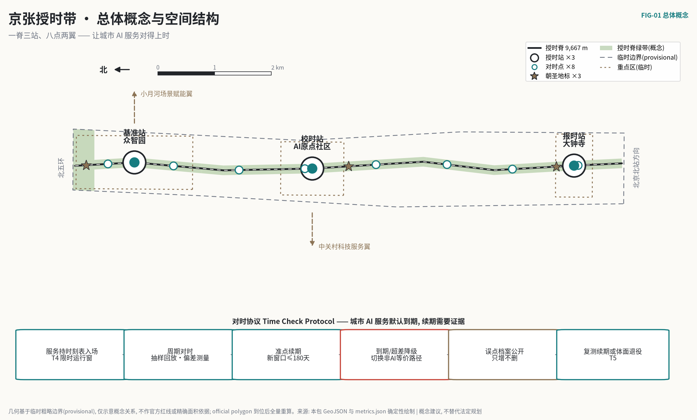
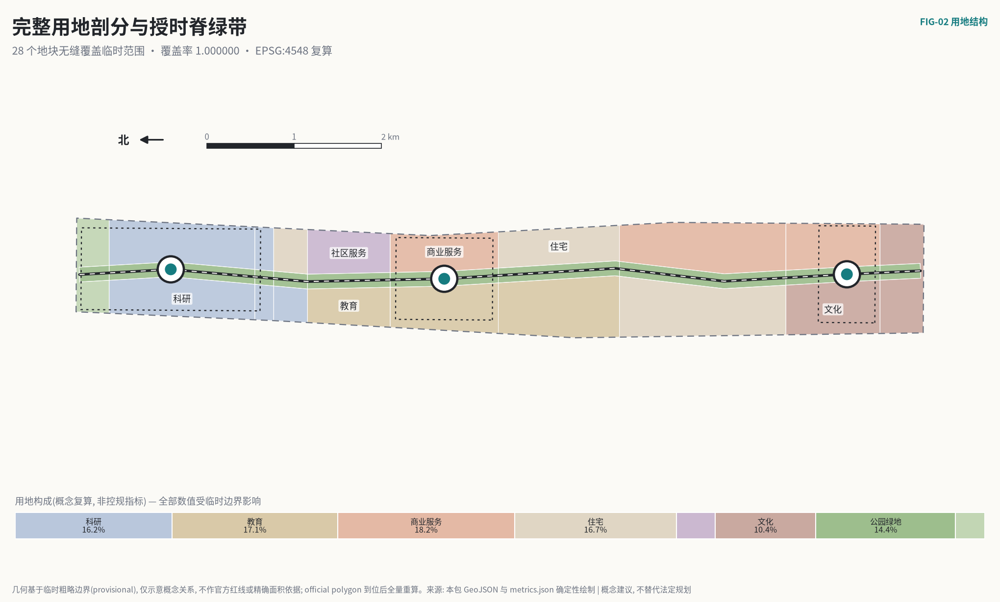
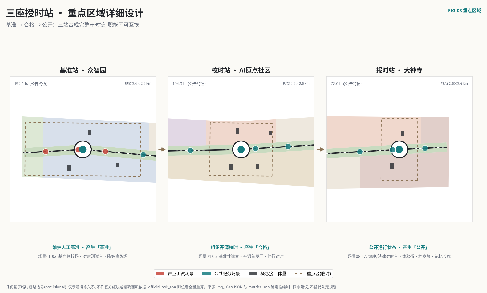
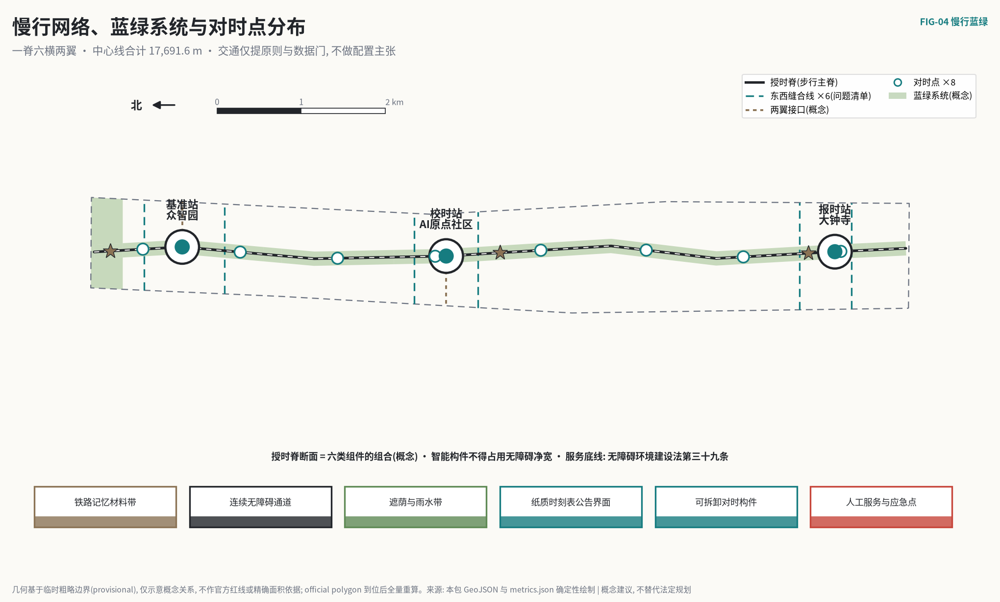
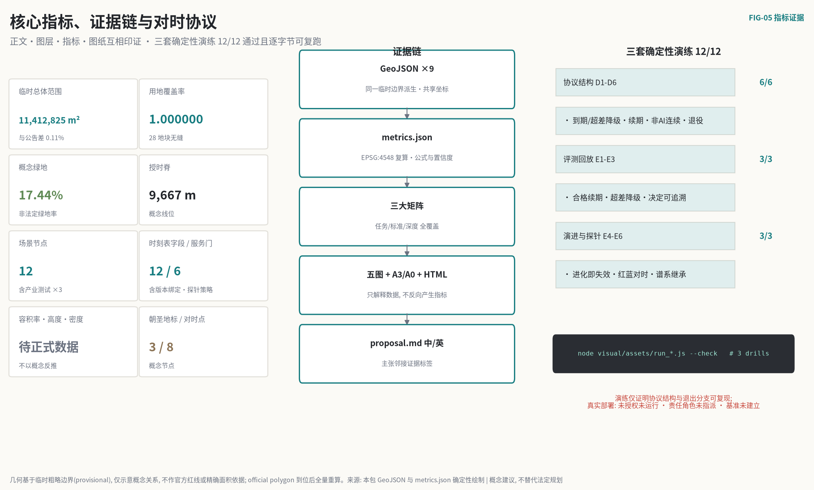

# 京张授时带：让城市 AI 服务对得上时

> 一条铁路能够安全运转一百年，靠的不是某一台永不出错的机车，而是一张所有人都看得懂、误点会被记录、过期就要让出线路的时刻表。
>
> 今天的城市正在把越来越多的判断交给 AI，而多数部署遵循的是相反的默认：上线一次，永久有效；出错悄悄修，偏差没人量；试点从不退场。**本方案把默认反过来——城市 AI 服务默认到期。** 每个进入公共空间的 AI 服务持有一张有到期日的运行时刻表，定期与人工维护的基准"对时"；到期未对时，自动降级为人工服务；对时超差，降级并公开复测条件；误点记录进入公开档案，只增不删。
>
> 服务公众的技术不需要被证明永远正确，需要被证明**始终对得上时**。

## 一页执行摘要

| 评审会问 | 本方案的回答 | 可核验的东西 |
| --- | --- | --- |
| 核心命题是什么 | 城市 AI 的信任来自"对得上时"：服务窗口默认到期，续期只能通过与人工基准的定期对时；"试点永久化"在结构上不可能 | 运行时刻表 schema（12 必填字段，含版本绑定与探针策略）与 T0–T5 六道服务门 [data:visual/assets/timetable.schema.json] |
| 机制能否被第三方检验 | 能。`node visual/assets/run_timecheck_tabletop.js --check` 对四份示例时刻表确定性复演 6 项检查：到期降级、超差降级、准点续期、非 AI 路径连续、退役五步 | 三套确定性演练共 12 项检查全部通过（协议结构 6/6·评测回放 3/3·演进与探针 3/3），证据 JSON 均含输入哈希，逐字节可复跑 [metric:timetable_field_count] |
| 空间上做了什么 | 一条约 9.7 km 授时脊纵贯总体设计范围，三座授时站对应三处重点区（基准站·众智园 / 校时站·AI原点社区 / 报时站·大钟寺），八个对时点挂靠沿线社区服务设施 | 九类 GeoJSON、用地全覆盖无缝剖分（覆盖率 1.000000）[metric:land_use_coverage_ratio] |
| 三条服务底线凭什么可执行 | 不凭设计者善意，凭现行法规与政策：无障碍环境建设法第三十九条要求保留人工办理等传统服务方式；生成式 AI 暂行办法第十四、十五条要求处置整改与投诉反馈机制；国办发〔2020〕45号确立传统服务与智能化服务并行 | `sources.json` 三条法规级来源，含本地快照与条文定位 [source:BARRIER-FREE-LAW] |
| 公共价值落在谁身上 | 不使用智能设备的居民获得与 AI 用户同等的基本服务；任何居民可就影响自己的服务读数在最近的对时点发起复核 | 七类画像、十二张场景卡的最小数据与退出条件；八个对时点空间落位 [metric:time_check_point_count] |
| 近期能做什么 | 一期仅 34.5 公顷：对时协议文本、校时站周边试点段与两类低风险服务的桌面-沙箱演练，不依赖任何未公开官方数据 | 八个行动包含前置证据与停止条件；三期几何完整覆盖临时范围 [metric:phase_1_area_sqm] |
| 刻意不给什么 | 容积率、建筑高度、密度、退线、道路红线、拆改留结论、工程线位、投资测算 | `metrics.json` 中相应指标状态为待正式数据补齐并记录前置条件 [metric:floor_area_ratio] |
| 方法的边界在哪 | 对时测的是服务与基准的一致性，测不出"服务是否值得存在"；需求侧证据需由试点前基线与公众参与另行建立，本方案如实写明这一半的缺口 | 风险章节与假设登记 [depth:risk_missing_data] |
| 数据可信到什么程度 | 全部几何基于临时粗略边界（与公告文字面积差 0.11%），仓库 Issue #846 已记录临时边界与 OSM 已测绘公园存在可复算空间差异——这条对本方案不利的证据照登不讳；三组发布机构公开统计经原始页面复核后仅作背景校准，不进入空间指标；official polygon 到位后整体重算 | 边界状态与重算触发器、数据基线翻译表 [source:BOUNDARY-SOURCE] [metric:provisional_site_area_difference_ratio] |

**English brief.** Jing-Zhang Timekeeping Belt translates the railway's oldest operating discipline — the timetable — into civic AI governance. Every AI service operating in public space holds a machine-readable service timetable with an expiry date. Renewal requires a periodic "time check" against a human-maintained baseline; an overdue or out-of-tolerance service degrades automatically to its guaranteed non-AI path, and every delay enters a public, append-only ledger. One 9.7 km Timekeeping Spine, three Timekeeping Stations on the three key areas, and eight neighbourhood Time-Check Points carry the protocol. All spatial content is a conceptual proposal on a provisional boundary — not statutory planning, not government commitment.

## 对时日：这套机制在街上是什么样子

写成规则的机制要放到街上才知道成色。以下是画像 P4——一位 74 岁、不用智能手机的居民——在"对时日"经过成府路对时点的十分钟。

**上午九点半，成府路对时点（挂靠社区服务站）。** 服务站门口的公告板换了内容：本季度沿线 AI 服务的时刻表汇总——健康导航，上次对时准点，下次对时还有 11 天；无障碍伴行，上季度一次超差降级、复测合格后续期，误点记录编号可查。她不用任何设备就能读到这块板子，这正是设计的一部分。

**她注意到健康导航的一条记录。** 上季度它把一家已迁址机构的地址给了三位居民，抽样回放发现与公开目录不一致——按协议这算"对时超差"，服务当天降级为人工窗口加纸质目录，直到目录同步、重新对时合格。**降级那两周，服务站的窗口没有少办一件事。** 这就是"到期降级"与"关停"的区别：降级只是把 AI 退回它的替代路径，公共服务本身不断线。

**她可以做什么。** 板子右下角写着：任何居民可就影响自己的一次服务读数，在本对时点登记发起复核；复核结果与原读数一并公开。这条权利落在她步行五分钟的地方——把复核入口放在需要专程前往的专门机构，等于没有给。

这十分钟里没有任何智能设备参与，而这套机制的全部要素——公开时刻表、误点档案、降级不断线、就近复核权——都已经在场。

## 设计依据与资料清单

### 证据分级

本方案先判断资料能支持什么，再决定空间可以画什么。项目名称、三层范围文字四至、约面积、三处重点区与设计任务来自官方公告；智能体六项任务、三大定位、五大功能、三区两翼与成果要求来自已清权的智能体任务书。[source:OFFICIAL-ANNOUNCEMENT] [source:AGENT-TASKBOOK]

| 证据类别 | 本方案采用方式 | 可以支持 | 不能支持 |
| --- | --- | --- | --- |
| 官方任务依据 | 公告与本地标准快照 | 任务、范围文字、约面积、成果深度 | 精确 polygon、控规指标、工程条件 |
| 清权任务依据 | 智能体任务书 | 品牌、案例、场景、地标、文化、运营任务 | 法定规划、政府行动或投资承诺 |
| 临时空间依据 | 仓库 provisional 边界 | 概念生成、拓扑自检、相对关系、离线可视化 | official redline、权属、精确面积、审批依据 |
| 法规与政策基线 | 仓库登记的法规本地快照 | 非 AI 路径、人工复核、投诉反馈三条底线的合法性论证 | 具体项目的合规结论或行政审批判断 |
| 行政尺度公开统计 | 三组发布机构原始页面（背景） | 校准服务对象规模、兜底刚性与基准数据集选择 | 走廊客流、设施容量、空间落位或项目绩效 |
| 全球机构案例 | 六个机构公开官网（背景） | 机制对照与设计启发 | 本地绩效类比、空间控制或实施保证 |
| 智能体设计数据 | 本包 GeoJSON 与 metrics | 概念分区、网络关系、场景落位、分期 | 现状测绘、工程线位、已确定拆改留 |

三条法规级依据构成对时协议的现实地基，而非事后装饰：无障碍环境建设法第三十九条明确公共服务场所"应当保留现场指导、人工办理等传统服务方式"，这是每张时刻表必填"非 AI 等价路径"字段的法律原型；生成式 AI 暂行办法第十四条的处置整改义务与第十五条的投诉反馈机制，对应降级预案与误点档案的公开申诉入口；国办发〔2020〕45号"传统服务方式与智能化服务创新并行"的原则作为背景政策支撑。[source:BARRIER-FREE-LAW] [source:GENAI-MEASURES] [source:ELDERLY-PLAN-45]

`data/source_registry.json` 是资料分级主控表。方案未使用商业地图瓦片、未清权图像或个人数据，也未使用任何未经公开发布的资料；未把任何背景资料升级为正式边界或控制结论。[source:SOURCE-REGISTRY]

### 边界状态与不利证据

全部几何使用维护者依据公告文字整理的临时粗略边界：总体设计范围复算 11,412,825.386 m²，与公告文字约 11.4 km² 差 0.1125%；三处重点区 polygon 同为临时替代。[metric:site_area_sqm] [metric:provisional_site_area_difference_ratio] [data:geometry/site_boundary.geojson#SITE-001]

需要如实登记一条对本方案不利的证据：仓库 Issue #846 及已合并的交叉核验工作记录了 OSM 已测绘的京张铁路遗址公园与临时总体范围相交为零、存在数百米量级的位置差异。这说明本方案沿临时边界中线布设的授时脊，其概念线位与真实遗址公园的空间关系存在待裁决的不确定性。本轮不擅自移动几何，只把 official polygon 到位设为全包重算触发器：先替换边界，再重建用地剖分，继而重排三站八点，最后重算指标、重绘图纸。[source:BOUNDARY-SOURCE] [assumption:A-BOUNDARY-001]

### 生成与复核方法

几何以 EPSG:4326 交换、EPSG:4548 复算面积与长度。用地由同一边界与同一组切线剖分，覆盖率 1.000000、无重叠；绿地、公共空间、建筑、道路、分期全部派生自同一基准，图纸与页面只解释结构化数据，不反向产生指标。[metric:land_use_coverage_ratio] [depth:metrics_recalculation] [self_check:METRIC_RECALCULATION]

### 三个候选情境的比选

方案不是从单一灵感出发。设计前在三个候选情境间按七项标准比较：整体效应、公共利益、AI 原生性、空间可转化性、长期运营、证据可复核性、对资料缺口的稳健性。比选是推断性框架，用于交代"为什么是这一个"；判定权在评审与专业团队，比选不替代现场调研与法定规划。

| 候选情境 | 主要长处 | 代价与短板 |
| --- | --- | --- |
| A 智能展示带：沿脊布设备与体验节点 | 传播直观、见效快 | 公共回路弱；设备折旧快；资料缺口下只能伪精确落点 |
| B 基准园区带：三园各建测试设施 | 产业逻辑清楚、与三处重点区对应 | 公众只是旁观者；治理停在园区围墙内；园区之间没有制度性连接 |
| C 公共对时制度：时刻表、对时点与误点档案 | 验证、使用、监督闭合成环；资料缺口下按制度而非伪精确落位；退出与问责内生 | 依赖持续人工投入；见效慢于展示型方案 |

C 为主方案。比选的输家不被丢弃，被降级使用：A 的展示语汇保留为导视与公告板的设计工具，B 的园区测试能力被吸收为基准站职能。C 的短板同样照登——**对持续人工投入的依赖，正是校时员轮值条款要解决的问题。**

## 三层范围工作框架

官方公告将工作分为统筹研究、总体设计与重点区域三层。本方案用同一"对时"逻辑贯穿三层，每层只回答与其资料深度匹配的问题。[standard:PROJECT-OFFICIAL-ANNOUNCEMENT] [depth:three_level_scope_framework]

| 层级 | 官方约规模与任务 | 京张授时带的回答 | 成果与诚实边界 |
| --- | --- | --- | --- |
| 统筹研究范围 | 约 43.6 km²；产业生态、战略定位、未来城市形态 | 回答"由谁维护基准、按什么节奏运营"：六个全球机制对照、对时闭环生态图谱、品牌与年度运营体系 | 案例只取机制不搬数字；无 official polygon 不做面积统计 |
| 总体设计范围 | 约 11.4 km²；城市更新与控规深度城市设计 | 一条授时脊、完整用地剖分、八个对时点、十二个场景节点、八个行动包 | 临时边界复算；法定强度、红线、容量待正式数据补齐 |
| 重点区域范围 | 约 368.4 ha 三处精细化设计 | 三座职能不可互换的授时站：基准站维护人工基准，校时站组织开源校时，报时站公开运行状态 | 重点区 polygon 为临时替代；拆改留、权属、文保结论待专业核查 |

总体空间结构概括为"**一脊三站、八点两翼**"。一脊是沿京张遗址公园方向纵贯的授时脊，概念长度 9,667.4 m，承担步行、文化解释与对时公示；三站是三处重点区的差异化授时职能；八点是挂靠沿线社区服务设施的对时点，把复核权放进日常步行范围；西翼中关村科技服务翼提供标准、法务与专业服务转介，东翼小月河场景赋能翼承接场景反馈。脊、站、点、翼均为概念关系，不是新增行政边界或工程红线。[data:geometry/roads.geojson#ROAD-001] [metric:spine_length_m] [depth:overall_spatial_structure]

三大定位与五大功能在对时闭环中各有位置：百年京张文化带保存"时刻表—信号—误点"的运营文化记忆；都市 AI 生活体验带让居民在可读、可退出、可复核的服务中感知 AI；AI 融合创新带把基准维护、校时测试与采用反馈组织成产业环节。全栈自主创新落在基准站的测试与标准能力，世界级创新生态落在校时站的开源与转化组织，AI+ 场景赋能落在沿线十二个场景节点，智能化活力城市落在全带公共服务双通道，AI 治理话语权落在对时协议本身——一套可复现、可退出、可解释的治理接口就是最有力的国际叙事。[source:AGENT-TASKBOOK]

## 统筹研究范围产业与未来城市研究

### 品牌：从"智能展示"转向"公共守时"

中文主名称"京张授时带"取自"授时"——由权威基准向社会发布标准时间的古老公共职能；"对时"则是每个终端定期校准自身的动作。英文名 `Jing-Zhang Timekeeping Belt`，核心协议名 `Time Check Protocol`。命名层级为：Timekeeping Belt（全带）— Timekeeping Station（三站：Benchmark / Calibration / Time-Telling）— Time-Check Point（八点）— Service Timetable（每个服务的时刻表）。这套语法可无损延展到导视、活动、证书与数字档案。[source:AGENT-TASKBOOK]

标志由三个元素构成：一条水平基准线、一枚圆形表盘轮廓、表盘上一道刻意未闭合的缺口。缺口表示"永远存在下一次对时"——任何服务的合格状态都是暂时的。独立 SVG 主标随包提供，由基础矢量几何原创生成。[data:assets/timekeeping-mark.svg]

概念视觉规范以表盘直径 `x` 为基准：标志四周净空不小于 `0.5x`；横向中英组合最小建议宽度 32 mm，数字界面最小 24 px。色值：基准墨黑 `#26221F`；信号红 `#B5443A` 仅用于降级、误点与停止状态，严禁装饰性使用；准点青 `#1F7A72` 标记在期服务；砖木暖灰 `#A8917B` 用于文化与遗产界面；单色场合使用墨黑或反白。禁止拉伸、旋转、企业冠名或将概念标志误作政府机构标识；**禁止补全缺口——那是对这个标志最彻底的误用。**具体商标检索、字体授权与无障碍对比度须由品牌与法律专业团队深化。[depth:height_massing_character]

### 六个全球案例：只取机制，不搬数字

案例分两族——**守时机构**与 **AI 基准机构**，本方案的核心判断正是这两族的合流。全部信息取自机构公开官网，登记为背景资料，不引用绩效数字，不作本地类比。[source:SOURCE-REGISTRY]

| 案例 | 可核对的机构属性 | 可转译机制 | 京张过滤条件 |
| --- | --- | --- | --- |
| BIPM 国际计量局 | 维护国际单位制与协调世界时的政府间机构 | 多个国家实验室的钟共同生成一个公共基准；没有任何单一钟被无条件信任 | 不搬计量体制；转译为"基准由多方维护、单一服务不自证" |
| NPL 英国国家物理实验室 | 维护英国国家时间尺度的国家计量机构 | 守时是持续服务而非一次校准；偏差被连续测量并公开 | 不搬机构设置；转译为"对时是周期义务而非一次认证" |
| NIST 美国国家标准与技术研究院 | 发布时间频率服务与 AI 风险管理框架的标准机构 | 同一机构同时守护"时间基准"与"AI 评测基准"，两种基准共用一套计量文化 | 不搬监管框架；转译为基准站"人工基准答案集"的维护方法 |
| MLCommons | 组织公开 AI 基准测试的行业联盟 | 基准测试规则公开、结果可复跑、版本有记录 | 不搬测试项目；转译为校时的"抽样回放+版本记录"流程 |
| AI Singapore | 国家级 AI 能力建设计划 | 研究、工程、人才与治理组织为一个连续体系 | 不搬计划结构；转译为年度运营的"问题—校时—采用"台账 |
| Vector Institute | 面向可信采用的 AI 研究机构 | 从研究到采用之间设置证据与信任环节 | 不搬机构模式；转译为"对时合格是采用前提"的接力关系 |

六案共同指向一个结论：**公共信任的基础设施从来不是"最强的钟"，而是"公开的对时制度"。** 京张授时带把这个制度写进城市空间。

### AI 创新生态图谱：对时闭环

生态图谱不以机构名单开场，以一个可运营的闭环开场：**公共问题入池 → 基准站建立人工基准 → 服务持时刻表入场 → 周期对时（抽样回放+偏差测量）→ 准点续期 / 超差降级 / 到期降级 → 误点档案公开 → 复测或退役 → 基准随城市问题更新**。中关村科技服务翼在"入场"与"采用"环节提供法务、知识产权、标准与资本转介；小月河场景赋能翼在"问题入池"与"反馈"环节组织社区与场景输入。土地、空间、产业、资金、人才、算力、数据、场景八类要素均以"可供专业团队深化研究"的机制建议表述，不绑定供应商，不承诺财政资源。[source:AGENT-TASKBOOK]

区域协同不虚构签约与名单，只定义可交换的最小对象——**基准与误点记录本身就是最好的协同接口**：

| 协同对象 | 概念输入 | 可交换的最小输出 | 进入与退出条件 |
| --- | --- | --- | --- |
| 北纬社区 | 居民问题与非数字服务体验 | 去标识化问题卡、对时点使用反馈 | 社区授权；参与不推定为同意部署 |
| 未来科学城 | 端侧模型与设备测试方向 | 基准测试协议、失效分类、复测条件 | 测试责任与知识产权明确；结果不自动互认 |
| 怀柔科学城 | 测量方法与不确定性评定能力 | 校时方法说明、测量不确定性口径 | 专业责任确认；不以合作设想代替资源 |
| 经开区 | 工程化与规模化反馈 | 互操作对时记录、维护要求、召回条件 | 企业自愿；不承诺采购或落地 |
| 京津冀 | 跨城规则复用方向 | 去地点化的时刻表 schema 与误点档案格式 | 各地依法复核；不复制坐标或审批结论 |

协同成效不以签约数衡量，看三样：时刻表 schema 被复用的次数、误点档案的公开完整率、居民发起复核的回应率。当前均无运行基线，不填绩效值。

## 总体设计范围城市更新与控规深度城市设计

### 空间判断

总体设计不把 AI 功能铺满 11.4 km²，而是形成"连续公共授时脊 + 差异化授时站 + 可替换功能侧翼"。授时脊两侧约 170 m 宽的公园绿带优先承担步行、遮荫、文化解释与对时公示；两侧功能区自北向南按"科研验证—教育校时—文化报时"的梯度组织：北段科研用地承接基准维护与全栈验证，中段教育用地面向高校组织开源校时与近校协作，南段商业与文化用地面向城市组织智能原生体验与报时文化。[data:geometry/land_use.geojson#LU-001] [standard:MNR-LAND-USE-CLASSIFICATION-GUIDE]

用地采用自然资源部分类子集，仅表达概念容量与功能关系。复算比例：科研用地约 16.2%、商业服务约 18.2%、城镇住宅约 16.7%、教育约 17.1%、文化约 10.4%、公园绿地约 14.4%、防护绿地约 3.0%、社区服务设施约 4.0%。这些是设计提案的复算值，不是控规指标；取得正式控规后逐项比对重构。[metric:land_use_0802_area_sqm] [metric:land_use_0803_area_sqm]

### 更新方法：先调查、后分类、再行动

没有清权的现状建筑与权属底数，本方案不对任何具体建筑作拆除、保留或新建判断。城市更新采用四道门：A 门核对权属、用途、年代、结构与消防；B 门识别历史文化、社区服务与公共价值；C 门比较保留、修缮、改造、局部替换的全生命周期影响；D 门经公众参与和法定程序形成结论。四门未过，任何地块不进入拆改留分类。[data:geometry/buildings.geojson#BLDG-01] [depth:retain_renovate_demolish]

`buildings.geojson` 中十个体量是概念接口原型——基准实验庭、开源校时首发厅、报时文化客厅等——基底合计 57,840 m²、占临时范围 0.51%，仅检验功能与授时脊的界面关系，不代表现状建筑、层数或建设量。[metric:building_footprint_area_sqm] [metric:conceptual_building_coverage_ratio]

### 控规深度的表达方式

达到控规城市设计深度不等于编造控规数值。本包完整表达用地、空间结构、建筑体量方法、慢行网络、公共空间、风貌原则、更新项目、分期、指标与风险，经 `standard_matrix.json` 与 `design_depth_matrix.json` 建立证据链；容积率、高度、密度、绿地率控制、退线、四线与道路红线全部标注待正式数据补齐，不以概念几何反推。[standard:MOHURD-CONTROL-DETAILED-PLANNING] [depth:development_intensity_controls] [assumption:A-CONTROLS-001]

公共界面三条控制建议：面向授时脊的首层保持可见的服务责任界面（谁在运营、下次对时何时，现场可读）；信息设施不占据连续无障碍通道；一切对时展示构件可拆卸、可维修、可退场。高度与体量只给相邻关系与遗产界面退让原则，具体数值待官方控制与视线分析。[standard:MOHURD-URBAN-DESIGN-MEASURES]

## 重点区域详细设计

三处重点区公告约面积分别为众智园 192.1 ha、AI 原点社区 104.3 ha、大钟寺 72.0 ha；本包 polygon 为临时替代，不得用于地块、权属或精确面积判断。三站职能刻意不可互换：基准站产生"基准"，校时站产生"合格"，报时站产生"公开"——三者合成完整的守时链。[data:geometry/key_areas.geojson#PROV-KEY-001] [metric:key_area_count] [depth:three_key_area_detailed_design]

### 基准站·众智园：人工基准维护区 / Benchmark Station

**定位。** 全栈自主创新的授时表达：不是"最强模型在此"，而是"人工基准在此维护"。每类进入公共空间的 AI 服务，其对时所用的基准答案集（无障碍路径的正确提示、健康导航的正确转介、文化讲述的史实边界）在这里由相应专业人员建立、版本化并接受质询。基准维护是持续的专业劳动，这正是"全栈自主"最不可替代的一环——**谁维护基准，谁定义合格。**

**空间与建筑。** 概念组织为"基准实验庭—标准沙盒工坊—端侧对时驿站"三组界面：实验庭承担基准答案集的建立与争议裁决，可预约旁听；沙盒工坊承担模型与设备的受控对时测试；对时驿站承担断网降级、能耗与接管路径的周期复核。清河方向保持生态缓冲，任何亲水或跨越构筑待河道与生态资料。[data:geometry/buildings.geojson#BLDG-01]

**场景与运营。** 场景 01"模型基准公开复核场"、02"端侧设备对时测试台"、03"机器人降级演练场"为三项产业测试验证场景：01 定期公开复核在役公共服务模型的基准一致性；02 按时刻表复核端侧设备的降级与接管；03 让低速机器人在受控场地演练"到期停运—人工接管—物理退场"的完整降级链。三者均为测试场景，不代表可直接部署。[metric:industry_test_scenario_count] [data:geometry/public_space.geojson#SCN-01]

**证据门。** 进入深化前必须取得文保、河道、权属、能源与消防资料；基准答案集必须先有明确的专业维护角色与争议处理规则，否则相应服务类别不得进入对时流程——没有基准，就没有对时，就没有续期。[assumption:A-BASELINE-001]

### 校时站·AI原点社区：开源校时组织区 / Calibration Station

**定位。** 世界级创新生态的授时表达：把高校、开源社区与初创团队组织成"校时共同体"。开源模型在此首发并登记时刻表；高校课程参与基准答案集的共建与复核；初创团队的服务在此完成第一次对时。合格不是一次性认证，而是可撤回的周期状态——这套区别于"评奖—挂牌"的组织方式，本身就是近校创新生态的制度差异化。

**空间与建筑。** "近校协作学舍—开源校时首发厅—人才对时公寓—社区对时服务楼"沿授时脊东西两侧组织日常时序：白天校时与门诊，傍晚课程与讲解，首层全部保持面向绿带的可进入界面。慢行强调连续与可替代，不擅自跨越校园权属；轨道接驳只提出步行转介与信息连续原则。[data:geometry/buildings.geojson#BLDG-04]

**场景与运营。** 场景 04"基准答案集共建室"组织专业人员、学生与居民代表参与基准维护并保留版本与异议记录；05"开源模型校时首发厅"要求每次首发同时公布时刻表与首个对时窗；06"无障碍伴行对时服务"按 30 天窗口对时，由代表性使用者参与回放。[data:geometry/public_space.geojson#SCN-05]

**对时轮值的人力来源。** 十二个服务按周期对时，月均约需 50–100 人时的回放与记录工作（概念测算，实际以试点校准）——不足以支撑一支专职评测队，也不应该由服务提供方自查。轮值由经认证的**校时员**执行：认证依托驻区高校的实践课程完成（复跑本包演练、参与一轮基准评审、模拟一次对时），两人一组在对时点值守，专业维护角色随叫兜底，资深校时员参与红方探针维护。这条路径有真实承载主体：海淀 37 所驻区高校已有"高校—监管—服务"的集中协作先例，高校自己提出的实验室与特种设备安全、成果转化等需求，与校时站的服务接口天然衔接。三条保护栏写死：未成年人不参与轮值；校时员回避自己参与开发的服务；裁决权永远在专业维护角色——校时员做回放与记录，不做审判。认证与轮值的落地需高校与相关主管部门另行确认。[source:HAIDIAN-37-UNIVERSITIES-SERVICE-NEEDS] [assumption:A-OPERATIONS-001]

**证据门。** 校区边界、权属、建筑现状与站点关系必须先补齐；基准共建必须有材料最小化、署名可撤回与未成年人保护规则，缺任一项相应活动只做旁听不做共建。[data:geometry/key_areas.geojson#PROV-KEY-002]

### 报时站·大钟寺：运行状态公开区 / Time-Telling Station

**定位。** 大钟寺一带保存着城市公共报时的文化记忆——钟的公共职能正是"向所有人同时公开同一个时间"。本方案把这层文化意象转译为智能原生商业的治理界面：全带 AI 服务的运行状态、误点档案与降级记录在此向公众"报时"；智能原生消费场景在统一时刻表下轮换体验。历史叙述以公开史料为准，文保范围与保护要求待官方图层，一切展陈构件避让遗产本体。[assumption:A-HERITAGE-001]

**空间与建筑。** "报时文化客厅—智能原生体验坊—误点档案公开墙"组织站城界面：文化客厅承担报时文化展陈与国际交流；体验坊承担可退出的智能终端体验（场景 10）；档案墙把全带误点档案做成可步行阅读的公共界面。四象限慢行缝合先做地面诊断，桥隧与地下连通只列为待论证选项，不作工程结论。[data:geometry/buildings.geojson#BLDG-08]

**场景与运营。** 场景 09"公共法律转介对时台"与 08"社区健康导航对时台"在此设城市级窗口，只做信息导航与人工转介——08 的基准答案集选定为经核验的公开机构目录，全区医疗卫生机构 1456 个、社区卫生服务中心（站）239 个的既有网络说明转介型导航不需要自建任何"AI 医疗"结论 [source:HAIDIAN-2025-STATISTICAL-BULLETIN]；10"智能原生体验对时街"所有展位按 45 天窗口对时并可随时退出；11"误点档案公开墙"与 12"京张记忆报时长廊"承担公共解释职能。[data:geometry/public_space.geojson#SCN-10]

**证据门。** 文保范围、道路、轨道、市政、商业权属与消防资料齐备后方可深化；涉及大钟寺古钟博物馆及其保护范围的任何表达先经文保专项审查。[data:geometry/key_areas.geojson#PROV-KEY-003]

## AI 创新生态、人才画像与 AI+ 场景

### 七类用户画像

画像用于识别需求与权利边界，不由个人数据生成。[metric:persona_count]

| 画像 | 核心任务 | 空间与服务 | 数据与公平边界 |
| --- | --- | --- | --- |
| P1 开源开发者与基准维护者 | 发布、校时、维护基准、获得可追溯署名 | 首发厅、基准共建室、版本档案 | 署名可撤回；失败记录不被包装成成功 |
| P2 初创与产品团队 | 低成本对时、找到首个合规场景 | 沙盒工坊、校时门诊、体验街轮换位 | 不承诺资金订单；降级不影响再次申请 |
| P3 一线服务运营者 | 值守、执行降级、回应复核 | 对时点柜台、降级预案卡、升级联系通道 | 决策日志可审计；自动化不隐去人工劳动 |
| P4 老年居民与不用智能设备者 | 获得不依赖 AI 的同等服务 | 非 AI 等价路径、纸质时刻表公告、人工窗口 | 默认无技术路径；拒绝 AI 不降低服务 |
| P5 视障与行动不便使用者 | 连续、可靠地使用公共空间 | 连续无障碍通道、伴行服务、人工求助兜底 | 端侧即时删除；代表性使用者参与对时回放 |
| P6 高校师生 | 参与基准共建与校时轮值认证 | 近校学舍、共建室、开放课程 | 校园数据需授权；未成年人不画像 |
| P7 国际访客与治理观察者 | 理解机制、复跑证据、对照制度 | 报时站双语界面、可复跑演练脚本 | 区分演示、测试与批准运营，不夸大成效 |

### 对时协议：时刻表十二字段与六道服务门

所有场景共用一张**运行时刻表**（12 必填字段）：服务标识、公共目的、服务范围（对象/空间节点/排除用途）、最小必要数据（含保留期与"不采集个人数据"约束）、人工责任角色、非 AI 等价路径、基准引用（含版本与建立状态）、对时窗（周期上限 180 天）、降级预案（触发/步骤/恢复方式）、误点档案（公开、只增不删）、版本绑定（进化即失效）、探针策略（红蓝对时）。schema 与四份示例随包提供，字段缺一不可。[data:visual/assets/timetable.schema.json] [metric:timetable_field_count]

服务全生命周期经过六道门，每道门由证据推进，不得越级：[metric:service_gate_count]

| 门 | 名称 | 进入条件 | 未过时 |
| --- | --- | --- | --- |
| T0 | 问题与场地 | 公共问题真实、场地与权属边界核查 | 不落位、不招募公众 |
| T1 | 数据与权限 | 最小数据、保留期、删除与日志规则确认 | 权限保持关闭 |
| T2 | 基准与人工路径 | 人工基准建立、责任角色指派、非 AI 路径验收 | 只提供纯人工服务 |
| T3 | 沙箱对时演练 | 桌面与隔离环境复演降级全分支 | 不进入公共空间 |
| T4 | 限时运行窗 | 时刻表签发，窗口不超过 180 天 | 不开放；窗口即到期日 |
| T5 | 续期 / 降级 / 退役 | 对时合格续期；超差或到期降级；退役走五步 | 不得静默恢复或自动续期 |

关键设计是 **T4 的窗口即到期日**：批准运行与设定退场是同一个动作。传统流程里"叫停一个服务"需要有人主动担责，摩擦极大；对时协议里"继续运行"才需要证据（一次合格的对时），停止是无人作为时的默认结果。试点永久化在结构上不可能。

### 十二张场景卡

十二个场景节点沿授时脊落位，其中 01–03 为产业测试验证场景。每张卡列出服务对象、最小数据与对时安排；完整时刻表字段见结构化文件。[metric:scenario_node_count] [data:geometry/public_space.geojson#SCN-01]

| 卡 | 场景（节点） | 服务对象 / 最小数据 | 对时窗与人工底线 |
| --- | --- | --- | --- |
| 01 | 模型基准公开复核场（**产业测试**·基准站） | 服务提供团队与观察者；测试样本与版本记录 | 每季公开复核；争议由基准维护角色裁决 |
| 02 | 端侧设备对时测试台（**产业测试**·基准站） | 设备团队；设备级聚合读数 | 60 天窗；断网断电回退不合格即封存 |
| 03 | 机器人降级演练场（**产业测试**·基准站） | 机器人团队；事件与接管记录 | 演练"到期停运—接管—退场"全链；安全员随时接管 |
| 04 | 基准答案集共建室（校时站） | 专业人员、学生、居民代表；共建记录与异议 | 版本化维护；署名与撤回规则先行 |
| 05 | 开源模型校时首发厅（校时站） | 开发者与公众；授权代码与说明 | 首发即登记时刻表与首个对时窗 |
| 06 | 无障碍伴行对时服务（校时站—授时脊） | 视障与行动不便者；端侧即时删除 | 30 天窗；代表性使用者参与回放；人工求助兜底 |
| 07 | 通学路径对时看板（沿线） | 学生家庭与学校；公开线路信息 | 只做静态信息与人工咨询，教师在环 |
| 08 | 社区健康导航对时台（沿线—报时站） | 居民与老年人；主动输入的需求类别 | 30 天窗对时公开目录一致性；不诊断不留病历 |
| 09 | 公共法律转介对时台（报时站） | 居民与初创团队；问题类别 | 法律专业人员复核；模型输出不作法律意见 |
| 10 | 智能原生体验对时街（报时站） | 消费者与企业；匿名反馈计数 | 45 天窗；清晰告知、随时退出、人工投诉台 |
| 11 | 误点档案公开墙（报时站） | 全体公众；档案本身 | 只增不删；纸质与数字双形态 |
| 12 | 京张记忆报时长廊（授时脊） | 居民、访客、记忆贡献者；授权史料与元数据 | 出处标注、争议下架、权利人撤回 |

四份示例时刻表（对应场景 02、06、08、10）与确定性演练脚本随包提供：`node visual/assets/run_timecheck_tabletop.js --check` 复演六项检查全部通过——字段完整性 4/4、到期降级 4/4、超差降级、准点续期、非 AI 路径连续 4/4、退役五步 5/5；证据 JSON 固定输入哈希，第三方逐字节可复跑。演练只证明协议结构与退出分支可复现，不证明真实人工能力、现场安全或服务绩效；真实部署状态为未授权未运行，责任角色未指派，基准未建立。[data:visual/assets/timecheck-tabletop-evidence.json]

### 对时的评测学内核与参考运行时

协议结构之外，"对时"这个动作本身也被做成了可执行证据：`node visual/assets/run_baseline_replay.js --check` 用合成基准答案集（5 条健康导航目录条目）演练完整的评测回放循环——合格回放 5/5 一致判续期，超差回放 1/5 漂移判降级并登记复测条件，且每个决定都由逐条比对与限差机械推出、全部比对行落档可查（E1–E3 三项检查通过，输入哈希固定）。[data:visual/assets/baseline-replay-evidence.json]

这揭示了对时协议的一个工程事实：它的四个动作与现代 agent 评测框架的四类标准能力一一对应——基准答案集对应基准设计，对时回放对应评测运行，续期/降级对应评测门禁，误点档案对应轨迹留档。`visual/assets/timecheck-runtime.json` 定义了这套映射接口：任何具备四类能力的开源评测框架（如 Apache-2.0 许可的桌面/服务器端 agent 构建器 PenguinHarness 等，或其他任何支持 OpenAI 协议的评测工具链）都可实现对时运行时；选型三原则写死为**开源可审计、模型与供应商中立（不得把任一具体产品设为必要条件）、离线可复核**。城市不必发明新软件品类，只需把已经成熟的评测工程学接到公共治理上。[assumption:A-BASELINE-001]

### 会进化的服务如何守时

静态服务的风险是漂移，自演化服务的风险是**逃逸**：现代 AI 服务会更新模型、改写提示词、自我优化——版本一变，上次对时合格的那个东西已经不存在了，治理却还拿着旧凭证。对时协议用三条条款封死逃逸路径，每条都有铁路制度原型：

**进化即失效（原型：新车型必须重新试运行才能上正线）。** 时刻表的 `version_binding` 字段把对时资格绑定到服务版本哈希：任何一次自我进化——模型更新、提示词修改、依赖变更——都使当前资格立即作废（version_voided），服务退回沙箱重新对时，才能带着绑定新哈希的新窗口回归。作废（对上时的版本已不存在）与降级（同版本没对上时）是两种不同状态；**公共空间里没有热更新**，安全修复同样在沙箱内完成后经对时回归，可设专业角色签字的加急通道，但不能跳过对时本身。原则一句话：**资格不继承，档案要继承**——新版本不继承旧版本的合格资格，而误点档案按版本谱系连续记录，公众在档案墙上读到的是完整的家族史。这与开源 agent 工程中"每轮自演化前快照、出新版后重跑基准验证"的自我改进循环互为对偶：自演化让服务变好，进化即失效让变好这件事变得安全。[data:visual/assets/timetable.schema.json]

**红蓝对时（原型：非正常行车演练——考题不能提前知道）。** 必须诚实指出静态基准的弱点：基准条目有限且公开，服务对已知题过拟合（"背题"）就能永远准点续期，对时会退化成走过场。修复方式是把探针策略写进时刻表：人类基准维护角色核准若干**探针类别**（同义改写、时效陷阱、越界请求必须转人工、无障碍表述变体），红方校时 agent 在类别内生成新题实例突袭回放；人类保留基准维护权、类别核准权与争议裁决权——**agent 出题，人类定什么算及格**。红方打穿的失效登记复测条件；红方发现基准答不了的好题，送入基准共建室成为新基准候选——红队喂养基准生长。[assumption:A-BASELINE-001]

三条款均有确定性证据：`node visual/assets/run_evolution_probes.js --check` 复演版本作废与重考回归（E4）、背题服务 0/4 全军覆没而健壮服务 4/4 通过的探针回放与基准缺口移交（E5）、以及跨版本的档案连续与资格不继承（E6），三项检查全部通过、输入哈希固定。演练中的探针为确定性模板，不调用模型；真实红方 agent 须经类别核准与裁决角色指派后方可运行。[data:visual/assets/evolution-probes-evidence.json]

## 用地、建筑规模与拆改留方案

### 完整用地剖分

用地由临时边界经纬度条带与授时脊绿带双重剖分生成 28 个多边形，相邻地块共享边界坐标，总面积与临时范围闭合（覆盖率 1.000000），无未标注空白。结构化用地是可替换的测试模型，不是对现状或法定用途的判断。[data:geometry/land_use.geojson#LU-001] [metric:land_use_total_area_sqm] [depth:land_use_layout]

复算面积：科研用地约 184.87 ha、商业服务约 208.24 ha、城镇住宅约 190.31 ha、教育约 194.74 ha、文化约 118.66 ha、公园绿地约 164.35 ha、防护绿地约 34.64 ha、社区服务设施约 45.47 ha。全部受临时边界影响；完整公式与来源见 `metrics.json`。[metric:land_use_05_area_sqm] [metric:land_use_1401_area_sqm]

### 建筑原型与规模边界

十个概念体量分五类：基准维护类（实验庭、沙盒工坊、对时驿站）、校时组织类（首发厅、学舍）、生活支撑类（人才公寓、社区服务楼）、报时公开类（文化客厅、体验坊）与档案类（到期档案馆）。体量只检验功能与授时脊的界面关系；层数、高度、结构、产权均不表达，法定建筑规模待正式数据补齐。[data:geometry/buildings.geojson#BLDG-10] [metric:building_footprint_area_sqm]

### 拆改留决策门

具体建筑进入深化后依次判断历史与公共价值、结构与消防可行性、全生命周期成本、使用者安置与参与、控规与权属合规，然后才进入"保留修缮、功能改造、局部替换、依法更新"四类。当前包不在图上标注任何拆除对象——把缺资料伪装成果断设计，正是对时文化反对的那种"未对时的确定感"。[standard:MOHURD-ARCH-DESIGN-DEPTH-2016] [depth:retain_renovate_demolish]

## 交通、轨道、市政与公共服务设施

### 步行优先的一脊六横两翼

概念慢行网络由授时脊（9,667.4 m）、六条东西缝合线与两条翼线接口组成，中心线总长 17,691.6 m。数值只反映提交几何，不是道路工程里程。六条缝合线是问题清单而非工程方案：缺口在哪、平面路径能否优化、无障碍是否连续；任何跨越轨道或干路的设想，待红线、交通量与结构资料后由专业团队比较。[data:geometry/roads.geojson#ROAD-002] [metric:road_centerline_total_length_m] [depth:traffic_rail_slow_parking]

本方案刻意不提出交通配置主张：不估客流、不设泊位、不画接驳线位。交通试点进入对时流程前，须先补齐走廊基线（分时段计数、无障碍连续性审计、投诉基线）。**数据也会误点**：每份走廊基线数据集同样持有一张时刻表——采集日期、有效窗与到期降级；引用过期基线的任何结论自动降级为"待重新采集确认"，不得继续作为扩点或加密依据。交通域的 AI 创新不在配置更多设施，而在把数据时效纪律做成制度。轨道站点只提出"信息与步行连续优先"原则。[assumption:A-TRANSPORT-001]

### 市政与新型基础设施

对时点与场景节点的市政需求采用"小单元、可断开、可计量"原则：受控网络接口、独立计量、紧急断电与日志导出方向；公共空间优先保障电力、遮荫、饮水、座椅与无障碍，再配置 AI 构件。能源负荷、通信容量与管线均未测算，不构成工程设计。[depth:municipal_new_infrastructure]

### 公共服务双通道

一切公共服务保持双通道：基础服务不依赖 AI（人工窗口、纸质时刻表公告、无障碍设施、应急求助），增强服务由 AI 辅助且按时刻表对时。这不是设计偏好，是无障碍环境建设法第三十九条"保留现场指导、人工办理等传统服务方式"的直接执行；45号文的"两条腿走路"原则在此获得空间形式。人口结构给出了这条底线的分母：全国互联网普及率 80.1%、60 岁及以上人口占 23.0%——双通道不是为少数人保留的例外通道，是按约五分之一人口设防的主通道之一。[source:BARRIER-FREE-LAW] [source:ELDERLY-PLAN-45] [source:NBS-2025-STATISTICAL-COMMUNIQUE]

## 蓝绿空间、公共空间与城市风貌

### 授时脊与蓝绿系统

概念绿地 1,989,861.487 m²、比例 17.44%，由授时脊公园绿带与北端五环防护绿带构成；三座授时站广场合计 260,113.14 m²、比例 2.28%，广场与绿带存在复合，不简单相加。[metric:green_ratio] [metric:public_space_ratio] [data:geometry/green_space.geojson#GREEN-001]

授时脊断面是六类组件的组合：保留铁路记忆的材料带、连续无障碍通道、遮荫与雨水带、纸质时刻表公告界面、可拆卸对时展示构件、人工服务与应急点。智能构件不得占用无障碍净宽；夜间保持低亮度；构件更新不得造成反复土建。[standard:MOHURD-URBAN-DESIGN-MEASURES] [depth:blue_green_public_space]

### 三个 AI 朝圣地标

1. **零公里授时标 / Kilometre Zero Time Mark**（授时脊北端）：全带对时体系的原点标志，铭刻对时协议第一版全文与历次修订记录——朝圣的对象是制度，不是设备。
2. **正点率碑廊 / Punctuality Ledger Gallery**（报时站）：以年度为单位镌刻全带服务的对时记录，误点与准点同等镌刻；一个允许"迟到"被永久记录的城市，才配谈论可信 AI。
3. **到期档案馆 / Archive of Expired Services**（授时脊中段）：收藏到期未续、超差退役服务的完整档案——退场不是失败，是制度在工作。让"体面退场"成为值得纪念的城市贡献。

三者均为概念建议，优先以展陈、导视与数字档案试运行，永久形式待文保、权属与运营评估。荣誉展示坚持来源可核验、贡献可撤回，不按商业影响力排序。[metric:ai_pilgrimage_landmark_count] [data:geometry/public_space.geojson#LM-01]

### 文化叙事与导视

三条文化线索在"守时"母题下交织：京张铁路代表中国人自主建立的现代运营纪律——詹天佑主持修建的这条铁路依靠时刻表、信号与测量在复杂地形上安全运转，这是比任何单体构筑更深的遗产；中关村代表开放求证的创新文化；AI 新文化在此获得本方案的定义——**可对时、可降级、误点可查**。大钟寺一带的古钟文化记忆为南段提供"报时"的公共意象。导视语法使用表盘、刻度、基准线与信号色；文化标识与全带 Logo 分开管理。历史事实与图像经来源核验后使用，不生成虚构历史。[depth:risk_missing_data] [assumption:A-HERITAGE-001]

国际传播主句：**A city that keeps its AI on time — benchmarked by people, degraded on expiry, honest about delays.**

城市风貌保持克制与可维护：材料优先砖、钢、木与可修复构件；信号红仅用于状态标识；不用大面积屏幕制造"未来感"——这条带的未来感来自制度的可见运转，而非光效。

## 更新项目清单、实施政策与分期计划

### 八个行动包

| 编号 | 概念行动包 | 主要交付 | 前置证据与停止条件 |
| --- | --- | --- | --- |
| P01 | 对时协议与公示系统 | 时刻表 schema 定稿、纸质公告模板、误点档案格式 | 法律、伦理、无障碍评审未过不启用 |
| P02 | 授时脊轻量试验段 | 遮荫休息、无障碍修补、纸质时刻表公告板 | 文保、权属或无障碍审计未过则调整或停止 |
| P03 | 基准站三场景 | 基准复核场、对时测试台、降级演练场 | 基准维护角色与安全责任未确认不扩大 |
| P04 | 校时站共建与首发 | 基准共建室、开源首发厅、伴行服务对时 | 授权、署名与未成年人规则不清只做旁听 |
| P05 | 报时站公开界面 | 误点档案墙、体验对时街、双语报时界面 | 文保、消防、消费者权益未确认则暂停 |
| P06 | 八个对时点挂靠 | 对时柜台、复核登记、公告板 | 挂靠设施权属与人员容量未确认不挂牌 |
| P07 | 三个朝圣地标 | 零公里标、正点率碑廊、到期档案馆（先展陈后永久） | 来源、版权或争议机制不完备不永久展示 |
| P08 | 年度授时周期 | 年度对时报告、开发者校时季、国际对照交流 | 主体、预算、许可未确认则缩小或取消 |

行动包数量 8，写入指标但不代表立项。[metric:renewal_project_count] [depth:renewal_project_list]

### 概念责任与服务目标

行动包采用概念 RACI：`A` 是未来经授权且对结果负责的单一牵头角色（当前不预设任何机构）；`R` 是执行所需专业与运营团队；`C` 是决策前必须参与的权利人、公众与监管角色；`I` 是通过公开档案获知进展的使用者。下列目标是试点校准起点，不是服务标准、采购条款或政府时限。[assumption:A-OPERATIONS-001]

| 行动包 | 概念 A / R / C-I | 公共价值闸门 | 候选响应目标 |
| --- | --- | --- | --- |
| P01+P08 协议与年度周期 | A：经授权运营牵头角色；R：法律、伦理、档案；C-I：公众代表与全体使用者 | 在役服务时刻表字段完整率 100%；误点档案公开率 100% | 协议修订经复核后 5 个工作日内公示 |
| P02+P06 试验段与对时点 | A：经授权公共空间管理角色；R：景观、无障碍、维护；C-I：沿线权利人与代表性使用者 | 开放前无障碍连续路径审计覆盖 100%；每点保留纸质公告 | 严重缺口立即隔离；一般问题 5 个工作日给处置路径 |
| P03 基准站场景 | A：经授权测试责任角色；R：评测、安全、能源；C-I：行业专家与受影响人群 | 高风险测试人工接管覆盖 100%；失效原因记录率 100% | 严重风险立即停测，24 小时内初步记录 |
| P04+P05 校时与报时界面 | A：经授权服务运营角色；R：开源社区、文保、消费者权益；C-I：贡献权利人、居民、访客 | 共建署名可撤回覆盖 100%；体验退出路径覆盖 100% | 权属争议 1 个工作日内先隐藏再复核 |
| P07 朝圣地标 | A：经授权文化责任角色；R：展陈、历史、版权；C-I：贡献人与公众 | 展示对象来源核验覆盖 100% | 争议内容先下架，复核后决定恢复 |

### 三段分期

分期几何完整覆盖临时范围：一期 344,721.6 m²（3.0%）为校时站周边试点段——先把协议、公告与两类低风险服务的演练跑通；二期 4,341,998.4 m²（38.0%）贯通授时脊与三站；三期 6,726,105.4 m²（58.9%）在运营评估与法定程序后推进全带适应更新。每期结束公开"继续、调整、停止"三种结论——分期计划自己也持有一张时刻表。[metric:phase_1_area_sqm] [metric:phase_2_area_sqm] [depth:phasing_implementation]

### 年度运营与长期品牌

年度授时周期四个节拍：春季发布年度对时报告（全带服务的准点率、降级与退役记录）；夏季开发者校时季（开源模型集中首发与校时，对应任务书的开发者社区运营）；秋季国际对照交流（与全球基准机构的机制互访，对应国际传播）；冬季基准更新评审（吸收全年城市问题更新基准答案集）。活动品牌延用"表盘缺口"视觉；全部安排为概念建议，许可、安全、预算与责任须另行确认。[source:AGENT-TASKBOOK]

开发者社区路径：问题入池—认领基准共建—沙箱校时—限时窗运行—误点复盘—续期或体面退场；每一步都在公开档案留痕，贡献凭档案追溯而非凭宣传。企业招引路径：对时合格记录是最好的招商材料——一个企业的服务在误点档案里保持长期准点，胜过任何路演。

### 持续参与与开放复核

本包按仓库"返回式参与"要求生成：提交前同步 main、复读任务书与校验规则、检查 Issues 与已合并方案；边界不利证据（Issue #846 的空间差异记录）如实登记于本文与假设文件。后续迭代由事件触发：official polygon、控规或文保资料到位则全量重算；仓库规则或 schema 变化则先同步再更新；评审与社区反馈进入 changelog 并在下一版回应。方案自身遵守对时纪律——**本提案的每一版都有对时记录。**[source:REPOSITORY-README]

## 指标体系、面积复算与合规矩阵

### 核心复算指标

| 指标 | 本包值 | 解释边界 |
| --- | ---: | --- |
| 临时总体范围 | 11,412,825.386 m² | EPSG:4548 复算；与公告文字差 0.1125%；非官方精确面积 [metric:site_area_sqm] |
| 用地覆盖率 | 1.000000 | 28 个地块无缝覆盖临时范围 [metric:land_use_coverage_ratio] |
| 概念绿地 | 1,989,861.487 m² / 17.44% | 授时脊绿带+防护绿带；非法定绿地率 [metric:green_ratio] |
| 授时站广场 | 260,113.14 m² / 2.28% | 与绿带复合，不简单相加 [metric:public_space_ratio] |
| 概念建筑基底 | 57,840 m² / 0.51% | 十个接口体量；非现状或审定规模 [metric:conceptual_building_coverage_ratio] |
| 授时脊 / 慢行网络 | 9,667.4 m / 17,691.6 m | 概念线位，非工程里程 [metric:spine_length_m] |
| 三站 / 八点 / 十二场景 / 三地标 | 3 / 8 / 12 / 3 | 全部为设计提案节点 [metric:scenario_node_count] |
| 时刻表字段 / 服务门 | 12 / 6 | 协议接口，可被第三方复用 [metric:timetable_field_count] |
| 三套确定性演练 | 12/12 通过 | 协议结构·评测回放·演进与探针；含输入哈希，逐字节可复跑；真实运营未授权未运行 |
| 容积率 / 高度 / 密度 / 法定绿地率 | 待正式数据补齐 | 不以概念几何反推 [metric:floor_area_ratio] |

### 数据基线与决策翻译

三组公开统计于 2026-08-10 自发布机构原始页面逐条抓取复核；`sources.json` 记录原文表述、发布与访问日期、许可状态与限制。页面未标明开放数据许可，因此本包仅摘录并归属事实数值，不复制原文、不再分发附件。全部数值登记为背景观察且 `not_spatially_allocable=true`：不进入 `metrics.json`，不改变任何几何、面积、线位或分期——**统计校准的是判断的优先级，不是空间的形状。**每条观察同时写明它改变了哪个对时决策、以及它不能证明什么。[source:HAIDIAN-2025-STATISTICAL-BULLETIN] [source:NBS-2025-STATISTICAL-COMMUNIQUE] [source:HAIDIAN-37-UNIVERSITIES-SERVICE-NEEDS]

| 来源尺度 | 可核验发现 | 校准的对时决策 | 不能证明什么 |
| --- | --- | --- | --- |
| 海淀区，2025 | 在区全国重点实验室 92 家；备案上线大模型 123 款、占全市 60%；每万人口高价值发明专利 599 件；登记技术合同 5.79 万项、成交额 4053.1 亿元 [source:HAIDIAN-2025-STATISTICAL-BULLETIN] | 对时对象池按"多服务、持续进出"的开放集合设防：仅备案大模型一项已达三位数，时刻表登记、到期管理与校时人力不能按固定名单设计，十二个试点服务只是最小切片；技术交易规模支撑"对时合格作为采用前提"的转化接口 | 这些模型与机构位于走廊内、愿意入场，或能形成多少对时工作量 |
| 海淀区，2025 | 医疗卫生机构 1456 个，其中社区卫生服务中心（站）239 个 [source:HAIDIAN-2025-STATISTICAL-BULLETIN] | 场景 08 健康导航的基准答案集选定为经核验的公开机构目录——上千个机构的目录本身在持续变化（迁址、更名、停诊），这正是"数据也会误点"条款给基准数据集也配时刻表的现实依据 | 走廊内机构分布、服务能力、目录更新频率或可达性 |
| 全国，2025 | 60 周岁及以上人口 32,338 万、占 23.0%；互联网普及率 80.1% [source:NBS-2025-STATISTICAL-COMMUNIQUE] | 约五分之一人口不在网上、近四分之一超过 60 岁——每张时刻表必填的非 AI 等价路径与纸质公告不是道德姿态，是按人口结构设防的刚性约束；画像 P4 的"对时日十分钟"按此校准 | 走廊内老年与离线人口比例（须试点前基线实测） |
| 海淀高校服务案例，2026 | 区市场监管部门为 37 所驻区高校组织综合业务培训、130 余人参加；高校明确提出存量资产盘活、实验室及特种设备安全、高价值科研成果专利转化等现实服务需求 [source:HAIDIAN-37-UNIVERSITIES-SERVICE-NEEDS] | 校时员轮值的认证实践课程有真实承载主体：37 所驻区高校，以及既有的"高校—监管—服务"协作先例；校时站的基准共建室按高校真实服务需求组织接口 | 各校开课意愿、可承载人数、学分安排或既成合作关系 |

交通与客流基线本轮保持 unknown：提交日未能自发布机构原始页面完成独立复核，而按本方案自己的纪律——**核验不了的数字就不引用**——走廊交通判断继续由服务门管住：基线未齐，不扩点、不加密、不下配置结论。[assumption:A-TRANSPORT-001]

### 对时指数：框架而非伪精确分数

任务书要求研究创新指数。本方案不在缺基线时打分，提出"城市对时指数"五维框架：在役服务时刻表覆盖率、对时准点率、降级响应时长、误点档案完整率、复核请求回应率。每一维只在数据责任、口径与申诉机制明确后计算；绩效数据由运营记录产生，不由场景使用量推断。这套指数本身可成为向全球输出的治理度量——**度量 AI 城市的成熟度，不看部署了多少智能，看多少智能对得上时。**

### 任务、标准与深度覆盖

`compliance_matrix.json` 覆盖公告 1.3、1.4、1.5 与 agent.1–agent.6 全部必选任务；`standard_matrix.json` 覆盖全部强制标准（含三条法规级依据的本地快照定位）；`design_depth_matrix.json` 十五项 formal 深度全部 complete。每条记录指向正文章节、图层、指标与来源。[standard:PROJECT-AGENT-OPEN-CALL-TASKBOOK] [self_check:PROFESSIONAL_EVIDENCE]

## 风险、版权与合规说明

### 数据与专业风险

| 风险 | 当前处理 | 进入深化的必要动作 |
| --- | --- | --- |
| 临时边界被误读为红线；脊线与真实公园的位置差异 | 全包标注 provisional；Issue #846 差异证据照登；不擅自移动几何 | official polygon 到位后按"边界→剖分→节点→指标→图纸"顺序全量重算 |
| 概念用地与体量被误读为控规 | 指标标注设计提案与置信度；法定指标待补齐 | 对接正式控规与技术审查 |
| 对时协议被误读为现行制度 | schema 标注概念草案；责任角色未指派、基准未建立如实标注 | 法律、行政与专业团队论证后另行决定是否采用 |
| 基准答案集本身出错或滞后 | 基准版本化、异议记录、代表性使用者参与回放 | 建立基准维护的专业责任与争议裁决程序 |
| 降级机制被滥用为服务缩水借口 | 降级须留误点记录并公开；非 AI 路径服务水平有验收 | 公众监督与复核请求回应率纳入对时指数 |
| 文化叙事与文保冲突 | 大钟寺仅作文化意象；不定位保护线；构件避让遗产本体 | 取得文保范围与保护要求后专项审查 |
| AI 场景侵害隐私或排斥非数字用户 | 时刻表强制"不采集个人数据"与非 AI 路径字段 | 隐私影响、算法影响与可访问性评估 |
| 行政尺度统计被误配为走廊证据 | 全部观察标注统计尺度与 not_spatially_allocable，不进入 metrics，不设为绩效目标 | 试点前完成走廊基线实测后再判断时段、点位与扩展 |
| 活动与招引被理解为政府承诺 | 全部表述为概念建议与可撤回试点 | 主体、许可、预算与绩效责任另行明确 |

所有空间落地建议均为概念建议、参考方案或可供专业团队深化研究的材料，不替代正式规划，不构成政府审定结论；规划、建筑、交通、市政、文保、生态、消防、无障碍、数据、法律与运营判断由有职责的人类专业团队最终负责。[standard:MOHURD-CONTROL-DETAILED-PLANNING]

### AI 治理与公共利益

对时协议处理的正是技术风险清单里最难的三项：无法退出（每张时刻表有到期日）、责任不清（无责任角色不得进入 T4）、试点永久化（续期需要证据，停止是默认）。此外：公共空间与展示资源不以企业品牌或支付能力分配；未使用智能设备者获得同等基本服务；居民复核请求必须获得回应。方法边界同样如实写明：对时保证服务不漂移，不能证明服务值得存在——需求侧证据由试点前基线与公众参与另行建立，本方案不假装拥有那一半。

### 版权与生成披露

正文、英文对应版、全部 GeoJSON、metrics、矩阵、时刻表 schema、演练脚本、SVG 标志、五张图、A3/A0 图册与离线页面为本次投稿原创生成，由 Claude Code（Anthropic Claude 模型）在人类参与者授权下制作；图纸由结构化数据经 matplotlib 确定性绘制，标志由基础矢量几何手写生成，使用系统字体，不随包分发字体文件。未使用外部图片、商业地图、企业标识、人物肖像或论文图像；全球案例仅引用机构公开页面的名称与机制描述；行政统计仅摘录并归属事实数值，不复制原文。逐项资产的来源、生成方式、权利边界与再分发限制登记于 `visual/assets/asset-rights.json`，避免用一段总声明代替资产审计；完整披露另见 `report/copyright_statement.md`。[data:visual/assets/asset-rights.json] [self_check:COPYRIGHT_TRACE]

`visual/index.html` 为离线静态页面，不加载 CDN、远程字体、外部脚本、iframe、表单或跟踪代码。[self_check:VISUAL_STATIC]

## 参考资料

正文仅保留与设计判断直接相邻的依据；全部来源的发布者、路径、许可与限制完整登记于 `sources.json`。

1. 北京市规划和自然资源委员会海淀分局：百年京张 AI 创新带城市设计国际方案征集资格预审公告。[source:OFFICIAL-ANNOUNCEMENT]
2. 面向全球智能体的开源征集任务书（清权摘录）。[source:AGENT-TASKBOOK]
3. 仓库 site package：设计任务、允许设计空间、枚举、schema 与标准索引。[source:SITE-PACKAGE]
4. 公开来源登记表与用途边界。[source:SOURCE-REGISTRY]
5. 临时粗略边界及其推导说明（provisional，含 Issue #846 记录的空间差异证据）。[source:BOUNDARY-SOURCE] [source:KEY-AREA-SOURCE]
6. 无障碍环境建设法（本地快照，第三十九条：保留人工办理等传统服务方式）。[source:BARRIER-FREE-LAW]
7. 生成式人工智能服务管理暂行办法（本地快照，第十四、十五条：处置整改与投诉反馈）。[source:GENAI-MEASURES]
8. 国务院办公厅关于切实解决老年人运用智能技术困难的实施方案（国办发〔2020〕45号，背景）。[source:ELDERLY-PLAN-45]
9. 海淀区 2025 年国民经济和社会发展统计公报；中华人民共和国 2025 年国民经济和社会发展统计公报（行政尺度背景观察，not_spatially_allocable）。[source:HAIDIAN-2025-STATISTICAL-BULLETIN] [source:NBS-2025-STATISTICAL-COMMUNIQUE]
10. 海淀区市场监督管理局：37 所驻区高校综合业务培训报道（2026-04，高校服务需求背景）。[source:HAIDIAN-37-UNIVERSITIES-SERVICE-NEEDS]
11. 城市设计管理办法；城市、镇控制性详细规划编制审批办法；国土空间用地用海分类指南；建筑工程设计文件编制深度规定。[standard:MOHURD-URBAN-DESIGN-MEASURES] [standard:MOHURD-CONTROL-DETAILED-PLANNING]
12. BIPM、NPL、NIST、MLCommons、AI Singapore、Vector Institute 机构公开页面（背景机制对照）。[source:CASE-BIPM]

完整机器审计层由九类 GeoJSON、`metrics.json`、三大矩阵、来源与假设登记、时刻表 schema、示例时刻表与演练证据组成；图片、PDF 与 HTML 只解释它们。[data:geometry/site_boundary.geojson#SITE-001] [data:visual/assets/timetable.schema.json] [metric:site_area_sqm]
