# Jing-Zhang Common Veranda

**The city still works after AI exits.** “Closable” is not left as a policy sentence. The proposal draws two simultaneously viable plans for the same real site: when AI is on, testing, learning or everyday services occupy independently closable plug-in pockets; when AI is off, the public route, shade, seating, static wayfinding, staffed help and ordinary uses continue.

This dual-state spatial grammar follows the Jing-Zhang heritage spine from Beijing North through Dazhongsi, Zhichun Road, Wudaokou and Qinghua East Road West to the North Fifth Ring, inside the official textual limits of the overall-design scope. Operating rail always keeps an exclusive safety edge, and east-west connections use real streets and existing crossings that still require professional verification. Every boundary, alignment, capacity and engineering move remains a replaceable Conceptual Recommendation.

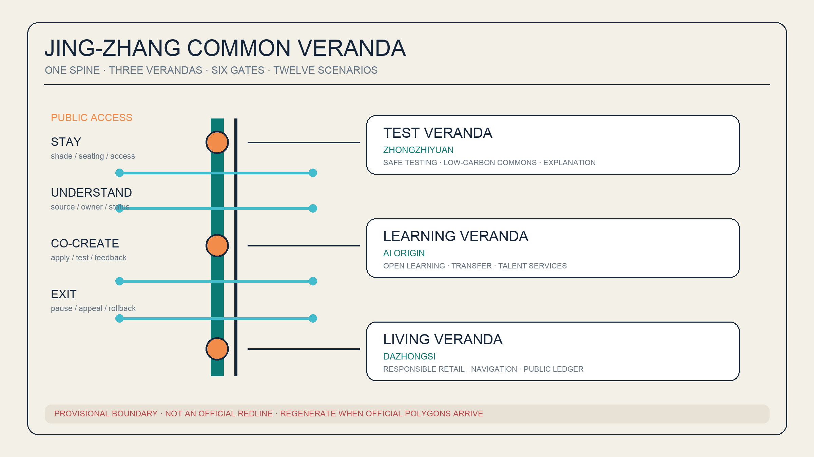

### Dual-state plan: shutdown is a second plan, not a fallback note

Three acceptance rules carry through the three key areas and six city gates. First, an AI pocket may not sever the public route. Second, shutdown must restore a named ordinary use rather than leave an empty equipment field. Third, staffed help, static wayfinding and accessible passage may not depend on the same network or model. The drawings demonstrate spatial relationships and handoff logic, not measured clear width, staffing schedules, outage duration or field recovery performance; those still require permission, co-walks and professional audit. [depth:three_key_area_detailed_design] [depth:traffic_rail_slow_parking]

## Design Basis and Source Inventory

### Evidence hierarchy

1. **Task layer:** the official announcement defines the project, the 43.6 km² coordinated research scope, the approximate 11.4 km² overall design scope and the 368.4 ha key-area scope. The Agent taskbook defines six required tasks: identity, ecosystem, scenarios, landmarks, culture and operations. [source:OFFICIAL-ANNOUNCEMENT] [source:AGENT-TASKBOOK]
2. **Context layer:** the proposal extracts public OpenStreetMap roads, rail, water, green space, amenities and key-area building footprints for orientation; completeness and accuracy are not equivalent to official survey. Phase 1 follows the published Zhichun–Qinghua East extent. The official textual limits constrain the concept envelope but are not reverse-engineered into a precise redline. [source:OSM-CONTEXT-20260810] [source:JINGZHANG-PHASE1-OPEN-2023] [source:OFFICIAL-ANNOUNCEMENT]
3. **Design layer:** the spine, six gates, civic nodes, green layer, program bands, building prototypes and twelve scenarios are Agent-generated Conceptual Recommendations. [data:geometry/roads.geojson#ROAD-001] [data:geometry/public_space.geojson#PUBLIC-001]
4. **Presentation layer:** three key-area perspectives and one “Lunch Walk into the Park” scene are original AI-generated concept images. They communicate spatial character and user relationships; they are not site photographs, exact-condition reconstructions or delivery commitments. [source:GEN-V02-CONCEPT-RENDERS] [source:GEN-V05-LUNCH-WALK-RENDER]

The site and three key-area polygons remain repository-provisional. The submitted polygon recalculates to approximately **11.41 km²** in EPSG:4548 and is used only for internal comparison. All GeoJSON, metrics, drawings, HTML and PDFs must be regenerated when the official polygon arrives. [source:BOUNDARY-SOURCE] [metric:site_area_sqm]

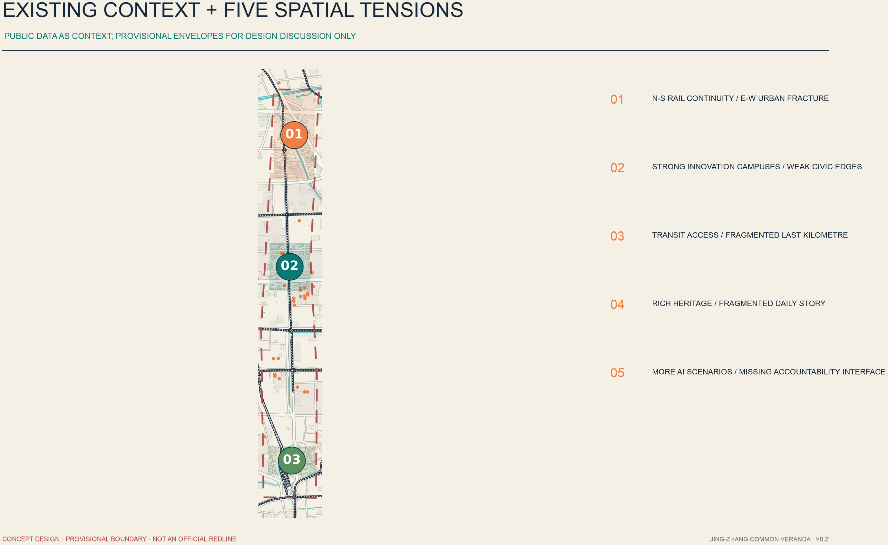

### Six spatial tensions

- **Continuity versus fracture:** the rail heritage creates a strong north-south line, while roads, walls and superblocks weaken east-west urban connections.
- **Innovation versus civic access:** research resources are concentrated, yet residents and visitors rarely see how research produces public value.
- **Transit versus the last kilometre:** rail and arterial access are strong, but walking, cycling and accessible connections from stations to campuses and communities need site-by-site verification.
- **Heritage versus daily life:** rail, Zhongguancun and AI narratives are rich but lack one everyday shared carrier.
- **Office versus living:** universities, campuses, communities and commerce already mix inside the overall-design scope. The real stitching points are Zhichun Road, Chengfu Road, Qinghua East Road West and the four Dazhongsi quadrants. The missing layer is not another office concept but an everyday public realm with continuous walking, safe crossing, stopping and staffed help at those real interfaces.
- **Intelligence versus accountability:** AI scenarios are expanding, while clear human owners, explanation desks, pause conditions and appeal routes remain spatially absent. [depth:existing_conditions_diagnosis]

### Lunch gate: one everyday test of the dual-state plan

The lunch gate tests the civic baseline of the dual-state plan: it must be walkable and still usable without power before any closable everyday-service AI is added. 500–600 m is a target service radius around real Phase 1 gates, not a completed survey. Audit Qinghua East Road West first, then Zhichun Road, Chengfu Road/Wudaokou and the Dazhongsi quadrants. AI only buys water, calls a staffed search, or logs a lost item. The two existing Phase 1 basketball courts are audited first; no new court is proposed by default. This is not a preference survey or traffic-count conclusion. [source:JINGZHANG-PHASE1-OPEN-2023] [depth:haidian_everyday_life]

### Translating Beijing and Haidian evidence into design moves

The proposal translates public policy into checkable constraints. Haidian's 15th Five-Year Plan frames the Jing-Zhang AI Innovation Belt, north-south AI cores, tangible benchmark scenarios, open ecosystems and safe controllability; the design therefore organizes test—transfer—adoption—public return rather than a display corridor. Haidian's innovation-scenario guidance asks for a host, a defined need, technical indicators, space/facilities, ethical safety and replicable outcomes; the flagship tabletop therefore locks responsibility and exit before technology operation. [source:HAIDIAN-15TH-FIVE-YEAR-PLAN-2026] [source:HAIDIAN-INNOVATION-SCENARIO-GUIDE-2025]

The Beijing Urban Renewal Regulation becomes a rights-holder and co-governance gate. The Accessibility Law becomes continuous physical/information access, staffed equivalence and co-review with disabled and older users. Beijing sponge-city guidance supports visible rain gardens and maintenance, but is not used to invent a site runoff target. [source:BEIJING-URBAN-RENEWAL-REGULATION] [source:CHINA-ACCESSIBILITY-LAW-2023] [source:BEIJING-SPONGE-CITY-2017]

### Existing delivery baseline and control-plan draft alignment

The proposal does not begin from a blank site. Official public information records that an approximately 2.5 km first phase from Zhichun Road to Qinghua East Road opened in 2023, retaining rail and bridge memory while adding rainwater facilities, under-bridge activity and east-west stitching. The proposal treats it as an existing public asset: the six-gate audit, continuous accessibility, accountability interfaces, lunch-walk radius and operations receipts are an overlay, not duplicate landscape construction. [source:JINGZHANG-PHASE1-OPEN-2023]

Phase 1 information also lists one standard football pitch, one five-a-side pitch, two basketball courts and separate running, walking and cycling facilities. The Qinghua East Road south-side public-realm project is approved and includes station bicycle parking and a station–park–street interface, while Phase 2 remains under construction. The proposal therefore treats sports and blue-green facilities as baseline rather than promising duplicates: G5 adds access audit, staffed accountability and operating receipts; G6 makes no continuity claim before Phase 2 completion and acceptance. [source:JINGZHANG-PHASE1-FACILITIES-2024] [source:QINGHUA-EAST-PUBLIC-SPACE-2026] [source:JINGZHANG-PHASE2-2026]

The 2024 public-consultation draft for HD00-1601 and related blocks sets out “one belt, one axis, two centres and multiple nodes”: the Jing-Zhang innovation-exchange belt, Zhongguancun Avenue innovation axis, Dazhongsi and Wudaokou centres, and multiple nodes. One spine, three verandas, six gates and twelve scenarios form a civic-service and accountability layer over that structure; they do not replace it. Published 2035 population, land, floor-area, facility and transport figures belong only to the draft scope, are not copied into `metrics.json`, and are not used to reverse-engineer an official vector redline from an image. [source:JINGZHANG-CONTROL-PLAN-DRAFT-2024] [depth:public_plan_alignment]

The official 2021 implementation interpretation already identified breaks, multiple rights holders and phased delivery, and described chief-planner/engineer and “urban partner” coordination. The proposal translates these into work-package leads, professional acceptance, quarterly receipts and retirement decisions without claiming that any organization has accepted a role. The final approved text and reusable GIS/CAD remain unavailable, so every submission boundary, key area and area figure stays provisional. [source:JINGZHANG-PLAN-INTERPRETATION-2021]

## Three-Level Scope Framework

The 43.6 km² coordinated research scope runs from the North Fifth Ring to Xizhimen Outer Street and from the Beijing–Tibet Expressway to Wanquanhe Road; it asks how the innovation ecosystem collaborates. The approximate 11.4 km² overall design scope runs from Xizhimen Outer Street to the North Fifth Ring, from Xueyuan/Xitucheng Roads in the east to Dazhongsi East/Heqing Roads in the west; it asks how civic space, mobility, industry and daily life are organised. The approximately 368.4 ha key-area scope runs north to south through Zhongzhiyuan, AI Origin and Dazhongsi; it asks how prototypes can be handed to professional teams. One civic-value contract connects all three: public access, explained responsibility, minimum data, human review and exit.

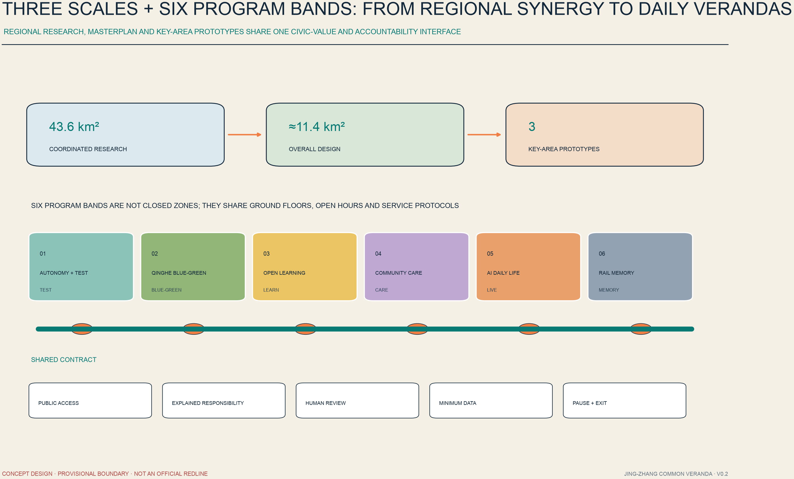

The six bands are not gated districts. Along the civic spine, they share ground-floor access, open hours and service protocols: autonomy and validation, Qinghe blue-green sharing, open learning and transfer, community care and services, AI daily life and commerce, and rail memory and international communication. [depth:three_level_scope_framework]

## Coordinated Research Scope: Industry and Future City

### Innovation ecosystem loop

The ecosystem is not a recruitment list. It is a spatial and institutional loop of research—test—adoption—public return. Zhongzhiyuan provides controlled validation and standards co-review. AI Origin connects universities, open-source communities and transfer. Dazhongsi connects adoption, resident feedback and daily life. The Zhongguancun service wing supports IP, capital, legal and international services. The Xiaoyuehe scenario wing contributes public problems, environmental validation and ongoing feedback. [depth:overall_spatial_structure]

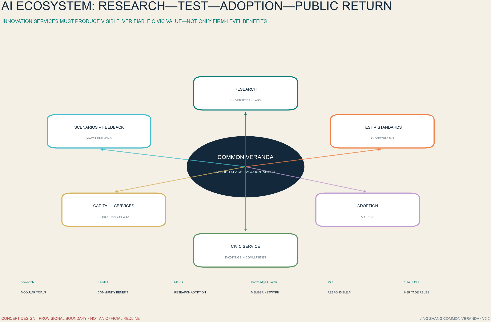

Six global cases provide transferable mechanisms rather than incomparable scale benchmarks. Modular trials at one-north, community benefit in Kendall Square and research adoption at MaRS support the test—benefit—adoption loop. [source:CASE-ONE-NORTH] [source:CASE-KENDALL] [source:CASE-MARS]

Member networks in the Knowledge Quarter, responsible AI and open science at Mila, and rail-heritage reuse at STATION F support collaboration—accountability—adaptive reuse. [source:CASE-KQ] [source:CASE-MILA] [source:CASE-STATION-F]

### Regional collaboration: five exit-ready interfaces

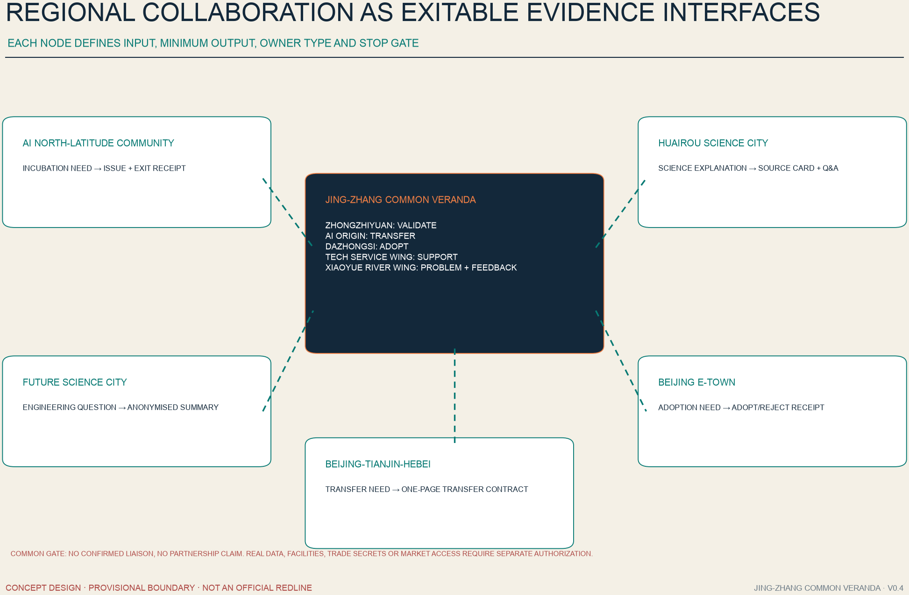

Regional collaboration is not a set of ownerless arrows. AI North-Latitude Community contributes incubation and evaluation questions; Future Science City contributes engineering validation questions; Huairou Science City contributes science-communication needs; Beijing E-Town contributes manufacturing and robotics adoption questions; and Beijing-Tianjin-Hebei nodes only receive a one-page transfer contract after a local host opts in. Each interface records a minimum output and a stop gate. [depth:regional_interface_contract]

These are proposed interfaces, not confirmed partnerships. Without a consenting liaison they remain issue mappings only. Real data, facilities, trade secrets, product access or inter-regional replication always requires separate authorization. [source:AGENT-TASKBOOK] [source:HAIDIAN-15TH-FIVE-YEAR-PLAN-2026]

### Identity and culture

The Common Veranda mark combines open brackets, twin rail lines and an action-orange node. The brackets express access, the rails connect heritage and collaboration, and the orange node keeps people in the loop. Wayfinding uses track number + veranda action + status colour, keeping open, test, pause and staffed-service states legible without a phone.

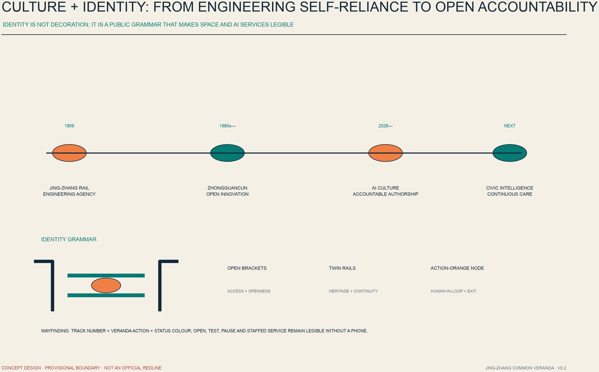

The cultural sequence runs from 1909 engineering agency, through Zhongguancun open innovation, to accountable AI authorship and continuously maintained civic intelligence. Zhan Tianyou becomes a method of verifiable, transferable engineering—not only a portrait. Zhongguancun becomes organisational openness—not only an industry label. AI culture makes responsibility, provenance and repair records visible.

## Overall Design Scope: Urban Renewal and Control-Plan-Level Urban Design

### One spine

The civic spine combines rail heritage interpretation, all-weather slow mobility, continuous tree canopy, rain gardens, public services and scenario accountability. It is not one project that must be built at once, but a public-realm standard that can be tested and linked in sections. [data:geometry/roads.geojson#ROAD-001] [depth:land_use_layout]

### Six gates

Six east-west city gates turn crossings of rail, roads, walls and campus edges into six independent verification tasks. Each gate needs continuous walking, cycle parking, accessible ramps, night lighting, legible signs, staffed help and stormwater buffering. Bridges, tunnels and structural works remain subject to professional investigation. [metric:east_west_link_count]

The lunch gate attaches only to east-west streets where Phase 1 already meets the city. The enlarged node is **Qinghua East Road West**: campuses and offices reach a signalised crossing, cycle parking and the park entrance. Its first job is a continuous ground layer that lets people walk, cross and stop without being pushed into traffic. Time, clear width, volume and accessibility all require field audit. [depth:haidian_everyday_life]

`mobility-bluegreen` proves the same sentence at two scales: the full north–south slow system on the left, the Qinghua East Road West lunch gate on the right, and the east-city—crossing—staffed desk—park—rail safety sequence below. **500–600 m** is only a gate-side service-radius target. The gate adds one closable AI layer: buy water, staffed search, lost-item registry; no photo upload by default; failure goes to a person.

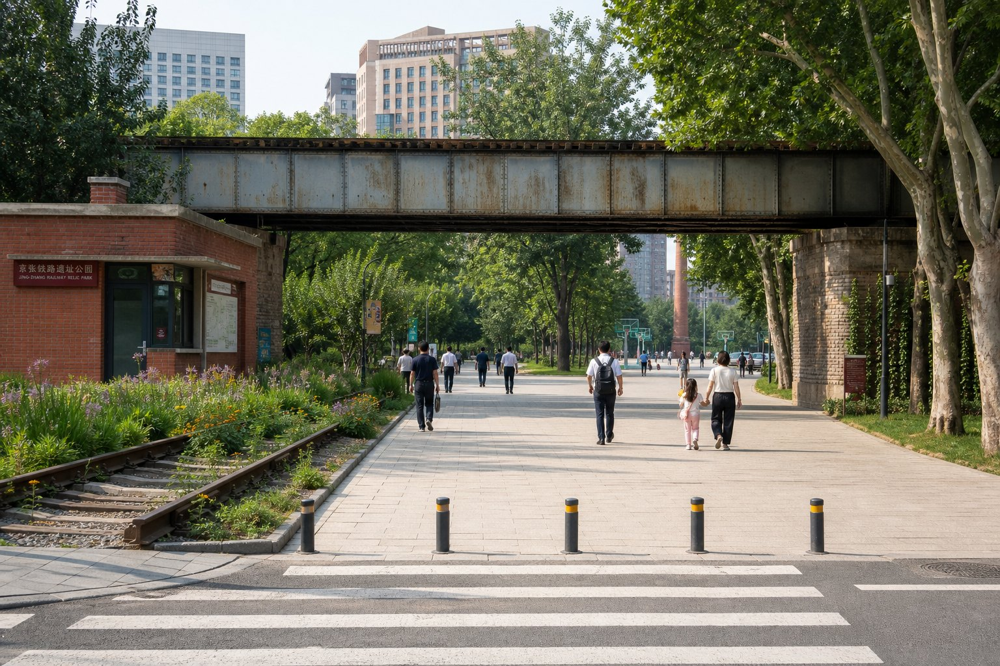

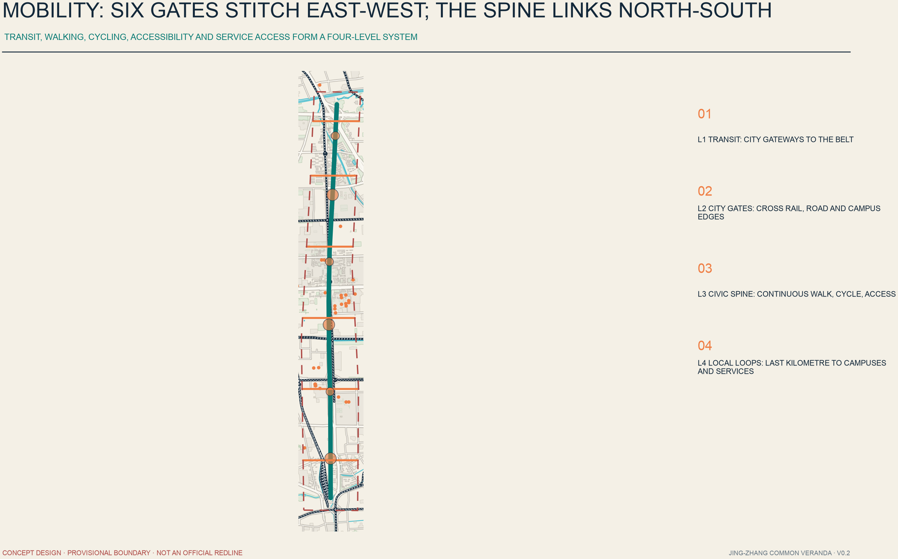

### Six program bands and building renewal

Program bands express dominant civic relationships, not statutory zoning. Buildings follow a five-level handoff: retain value, open the ground floor, adaptively reuse, add reversibly, or mark pending confirmation. Valuable existing fabric is retained. Suitable research, education and commercial ground floors gain public interfaces. New veranda components remain separate, maintainable and replaceable. Buildings without ownership or structural evidence receive no demolition conclusion. [depth:retain_renovate_demolish]

The 22 building footprints remain conceptual prototypes, totalling approximately **12.67 ha**. They are not an existing-condition inventory or a confirmed development scale. [metric:building_footprint_area_sqm]

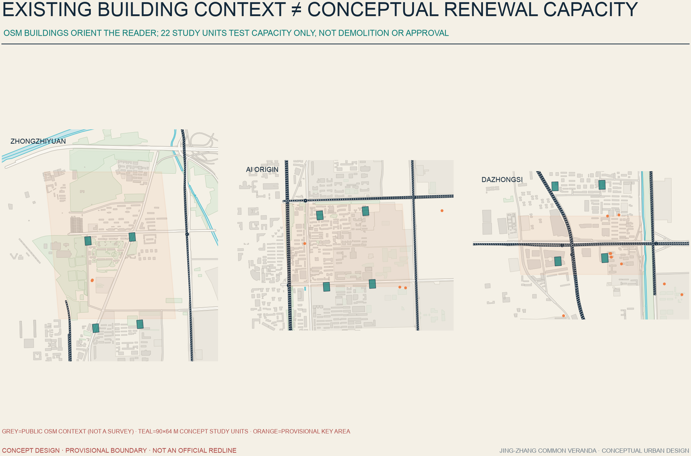

## Detailed Design of the Three Key Areas

The three key areas use identical road, rail, building and provisional-boundary bases, each with paired AI ON / AI OFF plans. Zhongzhiyuan tests whether the public route and ordinary court recover after the test pocket closes; AI Origin tests whether paper sources and staffed learning continue after the learning plug-in closes; Dazhongsi tests whether staffed help, water, rest and transfer continue after everyday-service plug-ins close. [metric:key_area_count]

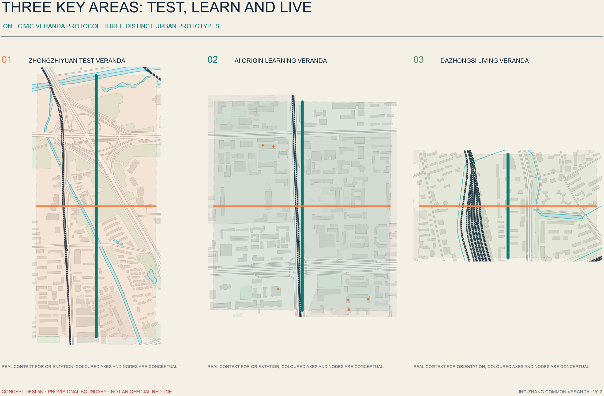

### 01 Zhongzhiyuan: Responsible Test Veranda

Zhongzhiyuan does not become an unattended test field. It turns testing into observable, explainable and interruptible civic innovation. The public observation veranda is physically separated from the test lane. Test intake, risk explanation, a human steward and a manual off control appear before entry. Red-team testing, low-speed robotics and compute-energy auditing form a public evidence chain. In AI OFF state, equipment and temporary boundaries leave, the public route stays fixed, and the test pocket returns to an ordinary court or open green. If that restored use fails, AI ON may not open.

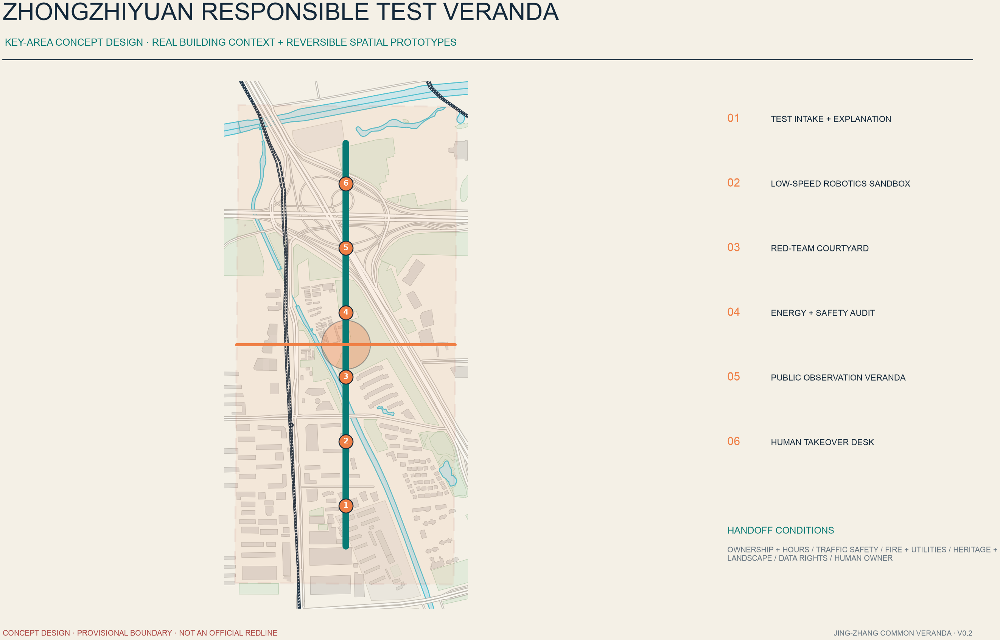

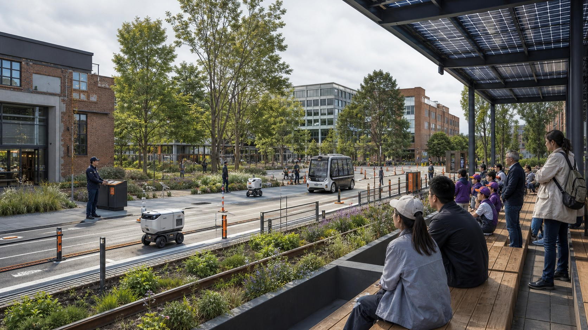

The six nodes are test intake and explanation, a low-speed robotics sandbox, red-team courtyard, energy and safety audit kiosk, public observation veranda and human takeover desk. Campus permission, fire and industrial safety, test limits, data rights and an on-site human owner are prerequisites. Boundary crossing, link loss, non-reproducibility or unavailable takeover stops a trial.

### 02 Beijing AI Origin: Open Learning Veranda

AI Origin turns boundaries between university, research campus, startup community and residents into an interface where knowledge can be seen, discussed and reused. The open-source release gate checks licence and provenance. Public learning steps support courses and community explanation. Research-to-civic tables connect models and public-service problems. The accessible learning loop and rail rain garden ensure the place first works as everyday civic space. The learning veranda also includes the student life already alive at Liudaokou and Wudaokou: meals, films, board-game shops and places that stay open in the evening. Without that third place, open learning is only a launch event and cannot keep human atmosphere. In AI OFF state, model explanation and intelligent retrieval stop while paper sources, staffed teaching, learning steps and the accessible loop continue; public knowledge cannot depend on one online demo.

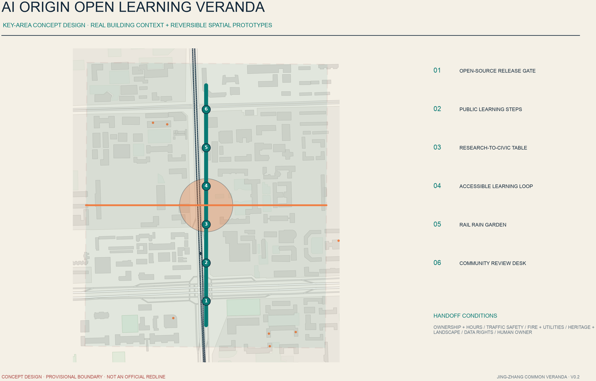

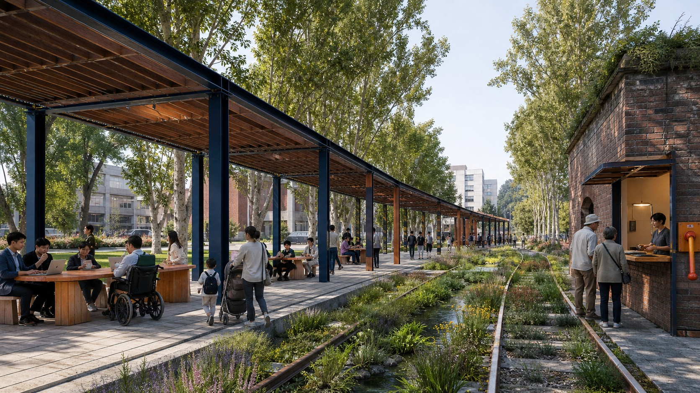

The six nodes are the release gate, public learning steps, research-to-civic table, accessible learning loop, rail rain garden and community review desk. Open hours, IP, minor protection, event noise and station access require joint professional and operational confirmation.

### Flagship tabletop: the 90-day Veranda Receipt

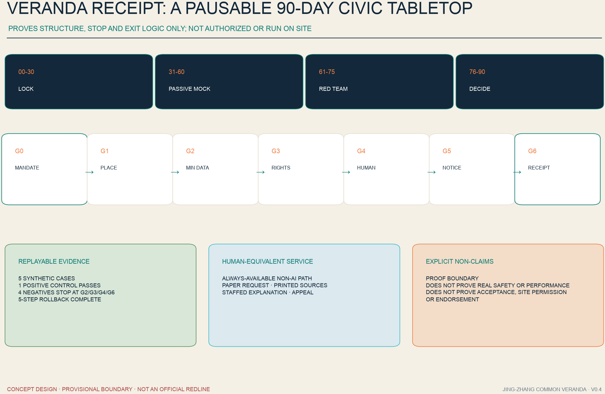

Rather than deepening all twelve scenarios at once, the proposal chooses one public-learning request at AI Origin. Five synthetic fixtures exercise source lookup, staffed explanation and an evidence receipt; a paper request, printed sources, in-person explanation and appeal remain available. Status is **tabletop only / not authorized / not run**. The evidence proves the G0—G6 sequence, four stop branches and five-step rollback structure; it does not prove site safety, model performance, acceptance, permission or endorsement. [depth:veranda_receipt_pilot]

The gates cover mandate, place/access, minimum data, rights/provenance, human control, public notice/non-AI service, and receipt/appeal/exit. One positive control passes and four negatives stop at personal data, unresolved rights, missing steward and missing exit; 5/5 current machine outcomes match expectation. A real pilot must reassign every accountable role and obtain site and professional authorization. [metric:tabletop_expected_outcome_match_rate] [source:CAC-AI-CONTENT-LABEL-2025]

### 03 Dazhongsi: Everyday Civic Veranda

Dazhongsi tests how AI enters ordinary city life. Transit arrival, commercial ground floors, community services and rail culture meet in an all-weather civic living room. Responsible retail, elder navigation and community appeals are staffed by default. The Centennial Civic Ledger Clock displays running, paused, complained-about and repaired scenarios—not only technical achievements. The living veranda focuses on the real walking relationship among the Dazhongsi station quadrants, existing commercial ground floors, community services and the southern Jing-Zhang corridor; cross-district shopping narratives are not used as a site-design basis. In AI OFF state, navigation, staffed-search dispatch and lost-item plug-ins close while the staffed desk, water, rest, toilet wayfinding and transfer route remain open.

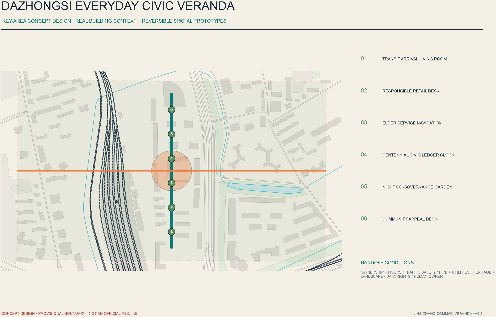

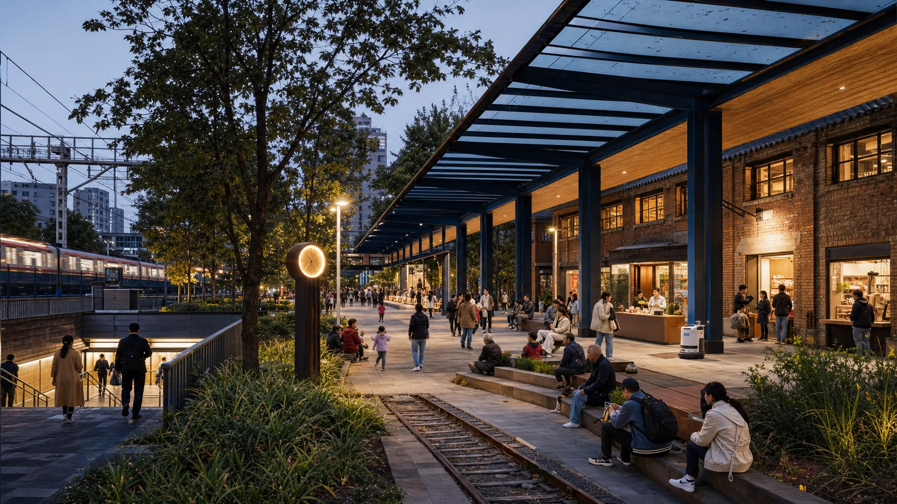

The six nodes are the transit arrival living room, responsible retail desk, elder navigation, Civic Ledger Clock, night co-governance garden and community appeal desk. Traffic, commercial ownership, privacy, advertising, noise and night safety remain prerequisites.

## AI Ecosystem, Personas and AI+ Scenarios

Six principal user groups remain researchers, startups, university students, nearby families, elderly and disabled users, and city operations/public-service staff. The proposal does not invent an overlapping seventh category. Instead, it adds previously overlooked everyday states to those six profiles: nearby workers taking lunch or dinner walks; students and residents eating, seeing a film or playing board games on weekends; children with caregivers; and people walking with pets where site rules permit. Each gains a public capability that does not require being an industry insider: quiet staying, accessible arrival, explanation, appeal, pause or continued participation.

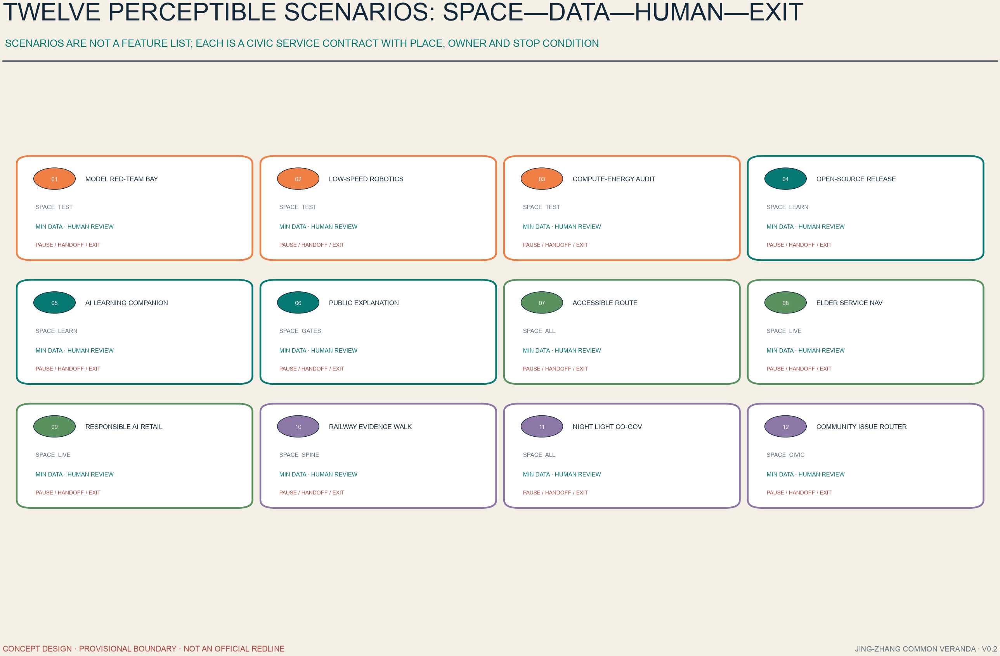

Twelve scenarios form four groups: industry testing, open learning, civic care, and governance/culture. Every scenario identifies its space, minimum data, human owner, public information, pause condition and exit route. Model red-team, low-speed robotics, energy audit and responsible retail are the four industry validation scenarios; the remainder serve education, accessibility, elder care, heritage interpretation, night lighting and community governance. [data:geometry/public_space.geojson#PUBLIC-006]

AI at everyday city gates does not turn the belt into a special zone; industry testing and learning remain in their own closable pockets. The gate layer prioritises only three needs that ordinary people can say aloud: buy a bottle of water; contact a staffed help desk when a child becomes separated, followed by human announcements and zone-by-zone search; register a lost item for human verification at collection. The find-a-person path uploads no photo, uses no facial recognition and makes no automated inference about a minor's location by default. Machines only route intent or perform low-risk delivery, without needing a humanoid form. Because even enterprise Agents remain unstable, park services default to a staffed desk, paper receipt and one-action pause; no high-impact decision is automated. [depth:haidian_everyday_life]

## Land Use, Building Scale and Retain/Renew/Remove Strategy

Program bands use public classification terms but remain conceptual. The veranda crosses land-use boundaries by creating a continuous civic layer of shade, rest, stormwater, signs, services and accountability, without claiming a change in statutory ownership. [standard:MNR-LAND-USE-CLASSIFICATION-GUIDE]

Renewal begins with existing value and civic-interface potential. Rail, brick, industrial or other reusable structures are retained. Ordinary research and office buildings gain open ground floors and movable components. No demolition, additional floor or underground-development conclusion is made without survey and structural appraisal. Height, fire spacing, sunlight, structure, heritage views and equipment are for professional deepening. [standard:MOHURD-ARCH-DESIGN-DEPTH-2016]

## Mobility, Rail, Utilities and Public Facilities

Mobility is layered by risk and speed: operating rail keeps an exclusive safety interface; the six city gates use only existing or professionally verified crossings; walking and access remain continuous; running separates only in wide segments; cycling moves to city streets where clear width fails; service and emergency vehicles are time- and speed-controlled under pedestrian priority. Any crossing of rail, express roads, bridges, tunnels or underground links remains a conceptual question rather than an engineering-feasibility claim. [depth:traffic_rail_slow_parking]

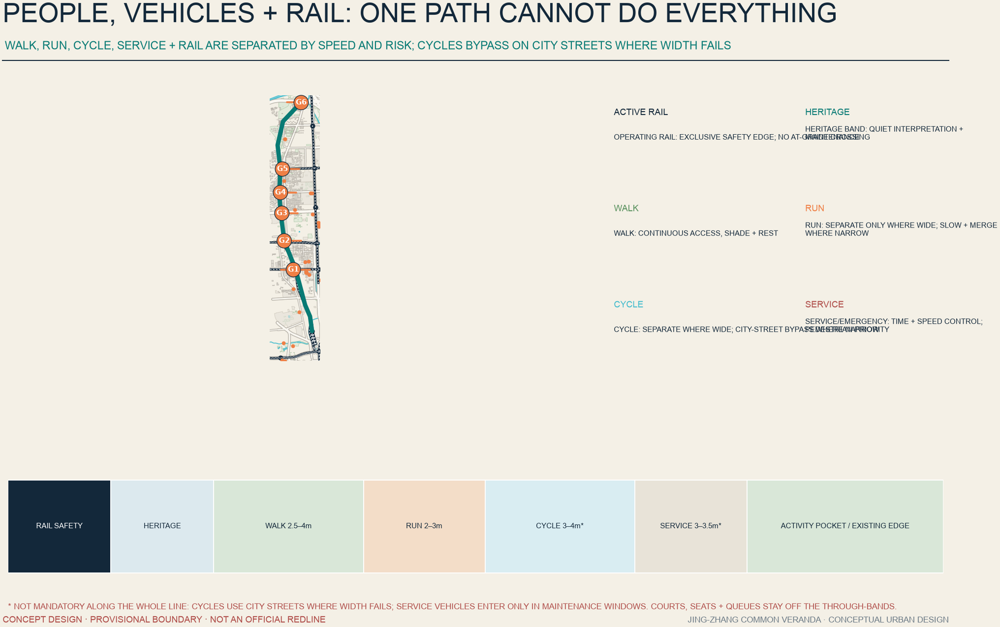

Utilities follow a low-tech base + removable smart layer. Seating, shade, ramps, drinking water and signs work without power. Sensors, edge compute, metering and lighting controls have separate power, permission and manual shutdown. Public services do not depend on collecting more data, and high-impact decisions hand off to a person. [depth:municipal_new_infrastructure]

## Blue-Green Space, Civic Realm and Urban Character

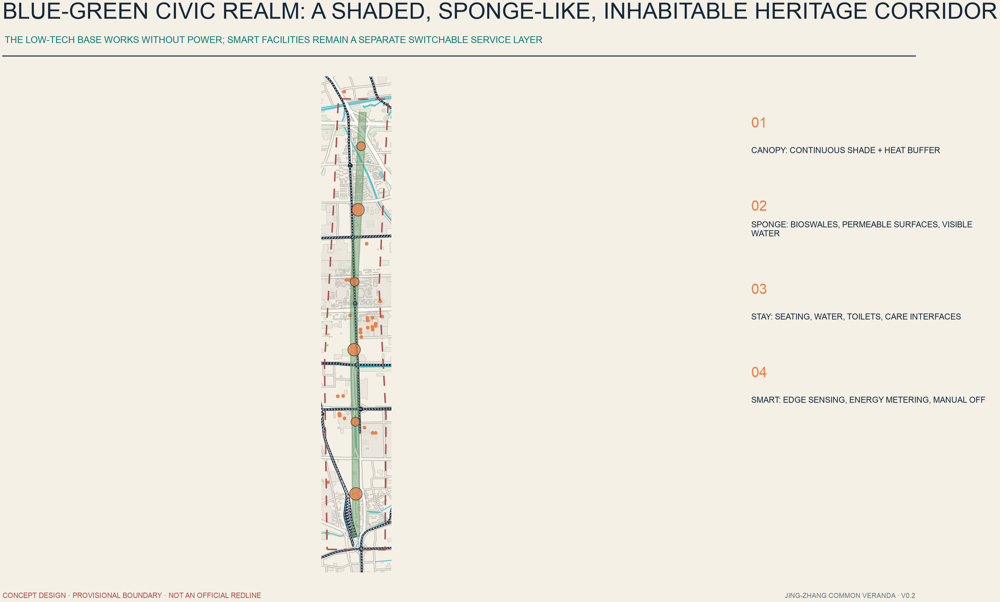

Continuous canopy, permeable paving, bioswales and visible rain gardens form the ecological base. Within the provisional polygon, design green is approximately **12.1%** and civic space approximately **2.1%**. These values compare internal concept allocation only and are not statutory green or public-space controls. [metric:green_ratio] [metric:public_space_ratio]

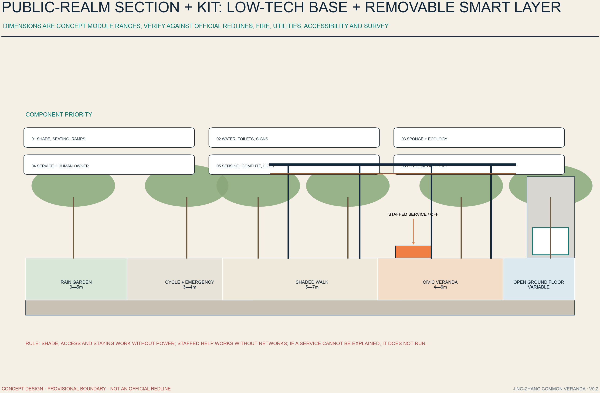

The concept section combines rain garden, cycle/emergency access, shaded walk, civic veranda and open ground floor. Widths are module ranges to be adjusted against official redlines, fire, utilities, accessibility and survey. The spine separates running from walking in principle, so lunch walks do not compete with running on one narrow trail; whether parallel paths fit, and at what width, depends on site survey, existing trees and utilities. Under linear-park spatial constraints, only **one or two full courts** are studied at wider civic openings; Dazhongsi or another wider living node may study one more. Courts are not repeated along the whole spine, and no grandstand is proposed. Safety runoff and a few flat benches let passers-by watch on foot or sit—not as stadium spectators. [depth:blue_green_public_space] [assumption:A-COURT-001]

Priority is shade before screens, staffed help before automated judgement, and physical shutdown before default continuous operation. Three pilgrimage landmarks are the Responsibility Transformer at Zhongzhiyuan, Open-Source Commit Steps at AI Origin and Centennial Civic Ledger Clock at Dazhongsi. They record contribution, responsibility and repair rather than technological worship. Form remains subject to heritage, landscape, night-lighting and safety review.

## Feasibility Verdict: What Can Start, and What Cannot

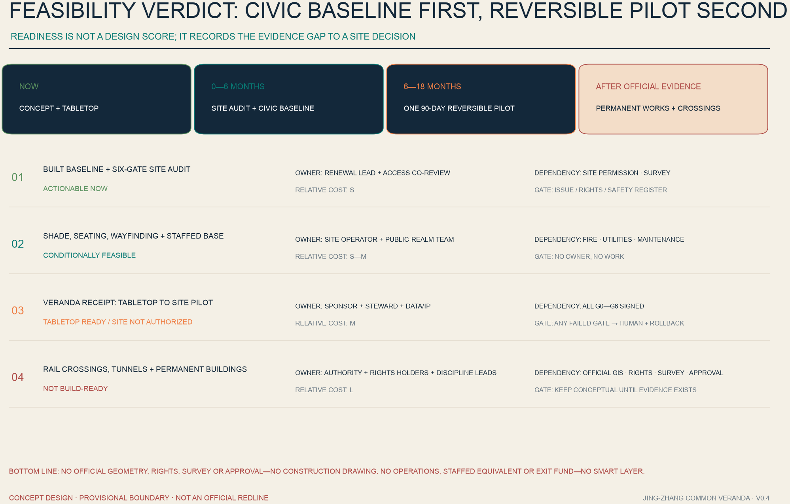

**Overall verdict: conditionally feasible as a phased, reversible open-design process; not a construction-ready scheme.** Concept review, official-evidence reconciliation, six-gate field audit and rights/owner mapping can start now. After site permission, named operations responsibility and fire, utilities and accessibility review, a low-tech civic baseline may precede one reversible 90-day AI Origin pilot. Rail crossings, bridges/tunnels, permanent buildings, statutory indicators and investment figures are not implementation-ready. [depth:implementation_feasibility_assessment]

- **R4 | field preparation can start:** audit the built public-space baseline and six gates after permission; deliver issue, rights, continuous-access and safety registers. No permission or unsafe access means stop.
- **R3 | conditionally feasible:** test reversible shade, seating, water, wayfinding, rain-garden and staffed-service elements after fire, utilities, maintenance and accessibility checks. No maintenance owner means no work.
- **R3 | tabletop ready, site not authorized:** the Veranda Receipt matches 5/5 synthetic expectations, but a real pilot needs G0—G6 signatures, staffed equivalence, insurance and exit funding. Any failed gate pauses, hands off to people and executes rollback. [metric:tabletop_expected_outcome_match_rate]
- **R1 | not build-ready:** rail crossings, tunnels, bridges and permanent buildings require rights-cleared official GIS/CAD, ownership, survey/investigation and statutory/discipline approvals. Until then they remain questions, not engineering, cost or programme claims. [assumption:A-BOUNDARY-001]

`visual/assets/feasibility-assessment.json` records owner type, S/M/L relative cost, dependencies, acceptance evidence and stop condition for every row. S/M/L is not a budget; R1—R4 is not a design score or government approval.

## Twelve Work Packages: Spatial Move to Responsible Hand-off

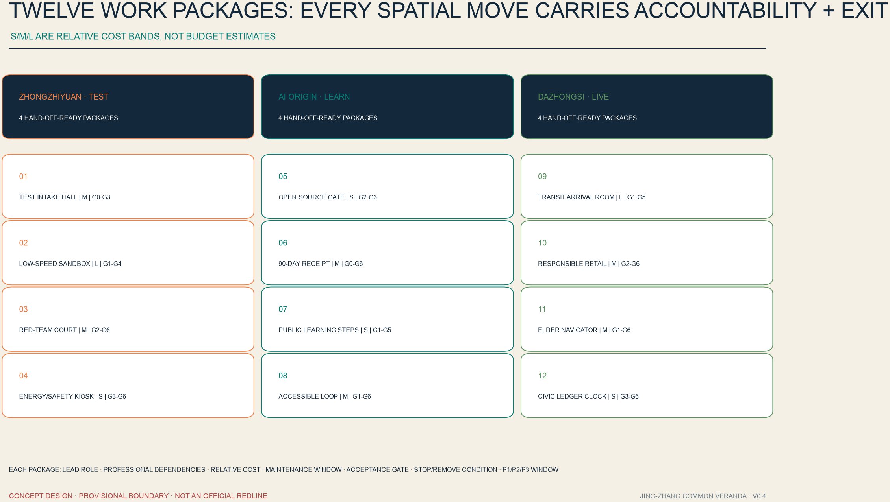

Each key area is divided into four work packages. `spatial.json` records a concept interface, lead-role type, S/M/L relative cost, survey/rights/professional dependencies, G0—G6 acceptance gates, maintenance window, stop condition and P1/P2/P3 window. Cost bands compare complexity only; they are not budgets. [depth:work_package_ledger]

- **Zhongzhiyuan:** test intake, low-speed sandbox, red-team court and energy/safety kiosk; boundary breach, lost contact, non-reproducibility or missing takeover stops work.
- **AI Origin:** open-source gate, 90-day receipt, public learning steps and accessible loop; unresolved rights, youth protection, continuous access or staffed service stops opening.
- **Dazhongsi:** transit arrival room, responsible retail, elder navigator and civic ledger; high-impact matters go to people, while incomplete run/pause/complaint/repair evidence displays UNKNOWN. [source:HAIDIAN-AI-ELDER-ACTION-2026]

## Renewal Projects, Policy and Phasing

### Implementation Path: Actors, Metrics and Gates

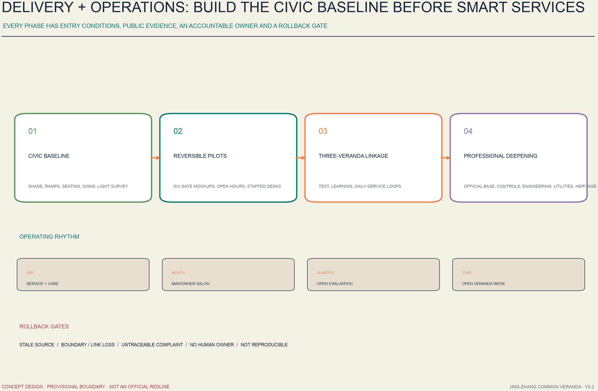

Delivery has four steps. First, the site operator, urban-renewal disciplines and community/accessibility co-reviewers measure and complete the civic baseline of shade, ramps, seating, signs and lighting. Second, maintainers, enterprises, universities and the site-safety team test six city gates, open hours and staffed service with movable components. Third, link test, learning and living verandas through scenario and operating ledgers. Fourth, enter professional deepening only after the competent authority provides official base evidence and utilities, fire, heritage and engineering teams complete discipline review. [depth:phasing_implementation]

Operating rhythms are daily service and care, monthly maintainer salons, quarterly open evaluation and an annual Open Veranda Week. Measurable indicators include public open hours, accessibility issue-closure ratio, published test-card count, complaint-response time, pause/repair records and resident satisfaction feedback. Before monitoring begins, `metrics.json` records method, accountable actor and privacy boundary; uncollected values are never claimed as outcomes.

### Long-term operations: who maintains, responds and retires

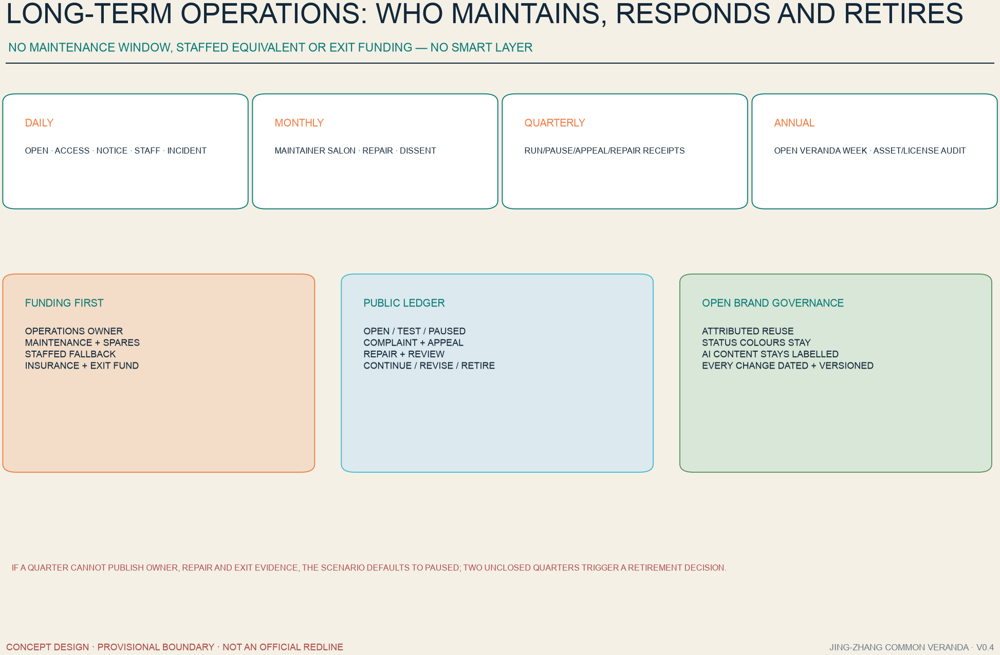

Operations are an opening condition. Daily checks cover access, notice, staffed fallback and incidents; monthly maintainer salons handle unresolved repairs and dissent; quarterly receipts publish run/pause/appeal/repair evidence and decide continue/revise/retire; annual Open Veranda Week also audits public assets, licences and brand use. [depth:operations_brand_ledger]

No smart layer opens without an operations owner, maintenance/spares window, staffed equivalent, insurance and exit funding. If a quarter cannot publish owner, repair and exit evidence, the scenario defaults to PAUSED; two unresolved quarters trigger a retirement decision. The mark may be reused with attribution, but status colours, explicit AI-content labels and version records must stay. [source:BEIJING-URBAN-RENEWAL-REGULATION] [source:CAC-AI-CONTENT-LABEL-2025]

## Metrics, Recalculation and Compliance Matrix

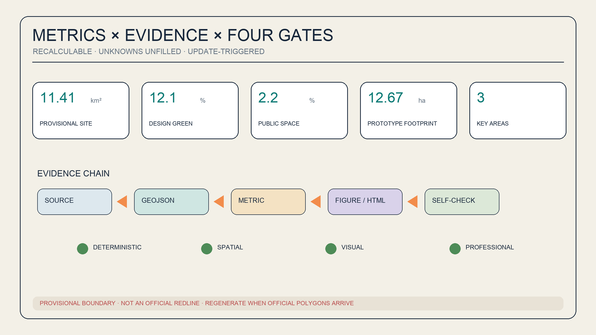

First test the three dual-state plans, then read the areas.

The four boundary messages are not four independent defects but four explicit reports of one organizer-data gap: no public official polygon is available for the overall scope or the three key areas. The announcement formally supports textual limits and approximate areas; OSM and published government-project information supply real context only; the six gates, paired plans and ratios remain recalculable conceptual recommendations. The whole package is replaced only when an official file has a verifiable source, reuse right, version and coordinate system; visual realism never upgrades evidence status. [source:OFFICIAL-ANNOUNCEMENT] [depth:metrics_recalculation]

Gate-side service radius, audit-first courts, three closable AI jobs, and a low-tech layer that still works without power are the acceptance sentences this round must make visible. Area metrics still have three classes: spatial values recalculable from GeoJSON; statutory controls waiting for official plans; and performance metrics accumulated through operations. The first carries current values, the second remains unknown, and the third defines collection method, accountable owner and privacy boundary. [depth:metrics_recalculation]

Spatial metrics are recalculated in EPSG:4548 from the site boundary, green-space, public-space and building layers. The provisional design envelope is approximately **11.41 km²**, concept green space approximately **12.1%**, and concept public space approximately **2.1%**. These values check internal consistency and map directly to the methods, source layers and status fields in `metrics.json`; because the boundary and key areas remain provisional, none is presented as a statutory site area or planning ratio. [metric:site_area_sqm] [metric:green_ratio] [metric:public_space_ratio]

Statutory FAR, height, development capacity, parking, utility capacity and heritage controls remain `unknown`; visual estimation is not used to fill gaps. New official evidence triggers a full chain: replace boundaries, recalculate intersecting layers, redraw Chinese and English figures, regenerate PDF/HTML and rerun self-check. The compliance matrix responds to the announcement and agent.1—agent.6, while the standards and design-depth matrices record judgement, evidence and gaps. Passing machine validation only permits content review; it is not spatial-quality approval, selection, planning approval or engineering feasibility. [data:geometry/site_boundary.geojson#SITE-001] [standard:MOHURD-URBAN-DESIGN-MEASURES]

## Risk, Copyright and Compliance

The principal risk is presenting provisional precision as official certainty. Personal, sensitive or minor data is constrained by minimum-data rules, human review and appeal; public-source status, authorization, copyright, implementation risk and compliance stay linked to gates and stop conditions. Official boundary, planning controls, buildings/ownership, mobility/utilities, and heritage/climate each have a replacement trigger. When new evidence arrives, the workflow starts at provenance, replaces geometry, recalculates metrics, redraws figures, regenerates HTML/PDF and reruns self-check. [depth:risk_missing_data]

OSM data carries ODbL 1.0 attribution to © OpenStreetMap contributors. Three key-area perspectives and one “Lunch Walk into the Park” scene were generated specifically for this proposal and disclosed here and in sources.json; they are not third-party photographs, exact-condition reconstructions or built-condition claims. The mark, diagrams, HTML and PDFs are original proposal outputs.

Every spatial, policy, recruitment, event and operating move remains a Conceptual Recommendation. The proposal does not claim official approval, adopted controls, final ownership, investment commitment, engineering feasibility or guaranteed delivery. Maintainers, the public and professional teams retain final judgement.

## References

- Beijing Municipal Commission of Planning and Natural Resources, Haidian Branch: official prequalification announcement. [source:OFFICIAL-ANNOUNCEMENT]
- Cleared Agent taskbook summary, Site Package and professional-standard snapshots. [source:AGENT-TASKBOOK]
- Beijing Municipal Commission of Transport: Changping Line southern-extension opening notice, including Xuezhiyuan Station as workplace-observation context only, not a park-gate location. [source:BJ-METRO-CHANGPING-SOUTH-2023]
- OpenStreetMap public roads, rail, water, green, amenities and buildings, ODbL 1.0. [source:OSM-CONTEXT-20260810]
- Official JTC one-north, City of Cambridge Kendall Square and MaRS pages. [source:CASE-ONE-NORTH] [source:CASE-KENDALL] [source:CASE-MARS]
- Official Knowledge Quarter London, Mila and STATION F pages. [source:CASE-KQ] [source:CASE-MILA] [source:CASE-STATION-F]
- Full provenance, licence, use and limitations are in `sources.json`; spatial, metric and assumption evidence are in GeoJSON, `metrics.json` and `assumptions.json`. [source:OSM-CONTEXT-20260810]
