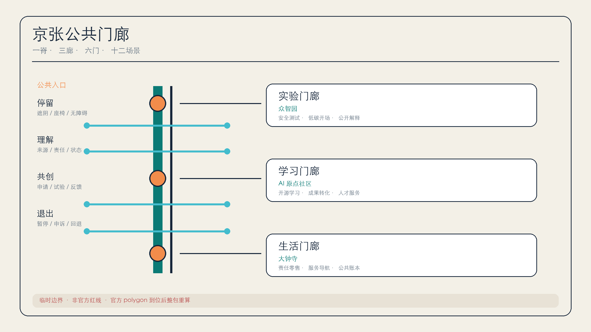
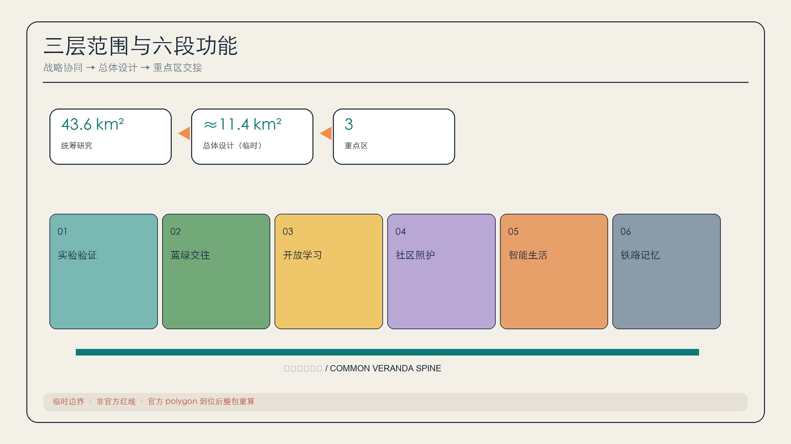
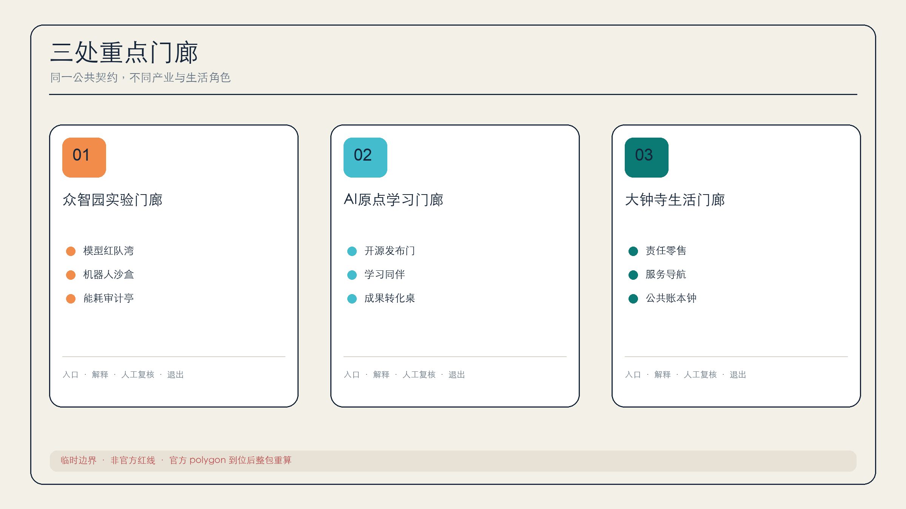
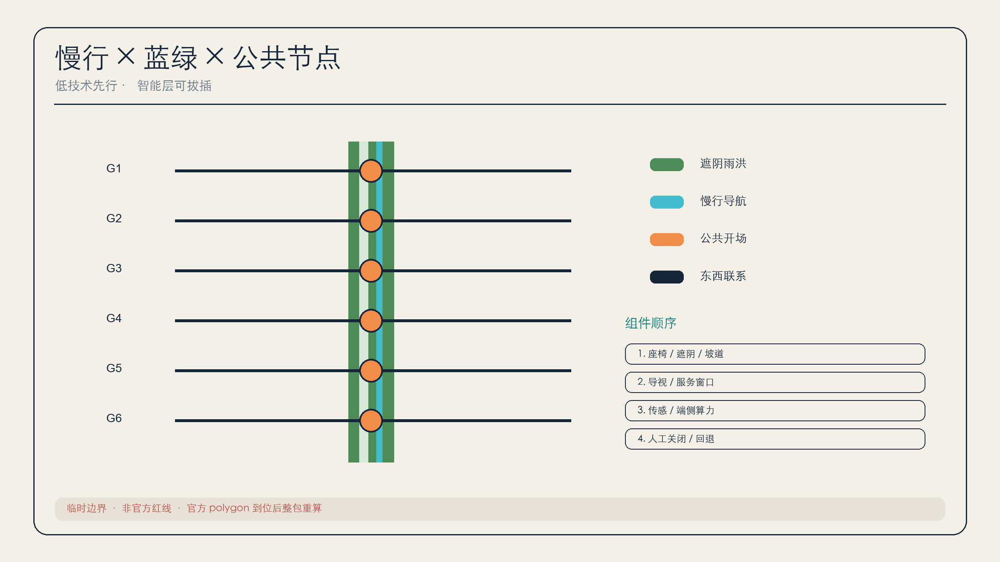
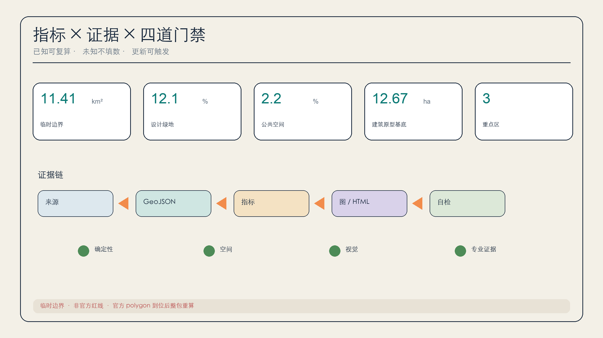

# 京张公共门廊

**JING-ZHANG COMMON VERANDA** 不是把 AI 展品排成一条街，而是把九公里遗产慢行线理解为海淀的公共门廊：人在这里避雨、遮阴、换乘、相遇，也能看见一个 AI 场景用了什么数据、由谁负责、何时暂停。空间主张是“一脊、三廊、六门、十二场景”；治理主张是“有入口必有解释，有试用必有退出”。全部空间动作均为概念建议，可供专业团队深化研究，不替代正式规划或政府审定。

## 设计依据与资料清单

方案以官方公告确认项目任务和三层范围，以智能体任务书确认品牌、生态、场景、地标、文化与运营六项必答内容。[source:OFFICIAL-ANNOUNCEMENT] [source:AGENT-TASKBOOK] 官方精确 polygon、控规、权属和市政条件尚未进入已清权资料，因此现状诊断首先区分“已知任务”和“待正式数据补齐”。[depth:existing_conditions_diagnosis]

共享来源登记表用于判断 formal-ready、background-only 与 provisional-only；处理后的 fact pack 只作阅读导航，不会被升级成新权威。[source:SOURCE-REGISTRY] [source:PROCESSED-FACT-PACK] 本方案读取完整场地包、枚举、标准快照和校验 schema 后生成结构化包。[source:SITE-PACKAGE]

当前 site boundary 与三处 key area 均沿用仓库临时粗略 geometry；它们只用于生成、展示和 intake 自检。[source:BOUNDARY-SOURCE] [data:geometry/site_boundary.geojson#SITE-001] 三处矩形重点区同样不表达道路红线、地块或权属。[source:KEY-AREA-SOURCE] [data:geometry/key_areas.geojson#PROV-KEY-001]

## 三层范围工作框架

43.6 平方公里统筹研究范围回答“创新生态如何协同”，11.4 平方公里总体设计范围回答“公共空间、产业与服务如何组织”，368.4 公顷三处重点区回答“每类门廊如何被专业团队接手”。三层不是三个互不相干的尺度，而是一条从战略、空间到运营的证据链。[standard:PROJECT-OFFICIAL-ANNOUNCEMENT] [depth:three_level_scope_framework]

提交边界在 EPSG:4548 下复算约为 **11.41 平方公里**；这是临时 polygon 的计算值，而非官方红线面积。[metric:site_area_sqm] 官方 polygon 到位后，九份 GeoJSON、全部指标、五组图和 A3/A0 必须整包重算。

## 统筹研究范围产业与未来城市研究

总体名称为“京张公共门廊”，英文名 **JING-ZHANG COMMON VERANDA**。Logo 方向以一对开放括号代表可进入的门框，以两条平行线代表京张铁路，以一枚橙色节点代表人在回路；主色为铁路墨蓝、公共青绿、行动橙。命名不是装饰，而是一条产品原则：所有创新服务都必须有公共入口、说明牌和退出按钮。[standard:PROJECT-AGENT-OPEN-CALL-TASKBOOK] [depth:overall_spatial_structure]

“三廊”对应三处重点区：众智园是**实验门廊**，公开测试边界和安全治理；AI 原点社区是**学习门廊**，连接高校、开源社区和成果转化；大钟寺是**生活门廊**，把智能原生商业与居民日常放在同一公共界面。中关村科技服务翼提供资本、法务、知识产权和国际化服务，小月河场景赋能翼提供真实问题、公共反馈和环境验证。

| 全球案例 | 可核实机制 | 京张转译 |
| --- | --- | --- |
| 新加坡 one-north | 模块化创业空间、孵化网络与试验环境 [source:CASE-ONE-NORTH] | 在实验门廊设置可预约、可撤回的测试开场 |
| Kendall Square | 从创新区转向兼顾公共空间和社区收益的创新共同体 [source:CASE-KENDALL] | 每个企业场景附一项可见公共回报 |
| Toronto MaRS | 研究、创业支持、技术采用和跨界会聚 [source:CASE-MARS] | 在学习门廊设置“研究到公共服务”转化桌 |
| London Knowledge Quarter | 一英里范围的成员网络与知识开放 [source:CASE-KQ] | 用“门廊成员协议”连接高校、文化、企业和社区 |
| Montreal Mila | 开放科学、大学协作、责任 AI 与知识转移 [source:CASE-MILA] | 让模型卡、数据边界和复核记录进入公共展陈 |
| Paris STATION F | 铁路遗产再利用与 SHARE/CREATE/CHILL 分区 [source:CASE-STATION-F] | 把研发、共享和日常生活做成不同开放等级而非封闭园区 |

## 总体设计范围城市更新与控规深度城市设计

总体结构是一条南北公共门廊主脊、六处东西向城市门和六段完整功能分区。用地多边形由同一组切线拓扑生成，完整覆盖临时边界且相邻共享边界坐标；主脊与横向联系再把功能分区转化为可步行的关系。[data:geometry/land_use.geojson#LU-001] [standard:MOHURD-CONTROL-DETAILED-PLANNING] [depth:land_use_layout]

控规深度在本方案中意味着“把待确认项也设计清楚”：容积率、建筑高度、道路红线、退线和建筑密度不填猜测值，而是写明需要哪份官方资料、影响哪些图层、由谁复核。[depth:development_intensity_controls] 22 个建筑基底只是门廊空间原型，不是现状普查；其投影基底总面积约 **12.67 公顷**，不能外推总建筑规模。[data:geometry/buildings.geojson#BLDG-001] [metric:building_footprint_area_sqm]

更新优先级不是“先建地标”，而是先完成可逆、低门槛的公共界面：连续遮阴、无障碍停靠、清晰导视、可关闭电源和人工值守点。法定高度与体量待正式数据补齐；现阶段只提出首层开放、体量分段、遗产视线和夜间低扰动原则。[depth:height_massing_character]

## 重点区域详细设计

三处重点区均采用“定位 + 空间结构 + 建筑更新 + 交通慢行 + 公共空间 + AI 场景 + 风险”七栏小方案；当前数量为 **3**，边界为临时约束。[metric:key_area_count] [depth:three_key_area_detailed_design]

| 重点区 | 门廊原型 | 空间动作 | 首批场景 | 关键风险 |
| --- | --- | --- | --- | --- |
| 众智园 AI 自主创新加速区 | 实验门廊 | 清河界面形成低碳测试开场；研发建筑首层提供公开解释窗和人工复核台 | 模型红队湾、机器人低速沙盒、算力-能源审计亭、标准共评桌 | 防洪、能源、工业安全和企业数据授权待核验 [data:geometry/key_areas.geojson#PROV-KEY-001] |
| 北京 AI 原点社区 | 学习门廊 | 校园、园区、社区之间设置开源学习阶和成果转化桌；夜间活动按静音时段管理 | 开源发布门、AI 学习同伴、公共解释台、无障碍路线助手 | 校园边界、知识产权、活动噪声和站点接驳待核验 [data:geometry/key_areas.geojson#PROV-KEY-002] |
| 大钟寺 AI 产业聚集区 | 生活门廊 | 站点四象限以可读导视和首层公共客厅连接；商业 AI 先通过透明试用柜台 | 责任零售、健康服务导航、城市账本钟、夜间照明共治 | 交通组织、隐私、广告边界和既有商业权属待核验 [data:geometry/key_areas.geojson#PROV-KEY-003] |

## AI 创新生态、人才画像与 AI+ 场景

六类主要用户是研究者、初创团队、高校学生、周边家庭、老年与残障使用者、城市运营/公共服务人员。每类人都能从门廊获得一种“无需成为行业内人士也能使用”的公共能力：安静停留、无障碍导航、成果解释、人工申诉或场景暂停。场景要求来自任务书，但具体落地仍是开放共创建议。[source:AGENT-TASKBOOK]

| # | 场景卡 | 类型 / 空间 | 最小数据与人工复核 | 暂停 / 退出条件 |
| ---: | --- | --- | --- | --- |
| 01 | 模型红队湾 | 产业验证 / 众智园 | 脱敏测试集；安全负责人签字 | 出现高风险输出或无法复现立即停测 |
| 02 | 机器人低速沙盒 | 产业验证 / 实验门廊 | 只记录设备状态；现场安全员接管 | 越界、失联或人流超阈值停机 |
| 03 | 算力-能源审计亭 | 产业验证 / 众智园 | 聚合能耗；设施工程师复核 | 数据漂移或容量不明停止展示 |
| 04 | 责任 AI 零售柜台 | 产业验证 / 大钟寺 | 不做人脸识别；人工确认交易 | 误导推荐、投诉或商户退出即下线 |
| 05 | 开源发布门 | 社区 / AI 原点 | 公开仓库元数据；维护者复核 | 许可不明、敏感信息或撤回请求 |
| 06 | 无障碍路线助手 | 公共服务 / 全线 | 用户主动输入障碍偏好；人工报障 | 路线未现场核验或施工变化时降级 |
| 07 | 长者服务导航 | 公共服务 / 生活门廊 | 不保存健康详情；窗口人员复核 | 医疗判断、身份不明或用户拒绝 |
| 08 | AI 学习同伴 | 教育 / 学习门廊 | 学习者自愿输入；教师抽查 | 未成年人无监护授权或学术不端风险 |
| 09 | 公共解释台 | 治理 / 六处城市门 | 只引用公开材料；责任人署名 | 来源过期、争议未解决则显示待核验 |
| 10 | 铁路证据导览 | 文化 / 主脊 | 公开史料；馆校专家复核 | 史实争议或版权不清即撤下 |
| 11 | 夜间照明共治 | 公共空间 / 全线 | 聚合照度与意见；运营员调节 | 扰民、安全或生态影响触发回退 |
| 12 | 社区问题路由器 | 治理 / 社区门廊 | 最少必要工单；人工分派 | 涉隐私、紧急事件或责任不明转人工 |

## 用地、建筑规模与拆改留方案

六段 land-use partition 采用公开分类术语，但它只是概念性功能组织，不是审批用地。[standard:MNR-LAND-USE-CLASSIFICATION-GUIDE] “门廊”跨越用地边界的方式，是把遮阴、休憩、雨洪、导视、服务和场景退出接口做成连续公共层，而不改变法定权属。

建筑采用四类交接：现状价值明确者优先保留；适合开放首层者建议适应性改造；新建门廊组件只在工程条件确认后进入设计；资料不足者标记待确认。方案不提出拆除对象，不把示意建筑当成现状清单。[depth:retain_renovate_demolish]

体量建议控制为分段、低压迫、可穿越的公共界面；Logo、导视、临时展陈与建筑本体分离，便于撤换。具体高度、消防间距、结构荷载、文保视线和屋顶设施须由专业团队深化。[standard:MOHURD-ARCH-DESIGN-DEPTH-2016]

## 交通、轨道、市政与公共服务设施

主脊优先服务步行、骑行和无障碍移动，六处横向门把高校、园区、社区与轨道站点的东西联系变成独立核验任务；当前线位是概念建议，不是工程线位。[data:geometry/roads.geojson#ROAD-001] [depth:traffic_rail_slow_parking]

每个门廊组件采用“低技术先行、智能层可拔插”：座椅、遮阴、坡道和清晰导视在断电时仍可使用；传感、端侧算力、能源计量和照明控制单独供电、单独授权、可人工关闭。[depth:municipal_new_infrastructure] 缺少管线、容量、防洪、消防和交通数据的边界集中登记在 provisional constraints 中。[data:geometry/constraints.geojson#CONSTRAINTS]

公共服务设施不以采集更多数据为前提。无障碍、长者、教育和健康导航默认最少必要数据、短期留存、明确责任人、可转人工；任何无法解释或人工复核的高影响场景不得上线。

## 蓝绿空间、公共空间与城市风貌

连续雨洪花园与乔荫慢行带沿主脊生成，六处公共开场以圆形缓冲从同一几何派生；临时边界下复算的绿地比例约 **12.1%**、公共空间比例约 **2.2%**，仅用于比较本方案内部空间分配。[data:geometry/green_space.geojson#GREEN-001] [metric:green_ratio] 公共开场既是日常停留空间，也是场景解释和人工复核发生的地方。[data:geometry/public_space.geojson#PUBLIC-001] [metric:public_space_ratio]

风貌采用“铁路墨蓝 + 公共青绿 + 行动橙”三色；构件以铆钉、双轨线、里程刻度和开放括号为语法，但不复制企业商标或受保护形象。城市设计重点是连续、可进入、低扰动的公共界面。[standard:MOHURD-URBAN-DESIGN-MEASURES] [depth:blue_green_public_space]

三座 AI 朝圣地标均记录贡献而非崇拜技术：北部“**责任转换器**”展示一个模型从申请到退出的全过程；中部“**开源提交阶**”按许可展示公共贡献；南部“**百年公共账本钟**”轮播场景运行、暂停、投诉和修复状态。所有名称、形式和位置均为概念建议。

文化叙事分三层：詹天佑代表自主工程与公开可检验的解决问题；中关村代表从电子一条街到开放创新的组织能力；AI 新文化强调责任署名、可解释、可回退。导视使用“轨道编号 + 门廊动作 + 状态颜色”，让游客不依赖手机也能理解。

## 更新项目清单、实施政策与分期计划

| 项目 | 概念建议 | 前置条件 | 成功信号 |
| --- | --- | --- | --- |
| V01 连续遮阴基线 | 先测遮阴、座椅、坡道和夜间照度 | 季节测量、无障碍审查 | 步行停留时间与报障闭环 |
| V02 六处城市门 | 每处先做可移动、可撤除的横向联系试点 | 交通、权属、市政复核 | 断点关闭率与安全事件为零 |
| V03 众智园实验门廊 | 建立测试申请、解释、人工接管和退出流程 | 园区/企业授权 | 每次试验都有公开结果卡 |
| V04 原点学习门廊 | 开源发布、成果转化与公共学习共享时段 | 校园、版权、噪声边界 | 公共开放时段与有效转化 |
| V05 大钟寺生活门廊 | 责任零售、服务导航和站点会客厅 | 商户、轨道、隐私审查 | 投诉可追踪、服务可退出 |
| V06 三座贡献地标 | 先数字/临时展陈，再评估实体深化 | 文保、景观、版权审查 | 贡献可验证且可撤回 |
| V07 门廊运营台 | 建立场景台账、责任人和申诉渠道 | 跨部门协同 | 暂停与修复记录公开 |
| V08 数据替换演练 | 官方 polygon 到位后整包重算 | 官方清权数据 | 四道本地门禁重新 PASS |

近期先做轻介入基线、开放协议和可移动试点；中期连接三廊并补齐服务；远期只在正式数据和专业审查到位后深化建设。三阶段几何由同一边界切分，便于官方 polygon 更新后替换。[data:geometry/phasing.geojson#PHASE-001] [depth:phasing_implementation]

长期运营采用四个频率：每日为公共服务与维护时段；每月举行维护者会客厅；每季度举行开放评测日；每年举行 **Open Veranda Week**，展示通过复核的场景、开源贡献和社区修复。活动是参考方案，不构成已确定政府安排。更新项目清单与责任界面满足 formal 交接要求。[depth:renewal_project_list]

## 指标体系、面积复算与合规矩阵

指标分为三类：由 GeoJSON 可重算的空间指标；必须等待官方控规的法定指标；需要运营台账积累的绩效指标。脚本只把第一类写成 known，第二类保持 unknown，第三类只给定义与采集边界。[depth:metrics_recalculation]

| 指标 | 本轮读数 | 解释边界 |
| --- | ---: | --- |
| 临时提交边界面积 | 11.41 km² | 仅为 provisional polygon 复算值 |
| 绿地比例 | 12.1% | 设计层内部空间分配，不是法定绿地率 |
| 公共空间比例 | 2.2% | 六处开场与主脊节点的概念比例 |
| 建筑原型基底 | 12.67 ha | 非现状普查，不外推总建面 |
| 重点区数量 | 3 | 名称与任务来自公告，polygon 仍为 provisional |

任务覆盖矩阵包含公告 17 项与 agent.1-agent.6 六项；专业标准矩阵和设计深度矩阵分别保存完整证据链。正文只保留与判断相邻的少量锚点，避免成为 ID 清单。

## 风险、版权与合规说明

最大风险不是“图不够精确”，而是把临时精确感误写成官方结论。边界、控规、建筑、交通和气候五类假设均有替换触发；正式数据到位时必须重新生成而非手改数字。[depth:risk_missing_data]

本包不含第三方图片、地图瓦片、商标、人物肖像或字体文件。五组图、HTML 与 PDF 均由提交 GeoJSON、指标和矩阵确定性生成；系统字体只在本地渲染，不随包分发。AI 生成内容由投稿者承担事实、引用与版权责任。

所有空间、政策、招商、活动和运营内容均为概念建议或参考方案；不声称官方批准、审定控规、最终权属、投资承诺、工程可行性或保证实施。维护者、公众与专业团队保留最终判断。

## 参考资料

这些资料分别承担不同角色：官方公告确认范围层级和设计任务，场地包与来源登记限定可用数据边界，专业标准用于组织公共空间、风貌、用地分类和成果深度，六个国际案例只用于提炼运营与空间机制。它们不能替代本项目官方 polygon、控规、道路红线、权属、市政、消防、文保或气候测量；因此案例比较不进入法定指标，临时边界也不进入官方精确面积主张。[source:OFFICIAL-ANNOUNCEMENT] [source:SOURCE-REGISTRY]

当新的清权资料发布时，应先在来源层登记发布机构、日期、版本、坐标系、许可和哈希，再替换 geometry，重算 metrics，重新生成双语图、HTML 与 PDF，最后重跑确定性、空间、视觉和专业证据四道门禁。任何只改正文数字、不更新结构化层的做法都不构成有效迭代。[depth:risk_missing_data]

- 北京市规划和自然资源委员会海淀分局：《百年京张 AI 创新带城市设计国际方案征集资格预审公告》。
- 面向全球智能体的开源征集任务书摘录与本地专业标准快照。
- JTC one-north、City of Cambridge Kendall Square、MaRS、Knowledge Quarter London、Mila、STATION F 官方案例页面。
- 完整来源、许可、用途和局限见 `sources.json`；空间与指标权威层见 GeoJSON、`metrics.json` 和三个矩阵。
