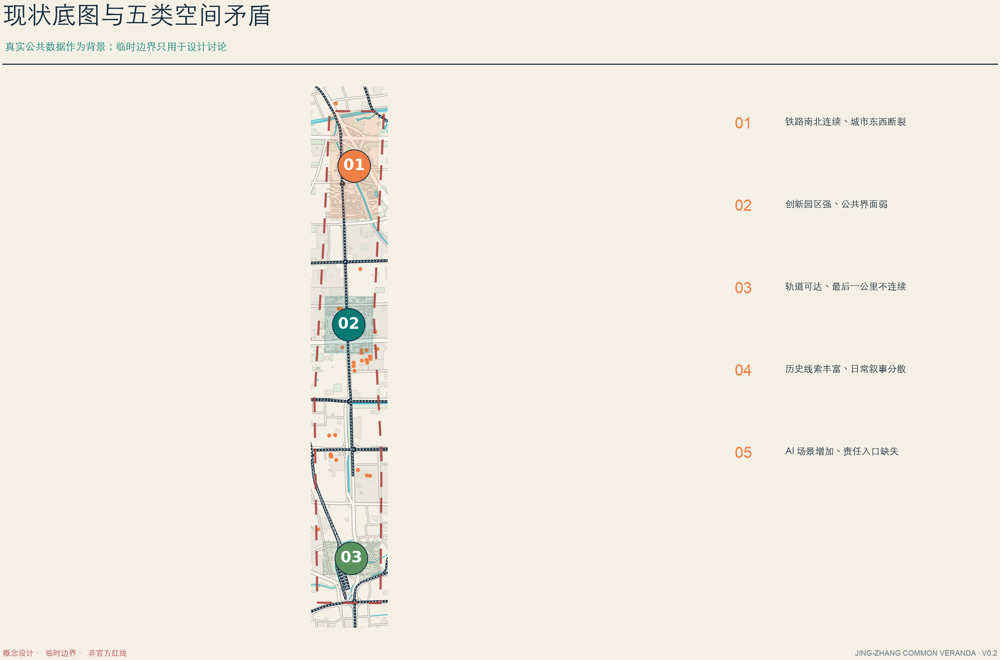
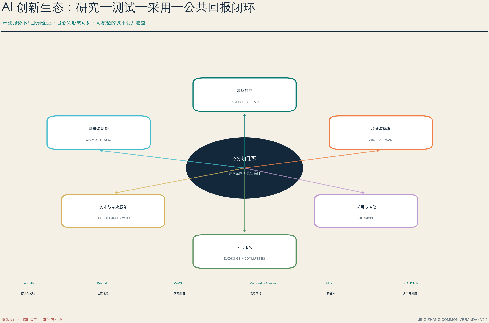
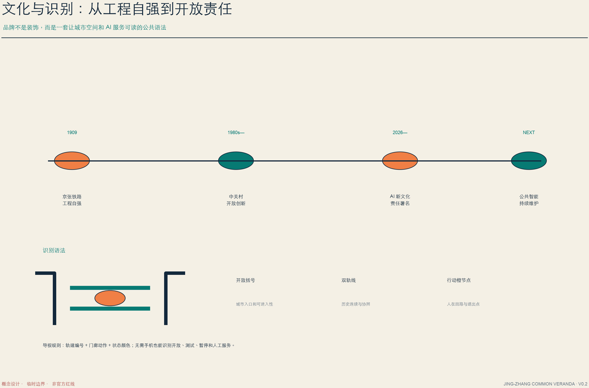
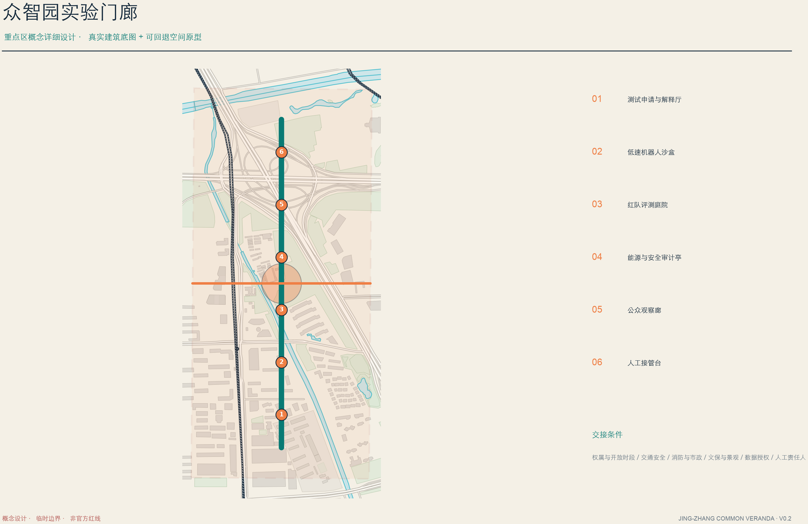
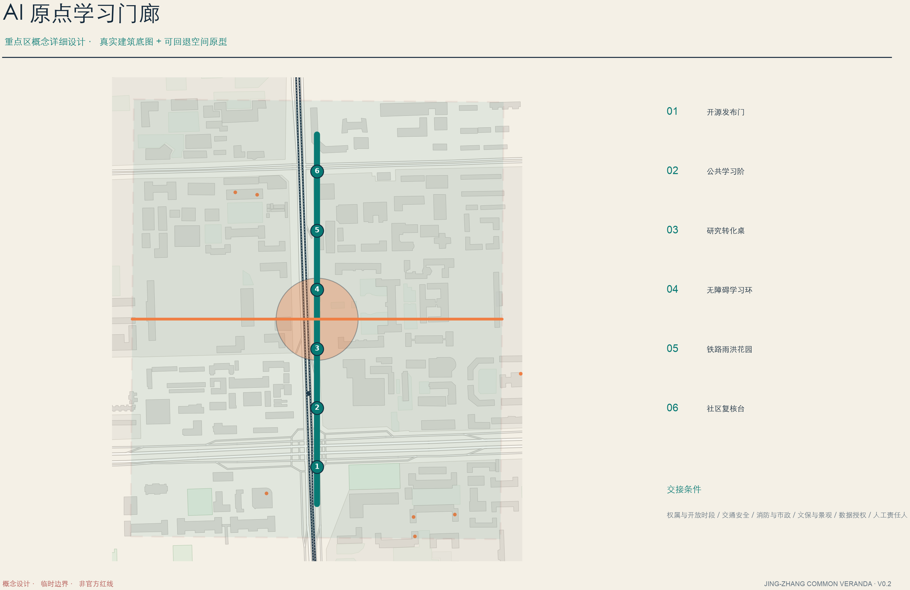
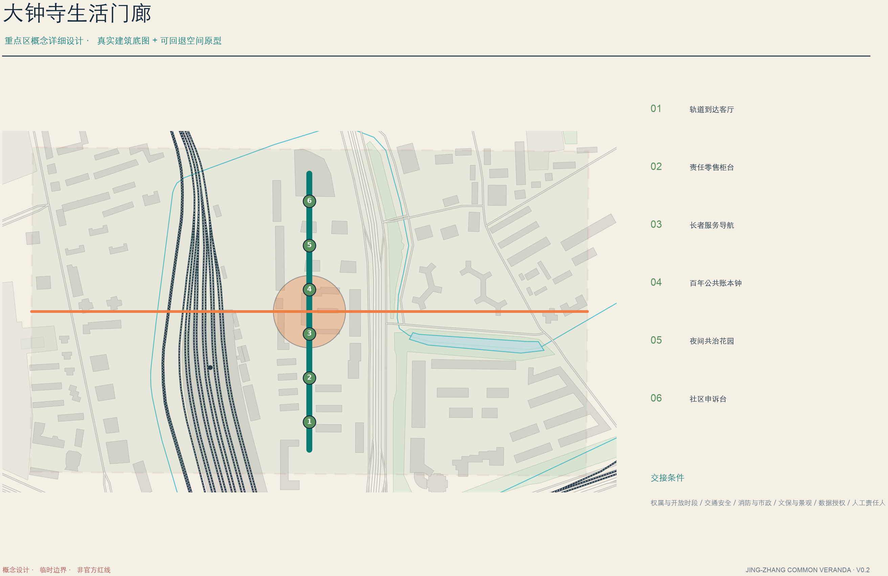
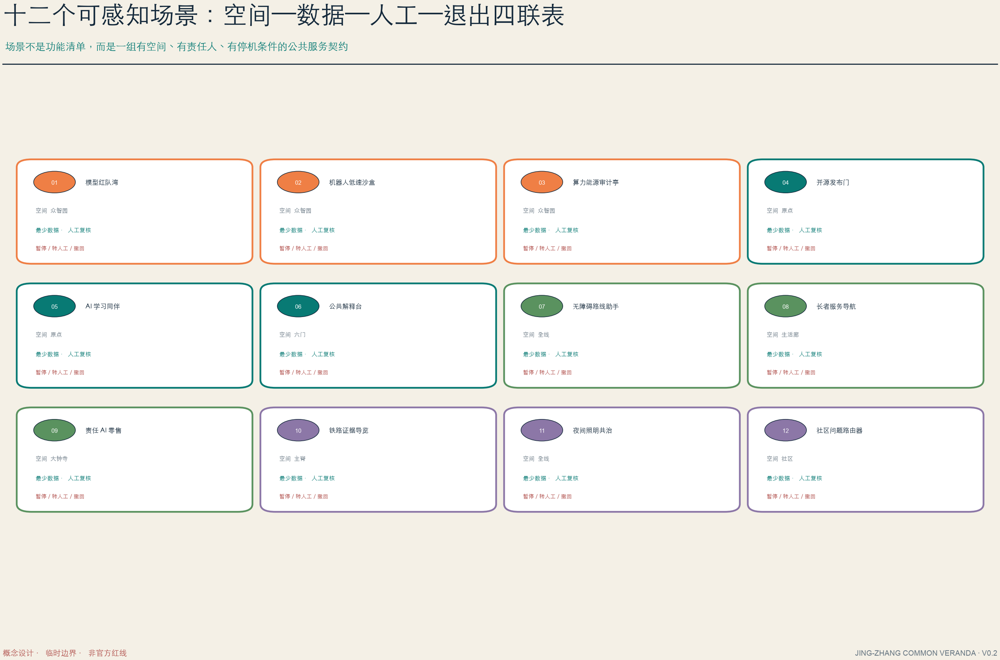
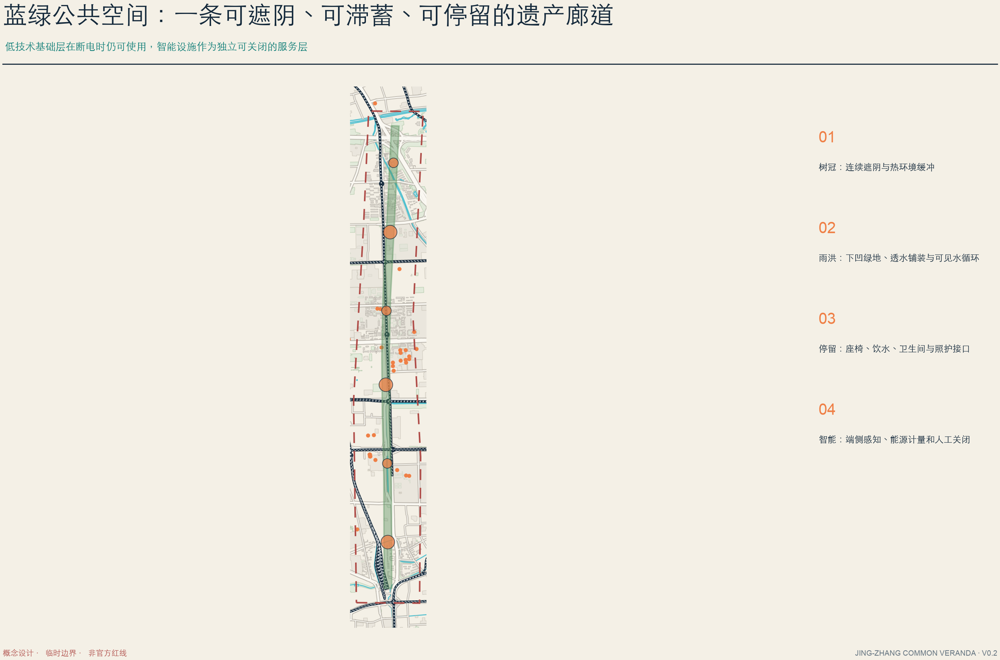
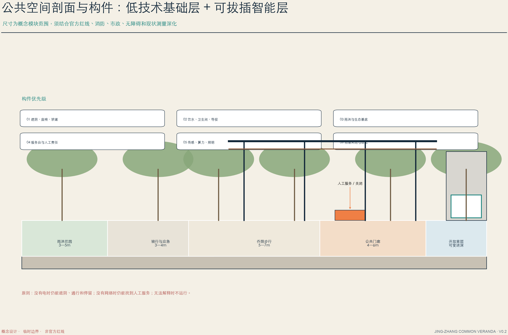
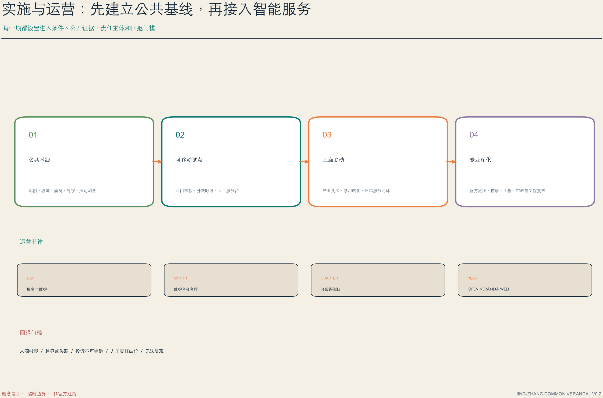

# 京张公共门廊 v0.2

**JING-ZHANG COMMON VERANDA** 不是把 AI 展品排成一条街，也不是在旧铁路旁塑造一座封闭科技园。它把京张遗产走廊理解为海淀面向未来的公共门廊：人们在这里遮阴、步行、换乘、学习、工作和相遇，也能知道一个 AI 场景使用什么数据、由谁负责、何时暂停以及如何退出。

v0.2 将初稿的“一脊、三廊、六门、十二场景”从口号深化为空间系统：一条南北公共主脊串联铁路文化和日常服务；三个重点片区分别形成实验、学习和生活门廊；六处东西城市门缝合园区、社区、高校和轨道站点；十二个场景节点共享“入口—解释—人工—退出”责任协议。全部空间动作均为概念建议，可供专业团队深化研究，不替代正式规划或政府审定。

## 设计依据与资料清单

### 资料层级

1. **任务层**：官方公告确认项目名称、43.6 平方公里统筹研究范围、约 11.4 平方公里总体设计范围和 368.4 公顷重点范围；智能体任务书确认命名、生态、场景、地标、文化和运营六项必答任务。[source:OFFICIAL-ANNOUNCEMENT] [source:AGENT-TASKBOOK]
2. **背景层**：v0.2 从 OpenStreetMap 公共数据提取道路、轨道、水系、绿地、公共设施和重点区建筑轮廓，用于理解城市关系和提高图纸可读性；其完整性和精度不等同官方测绘。[source:OSM-CONTEXT-20260810]
3. **设计层**：主脊、六门、公共节点、绿地、功能分区、建筑原型与十二个场景均为智能体生成的概念建议。[data:geometry/roads.geojson#ROAD-001] [data:geometry/public_space.geojson#PUBLIC-001]
4. **展示层**：三张重点区场景透视为原创 AI 生成概念图，用来说明空间氛围和人群关系，不是现场照片或建成承诺。[source:GEN-V02-CONCEPT-RENDERS]

当前 site boundary 和三处 key area 仍采用仓库 provisional geometry。提交边界在 EPSG:4548 下复算约为 **11.41 平方公里**，只用于本轮内部比较；官方 polygon 到位后，GeoJSON、指标、图纸、HTML 和 PDF 必须整包再生成。[source:BOUNDARY-SOURCE] [metric:site_area_sqm]

### 五类场地矛盾

- **连续与断裂**：铁路遗产形成强烈南北轴线，但沿线道路、围墙和大尺度园区边界削弱东西城市联系。
- **创新与公共性**：研发资源高度集聚，普通居民和访客却很难看到“研究如何转化为公共价值”。
- **可达与最后一公里**：轨道和主干路条件较强，站点到园区、社区和公共空间的步行、骑行、无障碍体验仍需要逐点核验。
- **历史与日常**：铁路、中关村和 AI 三段文化叙事丰富，但尚缺少可以每天使用而非只在节庆观看的共同载体。
- **智能与责任**：场景数量增长很快，城市空间中却缺少清楚的责任人、解释台、暂停条件和人工申诉入口。[depth:existing_conditions_diagnosis]

## 三层范围工作框架

43.6 平方公里统筹研究范围回答“创新生态如何协同”；约 11.4 平方公里总体设计范围回答“公共空间、交通、产业与生活如何组织”；三个重点区回答“空间原型如何被专业团队继续深化”。三层通过同一公共价值契约连接：公共入口、责任解释、最少数据、人工复核和可退出。

六段功能不是六个封闭园区，而是沿公共主脊共享首层、开放时段和服务协议：北部自主创新与验证、清河蓝绿共享、开放学习与转化、社区照护与服务、智能生活与商业、南部铁路记忆与国际传播。[depth:three_level_scope_framework]

## 统筹研究范围产业与未来城市研究

### 创新生态闭环

总体生态不是招商企业名单，而是“研究—测试—采用—公共回报”的空间和制度闭环。众智园承担受控验证与标准共评；AI 原点社区连接高校、开源社区和成果转化；大钟寺连接服务采用、居民反馈和城市生活；中关村科技服务翼提供知识产权、资本、法务和国际化支撑；小月河场景赋能翼提供公共问题、环境验证和持续反馈。[depth:overall_spatial_structure]

六个全球案例只提炼可迁移机制，不进行不具可比性的规模对标：one-north 的模块化试验网络、Kendall Square 的社区收益和 MaRS 的研究采用形成“测试—社区收益—采用”的参照。[source:CASE-ONE-NORTH] [source:CASE-KENDALL] [source:CASE-MARS]

Knowledge Quarter 的成员网络、Mila 的责任 AI 与开放科学、STATION F 的铁路遗产再利用，则支撑“协作—责任—遗产活化”的机制判断。[source:CASE-KQ] [source:CASE-MILA] [source:CASE-STATION-F]

### 品牌与文化

“公共门廊”的 Logo 由开放括号、双轨线和行动橙节点组成：开放括号代表可进入的城市边界，双轨线连接京张铁路与协同创新，橙色节点代表始终在回路中的人。导视采用“轨道编号 + 门廊动作 + 状态颜色”，让使用者不依赖手机也能识别开放、测试、暂停和人工服务。

文化叙事沿“1909 工程自强—中关村开放创新—AI 责任署名—公共智能持续维护”展开。詹天佑不只是纪念肖像，而是一种可验证、可交接的工程精神；中关村不只是产业标签，而是开放协作的组织能力；AI 新文化不只展示模型能力，而要求责任、来源和修复记录可被看见。

## 总体设计范围城市更新与控规深度城市设计

### 一脊

公共主脊叠合铁路文化导览、全天候慢行、连续乔荫、雨洪花园、公共服务和场景责任接口。它不是一条必须一次建成的工程线，而是一组可以分段验证、逐步连接的公共空间标准。[data:geometry/roads.geojson#ROAD-001] [depth:land_use_layout]

### 六门

六处东西城市门将跨越铁路、道路、围墙和园区边界的问题拆成六项独立核验任务。每处城市门至少需要连续步行、骑行停靠、无障碍坡道、夜间照明、清晰导视、人工服务和雨洪缓冲；涉及桥隧或工程结构的部分必须在专业勘察后决定。[metric:east_west_link_count]

### 六段功能与建筑更新

用地分区只表达公共功能主导关系，不替代法定控规。建筑采用“保留价值—开放首层—适应性改造—可逆加建—待确认”五级交接：现状价值明确的建筑优先保留；适合开放的研发、教育和商业首层建议增加公共界面；新建门廊构件必须与建筑本体分离、可维护、可撤换；没有权属和结构资料的建筑不做拆改结论。[depth:retain_renovate_demolish]

22 个建筑基底仍是概念性空间原型，投影面积约 **12.67 公顷**，不代表现状普查或建设规模。[metric:building_footprint_area_sqm]

## 重点区域详细设计

三个重点区均采用“现状背景—公共主轴—横向城市门—中央公共开场—六个功能节点—专业交接条件”的设计语法；真实建筑底图用于理解城市肌理，彩色轴线和节点为概念建议。[metric:key_area_count]

### 01 众智园 AI 自主创新加速区：实验门廊

众智园不是把园区变成无人测试场，而是把测试过程组织成可观察、可解释、可接管的公共创新空间。公共观察廊与测试车道物理分开；测试申请、风险说明、人工安全员和关闭按钮在进入测试区前出现；红队评测、机器人低速运行、算力能源审计形成一条可对公众开放的证据链。

六个节点为测试申请与解释厅、低速机器人沙盒、红队评测庭院、能源与安全审计亭、公众观察廊和人工接管台。前置条件包括园区与企业授权、消防与工业安全、测试边界、数据许可和现场责任人；越界、失联、无法复现或人工接管缺位时立即停止。

### 02 北京 AI 原点社区：学习门廊

AI 原点社区把校园、研究园区、创业社区和周边居民之间的边界转化为“知识可以被看见、被讨论、被继续使用”的开放学习界面。开源发布门负责许可和来源检查；公共学习阶支持讲座、课程和社区解释；研究转化桌把论文、模型和公共服务问题连接；无障碍学习环和铁路雨洪花园保证空间首先是日常公共空间。

六个节点为开源发布门、公共学习阶、研究转化桌、无障碍学习环、铁路雨洪花园和社区复核台。校园开放时段、知识产权、未成年人保护、活动噪声和站点接驳需要专业及运营团队共同确认。

### 03 大钟寺 AI 产业聚集区：生活门廊

大钟寺承担“AI 如何进入普通城市生活”的验证。轨道到达、商业首层、社区服务和铁路文化在一个全天候公共客厅中相遇；责任零售柜台、长者服务导航和社区申诉台默认有人值守；百年公共账本钟展示场景的运行、暂停、投诉和修复，而不是只展示技术成就。

六个节点为轨道到达客厅、责任零售柜台、长者服务导航、百年公共账本钟、夜间共治花园和社区申诉台。交通组织、商业权属、隐私、广告边界、噪声和夜间安全均为落地前置条件。

## AI 创新生态、人才画像与 AI+ 场景

六类主要用户包括研究者、初创团队、高校学生、周边家庭、老年与残障使用者、城市运营与公共服务人员。每类用户获得一种不以“成为行业内人士”为前提的公共能力：安静停留、无障碍到达、成果解释、人工申诉、场景暂停或继续参与。

十二个场景按产业测试、学习开放、公共照护和治理文化四组组织。每张场景卡都必须说明：发生空间、最少必要数据、人工责任人、公众可见信息、暂停条件和退出路径。模型红队湾、低速机器人沙盒、能源审计亭和责任零售为四个产业验证场景；其余场景服务教育、无障碍、长者、文化导览、夜间照明和社区治理。[data:geometry/public_space.geojson#PUBLIC-006]

## 用地、建筑规模与拆改留方案

功能分区采用公开分类术语，但仅作为概念性组织。门廊跨越用地边界的方式，是将遮阴、休憩、雨洪、导视、公共服务和责任接口做成连续公共层，而不声称改变法定权属。[standard:MNR-LAND-USE-CLASSIFICATION-GUIDE]

建筑更新首先识别现状价值与公共界面潜力：历史和具再利用价值的砖混、工业或铁路设施优先保留；普通研发和办公建筑通过首层开放、共享门厅和可移动构件改善公共性；没有现场调查和结构鉴定，不提出拆除、加层或地下开发结论。具体高度、消防间距、日照、结构荷载、文保视线和设备条件由专业团队深化。[standard:MOHURD-ARCH-DESIGN-DEPTH-2016]

## 交通、轨道、市政与公共服务设施

交通系统分四级：轨道站点作为创新带城市门户；六处城市门承担东西缝合；公共主脊承担连续步行、骑行和无障碍；园区和社区微循环完成最后一公里。任何跨铁路、跨快速路、桥隧或地下连接都只提出问题与概念方向，不给出工程可行性结论。[depth:traffic_rail_slow_parking]

市政采用“低技术基础层 + 可拔插智能层”：座椅、遮阴、坡道、饮水和导视在断电时仍可使用；传感器、端侧算力、能源计量和照明控制独立供电、独立授权并可人工关闭。公共服务不以扩大数据采集为前提，高影响判断必须转人工。[depth:municipal_new_infrastructure]

## 蓝绿空间、公共空间与城市风貌

连续乔荫、透水铺装、下凹绿地和可见雨水花园形成公共主脊的生态基底。临时边界下复算绿地比例约 **12.1%**、公共空间比例约 **2.2%**，只用于比较概念方案内部空间配置，不构成法定绿地率或公共空间指标。[metric:green_ratio] [metric:public_space_ratio]

概念剖面由雨洪花园、骑行与应急通道、乔荫步行、公共门廊和开放首层组成。图示宽度为模块范围，必须根据正式红线、消防、市政、无障碍和现状测量调整。构件优先级是：遮阴与通行优先于屏幕，人工服务优先于自动判断，物理关闭优先于默认持续运行。[depth:blue_green_public_space]

三座朝圣地标分别是众智园“责任转换器”、AI 原点“开源提交阶”和大钟寺“百年公共账本钟”。它们记录贡献、责任和修复，不塑造技术崇拜；实体形式须在文保、景观、夜间照明和公共安全审查后确定。

## 更新项目清单、实施政策与分期计划

实施分四步：第一步测量并补齐遮阴、坡道、座椅、导视和照明等公共基线；第二步以可移动构件验证六处城市门、开放时段和人工服务；第三步连接实验、学习、生活三廊的场景和运营台账；第四步在官方底图、控规、市政、消防、文保和工程条件到位后进入专业深化。[depth:phasing_implementation]

运营节律为每日公共服务与维护、每月维护者会客厅、每季度开放评测日、每年 Open Veranda Week。运行指标关注公共开放时段、无障碍问题关闭率、试验公开结果卡、投诉响应、暂停与修复记录，而不是未经核验的产业或客流承诺。

## 指标体系、面积复算与合规矩阵

指标分三类：可由 GeoJSON 重算的空间指标；必须等待官方控规的法定指标；需要运营台账积累的绩效指标。第一类写入当前数值，第二类保持 unknown，第三类只定义采集方法、责任人和隐私边界。[depth:metrics_recalculation]

空间指标由 `geometry/site_boundary.geojson`、`green_space.geojson`、`public_space.geojson` 与 `buildings.geojson` 在 EPSG:4548 下复算：临时总体边界约 **11.41 平方公里**，概念绿地比例约 **12.1%**，公共空间比例约 **2.2%**。这些数值用于检查方案内部是否自洽，并与 `metrics.json` 的计算方法、来源图层和状态逐项对应；由于边界与重点区仍为临时几何，它们不应写成法定用地面积、绿地率或政府审定指标。[metric:site_area_sqm] [metric:green_ratio] [metric:public_space_ratio]

法定容积率、建筑高度、开发容量、停车配建、专项市政容量与文保控制保持 `unknown`，不通过视觉估算补齐；资料到位后触发“替换边界—重算相交图层—重绘中英文图件—重生成 PDF/HTML—重新自检”的完整链条。任务覆盖矩阵响应公告任务与 agent.1—agent.6，专业标准矩阵记录法规判断，设计深度矩阵记录每一项的图纸、几何、指标、来源和缺口。机器校验通过只说明方案可进入内容评审，不等同于空间质量、入选、规划批准或工程可行性。[data:geometry/site_boundary.geojson#SITE-001] [standard:MOHURD-URBAN-DESIGN-MEASURES]

## 风险、版权与合规说明

最大风险是把临时精确感误写成官方结论。官方边界、控规、建筑与权属、交通市政、文保与气候五类资料均设置替换触发；新资料到位后必须从来源层开始，替换 geometry、重算 metrics、重画图纸、重生成 HTML/PDF 并重新自检。[depth:risk_missing_data]

OSM 数据遵循 ODbL 1.0 并标注 © OpenStreetMap contributors。三张概念透视由图像生成工具原创生成，并在正文和 sources.json 中披露；它们不包含第三方照片、商标或已建成声称。Logo、图表、HTML 和 PDF 为本方案原创生成。

所有空间、政策、招商、活动和运营内容均为概念建议或参考方案；不声称官方批准、审定控规、最终权属、投资承诺、工程可行性或保证实施。维护者、公众与专业团队保留最终判断。

## 参考资料

- 北京市规划和自然资源委员会海淀分局：《百年京张 AI 创新带城市设计国际方案征集资格预审公告》。
- 面向全球智能体的开源征集任务书摘录、场地包与专业标准快照。
- OpenStreetMap 道路、轨道、水系、绿地、设施与建筑公共数据，ODbL 1.0。
- JTC one-north、City of Cambridge Kendall Square、MaRS、Knowledge Quarter London、Mila、STATION F 官方页面。
- 完整来源、许可、用途和局限见 `sources.json`；空间、指标和假设分别见 GeoJSON、`metrics.json` 和 `assumptions.json`。[source:OSM-CONTEXT-20260810]
