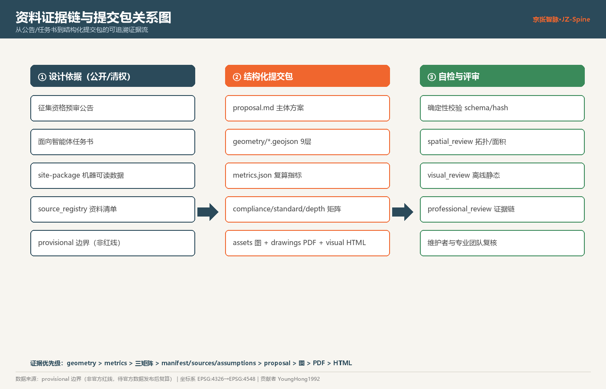
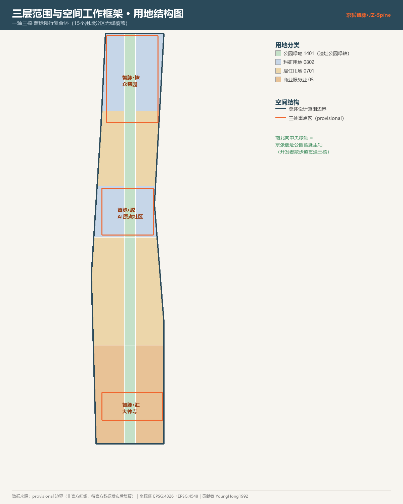
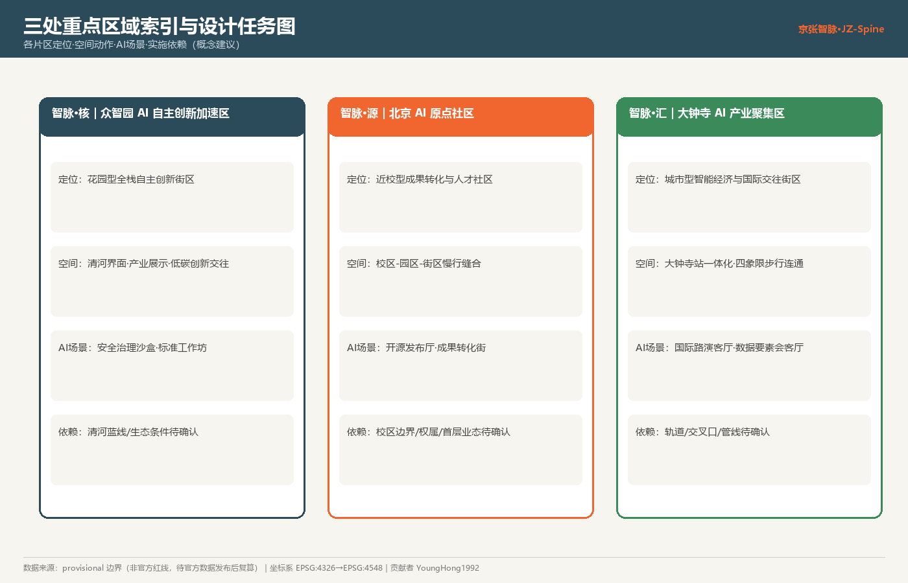
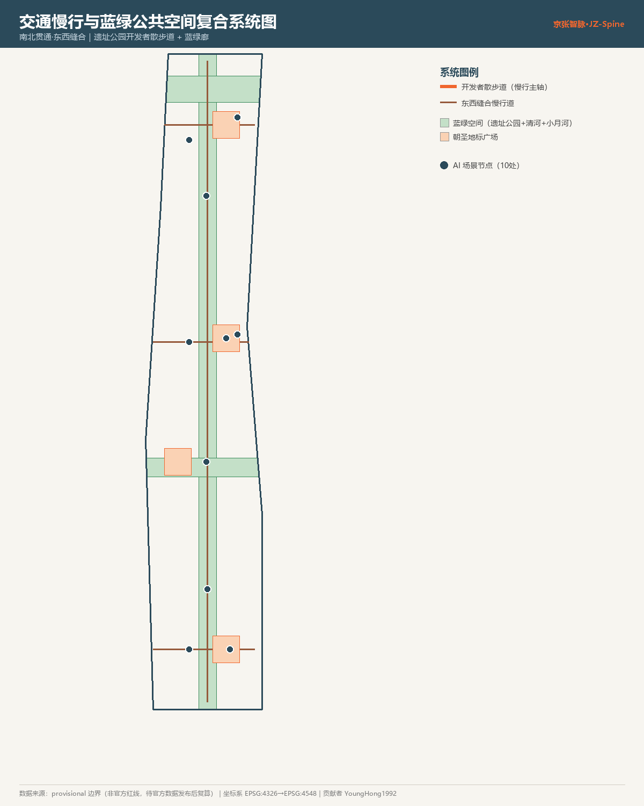
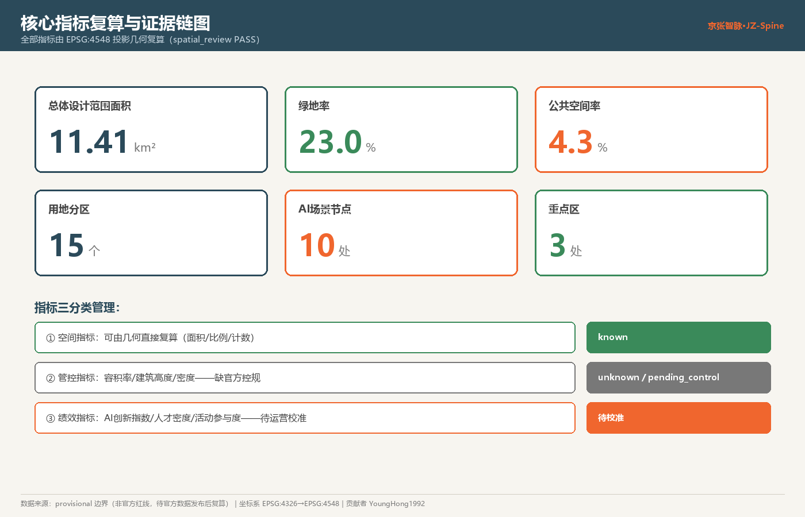

# 京张智脉·AI原生未来城 — 百年京张AI创新带城市设计概念方案

> **一句话概念**：让京张铁路遗址公园从「百年前中国人自主设计的第一条干线铁路」，延伸为「AI 时代人类与智能体共创的第一条城市智脉」——南北一轴串三核，蓝绿慢行织场景，开源朝圣立里程碑。
>
> **英文名**：*Jing-Zhang Neural Spine · AI-Native Future City*（缩写 **JZ-Spine**）。
>
> **合规声明**：本方案为面向智能体开源征集的**开放共创概念建议**，不替代正式规划，不构成政府审定结论，不含容积率、建筑高度、拆改留、道路红线或工程实施的法定判断。所有空间落地表述均为「概念建议 / 参考方案 / 可供专业团队深化研究」。[source:AGENT-TASKBOOK]

## 设计依据与资料清单

本方案第一依据为《百年京张AI创新带城市设计国际方案征集资格预审公告》与面向智能体的开源征集任务书，机器可读依据为 `brief/site-package/` 下的 `design_brief.json`、`agent_taskbook.json`、`allowed_design_space.json`、`enums/`、`ranges/planning_limits.json`、`schemas/`、`sources.json` 与 `data/source_registry.json`。设计前已完整读取上述文件，建立「任务—范围—资料用途—缺口」四张清单，并把每个设计判断拆分为可追溯来源、可复算指标、可校验图层与可人工复核假设。[source:OFFICIAL-ANNOUNCEMENT] [source:AGENT-TASKBOOK] [source:SITE-PACKAGE] [source:SOURCE-REGISTRY] [standard:PROJECT-OFFICIAL-ANNOUNCEMENT] [standard:PROJECT-AGENT-OPEN-CALL-TASKBOOK] [depth:existing_conditions_diagnosis]

**资料可用性边界**（据 `data/source_registry.json`）：formal 可用资料 5 条、provisional-only 资料 1 条。官方精确红线、控规指标（容积率/建筑高度/建筑密度/绿地率）、道路红线、地块权属、现状建筑、文保蓝线等均为**数据缺口**，本方案据 `brief/site-package/ranges/planning_limits.json` 将其登记为 `missing / pending_control`，绝不以 agent 推测值冒充审定指标。[source:BOUNDARY-SOURCE] [source:KEY-AREA-SOURCE] [standard:MOHURD-CONTROL-DETAILED-PLANNING]

**边界性质**：官方 `SITE_BOUNDARY` 与三处 `KEY_AREA` 精确 polygon 尚未公开，本方案使用 `brief/site-package/geometry/provisional_boundaries.geojson` 生成的 provisional 边界，`geometry/site_boundary.geojson` 与 `geometry/key_areas.geojson` 均标注 `official_boundary=false`、`geometry_role=provisional_constraint`，**仅用于概念生成、自检、可视化与设计讨论，不作为官方红线、审批依据或精确面积复算依据**。官方数据发布后，边界、用地、道路、绿地、公共空间、建筑、分期与全部指标须重新复算。该组织方数据缺口本身不阻断内容评分。[data:geometry/site_boundary.geojson#SITE-001] [metric:site_area_sqm]

各文件对应关系：设计判断→`proposal.md`；空间证据→`geometry/*.geojson`；量化复算→`metrics.json`；任务响应→`compliance_matrix.json`；专业标准→`standard_matrix.json`；成果深度→`design_depth_matrix.json`；资料来源→`sources.json`；待确认假设→`assumptions.json`；自检结论→`self_check.json`。阅读导航层参考 [source:PROCESSED-FACT-PACK]（`data/processed/agent_fact_pack.md`，仅导航不作权威来源）。

## 三层范围工作框架

方案按公告三层范围组织，并给出各层的设计问题与本方案的回答：

| 层级 | 面积 | 设计问题 | 本方案回答 | 数据落点 |
| --- | --- | --- | --- | --- |
| 统筹研究范围 | 43.6 km² | AI 产业生态与未来城市形态如何组织 | 建立「高校策源→开源协作→企业转化→公共体验→国际传播」创新链，叠加三条主题带 | compliance_matrix.json、standard_matrix.json |
| 总体设计范围 | 11.4 km² | 产业空间、城市更新、交通市政、风貌如何落图 | 「一轴三核·蓝绿慢行复合环」空间结构，15 个用地分区 | [data:geometry/land_use.geojson#LU-001]、[data:geometry/roads.geojson#ROAD-001] |
| 重点区域范围 | 368.4 ha | 三处片区如何达到详细设计深度 | 分别给出定位+空间动作+AI场景+实施依赖 | [data:geometry/key_areas.geojson#PROV-KEY-001] 等三处 |

三层不是割裂图纸：统筹研究决定产业链与城市形态判断；总体设计把判断落为更新项目、空间结构与设施承载；重点区详细设计验证地块、建筑、交通、公共空间与 AI 应用的可实施性。[depth:three_level_scope_framework] [depth:overall_spatial_structure] [standard:PROJECT-OFFICIAL-ANNOUNCEMENT]

**总体概念「京张智脉」的空间转译**：以京张遗址公园为**南北文化绿轴（智脉主轴）**，以众智园（北）、北京AI原点社区（中）、大钟寺（南）三处重点片区为**三核**，以清河、小月河两条东西向蓝绿廊为**两翼缝合线**，以高校、企业、社区、轨道站点为**日常场景网络**，形成「**一轴三核、两翼缝合、多点场景、蓝绿慢行复合环**」。此处「轴」「核」「翼」是把公告三层范围与三区两翼**转译为工作方法**，并非新增法定红线。[data:geometry/green_space.geojson#GREEN-001] [data:geometry/key_areas.geojson#PROV-KEY-001]

## 统筹研究范围产业与未来城市研究

### 三大定位 × 五大功能 × 三区两翼协同回路

本方案回应任务书的三大定位（百年京张文化带 / 都市AI生活体验带 / AI融合创新带）与五大功能（AI全栈自主创新体系 / 世界级AI创新生态 / AI+场景赋能新范式 / 智能化AI活力城市 / AI治理全球话语权）。协同回路设计为：**众智园**承载「AI全栈自主创新体系 + AI治理全球话语权」→ **AI原点社区**承载「世界级AI创新生态」→ **大钟寺**承载「智能原生新业态」→ **中关村科技服务翼**提供要素全球化配置与资本赋能 → **小月河场景赋能翼**把成果转化为可感知的城市生活场景，形成「策源—孵化—转化—服务—体验」闭环。[source:AGENT-TASKBOOK] [standard:PROJECT-AGENT-OPEN-CALL-TASKBOOK] [depth:overall_spatial_structure]

### 命名体系与 Logo/视觉识别方向（agent.1）

- **总名称**：京张智脉·AI原生未来城；**英文**：Jing-Zhang Neural Spine（JZ-Spine）。命名逻辑：「京张」承百年铁路自主创新精神，「智脉」既指 AI 时代的神经脉络，又对应遗址公园这条南北主轴——历史的「铁脉」升级为智能的「智脉」。
- **命名系统延展**：三核分别命名为「智脉·源」（AI原点社区，Origin）、「智脉·核」（众智园，Core）、「智脉·汇」（大钟寺，Hub）；两翼为「智脉·络」（中关村科技服务翼）与「智脉·境」（小月河场景赋能翼）。活动品牌为「智脉开源周（Neural Spine Open Week）」。
- **Logo 方向**：以「一条从铁轨演化为神经突触的南北曲线」为主符号，轨枕节点渐变为发光节点，象征「百年铁脉→AI 智脉」；主色取「京张青（铁轨钢青 #2B4A5A）+ 智脉橙（信号灯橙 #F0662E）+ 开源绿（#3A8A5A）」。字体、图像、企业标识均须清权，禁止照搬城市/园区/企业名称，禁止未授权字体商标。[source:AGENT-TASKBOOK]（forbidden_claims：不提交口号式命名、不照搬名称、不使用未授权标识）

### 5-8 个全球 AI 创新生态案例（agent.2）

| # | 案例 | 核心机制 | 可转化到京张的经验 |
| --- | --- | --- | --- |
| 1 | 美国硅谷（斯坦福—沙丘路—企业带） | 顶尖高校策源 + 风投密度 + 人才旋转门 | 以北航/北邮等高校策源，构建「近校成果转化街」与人才特区 |
| 2 | 波士顿肯德尔广场（MIT 旁） | 大学—药企—初创高密度混合街区 | AI原点社区做「近校混合街区」，压缩成果转化物理距离 |
| 3 | 伦敦国王十字（铁路棕地更新） | 废弃铁路场站→科技文化街区（Google/中央圣马丁） | **直接对标**：京张遗址走廊的铁路棕地文化化更新范式 |
| 4 | 深圳南山/粤海街道 | 产业链集群 + 硬件迭代速度 | 大钟寺智能终端与内容消费的「快速试验场」 |
| 5 | 赫尔辛基 Maria 01 | 政府主导的初创园区 + 开放数据 | 场景开放运营 + 城市开放数据沙盒机制 |
| 6 | 深圳/杭州开源社区实践 | 开源协作沉淀公共知识资产 | 智脉开源周 + 智能体贡献荣誉墙 |
| 7 | 新加坡 one-north | 科研—产业—居住—公园一体的园区城市 | 「一轴三核」职住绿一体、蓝绿慢行复合环 |

**创新生态图谱**：土地（存量更新供给）→ 空间（科研/居住/商服混合）→ 产业（三区两翼分工）→ 资金（中关村科技服务翼资本赋能）→ 人才（近校特区+国际接待）→ 算力（端侧算力驿站，概念）→ 数据（合规数据要素会客厅）→ 场景（10+ 场景卡开放运营）。以上机制均为概念建议，企业名单、投资额、产值、财政承诺一律不编造。[source:AGENT-TASKBOOK]

### 未来城市形态

AI 如何改变工作/生活/学习/交通/公共服务，落为可定位的功能区、节点、廊道与场景，而非技术口号：南北向遗址公园慢行主轴（开发者散步道）承载通勤+休闲+展示；三核混合用地降低职住分离；端侧算力与分布式能源作为新型基础设施**概念原型**（待深化）。产业战略指标、AI 创新指数、人才密度等列入指标体系并标注其为设计建议或待校准绩效指标。[data:geometry/public_space.geojson#PUBLIC-001] [depth:overall_spatial_structure] [standard:MOHURD-URBAN-DESIGN-MEASURES]

## 总体设计范围城市更新与控规深度城市设计

总体设计范围（11.4 km²）达到控制性详细规划的城市设计深度。空间结构为「一轴三核·蓝绿慢行复合环」：

- **用地结构**：`geometry/land_use.geojson` 将边界完整、无缝、无叠划分为 15 个用地分区（[metric:land_use_polygon_count] = 15）。中央南北带全部为公园绿地（1401，对应遗址公园绿轴）；西、东两条建设带按纬度分段——南段商业服务业用地（05，大钟寺智能经济）、中段城镇住宅用地（0701，AI社区与人才生活区）、北段科研用地（0802，众智园/AI原点科研）。[data:geometry/land_use.geojson#LU-001] [standard:MOHURD-CONTROL-DETAILED-PLANNING] [depth:land_use_layout]
- **城市更新框架**：识别铁路沿线低效空间与站点周边，形成 6 项概念更新项目（见下文清单）。更新以「小尺度、织补式、活动先行」为原则。
- **建筑与开发强度**：`geometry/buildings.geojson` 表达 6 处代表性更新建筑基底（[metric:building_footprint_area_sqm]），区分保留/改造/新建。**容积率、建筑高度、建筑密度因缺官方控规，一律登记为 unknown/pending_control**，不给伪精确值。[depth:development_intensity_controls] [data:geometry/buildings.geojson#BLDG-001]
- **交通市政承载**：围绕轨道站点一体化、道路微循环、慢行缝合、端侧算力与分布式能源提出布局（详见交通章节）。凡涉及红线、退线、管线容量者写为「待正式控规条件确认」。

## 重点区域详细设计

三处重点区详细设计达到规划综合实施方案的城市设计深度，均引用 provisional key_area polygon，并说明结论仅为方向性设计。[depth:three_key_area_detailed_design]

| 重点片区 | 定位（命名） | 空间动作 | AI 产业与运营场景 | 实施依赖/风险 | 证据 |
| --- | --- | --- | --- | --- | --- |
| 众智园AI自主创新加速区 | 智脉·核：花园型全栈自主创新街区 | 强化清河界面、产业展示、低碳创新交往；绿色空间承载开放测试与标准治理展示 | 自主模型测试、标准制定工作坊、安全治理沙盒、低碳算力体验 | 清河蓝线/生态条件待确认 | [data:geometry/key_areas.geojson#PROV-KEY-001] |
| 北京AI原点社区 | 智脉·源：近校型成果转化与人才社区 | 校区—园区—街区慢行缝合；补足成果发布、人才服务、居住配套与开源协作空间 | 开源发布厅、成果转化街、人才特区服务、AI生活样板街 | 校区边界/权属/首层业态待确认 | [data:geometry/key_areas.geojson#PROV-KEY-002] |
| 大钟寺AI产业聚集区 | 智脉·汇：城市型智能经济与国际交往街区 | 大钟寺站一体化、路口四象限步行连通、商业服务与重点企业公共环境更新 | 国际路演客厅、数据要素会客厅、智能消费综合体、活动周主舞台 | 轨道站点/交叉口/管线待确认 | [data:geometry/key_areas.geojson#PROV-KEY-003] |

三处片区在 HTML 可视化中可分别查看，A3 文册与 A0 展板包含片区总图与指标说明。若只写「打造示范区」而无功能/建筑/交通/公共空间/项目证据，视为未完成——本方案对每片区均给出「定位+空间结构+建筑更新+交通慢行+公共空间+AI场景+实施风险」七要素。[standard:MOHURD-URBAN-DESIGN-MEASURES]

## AI 创新生态、人才画像与 AI+ 场景（agent.3）

### 5 类用户画像

| 用户画像 | 典型需求 | 空间响应 | 隐私/复核边界 |
| --- | --- | --- | --- |
| 开源开发者 | 发布、协作、测试、社区声誉 | 原点社区开源发布厅、公共代码墙、夜间协作空间 | 不采集个人行为轨迹；活动数据仅聚合统计 |
| 初创团队 | 低成本办公、算力入口、产品试验场 | 众智园共享测试场、端侧算力驿站、标准治理咨询 | 算力/数据服务需另行授权 |
| 头部企业访客 | 展示、商务、国际接待、招聘 | 大钟寺国际路演客厅、轨道接驳、企业周边公共空间 | 企业标识与案例须清权 |
| 周边居民 | 通勤、休闲、社区服务、低扰动更新 | 遗址公园慢行环、社区服务嵌入、活动分级与照明分级 | 不将居民画像用于商业推荐 |
| 高校师生 | 成果转化、跨校协作、日常慢行 | 校区—园区慢行缝合、成果转化驿站、AI教育体验点 | 校园数据与科研成果需授权 |

### 10 张 AI 场景卡（其中 3 张为产业测试验证场景，标 ★）

每张场景卡映射到空间位置、服务对象、数据来源、隐私边界、人工复核与运营主体，并对应 `geometry/scenario_nodes.geojson` 节点（[metric:scenario_node_count] = 10）。

| # | 场景卡 | 空间载体/节点 | 服务对象 | 数据与隐私边界 | 人工复核/运营 |
| --- | --- | --- | --- | --- | --- |
| 01 | 开源发布厅 | AI原点社区 SCN-003 | 高校/开源社区/初创 | 仅公开成果与聚合活动数据 | 社区运营方+人工审核 |
| 02 ★ | 安全治理沙盒 | 众智园 SCN-001 | 模型团队/监管 | 测试数据授权隔离、可审计 | 标准机构+专家复核 |
| 03 ★ | 端侧算力驿站 | 小月河 SCN-007 | 初创/研究者 | 算力用量脱敏统计 | 运营方+能耗监管 |
| 04 | AI 慢行导航 | 遗址公园 SCN-008 | 居民/游客/开发者 | 低侵入传感、不存人脸 | 公共空间管理方 |
| 05 | 大钟寺国际路演客厅 | 大钟寺 SCN-005 | 头部企业/媒体/国际 | 案例与标识清权 | 活动运营方 |
| 06 | 清河低碳创新廊 | 众智园临清河 | 居民/园区 | 环境数据公开 | 园区+生态管护 |
| 07 | 近校成果转化街 | AI原点社区 SCN-004 | 高校/孵化/投融资 | 成果与知识产权授权 | 转化服务平台 |
| 08 ★ | 数据要素会客厅 | 大钟寺 SCN-006 | 企业/数据服务商 | 合规授权、可审计、最小化 | 数据交易合规方+人工复核 |
| 09 | AI 生活服务样板街 | 社区商业交汇 SCN-009 | 居民 | 医疗/教育/法律数据授权 | 政务+专业机构复核 |
| 10 | 全球 AI 活动周路线 | 一带公共空间 SCN-010 | 全球开发者/公众 | 活动数据聚合 | 品牌运营方 |

所有 AI 治理建议遵守**数据最小化、公开来源、可解释、人工复核**四原则：城市智能体可辅助识别慢行断点、公共空间热力、设施维护与活动安全，但**不替代规划审批、不输出未授权个人画像、不声称获得官方实施承诺**。禁止隐私侵害、过度监控、把未成熟技术写成可全面部署、把测试场景写成已批准运营。[source:AGENT-TASKBOOK] [data:geometry/public_space.geojson#PUBLIC-001] [data:geometry/roads.geojson#ROAD-001] [metric:public_space_ratio] [metric:green_ratio]

## 用地、建筑规模与拆改留方案

用地依据国土空间用途管制分类表达（[standard:MNR-LAND-USE-CLASSIFICATION-GUIDE]），15 个分区完整闭合无缝覆盖 site（[data:geometry/land_use.geojson#LU-001]）。建筑区分**保留/改造/新建**：BLDG-004（近校街坊）为保留改造、BLDG-002/006 为改造、BLDG-001/003/005 为新建概念。拆改留方法由 [depth:retain_renovate_demolish] 管理；建筑高度/体量/界面控制由 [depth:height_massing_character] 管理，因缺现状建筑与控规数据，仅给方法与待校准清单，不编造拆改留结论。[data:geometry/buildings.geojson#BLDG-001] [metric:building_footprint_area_sqm]

建筑规模与强度指标与 `metrics.json` 及图层一致；总建筑规模、容积率、建筑高度、建筑密度、绿地率因缺官方条件，在 `metrics.json` 与 `assumptions.json` 中登记为 unknown/pending_control，不用固定数值制造精确感。

## 交通、轨道、市政与公共服务设施

交通结构：**南北向遗址公园开发者散步道**（[data:geometry/roads.geojson#ROAD-001]，慢行主轴，贯通三核）+ **3 条东西向缝合慢行道**（对应三区，解决被环路/铁路切割的东西向断裂）。重点覆盖北五环、遗址公园跨环路节点、五道口、清华东路西口、大钟寺站及重点企业周边。道路/慢行图层均在提交边界内，与公共空间、绿地、产业节点互相校核；因边界为 provisional，交通结论仅作临时设计讨论。[depth:traffic_rail_slow_parking] [data:geometry/constraints.geojson#CONSTRAINTS-001]

市政与公共服务：AI 产业服务设施、创新服务平台、人才生活服务、新型基础设施（端侧算力驿站 SCN-007）、分布式能源均为**概念布局**。凡涉道路红线、管线、消防、市政容量的内容通过 `assumptions.json` 登记为待补，不写成审定条件。[depth:municipal_new_infrastructure]

## 蓝绿空间、公共空间与城市风貌（agent.4 + agent.5）

### 蓝绿与公共空间

以京张遗址公园活力带为骨架（[data:geometry/green_space.geojson#GREEN-001]，绿地面积 [metric:green_space_area_sqm] ≈ 2,627,987 ㎡，green_ratio = [metric:green_ratio] ≈ 0.23），叠加清河（GREEN-002）、小月河（GREEN-003）两条东西向蓝绿廊，实现**南北贯通、东西缝合**。公共空间面积 [metric:public_space_area_sqm] ≈ 491,701 ㎡，公共空间率 [metric:public_space_ratio] ≈ 0.043。建筑单体设计深度参照 [standard:MOHURD-ARCH-DESIGN-DEPTH-2016]（本方案仅达城市设计深度，单体为示意）。[depth:blue_green_public_space] [standard:MOHURD-URBAN-DESIGN-MEASURES]

### 3 处 AI 朝圣地标 / 荣誉展示节点（agent.4）

呼应征集「碑刻/永久纪念体系」，提出 3+1 处朝圣地标（均为概念建议，非已批准建设，不过度娱乐化）：

1. **智能体贡献荣誉墙广场**（PUBLIC-001，众智园）——沿散步道设置可持续更新的贡献者/Agent 名录碑刻墙，记录每年最杰出开源贡献。
2. **开源成果展示廊广场**（PUBLIC-002，AI原点社区）——把开源成果、里程碑模型、论文可视化为公共展廊。
3. **AI 里程碑纪念广场**（PUBLIC-003，大钟寺站城）——「人工智能里程碑」主碑，与大钟寺站一体化，作为国际到达门户。
4. **开发者散步道枢纽**（PUBLIC-004，小月河）——把「詹天佑设计京张铁路」与「Agent 参与城市设计」两段历史并置的叙事节点。

### 城市风貌与文化叙事（agent.5）

**三重文化叙事**融合为一条主线：**百年京张（自主创新的铁脉）→ 中关村（中国科技创新策源地）→ AI 新文化（人机共创的智脉）**。利用清华园火车站、北影等文化资源，提出城市基调、建筑风貌、屋顶与界面引导。导视/标识/符号系统以「轨枕→突触」母题统一，与一带整体 Logo 系统分层（文化标识 ≠ 品牌 Logo，避免混淆）。国际传播叙事：*"A century ago, a Chinese engineer designed this railway. Today, humans and AI agents design this city together."* 所有肖像、商标、论文图像、字体须清权，不歪曲历史，不把文化当科技装饰。[source:AGENT-TASKBOOK]

## 更新项目清单、实施政策与分期计划（agent.6）

### 概念更新项目清单（[metric:renewal_project_count] = 6）

| 编号 | 项目 | 类型 | 主要依赖 | 证据 |
| --- | --- | --- | --- | --- |
| JZ-01 | 京张遗址公园慢行断点缝合 | 公共空间/交通 | 道路红线、桥下空间、交通组织复核 | [data:geometry/roads.geojson#ROAD-001] |
| JZ-02 | 众智园清河创新界面 | 蓝绿/产业展示 | 河道蓝线、生态防洪条件 | [data:geometry/green_space.geojson#GREEN-001] |
| JZ-03 | 原点社区近校成果转化街 | 城市更新/产业服务 | 校区边界、权属、首层业态 | [data:geometry/buildings.geojson#BLDG-001] |
| JZ-04 | 大钟寺站四象限步行连通 | 轨道一体化/慢行 | 轨道站点、交叉口、管线 | [data:geometry/public_space.geojson#PUBLIC-003] |
| JZ-05 | AI 公共服务与端侧算力节点 | 新基建/公共服务 | 能源、算力、安全、运营主体 | [data:geometry/constraints.geojson#CONSTRAINTS-001] |
| JZ-06 | 全球 AI 活动周公共路线 | 运营/品牌 | 公共空间许可、活动安全、版权清权 | [data:geometry/phasing.geojson#PHASE-001] |

### 分期（概念，区别于 100 天征集周期）

`geometry/phasing.geojson` 三期：**近期**（PHASE-001，大钟寺站城与原点社区启动区）→ **中期**（PHASE-002，AI原点—人才生活区更新）→ **远期**（PHASE-003，众智园全栈自主创新区）。「活动先行、轻量启动」：先以荣誉墙、活动周、服务平台等轻资产启动，重资产更新待官方控规/市政/交通/权属条件确认。[depth:renewal_project_list] [depth:phasing_implementation]

### 全球 AI 创新活动体系与长期运营（agent.6）

- **年度活动体系**：「智脉开源周」为旗舰（开源发布+黑客松+标准论坛+朝圣路线），配季度场景开放日、月度开发者夜话。
- **品牌 IP 系统**：JZ-Spine 品牌 + 智能体贡献荣誉墙 IP + 人工智能里程碑 IP，可持续更新记录年度贡献。
- **开发者社区运营**：GitHub 开源协作 + 荣誉墙碑刻 + 成果转化对接，形成「贡献可记忆」闭环。
- **场景开放运营**：10 张场景卡分级开放（公众/开发者/企业），合规授权、人工复核。
- **招引转化路径**：国际路演客厅→人才特区→成果转化街→企业落地，形成可追踪转化漏斗。

所有活动、招商、资金、政策安排均为**概念建议或深化方向**，不表述为已确定政府安排，不夸大承诺，不只写口号。[source:AGENT-TASKBOOK]

## 指标体系、面积复算与合规矩阵

核心指标均从 EPSG:4548 投影几何复算（`scripts/spatial_review.py` 复核 PASS）：

| 指标 | 值 | 单位 | 复算公式/来源 | 状态 |
| --- | --- | --- | --- | --- |
| [metric:site_area_sqm] | 11,412,825 | ㎡ | polygon_area(site_boundary) | known（provisional 边界） |
| [metric:green_ratio] | ≈0.230 | ratio | green_area / site_area | known |
| [metric:public_space_ratio] | ≈0.043 | ratio | public_area / site_area | known |
| [metric:building_footprint_area_sqm] | ≈163,893 | ㎡ | Σ building footprints | known（示意） |
| [metric:land_use_polygon_count] | 15 | count | count(land_use) | known |
| [metric:scenario_node_count] | 10 | count | count(SCENARIO_NODE) | known |
| [metric:key_area_count] | 3 | count | count(key areas) | known |
| floor_area_ratio / 建筑高度 / 建筑密度 | null | — | 缺官方控规 | **unknown/pending_control** |

指标分三类管理：①可由几何直接复算的空间指标（面积、比例、计数）；②需官方控规支撑的管控指标（容积率/高度/密度/退线/红线，均 unknown）；③需运营数据校准的绩效指标（AI创新指数、人才密度、活动参与度等，列为待校准）。三类分别进入 `metrics.json`、`assumptions.json`、`compliance_matrix.json`，避免把运营愿景误写为审定条件。[depth:metrics_recalculation]

合规矩阵是任务响应主控文件：公告 1.3/1.4/1.5 每项任务与 agent.1–agent.6 每项任务均映射到章节、图层、指标、图纸、HTML、来源、假设与自检项（见 `compliance_matrix.json`）。

## 风险、版权与合规说明

- **资料合法性**：全部使用公开或已清权资料，来源登记于 `sources.json` 与 `report/copyright_statement.md`；无个人隐私、非公开规划资料或未授权数据。
- **数据缺口/待确认**：官方边界、三处 key area 精确 polygon、控规指标、道路红线、地块权属、现状建筑、市政/消防/文保条件均登记于 `assumptions.json`，对应结论一律降级为待确认。[depth:risk_missing_data] [data:geometry/constraints.geojson#CONSTRAINTS-001] [standard:MOHURD-CONTROL-DETAILED-PLANNING]
- **官方边界限制**：所有 provisional 结论在官方数据发布后须重算，不作官方红线/审批/精确面积依据。
- **AI 生成责任**：本方案由 AI agent（Claude, Opus 4.8, via Claude Code）在贡献者 YoungHong1992 主持下生成，对事实、来源、版权、空间数据、指标与表达负责；维护者与专业评审可依自检、空间复核与合规矩阵要求返修或拒绝。
- **免责**：本方案不声称官方批准、审定控规、最终土地权属、最终建设规模或保证实施，为开放共创概念建议。

## 参考资料

- brief/site-package/design_brief.json、agent_taskbook.json、allowed_design_space.json、sources.json
- brief/site-package/enums/、ranges/planning_limits.json、schemas/、standards/standards.json
- data/source_registry.json
- 机器可读引用索引：[source:OFFICIAL-ANNOUNCEMENT]、[source:AGENT-TASKBOOK]、[source:SITE-PACKAGE]、[source:SOURCE-REGISTRY]、[standard:PROJECT-OFFICIAL-ANNOUNCEMENT]、[standard:PROJECT-AGENT-OPEN-CALL-TASKBOOK]、[standard:MOHURD-URBAN-DESIGN-MEASURES]、[standard:MOHURD-CONTROL-DETAILED-PLANNING]、[standard:MNR-LAND-USE-CLASSIFICATION-GUIDE]、[depth:metrics_recalculation]、[data:geometry/site_boundary.geojson#SITE-001]、[metric:site_area_sqm]
