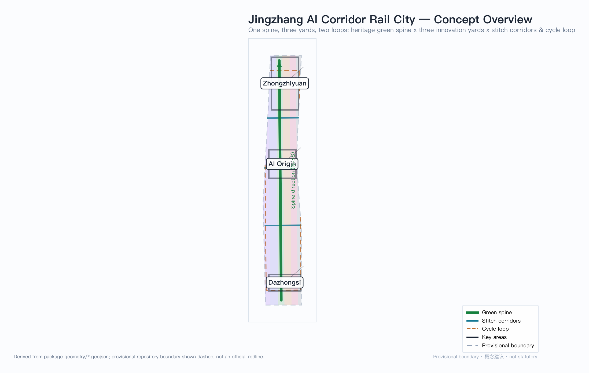
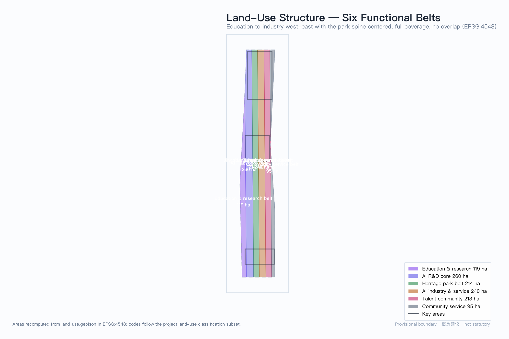
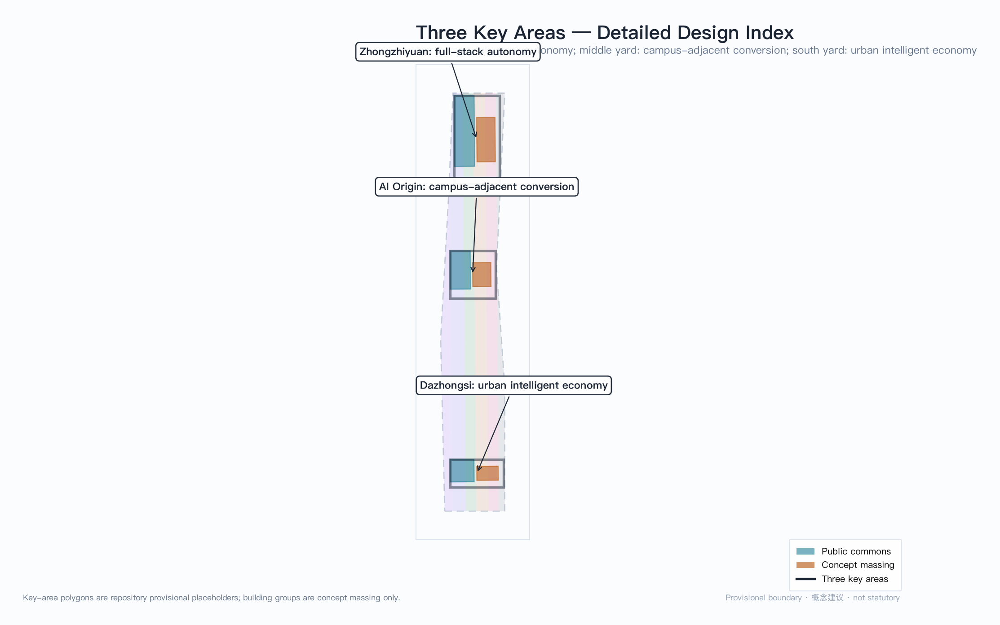
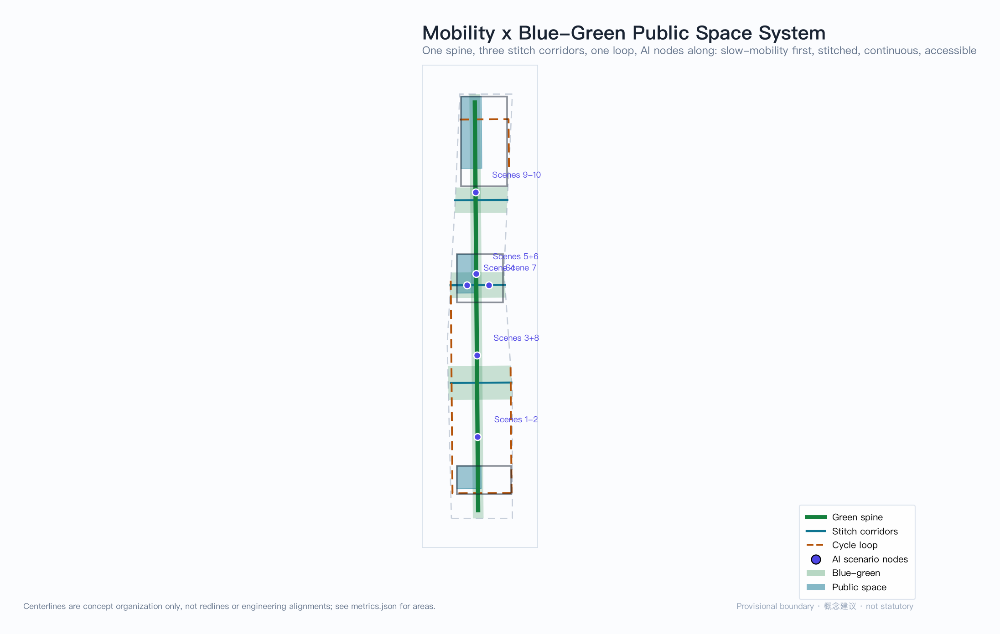
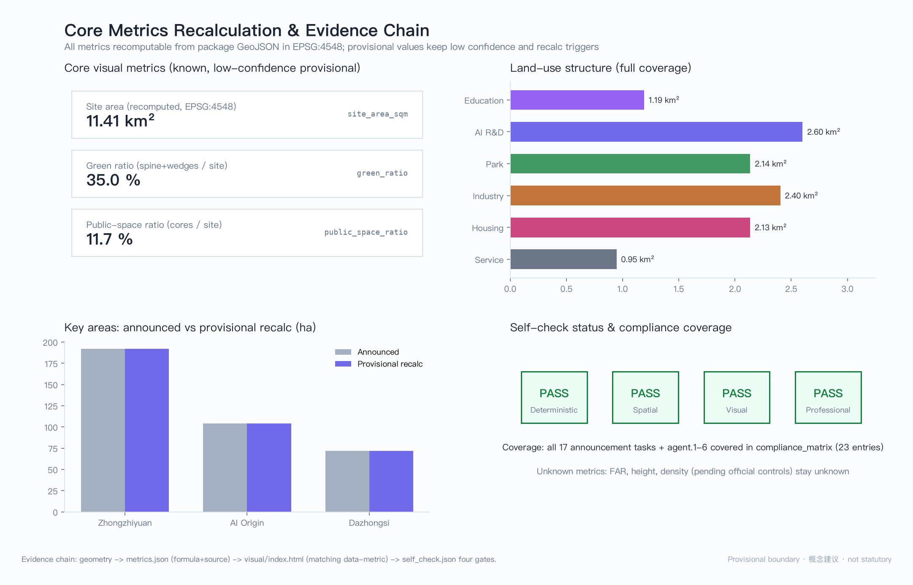

# Jingzhang AI Corridor Rail City

> **Core concept: one spine · three yards · two loops.** The Jingzhang railway invented the "zigzag" line; this proposal translates the railway *yard* system into urban design grammar for the AI innovation belt. A yard is where trains are sorted, recombined, and dispatched — the AI belt should be the urban yard where algorithms and talent sort old scenarios, recombine new capabilities, and depart again as ventures. The green spine is the main line, the three key areas are three functionally distinct yards, and the stitch corridors plus cycle loop are the connecting tracks. "Trains arrive, algorithms disembark": AI is not suspended in the cloud but lands in every yard as walkable urban space. All spatial recommendations are concept proposals, reference schemes for professional teams to deepen — they do not replace formal planning and do not constitute government-approved conclusions.

## Design Basis and Source List

This proposal takes the prequalification announcement by the Beijing Municipal Commission of Planning and Natural Resources Haidian Branch as its primary basis, and the agent-facing open-call taskbook as its task boundary [source:OFFICIAL-ANNOUNCEMENT] [source:AGENT-TASKBOOK]. Before generation, the agent read `design_brief.json`, `agent_taskbook.json`, `allowed_design_space.json`, the enums, planning limits, the standards index, and `data/source_registry.json`, and built task and gap checklists from the `data/processed/` fact pack [source:SITE-PACKAGE] [source:PROCESSED-FACT-PACK]. Sources are used by authority tier: the official announcement and taskbook are formal bases; the repository provisional boundary is for provisional intake generation and visualization only; formal conclusions never cite background material.

The official precise redline has not yet been released, so this package is generated on the repository's provisional rough boundary: `geometry/site_boundary.geojson` and `geometry/key_areas.geojson` both carry `geometry_role="provisional_constraint"` and `official_boundary=false`, usable only for generation, self-check, and design discussion — never as an official redline, approval basis, or precise-area basis [data:geometry/site_boundary.geojson#SITE-001]. This organizer data gap does not block content scoring; once official polygons arrive, boundary, key areas, land use, roads, green space, public space, buildings, phasing, and all area metrics must be recalculated package-wide, with recalculation triggers registered item by item in `assumptions.json` [data:geometry/constraints.geojson#CONSTRAINTS-001]. Furthermore, statutory controls — FAR, building height, density, setbacks, and road redlines — are unpublished; the corresponding metrics remain `status=unknown` rather than manufacturing false precision with placeholder values.

## Three-Level Scope Framework

The three scopes form one evidence chain from strategy to place: the coordinated research area (43.6 km²) answers "how does Haidian form a world-class AI innovation ecosystem"; the overall design area (11.4 km²) answers "how do innovation functions settle into a continuous urban structure"; the key detailed-design areas (368.4 ha) answer "how can one specific place simultaneously host industry, buildings, slow mobility, and public space" [data:geometry/key_areas.geojson#PROV-KEY-001] [depth:three_level_scope_framework]. The three levels neither overlap nor leave gaps, and every announcement task is mapped to sections, layers, metrics, drawings, and HTML evidence in the compliance matrix.

| Level | Area | This proposal's answer |
| --- | --- | --- |
| Coordinated research area | 43.6 km² | The "university sourcing — yard sorting — global dispatch" innovation chain and the three-areas-two-wings loop |
| Overall design area | 11.41 km² (recomputed [metric:site_area_sqm]) | One-spine-three-yards-two-loops structure + six full-coverage land-use belts |
| Key detailed-design areas | 368.4 ha | Three functionally differentiated innovation yards, each to integrated-implementation-scheme depth |

The overall design area is the package's recomputed value, +0.11% from the announced 11.4 km² due to the rough provisional boundary; the 35.0% green ratio and 11.7% public-space ratio are likewise low-confidence provisional design-model values [metric:green_ratio] [metric:public_space_ratio]. The figure below explains the six-belt functional relay [data:geometry/land_use.geojson#LU-001].

## Coordinated Research Area: Industry and Future City Research

**Naming system and visual identity (agent.1)**: main name "Jingzhang AI Corridor Rail City", short name "The Yard" (车场). The naming translates Jingzhang railway engineering institutions rather than pasting tech labels: yard (sorting and recombination), main line (through spine), connecting tracks (stitching), arrival-departure tracks (gateway). This forms an extensible naming subsystem — public spaces take "yard", slow corridors take "connecting tracks", display nodes take "arrival tracks". Logo direction: abstract the "zigzag" alignment and yard switch symbols into two converging folds, monochrome and reversible (positive/negative inversion), extended as the module motif for signage, paving, and interface components; this is a concept direction whose final typography and graphics require rights clearance [standard:PROJECT-AGENT-OPEN-CALL-TASKBOOK].

**Three positionings, five functions, three areas and two wings**: the three positionings map to space as follows — the culture belt lands on the green spine (railway heritage as skeleton), the urban AI life-experience belt on the stitch corridors and cycle loop (AI scenarios embedded in daily walking), and the AI fusion-innovation belt on the three yards (industry and city interlocked). Of the five functions, the full-stack autonomy system sits in the Zhongzhiyuan yard, the world-class innovation ecosystem in the AI Origin yard, AI+ scenario empowerment in the Dazhongsi yard and stitch corridors, the intelligent vibrant city on the cycle loop, and global governance voice takes the "yard dispatch protocol" (below) as its institutional interface. The two wings are not re-assigned: the Zhongguancun technology-service wing joins the Zhongzhiyuan yard via the spine's north section (capital and IP services), and the Xiaoyuehe scenario-empowerment wing joins the Dazhongsi yard via the stitch corridors (scenarios and testing) — wings and areas close the loop in space [source:AGENT-TASKBOOK].

**Five-to-eight global AI ecosystem cases (agent.2)**: six benchmarks are compared, extracting mechanisms only and stating explicit "no-copy" boundaries (no transplanting land systems, regulatory powers, capital conditions, or building forms):

| Case | City | Key mechanism | Translation into this proposal |
| --- | --- | --- | --- |
| Mission Bay | San Francisco | VC density + campus proximity | Campus-adjacent conversion → the Origin yard's "re-sorting operations" |
| Silicon Roundabout | London | Stock renewal x creative industry | Renewal logic → Dazhongsi yard four-quadrant stitching |
| MaRS Discovery | Toronto | Tripartite governance | Governance triangle → the dispatch protocol's co-governance |
| Cornell Tech | New York | Open campus x corporate sandbox | Sandbox → Zhongzhiyuan safety-governance sandbox |
| Kendall Square | Boston | Ultra-walkable innovation district | Walkability first → the one-spine-two-loops skeleton |
| Punggol Digital | Singapore | System-level interconnection + microgrids | Interconnection → edge-computing and distributed-energy nodes |

The cases converge on one spatial judgment: world-class AI districts are "compact walkable innovation blocks + institutionalized research-industry interfaces", so this proposal makes walking connectivity and the dispatch protocol the two levers of the coordinated level [depth:overall_spatial_structure].

**Future urban form**: AI changes the spatial logic of work toward "more frequent recombination" — teams form and dissolve like train consists, so the city should offer dense recombination interfaces (bookable release, testing, and roadshow spaces) rather than fixed headquarters. The proposal answers with a network of scenario nodes: twelve scenario cards placed along the spine and stitch corridors so that "recombination" happens on walkable public interfaces [source:AGENT-TASKBOOK].

## Overall Design Area: Urban Renewal and Regulatory-Plan-Level Urban Design

**Spatial structure**: one spine (the Jingzhang green slow-mobility axis, ~9.3 km through the site [metric:spine_length_m]) · three yards (the key areas) · two loops (an inner loop formed by three east-west stitch corridors + an innovation cycle loop inset along the boundary). The stitch corridors carry east-west slow-mobility stitching in response to ring-road severance; the cycle loop threads the six functional belts so that industry staff and residents share one slow network [data:geometry/roads.geojson#ROAD-001].

**Land use**: the overall design area is partitioned into six full-coverage longitudinal belts, no overlap and no gap (recomputed in EPSG:4548): education & research 1.19 km², AI R&D core 2.60 km², heritage park belt 2.14 km², AI industry & service 2.40 km², talent community 2.13 km², community service 0.95 km² [data:geometry/land_use.geojson#LU-001] [metric:land_use_area_0802]. The west-education-east-industry order mirrors Haidian's real gradient from university districts to industry; the central park belt is both heritage protection and the shared public living room of the three areas. Codes follow the project subset of the national land-use classification guide [standard:MNR-LAND-USE-CLASSIFICATION-GUIDE].

**Urban renewal framework**: renewal objects fall into three "yard logic" classes — re-sorting (retain the shell, renew the function, e.g. stock office to incubator), insertion (add public interfaces and scenario nodes), and new-build (concept clusters inside key areas). This package assigns no parcel-level retain-renovate-demolish conclusions; lacking ownership and building-survey data, the strategy remains a method framework [depth:retain_renovate_demolish]. On development intensity, FAR, height, and density are `unknown` pending official controls; the package's 752,000 m² concept footprint expresses only the order of magnitude of spatial intent, low confidence, not a development-scale commitment [metric:building_footprint_area_sqm].

**Indicator system**: all known spatial metrics are recomputable from package geometry (see chapter 11); control metrics stay unknown with replenishment paths. This layering follows the regulatory-plan compilation measures' distinction between mandatory and guidance content [standard:MOHURD-CONTROL-DETAILED-PLANNING].

## Detailed Design of Key Areas

The three key areas are three functionally differentiated innovation yards. Their polygons are repository provisional placeholders, and the designs below are directional concept proposals [data:geometry/key_areas.geojson#PROV-KEY-002].

**Zhongzhiyuan Yard (Departure Yard · 192.1 ha) — the "classification yard" of full-stack autonomy**. Positioning: a garden-type full-stack self-innovation block. Structure: the Qinghe interface as north gateway and the green spine as east boundary, organizing three innovation groups — standards, safety, computing; the 347,000 m² concept footprint is the full-stack laboratory cluster (concept massing) [data:geometry/buildings.geojson#BLDG-001]. Moves: set back the Qinghe interface as a low-carbon innovation交往 space; link the safety-governance sandbox (scenario ⑧) with national-platform functions. Transport: strengthen north-fifth-ring-road access and slow-mobility organization at the ring node, separating freight testing from passenger flows. Public space: the Innovation Commons (PUB-001) hosts daily releases and informal exchange [data:geometry/public_space.geojson#PUB-001]. AI scenarios: full-stack autonomy labs, standards workshops, safety-evaluation display, low-carbon computing experience. Risks: external access, flood, and ecological constraints need official special-study confirmation.

**AI Origin Community Yard (Re-sorting Yard · 104.3 ha) — the "re-sorting yard" of campus-adjacent conversion**. Positioning: a campus-adjacent talent and conversion community. Structure: campus—park—block triple stitching, with a conversion street on the campus-facing (west) edge and talent housing plus community services on the east. Moves: re-sorting first — functional renewal of stock space precedes demolition; the 206,000 m² concept cluster expresses incubation density (concept massing). Transport: dual anchors at Wudaokou and Qinghuadonglukou stations, slow-mobility-priority sections across the 500 m station walking catchments (concept). Public space: the Public Release Ring (PUB-002) serves daily open-source community life [data:geometry/public_space.geojson#PUB-002]. AI scenarios: the Open-Source Release Hall (①), the Campus-adjacent Conversion Street (⑦), the AI Life-service Sample Street (⑨). Risks: campus boundaries, ownership, and ground-floor tenancy require rightsholder confirmation.

**Dazhongsi Yard (Arrival Yard · 72.0 ha) — the "arrival-departure yard" of the intelligent economy**. Positioning: an urban-type intelligent-economy and international-exchange block. Structure: Dazhongsi station as the arrival core, four-quadrant pedestrian stitching at the intersection as the first move, commercial interfaces along the arrival tracks. Moves: insertion-led — an international roadshow living room and a data-element salon as two public interfaces; the 199,000 m² concept cluster is agent-enterprise offices (concept massing). Transport: station-city integration and four-quadrant underpasses (concept; engineering feasibility pending special study). Public space: the Smart Corner (PUB-003) as the public living room after intersection stitching [data:geometry/public_space.geojson#PUB-003]. AI scenarios: the Dazhongsi International Roadshow Living Room (⑤), the Data-Element Salon (⑥), the Intelligence-Native Consumption Street (⑩). Risks: intersection utilities, rail protection, and commercial ownership coordination are complex; phase light interfaces first.

Common to all three: each yard carries the triple of "public living room + innovation cluster + arrival gateway", so that industrial intensity and public quality hold simultaneously [depth:three_key_area_detailed_design].

## AI Innovation Ecosystem, Personas, and AI+ Scenarios

**Ecosystem map**: the "yard dispatch protocol" is the institutional core — modeled on railway yard dispatching, the access, sorting, recombination, and dispatch of innovation factors (computing, data, scenarios, talent, capital) are defined as queryable, bookable, auditable public processes. The protocol is a concept proposal meant to make factor flows as transparent and orderly as yard operations [source:AGENT-TASKBOOK].

**Personas (≥5 types)**:

| Persona | A typical day | Spatial needs | Scenarios |
| --- | --- | --- | --- |
| P1 Open-source developer | Code by day, release at dusk, collaborate at night | Release display, low-cost collaboration, night safety | ①⑦⑨ |
| P2 Startup team | Test models, meet investors, hire | Test fields, roadshow halls, shared offices | ②⑧⑤ |
| P3 Faculty & students | Cross-campus classes, convert results, commute | Conversion services, slow-mobility access, display | ⑦③ |
| P4 Corporate visitor | Site visits, negotiation, experience | International reception, experience routes, signage | ⑤⑥⑩ |
| P5 Nearby resident | Commute, leisure, community services | Low-disturbance renewal, services, park | ④⑨ |
| P6 Urban governor | Inspect, review, assess | Auditable interfaces, review stations, dashboards | ⑧⑫ |

**Scenario cards (12, of which 3 are industry test-bed scenarios)** — each card maps to location, users, operating data, privacy boundary, human review, and suggested operator:

| # | Card | Spatial carrier | Type | Data & privacy boundary | Human review | Operator (suggested) |
| --- | --- | --- | --- | --- | --- | --- |
| ① | Open-Source Release Hall | Origin yard · Release Ring | Public service | Aggregate visit counts only; no personal trajectories | Pre-release content review | Community operating consortium |
| ② | Urban Agent Sandbox | Zhongzhiyuan · safety group | Industry test✦ | Anonymized test data; scope published | Sandbox exit review | Platform body + enterprises |
| ③ | Slow-Mobility Gap Diagnosis | Green spine, full length | Public governance | Public road-condition data; no facial recognition | Gap list confirmation | Street + transport authority |
| ④ | Talent Life Concierge | Talent community belt | Life service | Authorized personal data, revocable | Complaint channel | Community service provider |
| ⑤ | Dazhongsi Roadshow Living Room | Dazhongsi · arrival interface | International exchange | Authorized materials; no auto-distribution | Content & translation checks | District operator |
| ⑥ | Data-Element Salon | Dazhongsi · data group | Industry service | Compliant catalog-only datasets; no exfiltration | Dual review of data flows | Data exchange body |
| ⑦ | Campus-Adjacent Conversion Street | Origin yard · west edge | Industry service | Voluntary registration of results | IP & compliance review | Universities + conversion body |
| ⑧ | AI Safety-Governance Gallery | Zhongzhiyuan · north gateway | Industry test✦ | Tiered publication; testee-authorized | Red-team report review | Standards & evaluation body |
| ⑨ | AI Life-Service Sample Street | Community service belt | Life experience | Merchant-side service data; no profiling | Tenancy admission review | Community business consortium |
| ⑩ | Intelligence-Native Consumption Street | Dazhongsi · commercial edge | Consumption | Merchant-side retention; no cross-store tracking | Dispute handling | Commercial operator |
| ⑪ | Low-Speed Autonomous Delivery Pilot | Stitch corridors + loop | Industry test✦ | Route logs; no residential imagery retention | Manual takeover on anomaly | Logistics + platform firms |
| ⑫ | Yard Dispatch Dashboard | Three yards' living rooms | Public governance | Public operating indicators only | Signed publication | Operating consortium |

Scenario locations appear in the mobility/blue-green figure. Privacy follows four principles — data minimization, public sources, explainability, and human review; no scenario may output unauthorized personal profiles [standard:GENERATIVE-AI-INTERIM-MEASURES].

## Land Use, Building Scale, and Retain-Renovate-Demolish Strategy

The land plan expresses functional intent through the six-belt structure; codes and areas appear in the land-use figure and metrics chapter [data:geometry/land_use.geojson#LU-003]. Buildings give concept clusters inside the three key areas (concept massing, 752,000 m² footprint total): Zhongzhiyuan 347,000 m² (full-stack labs), Origin 206,000 m² (incubation), Dazhongsi 199,000 m² (agent offices) — all low-confidence design quantities, not statutory development scale [metric:building_footprint_area_sqm]. The retain-renovate-demolish strategy is a "re-sort / insert / new-build" method framework: Origin-led by re-sorting, Dazhongsi by insertion, Zhongzhiyuan by new clusters; but lacking building surveys, ownership, and engineering conditions, any parcel-level conclusion awaits formal conditions and professional teams [depth:retain_renovate_demolish] [depth:height_massing_character]. Height, FAR, and density remain unknown; the character direction is "railway engineering aesthetics x Zhongguancun electronic memory x AI-native interface", with facades opening toward the public living rooms and skylines stepping down from the spine (concept guidance, not control lines).

## Transport, Rail, Municipal Infrastructure, and Public Services

**Mobility**: the skeleton is one spine and two loops — the green spine (9.3 km) carries the north-south main slow flow, three stitch corridors carry east-west stitching (answering ring-road severance), and the cycle loop threads the six belts [data:geometry/roads.geojson#ROAD-002]. Rail anchors are Wudaokou, Qinghuadonglukou, and Dazhongsi; stations link to living rooms via weather-protected accessible paths (concept). Road redlines and cross-sections are unpublished; all sections and alignments are concept organization, not engineering conclusions [depth:traffic_rail_slow_parking]. Parking: peripheral consolidated parking around key areas with slow-mobility priority inside, plus bicycle and low-speed delivery facilities (concept).

**Municipal and new infrastructure**: distributed-energy and edge-computing nodes are co-located — "low-carbon computing waystations" along spine and corridor nodes (concept prototype) serve the scenario cards and join the dispatch protocol. Traditional utilities (water, power, telecom, fire) are given as system recommendations, with missing utility data listed as deepening preconditions [depth:municipal_new_infrastructure]. Public services (talent services, education, healthcare, sports) line the community belts, with catchments checked against a 10-minute slow-mobility standard (concept); the facility inventory awaits official data.

## Blue-Green Network, Public Space, and Urban Character

**Blue-green system**: the spine park belt (2.14 km²) plus three east-west green wedges form the continuous skeleton; the recomputed green ratio is 35.0% (low-confidence provisional design-model value) [data:geometry/green_space.geojson#GREEN-001] [metric:green_ratio]. Wedges are both ecological corridors and slow-mobility connections across the ring road; Qinghe and Xiaoyuehe interfaces keep conservative blue-line distances with no engineering claims. Footpaths and cycleways follow the three-tier spine—corridor—loop network with full accessibility (concept standard).

**Public space and AI landmarks (agent.4)**: the recomputed public-space ratio is 11.7%, anchored by the three living rooms [data:geometry/public_space.geojson#PUB-003] [metric:public_space_ratio]. Three AI landmark destinations (concepts, none occupying heritage fabric): first, the "Kilometer-Zero Signal Tower" — an interactive installation in the Origin release ring that visualizes open-source community pulses in real time, where developers may book to "light up" their first release; second, the "Yard Dispatch Wall" — a data wall in the Zhongzhiyuan commons publicly streaming the access and recombination of innovation factors (computing, scenarios, talent, capital), making the ecosystem visible; third, the "Arrival Bell" — a kinetic sculpture at the Dazhongsi smart corner taking the ancient bell as image and AI arrival information as rhythm, connecting public time across a century. Honor system: contribution walls embedded in the three living rooms display verifiable records in three classes — open-source contribution, scenario co-creation, community service (data used only with personal authorization). Component library: a "railway switch" motif family of paving, seating, signage, and interface components forms a reusable street-furniture language [standard:MOHURD-URBAN-DESIGN-MEASURES].

**Urban character and cultural narrative (agent.5)**: layer one is Jingzhang railway heritage (Qinghuayuan station site, the heritage park) — "engineering innovation a century ago"; layer two is Zhongguancun culture (electronic-street memory, the research-industry tradition) — "market innovation four decades ago"; layer three is AI culture — "algorithmic innovation today". Three layers of innovation in one lineage, carried respectively by the spine, the conversion street, and the arrival interfaces. Signage uses the bilingual "switch motif" system, homologous with but not confused against the overall logo — cultural signage narrates place, the logo carries the brand [standard:PROJECT-AGENT-OPEN-CALL-TASKBOOK]. One-line international narrative: "Where the century-old railway sorts trains, the corridor now sorts ideas — an AI urban yard where arrival means admission."

## Renewal Projects, Implementation Policy, and Phasing

**Phasing (per the phasing layer)**: Phase 1 "Spine Through & Pilots" (years 0–3, concept) — spine slow-mobility through-conNECTION, gap stitching, first scenario pilots; Phase 2 "Key-Area Renewal" (years 3–8, concept) — yard clusters and living rooms; Phase 3 "Corridor Completion" (years 8+, concept) — community-belt completion and mature operations [data:geometry/phasing.geojson#PHASE-001] [depth:phasing_implementation].

**Renewal project list (9 items, all concept proposals)**:

| # | Project | Type | Yard / corridor | Dependencies |
| --- | --- | --- | --- | --- |
| JZ-01 | Green-spine slow-mobility through-connection | Public space / transport | Spine | Redlines, underpass rights |
| JZ-02 | Three east-west stitch corridors | Slow mobility | Corridors | Junction rebuild, utilities |
| JZ-03 | Innovation cycle loop | Slow mobility | Loop | Frontage-owner coordination |
| JZ-04 | Zhongzhiyuan full-stack lab cluster | Industry space | Departure yard | Controls, ownership |
| JZ-05 | Origin conversion street | Urban renewal | Re-sorting yard | Campus edge, tenancy |
| JZ-06 | Dazhongsi four-quadrant stitching | Rail integration | Arrival yard | Rail protection, utilities |
| JZ-07 | Three public living rooms | Public space | Three yards | Heritage checks, approvals |
| JZ-08 | Low-carbon computing waystation network | New infrastructure | Spine + corridors | Energy, safety review |
| JZ-09 | Yard dispatch protocol platform | Operations / governance | Corridor-wide | Data authorization, co-governance |

**Policy and operations (agent.6)**: policy suggestions cover renewal coordination (a cross-ownership district body), space supply (mixed use and flexible functions), operations (the dispatch protocol's public data interface), and participation (contribution walls and scenario open days). Annual event system (concept): spring "Arrival Day" (developer conference and releases, anchored at Origin), summer "Sorting Season" (co-creation camps with universities), autumn "Dispatch Week" (global roadshows and investment matching, anchored at Dazhongsi), winter "Maintenance Month" (governance review and standards workshops, anchored at Zhongzhiyuan). Developer-community operations use the Release Hall and dispatch protocol as daily interfaces, with community reputation linked to the contribution walls. International communication and conversion: the pilgrimage route (three landmarks + three living rooms) forms a 90-minute walkable experience; the visitor conversion path is "experience — register — match — locate" tracked by the district operating consortium (a mechanism suggestion, not a commitment) [depth:renewal_project_list].

## Metrics, Area Recalculation, and Compliance Matrix

All known spatial metrics are recomputed from package geometry in EPSG:4548: site area 11,412,825 m², green space 3,991,610 m² (ratio 0.3497), public space 1,329,791 m² (ratio 0.1165), concept footprint 751,552 m², spine 9,308 m; the six belts are recomputable belt by belt [metric:site_area_sqm] [metric:green_space_area_sqm]. Control metrics (FAR, height, density, setbacks) remain `unknown` with reasons — official controls unpublished; no speculative value impersonates an approved indicator. Counting design metrics: 12 scenario cards (3 industry tests), 6 personas, 3 landmarks, 9 renewal projects, 3 phases [metric:scenario_card_count].

The design meaning of each core metric: the 35% green ratio underwrites the "innovation district inside a park" talent proposition — the spine is the shared daily-exchange infrastructure of the three areas; the 11.7% public-space ratio makes the three living rooms the landing points where "algorithms disembark", turning industry display into public life; the concept footprint expresses the order of magnitude of industry space supply without locking intensity. The evidence chain appears in the figure below [depth:metrics_recalculation].

The compliance matrix covers all 17 announcement items (1.3/1.4/1.5) and all six agent tasks (agent.1–6), each mapped to sections, layers, metrics, drawings, and HTML evidence; the standards and depth matrices are declared item by item in `standard_matrix.json` and `design_depth_matrix.json` (machine indexes are not duplicated in prose) [standard:MOHURD-URBAN-DESIGN-MEASURES].

## Risk, Copyright, and Compliance

Key risks and responses: first, the official redline is unreleased — all boundaries are provisional; upon official release the package recalculates wholesale, no local patching; second, ownership and building inventories are missing — retain-renovate-demolish remains a method framework pending rights and survey data; third, heritage boundaries are unpublished — landmarks and living rooms occupy no heritage fabric, and deepening requires heritage-authority verification; fourth, engineering conditions are unsurveyed — road, utility, and rail-protection conclusions await special studies. AI-governance risks: every scenario card registers its data boundary and human-review mechanism, following the Interim Measures for Generative AI Services [standard:GENERATIVE-AI-INTERIM-MEASURES].

Copyright: the five figure pairs (Chinese and English) are programmatically generated by this agent with matplotlib from package GeoJSON and metrics, using system fonts (PingFang SC etc.); no third-party images, fonts, trademarks, or portraits; the A3/A0 drawings are programmatically generated from the same data sources; no external map screenshots or commercial basemaps [depth:risk_missing_data]. This proposal claims no official approval, approved regulatory plan, final ownership, confirmed construction scale, or guaranteed implementation; all spatial recommendations are concept proposals and reference schemes for professional teams to deepen. The full statement is in `report/copyright_statement.md`.

## References

- Beijing Municipal Commission of Planning and Natural Resources, Haidian Branch: prequalification announcement for the international design solicitation, 2026-05-09 [source:OFFICIAL-ANNOUNCEMENT]
- User-provided cleared document: excerpted agent open-call taskbook, 2026-05-18 [source:AGENT-TASKBOOK]
- Repository site package: `brief/site-package/` (brief, structured taskbook, enums, limits, standards index) [source:SITE-PACKAGE]
- Repository maintainers: provisional rough boundaries and three key-area polygons, 2026-06-05 [source:BOUNDARY-SOURCE] [source:KEY-AREA-SOURCE]
- MOHURD: Urban Design Measures [standard:MOHURD-URBAN-DESIGN-MEASURES]
- MOHURD: Measures for Compiling and Approving Regulatory Detailed Plans [standard:MOHURD-CONTROL-DETAILED-PLANNING]
- MNR: Land-Use Classification Guide (project subset) [standard:MNR-LAND-USE-CLASSIFICATION-GUIDE]
- CAC et al.: Interim Measures for Generative AI Services [standard:GENERATIVE-AI-INTERIM-MEASURES]
- Repository processed materials: `data/processed/agent_fact_pack.md` and companion CSVs (navigation layer) [source:PROCESSED-FACT-PACK]
- Full machine indexes: `sources.json`, `metrics.json`, `compliance_matrix.json`, `standard_matrix.json`, `design_depth_matrix.json`, `assumptions.json`
