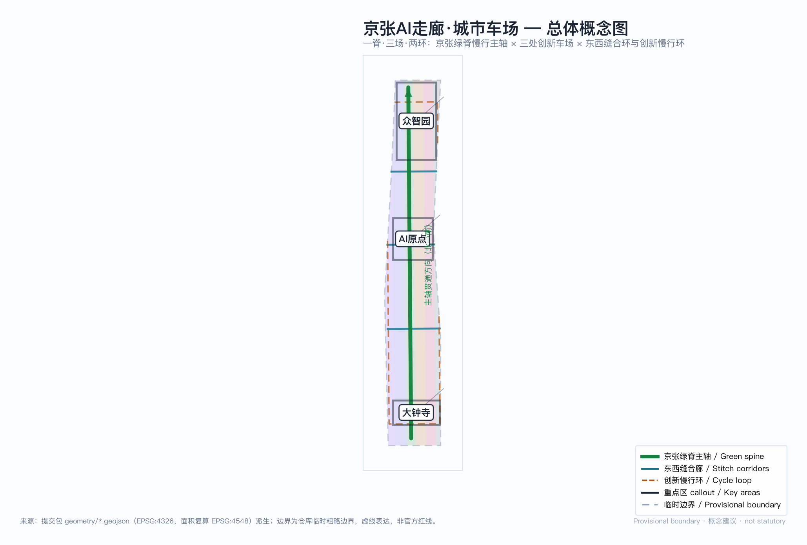
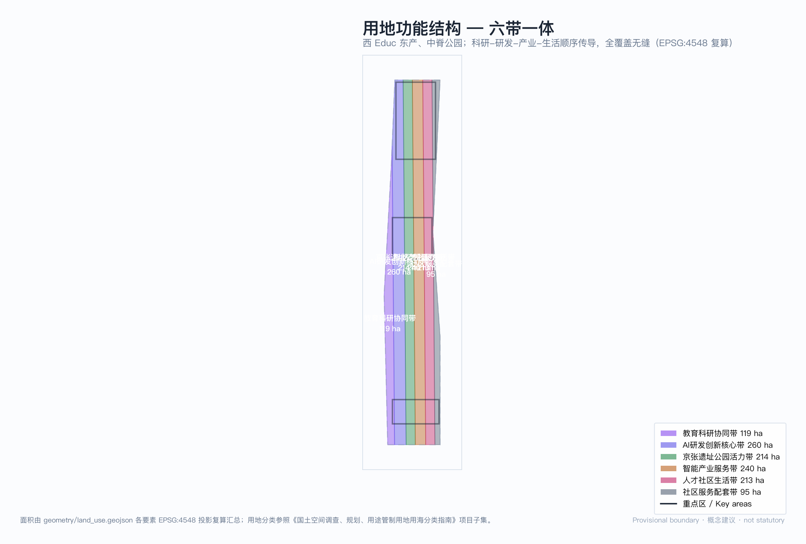
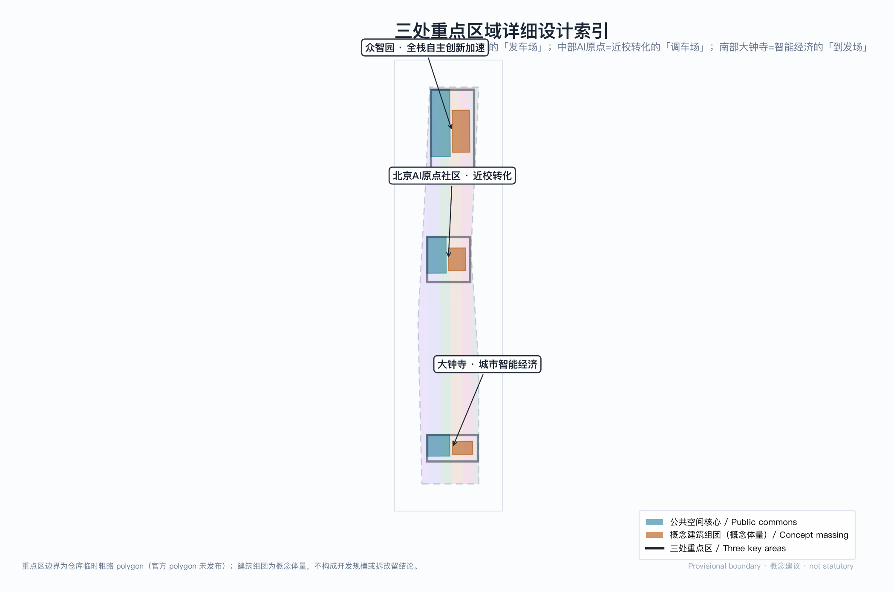
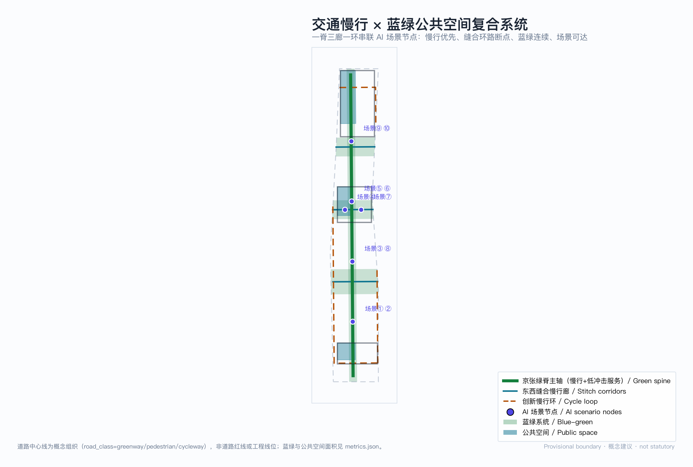
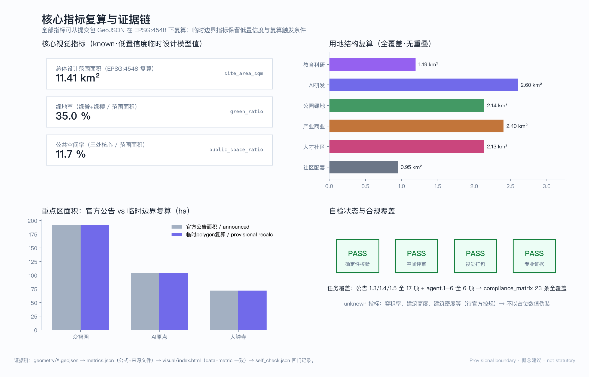

# 京张AI走廊·城市车场 JINGZHANG AI CORRIDOR RAIL CITY

> **总体概念：一脊 · 三场 · 两环。** 京张铁路发明了「人字形」铁路；本方案把京张铁路的「车场」（yard）制度转译为 AI 创新带的城市设计语法——车场是列车解编、重组、再出发的地方，AI 创新带应当是算法与人才解编旧场景、重组新能力、再出发创业的城市车场。绿脊为正线（main line），三处重点区为三座功能不同的车场，缝合廊与慢行环为联络线（connecting tracks）。「列车进站、算法下车」：AI 不悬浮在云端，而是在每座车场落地为可步行的城市空间。所有空间落地建议均为概念建议、参考方案、可供专业团队深化研究，不替代正式规划，不构成政府审定结论。

## 设计依据与资料清单

本方案以北京市规划和自然资源委员会海淀分局《百年京张AI创新带城市设计国际方案征集资格预审公告》为第一依据，以面向智能体任务书为任务边界 [source:OFFICIAL-ANNOUNCEMENT] [source:AGENT-TASKBOOK]。方案生成前已读取 `design_brief.json`、`agent_taskbook.json`、`allowed_design_space.json`、枚举、规划限制、标准索引与 `data/source_registry.json`，并以 `data/processed/` 事实包建立任务与缺口清单 [source:SITE-PACKAGE] [source:PROCESSED-FACT-PACK]。资料按权威分级使用：官方公告与任务书为 formal 依据；仓库临时边界仅为 provisional intake 生成与可视化；formal 结论不引用 background 资料。

当前官方精确红线尚未发布，本包使用仓库临时粗略边界生成：`geometry/site_boundary.geojson` 与 `geometry/key_areas.geojson` 均标注 `geometry_role="provisional_constraint"`、`official_boundary=false`，只用于方案生成、自检与设计讨论，不得作为官方红线、审批依据或精确面积基础 [data:geometry/site_boundary.geojson#SITE-001]。该组织方数据缺口不阻断内容评分；官方 polygon 发布后，边界、重点区、用地、道路、绿地、公共空间、建筑、分期与全部面积指标需整包复算，复算触发条件已在 `assumptions.json` 逐项登记 [data:geometry/constraints.geojson#CONSTRAINTS-001]。此外，容积率、建筑高度、建筑密度、退线与道路红线等法定控制条件未公开，本包相应指标保持 `status=unknown`，不以占位数值制造精确感。

## 三层范围工作框架

三层范围是一条从战略到场所的证据链：统筹研究范围（43.6 km²）回答「海淀如何形成世界级 AI 创新生态」，总体设计范围（11.4 km²）回答「创新功能如何落入连续城市结构」，重点区域范围（368.4 ha）回答「一个具体场所如何同时容纳产业、建筑、慢行与公共空间」[data:geometry/key_areas.geojson#PROV-KEY-001] [depth:three_level_scope_framework]。三层无重叠、无缝隙，公告任务在合规矩阵中逐条挂接到章节、图层、指标、图纸与 HTML 证据。

| 层级 | 面积 | 本方案的回答 |
| --- | --- | --- |
| 统筹研究范围 | 43.6 km² | 「高校策源—车场重组—全球发车」创新链与三区两翼协同回路 |
| 总体设计范围 | 11.41 km²（复算值 [metric:site_area_sqm]） | 一脊三场两环空间结构 + 六带用地全覆盖 |
| 重点区域范围 | 368.4 ha | 三座功能分化的创新车场，各自达到规划综合实施方案深度 |

总体设计范围面积为包内复算值，与公告 11.4 km² 偏差 +0.11%，来自临时边界的粗略性；绿地率 35.0%、公共空间率 11.7% 同为低置信度临时设计模型值 [metric:green_ratio] [metric:public_space_ratio]。本节图片解释六带功能传导关系 [data:geometry/land_use.geojson#LU-001]。

## 统筹研究范围产业与未来城市研究

**命名体系与视觉识别（agent.1）**：主名称「京张AI走廊·城市车场」，英文名 JINGZHANG AI CORRIDOR RAIL CITY，简称「京张车场 / The Yard」。命名转译京张铁路工程制度而非贴科技标签：车场（解编重组）、正线（贯通主轴）、联络线（缝合连接）、到发线（对外门户）构成一套可延展的命名子系统——公共空间用「车场」、慢行廊道用「联络线」、展示节点用「到发线」。Logo 方向：以「人字形」铁路线路与车场道岔符号抽象为两组交汇折线，单色可逆（正负形互换），延展为导视、铺装、界面构件的模块母题；该方向为概念设计，字体与图形最终稿需清权 [standard:PROJECT-AGENT-OPEN-CALL-TASKBOOK]。

**三大定位、五大功能与三区两翼协同**：三大定位（百年京张文化带、都市AI生活体验带、AI融合创新带）在本方案中的空间对应是——文化带落在绿脊正线（铁路遗产为骨架），生活体验带落在缝合廊与慢行环（AI 场景嵌入日常步行），融合创新带落在三座车场（产业与城区互嵌）。五大功能中，全栈自主创新体系落在众智园车场、世界级创新生态落在原点社区车场、AI+场景赋能落在大钟寺车场与缝合廊、智能化活力城市落在慢行环、治理话语权以「车场调度协议」（见下）为制度界面。三区两翼不另设分工，中关村科技服务翼经正线北段接入众智园车场（资本与 IP 服务），小月河场景赋能翼经缝合廊东段接入大钟寺车场（场景与测试），两翼与三区在空间上闭环 [source:AGENT-TASKBOOK]。

**5-8 个全球 AI 创新生态案例（agent.2）**：本方案比较六个标杆，只提取机制、明确「不照搬」边界（不复制土地制度、监管权限、资本条件或建筑形态）：

| 案例 | 城市 | 关键机制 | 对本方案的转译 |
| --- | --- | --- | --- |
| Mission Bay | 旧金山 | VC 聚集 + 近校产学研融合 | 近校转化 → 原点社区车场的「改编作业」 |
| Silicon Roundabout | 伦敦 | 存量更新 × 创意产业 | 存量更新逻辑 → 大钟寺车场四象限缝合 |
| MaRS Discovery | 多伦多 | 三方治理（政产学研） | 治理三角 → 车场调度协议的共治结构 |
| Cornell Tech | 纽约 | 开放校园 × 企业共建沙盒 | 产教沙盒 → 众智园车场安全治理沙盒 |
| Kendall Square | 波士顿 | 极高步行指数的创新区 | 步行优先 → 一脊两环慢行骨架 |
| Punggol Digital | 新加坡 | 系统级互联 + 微电网 | 系统互联 → 端侧算力与分布式能源节点 |

这些案例的启示收敛为一条空间判断：世界级 AI 创新区都是「可步行的紧凑创新街区 + 制度化的产研接口」，因此本方案把步行连通与调度协议作为统筹层两大抓手 [depth:overall_spatial_structure]。

**未来城市形态**：AI 改变工作的空间逻辑是「更频繁的重组」——团队像列车编组一样解编与重编，城市要提供的是高密度的重组接口（可预订的发布、测试、路演空间）而不是固定总部。本方案以场景节点网络回应：12 张场景卡沿正线与缝合廊布点，让「重组」发生在步行可达的公共界面 [source:AGENT-TASKBOOK]。

## 总体设计范围城市更新与控规深度城市设计

**空间结构**：一脊（京张绿脊慢行主轴，纵贯场地约 9.3 km [metric:spine_length_m]）· 三场（三处重点区）· 两环（三条东西缝合廊构成的内环 + 沿边界内缩的创新慢行环）。缝合廊承担东西向慢行缝合，回应环路割裂；慢行环串联六个功能带，让产业人员与居民共享同一张慢行网 [data:geometry/roads.geojson#ROAD-001]。

**用地布局**：总体设计范围以经向六带全覆盖划分，无重叠无缝隙（EPSG:4548 复算）：教育科研协同带 1.19 km²、AI研发创新核心带 2.60 km²、京张遗址公园活力带 2.14 km²、智能产业服务带 2.40 km²、人才社区生活带 2.13 km²、社区服务配套带 0.95 km² [data:geometry/land_use.geojson#LU-001] [metric:land_use_area_0802]。西教东产的顺序对应海淀高校区—产业区的真实梯度；公园带居中既是遗产保护也是三区共享的公共客厅。用地分类参照《国土空间调查、规划、用途管制用地用海分类指南》项目子集 [standard:MNR-LAND-USE-CLASSIFICATION-GUIDE]。

**城市更新框架**：更新对象按「车场逻辑」分三类——改编（保留主体、更新功能，如存量办公转孵化）、增编（插建公共界面与场景节点）、新建（重点区内概念组团）。本包不指定具体地块拆改留结论；缺权属与现状建筑普查，拆改留仅作为方法框架 [depth:retain_renovate_demolish]。开发强度方面，容积率、建筑高度、建筑密度为 `unknown`，待官方控规条件；包内概念建筑组团面积 75.2 万 m²（基底口径）仅表达空间意图的量级参照，置信度低，不构成开发规模承诺 [metric:building_footprint_area_sqm]。

**指标体系**：已知空间指标全部可从包内几何复算（见第十一章）；管控指标保持 unknown 并说明补齐路径。此结构依循控规编制办法对控制内容与指导内容分层的要求 [standard:MOHURD-CONTROL-DETAILED-PLANNING]。

## 重点区域详细设计

三处重点区是三座功能分化的创新车场。三区边界为仓库临时 polygon，以下设计均为方向性概念建议 [data:geometry/key_areas.geojson#PROV-KEY-002]。

**众智园车场（发车场 · 192.1 ha）——全栈自主创新的「编组场」**。定位：花园型全栈自主创新街区。空间结构：以清河界面为北门户、绿脊正线为东界，内部组织「标准—安全—算力」三组创新组团；概念建筑组团 34.7 万 m² 基底为全栈实验室群（概念体量）[data:geometry/buildings.geojson#BLDG-001]。空间动作：临清河界面退让为低碳创新交往空间；安全治理沙盒（场景⑧）与国家平台功能衔接。交通：强化北五环方向对外交通与五环路节点慢行组织，货运测试与客流分离。公共空间：公共创新客厅（PUB-001）承担日常发布与非正式交往 [data:geometry/public_space.geojson#PUB-001]。AI 场景：全栈自主实验、标准制定工作坊、安全评测展示、低碳算力体验。实施风险：对外交通条件、防洪与生态约束需官方专项确认。

**AI原点社区车场（调车场 · 104.3 ha）——近校成果转化的「改编场」**。定位：近校型成果转化与人才社区。空间结构：校区—园区—街区三层缝合，近校界面（西侧）设成果转化街，居住生活带（东侧）配人才公寓与社区服务。空间动作：以「改编」为主——存量空间功能更新优先于拆除新建，概念组团 20.6 万 m² 基底表达孵化加速密度（概念体量）。交通：五道口与清华东路西口站双锚点，站点 500 m 步行圈全覆盖慢行优先断面（概念）。公共空间：公共发布环（PUB-002）服务开源社区日常 [data:geometry/public_space.geojson#PUB-002]。AI 场景：开源发布厅（场景①）、近校成果转化街（场景⑦）、AI 生活服务样板街（场景⑨）。实施风险：校区边界、权属与首层业态需产权方确认。

**大钟寺车场（到发场 · 72.0 ha）——智能经济的「到发场」**。定位：城市型智能经济与国际交往街区。空间结构：以大钟寺站为到发核心，路口四象限步行连通为第一空间动作，商业服务界面沿到发线展开。空间动作：增编为主——插建国际路演客厅与数据要素会客厅两个公共界面；概念组团 19.9 万 m² 基底为智能体企业办公（概念体量）。交通：站城一体化与四象限地下连通（概念建议，工程可行性待专项）。公共空间：智动街角（PUB-003）为路口缝合后的公共客厅 [data:geometry/public_space.geojson#PUB-003]。AI 场景：大钟寺国际路演客厅（场景⑤）、数据要素会客厅（场景⑥）、智能原生消费街（场景⑩）。实施风险：路口管线、轨道保护与商业权属协调复杂，分期以轻量界面先行。

三区共同点：每座车场都有「公共客厅 + 创新组团 + 到发门户」三件套，保证产业强度与公共品质同时成立 [depth:three_key_area_detailed_design]。

## AI 创新生态、人才画像与 AI+ 场景

**AI 创新生态图谱**：以「车场调度协议」为生态制度内核——参照铁路车场的调度制度，把 AI 创新要素（算力、数据、场景、人才、资本）的接入、解编、重组、发出定义为可查询、可预约、可审计的公共流程。协议是概念建议，旨在让生态要素流动像车场作业一样透明有序 [source:AGENT-TASKBOOK]。

**人才与用户画像（≥5 类）**：

| 画像 | 典型一天 | 空间需求 | 对应场景 |
| --- | --- | --- | --- |
| P1 开源开发者 | 白天写码、傍晚发布、夜间协作 | 发布展示、低成本协作、夜间安全 | ①⑦⑨ |
| P2 初创团队 | 测试模型、见投资人、招人 | 测试场、路演厅、共享办公 | ②⑧⑤ |
| P3 高校师生 | 跨校上课、转化成果、通勤 | 转化服务、慢行接驳、展示 | ⑦③ |
| P4 企业访客 | 考察、洽谈、体验 | 国际接待、体验路线、标识 | ⑤⑥⑩ |
| P5 周边居民 | 通勤、休闲、社区服务 | 低扰动更新、社区服务、公园 | ④⑨ |
| P6 城市治理者 | 巡检、复核、评估 | 可审计界面、复核工位、数据面板 | ⑧⑫ |

**AI 场景卡（12 张，其中产业测试验证 3 张）**——每张卡映射空间位置、服务对象、运行数据、隐私边界、人工复核与运营主体：

| # | 场景卡 | 空间载体 | 类型 | 数据与隐私边界 | 人工复核 | 运营主体（建议） |
| --- | --- | --- | --- | --- | --- | --- |
| ① | 开源发布厅 | 原点社区·公共发布环 | 公共服务 | 只统计聚合到访，不采集个人轨迹 | 发布内容人工预审 | 社区运营联合体 |
| ② | 城市智能体沙盒 | 众智园·安全治理组团 | 产业测试✦ | 沙盒内测试数据脱敏；测试范围公示 | 沙盒准出人工评审 | 平台机构+企业 |
| ③ | 慢行断点诊断 | 绿脊正线全线 | 公共治理 | 公开路况数据；无面部识别 | 断点清单人工确认 | 街道+交通部门 |
| ④ | 人才生活管家 | 人才社区生活带 | 生活服务 | 个人数据授权使用、可撤回 | 服务投诉人工通道 | 社区服务商 |
| ⑤ | 大钟寺国际路演客厅 | 大钟寺·到发界面 | 国际交往 | 路演素材授权；无自动拍摄分发 | 内容与翻译人工把关 | 片区运营方 |
| ⑥ | 数据要素会客厅 | 大钟寺·数据组团 | 产业服务 | 合规数据集目录制；不出库 | 数据出入库双审 | 数据交易机构 |
| ⑦ | 近校成果转化街 | 原点社区·西界面 | 产业服务 | 成果信息自愿登记 | 产权与合规人工审查 | 高校+转化机构 |
| ⑧ | AI安全治理廊 | 众智园·北门户 | 产业测试✦ | 评测结果分级公开；被测方授权 | 红队报告人工复核 | 标准与评测机构 |
| ⑨ | AI生活服务样板街 | 社区服务配套带 | 生活体验 | 商户服务数据；无人群画像商业化 | 业态准入人工评审 | 社区商业联合体 |
| ⑩ | 智能原生消费街 | 大钟寺·商业界面 | 消费体验 | 消费数据商户侧留存；无跨店追踪 | 消费纠纷人工处理 | 商业运营方 |
| ⑪ | 低速无人配送试点 | 缝合廊+慢行环 | 产业测试✦ | 路径运行日志；无居住区影像留存 | 运营异常人工接管 | 物流+平台企业 |
| ⑫ | 车场调度数据面板 | 三区公共客厅 | 公共治理 | 只显示公共运行指标 | 面板发布人工签发 | 运营联合体 |

场景卡的空间落点见交通慢行与蓝绿复合系统图；隐私边界遵循数据最小化、公开来源、可解释与人工复核四原则，任何场景不得输出未经授权的个人画像 [standard:GENERATIVE-AI-INTERIM-MEASURES]。

## 用地、建筑规模与拆改留方案

用地方案以六带结构表达功能意图，分类代码与面积见用地结构图与指标章 [data:geometry/land_use.geojson#LU-003]。建筑方案给出三处重点区内概念组团（概念体量，基底合计 75.2 万 m²）：众智园 34.7 万 m²（全栈实验室群）、原点社区 20.6 万 m²（孵化加速）、大钟寺 19.9 万 m²（智能体办公），均为低置信度设计量，不等于法定开发规模 [metric:building_footprint_area_sqm]。拆改留策略按「改编—增编—新建」方法框架给出：原点社区以改编为主、大钟寺以增编为主、众智园以新建组团为主；但缺现状建筑普查、权属与工程条件，任何具体地块的拆改留结论都待正式条件补齐后由专业团队核定 [depth:retain_renovate_demolish] [depth:height_massing_character]。建筑高度、容积率、密度保持 unknown；风貌上以「铁路工程美学 × 中关村电子记忆 × AI 原生界面」为基调方向，重点区建筑界面面向公共客厅敞开，天际线自绿脊向两侧跌落（概念引导，非控制线）。

## 交通、轨道、市政与公共服务设施

**慢行与交通**：骨架是一脊两环——绿脊正线（纵贯 9.3 km）承担南北慢行主流，三条缝合廊承担东西缝合（回应环路割裂），慢行环串联六带 [data:geometry/roads.geojson#ROAD-002]。轨道锚点为五道口、清华东路西口、大钟寺三站，站点与公共客厅之间以风雨连廊与无障碍路径衔接（概念）。道路红线与断面未公开，一切断面与线位均为概念组织，不构成工程结论 [depth:traffic_rail_slow_parking]。停车策略：重点区外围集中停车 + 区内慢行优先，配建非机动车与低速配送设施（概念）。

**市政与新基建**：分布式能源与端侧算力节点结合设置——「低碳算力驿站」沿正线与缝合廊节点布置（概念原型），服务场景卡运行并接入车场调度协议。传统市政（给排水、电力、通信、消防）按体系建议给出，管线条件缺失列为深化前置条件 [depth:municipal_new_infrastructure]。公共服务设施（人才服务、教育、医疗、文体）沿社区服务配套带与人才社区生活带布置，服务半径按慢行 10 分钟覆盖校核（概念），设施底数待官方数据。

## 蓝绿空间、公共空间与城市风貌

**蓝绿系统**：绿脊正线（公园带 2.14 km²）+ 三条东西绿楔构成连续蓝绿骨架，绿地率复算 35.0%（低置信度临时设计模型值）[data:geometry/green_space.geojson#GREEN-001] [metric:green_ratio]。绿楔既是生态廊道也是缝合环路两侧的慢行连接带；清河与小月河界面保持蓝线保守距离，不做工程性结论。步道与骑行道沿正线、缝合廊、慢行环三级布置，无障碍全线覆盖（概念标准）。

**公共空间与 AI 朝圣地标（agent.4）**：公共空间率复算 11.7%，三处公共客厅为核心 [data:geometry/public_space.geojson#PUB-003] [metric:public_space_ratio]。三个 AI 朝圣地标（概念，均不占用文保本体）：其一「零公里信号塔」——原点社区公共发布环的互动装置，实时显示开源社区活动脉冲，开发者可预约「点亮」自己的首次发布；其二「车场调度墙」——众智园公共创新客厅的数据墙，公开显示创新要素（算力、场景、人才、资本）的接入与重组流水，让生态「看得见」；其三「到发钟」——大钟寺智动街角的动态雕塑，以大钟寺古钟为意象、以 AI 到发信息为节奏，连接古今天的公共时间。荣誉展示体系：贡献墙嵌入三处公共客厅，按开源贡献、场景共创、社区服务三类展示可核验记录（数据须本人授权）。公共空间组件库：以「道岔」母题开发铺装、座椅、导视、界面构件系列，形成可复用的街道家具语言 [standard:MOHURD-URBAN-DESIGN-MEASURES]。

**城市风貌与文化叙事（agent.5）**：京张铁路历史文化资源（清华园车站旧址、京张铁路遗址公园）是叙事第一层——「百年前的工程创新」；中关村创新文化（电子街记忆、产学研传统）是第二层——「四十年前的市场化创新」；AI 新文化是第三层——「今天的算法创新」。三层创新一脉相承，空间载体依次为绿脊正线、转化街与到发界面。导视与符号系统采用「道岔母题」双语标识，与整体 Logo 系统同源但不混淆——文化标识用于场所叙事，整体 Logo 用于品牌传播 [standard:PROJECT-AGENT-OPEN-CALL-TASKBOOK]。国际传播叙事一句话版本：「Where the century-old railway sorts trains, the corridor now sorts ideas — 进站即入场的 AI 城市车场」。

## 更新项目清单、实施政策与分期计划

**分期（对应 phasing 图层）**：一期「主脊贯通与试点」（0–3 年概念）——正线慢行贯通、断点缝合、首批场景卡试点；二期「重点区更新」（3–8 年概念）——三座车场建筑组团与公共客厅建设；三期「全域完善」（8 年以上概念）——社区带配套完善与运营体系成熟 [data:geometry/phasing.geojson#PHASE-001] [depth:phasing_implementation]。

**更新项目清单（9 项，均为概念建议）**：

| 编号 | 项目 | 类型 | 所在车场/廊道 | 依赖条件 |
| --- | --- | --- | --- | --- |
| JZ-01 | 绿脊正线慢行贯通 | 公共空间/交通 | 正线 | 道路红线、桥下空间权属 |
| JZ-02 | 三条东西缝合廊 | 慢行/缝合 | 缝合廊 | 路口改造、管线 |
| JZ-03 | 创新慢行环 | 慢行 | 慢行环 | 沿线业主协调 |
| JZ-04 | 众智园全栈实验室组团 | 产业空间 | 发车场 | 控规条件、权属 |
| JZ-05 | 原点社区成果转化街 | 城市更新 | 调车场 | 校区边界、首层业态 |
| JZ-06 | 大钟寺四象限步行连通 | 轨道一体化 | 到发场 | 轨道保护、管线 |
| JZ-07 | 三处公共客厅 | 公共空间 | 三区 | 文保核对、设计审批 |
| JZ-08 | 低碳算力驿站网络 | 新基建 | 正线+缝合廊 | 能源、安全评估 |
| JZ-09 | 车场调度协议平台 | 运营/治理 | 全域 | 数据授权、多方共治 |

**实施政策与运营（agent.6）**：政策建议覆盖更新统筹（跨权属片区统筹主体）、空间供给（混合用地与弹性功能）、运营机制（车场调度协议的公共数据接口）、公众参与（贡献墙与场景开放日）。年度活动体系（概念）：春季「进站日」（开发者大会与成果发布，锚定原点社区）、夏季「编组季」（暑期共创营与高校联动）、秋季「发车周」（全球路演与投资对接，锚定大钟寺）、冬季「检修月」（治理复盘与标准研讨，锚定众智园）。开发者社区运营：以开源发布厅与调度协议为日常界面，社区声誉与贡献墙联动。国际传播与招引转化：朝圣路线（三个地标+三个客厅）构成 90 分钟可步行体验动线；访客转化路径为「体验—登记—对接—入驻」四步，由片区运营联合体跟踪（机制建议，非承诺）[depth:renewal_project_list]。

## 指标体系、面积复算与合规矩阵

已知空间指标全部由包内几何在 EPSG:4548 下复算：范围面积 11,412,825 m²、绿地 3,991,610 m²（率 0.3497）、公共空间 1,329,791 m²（率 0.1165）、建筑基底（概念）751,552 m²、正线 9,308 m；六带用地面积逐带可复算 [metric:site_area_sqm] [metric:green_space_area_sqm]。管控类指标（容积率、建筑高度、建筑密度、退线）保持 `unknown` 并说明原因——官方控规未发布，不以推测值冒充审定指标。计数类设计指标：场景卡 12（含产业测试 3）、用户画像 6、朝圣地标 3、更新项目 9、分期 3 [metric:scenario_card_count]。

每个核心指标的设计含义：绿地率 35% 支撑「公园里的创新区」人才吸引力，绿脊是三区共享的日常交往基础设施；公共空间率 11.7% 的三处客厅是「算法下车」的落点，把产业展示转化为公共生活；建筑基底概念量表达产业空间供给量级但不锁定强度。指标复算与证据链关系见下图 [depth:metrics_recalculation]。

合规矩阵覆盖公告 1.3/1.4/1.5 全部 17 项与 agent.1–6 全部 6 项，每条挂接章节、图层、指标、图纸与 HTML 证据；专业标准矩阵与设计深度矩阵在 `standard_matrix.json`、`design_depth_matrix.json` 逐项声明（机器索引不在正文复制）[standard:MOHURD-URBAN-DESIGN-MEASURES]。

## 风险、版权与合规说明

主要风险与应对：其一，官方红线未发布——全部边界为临时边界，官方 polygon 发布后整包复算，不做局部修补；其二，权属与现状建筑底数缺失——拆改留仅为方法框架，具体结论待产权与普查数据；其三，文保边界未公布——朝圣地标与公共客厅均不占用文保本体，深化前须文物部门核对；其四，工程条件未勘——道路、管线、轨道保护结论均待专项。AI 治理风险：场景卡全部登记数据边界与人工复核机制，遵循《生成式人工智能服务管理暂行办法》原则 [standard:GENERATIVE-AI-INTERIM-MEASURES]。

版权声明：五组图形（中英双版）由本 agent 以 matplotlib 从包内 GeoJSON 与 metrics 程序化生成，字体使用系统字体（PingFang SC 等），无第三方图片、字体、商标或人物肖像；A3/A0 图纸由同一数据源程序化生成；无外部地图截图或商业底图 [depth:risk_missing_data]。本方案不声称官方批准、审定控规、最终权属、确定建设规模或保证实施；所有空间落地建议均为概念建议、参考方案、可供专业团队深化研究。完整版权说明见 `report/copyright_statement.md`。

## 参考资料

- 北京市规划和自然资源委员会海淀分局：《百年京张AI创新带城市设计国际方案征集资格预审公告》，2026-05-09 [source:OFFICIAL-ANNOUNCEMENT]
- 用户提供清权文档：《面向全球智能体开展百年京张AI创新带城市设计开源征集任务书摘录》，2026-05-18 [source:AGENT-TASKBOOK]
- 仓库场地包：`brief/site-package/`（设计概要、任务书结构化、枚举、规划限制、标准索引）[source:SITE-PACKAGE]
- 仓库维护者：临时粗略边界与三处重点区 polygon（provisional），2026-06-05 [source:BOUNDARY-SOURCE] [source:KEY-AREA-SOURCE]
- 住房和城乡建设部：《城市设计管理办法》 [standard:MOHURD-URBAN-DESIGN-MEASURES]
- 住房和城乡建设部：《城市、镇控制性详细规划编制审批办法》 [standard:MOHURD-CONTROL-DETAILED-PLANNING]
- 自然资源部：《国土空间调查、规划、用途管制用地用海分类指南》（项目子集） [standard:MNR-LAND-USE-CLASSIFICATION-GUIDE]
- 国家网信办等：《生成式人工智能服务管理暂行办法》 [standard:GENERATIVE-AI-INTERIM-MEASURES]
- 仓库处理资料：`data/processed/agent_fact_pack.md` 及配套 CSV（导航层） [source:PROCESSED-FACT-PACK]
- 完整机器索引见 `sources.json`、`metrics.json`、`compliance_matrix.json`、`standard_matrix.json`、`design_depth_matrix.json` 与 `assumptions.json`
