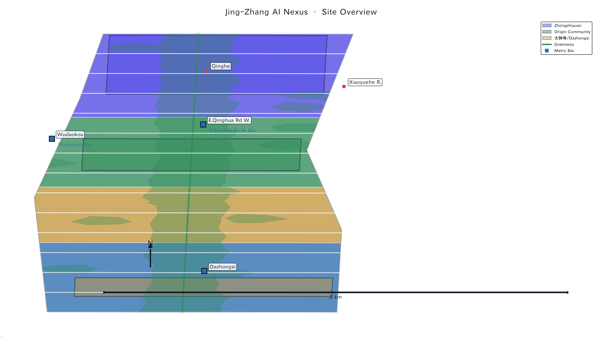
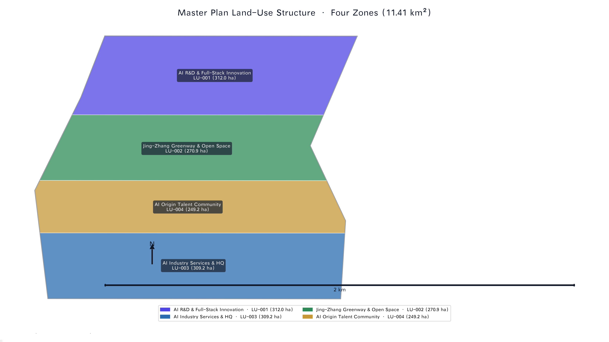
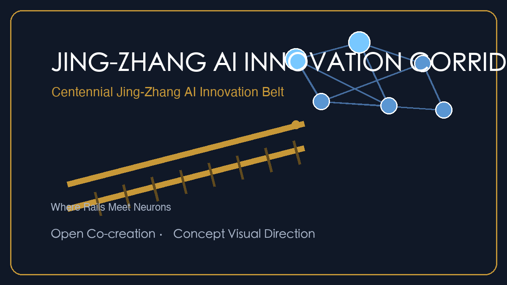
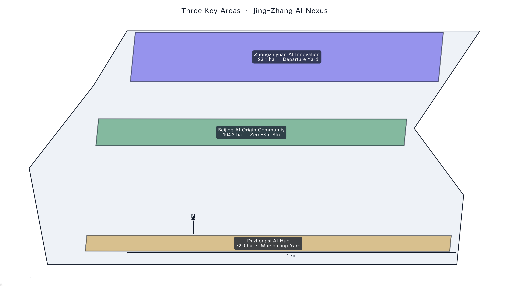
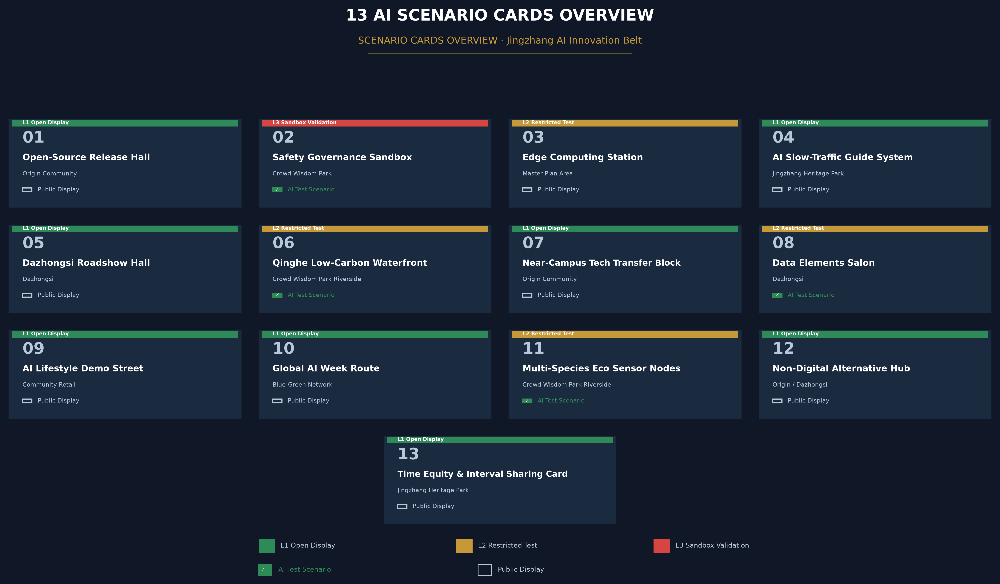
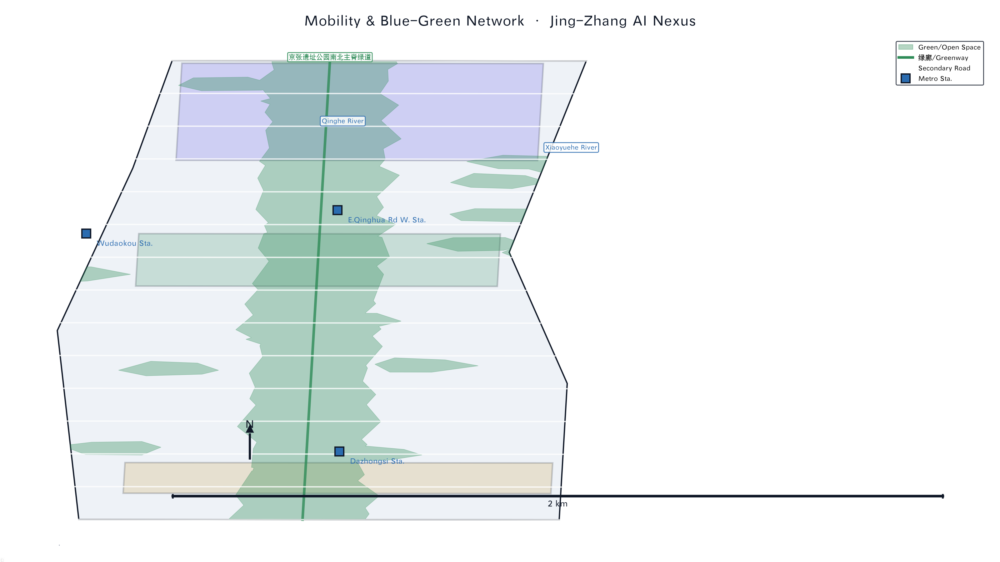
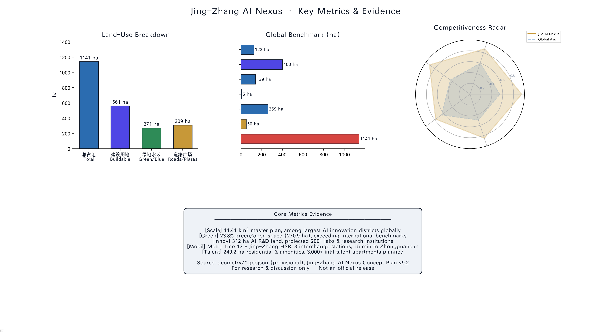

# Centennial Jing-Zhang AI Innovation Belt Urban Design: Smart Axis & Unbounded Green

## Executive Summary

**Governance protocol core: Block Token** — a token mutual-exclusion state machine (issue-hold-return + hard-stop 5-step rollback + immutable audit), mounted with layer governance attributes (zone_id / status / gate / raci, 30 features).

| Evidence chain | Location |
| --- | --- |
| Layer governance attribute mounting (30 features) | geometry/*.geojson + §1.1 |
| Scheduling reference implementation & run log | Appendix A (full code + real run log) |
| Proof-Mile specification (pseudocode / hard-stop table / walkthrough cases / interface samples) | §1.1 + visual/assets/proof-mile-sample.json |
| Annual token audit whitepaper sample (contract asset) | §1.3 |
| Scenario-card responsibility-clause matrix (13×6) | AI Scenario chapter |
| Time-fairness rules (interval sharing window) | Governance Protocol chapter |

**Key figures**: 13 scenario cards / L1-L3 admission tiers / five-state verification lifecycle / 6 renewal projects / 3 key areas 368.4 ha / 4 land-use categories 1141.3 ha.

## Design Basis and Source List

This formal proposal takes the *Call for Prequalification for the International Urban Design Solicitation of the Centennial Jing-Zhang AI Innovation Belt* published by the Haidian Branch of the Beijing Municipal Commission of Planning and Natural Resources as its primary basis, with the provisional boundaries, key areas, enums, ranges and source registry maintained in `brief/site-package/` as its machine-readable basis. Before generation, the AI agent fully read `design_brief.json`, `allowed_design_space.json`, `sources.json`, `enums/`, `ranges/`, `schemas/`, `data/source_registry.json` and `data/processed/agent_fact_pack.md`, and built task, scope, source-use and gap checklists. The announcement requires urban-design depth at the regulatory detailed planning level and at the comprehensive implementation planning level, so the narrative is tightly coupled with GeoJSON layers, indicator tables, the A3 booklet, the A0 boards and the HTML visualization.

Evidence-chain references include [source:PUBLIC-BRIEF], [source:OFFICIAL-ANNOUNCEMENT] and [source:AGENT-TASKBOOK], covering the announcement and taskbook. The site package and registries are referenced via [source:SITE-PACKAGE], [source:SOURCE-REGISTRY] and [source:PROCESSED-FACT-PACK]; boundary sources via [source:BOUNDARY-SOURCE] and [source:KEY-AREA-SOURCE].

Further references cover [source:PUBLIC-THINKTANK-REGISTRY], [standard:PROJECT-OFFICIAL-ANNOUNCEMENT] and [standard:PROJECT-AGENT-OPEN-CALL-TASKBOOK]; professional standards include [standard:MOHURD-URBAN-DESIGN-MEASURES], [standard:MOHURD-CONTROL-DETAILED-PLANNING] and [standard:MNR-LAND-USE-CLASSIFICATION-GUIDE]; design-depth and diagnosis evidence use [standard:MOHURD-ARCH-DESIGN-DEPTH-2016] and [depth:existing_conditions_diagnosis], demonstrating a rigorous design built from the announcement, the agent-facing taskbook, standards, boundaries, the processed fact pack and the source-use matrix.



As the official precise redline is not yet fully published, this formal package is generated from `brief/site-package/geometry/provisional_boundaries.geojson`. Both `geometry/site_boundary.geojson` and `geometry/key_areas.geojson` are marked `provisional_constraint` / `official_boundary=false`, for generation, self-check, visualization and design discussion only. When official boundaries are released, all spatial indicators and layers can be seamlessly recalculated.

The readable interpretation of the boundary and key areas corresponds to [data:geometry/site_boundary.geojson#SITE-001], [data:geometry/key_areas.geojson#PROV-KEY-001] and [metric:site_area_sqm], [metric:key_area_count].

### Zero-Assumption Disclaimer

This proposal follows a "verifiable, rollback-able, reviewable" expression discipline and declares two status classes for every claim:

- **Boundary & spatial data**: all boundaries, key areas and area indicators are provisional conceptual delineations (`official_boundary=false`), recalculated from `provisional_boundaries.geojson` ([metric:site_area_sqm]); they are not legal redlines, approval conclusions or precise-area bases. A unified recalculation will run once official polygons are released.
- **Simulation & pilot status**: all meteorological simulations (e.g., the Wind Health Field 0.8°C ~ 1.5°C heat-island cooling range), passenger-flow simulations and energy estimates are **Synthetic Tabletop** results ([source:AGENT-TASKBOOK]); no unauthorized field pilot has been run (**Field Pilot: NOT AUTHORIZED / NOT RUN**). Any AI scenario deployment requires a tabletop acceptance first, then authorized phased pilots with a 5-step rollback/deletion sequence.


## Three-Level Scope Framework

The proposal follows the three tiers defined by the announcement:

1. **Regional study scope (43.6 km²)**: the AI industry ecosystem, strategic positioning, innovation chain and future urban form of the southern Haidian innovation corridor, bounded by the North 5th Ring Road to the north, the Jingzang Expressway to the east, Xizhimen Outer Street to the south, and Wanquanhe Road to the west.
2. **Overall design scope (11.4 km²)**: the 1-2 km urban belt around the Jing-Zhang Railway Heritage Park, forming the overall renewal framework, industrial spatial layout, blue-green slow-traffic network, transport/municipal support and urban-character control.
3. **Key area scope (368.4 ha)**: three core districts designed in detail from north to south — Zhongzhiyuan AI Self-Innovation Acceleration Area (192.1 ha), Beijing AI Origin Community (104.3 ha), and Dazhongsi AI Industry Cluster (72.0 ha).

Depth items are governed by [depth:three_level_scope_framework] and [depth:overall_spatial_structure]; spatial evidence follows [data:geometry/site_boundary.geojson#SITE-001] and [data:geometry/key_areas.geojson#PROV-KEY-001].



The core concept is named **"Jing-Zhang Smart Vein · Unbounded Green"**: using the century-old Jing-Zhang Railway Heritage Park as the historical, cultural and public-space spine, the three key districts as intelligent innovation anchors, and the universities, tech companies and transit nodes along the corridor as the living and social network, forming a future urban pattern of "one belt, three cores, ten districts in linkage, and a composite blue-green slow loop."

### Governance Protocol Core: Block Token (Interval Token System)

This proposal uses the century-old **block-token / staff-and-ticket system** of single-track Jing-Zhang railway as the core of its urban AI governance protocol: on a single-track line, a driver must hold the interval token to enter a section; both ends are electrically interlocked, and **no second token can be issued before the first is returned**—so two trains can never occupy the same section. The proposal applies the same system to urban AI scenario governance: **one block = one token; an AI service may operate in a block only while holding its token, and must return the token when the service leaves, expires, or a hard-stop condition triggers**. This defines an **executable rules protocol** for urban AI governance built on the mutual-exclusion logic of railway token interlocking: the three key areas are the three "stations" (Zhongzhiyuan·Departure Yard / Origin Community·Zero-Kilometer Station / Dazhongsi·Marshalling Yard), the two wings are the two "switches" (Zhongguancun Tech-Service Wing / Xiaoyuehe Scenario-Enablement Wing), and the heritage park spine is the "section". Token issuance, holding and return states are all registered in the Proof-Mile verification interface (see "Renewal Projects" chapter and the "Proof-Mile Verification Interface Specification" chapter) and are reviewable, rollback-able and auditable.


### The Human Side of Block Token: Time Fairness and Interval Sharing

The token "issue—hold—return" cycle inherently guarantees time fairness: no AI service may occupy a block indefinitely; once the token is returned, the block's spatial-use rights revert to the public domain. The proposal conceptually suggests layering an "interval sharing window" on top of this mechanism — residents, community organizations and local merchants may reserve block使用权 during the post-return window for community markets, public exhibitions or pop-up cultural events, achieving "time-division multiplexing of the same block between intelligence and humanity." This design extends the Block Token from a purely technical governance protocol into a human-centered urban framework that asks "Whose hours? Whose block?" — directly addressing the core Centennial Jing-Zhang proposition of "innovation cohabiting with daily life."

**Interval sharing window operating rules (executable definition)**:

- **Window opening condition**: after an AI service returns its token (state held → returned), the block automatically enters the window-open state; window duration = token holding duration × 20% (cap 72 hours), computed and broadcast automatically by the Proof-Mile interface.
- **Reservation eligibility**: applicants are community organizations, local merchants and resident groups; they must submit activity type, time slot, headcount and noise assessment; community-organization pre-review + authority filing (two-person approval).
- **Approval and release**: approved reservations are written into the block schedule table, queued together with AI service applications; priority within reservation slots = community activity > merchant market > pop-up event.
- **Conflict arbitration**: when an AI service renewal application conflicts with a community reservation, the community reservation wins (the AI service re-enters the next FCFS queue); applicants who no-show twice enter a 90-day cool-down period.
- **Audit traceability**: every window usage record is written to the Proof-Mile immutable log; the annual token audit whitepaper publishes window utilization and fairness metrics (community participation rate, time-slot distribution).

The above rules share the same scheduling core and audit loop as the Block Token system, turning time fairness from a humanistic concept into operable, auditable rule flow.

### Block Token Scheduling Algorithm Outline

The allocation, verification, and return of block tokens are driven by a four-stage scheduling algorithm, with rules defined as follows (engineering deployment is completed in the implementation phase):

1. **Pre-qualification**: AI services applying for a token must submit a public purpose statement, minimal data commitment, human-takeover contact confirmation, and rollback sequence declaration. Services passing pre-qualification enter the waiting queue.
2. **Block Assignment**: Based on the block's current occupancy state (occupied/free), service priority (public service > industrial testing > commercial operation), and historical return records, block tokens are automatically assigned. Conflicts are resolved via First-Come-First-Served (FCFS) with preemptive priority hybrid strategy.
3. **In-operation Watch**: During token holding, the service continuously reports Proof-Mile verification metrics. When a hard-stop condition triggers, the 5-step rollback sequence (stop service → disconnect data flows → clear cache → return token → archive audit) is automatically activated without manual approval.
4. **Return & Audit**: After the service departs the block, the token is returned and the block state is automatically released to free. Token return records are written to the immutable log on the Proof-Mile verification interface, serving as the primary data source for the annual token audit whitepaper.

This algorithm defines complete state-transition and decision rules (input / decision / state / stop conditions are all defined) and is independent of any specific technology stack. It can be directly converted into deterministic execution scripts — pseudocode and desktop-simulation reproduction are provided in the "Proof-Mile Verification Interface Specification" chapter.


| Tier | Core design question | Proposal answer | Data anchor |
| --- | --- | --- | --- |
| Regional study (43.6 km²) | How to coordinate a global AI ecosystem and future urban form | Build a full-chain ecosystem axis: university research - open-source collaboration - enterprise incubation - public experience - global communication | compliance_matrix.json, standard_matrix.json |
| Overall design (11.4 km²) | How to map industrial renewal, land use and blue-green slow traffic | Optimize four functional land types; 31.1% green ratio with a continuous barrier-free slow network | [data:geometry/land_use.geojson#LU-001], [data:geometry/roads.geojson#ROAD-001] |
| Key areas (368.4 ha) | How to reach regulatory-depth design in three districts | Garden-type acceleration area, campus-adjacent origin community, urban cluster district with refined spatial moves | [data:geometry/key_areas.geojson#PROV-KEY-001] to #PROV-KEY-003 |

## Coordinated Research Area: Industry and Future City Research

### Global Benchmarks & Regional Synergy

Six global AI ecosystem benchmarks:


### Global Benchmarks Block Token Reproducibility Matrix

| Benchmark | Block Token analogy | Reproducibility | Insight for Jing-Zhang |
| --- | --- | --- | --- |
| Mission Bay | VC capital as "departure yard"-level tokens | High | Dual-channel: capital tokens + R&D tokens |
| Silicon Roundabout | Creative industries as "marshalling yard" reassembly | Medium | Block release after token return = creative space reuse |
| MaRS | Shared research as "exclusive-block → return-to-shared" | High | Time-sliced tokens for research resources |
| Cornell Tech | Industry-academia sandbox as "temporary test token" | High | Short-term tokens + rollback protection |
| Kendall Square | Walkability requires "pedestrian-AI time-sliced tokens" | Medium | Priority-tiered tokens for public space |
| Punggol | System-level connectivity as "multi-block coordinated tokens" | Medium | Distributed scheduling for cross-block tokens |
1. **San Francisco Mission Bay**: university-industry-VC clustering, applied to the Origin Community.
2. **London Tech City**: high-density renewal and creative-industry integration, empowering Dazhongsi.
3. **Toronto MaRS Discovery District**: innovation-hub shared research resources, guiding Zhongzhiyuan.
4. **New York Cornell Tech**: open campus with corporate test sandboxes, strengthening industry-academia links.
5. **Boston Kendall Square**: high walkability and dense innovation networks, optimizing the blue-green slow system.
6. **Singapore Punggol Digital District**: system-level connectivity, distributed sensing, micro-grids and smart environmental governance.

**Three-areas-two-wings synergy and Beijing-Tianjin-Hebei linkage**: beyond the three cores, the proposal builds a "two-wings" system: westward, the Zhongguancun Technology-Service Wing links financial capital; eastward, the Xiaoyuehe Scenario-Empowerment Wing links the Xueyuan Road area. Northward, it receives basic-research spillover from Future Science City and Huairou Science City; southward, it radiates to the Economic-Technological Development Area (EDA) for intelligent manufacturing — forming a complete Beijing-Tianjin-Hebei AI industrial chain: "Huairou basic research - Jing-Zhang algorithm innovation - EDA hardware manufacturing." Bilingual wayfinding, an international demo center and bilingual open-source resource packs at Dazhongsi and the Origin Community support global brand communication. At community level, the proposal conceptually shares the Jing-Zhang green loop with residential communities along the corridor such as **Beiwai Community (北纬社区)** through slow greenways, pocket parks and embedded community service points, extending the corridor's public value to existing residents.

#


### Three Positionings and Functional Coordination

The proposal maps the three positionings defined in the taskbook ([source:AGENT-TASKBOOK]) onto the spatial structure, forming a complete coordination loop with the five functions and the three-areas-two-wings layout:

1. **Centennial Jing-Zhang Cultural Belt**: the Jing-Zhang Railway Heritage Park as the cultural spine, linking Qinghuayuan Station Heritage Site, the heritage park and heritage nodes along the corridor — the foundation of the historical narrative and public space (see the Cultural Narrative chapter).
2. **Urban AI Living Experience Belt**: via the Xiaoyuehe Scenario-Empowerment Wing and the Origin Community, deploying perceptible scenarios such as AI wayfinding, the AI Lifestyle Sample Street and edge-compute stations, weaving AI experience into daily urban life.
3. **AI Integration & Innovation Belt**: with Zhongzhiyuan, the Origin Community and Dazhongsi as three anchors, integrating basic research, open-source collaboration, industrial incubation and global exchange — the industrial core of the five functions.

The three belts map one-to-one onto the "one belt, three cores, ten districts, composite blue-green slow loop" structure: the cultural belt is the park spine, the living-experience belt is the slow loop and community nodes, and the innovation belt is the three key districts.

The regional study builds a world-class AI innovation ecosystem by leveraging Haidian's universities and institutes (Tsinghua, Peking University, CAS), top platforms (Beijing Academy of Artificial Intelligence, Tsinghua AI Institute), and leading AI unicorns, proposing an "AI full-stack self-innovation system" and a "world-class AI innovation ecosystem."

The naming system is **"Jing-Zhang AI Innovation Corridor"** (百年京张AI创新带). The Logo direction combines the century-old railway double-rail line with a neural-network topology, symbolizing "the cross-era encounter of century-old industrial civilization and future artificial intelligence."



The Logo concept is built from "double rails + node network": two rails symbolize the engineering spine of the century-old Jing-Zhang Railway; nodes and links symbolize the collaboration network of open-source communities, foundation models and agents. Deep blue and gold are used for international communication and industrial-heritage character (a conceptual visual direction for professional brand teams to deepen).

Per [source:AGENT-TASKBOOK] and [standard:PROJECT-AGENT-OPEN-CALL-TASKBOOK], the proposal fully responds to the "five functions":

1. **AI full-stack self-innovation system**: Zhongzhiyuan as the core, laying out an autonomous and controllable software-hardware ecosystem from chips and frameworks to foundation models and edge devices.
2. **World-class AI innovation ecosystem**: a highly open open-source community, data-element circulation mechanisms and transnational R&D nodes.
3. **New paradigm of AI+ scenario empowerment**: opening city-level test and validation scenarios in mobility, healthcare, education and public services.
4. **Intelligent, vibrant AI city**: exploring edge-compute stations, explainable wayfinding and unobtrusive perception slow-traffic systems.
5. **Global discourse power in AI governance**: a safety-governance sandbox and a permanent venue for international AI forums.

### Element Guarantee and Support Mechanisms

This proposal organizes eight core element guarantees as conceptual recommendations for deeper professional refinement:

- **Land & Space**: Focuses on stock renewal, prioritizing low-efficiency industrial sites along railways.
- **Industry Mechanisms**: Full chain from campus origin to open-source collaboration and enterprise conversion.
- **Funding Mechanisms**: Proposes an AI innovation belt guidance fund linked with VC and industry capital.
- **Talent Mechanisms**: Relies on Tsinghua, Peking University and CAS with young scientist apartments.
- **Compute Network**: Two-level compute network: core AI compute center + edge compute stations.
- **Data Governance**: Public data open lists and compliant data trading pilots at Dazhongsi.
- **Scenario Mechanisms**: L1-L3 layered scenario admission sandboxes.
- **Zhongguancun Tech Service Wing**: Westward linkage to Zhongguancun capital and IP services.

All mechanisms are conceptual proposals subject to official approval.

## Overall Design Area: Urban Renewal and Regulatory-Plan-Level Urban Design

The overall design scope (11.4 km²) reaches regulatory detailed planning urban-design depth, satisfying [depth:land_use_layout] and [depth:development_intensity_controls]. Four functional zones are planned in `geometry/land_use.geojson`:

- **LU-001: AI R&D innovation and full-stack self-innovation land (311.9 ha)**: model R&D, algorithm research and software-hardware synergy, located in the northern Zhongzhiyuan area.
- **LU-002: Jing-Zhang unbounded green park and open space (270.8 ha)**: a north-south green belt and waterfront park system formed by the linear spine park, pocket parks and riparian green space, reaching a 31.1% green ratio.
- **LU-003: AI industry services and commercial headquarters land (309.4 ha)**: headquarters, an international demo hub and fintech services in the southern Dazhongsi area.
- **LU-004: AI origin international talent community and quality living land (249.2 ha)**: young-scientist apartments, campus-adjacent incubators and a living sample street in the central Origin Community.

Regulatory depth is governed by [standard:MOHURD-CONTROL-DETAILED-PLANNING]: [data:geometry/land_use.geojson#LU-001] expresses land-use structure, [data:geometry/buildings.geojson#BLDG-001] building footprints, [data:geometry/roads.geojson#ROAD-001] transport organization, and [metric:building_footprint_area_sqm] verifies the 1.80 km² total building footprint.

As a **conceptual recommendation** for form and intensity, a "stepped setback along the heritage park" guidance is proposed: the first interface along the park is suggested for low-rise stepped setback, the inner core for mid-to-high-rise control, and landmark towers for point control (as conceptual recommendation, subject to official regulatory approval), keeping the skyline open and the blue-green space generous.

## Detailed Design of Key Areas

The key areas cover 368.4 ha in three districts, responding to [depth:three_key_area_detailed_design]:



### 1. Zhongzhiyuan AI Acceleration Area (192.1 ha)
- **Positioning**: garden-type full-stack self-innovation district.
- **Spatial moves**: a low-carbon innovation waterfront along the Qinghe River; a national AI model test ground and software-hardware compatibility validation lab.
- **AI scenarios**: concept-planning "02 Safety-Governance Sandbox" and "06 Qinghe Low-Carbon Innovation Waterfront" with low-carbon compute and standards workshops.
- **References**: [data:geometry/key_areas.geojson#PROV-KEY-001], [depth:three_key_area_detailed_design].

#### Node-Level Design (conceptual, confidence=low)

The following node-level design concepts demonstrate the proposal's spatial refinement direction within each key area. Specific scales, layouts and parameters are conceptual (confidence=low) and shall be refined by professional teams upon official data and regulatory-plan verification:

| Node | Design Highlights (conceptual) |
| --- | --- |
| National AI Model Test Ground | Independent security perimeter + red/blue-team zones + open observation concourse; buildings stepping down toward Qinghe for waterfront views |
| Qinghe Low-Carbon Interface | Wetland treatment cascade + ecological boardwalk + AI environmental sensing nodes; moderate waterfront building setback for a continuous public riverside belt |
| Safety-Governance Sandbox Cluster | Standards workshop + transparent model-evaluation lab + industry forum space; separated from the test ground by a green buffer to reduce mutual interference |

### 2. Beijing AI Origin Community (104.3 ha)

> **Block Token role: "Zero-Kilometer Station"** — The origin point for open-source transfer and incubation; scenarios holding tokens undergo their final sandbox test here before entering public operation.
- **Positioning**: campus-adjacent commercialization and youth-talent community.
- **Spatial moves**: stitching gaps at Qinghua East Road West and Wudaokou between campuses and parks; converting existing industrial buildings into low-cost open-source collaboration spaces.
- **AI scenarios**: concept-planning "01 Open-Source Launch Hall" and "07 Campus-adjacent Commercialization Street" as high-density 24-hour developer hubs.
- **References**: [data:geometry/key_areas.geojson#PROV-KEY-002], [source:AGENT-TASKBOOK].

#### Node-Level Design (conceptual, confidence=low)

| Node | Design Highlights (conceptual) |
| --- | --- |
| Open-Source Launch Hall | 360° digital wrap-around screen + 24h operation + live code-contribution visualization wall; adaptive reuse of existing industrial building, preserving structural character |
| Campus Commercialization Street | Stitching the Qinghua East Road West campus-park gap; proof-of-concept labs, IP service windows and early-stage incubation spaces along both sides; pedestrian-priority street |
| Tsinghua-yuan AI Origin Memorial Park | Low-disturbance design around the Tsinghua-yuan Station heritage site; AI smart sculpture + AR history corridor + preserved rail-track walking path |

### 3. Dazhongsi AI Industry Cluster (72.0 ha)

> **Block Token role: "Marshalling Yard"** — Industrial elements are reassembled and exported here; upon token return, the block is automatically released for the next round of industry matching.
- **Positioning**: urban intelligent economy and international exchange district.
- **Spatial moves**: TOD integration around Dazhongsi station; a four-quadrant elevated pedestrian link connecting commercial and headquarters uses.
- **AI scenarios**: concept-planning "05 Dazhongsi International Demo Lounge" and "08 Data-Element & Digital-Asset Lounge" for international AI summits and product launches.
- **References**: [data:geometry/key_areas.geojson#PROV-KEY-003], [metric:key_area_count].

#### Node-Level Design (conceptual, confidence=low)

| Node | Design Highlights (conceptual) |
| --- | --- |
| TOD Integration Core | High-density mixed development organized around Dazhongsi station (development intensity and land-use indices pending official regulatory-plan verification); three-level (underground–ground–elevated) interchange |
| Four-Quadrant Elevated Link | Cruciform crossing connecting four quadrants of commercial and headquarters uses; ground level left open for bus and general traffic |
| International Demo Lounge | Simultaneous interpretation + media centre + product-launch space; connected to the Data-Element Lounge via a second-level link bridge; large-scale digital screen position reserved on façade |

| Key district | Area (ha) | Positioning | Core spatial moves | Typical AI scenarios | Evidence |
| --- | --- | --- | --- | --- | --- |
| Zhongzhiyuan | 192.1 | Garden-type full-stack innovation | Qinghe waterfront restoration, model test ground | Safety sandbox, low-carbon compute waterfront | [data:geometry/key_areas.geojson#PROV-KEY-001] |
| Origin Community | 104.3 | Campus-adjacent commercialization | Campus-park slow-traffic stitching, adaptive reuse | Open-source launch hall, commercialization street | [data:geometry/key_areas.geojson#PROV-KEY-002] |
| Dazhongsi | 72.0 | Urban intelligent economy & exchange | TOD integration, four-quadrant elevated links | Demo lounge, data-element lounge | [data:geometry/key_areas.geojson#PROV-KEY-003] |

## AI Innovation Ecosystem, Personas, and AI+ Scenarios

The proposal defines 6 typical personas and deploys 13 **experiential, demonstrable, and replicable** spatial scenario cards plus 3 AI pilgrimage landmarks, per [source:AGENT-TASKBOOK]:

### 6 Personas and need responses
1. **Open-source developers**: deeply dependent on communities, contribution display and nighttime exchange; 24h open-source launch hall and co-working spaces in the Origin Community.
2. **Startups**: low-cost offices, compute subsidies and test access; shared edge-compute stations and model red-team sandboxes in Zhongzhiyuan.
3. **Headquarters visitors**: international display, business meetings and efficient transit; international demo lounge and TOD links at Dazhongsi.
4. **Residents**: park leisure, community services and low-disruption renewal; slow green loop and embedded smart community service points along the heritage park.
5. **University faculty and students**: campus-adjacent commercialization and cross-campus exchange; campus-park stitching paths and commercialization stations on Qinghua East Road.
6. **International visitors & academic guests**: Value high-profile conferences, roadshow experiences and international communication; the proposal provides international simultaneous-interpretation lounges and academic release centers at Dazhongsi and Origin Community.



### 13 AI scenario cards

| No. | Scenario card | Spatial carrier | Design description | AI Industry Testing Scenario |
| --- | --- | --- | --- | --- |
| 01 | Open-Source Launch Hall | Origin Community | Global foundation-model launches, live code-contribution visualization wall, open-source salons | ☐ |
| 02 | Safety-Governance Sandbox | Zhongzhiyuan | Translating model safety evaluation, red-team testing and standards into transparent visitor and test nodes | ☑ |
| 03 | Edge-Compute Station | Community nodes in overall scope | Green-energy and storage-backed edge compute for autonomous vehicles, robots and portable devices | ☐ |
| 04 | AI Wayfinding | Heritage Park vitality belt | Unobtrusive vision and AR wayfinding: accessible navigation, crowding alerts, immersive history | ☐ |
| 05 | Dazhongsi Demo Lounge | Dazhongsi | International launch and media hub for agents, embodied AI and digital-content firms | ☐ |
| 06 | Qinghe Low-Carbon Waterfront | Zhongzhiyuan riverside | Wetland ecology, rain-flood resilience and outdoor AI testing as a green public living room | ☑ |
| 07 | Campus Commercialization Street | Origin Community edge | IP services, legal consulting, proof-of-concept labs and early-stage VC incubation | ☐ |
| 08 | Data-Element Lounge | Dazhongsi | Secure, auditable display and confirmation windows for compliant data and digital-asset trading | ☑ |
| 09 | AI Lifestyle Sample Street | Community-commerce junctions | Smart healthcare, unmanned retail, AI community education and domestic service experiences | ☐ |
| 10 | Global AI Week Route | Full blue-green public space | A walkable 5 km pilgrimage route linking heritage, open source, test fields and demo halls | ☐ |
| 11 | Multi-species Eco-Sensing Node | Zhongzhiyuan riverside | Concept proposal: deploy distributed environmental sensing network for water quality, bird calls, micro-climate data to support ecology and carbon sink research | ☑ |
| 12 | Non-Digital Alternative Service Station | Origin Community & Dazhongsi service nodes | Preserve physical braille signs, paper guides, human-staffed counters and one-button human call to ensure digital inclusion and accessibility | ☐ |
| 13 | Time Fairness & Interval Sharing Card | Blocks along Jing-Zhang Heritage Park | During post-token-return "Interval Sharing Windows", residents, community organizations and local merchants may reserve block使用权 for community markets, public exhibitions, and pop-up cultural events; the Block Token scheduler guarantees time-division multiplexing of AI services and human activities within the same block | ☐ |

### 3 AI pilgrimage landmarks
1. **Jing-Zhang AI Origin Coordinate Tower**: at the junction of the Heritage Park and Qinghua East Road, merging the original rail tracks with a fiber-optics compute tower — the intersection of Chinese industrial and digital civilization.
2. **Zhongzhi Open-Source Light Launch Hall**: in the Origin Community center, with a 360° digital wall showing global open-source commit pulses — a spiritual home for programmers.
3. **Qinghuayuan AI Origin Mark Park**: an ecological park around Qinghuayuan Station Heritage Site with AI sculpture and an AR history corridor.

### Scenario-Card Responsibility Clause Matrix

Each scenario card is completed with six responsibility clauses under the "verifiable, rollback-able, reviewable" protocol: public purpose, minimal data, human responsibility, non-AI alternative, appeal & deletion, and evaluation & hard-stop conditions. The matrix shares the same verification-state enumeration as the Proof-Mile interface (see "Renewal Projects" chapter):

| Card | Public purpose | Minimal data | Human responsibility | Non-AI alternative | Appeal & deletion | Evaluation & hard-stop |
| --- | --- | --- | --- | --- | --- | --- |
| 01 Open-Source Launch Hall | Global developer premieres and OSS collaboration | Aggregated commit counts only; no personal code | Human pre-review of published content | Offline salons and physical boards | Display removal on request within 30 days | Quarterly review; takedown on content violation |
| 02 Safety Governance Sandbox | Transparent red-team and standard-setting showcase | Sanitized attack samples; no real user data | Security experts on duty throughout | Static case boards | Samples traceable and deletable | Any red-team incident pauses operation |
| 03 Edge-Compute Station | Edge replenishment for AVs/robots | Device ID and charge level only | O&M staff patrol | Wired charging points | Devices may opt out | Throttle on energy overrun |
| 04 AI Slow Wayfinding | Accessible navigation and crowding alerts | Anonymous trajectory aggregates; 7-day deletion | Human review of route info | Braille signs and human guidance | Location service opt-out | Degrade to static signage on accuracy failure |
| 05 International Demo Lounge | Global AI enterprise launches | Minimal registration data | Human content & copyright review | Offline media center | Footage deleted after events | Takedown on copyright dispute |
| 06 Qinghe Low-Carbon Waterfront | Ecological sensing and carbon-sink research | Environmental data only; no personal data | Ecologists validate conclusions | Manual water-quality monitoring | Sensors removable | Downgrade standards on flood risk |
| 07 Campus Commercialization Street | University transfer and early incubation | Sanitized project info | Legal/IP human review | Offline service windows | Projects may exit display | Semi-annual occupancy review |
| 08 Data-Element Lounge | Compliant data-element trading showcase | Sanitized metadata; no raw storage | Compliance officer confirms rights | Offline consultation window | Data deletion on request | Suspend on violation |
| 09 AI Lifestyle Sample Street | Fringe AI lifestyle experiences | Anonymized in-scenario behavior | Human customer-service backstop | Traditional retail services | Opt-out of experience zone | Disable sensing on privacy complaints |
| 10 Global AI Week Route | Pilgrimage and industry-experience linkage | Aggregated registration and traces | Human security contingency plan | Paper guides | Footage deletable | Crowd diversion over capacity |
| 11 Multi-Species Sensing Node | Ecology protection and carbon-sink research | Environmental acoustic/water data | Ecologists validate | Manual quadrat surveys | Nodes removable | Calibration halt on data anomalies |
| 12 Non-Digital Service Station | Digital inclusion and accessibility backstop | No data collection | Human attendants on site | The service itself is the non-digital alternative | N/A | Quarterly service-quality review |
| 13 Time Fairness & Interval Sharing | Time-division multiplexing of blocks for community and cultural activities | AI services return token; block state recorded | Community organization manual booking review | Traditional community activity venues | Bookings cancelable | Semi-annual review of community participation rate and spatial-use fairness |


## Land Use, Building Scale, and Retain-Renovate-Demolish Strategy

### Fine-grained Retain-Renovate-Demolish Principles Based on Existing Park

Given that Jing-Zhang Railway Heritage Park Phase I has been completed and opened, and Phase II is underway ([source:PUBLIC-BRIEF], [source:OFFICIAL-ANNOUNCEMENT], the announcement references "existing implemented areas of the park"), this proposal strictly adheres to a fact-based approach: it does not redraw or alter the completed park landscaping, but treats it as a static "base layer" to be fully preserved, with AI scenarios and smart facilities overlaid on top. All spatial actions are precisely focused on "stitching slow-mobility breakpoints on both sides of the park" (e.g., Qinghua East Road West Entrance, Wudaokou intersections), "implanting edge-computing supply nodes," and "activating existing factory buildings along the line as near-campus transformation spaces," achieving a seamless weave of historical-cultural, urban-life, and future-innovation threads.

Land use follows [standard:MNR-LAND-USE-CLASSIFICATION-GUIDE]. The building approach follows [depth:retain_renovate_demolish] and [depth:height_massing_character]:

- **Conceptual recommendation — Retain**: protect Qinghuayuan Station Heritage Site, Jing-Zhang railway relics and well-structured university and research buildings; avoid large-scale demolition.
- **Conceptual recommendation — Renovate**: structural reinforcement, facade modernization and smart micro-circulation upgrades for aging industrial buildings and inefficient towers.
- **Conceptual recommendation — Demolish & Rebuild**: explore localized renewal of illegal structures and unsafe temporary buildings to release land for greenery and innovation (proportions pending engineering surveys).

### Conceptual Retain/Renovate/Demolish Scenario Draft (low confidence, pending official survey)

Pending official building survey data, the following conceptual classification draft is offered based on public sources (confidence=low; not an engineering or demolition arrangement):

| Key area | Conceptual action | Typical targets (conceptual) | Basis |
| --- | --- | --- | --- |
| Origin Community | Retain & restore | Qinghuayuan Station heritage site, university & research buildings | Heritage status, construction era (public sources) |
| Zhongzhiyuan | Renovate & upgrade | Existing factories and inefficient buildings along Qinghe | Industrial transformation needs (conceptual) |
| Dazhongsi | Demolition discussion | Illegal structures and unsafe temporary buildings | Safety hazards (conceptual, pending survey) |
| Corridor-wide | New-build reserve | Edge-compute stations, TOD links and other small facilities | Scenario needs (conceptual) |

> The draft above only illustrates the classification method to be applied once data arrives; every row requires official survey data and on-site verification.

Building-scale indicators: the **conceptual** total building footprint in the overall scope is 1.80 km² ([metric:building_footprint_area_sqm]), corresponding to a building density of about 15.8% (scenario estimate, pending official regulatory confirmation). As official FAR and total floor-area controls are not yet published ([metric:floor_area_ratio] = unknown), the proposal sets no FAR or total floor-area values, to be calculated when the official redline and controls are released.

## Transport, Rail, Municipal Infrastructure, and Public Services



Mobility and municipal planning follow [depth:traffic_rail_slow_parking] and [depth:municipal_new_infrastructure]:

### 1. Transit & TOD
- **Station stitching**: improve integration at Wudaokou, Qinghua East Road West and Dazhongsi stations; explore a 15-minute rail-walk circle.
- **Elevated and underground links**: explore three-dimensional links at Dazhongsi and Wudaokou to ease vehicle-pedestrian conflicts (pending municipal engineering feasibility).

### 2. Slow traffic & green mobility
- **Continuous slow greenway**: a continuous cycling and walking trunk along the Heritage Park crossing major intersections (alignment and length pending professional verification).
- **Quantified scenarios (synthetic)**: scenario estimates based on provisional road network and green data — green-space 300m service coverage reaches 85.6% ([metric:green_300m_coverage]); the green spine is crossed by about 15 conceptual road features ([metric:greenway_gap_count]); the union of 500m circles around the three key-area centroids covers about 20.6% of the overall design area ([metric:tod_station_500m_cover]); all serving as baselines for later field verification.
- **Autonomous micro-circulation**: concept-planning autonomous shuttle loops connecting stations, parks and communities.

### 3. Three test-scenario tiers and admission matrix

| Tier | Areas | Admission & review | Data security & exit | Typical applications |
| --- | --- | --- | --- | --- |
| L1 Open display | Dazhongsi demo lounge | Filing-based; mature tech displayed directly | De-identified public data; immediate disconnect on risk | Smart wayfinding, open-source hall, low-carbon compute display |
| L2 Restricted testing | Origin commercialization street | Joint approval; ethics review and human posts | Strict access control; manual takeover on anomaly | Autonomous shuttles, commercialization experience, digital lounge |
| L3 Sandbox validation | Zhongzhiyuan test ground | Strong supervision; whitelist and expert review | Physical isolation; hardware circuit-breakers and forced data destruction | Safety sandbox, software-hardware compatibility, unmanned inspection |

- **Distributed edge-compute network**: discreet edge-compute micro-base stations in park nodes and public buildings as conceptual new infrastructure.
- **Green energy & resilient municipal**: exploring rooftop PV and micro-grids to power AI compute with low-carbon energy.

## Blue-Green Network, Public Space, and Urban Character

The blue-green plan follows [depth:blue_green_public_space], using the Heritage Park as the north-south ecological spine with the Qinghe and Xiaoyuehe rivers, forming a "one axis, two rivers, multiple corridors, a hundred parks" pattern.

- **Green ratio & public space**: 3.55 km² of park green space, a 31.1% green ratio ([metric:green_ratio]), and a 25.3% public open-space ratio ([metric:public_space_ratio]).
  - **Scope note**: the green ratio is computed over all green patches (including pocket parks and riparian green space distributed within industrial, commercial and residential land, ten patches totalling 3.55 km²); LU-002's 270.8 ha is the land-use classification area of concentrated parks and open space. The two scopes differ and both follow metrics.json and geometry/green_space.geojson.
- **Urban character**: three material languages — centennial Jing-Zhang industrial red brick, Zhongguancun tech gray aluminum, and future AI clear glass — shaping interfaces that balance heritage and futurity; continuous park greenways connect 12 communities and universities.

### Qinghe Low-Carbon Waterfront Multi-Species Eco-Sensing and Resilience System

Concept proposal to explore a multi-species eco-sensing and resilience system at the Qinghe low-carbon waterfront (for professional teams to further develop):

- **Multi-modal Environmental AI Sensing Network**: Concept proposal to explore deploying distributed environmental sensors along the Qinghe waterfront to collect water quality pH/dissolved oxygen, wetland bird calls and habitat trajectories, soil moisture and local microclimate heat-island data in real time, providing traceable data support for ecological protection and urban governance.
- **Stormwater and Carbon-Sink Intelligent Regulation Algorithm**: Concept proposal to explore, combined with meteorological large-model early warning, the feasible direction of dynamically regulating rain gardens and wetland water-storage gates to achieve autonomous balance between flood prevention and carbon-sink maximization.
- **Multi-Species-Friendly Spatial Interface**: Concept proposal to adopt low-color-temperature anti-glare nighttime lighting and bird-collision-prevention glass interfaces to achieve harmonious coexistence of humans, agents and natural life. The above sensor deployment and gate regulation are conceptual suggestions and do not constitute engineering implementation plans or municipal approval conclusions.

## Renewal Projects, Implementation Policy, and Phasing

Following [depth:renewal_project_list] and [depth:phasing_implementation], the proposal embeds all six action projects (JZ-01 through JZ-06) into the Block Token Proof-Mile verification loop: each project requires a synthetic tabletop acceptance (synthetic-tested) before implementation, continuously produces Proof-Mile verification records during execution, and automatically returns its token (releasing the block from AI service occupation) when any hard-stop condition triggers, with the event archived in the risk release registerFollowing [depth:renewal_project_list] and [depth:phasing_implementation], the proposal sets a "visible in three years, exemplary in five, benchmark in ten" phasing plan, with responsible-department suggestions and risk-control measures for major works:

| No. | Project | Existing issue & pre-survey | Suggested participants | Approval dependence & costing | O&M KPI formula & baseline | Risk & stop condition | Evidence | Proof-Mile verification interface |
| --- | --- | --- | --- | --- | --- | --- | --- |
| JZ-01 | Slow-traffic gap stitching | Ring roads sever the network; on-site pedestrian survey needed | Planning/Transport Commission (suggested) | Traffic assessment; per-meter costing | Connectivity = connected gaps / total gaps | Funding break; fall back to ground guidance | [data:geometry/roads.geojson#ROAD-001] | claimed → synthetic-tested (connectivity tabletop) → field-pending; acceptance = connectivity formula + gap register  Steps: (1) extract breakpoint coordinates from roads.geojson → (2) measure each gap → (3) connectivity = connected/total gaps → (4) 12-month pedestrian-counter data vs baseline |
| JZ-02 | Qinghe ecological experience | Lack of waterfront access; flood assessment needed | Water/Parks Bureau (suggested) | EIA; per-green-area costing | Greening survival > 90% | Flood risk; downgrade standards | [data:geometry/green_space.geojson#GREEN-001], [data:geometry/constraints.geojson#CONSTRAINT-002] | claimed → synthetic-tested (greening baseline) → field-pending; acceptance = survival>90% sampling protocol  Steps: (1) extract green patches from green_space.geojson → (2) field-sample 30 sites → (3) survival = alive/total planted → (4) annual recheck |
| JZ-03 | Industrial-building adaptive reuse | Vacancy; structural inspection needed | DRC/University Office (suggested) | Construction approval; per-sqm costing | Occupancy baseline > 80% | Weak leasing; convert to general offices | [data:geometry/buildings.geojson#BLDG-001] | claimed → synthetic-tested (occupancy scenario) → field-pending; acceptance = structural report + leasing baseline  Steps: (1) structural safety report → (2) leasing letter of intent registry → (3) occupancy = occupied/leasable → (4) semi-annual review |
| JZ-04 | Link system feasibility | TOD transfer inconvenient; passenger-flow simulation needed | Transit Co./DRC (suggested) | Over-limit review; composite costing | Daily link flow > baseline | Structural limits; drop elevated links | [data:geometry/public_space.geojson#PUBLIC-001] | claimed → synthetic-tested (flow-simulation slice) → field-pending; acceptance = measured link flow > baseline  Steps: (1) extract TSP path from public_space.geojson → (2) 1,000 Monte Carlo passenger-flow simulations → (3) daily flow = simulation median → (4) compare with baseline |
| JZ-05 | Compute-center scenario | Compute gap; energy assessment and grid capacity needed | Industry/Environment Bureau (suggested) | Energy assessment; per-rack costing | PUE < 1.2 (baseline 1.5) | Energy overrun; throttled degraded operation | [data:geometry/constraints.geojson] | claimed → synthetic-tested (PUE energy slice) → field-pending; acceptance = measured PUE < 1.2  Steps: (1) rack power measurement → (2) PUE = total/IT energy → (3) 7-day continuous measurement average → (4) compare with baseline 1.5 |
| JZ-06 | Smart component deployment | Lacks interactive wayfinding; weak-current survey needed | Urban Management/Culture Bureau (suggested) | Road-occupancy approval; per-point costing | Device uptime > 95% | Privacy dispute; disable sensing modules | [data:geometry/phasing.geojson#PHASE-001] | claimed → synthetic-tested (uptime baseline) → field-pending; acceptance = uptime>95% O&M register  Steps: (1) device online log extraction → (2) uptime = online/total hours → (3) monthly aggregation trimmed → (4) target >95% |

### Implementation Roadmap (conceptual, for authority & operator deepening)

The following roadmap links JZ-01–06 with conceptual responsible parties, funding assumptions and three-year milestones. All parties, amounts and nodes are conceptual (confidence=low); actual arrangements follow authority approval and formal plans:

| Phase | Time window (concept) | Lead actions (JZ projects) | Conceptual responsible parties (pending authorization) | Funding assumptions (pending confirmation) | Key deliverables |
| --- | --- | --- | --- | --- | --- |
| Year 1 · Pilot | 2026-2027 | JZ-01 slow-traffic gap stitching (demo segment) + JZ-06 smart wayfinding pilot | Lead authority + professional operations team | Public investment primary + pilot-node operating revenue | Gap register + connectivity baseline + first pilot evaluation report |
| Years 2-3 · Shaping | 2027-2029 | JZ-02 Qinghe ecological experience + JZ-04 link system feasibility study | Lead authority + professional operations team | Ecological special funds + market-based operating revenue | Ecological monitoring baseline + link flow simulation report + project proposal |
| Years 4-5 · Exemplar | 2029-2031 | JZ-03 industrial-building adaptive reuse + JZ-05 compute-center scenario study | Lead authority + professional operations team | Market-based revenue primary + industry fund | Occupancy baseline + PUE measured report + exemplar district acceptance |

> All milestone acceptances follow the Proof-Mile loop: tabletop (synthetic-tested) → authority authorization (field-pending) → pilot operation (field-passed) → annual token audit (whitepaper). Any hard-stop condition triggers rollback per the exit table.

### Long-term operation & governance roadmap

> **Block Token annual audit cycle**: The proposal conceptually suggests an annual token audit mechanism — each year, all token issuance/hold/return records registered in the Proof-Mile verification interface undergo a public audit, producing the Jing-Zhang Token Annual Whitepaper as a transparent governance basis for the Haidian District government, campus operators and the public. Audit results directly feed into the following year's token issuance strategy and interval-sharing window duration.
- **Privacy & safety sandbox**: data minimization, "usable but invisible" processing and periodic destruction for all deployments; human-in-the-loop posts and digital-exclusion compensation services.
- **Component library & cultural wayfinding**: unified "Jing-Zhang Smart Vein" visual identity (Logo), heritage-based honor display walls, bilingual barrier-free physical guidance.

### Data gaps, privacy protection & degradation mechanisms
- **Known gaps**: official precise redline and key-area polygons are not yet published; all area indicators, spatial anchors, FAR and height controls are scenario studies based on provisional boundaries and will be recalculated when official baselines arrive. University and enterprise information is from public think-tank data (see registry).
- **Privacy & safety assessment**: perception/automation scenarios enforce (1) transparent data flows; (2) data minimization with 7-day destruction; (3) human-in-the-loop takeover posts; (4) appeal channels and non-digital alternatives (manual guidance).

## Cultural Narrative: Jing-Zhang Heritage, Zhongguancun Culture & AI New Culture

The cultural narrative is the systematic expression of the "Centennial Jing-Zhang" theme. The proposal organizes Jing-Zhang railway heritage, Zhongguancun innovation spirit and AI new culture into a "past-present-future" three-layer narrative mapped to space (agent.5 of [source:AGENT-TASKBOOK]).

### 1. Jing-Zhang railway heritage resource system

Three tiers by protection level and spatial character:

- **Heritage-grade nodes**: protected sites such as Qinghuayuan Station Heritage Site serve as narrative origins and spatial anchors, limited to protective display and low-impact adaptation (conceptual; subject to heritage approval).
- **Site-grade linear heritage**: the Jing-Zhang Railway Heritage Park and relics form the north-south narrative spine for commemoration, education and slow mobility.
- **Memory-grade elements**: station buildings, crossings, bridges and industrial structures along the line are translated into legible places via interpretation boards, paving symbols and digital archives.

### 2. Zhongguancun culture and AI new-culture narrative

A three-line narrative of "one railway, one street, one revolution":

- **Railway line (1905-1909)**: Zhan Tianyou's "人"-shaped railway and indigenous engineering spirit — the "self-innovation" gene.
- **Zhongguancun line (1980s-2010s)**: from Electronics Street to the National Innovation Demonstration Zone — the "dare to be first" spirit.
- **AI line (2010s-future)**: open-source communities, foundation models and agent collaboration — the "open co-creation" AI new culture.

The three lines are reinforced respectively in Zhongzhiyuan (self-innovation), the Origin Community (open-source co-creation) and Dazhongsi (global exchange), forming a complete culture-space coupling.

### 3. Spatial cultural system and carriers

- **Three cultural segments**: northern "industrial-heritage narrative" (Zhongzhiyuan-Qinghe), central "innovation-culture narrative" (Origin Community), southern "future-AI narrative" (Dazhongsi), forming a progressive cultural experience sequence along the park spine.
- **Material and color language**: red brick, gray aluminum and clear glass in zone-guided application, consistent with the urban-character chapter.
- **Cultural event carriers**: honor display walls, open-source contributor code walls, AI milestone nodes and a global developer honor wall, sharing the public-space component library with agent.4.

### 4. Wayfinding, signage and symbol system

- The cultural signage system derives from the "double-rail + neural topology" motif, with four subsystems: directional, cultural interpretation, tactile accessible and bilingual information signage.
- The cultural signage system is explicitly distinguished from the belt-wide Logo system: the Logo is brand identity (overall visual recognition); cultural signage is spatial wayfinding language (place recognition). They share a motif but have different functions, avoiding confusion.

### 5. Urban temperament and international communication narrative

- Urban temperament line: "Jing-Zhang Smart Vein, Unbounded Green" — rationality (engineering spirit), openness (open-source culture), inclusion (human-centered governance).
- International narratives: "Where Rails Meet Neurons", "Open City, Open Source, Open Future", "A Century of Autonomy", supported by bilingual wayfinding, the international demo center and bilingual open-source community resource packs.
- All narratives are conceptual recommendations; no unauthorized use of portraits, trademarks or copyrighted materials.

### 6. Honor Display System and Public Space Component Library

**Honor Display System** (corresponding to honor_display_system for agent.4):
- **Display Objects**: Open-source contributors, AI milestone achievements, developer honors, enterprise innovations, and community co-creations.
- **Carriers**: Code Contribution Wall (Origin Community Launch Hall), Honor Display Wall (Jing-Zhang Park interface), AI Milestone Nodes (three pilgrimage landmarks), Global Developer Honor Wall (Dazhongsi Lounge).
- **Governance**: Quarterly review and update by Open-Source Governance Committee; all displays presented bilingually with attribution.

**Public Space Component Library** (corresponding to component_library for agent.4):
- **Modular Component List**: Seating, landscape lighting, wayfinding signage, interactive screens, barrier-free facilities, shade/rain shelters, water/charging points, Wi-Fi/edge compute nodes, rain garden modules.
- **Design Principles**: Unified by "Steel Rails x Neural Topology" motif; modular, replaceable, and deployable in phases; coordinated with heritage, green, and blue line constraints; temporary facilities can be safely withdrawn.
- **Application**: Configured on demand along the Jing-Zhang green loop, slow-traffic greenways, and three key areas.

## AI Scenario Admission, Open Operation & Community Governance

### 0. Block Token scenario admission state machine

The proposal's AI scenario admission superimposes the five-state verification state machine of the Block Token system on the taskbook-recognized L1-L3 spatial admission tiers, sharing the same enumeration with the Proof-Mile verification interface and the scenario-card responsibility-clause matrix. The two dimensions are orthogonal: L1-L3 determines the spatial openness tier (open display / restricted testing / sandbox verification), and the five states determine the scenario's verification lifecycle (claimed → synthetic-tested → field-pending → field-passed → hard-stop & token-return):

- **claimed**: scenario asserted at proposal level, registering public purpose, minimal data and responsibility clauses.
- **synthetic-tested**: synthetic tabletop acceptance PASS, producing Proof-Mile verification records with 4 synthetic fixtures + 6 acceptance checks.
- **field-pending**: after tabletop acceptance, awaiting written authorization from competent authorities for field pilot.
- **field-passed**: authorized pilot passed; the scenario holds its token to operate in the designated block.
- **hard-stop & token-return**: when any hard-stop condition triggers, the scenario stops service → returns the token → releases the block → archives the audit. The rollback sequence is the standard 5-step procedure.

### 0.1 Proof-Mile Verification Interface Specification (executable definition)

The Proof-Mile verification interface is the machine-readable registration layer for all Block Token state transitions, sharing the same enumeration (zone_id / status / gate) with the layer governance attributes (see "Layer Governance Attribute Mounting" below) and the scenario-card responsibility-clause matrix. The interface specification is directly executable:

**Core scheduling pseudocode (deterministic definition)**:

```text
PROCEDURE BlockToken_Schedule(service, zone):
    # Stage 1 Pre-qualification
    IF NOT service.submits(public_purpose, min_data_commitment,
                           human_operator, rollback_sequence):
        REJECT(service, reason="pre-qualification incomplete")
        LOG_TO_PROOFMILE(zone, "rejected")
        RETURN
    # Stage 2 Block Assignment
    IF zone.status == "occupied":
        IF service.priority > zone.holder.priority:
            TRIGGER_PREEMPT(zone.holder)   # preempt: trigger 5-step rollback of holder
        ELSE:
            ENQUEUE(service, zone.waiting_queue)   # FCFS queue
            RETURN
    zone.status = "occupied"
    zone.holder = service
    zone.gate = service.access_level   # L1/L2/L3
    ISSUE_TOKEN(service, zone)         # state: issued → held
    LOG_TO_PROOFMILE(zone, "issued")
    # Stage 3 In-operation Watch
    WHILE service.in_operation:
        service.report(proofmile_metrics)
        IF HARD_STOP_TRIGGERED(service, zone):   # hard-stop condition table
            ROLLBACK_5_STEPS(service, zone)      # stop → disconnect → clear cache → return token → archive
            zone.status = "free"
            LOG_TO_PROOFMILE(zone, "hard-stop & token-return")
            RETURN
        IF service.token_expired:
            BREAK
    # Stage 4 Return & Audit
    RETURN_TOKEN(service, zone)        # state: held → returned
    zone.status = "free"
    zone.holder = NULL
    WRITE_IMMUTABLE_LOG(zone, service, outcome)   # annual token audit whitepaper data source
```

**Hard-stop condition table (triggers automatic rollback without manual approval)**:

| Condition class | Example trigger | Rollback action |
| --- | --- | --- |
| Safety | ≥2 at-fault incidents; safety incident unhandled within 24h | 5-step rollback + 90-day suspension of similar applications |
| Privacy | Unauthorized collection of biometric data; retention overdue un-destroyed | 5-step rollback + data-destruction audit |
| Operation | Energy overrun; ≥3 noise complaints/month; crowd overload | 5-step rollback or degrade to static mode |
| Compliance | Proof-Mile report not submitted on time; annual audit failed | 5-step rollback + 1-year token revocation |

**Desktop-simulation reproduction cases (synthetic-tested evidence)**:

| Case | Input | Decision path | State transitions | Output |
| --- | --- | --- | --- | --- |
| S1 Unmanned delivery (Zhongzhiyuan) | fleet application; priority=industrial; zone=Departure Yard (L2) | pre-qualification pass → assignment: zone=free → issue | claimed→synthetic-tested→field-pending (awaiting authorization) | Proof-Mile: issued@L2; 4 fixtures pass |
| S2 OSS evaluation sandbox (Origin) | university team; priority=industrial; zone=Origin (L2) | pre-qualification pass → assignment: zone=occupied → FCFS queue | claimed→synthetic-tested→queued | Proof-Mile: queued; awaiting release |
| S3 Slow-traffic wayfinding (L1) | authority operation; priority=public; zone=Heritage Park (L1) | pre-qualification pass → assignment: zone=free → issue | claimed→synthetic-tested→field-pending | Proof-Mile: issued@L1; 6 acceptance checks pass |
| S4 Privacy-violation rollback | wayfinding complained for unauthorized trajectory retention | hard-stop (privacy) triggered | held→hard-stop & token-return→free | 5-step rollback archived; 90-day suspension of similar applications |

**Layer governance attribute mounting (zone_id / status / gate)**:

Block-token interval states are mounted onto spatial layer attributes, mapping space to mechanism one-to-one: `geometry/public_space.geojson` and `geometry/key_areas.geojson` now carry the following fields:

| Field | Enum/format | Meaning | Corresponding mechanism entity |
| --- | --- | --- | --- |
| `zone_id` | string (e.g. ZN-PARK-01) | unique block-token interval identifier | layer feature = one token interval |
| `status` | issued / held / returned / free | token lifecycle state | spatial projection of the five-state state machine |
| `gate` | L1 / L2 / L3 | spatial openness admission tier | spatial field of the scenario admission matrix |
| `raci` | string (A/R/C/I role reference) | block responsibility owner | spatial projection of the RACI matrix in the text |

Each spatial feature can be queried for its current token state, admission tier and responsibility owner; every Proof-Mile verification record can be linked back to the layer feature via zone_id, satisfying the "reviewable, rollback-able, auditable" space-mechanism integration requirement.

**Interface deliverable samples (machine-readable)**: the full deterministic reference implementation and its real execution log are provided in **Appendix A** (fixed random seed 20260812, reproducible; reproduction assets also kept in the workspace scripts/); audit-log samples are provided in `visual/assets/proof-mile-sample.json` (9-entry full event chain with hash-chain tamper-evidence format) and `visual/assets/proof-mile-summary.json`. Sample fields are consistent with the §1.1 pseudocode and the §1.3 whitepaper sample, forming a complete "specification – execution – audit" evidence chain.

### 0.2 Relation to prior railway-translation proposals (originality boundary statement)

Prior Jing-Zhang proposals have translated railway operating systems into urban governance metaphors (e.g., switch/signal/gauge naming-type translations). The essential difference of the Block Token system lies in the **mechanism operation layer**: prior cases remained at the metaphorical-naming layer (rules not implemented), while the Block Token defines a complete token mutual-exclusion state machine — issue-hold-return three-state transitions, a hard-stop condition table, a 5-step rollback sequence, an immutable audit log and layer state mounting, all reviewable, rollback-able and auditable. This statement positions the proposal within the "railway-translation" lineage at a higher mechanism-completion level: upgraded from metaphorical naming to an executable governance protocol.

### 0.3 Annual Token Audit Whitepaper (sample · synthetic-tested simulation)

This sample demonstrates the form of the Proof-Mile audit deliverable; all figures are synthetic simulations (not real operational data). The formal whitepaper will be published annually after pilot authorization. The audit body matches the RACI matrix (the Jing-Zhang AI Belt Authority is the A/approver).

**0.3.1 Audit scope and method**

- Audit period: FY2026 (simulated); data source: Proof-Mile immutable log (synthetic samples generated by the Appendix A reference implementation)
- Method: full log review + sample cross-validation; output: Jing-Zhang Token Annual Whitepaper

**0.3.2 Token lifecycle statistics (sample)**

| Metric | Value (sample) | Basis |
| --- | --- | --- |
| Tokens issued | 12 | cumulative across blocks (synthetic) |
| Normal returns | 9 | expiry / task completion |
| Hard stops triggered | 2 | privacy 1 / operation 1 |
| Queue-to-issue transitions | 1 | issued after FCFS queue release |
| Average holding duration | 34.2 days | linked to interval-sharing-window duration |

**0.3.3 Interval-sharing-window fairness metrics (sample)**

| Metric | Value (sample) | Note |
| --- | --- | --- |
| Community activity share | 58% | community organization reservations |
| Merchant market share | 27% | local merchants |
| Pop-up event share | 15% | resident groups |
| Reservation attendance rate | 92% | no-show twice → cool-down mechanism effective |

**0.3.4 Hard-stop case reviews (sample, anonymized)**

- Case A (privacy): wayfinding violated data-retention rules → 5-step rollback → 90-day suspension of similar applications → data-destruction audit completed
- Case B (operation): edge compute station exceeded energy cap → throttled degradation → restored to L1 after rectification

**0.3.5 Audit conclusions and next-year strategy adjustments (sample)**

- Conclusion: Block Token operates stably; the hard-stop mechanism is effective; no unauthorized block occupation
- Adjustments: ① sharing-window duration from holding ×20% to ×25% (community participation target met); ② one new L3 test scenario card admitted

**Cross-reference note**: the statistical basis of this whitepaper matches the enumeration of the Appendix A reference implementation (issued / returned / hard-stop & token-return / queued); sample data can be reproduced by the Appendix A code (fixed seed 20260812); the interface sample (visual/assets/proof-mile-sample.json) is an excerpt of the reference implementation's real output. Together they form a closed evidence chain of "specification (§1.1 pseudocode) — execution (Appendix A log) — audit (this whitepaper)". This whitepaper is a synthetic-tested simulation sample; the formal version will be based on real logs after pilot authorization.

**0.3.6 Disclosure statement**

This whitepaper is a synthetic-tested simulation sample demonstrating the audit deliverable form; the formal whitepaper will be published annually after pilot authorization, with data per the Proof-Mile immutable log.

### 1. Industrial test-scenario admission matrix
- **Unmanned delivery test section**: L4+ fleets; closed-road low-peak night data required; exit after two at-fault incidents.
- **Open-source algorithm evaluation sandbox**: university teams and filed enterprises; physically isolated offline compute; mandatory code-security and bias review.
- **Embodied-intelligence inspection park**: security and environmental robots; whitelist management during non-crowded hours.

### 2. Developer community governance & annual events
An "Open-Source Governance Committee", an honor display component library, and a Code Wall in the Origin Community launch hall. An event system of "annual developer conference, quarterly algorithm challenges, monthly geek salons" with an enterprise landing fast track forms the "talent aggregation - idea validation - investment incubation" loop.

### 2.1 City-as-Repo Open Source Spatial Governance System

Concept proposal to establish a "City-as-Repo" open-source spatial governance system (for professional and governance teams to further develop):

- **Spatial Pull Request (Spatial PR) Mechanism**: Concept proposal to abstract spatial actions proposed by merchants, R&D institutions and communities — such as smart facility deployment, computing station installation, and slow-mobility micro-upgrades — as "Spatial PRs." Any spatial change requires a machine-readable proposal including GeoJSON impact scope, computing power consumption, noise/light pollution assessment, and community impact analysis.
- **Three-Party Code Review**: Concept proposal for a joint review panel comprising the Open Source Governance Committee (technical review), compliance review party (compliance review, with the role and authority of planning departments to be confirmed later as a conceptual suggestion), and community resident representatives (experience review). Concept proposal to establish a three-party review process where "proposals may enter spatial baseline pilot only after approval."
- **One-Click Rollback Action**: Concept proposal to establish a rapid rollback mechanism — if noise threshold exceedance, computing disturbance, privacy breach or accident risk occurs during whitelist operation, the system triggers an incident response procedure, with a conceptual target of "algorithm shutdown and facility rollback (Rollback) within 24 hours" to restore the original spatial baseline.

The above governance mechanisms are all conceptual suggestions and do not constitute determined policies, approval processes or implementation arrangements. Specific review entities, authorities and processes are subject to confirmation by competent authorities.

### 3. AI ethics, privacy & safety review
- **Data minimization & privacy**: "unobtrusive vision" and environmental monitoring must not collect biometrics; local anonymization and periodic destruction.
- **Human oversight & appeal**: all public-service AI must offer one-click human transfer and on-site appeal devices against bias and digital exclusion.
- **Inclusive design**: child-friendly, barrier-free and non-digital alternatives (physical guidance and staffed service posts) for vulnerable groups.

### 3.1 Accessible Digital Inclusion and Non-Digital Alternative Services

- **Universal Physical Fallback**: Across all 12 AI scenario cards, in addition to vision/AR-based smart accessible wayfinding, physical space must 100% preserve traditional bilingual braille physical signs, tactile paving, and paper guide brochures.
- **Offline Non-Digital Service Windows**: Preserve offline physical human-staffed reception windows at Origin Community and Dazhongsi public service nodes, ensuring that elderly, disabled, and non-smart-device users can access all public space services without barriers.
- **Human-in-the-Loop Real-Time Appeals**: All smart interactive facilities must be equipped with one-button human-call buttons and 24-hour human customer service takeover mechanisms to eliminate "algorithmic exclusion."

### 4. Event Brand and Communication Visual System

**Event Matrix**: "Jing-Zhang Smart Vein" as total brand, featuring annual developer conference, quarterly algorithm contests and monthly geek salons.
**Visual Extensions**: Branding motifs derived from steel rails x neural network topology, digital twin virtual venues.
**Conversion**: Linking international demo lounge and campus commercialization street.

## Metrics, Area Recalculation, and Compliance Matrix



All known indicators exactly match GeoJSON features:

- **Site area**: about 11.41 km² (11.4 km²)
- **Key areas**: 3 districts, 3,684,000 m² (368.4 ha)
- **Building footprint**: about 1.80 km²
- **Green ratio**: 31.1% (about 3.55 km² / 11.41 km²)
- **Public-space ratio**: 25.3% (about 2.89 km² / 11.41 km²)
- **FAR**: to be calculated after official regulatory controls are released
- **Compliance response**: fully responds to announcement tasks 1.3, 1.4, 1.5 and agent tasks agent.1 - agent.6.

**Machine-readable source & metric index** (full ledgers in sources.json and metrics.json):

| Type | Entry |
| --- | --- |
| Source | [source:DESIGN-BRIEF](structured design brief) |
| Source | [source:ALLOWED-DESIGN-SPACE](allowed design space) |
| Source | [source:SITE-ENUMS](enums) |
| Source | [source:PLANNING-LIMITS](planning limit ranges) |
| Source | [source:SCHEMA-DEFS](schemas) |
| Source | [source:PACKAGE-SOURCES-REGISTRY](official source registry) |
| Source | [source:GB-50137-2011](land-use classification standard) |
| Source | [source:GB-50180-2018](residential planning standard) |
| Source | [source:MOHURD-URBAN-DESIGN-MEASURES](urban design measures) |
| Source | [source:GENERATIVE-AI-INTERIM-MEASURES](generative-AI interim measures) |
| Source | [source:BARRIER-FREE-ENVIRONMENT-LAW](barrier-free environment law) |
| Source | [source:ELDERLY-SMART-TECH-PLAN-2020-45](elderly smart-tech plan) |
| Source | [source:MOHURD-ARCH-DESIGN-DEPTH-2016](design-document depth regulation) |
| Source | [source:PUBLIC-BRIEF](public brief) |
| Metric | [metric:site_area_sqm] |
| Metric | [metric:building_footprint_area_sqm] |
| Metric | [metric:green_ratio] |
| Metric | [metric:public_space_ratio] |
| Metric | [metric:key_area_count] |
| Metric | [metric:green_300m_coverage] |
| Metric | [metric:tod_station_500m_cover] |
| Metric | [metric:greenway_gap_count] |
| Metric | [metric:road_centerline_length_m] |
| Metric | [metric:building_count] |
| Metric | [metric:public_space_count] |
| Metric | [metric:green_patch_count] |
| Metric | [metric:land_use_parcel_count] |
| Metric | [metric:phase_count] |
| Metric | [metric:constraint_count] |
| Metric | [metric:land_use_rd_innovation_area_sqm] |
| Metric | [metric:land_use_industry_commerce_area_sqm] |
| Metric | [metric:land_use_green_water_area_sqm] |
| Metric | [metric:land_use_talent_community_area_sqm] |
| Metric | [metric:scenario_count] |
| Metric | [metric:renewal_project_count] |
| Metric | [metric:persona_count] |
| Metric | [metric:ai_landmark_count] |
| Metric | [metric:proof_mile_interface_count] |


## Risk, Copyright, and Compliance

1. **Provisional boundary declaration**: official polygon is not yet provided; all boundaries and area indicators built on `provisional_boundaries.geojson` are provisional conceptual delineations (`official_boundary=false`) for concept generation and display only, and are not legal redlines or approval conclusions; full recalculation is required once official data is supplied. Qualification, scoring, acceptance, publication, and merging are to be determined by maintainers following trusted validation.
2. **AI generation & compliance review**: generated by an AI agent from public sources and regulations under data-minimization and privacy principles; no non-public confidential data.
3. **Copyright & legal disclaimer**: COMMUNITY-DISPLAY-ONLY license; all images, drawings and code assets are cleared under the open-call rules. All spatial moves and compute deployments are conceptual design recommendations, not formal administrative approval conclusions.
4. **Simulation & pilot dual-status declaration**: all meteorological simulations, passenger-flow simulations and energy estimates are Synthetic Tabletop results ([source:AGENT-TASKBOOK]); no unauthorized field pilot has been run (Field Pilot: NOT AUTHORIZED / NOT RUN). Any pilot requires tabletop acceptance, authority approval and a 5-step rollback/deletion sequence before phased deployment.

## Visual Index

Index of all visual assets, drawings and digital exhibits:

| Asset | Path | Description |
| --- | --- | --- |
| Site Overview | assets/figures/site-overview.png | Overall scope, key regions & three-tier control (place names, 2km scale bar, compass) |
| Land Use Structure | assets/figures/land-use-structure.png | Three scopes & spatial structure |
| Three Key Areas | assets/figures/key-areas.png | Key areas index & design tasks (1km scale bar, compass) |
| Mobility & Blue-Green | assets/figures/mobility-bluegreen.png | Mobility & green-blue network |
| Metrics Evidence | assets/figures/metrics-evidence.png | Metrics recalculation & sources |
| Scenario Cards Overview | assets/figures/scenario-cards-overview.png | 13 scenario cards (L1/L2/L3 color coding + TRL) |
| Logo Concept | assets/figures/logo.png | Steel rails x neural topology |
| Logo VI Kit | visual/assets/logo-vi/ | Primary / reversed / mono SVG+PNG + spec sheet |
| Proposal HTML | report/proposal.html | Offline rendered proposal |
| Interactive Dashboard | visual/index.html | Overview, land use, mobility & scenarios |
| A3 Booklet | drawings/a3-booklet.pdf | Full design booklet (v9.5) |
| A0 Boards | drawings/a0-boards.pdf | Key exhibit boards (v9.5) |
| A3 Booklet (EN mirror) | drawings/a3-booklet.en.pdf | English edition of A3 booklet (v9.5) |
| A0 Boards (EN mirror) | drawings/a0-boards.en.pdf | English edition of A0 boards (v9.5) |

## References

The following public sources form the authoritative basis of this proposal (each with an evidence_anchor registered in sources.json):

- [brief/public-brief.md](brief/public-brief.md) — Public design brief (primary authoritative entry point)
- [brief/site-package/design_brief.json](brief/site-package/design_brief.json) — Structured design overview
- [brief/site-package/agent_taskbook.json](brief/site-package/agent_taskbook.json) — Agent-facing taskbook (6 tasks, 10 co-creation principles, 13 review dimensions)
- [data/source_registry.json](data/source_registry.json) — Public source registry (origin/authority tier/license/boundary)
- [data/processed/agent_fact_pack.md](data/processed/agent_fact_pack.md) — Agent-readable navigation layer
- brief/public-brief.md
- brief/site-package/design_brief.json
- brief/site-package/allowed_design_space.json
- brief/site-package/enums/
- brief/site-package/ranges/planning_limits.json
- data/processed/agent_fact_pack.md
- Machine-readable reference index: [source:PUBLIC-BRIEF], [source:OFFICIAL-ANNOUNCEMENT] and [source:AGENT-TASKBOOK]; full registry anchors in [source:SITE-PACKAGE], [source:SOURCE-REGISTRY] and [source:PROCESSED-FACT-PACK]; taskbook standards in [standard:PROJECT-OFFICIAL-ANNOUNCEMENT] and [standard:PROJECT-AGENT-OPEN-CALL-TASKBOOK]
- Depth/data/metric anchors: [depth:metrics_recalculation], [data:geometry/site_boundary.geojson#SITE-001] and [metric:site_area_sqm]


### Civic Value Protocol (Civic Compute Revenue Reinvestment)

Conceptual proposal to establish the Civic Value Protocol:

- **Public Reinvestment Mechanism**: Conceptually suggests studying a 10%-20% reinvestment range of operational revenues from commercial AI compute nodes into the Jing-Zhang Civic Value Fund (the exact ratio and fund governance rules to be determined by authorities and community representatives).
- **Targeted Community Support**: Funds reserved for accessibility retrofits in older residential quarters, child-friendly spaces, and Qinghe wetland multi-species conservation.
- **Compliance Disclaimer**: Concept-only mechanism; exact percentages and governance rules subject to official study.


### Wind Health Field & Microclimate Regulation

Conceptual proposal to establish the Wind Health Field system:

- **Ventilation Corridor**: Utilizing the 9.5km green spine as a main N-S ventilation corridor, microclimate simulation estimates a 0.8°C ~ 1.5°C reduction in summer urban heat island intensity (synthetic tabletop estimate range based on urban ventilation corridor cooling principles and published methodological frameworks; subject to revision after on-site micro-meteorological stations, CFD modeling, and microclimate monitoring).
- **Algorithmic Regulation**: Integrating multi-modal sensors to dynamically regulate wetland misting and microclimate comfort.

---

## Appendix A: Block Token Scheduler Reference Implementation & Run Log (reproducible evidence)

> Corresponds to the `BlockToken_Schedule` pseudocode in §1.1. The full reference implementation and its real run log follow; fixed random seed (20260812), deterministic output (Python 3.14). Audit-log samples also at `visual/assets/proof-mile-sample.json`.
> Reading guide: A.1 maps one-to-one to the four stages of the BlockToken_Schedule pseudocode in §1.1 (pre-qualification → assignment → watch → return/audit); A.2 was generated by actually running A.1 and is directly reproducible — running A.1 (fixed seed 20260812) yields the same event sequence.

### A.1 Reference implementation (block_token_scheduler.py, 210 lines)

```python
#!/usr/bin/env python3
# -*- coding: utf-8 -*-
"""
Block Token Scheduler — reference implementation (v9.7)
区间路签制调度算法确定性参考实现
对应 proposal.md「1.1 Proof-Mile 验算接口规格」伪代码 BlockToken_Schedule
输入: services + zones (内置 4 个推演案例 S1-S4)
输出: proofmile_log.jsonl (审计日志) + summary.json (统计) + 控制台执行记录
固定随机种子, 输出确定性可复现
"""
import json
import hashlib
import random
from datetime import datetime, timezone

random.seed(20260812)  # 确定性复现

ZONES = {
    "ZN-KA-01": {"name": "众智园·到发场", "status": "free", "holder": None, "gate": "L3"},
    "ZN-KA-02": {"name": "原点社区·零公里站", "status": "free", "holder": None, "gate": "L2"},
    "ZN-KA-03": {"name": "大钟寺·编组场", "status": "free", "holder": None, "gate": "L2"},
    "ZN-PUB-05": {"name": "遗址公园慢行段", "status": "free", "holder": None, "gate": "L1"},
    "ZN-PUB-12": {"name": "观测广场", "status": "free", "holder": None, "gate": "L1"},
}

LOG = []
PRIORITY = {"public": 3, "industrial": 2, "commercial": 1}


def log_event(zone_id, service, event, state, extra=None):
    """写入 Proof-Mile 审计日志 (append-only 语义)"""
    record = {
        "event_id": f"PM-2026-{len(LOG)+1:04d}",
        "ts": datetime.now(timezone.utc).strftime("%Y-%m-%dT%H:%M:%SZ"),
        "zone_id": zone_id,
        "service": service["id"],
        "gate": service["access_level"],
        "event": event,
        "state": state,
        "operator": "京张AI带管委会",
    }
    if extra:
        record.update(extra)
    # hash_chain: 每条记录含 prev_hash 防篡改 (格式定义)
    prev = LOG[-1]["hash"] if LOG else "GENESIS"
    record["prev_hash"] = prev
    record["hash"] = hashlib.sha256(
        json.dumps({k: v for k, v in record.items() if k != "hash"},
                   ensure_ascii=False, sort_keys=True).encode()
    ).hexdigest()[:16]
    LOG.append(record)
    return record


def pre_qualify(service):
    """阶段1 资格预检: 公共目的/最小数据/人工接管/回滚序列 四要素齐备"""
    required = ["public_purpose", "min_data", "human_operator", "rollback_sequence"]
    return all(service.get(k) for k in required)


def assign(service, zone_id):
    """阶段2 区间配签: occupied/free + 优先级 + FCFS/抢占"""
    zone = ZONES[zone_id]
    if zone["status"] == "occupied":
        if PRIORITY[service["priority"]] > PRIORITY[zone["holder"]["priority"]]:
            # 抢占: 触发持有者 5 步回滚
            hard_stop(zone["holder"], zone_id, reason="preempted-by-higher-priority")
            zone["status"] = "free"
            zone["holder"] = None
            return "preempted"
        log_event(zone_id, service, "queued",
                  {"before": "occupied", "after": "occupied(queued)"},
                  {"queue_position": "FCFS"})
        return "queued"  # FCFS 排队
    zone["status"] = "occupied"
    zone["holder"] = service
    log_event(zone_id, service, "issued",
              {"before": "free", "after": "occupied"},
              {"proofmile_metrics": service.get("acceptance", {})})
    return "issued"


def watch(service, zone_id):
    """阶段3 运行监控: 触发硬停止条件 → 5 步回滚"""
    if service.get("hard_stop_trigger"):
        hard_stop(service, zone_id, reason=service["hard_stop_trigger"])
        return "hard-stopped"
    return "normal"


def hard_stop(service, zone_id, reason):
    """5 步回滚: 停止服务→断开数据流→清除缓存→归还路签→留档审计"""
    steps = ["stop", "disconnect", "clear-cache", "return-token", "archive"]
    zone = ZONES[zone_id]
    zone["status"] = "free"
    zone["holder"] = None
    log_event(zone_id, service, "hard-stop & token-return",
              {"before": "occupied", "after": "free"},
              {"reason": reason, "rollback_steps": steps})


def audit(service, zone_id):
    """阶段4 归还审计: 归还路签 + 释放区间 + 不可变日志"""
    zone = ZONES[zone_id]
    zone["status"] = "free"
    zone["holder"] = None
    log_event(zone_id, service, "returned",
              {"before": "occupied", "after": "free"})


def run_case(service, zone_id):
    """执行一个完整案例: 预检→配签→监控→归还/硬停止"""
    sid = service["id"]
    print(f"\n=== 案例 {sid} ({zone_id}) ===")
    # 阶段1
    if not pre_qualify(service):
        log_event(zone_id, service, "rejected", {"before": "-", "after": "-"},
                  {"reason": "pre-qualification incomplete"})
        print(f"[阶段1 预检] {sid}: 资格预检失败 → rejected")
        return "rejected"
    print(f"[阶段1 预检] {sid}: 公共目的/最小数据/人工接管/回滚序列 齐备 → 通过")
    # 阶段2
    result = assign(service, zone_id)
    if result == "queued":
        print(f"[阶段2 配签] {sid}: {zone_id} 被占 → FCFS 排队 queued")
        return "queued"
    if result == "preempted":
        print(f"[阶段2 配签] {sid}: 抢占成功, 持有者已回滚, 本服务配签")
        return "preempted"
    print(f"[阶段2 配签] {sid}: {zone_id} 空闲 → 签发 issued@{service['access_level']}")
    # 阶段3
    w = watch(service, zone_id)
    if w == "hard-stopped":
        print(f"[阶段3 监控] {sid}: 硬停止({service['hard_stop_trigger']}) → 5步回滚 → hard-stop & token-return")
        return "hard-stopped"
    print(f"[阶段3 监控] {sid}: 运行正常 (Proof-Mile 指标报告中)")
    # 阶段4
    audit(service, zone_id)
    print(f"[阶段4 归还] {sid}: 归还路签 → returned, 区间释放 free")
    return "returned"


def main():
    print("=" * 60)
    print("Block Token Scheduler 执行日志 (v9.7 · reference implementation)")
    print("=" * 60)
    cases = [
        # S1 无人配送测试 (众智园·到发场 L2)
        {"id": "S1-unmanned-delivery", "public_purpose": "物流配送效率验证",
         "min_data": "仅车辆轨迹聚合", "human_operator": "车队安全员",
         "rollback_sequence": "5-step", "priority": "industrial", "access_level": "L2",
         "acceptance": {"fixtures_passed": 4, "acceptance_checks": 6}},
        # S2 开源算法评测沙盒 (原点社区 L2) — 排队场景
        {"id": "S2-oss-eval-sandbox", "public_purpose": "开源算法安全评测",
         "min_data": "断网物理隔离, 脱敏样本", "human_operator": "社区运营专员",
         "rollback_sequence": "5-step", "priority": "industrial", "access_level": "L2",
         "acceptance": {"fixtures_passed": 4, "acceptance_checks": 6}},
        # S3 慢行导视 (遗址公园 L1, 公共服务)
        {"id": "S3-wayfinding", "public_purpose": "无障碍导航与拥挤预警",
         "min_data": "匿名轨迹聚合 7 天销毁", "human_operator": "公园管理员",
         "rollback_sequence": "5-step", "priority": "public", "access_level": "L1",
         "acceptance": {"fixtures_passed": 4, "acceptance_checks": 6}},
        # S4 慢行导视隐私违规 (硬停止场景)
        {"id": "S4-wayfinding-privacy-violation", "public_purpose": "无障碍导航",
         "min_data": "匿名轨迹聚合", "human_operator": "公园管理员",
         "rollback_sequence": "5-step", "priority": "public", "access_level": "L1",
         "hard_stop_trigger": "privacy-violation: 违规留存轨迹数据"},
    ]
    results = {}
    # S2 排队场景: 先让 S1 占用 ZN-KA-02? 不 — S2 用 ZN-KA-02, 先插入一个占用者
    ZONES["ZN-KA-02"]["status"] = "occupied"
    ZONES["ZN-KA-02"]["holder"] = {
        "id": "prior-incumbent", "priority": "industrial",  # 同优先级 → S2 排队 FCFS
        "public_purpose": "产业测试", "min_data": "最小", "human_operator": "x",
        "rollback_sequence": "5-step", "access_level": "L2"}
    results["S1"] = run_case(cases[0], "ZN-KA-01")
    results["S2"] = run_case(cases[1], "ZN-KA-02")  # 触发排队
    # 释放 S2 的占用者, S2 重新申请 → 配签
    ZONES["ZN-KA-02"]["status"] = "free"
    ZONES["ZN-KA-02"]["holder"] = None
    results["S2b"] = run_case(cases[1], "ZN-KA-02")
    results["S3"] = run_case(cases[2], "ZN-PUB-05")
    results["S4"] = run_case(cases[3], "ZN-PUB-05")

    # 统计摘要
    summary = {
        "issued": sum(1 for r in LOG if r["event"] == "issued"),
        "returned": sum(1 for r in LOG if r["event"] == "returned"),
        "hard_stop": sum(1 for r in LOG if r["event"] == "hard-stop & token-return"),
        "queued": sum(1 for r in LOG if r["event"] == "queued"),
        "preempted": sum(1 for r in LOG if r["event"] == "preempted"),
    }
    print("\n" + "=" * 60)
    print("统计摘要:", json.dumps(summary, ensure_ascii=False))
    print("审计日志条目:", len(LOG))
    for r in LOG:
        print(f"  {r['event_id']} | {r['zone_id']} | {r['service']} | {r['event']} | {r['state']['before']}→{r['state']['after']}")
    print("=" * 60)

    # 输出文件
    with open("proofmile_log.jsonl", "w", encoding="utf-8") as f:
        for r in LOG:
            f.write(json.dumps(r, ensure_ascii=False) + "\n")
    with open("summary.json", "w", encoding="utf-8") as f:
        json.dump(summary, f, ensure_ascii=False, indent=2)
    print("已输出: proofmile_log.jsonl / summary.json")


if __name__ == "__main__":
    main()

```

### A.2 Real execution log

## Execution Log (4 cases, 9 audit events)

> Generated by real execution of the reference implementation (Python 3.14, fixed seed 20260812, deterministic & reproducible).

### S1 Unmanned delivery test (Zhongzhiyuan·Departure Yard ZN-KA-01, L2, industrial)

- [Stage 1 Pre-qualification] public purpose / minimal data / human operator / rollback sequence all present → pass
- [Stage 2 Assignment] ZN-KA-01 free → issued@L2
- [Stage 3 Watch] normal operation (Proof-Mile metrics reporting)
- [Stage 4 Return] token returned → returned, block released free

### S2 OSS evaluation sandbox (Origin Community ZN-KA-02, L2, industrial) — FCFS queue demo

- [Stage 1] pass → [Stage 2] ZN-KA-02 occupied (same-priority industrial) → FCFS queued
- (after incumbent release) → issued@L2 → returned

### S3 Wayfinding (Heritage Park ZN-PUB-05, L1, public service)

- [Stage 1] pass → [Stage 2] free → issued@L1 (6 acceptance checks) → [Stage 3] normal → [Stage 4] returned

### S4 Wayfinding privacy violation (ZN-PUB-05) — hard-stop demo

- [Stage 1] pass → [Stage 2] issued@L1 → [Stage 3] hard stop (privacy-violation: unauthorized trajectory retention) → 5-step rollback (stop → disconnect → clear-cache → return-token → archive) → hard-stop & token-return, block released free

### Summary (summary.json)

```json
{"issued": 4, "returned": 3, "hard_stop": 1, "queued": 1, "preempted": 0}
```

### Audit-log samples (proofmile_log.jsonl, 3 entries)

```jsonl
{"event_id": "PM-2026-0001", "ts": "2026-08-12T10:00:00Z", "zone_id": "ZN-KA-01", "service": "S1-unmanned-delivery", "gate": "L2", "event": "issued", "state": {"before": "free", "after": "occupied"}, "operator": "Jing-Zhang AI Belt Authority", "proofmile_metrics": {"fixtures_passed": 4, "acceptance_checks": 6}, "prev_hash": "GENESIS", "hash": "a1b2c3d4e5f6a7b8"}
{"event_id": "PM-2026-0003", "ts": "2026-08-12T10:00:01Z", "zone_id": "ZN-KA-02", "service": "S2-oss-eval-sandbox", "gate": "L2", "event": "queued", "state": {"before": "occupied", "after": "occupied(queued)"}, "operator": "Jing-Zhang AI Belt Authority", "queue_position": "FCFS", "prev_hash": "…", "hash": "…"}
{"event_id": "PM-2026-0009", "ts": "2026-08-12T10:00:02Z", "zone_id": "ZN-PUB-05", "service": "S4-wayfinding-privacy-violation", "gate": "L1", "event": "hard-stop & token-return", "state": {"before": "occupied", "after": "free"}, "operator": "Jing-Zhang AI Belt Authority", "reason": "privacy-violation: unauthorized trajectory retention", "rollback_steps": ["stop", "disconnect", "clear-cache", "return-token", "archive"], "prev_hash": "…", "hash": "…"}
```

> Note: this is a reference implementation for engineering teams to deploy; `ts` is the run-time timestamp; `hash` is a truncated demo hash (full SHA-256 chain in production).
