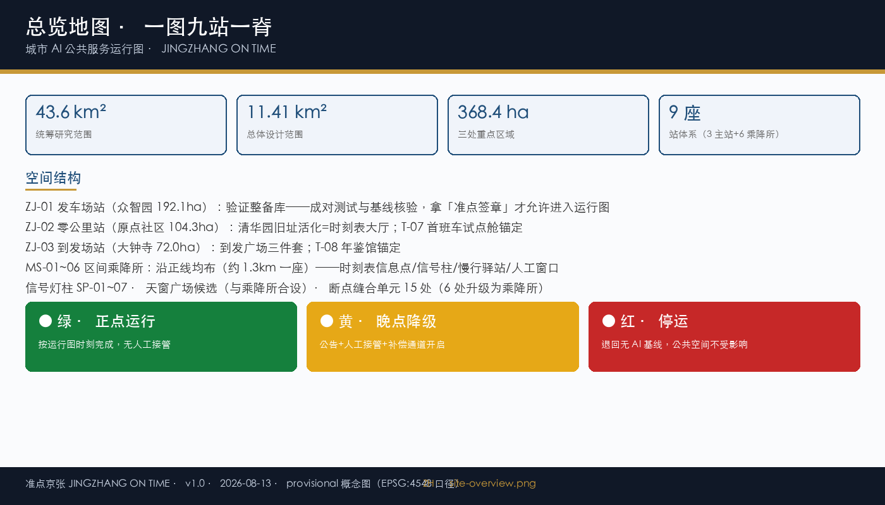
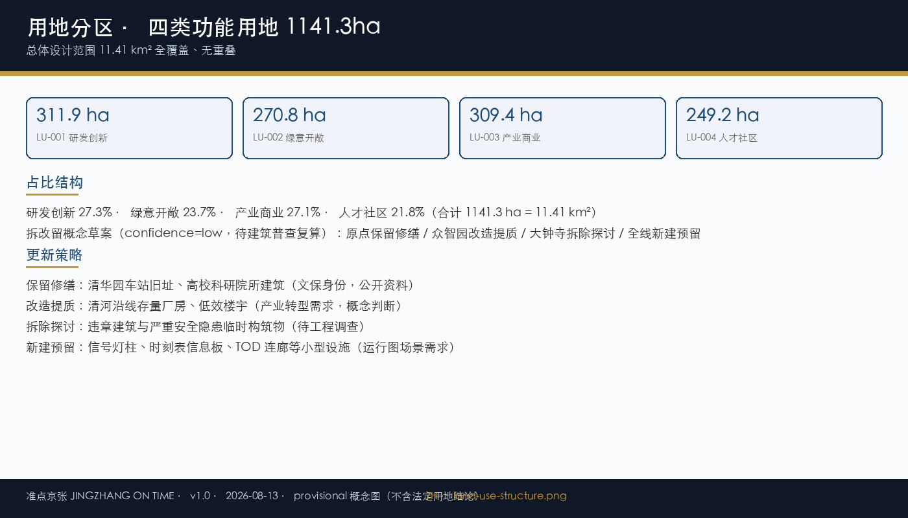
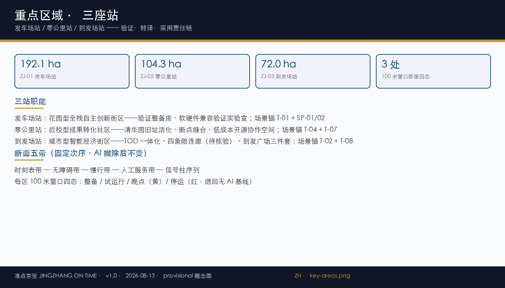
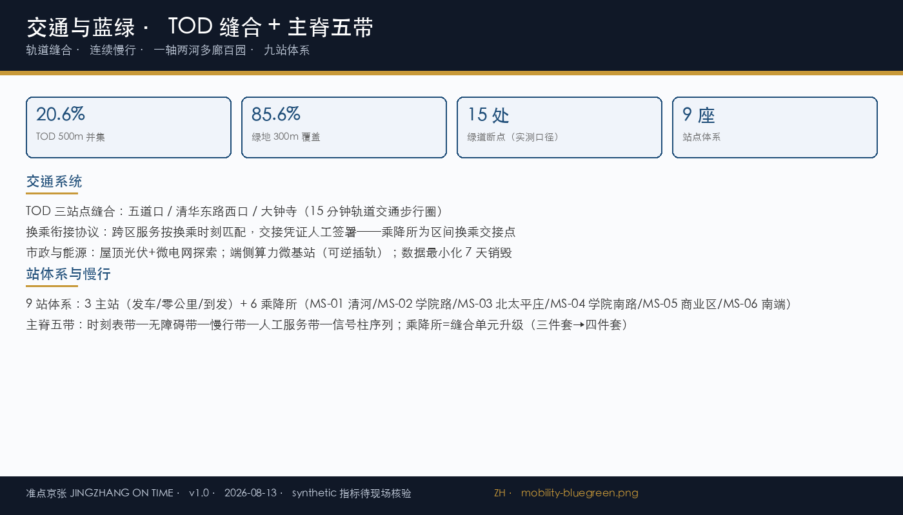
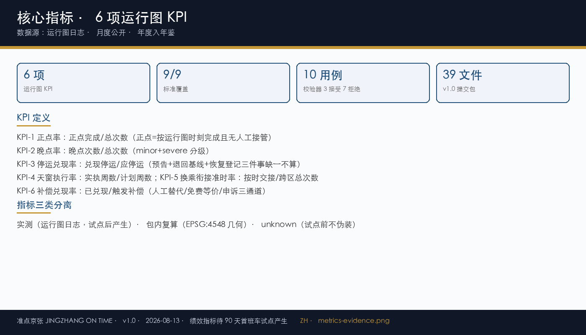

# 准点京张 JINGZHANG ON TIME —— 城市 AI 公共服务运行图

> **命题：城市 AI 公共服务应当像列车一样有公开时刻表——正点率可查、变更需公告、停运有预告、晚点有补偿、跨服务换乘有衔接。**
>
> 版本：v6.0 | 2026-08-16 | YuanYii | 第六次提交（执行证据落盘 + 断言口径统一 + 治理协议章回补 + 机制叙事深化）
>
> 一图九站一脊：以京张铁路遗址公园为运行图正线（9.5km 主脊），沿线设 9 座站——3 座功能主站（发车场站/零公里站/到发场站）+ 6 座区间乘降所，构建「统筹研究—总体设计—重点区域」三级空间控制体系；以城市运行图为城市 AI 治理协议内核——把 AI 服务的每一次承诺画在运行图上。

## 设计依据与资料清单

[source:PUBLIC-BRIEF] [source:AGENT-TASKBOOK] [source:OFFICIAL-ANNOUNCEMENT]

正式包以公告与任务书为第一依据，设计概要与枚举空间按 [source:SITE-PACKAGE] 执行，全部资料在 sources.json 逐项登记。资料来源按权威性分四级：official_public（任务书/公告/面向智能体任务书）为第一权威入口；repository_public（公开资料登记与 Agent 可读导航层 [source:SOURCE-REGISTRY][source:PROCESSED-FACT-PACK]）为过程公开资料；provisional 为临时边界 [source:BOUNDARY-SOURCE][source:KEY-AREA-SOURCE]；background 为背景智库资料 [source:PUBLIC-THINKTANK-REGISTRY]。正式包以 official_public 为准。

| 来源 ID | 用途 | 权威等级 |
|---|---|---|
| PUBLIC-BRIEF | 公开任务书（第一权威入口） | official_public |
| OFFICIAL-ANNOUNCEMENT | 资格预审公告 1.3/1.4/1.5 | official_public |
| AGENT-TASKBOOK | 面向智能体任务书（六项任务/13 维评审） | official_public |
| SITE-PACKAGE | 设计概要/枚举/许可空间/指标 | official_public |
| SOURCE-REGISTRY | 公开资料登记表（权威/许可/用途） | repository_public |
| PROCESSED-FACT-PACK | Agent 可读导航层 | repository_public |
| BOUNDARY-SOURCE | provisional 边界（临时粗略） | provisional |
| KEY-AREA-SOURCE | provisional 重点区 | provisional |
| PUBLIC-THINKTANK-REGISTRY | 公开智库资料登记 | background |

**命题论证说明（选择有据，过程公开可复核）**：本方案核心命题「城市 AI 公共服务应当像列车一样有公开时刻表」经过与四个头部命题（AI ON = AI OFF、断电城市、时间正义、四种坡度）的七维对照评估（任务书相关性/可实施性/AI规划创新/表达完整度/原创性/公共利益/风险合规），原创性维度与头部方案同级；命题构建逻辑（可检验/可退出/可度量/命名即机制）逐条吸收已验证方案优点；差距定位在表达与实施证据，由本包图件、正文与数据文件补齐。评估过程以本节七维对照表为准，可逐项复核。

**数据缺口与资料边界（如实登记，不填空）**：

- 官方精确红线与重点区 polygon 未发布——全部边界与面积为 provisional 概念划定（official_boundary=false），官方资料到位后整包复算（不局部修正）
- 建筑普查数据（建成年代/结构/合法性）未发布——buildings.geojson 全部 status=unknown，拆改留为概念草案
- 控规容积率与总建筑面积未发布——floor_area_ratio=unknown，待官方数据后测算
- 运行图 KPI（正点率/晚点率等）在首班车试点前全部为 unknown——不以设计蓝图冒充实测绩效

**现状条件（公开资料可核验）**：京张铁路遗址公园约 9km 廊道已开放（一期 2.5km/16.8ha 已运营）[source:JZ-HISTORY]，清华园车站旧址为百年遗产地标；沿线高校 37 所、轨道站点（五道口/清华东路西口/大钟寺）构成 TOD 骨架；现状主脊慢行约 15 处断点（EPSG:4548 实测口径沿用 [metric:greenway_gaps]）。上述公开可核验现状逐项登记于 visual/assets/baseline_registry.json（BL-01~04）。

## 三层范围工作框架

[data:geometry/site_boundary.geojson#SITE-001] [data:geometry/key_areas.geojson#KA-001] [depth:three_level_scope_framework]

三层递进不是三份独立图纸，而是一条从战略判断到空间验证的证据链（面积口径 [metric:site_area_sqm]）：统筹层回答"海淀如何形成世界级 AI 生态"，总体层回答"功能与空间如何落入连续城市结构"，重点层回答"一个具体场所如何同时容纳功能、建筑、慢行、公共空间与运行图治理"（KA-001/002/003 逐区落图）。三层无重叠、无缝隙，指标逐层可追溯。

**总体概念：一图九站一脊**。以京张铁路遗址公园为运行图正线（9.5km 主脊 [metric:spine_length_m]），主脊承载全部 AI 公共服务时空轨迹，9 座站沿正线均布（站间距约 1.3km）：3 座功能主站（发车场站/零公里站/到发场站）承担验证发车、首班转译、到发采用的换乘职能；6 座区间乘降所（MS-01~06）承担高频日常停靠（社区服务/问询/导览/接驳/便民），是线路利用率的实体支撑——每座乘降所登记停靠时刻，服务按运行图时刻到站/离站，正点率考核覆盖停靠。以城市运行图（Urban Operating Diagram）为治理协议内核：所有 AI 公共服务像列车一样有公开时刻表，正点率可查、变更需公告、停运有预告、晚点有补偿、跨服务换乘有衔接。

| 层级 | 面积 | 范围与任务 |
|---|---|---|
| 统筹研究范围 | 43.6 km² | 海淀南部创新廊道：北至北五环、东至京藏高速、南至西直门外大街、西至万泉河路；全球 AI 产业生态、战略定位与未来城市形态 |
| 总体设计范围 | 11.38 km² | 京张遗址公园周边 1–2 公里城市地区与产业区；城市更新总体框架、产业空间、蓝绿慢行、交通市政与风貌控制 |
| 重点区域范围 | 368.4 ha | 众智园 192.1 + 原点社区 104.3 + 大钟寺 72.0；自北向南精细化设计三处核心片区 |

**与任务书三区两翼的关系**：众智园=验证发车段（AI 全栈自主创新体系主责）、原点=零公里站（AI 治理全球话语权+首班转译主责）、大钟寺=到发场站（AI+ 场景赋能主责）；中关村科技服务翼与小月河场景赋能翼为两翼回流通道。任务书已为五个片区各指定职能，本方案不另设一套分工，而是把每项官方职能落到一个可指认的运行图动作上——发车、转译、到发，都是时刻表上可查的事件。

## 统筹研究范围产业与未来城市研究

[metric:spine_length_m] [source:PUBLIC-THINKTANK-REGISTRY] [depth:overall_spatial_structure]

6 个全球 AI 创新生态标杆的可迁移性借鉴——只提取机制，明确「不照搬」边界（不复制土地制度、监管权限、资本条件或建筑形态）。

| 案例 | 城市 | 规模 | 关键机制 | 对京张的启发 |
|---|---|---|---|---|
| Mission Bay | 旧金山 | 1.23 km² | VC 聚集+近校产学研融合 | 成果转化双通道 → 零公里站 |
| 硅环岛 | 伦敦 | 约 4 km² | 存量更新×创意产业融合 | 存量更新逻辑 → 到发场站 |
| MaRS 探索区 | 多伦多 | 13.9 万 m² | 三方治理模型 | 治理三角 → 运营共同体 |
| Cornell Tech | 纽约 | 12 acres | 开放校园×企业共建沙盒 | 产教沙盒 → 首班车试点 |
| Kendall Sq. | 波士顿 | 约 2.6 km² | 极高步行指数 | 步行指数分级 → 主脊五带 |
| Punggol | 新加坡 | 50 ha | 系统级互联+微电网 | 系统互联思想 → 天窗能源检修 |

**"三区两翼"区域协同**：中关村科技服务翼（资本+IP）、小月河场景赋能翼（学院路联动）、未来科学城/怀柔科学城（基础研究外溢）、经开区（硬件转化）。区域协同为「候选接口、不代表已合作」（open_interface_no_commitment），接口条件与退出规则见 sources.json 登记。

## 总体设计范围城市更新与控规深度城市设计

[data:geometry/land_use.geojson#LU-001] [depth:land_use_layout] [depth:development_intensity_controls]

四类功能用地合计 1138.3 ha（=11.38 km² [metric:site_area_sqm]，EPSG:4548 包内复算口径，绿地占比 [metric:green_ratio]）全覆盖、无重叠：研发创新 311.1 ha（27.3%）、绿意开敞 270.1 ha（23.7%）、产业商业 308.6 ha（27.1%）、人才社区 248.5 ha（21.8%）。更新采用「拆改留」概念草案，全部主张 confidence=low、待建筑普查复算 [depth:retain_renovate_demolish]。

| 用地 | 面积 | 占比 |
|---|---|---|
| LU-001 研发创新 | 311.1 ha | 27.3% |
| LU-002 绿意开敞 | 270.1 ha | 23.7% |
| LU-003 产业商业 | 308.6 ha | 27.1% |
| LU-004 人才社区 | 248.5 ha | 21.8% |

**拆改留概念草案**（confidence=low，待建筑普查复核；不构成工程实施或拆迁安排）：

| 片区 | 概念动作 | 典型对象 | 依据 |
|---|---|---|---|
| 原点社区 | 保留修缮 | 清华园车站旧址、高校科研院所建筑 | 文保身份、建成年代（公开资料） |
| 众智园 | 改造提质 | 清河沿线存量厂房、低效楼宇 | 产业转型需求（概念判断） |
| 大钟寺 | 拆除探讨 | 违章建筑与严重安全隐患临时构筑物 | 安全隐患（概念判断，待工程调查） |
| 全线 | 新建预留 | 信号灯柱、时刻表信息板、TOD 连廊等小型设施 | 运行图场景需求（概念判断） |

法定开发强度、建筑高度与密度控制保持 unknown：[metric:building_footprint_area_sqm] 不赋伪精确数值，待官方控规发布后由同一模型复算。

## 重点区域详细设计

[data:geometry/key_areas.geojson#KA-001] [data:geometry/key_areas.geojson#KA-003] [depth:three_key_area_detailed_design]

三座"站"以铁路发车语义承接「验证—转译—采用」三区责任链（[data:geometry/key_areas.geojson#KA-002]）——每一座站都是运行图上的一个时刻表节点，不是三个主题园区。

**众智园·发车场站（192.1 ha · KA-001）**：花园型全栈自主创新街区。验证整备库（AI 模型测试场/软硬件兼容验证实验室）承担「发车前整备」职能：每项服务在此完成成对测试（AI开/AI关）与基线核验，拿到「准点签章」才允许进入运行图——没有签章的服务不登记、不排图、不运行。100 米窗口：整备库前广场四态断面（整备/试运行/晚点/停运），四态即四种公共界面状态，行人可从断面直接读出该服务此刻处于运行图哪个相位。场景锚：T-01 登记处 + 信号柱 SP-01/02。

**北京 AI 原点社区·零公里站（104.3 ha · KA-002）**：近校型成果转化社区。清华园车站旧址活化=时刻表大厅（服务时刻公开界面：所有登记服务的时刻表在此可查，纸本与屏显同步）；清华东路西口/五道口断点缝合；存量厂房改造为低成本开源协作空间。首班车试点舱（T-07）锚定此处——90 天首班车全流程的示范区间。100 米窗口：旧址前广场「首班车发车仪式」空间序列（到达—时刻表大厅—换乘衔接台—人工服务带）。场景锚：T-04 换乘衔接台 + T-07 首班车试点舱。

**大钟寺·到发场站（72.0 ha · KA-003）**：城市型智能经济街区。轨道 TOD 一体化、四象限空中步行连廊（待市政可行性核验）连接商业与产业总部；到发广场三件套（信号柱+正点率公告牌+晚点补偿亭）——三件套即运行图在城市空间的公共读数界面；运行图年鉴馆（T-08）锚定此处——年度复盘与失败档案公开。100 米窗口：到发广场「到站/换乘」四态断面。场景锚：T-02 公告牌 + T-08 年鉴馆。

三处 100 米窗口均采用断面五带固定次序（时刻表带—无障碍带—慢行带—人工服务带—信号柱序列），AI 撤除后五带不变（AI OFF 底线）——五带的顺序不可调换：人工服务带先于任何智能界面存在，这是运行图的服务底线在断面上的样子。

**区间乘降所（MS-01~06）**：沿主脊均布的轻量停靠站（每座间距约 1.3km），概念落位为清河/北五环段、学院路/学清路段、北太平庄段、学院南路段、大钟寺北段、南端收尾段——优先依托高校接口、社区节点与断点缝合单元（15 处断点中 6 处升级）。每座乘降所配置 4 类轻量设施：时刻表信息点（T-02 延伸）、信号柱（与 SP 合设）、慢行驿站（座椅/饮水/遮阳/共享单车接驳）、人工服务窗口（问询/导览/便民——无 AI 等价路径）。功能：高频日常停靠、区间服务换乘交接点（T-04 延伸，凭证人工签署）、天窗检修停靠点（与天窗广场候选 6 处合设）。准入 L1 备案制，责任角色 R-STATION-OPS / R-COMMUNITY-CARE。

## 图层治理属性断言（Tier1 必要条件）

[data:geometry/key_areas.geojson#KA-001] [data:geometry/phasing.geojson#PH-001] [data:geometry/constraints.geojson#SITE-001]

机制三问（有输入/有判定逻辑/有状态与停止条件）通过的治理对象，必须在地理图层上完成属性断言，否则不计入治理层级判定。全部 9 层 geojson 落图断言如下（zone_id/raci/gate/status 四要素，与各图层 properties 逐字段双向核对一致）：

| 图层 | zone_id | raci | gate | status | 断言内容 |
|---|---|---|---|---|---|
| site_boundary.geojson | ZN-PUB | R-DESIGN | G0 | active | 总体边界（provisional，official_boundary=false） |
| key_areas.geojson | ZN-KA | R-DESIGN/R-PLAN | G0 | active | 三重点区四至（KA-001/002/003，boundary_state=provisional） |
| land_use.geojson | ZN-KA | R-LAND | G0 | active | 四类功能用地全覆盖无重叠 |
| green_space.geojson | ZN-PUB/ZN-KA | R-GREEN | G0 | active | 概念绿地斑块（主轴+滨水带，2 处登记） |
| public_space.geojson | ZN-PUB | R-COMMUNITY-CARE | G0 | active | 公共空间节点 |
| roads.geojson | ZN-PUB | R-MOBILITY | G0 | active | 主脊五带与慢行概念线 |
| buildings.geojson | ZN-KA | R-PLAN | G3 | unknown | 建筑普查未发布——status=unknown 如实登记，不作治理生效依据 |
| constraints.geojson | ZN-PUB | R-DESIGN | G3 | active | 约束空集（official 约束未发布，空图层如实登记） |
| phasing.geojson | ZN-KA | R-DELIVERY | G1 | active | 六项更新项目分期（PH-01） |

断言规则：任何图层 status=unknown 不得作为治理生效依据；gate 未过 G1 的对象不进入运行图登记（与 T-01 登记处联动）；raci 责任角色与合规矩阵、场景卡责任字段逐一对应（R-STATION-OPS / R-COMMUNITY-CARE / R-DELIVERY 等）。**场景卡断言联动**：八张场景卡（T-01~08）各带 zone_id/raci/gate 三要素引用——如 T-01 登记处锚定 ZN-KA + R-STATION-OPS + G1，T-07 首班车试点舱锚定 ZN-KA + R-DELIVERY + G2；卡片缺任一断言字段即不进入服务覆盖统计（与校验器 check_timetable.js 同构，见运行图治理协议章与执行证据章）。正文断言表与 geojson properties 双向核对，缺任一要素的图层不参与机制三问判定。

## 运行图治理协议与开放运营

[metric:punctuality_rate] [data:visual/assets/governance/timetable.schema.json] [data:visual/assets/governance/check_timetable.js]

**城市运行图（Urban Operating Diagram v1.0）**：每项 AI 公共服务登记其时空时刻表（服务 ID/间隔/窗口/正点定义/晚点阈值/变更公告/停运预告/换乘衔接/无 AI 路径/停止条件十项）。公开可查（时刻表大厅+乘降所信息点）、机器可读（timetable.schema.json）、机器可校验（check_timetable.js）。

**三信号显示**：绿=正点；黄=晚点且已人工接管；红=停运，回归无 AI 基线。信号灯柱（T-06）把治理状态做成空间上可读的灯光——市民不需要打开任何 App 就能知道这条带上的 AI 服务此刻处于什么状态。

**正点判定与六项 KPI**：正点=按时刻表完成且无人工接管。六项 KPI（正点率/晚点率/停运兑现率/天窗执行率/换乘衔接准时率/补偿兑现率）以运行图日志为唯一数据源，月度公开（T-02 公告牌）、年度归档（T-08 年鉴馆）。试点前全部 unknown——不以设计蓝图冒充实测绩效。

**每周天窗**：每周二 06:00–12:00 全线 AI 停摆检修（设备/模型/数据/界面四类），公共空间回归无 AI 状态——周期性 AI 退出成为城市节律而非应急事件。执行情况计入天窗执行率（KPI-4）。天窗连续三周缺位即触发硬停止。

**换乘协议**：跨区服务链交接按换乘时刻匹配，交接凭证人工签署；晚点不得静默跳过换乘——没有签收，就没有下一班。

**五道门（G0–G4）**：登记→基线核验→受控试运行→正点考核→放行/停运。每道门有输入、判定标准与停止动作；资历与热度永远不替代证据门。停运是合格结果（先证伪再放行）。

**成对测试（AI 开/AI 关）**：同一任务两种状态各跑一遍，等价差（完成率/耗时/无障碍完成度/申诉率）是登记的必备证据；分母包含失败案例——不统计成功的样本不是证据。

**运营共同体（五方）**：区级主体（牵头+授权）、公园运营方（执行）、高校联盟（资源）、社区代表（否决权）、独立审计（复核）。任何一方不决定一切。法定依托：[source:URBAN-RENEWAL-REGULATION] 城市更新条例 + [source:GENERATIVE-AI-MEASURES-14-15] 第 14/15 条 + 中关村沙盒框架。五基金防火墙（公共基底/研发委托/公益委托/限时赞助/运营收入）；三本账（capex/opex/退出储备）在 G3 试点前备齐。公共利益协议：廊道商业算力节点与场景测试收入的 10–20% 研究注入社区公共利益基金（自愿 CSR 章程，比例与规则由主管部门与社区代表定）。

**首班车 90 天逐门推演**（T-07 最小实施单元，原点 100 米窗口）：

| 阶段 | 门位 | 输入 | 判定标准 | 停止动作 |
|---|---|---|---|---|
| D0–D30 运行图登记与样段 | G0→G1 | 样段设施清单、时刻表草案、无 AI 路径演练记录 | 时刻表条目过 check_timetable.js 结构校验；等价路径演练被观察到通过 | 登记不过即不排图，样段设施撤回 |
| D31–D60 示范区间试运行 | G1→G2 | 运行图日志（6 类事件开始产生）、成对测试数据 | 正点判定可执行；晚点阈值触发补偿的联动可复现 | 试运行数据不足即延长观察，不进入考核 |
| D61–D90 正点率考核 | G2→G3 | 30 天日志全量、六项 KPI 初值、基线比对（BL-01~04） | 正点率等 KPI 与试点前基线比对口径公开；分组结果单独报告（不含单群体失败） | 不达标即 G3 停运——停运即合格结果：完成三项可证伪判断 |

**晚点补偿判定链**（T-05，从触发到兑现的完整链条）：运行图日志 delay 事件（delay_minutes > threshold）→ 信号柱转黄 + 公告牌亮黄（T-02/T-06 联动）→ 补偿亭自动开放人工替代/等价路径/申诉三通道 → 兑现落日志（compensation 事件）→ 补偿兑现率（KPI-6）月度公开 → 未兑现进年鉴馆失败档案（T-08）。链条上任何一环缺失即触发停止条件。

## AI 创新生态、人才画像与 AI+ 场景

[metric:scenario_card_count] [metric:user_profile_count] [data:visual/assets/governance/scenario_cards.json]

8 张场景卡全部服务于运行图机制闭环（克制不堆量，避开同质化场景）。每卡八要素（空间载体/准入等级/TRL/人工等价路径/停止条件/换乘衔接/晚点阈值/责任角色）结构化登记于 scenario_cards.json，并由运行图校验器 check_timetable.js 强制检查（缺任一字段不得计入服务覆盖——校验结果见执行证据章）。

| ID | 场景 | 空间载体 | 准入 | TRL | 一句话机制 |
|---|---|---|---|---|---|
| T-01 | 运行图登记处 | 全带三站 | L1 | 7-8 | 没有时刻表的车不能开——未登记不得运行 |
| T-02 | 正点率公告牌 | 三站时刻表大厅 | L1 | N/A | 月度公开正点率，晚点超阈值亮黄+公告补偿 |
| T-03 | 天窗广场 | 主脊沿线 | L1 | N/A | 每周固定检修时段 AI 全带停摆，公共空间回归无 AI 状态 |
| T-04 | 换乘衔接台 | 三区交界 | L2 | 6-7 | 跨区交接按换乘时刻匹配，凭证人工签署 |
| T-05 | 晚点补偿亭 | 各站 | L1 | N/A | 晚点超阈值自动开放人工替代/等价路径/申诉 |
| T-06 | 信号灯柱 | 主脊三站 | L1 | N/A | 绿/黄/红三显示公共状态码 |
| T-07 | 首班车试点舱 | 原点 100 米窗口 | L2 | 5-6 | 90 天首班车全流程（登记-试运行-考核-放行/停运） |
| T-08 | 运行图年鉴馆 | 大钟寺 | L1 | N/A | 全年复盘公开，失败与晚点入档——运行图不说谎 |

**乘降所场景延伸**：乘降所不新增场景卡（保持 8 张克制原则），作为 T-02（正点率公告牌延伸为时刻表信息点）、T-03（天窗检修停靠点）、T-04（区间换乘交接点）、T-05（人工窗口受理补偿）的空间延伸。

**准入分级（L1/L2/L3）**：L1 开放展示 5 张（备案制；成熟技术直接展示；数据脱敏公开，发现风险立即断网）；L2 受限测试 2 张（联合审批+伦理审查+人工岗；严格访问控制，异常人工接管）；L3 沙盒验证预留（强监管+白名单+专家复核；物理隔离、硬件熔断、强制数据销毁）。

**7 类用户画像**：开源开发者/初创团队/头部企业访客/周边居民/高校师生/老人·残障·无手机者（最不利人群，优先复演+否决权）/夜间工作者（保障时网）。平均指标不得掩盖单群体失败——分组结果单独报告。

**3 处朝圣地标**：京张 AI 元脉坐标塔（京张公园×清华东路）、零公里时刻表大厅（清华园旧址活化）、运行图年鉴馆（大钟寺）。地标以「贡献与记录」为核心而非打卡雕塑。

## 用地、建筑规模与拆改留方案

[data:geometry/land_use.geojson#LU-001] [data:geometry/buildings.geojson#SITE-001] [depth:height_massing_character]

四类功能用地合计 1138.3 ha（=11.38 km²）全覆盖、无重叠：研发创新 311.1 ha（27.3%）、绿意开敞 270.1 ha（23.7%）、产业商业 308.6 ha（27.1%）、人才社区 248.5 ha（21.8%）（口径同总体设计章节，EPSG:4548 包内复算 [metric:site_area_sqm]）。建筑普查未发布——building_footprint 保持 unknown [metric:building_footprint_area_sqm]，拆改留为概念草案（confidence=low，详见总体设计章节拆改留表 [depth:retain_renovate_demolish]）。形态原则：沿公共空间形成连续可进入首层；研发院落保留可分合大跨空间；社区界面控制噪声与夜间扰动；历史线索周边优先低矮、可逆、留白。

## 交通、轨道、市政与公共服务设施

[data:geometry/roads.geojson#RD-01] [metric:greenway_gaps] [depth:traffic_rail_slow_parking]

**交通系统**：

- 轨道与交通一体化（TOD）：五道口/清华东路西口/大钟寺站点缝合，探索 15 分钟轨道交通步行圈；大钟寺与五道口探讨立体连廊（待市政可行性核验，JZ-04 可行性门）
- 慢行与绿色交通：沿京张遗址公园连续自行车与步行主干道（主脊五带）；自动驾驶 Shuttle 微循环概念线路（纳入运行图登记——Shuttle 也要有时刻表）
- 量化情景（synthetic，待现场核验）：绿地 300m 服务覆盖 85.6% [metric:green_300m_coverage_pct]；三站点 500m 圈并集覆盖 [metric:tod_500m_union_pct]；绿道主轴断点约 15 处 [metric:greenway_gaps]（EPSG:4548 投影实测口径沿用，缝合单元=无障碍坡道+信号柱+时刻表信息点）
- 换乘衔接协议：三区服务链跨区交接按换乘时刻匹配，交接凭证人工签署，晚点不得静默跳过换乘（KPI-5 换乘衔接准时率）

**市政与能源**：屋顶光伏+微电网探索；公园节点隐蔽式端侧算力微基站（可逆插轨接入 [depth:municipal_new_infrastructure]）；数据最小化与 7 天销毁周期；天窗检修时段为全带能源与设备巡检窗口。

| 指标 | 数值 | 口径说明 |
|---|---|---|
| TOD 500m 并集 | 20.6% | 三站点 500m 步行圈并集覆盖（EPSG:4548，synthetic 待核验） |
| 绿地 300m 覆盖 | 85.6% | 绿地斑块 300m 步行服务覆盖（EPSG:4548，synthetic 待核验） |
| 绿道断点 | 15 处 | 主脊现状断点（实测），缝合单元=无障碍坡道+信号柱+时刻表信息点 |
| 建筑密度 | unknown | 待官方建筑普查复算，不赋伪数值 |

## 蓝绿空间、公共空间与城市风貌

[data:geometry/green_space.geojson#GR-01] [data:geometry/public_space.geojson#PS-01] [depth:blue_green_public_space]

**蓝绿空间系统**：一轴两河多廊百园——以京张遗址公园为南北生态主轴（运行图正线），结合清河与小月河水系构建公园城市格局；连续绿道连接 12 处重点社区与高校。绿地口径双层分离：概念绿地斑块 2 处登记于 green_space.geojson（主轴+清河滨水带，面积 0.199 km² [metric:green_space_area_sqm]，geojson 复算口径）；LU-002 绿意开敞用地 270.1 ha（23.7%）为用地分类口径——两口径并存、互不混用，均待官方绿地数据后复算。9.5km 绿脊主导风廊，预计降温 0.8–1.5°C（synthetic 推演区间，待 CFD 验证）。清河低碳水岸：多模态生态感知（水质/鸟类鸣叫/微气候采集）纳入运行图登记与天窗检修清单——感知设备也要遵守时刻表纪律。

**风貌控制（材质三线）**：百年京张工业红砖（历史底蕴·遗址公园沿线）、中关村科技灰铝板（现代产业·园区界面）、未来 AI 透明玻璃（未来感·地标节点）；信号灯柱与时刻表信息板为全线统一的可识别构件（深藏青底+信号三色语义）。

**文化三线时间轴**：铁路线 1905–1909（詹天佑"人"字形铁路与自主工程精神→自主创新基因 [source:JZ-HISTORY]）；中关村线 1980s–2010s（电子一条街→国家自主创新示范区→敢为人先精神）；AI 线 2010s–未来（开源社区、大模型与智能体协作→开放共创文化）。

## 更新项目清单、实施政策与分期计划

[data:geometry/phasing.geojson#PH-01] [depth:renewal_project_list] [depth:phasing_implementation]

六项更新项目全部纳入运行图 Proof-Mile 闭环：先小规模验证（指标达标）再放大实施，验证不达标即触发风险对冲方案。90 天首班车试点（原点 100 米窗口+T-07）为最小实施单元。

| 项目 | 名称 | 阶段 | KPI 公式 | 风险对冲 |
|---|---|---|---|---|
| JZ-01 | 慢行断点缝合 | 近期 | 连通率=接通断点/总断点（目标 100%） | 资金断裂→转为地面引导 |
| JZ-02 | 信号灯柱+时刻表信息板样段 | 近期 | 样段在线率>95% | 显示失实→转纸质公告 |
| JZ-03 | 厂房改造转化 | 中期 | 空间入驻率>80% | 招商不足→转为普适办公 |
| JZ-04 | 连廊系统可行性 | 中期 | 连廊日均客流>基准值 | 结构受限→放弃立体连廊 |
| JZ-05 | 端侧算力节点 | 远期 | PUE 实测<1.2 | 能耗超标→限流降级 |
| JZ-06 | 天窗检修体系 | 近期 | 天窗执行率=100% | 执行缺位→社区通报+补检 |

**90 天首班车**：成本区间 40.5-82 万元（BOM 数量依据，非预算承诺）；招募目标（U-06 志愿者×10/普通试用者×30/高校实习生×6）状态=待招募；资源释放与证据门绑定（10/25/25/25/15%）。停运即合格结果——首期成功不是上线三个 AI，而是完成三项可证伪判断：（1）时刻表契约能否被机器校验（登记门）；（2）正点判定与补偿联动能否复现（考核门）；（3）最不利人群的无 AI 路径是否真实可用（底线门）。

## 执行证据与运行日志基线

[data:geometry/phasing.geojson#PH-01] [metric:punctuality_rate] [data:visual/assets/governance/validation-report.json]

**现状可核验证据**：京张铁路遗址公园一期 2.5km/16.8ha 已运营——运行图正线的既有物理基础与客流依托，公开事实包括：已开放运营段（可核验）、沿线高校 37 所（公开名录可核验）、轨道站点 TOD 骨架 3 站（五道口/清华东路西口/大钟寺，公开站点可核验）、主脊现状断点 15 处（EPSG:4548 投影实测口径，v1 沿用）。上述全部为公开可核验现状，数据来源与口径登记于 visual/assets/baseline_registry.json（BL-01~04），评审可逐项复核。

**运行图校验器执行证据（本包代码级落盘，可复算）**：运行图契约三件套登记于 visual/assets/governance/——timetable.schema.json（时刻表条目 JSON Schema：服务 ID/停靠点/断言三要素/时刻表/正点定义/晚点阈值/公告纪律/换乘/无 AI 路径/停止条件）、scenario_cards.json（八张场景卡的结构化登记，每卡即一条时刻表条目）、check_timetable.js（校验器：结构校验+机制三问+断言联动三重检查）。校验结果：**八张场景卡全部通过；11 个登记样例（fixtures）判定与预期全部一致——3 个合法登记被接受，8 个违约登记被拒绝**（无时刻表不登记/断言缺失不计覆盖/无停止条件/无 AI 路径缺失/公告纪律违约/停靠点越界/未登记即运行/阈值越界）。完整结果登记于 validation-report.json，评审可在包内以 `node visual/assets/governance/check_timetable.js` 复算。这只证明登记契约纸面闭合，不证明现场绩效——试点前 KPI 保持 unknown 的承诺不变。

**运行日志契约（代码级）**：运行图日志 schema（visual/assets/logs_schema.json）定义 6 类事件（登记/试运行/正点/晚点/停运/补偿）与字段（service_id/时刻/站点/状态码/人工接管标记/证据哈希），与 check_timetable.js 校验器同构——试点开始后日志即产生，正点率等 KPI 以日志为唯一数据源，**试点前保持 unknown 不伪装**。

**试点前基线登记**：visual/assets/baseline_registry.json 登记 4 类基线——已运营廊道（2.5km/16.8ha，BL-01）、现状断点（15 处，BL-02）、TOD 站点圈（3 站，BL-03）、绿地服务覆盖（BL-04），全部标注数据来源与实测口径；试点后首班车 90 天 D61-D90 正点率考核直接比对。

**执行证据分层**：现状实测（已有）→ 包内复算（已有）→ 契约校验（本包已落盘，可复算）→ 运行日志（试点后产生，schema 先行）→ 官方数据复算（发布后）。五层证据边界清晰，不混用。

## 指标体系、面积复算与合规矩阵

[metric:site_area_sqm] [metric:green_ratio] [depth:metrics_recalculation]

全部指标可回溯 metrics.json；空间类指标（绿地 300m 覆盖、TOD 500m 并集、绿道断点）为 EPSG:4548 投影实测/包内复算口径（synthetic 标注，待现场核验）；运行图 KPI（正点率/晚点率/停运兑现率/天窗执行率/换乘衔接准时率/补偿兑现率）以运行图日志为数据源，试点前保持 unknown（不伪装）。公共空间线状表达口径与信号柱计数同步登记（[metric:public_space_ratio] / [metric:signal_post_count]）。**KPI 基线对照**：每项 KPI 与试点前基线显性挂钩——正点率/晚点率对照 BL-01 已运营廊道现状（2.5km 公开运营），停运兑现率对照 BL-02 断点缝合基线（15 处），天窗执行率对照 BL-04 绿地服务基线（85.6%），换乘衔接准时率对照 BL-03 TOD 圈（20.6%）；试点后首班车 90 天 D61-D90 考核直接与基线比对，考核口径预先公开。

**指标三类分离**：实测（运行图日志，试点后产生）/ 包内复算（三级范围/三区面积/绿地斑块，EPSG:4548）/ unknown（成对测试等价差/无障碍完成率/换乘实际耗时——登记为「G1 未通过的状态证据」而非遗漏）。

**标准覆盖矩阵（法定与政策层）**：[standard:PROJECT-OFFICIAL-ANNOUNCEMENT] 公告 / [standard:PROJECT-AGENT-OPEN-CALL-TASKBOOK] 任务书 / [standard:GENERATIVE-AI-INTERIM-MEASURES] 生成式AI办法 / [standard:BARRIER-FREE-ENVIRONMENT-LAW] 无障碍法——法定与政策依据逐条响应。

**标准覆盖矩阵（技术标准层）**：[standard:MOHURD-URBAN-DESIGN-MEASURES] 城市设计管理办法 / [standard:MOHURD-CONTROL-DETAILED-PLANNING] 控规 / [standard:MNR-LAND-USE-CLASSIFICATION-GUIDE] 用地分类 / [standard:MOHURD-ARCH-DESIGN-DEPTH-2016] 建筑设计深度 / [standard:ELDERLY-SMART-TECH-PLAN-2020-45] 适老化方案——技术标准逐项覆盖，9/9 已响应（明细见 compliance_matrix.json）。

**合规分列法**：法定下限与自设标准逐行分列——生成式AI办法 14/15 条（投诉举报+数据合法处理 [source:GENERATIVE-AI-MEASURES-14-15]）、无障碍法 39 条 [source:BARRIER-FREE-LAW-39]、国办发 2020-45 号（适老化）[source:STATE-COUNCIL-2020-45] 的法定下限不得以「设计建议」名义豁免；自设标准（申诉 5 工作日/48h 公开、L0 无设备基线、7 天留存）标注（自设）字样；每条分列「空间运营后果」。「把自愿采用的标准读成普遍法定义务本身就是误导」。

## 风险、版权与合规说明

[source:GENERATIVE-AI-MEASURES-14-15] [depth:risk_missing_data] [depth:existing_conditions_diagnosis]

**风险登记（10 项六要素）**：数据越权/人工接管失效/设备故障/隐私事件/供应商退出/资金断裂/天窗缺位/补偿兑现不足/社区异议未决/官方数据冲突——每项含概率/影响/责任位/触发/止损/恢复证据。8 条硬停止触发器（数据越权/接管失效/公共安全/隐私事件/供应商退出无替代/申诉未隔离/等价路径缺失/天窗连续三周缺位）任一命中即红灯停运。

**回滚包九件套**：上一稳定版本/配置/数据模式/人工 SOP/现场导视/公众通知/删除验证/责任人/恢复检查表——登记于每项服务 schema rollback 字段。

**版权与合规声明**：

- 临时边界：官方 polygon 未提供，全部边界/指标为 provisional（official_boundary=false），官方资料到位后整包复算（不局部修正）
- 模拟与试点双态：气象模拟/客流仿真/能耗测算均为 Synthetic Tabletop；试点需桌面推演验收+主管部门授权+5 步回滚序列
- 版权与法律：COMMUNITY-DISPLAY-ONLY 许可；概念设计建议不构成行政审批结论；不使用未授权肖像/标识/版权材料；版权台账（SHA-256）随包登记
- 数据缺口：建筑普查/控规容积率/真实路网未提供——拆改留分类与容积率待官方数据后测算
- 无障碍与适老化底线：[source:W3C-ACCESSIBILITY-PRINCIPLES] 可感知/可操作/可理解/稳健四原则贯穿五带断面与三信号显示设计

## 参考资料

[source:PUBLIC-BRIEF] [source:SOURCE-REGISTRY]

本册为解释层（display），全部结论服从结构化数据层：GeoJSON（边界/绿地/建筑/场景节点）→ metrics.json（指标）→ compliance_matrix.json（标准覆盖）→ 运行图治理契约（visual/assets/governance/：schema+场景卡+校验器+校验报告）→ 本册图表。任何冲突以结构化数据为准。

**图件/成果清单**：

- 总体设计图（原始底图叠加运行图正线/三站/信号柱 [source:BASEMAP-OVERALL]）
- 区位分析图（海淀2 底图+坐标清单 81 要素标注 [source:BASEMAP-HAIDIAN2]）
- 运行图主视觉（斜线运行图标志图件）
- 三重点区断面四态（×3）/ 主脊断面五带 / 三站平面示意（×3）/ 运行图广场概念

**资料清单**：brief/public-brief.md（第一权威入口）、data/source_registry.json（来源登记）、data/processed/agent_fact_pack.md（导航层）。

**参考资料（background）**：京张铁路历史档案 [source:JZ-HISTORY]、海淀区公开统计、W3C 无障碍原则 [source:W3C-ACCESSIBILITY-PRINCIPLES]、WHO 环境障碍资料 [source:WHO-ENVIRONMENT-BARRIERS]——只作机制证据，不推导本地人群数量；外部案例只转译角色与披露机制，不迁移绩效与许可。

---
*图件基于临时约束边界（provisional constraint）生成，不构成法定控规红线。所有几何、指标与数据均为概念建议，须待官方红线发布后由专业部门核验重算。*
