# THE OPEN GATE LINE / 京张开门线

> One heritage line, twelve doors that open on schedule. The project begins with auditable, reversible public-sharing agreements—not demolition.

## Design Basis and Source List

The proposal is grounded in the official call, the agent taskbook, the site package, the source registry, and local standards snapshots [source:OFFICIAL-ANNOUNCEMENT] [source:AGENT-TASKBOOK] [source:SITE-PACKAGE]. Standard coverage for the two project documents is recorded separately [standard:PROJECT-OFFICIAL-ANNOUNCEMENT] [standard:PROJECT-AGENT-OPEN-CALL-TASKBOOK]. The package reports approximately 43.6 km² for coordinated research, 11.4 km² for overall design, and 368.4 ha across the three key areas. These values support concept comparison; they are not a cadastral or statutory survey. No organizer-issued precise polygon is present, so the submitted site and key-area geometries remain provisional study boundaries [source:BOUNDARY-SOURCE] [source:KEY-AREA-SOURCE] [data:geometry/site_boundary.geojson].

Approved plot-level FAR, height, density, green-ratio, setback, road-redline, ownership, utility-capacity, and fire constraints are unavailable. The proposal does not invent them and keeps FAR unknown pending official information [metric:floor_area_ratio] [depth:development_intensity_controls]. Mechanism references include one-north, STATION F, and Kendall Square [source:CASE-ONE-NORTH] [source:CASE-STATION-F] [source:CASE-KENDALL], plus Kalasatama, Seoul AI Hub, and MaRS [source:CASE-KALASATAMA] [source:CASE-SEOUL-AI-HUB] [source:CASE-MARS]. Their scales, outcomes, and governance are not asserted for Jing-Zhang.

This revision returns the proposal to documented urban context. Beijing's public planning material describes the Jing-Zhang Railway Heritage Park as an approximately 9 km, 70 ha continuous green corridor from Xizhimen to the North Fifth Ring, with nine urban streets and east-west walking links to be opened [source:JINGZHANG-PARK-PLAN-20240920]. A July 2026 public report records three new walking links in phase two and approximately 70 neighboring communities with 450,000 residents; these are dated public facts, not fieldwork by this team or proof that any proposed gate is open [source:JINGZHANG-PARK-PHASE2-20260730]. `osm-context-20260822.json` freezes 1,978 source features for railway, road, water, green, and station context within the provisional extent, with lines generalized at roughly 1–2 m tolerance for reproducible display. It answers only “what urban relationships surround the concept” and is excluded from redlines, land-use areas, building quantities, and performance calculations [source:OPENSTREETMAP-CONTEXT-20260822] [metric:osm_context_feature_count] [assumption:A-OSM-CONTEXT-001].

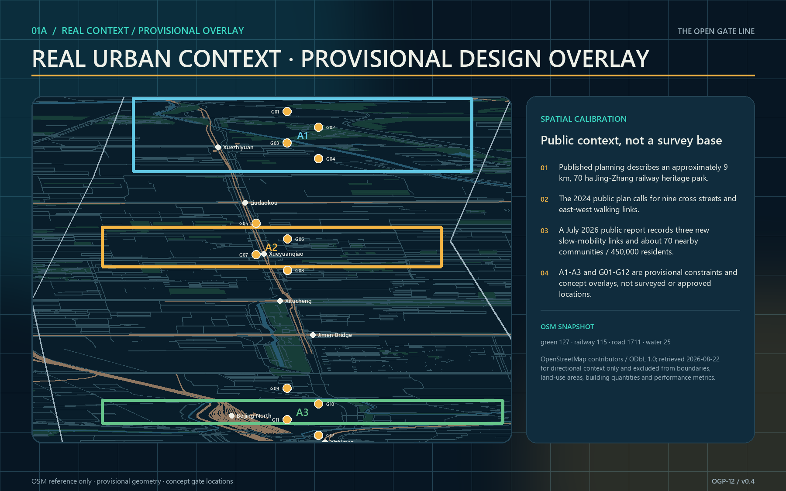

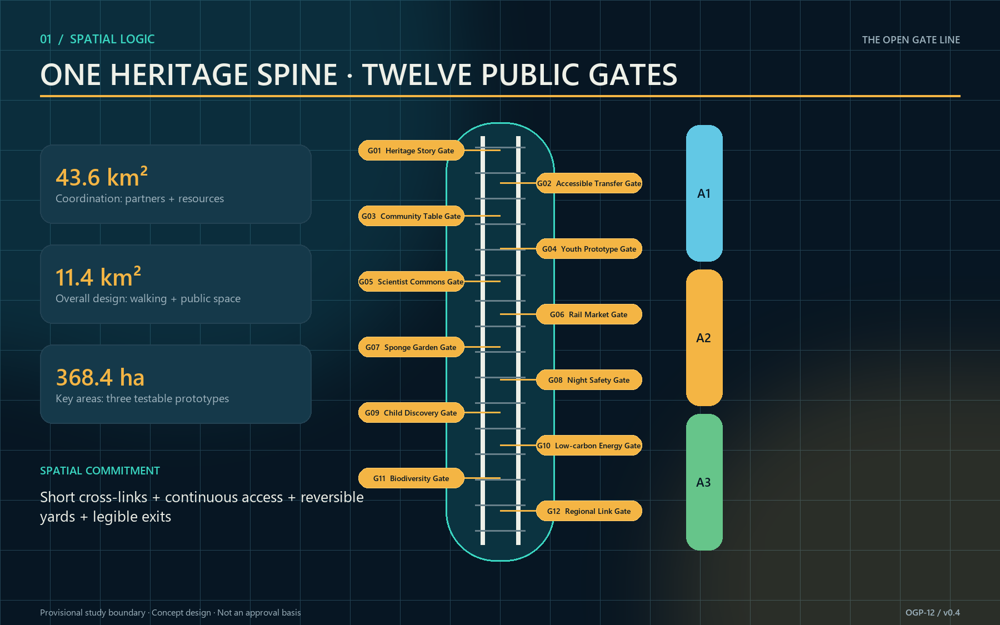

## Three-Level Scope Framework

One gate protocol links three scales while each answers a different question [depth:three_level_scope_framework]. The coordinated research area maps shareable capabilities among universities, firms, communities, rail heritage, and public services. The overall design area organizes a heritage-park walking spine, twelve shared-time gates, and blue-green public space. The three key areas turn spatial, operating, data, and safety conditions into testable prototypes. The object is not a continuous retail street, but a public-threshold system that opens at different times, for different users, under explicit permissions.

Each gate has four layers: a legible frame and accessible interface; reservation, arrival, and capacity information; on-site stewardship, inspection, and emergency closure; and quarterly public evaluation with an exit mechanism. Opening is never assumed. If ownership, fire, security, heritage, accessibility, insurance, or operating agreements are incomplete, the node stays in observation or closed status. Replacing the provisional boundaries regenerates every spatial layer and area metric while preserving the protocol structure [source:SOURCE-REGISTRY] [depth:risk_missing_data].

Acceptance at the research scale is a partner-resource-time catalog; at the overall scale, a continuous walking system, readable gate sequence, and coherent public realm; at the key-area scale, at least three field validations with stop conditions. The proposal scenario cards and metrics table jointly record twelve conceptual nodes, not existing ownership or permission to open [data:proposal.md] [metric:gate_count].

## Coordinated Research Area: Industry and Future City Research

The proposal translates the Agent taskbook into one inspectable framework. Its three positions are a **global window for AI-native innovation**, a **civic room where Jing-Zhang heritage meets Zhongguancun's innovation culture**, and a **testbed for verifiable, reversible and transferable urban AI**. Its five functions are origin display, technology service, scenario testing, public experience, and global collaboration. The three areas are the Collective-Intelligence Test Area, AI Origin Area, and Jing-Zhang Civic Culture Area; the two wings are the **Zhongguancun Tech-Service Wing** and **Xiaoyue River Scenario-Empowerment Wing**. OGP-12 is not another parallel slogan: it is the operating layer that crosses both wings and governs twelve public nodes [standard:PROJECT-AGENT-OPEN-CALL-TASKBOOK] [depth:urban_design_structure].

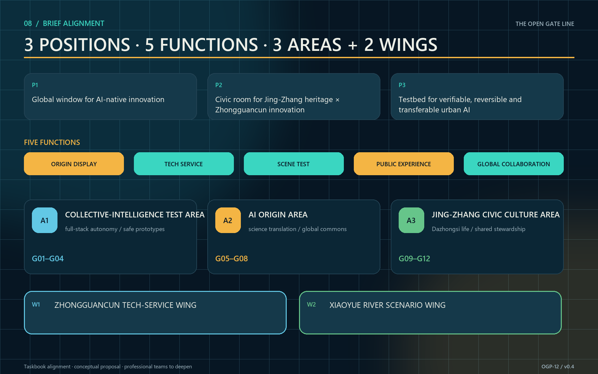

The identity combines twin rails, an open threshold, and a signal lamp into an original mark. Deep navy denotes the heritage base, amber means open, teal means staffed assistance, and red means pause. Every state also uses words and form, not color alone. The bilingual name, state symbols, wayfinding, accessible route, opening calendar, annual events, and honor markers share one grammar. The mark copies no historic component and borrows no institutional identity [depth:height_massing_character].

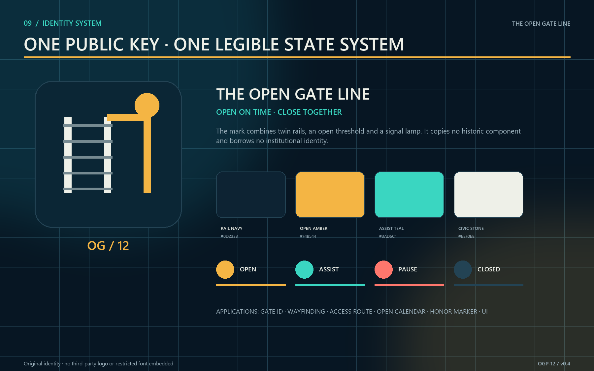

The industry strategy shifts from “build another park” to “make existing capacity visible, reachable, and cooperative at the right time.” Northern life-science and university assets, the central AI origin and innovation firms, and southern Dazhongsi cultural-commercial resources exchange through an opening calendar: controlled visits and validation of research facilities; two-way translation between community problems and startup services; and joint curation of culture and public markets [depth:industry_ecosystem]. The Zhongguancun Tech-Service Wing organizes technology services, talent, compute, data rights, and validation support. The Xiaoyue River Scenario Wing turns those capabilities into walkable, perceptible, and stoppable public tasks along the heritage park. Both are conceptual service networks, not confirmed institutions, investment, or new building programs.

Local translations of the six precedents are precise. one-north informs different programming for weekday evenings and weekends. STATION F informs a legible shared-service entrance. Kendall Square shows innovation carried by a public-space network rather than a single icon. Kalasatama informs resident participation in problem definition. Seoul AI Hub demonstrates staged education, enterprise, and research support. MaRS demonstrates continuity through partner networks. Jing-Zhang borrows only four light mechanisms—protocol, calendar, test, and review—not land regimes or investment levels.

After the cases, the ecosystem map checks a closed loop across eight resource classes: land, space, industry, funding, talent, compute, data, and scenarios. A node can enter Pilot only when site rights, public value, professional safety, operating responsibility, and an exit asset are all explicit. Unconfirmed companies or institutions are never drawn as committed partners; named actors enter only after public evidence or formal authorization [source:CASE-ONE-NORTH] [source:CASE-KALASATAMA] [source:CASE-SEOUL-AI-HUB].

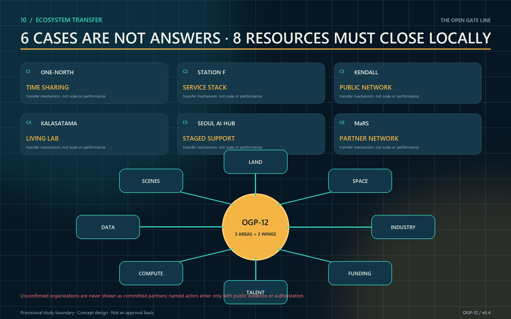

The structure is “one line, three areas, three yards, twelve gates, two wings.” The line is the Jing-Zhang Heritage Park threshold spine. The areas implement the taskbook layout. The yards are the Collective-Intelligence Test Gate Yard, AI Origin Translation Gate Yard, and Dazhongsi Commons Gate Yard. Four gates sit in each key area, while the wings supply technology services and continuous scenarios. Annual evaluation measures sharing agreements, accessible-task success, transparent cancellations and incident reporting, and joint resident-facility reviews rather than promised footfall or output [metric:scenario_node_count] [depth:urban_design_structure].

## Overall Design Area: Urban Renewal and Regulatory-Plan-Level Urban Design

The overall structure uses the provisional north-south heritage line as its spine and short east-west walking stitches as ribs. Four conceptual land-use zones—AI R&D, park/open space, industry services, and community support—organize the submitted geometry without constituting a land-use determination or rezoning recommendation [data:geometry/land_use.geojson] [standard:MNR-LAND-USE-CLASSIFICATION-GUIDE]. Under the project's August 2026 corrected enumeration, “innovation service and shared support” now uses `0904`, other commercial-service land, rather than `05`, which denotes wetland. This correction preserves machine-readable semantics and does not imply approved rezoning. Renewal follows retain, share, lightly adapt, and only then build: activate ground floors, courtyards, links, and residual spaces before adding floor area.

Three spatial gate types are used. Courtyard gates suit contained tests, classes, and repair. Corridor gates connect walking, interpretation, and public service. Hall gates host reception, civic questions, and international exchange. Every type provides a two-sided status signal, step-free approach, sheltered waiting, lighting, and emergency closure. Removable construction keeps a pilot from becoming permanent occupation. Height, massing, and character respect heritage scale and park permeability; exact controls await statutory and professional review [depth:height_massing_character].

Regulatory-plan-level depth is expressed as a conditions table, not false precision. Before design development, each node checks ownership, heritage, fire and egress, utilities, noise, licenses, cybersecurity, personal information, and accessibility. Every unresolved item names an owner, missing evidence, and decision date. GeoJSON, metrics, figures, and reports share one evidence chain and can be recalculated when official boundaries arrive [metric:site_area_sqm] [metric:green_ratio] [metric:public_space_ratio]. Recalculation depth is audited separately [depth:metrics_recalculation].

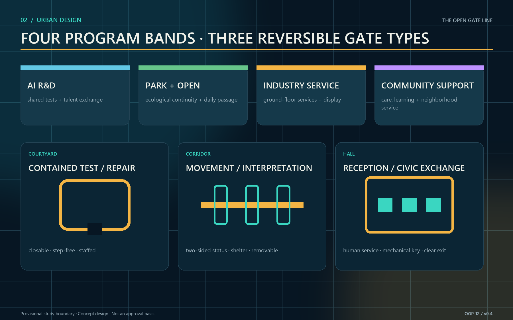

## Detailed Design of Key Areas

Zhongzhiyuan contains G01 Heritage Story, G02 Accessible Transfer, G03 Community Table, and G04 Youth Prototype, forming the Test Gate Yard. Closable yards, equipment lockers, observation seating, continuous ramps, and legible retreat routes support TVS-01, a task-chain test from station to gate covering step-free arrival, recognition, assistance, and exit. Any safety incident or mismatch between the route graph and the site stops the test. No facility or institution is represented as having agreed to open [assumption:A-GATE-APPROVAL-001].

AI Origin contains G05 Scientist Commons, G06 Rail Market, G07 Sponge Garden, and G08 Night Safety, forming the Translation Gate Yard. One side converts research, enterprise, care, climate, and night-travel needs into verifiable tasks; the other translates model capability, limits, and data responsibility into public language. TVS-02 runs four weeks in shadow mode, comparing AI time-slot advice with public rotation and walk-in quotas. Unexplained group-allocation gaps or loss of the walk-in quota stops the test. Any system requiring biometrics as the default passage method is rejected.

Dazhongsi contains G09 Child Discovery, G10 Low-carbon Energy, G11 Biodiversity, and G12 Regional Link, forming the Commons Gate Yard. Nature play, an energy viewing window, seasonal habitat refuges, and an open-results wall support daily learning and regional exchange. TVS-03 combines a rainfall-sensor outage with a night-lighting fault; failure to take over manually within five minutes or maintain a continuous safe route stops the drill. The landmarks are G05 Gate Zero, G09 Open Gate Clock, and the corridor Commons Signal Towers. They show shared status and care without monumental excess [depth:three_key_area_detailed_design].

Three representative nodes are developed at human scale. G05 Origin Gate uses a semi-outdoor commons, bilingual information plane, and visible staffed desk as an international arrival interface. G07 Gauge Gate combines a rain garden, manual gauge, overflow route, and sheltered waiting as a climate-learning node. G09 Commons Bell combines nature play, caregiver sightlines, touchable railway elements, and annual honor records as a civic-memory node. All three retain continuous step-free passage, shelter, seated waiting, mechanical keys, fixed signs, and a visible exit. Every illustrated dimension remains a conceptual control value requiring site survey and specialist fire, heritage, structural, and accessibility design; it is neither a construction drawing nor an engineering-feasibility conclusion [depth:three_key_area_detailed_design] [assumption:A-GATE-APPROVAL-001].

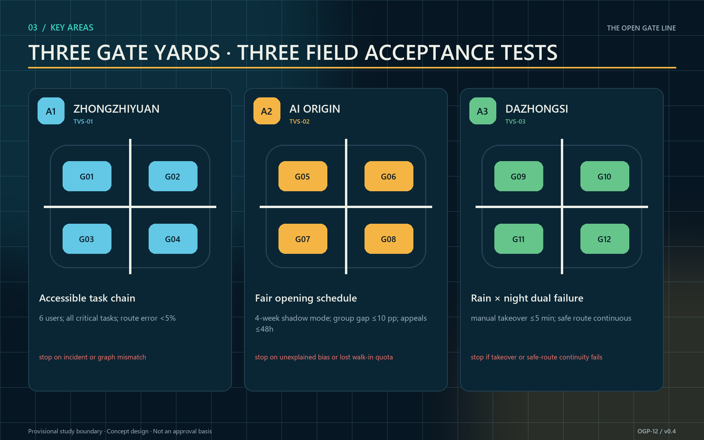

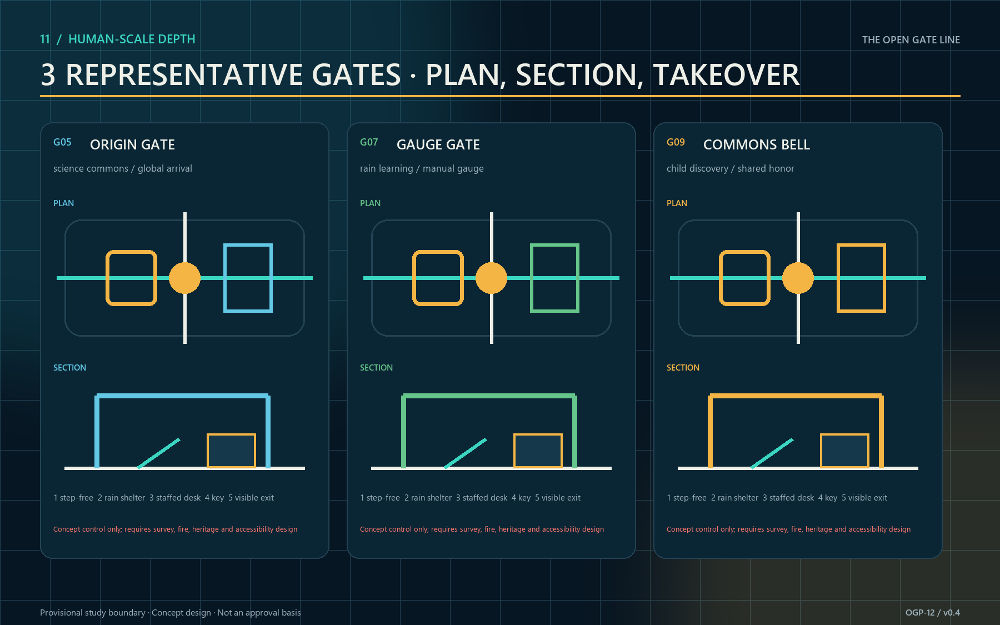

### A spatial decision capable of rejecting its own design

G05 no longer moves from a single form directly into design development. The same task, users, and conceptual conditions generate three 1:1 prototype options, then face five hard gates: at least 1.8 m of ordinary equipment-free passage; no prototype bay inside that public route; one staff position seeing both entry and exit; no more than 25 m from the farthest emergency stop to staff; and reversible components with an independent removal route [data:visual/assets/spatial-decision.json] [metric:spatial_alternative_count] [assumption:A-PROTOTYPE-DIMENSIONS-001].

ALT-A, the central spanning gate, fails ordinary passage, non-occupation, and independent removal and is rejected. ALT-B, the split twin bay, preserves passage but loses staff sightlines and places its farthest emergency stop 31 m away, so it is returned for revision. ALT-C, the sidecar gate, keeps a 2.4 m equipment-free route beside its staffed desk, prototype bay, and removal route; it passes all five gates and advances only to professional development—not construction approval [metric:rejected_spatial_alternative_count] [metric:revised_spatial_alternative_count] [metric:advanced_spatial_alternative_count]. The deterministic result is one rejected, one revised, and one advanced option; field results remain zero [metric:field_verification_result_count].

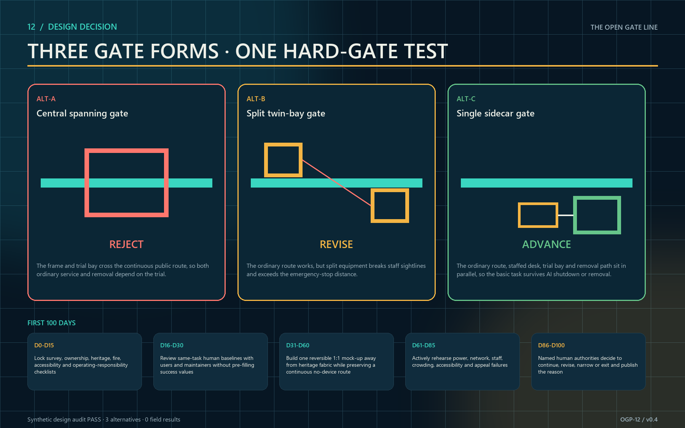

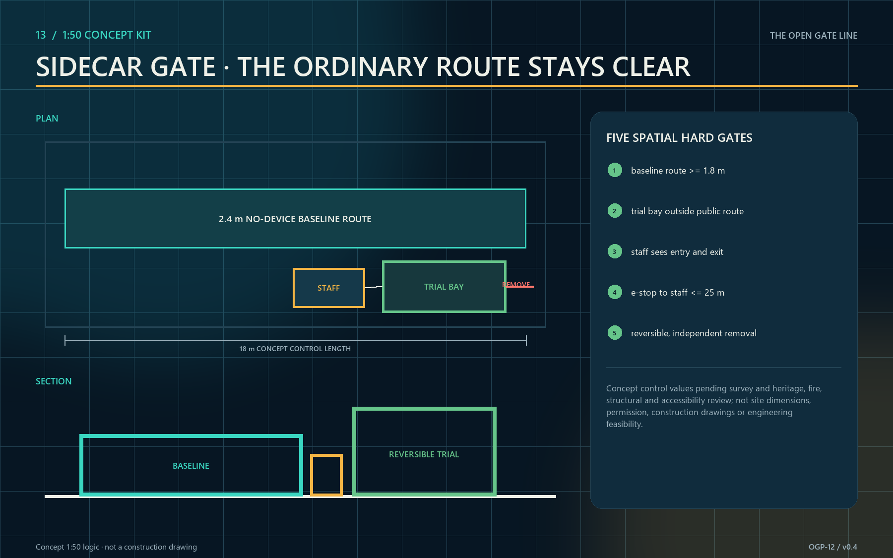

## AI Innovation Ecosystem, Personas, and AI+ Scenarios

Five primary personas guide the design: researcher Lin needs safe, reproducible real-world settings; caregiver Zhou uses evening and weekend services with a child; mobility-limited Mr. Chen needs step-free access, seated waiting, and human help; entrepreneur and international visitor Maya needs bilingual rules, temporary display, and partnership entry; steward Han manages keys, energy, cleaning, insurance, and closure. Each gate card records both user value and operator burden, preventing a district designed only for “innovators” [depth:personas_scenarios].

### OGP-12: From “smart nodes” to a public operating protocol

This revision turns the twelve scenarios into the machine-readable OGP-12 Open Gate Protocol in `visual/assets/gate-protocol.json` [data:visual/assets/gate-protocol.json] [metric:gate_protocol_record_count]. It differs from a generic smart-district platform in three ways. Space is not a sensor container; it locates each algorithm's safety boundary, human takeover point, and recovery asset. Algorithms do not build a unified profile or optimize the whole district; each performs one authorized public task. Finally, the protocol begins closed: if data, stewardship, accessibility, or safety conditions fail, service does not advance and can pause or roll back. The twelve gates address heritage stories, accessible transfer, community tables, youth prototyping, scientist exchange, an inclusive rail market, sponge landscapes, night safety, child discovery, low-carbon energy, biodiversity, and regional collaboration.

The state machine is Closed → Observe → Pilot → Open, with Pause and Rollback reachable from every operating state. AI may advise whether conditions appear ready, but only the named human authority may advance a gate to Pilot or Open. Six non-negotiables apply: no biometric identification, no individual credit scoring, no automated admission denial, no export of raw personal trajectories, an accessible manual service at all times, and a public log and appeal channel [assumption:A-DATA-001]. The deterministic audit requires 100% coverage of human authority, manual fallback, and minimum data [metric:human_authority_coverage] [metric:manual_fallback_coverage] [metric:data_minimization_coverage]. Binary start gates, stop triggers, accountability, and exit assets must also be complete for every gate [metric:binary_start_gate_coverage].

Each pilot must also run beside a same-staff, same-place, same-hours no-AI baseline. Fixed signs, paper quotas, human rosters, and mechanical keys first provide an independently operable public service. AI remains for the next round only if it reduces waiting, missed incidents, or repeated work without reducing safety, equity, or accessibility. If it adds no net public value, the spatial improvement and staffed service remain while the model is removed; basic passage is never withdrawn.

| Gate | Public task | Bounded AI role | Minimum data | Human authority / no-AI fallback | Critical stop trigger |
|---|---|---|---|---|---|
| G01 Heritage Story | Bilingual, accessible rail memory | Cluster questions; assist drafting | Anonymous tags, reviewed archive index | Curator / printed route and staffed story desk | Unfixed factual error; rights dispute |
| G02 Accessible Transfer | Continuous station-to-gate journey | Suggest accessible routes and flag obstacles | Audited path graph, obstacle and lift status | Transport duty manager / signs and staff | Graph mismatch; no lift alternative; unsafe crowding |
| G03 Community Table | Shared meals with walk-in access | Forecast demand and advise slots | Aggregated reservations, weather, capacity rule | Community manager / paper booking and quota | Food safety; walk-in quota breached |
| G04 Youth Prototype | A safe open workshop | Match projects; assist safety checklist | Public briefs, declared skills, approved rules | Safety officer / noticeboard and manual review | Near miss; unapproved equipment; absent officer |
| G05 Scientist Commons | Two-way public research translation | Cluster questions; summarize sessions | Consented questions, public profile, agenda | Forum editor / moderator and minutes | Consent withdrawal; sensitive disclosure |
| G06 Rail Market | Fair rotation for small vendors | Recommend stall rotation and demand | Vendor category, public rotation, aggregated footfall | Market committee / public lottery and cash lane | Allocation bias; exclusion; vendor quota failure |
| G07 Sponge Garden | Visible and teachable stormwater care | Rain alerts; prioritize maintenance | Public weather, water band, work-order status | Drainage duty officer / gauge and inspection | Red water level; sensor/manual mismatch |
| G08 Night Safety | Continuous light and staffed help | Flag equipment and aggregate waits | Non-imaging light, help-point, wait bands | Park safety manager / fixed timing and patrol | Dark segment; help-point failure |
| G09 Child Discovery | Nature play without child tracking | Suggest activities by selected age band | Chosen age band, weather, equipment status | Facilitator / printed activity cards | Equipment failure; child tracking detected |
| G10 Low-carbon Energy | Legible operating energy | Explain anomalies; advise scenarios | Aggregated energy, weather band, equipment status | Certified energy manager / meter review | Meter drift; tenant data exposure |
| G11 Biodiversity | Citizen science without sensitive locations | Assist identification; flag maintenance | Expert index, coarse cell, maintenance plan | Ecology panel / expert field log | Sensitive location exposed; habitat disturbance |
| G12 Regional Link | Publish public needs and open outcomes | Match projects; index outcomes | Public need, capability tags, approved records | Regional board / quarterly open call | Exclusive access; data-rights dispute |

### Four model cards and three reproducible field tests

OGP-12 permits only four narrow model classes: demand-and-wait advice, accessible-route advice, public-question clustering, and incident-or-energy review. Every model card identifies users, prohibited uses, input fields, interpretable output, human approval, shadow mode, drift checks, shutdown, and deletion. None may expand into identity recognition, individual risk scoring, or automated admission. Data stays within the task boundary and favors bands, aggregates, and reviewed indexes; no real personal data is connected before an authorized pilot.

TVS-01 recruits six people with varied mobility and counterbalances manual versus AI route advice; all critical tasks must succeed and the advice error rate must stay below 5%. TVS-02 runs four weeks in shadow mode; any group allocation gap above ten percentage points or appeal unresolved after 48 hours fails the test. TVS-03 simulates lost rain sensors and a lighting fault; manual takeover must occur within five minutes while the safe route stays continuous. These are acceptance rules for a future approved pilot, not claimed measured results [metric:test_scenario_count].

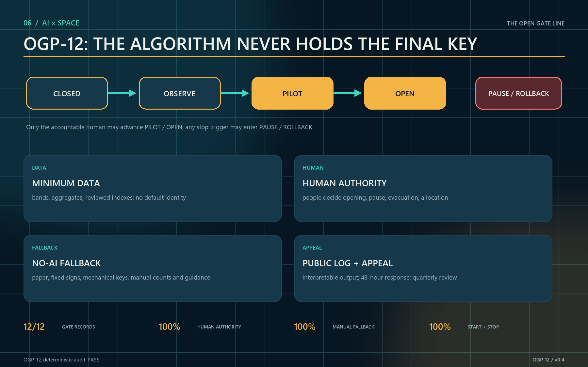

## Land Use, Building Scale, and Retain-Renovate-Demolish Strategy

Four continuous conceptual zones stitch R&D, park, industry, and community functions. The layer verifies topology and spatial logic, not legal classification. Building action prioritizes reversible ground-floor work. Retain buildings with usable structure, cultural cues, or current value. Renovate closed but serviceable edges through doors, shelter, accessibility, and limited MEP changes. Consider removal only after professional surveys confirm unsafe structures, critical public-safety obstruction, or no repair value [depth:retain_renovate_demolish].

The current `buildings.geojson` is a conceptual base whose measured footprint is approximately 310,807 m²; it is not an existing-building survey or approved development quantum [metric:building_footprint_area_sqm] [data:geometry/buildings.geojson]. Total floor area and FAR remain unknown because floors, statutory boundaries, and approved intensity are missing [metric:floor_area_ratio]. A later building-by-building survey must record age, structure, ownership, occupancy, ground-floor access, fire status, and heritage value before a formal retain-renovate-demolish plan.

The identity system uses deep navy frames, amber open signals, teal accessibility guidance, and stone information surfaces. Its form abstracts rail, doorway, and signal without copying historic components. Any necessary new volume should occupy existing hardscape or low-value ancillary areas and keep the park edge permeable. Materials are removable, repairable, and replaceable. The bilingual name is “THE OPEN GATE LINE / 京张开门线,” with the operating phrase “Open on time. Close together.”

## Transport, Rail, Municipal Infrastructure, and Public Services

The walking network follows the north-south heritage spine and sends twelve short, legible stitches into adjacent neighborhoods [data:geometry/roads.geojson] [depth:traffic_rail_slow_parking]. Pedestrians receive a continuous priority surface; cycles slow at busy gates; accessible routes do not detour. Ride-hail and servicing use peripheral short-stay points outside core gate yards. Rail-station connections are not pinpointed until official redlines, operating boundaries, and passenger data are available.

Municipal support uses a “small connection, monitored use, clean disconnect” kit: metered power, low-glare light, closable water, separated public and device networks, temporary wet-weather drainage, emergency audio, and mechanical keys. Environmental and energy data are published only as anonymous node totals, and sensor failure never blocks a manual opening. Public services include toilets, drinking water, family care, seating, first aid, bilingual assistance, and accessible help aligned with gate status [depth:municipal_new_infrastructure].

TVS-01 evaluates reservation limits, manual counts, queue length, and evacuation time. TVS-02 evaluates task completion, assistance calls, and detour distance. TVS-03 evaluates conflicts through anonymous segmented counts in normal, event, and evacuation modes. Fire, transport, and accessibility professionals set thresholds before tests; this concept does not invent them. Incidents, near misses, or complaints trigger downgrade, review, or closure.

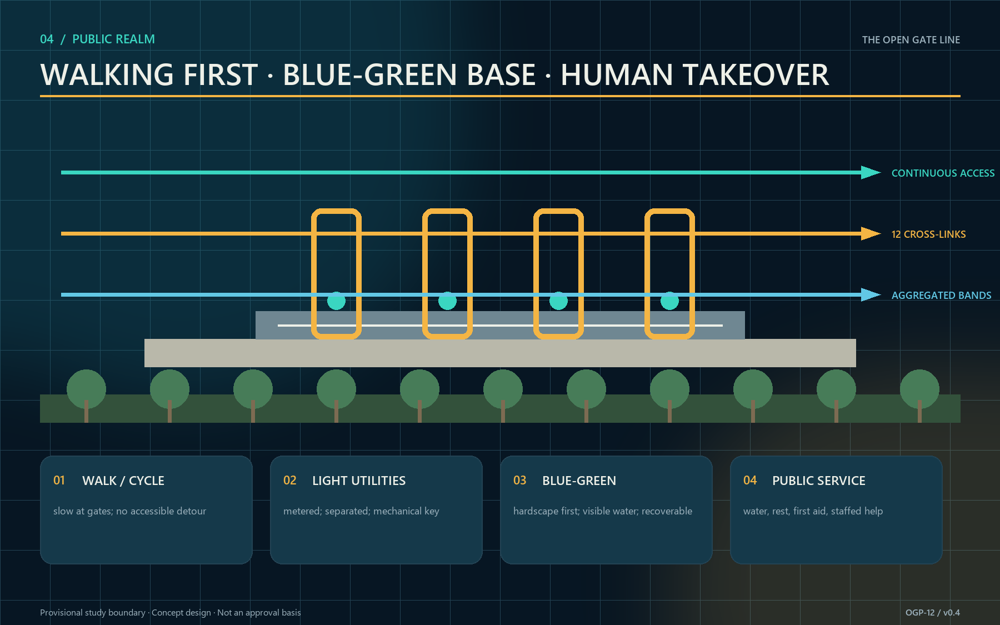

## Blue-Green Network, Public Space, and Urban Character

The heritage park is the continuous ecological base, while gates occupy existing hardscape or recoverable micro-sites. Current concept geometry yields a 12.34% green ratio and a 7.33% public-space ratio relative to the provisional boundary. These are submission-geometry calculations, not existing-condition statistics, planning targets, or compliance claims [metric:green_ratio] [metric:public_space_ratio] [data:geometry/green_space.geojson]. Public-space geometry is retained in its structured layer [data:geometry/public_space.geojson]. Official boundaries and controls require full recalculation.

Public space supports four time sections: morning commute, midday learning, evening care, and weekend display. Gate forecourts provide shade, seating, water, visible exits, and child-safe edges. Rain gardens and tree planting prioritize thermal comfort, while species, soil, and sponge-city parameters await specialist design. Night lighting communicates status and low-level routes rather than using large screens or bright media against heritage settings [depth:blue_green_public_space].

Urban character follows “legible light intervention.” A repeated frame gives corridor continuity, while three landmarks hold shared memory and existing buildings retain material authenticity. Amber means open, teal means assisted, and dark means closed; digital and physical status must match. Commons Signal Towers acknowledge teams, open hours, and repaired issues without personal rankings or behavioral scores.

The following original generated concept scene tests the human relationships: a wheelchair user and companion follow continuous guidance; an older person rests under shade; a child and caregiver share visible space; a steward maintains and takes over the node; and the mechanical key, staffed desk, rain garden, and honor wall remain visible together. It is not a site photograph, existing-condition survey, official rendering, or implementation commitment and cannot support boundary, area, or engineering claims.

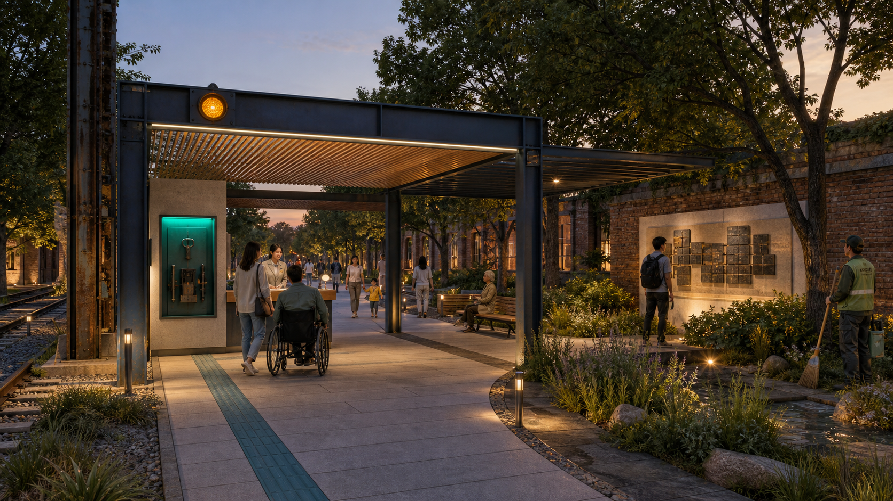

The same gate is checked across day, night, rain, event, and failure. Day keeps passage and staffed help obvious. Night uses low-level light and visible assistance. Rain prioritizes shelter, drainage, and a manual gauge. Events protect walking, emergency access, and walk-in capacity. Failure disables AI advice and transfers control to fixed signs, paper rules, a mechanical key, and on-site stewards. Only a failed safety condition pauses the public gate; an algorithm outage alone should not erase basic passage [assumption:A-DATA-001] [depth:blue_green_public_space].

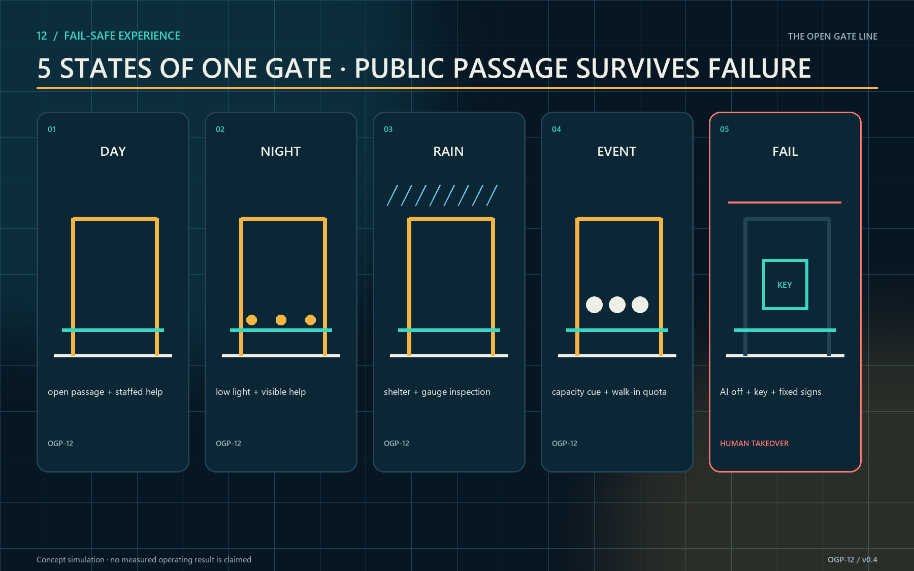

## Renewal Projects, Implementation Policy, and Phasing

Phase 1 (0–12 months) delivers P01–P04 and P08: verify boundary and ownership, create the heritage archive, accessible spine, sponge/night-safety base and three reversible pilots, and establish the audit-and-appeal desk before any algorithm goes live. Phase 2 (years 1–3) delivers P05–P07 and expands only after the three pilots meet their KPIs. Phase 3 (after year 3) delivers P09 and uses annual public reports to retain, move, or retire nodes [data:geometry/phasing.geojson] [depth:phasing_implementation]. The protocol verifies nine project records [metric:implementation_project_count].

The first 100 days end with five auditable work packages, not an “AI launch.” Days 1–20 freeze the official-base-map, ownership, and approval question list. Days 21–40 run a 1:1 tape layout with wheelchair and stroller passage, sightline checks, and walked emergency-stop distances. Days 41–60 assemble the reversible, unpowered ALT-C mock-up. Days 61–80 operate and disclose the no-AI baseline. Days 81–100 add shadow-mode comparison, after which a public-interest panel retains, revises, or removes the model [data:visual/assets/spatial-decision.json] [metric:first_100_days_work_package_count]. Any measured result must be registered after authorized field access; this package does not present conceptual dimensions as field measurements.

| Project package | Accountable lead type | Cost band | Binary start gate | Acceptance / exit asset |
|---|---|---:|---|---|
| P01 Heritage base map and public archive | Heritage and park team | L | Rights and factual review pass | Traceable archive; retain reviewed data if disputed |
| P02 Continuous accessible spine | Transport–park joint team | H | Route audit and fire access pass | Full task chain; retain paths and signs |
| P03 Sponge and night-safety base | Municipal–safety joint team | H | Dual-failure drill pass | Manual takeover ≤5 min; retain gauges, light, help points |
| P04 Three reversible pilot gates | Public park operator | M | All manual fallbacks ready | Three TVS tests; remove movable kit if failed |
| P05 Rail market and shared-table network | Community–market team | M | Inclusive access rules published | Walk-in and small-vendor quotas; retain shared furniture |
| P06 Youth prototyping and scientist commons | Public innovation platform | M | Safety and consent protocols pass | Safe completion and open releases; retain archive |
| P07 Twelve-gate corridor deployment | District program office | H | Three pilots meet KPI | Twelve protocol records; remain at pilot scale if failed |
| P08 Open audit and appeal desk | Independent public-interest panel | L | Appeal SLA and public log ready | 48-hour response; retain audit ledger and templates |
| P09 Regional links and annual Open Gate season | Regional program board | M | Public-value and data-rights review | Open outcomes; retain agreements and project index |

Cost bands are relative: L covers agreements, training, or light components; M covers node-scale spaces and equipment; H covers continuous infrastructure. No public bill of quantities or prices exist, so the proposal does not fabricate currency amounts. Policy tools include shared-time agreements, separate civic/commercial accounting, revocable permits, pooled insurance, opening-performance support, and a maintenance fund. Monthly disclosure covers opening, cancellations, and safety; quarterly review covers accessibility and neighborhood effects; annual review decides renewal. Pilot status never bypasses planning, heritage, fire, or personal-information duties [depth:renewal_project_list].

Regional exchange is concrete rather than generic investment promotion: Beiwei community supplies care and accessibility feedback; Future Science City exchanges research prototypes and public science; Huairou Science City co-produces instrument stories and citizen science; Beijing E-Town links industrial trials and low-carbon operations; the Beijing–Tianjin–Hebei innovation network publishes open briefs and reusable protocols [metric:regional_collaboration_route_count]. Four annual beats sustain the system: Spring Open Gate Test Week, Summer Night and Rain Drill, Autumn Rail Heritage and Science Festival, and Winter Open Audit and Contributor Assembly [metric:annual_event_count]. The contributor wall records verified public value, version, and maintenance responsibility—not behavioral rankings. Any physical inscription, certificate, or award remains subject to final selection, approval, and delivery.

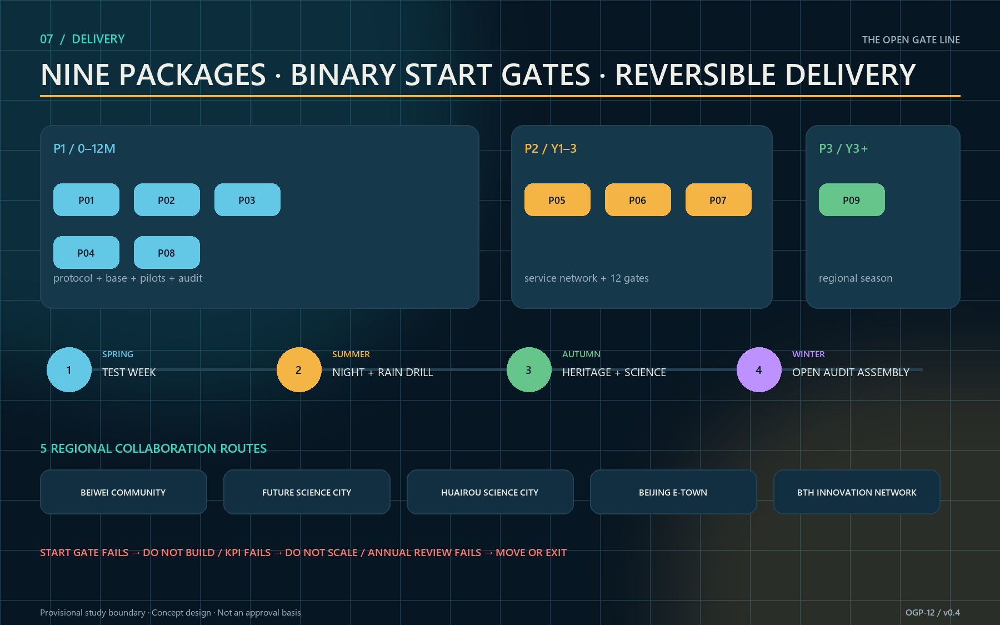

## Metrics, Area Recalculation, and Compliance Matrix

Five metric groups are used. Spatial-base metrics include the 11,412,825 m² provisional boundary, 310,807 m² conceptual footprint, 12.34% conceptual green ratio, 7.33% conceptual public-space ratio, and three key areas [metric:site_area_sqm]. Brief response counts three positions, five functions, two conceptual service wings, six cases, eight ecosystem resources, and five experience states [metric:positioning_statement_count] [metric:core_function_count] [metric:experience_state_count]. Network capacity counts twelve gates, three tests, five personas, and three landmarks [metric:gate_count] [metric:persona_count] [metric:landmark_count].

Protocol completeness counts twelve machine-readable records and 100% human-authority and manual-fallback coverage [metric:gate_protocol_record_count] [metric:human_authority_coverage] [metric:manual_fallback_coverage]. Delivery capacity counts nine projects, five regional routes, and four annual events, while real operating quality and equity remain to be measured.

Spatial values recalculate from submitted GeoJSON. Protocol values are checked by `verify-gate-protocol.js`, which writes `protocol-audit.json`; spatial choices are checked by `verify-spatial-decision.js`, which writes `spatial-decision-audit.json`. The latter must prove that all three options were assessed, at least one option was rejected, revised, and advanced, all five hard gates exist, the first-100-day packages are complete, and the field-verification record count remains zero [metric:field_verification_result_count]. Operating and equity measures remain “to be measured” before authorized pilots; no baseline is fabricated. FAR also remains unknown [metric:floor_area_ratio]. Each quantitative value records source files, formula, unit, confidence, and assumptions. Task coverage is in `compliance_matrix.json`, standards in `standard_matrix.json`, and professional depth in `design_depth_matrix.json` [depth:metrics_recalculation].

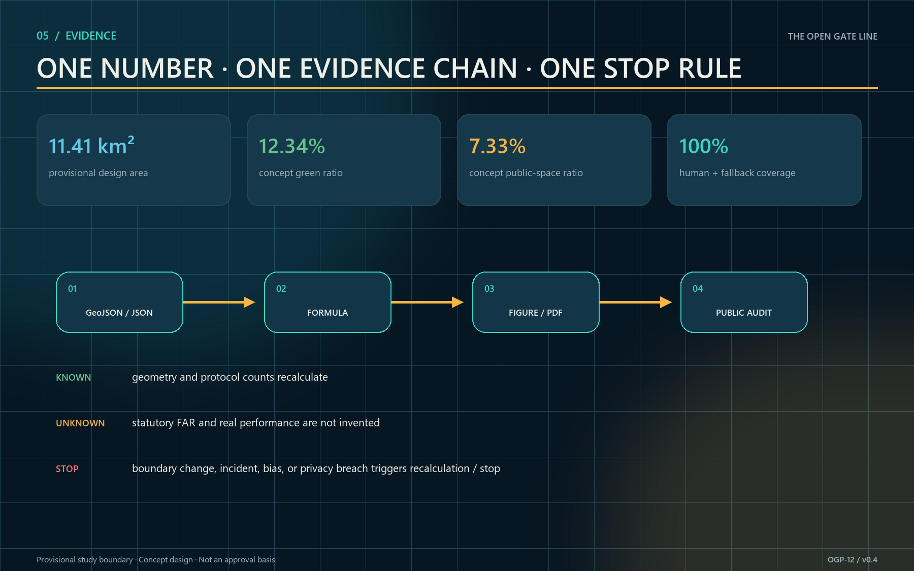

## Risk, Copyright, and Compliance

The first risk is missing boundary, ownership, and control information. Provisional geometry is not an official redline, precise area, or approval basis; official polygons require topology, area, figures, and PDFs to be regenerated [assumption:A-BOUNDARY-001]. The second is mistaking “open” for permission: all twelve gates are design candidates requiring ownership, heritage, fire, security, insurance, operations, and accessibility reviews [assumption:A-GATE-APPROVAL-001]. The third is technical overreach: AI makes no final admission decision and biometrics or behavioral scoring are never the default [assumption:A-DATA-001].

Operating risk is controlled through accountable gate cards, steward check-in, mechanical fallback, capacity limits, incident logs, and restoration budgets. Neighborhood risk is controlled through noise and night-hour conditions, complaint response, and quarterly review. Ecological risk is controlled through light intervention, reversible foundations, and pre-construction tree and hydrology surveys. The public can inspect opening rules, data fields, retention, and appeals. Honest unknowns are design content, not omissions [depth:risk_missing_data].

Except for clearly attributed OpenStreetMap context features, all text, diagrammatic figures, offline pages, and layout code were created for this submission. The cover was generated from an original prompt using OpenAI's image-generation tool. The frozen OSM snapshot is attributed to OpenStreetMap contributors under ODbL and is used only as contextual base data. Beijing government pages are summarized as dated facts; their images and long-form text are not copied. Full provenance, licensing, and generation notes are in `sources.json` and `report/copyright_statement.md`. No unlicensed photograph, third-party logo, or redistributed restricted font is embedded. The repository-required `COMMUNITY-DISPLAY-ONLY` license does not cover OSM data or sublicense precedent and government material.

## References

- Beijing Municipal Commission of Planning and Natural Resources, Haidian Branch, official call [source:OFFICIAL-ANNOUNCEMENT].
- Repository site package and agent taskbook [source:SITE-PACKAGE] [source:AGENT-TASKBOOK]; source registry and processed fact pack [source:SOURCE-REGISTRY] [source:PROCESSED-FACT-PACK].
- Local snapshots for urban-design measures, regulatory planning, and land-use classification. They support a repository-registered compliance check [source:SOURCE-REGISTRY] and are not presented as evidence that the site has obtained approval [standard:MOHURD-URBAN-DESIGN-MEASURES] [standard:MOHURD-CONTROL-DETAILED-PLANNING] [standard:MNR-LAND-USE-CLASSIFICATION-GUIDE].
- Official or institutional pages for JTC one-north, STATION F, and City of Cambridge Kendall Square [source:CASE-ONE-NORTH] [source:CASE-STATION-F] [source:CASE-KENDALL]; Forum Virium Helsinki Kalasatama, Seoul Metropolitan Government Seoul AI Hub, and MaRS Discovery District [source:CASE-KALASATAMA] [source:CASE-SEOUL-AI-HUB] [source:CASE-MARS].
- Beijing public material on the 2024 park plan, the 2026 phase-two opening, and the “three zones and two wings” framework [source:JINGZHANG-PARK-PLAN-20240920] [source:JINGZHANG-PARK-PHASE2-20260730] [source:JINGZHANG-THREE-ZONES-20260403], plus the AI Origin community-renewal program [source:AI-ORIGIN-COMMUNITY-20260401].
- OpenStreetMap contributors, context reference features frozen on 2026-08-22 under the Open Database License, used only as a reproducible urban-context base [source:OPENSTREETMAP-CONTEXT-20260822].

Machine-readable index: `manifest.json`, `sources.json`, `assumptions.json`, `metrics.json`, `compliance_matrix.json`, `standard_matrix.json`, `design_depth_matrix.json`, and `self_check.json`; protocol assets `visual/assets/gate-protocol.json`, `verify-gate-protocol.js`, and `protocol-audit.json`; spatial-decision assets `visual/assets/spatial-decision.json`, `verify-spatial-decision.js`, and `spatial-decision-audit.json`; and context snapshot `visual/assets/osm-context-20260822.json`.
