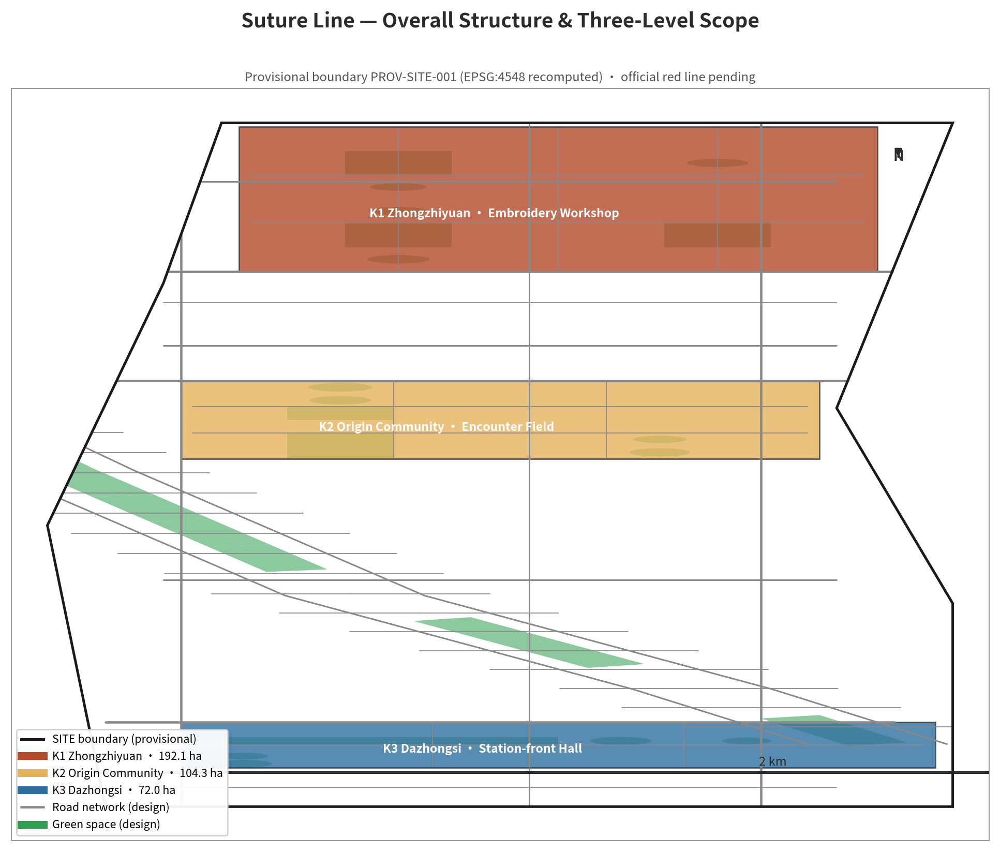
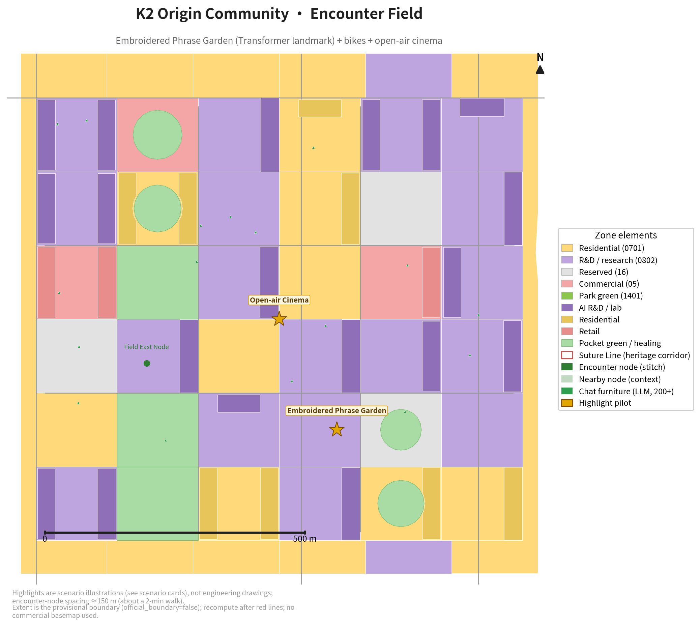
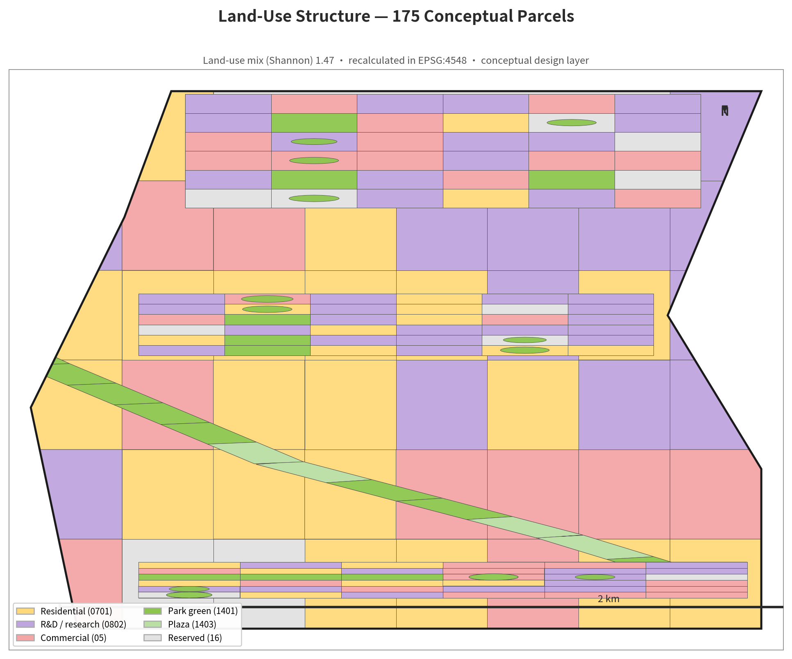
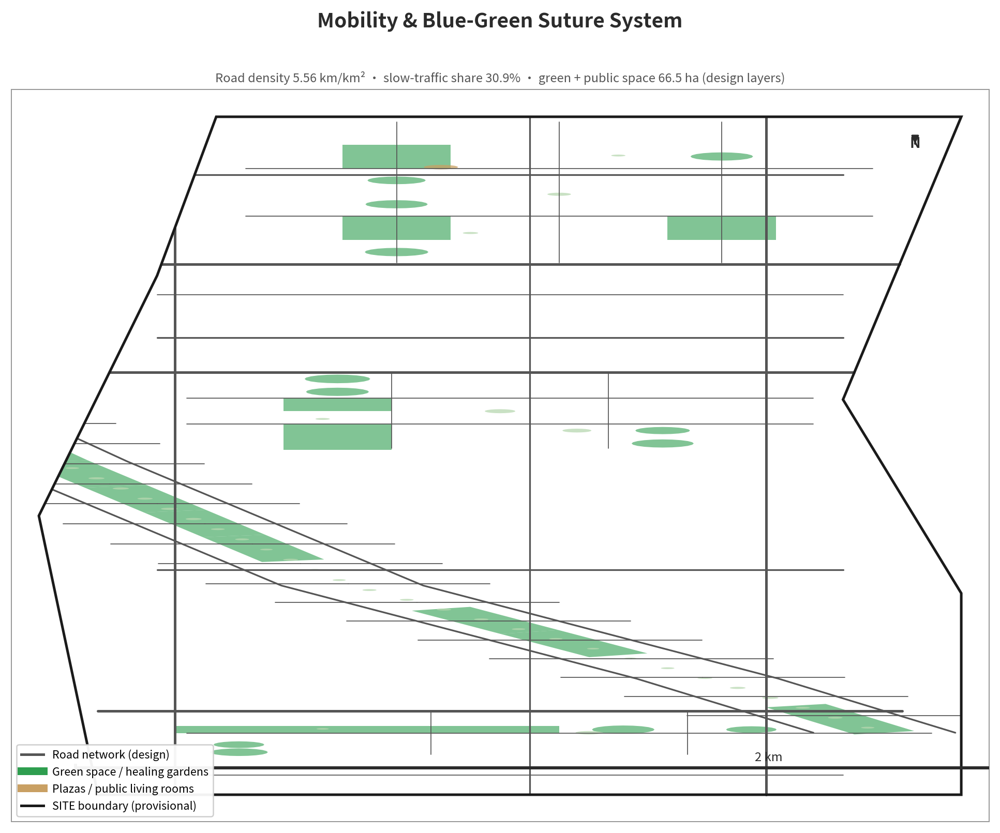
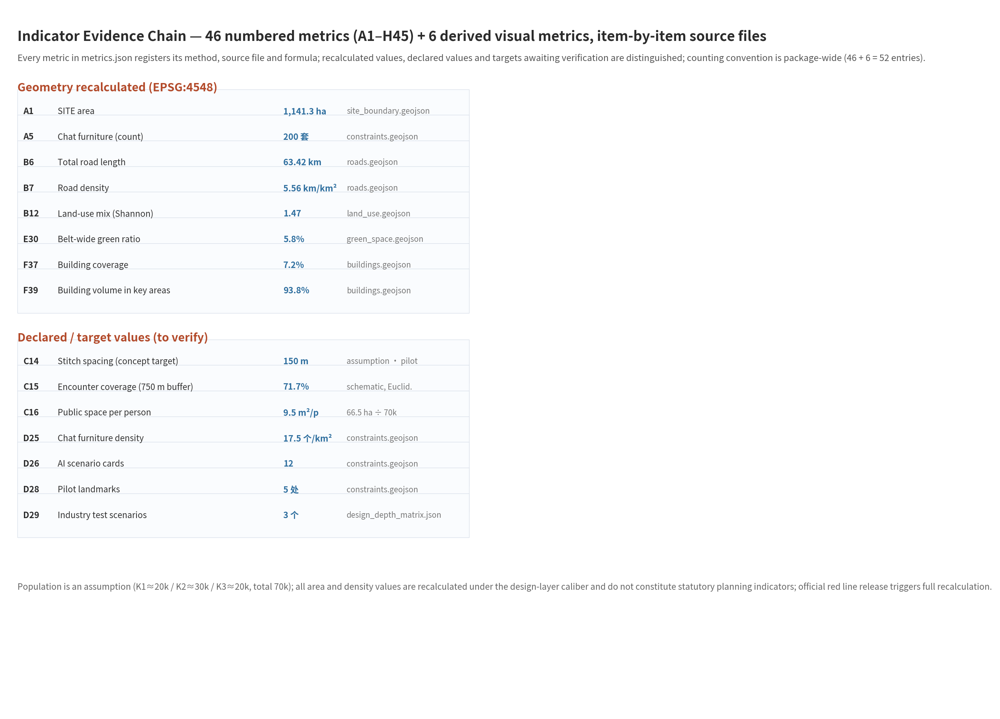

In 1905, Chinese engineers began cutting the first trunk railway designed and built independently by Chinese engineers in the mountains north of Beijing; it opened to traffic in 1909, and Zhan Tianyou used an S-shaped switchback (a "person"-shaped line, from the Chinese character that also means "two people meeting") to get trains over Badaling. A century ago, the "person"-shaped line let trains meet on the mountains; a century later, the railway has left a long suture line through the city's heart. **Suture Line** — a phonetic rendering of "suture line," whose Chinese characters also evoke "embroidery · spring · arrival": technology is the needle and thread, life is the embroidery; a century ago the "person"-shaped line conquered a mountain, a century later it stitches people together. This plan does only one thing: **stitch the broken city and its social fabric back together.**

## 1. Design Basis and Source Inventory

The design basis is organized by source tier; every source is registered in sources.json with its type, usability, and limitations [source:OFFICIAL-ANNOUNCEMENT].

| Basis | Content | Use |
|---|---|---|
| Official open-call announcement | Purpose, three-level scope, design tasks, deliverable depth requirements [source:OFFICIAL-ANNOUNCEMENT] | Task organization and deliverable framework |
| Agent taskbook | Co-creation principles, six mandatory agent.1–6 tasks, review dimensions [source:AGENT-TASKBOOK] | Item-by-item response mapping |
| site-package data pack | design_brief, allowed_design_space, enums, ranges, schemas [source:SITE-PACKAGE] | Layer naming, control conditions, schema compliance |
| Provisional boundary geometry | provisional_boundaries.geojson (PROV-SITE-001 and three KEY_AREA) [source:BOUNDARY-SOURCE] | Geometric basis for SITE and key areas |
| Public standards and general knowledge | National standards such as GB/T 51328-2018 road density and public cases [source:GB-STANDARDS] | Design orientation benchmarks |

Key boundary statement: the announcement describes the site by text boundaries and area only, without precise red-line coordinates; once the official red line is published, all layers and indicators of this plan will be recalculated as a whole. Planning control conditions (FAR, height, density, green ratio, setbacks) are status=missing in planning_limits; the plan always states them as conceptual proposals and does not presume statutory values.

## 2. Three-Level Scope Working Framework

The plan strictly follows the announcement's three-level scope working framework [source:SITE-PACKAGE]: **coordinated study scope** (approx. 43.6 km², industry and future-city research), **overall design scope** (SITE, approx. 11.4 km², overall design + control-detail-depth urban design), and **key areas** (K1 Zhongzhiyuan 192.1 ha / K2 Origin Community 104.3 ha / K3 Dazhongsi 72.0 ha, detailed design).

- SITE geometry uses the repository's provisional coarse boundary PROV-SITE-001; the projected recalculation area is 1,141.3 ha [metric:A1], official_boundary=false [source:BOUNDARY-SOURCE];
- The three KEY_AREA geometries share the same source as SITE [source:KEY-AREA-SOURCE], and all inter-layer topological relations passed spatial review [depth:three_level_scope_framework];
- The deliverable boundaries, layers, and indicators of each scope level are mapped item by item in compliance_matrix.json [data:geometry/site_boundary.geojson].

The three levels are not "passing responsibility downward" but a progressive work organization: the coordination level answers "how this belt participates in the AI industry," the overall level answers "how this line is stitched back into the city," and the key-area level answers "what the stitch points actually look like."

## 3. Coordinated Study Area: Industry and Future-City Research

The coordinated study area focuses on the industry and future-city proposition of the "Centennial Beijing-Zhangjiakou AI Innovation Belt." The plan proposes a **three-zone, two-wing synergy loop**: the three zones (K1 accelerate ⇄ K2 ecosystem ⇄ K3 agglomerate) are linked through the Suture Line data loop; the two wings are the Zhongguancun tech-service wing (capital/IP/factor matching) and the Xiaoyue River scenario-enablement wing (AI scenarios landing to testbeds and science-communication landmarks); the loop is scenario demand → spatial supply → data return → "AI re-stitches" [source:AGENT-TASKBOOK].

The industrial mechanism borrows from six publicly known, common-knowledge cases (Silicon Valley, Nanshan, One-North, King's Cross, Tsukuba, Banqiao) at the mechanism level without citing specific investments or company lists [source:PUBLIC-CASES]; personas cover 5 user groups (entrepreneurs, students, commuters, elderly and children, developers), and AI+ scenarios unfold along three carriers — "XiuYu Furniture + XiuJu Garden + XiuLi Bikes" — detailed in Section 6 [depth:ai_ecosystem_industry].

| Carrier | Mechanism | Linked indicators |
|---|---|---|
| XiuYu Furniture (200 units) | City-scale LLM terminals, coverage density approx. 17.5 per km² [metric:D25] | A5 (200 units) · D25 (17.5 per km²) |
| XiuJu Garden (pilgrimage landmark) | Makes the Transformer data flow walkable as a five-act pilgrimage | — |
| XiuLi Bikes (pilot of 10) | Symbolic power generation + community compute "starlight wall" [metric:C20] | C20/C21 |

Conclusion: the industrial proposition of this belt is not "build a park" but "let AI applications grow data and trust in real streets."

## 4. Overall Design Scope: Urban Regeneration and Control-Detail Urban Design

The core move of the overall design scope is **one main thread, four stitching moves, and four layers of social weaving** [depth:spatial_structure_strategy].

**Main thread — the Suture Line (approx. 4.03 km)** [metric:A2]: a continuous stitched greenway along the railway heritage belt, designed in segments by the railway's three states — heritage segment retains rail traces (greenway + slow traffic + tree-lined + building setback), under-bridge segment activates negative space (basketball courts / weekend markets / graffiti walls), and below-grade segment forms a station-city public living room together with metro stations [data:geometry/constraints.geojson].

**Four stitching moves**: running stitch (continuous advance along the severed belt), edge-binding (29 "stitch alleys" crossing the corridor perpendicularly, each ≤250 m), back stitch (interlocking with the old-city fabric, landing at K1/K2/K3), and hidden stitch (AI hidden inside streetlights, benches, and bins, unobtrusive) [metric:B11].

**Four layers of social weaving**: encounter layer (approx. 20 corner micro-spaces) → shared-activity layer (approx. 8 vegetable gardens/cinemas/markets/sports fields) → healing layer (29 healing gardens) → warmth layer (free, no reservation, no forced QR scanning; human/paper fallback coverage 100%) [metric:G40].

At control-detail depth, the plan gives land-use layout, development-intensity proposals (bounded by missing planning control conditions, all labeled "conceptual proposal"), height and fabric control (D/H 1:1–1:2, street-open frontage ratio ≥30% in key areas), and retain/renovate/demolish principles (retain/renovate/demolish 70/25/5), detailed in Sections 7 and 9 [data:geometry/land_use.geojson].

## 5. Key Areas: Detailed Design

The three key areas are where "suturing" actually lands; each area is given a role, functional mix, and key nodes (figures are conceptual, to be deepened after the red line) [depth:three_key_area_detailed_design].

| Key area | Role | Functional mix | Key nodes |
|---|---|---|---|
| K1 Zhongzhiyuan · XiuFang | Entrepreneurs' decompression-and-socialization ground + AI application pilot block | Office 45% / social-healing 25% / green 10% / commercial support 20% | Courtyard social core, maker-market street, XiuLi bike pilot station, shared vegetable garden |
| K2 Origin Community · XiuChang | Young people's encounter plaza | Plaza 40% / commercial 20% / green 25% / facilities 15% | Station-front encounter plaza, campus frontage opening, XiuJu Garden landmark, open-air cinema |
| K3 Dazhongsi · XiuTing | Commuters' station-front living room | Station-front plaza commerce 45% / green 17% / community service 20% / transport support 18% | Weather-protected concourse, wholesale-market memory strip, chat long tables, shared-garden greenhouse |

Key-area green ratios (E33 zone green ratio, recalculated from design layers): K1=10.0% / K2=11.4% / K3=16.4%, all above the plan&#x27;s self-set target line of 8% [metric:E33]; approx. 93.8% of the total building volume concentrates in the key areas, showing the leverage effect of concentrated renewal [metric:F39].

## 6. AI Innovation Ecosystem, Personas, and AI+ Scenarios

AI is not decoration but planning logic: the placement of encounter nodes is **driven by design hypotheses** — under the expected-encounter thinking of "population density × path flow × willingness to linger," the 150 m spacing is set as a **conceptual design target** (roughly 2 minutes of walking, at the boundary between the walking-fatigue threshold and the comfortable pace of elderly people), as a design assumption for pilot verification rather than a proven optimum from reproducible optimization [metric:C14].

**Two-level node–device system**: stitch points (spatial places) 31 [metric:A4] + XiuYu Furniture (AI terminals) 200 [metric:A5]; 12 AI scenario cards cover the three signature devices and the four layers of social capital, each noting location, how AI is used, who benefits, and the human fallback [metric:D26]; 5 persona types each get a concrete fallback; 3 industry test scenarios run the "scenario-space-operation" loop [metric:D29].

**Data loop**: perception layer (anonymized intent heatmaps of wayfinding/chat intents, de-identified, cleared by default within 24h) → decision layer (drives quarterly stitch-point micro-adjustments, i.e., "AI re-stitches") → feedback layer (annual before/after measurement of encounter-circle coverage and dwell time) [source:AGENT-TASKBOOK]. In one sentence: **this city learns how to make people meet** [depth:ai_scenarios_personas].

## 7. Land Use, Building Scale, and Retain/Renovate/Demolish Plan

At the land-use level, land_use.geojson contains 175 conceptual parcels (recalculated in EPSG:4548; all valid, no overlap, no self-intersection), with a Shannon land-use mix index of 1.47 [metric:B12]; parcel division serves the suturing logic of "stitches can land and frontages can open" [data:geometry/land_use.geojson].

At the building-scale level, buildings.geojson contains 97 conceptual indicative volumes [metric:F36], building coverage 7.2% (open fabric) [metric:F37], average depth 25.8 m [metric:F38]; development intensity and height control are bounded by missing control-plan conditions and are all stated as "conceptual proposals," to be recalculated after the official red line and control plan are released [data:geometry/buildings.geojson].

Retain/renovate/demolish plan: the overall direction adheres to "retain/renovate/demolish 70/25/5" [depth:retain_renovate_demolish] — retain (old factory structures, wholesale-market memory, campus green frontages), renovate (opening compound walls, activating under-bridge space), demolish (inefficient temporary structures, cross-line obstructions). The 93.8% share of building volume in key areas reflects the spatial strategy of "concentrated renewal, conservation elsewhere" [depth:land_use_layout].

## 8. Transport, Rail, Municipal Services, and Public Facilities

At the transport level, roads.geojson recalculates total road length 63.42 km [metric:B6] and road network density 5.56 km/km² [metric:B7] (GB/T 51328-2018 §12.1.4 requires that road-system density in the central urban area should not be less than 8 km/km²; the Phase I value falls short of this, disclosed proactively with a Phase II densification path: upgrading stitch alleys to minor roads, densifying internal grids in key areas, and parallel under-bridge passages; the standard's original text is not archived locally and is cited as background orientation only, to be verified during deepening) [standard:GB-T51328-2018-ROAD-DENSITY]; slow-traffic roads account for 30.9% [metric:B10], with 29 stitch alleys crossing the corridor belt [metric:B11].

At the rail and municipal level, the plan explicitly declares data gaps: rail stations and municipal networks lack official authoritative geometry, so only layout principles are given (station-city integration, municipal lines following the greenway) without engineering conclusions [depth:traffic_rail_slow_parking]; public service facilities are arranged along the main thread as 141 indicative points [metric:C19] [data:geometry/roads.geojson].

## 9. Blue-Green Space, Public Space, and Urban Character

Blue-green space: green space + public space total 66.5 ha [metric:E29] (of which pure green 64.3 ha at a 5.63% pure green ratio), belt-wide green ratio 5.8% [metric:E30]; 29 healing/sensory gardens concentrate along the main thread and key areas [metric:C18], with 12 pocket green spaces (0.3–1 ha) [metric:C17]; the greenway connects rain gardens (one every 300–500 m), with pervious pavement ≥60% and native plants ≥70% as deepening targets [data:geometry/green_space.geojson].

Public space: per-capita public activity space 9.5 m²/person (green space + public space 66.5 ha ÷ directly served population 70,000) [metric:C16], benchmarked against the National Garden City standard (MOHURD Jiancheng [2016] No.235: per-capita park green space ≥9.00 m²/person for cities with per-capita built-up land ≥105 m², built-up-area caliber) as background orientation; this plan uses the broader "per-capita public activity space" caliber (incl. public space), which differs from the "per-capita park green" caliber, so the comparison is directional only; stitch points (encounter nodes) 31, 15-minute encounter-circle coverage 71.7% [metric:C15] [data:geometry/public_space.geojson].

Urban character: a color spectrum of rust red (rail memory) + warm wood (social warmth) + grey-green (healing greenery), unifying a "stitch-line" visual language (stitch-number signage, rust-colored guide strips, braille plaques); barrier-free ramps and age-friendly seating spacing ≤100 m across the belt; child-friendly (safe healing-garden dimensions, XiuJu Garden children's mode, car-free greenway) [depth:blue_green_public_space].

## 10. Renewal Project List, Implementation Policy, and Phasing

Renewal projects follow a "pilot first, then scale" principle in four phases [depth:phasing_implementation]:

| Phase | Content | Funding magnitude (conceptual estimate, pending feasibility study) |
|---|---|---|
| Stitch needle (launch) | Pilot K2: XiuYu Furniture 5 + XiuLi Bikes 5 + small XiuJu Garden 1 | ≈0.1–0.3 billion CNY |
| Suture line (Phase I) | Suture Line main thread opened through; K2 XiuChang encounter plaza lands | ≈1–3 billion CNY |
| Stitched surface (Phase II) | K1 XiuFang, K3 XiuTing progress; scenario cards go live in batches | ≈3–10 billion CNY |
| Fully stitched (long term) | Densify stitch points, XiuYu Furniture to 200 units, replicate the "suturing model" | Rolling investment |

Implementation policy and operation: tripartite co-governance of street office + professional operator + community volunteers; warmth-layer SLA is free, no reservation, no forced QR scanning; fault response within 24h and repair within 7 days; quarterly "re-stitch" public announcements and weekly champion nickname boards safeguard public participation [metric:C20]; XiuLi bike revenue feeds back into maintenance (symbolic, not overstated) [data:geometry/phasing.geojson]. The item-by-item mapping of the renewal project list to the official agent.1–6 tasks is in compliance_matrix.json [depth:renewal_project_list].

## 11. Indicator System, Area Recalculation, and Compliance Matrix

All 46 numbered indicators plus 6 derived visual indicators (52 entries in total) register their calculation methods, source files, and formulas item by item in metrics.json [data:geometry/site_boundary.geojson]; geometric indicators that can be recalculated from design layers in EPSG:4548 are given recalculated values, while declared values and targets awaiting verification (e.g., pilot operation parameters, items needing additional methodology) are annotated item by item — the plan does not claim that "everything is recalculated." Core recalculated values: SITE area 1,141.3 ha [metric:A1], road density 5.56 [metric:B7], green ratio 5.8% [metric:E30], building coverage 7.2% [metric:F37].

The compliance matrix (compliance_matrix.json) maps official taskbook clauses 1.3.1–1.5.3 and agent.1–6 item by item to sections, layers, indicators, drawings, and self-checks; all 16 spatial-review geometric checks passed (topology, overlap, and coverage gaps all within tolerance) [depth:metrics_recalculation]. All area- and density-type indicators are recalculated values under the design-layer caliber and do not constitute statutory planning control indicators; population figures are assumptions (K1≈20,000 / K2≈30,000 / K3≈20,000, total 70,000) and will be recalculated once official data is published.

**Green/public-space indicator caliber note**: this package uses one single "design-layer recalculation" caliber throughout, with every formula and source file registered item by item in metrics.json and all intersections computed in EPSG:4548 — pure green space = all 29 features of green_space.geojson (land_use_code=1401) = 64.29 ha, pure green ratio 5.63% (derived key green_ratio); public space = all 36 polygons of public_space.geojson (31 stitch nodes + 5 plazas/XiuChang venues) = 2.24 ha (derived key public_space_area_sqm); E29 green space + public space = 66.53 ha ≈ 66.5 ha, and E30's share of SITE = 5.83% ≈ 5.8%. The 1403 plaza land in land_use.geojson (≈14.4 ha) is a land-use-classification caliber with a different measurement object from the public-space design-node layer, so it does **not** enter the indicators above, avoiding double counting. E33 key-area green ratios (K1 10.0% / K2 11.4% / K3 16.4%) are recalculated by intersecting green features with key-area polygons; per-zone detail and formulas are registered under E33.sub_metrics.

## 12. Risk, Copyright, and Compliance Notes

**Risk pre-answers (8 questions)**: AI hallucination ("for reference only" watermark + mandatory human review), accidental SOS (press-and-confirm two-step), power/network loss (solar + battery redundancy + automatic degradation to ordinary furniture), privacy (anonymization + local-first + 24h clearing), child safety (children's mode + sensitive topics to human), damage and maintenance (street + enterprise adoption + public reporting), cost (low-cost retrofit devices + pilot first), replicability (the suturing model is a methodology, not dependent on a specific site) [depth:risk_missing_data].

**Four hard statements**: ① the site range is a provisional coarse boundary; after the official red line is published, all layers and indicators will be recalculated; ② power-generating bikes are symbolic participation, not a "self-powered" commitment; ③ all AI facilities keep human/paper fallbacks; emergency services never go through AI decision-making; ④ population and catchment figures are assumptions, to be replaced and recalculated with official data.

**Copyright and compliance**: this work is submitted under CC-BY-SA-4.0; AI-generated content is disclosed truthfully per the competition rules (see agent.json and self_check.json); fire lanes, daylighting and other engineering specialties are explicitly declared to require professional review and do not constitute engineering conclusions [standard:PROJECT-OFFICIAL-ANNOUNCEMENT]; national standards are cited as design orientation, with the original text to be verified in the deepening phase [source:GB-STANDARDS]. For every scene where AI could answer wrong, a human can answer right; for every moment where AI could fail, there is a paper fallback.

## Appendix A: Taskbook Cross-Reference Table (Three Positionings — Five Functions — Three Zones Two Wings — Spatial Landing — Operation Entities — Indicators)

The following table is the proposal-side item-by-item response mapping: the official taskbook's original wording of the "three positionings" and "five functions" is subject to the organizer's published text; this table does not paraphrase or rewrite official definitions, but only states in the proposal's own language how each dimension is implemented in which section/layer/indicator/operation arrangement; the mechanical item-by-item mapping is in compliance_matrix.json (announcement 1.3.1–1.5.3 × agent.1–6). The "collaboration interfaces" in the table are conceptual suggestions only, not concluded cooperation, and are not approved.

| Taskbook dimension (per announcement and agent taskbook) | Proposal implementation (spatial landing / operation entity / indicator) | Evidence |
|---|---|---|
| Three-level scope framework | Coordinated study (approx. 43.6 km²) → overall design (SITE 1,141.3 ha) → key areas (K1 192.1 / K2 104.3 / K3 72.0 ha) | [metric:A1][depth:three_level_scope_framework] |
| Three-zone, two-wing synergy loop | K1 accelerate ⇄ K2 ecosystem ⇄ K3 agglomerate, linked via the Suture Line data loop; two wings = Zhongguancun tech-service wing + Xiaoyue River scenario-enablement wing | [source:AGENT-TASKBOOK] |
| One main thread · four stitching moves · four layers | Suture Line 4.03 km; running/edge-binding/back/hidden stitches; encounter/shared-activity/healing/warmth four layers | [metric:A2][metric:B11][metric:G40] |
| Function–space–operation mapping | 12 AI scenario cards: location + how AI is used + who benefits + human fallback; 5 personas; 3 industry test scenarios | [metric:D26][metric:D29][depth:ai_scenarios_personas] |
| Operation entity arrangement | Tripartite co-governance of street + professional operator + community volunteers; pilot-enterprise adoption; quarterly "re-stitch" announcements | [data:geometry/phasing.geojson] |
| Regional collaboration interfaces (conceptual, not approved) | Interfaces with Beiwei community, Future Science City, Huairou Science City, Beijing E-Town, and the Beijing-Tianjin-Hebei region are in Appendix D; all are suggested mechanisms without concluded cooperation | Appendix D |

## Appendix B: agent.6 Annual Operations Table (Conceptual, Not Approved)

The following is a **suggested arrangement** of annual activities and operations: entities, resources, and KPIs are assumptions; every item is marked "not yet approved" and may only start after approval by the competent authority.

| Annual item | Suggested entity | Resource assumption | KPI (suggested) | Pause/exit condition | Status |
|---|---|---|---|---|---|
| Annual activity rhythm (quarterly "re-stitch" + semi-annual public review) | Street office + operator | Volunteers and street budget | 1 quarterly re-stitch, 2 semi-annual reviews | Pause if data unavailable or complaints rise | Not approved |
| Activity brand/IP ("Suture Line" festival) | Operator + community | Brand licensing and event budget | 2 events/year, ≥5,000 participants each | Defer if no funding/venue | Not approved |
| Developer community (open API and datasets) | Operator + universities | API operations and de-identified data pipeline | ≥200 registered developers/year, 1 hackathon/year | Close if privacy risk uncontrollable | Not approved |
| Scenario open application and security review | Street office + security review panel | Review process and standards | Review completed within 30 days of application | Do not open if review fails | Not approved |
| Public experience (free, no reservation) | Street office + volunteers | Maintenance and fallback staffing | Warmth-layer SLA 100% | Downgrade if facilities fail | Not approved |
| International outreach (bilingual materials and tours) | Operator | Translation and content budget | ≥12 bilingual guided tours/year | Pause if budget absent | Not approved |
| Talent/enterprise follow-up conversion | Street office + industry bodies | Pilot venues and matchmaking meetings | ≥4 matchmaking meetings/year, ≥2 pilot conversions | Defer if no venue/demand | Not approved |

## Appendix C: AI Facility Data Flow and Governance Table (Conceptual)

| Scenario | Data collected | Raw voice/text saved? | Anonymization timing | Aggregation threshold | Retention period | Access roles | Notice/refusal | Human review and incident handling |
|---|---|---|---|---|---|---|---|---|
| XiuYu Furniture (conversational LLM terminal) | Intent category, dwell period, anonymized interaction records | **Not saved** — raw dialogue text and voice | Raw data discarded at end of interaction | Aggregate statistics only (≥30 person-times per period visible) | Aggregate indicators cleared after 24h | Operations admin + quarterly audit | On-terminal notice; can verbally refuse and switch to human | Emergency/complaint events force human review; 24h response; 7-day handling records archived |
| XiuLi Bikes (symbolic power generation) | Usage count, generated energy (non-personal data) | No personal data involved | Not applicable | Daily totals | Rolling retention 90 days | Operations admin | Station signage | Fault response within 24h |
| XiuJu Garden (landmark/glow wall) | Anonymized visit counts | No personal data collected | Not applicable | Daily totals | Rolling retention 90 days | Operations admin | Station signage | Fault response within 24h |

Governance boundary: the plan **does not build personal trajectories**, does not save raw dialogues, and does not describe "anonymization" as risk-free; any pilot that intends to collect real user data must first complete a privacy impact assessment, notice-and-refusal mechanisms, child protection, supplier security assessment, and public disclosure, and may only proceed after approval by the competent authority (not approved).

## Appendix D: Regional Collaboration Interfaces (Conceptual, Not Approved)

Collaboration interfaces are **suggested mechanisms** only, involving no concluded cooperation, enterprises, or policies; wherever formal materials are lacking, the item is marked "assumption":

| Collaboration target | Suggested interface | Nature |
|---|---|---|
| Beiwei community (neighboring existing community) | Wall-opening-to-green, time-shared opening, community vegetable garden and healing garden co-building | Assumption: ownership opening requires written intent |
| Future Science City | Mutual recognition of common AI infrastructure and test scenarios | Assumption: mechanism not approved |
| Huairou Science City | Long-term interface for data/compute collaboration around large scientific facilities | Assumption: directional suggestion only |
| Beijing E-Town (BDA) | Smart manufacturing and pilot supply-chain collaboration | Assumption: directional suggestion only |
| Beijing-Tianjin-Hebei region | Cross-regional cultural route linkage along the railway heritage belt | Assumption: directional suggestion only |

## 13. References

Sources cited and referenced by this plan are as follows (source registration in sources.json, standards registration in standard_matrix.json):

- Official open-call announcement (PROJECT-OFFICIAL-ANNOUNCEMENT) [source:OFFICIAL-ANNOUNCEMENT]
- Agent taskbook agent.1–6 (AGENT-TASKBOOK) [source:AGENT-TASKBOOK]
- site-package data pack: design_brief / allowed_design_space / enums / ranges / schemas (SITE-PACKAGE) [source:SITE-PACKAGE]
- Provisional boundary geometry provisional_boundaries.geojson (BOUNDARY-SOURCE / KEY-AREA-SOURCE) [source:BOUNDARY-SOURCE]
- Original design layers (ORIGINAL-GEOMETRY) [source:ORIGINAL-GEOMETRY]
- Public common-knowledge cases (PUBLIC-CASES) and public standards (GB-STANDARDS) [source:PUBLIC-CASES]
- National standard: GB/T 51328-2018 urban comprehensive transport system planning standard [standard:GB-T51328-2018-ROAD-DENSITY]
- Official taskbook standard entries: PROJECT-OFFICIAL-ANNOUNCEMENT / PROJECT-AGENT-TASKBOOK [standard:PROJECT-AGENT-TASKBOOK]

All geometry is calculated in EPSG:4548; geometries are first repaired with buffer(0) before participating in topology and area recalculation. The full reconciliation of indicators and drawings is in metrics.json, standard_matrix.json, design_depth_matrix.json, and report/proposal.html.
