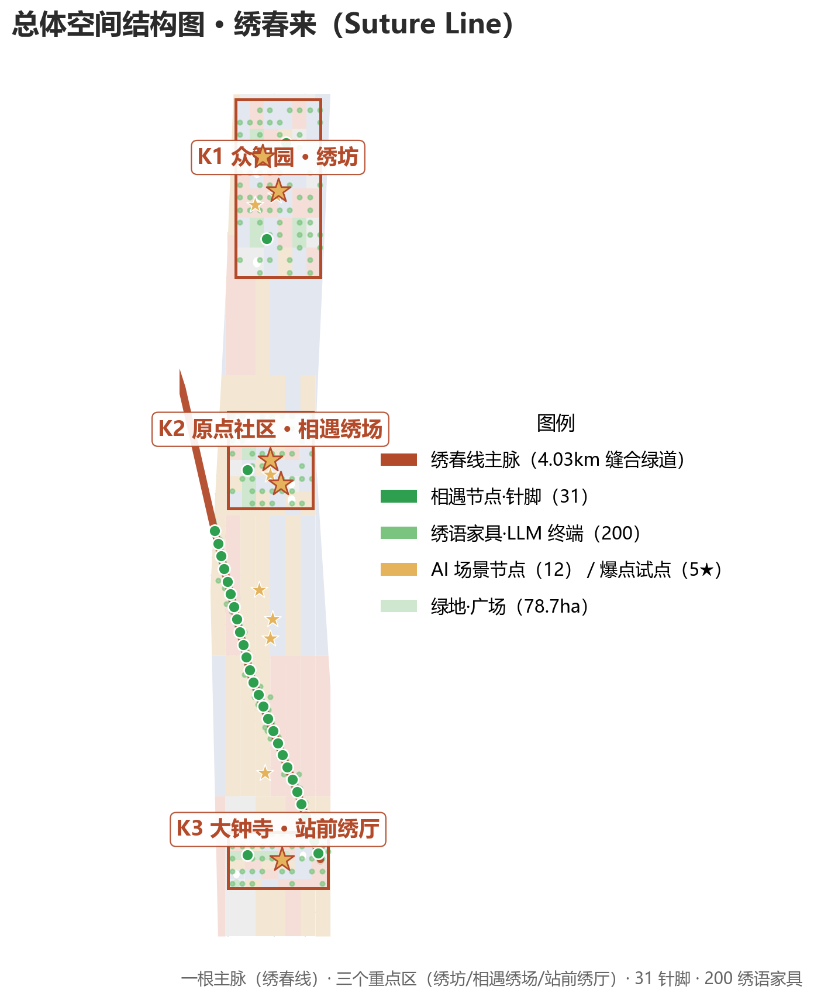
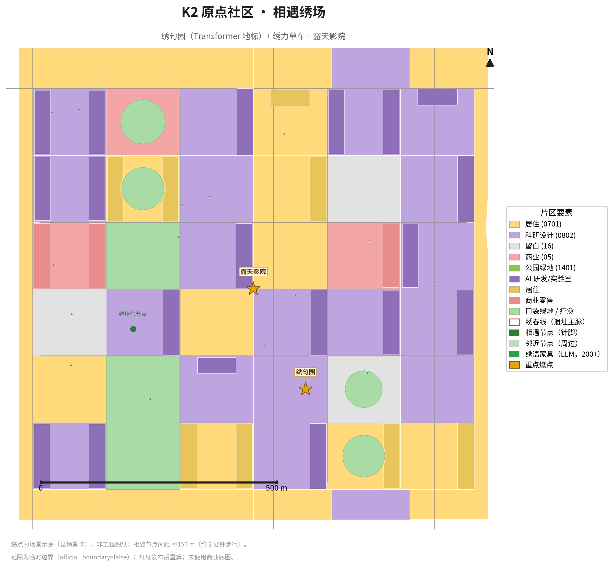
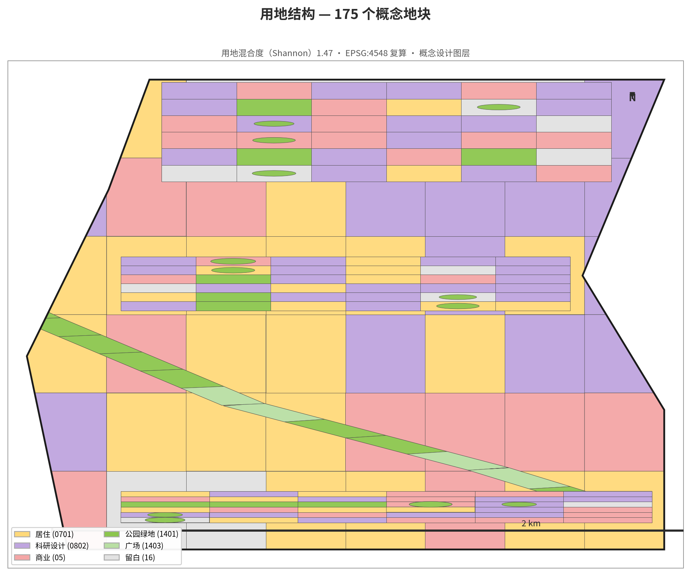
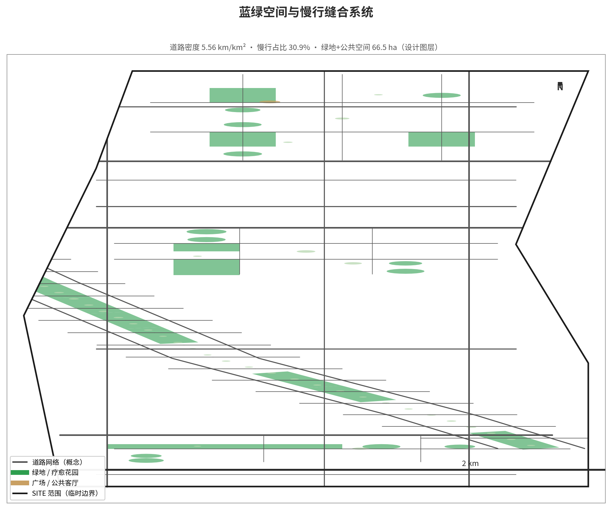
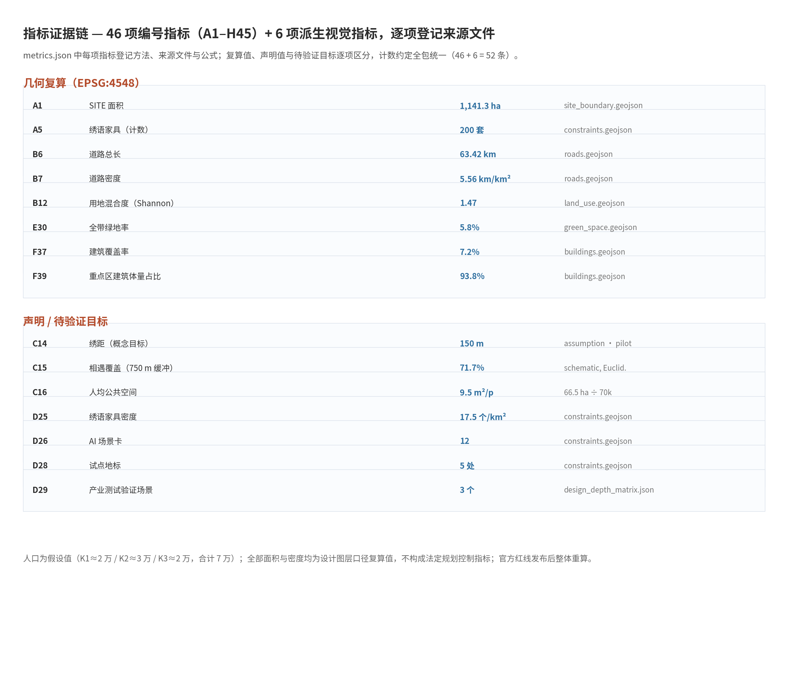

1905 年，中国人在北京城北的山岭间开凿第一条自主设计建造的干线铁路；1909 年通车，詹天佑用"人"字形展线让火车翻过八达岭。百年前，"人"字形让火车相遇于山岭；百年后，这条铁路在城市腹地留下一道绵长的缝合线。**绣春来（Suture Line）**——"缝合线"的音译，中文字面又长出"绣·春·来"的画面感：技术是针线，生活是绣品；百年前"人"字征服山，百年后"人"字缝合人。本方案要做的事只有一件：**把断裂的城市与社交，重新缝起来。**

## 一、设计依据与资料清单

本方案的设计依据按来源分层整理，全部来源在 sources.json 中登记了类型、可用性与局限说明 [source:OFFICIAL-ANNOUNCEMENT]。

| 依据 | 内容 | 用途 |
|---|---|---|
| 官方征集公告 | 征集目的、三层范围、设计任务、成果深度要求 [source:OFFICIAL-ANNOUNCEMENT] | 任务组织与成果框架 |
| 智能体任务书 | 共创原则、agent.1–6 六项必答任务、评审维度 [source:AGENT-TASKBOOK] | 逐条响应对照 |
| site-package 资料包 | design_brief、allowed_design_space、enums、ranges、schemas [source:SITE-PACKAGE] | 图层命名、控制条件、schema 合规 |
| 临时边界几何 | provisional_boundaries.geojson（PROV-SITE-001 与三处 KEY_AREA）[source:BOUNDARY-SOURCE] | SITE 与重点区几何来源 |
| 公开标准与常识 | GB/T 51328-2018 路网密度等国家标准及公开案例 [source:GB-STANDARDS] | 设计取向对标 |

关键边界声明：公告为文字四至与面积描述，不含精确红线坐标；官方红线发布后，本方案全部图层与指标整体复算。规划控制条件（容积率、高度、密度、绿地率、退线）在 planning_limits 中 status=missing，方案一律以概念建议表述，不推定法定数值。

## 二、三层范围工作框架

本方案严格遵循公告三层范围工作框架 [source:SITE-PACKAGE]：**统筹研究范围**（约 43.6 km²，产业与未来城市研究）、**总体设计范围**（约 11.4 km² 的 SITE，总体设计 + 控规深度城市设计）、**重点区域**（K1 众智园 192.1 ha / K2 原点社区 104.3 ha / K3 大钟寺 72.0 ha，详细设计）。

- SITE 几何使用仓库提供的临时粗略边界 PROV-SITE-001，投影复算面积 1141.3 ha [metric:A1]，official_boundary=false [source:BOUNDARY-SOURCE]；
- 三处 KEY_AREA 与 SITE 的几何来源同源 [source:KEY-AREA-SOURCE]，层间拓扑关系经空间审查全部通过 [depth:three_level_scope_framework]；
- 每层范围的成果边界、图层与指标在 compliance_matrix.json 中逐条映射 [data:geometry/site_boundary.geojson]。

三层范围不是"分层甩锅"，而是层层递进的工作组织：统筹层回答"这条带怎么参与 AI 产业"，总体层回答"这条线怎么缝回城市"，重点层回答"针脚落点具体长什么样"。

## 三、统筹研究范围产业与未来城市研究

统筹研究范围着眼"百年京张 AI 创新带"的产业与未来城市命题。方案提出**三区两翼协同回路**：三区（K1 加速 ⇄ K2 生态 ⇄ K3 集聚）经绣春线数据闭环联动；两翼为中关村科技服务翼（资本/IP/要素对接）与小月河场景赋能翼（AI 场景落地至测试床与科普地标）；回路为场景需求 → 空间供给 → 数据回流 → "AI 重新下针" [source:AGENT-TASKBOOK]。

产业机制借鉴全球六个公开常识级案例（硅谷、南山、纬壹、国王十字、筑波、板桥）的机制而不引用具体投资或企业名单 [source:PUBLIC-CASES]；人才画像覆盖 5 类用户（创业者、学生、上班族、老人儿童、开发者），AI+ 场景沿"绣语家具 + 绣句园 + 绣力单车"三个载体展开，具体见第六章 [depth:ai_ecosystem_industry]。

| 载体 | 机制 | 对应指标 |
|---|---|---|
| 绣语家具（200 套） | 城市级 LLM 终端，覆盖密度约 17.5 个/km² [metric:D25] | A5（200 套）· D25（17.5 个/km²） |
| 绣句园（朝圣地标） | 把 Transformer 数据流走成可理解的五幕朝圣 | — |
| 绣力单车（试点 10 辆） | 象征性发电 + 社区算力星光墙 [metric:C20] | C20/C21 |

结论：这条带的产业命题不是"建园区"，而是"让 AI 应用在真实街巷里长出数据与信任"。

## 四、总体设计范围城市更新与控规深度城市设计

总体设计范围的核心动作是**一根主脉、四种针法、四层缝合** [depth:spatial_structure_strategy]。

**主脉——绣春线（约 4.03 km）** [metric:A2]：沿铁路遗址带打造连续缝合绿道，按铁路三种状态分段设计——遗址段保留铁轨痕迹（绿道+慢行+林荫+建筑退线）、桥下段活化消极空间（篮球场/周末市集/涂鸦墙）、入地段结合地铁站形成站城公共客厅 [data:geometry/constraints.geojson]。

**四种针法**：平针（沿断裂带连续推进）、锁边（29 条针脚巷垂直穿过走廊，每条 ≤250 m）、回针（与老城肌理互相咬合，K1/K2/K3 落地）、藏针（AI 藏进路灯座椅垃圾桶，不显突兀）[metric:B11]。

**四层缝合**：偶遇层（街角微空间约 20 处）→ 共同活动层（菜园/影院/市集/运动场约 8 处）→ 疗愈层（29 处疗愈花园）→ 温度层（免费、无预约、不强制扫码，人工/纸面兜底覆盖率 100%）[metric:G40]。

在控规深度上，本方案对总体设计范围给出用地布局、开发强度建议（以规划控制条件缺失为边界，全部标注"概念建议"）、高度与肌理控制（D/H 1:1–1:2、重点区沿街开口率 ≥30%）、以及拆改留原则（留改拆 70/25/5），详见第七章与第九章 [data:geometry/land_use.geojson]。

## 五、重点区域详细设计

三个重点区域是"缝合"真正落地的抓手，每区给出角色、功能配比与关键节点（数字为概念方案，红线后深化）[depth:three_key_area_detailed_design]。

| 重点区 | 角色 | 功能配比 | 关键节点 |
|---|---|---|---|
| K1 众智园·绣坊 | 创业者社交减压场 + AI 应用试验街区 | 产业办公 45% / 社交疗愈 25% / 绿地 10% / 商业配套 20% | 中庭社交核、创客市集街、绣力单车试验站、共享菜园 |
| K2 原点社区·相遇绣场 | 年轻人的相遇广场 | 广场 40% / 商业 20% / 绿地 25% / 设施 15% | 站前相遇广场、高校界面打开、绣句园朝圣地标、露天影院 |
| K3 大钟寺·站前绣厅 | 上班族的站前客厅 | 站前广场商业 45% / 绿地 17% / 社区服务 20% / 交通配套 18% | 站前风雨连廊、批发市场记忆带、聊天长桌、共享菜园暖棚 |

三区绿地率（E33 分区绿地率，设计图层复算值）K1=10.0% / K2=11.4% / K3=16.4%，高于方案自设目标线 8% [metric:E33]；建筑总量中约 93.8% 集中于重点区，体现更新集聚的抓手效应 [metric:F39]。

## 六、AI 创新生态、人才画像与 AI+ 场景

AI 不是装饰，是规划逻辑：**相遇节点的布局由设计假设驱动**——按"人口密度 × 路径流量 × 停留意愿"的预期偶遇思路设定 150 m 间距为**概念设计目标**（约等于 2 分钟步行，落在步行疲劳阈值与老年人舒适步速交界），作为待试点验证的设计假设而非可复现优化的最优解证明 [metric:C14]。

**节点—装置两级体系**：针脚（空间场所）31 个 [metric:A4] + 绣语家具（AI 终端）200 个 [metric:A5]；12 张 AI 场景卡覆盖三爆点与四层社会资本，每张注明位置、AI 怎么用、谁受益、人工兜底 [metric:D26]；5 类用户画像逐类落实兜底；3 个产业测试验证场景跑通"场景-空间-运营"闭环 [metric:D29]。

**数据闭环**：感知层（匿名化问路/聊天意图热力图，去标识化、默认 24h 清除）→ 决策层（每季度驱动针脚微调，即"AI 重新下针"）→ 反馈层（每年前后测偶遇圈覆盖率与停留时长）[source:AGENT-TASKBOOK]。一句话：**这个城市会自己学习怎么让人相遇** [depth:ai_scenarios_personas]。

## 七、用地、建筑规模与拆改留方案

用地层面，land_use.geojson 含 175 个概念地块（EPSG:4548 复算，全部有效、无重叠无自交），用地混合度 Shannon 指数 1.47 [metric:B12]，地块划分服务于"针脚可落、界面可打开"的缝合逻辑 [data:geometry/land_use.geojson]。

建筑规模层面，buildings.geojson 含 97 个概念示意体块 [metric:F36]，建筑覆盖率 7.2%（疏朗肌理）[metric:F37]，平均进深 25.8 m [metric:F38]；开发强度与高度控制受控规控制条件缺失限制，全部以"概念建议"表述，待官方红线与控规发布后复算 [data:geometry/buildings.geojson]。

拆改留方案：总体坚持"留改拆 70/25/5"原则方向 [depth:retain_renovate_demolish]——保留（老厂房结构、批发市场记忆、高校绿界）、改造（大院围墙打开、桥下空间活化）、拆除（低效临建、跨线梗阻）。重点区内建筑占比 93.8% 体现"更新集聚、其余保育"的空间策略 [depth:land_use_layout]。

## 八、交通、轨道、市政与公共服务设施

交通层面，roads.geojson 复算道路总长 63.42 km [metric:B6]，道路网密度 5.56 km/km² [metric:B7]（GB/T 51328-2018 第 12.1.4 条要求中心城区道路系统密度不宜小于 8 km/km²，本方案一期值与其存在差距，正文主动披露并给出二期加密路径：针脚巷升级可通车支路、重点区内部格网加密、桥下段平行通道；标准原文未本地留存，仅作背景参照，深化阶段核对原文）[standard:GB-T51328-2018-ROAD-DENSITY]；慢行路占比 30.9% [metric:B10]，针脚巷 29 条垂直穿越走廊带 [metric:B11]。

轨道与市政层面，本方案明确声明数据缺口：轨道站点与市政管网缺少官方权威几何，仅给布局原则（站城一体、市政随绿道并线），不给工程结论 [depth:traffic_rail_slow_parking]；公共服务设施沿主脉布置 141 项示意点位 [metric:C19] [data:geometry/roads.geojson]。

## 九、蓝绿空间、公共空间与城市风貌

蓝绿空间：绿地 + 公共空间共 66.5 ha [metric:E29]，占 SITE 5.8% [metric:E30]（其中纯绿地 64.3 ha、纯绿地率 5.63%）；29 处疗愈花园/感官绿地集中于主脉与重点区 [metric:C18]，12 个口袋绿地（0.3–1 ha）[metric:C17]；绿道串联雨水花园（每 300–500 m 一处）、透水铺装 ≥60%、本土植物 ≥70% 为深化目标值 [data:geometry/green_space.geojson]。

公共空间：人均公共活动空间 9.5 ㎡/人（绿地+公共空间 66.5 ha ÷ 直接服务人口 7 万）[metric:C16]，以国家园林城市标准（建城〔2016〕235号：人均建设用地 ≥105㎡ 的城市人均公园绿地 ≥9.00 ㎡/人，建成区口径）为背景参照；本方案为"公共活动空间"口径（含广场），与"人均公园绿地"口径不同，仅作方向性对比；针脚（相遇节点）31 个、15 分钟偶遇圈覆盖率 71.7% [metric:C15] [data:geometry/public_space.geojson]。

城市风貌：以锈红（铁轨记忆）+ 暖木（社交温度）+ 灰绿（疗愈绿意）为色彩谱系，统一"绣线"视觉语言（针脚编号牌、锈色导览带、盲文铭牌），全带无障碍坡道与适老化座椅间距 ≤100 m，儿童友好（疗愈花园安全尺度、绣句园儿童模式、无车绿道）[depth:blue_green_public_space]。

## 十、更新项目清单、实施政策与分期计划

更新项目按"先试后推"原则分四期实施 [depth:phasing_implementation]：

| 阶段 | 内容 | 资金量级（概念估算，待可研） |
|---|---|---|
| 绣针（启动） | 试点 K2：绣语家具 5 + 绣力单车 5 + 小绣句园 1 | ≈0.1–0.3 亿元 |
| 绣线（一期） | 绣春线主脉贯通，K2 相遇绣场落地 | ≈1–3 亿元 |
| 绣面（二期） | K1 绣坊、K3 站前绣厅推进，场景卡批量上线 | ≈3–10 亿元 |
| 绣全（远期） | 针脚加密、绣语家具至 200 个，复制"缝合模式" | 滚动投入 |

实施政策与运营：街道 + 专业运营公司 + 社区志愿者三方共治；温度层 SLA 免费、无预约、不强制扫码；故障 24h 响应、7 天修复；季度"下针"公示与周冠军昵称上墙保障公众参与 [metric:C20]；绣力单车收益反哺维护（象征性，不夸大）[data:geometry/phasing.geojson]。更新项目清单与官方 agent.1–6 任务的逐条映射见 compliance_matrix.json [depth:renewal_project_list]。

## 十一、指标体系、面积复算与合规矩阵

本方案 46 项编号指标与 6 项派生视觉指标（共 52 条）在 metrics.json 中逐项登记计算方法、源文件与公式 [data:geometry/site_boundary.geojson]；凡可由设计图层按 EPSG:4548 复算的几何类指标给出复算值，声明值与待验证目标（如试点运营参数、需补充方法学的项）逐项标注，不虚称"全部复算"。核心复算值：SITE 面积 1141.3 ha [metric:A1]、道路密度 5.56 [metric:B7]、绿地率 5.8% [metric:E30]、建筑覆盖率 7.2% [metric:F37]。

合规矩阵（compliance_matrix.json）将官方任务书 1.3.1–1.5.3 与 agent.1–6 逐条映射到章节、图层、指标、图纸与自检项；空间审查 16 项几何验证全部通过（拓扑、重叠、覆盖缺口均在容差内）[depth:metrics_recalculation]。所有面积与密度类指标均为设计图层口径下的复算值，不构成法定规划控制指标；人口为假设值（K1≈2 万/K2≈3 万/K3≈2 万，合计 7 万），官方数据发布后整体重算。

**绿地/公共空间指标口径说明**：本包统一采用"设计图层复算"为唯一口径，全部按 EPSG:4548 求交复算、公式与源文件在 metrics.json 逐项登记——纯绿地 = green_space.geojson 全部 29 要素（land_use_code=1401）= 64.29 ha，纯绿地率 5.63%（派生键 green_ratio）；公共空间 = public_space.geojson 全部 36 个多边形（31 针脚 + 5 绣场/广场）= 2.24 ha（派生键 public_space_area_sqm）；E29 绿地 + 公共空间 = 66.53 ha ≈ 66.5 ha，E30 占 SITE 比例 5.83% ≈ 5.8%；land_use.geojson 的 1403 广场用地（约 14.4 ha）属用地分类口径、与公共空间设计节点图层计量对象不同，**不进入**上述指标，避免双重计数；E33 三重点区绿地率（K1 10.0% / K2 11.4% / K3 16.4%）由绿地要素与重点区几何求交复算，分区明细与公式见 E33.sub_metrics。

## 十二、风险、版权与合规说明

**风险预答复（8 问）**：AI 幻觉（带"仅供参考"水印+强制人工复核）、误按求救（按压-确认两步制）、断电断网（太阳能+电池冗余+自动降级为普通家具）、隐私（匿名化+本地优先+24h 清除）、儿童安全（儿童模式+敏感话题转人工）、损坏维护（街道+企业认养+公众报修）、造价（低造价改造型装置+试点先行）、可复制性（缝合模式为方法论，不依赖特定地段）[depth:risk_missing_data]。

**四条硬声明**：① 用地范围为临时粗略边界，官方红线发布后所有图层与指标整体重算；② 发电单车为象征性参与，不以"自给供电"为承诺；③ 所有 AI 设施保留人工/纸面兜底，急救不经 AI 决策；④ 人口与辐射人口为假设值，待官方数据替换后重算。

**版权与合规**：本作品以 CC-BY-SA-4.0 授权提交；AI 生成内容依征集规则如实披露（详见 agent.json 与 self_check.json）；消防车道、日照采光等工程专项明确声明须专业校核，不构成工程结论 [standard:PROJECT-OFFICIAL-ANNOUNCEMENT]；引用国家标准仅作设计取向，深化阶段核对原文 [source:GB-STANDARDS]。凡 AI 能答错的场景，都有人能答对；凡 AI 能失效的瞬间，都有纸面兜底。

## 附录 A、任务书总对照表（三大定位—五大功能—三区两翼—空间落点—运营主体—指标）

下表为方案侧逐项响应对照：官方任务书"三大定位""五大功能"的原文表述以组织方发布文本为准，本表不转述或改写官方定义，仅以方案自身语言说明每一维度在何章节/图层/指标/运营安排中被落实；逐条机械映射见 compliance_matrix.json（公告 1.3.1–1.5.3 × agent.1–6）。表中"协同接口"均为概念性建议，不构成已达成合作，未获批。

| 任务书维度（按公告与 agent 任务书） | 方案落实（空间落点 / 运营主体 / 指标） | 证据 |
|---|---|---|
| 三层范围工作框架 | 统筹研究（约 43.6 km²）→ 总体设计（SITE 1141.3 ha）→ 重点区域（K1 192.1 / K2 104.3 / K3 72.0 ha） | [metric:A1][depth:three_level_scope_framework] |
| 三区两翼协同回路 | K1 加速 ⇄ K2 生态 ⇄ K3 集聚，经绣春线数据闭环；两翼=中关村科技服务翼 + 小月河场景赋能翼 | [source:AGENT-TASKBOOK] |
| 一根主脉·四种针法·四层缝合 | 绣春线 4.03 km；平针/锁边/回针/藏针；偶遇/共同活动/疗愈/温度四层 | [metric:A2][metric:B11][metric:G40] |
| 功能—空间—运营对照 | 12 张 AI 场景卡：位置 + AI 怎么用 + 谁受益 + 人工兜底；5 类用户画像；3 个产业测试场景 | [metric:D26][metric:D29][depth:ai_scenarios_personas] |
| 运营主体安排 | 街道 + 专业运营公司 + 社区志愿者三方共治；试点企业认养；季度"下针"公示 | [data:geometry/phasing.geojson] |
| 区域协同接口（概念建议，未获批） | 与北纬社区、未来科学城、怀柔科学城、经开区及京津冀的接口见附录 D，均为建议性机制，不含已达成合作 | 附录 D |

## 附录 B、agent.6 年度运营表（概念建议，未获批）

以下为年度活动与运营的**建议性安排**：主体、资源、KPI 均为假设；任何一项均标注"尚未获批"，须经主管部门同意后方可启动。

| 年度事项 | 建议主体 | 资源假设 | KPI（建议） | 暂停/退出条件 | 状态 |
|---|---|---|---|---|---|
| 年度活动节奏（季度"下针"+ 半年公众复盘） | 街道 + 运营公司 | 志愿者与街道预算 | 季度下针 1 次、半年复盘 2 次 | 数据不可用或投诉上升即暂停 | 尚未获批 |
| 活动品牌/IP（"绣春来"节庆） | 运营公司 + 社区 | 品牌授权与活动经费 | 年 2 场、单场参与 ≥5000 人次 | 无经费/无场地即延后 | 尚未获批 |
| 开发者社区（开放 API 与数据集） | 运营公司 + 高校 | API 运维与脱敏数据管道 | 年注册开发者 ≥200、年 hackathon 1 场 | 隐私风险不可控即关闭 | 尚未获批 |
| 场景开放申请与安全审查 | 街道 + 安全审查小组 | 审查流程与标准 | 申请 30 天内完成审查 | 审查不通过不开放 | 尚未获批 |
| 公众体验（免费无预约） | 街道 + 志愿者 | 维护与兜底人力 | 温度层 SLA 100% | 设施失能即降级 | 尚未获批 |
| 国际传播（中英文材料与导览） | 运营公司 | 翻译与内容预算 | 年双语导览 ≥12 场 | 预算缺位即暂停 | 尚未获批 |
| 人才/企业后续转化 | 街道 + 产业机构 | 试点载体与对接会 | 年对接会 ≥4 场、试点转化 ≥2 项 | 无载体/无需求即暂缓 | 尚未获批 |

## 附录 C、AI 设施数据流与治理表（概念方案）

| 场景 | 采集项 | 是否保存原始语音/文本 | 匿名化时点 | 聚合阈值 | 保存期限 | 访问角色 | 告知/拒绝方式 | 人工复核与事件处置 |
|---|---|---|---|---|---|---|---|---|
| 绣语家具（对话式 LLM 终端） | 意图类别、停留时段、匿名化交互记录 | **不保存**原始对话文本与语音 | 交互结束即丢弃原始数据 | 仅聚合统计（≥30 人次/时段才可见） | 聚合指标 24h 后清除 | 运营后台管理员 + 季度审计 | 终端旁张贴告知；可口头拒绝并转人工 | 急救/投诉事件强制人工复核，24h 响应、7 天处置记录归档 |
| 绣力单车（象征性发电） | 使用次数、发电量（非个人数据） | 不涉及个人数据 | 不适用 | 日总量 | 滚动保留 90 天 | 运营后台 | 站点说明牌 | 故障 24h 响应 |
| 绣句园（朝圣地标/发光墙） | 匿名化到访计数 | 不采集个人数据 | 不适用 | 日总量 | 滚动保留 90 天 | 运营后台 | 站点说明牌 | 故障 24h 响应 |

治理边界：方案**不建立个人轨迹**，不保存原始对话，不将"匿名化"表述为无隐私风险；任何试点若拟采集真实用户数据，须先完成隐私影响评估、告知与拒绝机制、未成年人保护、供应商安全评估与公示，经主管部门同意后方可开展（未获批）。

## 附录 D、区域协同接口（概念建议，未获批）

协同接口为**建议性机制**，不含任何已达成合作、企业或政策；缺乏正式资料处一律标注"假设"：

| 协同对象 | 建议接口 | 性质 |
|---|---|---|
| 北纬社区（周边既有社区） | 拆墙透绿、分时开放、社区菜园与疗愈花园共建 | 假设：权属开放需书面意向 |
| 未来科学城 | 共性 AI 基础设施与测试场景互认 | 假设：机制未获批 |
| 怀柔科学城 | 大科学装置周边数据/算力协作的远期接口 | 假设：仅方向性建议 |
| 北京经济技术开发区 | 智能制造与试点供应链协同 | 假设：仅方向性建议 |
| 京津冀 | 铁路遗址带文化游线跨区域联动 | 假设：仅方向性建议 |

## 十三、参考资料

本方案引用与参考的资料如下（来源登记见 sources.json，标准登记见 standard_matrix.json）：

- 官方征集公告（PROJECT-OFFICIAL-ANNOUNCEMENT）[source:OFFICIAL-ANNOUNCEMENT]
- 智能体任务书 agent.1–6（AGENT-TASKBOOK）[source:AGENT-TASKBOOK]
- site-package 资料包：design_brief / allowed_design_space / enums / ranges / schemas（SITE-PACKAGE）[source:SITE-PACKAGE]
- 临时边界几何 provisional_boundaries.geojson（BOUNDARY-SOURCE / KEY-AREA-SOURCE）[source:BOUNDARY-SOURCE]
- 原创设计图层十件套（ORIGINAL-GEOMETRY）[source:ORIGINAL-GEOMETRY]
- 公开常识级案例（PUBLIC-CASES）与公开标准（GB-STANDARDS）[source:PUBLIC-CASES]
- 国家标准：GB/T 51328-2018 城市综合交通体系规划标准 [standard:GB-T51328-2018-ROAD-DENSITY]
- 官方任务书标准条目：PROJECT-OFFICIAL-ANNOUNCEMENT / PROJECT-AGENT-TASKBOOK [standard:PROJECT-AGENT-TASKBOOK]

全部几何以 EPSG:4548 投影计算；几何先经 buffer(0) 修复后参与拓扑与面积复算。指标与图纸的完整对账见 metrics.json、standard_matrix.json、design_depth_matrix.json 与 report/proposal.html。
