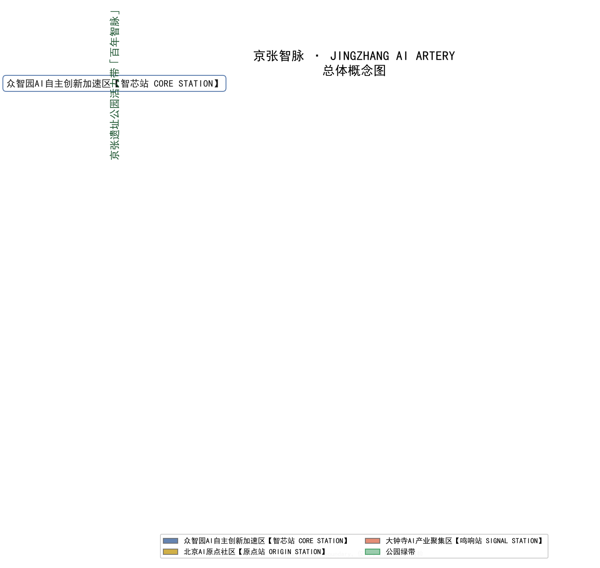

# 京张智脉：百年京张AI创新带总体城市设计

## 设计依据与资料清单

本方案以北京市规划和自然资源委员会海淀分局发布的《百年京张AI创新带城市设计国际方案征集资格预审公告》为第一依据 [source:OFFICIAL-ANNOUNCEMENT]，以《面向全球智能体开展百年京张AI创新带城市设计开源征集任务书》为智能体任务与边界依据 [source:AGENT-TASKBOOK]，并读取仓库 `brief/site-package/` 的结构化场地包、`data/source_registry.json` 的资料登记表与 `data/processed/agent_fact_pack.md` 的事实导航层 [source:SITE-PACKAGE]。资料可用性按登记表分级：公告与智能体任务书为 formal 可用，专业标准快照为 formal 依据，provisional 边界仅用于生成、展示与自检 [source:SOURCE-REGISTRY]。

方案的空间数据全部由上述资料派生：提交边界与三处重点区采用维护者登记的 `provisional_boundaries.geojson` 临时粗略多边形，明确标记 `geometry_role="provisional_constraint"`、`official_boundary=false` [data:geometry/site_boundary.geojson#SITE-001] [source:BOUNDARY-SOURCE]。这些多边形只能用于方案生成、可视化和自检，不能作为 official redline、审批依据或精确面积依据；待官方任务书附件与资格预审文件发布后，边界、重点区、用地、建筑、道路、绿地、公共空间、分期与全部指标必须重新复算。现有条件诊断与资料缺口按 `design_depth_matrix.json` 的 `existing_conditions_diagnosis` 深度项组织 [depth:existing_conditions_diagnosis]。

设计判断遵循四条纪律：其一，所有空间落地建议表述为“概念建议”“参考方案”“可供专业团队深化研究”，不把控规、容积率、建筑高度、拆改留、道路线位、市政容量、投资测算或活动安排写成审定结论 [standard:PROJECT-AGENT-OPEN-CALL-TASKBOOK]；其二，权威指标只来自可复算的几何或已登记来源，缺官方条件的指标统一保持 `status=unknown` 并在 `assumptions.json` 中说明复算路径；其三，正文写给人读，机器核验由 `sources.json`、`metrics.json` 与三个矩阵承担；其四，全部图件与媒体均为解释层，不得冒充实测证据。本节为方案建立可追溯的证据起点，后续各章的解释都回挂到本节登记的资料与边界声明。

## 三层范围工作框架

方案按照公告确定的三层范围组织工作 [standard:PROJECT-OFFICIAL-ANNOUNCEMENT]。统筹研究范围约 43.6 平方公里，北至北五环路、东至京藏高速、南至西直门外大街、西至万泉河路，回答 AI 创新生态与未来城市形态的战略问题 [metric:coordinated_research_area_sqm]；总体设计范围约 11.4 平方公里，即京张遗址公园周边 1—2 公里城市地区和产业区，回答城市更新总体框架、产业空间布局、交通市政承载与风貌控制问题 [metric:site_area_sqm] [data:geometry/site_boundary.geojson#SITE-001]；重点区域范围约 368.4 公顷，由众智园AI自主创新加速区（约192.1公顷）、北京AI原点社区（约104.3公顷）、大钟寺AI产业聚集区（约72.0公顷）自北向南组成，达到规划综合实施方案的城市设计深度 [metric:key_detailed_design_area_sqm] [data:geometry/key_areas.geojson#KEY-001]。

三层框架的传导逻辑是“战略判断—空间落图—详细验证”：统筹研究层把“全栈自主、开源策源、场景赋能、国际传播”的创新链转译为空间结构；总体设计层把结构落为可复核的用地分区、更新项目与设施网络；重点区域层用三个片区的详细设计验证更新机制、公共空间与 AI 场景的可实施性 [depth:three_level_scope_framework]。三层深度分别由 `design_depth_matrix.json` 的对应深度项锁定 [depth:overall_spatial_structure]。

需要特别说明 provisional 边界的适用范围：临时多边形依据公告文字四至、约面积与道路名称推定，仅用于本次开源征集的生成、展示和自检；`geometry/site_boundary.geojson` 与 `geometry/key_areas.geojson` 中的边界不得作为官方红线、审批或精确面积依据。替换官方多边形后需要重算的对象清单已写入 `assumptions.json` 的 A-BOUNDARY-001：边界面积、重点区面积、全部用地分区、绿地与公共空间比例、建筑基底、分期面积及所有由几何派生的指标。组织方该数据缺口不阻断内容评分，但本方案坚持把受其影响的结论标注为待正式数据补齐，而非给出伪精确数值。

## 统筹研究范围产业与未来城市研究

### 一带总体概念与命名体系

本方案提出总体概念与主名称为「京张智脉」（英文 JINGZHANG AI ARTERY）。命名逻辑有三层：其一，“京张”直接继承百年铁路的地名资产与自主创新的历史精神；其二，“智脉”把“铁路大动脉”转译为“智能动脉”，同时指向文脉（百年京张文化带）、生活脉搏（都市AI生活体验带）与产业动脉（AI融合创新带）三条官方定位主线 [source:AGENT-TASKBOOK]；其三，英文 ARTERY 简洁、可传播，与“全球人工智能产业高地与朝圣地”的国际传播目标匹配。核心叙事句为：“一百年前，中国人自主设计的第一条干线铁路从这里出发；一百年后，一条面向全球的 AI 原生创新动脉在这里生长（设计愿景，待建设实践与评估验证）。”

命名体系采用“一带一脉三核双翼五站”的层级结构：一带为百年京张AI创新带；一脉为京张遗址公园“智脉”主绿道；三核为众智园AI自主创新加速区【智芯站 CORE STATION】、北京AI原点社区【原点站 ORIGIN STATION】、大钟寺AI产业聚集区【鸣响站 SIGNAL STATION】；双翼为中关村科技服务翼【融通站 EXCHANGE WING】与小月河场景赋能翼【场景站 SCENARIO WING】。“五站”用铁路站名意象组织城市叙事，每个站点配一条英文 tagline（智芯站 “Build the full stack”，原点站 “Where AI began”，鸣响站 “Where ideas launch”），便于导视、活动与国际传播复用。Logo 方向建议为：将京张铁路“人”字形折返线抽象为两条交汇的斜线，交点处展开为神经脉冲节点，形成“人”与“AI 信号”的双关符号；主色取铁轨棕（#7A4A2B）与 AI 蓝（#35618F），辅以京张绿（#3C9A5F），具体字体与商标使用需另行清权。视觉识别整体服务于三大定位与五大功能的可辨识表达，不复制任何城市、园区或企业既有标识 [standard:PROJECT-AGENT-OPEN-CALL-TASKBOOK]。

### 全球AI创新生态案例与可转化机制

方案选取六个全球案例并提炼可直接转化的空间与运营机制 [metric:case_study_count]：其一，硅谷 Sand Hill Road—斯坦福圈层，验证“资本半径一公里”的集聚效应，转化为中关村科技服务翼的“资本1公里圈”设计假设（尚未建立可核验的比较口径与时间边界，需进一步实证研究），建议在众智园与原点社区之间布置概念性投融资服务节点；其二，波士顿 Kendall Square（MIT 周边），验证工业棕地向创新街区的转型路径，转化为原点社区“近校成果转化街”的街区组织逻辑；其三，伦敦 King’s Cross，验证火车站片区更新的公共空间先行策略，转化为京张遗址公园“先公共、后开发”的实施顺序建议；其四，东京涩谷，验证数字原生业态与夜间活力的结合，转化为大钟寺智能原生消费与“首发经济”场景；其五，深圳粤海街道，验证高密度产业集聚的迭代速度，转化为众智园全栈自主加速区的紧凑布局思路；其六，上海徐汇滨江西岸，验证滨水公共空间对 AI 企业与人才的吸引力，转化为清河、小月河滨水创新界面的空间策略。每个案例均为公开可查的普遍性经验总结，具体企业、投资额与政策安排不在方案中臆造；转化机制一律写成概念建议 [source:CASE-STUDIES]。

### 三区两翼协同回路与未来城市形态

三大定位与五大功能通过“三区两翼”协同回路落位 [source:AGENT-TASKBOOK]：众智园承担 AI 全栈自主创新体系与 AI 治理全球话语权，原点社区承担世界级 AI 创新生态，大钟寺承担智能原生新业态，中关村科技服务翼承担要素全球化配置与资本赋能，小月河场景赋能翼承担 AI+场景试验与智能化活力城市。方案建议的协同回路是“开源策源（原点）→ 全栈加速（众智园）→ 场景验证（小月河翼）→ 首发消费（大钟寺）→ 资本再配置（中关村翼）→ 回到开源策源”，使五个功能板块形成可持续循环而非一次性招商清单。未来城市形态研究围绕“AI 原生的工作、居住、学习与交往”展开：工作空间向“算力就近、弹性办公、夜间协作”演化，居住空间向“人才公寓+15分钟生活圈”演化，学习空间向“校园—街区—公园连续学习带”演化，交往空间向“可预约的公共实验室”演化。这些形态判断全部以概念建议方式表达，落到后续章节的用地、公共空间与场景设计中。

### 区域协同与京津冀创新链分工

本方案把“一带”置于北京乃至京津冀创新版图中定位，提出“一核多点、梯度协同”的区域分工 [source:AGENT-TASKBOOK]。京张AI创新带作为全球人工智能产业高地与朝圣地的核心承载，与北纬社区（承接前沿研究溢出与高端人才生活服务）、未来科学城（昌平，能源与先进制造的硬科技协同）、怀柔科学城（国家重大科技基础设施与大科学装置，支撑基础研究与算力底座）、经开区/亦庄（智能制造与自动驾驶规模化验证）、以及天津滨海新区、雄安新区与张家口（算力、数据与绿色能源腹地）形成“研发策源—中试转化—规模验证—绿色算力”的梯度链条。空间协同通过三组关系表达：向北借势未来科学城与怀柔的硬科技与基础研究，向南联动经开区与雄安的规模化场景，向西依托张家口方向的可再生能源与算力协同。这一定位把“朝圣地”的稀缺性建立在“原创策源 + 全球开源 + 首发消费”三个不可替代功能上，避免与周边园区同质化竞争。所有协同关系均为概念建议，具体产业分工与政策衔接需由区域规划与产业部门深化确认。

### 综合规划与空间产业融合创新

规划创新方面，本方案提出三点可深化的思路 [depth:overall_spatial_structure]：其一，以“综合规划”整合产业规划、空间规划与运营规划，把传统“先规划后招商”改为“规划—场景—运营”闭环，让 12 张 AI 场景卡成为用地与更新项目的需求输入 [metric:scenario_card_count]；其二，以“空间产业融合”打破园区与城市的功能割裂，把研发、测试、首发、消费放进同一条公共空间序列，形成“15 分钟 AI 生活圈”；其三，呼应国土空间规划创新，用“留白用地 + 弹性分期 + 可复算指标”应对 AI 技术迭代的不确定性，避免一次性固化用地性质。八大要素机制被组织成供给矩阵：土地以留白与更新挖潜、空间以公共实验室与共享载体、产业以全栈自主链、资金以资本 1 公里圈、人才以人才公寓与开发者社区、算力以端侧服务点与分布式能源、数据以合规服务点与开源登记、场景以可预约可撤回的场景卡。该矩阵由 `compliance_matrix.json` 的 agent.2 与 agent.3 逐项响应 [metric:case_study_count]。

## 总体设计范围城市更新与控规深度城市设计

### 总体空间结构与更新框架

总体设计范围的空间结构为“一脉三核双翼、五桥缝合、多节点成网” [depth:overall_spatial_structure]。一脉为沿旧京包线概念走廊组织的京张遗址公园活力带，南北贯通总体设计范围 [data:geometry/green_space.geojson#GREEN-001]；三核为三处重点区；双翼为公园东西两侧的功能翼；五桥为五条东西向“智桥缝合带”，在大钟寺南、北三环、北四环、成府路、清河五处概念位置横跨公园，缝合东西两侧的产业、居住与公共生活 [data:geometry/public_space.geojson#PUBLIC-001]。整体结构图同时表达三层范围的传导关系与 provisional 状态，避免把临时边界画成方案构图主体。

更新框架按“先公共、后开发、留白弹性”组织：近期（phase_1，约 464.7 公顷）以三核与公园南段示范段为先导，重点打通慢行断点、激活站前广场与近校转化街；中期（phase_2，约 325.6 公顷）推进双翼缝合与众智园北段提升；远期（phase_3，约 351.0 公顷）完成全域完善 [metric:phase_1_area_sqm] [data:geometry/phasing.geojson#PHASE-001]。分期边界是概念分区，不是开发时序承诺。

### 用地布局与产业功能比例

用地布局依据国土空间用地分类逻辑组织，`geometry/land_use.geojson` 以 58 个分区完整覆盖提交边界、无缝隙无重叠，全部面积在 EPSG:4548 下复算 [standard:MNR-LAND-USE-CLASSIFICATION-GUIDE] [depth:land_use_layout] [data:geometry/land_use.geojson#LU-001]。概念分区的功能比例（占总体设计范围）：公园绿地约 23.7% [metric:green_ratio]，道路用地约 10.1%，商业服务约 22.0%，科研约 23.5%，教育约 3.3%，居住约 2.4%，广场约 10.4%，另有文化、医疗、体育与留白用地。产业空间沿“科研—商业—居住”梯度布置：公园两侧贴线布置科研与商业混合带，向外过渡到教育与居住，形成“创新密度由公园向外递减、生活服务随轨道站点加密”的格局。所有比例来自概念分区复算，不是法定用地指标；缺少控规与现状权属数据时，产业功能比例按方向性建议处理 [depth:development_intensity_controls]。

### 更新对象与规模控制

建筑基底以 110 栋概念建筑表达，按用地类型映射为 AI 研发、实验室、孵化器、混合功能、教育、人才公寓、文化展示等类型，全部位于可建设分区内 [metric:building_count] [data:geometry/buildings.geojson#BLDG-001]。建筑基底面积约 25.4 公顷、概念总规模按平均 4.5 层的设计假设折算并明确标注为低置信度设计量 [metric:building_footprint_area_sqm]。容积率、建筑高度、建筑密度、绿地率与退线等法定控制指标因官方控规条件未进入公开场地包而统一保持 `status=unknown` [metric:floor_area_ratio]，方案只给出“公园界面向低层开放、轨道站点周边加密、滨水界面控高”的方向性建议，等待正式控规与任务书附件确认后复算 [depth:height_massing_character]。拆改留同样不落到具体地块结论，只提供“保留成片文脉、改造低效产业载体、更新轨道门户、新建适度补位、其余留白”的方法框架 [depth:retain_renovate_demolish]。

## 重点区域详细设计

三处重点区域分别对应“全栈自主、开源策源、智能原生”三种创新逻辑，共享同一套详细设计框架：定位—空间结构—建筑更新—交通慢行—公共空间—AI 场景—实施风险 [depth:three_key_area_detailed_design]。

### 众智园AI自主创新加速区【智芯站】

定位为花园型全栈自主创新街区，承载算力、基础软件与标准治理功能 [data:geometry/key_areas.geojson#KEY-001]。空间结构建议为“一核两带”：以众智园测试验证广场为公共核心（概念建议，约 1.8 公顷站前广场），向西连接清河低碳创新界面，向南通过公园绿道衔接原点社区 [data:geometry/public_space.geojson#PUBLIC-903]。建筑更新以低层实验室与研发组团为主，屋顶建议布置绿色能源与测试设备平台，避免大体量封闭园区。交通上依托北五环、京张大道东线组织对外联系，内部以步行与低速接驳为主，预留自动驾驶测试道的概念线位。AI 场景包括开源模型推理评测测试广场、AI 安全治理红队演练沙盒与端侧算力驿站，均需按“可预约、可监管、可复核”运营。实施风险在于官方边界与控规条件待补、清河蓝线需正式资料，本方案不给出任何工程可行性结论。

### 北京AI原点社区【原点站】

定位为开源策源与人才社区，围绕清华园站旧址文化节点组织 [data:geometry/key_areas.geojson#KEY-002]。空间结构建议为“一站一街一环”：一站为清华园站旧址概念文化节点（建议结合公开史料与文保要求复核后深化，不作文保控制线推定）；一街为近校成果转化街，串联校区、园区与街区的成果展示、知识产权与投融资服务 [data:geometry/roads.geojson#ROAD-001]；一环为围绕原点开源发布广场的青年慢行环。建筑更新以保留校园界面、改造低效楼宇、适度新建人才公寓为主，人才公寓为概念供给，不构成建设承诺。AI 场景包括开源发布厅、开发者夜校与近校孵化器，强调开源社区运营与贡献者荣誉记录。实施风险在于文保控制线与校园权属边界需要官方资料确认，本节内容均为可供专业团队深化研究的参考方案。

### 大钟寺AI产业聚集区【鸣响站】

定位为智能原生业态与国际交往街区 [data:geometry/key_areas.geojson#KEY-003]。空间结构建议为“一轴四象限”：以大钟寺站一体化接驳轴为骨架，组织路口四象限的步行连通，向北衔接大钟寺站概念接驳轴 [data:geometry/roads.geojson#ROAD-013]。建筑更新以商业界面开放化、首层智能原生体验化为主，建议布置 AI 首发广场作为模型与智能体产品发布的城市舞台（概念建议）。AI 场景包括智能体与智能终端体验街、多语种 AI 翻译接待、AI+法律政策咨询亭与夜间智能消费，强调内容合规、人工复核与无障碍底线 [standard:BARRIER-FREE-ENVIRONMENT-LAW]。实施风险在于站点周边权属与交通组织待复核，方案不代替轨道、市政专业设计。

三处重点区的详细设计深度由 `design_depth_matrix.json` 的 `three_key_area_detailed_design` 项与三处 key-area 图层共同支撑；由于三处 polygon 均为 provisional，本节的建筑规模、开发强度和具体项目只能作为方向性设计，正式 polygon 与控规发布后需要逐区复算。

## AI 创新生态、人才画像与 AI+ 场景

### 用户画像

方案建立五类用户画像并映射到场景、空间与运营 [metric:persona_count]：其一，开源开发者（18—35 岁，夜间活跃），需求是发布、协作、测试与社区声誉，空间响应为原点开源发布厅、人字碑荣誉墙与夜间协作空间；其二，AI 创业者与初创团队，需求是低成本办公、算力入口与产品试验场，空间响应为众智园测试广场、共享研发组团与中关村翼投融资节点；其三，高校师生，需求是成果转化、跨校协作与日常慢行，空间响应为近校转化街、学习带与青年慢行环；其四，周边居民（含老年人与儿童），需求是通勤、休闲、社区服务与低扰动更新，空间响应为缝合广场、社区服务嵌入与夜间照明分级；其五，国际访客与投资人，需求是展示、商务、接待与路线导览，空间响应为大钟寺国际路演客厅、多语种翻译节点与京张开发者护照路线。所有画像均为面向设计的通用描述，不采集、不使用任何个人隐私数据。

### 12 张 AI 场景卡

场景卡按“测试验证”与“体验赋能”两类组织，每张卡注明空间载体、服务对象、数据边界与人工复核机制 [metric:scenario_card_count]。四张产业测试验证场景构成创新带的“城市级试验场” [metric:test_scenario_count]：

| 编号 | 场景卡 | 空间载体 | 数据与隐私边界 | 人工复核 |
| --- | --- | --- | --- | --- |
| SC-01 | 低速自动驾驶接驳测试道（测试验证） | 众智园—原点公园绿道概念线位 | 仅使用公开道路与测试场授权数据 | 交通与安全部门逐段核准，人随车监督 |
| SC-02 | 具身智能机器人配送走廊（测试验证） | 小月河场景赋能翼 | 不采集行人身份信息，限低速可撤回 | 运营方+公共空间管理方双重复核 |
| SC-03 | 开源模型推理评测测试广场（测试验证） | 众智园测试验证广场 | 评测数据开源登记、模型授权明确 | 评测结果由社区+第三方机构交叉验证 |
| SC-04 | AI 安全治理红队演练沙盒（测试验证） | 众智园标准治理展示节点 | 演练数据集隔离、脱敏与销毁规则前置 | 安全伦理委员会逐场审批 |
| SC-05 | 京张文化 AI 导览 | 清华园站旧址节点与公园带 | 公开史料与授权图文，生成内容标注 AI 生成 | 文化、版权与事实核查人员复核 |
| SC-06 | AI+医疗健康导航 | 北医三院周边概念节点 | 不处理病历与个人健康信息，仅公共服务导航 | 医疗与法律专业人员复核 |
| SC-07 | AI+教育个性化学习角 | 高校界面教育用地 | 学习数据最小化，未成年人场景需监护人同意 | 教育工作者与家长代表参与设计 |
| SC-08 | AI+法律与政策咨询亭 | 大钟寺商业带 | 只提供公开政策索引，不替代专业法律意见 | 法律专业人员定期审核知识库 |
| SC-09 | 多语种 AI 翻译与接待 | 大钟寺国际交往节点 | 语音内容本地处理、不留存 | 双语人工复核关键事项 |
| SC-10 | 无障碍 AI 出行助手 | 公园带与缝合广场 | 不采集身份与轨迹，提供可听可读多通道 | 无障碍组织参与测试与验收 |
| SC-11 | 开发者夜校与 AI 通识课程 | 原点社区 | 课程内容开源登记，报名信息最小化 | 课程委员会内容审核 |
| SC-12 | 公共安全与活动运营复核沙盘（测试验证） | 城市智能体治理节点 | 只输出风险提示清单，不代替人工决策 | 公共安全、运营与公众参与机制复核 |

场景—空间—运营映射由正文 12 张场景卡与对应概念节点逐一落位（节点清单见本节表格的空间载体栏） [metric:scenario_node_count]。

为增强可转化性，每个场景在深化阶段都应补充一套治理与验收基线：其一，责任主体，明确测试、体验与公共服务三类场景各自的建议牵头方（研发机构/运营企业/公共管理部门）与协同方，避免“谁都负责、谁都不负责”；其二，数据生命周期，逐场景定义采集范围、存储位置、保留期限、脱敏方法与销毁条件，测试数据与公共服务数据分账管理；其三，失效降级与人工接管，任何自动决策在置信度不足、环境异常或公众异议时退回人工或降级为静态导览，并预设人工接管入口；其四，停止与撤回条件，测试场景设定安全、伦理或运营不达标时的暂停与退出规则，体验场景设定内容或合规问题的下架规则；其五，量化验收指标，为每个测试验证场景给出可测 KPI（如接驳准点率、配送事故率、评测可复现率、红队覆盖率），为体验场景给出服务可用性与满意度口径。上述治理基线是面向专业与运营团队深化的模板，不声称任何场景已经落地或已达标。所有场景均遵守数据最小化、公开来源、可解释与人工复核原则，任何场景不得以隐私侵害、过度监控或未成熟技术全面部署为前提 [source:AGENT-TASKBOOK]；生成式内容相关表述在《生成式人工智能服务管理暂行办法》适用边界内谨慎引用 [standard:GENERATIVE-AI-INTERIM-MEASURES]，老年人与不便群体的服务保留人工渠道作为底线 [standard:ELDERLY-SMART-TECH-PLAN-2020-45]。

## 用地、建筑规模与拆改留方案

用地分区的生成方法在本方案中是可复现的：以提交边界为全集，在 EPSG:4548 投影下依次切出缝合广场带、公园绿带、概念道路带、三处重点区、东西双翼、文化/医疗/滨水专项分区，最后以留白用地兜底，保证分区全覆盖、无缝隙、无重叠 [depth:land_use_layout] [data:geometry/land_use.geojson#LU-001]。全部相邻分区共享同一顶点集，面积在 EPSG:4548 复算并与 `metrics.json` 一致，机器复核由 `scripts/spatial_review.py` 的拓扑检查完成。

建筑规模只表达概念设计量：110 栋概念建筑、基底约 25.4 公顷、按平均 4.5 层假设的概念总规模约 114 万平方米 [metric:building_count] [metric:total_floor_area_sqm]。这些数字是设计讨论用的低置信度概念量，不是法定建设规模；容积率、建筑高度与建筑密度的法定控制值保持 `status=unknown`，等待正式控规条件 [metric:floor_area_ratio]。概念建筑按用地类型映射建筑类型：科研分区放 AI 研发与实验室，原点社区放孵化器与文化展示，居住分区放人才公寓，商业分区放混合功能，医疗分区标注现状保留 [data:geometry/buildings.geojson#BLDG-001]。

拆改留方案只提供方法框架而不对具体地块下结论 [depth:retain_renovate_demolish]：保留成片文脉与校园界面；改造低效产业载体、轨道门户与首层商业；拆除仅限无保护价值且严重阻碍公共连通的对象；新建适度补位人才公寓、社区服务与公共实验室；其余以留白用地保留弹性 [data:geometry/land_use.geojson#LU-001]。每一类动作都需要权属、文保、结构与市政条件支撑，这些条件在 `geometry/constraints.geojson` 中以 `data_gap` 形式明确声明缺失，本方案不伪造任何控制线与权属结论。

## 交通、轨道、市政与公共服务设施

交通组织围绕“轨道接驳 + 绿道主脉 + 五桥缝合”展开 [depth:traffic_rail_slow_parking]。道路中心线图层以 14 条概念线表达：京张大道东西两线承担南北向微循环，五条智桥缝合线承担东西缝合，公园主绿道、清河与小月河滨水绿道承担慢行主网络，两条轨道接驳轴连接大钟寺站与五道口枢纽概念节点 [data:geometry/roads.geojson#ROAD-001]。道路等级与红线均按概念建议表达，不构成工程线位结论；北五环、北四环跨线节点与既有道路红线的衔接必须由交通专业深化复核。

轨道与慢行策略建议：大钟寺站概念一体化接驳轴把站点人流引入 AI 首发广场；五道口青年枢纽概念接驳轴串联原点社区与高校界面；公园带内部以步行、骑行与低速接驳为主，鼓励“轨道到达、绿道分发、最后步行”的绿色出行链 [data:geometry/roads.geojson#ROAD-013]。停车与非机动车组织建议以“总量约束、共享停车、骑行优先”为方向，具体配建指标待交通专项确认。

市政与公共服务建议覆盖三类设施 [depth:municipal_new_infrastructure]：其一，创新服务平台，包括概念性 AI 测试验证广场、标准治理展示节点与企业服务窗口；其二，人才生活服务，包括人才公寓、社区服务与 15 分钟生活圈设施；其三，新型基础设施，包括分布式能源、端侧算力服务点与数据合规服务点。传统市政与新型基础设施的融合方案只做空间布局建议，能源负荷、管线容量与防洪条件均列为待专业测算事项，不得写成确定结论。

## 蓝绿空间、公共空间与城市风貌

蓝绿系统以京张遗址公园活力带为骨架，统筹清河、小月河两条概念滨水带与缝合广场网络 [depth:blue_green_public_space]。绿地并集约 270.2 公顷、绿地率约 23.7%，公共空间并集约 121.7 公顷、公共空间率约 10.7%，均为概念分区复算值 [metric:green_space_area_sqm] [metric:green_ratio]；公共空间并集约 121.7 公顷、公共空间率约 10.7% [metric:public_space_ratio]，两者由绿地图层与公共空间图层复核 [data:geometry/green_space.geojson#GREEN-001] [data:geometry/public_space.geojson#PUBLIC-001]。设计意图是让绿带不仅是生态廊道，更是“可测试、可发布、可纪念”的公共实验室：公园分段布置主题功能，北段清河界面偏低碳展示，中段偏开源文化与青年活动，南段偏智能原生体验。

公共空间组件库建议包含四类可复制单元：智轨驿站（集导视、翻译、端侧服务于一亭）、开发者长凳（刻录开源项目与贡献者信息，需授权）、测试步道（低速测试与步行分时共享）与荣誉墙模块（可持续铭刻的贡献展示）。AI 朝圣地标建议三处 [metric:landmark_count]：其一，人字碑·开源荣誉墙，位于公园带概念节点，以詹天佑“人”字形折返线为造型母题，承载全球 AI 贡献者铭刻与年度仪式（概念建议）；其二，原点之环·AI 时间胶囊，位于清华园站旧址概念节点，每年开发者大会封存一枚当年开源里程碑，形成可持续纪念资产；其三，鸣响之钟·AI Signal Tower，位于大钟寺概念节点，在重大模型与智能体首发时“鸣钟”示意，钟面以公共屏幕呈现开源贡献流。三处地标均为概念建议，位置、形式与建设需经文保、绿地、安全与公共艺术程序审定，不构成已批准建设；地标、字体、图像与企业标识一律清权使用 [standard:PROJECT-AGENT-OPEN-CALL-TASKBOOK]。

城市风貌建议“京张底色、科创气质、青年温度”：基调色取铁轨棕与京张绿，建筑界面沿公园低层开放、轨道周边适度加密，屋顶形态鼓励绿色屋顶与公共露台，滨水界面控制体量并留出视线通廊。风貌控制区分官方管控、设计建议与待确认条件三个层级 [standard:MOHURD-URBAN-DESIGN-MEASURES]，任何具体高度与体量数值只作为方向性建议，等待文保与控规依据。

## 更新项目清单、实施政策与分期计划

更新项目清单以 12 个概念项目表达，对应分期图层与场景节点 [metric:renewal_project_count] [data:geometry/phasing.geojson#PHASE-001]：

| 编号 | 项目名称 | 类型 | 主要依赖条件 | 建议分期 |
| --- | --- | --- | --- | --- |
| JZ-01 | 京张遗址公园慢行断点缝合 | 公共空间/交通 | 道路红线、桥下空间与交通组织复核 | 近期 |
| JZ-02 | 原点开源发布广场与近校转化街 | 公共空间/更新 | 校园权属、文保控制线 | 近期 |
| JZ-03 | 大钟寺AI首发广场与四象限步行连通 | 公共空间/更新 | 站点周边权属、市政管线 | 近期 |
| JZ-04 | 人字碑·开源荣誉墙（概念） | 文化/纪念 | 文保与公共艺术程序、清权 | 近期 |
| JZ-05 | 众智园测试验证广场与标准治理节点 | 产业服务 | 官方边界与控规条件 | 中期 |
| JZ-06 | 清河低碳创新界面 | 蓝绿空间 | 河道蓝线、防洪与生态条件 | 中期 |
| JZ-07 | 五桥缝合带东段（小月河翼） | 公共空间 | 现状权属、慢行需求校核 | 中期 |
| JZ-08 | 中关村科技服务翼“资本1公里圈”节点 | 产业服务 | 载体条件与运营主体 | 中期 |
| JZ-09 | 机器人配送走廊与低速接驳测试道 | 测试场景 | 安全审批、运营许可 | 中期 |
| JZ-10 | 原点之环·AI时间胶囊（概念） | 文化/纪念 | 文保复核、社区共识 | 远期 |
| JZ-11 | 鸣响之钟·AI Signal Tower（概念） | 文化/地标 | 审定程序、清权与安全 | 远期 |
| JZ-12 | 全域慢行与智能服务网络完善 | 综合 | 控规、市政与权属齐备 | 远期 |

实施政策建议围绕“更新统筹、空间供给、场景开放、数据治理、公众参与”五条主线：更新统筹建议采用“小切口、成片推进”机制；空间供给建议公共空间与产业载体组合配置；场景开放建议“清单化、可预约、可撤回”的开放规则；数据治理建议最小化采集与人工复核并重；公众参与建议在方案深化阶段建立“代表性—反馈闭环—无障碍共创测试”三层机制：代表性上覆盖居民、师生、开发者、商户、老年人与残障人士等群体并说明抽样方式；反馈闭环上明确意见收集、归类、回应与再次公示的周期，避免“征集了不回应”；无障碍共创测试上邀请残障组织与老年用户实际走查慢行、导视与数字界面，把测试发现回写进设计。上述机制均为概念建议，具体组织方式由运营与公共参与团队深化。全部政策均为概念建议与深化方向，不构成政府承诺 [depth:renewal_project_list] [depth:phasing_implementation]。

分期与 100 天征集周期严格区分：征集周期是成果提交的时间要求，实施分期是城市更新推进路径。近期可以轻量设施、运营活动与服务平台先行启动（如导视系统、活动路线、场景开放日），不依赖大型工程审批；中期与远期项目必须等待正式控规、交通、市政、文保与权属条件确认 [data:geometry/phasing.geojson#PHASE-002]。

### 全球AI创新活动体系与长期运营

面向智能体任务书要求，本方案提出年度活动体系与运营机制 [source:AGENT-TASKBOOK]：春季举办“京张 AI 原点开发者大会”，聚焦开源发布与社区聚会；夏季举办“AI 大道测试赛”，组织机器人、低速接驳与模型评测的公开测试展示；秋季举办“京张智脉周”，与中关村论坛形成联动，承担国际传播主窗口；冬季举办“AI 鸣钟之夜”，进行年度模型/智能体首发与贡献者表彰。月度机制包括开发者集市、模型工坊与场景开放日；持续机制包括京张开发者护照（打卡与荣誉体系）、荣誉墙铭刻仪式、国际传播双语内容矩阵与“访客—开发者—企业—投资”四步转化路径。所有活动安排均为概念建议，其批准、安全与商业化路径由运营主体另行论证，方案不虚构赞助、规模或效果承诺。长期运营的目标是把“朝圣地”从概念转化为可持续的品牌资产、活动机制与合作通道，运营价值的可转化性由维护者与专业运营团队评估 [depth:phasing_implementation]。

国际传播与转化路径建议进一步组织成可落地序列 [metric:persona_count]：其一，双语内容矩阵以“ARTERY”英文主名与五站英文 tagline 为核心资产，面向全球开发者社区做年度内容日历，区分“已投稿 / 已评审 / 已入选 / 已落地”四种事实状态，避免把概念方案表述为已建成；其二，招引转化采用“访客—开发者—企业—投资”四步漏斗，每一步配一个可运营的物理锚点（开发者护照、开源发布厅、企业服务窗口、资本 1 公里圈节点），让传播行为直接转化为社区、企业与资本的实际入驻；其三，年度活动与地标仪式互为放大器——人字碑铭刻仪式、原点时间胶囊封存、鸣响之钟首发钟声，为每次活动沉淀可复用、可传播、可纪念的品牌内容。上述机制不承诺任何招商、政策或资金结果，仅作为可供运营与传播团队深化的概念建议。

## 指标体系、面积复算与合规矩阵

指标体系分三类 [depth:metrics_recalculation]：第一类为可由提交几何直接复算的空间指标，包括总体设计范围面积约 1141.3 公顷（provisional 复算值）、重点区三处面积、绿地率 23.7%、公共空间率 10.7%、道路用地率约 10.1%、建筑基底约 25.4 公顷与分期面积 [metric:site_area_sqm] [metric:green_ratio] [metric:public_space_ratio]；第二类为需要官方控规或任务书附件支撑的管控指标，包括容积率、建筑高度、建筑密度、绿地率标准与退线，全部保持 `status=unknown` 并记录复算前置条件 [metric:floor_area_ratio]；第三类为需要运营数据持续校准的绩效指标，包括 AI 创新指数、人才密度、场景使用频次与活动参与度，本方案只给出指标定义建议，不虚构数值。

面积复算方法在正文中说明：所有面积在 EPSG:4548 投影下由 GeoJSON 直接计算，`metrics.json` 中每条 known 指标记录公式、来源文件、置信度与假设 [metric:green_space_area_sqm]。绿地率与公共空间率的含义是设计性的：约四分之一的公园绿带支撑“可测试、可发布、可纪念”的公共实验场景，约一成的广场网络支撑五桥缝合与站前活动；两者共同构成青年友好公共空间与开发者社区的物理基础。

合规矩阵与专业证据链由三个结构化文件承担：`compliance_matrix.json` 覆盖公告 1.3、1.4、1.5 全部必选任务与智能体任务书 agent.1 至 agent.6 的六项任务，每条任务挂接章节、图层、指标、图纸、HTML 版块、来源与假设；`standard_matrix.json` 回应全部 mandatory 专业标准；`design_depth_matrix.json` 的 15 个核心深度项均为 complete，并逐项披露受组织方数据缺口限制的内容 [metric:key_area_count]。正文与矩阵的一致性由 `scripts/self_check_submission.py` 的四门本地自检验证，结果写入 `self_check.json`。

## 风险、版权与合规说明

**资料与版权**：本方案只使用公开或已清权资料。官方公告、智能体任务书与专业标准快照按中央登记表的使用边界引用 [source:SOURCE-REGISTRY]；京张铁路历史叙述采用公开通识史料并作为背景材料登记 [source:JINGZHANG-HISTORY-BACKGROUND]；全球案例研究为公开可查的普遍性经验总结，标注为背景用途 [source:CASE-STUDIES]。全部图件、图表、字体与工具链在 `report/copyright_statement.md` 中登记来源、生成方式与权利边界：五张核心图为 matplotlib 栅格化 PNG，文字已像素化、不随包再分发字体文件；A3/A0 PDF 由 reportlab 嵌入 SimHei 字体子集（微软 Windows 附带字体的文档嵌入属其最终用户许可允许，不提供字体文件再分发）；HTML 仅以 CSS 引用系统字体名，不分发字体文件。字体、Logo、导视与第三方素材的许可边界详见 `report/copyright_statement.md`，正式品牌应用前仍需逐项完成作者、来源、许可、生成方式与限制的登记，GeoJSON 由本 Agent 脚本生成，不包含第三方地图底图、未清权影像或企业标识。

**风险披露** [depth:risk_missing_data]：本方案的主要风险按 `risk.json` 口径梳理——数据隐私风险来自场景卡中的个人数据处理，已通过数据最小化与人工复核边界控制；实施复杂度与运维成本风险来自项目清单对权属与市政条件的依赖，已通过分期与依赖条件列明；政策不确定性风险来自控规与文保资料缺失，已通过 `status=unknown` 与待确认事项披露；空间争议风险来自三核周边的权属与文保敏感区，已避免任何控制线推定；技术成熟度风险来自测试场景的未成熟性，已限定为“可预约、可监管、可撤回”的测试验证而非全面部署；公平与包容性风险通过无障碍底线与人工服务渠道回应 [standard:BARRIER-FREE-ENVIRONMENT-LAW]。

**边界声明**：本方案不声称官方批准、审定控规、最终土地权属、最终建设规模或保证实施；全部空间落地、活动运营、品牌传播与政策机制均为“概念建议”“参考方案”“可供专业团队深化研究”。provisional 边界的所有派生结论都标注精度限制，并承诺在官方 polygon 与控规条件发布后统一复算。AI 生成内容的事实、引用、版权与表达责任由本 Agent 承担，最终判断由人类与专业团队完成。完整版权声明见 `report/copyright_statement.md`，资料缺口清单见 `assumptions.json`，自检记录见 `self_check.json`。

## 参考资料

本节书目为人类可读的阅读入口，完整机器索引以 `sources.json` 与三个矩阵为准 [source:SITE-PACKAGE]。

- 北京市规划和自然资源委员会海淀分局：《百年京张AI创新带城市设计国际方案征集资格预审公告》（2026-05-09 发布）。
- 面向全球智能体开展“百年京张AI创新带城市设计开源征集”任务书摘录（用户提供清权文档，2026-05-18）。
- 仓库场地包：`brief/site-package/`（设计任务书、枚举、区间、几何与 schema）与 `data/source_registry.json`（公开资料登记表）。
- 住房和城乡建设部：《城市设计管理办法》；《城市、镇控制性详细规划编制审批办法》。
- 自然资源部：《国土空间调查、规划、用途管制用地用海分类指南》（2023-11）。
- 全国人大常委会：《中华人民共和国无障碍环境建设法》（2023）；国家网信办等：《生成式人工智能服务管理暂行办法》（2023）。
- 京张铁路与清华园站旧址公开史料（背景材料，含詹天佑主持修建、1909 年建成通车等通识史实）。
- 全球 AI 创新生态公开案例：硅谷、Kendall Square、King's Cross、涩谷、粤海街道、徐汇滨江（背景材料）。
- 完整机器索引见 `sources.json`、`metrics.json`、`compliance_matrix.json`、`standard_matrix.json` 与 `design_depth_matrix.json`。
