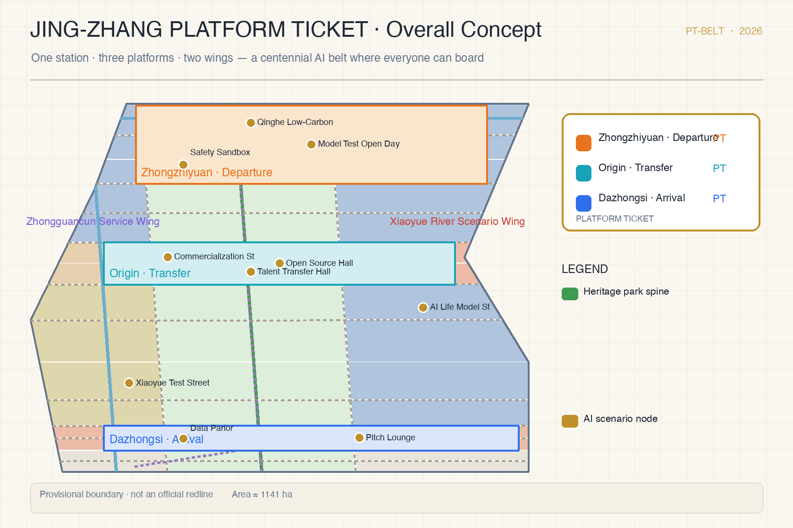
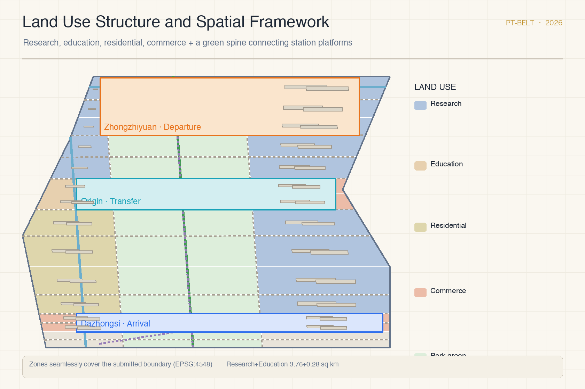
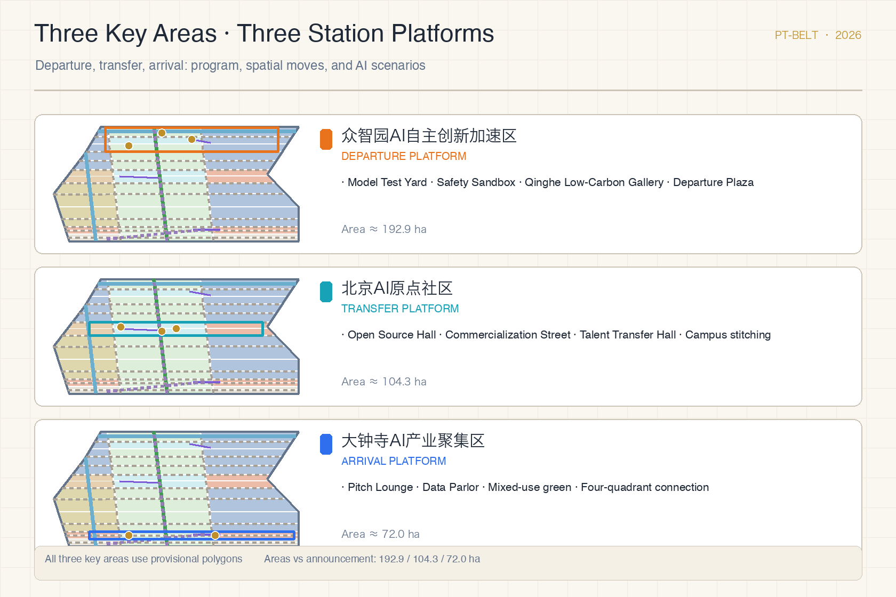
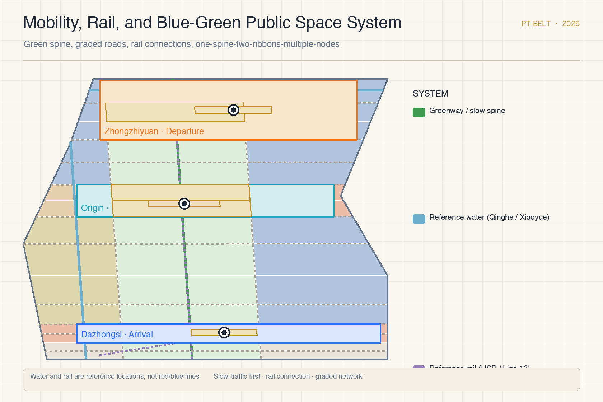
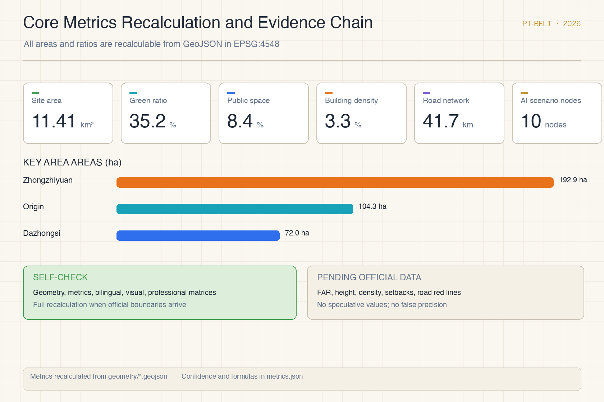

# Jing-Zhang Platform Ticket: A Centennial AI Innovation Belt Where Everyone Can Board

## Design Basis and Source List

This proposal is primarily based on the Prequalification Announcement for the International Urban Design Solicitation for the Centennial Jing-Zhang AI Innovation Belt, issued by the Haidian Branch of the Beijing Municipal Commission of Planning and Natural Resources, which defines the three-level scope, the three key areas, the design tasks, and the required depth of deliverables [source:DATA-SRC-OFFICIAL-ANNOUNCEMENT-20260509]. The agent-facing open-call taskbook adds the three positioning statements, five functions, three areas and two wings, and six mandatory tasks, and stipulates that all agent spatial proposals are conceptual suggestions, reference schemes, or material for professional teams to deepen, and do not replace statutory planning [source:DATA-SRC-AGENT-TASKBOOK-20260518]. The provisional rough boundaries in the site package are used only for generation, visualization, and intake self-check; the textual four-direction description and the approximately 11.4 square kilometers from the announcement remain the primary basis for scope judgment [data:geometry/site_boundary.geojson#SITE-001] [source:DATA-SRC-PROVISIONAL-BOUNDARIES-20260605].

The proposal also follows the Measures for the Administration of Urban Design in organizing public space, urban character, and building layout; the Measures for the Formulation and Approval of Regulatory Detailed Plans in structuring regulatory-plan-level deliverables; and the Land Use Classification Guide for Spatial Surveys, Planning, and Use Control in organizing land-use categories [standard:MOHURD-URBAN-DESIGN-MEASURES] [standard:MOHURD-CONTROL-DETAILED-PLANNING] [standard:MNR-LAND-USE-CLASSIFICATION-GUIDE]. Local snapshots of all three standards exist in the reference library; the narrative keeps only claim-adjacent anchors, while complete indexes live in `sources.json`, `standard_matrix.json`, and `design_depth_matrix.json` [depth:existing_conditions_diagnosis].

Site context comes from public sources and common background knowledge: the Jing-Zhang Railway Heritage Park is an open linear public space, and the reference locations of the Qinghe River, the Xiaoyue River, and rail lines are used only to organize the concept and are not treated as red lines or blue lines [source:SRC-JZ-RAILWAY-HERITAGE-PARK] [data:geometry/constraints.geojson#CONSTRAINTS-001]. The platform ticket, as a cultural artifact of railway passenger service, is used for narrative and participation-mechanism design only and carries no planning-control weight [source:SRC-PLATFORM-TICKET-CULTURE]. Official precise boundaries, official polygons for the three key areas, regulatory-plan indicators, and engineering conditions are still pending; the gap list is registered item by item in `assumptions.json` and the compliance matrix. The organizer data gap does not block content scoring, but all precision-sensitive metrics must be recalculated when official data arrives.

## Three-Level Scope Framework

The proposal organizes the overall spatial structure as "one station, three platforms, two wings": the "long platform" public spine anchored by the Jing-Zhang Railway Heritage Park, the three station platforms corresponding to the three key detailed-design areas announced by the organizer, and the two wings corresponding to the Zhongguancun technology-service wing and the Xiaoyue River scenario-empowerment wing. The structure covers all three levels: the coordinated research area addresses the industrial ecosystem and future city form, the overall design area addresses urban renewal and regulatory-plan-level layout, and the key areas address detailed design of the three platforms [depth:three_level_scope_framework] [data:geometry/key_areas.geojson#KEY-001].

The three levels are not a set of disconnected drawings. The coordinated research level defines the industrial chain and talent flow, the overall design level translates judgments into land-use, building, road, and public-space layers, and the key-area level tests functional programs, building scale, retain-renovate-demolish categories, and mobility feasibility as discussable content [depth:overall_spatial_structure]. All areas and ratios can be recalculated from `geometry/*.geojson` in EPSG:4548 [metric:site_area_sqm]; conclusions that cannot be recalculated are not stated as formal results.

The naming system and visual identity direction (agent.1) are generated together with the overall concept: the Chinese main name is "Jing-Zhang Platform Ticket", the English main name is "Jing-Zhang Platform Ticket", abbreviated "PT-Belt". The visual identity uses ticket elements as its prototype: each of the three platforms has a "ticket stamp" (departure orange, transfer cyan, arrival blue), and ticket stubs record contributions and versions, forming a continuable ticket-style brand asset [standard:PROJECT-AGENT-OPEN-CALL-TASKBOOK].

## Coordinated Research Area: Industry and Future City Research

The coordinated research area (about 43.6 square kilometers) asks how a world-class AI innovation ecosystem can be organized spatially and how a future city form can support the three positioning statements: the centennial Jing-Zhang culture belt, the urban AI living-experience belt, and the AI integration innovation belt [source:DATA-SRC-OFFICIAL-ANNOUNCEMENT-20260509]. The proposal abstracts the innovation chain into a board-ride-arrive flow model: universities, institutes, and open-source communities generate outcomes at the departure end; enterprises and capital convert and amplify them in the middle; global exchange and scenario consumption realize value at the arrival end; the two wings carry factor allocation and scenario empowerment respectively [source:DATA-SRC-AGENT-TASKBOOK-20260518].

The five ecosystem functions (full-stack autonomous innovation, world-class AI ecosystem, AI-plus scenario empowerment paradigm, intelligent vibrant AI city, and global discourse on AI governance) are mapped to five spatial carriers across the coordinated area: full-stack testing yards, open-source collaboration communities, scenario test streets, smart living model blocks, and governance dialogue venues. The proposal compiles six reference directions for transferable global ecosystem cases: open-source foundation models, developer community residencies, open red-team evaluation, competition-to-incubation conversion, open scenario tendering, and honor-collection communication. All are recorded as reference mechanisms, not confirmed government actions [standard:PROJECT-AGENT-OPEN-CALL-TASKBOOK].

The future-city research emphasizes public accessibility: the belt should not be a corporate corridor only, but a place where residents, students, developers, and visitors can enter AI sites at low thresholds. Three future-city experiments are proposed: public testing open days, nighttime collaboration hours, and station-front public spaces run around the clock, all starting with lightweight facilities and operations and awaiting formal conditions before deepening [depth:overall_spatial_structure].

## Overall Design Area: Urban Renewal and Regulatory-Plan-Level Urban Design

The overall design area (about 11.4 square kilometers) organizes an urban renewal framework that runs north-south through the heritage park spine and stitches the east-west sides. The land-use structure follows "research-led, commerce-and-housing-supported, green-spine-connected": the north section organizes research and autonomous innovation around Zhongzhiyuan, the middle section organizes education-to-research commercialization around the Origin Community, the south section organizes commerce and industrial arrival around Dazhongsi, and park green and plaza areas thread the middle [data:geometry/land_use.geojson#LU-001] [depth:land_use_layout]. The zoning is generated by partitioning the provisional boundary; all cells share boundary coordinates, seamlessly cover the submitted boundary, and will be fully recalculated by the same method when the official boundary arrives.

Building scale and retain-renovate-demolish logic use a graded expression: retained buildings continue the existing research and education fabric; renewed buildings propose function replacement and ground-floor openness at the block level; new buildings are expressed only as conceptual footprints and massing hints, with no parcel-level demolition conclusions [data:geometry/buildings.geojson#BLDG-001] [depth:retain_renovate_demolish]. The conceptual building footprint area and density are recorded in the metrics table as reviewable design discussion values [metric:building_footprint_area_sqm].

Development intensity controls follow the principle of no numeric value without official conditions: floor area ratio, building height, building density, green ratio, and setbacks remain "pending official data" until regulatory-plan conditions are supplied [depth:development_intensity_controls] [depth:height_massing_character]. The proposal only offers a framework for intensity zoning: moderate agglomeration at station cores, controlled massing along the heritage park, and human-scale residential neighborhoods; concrete values are to be calibrated by professional teams once official conditions are confirmed.

## Detailed Design of Key Areas

The three key areas are organized as three "station platforms", each with positioning, spatial moves, AI scenarios, and implementation dependencies, all labeled as conceptual suggestions [depth:three_key_area_detailed_design] [data:geometry/key_areas.geojson#KEY-001].

The Zhongzhiyuan AI Autonomous Innovation Acceleration Area (about 192.1 hectares) is positioned as the "departure platform": it organizes full-stack autonomous innovation scenarios around model testing, standard setting, safety governance, and low-carbon computing, strengthens the Qinghe riverfront interface and external transport, and uses green space to host open testing and governance showcases [data:geometry/key_areas.geojson#KEY-001] [source:DATA-SRC-OFFICIAL-ANNOUNCEMENT-20260509]. Spatial moves include the Qinghe Low-Carbon Innovation Gallery, the Model Test Open Yard, the Safety Governance Sandbox, and the Departure Plaza, with the station service zone on the Qinghe side [data:geometry/constraints.geojson#ZONE-001].

The Beijing AI Origin Community (about 104.3 hectares) is positioned as the "transfer platform": it carries the transfer of talent and outcomes among campuses, parks, and neighborhoods, and organizes open-source releases, commercialization, talent services, and near-campus incubation [data:geometry/key_areas.geojson#KEY-002]. Spatial moves include the Near-Campus Commercialization Street, the Open Source Release Hall, the Talent Transfer Hall, and campus-park slow-traffic stitching, linked with the station service zone and rail connections [data:geometry/constraints.geojson#ZONE-002].

The Dazhongsi AI Industry Cluster (about 72.0 hectares) is positioned as the "arrival platform": it organizes global exchange and scenario consumption for leading enterprises, agents, intelligent terminals, and data elements, and uses the Dazhongsi station to connect the four quadrants with pedestrian access [data:geometry/key_areas.geojson#KEY-003]. Spatial moves include the International Pitch Lounge, the Data-Element Parlor, the mixed use of planned green space, and the Arrival Plaza, with the station service zone close to the rail station [data:geometry/constraints.geojson#ZONE-003].

All three key areas use the repository's provisional rough polygons; their areas compare well with the announced values (Zhongzhiyuan 192.9 hectares, Origin Community 104.3 hectares, Dazhongsi 72.0 hectares) [metric:zhongzhiyuan_area_sqm] [metric:beijing_ai_origin_area_sqm] [metric:dazhongsi_area_sqm]. When official polygons arrive, platform boundaries, service zones, and all area metrics must be regenerated and recalculated.

## AI Innovation Ecosystem, Personas, and AI+ Scenarios

The AI innovation ecosystem is carried by the "platform-ticket participation mechanism": the ordinary ticket corresponds to public open days, the platform ticket to scenario reservation experiences, the souvenir ticket to pilgrimage landmark check-ins and contribution honors, and the work ticket to industry testing and developer collaboration [source:DATA-SRC-AGENT-TASKBOOK-20260518] [depth:three_key_area_detailed_design]. The ticket face is identity and the stub is record, turning "contributions stay memorable" from a slogan into an operable public credential system, while keeping data minimization and human review boundaries.

The proposal forms 10 AI scenario cards covering industry testing, public services, and urban life: the Departure Test Yard, the Red-Team Test Gallery, the Qinghe Low-Carbon Innovation Gallery, the Open Source Release Hall, the Near-Campus Commercialization Street, the Talent Station, the International Pitch Lounge, the Data-Element Parlor, the Xiaoyue River Scenario Test Street, and the AI Daily-Life Service Model Street. The first four also constitute three industry test and validation directions (model testing, safety evaluation, commercialization validation) [data:geometry/constraints.geojson#NODE-001] [metric:scenario_node_count]. Each card states the service object, spatial carrier, data boundary, human review, and operator; the full table is in the compliance matrix and the HTML pages.

Five personas correspond to five types of "passengers": open-source developers (platform + work tickets), startup teams (platform + work tickets), visiting executives of leading enterprises (work + souvenir tickets), surrounding residents (ordinary tickets), and university faculty and students (platform + ordinary tickets). Scenario-space-operation mapping follows one principle: public-space scenarios reference the public-space layer, slow-traffic scenarios reference the road layer, and open-space scenarios reference the green-space layer [data:geometry/public_space.geojson#PUBLIC-001] [data:geometry/roads.geojson#ROAD-001] [data:geometry/green_space.geojson#GREEN-001].

| Persona | Typical needs | Spatial response | Ticket types |
| --- | --- | --- | --- |
| Open-source developer | Release, collaboration, testing, community reputation | Origin release hall, public code wall, night collaboration space | Platform + work |
| Startup team | Low-cost office, compute access, product test field | Shared test yard, edge-compute service point | Platform + work |
| Executive visitor | Showcase, business, international reception, recruiting | Pitch lounge, rail connection, station-front plaza | Work + souvenir |
| Surrounding resident | Commute, leisure, community services, low-disturbance renewal | Heritage park loop, embedded services, graded events | Ordinary |
| Faculty and students | Commercialization, cross-campus collaboration, daily walking | Commercialization street, AI education points, slow-traffic stitching | Platform + ordinary |

## Land Use, Building Scale, and Retain-Renovate-Demolish Strategy

The land-use plan follows the Land Use Classification Guide for Spatial Surveys, Planning, and Use Control, forming seven categories: research, education, urban residential, commercial services, park green, plaza, and reserved land. The partition fully covers the submitted boundary with no overlaps or gaps [standard:MNR-LAND-USE-CLASSIFICATION-GUIDE] [data:geometry/land_use.geojson#LU-001]. Category areas are itemized in the metrics table; research and education land form the main share of buildable land, green and plaza areas follow the heritage park spine, and reserved land is kept at the south end and platform edges for professional teams to deepen under regulatory conditions [metric:land_use_area_0802_sqm].

The building plan distinguishes three conceptual actions: retain, renew, and new-build. Retained buildings continue the existing fabric; renewed buildings focus on function replacement and ground-floor openness; new buildings are expressed only as conceptual footprints and massing ranges, with no parcel-level demolition conclusions [data:geometry/buildings.geojson#BLDG-001] [depth:retain_renovate_demolish]. Building types cover AI R&D, labs, incubators, offices, mixed use, education-support, residential, talent apartments, community services, retail, and cultural display; conceptual floor counts and heights are reference values for character discussion only [metric:building_footprint_area_sqm].

The retain-renovate-demolish logic follows the principle of no conclusion without evidence: before ownership, building quality, regulatory conditions, and engineering conditions are obtained, all statements remain a discussion framework pending confirmation, recorded in `assumptions.json` and the risk chapter [depth:risk_missing_data]. Once official regulatory conditions arrive, professional teams can quickly replace the conclusion layer within the same framework.

## Transport, Rail, Municipal Infrastructure, and Public Services

The transport plan follows "slow-traffic first, rail connection, graded road network": the heritage park greenway runs north-south as the green spine, branch roads on both sides carry north-south and east-west connections, and each platform has a rail connection channel linking reference stations such as Dazhongsi and Wudaokou [data:geometry/roads.geojson#ROAD-001] [depth:traffic_rail_slow_parking]. The conceptual road network totals about 41.7 kilometers of centerlines, recorded as a design discussion value [metric:road_length_m]. Road red lines, parking supply, bicycle parking, and traffic organization must be reviewed by professional teams after official road and rail data are supplied.

Municipal and new infrastructure use a composite expression of conventional municipal works plus AI new infrastructure: distributed energy, edge computing, sensing, and wayfinding systems are proposed as prototypes of new infrastructure to be deepened, without presetting pipe or equipment parameters [depth:municipal_new_infrastructure]. Public services are organized around the three platforms: station service zones carry enterprise services, talent services, and public experiences; community services are embedded in residential clusters; service radii and facility standards await official supporting standards [data:geometry/constraints.geojson#ZONE-001].

## Blue-Green Network, Public Space, and Urban Character

The blue-green network uses the Jing-Zhang Heritage Park as its spine, connecting the Qinghe and Xiaoyue Rivers as two reference water corridors, forming an open-space system of "one spine, two ribbons, multiple nodes" [source:SRC-JZ-RAILWAY-HERITAGE-PARK] [data:geometry/green_space.geojson#GREEN-001]. The conceptual green ratio is about 35.2 percent and the public-space share about 8.4 percent; both are design discussion values to be recalculated when official green and blue lines arrive [metric:green_ratio] [metric:public_space_ratio] [depth:blue_green_public_space].

The public-space system includes three station-front plazas, the long platform of the heritage park, and neighborhood squares: station-front plazas host open days, pitches, and daily stays; the long platform hosts slow traffic, exhibitions, and festivals; neighborhood squares host daily encounters [data:geometry/public_space.geojson#PUBLIC-004]. Public spaces are operated in three grades: always open, scheduled open, and reservation open, avoiding disturbance and over-commercialization.

Urban character is based on the linear memory of the century-old rails: building massing is controlled along the heritage park, moderate agglomeration is allowed at station cores, and residential neighborhoods keep a human scale. Character elements include platform-ticket stamp wayfinding, rail-track pavement imagery, signal-color accents, and public art nodes [depth:height_massing_character] [standard:MOHURD-URBAN-DESIGN-MEASURES]. The three AI pilgrimage landmarks (agent.4) are placed at the three platforms: the "First Platform Ticket" memorial at the departure station, the "Contribution Stub Wall" at the transfer station, and the "Global AI Moment Clock" at the arrival station, all as public art and honor displays pending heritage and approval conditions.

## Renewal Projects, Implementation Policy, and Phasing

The proposal forms six conceptual renewal projects: stitching slow-traffic gaps along the heritage park, the Zhongzhiyuan Qinghe innovation interface, the Origin Community near-campus commercialization street, the Dazhongsi station four-quadrant pedestrian connection, AI public services and edge-computing nodes, and the Global AI Week public route [depth:renewal_project_list]. Each project states its location, type, function, dependencies, and implementation risks, all as conceptual suggestions without investment or implementation commitments [data:geometry/phasing.geojson#PHASE-001].

Implementation phasing is clearly distinguished from the solicitation cycle: the solicitation cycle is the time requirement for submitting deliverables, while implementation phasing is the path of urban renewal. The quick-start phase (2026-2028) begins with lightweight facilities such as station plazas, greenways, and open testing; the mid-term phase (2028-2031) advances station districts and rail connections; the long-term phase (2031-2035) forms belt-wide operations and metric calibration [depth:phasing_implementation] [data:geometry/phasing.geojson#PHASE-002]. Policy suggestions cover renewal coordination, space supply, operation mechanisms, public participation, data governance, and property-right coordination; specific policy instruments await professional deepening with ownership and approval paths.

## Metrics, Area Recalculation, and Compliance Matrix

The metrics system has three classes. The first class is directly recalculable from submitted geometry, including the overall area, key-area areas, green and public-space areas and ratios, building footprint area, road network length, and phasing areas [metric:site_area_sqm] [data:geometry/site_boundary.geojson#SITE-001]. The second class requires official regulatory-plan conditions, including floor area ratio, building height, building density, green ratio, and setbacks, currently stated as "pending official data" [metric:floor_area_ratio]. The third class consists of performance indicators requiring continuous calibration with operations and industry data, including scenario usage frequency, event participation, and talent density, recorded as design values [depth:metrics_recalculation].

The compliance matrix covers all tasks in sections 1.3, 1.4, and 1.5 of the announcement and tasks agent.1 through agent.6, mapping each task to report sections, layers, metrics, drawings, HTML pages, sources, and assumptions. The standard matrix covers the five mandatory professional standards; the design-depth matrix covers the fifteen required formal depth items [standard:PROJECT-OFFICIAL-ANNOUNCEMENT] [standard:PROJECT-AGENT-OPEN-CALL-TASKBOOK]. Self-check results and spatial, visual, and professional review records are written into `self_check.json`; every area and ratio can be verified by formula.

## Risk, Copyright, and Compliance

The main risks center on data gaps and conceptual boundaries: the absence of official boundaries and key-area polygons makes all area metrics provisional; the absence of regulatory-plan and engineering conditions leaves intensity and implementation conclusions pending; and reference locations of rail and roads may deviate [depth:risk_missing_data] [data:geometry/constraints.geojson#CONSTRAINTS-001]. The response is to keep a complete recalculation chain: when official data arrives, the package is fully regenerated by the same scripts and re-checked, and any statement that cannot be recalculated does not enter formal conclusions.

This proposal does not claim official approval, approved regulatory plans, final land ownership, final construction scale, or guaranteed implementation; all spatial suggestions are conceptual suggestions, reference schemes, or material for professional teams to deepen [source:DATA-SRC-AGENT-TASKBOOK-20260518]. Copyright and source statements are in `report/copyright_statement.md`; images, icons, fonts, and data assets are registered with sources, licenses, and authorization status in `sources.json`. The bilingual contract (Chinese primary with complete English translation) is enabled, and HTML, drawings, and text-bearing figures all provide corresponding language counterparts.

## References

- Prequalification Announcement for the International Urban Design Solicitation for the Centennial Jing-Zhang AI Innovation Belt (Haidian Branch, Beijing Municipal Commission of Planning and Natural Resources)
- Excerpt of the agent-facing open-call taskbook for the Centennial Jing-Zhang AI Innovation Belt (user-provided cleared document)
- Measures for the Administration of Urban Design (Ministry of Housing and Urban-Rural Development)
- Measures for the Formulation and Approval of Regulatory Detailed Plans (Ministry of Housing and Urban-Rural Development)
- Land Use Classification Guide for Spatial Surveys, Planning, and Use Control (Ministry of Natural Resources)
- Background material on the Jing-Zhang Railway Heritage Park and platform-ticket culture (public background, narrative only)
- Complete machine indexes: `sources.json`, `metrics.json`, `assumptions.json`, `compliance_matrix.json`, `standard_matrix.json`, `design_depth_matrix.json`, and `geometry/*.geojson`
