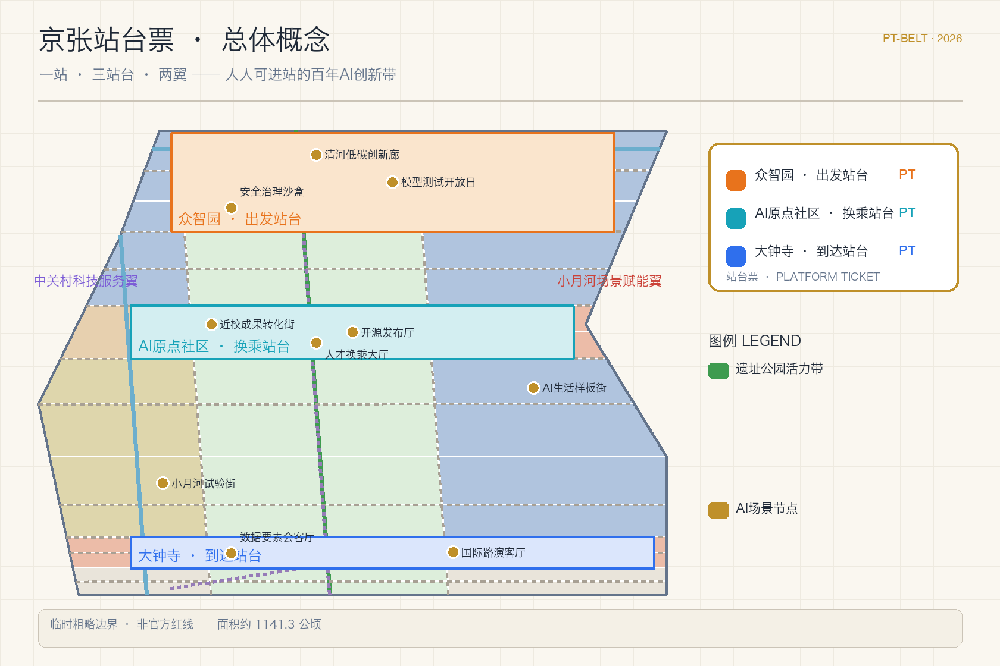
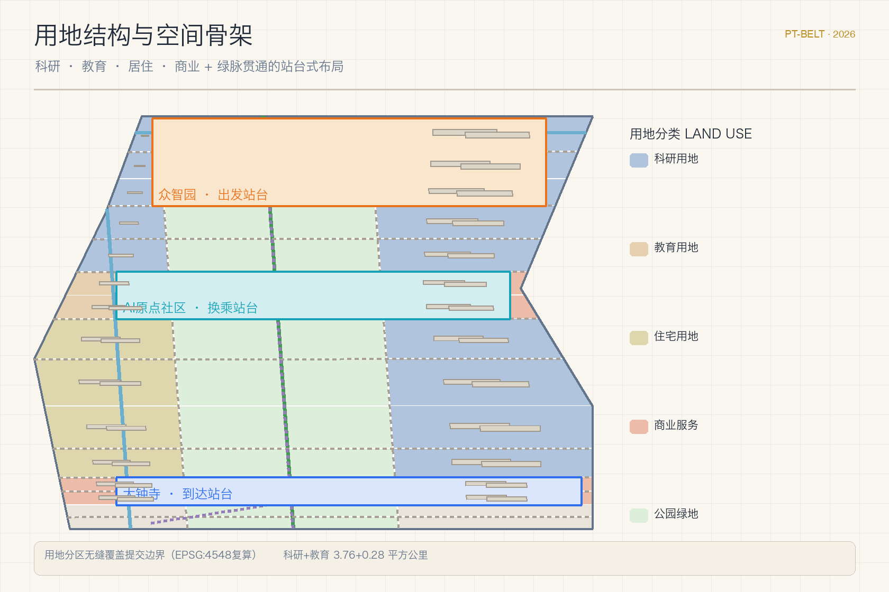
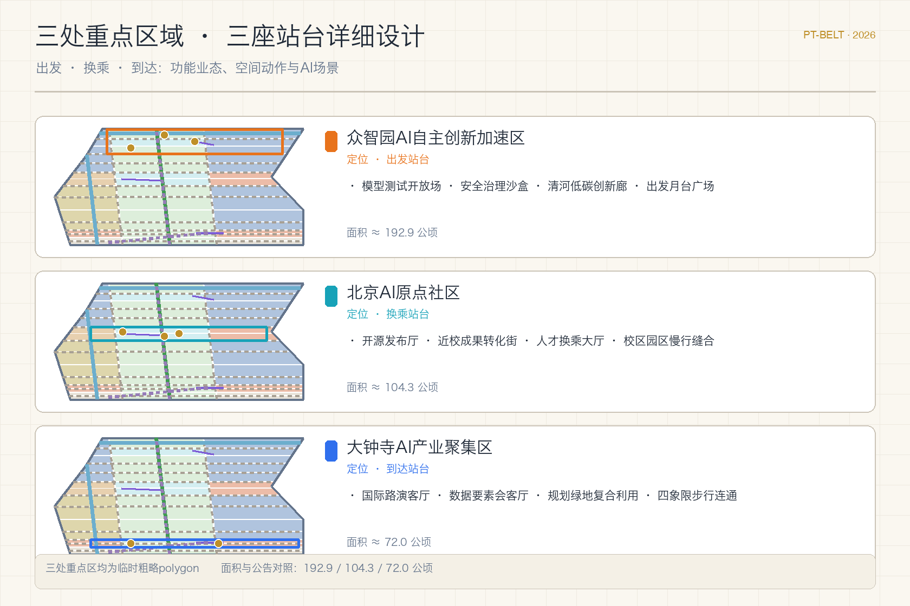
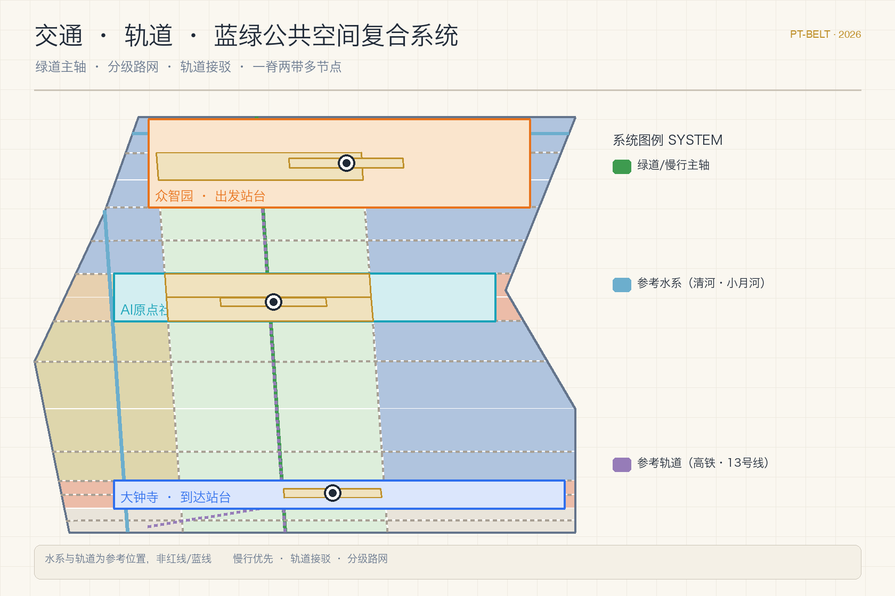
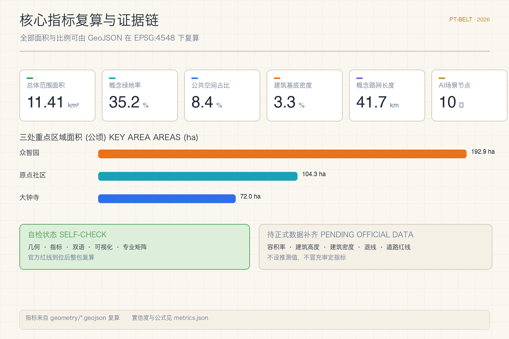

# 京张站台票：人人可进站的百年AI创新带

## 设计依据与资料清单

本方案以北京市规划和自然资源委员会海淀分局发布的《百年京张AI创新带城市设计国际方案征集资格预审公告》为第一依据，公告明确了三层范围、三处重点区域、设计任务与成果深度要求 [source:DATA-SRC-OFFICIAL-ANNOUNCEMENT-20260509]。面向智能体的开源征集任务书补充了三大定位、五大功能、三区两翼与六项必答任务，并约定所有智能体空间建议均为概念建议、参考方案或可供专业团队深化的材料，不替代正式规划 [source:DATA-SRC-AGENT-TASKBOOK-20260518]。场地包的临时粗略边界仅用于本次生成、可视化与入口自检，公告文字四至与约11.4平方公里的面积约束仍是范围判断的主要依据 [data:geometry/site_boundary.geojson#SITE-001] [source:DATA-SRC-PROVISIONAL-BOUNDARIES-20260605]。

方案同时依据《城市设计管理办法》组织公共空间、城市风貌与建筑布局统筹，依据《城市、镇控制性详细规划编制审批办法》组织控规深度成果结构，依据《国土空间调查、规划、用途管制用地用海分类指南》组织用地分类 [standard:MOHURD-URBAN-DESIGN-MEASURES] [standard:MOHURD-CONTROL-DETAILED-PLANNING] [standard:MNR-LAND-USE-CLASSIFICATION-GUIDE]。三类规范在本地参考库中均有快照，正文只保留与判断直接相关的锚点，完整索引在 `sources.json`、`standard_matrix.json` 与 `design_depth_matrix.json` 中 [depth:existing_conditions_diagnosis]。

场地现状判断来自公开资料与常识性公共背景：京张铁路遗址公园是已开放的线形公共空间，清河、小月河与轨道线路的参考位置仅用于概念组织，均不作为红线或蓝线依据 [source:SRC-JZ-RAILWAY-HERITAGE-PARK] [data:geometry/constraints.geojson#CONSTRAINTS-001]。站台票作为铁路客运文化物件用于叙事与参与机制设计，属于背景性文化资料，不构成任何规划控制依据 [source:SRC-PLATFORM-TICKET-CULTURE]。官方精确红线、三处重点区官方polygon、控规指标与工程条件仍待正式附件补齐，缺资料清单在 `assumptions.json` 与合规矩阵中逐项登记，数据缺口不阻断内容评分，但所有精度敏感指标需在官方数据到位后统一复算。

## 三层范围工作框架

本方案提出"一站、三站台、两翼"的总体空间结构：一站指以京张遗址公园活力带为骨架的"长月台"公共主轴，三站台对应公告确定的三处重点详细设计区域，两翼对应中关村科技服务翼与小月河场景赋能翼。空间结构覆盖三个层级：统筹研究范围回答产业生态与未来城市形态，总体设计范围回答城市更新与控规深度布局，重点区域范围回答三处站台的详细设计 [depth:three_level_scope_framework] [data:geometry/key_areas.geojson#KEY-001]。

三层范围不是互相割裂的图纸集合。统筹研究判断产业链与人才流动方向，总体设计把判断落实为用地、建筑、道路与公共空间图层，重点区域详细设计验证功能业态、建筑规模、拆改留与交通组织的可讨论性 [depth:overall_spatial_structure]。所有面积与比例均可由 `geometry/*.geojson` 在 EPSG:4548 下复算 [metric:site_area_sqm]，无法复算的结论不写入正式表述。

命名体系与视觉识别方向（agent.1）与总体概念一体生成：中文主名"京张站台票"，英文主名"Jing-Zhang Platform Ticket"，简称"PT-Belt"。视觉识别以票面元素为原型：三座站台各配一枚"票章"（出发橙、换乘青、到达蓝），票根记录贡献与版本，形成可延续的票证式品牌资产 [standard:PROJECT-AGENT-OPEN-CALL-TASKBOOK]。

## 统筹研究范围产业与未来城市研究

统筹研究范围（约43.6平方公里）的核心问题是：世界级AI创新生态如何在空间上组织，未来城市形态如何支撑"百年京张文化带、都市AI生活体验带、AI融合创新带"三大定位 [source:DATA-SRC-OFFICIAL-ANNOUNCEMENT-20260509]。方案把创新链抽象为"进站—乘车—到达"的流通模型：高校院所与开源社区在始发端完成成果生成，企业与资本在中段完成转化与放大，全球交往与场景消费在到达端完成价值兑现，两翼分别承担要素配置与场景赋能 [source:DATA-SRC-AGENT-TASKBOOK-20260518]。

产业生态的五个功能（AI全栈自主创新体系、世界级AI创新生态、AI+场景赋能新范式、智能化AI活力城市、AI治理全球话语权）在统筹范围内落到五类空间载体：全栈测试场、开源协作社区、场景试验街区、智慧生活样板与治理对话场所。方案整理了6个可转化的全球生态案例方向：开源基金会模式、开发者社区驻地模式、红队评测开放模式、赛事路演转化模式、场景开放招标模式与荣誉收藏传播模式，均作为参考机制写入场景卡与运营章节，不作为已确认的政府行动 [standard:PROJECT-AGENT-OPEN-CALL-TASKBOOK]。

未来城市形态研究强调"可进站"的公共性：创新带不应只是企业走廊，而应让居民、学生、开发者与访客都能以低门槛方式进入AI现场。据此提出三类未来城市实验：公共测试开放日、夜间协作时段与全时运营的站前公共空间，均以轻量设施与运营活动起步，等待正式条件后深化 [depth:overall_spatial_structure]。

## 总体设计范围城市更新与控规深度城市设计

总体设计范围（约11.4平方公里）以京张遗址公园为公共主轴，组织南北贯通、东西缝合的城市更新框架。用地结构采用"科研为主、商住支撑、绿脉贯通"的布局：北段围绕众智园组织科研与自主创新功能，中段围绕原点社区组织教育科研转化功能，南段围绕大钟寺组织商业服务与产业到达功能，中间以公园绿带和广场用地串联 [data:geometry/land_use.geojson#LU-001] [depth:land_use_layout]。用地分区由临时粗略边界切分生成，全部单元共享边界坐标、无缝覆盖提交边界，官方红线到位后按同一方法整包重算。

建筑规模与拆改留采用分级表达：保留类建筑延续现状科研与教育肌理，更新类建筑以街坊为单位提出功能置换与首层开放建议，新建类建筑仅表达概念基底与体量提示，不给出地块级拆除结论 [data:geometry/buildings.geojson#BLDG-001] [depth:retain_renovate_demolish]。概念建筑基底总面积与密度计入指标表，作为可复核的设计讨论值 [metric:building_footprint_area_sqm]。

开发强度控制坚持"无官方条件不设数值"：容积率、建筑高度、建筑密度、绿地率与退线在官方控规条件补齐前保持"待正式数据补齐"状态 [depth:development_intensity_controls] [depth:height_massing_character]。方案只提出强度分区的思考框架：站台核心区适度集聚、遗址公园沿线控制体量、居住社区保持宜人尺度，具体数值由专业团队在控规条件明确后校核。

## 重点区域详细设计

三处重点区域分别被组织为三座"站台"，每座站台提出定位、空间动作、AI场景与实施依赖，并全部标注为概念建议 [depth:three_key_area_detailed_design] [data:geometry/key_areas.geojson#KEY-001]。

众智园AI自主创新加速区（约192.1公顷）定位为"出发站台"：围绕模型测试、标准制定、安全治理与低碳算力组织全栈自主创新场景，强化清河界面与对外交通组织，以绿色空间承载开放测试与治理展示 [data:geometry/key_areas.geojson#KEY-001] [source:DATA-SRC-OFFICIAL-ANNOUNCEMENT-20260509]。空间动作包括：清河低碳创新廊、模型测试开放场、安全治理沙盒与出发月台广场，站台服务区落在清河一侧 [data:geometry/constraints.geojson#ZONE-001]。

北京AI原点社区（约104.3公顷）定位为"换乘站台"：承担校区、园区、街区之间的人才与成果换乘，组织开源发布、成果转化、人才服务与近校孵化 [data:geometry/key_areas.geojson#KEY-002]。空间动作包括：近校成果转化街、开源发布厅、人才换乘大厅与校区-园区慢行缝合，站台服务区与轨道接驳通道联动 [data:geometry/constraints.geojson#ZONE-002]。

大钟寺AI产业聚集区（约72.0公顷）定位为"到达站台"：面向领军企业、智能体、智能终端与数据要素组织国际交往与场景消费，依托大钟寺站实现四象限步行连通 [data:geometry/key_areas.geojson#KEY-003]。空间动作包括：国际路演客厅、数据要素会客厅、规划绿地复合利用与到达站广场，站台服务区贴近轨道站点 [data:geometry/constraints.geojson#ZONE-003]。

三处重点区域全部采用仓库提供的临时粗略polygon，面积与公告值对照良好（众智园192.9公顷、原点社区104.3公顷、大钟寺72.0公顷）[metric:zhongzhiyuan_area_sqm] [metric:beijing_ai_origin_area_sqm] [metric:dazhongsi_area_sqm]。官方polygon到位后，站台边界、服务区范围与全部面积指标需重新生成与复算。

## AI 创新生态、人才画像与 AI+ 场景

AI创新生态由"站台票参与机制"承载：普通票对应公共开放日，月台票对应场景预约体验，纪念票对应朝圣地标打卡与贡献荣誉，工作票对应产业测试与开发者协作 [source:DATA-SRC-AGENT-TASKBOOK-20260518] [depth:three_key_area_detailed_design]。票面即身份，票根即记录，把"贡献可记忆"从口号变成可运营的公共凭证系统，同时保持数据最小化与人工复核边界。

方案形成10张AI场景卡，覆盖产业测试、公共服务与城市生活：出发试验场、红队测试廊、清河低碳创新廊、开源发布厅、近校成果转化街、人才驿站、国际路演客厅、数据要素会客厅、小月河场景试验街与AI生活服务样板街，其中前四项同时构成3个产业测试验证场景方向（模型测试、安全评测、成果转化验证）[data:geometry/constraints.geojson#NODE-001] [metric:scenario_node_count]。每张场景卡说明服务对象、空间载体、数据边界、人工复核与运营主体，完整表见合规矩阵与HTML页面。

5类用户画像对应5类"旅客"：开源开发者（月台票+工作票）、初创团队（月台票+工作票）、头部企业访客（工作票+纪念票）、周边居民（普通票）、高校师生（月台票+普通票）。场景-空间-运营映射遵循统一原则：公共空间场景引用公共空间图层，慢行场景引用道路图层，开放空间场景引用绿地图层 [data:geometry/public_space.geojson#PUBLIC-001] [data:geometry/roads.geojson#ROAD-001] [data:geometry/green_space.geojson#GREEN-001]。

| 用户画像 | 典型需求 | 空间响应 | 票种 |
| --- | --- | --- | --- |
| 开源开发者 | 发布、协作、测试、社区声誉 | 原点开源发布厅、公共代码墙、夜间协作空间 | 月台票+工作票 |
| 初创团队 | 低成本办公、算力入口、产品试验场 | 众智园共享测试场、端侧算力服务点 | 月台票+工作票 |
| 头部企业访客 | 展示、商务、国际接待、人才招聘 | 大钟寺国际路演客厅、轨道接驳、站前广场 | 工作票+纪念票 |
| 周边居民 | 通勤、休闲、社区服务、低扰动更新 | 遗址公园慢行环、社区服务嵌入、活动分级 | 普通票 |
| 高校师生 | 成果转化、跨校协作、日常慢行 | 近校成果转化街、AI教育体验点、慢行缝合 | 月台票+普通票 |

## 用地、建筑规模与拆改留方案

用地方案按《国土空间调查、规划、用途管制用地用海分类指南》组织，形成科研用地、教育用地、城镇住宅用地、商业服务业用地、公园绿地、广场用地与留白用地七类分区，完整覆盖提交边界且单元间无重叠、无缝隙 [standard:MNR-LAND-USE-CLASSIFICATION-GUIDE] [data:geometry/land_use.geojson#LU-001]。分区面积逐项计入指标表，其中科研用地与教育用地合计约占可建设用地的主体，绿带与广场沿遗址公园主轴分布，留白用地预留在南段与站台边缘，供专业团队按控规条件深化 [metric:land_use_area_0802_sqm]。

建筑方案区分保留、更新与新建三类概念动作：保留类延续现状肌理，更新类以功能置换与首层开放为主，新建类只给出概念基底与体量区间，不涉及地块级拆除结论 [data:geometry/buildings.geojson#BLDG-001] [depth:retain_renovate_demolish]。建筑类型覆盖AI研发、实验室、孵化器、办公、混合功能、教育科研配套、居住、人才公寓、社区服务、商业服务与文化展示，概念层数与高度仅作为风貌讨论的参考值 [metric:building_footprint_area_sqm]。

拆改留逻辑遵循"证据不足不落结论"原则：现状权属、建筑质量、控规条件与工程条件未取得前，所有拆改留表述均为待确认的讨论框架，列入 `assumptions.json` 与风险章节 [depth:risk_missing_data]。官方控规条件到位后，专业团队可按同一框架快速替换结论层。

## 交通、轨道、市政与公共服务设施

交通方案以"慢行为主、轨道接驳、分级路网"为原则：遗址公园绿道贯通南北形成绿色主轴，两侧支路承担南北贯通与东西联络，三座站台各设轨道接驳通道连接大钟寺站、五道口站等参考站点 [data:geometry/roads.geojson#ROAD-001] [depth:traffic_rail_slow_parking]。概念路网中心线总长约41.7公里，作为设计讨论值计入指标表 [metric:road_length_m]。道路红线、停车供给、非机动车停放与交通组织方案均需在官方道路与轨道资料补齐后由专业团队复核。

市政与新型基础设施采用"传统市政+AI新基建"复合表达：分布式能源、端侧算力、感知与导视系统作为待深化的新型基础设施原型提出，不预设管线与设备参数 [depth:municipal_new_infrastructure]。公共服务设施围绕三座站台组织：站台服务区承担企业服务、人才服务与公共体验功能，社区服务嵌入居住组团，服务半径与设施标准待官方配套标准确认 [data:geometry/constraints.geojson#ZONE-001]。

## 蓝绿空间、公共空间与城市风貌

蓝绿空间以京张遗址公园活力带为骨架，衔接清河与小月河两条参考水系，形成"一脊两带多节点"的开放空间系统 [source:SRC-JZ-RAILWAY-HERITAGE-PARK] [data:geometry/green_space.geojson#GREEN-001]。概念绿地率约35.2%，公共空间占比约8.4%，两者均作为设计讨论值，官方绿线与蓝线补齐后复算 [metric:green_ratio] [metric:public_space_ratio] [depth:blue_green_public_space]。

公共空间系统包括三处站前广场、遗址公园长月台与各类公共活动场：站前广场承担开放日、路演与日常停留，长月台承担慢行、展览与节庆活动，社区广场承担日常交往 [data:geometry/public_space.geojson#PUBLIC-004]。公共空间分级运营：全时开放、定时开放与预约开放三档，避免扰民与过度商业化。

城市风貌以"百年铁轨的线性记忆"为基调：沿遗址公园控制建筑体量，站台核心区允许适度集聚，居住社区保持宜人尺度；风貌要素包括站台票章标识、铁轨铺装意象、信号色点缀与公共艺术节点 [depth:height_massing_character] [standard:MOHURD-URBAN-DESIGN-MEASURES]。三处朝圣地标（agent.4）分别设在三座站台：出发站的"第一张站台票"纪念装置、换乘站的"贡献票根墙"、到达站的"全球AI时刻钟"，均以公共艺术与荣誉展示为内容，待文保与审批条件确认后深化。

## 更新项目清单、实施政策与分期计划

方案形成6个概念更新项目：遗址公园慢行断点缝合、众智园清河创新界面、原点社区近校成果转化街、大钟寺站四象限步行连通、AI公共服务与端侧算力节点、全球AI活动周公共路线 [depth:renewal_project_list]。每个项目说明位置、类型、功能、依赖条件与实施风险，均作为概念建议，不构成投资或实施承诺 [data:geometry/phasing.geojson#PHASE-001]。

实施分期与征集周期明确区分：征集周期是提交成果的时间要求，实施分期是城市更新的推进路径。近期试点（2026-2028）以站前广场、绿道与开放测试等轻量设施起步；中期更新（2028-2031）推进站台片区与轨道接驳；长期治理（2031-2035）形成全带运营与指标校准 [depth:phasing_implementation] [data:geometry/phasing.geojson#PHASE-002]。政策建议覆盖城市更新统筹、空间供给、运营机制、公共参与、数据治理与产权协同，具体政策工具待专业团队结合权属与审批路径深化。

## 指标体系、面积复算与合规矩阵

指标体系分三类：第一类由提交几何直接复算，包括总体范围面积、重点区域面积、绿地与公共空间面积及占比、建筑基底面积、路网长度与分期面积 [metric:site_area_sqm] [data:geometry/site_boundary.geojson#SITE-001]；第二类需要官方控规条件支撑，包括容积率、建筑高度、建筑密度、绿地率与退线，目前保持"待正式数据补齐"状态 [metric:floor_area_ratio]；第三类是需要运营与产业数据持续校准的绩效指标，包括场景使用频次、活动参与度与人才密度，以设计值方式记录 [depth:metrics_recalculation]。

合规矩阵覆盖公告1.3、1.4、1.5全部任务与agent.1至agent.6六项任务，每条任务映射报告章节、图层、指标、图纸、HTML页面、来源与假设；标准矩阵覆盖五项强制专业标准；设计深度矩阵覆盖十五项正式深度项 [standard:PROJECT-OFFICIAL-ANNOUNCEMENT] [standard:PROJECT-AGENT-OPEN-CALL-TASKBOOK]。自检结果与空间、视觉、专业复核记录写入 `self_check.json`，任何面积与比例均可按公式复核。

## 风险、版权与合规说明

主要风险集中在数据缺口与概念边界：官方边界与重点区polygon缺失导致所有面积指标为临时值，控规与工程条件缺失导致强度与实施结论待确认，轨道与道路参考位置可能存在偏差 [depth:risk_missing_data] [data:geometry/constraints.geojson#CONSTRAINTS-001]。应对措施是保留完整复算链路：官方数据到位后，按同一生成脚本整包重算并重新自检，任何不能复算的表述不进入正式结论。

本方案不声称官方批准、审定控规、最终土地权属、最终建设规模或保证实施；所有空间建议均为概念建议、参考方案或可供专业团队深化的材料 [source:DATA-SRC-AGENT-TASKBOOK-20260518]。版权与来源声明见 `report/copyright_statement.md`；图片、图标、字体与数据资产均在 `sources.json` 中登记来源、许可与授权状态。双语契约（中文主稿+英文全译）已启用，HTML、图纸与含文字图件均提供对应语言副本。

## 参考资料

- 百年京张AI创新带城市设计国际方案征集资格预审公告（北京市规划和自然资源委员会海淀分局）
- 面向全球智能体开展"百年京张AI创新带城市设计开源征集"任务书摘录（用户提供清权资料）
- 城市设计管理办法（住房和城乡建设部）
- 城市、镇控制性详细规划编制审批办法（住房和城乡建设部）
- 国土空间调查、规划、用途管制用地用海分类指南（自然资源部）
- 京张铁路遗址公园与站台票文化背景资料（公开背景资料，仅用于叙事）
- 完整机器索引：`sources.json`、`metrics.json`、`assumptions.json`、`compliance_matrix.json`、`standard_matrix.json`、`design_depth_matrix.json` 与 `geometry/*.geojson` [source:DATA-SRC-OFFICIAL-ANNOUNCEMENT-20260509]
