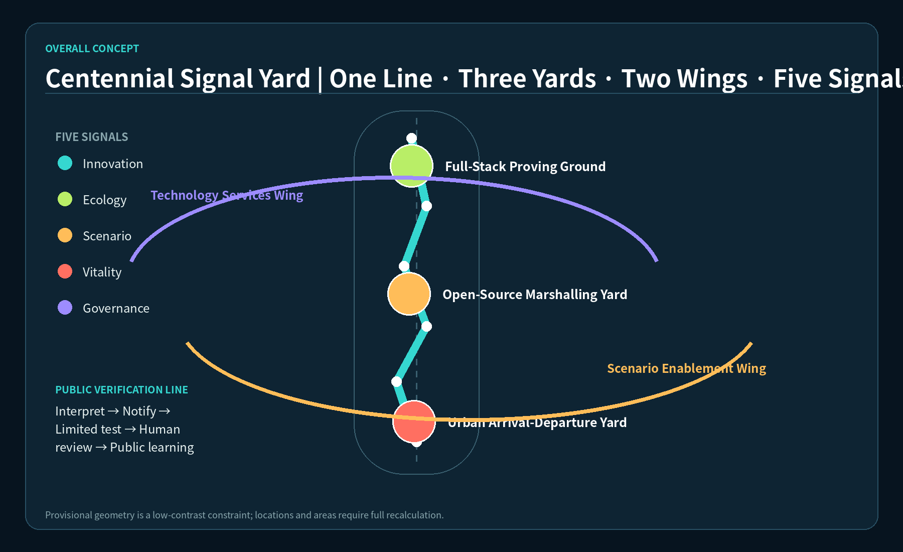
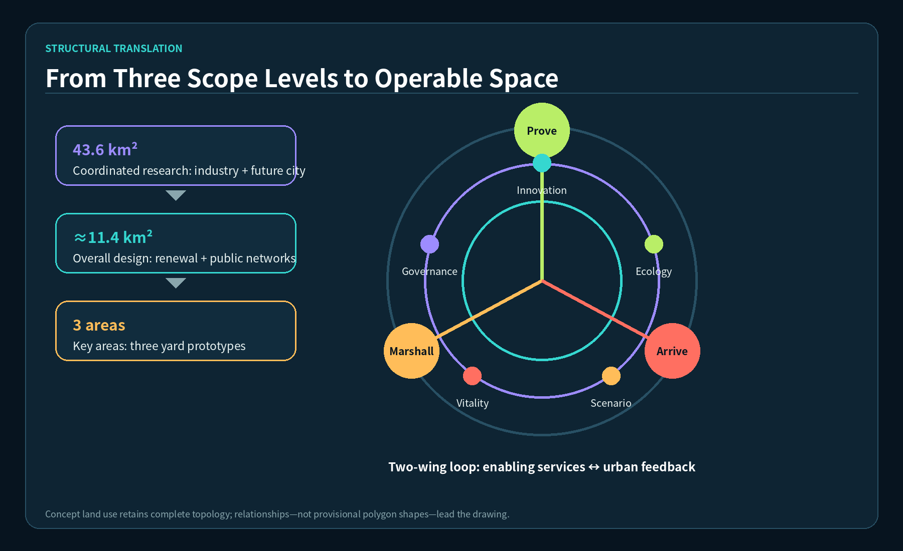
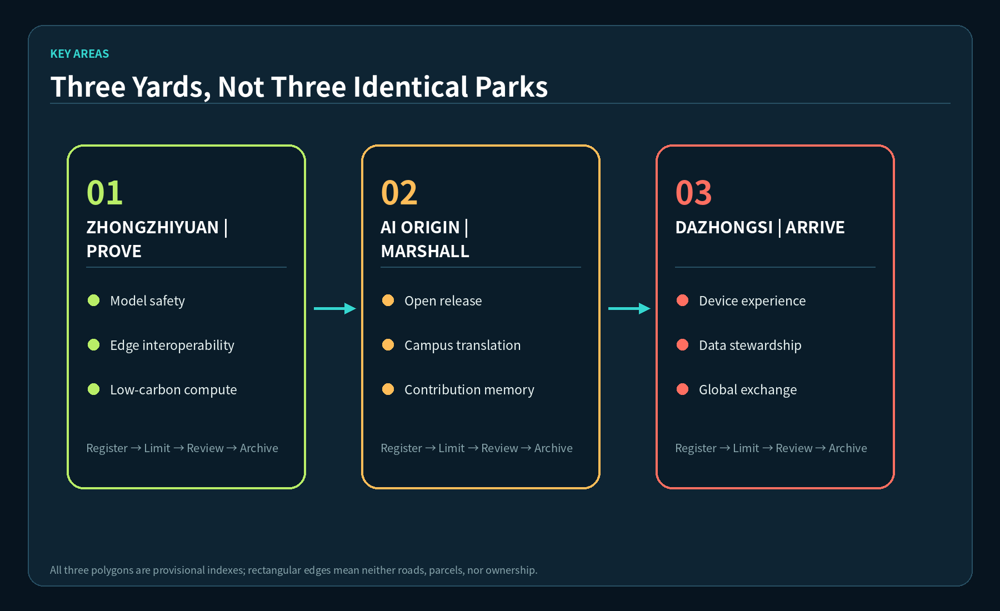
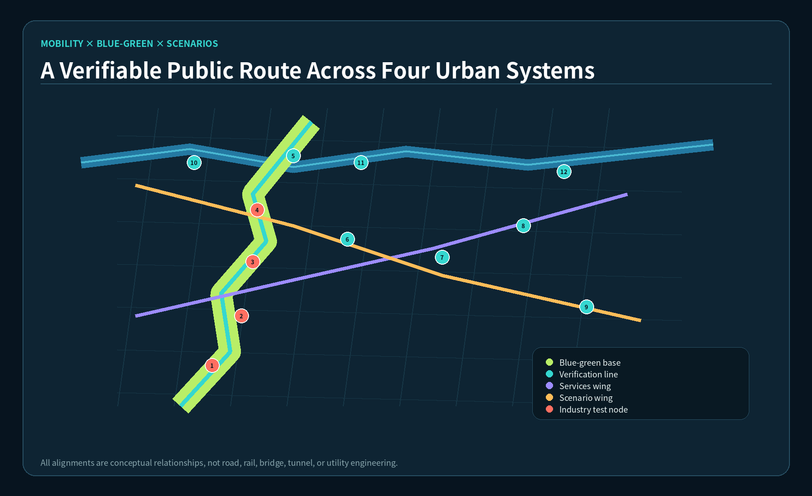
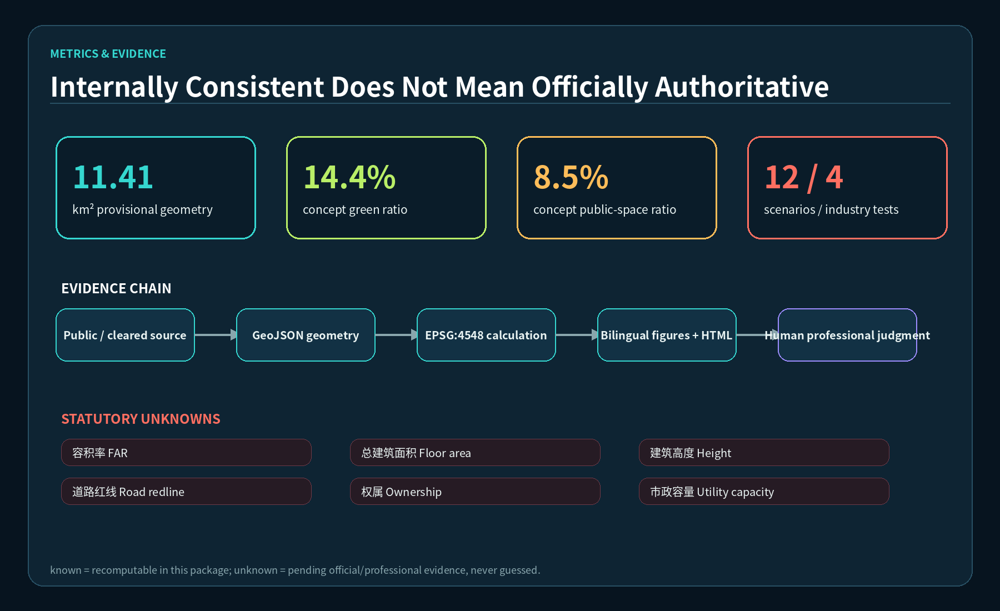

# Centennial Signal Yard

**京张百年信号场**

> This proposal is an open co-creation conceptual recommendation and reference scheme for professional teams to deepen. The package uses repository provisional boundaries. They are not official planning boundaries and cannot support precise area, statutory control, approval, investment, engineering-feasibility, or government-commitment claims. “Line, yards, wings, and signals” are design language, not approved spaces or confirmed events.

## Design Basis and Source List

The proposal uses only public or rights-cleared repository material. Primary inputs are the announcement’s three scope levels and tasks, the six Agent tasks, site-package enums and local standard snapshots, and repository provisional boundaries. The announcement supports project purposes, scope names, and approximate announced areas; the taskbook supports the positioning, five functions, Three Zones and Two Wings, and co-creation boundary; provisional geometry supports only generation, topology checks, and visualization. International precedents come from the repository public-material plan and crawl-source index and are mechanism background, never local statutory or performance evidence. [source:OFFICIAL-ANNOUNCEMENT] [source:AGENT-TASKBOOK]

The evidence chain has three layers: this narrative explains judgments; nine GeoJSON files and metrics.json preserve recomputable results; task, standard, and design-depth matrices preserve complete indexes. Projecting the submitted provisional overall-design geometry to EPSG:4548 yields about 11,412,825 square metres. This is an internal consistency value, not an official precise area. Official polygons, parcels, ownership, existing buildings, utilities, road redlines, heritage and flood controls, and approved planning controls are pending; therefore FAR, total floor area, height, setbacks, road area, and parcel-specific demolition decisions remain pending official data. [data:geometry/site_boundary.geojson#SITE-001] [metric:site_area_sqm]

The source-use discipline applies to every artifact: background precedents may not become local controls; concept nodes may not become construction projects; operating proposals may not become confirmed calendars. Planning, engineering, legal, ethical, and implementation decisions require human review. When official polygons arrive, all layers, metrics, figures, HTML, and PDFs must be regenerated together. [standard:PROJECT-OFFICIAL-ANNOUNCEMENT] [depth:existing_conditions_diagnosis]

## Three-Level Scope Framework

The Coordinated Research Area addresses industry ecology, innovation coordination, and future urban form. The Overall Design Area addresses renewal structure, public space, mobility, infrastructure, and character. The three Key-Area Detailed Design Areas test how scenarios can be operated in distinct spatial types. Centennial Signal Yard connects all three levels through **one line, three yards, two wings, and five signal types**. The line is the Heritage Park Public Verification Line. The yards are Zhongzhiyuan Full-Stack Proving Ground, AI Origin Open-Source Marshalling Yard, and Dazhongsi Urban Arrival-Departure Yard. The wings are Zhongguancun Technology Services Wing and Xiaoyue River Scenario Enablement Wing. The signals are innovation, ecology, scenario, vitality, and governance signals. [depth:three_level_scope_framework] [data:geometry/key_areas.geojson#PROV-KEY-001]

The “line” is not a new redline. It is a conceptual public route joining cultural interpretation, walking and cycling, accessibility, scenario observation, and feedback. The three yards borrow railway marshalling and arrival-departure language for full-stack validation, open-source collaboration, and urban display and exchange. The two wings are service flows, not additional construction boundaries: the technology-services wing connects capital, intellectual property, talent, compute, and enterprise support; the scenario-enablement wing connects community needs, public experience, application feedback, and governance review. Five signals form both the wayfinding palette and an annual operating dashboard, preventing industry output from becoming the only measure of public value.

GeoJSON retains a complete topology-stable concept land-use partition, lines encode mobility relationships, and points encode twelve observable actions. Provisional boundaries stay as low-contrast dashed constraints. The visual emphasis is on networks, nodes, and relationships. The logic can survive official-boundary replacement, but every area, node location, crossing relationship, and phase polygon must then be checked again. [data:geometry/land_use.geojson#LU-001] [standard:MOHURD-URBAN-DESIGN-MEASURES]

## Coordinated Research Area: Industry and Future City Research

### From a park directory to a verifiable innovation loop

The industry strategy organizes land, space, industry, finance, talent, compute, data, and scenarios into a loop. Zhongzhiyuan offers controlled tests and standards discussion; AI Origin offers open-source release, near-campus translation, and contribution memory; Dazhongsi offers smart-device experience, urban arrival, and international exchange. The Technology Services Wing supplies legal, IP, finance, and talent support. The Scenario Enablement Wing connects resident and campus needs to public experience and human-reviewed feedback. No enterprise, funder, or policy body is presumed to have committed. [source:AGENT-TASKBOOK] [depth:overall_spatial_structure]

Naming and identity combine “railway signal” with “open-source state.” The conceptual logo is a continuous rail line passing through five offset dots; the dots represent five signals, while open negative space conveys an accessible yard. The official proposal names are 京张百年信号场 and Centennial Signal Yard. Supporting verbs—Enter, Marshall, Prove, Arrive, Review—structure wayfinding and events. Graphics use only local Noto Sans CJK and DejaVu Sans fonts, with no external trademarks, images, or fonts.

### Six repository-supported background cases

The table uses only case directions listed in `brief/public-materials-plan.md` and the Brookings indexes in `brief/auto-crawl-sources.md`. It extracts questions for validation, does not claim a complete field study, and copies no scale, governance system, or performance number. [source:GLOBAL-CASE-INDEX] [source:BROOKINGS-INNOVATION-DISTRICTS]

| Background case | Repository-supported lens | Mechanism translated here | Not transferred directly |
|---|---|---|---|
| Kendall Square | Anchor institutions and dense innovation networks | Short feedback between campus, community, and enterprise services | Land regime, market data, development intensity |
| Cortex Innovation District | Institutional collaboration and public realm | Shared booking, test ethics, and public interfaces across three yards | Governance and investment model |
| 22@Barcelona | Existing-city renewal and mixed use | Reversible adaptation and shared ground-floor services | Statutory tools and ratios |
| King’s Cross Knowledge Quarter | Arrival, culture, and knowledge institutions | Dazhongsi arrival yard links exchange, display, and walking | Station engineering and ownership |
| Paris-Saclay | Research network and regional coordination | Technology Services Wing organizes cross-institution support | Large-scale transport and construction sequence |
| Tonsley Innovation District | Adaptive reuse and visible testing | Proving spaces use adjustable workstations, public demos, and review archives | Building suitability and engineering conclusions |

Future urban form is not defined by more sensors. It is a spatial protocol: frame a problem, conduct a limited test, explain it publicly, obtain human review, then scale or exit. Each scenario declares users, minimum data, physical extent, duration, exit condition, and responsibility before technology is discussed. Five signals evaluate innovation output, ecological effect, scenario experience, everyday vitality, and governance quality without presenting immature technology as deployable everywhere. [standard:PROJECT-AGENT-OPEN-CALL-TASKBOOK] [data:geometry/public_space.geojson#SCENE-01]

## Overall Design Area: Urban Renewal and Regulatory-Plan-Level Urban Design

The overall structure uses the Heritage Park Public Verification Line as a north-south spine, two wing links as east-west service loops, and three yards as differentiated anchors. The complete concept land-use partition contains R&D and proving, blue-green open space, industry and urban services, and community support. They carry innovation, ecology, scenario, vitality, and governance signals. The partition supports relationship testing and calculation; it does not replace statutory land use, existing-condition survey, or an approved regulatory plan. [data:geometry/land_use.geojson#LU-002] [standard:MNR-LAND-USE-CLASSIFICATION-GUIDE]

Renewal follows “identify, classify, decide.” First verify ownership, structural safety, current use, cultural value, carbon, and accessibility. Second classify an object as retain, adapt, demolition/rebuild candidate, or insufficient data. Third let professionals and rights-holders decide. The three building footprints in this package are prototypes for a Signal Workshop, Open-Source Marshalling Hall, and Urban Arrival-Departure Salon. They are not surveyed buildings or parcel decisions. [data:geometry/buildings.geojson#BLDG-001] [depth:retain_renovate_demolish]

Development intensity follows “unknown before false precision.” Total floor area, FAR, building height, approved building coverage, setback, and parking remain unknown. Concept footprint area only checks whether components fit inside the provisional envelope. Character guidance calls for adaptable public bases, reversible digital devices, maintainable shade, and low-disturbance signal lighting, without statutory heights. Mobility and infrastructure encode demands, not road redlines, tunnels, rail alignments, utilities, or capacity conclusions. [metric:building_footprint_area_sqm] [depth:development_intensity_controls]

Professional depth lies in replaceable evidence: land use has gap-free topology, buildings declare conceptual status, roads declare non-engineering alignment, constraints declare unknowns, and phases declare a reference sequence. Official conditions can replace these records without inheriting fabricated certainty. [data:geometry/constraints.geojson] [standard:MOHURD-CONTROL-DETAILED-PLANNING]

## Detailed Design of Key Areas

All three key-area polygons are repository provisional indexes. Their rectangular edges are neither roads nor parcels nor ownership. Detailed design is therefore expressed through spatial components, operating protocols, and unresolved questions rather than parcel controls. [data:geometry/key_areas.geojson#PROV-KEY-002] [depth:three_key_area_detailed_design]

### Zhongzhiyuan Full-Stack Proving Ground

The concept is a proving ground “from model to edge device, from safety to low carbon.” A public forecourt explains test methods and failed experiments; a controlled inner area hosts booked model red-teaming, edge-device interoperability, and low-carbon compute scheduling. Qinghe-related ecology and flood conditions are unavailable, so the northern rain garden is only a concept for professional deepening. Test registration, risk classification, isolation, human termination, and result archiving are the operating baseline; no platform, standard, or company arrival is promised.

### AI Origin Open-Source Marshalling Yard

The concept marshals students, developers, start-ups, resident questions, and professional services into temporary teams. The release hall, contributor wall, and near-campus translation services form a public ground floor. The digital-twin gallery and community review desk separate demonstrations from city decisions. Research results, campus data, and personal data require separate permission. Night operation, housing support, and campus connections need transport, noise, ownership, and safety evidence.

### Dazhongsi Urban Arrival-Departure Yard

The concept is an urban arrival interface for intelligent devices, content, data governance, and international exchange. The arrival plaza, data-stewardship salon, device experience street, and urban salon create a short “arrive—understand—try—respond—collaborate” sequence. Transit-station integration and four-quadrant walking are research questions for professionals; the proposal makes no underground-space, bridge, utility-relocation, or commercial-operator conclusion.

The yards share one scenario registration format: a problem owner explains public value; the test team declares minimum data and risks; an operator defines time and space; professionals check safety and compliance; the public receives notice and an exit path; and a reviewable summary enters the contribution archive. A yard serves industry validation while protecting everyday urban life. [data:geometry/public_space.geojson#PUBLIC-002] [source:AGENT-TASKBOOK]

## AI Innovation Ecosystem, Personas, and AI+ Scenarios

### Six personas

| Persona | Key need | Spatial mapping | Operating and governance boundary |
|---|---|---|---|
| Open-source developer | Collaboration, release, contribution memory | Origin hall and contributor wall | Voluntary attribution; traceable code and data licenses |
| AI start-up | Affordable validation, professional services, user feedback | Zhongzhiyuan benches and Services Wing | Testing is not certification or procurement |
| University student/researcher | Near-campus translation and interdisciplinary exchange | Origin community and verification line | Research and campus data require permission |
| Resident/caregiver | Accessibility, recreation, trusted public service | Heritage line and community review desk | No commercial profile or persistent tracking |
| Industry/international visitor | Arrival, display, meetings, ecosystem orientation | Dazhongsi arrival yard | Translation and media cleared; event approval required |
| City operator/professional | Maintenance, incident handling, audit interface | Governance signal desk | AI assists; humans retain final responsibility |

### Twelve scenario cards

All twelve cards have concept nodes in public-space GeoJSON; the first four are industry testing and validation scenarios. A point is a design location, not an approved operating site. [metric:scenario_node_count] [data:geometry/public_space.geojson#SCENE-04]

| # | Scenario | User and space | Minimum data / human review / exit |
|---|---|---|---|
| 01 Test | Model Safety Red-Team Sandbox | Companies and researchers; controlled Zhongzhiyuan area | Synthetic/cleared tests; safety lead can terminate; stop on scope breach |
| 02 Test | Edge-Device Interoperability Bench | Device teams; modular proving forecourt | Minimal logs; engineer review; stop on electrical/network anomaly |
| 03 Test | Urban-Agent Digital-Twin Verification Gallery | Developers and professionals; AI Origin | Public/de-identified data; planner review; no approval output |
| 04 Test | Low-Carbon Compute Scheduling Station | Compute teams; Zhongzhiyuan | Aggregated energy data; energy-professional review; no expansion without capacity evidence |
| 05 | Open-Source Release Hall | Developers, campus, start-ups; AI Origin | Voluntary submission; license review; withdraw unpublished material |
| 06 | AI Walking and Accessibility Navigation | Walkers, cyclists, disabled users; verification line | No face traces; accessibility review; remove on misleading guidance |
| 07 | Community Service Human-Review Desk | Residents and service staff; community interface | User-entered data; staff confirmation; sensitive issues go to human channels |
| 08 | Data Stewardship Salon | Companies, legal and governance staff; Dazhongsi | Demonstrate processes only; legal review; accept no unauthorized data |
| 09 | Smart Device Experience Street | Residents and visitors; Dazhongsi | Local temporary sessions; safety steward; withdraw unsafe devices |
| 10 | Jing-Zhang Memory Signal Tower | Public and visitors; heritage line | Rights-cleared history only; curatorial review; pause disputed content |
| 11 | Contributor Marshalling Wall | Community contributors; AI Origin | Voluntary attribution; license review; correction or de-listing process |
| 12 | Global AI Week Route Gate | Public visitors; one line and three yards | Booking and aggregate flows; event safety review; cancel if overloaded or unapproved |

The shared scenario-space-operation protocol publishes purpose and limits before access, collects only necessary data, identifies a human contact during operation, and records result, failure, and exit afterward. Four test scenarios are structurally counted, but “test” does not mean mature, certified, procured, or deployable. [metric:industry_test_scenario_count] [standard:PROJECT-AGENT-OPEN-CALL-TASKBOOK]

## Land Use, Building Scale, and Retain-Renovate-Demolish Strategy

The land-use layer uses repository-allowed national classification codes. Four polygons share coordinates and fully cover the provisional Overall Design Area. The Innovation Signal Field supports R&D and proving; the Ecology Signal Field supports heritage and blue-green space; the Scenario Signal Field supports industry and urban services; the Vitality and Governance Signal Field supports community uses. Areas describe only the internal composition of provisional geometry and must be recalculated. [data:geometry/land_use.geojson#LU-004] [metric:land_use_area_lu_004_sqm]

Architecture prioritizes reuse and reversible intervention. Without building survey, structure, ownership, and heritage data, no building can be assigned a final retain, renovate, or demolish decision. Three components explain spatial needs: a Signal Workshop needs divisible test rooms, logistics, and a safety buffer; a Marshalling Hall needs adjustable collaboration, release, and night-management zones; an Arrival Salon needs display, meeting, translation, and accessible service. Total floor area, storeys, height, and FAR remain pending official data. [depth:height_massing_character] [metric:total_floor_area_sqm]

A five-gate DRR process is proposed: factual survey, public-value review, carbon and safety assessment, rights-holder consultation, and professional/statutory procedure. New construction must first show that existing space, temporary components, or time sharing cannot meet the need. Action fields in GeoJSON are survey prompts, never parcel decisions. [data:geometry/buildings.geojson#BLDG-003] [standard:MOHURD-CONTROL-DETAILED-PLANNING]

## Transport, Rail, Municipal Infrastructure, and Public Services

Mobility defines access as continuous walking, cycling, accessibility, and transit interchange rather than new vehicle engineering. The Heritage Park line links three yards north-south. The Services and Scenario Wings form east-west loops. A three-yard connector compares transfers. Road features are concept centerlines, not road redlines, rail alignments, bridges, or tunnels; road area therefore remains unknown. [data:geometry/roads.geojson#ROAD-001] [metric:road_centerline_length_m]

Every break follows “at-grade first, management second, engineering last”: check crossing time, gradient, shade, lighting, and wayfinding; then test time management and shared interfaces; only then let professional teams investigate structures. Dazhongsi Station, Wudaokou, Qinghua Donglu Xikou, and Fifth-Ring crossing tasks require official station, street, and flow evidence before engineering judgment. [depth:traffic_rail_slow_parking] [source:OFFICIAL-ANNOUNCEMENT]

Infrastructure follows “pluggable, measurable, removable.” Edge compute, gateways, charging, stormwater monitoring, and event power begin as need lists. Before connection, professionals verify capacity, fire safety, cyber security, data compliance, and maintenance responsibility. Public services preserve human-first access, with AI assisting triage; medical, legal, educational, or other high-impact outputs never automatically replace professionals. [depth:municipal_new_infrastructure] [data:geometry/constraints.geojson]

## Blue-Green Network, Public Space, and Urban Character

The blue-green concept uses the Heritage Park ecological verification belt as a continuous base, with a northern rain garden and southern arrival garden as concept nodes. It overlays walkable, occupiable, observable public interfaces. Green and public-space ratios are about 14.2% and 8.3% of submitted provisional geometry. They are concept-layer ratios, not approved controls. Qinghe and Xiaoyue River blue lines, flood, ecology, and management conditions are unknown; all waterfront and stormwater moves need specialist work. [data:geometry/green_space.geojson#GREEN-001] [metric:green_ratio]

The public-space kit includes reversible signal posts, shade-seat modules, low accessible wayfinding, test-notice boards, human-review desks, temporary power/network boxes, and contribution displays. Components can disable sensing, clear temporary data, replace text, and restore the site, preventing rapid technology iteration from imposing permanent public-space costs. [data:geometry/public_space.geojson#PUBLIC-001] [metric:public_space_ratio]

Three concept landmarks are: (1) **Jing-Zhang Memory Signal Tower**, connecting a rights-cleared railway timeline to contemporary AI culture; (2) **Contributor Marshalling Wall**, recording licensed code, design, community, and professional contributions; and (3) **Urban Arrival Beacon**, using multilingual state lights to explain that day’s public scenarios. They are lightweight concepts, not confirmed buildings, sculptures, or heritage works. [metric:concept_landmark_count] [standard:MOHURD-URBAN-DESIGN-MEASURES]

Urban character follows “old trace, open component, restrained signal.” Preserve verified historic traces; expose reversible connections in new components; limit night signal brightness and hours. The story moves from Jing-Zhang railway connection and engineering, to Zhongguancun experimentation and entrepreneurship, to AI culture of open source, review, and responsibility. It uses no unauthorized corporate marks, portraits, or paper images.

## Renewal Projects, Implementation Policy, and Phasing

The project list is a professional work-package list, not a commitment list: JZ-01 verification-line break survey; JZ-02 Zhongzhiyuan test protocol and reversible forecourt; JZ-03 Origin open-source hall; JZ-04 Dazhongsi arrival interface; JZ-05 five-signal wayfinding and governance kit; JZ-06 blue-green specialist study; JZ-07 scenario registration, audit, and exit tool; JZ-08 bilingual communication and contribution archive. Each requires data, ownership, approval, safety, budget, and operator evidence before implementation. [depth:renewal_project_list] [data:geometry/phasing.geojson#PHASE-001]

Reference phasing follows dependencies, not fixed years. Near term: fill public-data gaps, audit walking/accessibility, define protocols, install lightweight wayfinding, and conduct small booked tests. Medium term: after professional review, establish shared three-yard services, study adaptive reuse, and coordinate the wings. Long term: use official planning, evaluation, and feedback to decide whether to expand, relocate, or exit. Phase polygons are discussion extents, not a confirmed development schedule. [depth:phasing_implementation] [metric:reference_phasing_area_sqm]

### Annual operating reference

| Quarter | Concept activity | Output | Conversion and boundary |
|---|---|---|---|
| Spring | Signal Opening: problem call and data check | Public problem list, data-license sheet | Resident/campus questions enter review; no project guarantee |
| Summer | Full-Stack Proving Season | Four test records and failure reviews | A qualified prototype may apply for another controlled test; no certification |
| Autumn | Jing-Zhang Global AI Week | Public route and bilingual display | Visitors become developer/community/research leads; event needs separate approval |
| Winter | Marshalling Review and Contribution Yearbook | Five-signal dashboard and archive | Human committee continues, adjusts, or exits; no procurement/funding promise |

The developer community uses maintainer rotation, issue groups, and public version records. Scenario access follows application, risk classification, scheduling, notice, human stewardship, and archival review. International communication publishes verifiable status and distinguishes concept, test, review, and implementation. This annual system is a reference proposal and implies no organizer, government, company, funder, or venue commitment. [source:AGENT-TASKBOOK] [data:geometry/public_space.geojson#SCENE-12]

## Metrics, Area Recalculation, and Compliance Matrix

Known spatial metrics are computed by projecting EPSG:4326 GeoJSON to EPSG:4548. Provisional boundary area, green-space union, public-space union, concept footprint union, centerline length, scenario counts, and phase polygons have formulas and source files. Statutory and engineering unknowns remain null with reasons. Approximate announced key-area values stay in boundary attributes, but provisional polygons remain indexes and cannot be described as precise redline areas. [depth:metrics_recalculation] [metric:site_area_sqm]

Metrics distinguish internal consistency from external authority. Internal consistency means layers, metrics, HTML, and drawings share numbers. External authority still needs official boundaries, controls, and specialist evidence. Twelve scenario nodes, four industry tests, and three concept landmarks are proposal-content counts, not approved quantities. Green, public-space, and footprint ratios have low confidence because their geometries are design concepts. [metric:industry_test_scenario_count] [data:geometry/public_space.geojson#SCENE-01]

The compliance matrix maps announcement 1.3, 1.4, 1.5 and Agent tasks 1–6. The standard matrix addresses five mandatory local references. The design-depth matrix addresses fifteen required items. Each points to narrative, geometry, metrics, bilingual drawings, HTML, sources, assumptions, and checks. PASS means the package may enter content review; it does not mean professional scoring, endorsement, or approval. [standard:PROJECT-AGENT-OPEN-CALL-TASKBOOK] [depth:risk_missing_data]

## Risk, Copyright, and Compliance

The first risk is missing boundary and control evidence. Site and key areas are provisional constraints. Official polygons, ownership, controls, buildings, roads, transit, utilities, fire, flood, ecology, and heritage evidence are absent. When new official data arrives, related geometry, metrics, five figure pairs, visual HTML, and bilingual PDFs must be regenerated. [data:geometry/site_boundary.geojson#SITE-001] [source:BOUNDARY-SOURCE]

The second group is scenario privacy, safety, bias, and accountability. Only public, synthetic, cleared, or minimized data is allowed, with notice, a human contact, appeal, and exit. High-impact services do not automate final decisions. A third risk is exclusion and the digital divide, so no-device paths, human service, and accessibility review remain. A fourth risk is maintenance: sensing, compute, lights, and temporary events require named responsibility for power, fire, cyber security, noise, waste, repair, and removal. [depth:risk_missing_data] [standard:MOHURD-URBAN-DESIGN-MEASURES]

This narrative, locally generated graphics, HTML, and drawings use **CC-BY-4.0**. Visuals are produced with local Python, vector geometry, and local fonts. They contain no external images, map tiles, trademarks, portraits, or remote fonts. Repository sources retain their individual licenses and limits; redrawing provisional geometry does not make it official. See `report/copyright_statement.md`.

The proposal claims no official planning boundary, precise area, approved regulatory plan, approved project, government commitment, committed funding or event, final ownership, engineering feasibility, or guaranteed implementation. Every spatial move is a conceptual recommendation, reference scheme, or material for professional teams to deepen. Humans, professionals, rights-holders, and statutory procedures make final decisions. [source:SITE-PACKAGE] [standard:MOHURD-CONTROL-DETAILED-PLANNING]

## References

1. Haidian Branch of the Beijing Municipal Commission of Planning and Natural Resources, qualification announcement for the Centennial Jing-Zhang AI Innovation Belt open call; local snapshot in `brief/site-package/standards/references/project-official-announcement.md`.
2. `brief/site-package/agent_taskbook.json` and local rights-cleared summary: six tasks, positioning, five functions, Three Zones and Two Wings, and boundary clause.
3. `brief/site-package/design_brief.json`, `allowed_design_space.json`, `ranges/planning_limits.json`, `enums/`, and `schemas/`.
4. `brief/site-package/geometry/provisional_boundaries.geojson`: generation, discussion, and temporary checks only.
5. Local official-text snapshots for the Measures for Urban Design Management and regulatory detailed planning procedures.
6. Local official snapshot of the Ministry of Natural Resources land-use classification guide.
7. `brief/public-materials-plan.md` and `brief/auto-crawl-sources.md`: innovation-district and Brookings indexes, background only. [source:GLOBAL-CASE-INDEX] [source:MOHURD-URBAN-DESIGN-LOCAL]

Complete provenance, license, limitation, and use records are in `sources.json`; formulas are in `metrics.json`; data-gap triggers are in `assumptions.json`. A listed reference does not endorse this proposal, and a precedent name does not indicate participation. [source:MNR-LAND-USE-LOCAL] [standard:PROJECT-OFFICIAL-ANNOUNCEMENT]
