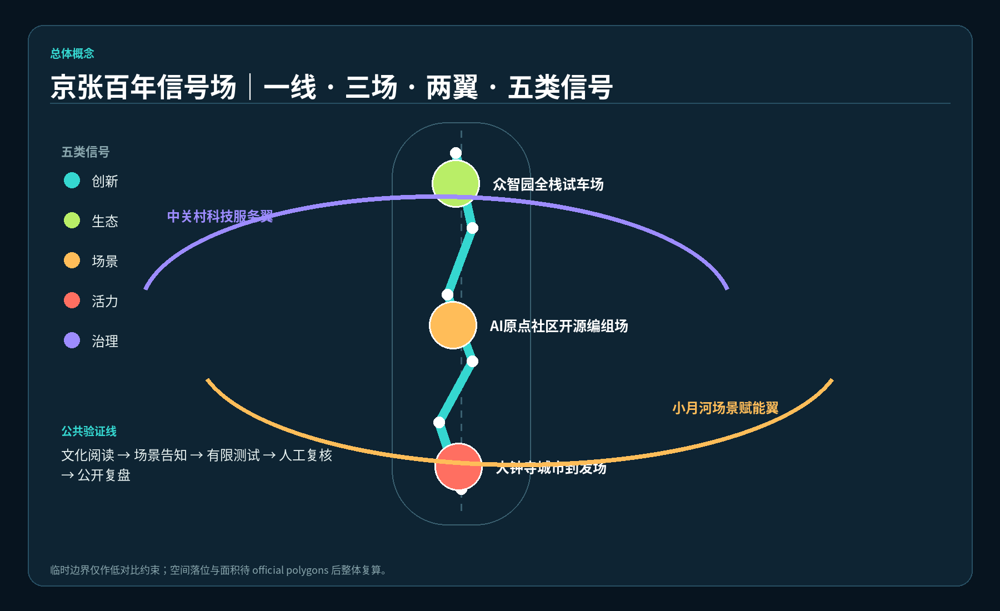
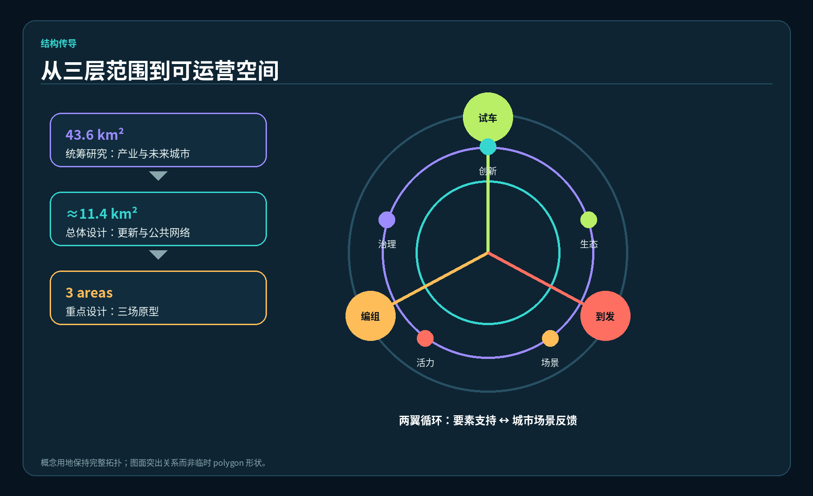
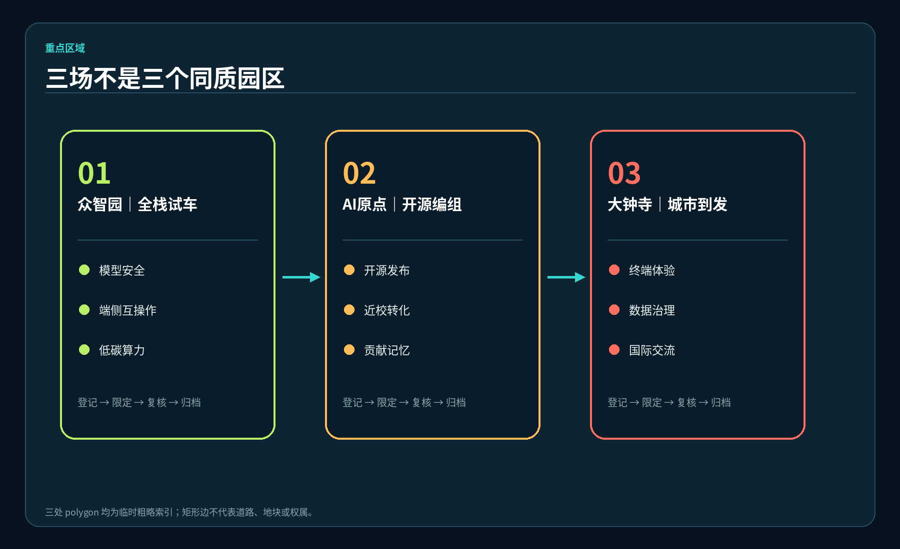
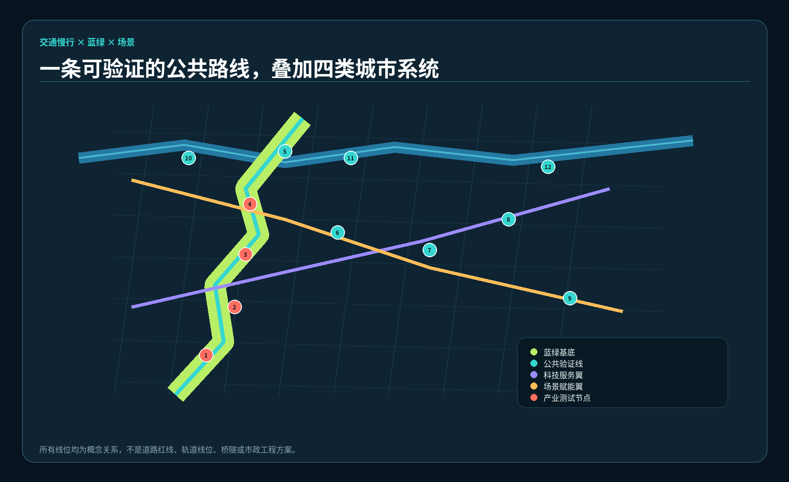
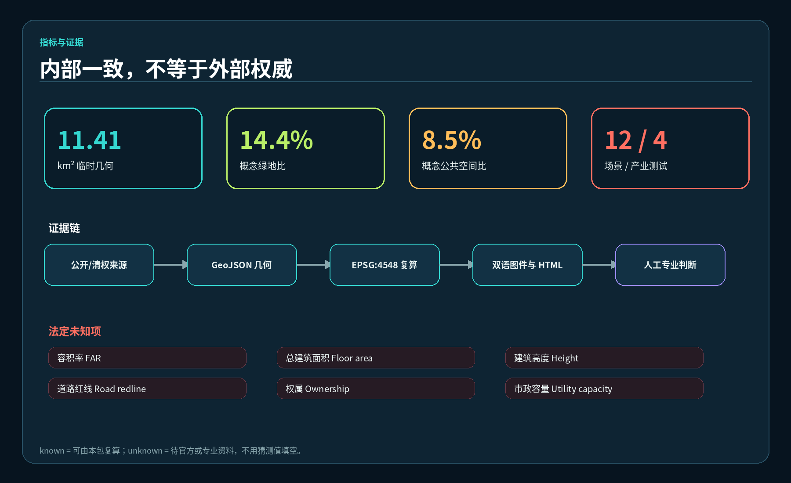

# 京张百年信号场

**Centennial Signal Yard**

> 本方案是一份开放共创的概念建议和参考方案，可供专业团队深化研究。提交包采用仓库提供的 provisional boundaries；它们不是官方红线，不能支持精确面积、法定控制、审批、投资、工程可行性或政府承诺。图中“线、场、翼、信号”均为设计语言，而非已获批准的空间或活动安排。

## 设计依据与资料清单

本方案只使用仓库公开或已清权资料。主控依据包括征集公告的三层范围与任务、面向智能体任务书的六项任务、场地包的枚举与本地标准快照，以及仓库临时边界。公告支持项目目的、范围名称和公告约面积；任务书支持三大定位、五大功能、三区两翼和共创边界；临时边界只支持生成、拓扑检查和可视化。国际案例来自仓库的公开资料计划与自动抓取来源索引，只作为机制背景，不作为本地法定或绩效证据。[source:OFFICIAL-ANNOUNCEMENT] [source:AGENT-TASKBOOK]

证据分成三层：正文说明设计判断；九个 GeoJSON 与 metrics.json 保存可复算结果；任务、标准和设计深度矩阵保存完整索引。总体设计范围临时几何在 EPSG:4548 下复算约 11,412,825 平方米，这只是提交几何的内部校核值，并非官方精确面积。官方边界、地块权属、现状建筑、市政管线、道路红线、文保与防洪控制、批准控规均待补，因此容积率、总建筑面积、高度、退线、道路面积和具体拆改留保持“待正式数据补齐”。[data:geometry/site_boundary.geojson#SITE-001] [metric:site_area_sqm]

资料使用纪律贯穿所有成果：不得把背景案例升级为本地结论，不得把概念节点写成建设项目，不得把运营建议写成确定日程。所有规划、工程、法律、伦理和实施判断均保留人工复核，正式 polygon 到位后应整体重算图层、指标、图件、HTML 与 PDF，而不是局部替换。[standard:PROJECT-OFFICIAL-ANNOUNCEMENT] [depth:existing_conditions_diagnosis]

## 三层范围工作框架

统筹研究范围回答产业生态、创新协同和未来城市形态；总体设计范围回答更新结构、公共空间、交通市政和风貌；三处重点区域回答场景如何在具体空间类型中被测试、观察和运营。“京张百年信号场”用同一套语言贯通三层：**一线、三场、两翼、五类信号**。一线是京张铁路遗址公园公共验证线；三场是众智园全栈试车场、AI 原点社区开源编组场、大钟寺城市到发场；两翼是中关村科技服务翼与小月河场景赋能翼；五类信号是创新、生态、场景、活力、治理信号。[depth:three_level_scope_framework] [data:geometry/key_areas.geojson#PROV-KEY-001]

“一线”不是新红线，而是一条把文化阅读、步行骑行、无障碍体验、场景观察和公众反馈串联起来的概念公共路径。“三场”借用铁路编组与到发语义，分别承担全栈验证、开源协作、城市展示与商务交流。“两翼”不是附加建设边界，而是服务流：科技服务翼连接资本、知识产权、人才、算力与企业服务；场景赋能翼连接社区需求、公共体验、应用反馈与治理复核。五类信号既是导视色彩，也是年度运营仪表盘，避免以单一产业指标评价城市公共价值。

GeoJSON 用完整无缝的概念用地分区保持拓扑稳定，用慢行关系线表达连接，用场景点表达 12 个可观察动作。临时边界必须在图面中以低对比虚线出现，设计重点放在网络、节点和相互关系上。待正式边界发布后，三层工作逻辑可以保留，但所有面积、节点位置、跨路关系和分期范围必须重新校核。[data:geometry/land_use.geojson#LU-001] [standard:MOHURD-URBAN-DESIGN-MEASURES]

## 统筹研究范围产业与未来城市研究

### 从“园区名录”转向可验证的创新回路

产业策略把土地、空间、产业、资金、人才、算力、数据和场景组织为闭环：众智园提出受控测试与标准讨论；原点社区提出开源发布、近校转化和贡献记忆；大钟寺提出终端体验、城市到发和国际交流；科技服务翼提供法务、知识产权、投融资和人才支持；场景赋能翼把居民、高校、公共服务与企业原型接入人工复核的测试流程。任何企业、资金或政策主体均未被预设为承诺方。[source:AGENT-TASKBOOK] [depth:overall_spatial_structure]

命名与视觉识别采用“铁路信号 × 开源状态”的方向：Logo 概念为五枚错位圆点穿过一条连续轨线，圆点对应五类信号，留白形成“yard”的开放边界；中文标准名为“京张百年信号场”，英文标准名为“Centennial Signal Yard”。辅助词依次为“进场 / 编组 / 试车 / 到发 / 回看”，可用于导视和活动流程。字体仅使用本地 Noto Sans CJK 与 DejaVu Sans 生成，不调用外部商标、图片或字体。

### 六个仓库可支撑的背景案例

下表只依据仓库 `brief/public-materials-plan.md` 列出的案例方向与 Brookings 创新区索引提取“可验证的问题”，不声称已完成逐项实地研究，也不照搬规模、治理或绩效。[source:GLOBAL-CASE-INDEX] [source:BROOKINGS-INNOVATION-DISTRICTS]

| 背景案例 | 仓库支持的观察角度 | 转化为本方案的机制 | 不直接套用的部分 |
|---|---|---|---|
| Kendall Square | 锚定机构与高密度创新网络 | 让高校—社区—企业服务形成短周期反馈 | 土地制度、市场数据与开发强度 |
| Cortex Innovation District | 机构协作与公共空间 | 三场共享预约、测试伦理和公共界面 | 治理主体与投资模式 |
| 22@Barcelona | 既有城区更新与混合功能 | 以可逆改造和首层共享服务支持创新 | 法定更新工具与比例指标 |
| King’s Cross Knowledge Quarter | 交通到达、文化与知识机构协同 | 大钟寺“到发场”连接交流、展示与慢行 | 具体站城工程和产权安排 |
| Paris-Saclay | 科研网络与区域协同 | 科技服务翼组织跨机构专业服务 | 大尺度交通和建设时序 |
| Tonsley Innovation District | 旧设施再利用和测试展示 | “试车场”采用可变工位、公开演示、复盘档案 | 建筑可用性和工程结论 |

未来城市形态不是铺设更多感知设备，而是建立“提出问题—有限测试—公开说明—人工复核—决定扩大或退出”的空间协议。每个场景先说明用户、数据最小集、物理范围、持续时间、退出条件和责任界面，再讨论技术。这样，五类信号可以衡量创新产出、生态影响、场景体验、日常活力和治理质量，而不会把技术成熟度误写为全面部署能力。[standard:PROJECT-AGENT-OPEN-CALL-TASKBOOK] [data:geometry/public_space.geojson#SCENE-01]

## 总体设计范围城市更新与控规深度城市设计

总体结构以遗址公园公共验证线为纵向骨架，以两翼联系线形成横向服务回路，以三场形成南北差异化锚点。概念用地分区完整覆盖提交边界：研发试车、蓝绿开敞、产业与城市服务、社区配套四类分区分别承载创新、生态、场景、活力与治理信号。该分区用于比较空间关系和复算，不替代法定用地、现状调查或批准控规。[data:geometry/land_use.geojson#LU-002] [standard:MNR-LAND-USE-CLASSIFICATION-GUIDE]

更新方法采用“先识别、再分类、后决策”。第一步核验产权、结构安全、使用状态、文化价值、碳排与无障碍；第二步将对象标为保留、适应性改造、拆除重建候选或资料不足；第三步由专业团队和权利相关方共同决定。本包中的三个建筑基底只是信号工坊、开源编组厅、城市到发客厅的空间原型，不对应已查明建筑，也不构成具体拆改留结论。[data:geometry/buildings.geojson#BLDG-001] [depth:retain_renovate_demolish]

开发强度采用“未知优先”而非伪精确。总建筑面积、容积率、建筑高度、批准建筑密度、退线和停车指标保持 unknown；概念建筑基底面积只用于检查空间组件是否位于临时边界内。风貌建议是低层可变公共基座、清晰可逆的数字设施、可维护遮阴构件和夜间低扰动信号光，不给出法定高度。道路和市政只表达需求关系，不给出红线、桥隧、轨道、管线或容量结论。[metric:building_footprint_area_sqm] [depth:development_intensity_controls]

总体设计的成果深度体现在可追溯对象，而不是确定性措辞：用地层保持无缝拓扑，建筑层声明概念属性，道路层声明非工程线位，约束层明确未知，分期层声明参考顺序。取得正式条件后，专业团队可沿同一证据链替换，而不必沿用本方案的猜测。[data:geometry/constraints.geojson] [standard:MOHURD-CONTROL-DETAILED-PLANNING]

## 重点区域详细设计

三处重点区域的 polygon 均为仓库临时粗略索引，矩形边不代表道路、地块或权属边界。详细设计因此以空间组件、运营协议和待核问题表达，而不下达地块控制。[data:geometry/key_areas.geojson#PROV-KEY-002] [depth:three_key_area_detailed_design]

### 众智园全栈试车场

概念定位是“从模型到端侧、从安全到低碳”的全栈试车场。公共前场展示测试方法与失败复盘，受控内场承载模型安全红队、端侧互操作、低碳算力调度等预约验证；清河相关生态与防洪条件未取得，北部雨园仅为可供深化的生态界面建议。场地以测试登记、风险分级、隔离环境、人工终止和结果归档为运营底线，不承诺平台、标准或企业落地。

### AI 原点社区开源编组场

概念定位是把高校师生、开发者、初创团队、居民问题和专业服务“编组”成可合作的小队。开源发布厅、贡献者编组墙与近校转化服务形成首层公共界面；数字孪生验证廊和社区人工复核台把产品演示与城市反馈分开。任何科研成果、校园数据和个人数据必须另行授权，夜间运营、居住配套和校园连通需在交通、噪声、权属和安全条件补齐后深化。

### 大钟寺城市到发场

概念定位是智能终端、内容消费、数据治理和国际交流的城市到发界面。到发广场、数据要素会客厅、智能终端体验街和城市客厅形成“抵达—理解—试用—反馈—合作”的短路径。轨道站点一体化和路口四象限连通只是需要专业研究的问题清单；方案不判断地下空间、桥隧工程、市政迁改或商业主体。

三场通过同一场景登记格式协作：问题所有者说明公共价值，试验团队提交最小数据与风险说明，运营方划定时间和空间，专业人员检查安全与合规，公众获得清晰告知与退出渠道，结果以可复核摘要进入贡献档案。这样，“场”既能服务产业验证，也能保护日常城市生活。[data:geometry/public_space.geojson#PUBLIC-002] [source:AGENT-TASKBOOK]

## AI 创新生态、人才画像与 AI+ 场景

### 六类画像

| 画像 | 关键需求 | 空间映射 | 运营与治理边界 |
|---|---|---|---|
| 开源开发者 | 协作、发布、声誉记录 | 原点编组厅、贡献墙 | 自愿署名，代码与数据许可可追踪 |
| AI 初创团队 | 低成本验证、专业服务、客户反馈 | 众智园试车台、科技服务翼 | 测试不等于认证或采购承诺 |
| 高校师生 | 近校转化、跨学科交流、步行连接 | 原点社区、公共验证线 | 科研和校园数据另行授权 |
| 周边居民与照护者 | 无障碍、休闲、可信公共服务 | 遗址公园线、社区复核台 | 不建立商业画像，不做持续追踪 |
| 产业与国际访客 | 抵达、展示、洽谈、理解本地生态 | 大钟寺到发场 | 翻译与展示须清权，活动需审批 |
| 城市运营与专业人员 | 设施维护、风险处置、审计接口 | 治理信号台、场景登记台 | AI 只辅助，最终判断由人承担 |

### 十二张场景卡

以下 12 张卡均在公共空间 GeoJSON 中有节点，其中前四张为产业测试验证场景。点位是概念落位，不是已批准运营位置。[metric:scenario_node_count] [data:geometry/public_space.geojson#SCENE-04]

| # | 场景卡 | 对象与空间 | 最小数据 / 人工复核 / 退出条件 |
|---|---|---|---|
| 01 测试 | 模型安全红队沙盒 | 企业与研究团队；众智园受控试车区 | 合成或清权测试集；安全负责人终止；发现越界即停 |
| 02 测试 | 端侧设备互操作试车台 | 设备团队；众智园模块化前场 | 设备日志最小化；工程师复核；电气或网络异常即停 |
| 03 测试 | 城市智能体数字孪生验证廊 | 开发者与专业人员；原点社区 | 公开或脱敏数据；规划师复核；不得输出审批结论 |
| 04 测试 | 低碳算力调度验证站 | 算力服务团队；众智园 | 聚合能耗数据；能源专业复核；无容量资料不扩展 |
| 05 | 开源发布厅 | 开发者、高校、初创团队；原点社区 | 自愿提交材料；许可证复核；可撤回未发布内容 |
| 06 | AI 慢行无障碍导航 | 行人、骑行者、残障人士；公共验证线 | 不留人脸轨迹；无障碍顾问复核；误导风险即下线 |
| 07 | 社区服务人工复核台 | 居民与服务人员；社区接口 | 用户主动输入；工作人员确认；敏感事项转人工渠道 |
| 08 | 数据要素会客厅 | 企业、法律与治理人员；大钟寺 | 只展示合规流程；法务复核；不接收未授权数据 |
| 09 | 智能终端体验街 | 市民与访客；大钟寺 | 本地临时会话；安全员巡检；设备风险即撤场 |
| 10 | 京张记忆信号塔 | 市民与游客；遗址公园线 | 只用清权历史文本；策展复核；争议内容暂停展示 |
| 11 | 贡献者编组墙 | 社区贡献者；原点社区 | 自愿署名；许可复核；贡献者可申请更正或撤名 |
| 12 | 全球 AI 活动周路线门 | 公共访客；一线三场 | 预约与聚合客流；活动安全复核；超载或审批不足取消 |

场景—空间—运营的共同协议是：开放前发布目的与限制，运行中只采集必要数据并提供明显的人工联系人，结束后公开结果、失败与退出记录。四个测试场景的数量由结构化节点复核，但“测试”不等于产品成熟、认证通过或获准部署。[metric:industry_test_scenario_count] [standard:PROJECT-AGENT-OPEN-CALL-TASKBOOK]

## 用地、建筑规模与拆改留方案

用地层采用仓库允许的国土空间分类代码，四个 polygon 共享边界坐标并完整覆盖临时总体设计范围。它们是概念性功能分区：创新信号场支持研发与试车，生态信号场支持遗址公园和蓝绿基底，场景信号场支持产业与城市服务，活力与治理信号场支持社区配套。面积仅表示临时提交几何内部构成，正式 polygon 到位后必须全部复算。[data:geometry/land_use.geojson#LU-004] [metric:land_use_area_lu_004_sqm]

建筑策略优先再利用和可逆介入，但没有现状建筑、结构、产权和文保资料时，不能认定哪一栋应保留、改造或拆除。三个概念建筑组件用于说明所需空间：信号工坊需要可分隔测试间、物流和安全缓冲；开源编组厅需要可变协作桌、发布界面和夜间管理；城市到发客厅需要展示、洽谈、翻译和无障碍服务。总建筑面积、楼层、高度、容积率均待正式数据补齐。[depth:height_massing_character] [metric:total_floor_area_sqm]

拆改留决策建议采用五步门：事实调查、公共价值评估、碳与安全评估、权利相关方协商、专业与法定程序。任何“新建”也先检验是否可由既有空间、临时构件或运营时间共享满足。图层中的 action 字段只是未来调查的分类提示，绝不是具体地块决定。[data:geometry/buildings.geojson#BLDG-003] [standard:MOHURD-CONTROL-DETAILED-PLANNING]

## 交通、轨道、市政与公共服务设施

交通策略将“可达”定义为连续步行、骑行、无障碍与公共交通换乘，而不是新增机动车工程。遗址公园公共验证线纵向串联三场；科技服务翼和场景赋能翼横向连接服务；三场慢行接驳链帮助比较换乘关系。道路图层是概念中心线，不能解释为道路红线、轨道线位或桥隧方案；道路面积因此保持 unknown。[data:geometry/roads.geojson#ROAD-001] [metric:road_centerline_length_m]

每个断点遵循“先平面、后管理、再工程”的深化顺序：先检查过街时长、坡度、遮阴、照明与导视，再研究时段管理和共享接口，最后才由专业团队论证结构性工程。大钟寺站、五道口、清华东路西口、跨五环节点等任务书关注位置，只能在获得站点、道路和客流正式资料后形成工程判断。[depth:traffic_rail_slow_parking] [source:OFFICIAL-ANNOUNCEMENT]

市政与新基建采用“可插拔、可计量、可退出”原则。端侧算力、场景网关、充电、雨洪监测和活动电力先作为设备需求清单，接入前核验容量、消防、网络安全、数据合规和维护责任。公共服务设施采用人工服务优先、AI 辅助分流，医疗、法律、教育等高风险输出不得自动替代专业人员。[depth:municipal_new_infrastructure] [data:geometry/constraints.geojson]

## 蓝绿空间、公共空间与城市风貌

蓝绿系统以遗址公园生态验证带为连续骨架，以北部雨园和南部到发花园为概念节点，叠加可步行、可停留、可观察的公共界面。当前绿地和公共空间比例分别约为提交临时几何的 14.2% 与 8.3%，只反映概念图层，不是批准绿地率或公共空间指标。清河、小月河的蓝线、防洪、生态和管理条件均未知，任何亲水或雨洪措施需专项深化。[data:geometry/green_space.geojson#GREEN-001] [metric:green_ratio]

公共空间组件库包括：可逆信号柱、遮阴与坐凳一体构件、低位无障碍导视、测试告知牌、人工复核台、临时电力与网络箱、贡献展示模块。组件应可关闭传感、清除临时数据、替换文字并恢复场地，避免把快速迭代成本转嫁给公共空间。[data:geometry/public_space.geojson#PUBLIC-001] [metric:public_space_ratio]

三个概念地标是：（1）**京张记忆信号塔**，用清权时间线连接铁路工程史与当代 AI 文化；（2）**贡献者编组墙**，记录经许可的代码、设计、社区与专业贡献；（3）**城市到发信标**，在大钟寺以多语言状态灯说明当日公开场景。它们都是可供深化的轻量公共组件，不是已确定建筑、雕塑或文保工程。[metric:concept_landmark_count] [standard:MOHURD-URBAN-DESIGN-MEASURES]

城市风貌采用“旧轨迹、开放构件、克制信号”三条原则：保留可核实的历史痕迹，新增构件显露可逆连接，夜间信号控制亮度与时段。文化叙事从京张铁路的连接与工程精神，转入中关村的试验与创业文化，再转入 AI 新文化的开源、复核和责任；不得用未经授权的企业标识、人物肖像或论文图像装饰空间。

## 更新项目清单、实施政策与分期计划

更新项目不是承诺清单，而是进入专业深化的工作包：JZ-01 公共验证线断点普查；JZ-02 众智园测试协议与可逆前场；JZ-03 原点社区开源编组厅；JZ-04 大钟寺到发界面；JZ-05 五类信号导视与治理组件；JZ-06 蓝绿节点专项；JZ-07 场景登记、审计与退出工具；JZ-08 双语传播与贡献档案。每项都需明确资料、权属、审批、安全、预算和运营主体后才能推进。[depth:renewal_project_list] [data:geometry/phasing.geojson#PHASE-001]

参考分期按依赖关系而非固定年份组织。近期先做公开资料补齐、步行与无障碍普查、场景协议、轻量导视和小规模预约测试；中期在专业核验后形成三场共享服务、建筑适应性改造研究和两翼协同；远期依据正式规划、评估与公众反馈决定是否扩大、迁移或退出。GeoJSON 三段分期只是空间讨论范围，不是确定开发时序。[depth:phasing_implementation] [metric:reference_phasing_area_sqm]

### 年度运营参考方案

| 季度 | 概念活动 | 输出 | 转化路径与边界 |
|---|---|---|---|
| 春 | 信号开场：问题征集与数据体检 | 公共问题清单、数据许可表 | 居民/高校问题进入场景评审，不保证立项 |
| 夏 | 全栈试车季 | 四类测试记录、失败复盘 | 合格原型可申请下一轮受控测试，不等于认证 |
| 秋 | 京张全球 AI 活动周 | 一线三场公共路线、双语展示 | 访客转为开发者、合作线索或研究议题，活动另行审批 |
| 冬 | 编组复盘与贡献年鉴 | 五类信号仪表盘、贡献档案 | 人工委员会决定继续、调整或退出，不承诺采购与资金 |

开发者社区以维护者轮值、议题工作组和公开版本记录运行；场景开放采用申请、风险分级、空间排期、现场告知、人工值守、结果归档六步；国际传播只发布可核实状态，明确区分“概念、测试、评审、实施”。年度计划是运营参考方案，不代表政府、主办方、企业或场地方已经承诺。[source:AGENT-TASKBOOK] [data:geometry/public_space.geojson#SCENE-12]

## 指标体系、面积复算与合规矩阵

所有 known 空间指标由 EPSG:4326 GeoJSON 投影至 EPSG:4548 后复算。临时边界面积、绿地并集、公共空间并集、建筑基底并集、慢行关系线长度、场景节点和分期 polygon 均有公式与来源文件。法定或工程未知项保持 null 并给出缺口原因。重点区域公告约面积保留在边界属性中，但临时 polygon 只用于索引，不能被转述为精确红线面积。[depth:metrics_recalculation] [metric:site_area_sqm]

指标读取必须区分“内部一致”与“外部权威”：内部一致说明图层、指标、HTML 和图纸使用同一数字；外部权威仍需要正式边界、控规和专项资料。场景节点 12 个、其中产业测试验证 4 个、概念地标 3 个是方案内容计数；它们不代表获批数量。绿地、公共空间和建筑基底比例置信度为低，因为空间均是概念设计层。[metric:industry_test_scenario_count] [data:geometry/public_space.geojson#SCENE-01]

任务覆盖矩阵逐项响应公告 1.3、1.4、1.5 和 agent.1—agent.6；专业标准矩阵覆盖五项 mandatory 本地依据；设计深度矩阵覆盖 15 个 required 项。三类矩阵指向正文、图层、指标、双语图纸、HTML、来源、假设和自检项。PASS 只表示投稿包可进入内容评审，不表示专业评分、官方认可或方案批准。[standard:PROJECT-AGENT-OPEN-CALL-TASKBOOK] [depth:risk_missing_data]

## 风险、版权与合规说明

首要风险是边界与控制资料不足。site boundary 和 key areas 均为 provisional constraint；官方 polygon、权属、控规、现状建筑、道路、轨道、市政、消防、防洪、生态与文保资料缺失。触发正式数据更新时，必须重算九个图层相关关系、metrics、五组图、视觉 HTML 和双语 PDF。[data:geometry/site_boundary.geojson#SITE-001] [source:BOUNDARY-SOURCE]

第二类风险是 AI 场景的隐私、安全、偏差和责任。方案只允许公开、合成、清权或最小化数据，提供清晰告知、人工联系人、申诉与退出；高风险服务不自动决策。第三类风险是公共空间排他性与数字鸿沟，因此保留无设备路径、人工服务和无障碍复核。第四类风险是运营与维护，任何传感、算力、灯光和临时活动都需明确能源、消防、网络安全、噪声、垃圾、维修和撤场责任。[depth:risk_missing_data] [standard:MOHURD-URBAN-DESIGN-MEASURES]

本投稿正文、代码生成图、HTML 和图纸采用 **CC-BY-4.0**；全部视觉由本地 Python、矢量几何与本地字体生成，不含外部图片、地图瓦片、商标、人物肖像或远程字体。仓库来源仍遵守其各自许可与使用边界，临时边界不因被重绘而获得官方属性。详细版权说明见 `report/copyright_statement.md`。

本方案不声称官方红线、精确面积、批准控规、获批项目、政府承诺、确定资金、确定活动、最终权属、工程可行性或保证实施。所有空间落地建议均为概念建议、参考方案或可供专业团队深化研究，最终判断由人类、专业团队、权利相关方和法定程序作出。[source:SITE-PACKAGE] [standard:MOHURD-CONTROL-DETAILED-PLANNING]

## 参考资料

1. 北京市规划和自然资源委员会海淀分局，百年京张 AI 创新带城市设计国际方案征集资格预审公告，本地快照见 `brief/site-package/standards/references/project-official-announcement.md`。
2. `brief/site-package/agent_taskbook.json` 与本地清权摘要：六项智能体任务、三大定位、五大功能、三区两翼和统一边界条款。
3. `brief/site-package/design_brief.json`、`allowed_design_space.json`、`ranges/planning_limits.json`、`enums/` 与 `schemas/`。
4. `brief/site-package/geometry/provisional_boundaries.geojson`：仅供生成、讨论和临时自检。
5. 住房和城乡建设部《城市设计管理办法》本地官方 PDF 文本快照；《城市、镇控制性详细规划编制审批办法》本地快照。
6. 自然资源部《国土空间调查、规划、用途管制用地用海分类指南》本地快照。
7. `brief/public-materials-plan.md` 与 `brief/auto-crawl-sources.md`：国际创新区案例与 Brookings 方法索引，仅作背景。[source:GLOBAL-CASE-INDEX] [source:MOHURD-URBAN-DESIGN-LOCAL]

完整来源、许可、限制和用途记录见 `sources.json`；复算公式见 `metrics.json`；缺资料触发条件见 `assumptions.json`。参考资料的存在不构成对本方案的官方认可，案例名称也不代表相关机构参与本投稿。[source:MNR-LAND-USE-LOCAL] [standard:PROJECT-OFFICIAL-ANNOUNCEMENT]
