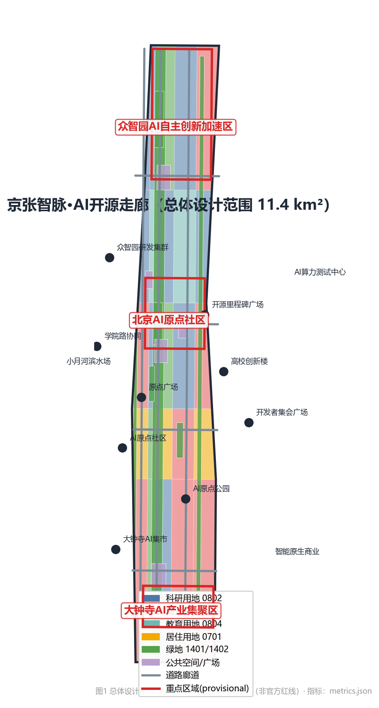
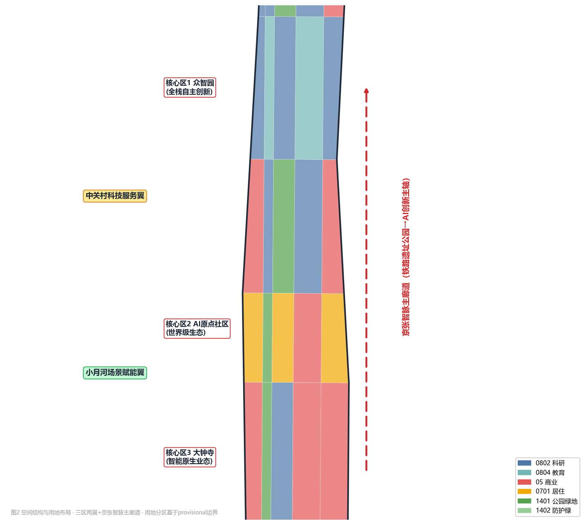
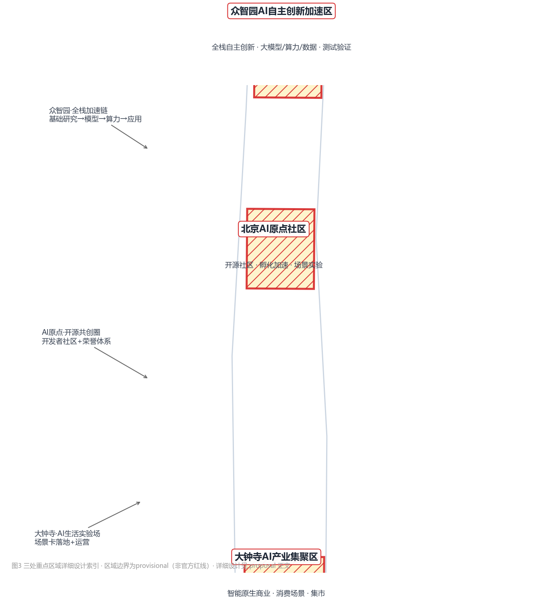
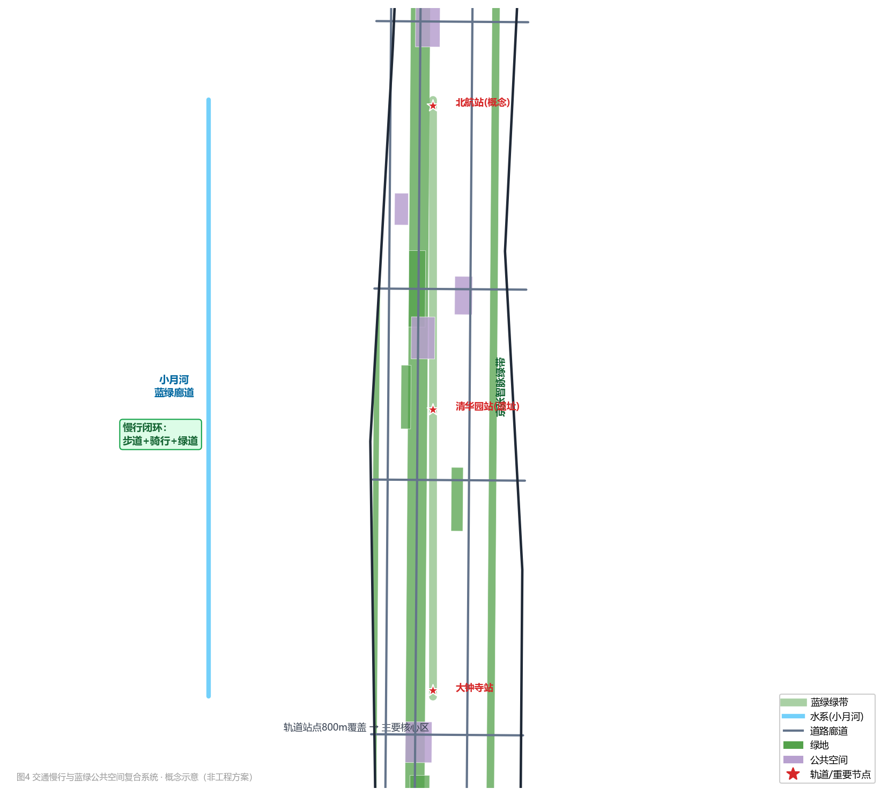
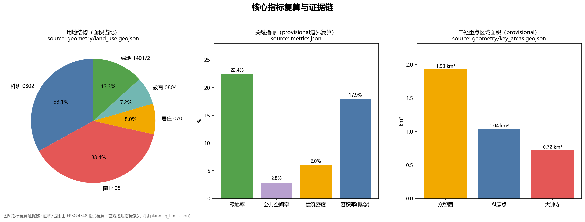

# Jing-Zhang Smart Vein · AI Open Source Corridor —— From Centennial Railway to Smart City: Conceptual Urban Design for the Centennial Jing-Zhang AI Innovation Belt in Haidian

> This scheme is an **Open Co-Creation Conceptual Recommendation** generated based on the Qualification Pre-Review Notice for the International Scheme of the Centennial Jing-Zhang AI Innovation Belt Urban Design and the open call task book for the intelligent body. It does not replace formal planning and does not constitute a government approval conclusion. All spatial implementation suggestions in the text are **conceptual recommendations, reference schemes, or directions for in-depth research by professional teams**. The conclusions regarding boundaries, areas, and planning control indicators must be recalculated after the official boundaries and control plan conditions are released. (Official Boundary)

## Design Basis and Source List

### 1.1 Design Basis

The design of this scheme is based on four categories of authority levels, all derived from publicly available, clear-authority, or organization-provided machine-readable materials, and no non-public planning data, internal data, or unauthorized materials are used [source:SITE-PACKAGE]:

1. **Official Announcement**: International Qualification Pre-Review Announcement for the Urban Design of the Centennial Jing-Zhang AI Innovation Belt (Hosted by the Beijing Development and Reform Commission, Beijing Planning and Natural Resources Commission, and Haidian District, with the management of the Zhongguancun Science City Management Committee as the executing body), its 1.3 Purpose of the Call for Entries, 1.4 Project Scale, 1.5 Design Tasks, and 1.6-8.8 Call for Entries and Intellectual Property Rights Clauses serve as the primary control for this scheme [source:OFFICIAL-ANNOUNCEMENT] [standard:PROJECT-OFFICIAL-ANNOUNCEMENT].
2. **Excerpt from the Open Call for Task Book for Intelligent Agents**: `brief/site-package/agent_taskbook.json` and the local reference snapshot `agent-open-call-taskbook-0518.md`, clearly outline ten co-creation principles, three positioning statements, five functional areas, the Three Zones and Two Wings, six intelligent agent tasks, and uniform boundary clauses [source:AGENT-TASKBOOK] [standard:PROJECT-AGENT-OPEN-CALL-TASKBOOK].
3. **Structured Task Package**: `design_brief.json`, `allowed_design_space.json`, `enums/`, `ranges/planning_limits.json`, `schemas/`, `sources.json`, `data/source_registry.json`, `data/processed/agent_fact_pack.md`, provides area benchmarks, land use codes, layer rules, metric ranges, and source usage boundaries [source:PROCESSED-FACT-PACK] [source:SOURCE-REGISTRY].
4. **Professional Standards**: Ministry of Housing and Urban-Rural Development () Urban Design Management Measures [standard:MOHURD-URBAN-DESIGN-MEASURES], Control Detailed Planning Compilation and Approval Measures for Cities and Towns [standard:MOHURD-CONTROL-DETAILED-PLANNING], and Natural Resources Ministry () Land and Sea Use Classification Guide for Territorial Space Investigation, Planning, and Land Use Control [standard:MNR-LAND-USE-CLASSIFICATION-GUIDE]. (Regulatory Detailed Planning)

### 1.2 List of Documentation and Usage Boundaries

| Documentation | Path/Source | Type | Purpose |
|---|---|---|---|
| Official Announcement | ghzrzyw.beijing.gov.cn 2026-05-09 | official_public | Scope, Tasks, and Depth Control |
| Task Extract | brief/site-package/agent_taskbook.json | user_provided_cleared | Six Intelligent Agent Tasks and Boundary Conditions |
| Structured Task Package | brief/site-package/*.json | official_public | Machine-Readable Constraints |
| Provisional Boundary | brief/site-package/geometry/provisional_boundaries.geojson | agent_inferred_from_public_data | Only for scheme generation and discussion, **not the Official Planning Boundary** |
| Data Registration | data/source_registry.json | repository_public_registry | Distinguish formal-ready / background / provisional |
| Professional Standards | brief/site-package/standards/standards.json | official_public | Design Depth and Professional Response |

According to `planning_limits.json`, the official planning limits (Floor Area Ratio, Building Height, Building Coverage Ratio, Green Space Ratio, etc.) are marked as `missing`, indicating a data gap in the organizing party's dataset; this scheme will annotate these values within the text as "to be confirmed" and "conceptual values," without pretending they are approved indicators, and will not impede content scoring [source:PLANNING-LIMITS].

### 1.3 Evidence Chain Organization

All spatial judgments in this plan are decomposed into: **traceable sources** (`sources.json`) → **re-calculable metrics** (`metrics.json`, EPSG:4548 projection re-calculation) → **verifiable layers** (`geometry/*.geojson`) → **Human Review assumptions** (`assumptions.json`) → **standards and deep responses** (`standard_matrix.json`, `design_depth_matrix.json`) → **compliance coverage** (`compliance_matrix.json`) → **self-check status** (`self_check.json`). The main text uses verifiable citation format, such as `[data:geometry/land_use.geojson#LU-001]`, `[metric:green_ratio]`, `[depth:land_use_layout]`.

## Three-Level Scope Framework

### 2.1 Scope and Work Objectives

In accordance with Announcement 1.4, this plan is developed at three levels (see Figure 1) [data:geometry/site_boundary.geojson#SITE-001] [metric:site_area_sqm] [depth:three_level_scope_framework]:

1. **Coordinated Research Area (approximately 43.6 km²)**: Located north of the North Fifth Ring Road, east of the Jingzhang Expressway, south of West Straight Outer Street, and west of Wanquan River Road, this area is positioned as a layer for strategic industrial research and the study of future urban forms, addressing questions such as "how a world-class AI Innovation Ecosystem should be organized and what the future AI city form will be."
2. **Overall Design Area (approximately 11.4 km²)**: The planning scope is set around the Jing-Zhang Heritage Park, encompassing the surrounding urban areas and industrial zones within a 1-2 kilometer radius (provisional boundaries see `geometry/site_boundary.geojson`, with an area recalculation of 11.41 km²). This area aims to achieve the depth of a Regulatory Detailed Planning Urban Design, addressing the questions of "what to update, what to build, and how to organize space."
3. **Key-Area Detailed Design Area (approximately 368.4 hectares)**: From north to south, it includes the Zhongzhiyuan AI Independent Innovation Acceleration Area (approximately 192.1 hectares), the Beijing AI Origin Community (approximately 104.3 hectares), and the Dazhongsi AI Industry Cluster Area (approximately 72.0 hectares), achieving the Urban Design depth of the Integrated Planning Implementation Plan and addressing how the "three areas can be refined and implemented."

### 2.2 Boundary Precision Statement

This proposal uses `geometry/site_boundary.geojson` (SITE-001) and `geometry/key_areas.geojson` (PROV-KEY-001/002/003), both of which are derived from provisional polygons provided by the organizing party, with attributes marked as `geometry_role="provisional_constraint"`, `official_boundary=false`, and `boundary_precision="provisional_rough"` [data:geometry/key_areas.geojson#PROV-KEY-001]. Their intended use is limited to: temporary AI generation, human-readable visualization, non-legal design discussions, and local self-inspection; they **must not** be used for official planning boundaries, approval references, accurate area calculations, or legal planning controls. The organizing party's data gaps shall not impede content scoring. (Official Planning Boundary) After the official polygon is released, the site boundary, land use, buildings, roads, green/public space, phasing, and all area category metrics must be recalculated in their entirety (see Chapter 11 and `assumptions.json` A-CONTROLS-001) [source:BOUNDARY-SOURCE] [source:KEY-AREA-SOURCE].

### 2.3 Third-Level Implementation Logic

Strategic Industry (Comprehensive Layer) → Overall Structural and Update Framework (Overall Layer) → Three Zones and Two Wings Detailed Design (Key Layer) are transmitted hierarchically: The comprehensive layer determines the spatial model of "Three Zones and Two Wings + Jing-Zhang Intelligent Pulse Main Corridor" and the AI ecological mechanism; the overall layer implements this model in land use zoning, road network, blue-green system, and update project list; the key layer provides positioning, spatial structure, demolish-renovate-retain direction, Public Space, and AI scenarios for each of the three zones. At three levels, the same geometric and indicator base is used to ensure calculability and traceability [depth:overall_spatial_structure] [depth:three_key_area_detailed_design]. (Demolish–Renovate–Retain Strategy)

## Coordinated Research Area: Industry and Future City Research

### 3.1 Overall Concept and Naming System (agent.1)

**Suggested Main Name:** "Jing-Zhang Smart Pulse · AI Open Source Corridor" (English: **Jing-Zhang AI Smart Spine · Open Source Corridor**).

Naming Logic: Lock onto the century-old railway cultural gene with "Jing-Zhang," and express the AI era's innovative main corridor with "Smart Spine" (AI-Native) — the railway was the 20th century's "steel artery" for China's independent innovation, while AI is the 21st century's "digital nervous system." Both align on the heritage park site; "Open Source Corridor" echoes the task book's requirements for an open-source system, developer community, and global co-creation, while highlighting the AI-Native attribute (code, data, models flow along the corridor). Naming System: Main Name (Jing-Zhang Smart Spine) → Theme Belt (Century Jing-Zhang Cultural Belt / Urban AI Life Experience Belt / AI Fusion Innovation Belt) → Core Area (Zhongzhiyuan · AI Origin · Dazhongsi) → Nodes (Open Source Milestone Plaza, Developer Honor Wall, AI Origin Monument, etc.) → Event Brand ("Jing-Zhang Open Source Week JZ-Open Week," etc.), forming an extendable tree-like naming system [standard:PROJECT-AGENT-OPEN-CALL-TASKBOOK].

**Logo and Visual Identity Direction**: The graphic theme is "wye railway + data nodes/neural synapses" — the famous "wye" alignment of the Jingtong Railway section is a historical symbol of independent innovation, abstracted as two intersecting lines, with the intersection point evolving into an AI data node (circular light dot), forming a triple metaphor of "human" as "human-centric," "railway" as connection, and "node" as intelligence. Color system: Jingtang Blue-Grey (railway/history) + Open Source Orange (vitality/community) + AI Electric Blue (computing/future); the auxiliary graphic is a "track-code" double-line motif along the corridor. Font direction: Chinese uses Modern Black (such as Source Han Black), and English uses geometric sans-serif, ensuring international dissemination and multi-lingual extension. The above is the conceptual direction, and the formal VI needs to be deepened and completed by a professional design team, including font/graphic clearance [depth:overall_spatial_structure]. (Jing-Zhang)

### 3.2 Three Key Positions, Five Major Functions, and the Synergistic Loop of the Three Zones and Two Wings

This plan implements the three major positioning tasks as spatial strategies: **Centennial Jing-Zhang Cultural Belt** = Heritage Park Vital Axis (cultural narrative and Public Space); **Urban AI Living Experience Belt** = Xiaoyue River Scenario Enablement Wing and adjacent living districts (AI-Enabled Scenario perceptible); **AI Integration Innovation Belt** = mixed research, business, and residential industrial corridor (innovative ecosystem). The five functional areas correspond respectively to the spatial carriers [source:AGENT-TASKBOOK]:

| Function | Spatial Carrier |
|---|---|
| Full-Stack Independent AI Innovation System | Zhongzhiyuan AI Independent Innovation Acceleration Area (Basic Research-Model-Capacity-Data-Security Governance Full Chain) |
| World-Class AI Innovation Ecosystem | Beijing AI Origin Community (Original Innovation Pivotal Point - Technology Transfer - Open Source System - Brand Events) |
| AI-Enabled Scenario Enablement Paradigm | Xiaoyue River Scenario Enablement Wing + Self-Selected Scenario Zone (AI+ Healthcare/Education/Commercial/Transportation, etc.) |
| Intelligent AI Vital City | Overall Design Area (New Infrastructure, Edge Side Computing Power, AI+Public Space) |
| AI Governance of Global Discourse | Zhongzhiyuan Governance and Standards Module + Dazhongsi Data Element Circulation Experiment |

**Three Zones and Two Wings Synergistic Loop**: The three zones (Zhongzhiyuan - Origin - Dazhongsi) form a vertical loop "R&D acceleration → Original innovation → Industrial amplification" along the Jing-Zhang Smart Pulse main corridor from north to south; two wings (Zhongguancun Technology Services Wing: global element configuration, Zhongguancun IP and capital empowerment; Xiaoyue River Scenario Enablement Wing: AI scenario testing and urban life experience) horizontally support the three zones. The loop mechanism: **talent and projects** flow north to south along the corridor (university origin → origin incubation → Zhongzhiyuan acceleration → Dazhongsi amplification); **capital and services** are injected by the Zhongguancun wing; **scenarios and data** are fed back by the Xiaoyue River wing and the self-selected venue area [depth:overall_spatial_structure] [data:geometry/land_use.geojson#LU-001].

### 3.3 Global AI Innovation Ecosystem Case Study (agent.2)

Based on publicly authoritative sources, select 6 world-class AI/innovation ecosystem case studies as benchmarks (see `sources.json` and Chapter 13 References; facts are based on public reports, and no internal or unverified data were used) [source:CASE-STUDIES]:

1. **San Francisco Bay Area (Silicon Valley, )**: Leveraging the cycle formed by universities such as Stanford in conjunction with venture capital, the area exhibits a mix of low-density industrial parks and high-density innovation districts. Key elements to learn from include the **density of innovation interaction spaces** and the gradient of physical spaces provided, such as garages, incubators, and accelerators.
2. **Beijing AI Origin Community**: Approximately 1 square mile of the area around MIT is home to over a thousand technology companies, earning it the title of "the most innovative one square mile on Earth"; reference point: the compact mixed-use development of an **on-campus innovation district**, the integration of Public Space with industrial space, directly comparable to the Beijing AI Origin Community.
3. **King's Cross, London, UK**: Redeveloping the railway heritage into a knowledge-intensive district by transforming the abandoned industrial railway area into a modern tech and innovation hub (with the Google UK headquarters among the tenants), while preserving the railway's historical fabric and integrating modern innovation spaces; key lessons: **railway heritage revitalization and innovative street renewal**, directly comparable to the Jing-Zhang Heritage Park's adjacent redevelopment.
4. **Jurong Innovation District in Singapore**: A government-led integrated zone for advanced manufacturing and research and development, emphasizing a "testing platform + industrial park + ecological community" integrated approach with test sites for autonomous driving, among others; key reference: **spatial institutionalization of the industrial Testing and Validation Scenario**, benchmarking against the AI industry testing and validation scenario system.
5. **Shenzhen, China (Nanshan High-Tech Park-Xilihu International Science and Education City)**: With enterprises as the main body, a complete industrial chain, and the integration of hardware manufacturing and software innovation, it forms a rapid transformation of "research, development, production, and application." Key elements: **Scenario Access and Rapid Iteration** mechanisms, and an industrial ecosystem that integrates hardware and software.
6. **Beijing Zhongguancun (Science City - Software Park - Zhi Chun Road Corridor)**: One of the national AI innovation hotspots, characterized by a dense concentration of universities and research institutions, a cluster of large model enterprises, and a comprehensive array of policy and capital elements; reference point: **to add value to the existing innovation high ground** through Urban Renewal, thereby releasing high-quality industrial spaces.

**Ecological Atlas and Element Mechanisms**: Integrated Case Study, Extracting the "One Map and Five Chains" Ecological Atlas—Innovation Chain(basic research → technology → product → industry), Talent Chain(recruitment - training - retention - honor), Funding Chain(seed capital - angel investment - VC- industrial capital), Computing and Data Chain(public computing power - data sandbox), Scenario Chain(testing - pilot - promotion). Five chains are configured along the Jing-Zhang intellectual pulse main corridor: the original point community focuses on the talent chain and the front end of the innovation chain, Zhongzhiyuan focuses on the computing power/data chain and security governance, while Dazhongsi focuses on the scenario chain and capital exit amplification [depth:overall_spatial_structure] [metric:ai_scenario_node_count].

### 3.4 Future AI City Form Proposal

This proposal puts forward the three principles of "**Adaptive and Evolvable Urban Form**" [standard:MOHURD-URBAN-DESIGN-MEASURES]:

1. **Corridor as System**: Jing-Zhang Smart Vein corridor serves as the "urban operating system bus," with computational power, data, energy, unmanned delivery, and multimodal infrastructure arranged along the corridor to support continuous supply of AI services.
2. **Neighborhood as Scene**: Embed AI scenarios into the daily life of the neighborhood (AI+transportation, AI+healthcare, AI+education, AI+commerce, AI+Public Space), rather than setting aside separate tech parks; each neighborhood should reserve "pluggable scene modules".
3. **Leave a Margin for Evolution**: In the Land-Use Layout, retain elastic margin plots (`16` margin plot code) to reserve growth space for unforeseeable future AI functions, embodying "evolvability."

## Overall Design Area: Urban Renewal and Regulatory-Plan-Level Urban Design

### 4.1 Overall Spatial Structure

Overall Design Area (11.4 km²) establishes the "one vein, three zones, two wings, and multiple nodes" spatial structure [depth:overall_spatial_structure]:

- **One Continuum**: Jing-Zhang Smart Pulse Main Corridor — a north-south permeable composite corridor formed along the Jing-Zhang Railway Heritage Park (with Conceptual Green Belt `GREEN-001` as the core segment, approximately 1.9 km long), integrating pedestrian, cycling, track connection, AI experience, and cultural activities functions [data:geometry/green_space.geojson#GREEN-001].
- **Three Areas**: Zhongzhiyuan AI Independent Innovation Acceleration Area (North), Beijing AI Origin Community (Center), and Dazhongsi AI Industry Cluster Area (South), see Chapter 5.
- **Wings**: Zhongguancun Technology Services Wing (west side, anchored by Zhongguancun Avenue and research institutes and academies), Xiaoyue River Scenario Enablement Wing (west side along the water system, leveraging the Blue-Green Space of Xiaoyue River).
- **Multiple Nodes**: Open-source Milestone Square, AI Origin Square, Developer Assembly Square, Dazhongsi AI Marketplace Square, Xiao Yuehe Riverside Vitality Field, etc. (`PUBLIC-001~005`)[data:geometry/public_space.geojson#PUBLIC-001].

### 4.2 Urban Renewal Overall Framework

Organize the update (conceptual direction, not site conclusions) using a four-tier strategy of "**leave intact, renovate, demolish, and build**" [depth:retain_renovate_demolish]:

- **Preserve (Retain)**: the Jing-Zhang Railway Heritage Park itself, the Tsinghua Yuan Railway Station, and other cultural resources, as well as universities, institutes, and high-quality existing buildings, serving as cultural anchors and functional framework.
- **Rehabilitate (Renovation)**: Low-efficiency industrial spaces and outdated research buildings along the site, as well as street commercial areas, will be transformed through functional replacement, façade updates, and the addition of Public Spaces to achieve "phoenix rebirth," releasing space for the AI industry.
- **Demolition (Removal)**: Only propose conceptual removal directions for scattered buildings that are indeed inefficient, dilapidated, and supported by professional assessment (subject to legal procedures, not a conclusion of this plan).
- **Build (New Construction)**: In updating the layout of AI industry carriers, talent communities, and public facilities, new construction will be concentrated in the core areas of the three zones and around the rail transit stations.TOD Guide).

Update spatial structure focus: **low-efficiency spaces adjacent to the ruins park** (Jing-Zhang Zhimai on both sides of 1-2 blocks) as the first renewal belt; **TOD update nodes** at Wudaokou-Qinghua East Road West Intersection and around Dazhongsi Station; **along the Academy Road** as a campus-park-block integration zone. The corresponding spatial carriers are defined in `geometry/land_use.geojson` for research, commercial, and residential land use zones [data:geometry/land_use.geojson#LU-008] [depth:renewal_project_list].

### 4.3 Industrial Goals and Functional Layout

Industrial Goals (Conceptual, Requires Professional Industrial Research for Deepening): Focus on AI large models, agents, embodied intelligence, data elements, and AI+ industry applications as primary directions, constructing a full chain from "basic research-technological breakthrough-product incubation-industrial amplification." In terms of functional layout, research and development land (0802) will be concentrated in the vicinity of Zhongzhiyuan and the original point community, educational land (0804) will be based on the cluster area of universities, commercial and service land (05) will be laid out along the intelligence axis and the Dazhongsi-Wudaokou living axis, residential land (0701) will be evenly distributed on both wings, forming a balance of work, residence, commerce, and services [metric:land_use_research_sqm] [metric:land_use_commercial_sqm] [metric:land_use_residential_sqm].

### 4.4 Jing-Zhang Heritage Park Vitality Corridor

With "Seammaking and Connectivity" as the Two Strategies [depth:blue_green_public_space]:

- **North-South Throughway**: Along the archaeological site park, establish a composite system of pedestrian and cycling paths-greenways, addressing slow-moving connectivity issues (particularly over the Fifth Ring Road and key road nodes). Plan the conceptual "Jing-Zhang Wisdom Vein Greenway" (`GREEN-001` concept line) to link Zhongzhiyuan at the northern end, the original point community in the middle, and Dazhongsi at the southern end [data:geometry/green_space.geojson#GREEN-001].
- **East-West Stitching**: Sew together the eastern and western sides of the heritage park with multiple east-west connecting roads and pedestrian pathways (`ROAD-004~007` conceptual lines), linking the universities, parks, and communities and improving pedestrian connections [data:geometry/roads.geojson#ROAD-004].
- **Vital Functions**: Embed AI Public Space scenarios along the park (see Chapter 9), developer trails, open-source achievement galleries, and honor walls for contributions by agents (see Section 9.4), transforming the park from a "linear green space" into an "innovative vitality corridor."

### 4.5 Urban Character and Control Guidance

City Tone: "**Rational Tracks × Code Order × Growing Greenery**". Style Districts: Cultural Style District (along the Ruins Park, low-rise, high permeability, retaining railway elements), Innovation Style District (core area of three zones, modern and simple, transparent glass, and public open ground floor), Living Style District (residential areas on both wings, human-scaled). Control Guidance (conceptual values, subject to official control plan confirmation [depth:height_massing_character]): Building Heights along both sides of the Intelligent Axis should gradually decrease towards the corridor, forming a "green valley" profile; at key nodes (track stations, plazas), distinctive heights can be formed (specific height limits are subject to the control plan, this plan does not provide statutory values); rooftop greening and equipment integration are encouraged (to adapt to drone logistics and photovoltaics), and rooftop forms are included in the style guidance.

## Detailed Design of Key Areas

Three key areas are defined by provisional boundaries (`geometry/key_areas.geojson`), and the following is **directional design**, intended for further development by professional teams; the areas must be recalculated and rechecked for area and functional layout after the official boundaries are released [data:geometry/key_areas.geojson#PROV-KEY-001] [metric:key_area_count]. (Official Boundary)

### 5.1 Zhongzhiyuan AI Independent Innovation Acceleration Area (approximately 192.1 hectares)

- **Location**: Garden-type AI Innovation Block, a national-level cluster for Full-Stack Independent AI Innovation System, safety governance, and standard setting.
- **Spatial Structure**: "One Heart and One Axis with Three Clusters" —— the Central Innovation Park (`GREEN-004` Crowdzhiyuan Central Park) is the heart, with the Jing-Zhang Intelligent Vein (North Segment) as the axis, the Full Stack R&D Cluster (`BLDG-005` Crowdzhiyuan Full Stack R&D Cluster), the Computing Power and Testing Cluster (`BLDG-006` AI Computing Power Service and Testing Center), and the International Exchange Cluster as the three wings [data:geometry/buildings.geojson#BLDG-005]. (Zhongzhiyuan)
- **Functional Uses**: Basic Research Laboratories, Large Model Training and Evaluation, Data Element Services, Security Governance and Standards Center, International Conferences and Exhibitions (Industrial Exhibition Function).
- **Dismantle-Renovate-Retain Direction**: Retain the existing universities and research institutions, transform underperforming industrial spaces into research and development carriers, and construct new facilities concentrated around the central park (conceptual direction). (Demolish–Renovate–Retain Strategy)
- **Transportation and Pedestrian Access**: Integrate the optimization of external transportation with the fifth-ring road integration (Conceptual Recommendation). Internally, connect each cluster with greenways and a pedestrian loop, while reserving space for autonomous vehicle shuttle services (test scenario).
- **AI Scenario**: Large Model Evaluation Center, Public Computing Power Services, AI Safety Governance Sandbox (Testing and Validation Scenario, see Chapter 6).
- **Implementation Risks**: Traffic transformation along the Fifth Ring Road, complex ownership, missing control detail plan indicators (to be confirmed).

### 5.2 Beijing AI Origin Community (approximately 104.3 hectares)

- **Location**: A campus-facing artificial intelligence innovation district, serving as a high ground for original innovation originating from Tsinghua, Peking, and the Chinese Academy of Sciences, as well as the conversion, open-source system, and brand events.
- **Spatial Structure**: "One Core and One Corridor with Two Zones" —— the AI Origin Innovation Community Core (`BLDG-003`) serves as the core, with the Academy Road Collaborative Innovation Corridor as the axis, and the Technology R&D Incubation Zone and Transformation Zone as the two wings [data:geometry/buildings.geojson#BLDG-003].
- **Functional Uses**: Results Exhibition and Release Center, Incubation Accelerator, Open Source Community Space (Open Source Home), Talent Apartments and Living Facilities, Brand Event Venue.
- **Dismantle-Renovate-Retain Approach**: Organic updates with minimal disruption as the main focus, prioritizing the renovation of inefficient commercial spaces and outdated buildings along the street. New spaces for talent housing and innovative interactions will be added. (Demolish–Renovate–Retain Strategy)
- **Transportation and Pedestrian Access**: Design for Transit-Station Integration around locations such as Wudaoku and Qinghua Donglu Xike (conceptual direction), optimizing pedestrian connections within the campus and park (including the concept of removing the boundaries of university walls, which requires professional assessment).
- **AI Scenarios**: Open Source Community Co-Creation Space, AI Achievement Exhibition Hall, Talent Special Zone Services (see Chapter 6).
- **Implementation Risks**: Sensitivity regarding university ownership and open access to the perimeter, historical building preservation, and the long timeline for updates.

### 5.3 Dazhongsi AI Industry Agglomeration Zone (approximately 72.0 hectares)

- **Location**: Urban AI Innovation District, integrating AI-Native and AI+ applications for new business models in entities, smart terminals, and content consumption. Experiments in data element and digital asset circulation.
- **Spatial Structure**: "One Station, One Street, One Venue" —— Dazhongsi Station TOD integration (four quadrants pedestrian connectivity) as the station, a smart native commercial street as the street, and the Dazhongsi AI Marketplace Square (`PUBLIC-003`) as the venue [data:geometry/public_space.geojson#PUBLIC-003].
- **Functional Uses**: AI Accelerator Cluster (`BLDG-001`), Intelligent Natively Integrated Commercial Complex (`BLDG-002`), Data Element Circulation Services, International Exchange Services.
- **Dismantling-Renovating-Retaining Strategy**: Preserve the spaces around leading enterprises and enhance the environment, transform inefficient commercial spaces in the station area into AI-Native business carriers, and plan for the integrated use of green spaces (concept for the underground space of Station Front Park `GREEN-006`). (Demolish–Renovate–Retain Strategy)
- **Transportation and Pedestrian Access**: Four Quadrant Pedestrian Connectivity Design Concept for Dazhongsi Metro Station, Enhancing Non-Motorized Vehicle Parking and Static Traffic Organization, and Optimizing Station-District Connectivity.
- **AI Scenarios**: Intelligent Native Consumption, AI Avatar Stores, AI Bazaar (scenarios described in Chapter 6).
- **Implementation Risks**: Complex traffic organization at the station, mixed land ownership, and underground space engineering require specialized assessment.

## AI Innovation Ecosystem, Personas, and AI+ Scenarios

### 6.1 Talent Profile (≥5 Categories)

Based on the public talent characteristics and the requirements of the task book, propose 6 user profiles [source:AGENT-TASKBOOK] [depth:overall_spatial_structure]:

| Image | Features | Space Requirements | Service Pain Points |
|---|---|---|---|
| P1 Developers/Open Source Contributors | Ages 20-40, remote and hybrid office work, valuing community and honor | 24-hour Open Co-Creation space, hackathon venue, honor display | Lack of stable physical community hub |
| P2 AI Entrepreneurs | Background in higher education, from Series A to Series C, requires capital to align with the right scenarios. | Incubator-Accelerator Gradient Space, Pitch Hall | Implementation on-site is difficult, and testing costs are high. |
| P3 University Students/Research Staff | Tsinghua/Northwestern/Chinese Academy of Sciences, etc., Original Innovation Ecosystem | Conversion Spaces Adjacent to Labs, Academic Socialization | Long Chain of Result Conversion |
| P4 Investors/Technology Service Providers | Capital, Legal, Consulting Professional Services | Living Room, Data Compliance Services | Project Information Asymmetry |
| P5 Local Residents (Including Seniors) | Haidian Original Residents and New Talent Families | 15-Minute Living Circle, AI+ Life Services | Digital Divide, Privacy Concerns |
| P6 Visitors/International Visitors | Global Developers and Scholars | Guided Tours, Translation, International Event Venues | Language and Cultural Navigation |

### 6.2 AI Scenarios Card (≥10 cards, including ≥3 Testing and Validation Scenario cards)

Each scene card follows the "**scene-space-operation-data-privacy-review-risk**" seven elements, all of which are Conceptual Recommendations [depth:overall_spatial_structure] [metric:ai_scenario_node_count]:

| Number | Scenario | Spatial Placement | Target Audience | Operational Mechanism (Concept) | Privacy/Review | Stage |
|---|---|---|---|---|---|---|
| SC-01 | **Large Model Evaluation Center** (Testing and Validation) | Zhongzhiyuan BLDG-006 | Model Templates/Developers | Public Evaluation Benchmarks + Third-Party Evaluation + Result Disclosure | No Personal Data Collection; Manual Sampling | Testing |
| SC-02 | **AI Safety Governance Sandbox** (Testing Validation) | Zhongzhiyuan | Research Institution/Regulatory Body | Compliance Testing Environment + Redline Rules + Human Review | Data Desensitization Sandbox; Human Review | Testing |
| SC-03 | **Autonomous Shuttle Test Loop** (Testing Validation) | SmartVena North Segment + Fifth Ring Expressway Connection | Travelers/Enterprises | Restricted Route + Safety Officer + Operating Permit (Concept) | Desensitized Trajectories; Record of Manual Takeover | Testing |
| SC-04 | **Open Source Co-Creation Space (Open Source Home)** | AI Origin Community BLDG-003 | Developers | Membership-Based + Contribution Points + Honor System | Open Source Code License; Community Autonomy | Pilot |
| SC-05 | **AI Achievement Hall** | AI Origin Community | Entrepreneurs/Media | Regular Pitch Sessions + Achievement Displays + Investment Connections | Commercial Information Desensitization; Manual Review | Pilot |
| SC-06 | **Intelligent Native Commercial Street** | Dazhongsi BLDG-002 | Residents/Visitors | AI Concierge+Fingerprintless Payment+Merchant Alliance | Consumption Data Authorization; Human Customer Service | Pilot |
| SC-07 | **AI Market Square** | Dazhongsi PUBLIC-003 | Public | Weekend Market + AI Vendors + Event Operations | Public Space Image Anonymization; Manual Patrol | Pilot |
| SC-08 | **AI+Healthcare Health Station** | Self-Selected Activity Zone/Community | Residents/Seniors | Health Consultation + Chronic Disease Management (Supplementary, Not Substitutive) | Strong Encryption of Medical Data; Physician Verification | Concept |
| SC-09 | **AI+Education Collaborative Classroom** | Near Universities/Community Schools | Students and Teachers | Personalized Learning Support + Teacher-led | Minor Data Protection; Teacher Verification | Concept |
| SC-10 | **AI+Traffic Signal Optimization** | SmartVeneer Corridor | Travelers | Data-Driven Signal Timing (Concept) | Anonymous Traffic Flow; Manual Confirmation | Concept |
| SC-11 | **AI+Public Space Guide** | Along the Ruins Park | Visitors/Developers | Smart Guide+AR Cultural Narratives | Location Data Desensitization; Manual Content Review | Pilot |
| SC-12 | **Contributor Honor Wall (Digital + Physical)** | Heritage Park/Origin Square | Developer | Contribution Records + Permanent Honor System | Anonymous Display; Manual Review | Pilot |
| SC-13 | **Edge Side Computing and Energy Synergy** | Smart Pulse Corridor | Business/Resident | Distributed Computing Power Scheduling (Concept) | Equipment Data Authorization; Manual Inspection | Concept |
| SC-14 | **Data Element Circulation Experiment ( Sandbox )** | Dazhongsi | Enterprise/Institution | Data Registration-Valuation-Circulation ( Sandbox ) | Privacy Computing; Compliance Review | Testing |

Among SC-01/02/03/14, this represents the **Testing and Validation Scenario for the AI Industry** (≥3 criteria met). The scenario-space-operation mapping is found in `compliance_matrix.json` and `visual/index.html`.

### 6.3 Scenario Operations and Governance Boundaries

All scenarios comply with: **non-intrusion of privacy** (default anonymization/de-identification/strong encryption), **Human Review** (AI decisions maintain an artificial backstop), **no premature deployment of immature technology** (preventing the adoption of untested solutions), **no single vendor lock-in** (ensuring vendor neutrality), and **testing scenarios are not considered approved operations** [standard:PROJECT-AGENT-OPEN-CALL-TASKBOOK] [depth:risk_missing_data]. Scenario operational data are limited to public or user-authorized data only, with privacy boundaries clearly defined on each card.

## Land Use, Building Scale, and Retain-Renovate-Demolish Strategy

### 7.1 Land-Use Layout and Scale

Land-Use Layout is based on `geometry/land_use.geojson` as a complete zoning (25 parcels, covering the entire submitted boundary with no gaps or overlaps) [data:geometry/land_use.geojson#LU-001] [depth:land_use_layout]. The land-use structure and area (re-calculated in EPSG:4548, provisional boundary):

| Land Use Code | Land Use Name | Area (10,000 m²) | Proportion |
|---|---|---|---|
| 0802 | Research and Development Land | 377.5 | 33.1% |
| 05 | Commercial and Business Service Land Use | 438.4 | 38.4% |
| 0701 | Urban Residential Land | 91.4 | 8.0% |
| 0804 | Educational Land Use | 82.3 | 7.2% |
| 1401/1402 | Green Space | 151.8 | 13.3% |
| Total | | 1141.3 | 100.0% |

[metric:land_use_research_sqm] [metric:land_use_education_sqm] [metric:land_use_commercial_sqm] [metric:land_use_residential_sqm] [metric:land_use_green_sqm]

> Note: The above represents a conceptual land structure, with a high commercial proportion resulting from the provisional boundary and conceptual zoning; the Official Boundary and control plan must be re-calibrated and adjusted according to the "Guidelines for the Classification of Land and Sea Uses in Spatial Planning" after their release [standard:MNR-LAND-USE-CLASSIFICATION-GUIDE]. The green space ratio of 22.4% is a conceptual value [metric:green_ratio].

### 7.2 Building Scale and Intensity

`geometry/buildings.geojson` defines 6 conceptual building clusters (total footprint 680,000 m²) [data:geometry/buildings.geojson#BLDG-001] [metric:building_footprint_area_sqm]:

- Dazhongsi AI Accelerator Cluster (BLDG-001), Intelligent Natively Generated Commercial Integrated Complex (BLDG-002), AI Origin Innovation Community Core (BLDG-003), Academy Road Higher Education Collaborative Innovation Building (BLDG-004), Zhongzhiyuan Full Stack R&D Cluster (BLDG-005), AI Computing Power Service and Testing Center (BLDG-006).
- **Building Coverage Ratio** (concept): 5.96% [metric:building_density].
- **Total Building Scale** (Conceptual Value): Estimate the total gross floor area to be approximately 20.39 million m² based on an average of 3 stories, with a Floor Area Ratio () of about 0.18 [metric:total_floor_area_sqm] [metric:floor_area_ratio]—this is a conceptual indicative value. Official control plan  and height indicators are missing (`planning_limits.json`), and should not be used as legal references [metric:official_far_control] [metric:official_height_control_m].

### 7.3 Demolish–Renovate–Retain Classification (Conceptual Direction) (Demolish–Renovate–Retain Strategy)

- **Preserve**: archaeological parks, cultural resources such as Tsinghua Garden Station, universities and institutes, and high-quality buildings (geometric elements are not listed separately but are expressed through cultural anchors).
- **Renovation**: Revitalize inefficient industries along Zhi Mai's sides and update the street-level commercial spaces (see Chapter 10 Project List).
- **Demolition (Concept)**: Only scattered inefficient and dilapidated buildings with professional assessment support (not specifying a particular site).
- **New Construction**: Around the Three Zones Core and Rail Transit Stations (Conceptual Placement for BLDG-001~006).

All of the above are Conceptual Recommendations, and the specific demolish–renovate–retain strategy for each plot must be confirmed by a professional team according to legal procedures [depth:retain_renovate_demolish] [depth:development_intensity_controls]. (Demolish–Renovate–Retain Strategy)

## Transport, Rail, Municipal Infrastructure, and Public Services

### 8.1 Traffic and Transportation

- **Existing Framework**: The external framework is defined by the North Fifth Ring Road, the Jingzang Expressway, University Road, and West Straight Outer Street (as conceptually expressed in `constraints.geojson` for the current main roads and tracks) [data:geometry/constraints.geojson#CONST-ROAD-001].
- **Micro Circulation**: Conceptually add 3 north-south connecting paths (West Side Slow Travel Connecting Path `ROAD-001`, Jing-Zhang Smart Vein Composite Corridor `ROAD-002`, Academy Road Innovation Axis `ROAD-003`) and 4 east-west connecting paths (`ROAD-004~007`), to improve the micro circulation on both sides of the site park and the east-west integration [data:geometry/roads.geojson#ROAD-001] [metric:road_length_m] [depth:traffic_rail_slow_parking].
- **Walking and Cycling Network**: Jing-Zhang Zhi Mai Greenway Composite Pedestrian and Cycling Pathway+Greenway, connected with the north-south park system; enhance pedestrian connectivity around rail transit stations (Dazhongsi Station Quadrants, Wudaoku, Qianhua Donglu Xi Kou).

### 8.2 Rail Transit and TOD

Based on the existing rail network (Line 13, Line 15, Changping Line, etc., as conceptually expressed in `constraints.geojson`), an **integrated design concept** is proposed around stations such as Wudaokou, Qinghua Donglu Xi Kou, and Dazhongsi: high-density industries and public services are arranged around the stations (TOD), achieving the coupling of "railway + smart veins" [data:geometry/constraints.geojson#CONST-RAIL-001]. The alignment of the rail lines and station renovations are part of the engineering solutions, and this proposal does not provide a conclusion.

### 8.3 Municipal and New Infrastructure

- **Traditional Urban Infrastructure**: Combine updates to enhance the capacity for water supply and drainage, electricity, gas, and telecommunications (specific calculations are needed, and this plan does not provide engineering conclusions).
- **New Infrastructure (Concept)**: Distributed energy (photovoltaic + storage), edge-side computational nodes, smart street poles and sensing terminals, unmanned delivery networks, and AI energy scheduling —— arrange an "infrastructure composite corridor" along the Jing-Zhang Smart Axis, integrating with traditional municipal facilities [depth:municipal_new_infrastructure].
- **Innovative Service Platform**: AI Testing and Validation Platform (SC-01/02), Data Sandbox (SC-14), Public Computing Services (concept, requires professional assessment).

### 8.4 Public Service Facilities

Configure according to the 15-minute living circle (concept): community-level public services are evenly distributed along residential land use; industrial service facilities (conferences, exhibitions, incubation, legal and intellectual property services) are located along the smart veins and in the three zones; talent living services (apartments, childcare, health, culture) are integrated with residential land use and the original community [standard:MOHURD-CONTROL-DETAILED-PLANNING].

## Blue-Green Network, Public Space, and Urban Character

### 9.1 Blue-Green Space System

- **One Continuum:** Jing-Zhang Smart Green Belt (conceptual green corridor, `GREEN-001`, running north-south through the heritage park vitality zone) [data:geometry/green_space.geojson#GREEN-001].
- **Two Waters**: Xiao Yue River (conceptual water system `CONST-WATER-001`) and Qinghe (on the north side), with planned riverside greenway and ecological restoration concepts, connecting the Xiao Yue River Scenario Enablement Wing [data:geometry/constraints.geojson#CONST-WATER-001]. (Xiaoyue River Scenario Enablement Wing)
- **Multiple Parks**: Zhongzhiyuan Central Park (GREEN-004), AI Origin Community Park (GREEN-005), Dazhongsi Station Front Park (GREEN-006), Academy Road Community Park (GREEN-007), Xiao Yuehe Pocket Park (GREEN-008), and eight other conceptual green spaces, achieving a 300m pocket park service radius (concept).
- **Metrics**: Green space area 255.5 million m², green space ratio 22.4% (provisional boundary recalculated) [metric:green_space_area_sqm] [metric:green_ratio].

### 9.2 Public Space System

`geometry/public_space.geojson` defines 5 core Public Spaces (total area 324,000 m²) [data:geometry/public_space.geojson#PUBLIC-001] [metric:public_space_area_sqm] [metric:public_space_ratio]:

- Open Source Milestone Plaza (PUBLIC-001, North Segment of Zhi Mai, Zhongzhiyuan Entrance)
- AI Origin Square (PUBLIC-002, Origin Community)
- Dazhongsi AI Marketplace Square (PUBLIC-003, Station Front)
- Developer Meeting Plaza (PUBLIC-004, along the Academy Road)
- Public Waterfront Vitality Plaza (PUBLIC-005, West Wing)

Public Space Design Principles: **Open Interface, Ground-Level Void, 24/7 Accessibility, AI Perceptible** (intelligent lighting, environmental sensing, information navigation).

### 9.3 Urban Character and Landscape Nodes

The urban tone is defined in 4.5; the landscape nodes focus on the requirements of the **site park at the southern and northern ends, as well as the overpass area**: at the northern end (near the North Fifth Ring Road overpass node), a "Wisdom Vein Gate" conceptual landmark is proposed; at the southern end (near West Straight Gate Avenue), a "Centennial Starting Point" cultural node is proposed; integrating the display of centennial railway culture at Tsinghua Garden Railway Station [depth:height_massing_character].

### 9.4 AI Sacred Sites and Honor System (agent.4, ≥3 elements)

1. **Open Source Milestone Plaza** (PUBLIC-001): A public square themed around "Zigzag Railway + Code Nodes," with the ground embedded with milestones of open source development and contributors' engravings, complemented by a digital honor screen (displaying anonymously).
2. **Contributor Honor Wall** (Along the Ruins Park/Origin Square, Concept): Physical Wall Surface + Digital Twin, recording the GitHub IDs and Agent Names of all previous global submissions and open-source contributors, in alignment with the project vision of "Your GitHub ID Will Be Etched Here a Century Later."
3. **AI Origin Monument** (AI Origin Community, Concept): A public art node that commemorates the spirit of China's artificial intelligence origins, blending the imagery of railway spikes and chips.
4. **Open Source Showcase Pavilion** (Zhi Mai along the line, Concept): Arrange updateable open-source project display devices (code/models/works) along the green belt, as an "Growing Museum."

The above landmarks are conceptually recommended and require completion of cultural heritage, green space, blue line, etc., compliance assessments and art rights clearance. They must not be overly entertainment-oriented or stated as approved constructions [standard:MOHURD-URBAN-DESIGN-MEASURES] [depth:blue_green_public_space]. (Conceptual Recommendation)

### 9.5 Cultural Narrative (agent.5)

**From Railways to Computing Power: A Century-Long Relay Along a Vein.** In 1909, Zhan Tianyou used a "person-shaped" alignment to let China's independently designed Jing-Zhang Railway cross Guan Gou; in 2026, on the same line, Haidian launches a new era of independent innovation with a 43.6-square-kilometer AI Innovation Belt. Narrative in three segments: **Railway Era** (Tsinghua Garden Station - Centennial Station - National Self-Strengthening) → **Zhangzhuan Era** (Academy Road Universities - Electronic Street - Science for the Country) → **AI Era** (Large Models - Intelligent Bodies - Global Open Source Co-Creation). Cultural expression carriers: cultural nodes in heritage parks, sign system (dual-line symbol "tracks-code"), scenario-based storytelling (AR guided tours, immersive railway history experience), and international communication narrative ("Where Rails Meet Code —— The Intersection of Tracks and Code"). Signage/system positioning and overall logo system differentiation: cultural sign system bears historical narratives, while the overall VI system bears brand recognition (see 3.1) [depth:overall_spatial_structure].

## Renewal Projects, Implementation Policy, and Phasing

### 10.1 Update Project List (Concept, 12 items)

| Number | Project | Type | Location | Phases |
|---|---|---|---|---|
| UP-01 | Zhongzhiyuan Full Stack R&D Cluster | New Construction | Zhongzhiyuan | P1 |
| UP-02 | AI Computing Power Service and Testing Center | New Construction | Zhongzhiyuan | P1 |
| UP-03 | Open Source Milestone Plaza | New Public Space | Zhi Mai North Segment | P1 |
| UP-04 | AI Origin Innovation Community Core | Renovate/Rebuild | Original Point Community | P1 |
| UP-05 | AI Origin Square + Honor Wall | New Public Space | Origin Community | P1 |
| UP-06 | Dazhongsi AI Accelerator Cluster | Renovate | Dazhongsi | P1 |
| UP-07 | Intelligent Native Commercial Integrated Complex | Renovation/Construction | Dazhongsi | P2 |
| UP-08 | Dazhongsi Station Front Park Redevelopment | Renovation | Dazhongsi | P2 |
| UP-09 | Academy Road Collaborative Innovation Building | Renovation | Academy Road | P2 |
| UP-10 | Developers' Gathering Square | New Public Space | Academy Road | P2 |
| UP-11 | Intelligent Vein Greenway Throughway (Concept) | Ecological/Slow Travel | Entire Region | P2-P3 |
| UP-12 | Xiao Yue River Waterfront Vitality Belt (Concept) | Ecological/Public Space | West Wing | P3 |

[data:geometry/phasing.geojson#PHASE-001] [metric:renewal_project_count] [depth:renewal_project_list] [depth:phasing_implementation]

### 10.2 Phased Implementation

`geometry/phasing.geojson` defines three phases (concepts): **P1 Near-term Activation Area** (Dazhongsi·AI Origin, 58.8 million m²) [metric:phase1_area_sqm], **P2 Mid-term Growth Area** (Academy Road·Extension of the Origin) [metric:phase2_area_sqm], **P3 Long-term Expansion Area** (Zhongzhiyuan·North Wing) [metric:phase3_area_sqm] [data:geometry/phasing.geojson#PHASE-002]. Phasing principles: prioritize Public Space and infrastructure, followed by industrial carriers, and then living amenities; proceed with "small steps, continuous updates" to avoid large-scale demolition and reconstruction.

### 10.3 Implementation Policy Recommendations (Concept)

- **Update Policy**: Low-impact organic update, functional mixed-use incentives, Public Space contribution mechanism (concept).
- **Innovative Policies**: AI Scenario Access List, Testing and Validation Registration System, Data Sandbox Mechanism, Computing Vouchers (concept).
- **Land and Space**: Elastic Supply of Vacant Land, TOD Transfer (Concept, Requires Legal Procedures). (Floor Area Ratio)

### 10.4 Global AI Innovation Ecosystem and Long-Term Operations (agent.6)

- **Annual Activity Framework (Concept Calendar)**: Q1 "Jing-Zhang Open Week JZ-Open Week" (Open Source Summit + Hackathon), Q2 "AI Scenario Access Day" (Scenario Testing Release), Q3 "Global AI Governance Forum" (Zhongzhiyuan), Q4 "AI Origin Festival + Developer Honor Ceremony" (Origin Community/Remainder Park); complemented by monthly developer Meetups, quarterly Demo Days, and an annual contribution leaderboard for intelligent agents.
- **Activity Brand IP**: Use the "Jing-Zhang Wisdom Vein" mother brand to launch activity sub-brands such as JZ-Open, JZ-Scene, JZ-Govern, and JZ-Origin, to unify the visual and communication system.
- **Developer Community Operations**: Online community (open-source collaboration platform + contribution points) + offline hubs (Open Source Home) + honor system (contribution leaderboard/honor wall/landmark inscriptions), achieving a "contribution-honor-belonging" loop.
- **Scenario Access Operations**: Scenario list public access, transparent admission criteria, public display of test results, and inclusion of outstanding scenarios in the promotion registry (concept mechanism).
- **International Communication and Attraction for Transformation:** "Where Rails Meet Code" international narrative, developer-friendly policy promotion, global hackathon tour, and conversion pathway (Demo → Investment Matching → Implementation).
- All of the above are **Conceptual Recommendations**, and do not constitute confirmed government arrangements or business attraction commitments [source:AGENT-TASKBOOK] [depth:phasing_implementation].

## Metrics, Area Recalculation, and Compliance Matrix

### 11.1 Indicator Framework

This plan establishes four categories of metrics (`metrics.json`, re-calculated in EPSG:4548).

**A. Space Scale Category**: Site area 1141.3 million m² [metric:site_area_sqm], green space 255.5 million m² [metric:green_space_area_sqm], Public Space 32.4 million m² [metric:public_space_area_sqm], Building Footprint 68.0 million m² [metric:building_footprint_area_sqm], road length 33.9 km [metric:road_length_m], phase area [metric:phase1_area_sqm].

**B. Ratios:** Green Space Ratio 22.4% [metric:green_ratio], Public Space Ratio 2.8% [metric:public_space_ratio], Building Coverage Ratio 6.0% [metric:building_density], Conceptual Floor Area Ratio 0.18 [metric:floor_area_ratio].

**C. Industry and Scenario Categories**: Key areas 3 in total [metric:key_area_count], with areas of the key zones as follows: Zhongzhiyuan 192.9 million m² [metric:key_area_zhongzhiyuan_sqm], Origin Point 104.3 million m² [metric:key_area_origin_sqm], Dazhongsi 72.0 million m² [metric:key_area_dazhongsi_sqm]. AI scenario nodes 14 in total [metric:ai_scenario_node_count], and updated projects 12 in total [metric:renewal_project_count].

**D. Unknown/To Be Confirmed Category**: The official Floor Area Ratio [metric:official_far_control] and official height control [metric:official_height_control_m] are `unknown`, as the official control plan conditions are not included in the clearance of rights documentation (`planning_limits.json`).

### 11.2 Meaning of the Indicators

- Green space ratio at 22.4% supports "garden-type innovative district" and talent livability (higher than general industrial zones, serving innovative interactions);
- Public Space proportion at 2.8% is low but achieves high accessibility (conceptual value, recalculated with official boundaries) through 5 concentrated plazas and greenway complexes. (Official Boundary)
- Conceptual Floor Area Ratio of 0.18 merely reflects the conceptual building cluster and **does not represent the official Development Intensity**. Official control plans released must be recalculated in their entirety [depth:metrics_recalculation].

### 11.3 Regular Grids and Standard Coverage

- `compliance_matrix.json`: covers all 17 tasks under announcements 1.3/1.4/1.5 (1.3.1-1.5.3.3) and 23 requirements related to agent tasks agent.1-agent.6, with each requirement mapped to a report section, layer, metric, drawing, visualization, source, assumption, and self-inspection.
- `standard_matrix.json`: covers 5 mandatory standards, with all responses being `addressed` [standard:PROJECT-OFFICIAL-ANNOUNCEMENT] [standard:PROJECT-AGENT-OPEN-CALL-TASKBOOK] [standard:MOHURD-URBAN-DESIGN-MEASURES] [standard:MOHURD-CONTROL-DETAILED-PLANNING] [standard:MNR-LAND-USE-CLASSIFICATION-GUIDE].
- `design_depth_matrix.json`: covers 15 essential design depths, all marked as `complete`; The drawings should be expressed in accordance with the depth of results organized based on the "Architectural Engineering Design Document Preparation Depth Regulations (2016 Edition)" [standard:MOHURD-ARCH-DESIGN-DEPTH-2016] [depth:existing_conditions_diagnosis] [depth:three_level_scope_framework] [depth:overall_spatial_structure] [depth:land_use_layout] [depth:development_intensity_controls] [depth:height_massing_character] [depth:retain_renovate_demolish] [depth:traffic_rail_slow_parking] [depth:municipal_new_infrastructure] [depth:blue_green_public_space] [depth:three_key_area_detailed_design] [depth:renewal_project_list] [depth:phasing_implementation] [depth:metrics_recalculation] [depth:risk_missing_data].

### 11.4 Area Recalculation Explanation

All area class metrics are recomputed from `geometry/*.geojson` in the EPSG:4548 (CGCS2000 3-degree belt CM 117E) projection; the formulas are recorded in `metrics.json`. The accuracy deviations due to provisional boundaries are declared in `assumptions.json`; full recomputation is required after the Official Boundary is released [source:BOUNDARY-SOURCE] [depth:metrics_recalculation].

## Risk, Copyright, and Compliance

### 12.1 Materials and Copyright

- All references are from publicly available, cleared, or organizer-machine readable sources (`sources.json` registered), and do not use non-public planning, internal data, personal privacy, or unauthorized materials [source:SOURCE-REGISTRY].
- Naming, logo, and visual identity are original concepts; the formal VI fonts, graphics, images, characters, and corporate logos must be cleared for rights (see `report/copyright_statement.md`).
- Ecological case facts are based on publicly authoritative sources (refer to Chapter 13), and no fabricated lists of companies, investment amounts, gross values, or policy commitments are included.

### 12.2 Compliance Boundaries

- This scheme is an **Open Co-Creation Conceptual Recommendation**, not a substitute for formal planning, nor does it constitute a government approval conclusion; all spatial implementation suggestions are expressed as "Conceptual Recommendation/Reference Scheme/Available for Further Research by Professional Teams" [source:AGENT-TASKBOOK].
- No **legal conclusion** regarding zoning adjustments, Floor Area Ratio/height/intensity, specific block demolish–renovate–retain strategy, road alignments, rail positions, bridge and tunnel civil engineering works, underground space, land ownership, investment estimation, and development timeline is provided; all numerical values are conceptual indications marked as "to be confirmed." (Demolish–Renovate–Retain Strategy)
- The provisional boundary shall not be described as an Official Planning Boundary, precise area, or approval basis [source:BOUNDARY-SOURCE].

### 12.3 Additional Documentation and Professional Review

After the official release, recalibration/confirmation is required: 1. Official SITE_BOUNDARY and KEY_AREA polygons; 2. Control plan Floor Area Ratio/height/density/green space ratio; 3. Existing buildings and ownership; 4. Road right-of-way and rail transit; 5. Municipal capacity and underground space conditions; 6. Cultural heritage and ecological control boundaries. The above correspond to the data_gap explanation in `assumptions.json` A-CONTROLS-001 and `design_depth_matrix.json` [depth:risk_missing_data].

### 12.4 AI Generated Responsibility

This proposal was generated by AI Agent based on publicly available information and a machine-readable task document. The generation method, sources, and limitations are disclosed in `agent.json`, `sources.json`, and `self_check.json`; AI-assisted generation does not alter the decision-making authority of the human professional team and final approval (co-creation principle charter.7).

## References

The list of design resources and usage boundaries are found in `sources.json` [source:SOURCE-REGISTRY], the area benchmarks in `planning_limits.json` [source:PLANNING-LIMITS], and the case study sources are registered in [source:CASE-STUDIES].

- `brief/site-package/design_brief.json`
- `brief/site-package/agent_taskbook.json`
- `brief/site-package/allowed_design_space.json`
- `brief/site-package/ranges/planning_limits.json`
- `brief/site-package/sources.json`
- `brief/site-package/standards/standards.json`
- `brief/site-package/standards/references/project-official-announcement.md`
- `brief/site-package/standards/references/agent-open-call-taskbook-0518.md`
- `brief/site-package/geometry/provisional_boundaries.geojson`
- `data/source_registry.json`
- Beijing Municipal Commission of Planning and Natural Resources Haidian Branch《2026-05-09 _Centennial Jing-Zhang AI Innovation Belt Urban Design International Scheme Solicitation Qualification Pre-Review Announcement》
- The Ministry of Housing and Urban-Rural Development《Urban Design Management Measures》《Regulatory Detailed Planning Compilation and Approval Measures for Cities and Towns》
- The Classification Guide for Land and Sea Use in the National Land Space Survey, Planning, and Purpose Control as per the Ministry of Natural Resources
- Global AI Innovation Ecosystem Case Studies (Silicon Valley/Kendall Square/King's Cross/Jurong Innovation District/Shenzhen/Zhongguancun, see `sources.json` case source registry)
