# 京张共智带：百年轨道上的城市创新公地

参与者 / GitHub：ZHLins

参与单位：北京智码星图科技有限公司

设计 Agent：Codex

## 三十秒设计判断

京张沿线并不缺少AI机构、人才、园区或新公园，真正缺少的是一套让前沿技术在进入城市之前接受公众使用、人工复核和退出审查的空间制度。本方案因此不再建设一条“AI展示带”，而把铁路最接近日常生活的空间类型——月台——转化为“公共验证月台”：一条始终清晰可达的公共通行带旁，依次容纳等候照护、有人服务、可逆原型、铁路遗产和生态维护。学北园、AI原点与大钟寺分别成为测试、转化和决策月台，十二项公共服务挂接其上。评审者只需记住一句话：**百年前，京张月台组织人和货物进入铁路；今天，京张公共验证月台组织AI技术进入城市。**[source:BJ-JINGZHANG-HERITAGE-2026][source:BJ-JINGZHANG-PHASE1-2023][source:BJ-JINGZHANG-PHASE2-2024]

## 为什么这个方案只能发生在这里

四层资源在同一条城市走廊叠合，使京张具有其他创新园区难以复制的现场条件：1905—1909年京张铁路形成中国自主设计建造干线铁路的工程记忆；遗址公园二期完成后将服务近70个社区、约45万人、10余所高校和40余家科研机构。[source:BJ-JINGZHANG-HERITAGE-2026][source:BJ-JINGZHANG-PHASE2-2024]

AI原点社区约3平方公里范围已汇聚30余所高校及科研机构、230余家AI企业和约10万AI相关专业学生；公园一期已开放，二期、学院路会客厅及沿线更新项目仍处于建设或推进阶段，不视为已完成运营。由此，创新带的核心竞争力不是“再集中一次资源”，而是把工程自主、知识密度、产业转化和大规模居民生活放在同一条可步行、可观察、可纠错的公共界面上。[source:BJ-AI-ORIGIN-REALITY-2026][source:HD-COLLEGE-ROAD-LOUNGE-2026]

- **工程自主层**：1909年的铁路遗产提供长期叙事和真实工程教育载体。
- **知识策源层**：高校、重点实验室和科研机构提供基础研究与独立评测能力。
- **转化创业层**：十分钟创新圈和一公里转化环提供开源、孵化、算力和企业服务。
- **公共验证层**：约45万沿线居民、通勤者和“一老一小”构成真实且有权退出的使用者，而不是被展示的客流。

这四层关系进入 `simulation.json` 的证据快照、十二针脚公共产品矩阵和三处100天试点，不作为法定规模、投资或实施承诺。

## 核心空间原型：公共验证月台

月台不是造型隐喻，而是一种空间制度：它允许抵达、等待、观察、换乘和离开；既有清晰秩序，又不强迫每个人进入同一服务。京张铁路遗产中的站房、铁轨、月台和雨棚等元素提供真实历史依据，设计不复制旧铁路运营，而把“进入系统前先经过公共界面”的逻辑转译为AI进入城市的空间门槛。[source:BJ-JINGZHANG-HERITAGE-PLATFORM][source:BJ-JINGZHANG-PHASE1-2023]

公共验证月台由五条可压缩、折叠或分离的空间带组成，顺序与权利保持不变：

1. **连续通行带**：无活动、无设备也必须保持连续无障碍通行。
2. **候场照护带**：等候、休息、婴儿车、轮椅回转和陪伴照护。
3. **有人服务与原型带**：社区桌、服务亭、轻型雨棚和可撤除测试设施。
4. **铁路遗产带**：站房、轨道、工程档案和实体教育，不被商业展陈遮蔽。
5. **生态维护带**：雨洪、树池、清雪、后勤和园艺维护，不把运维藏在景观背后。

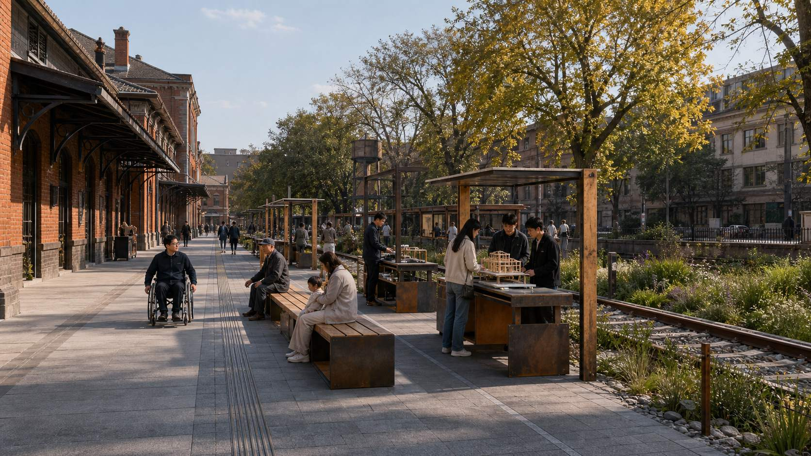

三处重点区不再是三套互不相关的概念方案：北段是**测试月台**，回答技术是否安全、可解释、可停止；中段是**转化月台**，回答科研成果能否穿过校园与楼宇边界成为公众可理解的服务；南段是**决策月台**，回答居民、消费者和一线人员是否认为服务值得长期进入城市。三个步行创新环仍作为城市组织结构，三类月台成为可感知、可施工和可运营的空间原型。

### 首个实施单元：学院路—清华园公共验证月台

全线不同时启动。首个实施单元建议以学院路—清华园一处连续公共界面为研究窗口，长度暂按约300—500米的工作范围进行任务拆解，最终边界与尺寸必须由现状测绘、权属、公园管理、校园开放、消防与文保条件共同确定，不作为法定范围或施工尺度。该单元至少包含一个站园校连续入口、一段始终开放的无障碍路径、一处可开放的既有室内首层、一组可逆服务设施和一个明确运营团队。

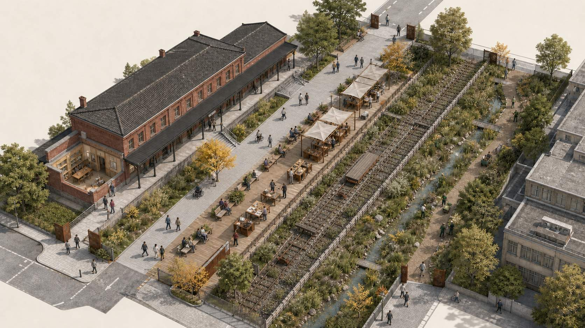

实施分为三级，而不是把概念图一次性建成：

| 工程等级 | 主要动作 | 前置条件 | 退出方式 |
| --- | --- | --- | --- |
| L0 无建设启动 | 现场审计、路线整理、人工服务、临时活动与基线记录 | 管理协商与活动安全 | 停止活动，保留原有通行 |
| L1 可逆月台 | 模块座椅、轻型雨棚、服务桌、雨水花箱、非数字导视 | 权属、消防、无障碍和维护责任确认 | 拆除模块并恢复铺装和绿地 |
| L2 适应性改造 | 打开既有首层、修缮遗产界面、长期服务与生态设施 | 文保、规划、市政、投资与长期运营通过六道门 | 转为普通公共服务空间，不依赖AI继续使用 |

### 进入1:500深化前的现场验证任务书

首段不能直接从概念图跳到施工图。建议先完成一个包含工作日与周末的连续观察周期，并把结果形成可公开复核的现场底账；当前尚未实施这些调查，以下内容是专业团队的任务书，不是实测结论。[assumption:A-FIELDWORK-001]

| 验证对象 | 最小记录 | 决定什么 | 未通过时 |
| --- | --- | --- | --- |
| 站—园—校连续通行 | 入口净宽、高差、坡度、路面、过街、开闭时间和无障碍断点 | 连续路径是否成立、是否需要人工接驳 | 保留现状通行，只修补安全与无障碍断点 |
| 人流与骑行冲突 | 早晚高峰、日间、夜间及周末的人工计数和冲突位置 | 停车整理、候场空间和活动时段 | 缩小活动范围，不投放占道设施 |
| 首层开放条件 | 权属、消防、疏散、噪声、能源、卫生间和日常管理 | 是否可设置开源诊所或有人服务点 | 改用临时室外服务或既有公共设施 |
| 遗产、公园与生态条件 | 文保对象、树木根区、排水、照明、施工与运维边界 | 设施落位、材料和可逆基础方式 | 取消固定构筑物，使用无基础或纯运营方案 |
| 使用者与运营能力 | 居民、残障/老年代表、一线运维、校园、公园和商户访谈 | 服务时段、人工接管和投诉闭环 | 不启动AI服务，只保留人工服务与共创 |

现场底账通过后，1:500深化只锁定五类可测对象：连续无障碍路径、站园校共享阈值、可开放首层、雨水/遮阴与候场界面、可逆服务设施。建筑高度、开发强度、道路红线、跨线工程和具体拆改留仍等待正式控规与专项论证。[data:geometry/roads.geojson#ROAD-003][data:geometry/public_space.geojson#PUBLIC-002][depth:traffic_rail_slow_parking]

### 成本—责任—退出矩阵

本阶段不编造单价或投资总额，而使用成本等级管理责任。**低成本**指运营、导视、临时家具和人工服务；**中成本**指无障碍修补、首层局部开放、遮阴和雨水花园；**中高成本**指建筑适应性修缮、能源与设施更新；**高成本/待论证**指跨线、市政主干和永久新建工程。等级只用于比较决策，不是造价估算。[assumption:A-CONTROLS-001][assumption:A-OPERATIONS-001]

| 成本等级 | 主要承担者 | 必备资金内容 | 退出与恢复责任 |
| --- | --- | --- | --- |
| 低 | 服务运营方、研究/试点团队 | 人员、活动安全、设备、保险、日志和投诉处理 | 撤走设备、删除工作区、保留人工与纸质服务 |
| 中 | 场地宿主 + 公共协调/公益资金 | 无障碍、安全、基本公共空间和局部修补 | 恢复通行与场地，普惠改善可独立保留 |
| 中高 | 产权/场地宿主 + 专业建设主体 | 本体修缮、能源、市政接入、持续运维和更新替换 | 提交全生命周期账本，不依赖单一活动收入 |
| 高/待论证 | 政府协调机制及法定专业主体 | 专项论证、审批、工程、征询和长期财政责任 | 未取得正式条件不得进入方案承诺或先行建设 |

任何层级一旦出现严重安全事件、数据泄露、无等价非数字服务、投诉无法闭环、责任运营方退出或原有居民/商户明显受损，均应停止扩张并进入修改或撤场，而不是用已投入成本倒逼永久化。[depth:phasing_implementation][standard:PROJECT-AGENT-OPEN-CALL-TASKBOOK]

跨铁路桥隧、新建永久建筑和大规模市政设施不属于首段100天实施内容，只在正式专项论证和永久化门槛全部通过后讨论。[assumption:A-CONTROLS-001]

## 公共艺术系统：让工程、记忆与判断被看见

艺术不是给科技园附加地标，而是公共验证月台的第三种语言：空间组织人如何抵达和停留，制度说明技术如何被约束，艺术则让铁路工程史、居民记忆和共同判断变得可感知。所有作品遵守五条底线：不遮挡铁路遗产，不占用连续无障碍路线，不依赖持续采集个人数据，可逆安装且具名维护，关闭互动后仍是有用的座椅、照明或公共桌。

1. **百年刻度月台**：一条低矮连续的耐候钢、触觉铜标与暖光刻度线沿遗产轨道展开，同时承担坐凳边界、夜间导向和工程时间轴。内容可由档案审核和社区协作逐步补充，但不把单一英雄叙事替代普通劳动者与居民记忆。
2. **城市回声月台**：声音节点嵌入既有雨棚、座椅和扶手，只有主动旋钮或触摸才播放经授权的短片段；不设置环境监听、常开麦克风和强制参与，设备关闭后仍保留普通休息与通行功能。
3. **公共算法剧场**：以长桌、纸卡、实体模型和人工主持代替巨型屏幕，让居民、一线劳动者和研究者共同讨论一个AI服务如何判断、谁承担风险，以及项目应继续、修改或退出。投票结果不自动成为行政决定，必须进入公开台账和独立复核。

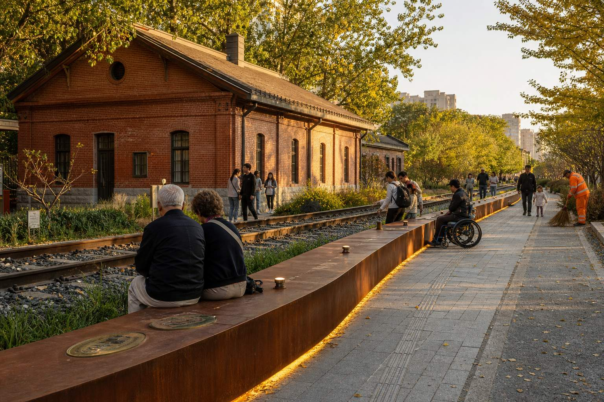

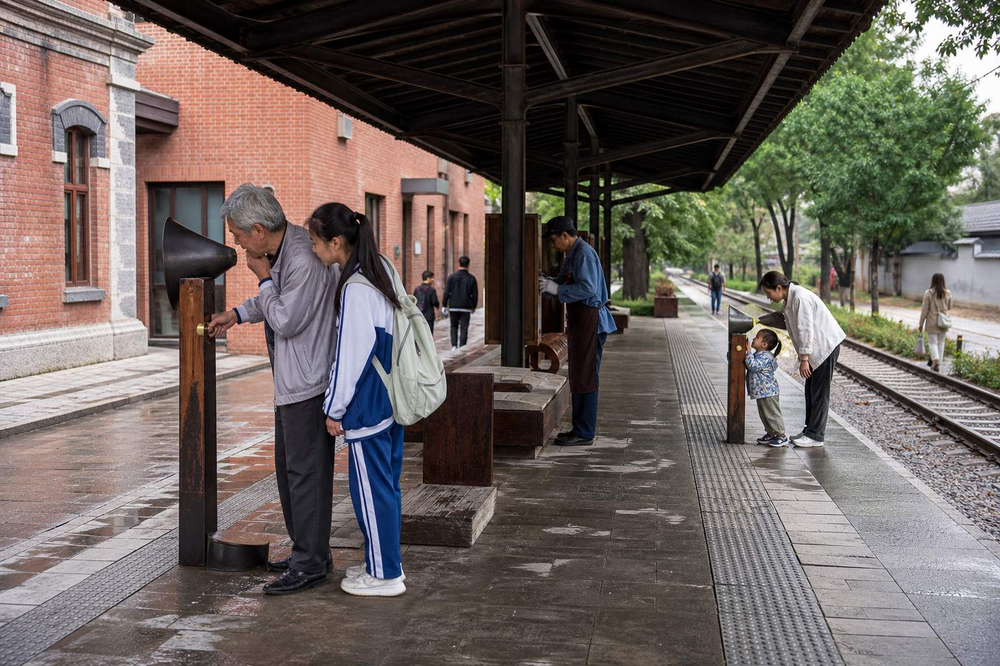

## 设计依据与资料清单

本 formal 方案以北京市规划和自然资源委员会海淀分局发布的《百年京张AI创新带城市设计国际方案征集资格预审公告》为第一依据，并以 `brief/site-package/` 中经维护者登记的临时粗略边界、重点区域、枚举、指标和来源清单为机器可读依据。AI agent 在生成方案前必须读取 `design_brief.json`、`allowed_design_space.json`、`sources.json`、`enums/`、`ranges/`、`schemas/`、`data/source_registry.json` 和 `data/processed/agent_fact_pack.md`，并用 `project_scope_summary.csv`、`agent_task_requirements.csv`、`source_use_matrix.csv`、`missing_data_checklist.csv` 建立任务、范围、资料用途和缺口清单。所有设计判断都要拆分为可追溯来源、可复算指标、可校验图层和可人工复核假设。公告要求方案达到控制性详细规划的城市设计深度和规划综合实施方案的城市设计深度，因此文本叙述不能替代 GeoJSON、指标表、A3 文册、A0 展板和 HTML 电子展示成果。

方案任务首先回到公开公告、智能体任务书和场地包，不把传播材料当作法定依据。[source:OFFICIAL-ANNOUNCEMENT][source:AGENT-TASKBOOK][source:SITE-PACKAGE]

边界、重点区和事实摘要分别由来源登记表、处理资料包及临时几何说明管理；它们共同构成可追溯的资料链，而不是新的权威来源。[source:SOURCE-REGISTRY][source:BOUNDARY-SOURCE][source:KEY-AREA-SOURCE]

专业深度以城市设计、控规层级城市设计和用地分类标准为约束，完整覆盖关系保留在 `standard_matrix.json` 与 `design_depth_matrix.json` 中。[standard:MOHURD-URBAN-DESIGN-MEASURES][standard:MOHURD-CONTROL-DETAILED-PLANNING][depth:existing_conditions_diagnosis]

资料登记表的使用边界如下：

- data/source_registry.json 登记公开、清权与临时资料的用途边界。
- 当前登记摘要：formal 可用资料 5 条，背景资料 0 条，provisional-only 资料 1 条。
- agent 不得把 background_only 或 provisional_only 资料升级为 official boundary、法定控规、正式评分依据或政府实施承诺。

`data/processed/agent_fact_pack.md` 是本方案的阅读导航层，不是新的权威来源。[source:PROCESSED-FACT-PACK] 它只帮助 agent 把三层范围、三处重点区、公告任务、agent.1-agent.6、资料可用性和缺资料事项组织成可读方案。

任务与资料用途回到公告、任务书和来源登记表核验。[source:OFFICIAL-ANNOUNCEMENT][source:AGENT-TASKBOOK][source:SOURCE-REGISTRY]

边界类事实则回到边界与重点区来源记录核验。[source:BOUNDARY-SOURCE][source:KEY-AREA-SOURCE]

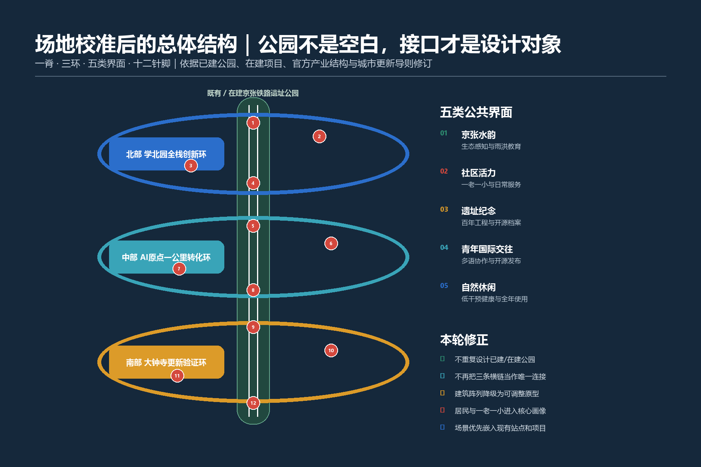

本脚手架在官方 `SITE_BOUNDARY` 或三处 `KEY_AREA` 尚未取得时，使用 `brief/site-package/geometry/provisional_boundaries.geojson` 生成临时 formal 包。提交包中的 `geometry/site_boundary.geojson` 与 `geometry/key_areas.geojson` 均必须标注为 `provisional_constraint`、`official_boundary=false`，只能用于方案生成、自检、可视化和设计讨论，不能作为 official redline、审批依据、精确面积依据或法定控制结论。该组织方数据缺口本身不阻断内容评分；替换 official polygons 后，site boundary、key areas、land use、roads、green space、public space、buildings、phasing 和 metrics 均需重算。

本次脚手架生成的可评分状态为：**临时边界，保留精度警示并待正式数据发布后复算；不阻断内容评分**。因此，正文中的空间结构、场景、项目和指标均按“可讨论、可复核、可替换官方边界后重算”的原则写入；当官方边界和重点区 polygon 更新后，agent 必须重新运行脚手架、自检和图纸/HTML生成，不能只替换单个文件。

### 边界变化敏感性与刷新机制

临时边界不是被忽略的缺口，而是被显式管理的设计变量。方案把结论分为三类：**边界变化仍成立**的制度与服务规则、**可随边界迁移**的轻量设施与试点路线、**必须等待官方条件**的法定和工程结论。这样既不因组织方尚缺 official geometry 停止内容深化，也不以临时图层制造精确感。

| 敏感性类别 | 当前可确定内容 | 官方边界更新后的动作 |
| --- | --- | --- |
| 稳定机制 | 场景准入、数据清权、人工复核、非数字替代、退出和公共收益规则 | 保持机制不变，重新挂接空间宿主 |
| 可迁移设施 | 服务亭、公共桌、无障碍座椅、导视、100天试点路线 | 保持数量与服务逻辑，依据权属、通行和安全条件重排位置 |
| 待确认空间 | 建筑规模、跨线工程、道路红线、市政设施、永久建设边界 | 更新 GeoJSON 后复算面积与比例，并经过控规、交通、市政、文保、消防和权属核验 |

正式 polygon 或控制条件更新将触发同一套刷新流程：替换来源登记和约束图层，重跑空间复算，刷新 `metrics.json`、图纸和 HTML，复核三处重点区任务覆盖，再重新生成清单哈希和四道自检。任何只改图面而不重算指标的更新均不进入正式版本。

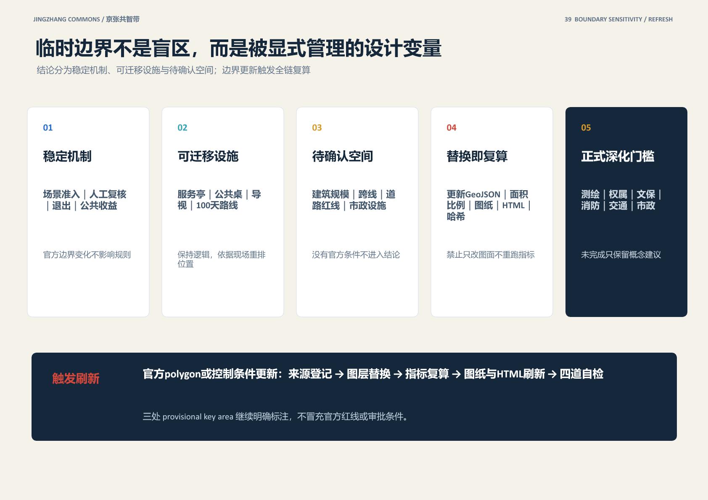

边界和重点区域的可读解释对应 [data:geometry/site_boundary.geojson#SITE-001]、[data:geometry/key_areas.geojson#PROV-KEY-001] 和 [metric:site_area_sqm]。重点区数量另由 [metric:key_area_count] 复核。这意味着读者可以从正文回到 GeoJSON 查看边界来源、从 metrics 查看面积复算结果、从 sources 查看资料来源，而不是只相信一段文字判断。

## 三层范围工作框架

### 设计总纲：一脊、三环、五类界面、十二针脚

“京张共智带 / Jingzhang Commons”把铁路遗产理解为城市公共创新基础设施，而不是科技园区装饰。第二轮场地校准确认：京张铁路遗址公园一期已经开放，二期和学院路会客厅等公共空间项目正在推进，因此本方案不再把九公里范围视为等待重新设计的空白绿轴，而把设计重心转移到公园与高校、园区、社区、站点和滨水空间之间的城市接口。[source:BJ-JINGZHANG-PLANNING-2021][source:BJ-JINGZHANG-PHASE1-2023][source:BJ-JINGZHANG-PHASE2-2024][assumption:A-PARK-STATUS-001]

Logo 方向由两条平行铁轨在节点处分叉、合并形成开源分支图形，中间留白始终保留人的步行路径；砖红代表铁路工程史，开放蓝代表知识共享，公共绿代表日常生活。该标识只使用原创几何和可清权字体，正式传播前仍需近似标识核查。[source:AGENT-TASKBOOK] [standard:PROJECT-AGENT-OPEN-CALL-TASKBOOK]

- **一脊**：把已经建成和正在贯通的京张铁路遗址公园作为公共基础设施，承载遗产、慢行、生态和日常交往，不另设一条平行的“科技景观轴”。[source:BJ-JINGZHANG-PHASE1-2023][source:BJ-JINGZHANG-PHASE2-2024][data:geometry/land_use.geojson#LU-001]
- **三环**：北部学北园全栈创新环连接国家平台、学院路高校与公园；中部AI原点一公里转化环连接原点大厦、清华AI学院、星光大道和公园；南部大钟寺更新验证环以站城、社区和存量项目为对象。[source:BJ-JINGZHANG-AI-STRUCTURE-2026][source:BJ-AI-ORIGIN-2026]
- **五类界面**：将官方二期提出的京张水韵、社区活力、京张遗址纪念、青年国际交往、自然休闲转译为五类公共服务和AI应用界面。[source:BJ-JINGZHANG-PHASE2-2024]
- **十二针脚**：AI 场景不对应十二栋新建筑，而是嵌入站前广场、楼宇首层、校园前场、社区活动场地和生态节点的可逆服务单元。[source:HD-URBAN-RENEWAL-GUIDE-2025][metric:scenario_count]
- **两翼与四种流**：中关村科技服务翼和小月河场景赋能翼继续承载知识产权、资本、人才与真实场景；知识流、场景流、人才流和公共价值流形成“研究—开源—测试—转化—公众反馈”的循环。[source:BJ-JINGZHANG-AI-STRUCTURE-2026]

该结构仍由七个完整覆盖且无重叠的概念用地单元表达，以维持结构化数据和面积复算能力；图层仅表示三类创新生活环及公共主脊的功能关系，不代表京张公园现状建设边界或法定用地调整。[metric:land_use_zone_count][assumption:A-PARK-STATUS-001] 临时边界以低对比虚线呈现，官方 polygon 到位后全部重新裁切和复算。[source:BOUNDARY-SOURCE] [depth:three_level_scope_framework]

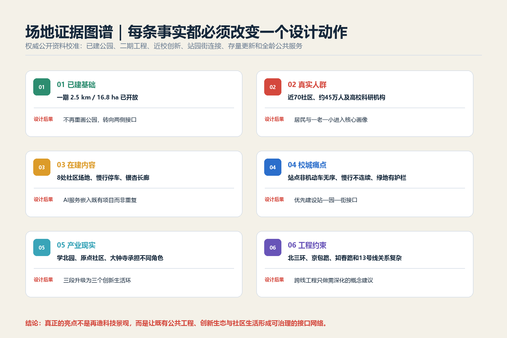

场地证据要求方案作出五项修正：不重复设计已建或在建公园；不把三条示范横链当作全线唯一连接；规则化建筑阵列降级为可调整空间原型；居民和“一老一小”进入核心使用者画像；所有 AI 场景优先嵌入现有站点、楼宇和已批准公共项目。[source:HD-COLLEGE-ROAD-LOUNGE-2026][source:HD-URBAN-RENEWAL-GUIDE-2025][source:HD-JINGZHANG-CONTROL-FEEDBACK-2025]

方案按照公告确定的三个层次组织工作：统筹研究范围关注 43.6 平方公里的AI产业生态、战略定位、创新链和未来城市形态；总体设计范围关注 11.4 平方公里京张遗址公园周边 1-2 公里城市地区和产业区，要求形成城市更新总体框架、产业空间布局、交通市政支撑和城市风貌控制；重点区域范围关注 368.4 公顷三处详细设计地区，要求明确功能业态、建筑规模、拆改留分类、公共空间连通和交通组织。三层范围在 `compliance_matrix.json` 中逐条映射，保证公告 1.3、1.4、1.5 与 agent.1-agent.6 的必选任务都有章节、图层、指标、图纸和 HTML 证据。

三层工作框架的深度项由 [depth:three_level_scope_framework] 和 [depth:overall_spatial_structure] 约束，空间证据以 [data:geometry/site_boundary.geojson#SITE-001] 与 [data:geometry/key_areas.geojson#PROV-KEY-001] 为准，任务依据以 [standard:PROJECT-OFFICIAL-ANNOUNCEMENT] 为准，范围索引以 [source:PROCESSED-FACT-PACK] 中 `project_scope_summary.csv` 的三层范围表为导航。

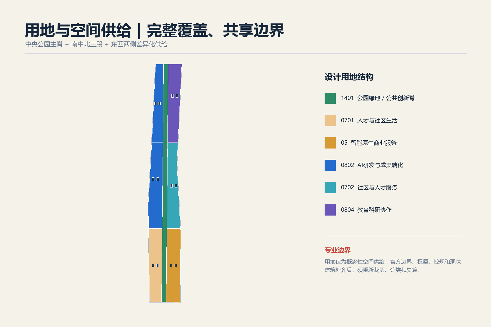

三层工作不是互相割裂的图纸集合。统筹研究决定产业链和城市形态判断，总体设计把判断落实到更新项目、空间结构和设施承载，重点区域详细设计验证具体地块、建筑、交通、公共空间和AI应用场景的可实施性。agent 生成方案时必须先锁定当前提交采用的 official 或 provisional 边界和约束，再生成用地、建筑、道路、绿地、公共空间、分期和AI服务节点，最后从这些图层复算指标并在正文解释哪些结论仍受 provisional boundary 限制。任何无法从结构化数据复算的面积、比例、规模或项目数量，不得写入正式结论。

本方案建议的总体概念为“京张共智接口网络”：以京张遗址公园既有和在建公共工程为一脊，以学北园、北京AI原点社区、大钟寺为三个创新生活环，以高校、企业、社区、轨道站点和小月河为日常网络，形成“一脊三环、五类界面、十二针脚”的空间组织。这里的“一脊”不是额外画出的新红线；“三环”对应不同尺度的步行创新生态；“五类界面”与公园已有组团和社区需求协同；“十二针脚”对应AI公共服务、产业服务和城市生活的低扰动运营节点。[source:BJ-JINGZHANG-AI-STRUCTURE-2026][source:BJ-JINGZHANG-PHASE2-2024]

### 三大定位、五大功能与三区两翼的方案翻译

任务书的三大定位不是三句并列口号，而是同一空间系统的三种公共价值：**百年京张文化带**提供工程自主与城市记忆的时间坐标；**都市AI生活体验带**要求AI在通勤、照护、学习、消费和休闲中接受普通人的检验；**AI融合创新带**把高校策源、开源协作、企业转化和真实场景连接成可复核的创新链。[source:AGENT-TASKBOOK][standard:PROJECT-AGENT-OPEN-CALL-TASKBOOK]

| 任务书五大功能 | 京张共智接口网络的空间/运营回答 | 主要落点 |
| --- | --- | --- |
| AI全栈自主创新体系 | 以受控评测、标准讨论、开源复现和人工否决组成“测试月台” | 众智园 + SC-02/03 |
| 世界级AI创新生态 | 以开源诊所、成果转化护照、国际协作和公共首层组成“转化月台” | AI原点社区 + 科技服务翼 |
| AI+场景赋能新范式 | 以十二张场景卡、100天可逆试点和退出评审建立真实场景入口 | 小月河场景赋能翼 + 三环 |
| 智能化AI活力城市 | 把无障碍、照护、消费保护、生态运维和夜间安全放在日常公共界面 | 京张公园主脊 + 大钟寺 |
| AI治理全球话语权 | 以公开规则、失败复盘、贡献可追溯和公众是否同意永久化形成治理证据 | 四个公共地标 + 年度评审 |

三区分别承担测试、转化和公众决策，两翼分别提供专业服务与真实场景；五者通过“公开任务—数据清权—沙盒验证—公众/专业复核—继续、修改或退出”的闭环协同。该映射是概念建议和专业深化索引，不构成机构设置、活动承诺或法定空间边界。[data:geometry/key_areas.geojson][data:geometry/public_space.geojson][depth:three_level_scope_framework]

| 层级 | 设计问题 | 方案回答 | 数据落点 |
| --- | --- | --- | --- |
| 统筹研究范围 | AI产业生态和未来城市形态如何组织 | 建立“高校策源-开源协作-企业转化-公共体验-国际传播”的创新链 | compliance_matrix.json、standard_matrix.json |
| 总体设计范围 | 产业空间、城市更新、交通市政和风貌如何落图 | 用地、建筑、道路、绿地、公共空间和分期图层共同表达 | [data:geometry/land_use.geojson#LU-001]、[data:geometry/roads.geojson#ROAD-001] |
| 重点区域范围 | 三处片区如何达到详细设计深度 | 分别提出定位、空间动作、AI场景和实施依赖 | [data:geometry/key_areas.geojson#PROV-KEY-001]、[data:geometry/key_areas.geojson#PROV-KEY-002]、[data:geometry/key_areas.geojson#PROV-KEY-003] |

## 统筹研究范围产业与未来城市研究

### 国际案例不是形态拼贴，而是机制工具箱

本方案研究八组国际案例：King's Cross 的铁路遗产与教育文化锚点，[source:CASE-KINGS-CROSS]；清溪川—世运的线性公共空间、原有产业和协商治理，[source:CASE-CHEONGGYECHEON-SEWOON]；Atlanta BeltLine 的铁路走廊、公共收益与防排斥机制，[source:CASE-ATLANTA-BELTLINE]；East Bank 将赛事遗产转为长期大学文化机构网络，[source:CASE-EAST-BANK]；Barcelona 22@ 的产业—城市混合更新，[source:CASE-BARCELONA-22]；One-North 的 work-live-collaborate AI社群，[source:CASE-ONE-NORTH]；Mile-Ex/Mila 的研究—转化—责任AI共址，[source:CASE-MILA-MILE-EX]；Kendall Square 的混合用途、创新空间和社区接口。[source:CASE-KENDALL]

京张不复制这些案例的开发强度或建筑形态，而组合五类机制：铁路遗产定义空间骨架、公共空间先于永久开发、锚点机构持续运营、价值增长绑定公共收益、真实场景通过沙盒和人工复核进入城市。Centennial Olympic Park 所代表的“地标+事件”模式只作为局部传播参考，因为单个成功公园并不自动形成连续、日常且包容的城区。

### 八要素创新生态

土地与空间提供可调整载体；高校和研究机构提供原始创新；开源社区形成可复现知识；算力与数据采用合规共享；企业和资本支持转化；真实场景提供验证；公共治理规定人工复核与退出；年度活动把阶段成果转成长期品牌资产。三核分别承担基础研究/治理、知识转化和市场/公众验证，科技服务翼把知识产权、法务、人才和资本串成“成果转化护照”，场景赋能翼建立沙盒准入、评估和退出机制。[depth:overall_spatial_structure]

统筹研究范围的核心任务是构建世界级 AI 创新生态体系。本方案以“京张共智带 / Jingzhang Commons”为主名称，以“月台”作为进入公共验证系统的空间语法，以铁路朱红、工程蓝、公共青和审议金构成不依赖企业商标的识别色。命名、导视、场景编号和贡献记录共用同一套语言，使产业生态、公共空间和文化资源能够被连续识别；字体、图像与历史材料在正式落地前均须完成版权和文保复核。[source:AGENT-TASKBOOK][standard:PROJECT-AGENT-OPEN-CALL-TASKBOOK]

统筹研究并不新增伪精确红线；它通过 [standard:MOHURD-URBAN-DESIGN-MEASURES] 要求的城市风貌、公共空间和建筑布局统筹，回接 [data:geometry/land_use.geojson#LU-001]、[data:geometry/public_space.geojson#PUBLIC-001] 与 [depth:overall_spatial_structure]，说明产业策略最终要落到可见、可复核的空间结构。

未来城市形态研究应回答人工智能如何改变工作、生活、社交、学习、交通和公共服务。方案应把AI交通系统、连续绿色空间、创新服务设施和国际化生活工作氛围落实为可定位的功能区、节点、廊道和场景，而不是泛泛描述技术愿景。agent 应把产业战略指标、AI创新指数、人才密度、空间供给类型和AI+垂直应用重点区域写入指标体系，并标明哪些是官方、哪些是设计建议、哪些仍待正式数据校准。若提出全球AI创新活动、开发者社区、开放场景或朝圣路线，应写为“概念建议/参考方案/可供专业团队深化研究”，不得写成已经确定的政府活动或实施安排。

## 总体设计范围城市更新与控规深度城市设计

### 公共空间先行的低扰动更新

总体设计不以一次性大拆大建为前提，而以三类可逆动作开始：开放既有或临时室内空间作为开源站和公共学习空间；以可移动设施标记四个公共客厅；以慢行导视和活动路线测试南北连续、东西缝合。只有在权属、现状建筑、控规、交通和文保资料补齐后，才进入永久建筑与工程深化。[assumption:A-CONTROLS-001]

土地价值增长必须同步兑现公共收益：免费公共学习时段、低成本早期团队空间、无障碍改善、社区服务、青年就业路径、开源成果和失败案例复盘均进入年度台账。该制度判断比未经依据的容积率数字更能决定创新街区能否长期保持开放。[standard:MOHURD-CONTROL-DETAILED-PLANNING]

总体设计范围要求达到控制性详细规划的城市设计深度。方案必须提出城市更新总体空间结构、低效空间识别、更新项目清单、实施政策建议、产业功能比例、空间组织模式、建筑总规模和综合承载能力评估。`geometry/land_use.geojson` 应完整覆盖设计边界且无重叠，`geometry/buildings.geojson` 应表达更新建筑基底或保留建筑基底，`geometry/roads.geojson` 应表达微循环、慢行和轨道接驳关系，`metrics.json` 应复算核心面积、比例和图层数量。

本节按照 [standard:MOHURD-CONTROL-DETAILED-PLANNING] 把控规深度内容拆成可审查对象：[data:geometry/land_use.geojson#LU-001] 表达用地结构，[data:geometry/buildings.geojson#BLDG-001] 表达建筑基底，[data:geometry/roads.geojson#ROAD-001] 表达交通组织，[metric:building_footprint_area_sqm] 用于复核建筑基底面积，[depth:land_use_layout] 与 [depth:development_intensity_controls] 约束成果深度。

总体设计还必须支撑交通、轨道、市政和配套设施。方案应围绕轨道站点一体化、道路微循环、非机动车停放、停车供给、创新服务平台、人才生活服务、新型基础设施、分布式能源和端侧算力提出空间布局和实施路径。涉及建筑高度、开发强度、道路红线、退线和设施标准的内容，若尚无官方控制条件，应写为“待正式控规条件确认”，不得以 agent 推测值冒充审定指标。

## 重点区域详细设计

### 众智园 / 学北园：从封闭园区到学院路开放创新环

公开资料显示，学北园已形成5栋、总建筑面积约23.83万平方米的建筑载体，报道时仍处于开园准备阶段；多功能展厅和AI出海服务平台属公开报道中的功能安排，不在本方案中视为已投入运营；学院路会客厅也将连接京张公园、小月河与三山五园绿道，回应清华东路和六道口站点慢行、非机动车停放及公共空间供需问题。因此北部不再以新增研发建筑为主要动作，而以“国家平台—高校—站点—公园”的开放首层网络为核心。[source:BJ-JINGZHANG-AI-STRUCTURE-2026][source:HD-COLLEGE-ROAD-LOUNGE-2026][assumption:A-PARK-STATUS-001]

第一批针脚包括学知园站无障碍接驳、学院路会客厅花园运维助手、六道口非机动车秩序引导，以及林业、矿业、农业三类学院知识的公共科普接口。规则化建筑仅保留为共享首层、评测院落和弹性研发空间的类型示意，不构成现状认定或拆改留结论。[data:geometry/key_areas.geojson#PROV-KEY-001][data:geometry/buildings.geojson#BLDG-001][assumption:A-CONTROLS-001]

### AI原点社区：近校型知识转化核

原点大厦周边已经形成以一公里、十分钟步行为尺度的近校创新生态，并拥有企业服务、算力和场景对接、路演、产品展示及清华大学人工智能学院等现实载体。设计重点由“再造孵化园”调整为让知识穿过校园边界、楼宇大堂和公共空间：形成原点开源项目诊所、校社联合评审室、清华园站百年工程数字档案及五道口青年国际协作节点。[source:BJ-AI-ORIGIN-2026][source:BJ-JINGZHANG-PHASE1-2023]

成果转化不只依赖办公楼，而由开源发布、知识产权、法务、可用性测试、青年可支付空间与日常公共服务构成连续路径。中段横向连接优先利用既有道路、公园入口和楼宇首层，不预设未经确认的桥隧工程。[data:geometry/key_areas.geojson#PROV-KEY-002][data:geometry/roads.geojson#ROAD-003][source:HD-URBAN-RENEWAL-GUIDE-2025]

### 大钟寺：城市智能原生与公众验证核

大钟寺首先是北三环、京包路、知春路、13号线、既有社区和存量商业共同作用的复杂更新区。官方控规公众意见表明多个立交与道路节点仍需深化；政府答复也明确13号线阻隔影响公园与周边大型社区的联系。因此南部第一优先级是安全、无障碍的站园街联系和社区公共空间，跨线工程只作为需专项论证的概念建议。[source:HD-JINGZHANG-CONTROL-FEEDBACK-2025][assumption:A-CONTROLS-001]

大钟寺更新验证环嵌入四道口铁路遗产教育、大钟寺夜间安全与无障碍导航、社区照护及商业消费者保护沙盒。商业智能体必须提供明确授权、可撤销委托、价格透明和人工客服；公共议事空间用于规则听证和失败复盘，而不是企业发布厅。[data:geometry/key_areas.geojson#PROV-KEY-003][data:geometry/public_space.geojson#PUBLIC-001]

重点区域详细设计是必选项。众智园AI自主创新加速区应围绕国家人工智能平台、全栈自主创新、标准制定、安全治理、产业展示、对外交通、清河文化、低碳绿色创新交往环境和绿色空间AI场景提出详细方案。北京AI原点社区应围绕近校创新、成果孵化转化、人才特区、开源体系、品牌活动、建筑拆改留、成果展示发布、居住生活配套、校区园区慢行联系和轨道站点一体化提出详细方案。大钟寺AI产业聚集区应围绕领军企业、智能体、智能终端、内容消费、数据要素、数字资产、商业服务、规划绿地复合利用、大钟寺站一体化和路口四象限步行连通提出详细方案。

三处重点区域详细设计必须引用 [data:geometry/key_areas.geojson#PROV-KEY-001]、[data:geometry/key_areas.geojson#PROV-KEY-002]、[data:geometry/key_areas.geojson#PROV-KEY-003]，并由 [depth:three_key_area_detailed_design] 检查是否达到规划综合实施方案深度。若只描述“打造示范区”而没有功能、建筑、交通、公共空间和实施项目证据，应被视为未完成。

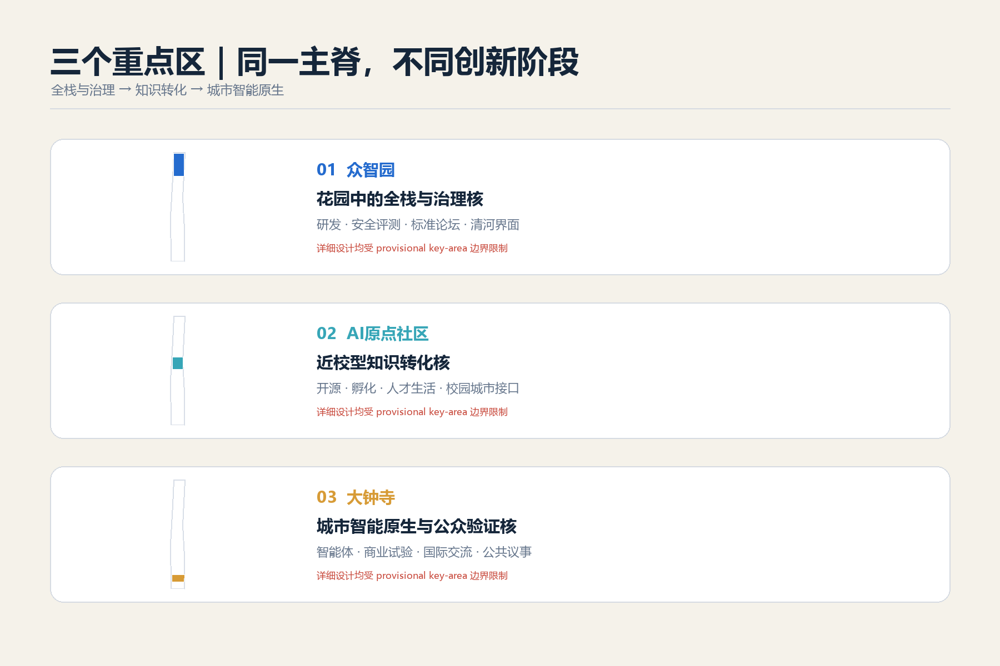

三处重点区域必须在 `geometry/key_areas.geojson` 中出现。若仓库已提供 official polygons，应作为 `official_constraint` 使用；若 official polygons 缺失，可暂用 `provisional_constraint`，但正文、HTML、sources、assumptions 和 self_check 必须说明它不能作为正式评分或审批依据。`compliance_matrix.json` 应分别覆盖公告 1.5.3.1、1.5.3.2、1.5.3.3。设计表达应包含功能业态、建筑规模、建筑形态、拆改留分类、公共空间系统、交通组织、慢行连通和实施项目。HTML 页面应能切换查看三处重点区域，A3 文册和 A0 展板应至少包含重点片区总图、局部详图和指标说明。

| 重点片区 | 设计定位 | 空间动作 | AI产业与运营场景 | 证据引用 |
| --- | --- | --- | --- | --- |
| 众智园/学北园AI自主创新加速区 | 学院路开放创新环 | 协同现有产业载体、学院路会客厅、站点和高校前场，优先解决开放首层、慢行与非机动车秩序 | 自主模型评测、学院知识科普、花园运维、国际服务 | [data:geometry/key_areas.geojson#PROV-KEY-001]、[source:HD-COLLEGE-ROAD-LOUNGE-2026] |
| 北京AI原点社区 | 一公里近校成果转化环 | 连接原点大厦、清华AI学院、星光大道、清华园站和京张公园，提供低成本开源与联合评审空间 | 开源项目诊所、成果发布、失败档案、青年国际协作 | [data:geometry/key_areas.geojson#PROV-KEY-002]、[source:BJ-AI-ORIGIN-2026] |
| 大钟寺AI产业聚集区 | 存量更新与公众验证环 | 围绕站点、13号线阻隔、北三环和既有社区，以安全无障碍、社区服务和分期更新优先 | 夜间安全、换乘导航、社区照护、消费者保护沙盒 | [data:geometry/key_areas.geojson#PROV-KEY-003]、[source:HD-JINGZHANG-CONTROL-FEEDBACK-2025] |

### 三处重点区的“现状—问题—干预—结果”证据链

三处重点区采用同一套四联证据框架，避免效果图直接跳到实施结论。现状值必须由现场审计建立；本方案只预设测量对象、最小干预和判断方法，不预设虚构的改善百分比。

| 重点区 | 现状证据（待现场补测） | 核心矛盾 | 最小可逆干预 | 可验证结果 |
| --- | --- | --- | --- | --- |
| 学院路—学北园 | 站园校入口、高差坡度、开闭时段、骑行停放与雨水界面 | 连续通行和开放首层被边界、时段、管理与非机动车冲突切断 | 修补无障碍断点、整理停放、打开一处既有首层、部署有人服务 | 断点数、绕行距离、冲突次数、人工响应时间、开放时段 |
| AI原点—清华园 | 原点大厦、校园、清华园站与公园之间的一公里知识界面 | 成果转化载体存在，但公共进入、低成本使用和责任接口不足 | 开源诊所、联合评审、工程档案、多语协作和公开时段 | 项目复现率、低成本时段、人工接管、撤回更正、后续合作 |
| 大钟寺 | 轨道、北三环、社区、存量商业及夜间流线叠加 | 换乘绕行、夜间安全、消费者责任和原有生活保护断裂 | 可逆公共客厅、线下导视、有人服务、消保沙盒与社区照护 | 绕行与断点、夜间分组反馈、投诉闭环、原商户与免费服务保留 |

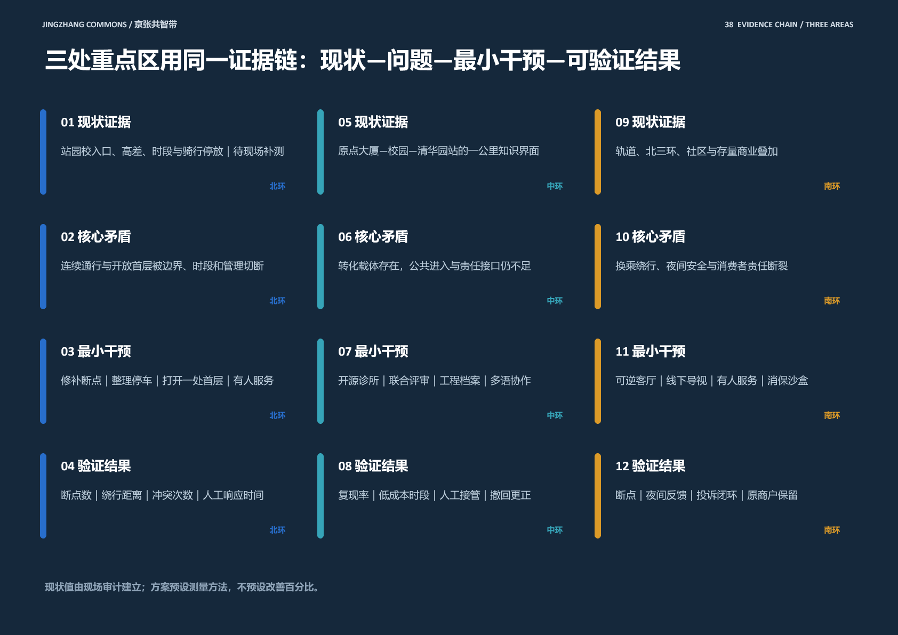

### 三处重点区“五件套”与100天起步

每处重点区均以五件套达到可审查深度：一张空间行动平面、一组公共界面剖面、一组针脚产品、一张日常运行时序、一套进入永久建设前的门槛与评估。所有尺寸均为界面类型建议，需在现状测绘、道路红线、轨道保护、权属、消防和文保条件齐备后复核。

| 重点区 | 空间行动 | 公共界面 | 针脚产品 | 运行时序 | 门槛与评估 |
| --- | --- | --- | --- | --- | --- |
| 学院路开放创新环 | 打开一处既有首层、补齐站园校连续路径、整理非机动车停放、把雨水花园与学院知识展示结合 | 校园首层—共享前场—慢行—雨水花园—公园；不以新增研发楼为前提 | SC-01至SC-04：无障碍接驳、评测场、生态沙盒、花园运维 | 早高峰接驳；日间研发与公众服务；傍晚花园课堂和社区使用 | 先完成站点测绘、骑行冲突基线和运营协商；评估无障碍连续性、冲突闭环、公众停留和人工接管 |
| AI原点一公里知识环 | 串联原点大厦、校园接口、清华园站和公园，提供低成本开源诊所、联合评审与工程档案 | 开放首层—共享阈值—知识街道—遗产公园；控制活动噪声并保留日常通行 | SC-05至SC-09：开源诊所、联合评审、工程档案、多语协作、工程教育 | 工作日项目诊所；固定联合评审；周末遗产教育；年度国际协作活动 | 先确认校园开放规则、史料版权与活动许可；评估项目复用、社区覆盖、撤回更正和国际可达性 |
| 大钟寺公共验证环 | 先用可逆座椅、遮阴、雨水花箱、游戏与服务亭形成公共客厅；跨线工程仅保留专项论证接口 | 存量首层—共享街道—公共客厅—安全隔离带—轨道/道路；不以拆迁或大型桥梁为起点 | SC-10至SC-12：消费者保护、夜间无障碍导航、社区照护导航 | 日间社区服务与儿童活动；晚高峰导航；夜间安全使用；定期公众听证 | 先核铁路道路安全、权属、消防和噪声；评估安全问题闭环、线下替代、撤销授权和一老一小反馈 |

三个100天试点只允许可逆设施、运营活动、服务规则和现状审计；只有公共收益基线、人工复核能力和退出机制通过评估后，才讨论中长期空间固化。[data:geometry/phasing.geojson#PHASE-001][assumption:A-OPERATIONS-001]

## AI 创新生态、人才画像与 AI+ 场景

### 八类使用者

基础研究者需要安静研究与合规算力；早期团队需要低成本空间与首批用户；企业研发团队需要可信测试和国际合作；高校学生需要学习、实习和作品展示；周边居民需要明确公共收益和非数字替代服务；老年人及残障使用者需要无障碍、易理解界面和人工服务；国际开发者需要多语种导览与可验证贡献记录；城市运营人员需要低风险采购、事件响应与公众反馈。任何画像都不依赖个人轨迹或敏感数据。[standard:PROJECT-AGENT-OPEN-CALL-TASKBOOK]

### 十二张场景卡

| ID | 场景与空间 | 数据、人工复核和退出边界 |
| --- | --- | --- |
| SC-01 | 学知园站—学北园无障碍接驳 | 用户主动调用、最小位置数据、人工与非数字替代并存 |
| SC-02 | 学北园城市智能体评测场 | 红队测试、日志、人工否决和一键停机；不宣称已批准运营 |
| SC-03 | 小月河生态与具身智能低风险沙盒 | 受控场地、限速、地理围栏、生态阈值和现场监护 |
| SC-04 | 学院路会客厅花园运维助手 | 仅处理环境汇总数据，园艺师确认，不替代高校和社区运维 |
| SC-05 | 原点大厦开源项目诊所 | 仅使用公开、合成或已清权数据；成果和建议由团队确认 |
| SC-06 | 清华AI学院—社区联合评审室 | 公众意见进入评审记录但不自动形成行政或规划决定 |
| SC-07 | 清华园站百年工程数字档案 | 史料标明来源、人工编辑审核、生成内容明确标识 |
| SC-08 | 五道口青年国际协作与多语服务 | 不建立个人轨迹画像；贡献记录可更正或撤回 |
| SC-09 | 四道口铁路设备与工程教育节点 | 实物安全隔离、内容由铁路和文保专业人员复核 |
| SC-10 | 大钟寺智能商业与消费者保护沙盒 | 明确AI标识、可撤销授权、价格透明、人工客服、禁止情绪操控 |
| SC-11 | 大钟寺跨线无障碍和夜间安全导航 | 不替代工程设施；高风险情况转人工和应急服务 |
| SC-12 | 大钟寺社区照护与公共服务导航 | 只解释流程、不自动诊断或作行政决定，全程可转人工 |

其中 SC-02、SC-03、SC-10 为三类产业测试验证场景；全部十二项都说明空间、运营、数据、人工复核和退出条件。[metric:scenario_count] [data:geometry/public_space.geojson#PUBLIC-002] [depth:three_key_area_detailed_design]

十二针脚不是十二台设备，而是四类公共产品的三种场地适配：社区桌负责协作与议事，服务亭提供有人值守的帮助，生态柱支持低风险环境维护，无障碍座椅把休息、求助和非数字导视合并。每个针脚必须同时具备服务对象、空间宿主、最小数据边界、人工接管和退出替代五项字段；完整机器可读矩阵见 `simulation.json`。如果缺少现场运营主体，针脚只能作为试点提案，不得标注为已运营服务。

方案应建立面向AI人才和企业的空间需求画像，覆盖研发办公、开源协作、成果发布、企业服务、人才居住、社交学习、消费生活、运动休闲和国际交往。AI+场景应围绕公告提出的交通、服务、消费、医疗、教育、法律、生活服务等方向，形成产业发展场景和AI赋能城市功能场景。每个场景应说明服务对象、空间位置、数据来源、隐私边界、人工复核机制和运营主体。

AI 场景落到空间和治理边界：公共空间场景引用 [data:geometry/public_space.geojson#PUBLIC-001]，慢行与交通场景引用 [data:geometry/roads.geojson#ROAD-001]，开放空间场景引用 [data:geometry/green_space.geojson#GREEN-001] 和 [metric:public_space_ratio]、[metric:green_ratio]。十二张场景卡、八类使用者和三类产业验证均已进入正文与 `simulation.json`；评审时可逐项核对空间宿主、最小数据边界、人工接管、非数字替代和退出条件。

| 用户画像 | 典型需求 | 空间响应 | 自检边界 |
| --- | --- | --- | --- |
| 开源开发者 | 发布、协作、测试、社区声誉 | 原点社区开源发布厅、公共代码墙、夜间协作空间 | 不采集个人行为轨迹；活动数据只做聚合统计 |
| 初创团队 | 低成本办公、算力入口、产品试验场 | 众智园共享测试场、端侧算力服务点、标准治理咨询 | 算力和数据服务需另行授权 |
| 头部企业访客 | 展示、商务、国际接待、人才招聘 | 大钟寺国际路演客厅、轨道站点接驳、重点企业周边公共空间 | 企业标识和案例须清权 |
| 周边居民 | 通勤、休闲、社区服务、低扰动更新 | 京张遗址公园慢行环、社区服务嵌入、夜间照明和活动分级 | 不将居民画像用于商业推荐 |
| 高校师生 | 成果转化、跨校协作、日常慢行 | 校区-园区慢行缝合、成果转化驿站、AI教育体验点 | 校园数据和科研成果需授权 |

| 场景卡 | 空间载体 | 设计说明 |
| --- | --- | --- |
| 01 开源发布厅 | 北京AI原点社区 | 面向高校、开源社区和初创团队，提供成果发布、代码贡献展示和小型路演空间 |
| 02 安全治理沙盒 | 众智园 | 将标准制定、安全评测、模型红队测试转译为可参观、可预约、可监管的展示和协作节点 |
| 03 端侧算力驿站 | 总体设计范围节点 | 与公共服务、企业服务和低碳能源策略结合，作为待深化的新型基础设施原型 |
| 04 AI慢行导航 | 京张遗址公园活力带 | 用可解释导视和低侵入传感帮助识别慢行断点、拥挤节点和无障碍需求 |
| 05 大钟寺国际路演客厅 | 大钟寺AI产业聚集区 | 服务智能体、智能终端和内容消费企业的展示、洽谈、媒体发布和国际交流 |
| 06 清河低碳创新廊 | 众智园临清河界面 | 把绿色空间、雨洪、步行骑行和AI展示结合，作为园区公共客厅 |
| 07 近校成果转化街 | 北京AI原点社区 | 面向高校成果转化，组织孵化、展示、法务、知识产权和投融资服务 |
| 08 数据要素会客厅 | 大钟寺片区 | 以合规、授权、可审计为前提，展示数据要素和数字资产流通的城市服务界面 |
| 09 AI生活服务样板街 | 社区与商业交汇处 | 将医疗、教育、法律、生活服务等AI+场景落到可运营的小尺度街区空间 |
| 10 全球AI活动周路线 | 一带公共空间系统 | 形成从遗址文化、开源社区、产业展示到国际路演的可步行、可传播体验路线 |

agent 生成的AI治理建议必须遵守数据最小化、公开来源、可解释和人工复核原则。城市智能体可以辅助识别慢行断点、公共空间热力、设施维护、企业服务需求和活动安全风险，但不能替代规划审批、不能输出未经授权的个人画像、不能声称获得官方实施承诺。所有AI场景节点应进入结构化图层或合规矩阵，便于评审者看到它们与产业、空间和公共利益之间的关系。

## 被技术叙事忽略的人，也是设计的第一使用者

公共创新带不能只围绕研发人员、企业访客和活动参与者设计。残障使用者、不会或不愿使用智能手机的老人、带儿童的照护者、夜间独行者、保洁安保与配送人员、语言不熟悉的访客，都可能在“默认数字化”的服务中被再次排除。无障碍不是一个坡道或一个按钮，而是从站口、道路、公园、建筑入口到服务柜台和信息渠道的连续权利；相关方案形成和修改应吸收残障与老年使用者代表意见。[source:PRC-ACCESSIBILITY-LAW-2023][source:BJ-ACCESSIBILITY-REG-2021]

| 使用者 | 最容易遇到的障碍 | 不可取消的设计保证 |
| --- | --- | --- |
| 轮椅、视障、听障与行动不便者 | 断点、坡度、噪声导向、信息不可读、求助无人响应 | 连续无障碍审计；触觉/高对比/语音多通道；人工接驳；故障时仍可通行 |
| 老人与非智能手机使用者 | 强制扫码、复杂授权、服务入口只在线上 | 电话、纸质导视、现场柜台与现金/常规支付等价可用 |
| 儿童与照护者 | 设备诱导、身份采集、视线遮挡、婴儿车断点 | 不采集儿童身份；可视照护；婴儿车连续通行；互动可关闭 |
| 夜间独行者与轮班劳动者 | 照明眩光、路径中断、求助位置不清、算法误判风险 | 连续低位照明、可见值守点、清晰逃生与人工求助，不以人脸识别替代安全设计 |
| 保洁、安保、园艺与配送人员 | 设备增加维护负担、后勤路径被展陈侵占 | 运维人员参与设计；保留后勤通道；设备故障不转嫁给一线人员 |
| 国际访客与小微商户 | 语言、规则、费用和责任边界不透明 | 简明多语说明；价格透明；人工翻译；投诉、撤回和更正渠道 |

所有试点在启动前完成“数字服务失败时仍能否使用”的逆向演练。生成式AI服务不得收集非必要个人信息，应公开适用人群、场合和用途，并避免年龄、性别、职业、健康等歧视；因此每个针脚的非数字替代、人工接管和投诉渠道都是空间设计的一部分，而不是后台条款。[source:CAC-GENAI-MEASURES-2023]

## 谁开门、谁付钱、谁担责

建议建立“京张公共价值联盟”作为概念治理框架，而不是另设未经批准的行政机构。区级协调机制负责规则与跨部门协同；公园、校园、社区和物业权利人作为场地宿主；高校、企业、社会组织和专业运营方承担服务运行；责任规划师、无障碍代表、居民代表及法律/数据/文保专家组成独立复核席。北京市城市更新制度强调利害关系人的知情、参与与监督权，并要求明确实施主体、资金筹措和运营管理模式，这正是试点转为永久建设前必须补齐的条件。[source:BJ-URBAN-RENEWAL-REG-2022][source:BJ-URBAN-UPDATE-GUIDANCE-2021]

### 协同责任矩阵与参数化成本账本

“部门协同”被拆成可确认事项，而不是抽象口号。规划与更新协调方核对边界、控规和更新单元；场地、园林、交通与轨道相关主体核对开放时段、站园联系、安全和维护；街道、社区、高校、企业及运营团队承担人员、服务、保险、日志、投诉与撤场；独立复核席检查无障碍、数据、法律、文保与反排斥结果。上述均为建议责任结构，不表示相关机构已接受任务或形成行政决定。

| 决策节点 | 建议牵头/参与类型 | 必须确认的证据 | 未通过时的处理 |
| --- | --- | --- | --- |
| 空间确认 | 规划更新协调、产权与场地宿主、专业设计团队 | 边界、权属、消防、文保、交通、市政与连续通行 | 缩小或迁移试点，不进入永久工程 |
| 技术准入 | 运营团队、数据/法律专家、场景提供方 | 数据清权、人工接管、线下替代、保险与事故响应 | 不接入数据或改用非智能服务 |
| 公共收益 | 街道社区、居民与无障碍代表、独立复核席 | 免费时段、无障碍改善、投诉闭环、原商户与低成本空间 | 暂停扩张，修改服务或撤场 |
| 永久化 | 法定实施、审批与专业主体 | 造价、运维、更新替换、撤场恢复和正式审批 | 保持可逆状态，不承诺建设 |

成本采用参数化账本，不编造单价或总投资：**建设成本 = 设施数量 × 经核价单价 + 场地修补 + 安全与许可**；**年度运营 = 值守工时 × 人工成本 + 能耗 + 保洁维护 + 保险与独立评估**；**退出准备金 = 拆除运输 + 数据删除/归档 + 场地恢复 + 普惠服务过渡**。每个模块同时记录数量、使用频率、维护责任、更新周期和退出触发，待正式询价后即可形成投资估算。

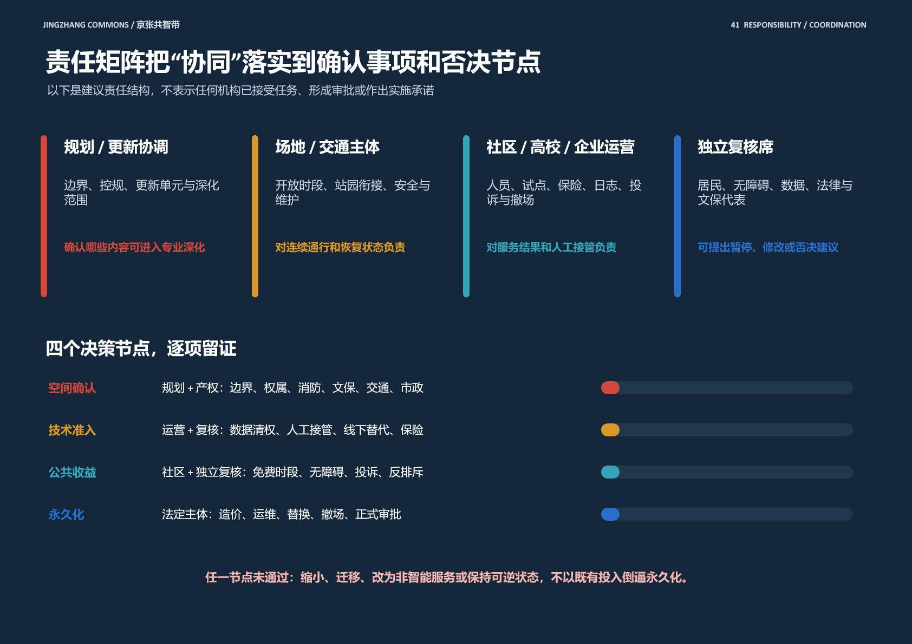

资金不采用“一笔建设费解决全部问题”的模式，而分为四本账：公共财政或公益资金只承担连续无障碍、基本公共空间、安全和普惠服务底座；场地宿主承担本体修缮、能源与日常维护；参与试点的企业或研究团队承担设备、测试、安全评估、保险和退出费用；企业服务、培训和受控活动收入可反哺公共运营，但不得以出售个人数据、强制广告或把基本通行服务收费作为收入来源。任何永久项目都必须提交至少覆盖建设、持续运维、更新替换和撤场恢复的全生命周期账本，当前方案不虚构投资金额。

## 创新增长不能挤走原有生活

公共空间改善和创新资源集聚可能推高租金、改变商业结构并排斥原有居民、小微商户、低成本创业团队与一线服务人员。Atlanta BeltLine 的经验说明，铁路走廊更新如果追求公平，必须把可负担住房、长期居民保留和可负担商业空间作为与公园和交通同等明确的项目，而不能期待市场增值自动转化为公共收益。[source:CASE-ATLANTA-BELTLINE][source:CASE-ATLANTA-AFFORDABILITY-2026]

京张方案因此提出一份研究性“公共收益与反排斥契约”：更新前先记录住宅、商户、租金、低成本创新空间、免费公共时段和就业结构基线；原有小微商户与社区服务在同等条件下获得续租、协商和临时安置优先；公共或国有场地中的基本通行、休息、照护和学习服务不得因活动商业化而收费；运营采购优先考虑沿线小微主体和本地服务人员；因空间增值获得的经营收益应有明确部分回到无障碍、公共服务和长期维护。正式比例必须由产权、财政、市场和社区协商确定，当前不编造配额或租金承诺。

反排斥不是附加公益，而是永久化的第六道社会门槛：如果原有居民与商户持续流失、低成本空间显著减少或免费公共时段被商业活动挤占，即使技术和空间指标通过，项目也不得直接复制扩张。

## 100天试点必须产生可以否决项目的证据

100天不是一次活动，而是一项城市准实验：试点前设置不少于一个完整工作周与周末的基线观察；试点中采用现场计数、匿名问卷、人工日志和投诉台账，不建立连续个人轨迹；条件允许时选取相似但不投放设备的界面作为对照；结果按残障使用者、老人、照护者、夜间使用者和一线运维人员分别复核，避免总体满意度掩盖少数人的损失。

### 100天可交付任务包

| 阶段 | 周期 | 关键工作 | 可审计交付物 |
| --- | --- | --- | --- |
| 现场审计 | D1—15 | 测绘连续路径、断点、时段、冲突、权属与维护条件 | 现状底图、问题台账、基线观察、资料缺口与禁入区 |
| 共创与清权 | D16—30 | 居民、一线人员、无障碍代表和场地主体复核；完成数据与版权清权 | 服务蓝图、数据清单、人工接管与非数字替代方案 |
| 小规模运行 | D31—75 | 投放可逆设施和有人服务，记录故障、投诉、运维与使用分组 | 每日日志、事故记录、运维工时、匿名反馈与对照观察 |
| 独立复核 | D76—90 | 按残障、老人、照护、夜间与一线人员分组复核 | 公共收益、风险、反排斥和技术表现复核报告 |
| 决策归档 | D91—100 | 形成继续、修改、暂停或撤场结论，归档失败经验 | 公开摘要、责任签认、更新任务书、撤场或深化清单 |

每个试点任务单必须同时填写空间宿主、建议牵头类型、参与者、前置许可、成本等级、数据边界、保险与事故响应、维护频率、停止触发和恢复状态。缺少真实运营主体时只能完成“待认领试点包”，不得把它标注为已运营项目。

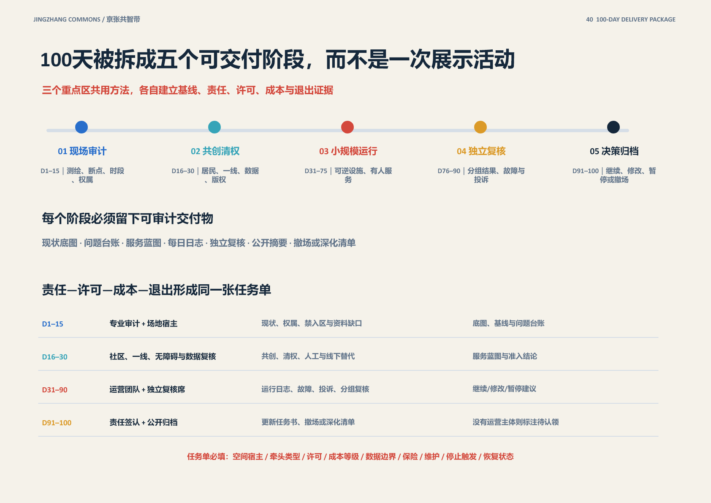

进入永久建设必须依次通过六道门：空间与文保条件、无障碍连续性、数据与算法权利、可证明的公共收益、稳定的责任与资金、不排斥原有生活。发生严重安全事件、数据泄露、无法提供等价非数字服务、公众投诉长期不闭环、原有生活被持续挤出或运维主体退出时，项目直接暂停并恢复到无智能设备仍可使用的空间状态。只有基线—试点—复盘证据完整且独立复核通过，才进入更长周期；完整字段见 `simulation.json`。[source:CAC-GENAI-MEASURES-2023][source:BJ-URBAN-RENEWAL-REG-2022][source:CASE-ATLANTA-AFFORDABILITY-2026]

## 用地、建筑规模与拆改留方案

### 用地与建筑原型

七个用地单元由同一临时边界经中央公共脊和南中北分段切分，完整覆盖提交范围、共享边界且无重叠。中央1401公园绿地保持连续；南段组合人才生活与智能原生商业；中段组合研发转化与社区服务；北段组合研发与教育科研。[data:geometry/land_use.geojson#LU-001]

建筑图层只表达十二个空间供给原型：共享研发、教育科研、孵化、社区服务、混合生活和商业界面。它们被裁切在设计用地与绿地之外，用于验证建筑—公共空间关系；不对应现状宗地和具体建筑，不给出拆除、层数、高度或投资结论。[metric:building_footprint_area_sqm] [metric:building_density] [assumption:A-CONTROLS-001]

用地方案应依据国土空间调查、规划、用途管制分类等公开标准表达，形成完整、闭合、无缝的用地分区。建筑方案应区分保留、改造、更新、新建或待确认对象，明确建筑基底、功能、规模、风貌、屋顶、体量和高度控制的建议层级。若缺少现状建筑、权属、控规和工程条件，方案只能提出方法和待校准清单，不能编造拆改留结论。

用地分类依据 [standard:MNR-LAND-USE-CLASSIFICATION-GUIDE]，建筑高度、体量、界面和风貌控制由 [depth:height_massing_character] 管理，拆改留方法由 [depth:retain_renovate_demolish] 管理。用地和建筑的主要证据是 [data:geometry/land_use.geojson#LU-001]、[data:geometry/buildings.geojson#BLDG-001] 和 [metric:building_footprint_area_sqm]。

建筑规模和强度指标必须与 `metrics.json` 和图层一致。若总建筑规模、容积率、建筑高度、建筑密度、绿地率、退线和建筑控制线缺少官方条件，应在指标体系中列为 unknown 或 pending_control，不得用固定数值制造精确感。A3 文册应给出更新项目清单和指标复核表，A0 展板应把关键空间结构和重点片区表达清楚，HTML 页面应提供指标和图层联动查看。

## 交通、轨道、市政与公共服务设施

### 一纵三横的低风险交通骨架

一条南北慢行主脊串联大钟寺、原点社区和众智园；三条横向缝合分别回应大钟寺站四象限、校区—园区联系和众智园—清河界面。[data:geometry/roads.geojson#ROAD-001] 这些是概念中心线而非道路红线，当前可用于步行路线、导视、活动和无障碍审计，桥隧、断面和信号组织必须等待交通专项。[metric:road_network_length_m] [metric:road_area_ratio]

新型基础设施采用“共享服务而非地块指标”：端侧算力驿站、隐私保护数据空间、场景日志和人工复核台与公共服务设施共址；能源、市政、消防、排水和运维容量全部列为深化前置条件。[metric:total_floor_area_sqm] [metric:floor_area_ratio]

交通方案应回应公告对轨道站点一体化、道路微循环、慢行断点、对外交通、停车、非机动车停放和绿色交通系统的要求。重点应覆盖北五环、京张遗址公园跨环路节点、五道口、清华东路西口、大钟寺站及重点企业周边交通联系。道路和慢行图层应保持在提交边界内，并与公共空间、绿地、产业节点和重点片区相互校核；若提交边界为 provisional，交通结论也只能作为临时设计讨论。

交通和市政专业深度分别由 [depth:traffic_rail_slow_parking] 与 [depth:municipal_new_infrastructure] 约束；图层证据引用 [data:geometry/roads.geojson#ROAD-001]、[data:geometry/public_space.geojson#PUBLIC-001] 和 [data:geometry/constraints.geojson#CONSTRAINTS][assumption:A-CONTROLS-001]。其中 `CONSTRAINTS` 仅表示全域专业资料待补核验范围，不表示已确认的法定限制线。当道路红线、管线、消防和市政条件缺失时，应通过 assumptions 说明待补，而不是把策略写成审定条件。

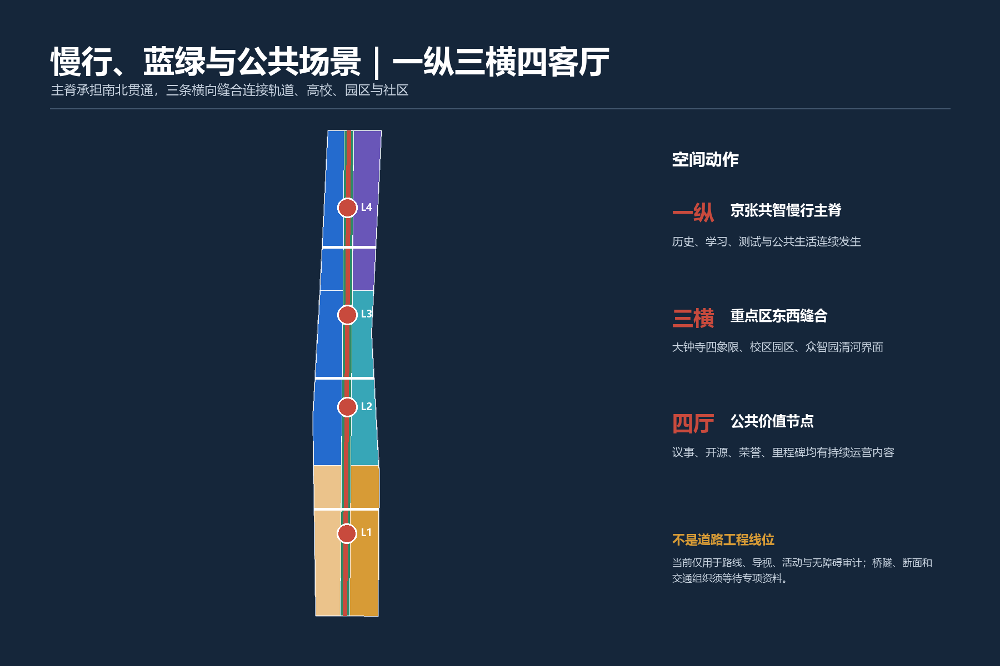

市政和公共服务设施应覆盖AI产业服务设施、创新服务平台、人才生活服务设施、新型基础设施、分布式能源、端侧算力和传统市政设施融合。方案应说明设施标准、空间布局、服务半径、运营模式和分期实施逻辑。缺少管线、能源、排水、防洪、消防等工程资料时，应列为正式深化前置条件。

## 蓝绿空间、公共空间与城市风貌

### 四个可持续更新的朝圣地标

1. **城市智能体议事厅**：公开演示、规则听证、公众反馈和失败复盘；[data:geometry/public_space.geojson#PUBLIC-001]
2. **原点开源站**：研究成果第一次面向公众解释、接受质询并寻找转化伙伴；[data:geometry/public_space.geojson#PUBLIC-002]
3. **智能体贡献荣誉墙**：实体单元连接可追溯版本记录，允许贡献者更正或撤回身份展示；[data:geometry/public_space.geojson#PUBLIC-003]
4. **开源里程碑长廊**：通过公开提名、来源核验、版权确认和定期复审展示AI与开源史。[data:geometry/public_space.geojson#PUBLIC-004]

四个地标不是独立雕塑，而是课程、讨论、展示和治理发生的公共设施。[metric:landmark_count] 蓝绿系统由铁路公园主脊和两条东西缝合绿廊构成，重点支撑日常慢行、创新交往和可逆测试。[metric:green_ratio] [metric:public_space_ratio]

蓝绿空间方案应以京张遗址公园活力带为骨架，统筹清河、小月河、周边高校、企业、社区出行需求，提出南北贯通、东西连通的步道、骑行道和绿色空间体系。方案应识别慢行断点、上跨环路节点、公园南端和北端景观节点，提出停车、体育、创新交往、科技测试、应用展示和公共服务复合利用策略。

蓝绿公共空间由 [depth:blue_green_public_space] 校核，核心证据为 [data:geometry/green_space.geojson#GREEN-001]、[data:geometry/public_space.geojson#PUBLIC-001] 和 [metric:green_ratio]。公共空间比例另由 [metric:public_space_ratio] 复核。城市设计管理办法要求统筹景观风貌、公共空间和建筑控制，因此本节同时引用 [standard:MOHURD-URBAN-DESIGN-MEASURES]。

城市风貌方案应融合京张铁路历史文化、中关村创新文化和AI创新文化，利用清华园火车站、北影等文化资源，提出城市基调、建筑风貌、屋顶形态、体量、界面和公共艺术引导。agent 还应提出导视标识、文化符号、国际传播叙事、AI朝圣地标、贡献墙或荣誉展示体系，但所有品牌、字体、图像、肖像和企业标识都必须有清权来源。风貌控制应分清官方管控、设计建议和待确认条件，严禁在没有文保或控规依据时给出伪精确控制线。

## 更新项目清单、实施政策与分期计划

### 三阶段实施与年度运营

- **一期：规则、公共空间与可逆原型**。建立品牌、贡献台账、场景准入、公众共创和临时展示；不以永久建设为前提。[data:geometry/phasing.geojson#PHASE-001]
- **二期：重点区网络化更新**。在权属、交通、文保和市政条件补齐后，深化慢行连接、公共服务节点和受控测试空间。[data:geometry/phasing.geojson#PHASE-002]
- **三期：国际创新公地网络**。将成熟机制扩展为长期活动、跨城场景互认和研究—产业—公众合作网络。[data:geometry/phasing.geojson#PHASE-003]

年度节奏为：春季公开城市问题与数据/伦理审查，夏季全球开发者驻留和原型开发，秋季 Jingzhang Commons Week 集中测试与公众体验，冬季独立评估、失败复盘和下一年度任务发布。公众议题依次经过公开任务、数据清权、沙盒测试、人工与公众评价、小规模可逆试点、复盘以及继续/修改/退出。[metric:phase_count] [assumption:A-OPERATIONS-001]

| 频率 | 运营产品 | 责任边界与转化出口 |
| --- | --- | --- |
| 每周 | 原点开源诊所、有人值守公共服务时段 | 场地宿主与服务运营方共同排班；问题进入公开任务池，不承诺招商或采购 |
| 每月 | 三环场景开放日、居民/无障碍代表复核席 | 只开放通过数据清权和安全门槛的项目；投诉、更正和停机进入台账 |
| 每季度 | 测试月台联合评测、转化月台项目门诊、决策月台公众听证 | 形成继续、修改或退出结论；不以活动热度替代公共收益和安全证据 |
| 每年 | Jingzhang Commons Week 与国际驻留成果复盘 | 以开源复现、场景互认、人才/项目后续合作为转化出口；活动品牌和国际传播均为概念建议 |

长期运营的关键不是把一次活动变成节庆消费，而是让开发者从“到访”进入可复现项目，让企业从“展示”进入受控测试，让居民从“体验”进入规则共定，让国际合作从“传播”进入跨城场景互认。任何招引、采购、资金和年度排期都需由未来运营主体另行审定，当前方案只给出机制、空间接口和评估门槛。[source:AGENT-TASKBOOK][standard:PROJECT-AGENT-OPEN-CALL-TASKBOOK][assumption:A-OPERATIONS-001]

公共收益台账至少记录免费开放时段、低成本创新空间、无障碍改进、青年学习与就业机会、居民服务、开源成果、失败复盘和维护成本。荣誉与持续维护、复现能力和公共贡献挂钩，不以企业规模或模型声量排序。

实施方案应形成可审查的更新项目清单，说明项目位置、类型、功能、责任主体、依赖条件、实施阶段、风险和评估指标。政策建议应覆盖城市更新统筹实施、空间供给、运营机制、产业服务、公共参与、数据治理和产权协同。`geometry/phasing.geojson` 应表达分期范围，`compliance_matrix.json` 应把每个任务与分期和图纸挂接。

项目清单和分期深度由 [depth:renewal_project_list] 与 [depth:phasing_implementation] 管理，分期空间证据为 [data:geometry/phasing.geojson#PHASE-001]。如果没有权属、资金、实施主体和审批路径，方案必须把它写成实施风险，而不是承诺落地。

| 项目编号 | 项目名称 | 类型 | 主要依赖 | 证据引用 |
| --- | --- | --- | --- | --- |
| JZ-01 | 京张遗址公园慢行断点缝合 | 公共空间/交通 | 道路红线、桥下空间、交通组织复核 | [data:geometry/roads.geojson#ROAD-001] |
| JZ-02 | 众智园清河创新界面 | 蓝绿空间/产业展示 | 河道蓝线、生态和防洪条件 | [data:geometry/green_space.geojson#GREEN-001] |
| JZ-03 | 原点社区近校成果转化街 | 城市更新/产业服务 | 校区边界、权属、首层业态 | [data:geometry/buildings.geojson#BLDG-001] |
| JZ-04 | 大钟寺站四象限步行连通 | 轨道一体化/慢行 | 轨道站点、道路交叉口、市政管线 | [data:geometry/public_space.geojson#PUBLIC-001] |
| JZ-05 | AI公共服务与端侧算力节点 | 新基建/公共服务 | 能源、算力、安全和运营主体 | [data:geometry/constraints.geojson#CONSTRAINTS][assumption:A-CONTROLS-001] |
| JZ-06 | 全球AI活动周公共路线 | 运营/品牌 | 公共空间许可、活动安全、版权清权 | [data:geometry/phasing.geojson#PHASE-001] |

分期应与 100 天征集设计周期形成区分：征集周期是提交成果的时间要求，实施分期是城市更新和项目建设的推进路径。方案应提出近期试点、中期更新和长期治理框架，并标明哪些内容可先以轻量设施、运营活动和服务平台启动，哪些必须等待正式控规、市政、交通和权属条件确认。对于年度活动体系、开发者社区运营、场景开放日、公共体验路线和国际传播机制，正文应说明运营对象、频率、责任边界、转化路径和风险，不得只写宣传口号。

## 指标体系、面积复算与合规矩阵

### 指标解释

本地包共有七个完整用地单元、十二个场景、四个公共地标和三个分期。[metric:land_use_zone_count][metric:scenario_count][metric:landmark_count]

场地面积、绿地比例和公共空间比例均由提交几何投影到 EPSG:4548 复算；由于边界 provisional，数值置信度为低或中，不能作为官方规划指标。[metric:site_area_sqm][metric:green_ratio][metric:public_space_ratio]

建筑基底、建筑密度和道路网络长度同样属于概念方案复算值，正式边界与现状测绘更新后必须同步刷新。[metric:building_footprint_area_sqm][metric:building_density][metric:road_network_length_m]

三处重点区数量来自任务书与临时重点区图层。[metric:key_area_count] 容积率、总建筑面积和道路面积比例保持 unknown，直到官方控规、现状建筑和道路红线补齐。[metric:floor_area_ratio] [metric:total_floor_area_sqm] [metric:road_area_ratio]

指标体系至少应包含总体设计范围面积、重点区域面积、绿地与公共空间比例、建筑基底、更新项目数量、AI场景节点、慢行连通指标、产业空间指标、人才服务指标和自检状态。所有 known 指标必须能从 GeoJSON 或可信来源复算；unknown 指标必须给出原因和正式提交前置条件。`scripts/spatial_review.py` 和 `scripts/visual_review.py` 的结果是 formal 自检的重要证据。

指标复算深度由 [depth:metrics_recalculation] 管理。场地与重点区的可读数值回溯到边界图层，而不是图面量取。[metric:site_area_sqm][data:geometry/site_boundary.geojson#SITE-001][data:geometry/key_areas.geojson#PROV-KEY-001]

建筑基底、绿地和公共空间指标分别回溯到对应几何；完整公式、精度状态和复算关系保留在 `metrics.json`。[metric:building_footprint_area_sqm][data:geometry/buildings.geojson#BLDG-001][data:geometry/green_space.geojson#GREEN-001]

公共空间比例的解释与图层入口为 [metric:public_space_ratio][data:geometry/public_space.geojson#PUBLIC-001]。

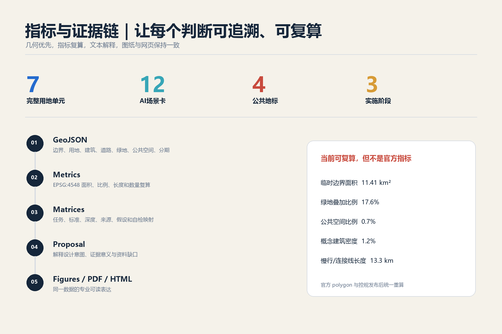

合规矩阵是任务响应性的主控文件。每条公告任务和 agent_taskbook 任务必须对应到报告章节、图层、指标、图纸、HTML 页面、来源、假设和自检项。未能覆盖公告 1.3、1.4、1.5 或 agent.1-agent.6 的任一必选任务，方案不得进入 formal professional scoring。

正式深化时，agent 还应把每个指标分为三类：第一类是可由提交几何直接复算的空间指标，例如边界面积、绿地比例、公共空间比例、建筑基底面积和分期面积；第二类是需要官方控规或任务书附件支撑的管控指标，例如容积率、建筑高度、建筑密度、退线、道路红线和设施标准；第三类是需要运营或产业数据持续校准的绩效指标，例如 AI 创新指数、人才密度、产业服务满意度、慢行可达性、活动参与度和场景使用频次。三类指标应分别进入 `metrics.json`、`assumptions.json` 和 `compliance_matrix.json`，避免把运营愿景误写成审定规划条件。

## International Executive Summary / 国际传播摘要

**Jingzhang Commons turns a century-old railway corridor into a civic verification platform for AI.** Its purpose is not to stage another technology showcase, but to let residents, researchers, enterprises and public-service operators test how AI enters everyday urban life—with human oversight, non-digital alternatives and a credible right to stop or withdraw.

- **Why Jingzhang / 京张为何独特**：engineering heritage, dense universities and AI institutions, and large-scale everyday residential life overlap along one walkable corridor.
- **Three civic platforms / 三个公共验证月台**：Xueyuan Road tests services; AI Origin translates research into accountable public use; Dazhongsi deliberates on consumer, community and urban-renewal impacts.
- **Twelve civic services / 十二项公共服务**：each service identifies its users, spatial host, minimum data boundary, human takeover and exit condition.
- **100-day pilots / 百日试点**：baseline, reversible trial, comparison where possible, independent review, and a decision to continue, modify, pause or withdraw.
- **Public value / 公共价值**：continuous accessibility, free basic services, anti-displacement safeguards, transparent complaints and long-term operating responsibility.

核心英文术语固定为：`Jingzhang Commons`（京张共智带）、`Civic Verification Platform`（公共验证月台）、`Test Platform`（测试月台）、`Translation Platform`（转化月台）、`Deliberation Platform`（决策月台）、`Twelve Civic Services`（十二针脚公共服务）、`Right to Withdraw`（退出权）。英文传播物料不得把概念建议写成政府承诺或既定实施安排。

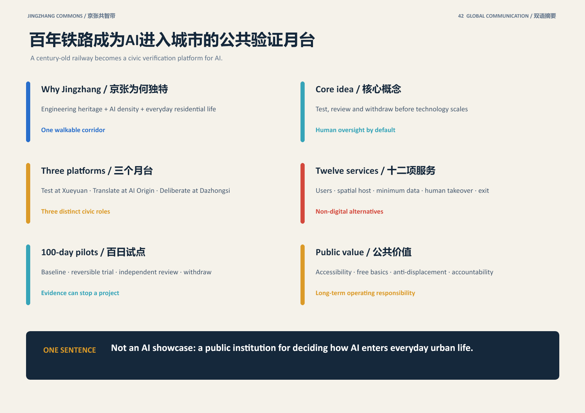

## 风险、版权与合规说明

方案文件可使用中文或英文；英文为主语言时，必须在同一 `proposal.md` 中附完整中文正式译文，并设置双语元数据。所有图片、图纸、图标、数据和代码资产必须在 `sources.json` 或 `report/copyright_statement.md` 中说明来源、许可和授权状态。HTML 页面不得加载远程脚本、远程地图瓦片、远程字体、iframe、表单或外部 API，不得跟踪评审者行为。

风险和缺资料清单由 [depth:risk_missing_data] 管理，并与 [data:geometry/constraints.geojson#CONSTRAINTS][assumption:A-CONTROLS-001]、[source:SITE-PACKAGE]、[source:PROCESSED-FACT-PACK] 和 [standard:MOHURD-CONTROL-DETAILED-PLANNING] 相互校核。`CONSTRAINTS` 是缺资料核验索引，不是现状禁建区或法定红线。`missing_data_checklist.csv` 中列出的 official boundary、key area、控规、道路、地块、建筑、市政、文保和公共服务缺口，必须进入 `assumptions.json`、自检和正文风险章节。任何缺少官方控规、道路红线、权属、市政、消防或文保条件的结论，都必须降级为待确认事项。

本方案不声称官方批准、审定控规、最终土地权属、最终建设规模或保证实施。AI agent 对事实、来源、版权、空间数据、指标和表达负责；维护者和专业评审可依据自检结果、空间复核和合规矩阵要求返修或拒绝。

## 规整设计图与空间原型

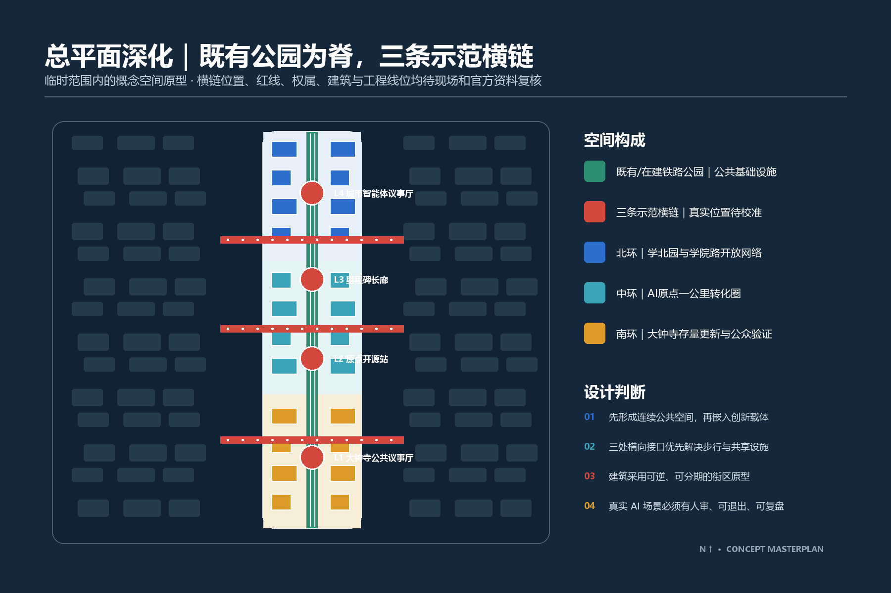

总平面深化图把总体策略收敛为可讨论的空间秩序：铁路公共主脊承担慢行、遗产与生态功能，三条横向缝合优先连接高校、园区和社区，四个公共价值节点承担议事、开源、荣誉和里程碑等长期运营内容。图中建筑轮廓为街区原型，不构成现状认定、拆改结论或工程线位。[data:geometry/site_boundary.geojson][data:geometry/roads.geojson][data:geometry/public_space.geojson][assumption:A-BOUNDARY-001][depth:overall_spatial_structure]

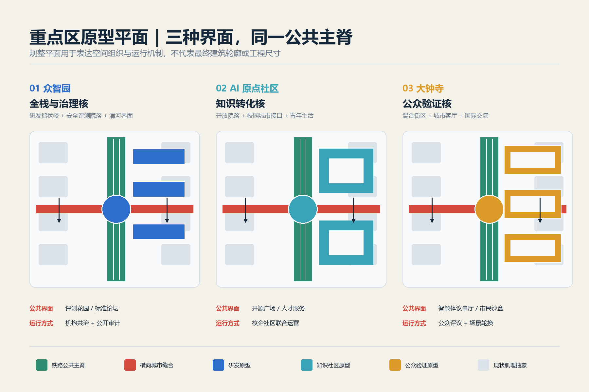

三个重点区采用同一公共主脊、不同城市界面：众智园以研发指状楼和评测花园形成全栈治理核；AI 原点社区以开放院落和校城接口形成知识转化核；大钟寺以混合街区和城市客厅形成公众验证核。原型强调首层开放、横向可达、共享前场和持续运营，不提前锁定建筑尺寸。[data:geometry/key_areas.geojson][depth:three_key_area_detailed_design]

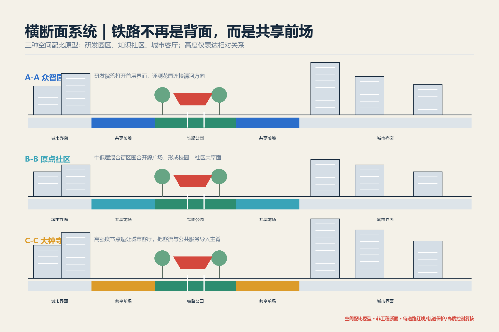

三组横断面以相对空间配比表达“铁路不再是背面，而是共享前场”：两侧建筑通过退让、开放首层和共享设施面向铁路公园，中央保留遗产叙事、慢行与生态连续性。高度仅用于比较空间关系，须在道路红线、轨道保护、日照和高度控制资料齐备后复核。[assumption:A-CONTROLS-001][standard:MOHURD-URBAN-DESIGN-MEASURES][depth:height_massing_character]

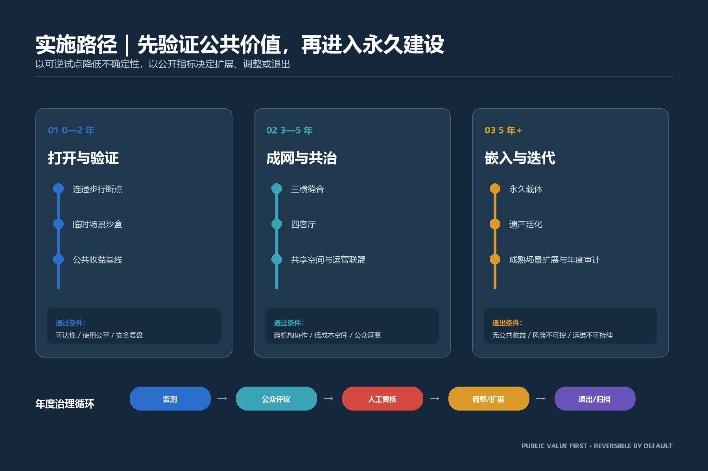

实施遵循“先验证公共价值，再进入永久建设”：0—2 年打开断点并建立收益基线；3—5 年形成三横四客厅与共治联盟；5 年后才进入永久载体与成熟场景扩展。每年经过监测、公众评议、人工复核、调整或退出的治理循环。[metric:phase_count][data:geometry/phasing.geojson][depth:phasing_implementation]

## 参考资料

### 艺术化场景表达说明

十四张艺术化场景图用于把空间策略转译为可感知的日常生活：总鸟瞰说明铁路遗产公园如何成为城市公共主脊；清华园开放日与普通冬日验证遗产公地的日常性；学院路场景说明校园开放首层如何接入一公里知识转化环；大钟寺公共客厅与百日试点说明居民如何参与低成本、可逆的公共服务验证；京张水韵夜景与冬季韧性图说明技术如何退居为安全、克制、全年可用的背景设施；十二产品族图建立统一而可治理的设施语言；公共验证月台旗舰场景和实施单元轴测图明确五条空间带与首段实施方式；百年刻度、城市回声与公共算法剧场进一步建立工程时间、社区记忆和共同判断的艺术系统。所有场景图均为设计意向，不替代现状调查、法定规划、工程设计或实施审批。生成方式与使用边界见 `report/copyright_statement.md`。

- brief/public-brief.md
- brief/README.md

以上两项属于仓库 `sources/public-sources.json` 登记的公开索引资料。下列文件均随公开仓库提供，属于任务解析、约束登记或派生核查材料，不作为独立事实来源；其中的事实、范围和指标必须继续回溯至 `data/source_registry.json` 登记的原始公开来源、清权任务书或明确标注的临时假设。

| 仓库内部材料 | 公开状态与用途边界 |
| --- | --- |
| `brief/site-package/design_brief.json`、`allowed_design_space.json`、`enums/`、`ranges/planning_limits.json` | 公开仓库内的机器可读任务与约束文件；用于一致性检查，不替代正式公告、控规或审批文件 |
| `data/processed/agent_fact_pack.md`、`project_scope_summary.csv`、`agent_task_requirements.csv` | 由登记来源整理的公开派生阅读材料；只作导航和任务覆盖核对，事实仍回溯原始来源 |
| `data/processed/source_use_matrix.csv`、`missing_data_checklist.csv` | 公开的来源用途与缺口审计材料；用于约束可用范围并显式保留未知项 |
| 机器可读引用标签 | `[source:*]` 回溯来源登记，`[standard:*]` 回溯公开标准，`[data:*]` 回溯提交图层，`[metric:*]` 回溯可复算指标，`[depth:*]` 回溯专业深度检查；标签本身不是新增事实来源 |
