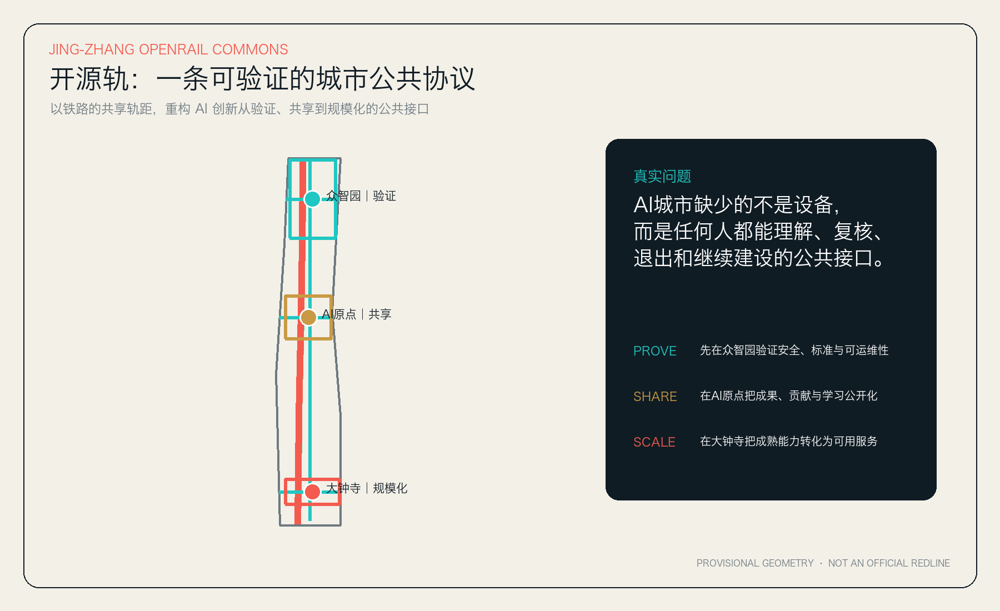
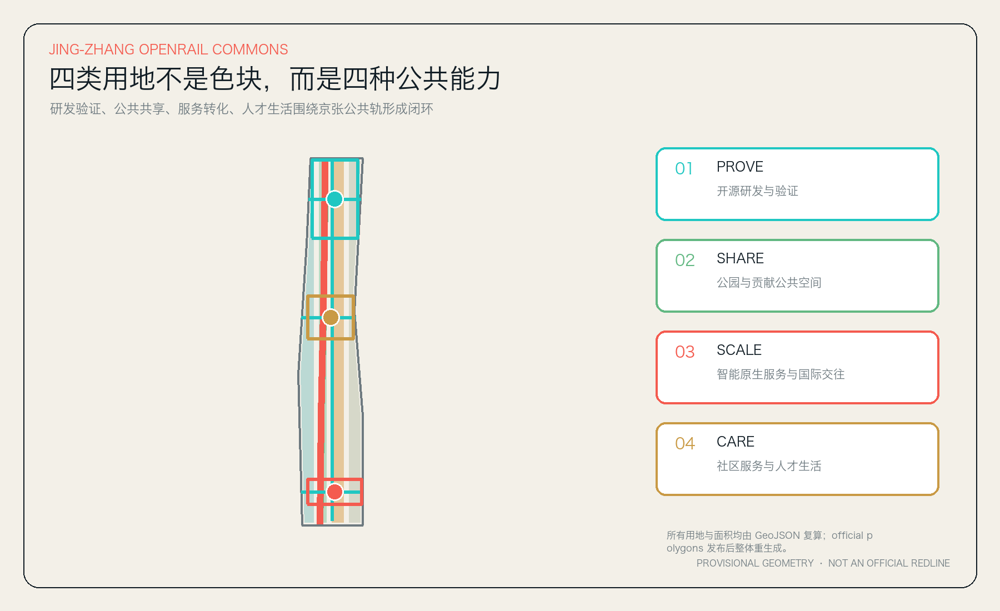
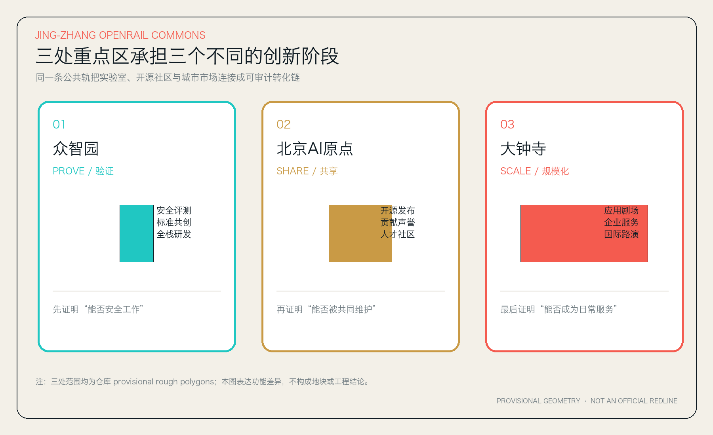
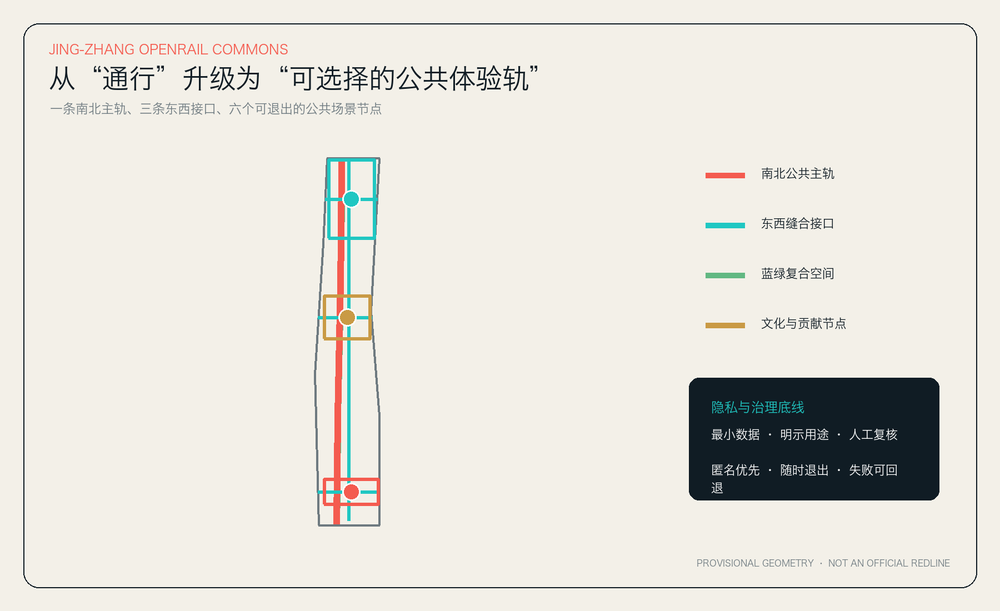
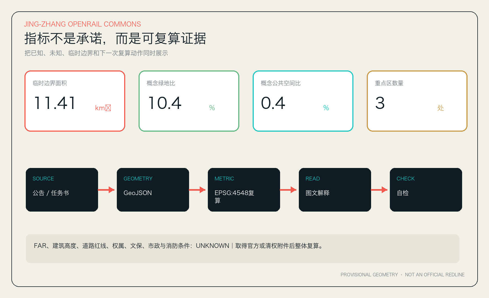

# 京张开源轨：可验证的AI城市公共协议

## 设计依据与资料清单

本方案首先解决一个比“把什么 AI 装置放进城市”更基础的问题：当技术、主体和需求持续变化时，京张创新带如何形成一套公众能理解、专业人员能复核、使用者能退出、失败时能回退、后来者能继续建设的公共接口？成功标准不是传感器或大屏数量，而是五项可观察结果：**可理解、可复核、可退出、可回退、可续建**。这也是“京张开源轨”的设计底线。

方案依据官方公告确定的三层范围、三处重点区与设计任务，以面向智能体任务书补充三大定位、五大功能、三区两翼和六项 agent 任务。[source:OFFICIAL-ANNOUNCEMENT] [source:AGENT-TASKBOOK] [standard:PROJECT-OFFICIAL-ANNOUNCEMENT] [standard:PROJECT-AGENT-OPEN-CALL-TASKBOOK] 仓库的资料登记和事实包只承担导航作用，不新增权威结论。[source:SITE-PACKAGE] [source:SOURCE-REGISTRY] [source:PROCESSED-FACT-PACK]

当前没有 official SITE_BOUNDARY、三处 official KEY_AREA、控规条件、道路红线、权属、现状建筑、文保、市政、消防、防洪与交通底数。提交包因此沿用仓库临时粗略边界，明确标记为 `provisional_constraint`；它只用于开源共创、可视化和 intake 自检，不是 official redline，不是审批或精确面积依据。[source:BOUNDARY-SOURCE] [source:KEY-AREA-SOURCE] [data:geometry/site_boundary.geojson#SITE-001] [data:geometry/key_areas.geojson#PROV-KEY-001] [depth:existing_conditions_diagnosis]

图 1 的边界以低对比度虚线表达，设计主线是高对比度的南北公共轨、东西缝合接口与三处重点区。正文、GeoJSON、metrics、矩阵、图面与自检使用同一套证据链；当 official polygons 到位时，必须整体重生成，而不是局部替换一个边界文件。

## 三层范围工作框架

“轨”在这里不是新画一条铁路红线，而是一种共享协议。铁路之所以能形成长期网络，不只因为车辆先进，更因为不同车辆遵守共同轨距、信号和维护规则。AI 城市同样需要共同接口：每个场景必须说明用途、最小数据、人工责任、退出条件、失败回退与维护主体。

三层范围由此形成不同问题尺度：[depth:three_level_scope_framework] [depth:overall_spatial_structure]

| 层级 | 真正问题 | 京张开源轨的回答 | 可核验证据 |
| --- | --- | --- | --- |
| 43.6 平方公里统筹研究范围 | 如何让高校、科研、企业、社区与全球网络形成低摩擦协作 | 建立“验证—共享—规模化—反馈”创新闭环，并通过两翼导入科技服务与城市真实场景 | compliance_matrix.json、全球案例表 |
| 11.4 平方公里总体设计范围 | 如何把产业逻辑变成可进入、可步行、可日常使用的城市结构 | 一条南北公共轨、三条东西接口、四类空间能力、六个公共节点 | [data:geometry/land_use.geojson#LU-001] [data:geometry/roads.geojson#ROAD-001] |
| 三处重点区域 | 三个片区为何不应做成同一种创新园区 | 众智园 PROVE、AI 原点 SHARE、大钟寺 SCALE，各自承担一个不可替代的转化关口 | [data:geometry/key_areas.geojson#PROV-KEY-001] [metric:key_area_count] |

三大定位被翻译为三条可运营的“轨”：百年京张文化带对应“记忆轨”，都市 AI 生活体验带对应“日常轨”，AI 融合创新带对应“验证轨”。五大功能被翻译为一条闭环：全栈自主创新负责可验证，世界级创新生态负责可共享，AI+ 场景负责真实反馈，智能活力城市负责日常可感知，AI 治理话语权负责把规则与失败经验开放出来。三区两翼不是五个孤岛：中关村科技服务翼输入资本、法务、知识产权与国际网络，小月河场景赋能翼输入真实城市问题，三区完成验证、共享与转化后再把经验回流两翼。

## 统筹研究范围产业与未来城市研究

### 六个全球案例：只提炼机制，不复制形态

案例资料均为背景层，只用于识别可转化机制，不支撑项目红线、控规指标或政府承诺。

| 案例 | 可验证机制 | 对京张的转译 | 边界 |
| --- | --- | --- | --- |
| Kendall Square, Cambridge | 高校、企业、社区组织共同维护创新区议题 | 不把“近校”理解为距离，而是把成果发布、社区关系和维护责任嵌入日常空间 | [source:CASE-KENDALL] |
| Stanford HAI | 把跨学科研究、政策与人本 AI 放入同一机构接口 | 众智园的技术验证必须同时进入社会、伦理和治理评审 | [source:CASE-STANFORD-HAI] |
| MaRS, Toronto | 通过平台型组织连接创业者、产业、资本和公共议题 | AI 原点设置成果诊所，而不是只提供办公面积 | [source:CASE-MARS] |
| Knowledge Quarter, London | 用跨机构网络连接知识资产、公共空间与地区身份 | 京张公共轨承担“可遇见的协作网络”，而不是园区围墙之间的景观带 | [source:CASE-KQ-LONDON] |
| one-north, Singapore | 通过专业园区与公共生活混合支持长期创新生态 | 研发验证、人才生活和公共服务必须在步行尺度内互相支撑 | [source:CASE-ONE-NORTH] |
| Seoul AI Hub | 以公共平台组织 AI 企业、人才与测试支持 | 众智园建立公共评测和标准共创接口，同时保留人工责任与试点边界 | [source:CASE-SEOUL-AI-HUB] |

六个案例的共同因果关系不是“造一个地标就会创新”，而是：可信机构降低协作风险，共享空间增加弱连接，专业服务缩短转化路径，公开规则降低后来者进入成本。因此本方案把稀缺资源从单一建筑面积转为四种公共能力：**验证能力、共享能力、转化能力、照护能力**。[standard:MOHURD-URBAN-DESIGN-MEASURES]

### 名称、Logo 与识别系统

主名称为“京张开源轨”，英文名为 **Jing‑Zhang OpenRail Commons**，简称 **OpenRail / 开源轨**。它避免把城市命名为某家企业、某个模型或短周期技术版本。

Logo 方向是“**双轨括号**”：两条平行轨在三个节点处被横向接口连接，整体既像铁路、开源代码的括号，也像可继续延伸的协议。红色代表行动与主轨，青色代表共享接口，黄铜色代表百年记忆，绿色代表公共空间。所有图形由几何线段自行生成，不使用第三方商标或未授权字体。导视系统分三层：城市级“OPENRAIL”主标识、重点区“PROVE / SHARE / SCALE”子标识、场景级“数据—人工—退出”责任标识。

## 总体设计范围城市更新与控规深度城市设计

总体结构是一条南北“京张公共轨”、三条重点区东西缝合接口、两条平行服务副轨与六个公共节点。它不是工程线位结论，而是把慢行、蓝绿空间、文化叙事、场景体验和公共服务叠加到同一连续系统的概念建议。[data:geometry/roads.geojson#ROAD-001] [data:geometry/green_space.geojson#GREEN-001] [depth:traffic_rail_slow_parking]

完整用地分区由四类空间能力组成，并共享边界坐标、无缝覆盖临时总体范围：[data:geometry/land_use.geojson#LU-001] [depth:land_use_layout]

1. `0802` 开源研发与验证用地：承载模型安全、机器人、端侧算力、标准协作与专业服务。
2. `1401` 京张公共轨与公园绿地：承载遗址叙事、慢行、雨洪、公共学习与贡献展示。
3. `05` 智能原生服务与国际交往用地：承载应用发布、企业服务、国际路演与消费体验。
4. `0702` 社区服务与人才生活用地：承载教育、医疗、托育、运动、居住支持与非数字服务入口。

上述分类遵循仓库中的国土空间用地代码子集，但不等于对现状土地性质或法定用地的调整建议。[standard:MNR-LAND-USE-CLASSIFICATION-GUIDE]

提交包生成 12 个概念建筑基底，只用于表达每个重点区四种可组合空间原型：实验/验证、孵化/协作、文化/发布、混合/服务。[data:geometry/buildings.geojson#BLDG-001] [metric:building_footprint_area_sqm] 缺少现状建筑、权属、文保与控规资料，因此不作逐栋保留、改造、拆除或新建结论，不给出层数、容积率或高度。[depth:development_intensity_controls] [depth:height_massing_character] [depth:retain_renovate_demolish] [standard:MOHURD-CONTROL-DETAILED-PLANNING]

市政与新型基础设施采用“接口先于设备”的策略：场景首先申报数据类别、能耗边界、网络安全、人工责任、维护周期和停止条件，再决定是否配置端侧算力、通信、能源或传感设施。任何接入正式电网、管网、消防、交通控制或公共安全系统的动作，必须等待专业论证和审批。[data:geometry/constraints.geojson#CONSTRAINTS] [depth:municipal_new_infrastructure]

## 重点区域详细设计

三处 provisional rough polygons 只用于组织概念设计；下列动作均是可供专业团队深化研究的参考方案。[depth:three_key_area_detailed_design]

### 众智园：PROVE / 技术可信

众智园不以“展示最新模型”为核心，而以“公开证明一项能力在什么边界内可用”为核心。空间围绕四个原型组织：可验证模型实验室、公共评测厅、标准共创所、清河创新客厅。[data:geometry/key_areas.geojson#PROV-KEY-001]

- 北侧公共界面概念性设置“模型体检站”，把适用范围、已知失败、测试数据来源和人工责任做成可读标签。
- 内部低速空间概念性设置“机器人共行街”，只进行可隔离、可急停、有人监管的测试。
- 清河方向以连续绿色界面连接开放测试、慢行和低碳教育；蓝线、防洪与生态条件未取得，不能形成工程结论。
- 形成“标准—测试—复盘—公开”的治理回路，让失败记录也成为公共知识资产。

### 北京 AI 原点：SHARE / 社区可维护

AI 原点的核心不是纪念一个技术起点，而是让每一代开发者、学生、创业者和居民都能留下可复核、可撤回的贡献。四个原型为空间化的开源发布厅、近校孵化坊、贡献者公寓服务站和原点论坛馆。[data:geometry/key_areas.geojson#PROV-KEY-002]

- “开源发布厅”采用项目元数据、许可证、复现说明和维护状态四项最小披露。
- “贡献者护照”只记录用户主动提交的贡献，不做个人信用评分，允许匿名、导出与删除。
- “近校成果诊所”把技术、产品、法务、知识产权、伦理与运营辅导放到同一预约接口。
- 首层公共空间保留非消费型座席、无障碍路径、夜间安全与人工服务，避免创新社区挤出日常生活。

### 大钟寺：SCALE / 服务可选择

大钟寺承担从“技术演示”到“可选择的城市服务”的最后一关。四个原型是智能体应用剧场、国际路演客厅、数据合规会客厅和端侧产品体验廊。[data:geometry/key_areas.geojson#PROV-KEY-003]

- 应用剧场必须同时展示“适用”“不适用”“谁负责”“如何退出”，不把试用写成已部署。
- 大钟寺站四象限步行连通只作为概念方向；道路红线、轨道设施、市政管线和工程可行性待专业复核。
- 商务和消费界面优先支持可比较、可试用、可撤回授权的智能服务，禁止暗中收集个人画像。
- 国际路演与字幕代理采用活动方授权语音、人工同传复核，不保存声纹。

## AI 创新生态、人才画像与 AI+ 场景

### 六类用户画像

| 用户 | 关键任务 | 空间与服务 | 不应发生 |
| --- | --- | --- | --- |
| 开源开发者 | 发布、复现、找维护者 | 开源发布厅、贡献展示、夜间协作 | 用活跃度形成个人信用评分 |
| 科研人员与学生 | 跨学科协作、成果转化 | 近校成果诊所、论坛馆、步行接口 | 未授权公开论文、数据或校园信息 |
| 初创团队 | 低成本验证、找客户、找专业服务 | 模型体检站、测试街、合规会客厅 | 把试点写成政府采购或政策承诺 |
| 企业工程与治理团队 | 安全评测、标准、招聘、国际交流 | 标准共创所、公共评测厅、路演客厅 | 用企业品牌替代公共规则 |
| 周边居民与通勤者 | 通行、休闲、社区服务、表达意见 | 京张公共轨、人机协商亭、生活服务站 | 强制数字化、隐性监控或商业推荐 |
| 国际访客与专业评审 | 快速理解、比较、联系合作 | 双语导视、应用剧场、证据看板 | 夸大投资、产值或已确定活动效果 |

### 十二张场景卡

每张卡必须同时回答：服务谁、在哪里、最小数据是什么、谁人工复核、怎样退出、失败后如何回退。前三张是产业测试验证场景。

| # | 场景与类型 | 空间载体 | 最小数据 | 人工复核、退出与回退 |
| --- | --- | --- | --- | --- |
| 01 | 模型体检站〔产业验证〕 | 众智园公共评测厅 | 公开测试集与明确授权样本 | 红队专家复核；失败即停止展示并公开适用边界 |
| 02 | 机器人共行街〔产业验证〕 | 众智园可隔离低速空间 | 封闭测试日志 | 现场安全员、物理急停；不得进入开放道路 |
| 03 | 端侧能耗沙盒〔产业验证〕 | 众智园实验室 | 设备侧聚合能耗 | 工程师复核；不接入正式电网控制 |
| 04 | 开源发布厅 | AI 原点 | 自愿发布的项目元数据 | 作者确认授权、许可和撤回 |
| 05 | 贡献者护照 | AI 原点 | 用户主动提交的贡献记录 | 不做信用评分；允许匿名、导出和删除 |
| 06 | 近校成果诊所 | AI 原点 | 团队主动填写的需求 | 技术、法务与伦理顾问形成可追踪人工意见 |
| 07 | AI 无障碍导览 | 京张公共轨 | 公开设施数据与即时反馈 | 用户可忽略建议；始终保留人工报障入口 |
| 08 | 人机协商亭 | 沿线社区节点 | 匿名议题与聚合意见 | 不替代法定公众参与；可线下提交 |
| 09 | 智能体应用剧场 | 大钟寺 | 企业自愿演示数据 | 明示试用状态、责任主体与退出方式 |
| 10 | 国际路演字幕代理 | 大钟寺 | 活动方授权语音 | 人工同传复核；不保存声纹 |
| 11 | 遗址记忆检索桌 | 文化节点 | 已清权档案目录 | 策展人复核出处；不生成无来源历史事实 |
| 12 | 活动日慢行调度 | 全线 | 匿名计数与人工巡查 | AI 只给建议，现场指挥负责决策与回退 |

场景不是功能清单，而是一条学习回路：先在小尺度、可隔离空间证明安全与维护能力，再公开方法和失败，最后才进入真实服务；任何阶段失败都回到具体场景重新测试。[data:geometry/public_space.geojson#PUBLIC-001] [source:AGENT-TASKBOOK]

## 用地、建筑规模与拆改留方案

用地 GeoJSON 是完整拓扑分区，建筑基底、绿地、公共空间、道路和分期均由同一临时边界派生。面积复算采用 EPSG:4548；数值精度只表示计算可重复，不表示官方边界精度。

建筑策略采用“先调查、再分级、后行动”的闸门：

1. **调查闸门**：补齐现状轮廓、年代、结构、用途、权属、空置率、能耗、消防和文保信息。
2. **价值闸门**：分别评估文化、社会、产业、碳与空间适配价值。
3. **行动闸门**：才可形成保留、修缮、适应性再利用、局部更新或新建建议。

当前 12 个基底均标为 `conceptual_reuse_or_infill_pending_survey`，不得解读为逐栋拆改留结论。[data:geometry/buildings.geojson#BLDG-001] 建筑高度采用“轨旁低扰动、节点可识别、天际线连续、首层可进入”的定性方向；具体高度、密度、退线、容积率与建设规模均为 unknown。[standard:MOHURD-ARCH-DESIGN-DEPTH-2016]

## 交通、轨道、市政与公共服务设施

交通策略由一条南北公共主轨、一条人才生活骑行副轨、三条重点区东西步行接口构成。这里的线表达期望的连续关系，不是道路红线、桥隧或工程线位。[data:geometry/roads.geojson#ROAD-001]

- **步行优先**：节点设计首先保证连续路面、无障碍、遮阴、夜间安全与非数字导视。
- **骑行可达**：设置连续方向与概念性停放节点，具体断面和停车规模待交通资料。
- **轨道接驳**：重点研究大钟寺等站点的步行体验；不修改轨道设施或道路交叉口。
- **活动日回退**：AI 只提供流量建议，现场指挥保留最终决定；网络失效时恢复常规标识和人工疏导。

公共服务采用“双通道”：任何 AI 医疗、教育、法律、生活或政务辅助都必须保留人工和非数字通道。服务设施的半径、规模和配置标准需在公共服务底数、人口与通勤数据到位后校准。

## 蓝绿空间、公共空间与城市风貌

京张公共轨把公园理解为“可学习的城市基础设施”。概念绿地由南北连续骨架和三条东西缝合带组成，承担林荫慢行、雨洪教育、开放测试与邻里交往。[data:geometry/green_space.geojson#GREEN-001] [metric:green_ratio] [depth:blue_green_public_space] 该比例是设计几何与临时边界之比，不是审批绿地率。

六个公共节点分别是众智验证广场、AI 原点贡献广场、大钟寺应用剧场、百年轨迹档案驿站、开源维护者花园和人机协商亭。[data:geometry/public_space.geojson#PUBLIC-001] [metric:public_space_ratio] 这些节点以可逆设施和运营原型为主，具体范围必须通过权属、文保、绿地、消防与交通复核。

三个 AI 朝圣地标不是巨型雕塑，而是三种公共仪式：

1. **零号轨距 / Origin Gauge**：在 AI 原点展示项目的复现说明、许可证和维护状态，纪念“可被继续建设”的贡献。
2. **失败博物架 / Museum of Useful Failures**：在众智园滚动展示已知失败、适用边界和修复记录，让安全治理成为可见文化。
3. **一日之后 / After the Demo**：在大钟寺持续追踪一次演示在 30、90、365 天后的维护、退出与公共价值，而不是只纪念发布瞬间。

荣誉展示不按融资额或曝光度排序，而按“复现、维护、公共问题解决、无障碍、失败披露”五类贡献组织。公共空间组件库包括双轨导视、责任标签、人工服务旗、离线地图、可撤回贡献牌和模块化林荫座椅。

文化叙事由三层时间组成：百年京张代表共同轨距与长期维护；中关村代表从科研到产业的持续转化；AI 新文化代表公开适用边界、承认失败、尊重退出、允许后来者继续建设。国际传播句为：**A railway moved people by sharing a gauge. OpenRail moves intelligence by sharing accountable rules.**

## 更新项目清单、实施政策与分期计划

| 编号 | 概念项目 | 最小可行成果 | 深化闸门 | 评价指标 |
| --- | --- | --- | --- | --- |
| OR-01 | 京张公共轨导视原型 | 一段离线双语导视、无障碍与责任标签 | 管理权、文保、绿地与安全许可 | 可理解率、无障碍完成率 |
| OR-02 | 众智园模型体检站 | 一项公开测试、适用边界与失败说明 | 数据授权、红队与责任主体 | 复现率、问题修复闭环 |
| OR-03 | AI 原点开源发布厅 | 许可证、复现说明、维护状态统一模板 | 空间权属与运营主体 | 可复现项目数、维护响应 |
| OR-04 | 大钟寺应用剧场 | 同时显示适用、不适用、退出和人工责任 | 商业、消防、活动与数据合规 | 退出成功率、人工接管时间 |
| OR-05 | 六节点公共组件 | 离线地图、人工服务旗、贡献牌 | 公共空间与设施审批 | 非数字服务可用率 |
| OR-06 | OpenRail 年度开放周 | 一条步行路线、三地开放日、失败复盘会 | 活动许可、交通与安全 | 后续协作转化、公开复盘率 |

更新项目均为概念项目清单。[depth:renewal_project_list] 三期空间表达由 `geometry/phasing.geojson` 生成：[data:geometry/phasing.geojson#PHASE-001] [depth:phasing_implementation]

- **阶段 1｜开放接口，0–18 个月概念窗口**：只做可逆、低成本、无需侵入正式系统的导视、发布模板、场景卡和开放活动；启动条件是权属、活动与安全许可。
- **阶段 2｜重点区网络，18–48 个月概念窗口**：深化公共空间、专业服务与步行接口；启动条件是道路、市政、文保、消防、人口与现状建筑资料。
- **阶段 3｜系统深化，48 个月后**：official polygons、控规、权属和工程条件到位后，重新生成全部空间数据、指标、图纸和项目清单。

长期运营采用“季度维护、年度复盘、三年重议”的节奏。每季度公开场景状态与维护责任；每年举办 OpenRail Commons Week，包括模型体检开放日、开源维护者大会、城市问题挑战、失败复盘夜与国际路演；每三年由专业团队、社区、企业和公众共同决定哪些场景保留、改造或退出。活动均为建议，不是已确定政府安排。

开发者转化路径为：公开问题 → 小额验证任务 → 场景沙盒 → 人工/公众复核 → 维护协议 → 可选择服务。企业转化路径为：能力声明 → 适用边界测试 → 责任与退出机制 → 公共演示 → 独立采购或合作判断。国际传播不以参观量为唯一目标，而以长期维护者、可复现项目与跨机构协议数量为核心。

## 指标体系、面积复算与合规矩阵

提交边界复算面积为 11,412,825.386 平方米。[metric:site_area_sqm] 该数值来自临时粗略 polygon，仅证明计算流程可重复。12 个概念建筑基底合计 282,015.766 平方米。[metric:building_footprint_area_sqm] 概念绿地比为 0.103603，[metric:green_ratio] 六个离散公共节点之和与临时边界的概念比例为 0.003604。[metric:public_space_ratio] 三个必选重点区数量为 3。[metric:key_area_count] 所有比例均为设计提案指标，不是法定规划控制。

容积率、建筑高度、建筑密度、退线、道路红线、设施标准和精确重点区面积保持 unknown。指标权威顺序为：GeoJSON → metrics → 矩阵 → proposal → figures → PDF → visual。面积复算由 [depth:metrics_recalculation] 约束，任务响应由 compliance_matrix.json 覆盖公告 1.3、1.4、1.5 与 agent.1–agent.6。

本方案的创新指标不是“AI 覆盖率”，而是五项公共协议指标：

- 可理解：普通读者能否说清用途、责任和退出方式。
- 可复核：独立专业人员能否复现测试或空间计算。
- 可退出：用户能否在不受惩罚的情况下停止使用和删除主动数据。
- 可回退：系统失败后能否恢复到人工或非数字服务。
- 可续建：后来者能否获得许可证、文档和维护状态继续工作。

## 风险、版权与合规说明

最大风险不是“方案不够精确”，而是用精确画面掩盖资料缺口。风险清单由 [depth:risk_missing_data] 约束：

1. **空间风险**：official polygons 未取得。所有面积与越界判断必须在正式边界到位后重算。
2. **法定风险**：控规、道路红线、文保、绿地蓝线、权属和审批条件缺失。不得形成高度、容积率、拆改留或工程结论。
3. **安全风险**：机器人、端侧能源、活动交通等必须在隔离场景与专业监管下测试。
4. **隐私风险**：贡献、导览、协商、字幕与慢行数据必须最小化、匿名优先、明示用途、允许删除。
5. **运营风险**：没有维护者的场景不得上线；每个场景都需要停止条件和退出预算。
6. **公平风险**：数字服务不得取消人工通道，不得把弱势群体变成被动数据源。
7. **版权风险**：图面均由提交包数据程序生成，不使用商业地图、远程瓦片、企业标识、人物肖像或未授权图片；来源与生成方式见 `report/copyright_statement.md`。

本成果是 AI agent 生成的开放共创建议，不替代正式规划，不构成政府审定结论、投资承诺、招商承诺或工程可行性结论。所有空间落地建议均为“概念建议”“参考方案”或“可供专业团队深化研究”。

## 参考资料

- [source:OFFICIAL-ANNOUNCEMENT] 百年京张 AI 创新带城市设计国际方案征集资格预审公告。
- [source:AGENT-TASKBOOK] 面向全球智能体的开源征集任务书摘录。
- [source:SITE-PACKAGE] 仓库 site package、枚举、范围、标准与 schema。
- [source:SOURCE-REGISTRY] 公开/清权/临时资料用途登记表。
- [source:PROCESSED-FACT-PACK] 仓库处理事实包，仅作导航层。
- [source:BOUNDARY-SOURCE] [source:KEY-AREA-SOURCE] 仓库 provisional boundaries。
- 六个背景案例：[source:CASE-KENDALL] [source:CASE-STANFORD-HAI] [source:CASE-MARS] [source:CASE-KQ-LONDON] [source:CASE-ONE-NORTH] [source:CASE-SEOUL-AI-HUB]。
- 专业依据：[standard:MOHURD-URBAN-DESIGN-MEASURES] [standard:MOHURD-CONTROL-DETAILED-PLANNING] [standard:MNR-LAND-USE-CLASSIFICATION-GUIDE] [standard:MOHURD-ARCH-DESIGN-DEPTH-2016]。
