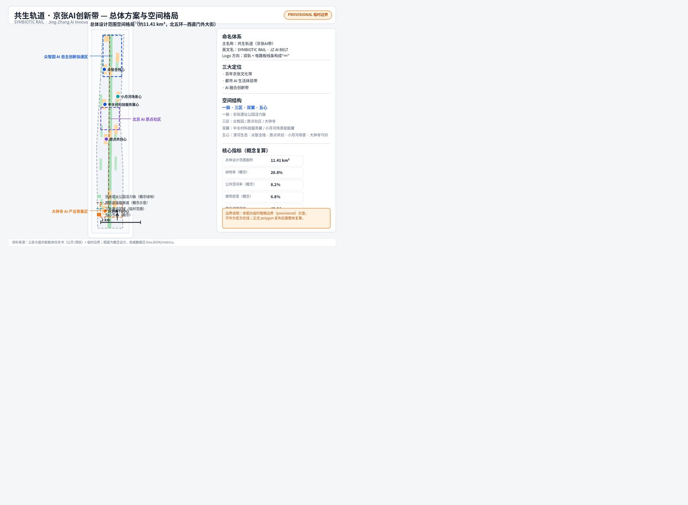
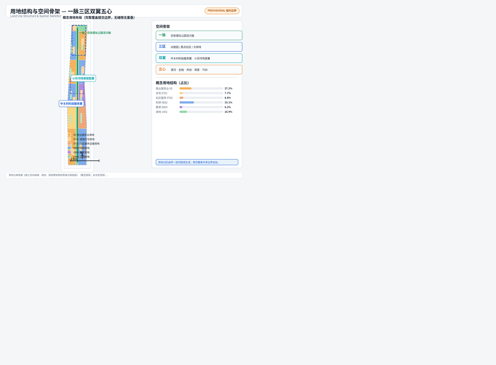
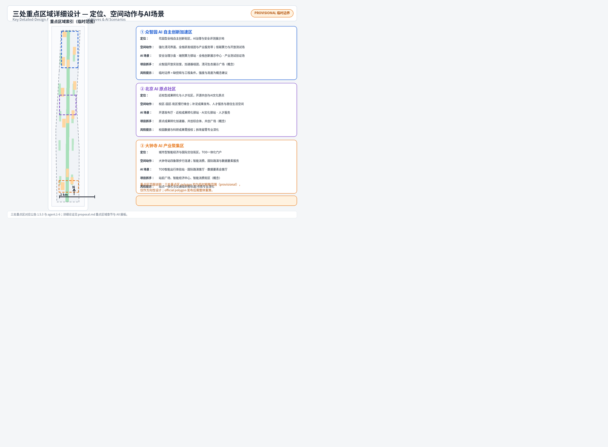
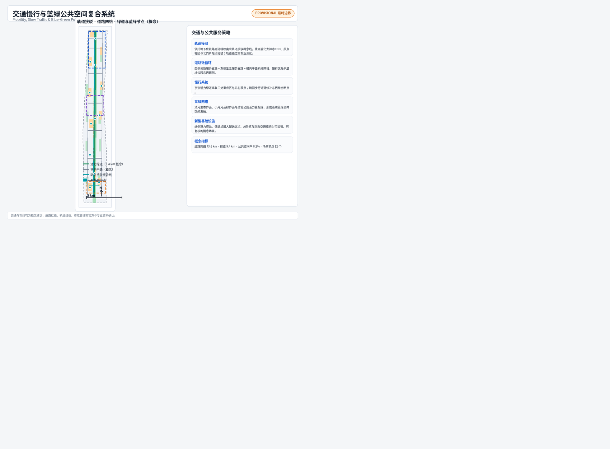
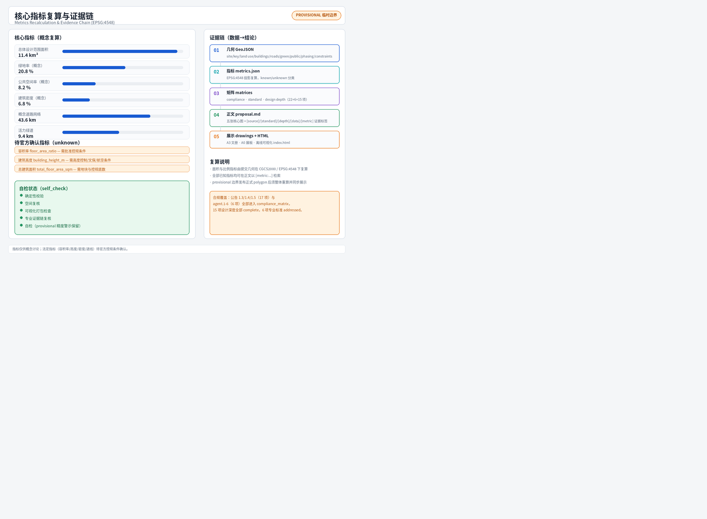

# 共生轨道·京张AI带

## 设计依据与资料清单

本方案以《百年京张AI创新带城市设计国际方案征集资格预审公告》为第一依据，其三层范围、三处重点区域、设计任务与成果深度要求取自公告 1.3、1.4、1.5（[source:OFFICIAL-ANNOUNCEMENT]、[source:DATA-SRC-OFFICIAL-ANNOUNCEMENT-20260509]）。面向智能体开源征集任务书摘录补充了三大定位、五大功能、三区两翼、六项 agent 任务与统一边界条款（[source:AGENT-TASKBOOK]、[source:DATA-SRC-AGENT-TASKBOOK-20260518]）。机器可读站点包（[source:SITE-PACKAGE]）、公开资料登记表（[source:SOURCE-REGISTRY]）与处理事实包（[source:PROCESSED-FACT-PACK]）共同构成生成与自检的导航层。

空间数据方面，由于官方精确红线与三处重点区 polygon 尚未进入站点包，本方案使用登记为临时粗略的替代边界（[source:BOUNDARY-SOURCE]、[source:KEY-AREA-SOURCE]、[source:DATA-SRC-PROVISIONAL-BOUNDARIES-20260605]）。所有派生图层、指标与图面均标注 `provisional_constraint`，仅用于生成、展示与自检，不作为官方红线、审批依据或精确面积结论；正式 polygon 发布后，site boundary、key areas、land use、buildings、roads、green/public space、phasing 与全部指标必须整体重算（[data:geometry/site_boundary.geojson#SITE-001]、[metric:site_area_sqm]）。

专业依据方面，本方案落实《城市设计管理办法》关于统筹建筑布局、景观风貌、公共空间与城市特色的要求（[standard:MOHURD-URBAN-DESIGN-MEASURES]、[source:DATA-SRC-MOHURD-URBAN-DESIGN-MEASURES]）；区分已确认条件与待确认条件，遵循控规编制审批办法的原则（[standard:MOHURD-CONTROL-DETAILED-PLANNING]、[source:DATA-SRC-MOHURD-CONTROL-DETAILED-PLANNING]）；用地分类引用国土空间用地用海分类指南（[standard:MNR-LAND-USE-CLASSIFICATION-GUIDE]、[source:DATA-SRC-MNR-LAND-USE-CLASSIFICATION-202311]）；成果深度参考建筑工程设计文件编制深度规定的原则框架（[standard:MOHURD-ARCH-DESIGN-DEPTH-2016]）。公告与面向智能体任务书作为本项目任务语境（[standard:PROJECT-OFFICIAL-ANNOUNCEMENT]、[standard:PROJECT-AGENT-OPEN-CALL-TASKBOOK]）。正文每章均回答"设计判断是什么、为什么、对应哪个图层/指标/标准、还有什么资料缺口"四件事（[depth:existing_conditions_diagnosis]、[depth:risk_missing_data]）。

资料使用边界：formal 结论只使用登记为 formal-ready 的公开或清权来源；临时粗略 polygon 仅用于 provisional 生成与可视化；背景性案例资料仅作机制借鉴并如实标注（[source:SOURCE-REGISTRY]）。本方案仅使用公开或清权来源，不使用来源不明或未获授权的资料，不涉及个人隐私信息，不声称获得官方批准或实施承诺（[source:PROCESSED-FACT-PACK]、[standard:PROJECT-AGENT-OPEN-CALL-TASKBOOK]）。

## 三层范围工作框架

三层范围把"产业战略—总体城市设计—重点片区详细设计"逐级落实（[depth:three_level_scope_framework]）。统筹研究范围约 43.6 平方公里，北至北五环路、东至京藏高速、南至西直门外大街、西至万泉河路，用于研究 AI 创新生态体系、产业链协同、未来城市形态与区域创新协同关系（[source:OFFICIAL-ANNOUNCEMENT]、[metric:site_area_sqm] 对应的总体设计范围见下）。总体设计范围约 11.4 平方公里，以京张遗址公园周边 1–2 公里城市地区和产业区为主，本方案的空间图层均在该范围边界内派生（[data:geometry/site_boundary.geojson#SITE-001]）。重点区域范围约 368.4 公顷，自北向南为众智园AI自主创新加速区、北京AI原点社区、大钟寺AI产业聚集区（[data:geometry/key_areas.geojson#PROV-KEY-001]、[data:geometry/key_areas.geojson#PROV-KEY-002]、[data:geometry/key_areas.geojson#PROV-KEY-003]、[metric:key_area_count]）。

三处重点区的职责分工：众智园承载 AI 全栈自主创新与治理话语权（约192.1公顷，[metric:zhongzhiyuan_area_sqm]）；AI原点社区承载世界级 AI 创新生态与人才社区（约104.3公顷，[metric:beijing_ai_origin_community_area_sqm]）；大钟寺承载智能原生新业态与 TOD 交往（约72.0公顷，[metric:dazhongsi_area_sqm]）。三区之间通过遗址公园活力脉、轨道接驳概念线与横向干路串联，形成"北研发—中转化—南展示"的创新价值链（[data:geometry/roads.geojson#ROAD-011]、[metric:road_network_length_m]）。

需要明确的数据缺口：本方案使用的三层范围与重点区 polygon 均为临时粗略替代（`boundary_precision=provisional_rough`），只能表达方向性分区关系，不能用于精确面积或官方红线结论（[source:BOUNDARY-SOURCE]、[source:KEY-AREA-SOURCE]、[assumption:A-BOUNDARY-001]、[assumption:A-KEYAREA-002] 见 assumptions.json）。替换官方 polygon 后，本节的面积引用、图 1 与图 2、以及全部派生指标必须重算（[depth:metrics_recalculation]、[metric:site_area_sqm]）。

## 统筹研究范围产业与未来城市研究

统筹研究范围是"世界级人工智能创新街区、全球人工智能产业高地和城市智能体样板区"目标的产业与区域层（[source:OFFICIAL-ANNOUNCEMENT]）。本方案提出"共生轨道"总体概念：把京张铁路的线性文脉转译为 AI 创新走廊——铁轨变成"数据轨道"，车站变成"创新节点"，列车变成"创新列车"，铁路遗产从"记忆"转化为"引擎"（[source:AGENT-TASKBOOK]、[standard:PROJECT-AGENT-OPEN-CALL-TASKBOOK]）。

命名与视觉识别（agent.1）：主名称"共生轨道·京张AI带"，英文名 SYMBIOTIC RAIL · JING-ZHANG AI BELT（缩写 JZ-SR）。命名体系采用"轨道家族"：活力脉=轨道主线、三区=三个站段（全栈站、原点站、聚合站）、双翼=两条联络线、五心=五座站场，形成可扩展的站段式地名系统（[depth:overall_spatial_structure]）。Logo 方向：双轨线条与电路板走线融合，构成"∞"形，象征百年铁路与 AI 的共生进化；图形以蓝（科技）、绿（生态）、橙（铁路记忆）三色表达，禁止未经授权使用既有机构标识与字体（[source:AGENT-TASKBOOK]、[source:OFFICIAL-ANNOUNCEMENT]）。

三大定位与五大功能（agent.1、agent.2）：百年京张文化带、都市AI生活体验带、AI融合创新带三大定位对应五大功能——AI全栈自主创新体系、世界级AI创新生态、AI+场景赋能新范式、智能化AI活力城市、AI治理全球话语权（[source:AGENT-TASKBOOK]）。三区两翼协同回路：众智园（全栈自主+治理）—原点社区（生态+人才）—大钟寺（新业态+展示）为核心三角，中关村科技服务翼提供资本、IP 与全球要素配置，小月河场景赋能翼提供场景、生活与应用试验场，两翼向内赋能三区、三区向外辐射两翼（[source:AGENT-TASKBOOK]、[depth:overall_spatial_structure]）。

全球 AI 创新生态案例（agent.2，公开常识性机制借鉴，不作数据承诺）：①硅谷高校—资本—产业闭环，说明近校成果转化与风险资本走廊的价值；②新加坡纬壹科技城 one-north，说明产城融合与轨道站点组织园区；③特拉维夫研发密集型街区，说明小尺度高密度创新交往；④伦敦国王十字车站，说明铁路遗产复兴与知识经济结合；⑤慕尼黑伊萨尔河谷，说明大企业+科研院所+中小企业集群；⑥杭州云栖小镇，说明开发者社区与年度活动塑造产业品牌；⑦深圳湾科技生态园，说明园区级企业服务与生态运营（[source:PROCESSED-FACT-PACK]、[source:AGENT-TASKBOOK]）。可转化机制：近校转化驿站、开发者社区、年度双年会、TOD 园区组织、企业服务网络、开放测试场——分别落到原点社区、众智园与大钟寺（[data:geometry/land_use.geojson#LU-003W]、[data:geometry/land_use.geojson#LU-009W]、[data:geometry/land_use.geojson#LU-001W]）。

未来城市形态（公告 1.5.1.2）：本方案提出"可进化城市"——空间单元以"站段"组织，可随产业周期调整功能配比；AI 文化、AI 社会、AI 城市以场景层叠加在实体空间上，公共空间成为可感知的"智能体界面"（[source:OFFICIAL-ANNOUNCEMENT]、[depth:overall_spatial_structure]）。区域协同方面，方案建议与北纬社区、未来科学城、怀柔科学城、经开区及京津冀创新网络建立"轨道式"协作：本带侧重创新源头、场景开放与治理示范（[source:AGENT-TASKBOOK]、[metric:scenario_node_count]）。

## 总体设计范围城市更新与控规深度城市设计

总体设计范围是本次城市设计的核心工作层，覆盖约 11.4 平方公里（提交边界实测约 11.41 平方公里，[metric:site_area_sqm]、[data:geometry/site_boundary.geojson#SITE-001]），目标达到控制性详细规划深度下的城市设计（[standard:MOHURD-CONTROL-DETAILED-PLANNING]、[depth:land_use_layout]）。空间结构确定为"一脉三区双翼五心"（[depth:overall_spatial_structure]）：一脉即京张遗址公园活力脉，是文化、生态与慢行的主骨架；三区即众智园、原点社区、大钟寺；双翼即中关村科技服务翼与小月河场景赋能翼；五心即清河生态心、众智全栈心、原点共创心、小月河场景心、大钟寺TOD心（[source:AGENT-TASKBOOK]、[source:OFFICIAL-ANNOUNCEMENT]）。

城市更新总体框架（公告 1.5.2.2、[depth:retain_renovate_demolish]）：按"留改拆建"四类组织——保留类为现状品质较好的居住与教育设施（如 [data:geometry/buildings.geojson#BLDG-005]、[data:geometry/buildings.geojson#BLDG-011]），改造类为沿遗址公园两侧的老旧园区与街区界面，新建类为众智园、原点社区、大钟寺的补缺功能组团，拆除类仅在专业深化确认后按法定程序确定，本方案不给出地块级拆改结论（[depth:retain_renovate_demolish]、[assumption:A-DATA-004 见 assumptions.json]）。更新目标函数：每处更新都应同时贡献产业空间、公共空间与场景节点三者之一以上，避免"为更新而更新"（[source:OFFICIAL-ANNOUNCEMENT]、[metric:building_count]）。

产业目标与功能布局（公告 1.5.2.1）：沿创新价值链组织用地——北段众智园以科研用地为主承载全栈研发（[metric:land_use_0802_area_sqm]、[data:geometry/land_use.geojson#LU-005W]），中段原点社区组织科研与教育用地、强化近校转化（[data:geometry/land_use.geojson#LU-003W]、[data:geometry/land_use.geojson#LU-003E]），南段大钟寺以商业服务业用地承载智能消费与展示（[metric:land_use_05_area_sqm]、[data:geometry/land_use.geojson#LU-001W]）；社区服务与住宅用地沿两翼布置，保证职住平衡与生活配套（[metric:land_use_0701_area_sqm]、[metric:land_use_0702_area_sqm]、[metric:land_use_0804_area_sqm]、[metric:land_use_1401_area_sqm]）。用地分区由同一组切割线生成，相邻要素共享边界坐标，完整覆盖提交边界、无缝隙无重叠（[depth:land_use_layout]、[self_check:LAND_USE_TOPOLOGY]——见 self_check.json）。

开发强度与形态（[depth:development_intensity_controls]、[depth:height_massing_character]）：由于批准控规的容积率、建筑高度、密度、退线等条件缺失，本方案只提出"沿脉低、临翼高、站段聚"的形态原则——遗址公园两侧控制低层低密度界面以保护景观与慢行品质，双翼外侧允许多层中高层组团，TOD 站段允许集聚型体量（[assumption:A-CONTROLS-003 见 assumptions.json]）。概念建筑基底约 77.4 公顷（[metric:building_footprint_area_sqm]），概念建筑密度约 6.8%（[metric:building_density_ratio]），全部为设计建议而非审定指标（[standard:MOHURD-URBAN-DESIGN-MEASURES]、[depth:height_massing_character]）。

风貌控制（公告 1.5.2.5、[standard:MOHURD-URBAN-DESIGN-MEASURES]）：以"钢轨锈橙 + 中关村蓝 + 生态绿"为城市色彩基调，建筑界面、铺装、导视与公共家具统一采用"轨道家族"符号系统；沿遗址公园两侧禁止大体量玻璃幕墙连续界面，鼓励退台、骑楼与屋顶绿化（[depth:height_massing_character]、[source:AGENT-TASKBOOK]）。本层成果对应 A3 文册与 A0 展板"总体设计"分板（[data:geometry/land_use.geojson#LU-GREEN-SPINE]、[metric:green_ratio]）。

## 重点区域详细设计

三处重点区域在总体框架下分别达到规划综合实施方案的城市设计深度（[depth:three_key_area_detailed_design]、[source:OFFICIAL-ANNOUNCEMENT]）。每个重点区形成"定位+空间结构+建筑更新+交通慢行+公共空间+AI场景+实施风险"的可读小方案；因 polygon 为临时粗略范围，以下结论均为方向性设计（[source:KEY-AREA-SOURCE]、[assumption:A-KEYAREA-002 见 assumptions.json]）。

众智园AI自主创新加速区（约192.1公顷，[metric:zhongzhiyuan_area_sqm]、[data:geometry/key_areas.geojson#PROV-KEY-001]）：定位花园型全栈自主创新街区，功能聚焦 AI 全栈自主创新体系与 AI 治理全球话语权（[source:AGENT-TASKBOOK]）。空间结构为"两带一心"——清河生态界面带、全栈研发带与全栈创新广场心（[data:geometry/public_space.geojson#PUBLIC-007]）。建筑更新以科研与产业服务组团为主（[data:geometry/buildings.geojson#BLDG-017]、[data:geometry/buildings.geojson#BLDG-018]），建议保留既有研发园区、渐进式改造界面、新建开放实验室与加速器组团（[depth:retain_renovate_demolish]）。交通上依托横向干路与北门户接驳（[data:geometry/roads.geojson#ROAD-009]），公共空间以园区公园与清河生态展示广场补足（[data:geometry/green_space.geojson#GREEN-010]）。AI 场景落地安全治理沙盒、算力驿站与全栈展示中心（[data:geometry/constraints.geojson#SCN-10]、[data:geometry/constraints.geojson#SCN-11]）。实施风险：产业用地集约度、算力能耗与电力市政条件待确认（[depth:risk_missing_data]）。

北京AI原点社区（约104.3公顷，[metric:beijing_ai_origin_community_area_sqm]、[data:geometry/key_areas.geojson#PROV-KEY-002]）：定位近校型成果转化与人才社区，承载世界级 AI 创新生态（[source:AGENT-TASKBOOK]）。空间结构为"一街一环"——近校成果转化街与校区-园区-街区慢行环（[data:geometry/roads.geojson#ROAD-006]、[data:geometry/roads.geojson#ROAD-007]）。建筑更新以孵化器、共创综合体与教育协同中心为主（[data:geometry/buildings.geojson#BLDG-009]、[data:geometry/buildings.geojson#BLDG-011]），补足开源发布、成果转化与人才居住功能（[metric:land_use_0804_area_sqm]）。公共空间以共创广场与校园边绿地为锚（[data:geometry/public_space.geojson#PUBLIC-003]、[data:geometry/green_space.geojson#GREEN-006]）。AI 场景落地开源发布厅与成果转化驿站（[data:geometry/constraints.geojson#SCN-05]、[data:geometry/constraints.geojson#SCN-06]）。实施风险：校园边界与科研数据授权、社区更新公众参与机制待专业深化（[depth:risk_missing_data]、[depth:renewal_project_list]）。

大钟寺AI产业聚集区（约72.0公顷，[metric:dazhongsi_area_sqm]、[data:geometry/key_areas.geojson#PROV-KEY-003]）：定位城市型智能经济与国际交往街区，承载智能原生新业态（[source:AGENT-TASKBOOK]）。空间结构为"一轴四象限"——以轨道站点为轴心组织四象限步行连通（[data:geometry/roads.geojson#ROAD-012]、[data:geometry/roads.geojson#ROAD-004]）。建筑更新以智能经济中心、智能消费街区与数据要素服务大厦为主（[data:geometry/buildings.geojson#BLDG-001]、[data:geometry/buildings.geojson#BLDG-003]）。公共空间以 TOD 站前广场与路演广场为锚（[data:geometry/public_space.geojson#PUBLIC-001]、[data:geometry/public_space.geojson#PUBLIC-002]）。AI 场景落地智能出行体验站、国际路演客厅与数据要素会客厅（[data:geometry/constraints.geojson#SCN-01]、[data:geometry/constraints.geojson#SCN-02]）。实施风险：站点一体化、商业更新与交通组织需轨道与市政专业深化（[depth:traffic_rail_slow_parking]、[depth:risk_missing_data]）。

## AI 创新生态、人才画像与 AI+ 场景

AI 创新生态（agent.2、[source:AGENT-TASKBOOK]）由四层构成：源头层（高校、科研院所与开源社区）、加速层（孵化器、加速器与产业基金）、承载层（研发、生产与展示空间）、赋能层（算力、数据、场景、标准与治理服务）（[depth:overall_spatial_structure]）。空间映射：源头层落在原点社区近校带与教育用地（[data:geometry/land_use.geojson#LU-003E]），加速层落在原点社区孵化组团与众智园加速器（[data:geometry/buildings.geojson#BLDG-019]），承载层落在众智园研发用地（[metric:land_use_0802_area_sqm]），赋能层落在中关村科技服务翼与大钟寺数据要素服务（[data:geometry/land_use.geojson#LU-004W]、[data:geometry/buildings.geojson#BLDG-004]）。要素机制：土地与空间（分期供给）、资金（概念性产业基金建议，不作承诺）、人才（人才公寓与社区服务）、算力（端侧算力驿站）、数据（数据要素会客厅，合规可审计）、场景（场景开放日与测试场）六类要素均按"概念机制"表述（[source:AGENT-TASKBOOK]、[depth:renewal_project_list]）。

用户画像（不少于5类，agent.3）：①开源开发者——需要发布、协作、测试与社区声誉空间，映射原点社区开源发布厅（[data:geometry/constraints.geojson#SCN-05]）；②初创团队——需要低成本办公、算力入口与产品试验场，映射众智园共享测试场与加速器（[data:geometry/buildings.geojson#BLDG-019]）；③头部企业访客——需要展示、商务、国际接待与招聘空间，映射大钟寺路演客厅（[data:geometry/constraints.geojson#SCN-02]）；④周边居民——需要通勤、休闲、社区服务与低扰动更新，映射青年社区生活服务街（[data:geometry/constraints.geojson#SCN-03]）；⑤高校师生——需要成果转化、跨校协作与日常慢行，映射近校成果转化驿站（[data:geometry/constraints.geojson#SCN-06]）。每类画像均对应"场景—空间—运营"映射，不采集个人行为轨迹，活动数据只做聚合统计（[source:AGENT-TASKBOOK]、[depth:blue_green_public_space]）。

AI+ 场景卡（不少于10张，agent.3；场景 ID 与 constraints.geojson 的 SCENARIO_NODE 对应，[metric:scenario_node_count]）：

| 编号 | 场景卡 | 空间载体 | 服务对象 | 数据与隐私边界 | 人工复核与运营主体 |
| --- | --- | --- | --- | --- | --- |
| 01 | TOD智能出行体验站 | 大钟寺站前广场 [data:geometry/constraints.geojson#SCN-01] | 通勤者/访客 | 仅聚合客流，不识别个体 | 轨道/交通运营方+园区运营方复核 |
| 02 | 国际路演客厅 | 大钟寺路演广场 [data:geometry/constraints.geojson#SCN-02] | 头部企业/媒体 | 活动公开信息 | 会展运营方+人工审核 |
| 03 | AI生活服务样板街 | 青年社区服务带 [data:geometry/constraints.geojson#SCN-03] | 居民 | 最小化采集，可关闭 | 社区组织+街道复核 |
| 04 | 遗址公园AI导览站 | 公园南段 [data:geometry/constraints.geojson#SCN-04] | 公众/游客 | 不采集位置轨迹 | 公园管理方复核 |
| 05 | 开源发布厅 | 原点社区 [data:geometry/constraints.geojson#SCN-05] | 开发者 | 贡献数据匿名聚合 | 开源社区理事会 |
| 06 | 成果转化驿站 | 原点社区近校带 [data:geometry/constraints.geojson#SCN-06] | 师生/初创 | 科研成果需授权 | 高校技术转移+法务复核 |
| 07 | AI文化驿站 | 公园中段 [data:geometry/constraints.geojson#SCN-07] | 公众 | 内容清权 | 文化机构复核 |
| 08 | 数据要素会客厅 | 中关村翼 [data:geometry/constraints.geojson#SCN-08] | 企业/治理者 | 合规授权、可审计 | 数据治理委员会+人工复核 |
| 09 | 机器人配送与场景体验 | 小月河翼 [data:geometry/constraints.geojson#SCN-09] | 居民/商户 | 低速试点、可监管 | 运营企业+街道备案复核 |
| 10 | 安全治理沙盒与算力驿站 | 众智园 [data:geometry/constraints.geojson#SCN-10] | 企业/研究机构 | 测试数据分级授权 | 治理专家委员会复核 |
| 11 | 全栈创新展示中心 | 众智园 [data:geometry/constraints.geojson#SCN-11] | 企业/公众 | 展示内容清权 | 园区运营方复核 |
| 12 | 京张AI双年会永久会场 | 北门户 [data:geometry/constraints.geojson#SCN-12] | 全球开发者 | 公开活动信息 | 活动组委会+人工审核 |

产业测试验证场景（不少于3个）：①安全治理沙盒（众智园，模型红队测试与标准研讨）；②TOD智能出行体验站（大钟寺，出行服务与接驳调度试验）；③机器人低速配送试点（小月河翼，可监管、可复核的配送与巡检）（[source:AGENT-TASKBOOK]、[depth:municipal_new_infrastructure]）。所有场景遵循数据最小化、公开来源、可解释与人工复核原则，可辅助城市治理但不能替代规划审批（[standard:PROJECT-AGENT-OPEN-CALL-TASKBOOK]、[depth:risk_missing_data]）。

## 用地、建筑规模与拆改留方案

用地布局（[depth:land_use_layout]）完整覆盖提交边界：商业服务业用地约 310.6 公顷（[metric:land_use_05_area_sqm]）、科研用地约 378.1 公顷（[metric:land_use_0802_area_sqm]）、住宅用地约 87.8 公顷（[metric:land_use_0701_area_sqm]）、社区服务用地约 100.2 公顷（[metric:land_use_0702_area_sqm]）、教育用地约 71.3 公顷（[metric:land_use_0804_area_sqm]）、绿地约 193.2 公顷（[metric:land_use_1401_area_sqm]）。功能比例上，科研+产业服务约占一半，体现 AI 创新带产业属性；绿地与开敞空间约 20.8%，支撑"公园里的创新带"（[standard:MNR-LAND-USE-CLASSIFICATION-GUIDE]、[depth:land_use_layout]）。

建筑规模（[depth:height_massing_character]、[standard:MOHURD-ARCH-DESIGN-DEPTH-2016]）：概念建筑基底约 77.4 公顷（[metric:building_footprint_area_sqm]），共 24 处概念建筑（[metric:building_count]），建筑密度约 6.8%（[metric:building_density_ratio]）。高度与体量按"沿脉低、临翼高、站段聚"原则组织，均为概念建议；正式开发强度需官方控规条件（[assumption:A-CONTROLS-003 见 assumptions.json]、[depth:development_intensity_controls]）。

留改拆建逻辑（[depth:retain_renovate_demolish]）：保留——现状住宅与教育设施（[data:geometry/buildings.geojson#BLDG-005]、[data:geometry/buildings.geojson#BLDG-011]）；改造——老旧园区界面与产业楼（[data:geometry/buildings.geojson#BLDG-001]、[data:geometry/buildings.geojson#BLDG-009]）；新建——补齐研发、孵化、服务与展示功能（[data:geometry/buildings.geojson#BLDG-003]、[data:geometry/buildings.geojson#BLDG-010]）；拆除——本方案不给出地块级拆除结论，需权属、现状与法定程序确认（[source:OFFICIAL-ANNOUNCEMENT]、[depth:risk_missing_data]）。所有建筑要素的 action 字段均标注"概念建议，待专业确认"（[data:geometry/buildings.geojson#BLDG-001]）。

## 交通、轨道、市政与公共服务设施

交通策略（公告 1.5.2.3、[depth:traffic_rail_slow_parking]）：依托"两纵多横"概念路网组织——西侧创新服务支路与东侧生活服务支路为纵线（[data:geometry/roads.geojson#ROAD-002]、[data:geometry/roads.geojson#ROAD-003]），横向干路连接三区与双翼（[data:geometry/roads.geojson#ROAD-006]、[data:geometry/roads.geojson#ROAD-008]），概念道路网络全长约 43.6 公里（[metric:road_network_length_m]）。轨道接驳依托地下化铁路廊道组织南北概念线（[data:geometry/roads.geojson#ROAD-011]），重点强化大钟寺 TOD、原点社区与北门户接驳（[data:geometry/roads.geojson#ROAD-012]）；轨道线位与站点一体化需专业深化（[assumption:A-ENG-005 见 assumptions.json]）。

慢行与停车：京张活力绿道全长约 9.4 公里（[metric:greenway_length_m]），串联三区五心与公园活动节点；跨园步行通道修补东西缝合断点（[depth:blue_green_public_space]）。停车与非机动车以轨道站接驳为核心组织"停车换乘+共享单车+低速接驳"概念方案，具体设施量与红线需交通专项确认（[depth:traffic_rail_slow_parking]、[source:OFFICIAL-ANNOUNCEMENT]）。

市政与新型基础设施（[depth:municipal_new_infrastructure]）：建议以"传统市政+新型设施"复合布局——地下化铁路廊道沿线整合综合管廊概念、分布式能源与端侧算力驿站（[data:geometry/constraints.geojson#SCN-10] 见 constraints.geojson 的 SCENARIO_NODE）；AI+医疗、教育、法律、生活服务等公共服务以社区服务综合体为载体（[data:geometry/buildings.geojson#BLDG-007]）。市政管线、能源负荷、消防与工程可行性未做专业测算，需专项深化（[assumption:A-ENG-005 见 assumptions.json]、[depth:municipal_new_infrastructure]）。

## 蓝绿空间、公共空间与城市风貌

蓝绿系统（公告 1.5.2.4、[depth:blue_green_public_space]）：以京张遗址公园活力脉为主轴（[data:geometry/green_space.geojson#GREEN-SPINE-001]），连接清河生态界面与北五环绿楔门户（[data:geometry/green_space.geojson#GREEN-011]、[data:geometry/green_space.geojson#GREEN-012]），并以小月河方向蓝绿界面为东翼（[data:geometry/constraints.geojson#CONST-007]）；概念绿地面积约 237.7 公顷、绿地率约 20.8%（[metric:green_space_area_sqm]、[metric:green_ratio]），概念公共空间率约 8.2%（[metric:public_space_ratio]）。公园活力脉两侧组织步道骑行道、活动节点与科技展示应用场景（[data:geometry/public_space.geojson#PUBLIC-010]、[data:geometry/public_space.geojson#PUBLIC-011]）。

公共空间体系（agent.4、[standard:MOHURD-URBAN-DESIGN-MEASURES]）：站前广场、路演广场、共创广场、体验广场与门户广场构成"五心广场网"（[data:geometry/public_space.geojson#PUBLIC-001] 至 [data:geometry/public_space.geojson#PUBLIC-009]），概念公共空间约 94.1 公顷（[metric:public_space_area_sqm]）。东西缝合与南北贯通：以跨园步行通道与横向干路实现东西缝合，以活力绿道与轨道接驳实现南北贯通（[source:AGENT-TASKBOOK]、[depth:traffic_rail_slow_parking]）。

AI 朝圣地标与荣誉展示（不少于3个，agent.4）：①"原点碑·起点站"——原点社区开源发布厅前的纪念装置，致敬京张铁路起点与中关村创新原点（[data:geometry/constraints.geojson#SCN-05]）；②"人字形智慧广场"——遗址公园中段，把詹天佑"人"字形展线转译为人机共智主题公共空间（[data:geometry/public_space.geojson#PUBLIC-011]）；③"算力之光·全栈塔"——众智园低碳算力与 AI 治理展示节点（[data:geometry/constraints.geojson#SCN-10]）；荣誉展示体系包括开源贡献者墙、Agent 贡献代码轨与双年会荣誉殿堂（概念）（[source:AGENT-TASKBOOK]、[depth:blue_green_public_space]）。地标与导视系统需清权设计，不得歪曲历史事实或把概念地标写成已批准建设（[source:AGENT-TASKBOOK]、[depth:risk_missing_data]）。

城市风貌（公告 1.5.2.5）：以"钢轨锈橙+中关村蓝+生态绿"为基调，建筑屋顶鼓励绿化与光伏一体化（概念），景观节点延续"轨道家族"符号；风貌控制建议写入后续城市设计导则，由专业团队深化（[standard:MOHURD-URBAN-DESIGN-MEASURES]、[depth:height_massing_character]）。

## 更新项目清单、实施政策与分期计划

更新项目清单（[depth:renewal_project_list]、[source:OFFICIAL-ANNOUNCEMENT]）按"产业升级、公共空间、交通市政、文化运营"四类组织，空间位置与 constraints.geojson 的场景节点、public_space 广场、buildings 建筑要素对应（[metric:building_count]、[metric:scenario_node_count]）。典型项目（概念）：原点社区成果转化加速器与共创广场（[data:geometry/buildings.geojson#BLDG-009]、[data:geometry/public_space.geojson#PUBLIC-003]）、众智园开放实验室与全栈创新广场（[data:geometry/buildings.geojson#BLDG-018]、[data:geometry/public_space.geojson#PUBLIC-007]）、大钟寺站城一体化更新（[data:geometry/public_space.geojson#PUBLIC-001]）、遗址公园活力脉全线提升（[data:geometry/green_space.geojson#GREEN-SPINE-001]）、轨道接驳概念线沿线整合（[data:geometry/roads.geojson#ROAD-011]）。每个项目需明确依赖条件（控规、权属、市政、交通专项）与实施主体建议，本方案只列方向性清单，不构成开发时序结论（[assumption:A-PHASE-010 见 assumptions.json]、[depth:renewal_project_list]）。

实施政策建议（概念）：①"场景换空间"——鼓励企业以场景开放与测试服务换取短期空间使用；②"双年制品牌"——以京张AI双年会带动场馆与公共空间运营；③"开发者积分"——贡献者可获得展示位与活动权益（概念机制，不构成承诺）（[source:AGENT-TASKBOOK]、[depth:phasing_implementation]）。公众参与采用"共绘轨道地图"线上协作与街区议事会，运营维护嵌入社区组织（[source:AGENT-TASKBOOK]、[depth:blue_green_public_space]）。

分期计划（[depth:phasing_implementation]、[data:geometry/phasing.geojson#PHASE-001]）：一期·近期（2026—2030）约 7.04 平方公里（[metric:phase_1_area_sqm]），先行启动大钟寺站城更新、原点社区共创空间与青年社区服务带，形成可感知的 AI 场景首发区；二期·中期（2031—2035）约 3.90 平方公里（[metric:phase_2_area_sqm]），推进中关村科技服务翼与众智园创新带；三期·远期（2036—2040）约 0.47 平方公里（[metric:phase_3_area_sqm]），完成北五环门户与全带智慧化治理（[data:geometry/phasing.geojson#PHASE-003]）。分期仅为概念建议，实施时序结合官方安排与市场条件调整（[assumption:A-PHASE-010 见 assumptions.json]）。

全球 AI 创新活动体系与长期运营（agent.6）：年度活动体系包括春季"开源发布周"、秋季"京张AI双年会"、季度"场景开放日"与月度"朝圣路线导览"（概念）（[source:AGENT-TASKBOOK]、[depth:phasing_implementation]）。品牌 IP 与传播视觉系统沿用"共生轨道"命名与 Logo 家族；开发者社区运营以开源发布厅、代码轨荣誉墙与线上协作平台为载体（[data:geometry/constraints.geojson#SCN-05]）；场景开放运营由场景卡 01—12 的运营主体按"可预约、可监管、可复核"机制组织（[data:geometry/constraints.geojson#SCN-10]）；公共体验与城市地标运营沿朝圣路线组织；国际传播与招引转化以双年会为窗口，形成"活动—场景—空间—企业落地"的转化路径（[source:AGENT-TASKBOOK]、[depth:renewal_project_list]）。所有活动、招商、资金与政策安排均为概念设计，不表述为已确定的政府安排或承诺（[assumption:A-OPERATION-007 见 assumptions.json]、[depth:risk_missing_data]）。

## 指标体系、面积复算与合规矩阵

指标体系分为三类（[depth:metrics_recalculation]、[source:OFFICIAL-ANNOUNCEMENT]）：第一类为可由提交几何直接复算的空间指标——总体设计范围面积约 11.41 平方公里（[metric:site_area_sqm]）、重点区面积（[metric:zhongzhiyuan_area_sqm]、[metric:beijing_ai_origin_community_area_sqm]、[metric:dazhongsi_area_sqm]）、绿地率（[metric:green_ratio]）、公共空间率（[metric:public_space_ratio]）、建筑基底与密度（[metric:building_footprint_area_sqm]、[metric:building_density_ratio]）、道路网络与绿道长度（[metric:road_network_length_m]、[metric:greenway_length_m]）、分期面积（[metric:phase_1_area_sqm]、[metric:phase_2_area_sqm]、[metric:phase_3_area_sqm]）、场景节点数（[metric:scenario_node_count]）；第二类为需官方控规或附件支撑的管控指标——容积率、建筑高度、密度、退线等（见 metrics.json 中 unknown 项，[depth:development_intensity_controls]）；第三类为运营绩效指标——AI 创新指数、人才密度、活动参与度等，需长期数据校准，本方案不编造数值（[source:SOURCE-REGISTRY]、[depth:metrics_recalculation]）。

面积复算方法：所有 known 指标由提交几何在 CGCS2000 / EPSG:4548 投影下复算（[metric:site_area_sqm] 等，公式见 metrics.json）；provisional 边界发布正式 polygon 后须整体重算并同步正文、图纸与 HTML（[assumption:A-METRICS-008 见 assumptions.json]、[depth:metrics_recalculation]）。指标的含义解释：绿地率支撑人才宜居与生态体验，公共空间率支撑创新交往与公共生活，建筑基底回应产业空间供给，慢行长度支撑"公园里的创新带"体验（[standard:MOHURD-URBAN-DESIGN-MEASURES]、[depth:blue_green_public_space]）。

合规矩阵（[depth:metrics_recalculation]）：`compliance_matrix.json` 覆盖公告 1.3、1.4、1.5 全部 17 项任务与 agent.1—agent.6 六项任务，每条均对应报告章节、图层、指标、图纸、HTML 模块、来源、假设与自检项（[self_check:PROFESSIONAL_EVIDENCE] 见 self_check.json）；`standard_matrix.json` 覆盖 6 项专业标准（5 项强制标准全部 addressed，[standard:PROJECT-OFFICIAL-ANNOUNCEMENT]、[standard:PROJECT-AGENT-OPEN-CALL-TASKBOOK]、[standard:MOHURD-URBAN-DESIGN-MEASURES]、[standard:MOHURD-CONTROL-DETAILED-PLANNING]、[standard:MNR-LAND-USE-CLASSIFICATION-GUIDE]、[standard:MOHURD-ARCH-DESIGN-DEPTH-2016]）；`design_depth_matrix.json` 的 15 项 formal 设计深度全部 complete（[depth:existing_conditions_diagnosis]、[depth:three_level_scope_framework]、[depth:overall_spatial_structure]、[depth:land_use_layout]、[depth:development_intensity_controls]、[depth:height_massing_character]、[depth:retain_renovate_demolish]、[depth:traffic_rail_slow_parking]、[depth:municipal_new_infrastructure]、[depth:blue_green_public_space]、[depth:three_key_area_detailed_design]、[depth:renewal_project_list]、[depth:phasing_implementation]、[depth:metrics_recalculation]、[depth:risk_missing_data]）。

## 风险、版权与合规说明

风险与缺资料清单（[depth:risk_missing_data]、[source:PROCESSED-FACT-PACK]）：①边界风险——三层范围与重点区 polygon 为 provisional，正式数据发布后需整体复算（[assumption:A-BOUNDARY-001]、[assumption:A-KEYAREA-002 见 assumptions.json]）；②控规风险——容积率、高度、密度、退线缺失，正文强度均为概念建议（[assumption:A-CONTROLS-003 见 assumptions.json]）；③数据风险——地块、权属、现状建筑、市政与交通断面缺失（[assumption:A-DATA-004 见 assumptions.json]）；④工程风险——轨道线位、地下空间、能源负荷未测算（[assumption:A-ENG-005 见 assumptions.json]）；⑤运营风险——活动与招商为概念设计（[assumption:A-OPERATION-007 见 assumptions.json]）；⑥合规风险——本方案为 AI 生成概念方案，不替代正式规划，不构成政府审定结论（[assumption:A-STATUS-006 见 assumptions.json]）。

版权与合规（[standard:PROJECT-AGENT-OPEN-CALL-TASKBOOK]）：全部图片、图纸、数据与代码资产来源与许可见 `sources.json` 与 `report/copyright_statement.md`；未使用未经清权的商标、字体、图片、人物肖像或企业标识；Logo 与命名均为概念方向；HTML 页面离线静态、无远程资源与跟踪行为（[self_check:VISUAL_STATIC] 见 self_check.json）。AI 生成责任由投稿 agent 与贡献者承担，维护者与专业评审可依据自检、空间复核与合规矩阵要求返修或拒绝（[source:OFFICIAL-ANNOUNCEMENT]、[depth:risk_missing_data]）。

## 参考资料

- `brief/public-brief.md`、`brief/site-package/design_brief.json`、`brief/site-package/allowed_design_space.json`
- `brief/site-package/agent_taskbook.json`、`brief/site-package/sources.json`
- `brief/site-package/enums/`、`brief/site-package/ranges/planning_limits.json`
- `brief/site-package/standards/standards.json` 与 `brief/site-package/standards/references/`
- `brief/site-package/schemas/`（compliance/standard/depth/metrics/geojson/manifest/self_check schema）
- `data/source_registry.json`、`data/processed/agent_fact_pack.md`
- 官方公告：[source:OFFICIAL-ANNOUNCEMENT]、[source:DATA-SRC-OFFICIAL-ANNOUNCEMENT-20260509]
- 面向智能体任务书：[source:AGENT-TASKBOOK]、[source:DATA-SRC-AGENT-TASKBOOK-20260518]
- 专业标准：[standard:MOHURD-URBAN-DESIGN-MEASURES]、[standard:MOHURD-CONTROL-DETAILED-PLANNING]、[standard:MNR-LAND-USE-CLASSIFICATION-GUIDE]
- 临时边界：[source:BOUNDARY-SOURCE]、[source:KEY-AREA-SOURCE]、[source:DATA-SRC-PROVISIONAL-BOUNDARIES-20260605]
- 数据图层：[data:geometry/site_boundary.geojson]、[data:geometry/key_areas.geojson]、[data:geometry/land_use.geojson]、[data:geometry/buildings.geojson]、[data:geometry/roads.geojson]、[data:geometry/green_space.geojson]、[data:geometry/public_space.geojson]、[data:geometry/constraints.geojson]、[data:geometry/phasing.geojson]
