# THE COMMON EAVE: An AI Innovation Belt Organised by Public Life
## Design Basis and Sources

This revision begins with Haidian's own public-planning lineage rather than a generic image of an AI city. The district plan stresses compact renewal and the integration of technology, culture, and ecology; the green-space plan frames a science city within parks; and the urban-renewal guide calls for porous ground floors, shared institutional edges, all-age access, and human-friendly AI. Local public-space projects reinforce a restrained, useful, incremental approach instead of a single iconic megastructure. [source:SRC-HAIDIAN-DISTRICT-PLAN] [source:SRC-HAIDIAN-GREEN-PLAN] [source:SRC-HAIDIAN-URBAN-RENEWAL]

All site and key-area polygons remain provisional constraints. The two civic prototypes define place types and operating logic, not property, road engineering, or heritage intervention. [source:SRC-PROVISIONAL-BOUNDARIES-2026] [depth:existing_conditions_diagnosis]

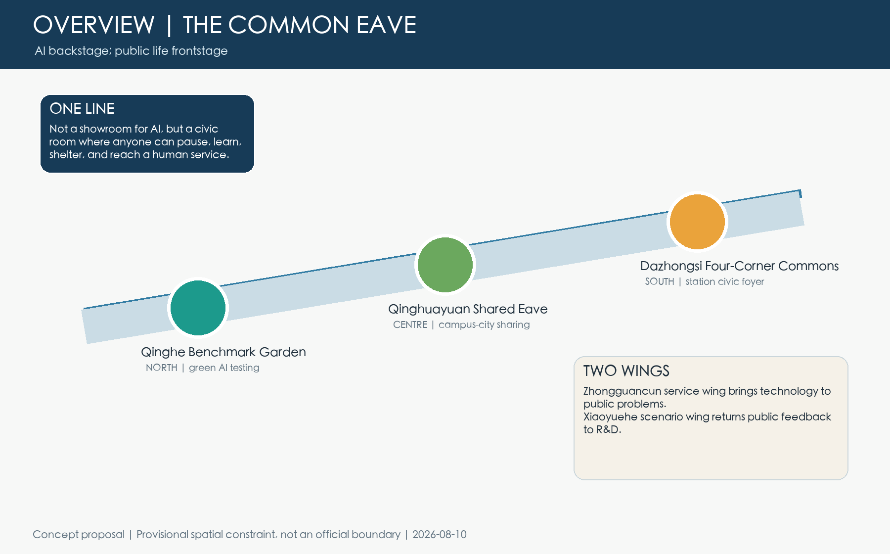

v3 separates civic evidence into three levels: public government consultation and formal project feedback are Level A; consented site walks, interviews, and co-design are Level B; Agent journeys are Level C hypotheses. Level C can reveal questions but cannot be written as resident consent or public acceptance. [source:SRC-JINGZHANG-COCREATION-2021] [source:REF-UNHABITAT-PUBLIC-SPACE]

v4 rechecks the official scale: this is not a call for several civic objects, but a nested task combining 43.6 km² of industry and future-city research, 11.4 km² of overall urban design, and detailed design for 368.4 ha across three key areas. The two v3 civic prototypes remain, but they now sit within complete land-use, renewal, mobility, utility, blue-green, character, and operating systems. [source:SRC-2026-BJ-GH-QUAL-PREANNOUNCEMENT] [depth:three_level_scope_framework]

v5 adds five official sources: the adopted Beijing and Haidian Fifteenth Five-Year Plans, the Beijing 2035 Master Plan, Haidian's 2025 statistical bulletin, and the 2020 census. Policy establishes city duties and public questions; district statistics provide context only. Neither substitutes for site demographics, flows, rights, engineering, or consented engagement. [source:SRC-BEIJING-15TH-2026] [source:SRC-HAIDIAN-15TH-2026] [source:SRC-HAIDIAN-STATS-2025]

v5.2 expands the evidence-action-falsification matrix to thirteen papers: eleven full texts, complete manuscripts, full HTML articles, or page-by-page visual reviews; two remain abstract-screened. [metric:academic_research_source_count] The Phase I paper verifies roughly 2.4 km, 16.8 ha, and opening in 2023, so Three Paths and One Green, east-west reconnection, railway interpretation, and professional operations are existing groundwork rather than Agent inventions. Beijing climate studies supply variables to retest, not performance promises. [source:REF-JINGZHANG-HERITAGE-PARK-2024] [source:REF-BEIJING-LINEAR-PARK-THERMAL-2017] [source:REF-BEIJING-GREEN-COOLING-2016]

The metro paper requires route mapping by exit and quadrant; its six-station mean of eight minutes is a comparison, not a standard. Two older-adult studies require objective audits, perceived conditions, housing/community stratification, and deliberate inclusion of mobility-impaired people. [source:REF-BEIJING-METRO-WALKING-2016] [source:REF-BEIJING-OLDER-ADULTS-BE-2024] [source:REF-BEIJING-OLDER-ADULTS-PERCEIVED-BE-2024]

Knowledge-space and Zhongguancun research change permeability and absorptive-capacity measures. [source:REF-KNOWLEDGE-PUBLIC-SPACE-2015] [source:REF-ZHONGGUANCUN-MOBILITY-SPILLOVER-2011]

Living-lab and smart-city research add responsibility, long-term public value, and device transparency. [source:REF-URBAN-LIVING-LAB-GOVERNANCE-2023] [source:REF-LIVING-LAB-PUBLIC-VALUE-2021] [source:REF-SMART-CITY-TRUST-2020]

Two green-space reviews recast the civic-climate spine as whole-life socio-ecological infrastructure: species, seasons, tree survival, maintenance, irrigation, equity, and public monitoring matter together. Narrative-review limits and an internal count inconsistency are retained. These papers do not decorate the proposal with authority: contradictory field evidence must revise or withdraw a move and trigger recalculation. [source:REF-URBAN-GREEN-COOLING-REVIEW-2016] [source:REF-URBAN-GREEN-DUAL-PRESSURES-2026]

## Three-Level Scope Framework

The research scale asks how Haidian's AI capacity can create public value; the overall-design scale turns the nine-kilometre heritage park into a longitudinal and transverse civic-room network; and the key-area scale resolves two prototypes that can be drawn, tested, operated, and professionally deepened. Official geometry will trigger package-wide recalculation. [source:SRC-2026-BJ-GH-QUAL-PREANNOUNCEMENT] [depth:three_level_scope_framework]

The Common Eave is not a continuous roof. It is a spatial grammar: at key nodes everyone should be able to pause, find shelter or shade, sit with back support, drink water, locate a toilet, park a bicycle, reach a human helper, and move on a continuous accessible ground. [data:geometry/public_space.geojson#PUBLIC-001] [depth:overall_spatial_structure]

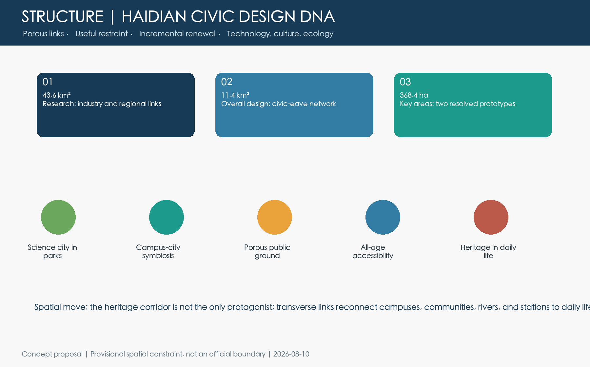

v4 proposes one civic-climate spine, five cross-city seams, three innovation districts, two support loops, and ten renewal work packages. The spine combines heritage, mobility, ecology, and everyday services; the seams pursue Qinghe, Xiaoyuehe, campus-city, and transit connections; the three districts take different roles in full-stack governance, research transfer, and an AI-native urban economy; the two wings close the loop between professional services and real-world tests. [metric:cross_city_seam_count] [metric:renewal_work_package_count]

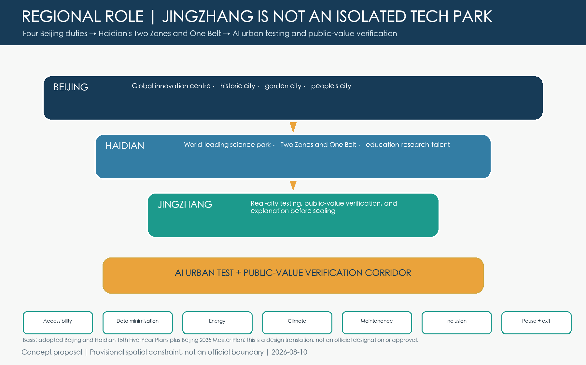

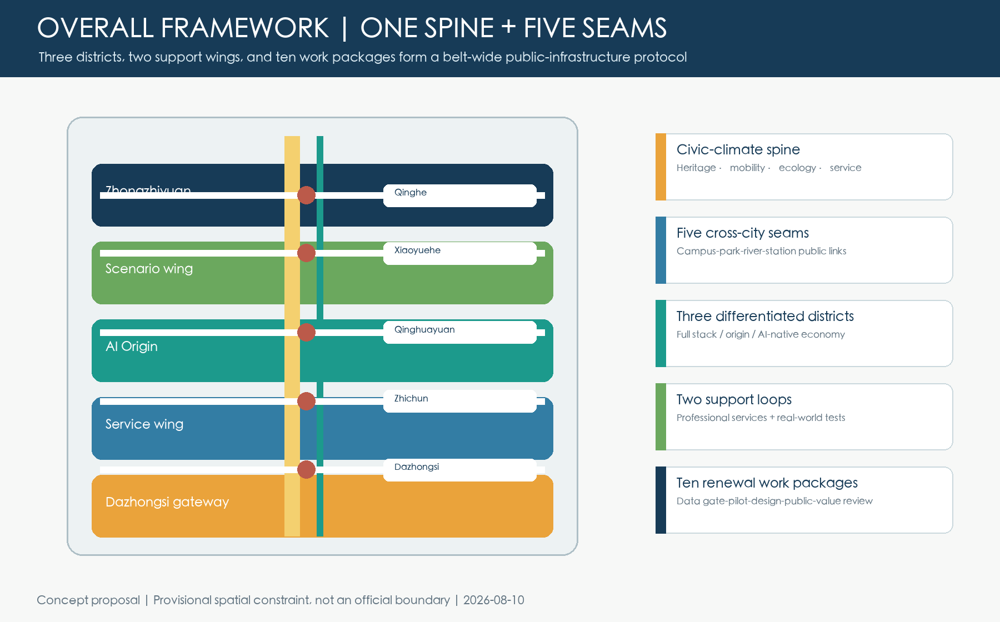

v5 defines Jingzhang's wider role as Beijing's AI Urban Test and Public-Value Verification Corridor. At Beijing scale it combines the duties of a global innovation centre, historic city, garden city, and people's city. In Haidian's Two Zones and One Belt, it connects north and south while translating research into real-world tests and public explanation. On site, AI must pass accessibility, data-minimisation, energy, climate, maintenance, inclusion, and exit checks before scaling. This is a spatial policy translation, not an official designation or approval. [source:SRC-BEIJING-15TH-2026] [source:SRC-HAIDIAN-15TH-2026] [metric:public_value_test_domain_count]

v5.2 starts with evidence roles, not form: official scope and policy are O-tier; public remote sensing and scoped public comments are P-tier; reproducible analysis is D-tier; Agent concepts are C-tier. They never impersonate one another. The 1,248 clipped 100m cells from ESA WorldCover 2021 are not fieldwork, yet they bring a real public-observation signal into the overall plan and overturn part of the broad green-band assumption. [metric:public_observation_grid_cell_count] [source:DATA-ESA-WORLDCOVER-2021-V200-N39E114]

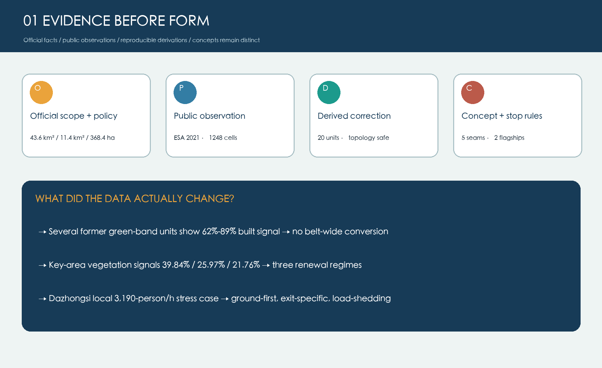

The executable thesis is: **begin with retention, shape through seams, and govern AI through reversibility.** Innovation no longer means new buildings; continuity no longer means a broad green band; intelligence no longer means automated approval. [metric:evidence_driven_design_correction_count]

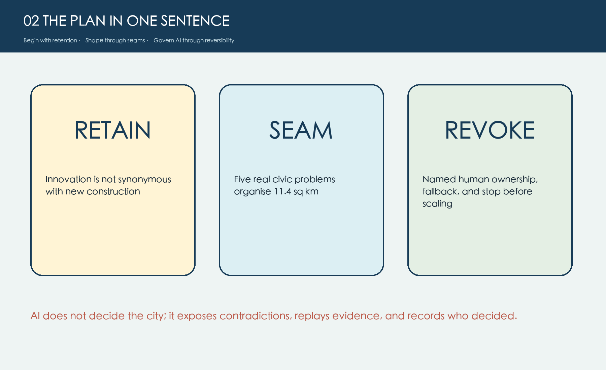

## Research Area: Industry and Future City

A review of the public catalog of 309 merged proposals found 276 line/belt/spine narratives and 200 open/auditable/rollback narratives, but only 13 summaries touching architectural civic prototypes, five naming everyday service facilities, and three foregrounding shade, weather, or microclimate. This is not a ranking; it identifies a reproducible differentiation gap. [source:SRC-PEER-CATALOG-20260810] [metric:peer_catalog_count_reviewed]

Five global references contribute mechanisms rather than imagery: problem-to-PoC work from AI Singapore, urban testbeds from Helsinki, research-community links from Mila, public documentation from Amsterdam, and talent support from Seoul AI Hub. In Haidian they become one relationship among testing, public service, human responsibility, and long-term operation. [source:CASE-AI-SINGAPORE-100E] [source:CASE-HELSINKI-TESTBED] [source:CASE-MILA-PARTNERSHIPS]

## Overall Design Area: Urban Renewal

The structure combines a longitudinal heritage-green spine, transverse campus-community-river-station links, and three civic landmarks. Existing ground floors and buildings are adapted before new construction; reversible elements precede permanent works. FAR, height, road lines, bridges, tunnels, and municipal capacity remain pending formal data and specialist review. [standard:MNR-LAND-USE-CLASSIFICATION-GUIDE] [depth:development_intensity_controls]

The three landmarks avoid spectacle: Qinghe Benchmark Garden discloses aggregated green-AI and ecological maintenance results; Qinghuayuan Shared Eave enables campus-city sharing; and Dazhongsi Four-Corner Commons forms a civic foyer for arrival and intelligent commerce. [metric:landmark_count] [depth:blue_green_public_space]

## Detailed Design of the Key Areas

Zhongzhiyuan receives a benchmark garden for green-AI testing, standards, public observation, and ecological maintenance. The AI Origin Community receives the Shared Eave: quiet study, open classes, repair and shared meals, child care, staffed help, and wet-weather waiting in a reversible structure detached from heritage fabric. Dazhongsi receives Four-Corner Commons: continuous accessible interchange, cycle parking, human service, and civic commerce before any heavier station engineering is considered. [data:geometry/key_areas.geojson#PROV-KEY-001] [depth:three_key_area_detailed_design]

Both flagships record the public problem, spatial move, daily operation, Agent responsibility, offline fallback, and professional trigger. They remain concepts for professional deepening. [metric:flagship_public_design_count] [data:geometry/key_areas.geojson#PROV-KEY-003]

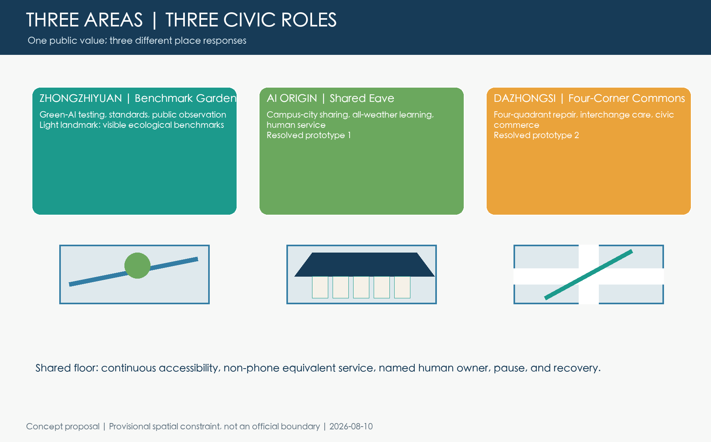

The Shared Eave becomes a linear civic room detached from heritage fabric. Its six open rooms are reordered by quiet use, care, back-of-house needs, and night visibility. Four concept sections address the heritage edge, study under trees, a dry wet-weather route, and visible staffed help. The scale chain supports design development; it is not a surveyed construction drawing. [source:SRC-HERITAGE-PROTECTION-2021] [metric:flagship_section_type_count]

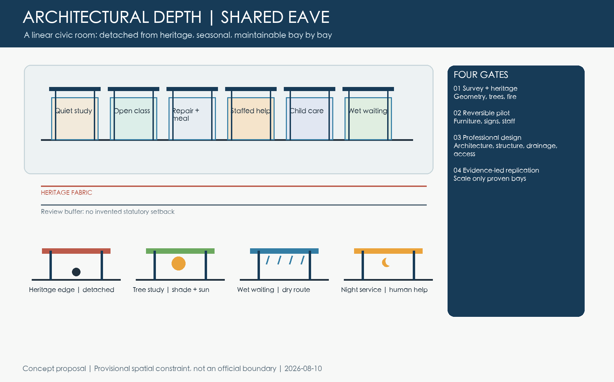

Four-Corner Commons becomes a ground-level civic building that changes with time. Arrival, care, exchange, and night life occupy the four rooms; morning peak, daytime, evening peak, and night use different curb and staff responsibilities. Bridges, signals, and drainage performance await specialist studies; phase one must create public value without heavy engineering. [source:SRC-JINGZHANG-CONTROL-DRAFT-2025] [metric:citizen_journey_count]

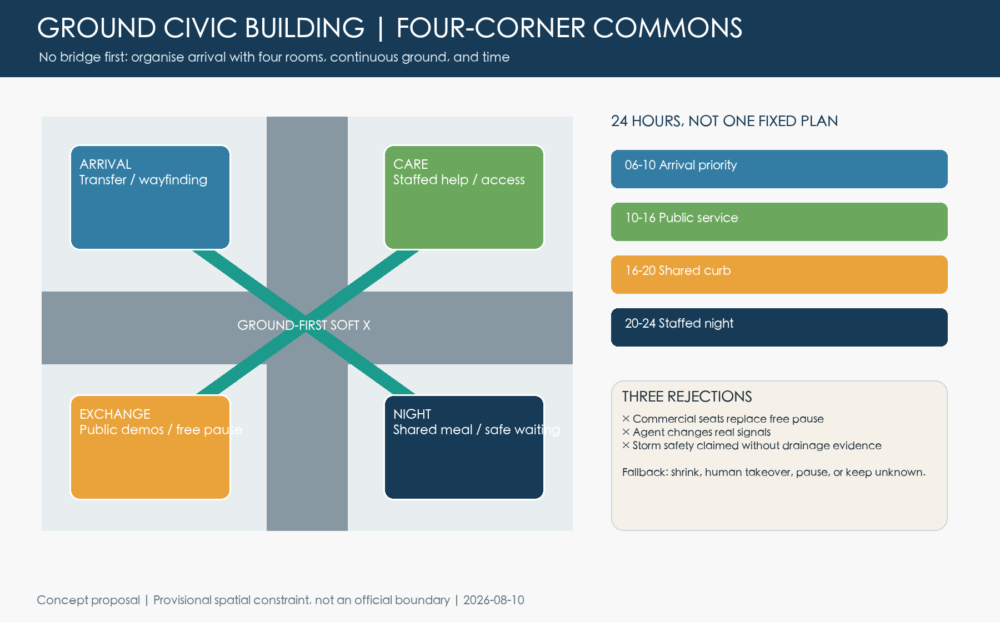

The three areas are no longer differentiated by one landmark each. Zhongzhiyuan becomes a garden innovation district linking an open-stack commons, Benchmark Garden, and north gateway to research, standards, and ecological governance. AI Origin becomes a near-campus district linking an open transfer court, Shared Eave, and life loop to research, translation, and everyday life. Dazhongsi becomes an urban innovation district linking Four-Corner Commons, a south park foyer, and station-city services to AI-native business, global exchange, and public arrival. Each has a different data gate and risk profile. [metric:key_area_count] [data:geometry/phasing.geojson#UP-09] [depth:three_key_area_detailed_design]

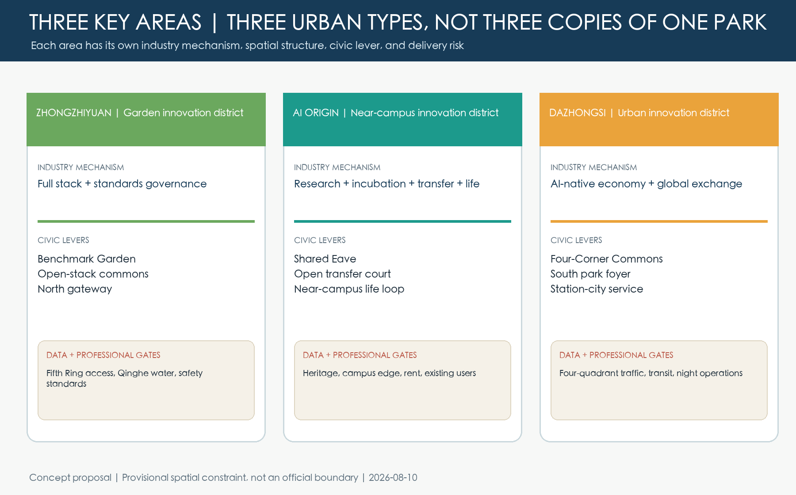

## AI Ecosystem, Personas, and Scenarios

Six personas represent researchers, young founders and international talent, older residents, children and carers, wheelchair and blind users, and public-service and maintenance staff. They describe service friction, not personal profiles. [metric:persona_count] [source:SRC-HAIDIAN-AI-ELDERCARE]

Ten scenarios include three industrial tests—green-AI energy comparison, edge-device interoperability, and controlled low-speed robot co-movement—plus eave service routing, multilingual knowledge translation, non-digital elder support, shade and waiting comfort, time-shared curb negotiation, evidence-based heritage guidance, and public-facility maintenance. Every scenario must publish six fields: public problem, minimum data, human owner, offline fallback, stop threshold, and learning receipt. [metric:scenario_count] [metric:agent_service_contract_fields]

The Agent is not a citywide controller but ten bounded collaboration roles. A spatial Agent reads only de-identified facility conditions and human reports, then suggests a maintenance order; a service Agent supports multilingual questions, on-site routing, and appointments but cannot refuse an offline service; a mobility Agent issues conflict warnings and time-sharing options while on-site staff and competent authorities retain every final decision. Each trial publishes a learning receipt: whether the problem improved, who benefited, who may have been missed, what failed, and whether the next cycle should continue or exit. AI innovation is therefore judged by its ability to help public problems be found, deliberated, and reversibly improved—not by the model name alone.

## Land Use, Building Scale, and Adaptation

Auditable concept land-use zones remain complete and non-overlapping, but design attention shifts to public ground and porous edges. Building action follows use first, adaptation second, construction last; structural, fire, heritage, carbon, rent, and displacement evidence is required before any building-level decision. [data:geometry/land_use.geojson#LU-001] [depth:retain_renovate_demolish]

The Shared Eave must be independent, self-supporting, reversible, and set away from heritage fabric. Four-Corner Commons prioritises the ground and existing frontages; bridges, tunnels, underground works, and permanent structures remain subjects for specialist studies. [standard:MOHURD-URBAN-DESIGN-MEASURES] [depth:height_massing_character]

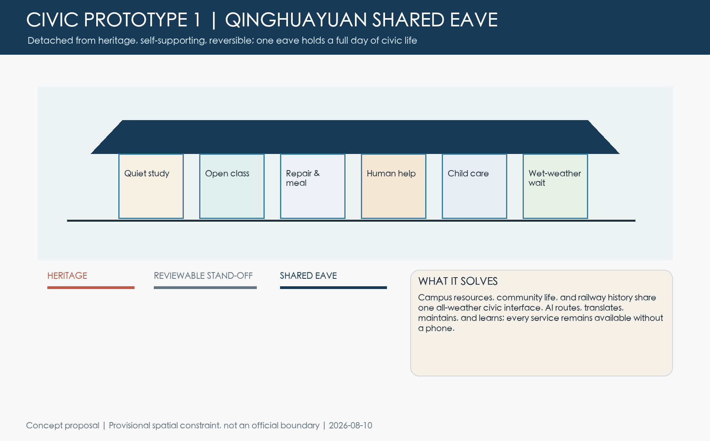

## Mobility, Rail, Municipal Systems, and Public Services

Priority runs from walking and wheelchairs to cycling, transit, service traffic, and finally private through-movement. Four-Corner Commons proposes a ground-first soft X and four open corner rooms, sharing time among crossing, parking, pickup, delivery, and events. It neither controls traffic signals nor claims engineering feasibility. [data:geometry/roads.geojson#ROAD-003] [depth:traffic_rail_slow_parking]

Municipal and AI systems retain human takeover, offline processes, named maintenance, and recovery. Public service must never become scan-only: toilets, water, seating, shelter, cycle parking, and staffed help form the minimum kit. [depth:municipal_new_infrastructure] [source:SRC-ZHONGGUANCUN-PUBLIC-SPACE]

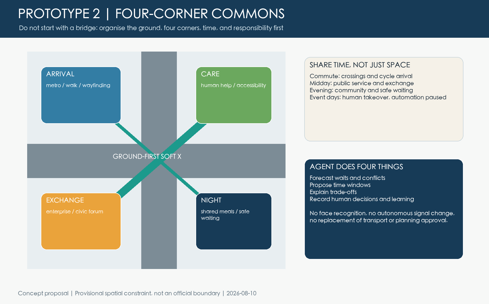

Twelve civic journeys move the review from 'a facility exists' to 'a person can complete a task'. Shared Eave tests a phone-free winter visit, a rainy wheelchair route, care after class, a first visit during outage, and one-bay maintenance. Four-Corner Commons tests peak transfer, cycle conflict, free pause, late-night arrival, event-day outage, and storm demand. These are Agent test inputs, not a public survey. [source:SRC-BEIJING-ACCESSIBILITY-2021] [metric:citizen_journey_count]

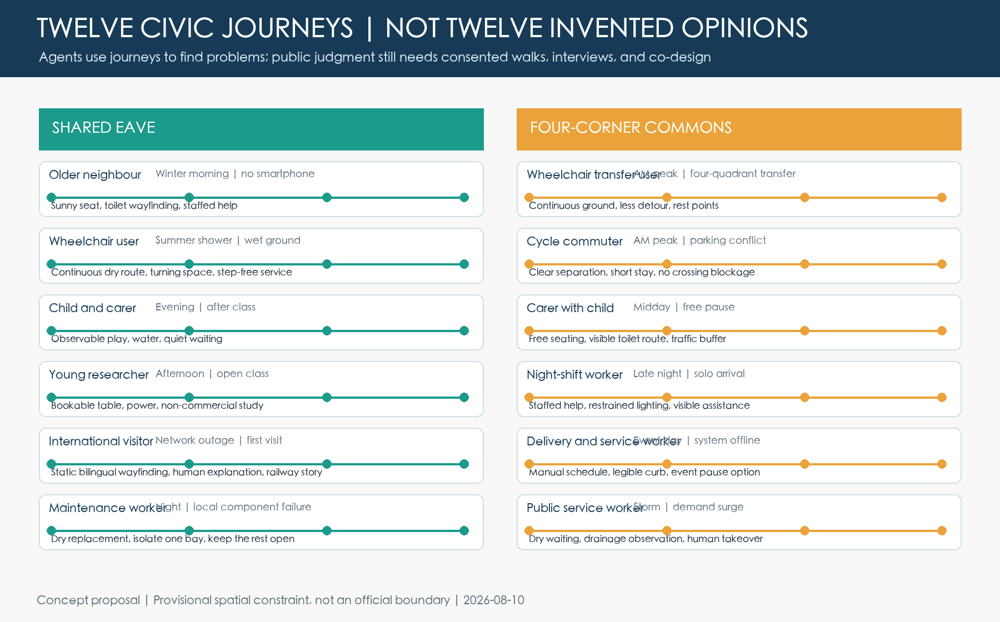

v4 treats mobility, blue-green space, utilities, and public service as four networks sharing one responsibility chain. A walking and wheelchair spine plus companion cycle line support north-south continuity; five seams support campus-park-river-station links; western and eastern access chains organise transit exchange. Water, energy, edge compute, and maintenance are not drawn as unverified engineering lines; they enter each work package's data gate and human-takeover checklist. [metric:mobility_link_count] [data:geometry/roads.geojson#ROAD-005] [depth:municipal_new_infrastructure]

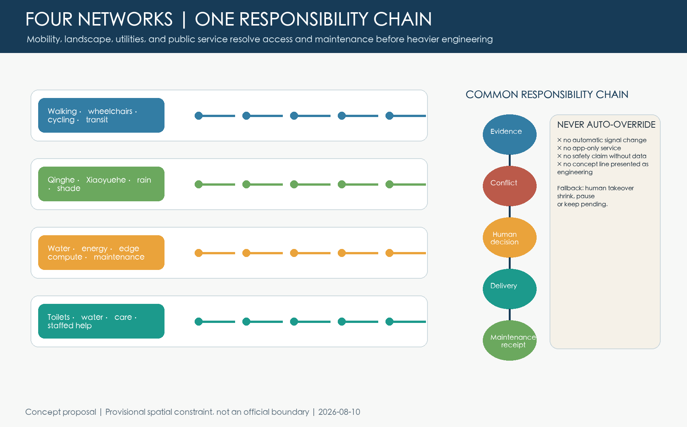

## Blue-Green Space, Public Realm, and Character

Haidian's character is a set of choices rather than a material palette: green space serves everyday life, technology removes friction, and heritage enters long-term use. Railway restraint, durability, and maintainability guide the form; cyberpunk neon, giant screens, and novelty landmarks are avoided. [source:SRC-HAIDIAN-GREEN-PLAN] [depth:blue_green_public_space]

The blue-green structure combines the longitudinal heritage-green spine with transverse campus-community-river-station links. Concept green-space and public-space layers are recalculated separately; rain gardens, tree arrays, and permeable paving are not misreported as statutory green land. The formal stage still requires a tree survey, waterlogging points, sponge-city targets, sunlight and wind studies, habitat evidence, and underground utilities. Shared Eave first uses existing shade and reversible shelter; Four-Corner Commons makes continuous accessible ground, drainage direction, dark-zone lighting control, and wet-weather waiting part of its minimum service kit. [data:geometry/green_space.geojson#GREEN-001] [data:geometry/public_space.geojson#PUBLIC-001]

AI should become almost invisible. People first notice fewer detours, less exposure to rain, a place to sit, and a person to ask. Microclimate guidance uses aggregated environmental data only and cannot replace tree, drainage, or structural design. If the technology stops, seating, shelter, water, toilet wayfinding, and staffed help remain usable.

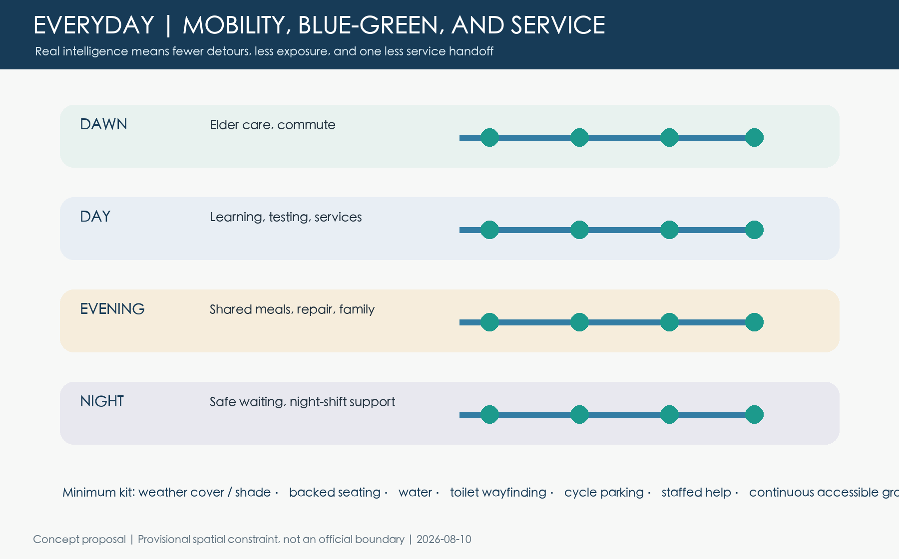

The Shared Eave shifts from one roof to a four-season civic climate: winter sun forms warm bays; spring rain drains to an outer rain garden; summer uses existing tree canopy first; autumn opens tables for public learning. Real comfort, snow and wind loads, roots, and drainage still require professional models and field data, so v3 claims no performance result. [source:REF-WHO-AGE-FRIENDLY] [metric:sheltered_waiting_coverage]

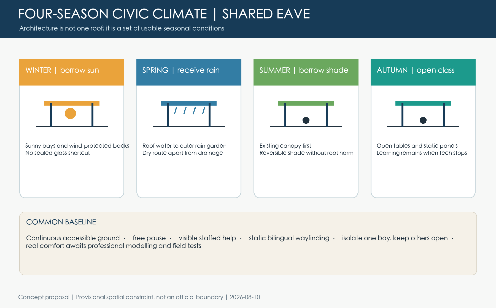

The Common Eave identity grows from three repeated civic practices rather than a technology skin: railway movement and time, Zhongguancun experimentation and openness, and AI culture based on explanation, responsibility, and exit. Lines represent railway time and cross-city seams, planes represent free shelter, and points represent staffed help and contribution honour. Navy, Qinghe green, and signal gold replace corporate-logo collage and cyber-neon. [source:SRC-HERITAGE-PROTECTION-2021] [depth:height_massing_character]

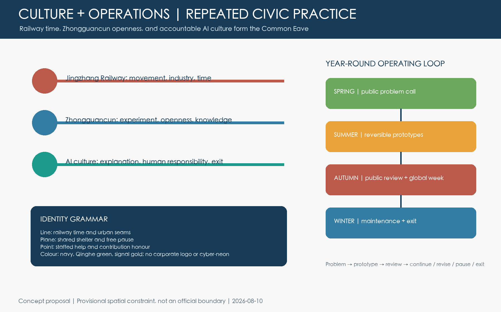

## Projects, Policy, and Phasing

Six concept work packages organise implementation: the minimum Common Eave kit, Qinghe Benchmark Garden, Qinghuayuan Shared Eave, Dazhongsi Four-Corner Commons, transverse campus-community-river-station links, and the Agent Service Contract. Phase 0 verifies geometry, flow, accessibility, heritage, rights, and maintenance; Phase 1 tests reversible furniture, wayfinding, and staffed service; Phase 2 professionally deepens the flagships; Phase 3 scales only components with demonstrated public value. [data:geometry/phasing.geojson#PHASE-001] [depth:phasing_implementation]

The annual operating cycle is spring problem collection, summer prototypes, autumn public review, and winter maintenance learning. Each trial can continue, change, pause, or exit. [source:CASE-HELSINKI-TESTBED] [depth:renewal_project_list]

Each flagship uses four gates: a data gate for geometry, survey, rights, heritage, mobility, trees, drainage, and user baselines; a reversible pilot of furniture, wayfinding, staffed service, and temporary shelter; professional architecture, structure, fire, mobility, utility, landscape, accessibility, and heritage design; and an expansion gate that replicates only proven, maintainable components. Capital and annual operating costs remain unknown until place, service scope, and responsible parties are defined. [metric:annual_operations_cost_cny] [depth:phasing_implementation]

Each of the ten work packages passes four gates: a data gate for boundary, rights, heritage, survey, flows, trees, and utilities; a reversible pilot limited to furniture, wayfinding, staffed service, and temporary shelter; professional planning, architecture, mobility, utility, landscape, accessibility, and operations design; and a public-value review asking who benefits, who is missed, who maintains, and whether to exit. P1/P2/P3 indicate research priority only, not committed investment or development timing. [data:geometry/phasing.geojson#UP-01] [metric:renewal_work_package_count] [depth:phasing_implementation]

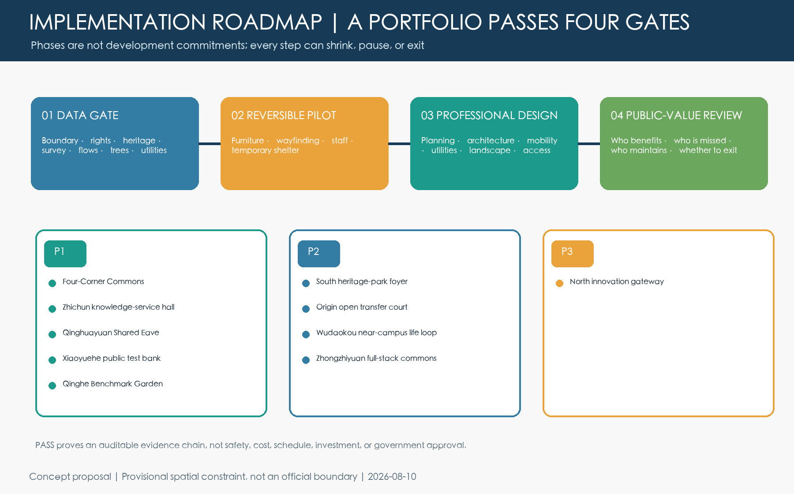

Actors are separated by decision authority. Government and responsible departments confirm statutory geometry and public duties; professional teams deepen planning, architecture, mobility, utilities, heritage, and accessibility; universities and companies provide real research and scenario needs; communities, residents, and front-line maintainers join walks and reviews; Agents organise evidence and expose conflict only. Every stage uses the same evaluation indicators: phone-free service, completed accessible journeys, protected free pause, closed maintenance tickets, and intercepted negative samples. Satisfaction, cost, and mobility improvement remain pending without credible baselines.

2026-2030 is the adopted Fifteenth Five-Year Plan delivery window: establish demographic, flow, climate, rights, and maintenance baselines; run three testbeds at Qinghe Benchmark Garden, Xiaoyuehe Public Test Bank, and Four-Corner Commons; deepen the two flagships; and publish annual learning receipts. 2031-2035 is only a 2035 adaptation window. As of August 2026 no formal Sixteenth Five-Year Plan is available for this proposal; retention, revision, scaling, or exit must follow formal plans and evaluation. [source:SRC-HAIDIAN-15TH-2026] [source:SRC-BEIJING-MASTER-2035] [metric:policy_horizon_count]

v5.2 adds six responsibility-ledger records covering lead class, permit gate, relative cost band, O&M, phase, and stop rule. S/M/L are not estimates. Without statutory applicants, professional costs, approved O&M budgets, and representative public mandate, concept maturity cannot be presented as construction readiness. [metric:responsibility_ledger_record_count]

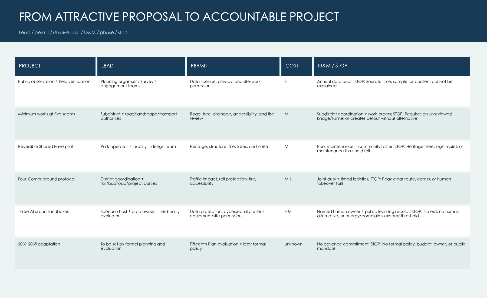

## Metrics, Recalculation, and Compliance

The official intake, professional, and visual checks pass. A dependency-free script also checks structure and obvious topology, but Shapely and PyProj are not installed in this runtime, so the repository's professional spatial review is not claimed. Provisional site, green, public-space, and footprint values are reproducible; FAR, height, setbacks, and statutory green ratios remain unknown. Official geometry will trigger recalculation of nine layers, metrics, figures, HTML, and PDFs. [metric:site_area_sqm] [depth:metrics_recalculation]

From a jury perspective, completeness is not enough. The two flagships must connect brief alignment, originality, AI-planning innovation, feasibility, inclusion, risk compliance, and expression into one evidence chain. [source:SRC-PEER-CATALOG-20260810] [metric:flagship_public_design_count]

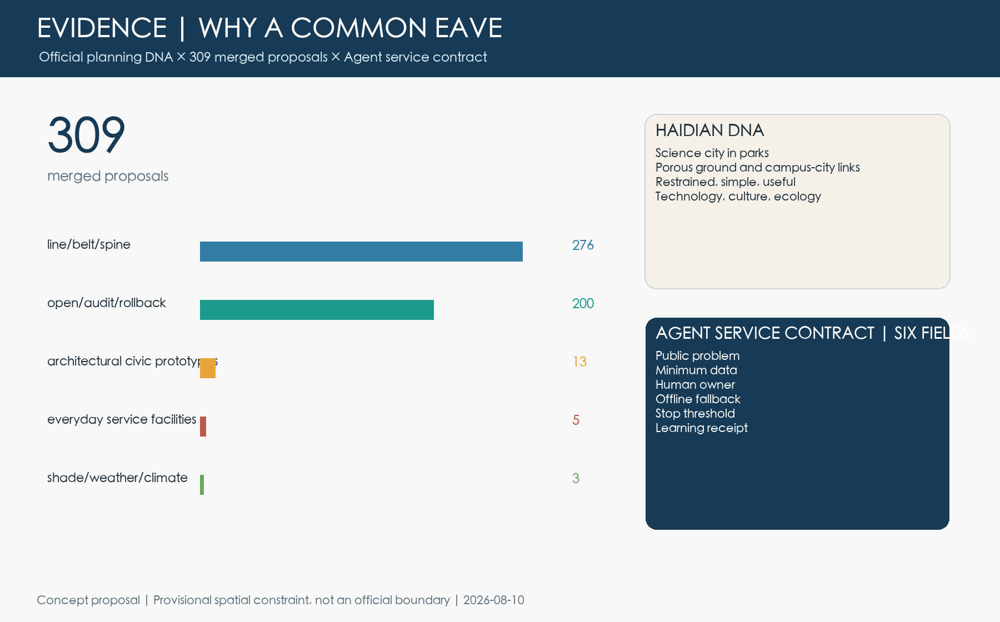

The studio contains 12 tasks and 3 negative samples; every task records a valid dispatch schema and complete audit fields. These values are recomputed from simulation.json and prove package replayability only. Average detour reduction, shelter coverage, public acceptance, and operating cost remain unknown. [metric:simulation_success_rate] [metric:tool_schema_pass_rate] [metric:audit_completeness]

v4 adds package-recomputable counts for twenty planning units, five cross-city seams, ten renewal packages, twelve building-interface types, nine mobility links, and eleven green-network components. They prove that the planning system exists beyond the narrative. Because official geometry, parcels, controls, surveyed buildings, and engineering baselines remain missing, every ratio supports concept comparison only and is not a statutory conclusion. [metric:planning_unit_count] [metric:cross_city_seam_count] [metric:green_network_component_count]

v5 audits the six established goals. v3-v4 already spatialised coordination, everyday life, industrial learning, civic climate, and risk control. This pass fills the weakest gap—the Beijing-Haidian regional duty—and connects all six goals to spatial or structured evidence. The next pass should prioritise field demographics, anonymous flows, climate, facilities, and maintenance baselines rather than adding concepts. [metric:strategic_goal_implemented_count] [metric:policy_translation_count]

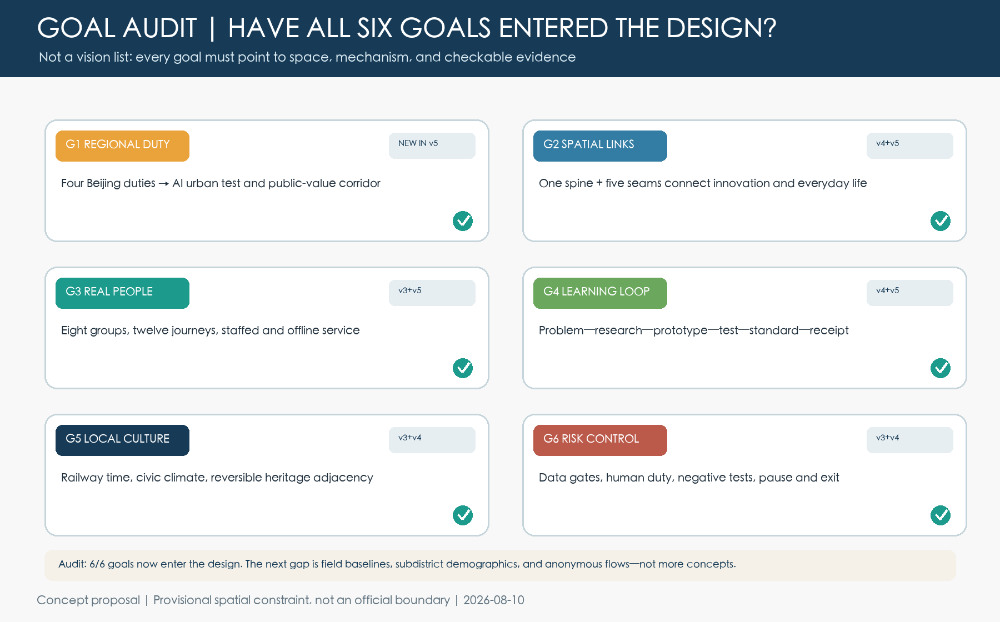

v5.2 retains and rechecks the structure, required properties, boundary match, coverage, overlap, and containment of all nine required GeoJSON files. The provisional source records a prior EPSG:4548 area of 11,412,825 sqm; this run's dependency-free approximation is 11,399,523 sqm, a roughly 0.117% difference, and both only check the brief's approximate 11.4 sq km. The twenty concept land-use units cover it without positive-area overlap and all design features are clipped within it. Yet the package contains 67 agent-generated design features and zero public-observation features, while twelve building polygons are interface types rather than surveyed footprints. It is a recalculable concept skeleton, not existing-condition GIS, statutory control, or engineering alignment. [metric:geojson_design_feature_count] [metric:geojson_public_observation_feature_count] [data:geometry/site_boundary.geojson#SITE-001]

The nine required GeoJSON files remain design layers and therefore still contain zero public-observation features. To respect the repository file limit, the 1,248 P-tier observation cells are split across `visual/assets/worldcover-grid-01.json` to `04.json`, preserving the distinction between observation and proposal. [metric:geojson_public_observation_feature_count] [metric:public_observation_grid_cell_count]

## Risk, Copyright, and Compliance

This is an open co-creation proposal, not an approved plan. The Shared Eave raises heritage, fire, rights, and operating questions; Four-Corner Commons raises road, rail, fire, and commercial-interface questions. Real implementation requires specialist studies, public engagement, and statutory procedures. [source:SRC-2026-BJ-GH-QUAL-PREANNOUNCEMENT] [depth:risk_missing_data]

Five gates govern spatial, operating, data, algorithmic, and social risks. The spatial gate requires formal geometry, rights, survey, heritage, fire, structure, mobility, and utility evidence; the operating gate requires named staffing, maintenance, insurance, procurement, and long-term funding; the data gate enforces minimisation, purpose limitation, retention periods, and access logs; the algorithmic gate requires offline fallback, human takeover, stop thresholds, and error appeal; the social gate checks digital exclusion, accessibility, risks to children and older people, rent effects, and displacement of existing users. Failure at any gate means the trial must shrink, wait, or exit. [data:risk.json#equity_inclusion]

Diagrams, layouts, and spatial data are deterministically generated locally. Two clearly labelled AI-generated atmosphere images communicate human-scale experience only; they are not site photographs, engineering locations, or dimensional evidence. No third-party photographs, maps, marks, or portraits are embedded. Official sources are linked as method evidence; neighbouring proposals are used only for theme-gap statistics, without copying their text, figures, or mechanisms. The 309-item catalog analysis describes keyword distribution only; it is not a jury opinion, quality ranking, or stable future total. Display permissions, attribution, allowed uses, and prohibited inferences are recorded in sources.json and the copyright statement.

## References

Evidence is organised in four layers. First, the call announcement, Agent taskbook, review rubric, and provisional repository geometry define the three scales, required package, evidence contract, and formal data gaps. Second, Haidian's district plan, green-space plan, and urban-renewal guide establish compact renewal, a science city in parks, porous public ground, campus-city sharing, and human-friendly AI. Third, the Qinghua East Road civic-room project, Zhongguancun Avenue public realm, and AI-plus-eldercare policy records test the reality of transverse links, all-age service, and non-digital fallback. Fourth, five international cases and the 309-item public proposal catalog support mechanism translation and differentiation analysis only. [source:SRC-HAIDIAN-DISTRICT-PLAN] [source:SRC-HAIDIAN-GREEN-PLAN] [source:SRC-HAIDIAN-URBAN-RENEWAL]

Each item in sources.json records its publisher, URL, permitted use, and prohibited inference. Policy cannot replace fieldwork; a public project cannot prove the feasibility of this proposal's location; international cases cannot be transplanted as governance rules; and the proposal catalog cannot rank other work. Official boundaries, controls, heritage limits, building surveys, flows, utilities, trees, rights, population, and operating costs remain pending. Once obtained, they trigger spatial recalculation, compliance and risk gates, and regeneration of all figures and PDFs. [source:SRC-2026-BJ-GH-QUAL-PREANNOUNCEMENT] [source:CASE-SEOUL-AI-HUB]
