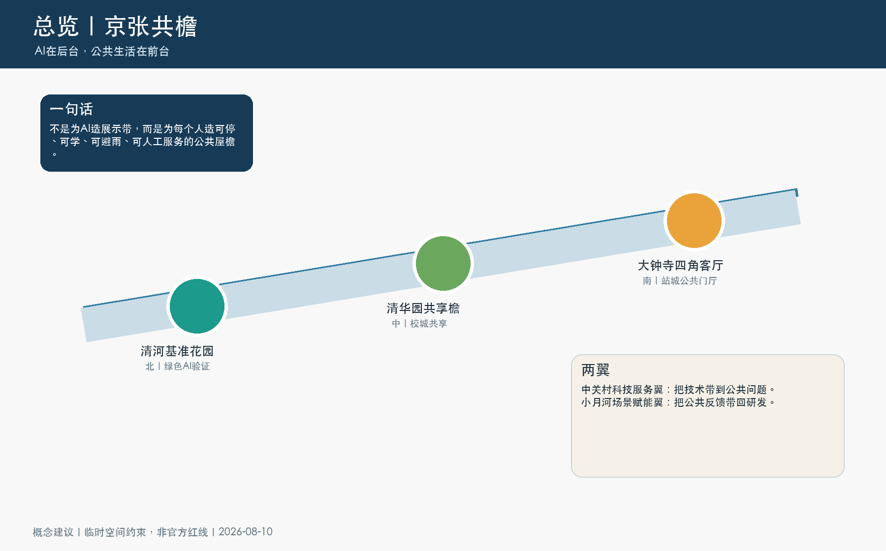
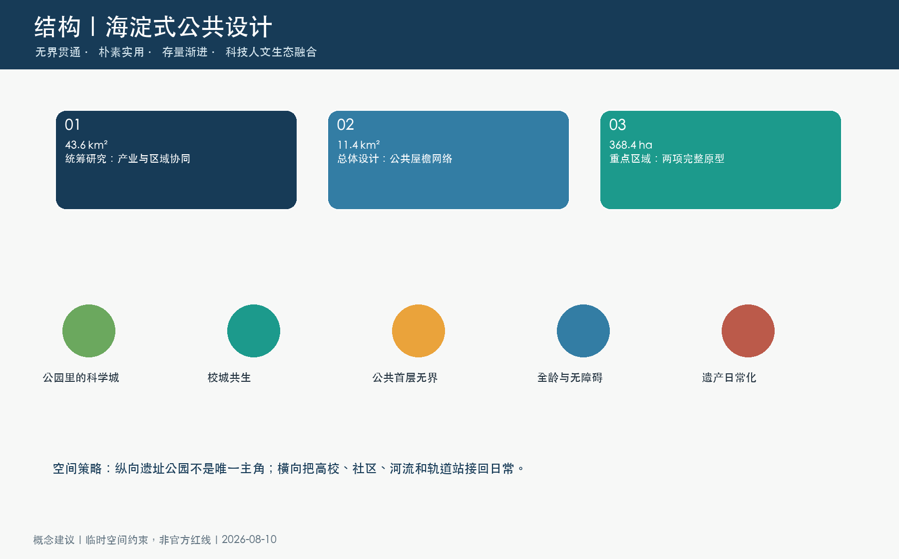
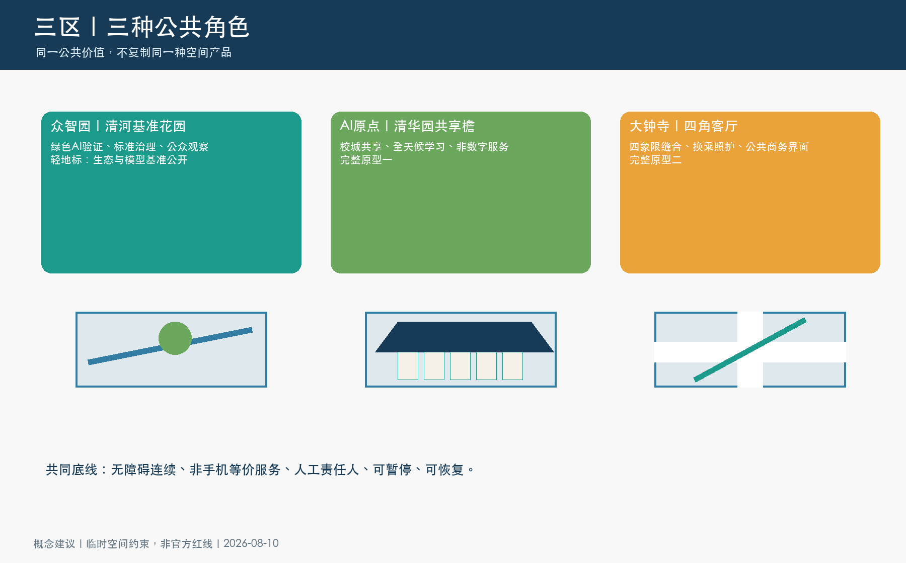
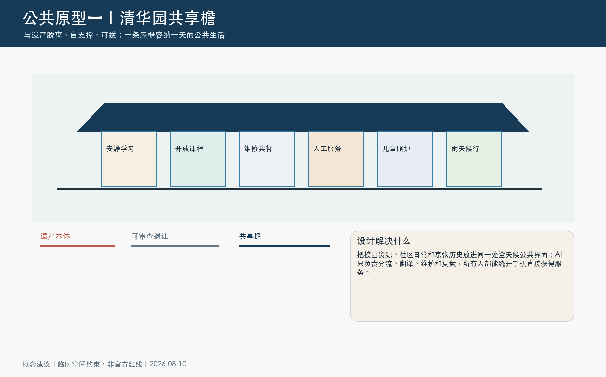
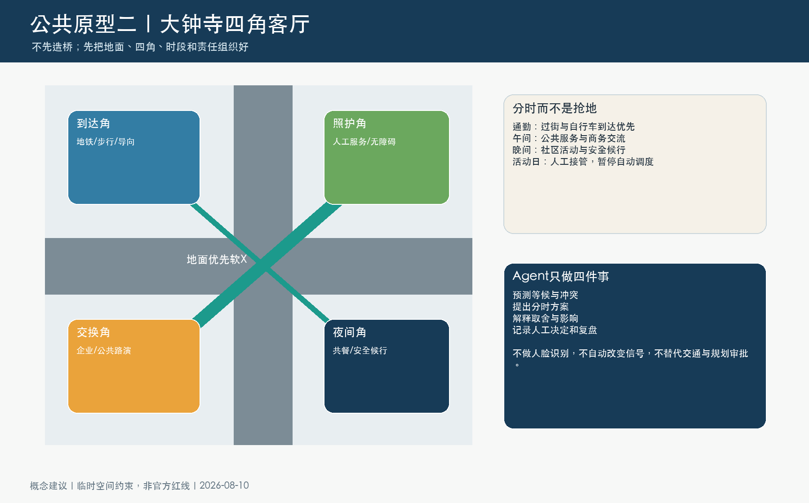
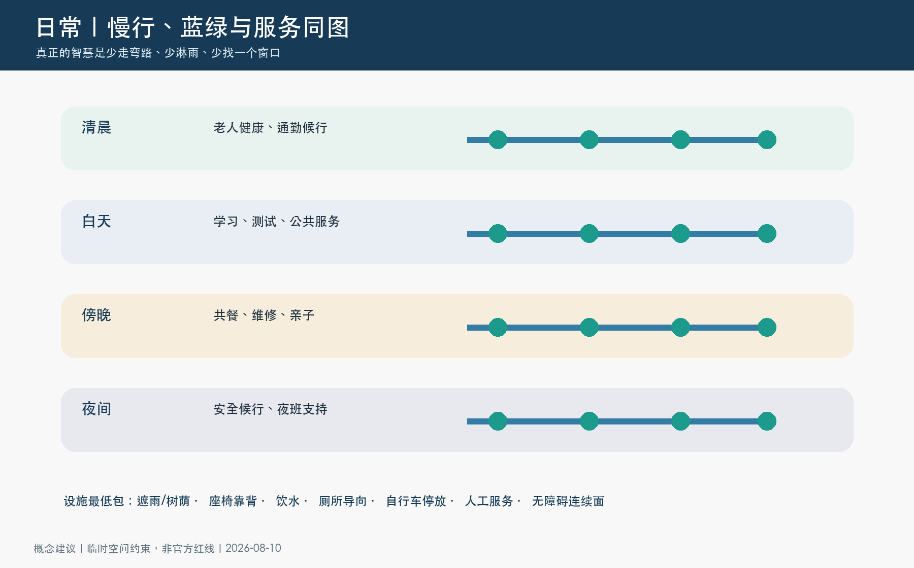
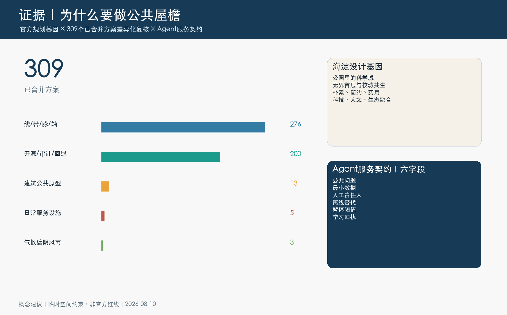

# 京张共檐：把AI创新带做成一间九公里的公共屋檐
## 设计依据与资料清单

本轮不从通用的“未来AI城市”想象出发，而先复核海淀已有公共规划。分区规划强调减量集约与科技、人文、生态融合；园林绿化专项规划提出“森林里的中关村，公园里的科学城”；城市更新指引强调无界首层、拆墙透绿、全龄共享与人机友好。清华东路“学院路会客厅”和中关村大街公共空间更新进一步证明，海淀倾向用渐进、实用、可共享的公共空间连接高校、社区、公园和商业，而不是用一座孤立巨构代表创新。[source:SRC-HAIDIAN-DISTRICT-PLAN] [source:SRC-HAIDIAN-GREEN-PLAN] [source:SRC-HAIDIAN-URBAN-RENEWAL]

项目边界和三处重点区仍是临时约束范围，只用于概念生成、面积复算和自检；共享檐与四角客厅只确定空间类型和运营逻辑，不指认权属地块、道路工程或文保改造。[source:SRC-PROVISIONAL-BOUNDARIES-2026] [depth:existing_conditions_diagnosis]

## 三层范围工作框架

统筹研究范围回答“海淀的AI优势如何成为公共价值”；总体设计范围回答“九公里遗址公园如何从纵向绿带变成纵横连通的公共房间”；三处重点区回答“怎样把概念做成可画、可测、可运营的原型”。正式边界到位后，所有图层、比例、图纸和指标必须整包重算。[source:SRC-2026-BJ-GH-QUAL-PREANNOUNCEMENT] [depth:three_level_scope_framework]

“京张共檐”不是沿九公里连续盖顶，而是一套共同空间语法：每个关键节点至少能够停留、避雨或遮荫、坐靠、饮水、找到厕所、停自行车、获得人工帮助，并为行动不便者保留连续地面。这些基本服务比屏幕和机器人更优先。[data:geometry/public_space.geojson#PUBLIC-001] [depth:overall_spatial_structure]

## 统筹研究范围产业与未来城市研究

对309个已合并方案的公开目录复核显示，276个方案仍围绕“线/带/脉/轴”组织叙事，200个强调开源、审计或回退；只有13个在摘要中触及建筑型公共原型，5个明确回应厕所、饮水、座椅、夜间或停车等日常设施，3个突出遮阴、风雨或微气候。这不是质量排名，但说明“完整公共空间原型”是有证据的差异化缺口。[source:SRC-PEER-CATALOG-20260810] [metric:peer_catalog_count_reviewed]

五个国际案例只转译机制：AI Singapore的真实问题到PoC、Helsinki的城市试验场、Mila的研究共同体、Amsterdam的公共记录、Seoul AI Hub的人才支持。海淀的转译不是复制科技园形象，而是把技术测试、公共服务、人工责任和长期运营放入同一空间。[source:CASE-AI-SINGAPORE-100E] [source:CASE-HELSINKI-TESTBED] [source:CASE-MILA-PARTNERSHIPS]

## 总体设计范围城市更新与控规深度城市设计

总体结构从“一条主轴”调整为“纵向遗产绿脊 + 横向校城河站链接 + 三座公共地标”。既有建筑与首层界面优先适应性使用，可逆构件先行；容积率、高度、道路红线、桥隧和市政容量全部待正式资料和专项论证，不把概念图伪装成控规或工程图。[standard:MNR-LAND-USE-CLASSIFICATION-GUIDE] [depth:development_intensity_controls]

三座地标都拒绝巨构：北端清河基准花园公开绿色AI与生态养护的聚合结果；中段清华园共享檐承接校城共享；南端大钟寺四角客厅成为站城到达和智能经济的公共门厅。[metric:landmark_count] [depth:blue_green_public_space]

## 重点区域详细设计

众智园以“清河基准花园”组织绿色AI全栈测试、标准讨论、公众观察和生态养护，但不公开商业秘密或个人数据。AI原点社区以“清华园共享檐”把安静学习、开放课程、维修共餐、儿童照护、人工服务和雨天候行放进与遗产脱离的可逆结构。大钟寺以“四角客厅”先解决四象限地面联系、无障碍换乘、自行车停放和夜间有人服务，再讨论更重的站城工程。[data:geometry/key_areas.geojson#PROV-KEY-001] [depth:three_key_area_detailed_design]

两项旗舰公共设计都完整记录问题、空间动作、全天运营、Agent责任、离线替代和专业深化触发条件；它们是参考方案，不构成地块、道路或投资结论。[metric:flagship_public_design_count] [data:geometry/key_areas.geojson#PROV-KEY-003]

## AI 创新生态、人才画像与 AI+ 场景

六类画像是研发人员、青年创业者和国际人才、周边老年居民、儿童与照护者、轮椅与视障使用者、公共服务与维护人员。画像只表达服务摩擦，不用于个体识别或商业定向。[metric:persona_count] [source:SRC-HAIDIAN-AI-ELDERCARE]

十个场景包括三项产业测试——绿色AI全栈能效对照、端侧设备互操作、低速机器人受控共行——以及共享檐服务分流、多语知识共译、老年人非数字服务陪伴、遮阴与等候舒适提示、四象限分时路缘协商、京张史料证据导览、公共设施维护闭环。每项必须填写“公共问题、最小数据、人工责任人、离线替代、暂停阈值、学习回执”六字段后方可进入试点讨论。[metric:scenario_count] [metric:agent_service_contract_fields]

Agent不是一只包办城市的“总管”，而是十个有边界的协作岗位。空间Agent只读脱敏后的设施状态和人工报修，给维护人员排出建议次序；服务Agent只做多语问答、现场分流和预约辅助，无法拒绝线下服务；交通Agent只形成冲突预警与分时建议，最终决定始终由现场人员和主管部门作出。每个试点公开一张学习回执：问题是否缓解、谁受益、谁可能被遗漏、发生过什么失败、下一轮继续还是退出。这样，AI创新从“用了什么模型”转为“能否让公共问题被持续发现、共同判断并可逆地改进”。

## 用地、建筑规模与拆改留方案

概念用地仍以完整、无重叠的研究、绿地、服务和社区分区支撑复算，但方案的设计重心转向公共首层与开放边界。建筑判断遵循“先使用、再适配、后建设”：先调查现有服务与使用者，再评估结构、消防、文保、碳排、租金和迁移影响；没有证据不做逐栋拆改留结论。[data:geometry/land_use.geojson#LU-001] [depth:retain_renovate_demolish]

清华园共享檐必须与遗产本体脱离、自支撑、可逆；大钟寺四角客厅优先使用地面和既有首层，任何桥、隧、地下空间或永久构筑物都留给专业专项论证。[standard:MOHURD-URBAN-DESIGN-MEASURES] [depth:height_massing_character]

## 交通、轨道、市政与公共服务设施

交通优先序是步行与轮椅、自行车、公共交通、服务交通、私人穿行。大钟寺“四角客厅”提出地面优先的软X联系和四个开放角厅，通过时段分配减少过街、停车、接送、配送和活动之间的冲突；它不自动改变交通信号，也不宣称工程可行。[data:geometry/roads.geojson#ROAD-003] [depth:traffic_rail_slow_parking]

市政与AI设施必须留下人工接管、离线流程、维护责任和故障恢复。公共服务不得变成“只扫码才能用”，厕所、饮水、座椅、遮雨、自行车停放和人工服务是最低包。[depth:municipal_new_infrastructure] [source:SRC-ZHONGGUANCUN-PUBLIC-SPACE]

## 蓝绿空间、公共空间与城市风貌

海淀的风格不是一套材料表，而是一种取舍：绿地先服务日常，科技先解决摩擦，文化进入长期使用。方案用铁路基础设施的节制、耐久和可维护性作为形态语言，避免赛博霓虹、巨屏和网红装置；新增构件以暖灰、深蓝、清河绿和少量信号金组织，夜景克制并保留暗环境。[source:SRC-HAIDIAN-GREEN-PLAN] [depth:blue_green_public_space]

蓝绿策略由纵向遗产绿脊和横向校城河站连接共同构成。概念图层中的绿地与公共空间分别复算，不把雨水花园、树阵或可渗透铺装虚报成法定绿地；正式阶段还需补树木普查、积水点、海绵指标、日照风环境、生境和地下管线。共享檐优先利用既有树荫和可逆遮蔽，四角客厅以连续无障碍地面、排水坡向、照明暗区控制和雨天候行组成最低服务包。[data:geometry/green_space.geojson#GREEN-001] [data:geometry/public_space.geojson#PUBLIC-001]

AI最好“无感”：用户首先感到少淋雨、少绕路、有人可问、能坐下来，之后才知道后台Agent在做分流、翻译、维护与复盘。微气候提示只使用聚合环境数据，不能替代现场树木、排水和结构设计；若技术停止，座椅、雨棚、饮水、厕所导向和人工服务仍然可用。

## 更新项目清单、实施政策与分期计划

六个概念工作包为：公共屋檐最低包、清河基准花园、清华园共享檐、大钟寺四角客厅、横向校城河站链接、Agent服务契约。阶段0补齐边界、客流、无障碍、文保、权属和维护基线；阶段1用可逆家具、导视和有人服务验证需求；阶段2深化两项旗舰原型；阶段3只扩展被证明有公共价值的组件。[data:geometry/phasing.geojson#PHASE-001] [depth:phasing_implementation]

年度运营不是一次节庆，而是“春季公共问题征集—夏季小规模原型—秋季公开评审—冬季维护复盘”。每项试点都有继续、修改、暂停或退出四种结果。[source:CASE-HELSINKI-TESTBED] [depth:renewal_project_list]

## 指标体系、面积复算与合规矩阵

空间审查已使用jsonschema、Shapely和PyProj完成；临时总体面积、绿地、公共空间和建筑基底均可由GeoJSON复算，容积率、高度、退线和法定绿地率保持未知。官方边界替换时，九个图层、指标、图件、HTML和PDF同时重算。[metric:site_area_sqm] [depth:metrics_recalculation]

评委视角的自评重点不是“有没有填满任务”，而是两项公共设计是否在任务契合、原创性、AI规划创新、可实施性、包容性、风险合规和表达完整度上形成同一条证据链。[source:SRC-PEER-CATALOG-20260810] [metric:flagship_public_design_count]

## 风险、版权与合规说明

本方案是开放共创建议，不是获批规划。共享檐可能触及遗产、消防、权属与运营责任；四角客厅可能触及道路交通、轨道、消防和商业界面。任何真实落地都必须先完成专业专项、公众协商和法定程序。[source:SRC-2026-BJ-GH-QUAL-PREANNOUNCEMENT] [depth:risk_missing_data]

风险按“空间、运营、数据、算法、社会影响”五类进入闸门。空间闸门要求正式边界、权属、测绘、文保、消防、结构、交通和市政意见齐备；运营闸门要求明确值守、维修、保险、采购和长期资金；数据闸门执行最小收集、目的限定、保存期限和访问记录；算法闸门要求离线替代、人工接管、暂停阈值和错误申诉；社会影响闸门检查数字排斥、无障碍、儿童与老年人风险、租金及原有使用者迁移影响。任何一闸不通过，试点只能缩小、延期或退出。[data:risk.json#equity_inclusion]

图解、排版与空间数据由本地程序确定性生成；另有两张明确标注的AI概念氛围图，只表达人的使用体验，不是现场照片、工程落位或尺寸证据。包内不嵌入第三方照片、地图、商标或肖像。公开案例和海淀政策仅以链接文字作为方法依据；相邻参赛方案只用于主题差异化统计，不复制其文本、图件或机制。309项目录统计只说明关键词分布，不代表评委意见、质量排序或未来稳定总量。公开展示许可、署名方式、来源允许用途和禁止推断均在sources.json与版权声明中记录。

## 参考资料

资料分为四层。第一层是征集公告、Agent任务书、评审标准和仓库临时边界，用于确认三层范围、必交结构、证据契约和不可越过的正式资料缺口；第二层是海淀分区规划、园林绿化专项规划和城市更新实施指引，用于提炼减量集约、公园里的科学城、无界首层、校城共享和人机友好的地方取向；第三层是清华东路学院路会客厅、中关村大街公共空间和AI+养老政策资料，用于验证横向连接、全龄服务及非数字替代的真实问题；第四层是五个国际案例和309项公开投稿目录，只用于机制转译与差异化统计。[source:SRC-HAIDIAN-DISTRICT-PLAN] [source:SRC-HAIDIAN-GREEN-PLAN] [source:SRC-HAIDIAN-URBAN-RENEWAL]

每条来源在sources.json中记录发布机构、URL、允许用途和禁止推断。政策文字不能替代现场调查，公开项目不能证明本方案具体落位可行，国际案例不能直接套用治理制度，参赛目录不能用来评价他人优劣。正式边界、控规、文保范围、建筑测绘、客流、管线、树木、权属、人口和运营成本仍是待补资料；取得后应重新运行空间复算、合规矩阵、风险闸门并更新所有图件与PDF。[source:SRC-2026-BJ-GH-QUAL-PREANNOUNCEMENT] [source:CASE-SEOUL-AI-HUB]
