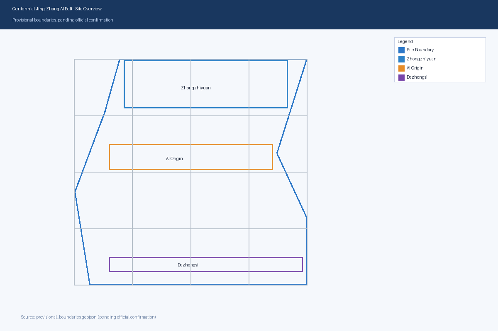
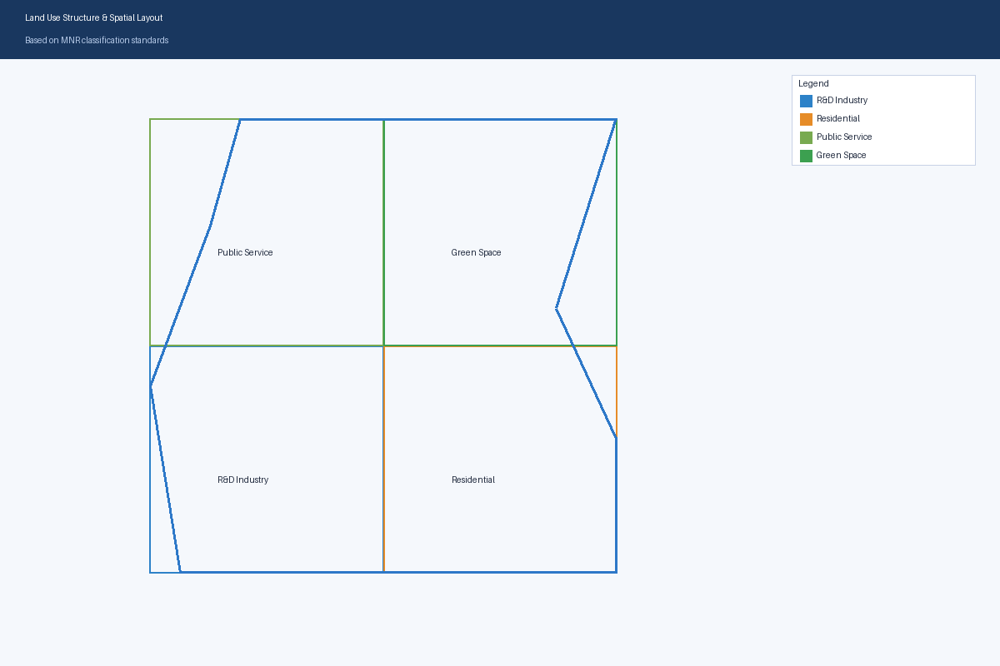
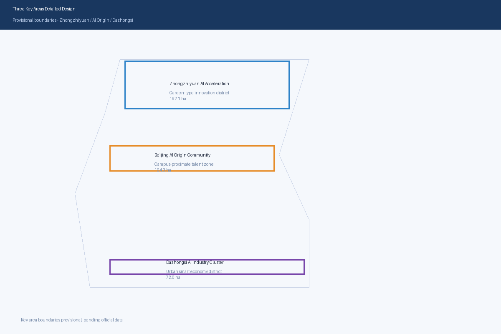
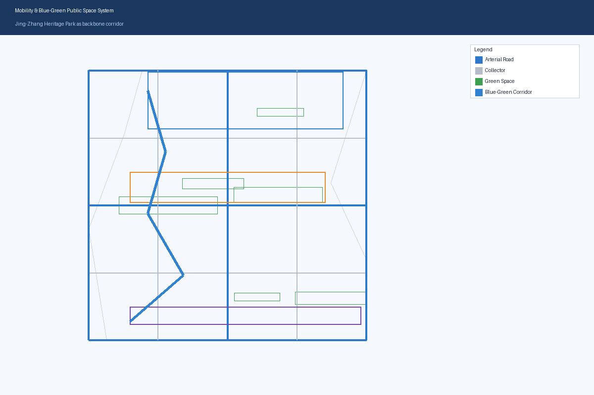
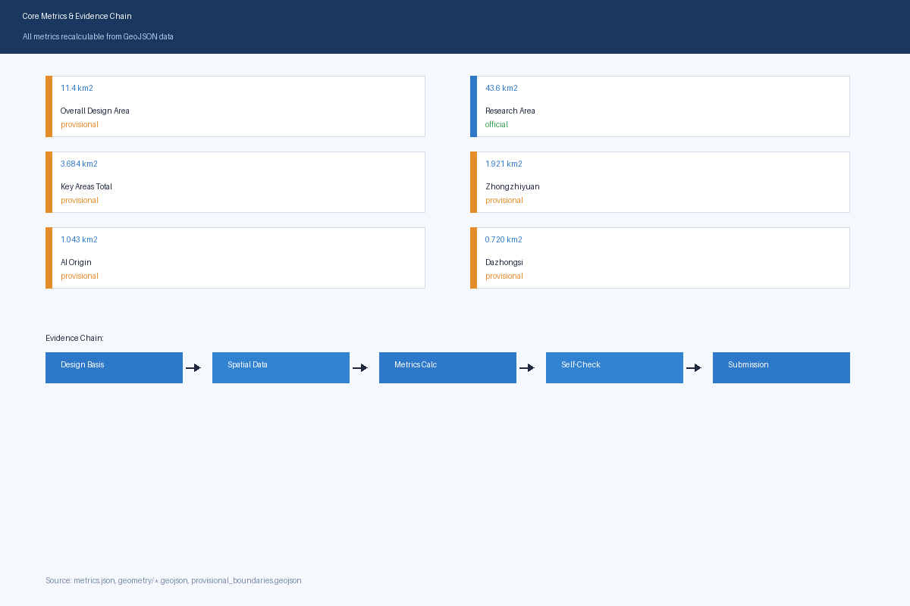

# Centennial Jing-Zhang AI Innovation Belt Urban Design Proposal

## Design Basis and Source Inventory

This formal proposal takes the Prequalification Announcement for the Centennial Jing-Zhang AI Innovation Belt International Urban Design Competition issued by the Haidian Branch of the Beijing Municipal Commission of Planning and Natural Resources as its primary basis, and uses the provisional rough boundaries, key areas, enumerations, metrics, and source lists registered by maintainers in `brief/site-package/` as machine-readable evidence [source:OFFICIAL-ANNOUNCEMENT] [source:AGENT-TASKBOOK] [depth:existing_conditions_diagnosis].

The source registry usage boundaries are as follows [source:SOURCE-REGISTRY]:
- data/source_registry.json registers the usage boundaries of public, cleared, and provisional materials.
- Current registry summary: 5 formal-usable sources, 0 background sources, 1 provisional-only source.
- Agents must not upgrade background_only or provisional_only materials to official boundaries, statutory controls, formal scoring evidence, or government implementation commitments.

This scaffold-generated formal package uses `brief/site-package/geometry/provisional_boundaries.geojson` for temporary generation when official `SITE_BOUNDARY` or three `KEY_AREA` polygons are not yet available. The `geometry/site_boundary.geojson` and `geometry/key_areas.geojson` in the submission must be marked as `provisional_constraint`, `official_boundary=false`, and can only be used for proposal generation, self-check, visualization, and design discussion, not as official redlines, approval basis, precise area basis, or statutory control conclusions.

## Three-Level Scope Framework

The proposal organizes work according to three levels defined by the announcement: the Coordinated Research Area focuses on the 43.6 km² AI industry ecosystem, strategic positioning, innovation chain, and future city form; the Overall Design Area focuses on the 11.4 km² urban area and industry zones within 1-2 km of the Jing-Zhang Heritage Park, requiring urban renewal frameworks, industrial spatial layout, transportation and municipal support, and urban character control; the Key Detailed Design Area focuses on the 368.4 hectares of three detailed design zones, requiring functional programs, building scale, retain/renovate/demolish classification, public space connectivity, and traffic organization.

The overall design concept is the "Jing-Zhang Smart Vein Symbiosis Belt": using the Jing-Zhang Heritage Park as the historical and public space main axis, with Zhongzhiyuan, Beijing AI Origin Community, and Dazhongsi as innovation anchors, and universities, enterprises, communities, and rail stations as the daily network, forming a spatial organization of "one belt, three cores, multi-point scenarios, blue-green slow-traffic composite loop."

| Level | Design Question | Design Response | Data Reference |
| --- | --- | --- | --- |
| Coordinated Research Area | How to organize AI industry ecosystem and future city form | Establish innovation chain: "university origin - open-source collaboration - enterprise transformation - public experience - international communication" | compliance_matrix.json, standard_matrix.json |
| Overall Design Area | How to implement industry space, urban renewal, transportation and character | Land use, buildings, roads, green space, public space and phasing layers jointly express | [data:geometry/land_use.geojson#LU-001], [data:geometry/roads.geojson#ROAD-001] |
| Key Detailed Design Area | How three zones achieve detailed design depth | Each zone proposes positioning, spatial moves, AI scenarios and implementation dependencies | [data:geometry/key_areas.geojson#PROV-KEY-001], [data:geometry/key_areas.geojson#PROV-KEY-002], [data:geometry/key_areas.geojson#PROV-KEY-003] |

## Coordinated Research Area: Industry and Future City Research

The core task of the Coordinated Research Area is to build a world-class AI innovation ecosystem. The proposal should organize Haidian's universities, leading enterprises, computing-algorithm-data elements, incubation platforms, listed companies, unicorns, and technology service resources, and propose a spatial coordination framework for the AI innovation chain, industry chain, talent chain, and city service chain. The naming and logo design should serve the overall recognition of "Centennial Jing-Zhang Cultural Belt, Urban AI Life Experience Belt, AI Integration Innovation Belt" [source:AGENT-TASKBOOK] [standard:PROJECT-AGENT-OPEN-CALL-TASKBOOK].

Future city form research should answer how AI changes work, life, socializing, learning, transportation, and public services. The proposal should implement AI transportation systems, continuous green spaces, innovation service facilities, and international living atmosphere as locatable functional zones, nodes, corridors, and scenarios.

## Overall Design Area: Urban Renewal and Regulatory-Plan Urban Design Depth

The Overall Design Area must achieve regulatory-plan urban design depth. The proposal must propose urban renewal spatial structure, low-efficiency space identification, renewal project list, implementation policy suggestions, industry function ratios, spatial organization patterns, total building scale, and comprehensive capacity assessment [standard:MOHURD-CONTROL-DETAILED-PLANNING] [data:geometry/land_use.geojson#LU-001] [data:geometry/buildings.geojson#BLDG-001] [data:geometry/roads.geojson#ROAD-001] [metric:building_footprint_area_sqm] [depth:land_use_layout] [depth:development_intensity_controls].

## Key Area Detailed Design

The three key areas must appear in `geometry/key_areas.geojson`. If official polygons are available, they should be used as `official_constraint`; if official polygons are missing, `provisional_constraint` may be temporarily used, but the text, HTML, sources, assumptions, and self_check must state that they cannot be used as formal scoring or approval basis.

| Key Area | Design Positioning | Spatial Moves | AI Industry and Operation Scenarios | Evidence |
| --- | --- | --- | --- | --- |
| Zhongzhiyuan AI Acceleration Area | Garden-type full-stack innovation district | Strengthen Qinghe interface, industry display, low-carbon innovation exchange, and external transportation | Autonomous model testing, standards workshops, safety governance display, low-carbon computing experience | [data:geometry/key_areas.geojson#PROV-KEY-001], [depth:three_key_area_detailed_design] |
| Beijing AI Origin Community | Campus-proximate result transformation and talent community | Organize campus-park-district slow-traffic stitching; supplement publishing, talent services, residential and open-source collaboration space | Open-source community, result publishing, talent zone services, campus-proximate incubation | [data:geometry/key_areas.geojson#PROV-KEY-002], [source:AGENT-TASKBOOK] |
| Dazhongsi AI Industry Cluster | Urban smart economy and international exchange district | Dazhongsi station integration, quadrant pedestrian connectivity, commercial services, and key enterprise public environment renewal | Smart agent and terminal display, content consumption, data elements and international roadshows | [data:geometry/key_areas.geojson#PROV-KEY-003], [metric:key_area_count] |

## AI Innovation Ecosystem, Talent Profiles, and AI+ Scenarios

The proposal should establish AI talent and enterprise spatial demand profiles covering R&D offices, open-source collaboration, result publishing, enterprise services, talent residence, social learning, consumption, sports, and international exchange. AI+ scenarios should cover transportation, services, consumption, healthcare, education, legal, and life services directions [source:AGENT-TASKBOOK].

| User Profile | Typical Needs | Spatial Response | Privacy Boundary |
| --- | --- | --- | --- |
| Open-source Developer | Publishing, collaboration, testing, community reputation | Origin Community open-source publishing hall, public code wall, night collaboration space | No personal behavior tracking; activity data for aggregate statistics only |
| Startup Team | Low-cost office, computing access, product testing | Zhongzhiyuan shared test field, edge computing service points, standards governance consultation | Computing and data services require separate authorization |
| Enterprise Visitor | Display, business, international reception, talent recruitment | Dazhongsi international roadshow lounge, rail station connection, key enterprise public space | Enterprise logos and cases require clearance |
| Nearby Resident | Commuting, leisure, community services, low-disturbance renewal | Jing-Zhang Heritage Park slow-traffic loop, community service integration, night lighting and activity grading | Resident profiles not used for commercial recommendations |
| University Faculty/Students | Result transformation, cross-campus collaboration, daily commuting | Campus-park slow-traffic stitching, result transformation驿站, AI education experience points | Campus data and research results require authorization |

| Scenario Card | Spatial Carrier | Design Description |
| --- | --- | --- |
| 01 Open-source Publishing Hall | Beijing AI Origin Community | For universities, open-source communities, and startups: result publishing, code contribution display, and small roadshows |
| 02 Safety Governance Sandbox | Zhongzhiyuan | Standards development, safety evaluation, model red-team testing translated into visitable, reservable, supervisable display nodes |
| 03 Edge Computing Station | Overall Design Area nodes | Combined with public services, enterprise services, and low-carbon energy strategy as new infrastructure prototype |
| 04 AI Slow-traffic Navigation | Jing-Zhang Heritage Park vitality belt | Interpretable signage and low-intrusion sensing for slow-traffic breakpoints, congestion nodes, and accessibility needs |
| 05 Dazhongsi International Roadshow Lounge | Dazhongsi AI Industry Cluster | Display, negotiation, media publishing, and international exchange for smart agents, terminals, and content consumption enterprises |
| 06 Qinghe Low-carbon Innovation Corridor | Zhongzhiyuan Qinghe interface | Green space, stormwater, walking/cycling, and AI display combined as park public living room |
| 07 Campus-proximate Result Transformation Street | Beijing AI Origin Community | University result transformation: incubation, display, legal, IP, and investment services |
| 08 Data Elements Reception Hall | Dazhongsi zone | City service interface for data elements and digital asset circulation under compliance, authorization, and auditability |
| 09 AI Life Service Demo Street | Community-commercial intersection | Healthcare, education, legal, and life service AI+ scenarios in operable small-scale block space |
| 10 Global AI Activity Week Route | Belt public space system | Walkable, communicable experience route from heritage culture through open-source community, industry display to international roadshow |

## Land Use, Building Scale, and Retain/Renovate/Demolish Plan

Land use should follow public standards for land survey, planning, and use control classification, forming complete, closed, gapless land-use zoning [standard:MNR-LAND-USE-CLASSIFICATION-GUIDE] [data:geometry/land_use.geojson#LU-001] [data:geometry/buildings.geojson#BLDG-001] [metric:building_footprint_area_sqm] [depth:height_massing_character] [depth:retain_renovate_demolish].

## Transportation, Rail, Municipal, and Public Service Facilities

Transportation should respond to the announcement's requirements for rail station integration, road micro-circulation, slow-traffic breakpoints, external transportation, parking, and green transportation systems [depth:traffic_rail_slow_parking] [depth:municipal_new_infrastructure] [data:geometry/roads.geojson#ROAD-001] [data:geometry/public_space.geojson#PUBLIC-001] [data:geometry/constraints.geojson#CONSTRAINTS].

## Blue-Green Space, Public Space, and Urban Character

Blue-green space should use the Jing-Zhang Heritage Park vitality belt as the skeleton, coordinating Qinghe, Xiaoyuehe, surrounding universities, enterprises, and community出行needs [depth:blue_green_public_space] [data:geometry/green_space.geojson#GREEN-001] [data:geometry/public_space.geojson#PUBLIC-001] [standard:MOHURD-URBAN-DESIGN-MEASURES].

Urban character should integrate Jing-Zhang railway historical culture, Zhongguancun innovation culture, and AI innovation culture, using Tsinghua Garden Station and Beijing Film Academy cultural resources.

## Renewal Project List, Implementation Policies, and Phasing

The implementation plan should form a reviewable renewal project list [depth:renewal_project_list] [depth:phasing_implementation] [data:geometry/phasing.geojson#PHASE-001].

| Project ID | Project Name | Type | Key Dependencies | Evidence |
| --- | --- | --- | --- | --- |
| JZ-01 | Jing-Zhang Heritage Park slow-traffic breakpoint stitching | Public space/transportation | Road redline, under-bridge space, traffic organization review | [data:geometry/roads.geojson#ROAD-001] |
| JZ-02 | Zhongzhiyuan Qinghe innovation interface | Blue-green space/industry display | River blue line, ecology and flood control conditions | [data:geometry/green_space.geojson#GREEN-001] |
| JZ-03 | Origin Community campus-proximate result transformation street | Urban renewal/industry services | Campus boundary, property rights, ground-floor use | [data:geometry/buildings.geojson#BLDG-001] |
| JZ-04 | Dazhongsi Station quadrant pedestrian connectivity | Rail integration/slow-traffic | Rail station, road intersection, municipal pipelines | [data:geometry/public_space.geojson#PUBLIC-001] |
| JZ-05 | AI public service and edge computing nodes | New infrastructure/public services | Energy, computing, security and operation entity | [data:geometry/constraints.geojson#CONSTRAINTS] |
| JZ-06 | Global AI Activity Week public route | Operations/brand | Public space permits, event safety, copyright clearance | [data:geometry/phasing.geojson#PHASE-001] |

## Metrics, Area Recalculation, and Compliance Matrix

The metrics system should include at least overall design area, key area area, green and public space ratios, building footprint, renewal project count, AI scenario nodes, slow-traffic connectivity, industry space, talent services, and self-check status [depth:metrics_recalculation] [metric:site_area_sqm] [data:geometry/green_space.geojson#GREEN-001].

## Risk, Copyright, and Compliance Statement

**Bilingual requirement.** The main proposal file may use Chinese or English, but must provide a complete counterpart translation via `proposal.en.md` or `proposal.zh.md`; A3/A0, HTML, and text-bearing figures must also provide language counterparts [depth:risk_missing_data] [data:geometry/constraints.geojson#CONSTRAINTS] [source:SITE-PACKAGE].

This proposal does not claim official approval, statutory regulatory plan, final land rights, final construction scale, or guaranteed implementation.

## References

- brief/public-brief.md
- brief/site-package/design_brief.json
- brief/site-package/allowed_design_space.json
- brief/site-package/enums/
- brief/site-package/ranges/planning_limits.json
- data/processed/agent_fact_pack.md
- Complete machine index: see `sources.json`, `metrics.json`, `compliance_matrix.json`, `standard_matrix.json`, and `design_depth_matrix.json`
