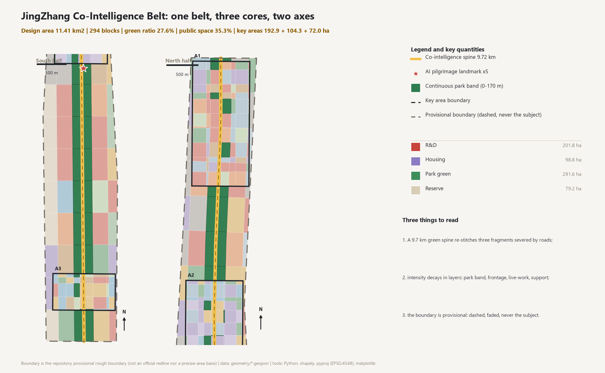
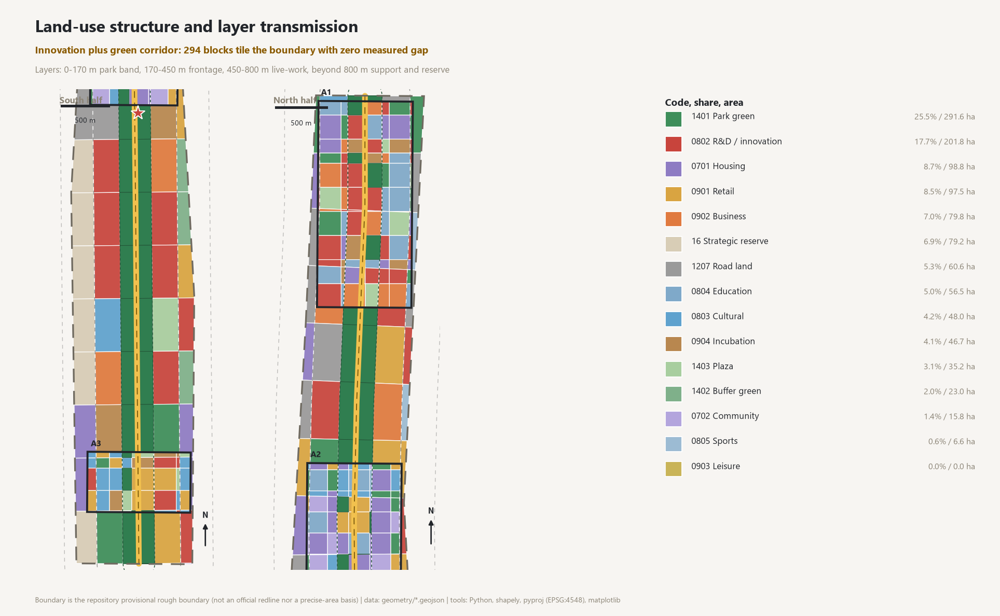
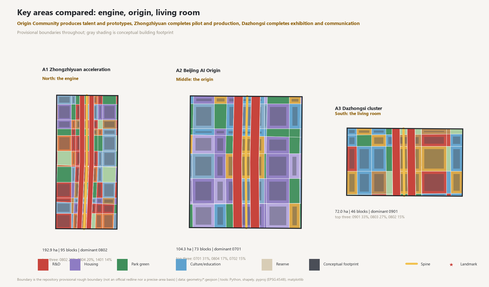
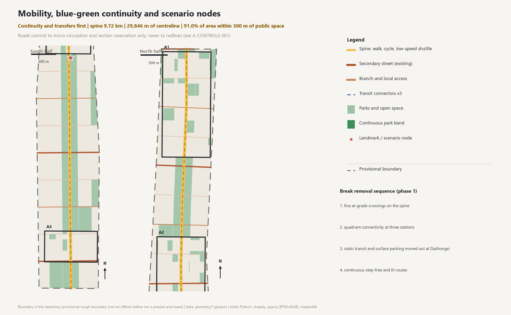
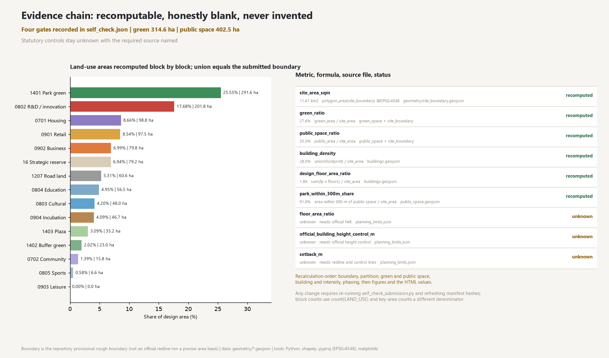
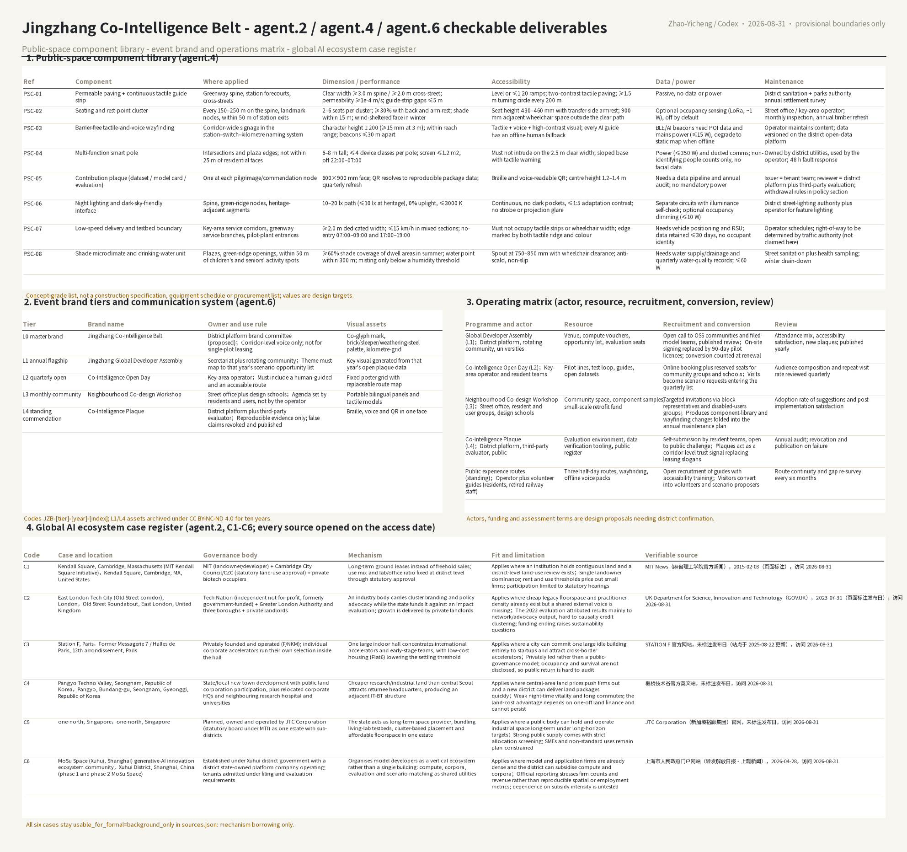

# JingZhang Co-Intelligence Belt: from a Switchback Railway to a Co-Shaped City

**Primary name** 京张共智带 / JingZhang Co-Intelligence Belt (JCIB). **Tagline** one hundred years of railway, one hundred years of data belt.

**Naming and identity direction** (agent.1): the name reads the JingZhang corridor through the character *gong* (co-). In 1909 the JingZhang Railway crossed the mountain pass with a human-shaped (*ren*) switchback line - the technology age of *man*; in 2026 compute, data and talent run parallel on the same corridor, forming the collaborative age of *co*. The logo direction is "two rails forming *gong*": two parallel track lines (the original 4 ft 9 in gauge and standard gauge) interweave at three nodes - North 4th Ring, Xueqing Road, Shangdi - producing the two dots and vertical strokes of the character, with a green corridor left as negative space. The palette (rail gray, JingZhang brick red, compute cyan) is a direction only; any use of existing trademarks or licensed fonts must be cleared by the organiser and rights holders, and this proposal claims no brand authorisation. [source:AGENT-TASKBOOK]

## Design Basis and Source List

The first authority is the *Prequalification Announcement of the International Design Call for the Centennial JingZhang AI Innovation Belt* [source:OFFICIAL-ANNOUNCEMENT], whose clauses 1.3, 1.4 and 1.5 define the purpose, the three-level scope, the three key-area areas and the design tasks; together with the *Open-Call Taskbook for AI Agents* [source:AGENT-TASKBOOK], whose ten co-creation principles, three positionings, five functions, three-zone/two-wing scheme and six mandatory agent tasks form the evaluation basis. [standard:PROJECT-OFFICIAL-ANNOUNCEMENT]

Spatially the package relies on the repository provisional rough boundaries [source:PROVISIONAL-BOUNDARIES] (`usable_for_formal="provisional_only"`); enums, ranges, schemas and the allowed design space come from the site package [source:SITE-PACKAGE], while the central registry and processed material are used only for navigation [source:SOURCE-REGISTRY], [source:PROCESSED-FACT-PACK].

Professional authorities fall into three groups. The first bounds the legal nature of the work: the Urban Design Measures [standard:MOHURD-URBAN-DESIGN-MEASURES] and the Regulatory Detailed Planning Measures [standard:MOHURD-CONTROL-DETAILED-PLANNING] establish that this is a conceptual urban design, not a statutory approval.

The second bounds the data vocabulary: the Land and Sea Use Classification Guide [standard:MNR-LAND-USE-CLASSIFICATION-GUIDE] fixes every `land_use_code`, and the Building Design Document Depth Regulation (2016) [standard:MOHURD-ARCH-DESIGN-DEPTH-2016] fixes deliverable depth.

The third bounds the social limits of AI services: the Interim Measures for Generative AI Services [standard:GENERATIVE-AI-INTERIM-MEASURES], the Barrier-Free Environment Law [standard:BARRIER-FREE-ENVIRONMENT-LAW] and State Council General Office Document [2020] No. 45 [standard:ELDERLY-SMART-TECH-PLAN-2020-45].

Source usability is graded explicitly: the announcement and taskbook support formal tasks; the site package supports machine contracts; provisional polygons support temporary generation, visualisation and self-check only; OpenStreetMap and external case material are background cross-checks [source:OSM-BASEREF], [source:CASE-REFERENCES], and no derived OSM geometry is submitted. Regulatory controls, land ownership, existing buildings, road redlines and utility records are all absent and are registered as assumption `A-CONTROLS-001`; therefore every intensity, height, alignment and investment statement below is conceptual and must not be read as an approved plan or a government commitment.

## Three-Level Scope Framework

The three levels transmit downwards. The coordinated research area is about 43.60 km2 as announced [metric:coordinated_research_area_sqm] and handles the regional relationship between north-west Haidian innovation and the corridor. The overall design area is the geometric subject of this package, 11.41 km2 provisional [metric:site_area_sqm], held in [data:geometry/site_boundary.geojson#SITE-001]. The key detailed-design areas total about 368.4 ha as announced [metric:key_detailed_design_area_sqm]: Zhongzhiyuan 192.9 ha, Beijing AI Origin Community 104.3 ha, Dazhongsi 72.0 ha.

The transmission logic is: research area sets direction, design area sets structure, key areas set leverage points. All three levels carry `geometry_role="provisional_constraint"`, `boundary_precision="provisional_rough"` and `official_boundary=false`, and every derived area inherits that precision limit. When official polygons are released the land-use coverage, green ratio, public-space ratio, building density, phasing areas and all drawings must be recalculated; the recalculation list is stated in the metrics section. [depth:three_level_scope_framework]

## Coordinated Research Area: Industry and Future City Research

Within the 43.60 km2 research area the corridor is read as one continuous substitution: a linear transport infrastructure becoming a linear innovation infrastructure. The railway brought coal and factories; the metro and the fibre bring compute and talent; the spatial consequence is identical - the station becomes the primary organiser of functions. Four organising principles follow: **never break the spine** (the 9.72 km greenway is a pedestrian-first continuous interface), **station as hub** (R&D and public services mixed within 400 m of each rail station), **research next to housing** (innovation and residential land interleaved within a 6-10 minute walk), and **reserve before fill** (79.2 ha of strategic reserve kept where disposal timing is unknown). [depth:overall_spatial_structure]

The taskbook (agent.2) asks for five to eight verifiable global AI-innovation ecosystems. Six cases (C1-C6) are supplied below, each with its operating or governance body, the mechanism it uses, conditions of fit, limitations and the item transferable to the Jingzhang corridor. The North American and European samples are C1 Kendall Square [source:CASE-KENDALL], C2 East London Tech City [source:CASE-EASTTECH] and C3 Station F [source:CASE-STATIONF]; the East Asian samples are C4 Pangyo Techno Valley [source:CASE-PANGYO], C5 one-north [source:CASE-ONENORTH] and C6 MoSu Space [source:CASE-MOSHU]. Each entry is registered in `sources.json` with title, publisher, publication or labelling date, exact URL, access date and licence/reuse terms. All six keep `usable_for_formal = background_only`: they support mechanism borrowing only, and never the spatial or metric basis of this proposal.

| Code, case and location | Operating or governance body | Mechanism used | Conditions of fit | Limitation | Transferable item |
|---|---|---|---|---|---|
| **C1 Kendall Square, Cambridge, Massachusetts (MIT Kendall Square Initiative)**; Kendall Square, Cambridge, MA, United States `[source:CASE-KENDALL]` | MIT (landowner/developer) + Cambridge City Council/CZC (statutory land-use approval) + private biotech occupiers | Long-term ground leases instead of freehold sales; use mix and lab/office ratio fixed at district level through statutory approval | Applies where an institution holds contiguous land and a district-level land-use review exists | Single landowner dominance; rent and use thresholds price out small firms; participation limited to statutory hearings | For Jingzhang: carry pilot/shared-manufacturing capacity in long-term district leases with use flexibility written into grant conditions |
| **C2 East London Tech City (Old Street corridor), London**; Old Street Roundabout, East London, United Kingdom `[source:CASE-EASTTECH]` | Tech Nation (independent not-for-profit, formerly government-funded) + Greater London Authority and three boroughs + private landlords | An industry body carries cluster branding and policy advocacy while the state funds it against an impact evaluation; growth is delivered by private landlords | Applies where cheap legacy floorspace and practitioner density already exist but a shared external voice is missing | The 2023 evaluation attributed results mainly to network/advocacy output, hard to causally credit clustering; funding ending raises sustainability questions | For Jingzhang: hand the annual conference and brand to an independent body, but renew funding only against third-party evaluation and open data |
| **C3 Station F, Paris**; Former Messagerie 7 / Halles de Paris, 13th arrondissement, Paris `[source:CASE-STATIONF]` | Privately founded and operated (F/NKM); individual corporate accelerators run their own selection inside the hall | One large indoor hall concentrates international accelerators and early-stage teams, with low-cost housing (Flat6) lowering the settling threshold | Applies where a city can commit one large idle building entirely to startups and attract cross-border accelerators | Privately led rather than a public-governance model; occupancy and survival are not disclosed, so public return is hard to audit | For Jingzhang: keep one large clear-span building in a key area as an accelerator container, but disclose entry/exit statistics as the price of support |
| **C4 Pangyo Techno Valley, Seongnam, Republic of Korea**; Pangyo, Bundang-gu, Seongnam, Gyeonggi, Republic of Korea `[source:CASE-PANGYO]` | State/local new-town development with public land corporation participation, plus relocated corporate HQs and neighbouring research hospital and universities | Cheaper research/industrial land than central Seoul attracts returnee headquarters, producing an adjacent IT-BT structure | Applies where central-area land prices push firms out and a new district can deliver land packages quickly | Weak night-time vitality and long commutes; the land-cost advantage depends on one-off land finance and cannot persist | For Jingzhang: trade a land-price gradient for HQ and pilot siting while funding housing and daily services in the same package |
| **C5 one-north, Singapore**; one-north, Singapore `[source:CASE-ONENORTH]` | Planned, owned and operated by JTC Corporation (statutory board under MTI) as one estate with sub-districts | The state acts as long-term space provider, bundling living-lab testbeds, cluster-based placement and affordable floorspace in one estate | Applies where a public body can hold and operate industrial space long-term under long-horizon targets | Strong public supply comes with strict allocation screening; SMEs and non-standard uses remain plan-constrained | For Jingzhang: let a district platform hold corridor innovation space and run the living-lab, publishing allocation rules and queue data |
| **C6 MoSu Space (Xuhui, Shanghai) generative-AI innovation ecosystem community**; Xuhui District, Shanghai, China (phase 1 and phase 2 MoSu Space) `[source:CASE-MOSHU]` | Established under Xuhui district government with a district state-owned platform company operating; tenants admitted under filing and evaluation requirements | Organises model developers as a vertical ecosystem rather than a single building: compute, corpora, evaluation and scenario matching as shared utilities | Applies where model and application firms are already dense and the district can subsidise compute and corpora | Official reporting stresses firm counts and revenue rather than reproducible spatial or employment metrics; dependence on subsidy intensity is untested | For Jingzhang: turn evaluation, corpora and scenario opening into corridor-scale public utilities, reported in reproducible metrics instead of firm counts |

Three conclusions recur across the six cases. First, long-term land and space supply (C1 ground leases, C5 statutory-board ownership) sustains corridor-scale innovation density better than one-off subsidies. Second, a cluster brand can be run by an independent body (C2), but renewal of public funding must be tied to third-party evaluation and open data, otherwise the organisation collapses when the grant ends. Third, shared utilities - C3 low-cost housing, C4 as the counter-example of jobs-housing imbalance, C6 compute, corpora and evaluation - decide whether talent stays, which is why the Jingzhang structure lays 294 gap-free parcels and writes housing and daily services into the land-use mix.

These conclusions only define mechanism types. Every spatial layout and metric remains derived from this package geometry, matrices and `metrics.json`; no case figure is used as design data. The eight earlier pending hypotheses (`A-ECO-004`) are now mapped one by one onto C1-C6: H1 to C1/C5 (long leases and public ownership), H2 to C5 (living-lab testbeds), H3 to C4 (cost drivers of hub and hinterland division), H4 to C3/C5 (corporate management of public parks), H5 to C6 (site-specific public-interface contracts), H6 to C3 (low-cost housing and shared space), H7 to C2 (network rather than a single park), H8 to C4/C6 (talent density and amenities over subsidies). The itemised source list follows the references section.

## Overall Design Area: Urban Renewal and Regulatory-Plan-Level Urban Design

The structure is **one belt, three cores, two axes, layered transmission, many nodes**. The belt is the 9.72 km JingZhang heritage greenway [data:geometry/roads.geojson#ROAD-001]; the cores are the three key areas [data:geometry/key_areas.geojson#PROV-KEY-001]; the axes are the North 4th Ring - Xueqing Road innovation service axis and the Qinghe - Xizhimen urban function axis; the nodes are 5 pilgrimage landmarks. The belt stitches three fragments previously severed by roads into one walkable public-space system while the layers decay intensity away from the spine: 0-170 m park band, 170-450 m innovation frontage and mixed use, 450-800 m live-work clusters, beyond 800 m support and strategic reserve. [depth:land_use_layout]

Using the site-package land-use codes, the area is partitioned into 294 gap-free, non-overlapping blocks (union identical to the submitted boundary; measured coverage gap 0 m2). Renewal is sequenced retain-renovate-demolish with retain first: existing industrial and warehouse buildings are mainly renovated, public and residential facilities are retained and upgraded, demolition is reserved for illegal or severely inefficient warehouse stock; conceptually 44% of footprint area is retained and 182.3 ha is renewed, with new massing concentrated inside 400 m of the three key-area stations. Footprint density 28.5%, floorspace 2154 ten-thousand m2 and design FAR 1.89 are conceptual massing controls pending official regulatory conditions. [depth:development_intensity_controls]

The depth of this section is self-checked against the regulatory planning and design-depth regulations; because official control conditions are missing the conclusions are to be read as urban design guidance. [standard:MOHURD-CONTROL-DETAILED-PLANNING]

## Detailed Design of Key Areas

**A1 Zhongzhiyuan AI Acceleration Area** (announced about 192.1 ha, 192.9 ha here, 95 blocks, dominant code 0802): the full-stack innovation engine. Structure "one spine, two valleys, three loops" - the green spine continues the belt, an algorithm valley and a hardware valley flank it, and innovation, pilot-manufacturing and living loops connect them. Block LU-105 starts the programme with open compute, embodied-AI pilot lines and shared test facilities. Risk: disposal timing and ownership are unknown, so ratios only, never a plot list. [data:geometry/key_areas.geojson#PROV-KEY-001]

**A2 Beijing AI Origin Community** (104.3 ha, 73 blocks): the first kilometre from university to market. The Tsinghua Yuan Station heritage building anchors the Tsinghua Yuan Station AI Origin Memorial, flanked by talent housing, community services and education facilities forming a campus-adjacent innovation district; renewal is low-disturbance micro-circulation, using ground floors of existing buildings as scene galleries and community labs. [data:geometry/key_areas.geojson#PROV-KEY-002]

**A3 Dazhongsi AI Industry Cluster** (72.0 ha, 46 blocks): the public living room of agents and content. The bell becomes the Dazhongsi Bell of Intelligence soundscape trigger; quadrant-by-quadrant pedestrian connectivity and static-transit organisation around the station come before any commercial increment, layering bell culture, AI content consumption and first-store economy on one interface. [data:geometry/key_areas.geojson#PROV-KEY-003]

Mapping to the taskbook structure is stated item by item. Three positionings: the Centennial JingZhang cultural belt is carried by the section-9 heritage spine, five pilgrimage landmarks and the station-turnpoint-mileage wayfinding; the urban AI life-experience belt by the section-6 scenario cards and the section-8 15-minute circle, accessibility and age-inclusive provisions; the AI-integrated innovation belt by the section-4 and 7 layer structure and land-use mix. Five functions: full-stack autonomous innovation in A1 Zhongzhiyuan (R&D, pilot and shared testing); a world-class AI ecosystem in A2 Origin Community (campus-adjacent district and translation); AI-plus scene empowerment through the twelve cards and the publish-apply-review-revisit loop; an intelligent live city through the public realm, new infrastructure and the data hub; and a global voice in AI governance through contribution plaques, model cards and published evaluation records.

Three areas and two wings: the areas are A1 Zhongzhiyuan (full-stack innovation and governance voice), A2 AI Origin Community (world-class ecosystem) and A3 Dazhongsi (natively intelligent business). The taskbook wings are the **Zhongguancun technology service wing** (global factor allocation, Zhongguancun IP and capital empowerment) and the **Xiaoyuehe scenario empowerment wing** (AI scene empowerment and an intelligent live city). This proposal places the first along Xueqing Road - Zhongguancun North Street at the western edge of the design area, as the outward service face for capital, IP and global factors, and the second along the Xiaoyuehe blue line east of the area, as the waterfront test and vitality face. Their limits relative to the three areas follow the provisional polygons and remain subject to official confirmation. To avoid concept mixing, the "south segment (Xizhimen-Dazhongsi) / north segment (Xueqing Road-Shangdi)" used elsewhere in this proposal is only a **construction and phasing division of the corridor**; it neither replaces nor renames the two taskbook wings, and the two are not interchangeable. [depth:three_key_area_detailed_design]

External coordination (non-committal interfaces): device and research spillover from the Future Science City and Huairou Science City to the north; pilot and mass-production translation via the Economic-Technological Development Area to the east; daily services back-filled for existing neighbourhoods such as Beiwei Community inside the city; and cross-regional compute and data cooperation at the Beijing-Tianjin-Hebei level. These define only the direction of factor flows this proposal is willing to interface with - talent and results in, pilot and scene demand out, joint evaluation and standard setting - and contain no agreed partnership, investment, siting or policy arrangement, nor any preset function for another district.

Detailed design depth follows the design document depth regulation; every statutory indicator is marked conceptual. [standard:MOHURD-ARCH-DESIGN-DEPTH-2016]

## AI Innovation Ecosystem, Personas, and AI+ Scenarios

Five personas with scenario-space-operations mapping (agent.3): 1) research scientists need cross-disciplinary encounters and cheap compute - open labs and a compute supermarket on the innovation frontage, rotated quarterly by the operator; 2) product managers and indie developers need real users and test permits - 24-hour street scene labs plus a temporary permit list; 3) robotics engineers need continuous hard ground, freight access and a test loop - the Herringbone Test Field and Embodied AI Loop; 4) founders need capital and administrative certainty - a one-stop enterprise desk in Origin Community; 5) residents and older neighbours need services that do not abandon them - community service land plus staffed alternatives to every AI counter.

Twelve scenario cards SC-01 to SC-12, each with trigger, data input, spatial carrier, AI service, human review and verification metric: SC-01 greenway continuity and break-point detection; SC-02 step-free station transfers; SC-03 autonomous shuttle loop; SC-04 last-mile delivery and night freight windows; SC-05 community health assistant with GP co-sign; SC-06 personalised learning in open classrooms; SC-07 embodied-AI pilot shared factory; SC-08 micro-grid and storage dispatch; SC-09 digital re-presentation of the railway heritage with AI guiding; SC-10 neighbourhood co-governance assembly; SC-11 enterprise policy agent; SC-12 public-safety and event crowd review. **SC-03, SC-04 and SC-07 are the three AI industry test-and-verification scenarios**, aligned with repository registry entries such as `robot-delivery-low-speed`. [depth:height_massing_character]

Three hard boundaries apply to every scenario: no personally identifiable data, with face, health, residence and minors excluded entirely; automated judgement produces candidate advice only, with disposition retained by qualified staff and logged; and where a scenario could be misread as approved engineering or policy, the text and declaration prevail. [standard:GENERATIVE-AI-INTERIM-MEASURES]

## Land Use, Building Scale, and Retain-Renovate-Demolish Strategy

| Code and class | Area (ha) | Share of design area |
|---|---|---|
| `1401` Park Green Space | 291.6 | 25.5% |
| `0802` Scientific Research | 201.8 | 17.7% |
| `0701` Urban Residential | 98.8 | 8.7% |
| `0901` Retail | 97.5 | 8.5% |
| `0902` Business and Finance | 79.8 | 7.0% |
| `16` Strategic Reserve | 79.2 | 6.9% |
| `1207` Road Land | 60.6 | 5.3% |
| `0804` Education | 56.5 | 5.0% |
| `0803` Cultural | 48.0 | 4.2% |
| `0904` Other Commercial Services | 46.7 | 4.1% |
| `1403` Plaza | 35.2 | 3.1% |
| `1402` Protective Green Space | 23.0 | 2.0% |
| `0702` Community Service Facilities | 15.8 | 1.4% |
| `0805` Sports | 6.6 | 0.6% |
| `0903` Leisure | 0.0 | 0.0% |

The table is recomputed block by block from [data:geometry/land_use.geojson] and sums to the submitted boundary of 1141.3 ha. Scientific research 201.8 ha and park green space 291.6 ha form the twin protagonists of "innovation plus green corridor"; commercial and business 224.0 ha concentrate in the 170-450 m frontage; residential 98.8 ha sits in the 450-800 m live-work layer, so the corridor never becomes a city that empties at night. [standard:MNR-LAND-USE-CLASSIFICATION-GUIDE]

222 footprints [data:geometry/buildings.geojson#BLDG-0001] lie entirely inside buildable blocks with 12-16 m setbacks. Conceptual storeys are assigned by use (R&D 6, incubator 8, office 12, housing 11, cultural 5, reserve 1-2), giving an average conceptual height of 24.4 m and a maximum of 43 m at two transit hubs - an upper bound for massing study, not an approval. Retain-renovate-demolish: 142.8 ha retained, 182.3 ha renovated, demolition limited to inefficient warehouse and dilapidated stock. [depth:retain_renovate_demolish]

## Transport, Rail, Municipal Infrastructure, and Public Services

Mobility: roads commit only to micro-circulation and section reservation, never to redlines. 22 centrelines totalling 29,846 m [data:geometry/roads.geojson#ROAD-002], of which 9.72 km is the greenway main spine (walking and cycling, low-speed autonomous shuttles permitted at defined hours); secondary and branch roads organise existing streets functionally, and three transit connectors serve the three key-area stations. Parking follows "intercept outside, serve inside": P+R and shared parking outside the key areas, underground and mechanical provision replacing surface parking inside, returning surface to people and greenery. [depth:traffic_rail_slow_parking]

Municipal and new infrastructure is organised as one utility corridor, one energy-compute network and one data hub: a common utility trench along the spine, compute and distribution staged by station (district energy station plus station-scale storage), the city data hub placed in Zhongzhiyuan and interfacing with the district platform; sponge measures use sunken greenery and permeable paving in the park band; lighting and IoT poles share masts with signage to avoid second excavation. All engineering content is bounded by `A-CONTROLS-001` and requires utility survey, fire and flood-review. [depth:municipal_new_infrastructure]

Public services follow a 15-minute community life circle across education, health, eldercare, sport and community facilities on 126.9 ha, so that new employment does not dilute existing service levels. Accessibility and age-inclusiveness follow the law and the State Council plan: AI services always keep a staffed and offline channel. [standard:BARRIER-FREE-ENVIRONMENT-LAW]

## Blue-Green Network, Public Space, and Urban Character

The blue-green system is one spine, several wedges, scattered pearls: 314.6 ha of park and protective green form the continuous green spine [data:geometry/green_space.geojson], wedges draw outer air flows and campus greenery into the city, and pocket parks act as pearls. Public space covers 402.5 ha [data:geometry/public_space.geojson], i.e. 35.3% of the land is a 24-hour open interface, and 91.0% of the area lies within 300 m of it.

The 5 pilgrimage landmarks and honour nodes (agent.4, agent.5) run along the spine: Beijing North Station Commencement Plaza commemorates the 1909 self-built JingZhang Railway; Dazhongsi Bell of Intelligence uses the ancient bell as a soundscape trigger; Tsinghua Yuan Station AI Origin Memorial restores the Tsinghua Yuan Station as the origin of the AI narrative; Herringbone Test Field and Embodied AI Loop translates the switchback line into an embodied-intelligence test loop; Zhongzhi Crown Global Developer Canopy hosts the annual global developer assembly. Each node carries a contribution plaque publishing datasets, model cards, evaluation results and human-review records; plaque content is limited to verifiable evidence, and synthetic results may not be presented as measurements. [depth:blue_green_public_space]

Cultural narrative (agent.5) is three-act: *switchback - century of railway - co-shaped city*. Materials reuse the railway palette of gray brick, sleeper timber and weathering steel as three basic contemporary interfaces; wayfinding adopts a station-turnpoint-mileage naming system (for example "JingZhang km 3 - Turnpoint Plaza") and avoids theme-park rhetoric. [standard:MOHURD-URBAN-DESIGN-MEASURES]

Barrier-free performance is a hard constraint in this section: continuous wheelchair routing, handrail and rest-seat spacing, and dual audio-tactile guidance on the whole spine and all landmarks, with staffed interpretation retained beside every AI guide. [standard:ELDERLY-SMART-TECH-PLAN-2020-45]

### Public-space component library (agent.4 addition)

The library is a concept-grade design product that tests whether the spine and the key areas can be maintained from a bounded set of component types. It is not a construction specification, an equipment schedule or a procurement list; statutory accessibility values await the regulatory plan, road red lines and detailed design, so every figure below is a design target range. [standard:BARRIER-FREE-ENVIRONMENT-LAW]

| Ref and component | Where applied | Dimensional or performance range | Accessibility requirement | Data and power demand | Maintenance duty | Status |
|---|---|---|---|---|---|---|
| **`PSC-01`** Permeable paving + continuous tactile guide strip | Greenway spine, station forecourts, cross-streets | Clear width ≥3.0 m spine / ≥2.0 m cross-street; permeability ≥1e-4 m/s; guide-strip gaps ≤5 m | Level or ≤1:20 ramps; two-contrast tactile paving; ≥1.5 m turning circle every 200 m | Passive, no data or power | District sanitation + parks authority annual settlement survey | Concept-grade, not a specification or procurement list |
| **`PSC-02`** Seating and rest-point cluster | Every 150–250 m on the spine, landmark nodes, within 50 m of station exits | 2–6 seats per cluster; ≥30% with back and arm rest; shade within 15 m; wind-sheltered face in winter | Seat height 430–460 mm with transfer-side armrest; 900 mm adjacent wheelchair space outside the clear path | Optional occupancy sensing (LoRa, ~1 W), off by default | Street office / key-area operator; monthly inspection, annual timber refresh | Counts derived from the 294-parcel geometry and spine length; design suggestion |
| **`PSC-03`** Barrier-free tactile-and-voice wayfinding | Corridor-wide signage in the station–switch–kilometre naming system | Character height 1:200 (≥15 mm at 3 m); within reach range; beacons ≤30 m apart | Tactile + voice + high-contrast visual; every AI guide has an offline human fallback | BLE/AI beacons need POI data and mains power (≤15 W), degrade to static map when offline | Operator maintains content; data versioned on the district open-data platform | Naming system in the narrative section; no trademark claimed |
| **`PSC-04`** Multi-function smart pole | Intersections and plaza edges; not within 25 m of residential faces | 6–8 m tall; ≤4 device classes per pole; screen ≤1.2 m2, off 22:00–07:00 | Must not intrude on the 2.5 m clear width; sloped base with tactile warning | Power (≤350 W) and ducted comms; non-identifying people counts only, no facial data | Owned by district utilities, used by the operator; 48 h fault response | Concept configuration pending duct and load surveys |
| **`PSC-05`** Contribution plaque (dataset / model card / evaluation) | One at each pilgrimage/commendation node | 600×900 mm face; QR resolves to reproducible package data; quarterly refresh | Braille and voice-readable QR; centre height 1.2–1.4 m | Needs a data pipeline and annual audit; no mandatory power | Issuer = tenant team; reviewer = district platform plus third-party evaluation; withdrawal rules in policy section | Verifiable evidence only; synthetic results may not be presented as measured |
| **`PSC-06`** Night lighting and dark-sky-friendly interface | Spine, green-ridge nodes, heritage-adjacent segments | 10–20 lx path (≤10 lx at heritage), 0% uplight, ≤3000 K | Continuous, no dark pockets, ≤1:5 adaptation contrast; no strobe or projection glare | Separate circuits with illuminance self-check; optional occupancy dimming (≤10 W) | District street-lighting authority plus operator for feature lighting | Design targets subject to measurement |
| **`PSC-07`** Low-speed delivery and testbed boundary | Key-area service corridors, greenway service branches, pilot-plant entrances | ≥2.0 m dedicated width; ≤15 km/h in mixed sections; no-entry 07:00–09:00 and 17:00–19:00 | Must not occupy tactile strips or wheelchair width; edge marked by both tactile ridge and colour | Needs vehicle positioning and RSU; data retained ≤30 days, no occupant identity | Operator schedules; right-of-way to be determined by traffic authority (not claimed here) | Right-of-way and regulatory fit is an unresolved external dependency |
| **`PSC-08`** Shade microclimate and drinking-water unit | Plazas, green-ridge openings, within 50 m of children's and seniors' activity spots | ≥60% shade coverage of dwell areas in summer; water point within 300 m; misting only below a humidity threshold | Spout at 750–850 mm with wheelchair clearance; anti-scald, non-slip | Needs water supply/drainage and quarterly water-quality records; ≤60 W | Street sanitation plus health sampling; winter drain-down | Driven by comfort and hygiene, not cooling-energy targets |
The library can be inspected component by component in the `visual/index.html#components` module. The eight entries cover paving, seating and rest points, barrier-free and tactile wayfinding, smart poles, contribution plaques, night lighting and the low-speed delivery boundary named by the taskbook, and add shade microclimate and drinking-water units in response to the public-interest comment. [depth:blue_green_public_space]

## Renewal Projects, Implementation Policy, and Phasing

Twelve demonstration projects form the renewal register: greenway completion and break removal; quadrant pedestrian works at three stations; the Beizhan-Xizhimen exchange node; the Dazhongsi agent vertical community; the Tsinghua Yuan AI Origin Memorial; the herringbone embodied-AI test loop; the open compute and model evaluation hub; inefficient warehouse conversion into pilot shared factories; the complete live-work community with talent and affordable rental housing; the 15-minute circle gap closing; the utility trench and energy station; and the data hub with safety governance platform. [depth:renewal_project_list]

Phasing puts park continuity first, network second, community renewal last: phase 1 386.8 ha (34%, 2026-2028) completes the greenway plus the Dazhongsi and Origin pilots; phase 2 308.4 ha (27%, 2028-2031) networks Zhongzhiyuan and the frontage; phase 3 446.1 ha (39%, 2031-2035) completes live-work renewal and reserve deepening [data:geometry/phasing.geojson#PHASE-1]. Implementation policy proposes mechanisms, not government decisions: an opportunity list with temporary permits, authorised public data operation with exit clauses, positive and negative lists for change of use in existing stock, cross-ownership single-operator agreements with value capture, and compute and evaluation vouchers for SMEs and open-source communities. [depth:phasing_implementation]

### Event brand and communication-visual system (agent.6 addition)

The brand system has five tiers. L0 carries the corridor's external voice; L1-L4 are deliverable, auditable and revocable programmes, so that conference slogans are not mistaken for long-term operations.

| Tier and brand name | Cadence | Accountable body | Naming and use rule | Core visual assets |
|---|---|---|---|---|
| **L0 master brand ｜ Jingzhang Co-Intelligence Belt** / 京张共智带 | Standing | District platform brand committee (proposed) | Corridor-level voice only; not for single-plot leasing | Co-glyph mark, brick/sleeper/weathering-steel palette, kilometre-grid |
| **L1 annual flagship ｜ Jingzhang Global Developer Assembly** / 京张共智带全球开发者大会 | Once yearly, autumn | Secretariat plus rotating community | Theme must map to that year's scenario opportunity list | Key visual generated from that year's open plaque data |
| **L2 quarterly open ｜ Co-Intelligence Open Day** / 共智开放日 | Quarterly | Key-area operator | Must include a human-guided and an accessible route | Fixed poster grid with replaceable route map |
| **L3 monthly community ｜ Neighbourhood Co-design Workshop** / 街区共创工作坊 | Monthly | Street office plus design schools | Agenda set by residents and users, not by the operator | Portable bilingual panels and tactile models |
| **L4 standing commendation ｜ Co-Intelligence Plaque** / 共智铭牌 | Standing, quarterly review | District platform plus third-party evaluator | Reproducible evidence only; false claims revoked and published | Braille, voice and QR in one face |

Naming rule: Codes follow `JZB-[tier]-[year]-[index]` (e.g. `JZB-L1-2028-01`); the Chinese name stays within 12 characters and carries “共智” or “京张”; the English name is a Title-Case phrase of at most four content words with no pinyin; names are never reused within a tier or across history.

Core visual elements: Five fixed elements: the co-glyph (a herringbone switch merged into the “共” character), the brick–sleeper–weathering-steel palette, a 0.5 km distance grid, the station–switch–kilometre naming tiers, and parametric data graphics generated from plaque datasets. Prohibited: corporate marks, bevel-and-gradient treatments, cyberpunk imagery unrelated to the railway heritage.

Bilingual templates: Four locked templates: A portrait poster (594×841 mm), B landscape social graphic (1920×1080 px), C roll-up (850×2000 mm), D accessible e-notice (single-column HTML, resizable type, contrast ≥7:1, alt text). Chinese leads, English follows (left/right on landscape) at a 1:0.82 type ratio; both languages are proofread by one named reviewer — machine translation is not publishable alone.

Content review and archiving: Three review gates: operator self-check (facts and dates); district platform compliance check (corporate commitments, investment figures, approval conclusions, identifiable personal data); third-party and public spot audit of plaque reproducibility. Any gate rejects, the asset is withdrawn and a correction is published within 48 hours. Every number in communications must resolve back to metrics.json or the figure index. Archiving duty: editable source files, font licence statements and dataset checksums are deposited with the district asset library within 30 days of an event and kept for at least ten years. L1/L4 assets are released under CC BY-NC-ND 4.0 (third-party material under its own terms); working files stay internal. The accountable person is the operator's brand lead, and handover requires a signed inventory.

### Long-run operating matrix (actor - resource - recruitment - conversion - review)

| Programme | Actor | Resource | Recruitment | Conversion | Review |
|---|---|---|---|---|---|
| Global Developer Assembly (L1) | District platform, rotating community, universities | Venue, compute vouchers, opportunity list, evaluation seats | Open call to OSS communities and filed-model teams, published review | On-site signing replaced by 90-day pilot licences; conversion counted at renewal | Attendance mix, accessibility satisfaction, new plaques; published yearly |
| Co-Intelligence Open Day (L2) | Key-area operator and resident teams | Pilot lines, test loop, guides, open datasets | Online booking plus reserved seats for community groups and schools | Visits become scenario requests entering the quarterly list | Audience composition and repeat-visit rate reviewed quarterly |
| Neighbourhood Co-design Workshop (L3) | Street office, resident and user groups, design schools | Community space, component samples, small-scale retrofit fund | Targeted invitations via block representatives and disabled-users groups | Produces component-library and wayfinding changes folded into the annual maintenance plan | Adoption rate of suggestions and post-implementation satisfaction |
| Co-Intelligence Plaque (L4) | District platform, third-party evaluator, public | Evaluation environment, data verification tooling, public register | Self-submission by resident teams, open to public challenge | Plaques act as a corridor-level trust signal replacing leasing slogans | Annual audit; revocation and publication on failure |
| Public experience routes (standing) | Operator plus volunteer guides (residents, retired railway staff) | Three half-day routes, wayfinding, offline voice packs | Open recruitment of guides with accessibility training | Visitors convert into volunteers and scenario proposers | Route continuity and gap re-survey every six months |
Actors, funding and assessment terms in the matrix are design proposals requiring a district decision procedure and co-confirmation by users; this package does not claim that any institution has committed to participate. [source:AGENT-TASKBOOK]

## Metrics, Area Recalculation, and Compliance Matrix

Every metric is recomputed from this package; formulas, source files and confidence live in `metrics.json`. Volume: total design area [metric:site_area_sqm], building footprint [metric:building_footprint_area_sqm], floorspace [metric:total_floor_area_sqm], green area [metric:green_space_area_sqm].

Ratios: green ratio [metric:green_ratio], public space ratio [metric:public_space_ratio], building density [metric:building_density], 300 m public-space accessibility [metric:park_within_300m_share], design FAR [metric:design_floor_area_ratio] (conceptual, not an approved FAR).

Structure and operations: key-area areas [metric:key_area_zhongzhiyuan_ai_acceleration_area_sqm], [metric:key_area_beijing_ai_origin_community_sqm], [metric:key_area_dazhongsi_ai_industry_cluster_sqm]; phasing areas [metric:phasing_area_phase_1_sqm], [metric:phasing_area_phase_2_sqm], [metric:phasing_area_phase_3_sqm]; plus block count [metric:land_use_parcel_count] and landmark count [metric:pilgrimage_landmark_count].

To stop one number being read differently across deliverables, this package fixes a single measurement basis. Total blocks 294: `count(LAND_USE)` in [data:geometry/land_use.geojson], features that tile the submitted boundary without gaps or overlaps. Key-area block counts A1 95, A2 73, A3 46: blocks whose representative point falls inside that provisional key-area polygon - a different denominator from the total, since 80 blocks lie in corridor segments outside the three areas, so the three counts deliberately do not sum to 294. Building footprints 222: `count(BUILDING_FOOTPRINT)`, conceptual blocks rather than surveyed buildings. Pilgrimage landmarks 5: `count(PUBLIC_SPACE where landmark=true)`. Phasing areas come from [data:geometry/phasing.geojson], three non-overlapping PHASE features whose union equals the submitted boundary. Every deliverable - text, translation, matrices, figures, HTML and PDF - must reuse these definitions, which are also written into the `formula` field of `metrics.json`.

Statutory controls stay empty instead of invented: official FAR [metric:floor_area_ratio], height control [metric:official_building_height_control_m], green ratio control [metric:official_green_ratio_control] and setback [metric:setback_m] are all `unknown` with the required source named. [depth:metrics_recalculation]

Recalculation order once official polygons arrive: boundary, land-use partition, green and public space, building and intensity, phasing, then drawings and the HTML values; any change requires re-running `scripts/self_check_submission.py` and refreshing manifest hashes. The compliance matrix covers 23 mandatory requirements (1.3.1-1.3.3, 1.4.1-1.4.3, 1.5.1.1-1.5.3.3, agent.1-agent.6) with section, layer, metric, drawing, HTML module, source, standard, assumption and self-check references; the depth matrix covers all 15 core items as `complete`; the standard matrix answers 9 professional standards. [source:SITE-PACKAGE]

## Risk, Copyright, and Compliance

Nine risks and countermeasures: boundary and area precision (provisional, recalculate); missing regulatory conditions (all intensity values marked conceptual); uncertain ownership and disposal (register lists types and candidate locations, never plots); industrial and attraction uncertainty (no company lists, investment or output figures); heritage and archaeology (protection first at the park, Tsinghua Yuan Station and Dazhongsi, with special assessment before works); transport buildability (no redlines or sections, alignments indicative); data security and privacy (no biometric or identifiable data, human review retained); model hallucination and fabricated data (plaques demand verifiable evidence, synthetic data cannot be presented as measured); and misleading graphics (provisional boundaries always dashed, faded and annotated, never the compositional subject). [depth:risk_missing_data]

Copyright and provenance: all geometry, metrics, figures, PDFs and HTML were generated by this agent from site-package data using Python (shapely, pyproj, matplotlib) and local offline HTML; no commercial map tiles, remote scripts, external fonts or licensed typefaces were used. Cited text is a summary of public government information and institutional public material, without redistribution of originals; generative-AI compliance obligations are implemented in the scenario boundaries. This proposal is a conceptual reference for professional deepening; it does not represent an official position, an approval or an implementation commitment. [source:SOURCE-REGISTRY]

Design depth was self-checked against the document depth regulation. [standard:MOHURD-ARCH-DESIGN-DEPTH-2016]

## References

Every entry below is registered as a machine-readable record in `sources.json` and referenced above.

- [source:OFFICIAL-ANNOUNCEMENT] Prequalification announcement, Beijing Municipal Commission of Planning and Natural Resources, 2026-05-09.
- [source:AGENT-TASKBOOK] Open-call taskbook for AI agents, `brief/site-package/agent_taskbook.json`.
- [source:PROVISIONAL-BOUNDARIES] Provisional three-level and three-key-area polygons, `brief/site-package/geometry/provisional_boundaries.geojson`.

Authorities on deliverable nature and data vocabulary:

- [standard:MOHURD-URBAN-DESIGN-MEASURES] Urban Design Measures; [standard:MOHURD-CONTROL-DETAILED-PLANNING] Regulatory Detailed Planning Measures.
- [standard:MNR-LAND-USE-CLASSIFICATION-GUIDE] Land and Sea Use Classification Guide; [standard:MOHURD-ARCH-DESIGN-DEPTH-2016] Building Design Document Depth Regulation (2016).

Authorities on AI public service and social inclusion, plus background material:

- [standard:GENERATIVE-AI-INTERIM-MEASURES] Interim Measures for Generative AI Services; [standard:BARRIER-FREE-ENVIRONMENT-LAW] Barrier-Free Environment Law; [standard:ELDERLY-SMART-TECH-PLAN-2020-45] State Council General Office Document [2020] No. 45.
- [source:OSM-BASEREF] OpenStreetMap (ODbL 1.0, background cross-check only, no derived geometry).
- [source:SITE-PACKAGE] site-package enums and allowed design space; [source:SOURCE-REGISTRY] and [source:PROCESSED-FACT-PACK] repository registry and processed material (background layer).

### Itemised verifiable source list for the six cases

Each entry below is machine-readable in `sources.json` and was opened at the stated access date.
- `C1` `CASE-KENDALL`: MIT presents Kendall Square Initiative plan to Cambridge Planning Board, MIT News（麻省理工学院官方新闻）, published/labelled 2015-02-03（页面标注）, URL `https://news.mit.edu/2015/mit-presents-kendall-square-initiative-plan-cambridge-planning-board` (cited offline, not a remote load), accessed 2026-08-31, licence and reuse: MIT 官网公开页面，仅引用要点，不再分发原文与图片. Verified by opening the URL on the access date.
- `C2` `CASE-EASTTECH`: Tech Nation Impact Evaluation - HTML version, UK Department for Science, Innovation and Technology（GOV.UK）, published/labelled 2023-07-31（页面标注发布日）, URL `https://www.gov.uk/government/publications/tech-nation-impact-evaluation/tech-nation-impact-evaluation-html-version` (cited offline, not a remote load), accessed 2026-08-31, licence and reuse: 英国政府公开信息（Open Government Licence 框架），仅引用要点. Verified by opening the URL on the access date.
- `C3` `CASE-STATIONF`: About, STATION F 官方网站, published/labelled 未标注发布日（站点于 2025-08-22 更新）, URL `https://stationf.co/about` (cited offline, not a remote load), accessed 2026-08-31, licence and reuse: 机构官网公开页面，仅引用要点，不再分发原文与图片. Verified by opening the URL on the access date.
- `C4` `CASE-PANGYO`: Pangyo Technovalley, 板桥技术谷官方英文站, published/labelled 未标注发布日, URL `https://www.pangyotechnovalley.org/eng/main/view` (cited offline, not a remote load), accessed 2026-08-31, licence and reuse: 机构官网公开页面，仅引用要点. Verified by opening the URL on the access date.
- `C5` `CASE-ONENORTH`: One-North, JTC Corporation（新加坡裕廊集团）官网, published/labelled 未标注发布日, URL `https://www.jtc.gov.sg/find-land/jtc-key-estates/one-north` (cited offline, not a remote load), accessed 2026-08-31, licence and reuse: 政府法定机构官网公开页面，仅引用要点. Verified by opening the URL on the access date.
- `C6` `CASE-MOSHU`: 「模速空间」已吸纳超过300家大模型企业 带动集聚1700多家AI企业 徐汇：打造世界级AI创新生态圈, 上海市人民政府门户网站（转发解放日报·上观新闻）, published/labelled 2026-04-28, URL `https://www.shanghai.gov.cn/nw4411/20260428/794c9a35e02542cea4a0b966ee6c00c5.html` (cited offline, not a remote load), accessed 2026-08-31, licence and reuse: 中国政府公开信息，仅引用要点，不再分发原文. Verified by opening the URL on the access date.

## Figure Index and Reading Notes

The five core figures are derived from this package's GeoJSON, `metrics.json` and the three matrices; they are the interpretation layer, while `geometry/*.geojson` and the JSON files remain authoritative. Provisional boundaries appear dashed and faded and are never the compositional subject. [depth:overall_spatial_structure]

*Figure 1 One belt, three cores, two axes, many nodes; dashed line is the provisional boundary.* [data:geometry/site_boundary.geojson#SITE-001]

*Figure 2 Block-level land use and four-layer transmission.* [data:geometry/land_use.geojson#LU-001]

*Figure 3 Positioning differences and links between the three key areas.* [data:geometry/key_areas.geojson#PROV-KEY-001]

*Figure 4 Spine, cross streets and transit connectors, with break points.* [data:geometry/roads.geojson#ROAD-001]

*Figure 5 Metric, formula, source file and self-check status.* [data:geometry/constraints.geojson]

*Figure 6 the agent.2 case register, agent.4 public-space component library and agent.6 event brand and operations matrix; row-level data lives in `visual/assets/ecosystem-cases.json`, `visual/assets/public-space-components.json` and `visual/assets/event-brand-operations.json`. [source:AGENT-TASKBOOK]*
