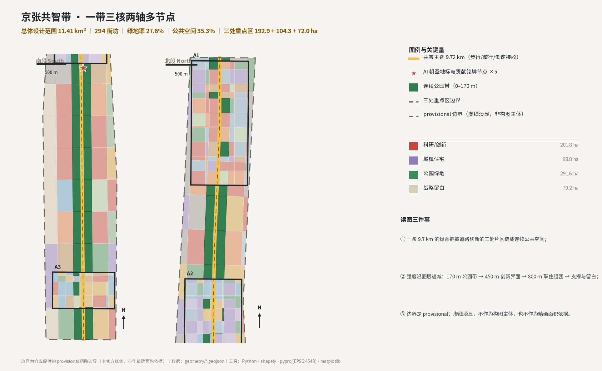
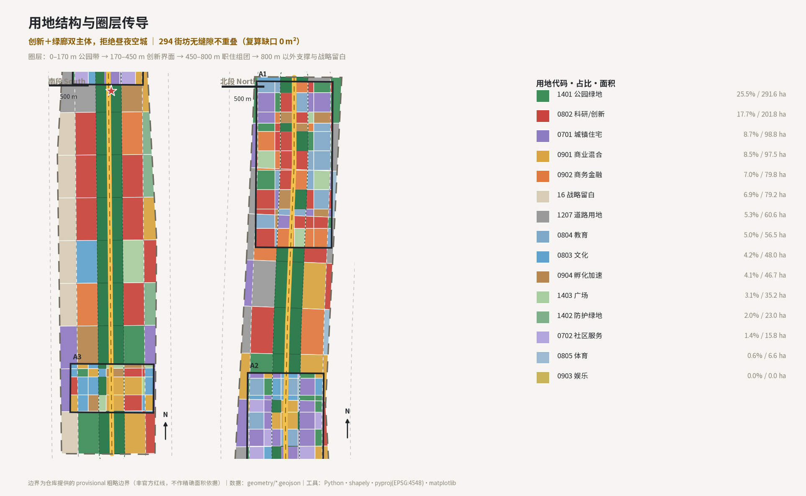
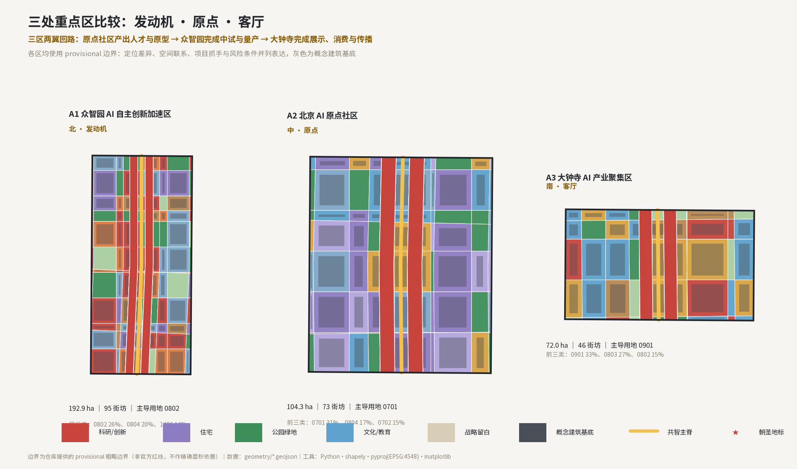
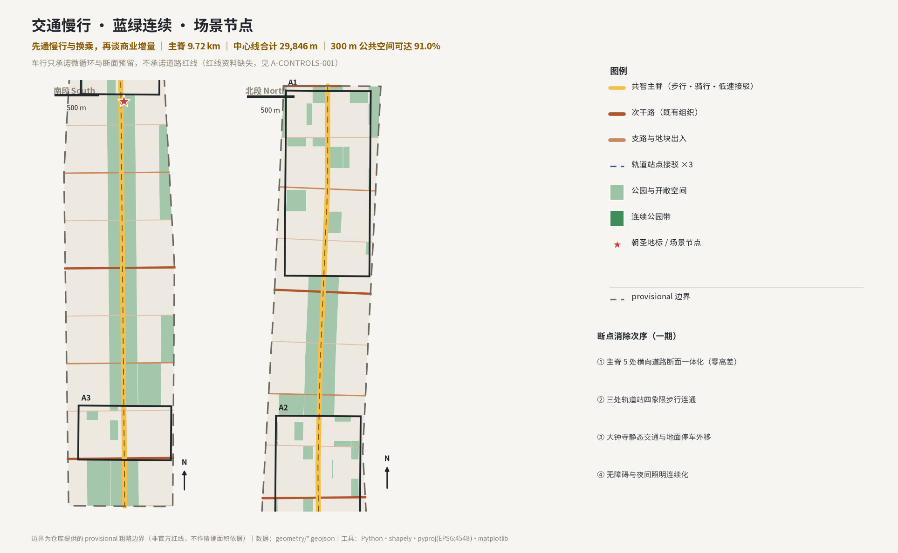
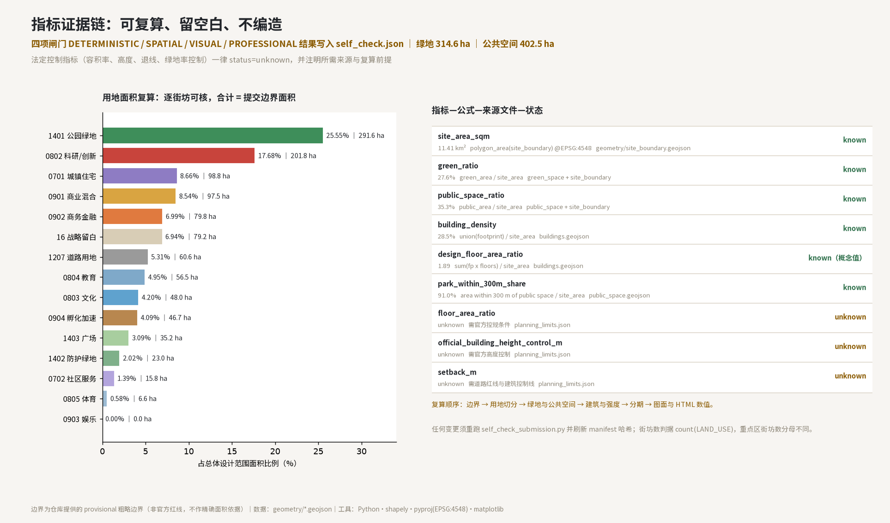
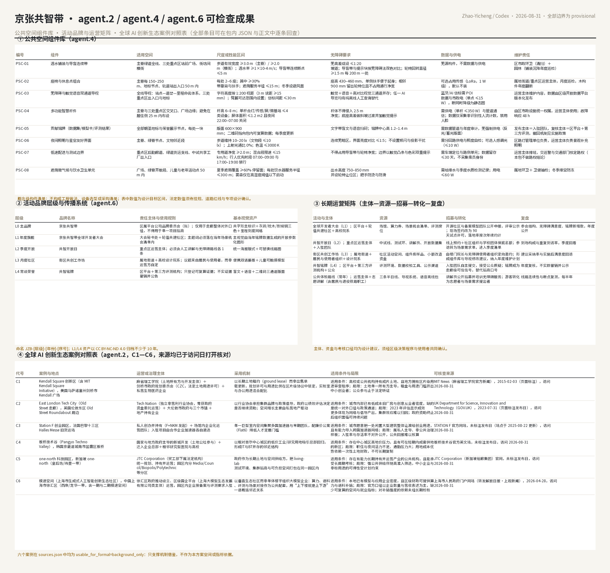

# 京张共智带：从人字形铁路到共字形城市

**主名称** 京张共智带 ｜ **英文名** JingZhang Co-Intelligence Belt（缩写 JCIB）｜ **口号** 一条铁路的百年，一条数据带的下一百年。

**命名与标识方向**（agent.1）：命名体系取"百年京张"的"共"字结构——1909 年京张铁路以"人"字形折返线穿越关沟，是"人"的技术时代；2026 年的算力、数据与人才在同一个走廊上并行，形成"共"的协作时代。标识（Logo）方向为"双轨成共"：两条平行轨道线（4 尺 9 寸老轨距与标准轨）在北四环、学清路、上地三个节点处交织，构成"共"字的两点与竖笔，负空间留出一道绿廊；标准色为铁轨灰（PANTONE Cool Gray 10）、京张砖红（近似 186C23 系）与算力青（近似 00A99D 系）三色，仅作为方向性建议，涉及既有商标与注册字体的正式使用须由主办方与权利人复核，本方案不宣称任何品牌授权。[source:AGENT-TASKBOOK]

## 设计依据与资料清单

本方案的第一依据是《百年京张AI创新带城市设计国际方案征集资格预审公告》[source:OFFICIAL-ANNOUNCEMENT]，其 1.3、1.4、1.5 三款界定了项目目的、三层范围、三处重点区面积与设计任务；以及《面向全球智能体开展百年京张AI创新带城市设计开源征集任务书》[source:AGENT-TASKBOOK]，其十条共创原则、三大定位、五大功能、三区两翼与六项必答任务构成本方案的评价基准。[standard:PROJECT-OFFICIAL-ANNOUNCEMENT]

空间依据为仓库场地包提供的临时粗略边界 [source:PROVISIONAL-BOUNDARIES]（`usable_for_formal="provisional_only"`），枚举、范围、模式与允许设计空间取自场地包 [source:SITE-PACKAGE]，登记表与处理资料只作背景导航 [source:SOURCE-REGISTRY]、[source:PROCESSED-FACT-PACK]。

专业依据分三组。第一组约束成果性质：《城市设计管理办法》[standard:MOHURD-URBAN-DESIGN-MEASURES] 与《城市、镇控制性详细规划编制审批办法》[standard:MOHURD-CONTROL-DETAILED-PLANNING] 共同说明本方案属于城市设计概念建议，不能替代控规的法定审批。

第二组约束数据口径：《国土空间调查、规划、用途管制用地用海分类指南》[standard:MNR-LAND-USE-CLASSIFICATION-GUIDE] 决定 `land_use_code` 取值，《建筑工程设计文件编制深度规定（2016年版）》[standard:MOHURD-ARCH-DESIGN-DEPTH-2016] 决定成果深度自检项。

第三组约束 AI 服务的社会边界：《生成式人工智能服务管理暂行办法》[standard:GENERATIVE-AI-INTERIM-MEASURES]、《中华人民共和国无障碍环境建设法》[standard:BARRIER-FREE-ENVIRONMENT-LAW] 与国办发〔2020〕45 号 [standard:ELDERLY-SMART-TECH-PLAN-2020-45]。

资料可用性被显式分级：官方公告与任务书为 formal 任务依据；场地包为机器可读契约依据；provisional polygon 仅支撑临时生成、可视化与自检；OpenStreetMap 与外部案例资料仅作背景校核 [source:OSM-BASEREF]、[source:CASE-REFERENCES]，本包未提交任何 OSM 派生几何。控规条件、权属、现状建筑、道路红线与市政管线全部缺失，统一登记为假设 `A-CONTROLS-001`，因此本方案中任何强度、高度、线位与投资表述均为概念建议，不得读作已审定规划结论或政府承诺。
## 三层范围工作框架

三层范围自上而下传导：统筹研究范围按公告约 43.60 平方公里 [metric:coordinated_research_area_sqm]，用于处理海淀北部科创格局与京张走廊的区域关系；总体设计范围为本包几何主体，provisional 面积 11.41 平方公里 [metric:site_area_sqm]，落在 [data:geometry/site_boundary.geojson#SITE-001]；重点区域范围三处合计公告约 368.4 公顷 [metric:key_detailed_design_area_sqm]，即众智园 192.9 公顷、北京AI原点社区 104.3 公顷、大钟寺 72.0 公顷。

传导逻辑是"研究范围定方向、设计范围定结构、重点区定抓手"：研究范围回答产业与人口的空间组织；总体设计范围把回答转成 294 个街坊的用地划分与一条 9.72 公里的慢行主脊；重点区把结构转成可开工的示范项目与场景。三层均使用 `geometry_role="provisional_constraint"`、`boundary_precision="provisional_rough"`、`official_boundary=false` 的临时边界，面积复算同样继承该精度限制；官方 polygon 发布后，本包必须重算用地覆盖、绿地率、公共空间率、建筑密度、分期面积与全部图面，复算项已在"指标体系、面积复算与合规矩阵"逐条列出。[depth:three_level_scope_framework]

## 统筹研究范围产业与未来城市研究

在 43.60 平方公里的研究范围内，本方案把京张走廊读作一条"从线性基础设施到线性创新基础设施"的连续替换：铁路带来煤炭与工厂，地铁与光纤带来算力与人才，二者的空间后果相同——站点成为组织功能的第一节点。据此提出产业空间的四条组织原则：**主脊不打断**（9.72 公里绿道全线贯通为步行优先界面）、**站点即枢纽**（轨道站 400 米内混合研发与公共服务）、**研发靠近居住**（创新用地与居住用地以 6–10 分钟步行为限相互咬合）、**留白先于填满**（在腾退时序不明的北部与边缘保留 79.2 公顷战略留白）。[depth:overall_spatial_structure]

任务书 agent.2 要求 5–8 个可核查的全球 AI 创新生态案例。本包选取六个案例（C1–C6），逐一给出运营或治理主体、所采用机制、适用条件、局限与对京张的可转化项。北美与欧洲样本为 C1 Kendall Square [source:CASE-KENDALL]、C2 East London Tech City [source:CASE-EASTTECH] 与 C3 Station F [source:CASE-STATIONF]；东亚样本为 C4 板桥技术谷 [source:CASE-PANGYO]、C5 one-north [source:CASE-ONENORTH] 与 C6 模速空间 [source:CASE-MOSHU]。每条来源在 `sources.json` 中登记标题、发布者、发布或标注日期、精确 URL、访问日期与许可说明；六个案例的 `usable_for_formal` 一律保持 `background_only`，即只支撑机制借鉴，不构成本方案的空间或指标依据。

| 代号与地点 | 运营或治理主体 | 采用机制 | 适用条件 | 局限 | 对京张的可转化项 |
|---|---|---|---|---|---|
| **C1 Kendall Square 创新区（含 MIT Kendall Square Initiative）**；美国马萨诸塞州剑桥市 Kendall 广场 `[source:CASE-KENDALL]` | 麻省理工学院（土地所有方与开发主体）＋ 剑桥市政府规划委员会（CZC，法定土地用途许可）＋ 私营生物医药企业 | 以长期土地租约（ground lease）而非出售承载更新，规划许可与用途比例在区片级协议中锁定，实验室与办公用途混合配比 | 适用条件：高校或公共机构持有成片土地、且地方拥有区片级用途审查程序 | 局限：土地单一所有方主导，租金与用途门槛挤出中小创业者；公众参与止于法定听证 | 对京张可转化：以区级持有土地的长期租约承载中试与共享工厂，把用途弹性写入出让条件而非事后审批 |
| **C2 East London Tech City（Old Street 走廊）**；英国伦敦东区 Old Street Roundabout 周边 `[source:CASE-EASTTECH]` | Tech Nation（独立非营利行业协会，曾获政府资金委托运营）＋ 大伦敦市政府与三个市镇 ＋ 地产持有企业 | 以行业协会承担集群品牌与政策倡导，政府以绩效评估决定是否继续资助；空间增长主要由私营地产驱动 | 适用条件：城市内部已有低成本旧厂房与创意从业者密度，缺的是统一对外口径与政策通道 | 局限：2023 年评估显示成效更多体现为网络与倡导产出，集群效应难以归因；政府资助终止后组织面临可持续问题 | 对京张可转化：把活动品牌与年度大会交给独立主体运营，但用第三方评估与公开数据决定续资，避免机构随资助到期而消失 |
| **C3 Station F 创业园区**；法国巴黎十三区 Halles Messe 旧货运站 `[source:CASE-STATIONF]` | 私人创办并持有（F+NKM 发起）＋ 场馆内企业化运营团队；入驻项目由合作企业加速器各自遴选 | 单一巨型室内空间集聚多国加速器与早期团队，配廉价公寓（Flat6）降低人才定居门槛 | 适用条件：城市愿意把一处闲置大型建筑整体让渡给创业用途，且有能力导入跨国加速器网络 | 局限：属私人主导、非公共治理样板；入驻率与存活率不对外公开，公共回报难以核算 | 对京张可转化：在重点区保留一处可整体让渡的大跨度建筑作为加速器容器，但要求公开入驻与退出统计以换取政策支持 |
| **C4 板桥技术谷（Pangyo Techno Valley）**；韩国京畿道城南市盆唐区板桥 `[source:CASE-PANGYO]` | 国家与地方政府主导的新城开发（土地公社参与）＋ 迁入企业总部＋相邻研究型医院与高校 | 以相对首尔中心城区的低价工业/研究用地吸引总部回归，形成IT与BT并存的邻近结构 | 适用条件：存在中心城区高地价压力，且有可在短期内成套供地的新区 | 局限：职住与夜间活力不足、通勤压力大；用地成本优势依赖一次性土地财政，不可长期复制 | 对京张可转化：以产业用地价格梯度换取总部与中试落地，但同步配齐居住与生活配套，避免复制睡城化代价 |
| **C5 one-north 科技园区**；新加坡 one-north（皇后坊/纬壹一带） `[source:CASE-ONENORTH]` | JTC Corporation（贸工部下属法定机构）统一规划、持有并运营；园区内分 Media/Council/Biopolis/Polytechnic 等分区 | 政府作为长期土地与空间供给方，把 living-lab 测试环境、集群招商与可负担空间打包在同一园区内 | 适用条件：存在有能力长期持有并运营产业的公共机构，且能承受长周期考核 | 局限：强公共供给伴随高准入筛选，中小企业与非标用途的可得性受计划约束 | 对京张可转化：由区级平台公司统一持有走廊内创新空间并运营 living-lab，公开准入规则与排队数据 |
| **C6 模速空间（上海市生成式人工智能创新生态社区）**；中国上海市徐汇区（西岸/龙华一带，含一期与二期模速空间） `[source:CASE-MOSHU]` | 徐汇区政府推动设立、区级国企平台（上海大模型生态发展有限公司类主体）运营，园区内企业按备案与评测要求入驻 | 以垂直生态社区而非单体楼宇组织大模型企业：算力、语料、评测与场景对接作为公共配套，用“上下楼就是上下游”一语概括邻近关系 | 适用条件：本地已有模型与应用企业密度，且区级财政可提供算力与语料补贴 | 局限：官方口径以企业数量与营收表述为主，缺少可复算的空间与就业指标；对补贴强度的依赖未经长期检验 | 对京张可转化：把评测、语料与场景开放做成走廊级公共配套，并要求以可复算指标（街坊数、岗位数、能耗）替代企业数量口径 |

六个案例共同指向三条可迁移结论：其一，长期土地与空间供给（C1 租约、C5 法定机构持有）比一次性补贴更能维持走廊级创新密度；其二，集群品牌可以由独立主体运营（C2），但续资必须绑定第三方评估与公开数据，否则组织随资助到期而瓦解；其三，公共配套（C3 低成本公寓、C4 职住失衡的反例、C6 算力语料评测）决定人才能否留下，而这恰是京张走廊以 294 街坊无缝铺砌、把居住与生活配套写进用地结构的原因。

上述结论只界定机制类型。空间落位与指标结论一律由本包几何、矩阵与 `metrics.json` 支撑，不引用任何案例事实数据；早期登记的八条待验证机制假设（`A-ECO-004`）在本版中被 C1–C6 逐条对应替代：H1→C1/C5（长期租约与公共持有）、H2→C5（living-lab 测试环境）、H3→C4（枢纽与腹地分工的成本动因）、H4→C3/C5（园区企业化运营）、H5→C6（一地一策的公共界面契约）、H6→C3（低成本居住与共享空间）、H7→C2（网络而非单点园区）、H8→C4/C6（人才密度与配套优先于补贴）。逐条来源清单见「参考资料」之后的「案例来源逐项可核查清单」。

## 总体设计范围城市更新与控规深度城市设计

总体结构为**"一带三核、两轴联动、圈层传导、多节点开花"**。一带即 9.72 公里京张遗址公园共智主脊 [data:geometry/roads.geojson#ROAD-001]；三核为众智园、北京AI原点社区、大钟寺三处重点区 [data:geometry/key_areas.geojson#PROV-KEY-001]；两轴为北四环—学清路创新服务轴与清河—西直门城市功能轴；多节点为 5 处 AI 朝圣地标与贡献展示节点。主脊把三处原本被道路割裂的片区缝成一条可步行连续的公共空间，同时以"圈层"把强度沿走廊梯度递减：0–170 米为公园带（`LU-116` 为最大公园绿地街坊），170–450 米为创新界面与混合功能，450–800 米为职住协同组团，800 米以外为支撑与战略留白。[depth:land_use_layout]

按 `brief/site-package/enums/land_use_codes.json` 的用地代码，总体设计范围被划分为 294 个无缝隙、不重叠的街坊（几何并集与提交边界一致，覆盖缺口实测为 0 平方米）。城市更新路径以"拆改留、留为先"排序：现状工业与仓储类以改造（`renew`）为主、公共服务与居住配套以保留提质为主、违建与低效仓储类才允许拆除重建；概念上保留与改造占 44%，新建增量集中于三处重点区的轨道站点 400 米范围。建设规模方面，建筑基底 28.5%、地上建筑面积 2154 万平方米、设计容积率 1.89 为概念体量控制值，须待官方控规条件确认。[depth:development_intensity_controls]

总体设计范围的城市设计深度对标控规编制办法与编制深度规定，但因缺少官方控规条件，本节结论按城市设计导则性质理解。[standard:MOHURD-CONTROL-DETAILED-PLANNING]
## 重点区域详细设计

**A1 众智园 AI 自主创新加速区**（公告约 192.1 公顷，本包几何 192.9 公顷，95 个街坊，`0802` 为主导用地）：定位"全栈自主创新的发动机"。空间结构为"一脊两谷三环"——绿脊延续主脊，算法谷与硬件谷分列两侧，创新环、中试环、生活环串联。以 科研用地 街坊 [data:geometry/land_use.geojson#LU-105] 为启动单元，布置开放算力、具身智能中试与共享检测。风险条件：腾退时序与权属不明，故产业用地只给比例不给地块清单。[data:geometry/key_areas.geojson#PROV-KEY-001]

**A2 北京AI原点社区**（约 104.3 公顷，几何 104.3 公顷，73 个街坊）：定位"从高校到市场的第一公里"。以清华园车站旧址为文化锚点布置 AI 原点纪念馆 清华园车站·AI原点纪念馆，两侧以人才公寓、社区服务与教育科研配套形成"近校型创新街区"；更新方式为低扰动微循环，优先利用存量楼宇底层做场景展厅与社区实验室。[data:geometry/key_areas.geojson#PROV-KEY-002]

**A3 大钟寺 AI 产业聚集区**（约 72.0 公顷，几何 72.0 公顷，46 个街坊）：定位"智能体与内容消费的公共客厅"。以钟为意象布置智钟塔朝圣地 大钟寺·智钟塔朝圣地，组织地铁站四象限步行连通与静态交通改善，把钟古器物文化、AI 内容消费与首店经济叠合在同一处公共界面上；该处人流最复杂，先做慢行与换乘，再做商业增量。[data:geometry/key_areas.geojson#PROV-KEY-003]

任务书的结构要素在本方案中的对应关系逐项交代如下。三大定位：百年京张文化带由第 9 节的遗址公园主脊、五处朝圣地标与"站点—道岔—里程"导视体系承接；都市 AI 生活体验带由第 6 节场景卡与第 8 节 15 分钟生活圈、无障碍与适老化配置承接；AI 融合创新带由第 4、7 节的圈层结构与用地配比承接。五大功能：AI 全栈自主创新体系落在 A1 众智园（研发、中试、共享检测）；世界级 AI 创新生态落在 A2 北京AI原点社区（近校型街区与成果转化）；AI+场景赋能新范式落在 12 张场景卡与"清单发布—申报—复核—回看"闭环；智能化AI活力城市落在主脊公共空间、市政新基建与数据中枢；AI治理全球话语权落在贡献铭牌、模型卡与评测记录构成的公共可核查机制。

三区两翼：三区即 A1 众智园（AI 全栈自主创新体系与 AI 治理全球话语权）、A2 AI 原点社区（世界级 AI 创新生态）、A3 大钟寺 AI 产业集聚区（智能原生新业态）。任务书的两翼为**中关村科技服务翼**（要素全球化配置、中关村 IP 与资本赋能）与**小月河场景赋能翼**（AI 场景赋能与智能化 AI 活力城市），本方案把它们分别落位为：中关村科技服务翼沿总体设计范围西缘的学清路—中关村北大街一线组织资本、IP 与全球化要素接口，作为跨出边界的"服务面"；小月河场景赋能翼沿范围东侧小月河蓝线组织滨水场景试验与活力城市体验，作为生态与场景的"赋能面"。两者与三区的边界关系由 provisional polygon 界定，具体范围以官方核定为准。为避免概念混用，本方案另用的"南段（西直门—大钟寺）／北段（学院路—上地）"仅是**施工与分期意义上的空间分段**，不是任务书两翼的替代或改名，二者不可互换。[depth:three_key_area_detailed_design]

外部区域协同（非承诺性接口）：向北接未来科学城与怀柔科学城的装置与成果溢出，向东经经开区承接中试与量产转化，向城内联系北纬社区等既有居住片区补足生活服务，并通过京津冀层面承接算力与数据要素的跨区域协作。上述接口只定义"本方案愿意对接的要素流方向"——人才与成果流入、中试与场景需求流出、评测与标准共建——不包含任何已谈妥的合作、投资、选址或政策安排，也不预设其他片区的功能定位。

三处重点区的详细设计深度按编制深度规定与控规编制办法自检，涉及法定指标处一律标注为概念值。[standard:MOHURD-ARCH-DESIGN-DEPTH-2016]
## AI 创新生态、人才画像与 AI+ 场景

五类用户画像与场景—空间—运营映射（agent.3）：①**算法科学家**需要跨学科偶遇与低成本算力，对应创新界面的开放式实验室与"算力超市"，由运营主体按季度轮换上墙；②**AI 产品经理与独立开发者**需要真实用户与测试许可，对应 24 小时开放的街区场景实验室与临时许可清单；③**机器人工程师**需要连续硬化地面、货运接驳与试车环路，对应人字形展场 人字形展场·具身智能测试环；④**科技创业者**需要资本与政务服务的确定性，对应原点社区的一站式企服窗口；⑤**周边居民与老年人**需要不被算法抛下的日常服务，对应社区服务设施用地与保留人工通道的 AI 公共服务。

十二张 AI 场景卡（编号 SC-01 至 SC-12，均含触发条件、数据输入、空间载体、AI 服务、人工复核与验证指标）：SC-01 绿道慢行连续性与断点识别；SC-02 轨道站点四象限无障碍接驳；SC-03 自动驾驶无人接驳环线；SC-04 末端无人配送与货运夜间窗；SC-05 社区健康助手与家庭医生协同；SC-06 个性化学习与开放课程空间；SC-07 具身智能中试共享工厂；SC-08 微电网与储能调度；SC-09 铁路遗址数字再现与 AI 导览；SC-10 街区级社区共治议事平台；SC-11 企业政策服务智能体；SC-12 公共安全与大型活动人流复核。其中 **SC-03／SC-04／SC-07 为三个 AI 产业测试验证场景**，与仓库场景登记表 `scenarios/` 中 `robot-delivery-low-speed` 等条目对应。[depth:blue_green_public_space]

所有场景遵循三条硬边界：不使用可识别个人隐私的数据，涉及人脸、健康、居住与未成年人的一律不进入本方案；自动判断只能生成候选建议，处置权保留给人类专业人员并留痕；任何场景被误读为已审定工程或政策时以正文与声明为准（统一边界条款）。[source:STANDARD-GENAI-MEASURES-2023]

上述场景卡的模型与数据来源、失败样本与人工复核率要求在 `standard_matrix.json` 中对应该条标准响应。[standard:GENERATIVE-AI-INTERIM-MEASURES]
## 用地、建筑规模与拆改留方案

| 用地代码与类别 | 面积（公顷） | 占总体设计范围 |
|---|---|---|
| `1401` 公园绿地 | 291.6 | 25.5% |
| `0802` 科研用地 | 201.8 | 17.7% |
| `0701` 城镇住宅用地 | 98.8 | 8.7% |
| `0901` 商业用地 | 97.5 | 8.5% |
| `0902` 商务金融用地 | 79.8 | 7.0% |
| `16` 留白用地 | 79.2 | 6.9% |
| `1207` 城镇村道路用地 | 60.6 | 5.3% |
| `0804` 教育用地 | 56.5 | 5.0% |
| `0803` 文化用地 | 48.0 | 4.2% |
| `0904` 其他商业服务业用地 | 46.7 | 4.1% |
| `1403` 广场用地 | 35.2 | 3.1% |
| `1402` 防护绿地 | 23.0 | 2.0% |
| `0702` 社区服务设施用地 | 15.8 | 1.4% |
| `0805` 体育用地 | 6.6 | 0.6% |
| `0903` 娱乐用地 | 0.0 | 0.0% |

上表由 [data:geometry/land_use.geojson] 逐街坊复算得到，合计等于提交边界面积 1141.3 公顷。科研用地 201.8 公顷与公园绿地 291.6 公顷共同构成"创新＋绿廊"的双主体，商业与商务 224.0 公顷沿主脊两侧 170–450 米创新界面集中，居住 98.8 公顷分布在 450–800 米职住组团，避免把产业走廊做成昼夜空城。

建筑基底共 222 个 [data:geometry/buildings.geojson#BLDG-0001]，全部落在可建设街坊内且退线 12–16 米；概念层数按功能赋值（研发 6 层、孵化 8 层、办公 12 层、住宅 11 层、文化 5 层、留白 1–2 层），平均概念高度 24.4 米，最高 43 米出现在两处轨道枢纽，作为体量上限而非审批结论。拆改留：现状保留与留白类 142.8 公顷，改造类 182.3 公顷，拆除新建集中于低效仓储与危房。[depth:retain_renovate_demolish]

用地代码与类别名称取自用地用海分类指南的子集，正式法定用途须待控规与专项调查确认。[standard:MNR-LAND-USE-CLASSIFICATION-GUIDE]
## 交通、轨道、市政与公共服务设施

道路与慢行：车行只承诺"微循环＋断面预留"，不承诺红线。中心线图层共 22 条、合计 29,846 米 [data:geometry/roads.geojson#ROAD-002]，其中 9.72 公里为绿道主脊（步行与自行车为主，允许低速自动接驳在特定时段借用），次干路与支路为既有道路的功能性组织，接驳线 3 条分别指向三处重点区的轨道站点。停车策略：外圈内供——重点区外围以 P+R 与共享停车截流，走廊内部以地下与机械式静态交通替代地面停车，把地面还给行人与绿地。[depth:traffic_rail_slow_parking]

市政与新型基础设施：以"一根廊、一张网、一个中枢"组织——综合管廊预留沿主脊两侧，算力与配电随轨道站点分级布置（区域能源站＋站点级储能），城市数据中枢落在众智园并与区级平台对接；海绵城市按公园带下沉式绿地与透水铺装组织面源径流；照明与物联杆件与导视共杆，减少二次开挖。所有工程内容受 `A-CONTROLS-001` 约束，仅为概念建议，需管线普查与消防、防洪复核。[depth:municipal_new_infrastructure]

公共服务：以 15 分钟社区生活圈配置教育、医疗、养老、文体与社区服务，用地 126.9 公顷，保证新增产业人口不摊薄既有居民的服务水位；无障碍与适老化按法与实施方案执行，AI 服务必须同时保留人工与线下通道。[source:STANDARD-BARRIER-FREE-LAW]

上述设施配置同时接受适老化与无障碍双重复核，AI 服务不得成为唯一办理路径。[standard:ELDERLY-SMART-TECH-PLAN-2020-45]
## 蓝绿空间、公共空间与城市风貌

蓝绿系统以"一脊、多楔、零串珠"组织：一脊是 314.6 公顷公园绿地与防护绿地构成的连续绿脊 [data:geometry/green_space.geojson]，多楔是把外围风廊与学园绿地引入城市内部的绿楔，零串珠是口袋公园。公共空间用地 402.5 公顷 [data:geometry/public_space.geojson]，即 35.3% 的用地为 24 小时开放的公共界面，其中 91.0% 的用地在公共空间 300 米服务半径内。

5 处朝圣地标与荣誉展示节点（agent.4、agent.5）沿主脊依次展开：北京北站·百年开机广场 纪念 1909 年京张铁路自主建成，大钟寺·智钟塔朝圣地 以大钟寺古钟为声景触发器，清华园车站·AI原点纪念馆 复原清华园车站作为"AI 原点"起点叙事，人字形展场·具身智能测试环 把人字形折返线转译为具身智能测试环，众智之巅·全球开发者天幕 为年度全球开发者大会的天幕会场。每个节点配一块"贡献铭牌"：公开数据集、模型卡、评测结果与人工复核记录，铭牌内容以可核查证据为限，不接受未披露的合成结果冒充实测。[depth:height_massing_character]

文化叙事（agent.5）为三段式："人字形—百年铁路—共字形城市"。材料语言沿用京张铁路的灰砖、枕木与钢轨锈色，转译为当代构筑物的三种基本界面（砖墙、木格栅、耐候钢）；导视方向以"站点—道岔—里程"命名体系（如"京张 3 公里·道岔广场"），避免商业主题公园腔。[source:STANDARD-MOHUD-URBAN-DESIGN]

无障碍与适老化是本节的空间硬约束：全部地标与主脊满足连续轮椅通行、扶手与休息座椅间距、语音与触觉导视双通道，且任何 AI 导览服务均保留人工讲解与线下办理替代通道。[standard:BARRIER-FREE-ENVIRONMENT-LAW]

### 公共空间组件库（agent.4 补充成果）

组件库是概念级设计成果，用于检验主脊与重点区能否由有限、可维护的构件类型支撑，不构成工程做法、设备选型或采购清单。法定无障碍数值须待控规、道路红线与专项设计确认，本表给出的均为设计目标区间。[standard:BARRIER-FREE-ENVIRONMENT-LAW]

| 编号与组件 | 适用空间 | 尺度或性能区间 | 无障碍要求 | 数据与供电需求 | 维护责任 | 成果性质 |
|---|---|---|---|---|---|---|
| **`PSC-01`** 透水铺装与导盲连续带 | 主脊绿道全线、三处重点区站前广场、街坊间横街 | 步道有效宽度 ≥3.0 m（主脊）/ ≥2.0 m（横街）；透水率 ≥1×10-4 m/s；导盲带连续断点 ≤5 m | 无高差或设 ≤1:20 坡道；导盲带与提示块按无障碍法双色对比；轮椅回转直径 ≥1.5 m 每 200 m 一处 | 无源构件，不需数据与供电 | 区市政环卫（清扫）＋ 园林（铺装沉降年度巡检） | 概念级构件，不构成工程做法或采购清单 |
| **`PSC-02`** 座椅与休息点组合 | 主脊每 150–250 m、地标节点、轨道站出入口 50 m 内 | 每处 2–6 座；其中 ≥30% 带靠背与扶手；遮荫服务半径 ≤15 m；冬季设避风面 | 座高 430–460 mm、单侧扶手便于起身；相邻 900 mm 留出轮椅位且不占用通行净宽 | 可选占用传感（LoRa，1 W 级），默认不装 | 属地街道/重点区运营主体，月度巡检，木构件年度翻新 | 数量由 294 街坊几何与主脊长度派生，为设计建议值 |
| **`PSC-03`** 无障碍与触觉语音双通道导视 | 全线导视：站点—道岔—里程命名体系，三处重点区出入口与地标 | 字符高度按 1:200 视距（3 m 读距 ≥15 mm）；臂展可达范围内设置；信标间距 ≤30 m | 触觉＋语音＋高对比视觉三通道并存；任一 AI 导览均有纯离线人工查询替代 | 蓝牙/AI 信标需 POI 数据与市政电（单点 ≤15 W），断网时降级为静态图 | 运营主体维护内容，数据由区级开放数据平台版本化发布 | 命名体系见正文文化叙事节；不含具体品牌商标 |
| **`PSC-04`** 多功能智慧杆件 | 主脊与三处重点区交叉口、广场边缘；避免在居住侧 25 m 内布设 | 杆高 6–8 m；单杆合灯/传感/屏/微基站 ≤4 类设备；屏体面积 ≤1.2 m2 且夜间 22:00–07:00 关闭 | 杆体不得侵入 2.5 m 净宽；底座高差做斜坡过渡并加触觉提示 | 需供电（单杆 ≤350 W）与管道通信；数据仅采集非识别性人流计数，禁用人脸 | 由区市政设施统一权属，运营主体使用；故障响应 48 h | 设备清单为概念配置，须待管位与负荷实测 |
| **`PSC-05`** 贡献铭牌（数据集/模型卡/评测结果） | 全部朝圣地标与荣誉展示节点，每处一块 | 版面 600×900 mm；二维码指向包内可复算数据；每季度更新 | 文字带盲文与语音扫码；铭牌中心高 1.2–1.4 m | 需数据管道与年度审计，无强制供电（反光/蓄光版面） | 发布主体＝入驻团队，复核主体＝区平台＋第三方评测，撤回机制见实施政策 | 仅登记可核查证据，禁止合成结果冒充实测 |
| **`PSC-06`** 夜间照明与星空友好界面 | 主脊、绿脊节点、文物邻近段 | 步道维持 10–20 lx（文物段 ≤10 lx）；上射光通比 0%；色温 ≤3000 K | 连续无暗区，界面亮度对比 ≤1:5；不设置频闪与投影干扰 | 需分回路供电与照度自检；可选人感调光（≤10 W） | 区路灯管理单位负责，运营主体负责景观补充照明 | 数值为设计目标，须经实测复核 |
| **`PSC-07`** 低速配送与测试边界 | 重点区后勤廊道、绿道货运支线、中试共享工厂出入口 | 专用道净宽 ≥2.0 m；混合段限速 ≤15 km/h；行人优先时段 07:00–09:00 与 17:00–19:00 禁行 | 不得占用导盲带与轮椅净宽；边界以触觉凸条与色彩双重提示 | 需车端定位与路侧单元；数据留存 ≤30 天，不采集乘员身份 | 运营主体排班，交巡警与交通部门核定路权（本包不做路权结论） | 路权与法规适配是外部依赖，属未决条件 |
| **`PSC-08`** 遮荫微气候与饮水卫生单元 | 广场、绿脊开敞段、儿童与老年活动点 50 m 内 | 夏季遮荫覆盖 ≥60% 停留面；每处饮水器服务半径 ≤300 m；雾森仅在高湿度阈值以下启动 | 出水高度 750–850 mm 并设轮椅让位区；把手防烫与防滑 | 需给排水与季度水质检测记录；用电 ≤60 W | 属地环卫＋ 卫健抽检；冬季排空防冻 | 以人体感受与卫生合规为约束，不以降温能耗为目标 |

组件库与用地结构的对应关系可在 `visual/index.html#components` 模块中逐项查看；八类组件覆盖任务书点名的铺装、座椅与休息点、无障碍与触觉导视、智能杆件、场景铭牌、夜间照明、低速配送边界，并补充遮荫微气候与饮水卫生单元一项以回应公共利益与包容性维度的意见。[depth:blue_green_public_space]

## 更新项目清单、实施政策与分期计划

十二个示范项目构成更新项目库：①绿道全线贯通与断点消除；②三处轨道站四象限步行连通改造；③北展—西直门对外交流节点；④大钟寺智能体垂直社区；⑤清华园车站 AI 原点纪念馆；⑥人字形具身智能测试环；⑦开放算力与模型评测中枢；⑧低效仓储腾退与中试共享工厂；⑨职住协同完整社区（人才公寓＋保障型租赁）；⑩15 分钟生活圈补短板；⑪综合管廊与能源站；⑫数据中枢与安全治理平台。[depth:renewal_project_list]

分期以主脊贯通为先、产业成网其次、组团更新托底：一期 386.8 公顷（34%，2026—2028）完成绿道贯通、大钟寺与原点社区起步区；二期 308.4 公顷（27%，2028—2031）完成众智园与沿线创新界面成网；三期 446.1 公顷（39%，2031—2035）完成职住组团更新与留白深化 [data:geometry/phasing.geojson#PHASE-1]。实施政策只提机制不替政府决策：场景机会清单与临时许可、公共数据授权运营与退出机制、存量房产用途转换的正负面清单、跨权属统一运营主体与收益平衡协议、以及面向中小企业与开源社区的算力与评测券。[depth:phasing_implementation]

### 活动品牌与传播视觉系统（agent.6 补充成果）

品牌系统分五级，L0 承载走廊对外口径，L1–L4 为可交付、可考核与可撤销的具体活动，避免把大会口号当作长期运营。

| 层级与品牌名称 | 频次 | 责任主体 | 命名与使用规则 | 基本视觉资产 |
|---|---|---|---|---|
| **L0 主品牌 ｜ 京张共智带** / Jingzhang Co-Intelligence Belt | 常年 | 区属平台公司品牌委员会（拟） | 仅用于走廊整体对外口径，不得用于单一项目招商 | 共字形主标识＋灰砖/枕木/耐候钢三色＋里程刻度网格 |
| **L1 年度旗舰 ｜ 京张共智带全球开发者大会** / Jingzhang Global Developer Assembly | 每年 1 届，秋季 | 大会秘书处＋轮值共建社区 | 主题词必须落在当年场景机会清单内 | 主视觉由当年铭牌数据生成的开放参数化图形 |
| **L2 季度开放 ｜ 共智开放日** / Co-Intelligence Open Day | 每季度 1 次 | 重点区运营主体 | 必须含人工讲解与无障碍路线各 1 条 | 统一海报版式＋可替换线路图 |
| **L3 月度社区 ｜ 街区共创工作坊** / Neighbourhood Co-design Workshop | 每月 1 场 | 属地街道＋高校设计院系 | 议题来自居民与使用者，而非运营方自定 | 便携双语展板＋儿童可触摸模型 |
| **L4 常设荣誉 ｜ 共智铭牌** / Co-Intelligence Plaque | 常年发布，季度评审 | 区平台＋第三方评测机构 | 只登记可复算证据；不实证据撤销并公告 | 盲文＋语音＋二维码三通道版面 |

命名规则：活动代号统一为 `JZB-[层级]-[年份]-[序号]`（例：`JZB-L1-2028-01`）；中文名 ≤12 字且必须含“共智”或“京张”之一；英文名为首字母大写的短语，不超过 4 个实词，禁止拼音混写；同一层级不得出现两个同名活动，历史名称永久保留不复用。

基本视觉元素：基本视觉元素锁定五项：①共字形节点（由“人”字折返线合并为“共”字的轨道母题）；②灰砖—枕木—耐候钢三色材料语言；③里程刻度网格（以 0.5 公里为最小单元）；④站点—道岔—里程三级导视命名；⑤开放参数化数据图形（由铭牌数据集生成，禁止使用不可核查的装饰性 AI 图）。禁止项：不使用企业商标、不使用立体渐变、不使用与铁路遗产无关的赛博朋克符号。

双语传播模板：双语传播模板固定为 A 竖版海报（594×841 mm）、B 横版传播图（1920×1080 px）、C 现场易拉宝（850×2000 mm）、D 无障碍电子通告（HTML，单栏、字号可调、对比度 ≥7:1、含替代文本）。四种模板中文在上、英文在下（横版为左中右英），字号比 1:0.82；同一活动两语文案必须由同一人复核，不允许机翻直接发布。

内容审核与归档：内容审核三级：①运营方自审（事实与日期）；②区平台合规审（是否含企业承诺、投资额、审批结论、可识别个人数据）；③第三方与公众抽检（铭牌数据可复算性）。任一级否决即撤回，48 小时内公示更正记录。宣传中出现的任何数字必须能回指 `metrics.json` 或图件索引。 资产归档责任：源文件（可编辑工程文件＋字体许可声明＋数据集校验和）在活动结束后 30 日内提交区级资产库，保留期 ≥10 年；L1/L4 资产对外以 CC BY-NC-ND 4.0 发布（第三方素材按各自许可），原始工程文件不对外；责任人＝当期运营主体品牌负责人，交接时签署资产清单。

### 长期运营矩阵（主体—资源—招募—转化—复盘）

| 活动 | 主体 | 资源 | 招募 | 转化 | 复盘 |
|---|---|---|---|---|---|
| 全球开发者大会（L1） | 区平台＋轮值共建社区＋高校院系 | 场馆、算力券、场景机会清单、评测席位 | 开源社区与备案模型团队公开申报，评审公示 | 现场签约改为 90 天试点许可，落地率按次年续约计 | 参会结构、无障碍满意度、铭牌新增数，年度公开 |
| 共智开放日（L2） | 重点区运营主体＋入驻团队 | 中试线、测试环、讲解员、开放数据集 | 线上预约＋社区组织与学校团体保底名额 | 参访转为场景需求单，进入季度清单 | 到场构成与重复到访率，季度回看 |
| 街区共创工作坊（L3） | 属地街道＋居民与使用者组织＋设计院系 | 社区活动空间、组件库样品、小额改造资金 | 由楼门院长与无障碍使用者组织定向邀约 | 形成组件库与导视修改建议，纳入年度维护计划 | 建议采纳率与实施后满意度回访 |
| 共智铭牌（L4） | 区平台＋第三方评测机构＋公众 | 评测环境、数据校验工具、公示渠道 | 入驻团队自主提交，接受公众质疑 | 铭牌成为走廊级可信信号，替代招商口号 | 年度复核，不实即撤销并公示 |
| 公共体验路线（常年） | 运营主体＋志愿讲解（含居民与退役铁路职工） | 三条半日线、导视系统、语音离线包 | 讲解员公开招募并培训无障碍服务 | 游客转化为志愿者与场景需求提出者 | 线路连续性与断点复测，每半年 |

矩阵中的主体、资金与考核口径均为设计建议，须经区级决策程序与使用者共同确认；本包不声称任何机构已承诺参与。[source:AGENT-TASKBOOK]

## 指标体系、面积复算与合规矩阵

全部指标由本包几何复算，公式、来源文件与置信度写入 `metrics.json`。规模类：总体设计范围 [metric:site_area_sqm]、建筑基底 [metric:building_footprint_area_sqm]、地上建筑面积 [metric:total_floor_area_sqm]、绿地上限 [metric:green_space_area_sqm]。

比率类：绿地率 [metric:green_ratio]、公共空间用地占比 [metric:public_space_ratio]、建筑密度 [metric:building_density]、公共空间 300 米可达比 [metric:park_within_300m_share]、设计容积率 [metric:design_floor_area_ratio]（概念值，非审定容积率）。

结构与运营类：三处重点区面积 [metric:key_area_zhongzhiyuan_ai_acceleration_area_sqm]、[metric:key_area_beijing_ai_origin_community_sqm]、[metric:key_area_dazhongsi_ai_industry_cluster_sqm]，分期面积 [metric:phasing_area_phase_1_sqm]、[metric:phasing_area_phase_2_sqm]、[metric:phasing_area_phase_3_sqm]，以及街坊数 [metric:land_use_parcel_count]、地标数 [metric:pilgrimage_landmark_count]。

法定控制指标一律留空而非编造：官方容积率 [metric:floor_area_ratio]、建筑高度控制 [metric:official_building_height_control_m]、绿地率控制 [metric:official_green_ratio_control]、退线 [metric:setback_m] 状态均为 `unknown`，并在 `metrics.json` 内注明所需来源与复算前提。[depth:metrics_recalculation]

官方 polygon 发布后的复算顺序为：边界→用地切分→绿地与公共空间→建筑与强度→分期→图面与 `visual/index.html` 数值；任一环节变更须重跑 `scripts/self_check_submission.py` 并刷新 manifest 哈希。合规矩阵覆盖公告 1.3.1–1.3.3、1.4.1–1.4.3、1.5.1.1–1.5.3.3 与 agent.1–agent.6 共 23 条必要求，逐条给出正文章节、图层、指标、图纸、HTML 模块、来源、标准、假设与自检编号；深度矩阵覆盖 15 个核心深度项且全部为 `complete`；标准矩阵响应 9 条专业标准。三类矩阵与本文互指，构成"文字—数据—图面"三向可追溯的证据链。[source:SITE-PACKAGE]
## 风险、版权与合规说明

九项主要风险与应对：①**边界与面积精度**——临时边界，须复核后重算；②**控规条件缺失**——强度全部标注为概念值；③**权属与腾退不确定**——项目库只给类型与位置候选，不给地块清单；④**产业与招商不确定性**——不写企业名单、投资额与产值；⑤**文保与考古**——遗址公园与清华园车站、大钟寺以保护优先，施工前须专项评估；⑥**交通与工程可实施性**——无红线与断面资料，线位为示意；⑦**数据安全与隐私**——禁用人脸与可识别个人数据，保留人工复核；⑧**算法幻觉与虚假数据**——铭牌要求可核查证据，禁止合成数据冒充实测；⑨**图面误导**——provisional 边界在全部图面上以虚线与注记淡显，不作为构图主体。[depth:risk_missing_data]

版权与来源：全部几何、指标、图件、PDF 与 HTML 由本 agent 依场地包数据派生生成，工具链为 Python（shapely、pyproj、matplotlib）与本地离线 HTML，未使用商业地图瓦片、远程脚本、外部字体或需授权的字体商标；引用文字为公开政府信息与机构公开资料的要点转述，不涉及原文再分发；生成式 AI 服务相关合规要求已在场景边界中落实。本方案为概念建议与深化研究参考，不代表官方立场、审批结论或实施承诺。[source:SOURCE-REGISTRY]

成果深度自检参照编制深度规定执行。[standard:MOHURD-ARCH-DESIGN-DEPTH-2016]
## 参考资料

以下条目均已在 `sources.json` 中登记为可机器读取的来源记录，正文以上述标记方式回引。

- [source:OFFICIAL-ANNOUNCEMENT] 百年京张AI创新带城市设计国际方案征集资格预审公告，北京市规划和自然资源委员会，2026-05-09。
- [source:AGENT-TASKBOOK] 面向全球智能体开展百年京张AI创新带城市设计开源征集任务书，`brief/site-package/agent_taskbook.json`。
- [source:PROVISIONAL-BOUNDARIES] 三层范围与三处重点区 provisional polygon，`brief/site-package/geometry/provisional_boundaries.geojson`。

以下四项构成成果性质与数据口径的专业依据：

- [standard:MOHURD-URBAN-DESIGN-MEASURES] 城市设计管理办法；[standard:MOHURD-CONTROL-DETAILED-PLANNING] 城市、镇控制性详细规划编制审批办法。
- [standard:MNR-LAND-USE-CLASSIFICATION-GUIDE] 国土空间调查、规划、用途管制用地用海分类指南；[standard:MOHURD-ARCH-DESIGN-DEPTH-2016] 建筑工程设计文件编制深度规定（2016年版）。

以下三项构成 AI 公共服务与社会包容依据，并另附背景类资料说明：

- [standard:GENERATIVE-AI-INTERIM-MEASURES] 生成式人工智能服务管理暂行办法；[standard:BARRIER-FREE-ENVIRONMENT-LAW] 无障碍环境建设法；[standard:ELDERLY-SMART-TECH-PLAN-2020-45] 国办发〔2020〕45 号。
- [source:OSM-BASEREF] OpenStreetMap（ODbL 1.0，仅背景校核，未派生几何）；[source:CASE-REFERENCES] 全球 AI 创新生态案例公开资料（仅机制参考，不构成合作关系）。
- [source:SITE-PACKAGE] 场地包枚举与允许设计空间；[source:SOURCE-REGISTRY] 与 [source:PROCESSED-FACT-PACK] 仓库登记表与处理资料（背景层）。

### 案例来源逐项可核查清单

以下六条与 `sources.json` 中的 `CASE-*` 记录一一对应，均已在访问日打开 URL 并核对标题；无标注发布日期的页面写明“未标注”，不推断日期。
- `C1` `CASE-KENDALL`：MIT presents Kendall Square Initiative plan to Cambridge Planning Board，MIT News（麻省理工学院官方新闻），发布/标注日期 2015-02-03（页面标注），URL `https://news.mit.edu/2015/mit-presents-kendall-square-initiative-plan-cambridge-planning-board`（本包离线引用，不作远程加载），访问日 2026-08-31，许可与复用：MIT 官网公开页面，仅引用要点，不再分发原文与图片。已于访问日打开该 URL 并核对页面标题与正文首段。
- `C2` `CASE-EASTTECH`：Tech Nation Impact Evaluation - HTML version，UK Department for Science, Innovation and Technology（GOV.UK），发布/标注日期 2023-07-31（页面标注发布日），URL `https://www.gov.uk/government/publications/tech-nation-impact-evaluation/tech-nation-impact-evaluation-html-version`（本包离线引用，不作远程加载），访问日 2026-08-31，许可与复用：英国政府公开信息（Open Government Licence 框架），仅引用要点。已于访问日打开该 URL 并核对页面标题。
- `C3` `CASE-STATIONF`：About，STATION F 官方网站，发布/标注日期 未标注发布日（站点于 2025-08-22 更新），URL `https://stationf.co/about`（本包离线引用，不作远程加载），访问日 2026-08-31，许可与复用：机构官网公开页面，仅引用要点，不再分发原文与图片。已于访问日打开该 URL 并核对页面标题为 About | STATION F。
- `C4` `CASE-PANGYO`：Pangyo Technovalley，板桥技术谷官方英文站，发布/标注日期 未标注发布日，URL `https://www.pangyotechnovalley.org/eng/main/view`（本包离线引用，不作远程加载），访问日 2026-08-31，许可与复用：机构官网公开页面，仅引用要点。已于访问日打开该 URL 并核对页面标题为 Pangyo Technovalley。
- `C5` `CASE-ONENORTH`：One-North，JTC Corporation（新加坡裕廊集团）官网，发布/标注日期 未标注发布日，URL `https://www.jtc.gov.sg/find-land/jtc-key-estates/one-north`（本包离线引用，不作远程加载），访问日 2026-08-31，许可与复用：政府法定机构官网公开页面，仅引用要点。已于访问日打开该 URL 并核对页面标题为 One-North | JTC。
- `C6` `CASE-MOSHU`：「模速空间」已吸纳超过300家大模型企业 带动集聚1700多家AI企业 徐汇：打造世界级AI创新生态圈，上海市人民政府门户网站（转发解放日报·上观新闻），发布/标注日期 2026-04-28，URL `https://www.shanghai.gov.cn/nw4411/20260428/794c9a35e02542cea4a0b966ee6c00c5.html`（本包离线引用，不作远程加载），访问日 2026-08-31，许可与复用：中国政府公开信息，仅引用要点，不再分发原文。已于访问日打开该 URL 并核对页面标题与发布日期。

## 图件索引与读图说明

以下五张核心图由本包 GeoJSON、`metrics.json` 与三类矩阵派生，属解释层；权威数据仍是 `geometry/*.geojson` 与 JSON 文件。临时边界在图中以虚线淡显，不作为构图主体。[depth:overall_spatial_structure]

*图 1 一带三核两轴多节点总体概念，虚线为 provisional 边界。*[data:geometry/site_boundary.geojson#SITE-001]

*图 2 街坊级用地结构与四圈层传导。*[data:geometry/land_use.geojson#LU-001]

*图 3 三处重点区的定位差异与空间联系。*[data:geometry/key_areas.geojson#PROV-KEY-001]

*图 4 主脊、横街与轨道接驳的连续性与断点。*[data:geometry/roads.geojson#ROAD-001]

*图 5 指标—公式—来源文件—自检状态对照。*[data:geometry/constraints.geojson]

*图 6 agent.2 案例对照表、agent.4 公共空间组件库与 agent.6 活动品牌／运营矩阵的可检查成果板；逐条数据见 `visual/assets/ecosystem-cases.json`、`visual/assets/public-space-components.json` 与 `visual/assets/event-brand-operations.json`。[source:AGENT-TASKBOOK]*
