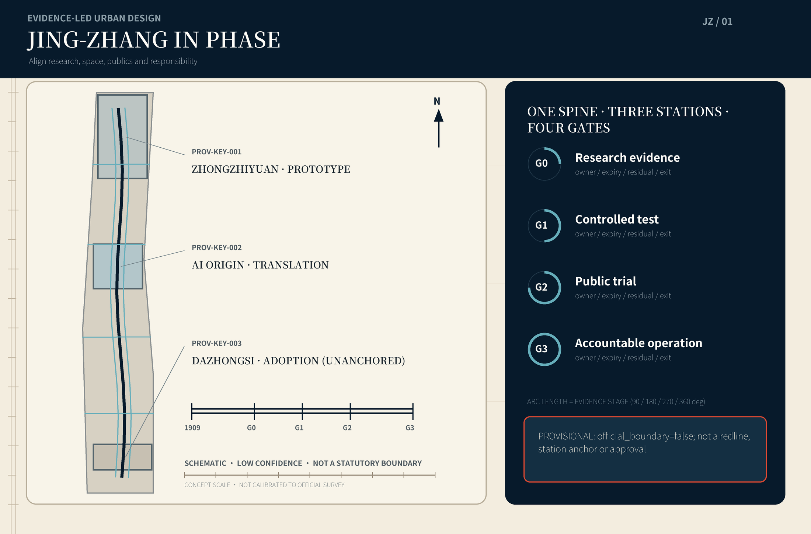
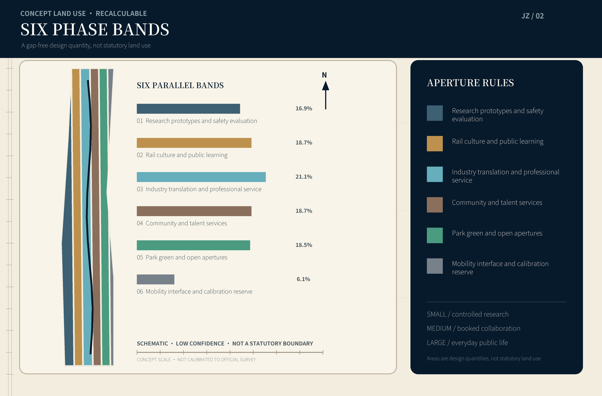
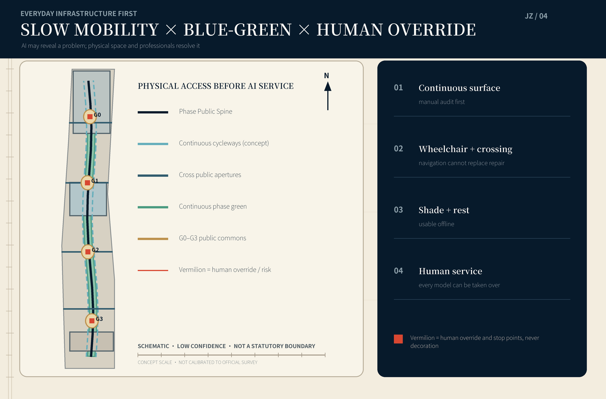
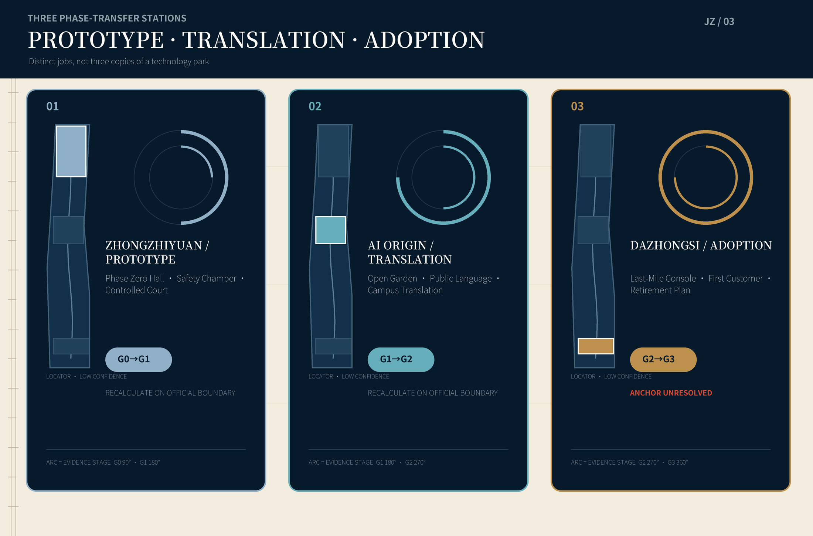
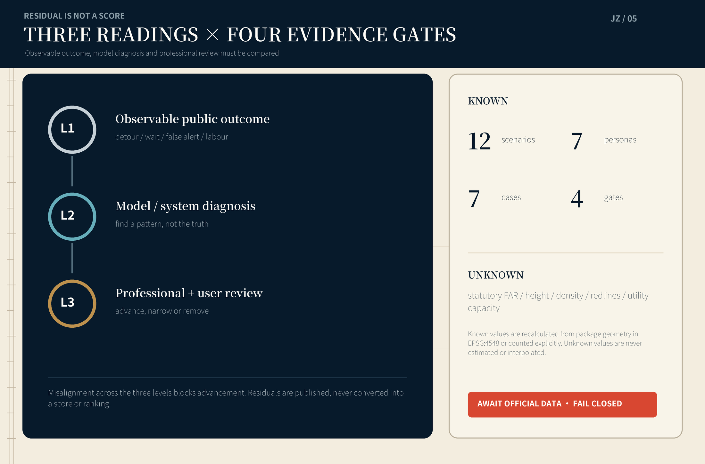

# JING-ZHANG IN PHASE

## Aligning research, space, publics and responsibility

> An AI-era city should not merely have more sensors and brighter screens. Before a new capability enters public life, the city should make its whole journey understandable, stoppable and accountable.

This proposal combines the temporal order of the Jing-Zhang railway with the scientific language of phase to make an **In-Phase Belt**. Research maturity, spatial openness, public awareness and operational responsibility must not run on separate clocks. Every AI scenario passes four visible gates: **G0 Research Evidence, G1 Controlled Test, G2 Public Trial and G3 Accountable Operation**. Each gate names the responsible human, expiry date, residual risk, non-AI alternative and stop control. The aim is not to turn the city into a laboratory; it is to make the boundary of experimentation a piece of public infrastructure.

The visual system rejects purple neon and generic “future tech city” imagery. Deep ink navy stands for the century-old railway and legible records; warm paper white stands for public explanation; Jing-Zhang vermilion is reserved for decisions, risks and human override. Phase rings, diffraction bands and calibrated ticks form the graphic grammar. It grows from the discipline of scientific drawing, but it ends in a simple civic promise: **know what is being tested, who benefits, who is responsible and when it must stop.**

## 1. Design Basis and Source List

The primary basis is the official open-call announcement published by the Haidian Branch of the Beijing Municipal Commission of Planning and Natural Resources [source:OFFICIAL-ANNOUNCEMENT] [standard:PROJECT-OFFICIAL-ANNOUNCEMENT]. The agent taskbook defines the three positionings, five functions and agent.1–agent.6 content contract [source:AGENT-TASKBOOK] [standard:PROJECT-AGENT-OPEN-CALL-TASKBOOK]. Enums, ranges, schemas, the source registry and processed materials in the site package provide machine alignment and reading navigation; derived notes are not promoted into new authorities [source:SITE-PACKAGE] [source:SOURCE-REGISTRY] [source:PROCESSED-FACT-PACK].

The three announced scope facts are retained without reinterpretation: a coordinated research area of about 43.6 sq km; an overall design area of about 11.4 sq km; and three key areas totalling about 368.4 ha—about 192.1 ha for Zhongzhiyuan, 104.3 ha for the Beijing AI Origin Community and 72.0 ha for the Dazhongsi AI Industry Cluster. The repository currently lacks official scope polygons, parcels and existing buildings, road redlines, statutory development controls, municipal networks, ownership and heritage-control lines. This package uses the maintainer-provided provisional geometry solely for generation, content review and recalculation demonstrations [data:geometry/site_boundary.geojson#SITE-001] [data:geometry/key_areas.geojson#PROV-KEY-001].

One issue requires explicit notice: `PROV-KEY-003` is allocated only by announced north-to-south order and approximate area. It has not been anchored to Dazhongsi Station or roads. This proposal neither moves it independently nor interprets its coordinates as a station-integration area. The key-area programmes can enter content review, but formal positions, area allocations and all dependencies must be recalculated as one package when official polygons arrive [assumption:A-KEY003-ANCHOR-001].

| Evidence level | What this package may do | What it does not do | Update trigger |
| --- | --- | --- | --- |
| Official public basis | Cite tasks, names, approximate areas and deliverables | Infer unpublished control conditions | New announcement or formal attachment version |
| Central provisional geometry | Topology checks, concept zoning, visualisation and content discussion | Call it an official redline, parcel edge or precise station location | Official SITE / KEY AREA polygons |
| Package design geometry | Recalculate conceptual land use, green/public space, footprints and project counts | Claim statutory FAR, height or approved retain-renovate-demolish decisions | Surveys, ownership, controls and engineering inputs |
| Operational targets | Define measurement, gates and exit conditions | Claim operators, budgets or government commitments already exist | Named responsible entities and baseline studies |

URLs, access dates, intended uses and limitations are controlled in `sources.json`; copyright and generation are explained in `report/copyright_statement.md`. All seven international cases come from operator, university or government websites. The proposal transfers mechanisms, not imagery, plans or graphic identities.

## 2. Three-Level Scope Framework

The In-Phase Belt is not an extra redline. It is a cross-scale decision protocol.

| Level | Misalignment to solve | In-Phase answer | Main outputs |
| --- | --- | --- | --- |
| Coordinated research area | Research, industry, talent and public-value cycles diverge | A Prototype–Translation–Adoption phase chain and Public Return Ledger | International cases, ecosystem and annual operation |
| Overall design area | Campuses, neighbourhoods, park and mobility operate as islands | A Phase Spine, open apertures and east-west stitches | Land use, slow mobility, blue-green, public services and projects |
| Three key areas | Three districts risk becoming the same technology park | Each performs a distinct prototype, translation or adoption function | Detailed programmes, spatial actions, scenarios and dependencies |

The overall structure is **One Spine, Three Stations, Four Gates, Two Faces and Many Apertures**. The Phase Spine is a public route through the overall design area. The stations are Zhongzhiyuan Prototype Station, AI Origin Translation Station and Dazhongsi Adoption Station. The four gates are G0–G3. The productive face serves research and enterprise; the public face serves residents and visitors. Apertures are walking, cycling, ecological and service interfaces across campus boundaries, rail infrastructure and superblocks. The four gates are processes, not four fixed buildings; any key area may host them when conditions permit, while the public information format remains consistent [depth:three_level_scope_framework] [depth:overall_spatial_structure].

Every building, renewal and scenario proposal first answers three questions: does it improve a real daily route; does it give the public an understandable choice; and can the service fall back to a non-AI mode when it fails? A project that cannot answer all three does not enter the reversible first phase. The geometry expresses conceptual allocation and relationships at low confidence, not precise regulatory boundaries [data:geometry/land_use.geojson#LU-001] [metric:site_area_sqm].

## 3. Coordinated Research Area: Industry and Future City Research

### 3.1 From “technology deployment” to public adoption

Haidian does not lack stories about research, companies or talent. The scarce resource is a common tempo for research outcomes entering urban life. Companies iterate by version, research advances through publication and validation, cities work through approval and construction cycles, while residents traverse the same route and depend on the same services every day. Misalignment creates two bad outcomes: immature capability is packaged as a demonstration, or useful technology remains trapped inside a closed campus. The proposal rewrites the industry chain in five parts: **research evidence → safety and fitness testing → scenario translation → time-limited public trial → accountable procurement and operation**. Capital, legal, compute, data and spatial services support these five parts instead of clustering around a company list.

A Public Return Ledger records four results for each project: who gained convenience, who carried added labour, what error remained, and how the city continued to serve after exit. It never creates resident scores, joins profiles across contexts or turns trial participation into a commercial label. Public pages show only project-level summaries, aggregate metrics, an appeal route and the next review date [standard:PROJECT-AGENT-OPEN-CALL-TASKBOOK].

### 3.2 Name, logo and identity system (agent.1)

The Chinese name “同相京张” means that different urban clocks must be brought into phase. **JING-ZHANG IN PHASE** carries both “at the right stage” and “phase aligned.” The logo combines two parallel rails, concentric rings interrupted by a public aperture and a vermilion human-override point. The rings are not an algorithmic halo; they show evidence passing through gates as it travels outward. The opening means every system permits disagreement and exit.

The identity hierarchy pairs the master name with phase actions: In-Phase Jing-Zhang / Research Gate, Test Gate, Public Gate and Responsibility Gate. Landmarks are Phase Zero Hall, Open Aperture Garden, Last-Mile Console and Centennial Phase Markers. Deep ink navy, paper white and vermilion are the three main colours; supporting green is reserved for ecology and access. Night identity relies on low-level ticks, physical material, print, audio and tactile explanations rather than high-luminance screens.

### 3.3 Seven international cases and transferable mechanisms (agent.2)

| Case | Mechanism evidenced by official material | Translation to Jing-Zhang | What is not copied |
| --- | --- | --- | --- |
| MIT Kendall Square | University anchor, mixed research-housing-retail, public space and continuing community input | Research institutions open legible ground-floor interfaces so science and daily city life coexist [source:EXT-MIT-KENDALL] | A single innovation-property model driven by high rents |
| Singapore one-north | Research estates, startup community, green connections and real testbeds side by side | Put test eligibility, slow-mobility links and industry services in one operational frame [source:EXT-JTC-ONE-NORTH] | Treating residents as default test subjects |
| Paris Station F | An old freight building renewed as a shared entrepreneurship-service platform | Let Jing-Zhang heritage space host shared services and public narrative rather than display alone [source:EXT-STATION-F] | Assuming any heritage building can be directly converted |
| Paris-Saclay | Universities, research bodies, industry and social missions assembled as a science cluster | Connect institutions through shared missions and interfaces, not an imaginary unified campus plan [source:EXT-PARIS-SACLAY] | Low-density expansion and car dependence |
| London Knowledge Quarter | A curated network of cultural, education, research, community and government bodies | Put railway culture, universities, neighbourhood services and industry on one annual project table [source:EXT-KQ-LONDON] | Substituting membership counts for public outcomes |
| Toronto MaRS | Research translation, venture support, investment, labs and technology adoption in one platform | Give every technology a transparent path from validation to its first public customer [source:EXT-MARS] | Substituting finance raised for social value |
| Helsinki Maria 01 | A former hospital grew from a small pilot into a community-driven startup campus | Build operational culture through reversible small spaces and shared maintenance before permanent construction [source:EXT-MARIA01] | Assuming vacant-building ownership or conversion conditions |

Together the cases show that an innovation ecosystem is not a single company-density metric. It combines spatial mix, credible testing, shared services, community participation and long-term operation. Jing-Zhang's distinct contribution is to turn those mechanisms into a public four-gate protocol [metric:global_case_study_count].

### 3.4 An urban form suited to the AI era

An AI city requires three apparently conflicting environments: focused, controlled research; low-threshold collaboration and encounter; and ordinary life that is not consumed by technology. “Aperture” regulates their relation. A small aperture protects experimental safety and data boundaries; a medium aperture supports booked collaboration; a large aperture returns ground floors, courtyards and parks to everyday public life. Physical signs and published hours show aperture status. Facial recognition never determines admission to public space.

Urban character does not seek one futuristic look. Retention candidates remain “survey pending” until official inventory. Conceptual new volumes use shallow floorplates, divisible tenancy, multiple ground-level doors, maintainable building services and shaded roofs; the public spine does not face service backs. Height, FAR, setback and skyline await statutory controls and urban-design conditions; this package supplies no fabricated values [depth:height_massing_character] [metric:floor_area_ratio].

## 4. Overall Design Area: Urban Renewal and Regulatory-Plan-Level Urban Design

### 4.1 Land-use structure: six recalculable phase bands

The conceptual land-use layer completely partitions the provisional overall boundary into six uses: research prototypes; culture and public service; industry and commercial service; community and talent service; park green; and road/white-space interfaces. They are **design quantities** for comparing structural proportions, not existing-land-use or statutory planning claims. Six bands run in parallel along the corridor so that a closed technology campus cannot push the public spine to its back. Green space and public service form a continuous low-threshold edge [data:geometry/land_use.geojson#LU-001] [depth:land_use_layout].

### 4.2 Renewal framework: retain ordinary life, add reversible interfaces

No parcel-specific demolition judgment is valid without existing-building, ownership and heritage surveys. Building polygons in this package are “conceptual renewal envelopes,” used only to recalculate design footprint and show ground-floor interfaces; all are marked `pending_site_survey`. Formal work follows four steps: survey structural safety, use and cultural value; identify repair, adaptation, reversible addition or evidenced rebuild; review with residents and users; then seek professional approval. The priority is **retain use > light shared adaptation > reversible addition > evidenced rebuild** [data:geometry/buildings.geojson#BLDG-001] [depth:retain_renovate_demolish].

### 4.3 Phase Spine, cross apertures and two-speed mobility

The Phase Spine is a directional walking and public-service axis, not a proposed road redline. Fast systems connect rail, campuses and regional transit; slow systems serve trips within fifteen minutes by foot, bicycle, wheelchair and pram. Four cross apertures address east-west breaks made by campus walls, superblocks, ring roads and park edges. “Access first” requires manual audits of continuous surfaces, ramps, crossing time, shade and rest points before any AI navigation launches. Algorithms may help locate problems; they cannot turn missing physical access into a navigation hint [data:geometry/roads.geojson#ROAD-PHASE-SPINE] [depth:traffic_rail_slow_parking].

Parking, station connections, road classes and intersection engineering await official road and traffic models. Concept lines show relationships only; they are not existing roads, redlines or construction drawings. New infrastructure is small and removable: edge compute, environmental sensing and cabinets have capacity caps, energy metering, offline degradation and removal interfaces. No deployment proceeds without cybersecurity, fire, power and maintenance accountability reviews [depth:municipal_new_infrastructure].

### 4.4 Blue-green and public space: a daily phase baseline

The continuous green band does not simulate unknown waterways or blue lines. Its design polygons state the structural intent that green space remain connected. Four phase commons provide shade, seating, water, accessible toilets, tables with optional power but no mandatory registration, and low-tech noticeboards. A public space counts only if it remains usable in rain, power failure and network failure. Sponge-city, drainage and flood-control values await specialist inputs [data:geometry/green_space.geojson#GREEN-PHASE-CORRIDOR] [data:geometry/public_space.geojson#PUBLIC-G0].

### 4.5 Urban character for the AI era

The character principle is **precise without spectacle, open without opacity**. Fine lines, ticks and weathering metal express railway direction; phase commons use warm mineral surfaces and vermilion manual controls; building materials are allowed to age honestly instead of being covered with LED skins. Information has three depths: a ten-second status, a two-minute evidence card and a downloadable method. Children, older people, colour-vision-diverse users and non-Chinese speakers receive non-screen alternatives [standard:MOHURD-URBAN-DESIGN-MEASURES].

## 5. Detailed Design of Key Areas

The three provisional key areas are not three identical “AI parks.” They perform distinct transitions from research to urban adoption. Positions and areas follow central provisional geometry only. Functions, mobility and building edges are directional and must be re-anchored together when official polygons arrive [data:geometry/key_areas.geojson#PROV-KEY-001] [depth:three_key_area_detailed_design].

### 5.1 Zhongzhiyuan: Prototype Phase

Zhongzhiyuan is the Prototype Station for full-stack autonomous innovation and safety evaluation. Phase Zero Hall holds model cards, test methods, version differences and failure cases that can be visited without exposing sensitive data. A controlled test court supports robots, edge devices and low-carbon compute prototypes; physical boundaries, fixed test periods and emergency stops take priority over automatic control. Any proposal for the river-related interface awaits water, flood and road data.

Spatial actions include shared experimental interfaces that prioritise existing buildings, a public-facing evidence gallery, conceptual separation of heavy logistics and visitors, and safety explanation that does not depend on screens. Industry scenarios must pass G0 and G1 before public trials elsewhere. Height, vibration, hazardous materials, compute energy and fire safety are professional prerequisites.

### 5.2 Beijing AI Origin Community: Translation Phase

The Origin Community is the Translation Station between research outcomes, open-source communities and ordinary urban life. Open Aperture Garden turns closed campus edges into a sequence of booked collaboration, open classes and neighbourhood deliberation. A Public Language Studio translates capability, limits, data permissions and human alternatives into readable service cards. A near-campus translation street supports intellectual property, accessibility, ethics, product and scenario operations.

This is not unconditional laboratory access. It makes explicit who may see, who may change and who reviews. Public trials are opt-in, time-limited and easy to leave. High-risk contexts such as minors, health and law remain under qualified human responsibility. Housing, education, research and commercial ratios await statutory land-use and ownership information.

### 5.3 Dazhongsi AI Industry Cluster: Adoption Phase

Dazhongsi is the Adoption Station connecting products, professional services and the city's first customer. The Last-Mile Console shows procurement object, fitness boundary, human takeover, maintenance cost and retirement plan—not only successful products. Interpretation and pitching spaces support international exchange without occupying public paths. Displays for intelligent terminals, agents and content industries always include an accessible non-AI service entrance.

Because `PROV-KEY-003` is not yet anchored to Dazhongsi Station, this section makes no station-exit, quadrant or company-location claim. The Adoption Station programme and spatial checklist are portable; the actual station-city relation must be remade after official location, traffic and ownership data arrive [assumption:A-KEY003-ANCHOR-001] [data:geometry/key_areas.geojson#PROV-KEY-003].

### 5.4 Four AI pilgrimage landmarks (agent.5)

1. **Phase Zero Hall** collects failed samples, version differences and test methods. Its landmark value is honest uncertainty, not the largest screen.
2. **Open Aperture Garden** makes openness levels visible through phase-ring seating, movable partitions and public explanation.
3. **Last-Mile Console** preserves a physical human entrance, appeal, stop and retirement date for every urban AI service.
4. **Centennial Phase Markers** place railway history, community memory, research milestones and annual public return along the spine using low-level calibrated ticks. Cleared content may be corrected.

The landmarks are directional public spaces or interior interfaces. None claims a particular protected building, station house or parcel. Together they tell an urban story: from not knowing, to testing clearly, to using responsibly.

## 6. AI Innovation Ecosystem, Personas and AI+ Scenarios

### 6.1 Seven personas (agent.3)

| Persona | Real need | Spatial answer | Unacceptable condition |
| --- | --- | --- | --- |
| Postdoctoral and early-career researcher | Deep work, cross-institution tools and publishable failures | Phase Zero Hall, booked experimental interfaces, quiet courts | Substituting check-ins and popularity for research quality |
| Startup team | Affordable testing, first customer, legal and compute boundaries | G1 sandbox, Translation Street, public procurement explanation | Surrendering excessive data in exchange for space |
| Frontline operator and maintainer | Ability to take over and report error; labour must count | Last-Mile Console, maintenance bench, drills | Transferring algorithmic residual to invisible labour |
| Neighbour and older person | Ordinary access, non-digital service, quiet and appeal | Access baseline, print entrance, low-disturbance periods | Default trial enrolment or mandatory QR code |
| Child, student and teacher | Understandable, hands-on, age-appropriate AI literacy | Aperture classroom, railway-memory experiment, teacher review | Minor profiling and commercial recommendation |
| International visitor and industry partner | Credible evidence, bilingual service and rapid orientation | Bilingual evidence cards, interpretation and pitching | Displaying success without limits |
| Independent auditor and accessibility advocate | Reproducible data, site access and public correction | Evidence reading room, audit interface, annual walk-through | Using “trade secret” as a blanket refusal |

### 6.2 Twelve scenario cards (agent.4)

Every card names beneficiaries, space, inputs, human responsibility, exit and residual risk. The first three are industry testing and validation scenarios; the remaining nine support everyday urban life.

| # | Scenario / phase | Spatial carrier | Human responsibility and exit |
| --- | --- | --- | --- |
| 01* | Model Safety Chamber / G0→G1 | Controlled court at Zhongzhiyuan | Evaluation lead signs the fitness boundary; stop on capability overreach, unclear data rights or unexplained high risk |
| 02* | Edge-Robot Street / G1 | Reversible segment during closed hours | On-site safety officer holds a physical stop; no public trial before pedestrian, wheelchair and child-dummy tests pass |
| 03* | Low-Carbon Compute Exchange / G0→G1 | Small machine room and energy interface | Energy and maintenance leads publish metering scope; no launch without capacity, power and fire review |
| 04 | Opt-In Accessible Navigation / G2 | Phase Spine and cross apertures | Accessibility advocates and transport professionals review; physical discontinuities are repaired first, ordinary navigation remains available |
| 05 | Heat-and-Rain Comfort Dispatch / G2 | Park nodes and shaded rest points | Landscape operator decides action; only minimum environmental data is kept, fixed facilities work offline |
| 06 | Maintenance Triage / G2→G3 | Public service station | Frontline staff confirm priority; revert to human scheduling if false alerts or workload exceed thresholds |
| 07 | Legal-Service Referral Assistant / G2 | Translation Street service point | Licensed professional gives final advice; no full transcript retention, generated text is never called a legal conclusion |
| 08 | Community Health Navigation / G2 | Community-service interface | Health worker or social worker owns referral; no diagnosis or ranking, emergencies go directly to human and emergency systems |
| 09 | Multilingual Public Explanation / G2→G3 | Three stations and Phase Spine | Human translators sample high-impact content; withdraw automated version above error or complaint threshold |
| 10 | Railway Memory Lens / G2 | Centennial Phase Markers | Historical editor and community co-check; no unlicensed portrait or content, public correction remains open |
| 11 | Night Learning Commons / G2 | Open Aperture Garden and public ground floor | On-site steward controls light, noise and capacity; no camera identification or automated seat policing |
| 12 | Public Return Ledger / G3 | Offline web, print and annual exhibition | Operator publishes aggregate outcomes and residuals; missing evidence cannot become “zero risk,” overdue cards expire automatically |

Asterisks mark industry testing and validation. Every G2 trial lasts no longer than an approved cycle; expiry forces a new explanation and a decision to continue, narrow or remove. G3 is not “permanent launch” but continuous review [metric:ai_scenario_count] [metric:industry_test_scenario_count].

### 6.3 Three-level residual reading

To prevent one model score from replacing urban judgment, each scenario reads residuals at three levels. L1 is publicly observable outcome—detour, waiting, noise, false alert and added labour. L2 is model or system diagnosis, useful for pattern discovery but not truth. L3 is the conclusion of professionals and users. A scenario moves to the next phase only when L1, L2 and L3 agree. When they diverge, the project explains the mismatch and preserves human service. AI supplies heuristic anomaly detection; urban expertise and real users retain final judgment.

## 7. Land Use, Building Scale and Retain-Renovate-Demolish Strategy

Six land-use polygons form a gap-free partition of the provisional scope and are recalculated in EPSG:4548. Green/public-space values are package design quantities; building footprints are conceptual renewal envelopes. Statutory FAR, density, maximum height, setback and parcel-level retain-renovate-demolish decisions remain unknown or pending control [metric:land_use_area_total_sqm] [metric:building_footprint_area_sqm].

Concept buildings use three families: research and test boxes, divisible translation courts, and public-service/adoption interfaces. Shared guidance is multiple ground-level entrances, repairable structure and services, ordered roof equipment and no service backs facing the public spine. This is not architectural design depth. All retention, adaptation and demolition decisions remain open until site survey, ownership, structure, fire, heritage and formal urban-design conditions are available [standard:MOHURD-ARCH-DESIGN-DEPTH-2016].

## 8. Transport, Rail, Municipal Infrastructure and Public Services

Mobility begins with physical access, not intelligent dispatch. Phase 1 completes four manual audits: continuous walking surface; wheelchair gradient and crossings; night lighting and perceived safety; and delivery/logistics conflict. AI may aggregate reports and suggest inspection candidates. It does not punish automatically or assign personal mobility scores. Rail interchange, road circulation, parking and bicycle proposals enter engineering only after road redlines, station interfaces, demand and fire data arrive [assumption:A-TRANSPORT-001] [data:geometry/roads.geojson].

Municipal services degrade in layers: offline public service remains; edge-device failure does not affect lighting, passage or calls for help; network failure leaves print and phone; model failure hands control to a human desk. Energy, water, drainage, flood, communications and compute capacity remain survey lists. A “smart platform” does not replace specialist system calculations [standard:PROJECT-AGENT-OPEN-CALL-TASKBOOK].

## 9. Blue-Green Network, Public Space and Urban Character

The design green corridor parallels the Phase Spine; four public nodes operate as open apertures for people moving at different speeds. Connectivity metrics come from submitted geometry and do not claim present completion. Formal design must import verified waterways, green ownership, old trees and ecological surveys for the Qinghe, Xiaoyue River, Jing-Zhang Heritage Park, campuses and neighbourhoods before recalculation [metric:green_ratio] [metric:public_space_ratio].

Technology display remains secondary. At least half of seating does not face a screen; every node provides free water, shade, an accessible route and information without login. Events restore ordinary passage afterwards. Vermilion is reserved for stop, appeal and important status; risk is not hidden in grey small print. Night communication uses low-level phase ticks and switchable projection to limit disturbance to residents and wildlife.

## 10. Renewal Projects, Implementation Policy and Phasing

| Project | Near-term action | Critical dependency | Fallback after failure |
| --- | --- | --- | --- |
| P01 Official boundary and baseline package | Obtain polygons, roads, parcels, buildings, ownership, municipal, heritage and facility data | Organiser and professional survey | Continue content review; no professional scoring or engineering position |
| P02 Four-Gate Evidence Card standard | Co-design bilingual template, appeal and expiry | Operator, legal and accessibility review | Return to print explanation and human register |
| P03 Phase Spine access audit | Joint walk by residents, maintainers and professionals | Site access and transport data | Publish problems only; do not use wayfinding to replace repair |
| P04 Phase Zero Hall light prototype | Small reversible exhibition and failure archive | Space, cleared content and safety | Remove fixtures, retain digital and print record |
| P05 Open Aperture Garden trial | Movable seating, shade and open hours | Ownership, landscape and fire | Restore site and publish feedback |
| P06 Three industry tests | Safety Chamber, Robot Street, Compute Exchange | Responsible organisations and special permits | Remain below G2 and keep test report |
| P07 Public service trial group | Navigation, maintenance, legal, health and multilingual services | Departments and qualified professionals | Stop model, continue human channel |
| P08 Last-Mile Console | Procurement, takeover, maintenance and retirement interface | First real operator | Operate independently as a human service desk |
| P09 Centennial Phase Markers | Cleared history and public-return updates | Heritage, community and copyright | Use temporary print, no permanent construction |
| P10 Formal regulatory and implementation development | Re-anchor all space and metrics | Official inputs, approval and specialist studies | Never use concept drawings for construction or approval |

Phasing follows evidence maturity rather than rendering from north to south: **Phase 0 baseline and agreement; Phase 1 reversible trial; Phase 2 professionally confirmed spatial renewal; Phase 3 accountable operation and annual review**. For machine checking, `geometry/phasing.geojson` partitions the provisional scope into three conceptual work zones; it does not mean time phases occur in only one zone [data:geometry/phasing.geojson#PHASE-001] [depth:phasing_implementation].

### Annual programme and long-term operation (agent.6)

The annual anchor is **In-Phase Week**, seven days of public promotion and demotion rather than a launch show. Day one releases the previous year's residuals and removed projects. The middle brings researchers, maintainers, residents and independent auditors into a joint walk. On the final day only projects satisfying all four gates proceed. A quarterly **Human Override Drill** tests network loss, model error, staff handover and appeals. A monthly **Open Aperture Night** translates one difficult technical issue into public language. The developer community works through “In-Phase Studios”; each project needs a technical lead, scenario operator and public-interest reviewer.

A long-term multi-party council is proposed with campus/enterprise, research, community and frontline maintenance, accessibility and legal expertise, plus an independent observer seat. It advises procedurally on opening scenarios, publishing information, pausing and review; authorised bodies retain administrative, procurement and professional decisions. Brand performance is judged by problem-closure rate, human-alternative availability, successful public exit, change in maintenance labour and on-time review—not exposure alone.

## 11. Metrics, Area Recalculation and Compliance Matrix

Known metrics come from only two sources: counts explicitly required by the announcement/taskbook or conceptual design quantities recalculable from submitted geometry. Provisional overall area, six-use total, design green/public-space ratios, conceptual footprint, road length, scenario nodes and project counts have source files, formula and confidence. Statutory FAR, height, density, setback, parking, facility capacity, industry and talent performance remain unknown. Operational targets provide formulas, baseline methods and release thresholds without fabricated results [depth:metrics_recalculation].

Four proposed operational gates are: 100% of G2/G3 projects have a human alternative and published exit; 100% of high-impact explanation receives qualified human review; every trial has an expiry date; and any severe safety, rights or discrimination incident triggers immediate pause. These are governance proposals, not achieved results. `compliance_matrix.json` covers announcement 1.3, 1.4, 1.5 and agent.1–agent.6. `standard_matrix.json` and `design_depth_matrix.json` record professional standards and depth evidence.

Status is deliberately separated. `package_state=ready_for_review` means materials, bilingual outputs, figures, geometry and machine gates are complete. `content_review_eligible=true` means organiser-side provisional data gaps do not block content review. `professional_scoring_eligible=false` means official-SITE_BOUNDARY- and KEY_AREA-dependent professional scoring remains fail-closed. Repository merge does not equal award selection, implementation approval, government endorsement or featured gallery publication.

## 12. Risk, Copyright and Compliance

1. **Misreading provisional boundaries:** every map shows the provisional outline at low contrast and labels `official_boundary=false`; when official polygons arrive, regenerate all geometry, metrics, figures, HTML, PDFs, matrices and manifest.
2. **Technology theatre:** each scenario publishes specific benefit, added labour, residual and exit. It cannot pass G1 without a real operator and baseline.
3. **Surveillance and discrimination:** no resident scoring, cross-context profiling, default enrolment or facial-recognition admission to public space; qualified people own high-impact decisions.
4. **Digital exclusion:** print, phone, on-site human and accessible interfaces remain; AI is never the only entrance to public service.
5. **Model drift and safety:** version, expiry, test boundary and incidents are visible; pause on expiry, major error or failed takeover.
6. **Labour transfer:** annotation, explanation, cleaning, security, maintenance and appeal time enter project cost. “Automation rate” cannot hide workload growth.
7. **Energy and municipal capacity:** measure compute and devices before deployment; no implementation without power, fire, heat, noise and cybersecurity review.
8. **Displacement through renewal:** permanent spatial projects assess rent, ordinary services and small-business impact; reversible trial comes first.
9. **Culture and copyright:** clear railway sources, community memory, imagery, fonts and enterprise material item by item; public viewing does not imply an open licence.

This package makes no claim of official approval, statutory control plan, final ownership, precise station position, existing-building decision, engineering feasibility, operational commitment or guaranteed implementation. External cases are mechanism research only. Graphics, geometry, text and generation code are made for this proposal; licence boundaries appear in the copyright statement. Offline HTML loads no remote script, font, map tile, iframe, form, API or tracker [depth:risk_missing_data].

## 13. References

- Beijing Municipal Commission of Planning and Natural Resources, Haidian Branch, official prequalification announcement for the Centennial Jing-Zhang AI Innovation Belt Urban Design International Call, 9 May 2026 [source:OFFICIAL-ANNOUNCEMENT].
- Agent-facing Centennial Jing-Zhang AI Innovation Belt open-call taskbook, cleared repository snapshot [source:AGENT-TASKBOOK].
- `brief/site-package/`: tasks, standards, provisional geometry, enums, schemas and data-gap contract.
- Seven external official case sources and access dates in `sources.json`: MIT Kendall Square, JTC one-north, Station F, Université Paris-Saclay, London Knowledge Quarter, MaRS Discovery District and Maria 01.
- Complete source, assumption, metric, requirement, standard and design-depth records: `sources.json`, `assumptions.json`, `metrics.json`, `compliance_matrix.json`, `standard_matrix.json` and `design_depth_matrix.json`.
