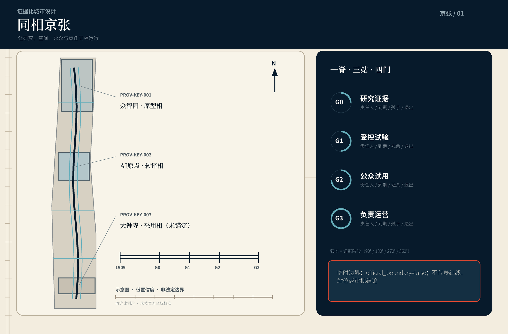
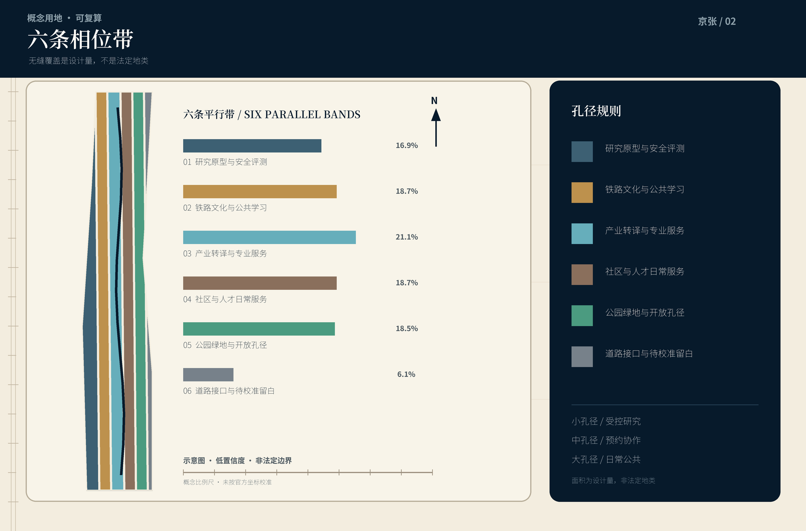
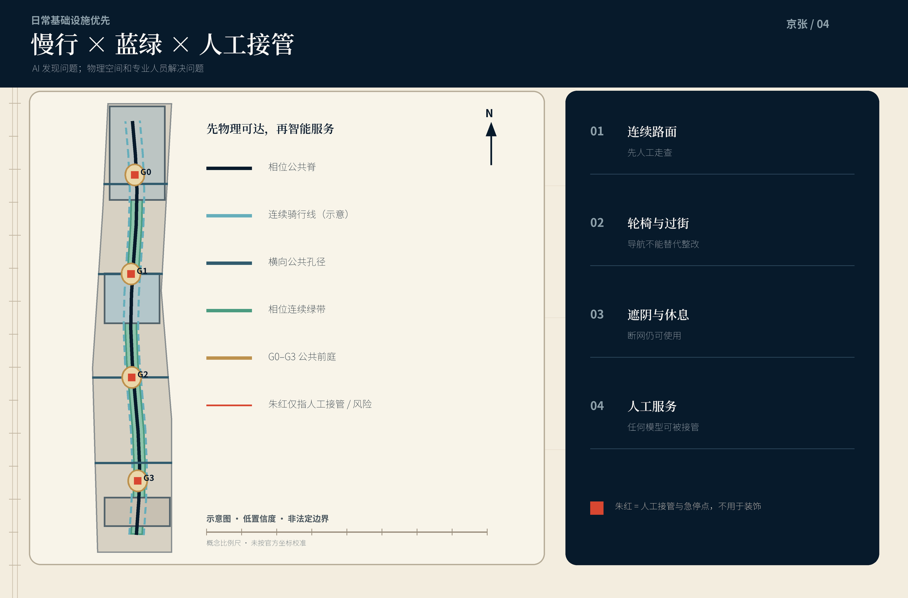
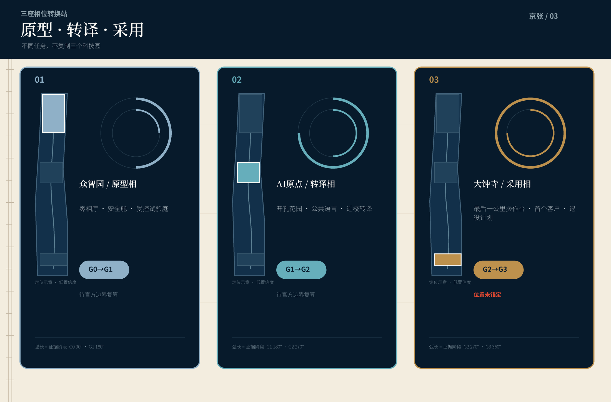
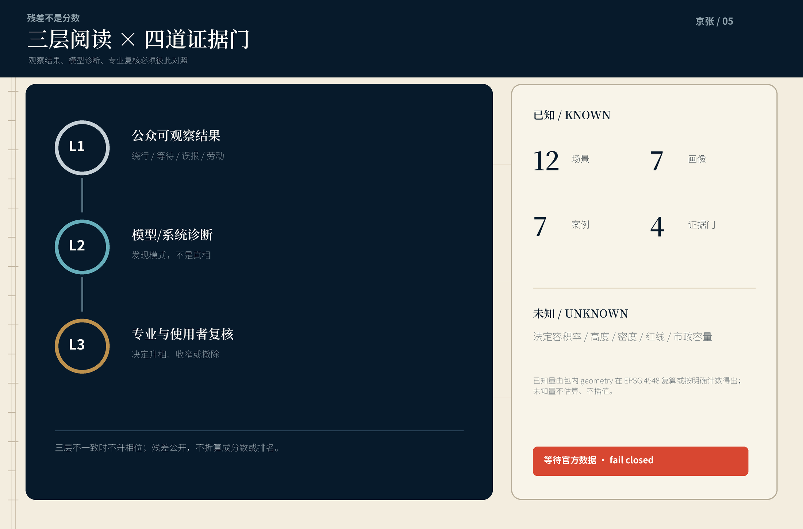

# 同相京张 / JING-ZHANG IN PHASE

## 让研究、空间、公众与责任同相运行

> AI 时代的城市不应只是传感器更多、屏幕更亮；它应让一项新能力在进入公共生活前，经历人人看得懂、随时能停、事后可追责的完整过程。

本方案把京张铁路的时间秩序与“相位”这一科学语言结合，提出一条**同相带**：研究成熟度、空间开放度、公众知情度和运营责任不能各走各的。每一个 AI 场景必须依次通过四道可见门——**G0 研究证据、G1 受控试验、G2 公众试用、G3 负责运营**；任何一门都附有责任人、有效期、残余风险、人工替代与退出按钮。方案不是把城市变成实验室，而是把实验的边界做成公共基础设施。

视觉上，方案拒绝紫色霓虹和“未来科技城”套图。深墨蓝代表百年轨道与可读档案，暖纸白代表公共说明，京张朱红只标记决策、风险和人工接管；相位环、衍射带与时刻刻度构成图形语法。这套语言来自可复核的科学制图习惯，但最终指向很朴素的城市承诺：**知道这里在试什么、谁能受益、谁来负责、何时必须停止。**

## 1. 设计依据与资料清单

本 formal 方案以海淀分局发布的征集公告为首要依据 [source:OFFICIAL-ANNOUNCEMENT] [standard:PROJECT-OFFICIAL-ANNOUNCEMENT]，以面向智能体任务书界定的三大定位、五大功能与 agent.1—agent.6 为内容契约 [source:AGENT-TASKBOOK] [standard:PROJECT-AGENT-OPEN-CALL-TASKBOOK]。场地包的枚举、限值、schema、来源登记和处理资料只承担机器对齐与阅读导航，不把二次整理升级为新的权威来源 [source:SITE-PACKAGE] [source:SOURCE-REGISTRY] [source:PROCESSED-FACT-PACK]。

公告给出的三层任务事实保持原样：统筹研究范围约 43.6 平方公里；总体设计范围约 11.4 平方公里；三处重点区域合计约 368.4 公顷，其中众智园约 192.1 公顷、北京 AI 原点社区约 104.3 公顷、大钟寺 AI 产业聚集区约 72.0 公顷。当前仓库没有官方范围 polygon、地块与建筑现状、道路红线、控规强度、市政管线、权属和文保控制线。提交使用维护者统一提供的 provisional geometry，仅用于生成、内容评审与复算演示 [data:geometry/site_boundary.geojson#SITE-001] [data:geometry/key_areas.geojson#PROV-KEY-001]。

特别说明：`PROV-KEY-003` 只按公告南北顺序与约面积配置，尚未完成大钟寺站或道路锚定；本方案不自行平移它，也不把其中任何坐标解释为站点一体化范围。三处重点区的功能讨论可进入内容评审，但正式位置、面积分配及所有依赖关系必须在官方 polygon 到位后整包重算 [assumption:A-KEY003-ANCHOR-001]。

| 证据等级 | 本包可做 | 本包不做 | 触发更新 |
| --- | --- | --- | --- |
| 官方公开依据 | 引用任务、名称、约面积和成果要求 | 不外推未公开控制条件 | 公告或正式附件版本更新 |
| 中央 provisional 几何 | 拓扑检查、概念分区、可视化和内容讨论 | 不称官方红线、地块边界或精确站位 | 官方 SITE / KEY AREA polygon 发布 |
| 本包设计几何 | 复算概念用地、绿地、公共空间、建筑基底和项目数量 | 不称法定容积率、高度或拆改留审定结论 | 专业踏勘、权属、控规与工程条件到位 |
| 运营目标 | 设定可测方法、门槛和退出条件 | 不声称已有运营者、预算或政府承诺 | 责任主体与基线调查确认 |

来源的 URL、访问日期、用途和限制在 `sources.json` 统一管理；版权与生成说明见 `report/copyright_statement.md`。七个全球案例均来自运营机构、大学或政府官网，只抽取机制，不复制图形、照片或空间方案。

## 2. 三层范围工作框架

同相带不是一条额外红线，而是一套跨尺度的决策协议。

| 层级 | 要解决的失配 | 同相回答 | 主要成果 |
| --- | --- | --- | --- |
| 统筹研究范围 | 研究、产业、人才与公共利益的周期不一致 | 建立“原型—转译—采用”相位链和公共回报账本 | 全球案例、创新生态、年度运营 |
| 总体设计范围 | 园区、社区、遗址公园和交通各自成岛 | 以相位脊、开敞孔径和东西连接缝合日常网络 | 用地、慢行、蓝绿、公共服务和项目清单 |
| 三处重点区域 | 三块空间做成同一种科技园 | 分别承担原型、转译、采用三种相位转换任务 | 详细功能、空间动作、场景与前置条件 |

总体结构为“**一脊、三站、四门、双面、多孔径**”。一脊是贯通总体设计范围的相位公共脊；三站是众智园原型站、AI 原点转译站、大钟寺采用站；四门是 G0—G3；双面是面向研究机构和企业的生产面、面向社区和访客的公共面；多孔径是穿越园区边界、轨道与大尺度街块的步行骑行、生态和服务接口。四门是过程而非四个固定建筑，任何重点区都可按条件承载，但门的公开信息格式保持一致 [depth:three_level_scope_framework] [depth:overall_spatial_structure]。

所有新建、改造和场景建议先问三个问题：是否改善一段真实的日常路径；是否给公众一个看得懂的选择；失败时是否能退回不依赖 AI 的服务。不能同时回答三问的项目，不进入一期可逆试点。图层只表达概念分配和相互关系，空间边界精度保持低置信度 [data:geometry/land_use.geojson#LU-001] [metric:site_area_sqm]。

## 3. 统筹研究范围产业与未来城市研究

### 3.1 从“技术落地”改为“公共采用”

海淀不缺研究、企业或人才叙事，真正稀缺的是研究成果进入城市生活时的共同节拍。企业按版本迭代，科研按论文和验证推进，城市按审批与建设周期运行，居民却每天要经过同一条路、使用同一项服务。失配会产生两种坏结果：能力尚未成熟就被包装成示范，或已有价值的技术长期停在封闭园区。方案把产业链重写为五段：**研究证据 → 安全与适用性测试 → 场景转译 → 限时公众试用 → 有责任的采购与运营**。资本、法务、算力、数据和空间服务围绕五段配套，而不是围绕企业名录堆叠。

公共回报账本记录每个项目的四类结果：谁得到便利，谁承担额外劳动，算法还剩什么误差，退出后城市如何继续服务。它不记录个人信用分，不跨场景拼接居民画像，不把“参与过试验”变成商业标签。公开页只显示项目级摘要、聚合指标、申诉入口和下一次复核日期 [standard:PROJECT-AGENT-OPEN-CALL-TASKBOOK]。

### 3.2 命名、Logo 与品牌系统（agent.1）

中文名“同相京张”强调同一城市里的多种节拍需要对齐；英文名 **JING-ZHANG IN PHASE** 同时包含“处于正确阶段”和“相位一致”。Logo 由两条平行轨道、一组被公共孔径截开的同心环和一个朱红人工接管点组成。环不是算法光环，而是证据向外扩散时必须经过的门；开口意味着任何系统都允许异议与退出。

品牌层级采用“主名 + 相位动作”：同相京张 / 研究门、试验门、公众门、责任门；重点地标使用“零相厅、开孔花园、最后一公里操作台、百年相位刻度”。所有应用保持深墨蓝、纸白、朱红三主色，辅助绿只用于生态和可达性；夜景不以高亮屏幕造景，以低照度刻度、实体材料、纸本与可访问的语音/触觉说明为主。

### 3.3 七个全球案例与可迁移机制（agent.2）

| 案例 | 官方材料显示的机制 | 转译到京张 | 不直接照搬 |
| --- | --- | --- | --- |
| MIT Kendall Square | 大学锚点、研究与居住商业混合、公共空间和持续社区沟通 | 研究机构向街区开放一层公共界面，科研价值与日常城市共同发生 [source:EXT-MIT-KENDALL] | 不复制高租金驱动的单一创新地产模式 |
| 新加坡 one-north | 研究园、创业社区、绿色连接和真实试验场并置 | 把测试资格、慢行网络和产业服务放入同一运营框架 [source:EXT-JTC-ONE-NORTH] | 不把城市居民默认为试验对象 |
| 巴黎 Station F | 旧货运建筑更新为共享创业服务平台 | 京张遗产空间优先承担共同服务和公共叙事，而非纯展陈 [source:EXT-STATION-F] | 不预设任何遗产建筑可直接改造 |
| Paris-Saclay | 多院校、研究机构、企业和社会使命组成科学集群 | 以共同任务和接口连接机构，不以一张园区总平图假装协同 [source:EXT-PARIS-SACLAY] | 不复制低密扩张和通勤依赖 |
| London Knowledge Quarter | 一英里范围内文化、教育、科研、社区和政府机构的策展式网络 | 把铁路文化、院校、社区服务和产业机构纳入同一年度项目表 [source:EXT-KQ-LONDON] | 不用“成员数量”替代公共成效 |
| Toronto MaRS | 科研转化、创业服务、投资、实验室和技术采用形成一体平台 | 为每项技术建立从验证到首个公共客户的透明路径 [source:EXT-MARS] | 不用融资额替代社会价值 |
| Helsinki Maria 01 | 旧医院从小规模试点逐步成为社区驱动的创业校园 | 先用可逆的小空间和共同维护形成运营文化，再决定永久建设 [source:EXT-MARIA01] | 不假定闲置建筑权属与改造条件 |

七例共同说明：创新生态不是“企业密度”单一指标，而是空间混合、可信试验、共同服务、社区参与和长期运营的组合。京张的独特贡献是把这些机制进一步做成公众可读的四门协议 [metric:global_case_study_count]。

### 3.4 适配 AI 时代的城市形态

AI 城市需要三种看似矛盾的空间：高专注、可控访问的研发空间；偶遇、共享和低门槛的协作空间；不被技术消费的普通生活空间。方案用“孔径”调节它们之间的关系：小孔径保障实验安全和数据边界，中孔径支持预约协作，大孔径把首层、庭院与公园交给日常公共生活。孔径状态以实体标识和公开时段表达，不用面部识别决定谁能进入。

建筑风貌不追求统一未来感。保留对象在官方普查前只标“待调查”；概念新体量采用窄进深、可分租、首层多入口、可维修机电和遮阳屋面；沿公共脊控制连续可步行界面。高度、容积率、退线和天际线均等待正式控规与城市设计条件，本包不填假数字 [depth:height_massing_character] [metric:floor_area_ratio]。

## 4. 总体设计范围城市更新与控规深度城市设计

### 4.1 用地结构：六条可复算的相位带

概念用地把临时总体边界完整划分为六类：科研原型、文化与公共服务、产业与商业服务、社区与人才服务、公园绿地、道路与留白接口。分区是用于比较结构比例的**设计量**，不替代现状地类或法定用地。六带沿走廊并行，避免一个封闭科技园把公共脊夹在背面；公园绿地和公共服务带构成连续的低门槛界面 [data:geometry/land_use.geojson#LU-001] [depth:land_use_layout]。

### 4.2 更新框架：保留普通性，增加可逆接口

在现状建筑、权属和文保调查缺失时，任何具体拆除判断都不成立。本包的建筑 polygon 是“概念更新包络”，只用于复算设计基底与表达首层界面；它们全部标注 `pending_site_survey`。正式深化采用四步：先普查结构安全、使用与文化价值；再识别可维修、可改造、可增补和确需重建；居民与使用者共同复核；最后由专业审批确定。优先级是**保留使用 > 轻改共享 > 可逆增补 > 有依据重建** [data:geometry/buildings.geojson#BLDG-001] [depth:retain_renovate_demolish]。

### 4.3 相位脊、横向孔径与双速度交通

相位脊是一条方向性慢行与公共服务轴，不是新道路红线。快系统连接轨道、园区和区域公交；慢系统服务 15 分钟内步行、骑行、轮椅与推车。四条横向孔径优先处理园区围墙、超长街块、环路和公园边界造成的东西断点；“可达性先行”要求在任何 AI 导航上线前完成连续路面、坡道、过街时间、遮阴与休息点人工走查。算法只能帮助发现问题，不能把物理无障碍缺失变成导航提示 [data:geometry/roads.geojson#ROAD-PHASE-SPINE] [depth:traffic_rail_slow_parking]。

停车、轨道接驳、道路等级和交叉口工程组织等待官方道路与交通模型。概念交通线只表达连接关系，不声称现状道路、红线或施工方案。新型基础设施采用“小而可退”：端侧计算、环境感知和设备柜先设容量上限、能源计量、断网降级与撤除界面；未经网络安全、消防、供配电和运维责任审查不得部署 [depth:municipal_new_infrastructure]。

### 4.4 蓝绿与公共空间：一条日常使用的相位基线

连续绿带不模拟未知的现状河道和蓝线，而以本包设计 polygon 表达“绿地必须连续”的结构意图。四个相位公共节点采用阴影、座椅、饮水、无障碍卫生间、可充电但不强制注册的桌面和低技术公告栏。下雨、停电、断网时仍能使用，才算公共空间。生态海绵、排水和防洪工程指标等待专项资料 [data:geometry/green_space.geojson#GREEN-PHASE-CORRIDOR] [data:geometry/public_space.geojson#PUBLIC-G0]。

### 4.5 人工智能时代的风貌控制

风貌采用“**精密但不炫技，开放但不透明**”原则。轨道方向以细线、刻度和耐候金属表现；相位节点以暖色矿物铺装和朱红手动装置识别；建筑界面保留材料真实老化，不用大面积 LED 皮肤制造更新假象。信息展示分三层：十秒读懂的项目状态、两分钟看懂的证据卡、可下载的完整方法。儿童、老年人、色觉差异者和中文非母语者均可获得非屏幕替代说明 [standard:MOHURD-URBAN-DESIGN-MEASURES]。

## 5. 重点区域详细设计

三处临时 key area 不是三个同质化“AI 园区”，而是从研究到城市采用的三种相位转换。位置和面积只沿用中央 provisional geometry；详细功能、交通和建筑边界均为方向性内容，官方多边形发布后整体重锚 [data:geometry/key_areas.geojson#PROV-KEY-001] [depth:three_key_area_detailed_design]。

### 5.1 众智园：原型相 / Prototype Phase

定位为全栈自主创新和安全评测的**原型站**。零相厅容纳可参观但不暴露敏感数据的模型卡、测试方法和失效案例；受控试验庭支持机器人、端侧设备与低碳算力原型，物理边界、时段和急停装置优先于自动控制。沿清河相关界面的任何生态、交通建议都须待河道、防洪和道路资料确认。

空间动作包括：以现有建筑优先的共享实验接口；面向公共脊的一层证据廊；大型物流与访客流线分离的概念组织；不依赖屏幕的安全说明。产业场景通过 G0 和 G1 后才可进入其他片区试用。建筑高度、设备振动、危险品、算力能源和消防条件均为专业前置项。

### 5.2 北京 AI 原点社区：转译相 / Translation Phase

定位为科研成果、开源社区与普通城市生活之间的**转译站**。开孔花园把封闭园区界面转成预约协作、开放课堂和社区议事的多孔径序列；公共语言工作室将模型能力、限制、数据许可和人工替代写成居民看得懂的服务卡；近校成果转译街提供知识产权、无障碍、伦理、产品与场景运营支持。

这里不是无条件开放实验室，而是把“谁能看、谁能改、谁来复核”做清楚。公共试用只采用主动加入、短时保留和随时退出；未成年人、医疗和法律等高风险场景必须由合格人员负责。居住、教育、科研和商业比例等待法定用地与权属资料，不由概念包确定。

### 5.3 大钟寺 AI 产业聚集区：采用相 / Adoption Phase

定位为产品、专业服务和城市首个客户之间的**采用站**。最后一公里操作台展示的不只是成功产品，而是采购对象、适用边界、人工接管、维护成本和退役计划；国际同传与路演空间服务跨文化交流，但公共通道不被活动占用。面向智能终端、智能体和内容产业的展示必须同时给出可访问的非 AI 服务入口。

由于 `PROV-KEY-003` 尚未完成大钟寺站锚定，本节不声称任何站口、四象限或具体企业位置；采用站的程序和空间清单可以迁移，实际站城关系待官方位置、交通和权属数据后重做 [assumption:A-KEY003-ANCHOR-001] [data:geometry/key_areas.geojson#PROV-KEY-003]。

### 5.4 四处 AI 朝圣地标（agent.5）

1. **零相厅 / Phase Zero Hall**：收藏失败样本、版本差异和测试方法；地标价值来自诚实展示未知，而非最大屏幕。
2. **开孔花园 / Open Aperture Garden**：用相位环座椅、可移动隔断和公共说明，让不同开放级别一眼可见。
3. **最后一公里操作台 / Last-Mile Console**：每项城市 AI 服务都保留实体人工入口、申诉、急停和退役日期。
4. **百年相位刻度 / Centennial Phase Markers**：沿公共脊以低照度刻度并置铁路历史、社区记忆、科研里程碑和年度公共回报；内容经清权，可被更正。

地标均是方向性公共空间或室内界面，不声称占用特定文物、站房或地块。它们共同构成“从不知道，到试得明白，再用得负责”的城市叙事。

## 6. AI 创新生态、人才画像与 AI+ 场景

### 6.1 七类画像（agent.3）

| 画像 | 真正需要 | 空间回答 | 不能接受 |
| --- | --- | --- | --- |
| 博士后与青年研究者 | 深度工作、跨机构设备、可发表的失败记录 | 零相厅、预约实验接口、安静庭院 | 以打卡和热度替代研究质量 |
| 初创团队 | 低成本试验、首个客户、法务与算力边界 | G1 沙盒、转译街、公共采购说明 | 为获场地而交出过量数据 |
| 一线运营与维护者 | 能接管、能报错、劳动被计入 | 最后一公里操作台、维护工位、演练 | 把算法残差转嫁给隐形劳动 |
| 周边居民与老年人 | 普通通行、非数字服务、安静和申诉 | 无障碍基线、纸本入口、低扰动时段 | 被默认加入试验或强制扫码 |
| 儿童、学生与教师 | 可理解、可动手、年龄合适的 AI 素养 | 开孔课堂、铁路记忆实验、教师复核 | 未成年人画像与商业推荐 |
| 国际访客与产业伙伴 | 可信证据、双语服务、快速理解规则 | 双语证据卡、同传与路演空间 | 只展示成功、不展示边界 |
| 独立审计者与无障碍倡导者 | 可复现数据、现场访问、公开更正 | 证据阅览室、审计接口、年度走查 | 把“商业机密”当作全部拒绝理由 |

### 6.2 十二张场景卡（agent.4）

每张卡都包含受益者、空间、输入、人工责任、退出条件和残余风险。前三张是产业测试验证场景；其余九张服务城市日常。

| # | 场景 / 相位 | 空间载体 | 人工责任与退出条件 |
| --- | --- | --- | --- |
| 01* | 模型安全舱 / G0→G1 | 众智园受控试验庭 | 评测负责人签发范围；发现越界能力、数据权利不明或不可解释高风险即停 |
| 02* | 端侧机器人街 / G1 | 封闭时段的可逆测试段 | 现场安全员持实体急停；未通过行人、轮椅与儿童假人测试不得进入公众试用 |
| 03* | 低碳算力交换台 / G0→G1 | 小型机房与能源展示界面 | 能源与运维负责人公开计量边界；容量、电力或消防未核即不上线 |
| 04 | 主动加入的无障碍导航 / G2 | 相位脊与横向孔径 | 无障碍倡导者和交通专业人员复核；不连续的物理设施优先整改，拒绝后仍可普通导航 |
| 05 | 热雨舒适调度 / G2 | 公园节点与遮阴休息点 | 园林运维决定动作；传感器仅保留最小环境数据，断网仍有固定设施 |
| 06 | 设施维护分诊 / G2→G3 | 公共服务站 | 一线工人确认工单优先级；误报率或工时增加超过阈值即退回人工排班 |
| 07 | 法律服务转介助手 / G2 | 转译街公共服务点 | 执业人员给最终意见；不储存咨询全文，不把生成文本称法律结论 |
| 08 | 社区健康导航 / G2 | 社区服务界面 | 医护或社工负责转介；不诊断、不排名，紧急情况直接转人工与急救体系 |
| 09 | 多语公共说明 / G2→G3 | 三站与公共脊 | 人工翻译抽检高影响内容；错误率或投诉超阈值即撤回自动版本 |
| 10 | 铁路记忆透镜 / G2 | 百年相位刻度 | 史料编辑和社区共同校对；无许可肖像与内容不上墙，可公开更正 |
| 11 | 夜间学习公地 / G2 | 开孔花园与公共首层 | 现场管理员控制照明、噪声和容量；不以摄像识别身份或占座 |
| 12 | 公共回报账本 / G3 | 离线网页、纸本与年度展 | 运营者发布聚合结果和残余问题；缺数据不得写“零风险”，逾期自动标为失效 |

星号为产业测试验证场景。任何 G2 试用最长一个批准周期，到期必须重新说明并选择继续、收窄或撤除；G3 不是“永久上线”，而是进入持续复核 [metric:ai_scenario_count] [metric:industry_test_scenario_count]。

### 6.3 三层残差阅读法

为避免用一个模型分数替代城市判断，本方案把每个场景的残差分成三层。L1 是公众可观察结果，如绕行、等待、噪声、误报和额外劳动；L2 是模型或系统诊断，用于发现模式但不作为真相；L3 是专业人员与使用者的复核结论。只有 L1、L2、L3 方向一致时，场景才可升相位；不一致时优先解释并保留人工服务。这一方法让 AI 做它擅长的异常提示，让城市专业与真实使用者保留最终判断。

## 7. 用地、建筑规模与拆改留方案

六类用地 polygon 对临时范围实现无缝覆盖，面积由 EPSG:4548 复算；绿地和公共空间是本包设计量，建筑基底是概念更新包络。法定容积率、建筑密度、最高高度、退线与具体拆改留均为 unknown / pending control [metric:land_use_area_total_sqm] [metric:building_footprint_area_sqm]。

概念建筑采用三种类型：研究与测试盒子、可分租的转译院落、公共服务与采用界面。共同控制建议是首层多入口、结构与机电可维修、屋顶设备有序、对公共脊避免后勤背面；这不是建筑方案深度。所有现状保留、改造和拆除结论在现场普查、权属、结构、消防、文保和正式城市设计条件前保持未决 [standard:MOHURD-ARCH-DESIGN-DEPTH-2016]。

## 8. 交通、轨道、市政与公共服务设施

交通从“智能调度”前移到“物理可达”。一期先完成四类人工走查：连续人行面、轮椅坡度与过街、夜间照明与女性安全感、快递与后勤冲突。AI 可聚合报告和提出巡检候选，不自动处罚、不生成个人通行评分。轨道接驳、道路微循环、停车与非机动车方案只有在道路红线、站点接口、客流和消防资料到位后才可进入工程深化 [assumption:A-TRANSPORT-001] [data:geometry/roads.geojson]。

市政采用分层降级：离线公共服务始终存在；边缘设备失败不影响照明、通行和求助；网络服务失败时有纸本和电话；模型服务失败时由人工台接管。能源、水务、排水、防洪、通信与算力容量只列调查清单，不以“智慧平台”替代专业系统计算 [standard:PROJECT-AGENT-OPEN-CALL-TASKBOOK]。

## 9. 蓝绿空间、公共空间与城市风貌

设计绿带与相位脊并行，四个公共节点像开放孔径一样接纳不同速度的人。连续性指标来自提交 geometry，不代表现状已贯通。正式设计需把清河、小月河、京张遗址公园、校园和社区的真实水系、绿地权属、古树和生态调查导入后重算 [metric:green_ratio] [metric:public_space_ratio]。

公共空间把“技术展示”降为配角：至少一半可坐空间不面向屏幕；每个节点有免费饮水、遮阴、无障碍路径和无需登录的信息；活动后必须恢复日常通行。朱红只用于急停、申诉和重要状态，不把风险提示藏在灰字里。夜间传播以低照度相位刻度和可关闭的投影为上限，避免打扰居民和迁徙动物。

## 10. 更新项目清单、实施政策与分期计划

| 项目 | 近期动作 | 关键依赖 | 失败后的退路 |
| --- | --- | --- | --- |
| P01 官方边界与现状基线包 | 获得 polygon、道路、地块、建筑、权属、市政、文保和设施资料 | 组织方与专业测绘 | 保持内容评审，不进入专业评分与工程定位 |
| P02 四门证据卡标准 | 共创中英模板、申诉和过期规则 | 运营者、法律与无障碍复核 | 退回纸本项目说明与人工登记 |
| P03 相位脊可达性走查 | 居民、维护者与专业人员联合步行 | 现场许可与交通资料 | 只发布问题清单，不做导视替代整改 |
| P04 零相厅轻量原型 | 小型可逆展览与失败案例库 | 场地、内容清权、安全 | 撤除展具，保留数字与纸本档案 |
| P05 开孔花园试用 | 可移动座椅、遮阴、开放时段 | 权属、园林、消防 | 恢复原状并发布使用反馈 |
| P06 三项产业测试 | 安全舱、机器人街、算力交换台 | 责任单位与专项许可 | 不进入 G2，保留测试报告 |
| P07 公共服务试用组 | 导航、维护、法律、健康、多语 | 部门与专业人员负责 | 关停模型，人工渠道继续 |
| P08 最后一公里操作台 | 采购、接管、维护与退役界面 | 首个真实运营者 | 作为人工服务台独立运行 |
| P09 百年相位刻度 | 清权后的历史与公共回报更新 | 文保、社区与版权 | 使用临时纸本，不固定施工 |
| P10 正式控规与综合实施深化 | 重锚所有空间和指标 | 官方资料、审批与专项论证 | 不把概念图作为施工或审批依据 |

分期不是按渲染图从北到南施工，而按证据成熟度推进：**Phase 0 基线与共识；Phase 1 可逆试点；Phase 2 经专业确认的空间更新；Phase 3 负责运营与年度复核**。`geometry/phasing.geojson` 为便于机器检查把临时范围分为三块概念工作区，不等于时间上只在某一块实施 [data:geometry/phasing.geojson#PHASE-001] [depth:phasing_implementation]。

### 年度活动与长期运营（agent.6）

年度主活动为**同相周 / In-Phase Week**：不是一次发布会，而是七天公开升相与降相。第一天公开上一年度残差和撤除项目；中段让研究者、维护者、居民和独立审计者共同走查；最后一天只允许满足四门条件的项目进入下一阶段。每季度举行一次**人工接管演练**，检验断网、模型错误、人员交接和申诉链；每月举行**开孔夜谈**，把一个复杂技术问题翻译为公众语言。开发者社区采用“同频工作室”机制，每个项目必须同时有技术负责人、场景运营者和公共利益复核者。

长期运营建议设一个多方理事结构，包含园区/企业、研究机构、社区与一线维护、无障碍与法律专业、独立观察席。其职责仅是对场景开放、公开信息、暂停与复核提出程序性建议；具体行政、采购和专业决定仍由有权主体承担。品牌转化不以曝光量为唯一指标，而以问题关闭率、人工替代可用率、公众退出成功率、维护劳动变化和按期复核率为核心。

## 11. 指标体系、面积复算与合规矩阵

本包的 known 指标只来自两类：公告明确给出的任务数量，或提交 geometry 可复算的概念设计量。总体临时边界面积、六类用地总面积、设计绿地/公共空间比例、概念建筑基底、道路长度、场景节点和项目数量均带 source_files、公式和置信度。法定 FAR、高度、密度、退线、停车、设施容量、产业与人才绩效全部保持 unknown；运营目标只给公式、基线采集方法和放行阈值，不填虚构成绩 [depth:metrics_recalculation]。

四项核心运营门槛建议为：100% G2/G3 项目具有人工替代和公开退出；100% 高影响说明经过专业人工复核；每项试用有明确到期日；任何严重安全、权利或歧视事件触发立即暂停。它们是治理建议，不是已达成结果。`compliance_matrix.json` 覆盖公告 1.3、1.4、1.5 和 agent.1—agent.6；`standard_matrix.json` 与 `design_depth_matrix.json` 分别记录标准响应和专业深度证据。

包状态被明确拆开：`package_state=ready_for_review` 只表示材料、双语、图件、几何与机器门禁完整；`content_review_eligible=true` 表示组织方的 provisional 数据缺口不阻断内容评审；`professional_scoring_eligible=false` 表示依赖官方 SITE_BOUNDARY 与 KEY_AREA 的正式专业评分继续 fail-closed。仓库合并也不等于获奖、实施批准、政府背书或公开画廊精选。

## 12. 风险、版权与合规说明

1. **临时边界误读**：所有地图低对比显示 provisional 轮廓并标注 `official_boundary=false`；官方 polygon 到位后重生成全部 geometry、metrics、图件、HTML、PDF、矩阵和 manifest。
2. **技术表演化**：每个场景必须公开具体受益、额外劳动、残余和退出；没有真实运营者与基线就不能从 G1 升至 G2。
3. **监控与歧视**：禁止居民评分、跨场景画像、默认加入和以面部识别做公共空间准入；高影响决定由合格人员负责。
4. **数字排斥**：纸本、电话、现场人工与无障碍界面始终存在；AI 服务不得成为公共服务唯一入口。
5. **模型漂移与安全**：版本、有效期、测试范围和事件记录公开；超期、重大错误或无法接管即暂停。
6. **劳动转移**：把标注、解释、清洁、安保、维护和申诉工时计入项目成本；不以“自动化率”掩盖工作量增加。
7. **能源与市政容量**：算力与设备先计量后部署；未获供电、消防、散热、噪声与网络安全复核不得实施。
8. **更新挤出**：任何永久空间项目需评估租金、普通服务和小微经营影响；先做可逆试点并保留日常使用。
9. **文化与版权**：铁路史料、社区记忆、图像、字体和企业材料逐项清权；公众可查看不等于开放许可。

本包不声称官方批准、法定控规、最终土地权属、精确站点、现状建筑判断、工程可行性、运营承诺或实施保证。所有外部案例只做机制研究；图形、几何、文字与生成代码为本次方案自制，许可边界见版权声明。离线 HTML 不加载远程脚本、字体、地图瓦片、iframe、表单、API 或跟踪器 [depth:risk_missing_data]。

## 13. 参考资料

- 北京市规划和自然资源委员会海淀分局，《百年京张AI创新带城市设计国际方案征集资格预审公告》，2026-05-09 [source:OFFICIAL-ANNOUNCEMENT]。
- 面向全球智能体的百年京张AI创新带开源征集任务书，仓库清权快照 [source:AGENT-TASKBOOK]。
- `brief/site-package/`：任务、标准、临时几何、枚举、schema 与缺口合同。
- 七个外部案例官方来源及访问日期见 `sources.json`：MIT Kendall Square、JTC one-north、Station F、Université Paris-Saclay、London Knowledge Quarter、MaRS Discovery District、Maria 01。
- 完整的来源、假设、指标、任务覆盖、标准响应与设计深度分别见 `sources.json`、`assumptions.json`、`metrics.json`、`compliance_matrix.json`、`standard_matrix.json`、`design_depth_matrix.json`。
