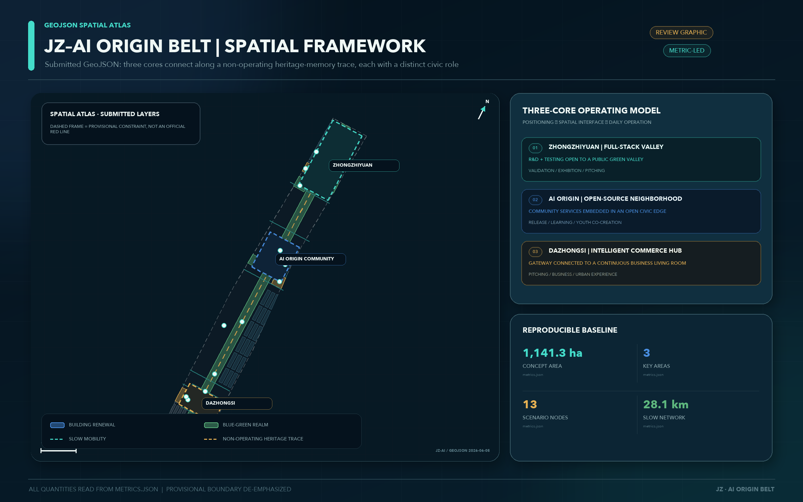
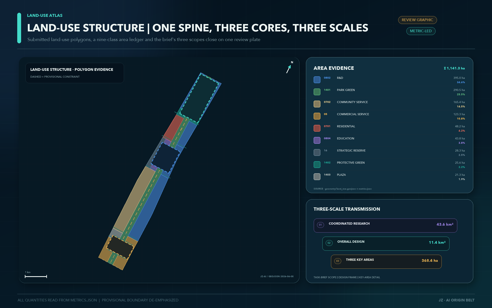
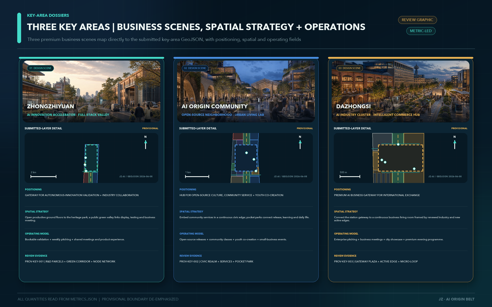
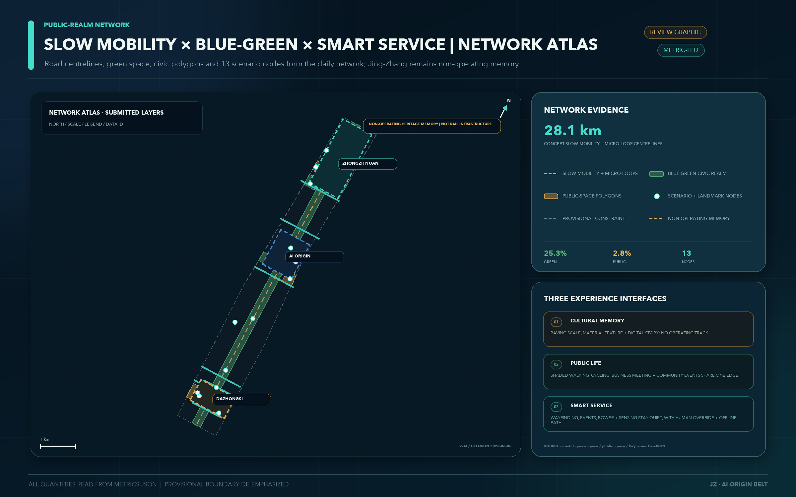
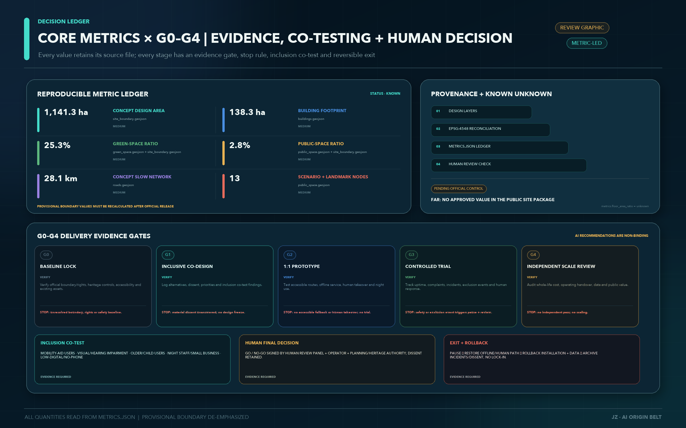

# JZ-AI Origin Belt — Conceptual Urban Design for the Centennial Jing-Zhang AI Innovation Belt

**Primary name: Jing-Zhang Zhiyuan Belt (京张智源带)** — "Zhi" inherits AI innovation; "Yuan" inherits the century-old origin of the Jing-Zhang Railway and the innovative origin of Zhongguancun.
**English name: Centennial Jing-Zhang AI Origin Belt (JZ-AI Origin Belt)**
**Logo and visual identity (agent.1)**: the original mark is delivered as `assets/brand/jz-ai-origin-mark.svg`. Two parallel lines represent railway-gauge memory and open data flow; they fold into the Jing-Zhang “ren” geometry and converge upward at an AI origin point. It is an abstract symbol of historical engineering spirit becoming open intelligence, not an operating-rail sign. The palette is railway navy `#123A63`, compute teal `#159A88`, milestone gold `#E8A23A`, and paper warm white `#F5F3ED`. Paired lines extend into paving inlays and page dividers, the origin dot identifies scenarios and honour plaques, and the ren-shaped fold is reserved for the master brand and event key visuals. The mark must not be stretched, rotated, combined with corporate logos, or used as the sole colour cue in accessible wayfinding. Its basic geometry and generic font stack are original, scalable, offline and ready for professional refinement.

## Design Basis and Source List

This proposal takes the official pre-announcement of the Centennial Jing-Zhang AI Innovation Belt international design call, issued by the Haidian branch of the Beijing Municipal Commission of Planning and Natural Resources, as its primary basis, and uses the registered provisional boundaries, key areas, enumerations, metrics and source lists in `brief/site-package/` as machine-readable evidence [source:OFFICIAL-ANNOUNCEMENT]. Before generation, the agent read `design_brief.json`, `allowed_design_space.json`, `sources.json`, `enums/`, `ranges/planning_limits.json`, `standards/`, `schemas/` and `data/source_registry.json`, and built the task, scope, source-use and data-gap inventories from them [source:SITE-PACKAGE]. The announcement requires regulatory-plan-level urban design depth for the overall design area and implementation-plan-level depth for the key areas, so narrative text does not replace GeoJSON, metrics tables, the A3 booklet, the A0 boards or the HTML presentation — the two layers are mutual evidence [depth:existing_conditions_diagnosis].

Source-use boundaries follow the registry strictly: formal-ready sources support factual claims, background sources provide context only, and provisional sources serve as temporary substitutes [source:SOURCE-REGISTRY]. No background or provisional material is upgraded into official boundaries, statutory controls, formal scoring evidence or implementation commitments. The agent-facing requirements (agent.1–agent.6) come from the open-call taskbook excerpt and are design tasks, not planning controls [source:AGENT-TASKBOOK].

**Boundary statement**: official `SITE_BOUNDARY` and `KEY_AREA` polygons have not been published with the site package. This proposal uses the rough substitute boundary from `brief/site-package/geometry/provisional_boundaries.geojson` (about 11.41 sq km, consistent with the announced 11.4 sq km text value) [source:BOUNDARY-SOURCE]. Both `geometry/site_boundary.geojson` and `geometry/key_areas.geojson` are marked `provisional_constraint`, `official_boundary=false`, `boundary_precision=provisional_rough`, and may be used only for generation, self-check, visualization and design discussion [data:geometry/site_boundary.geojson#SITE-001]. Once official boundaries are released, all layers and area metrics must be recalculated; the organizer's data gap does not block content scoring, but every area figure in this text should be read as a recalculated value under the provisional boundary [metric:site_area_sqm].

## Three-Level Scope Framework

The proposal is organized along the three official levels: the coordinated research area (about 43.6 sq km) for AI industry ecology and future city form; the overall design area (about 11.4 sq km) for the urban renewal framework at regulatory-plan urban design depth; and the key detailed design area (about 368.4 ha) covering the three key areas [source:OFFICIAL-ANNOUNCEMENT]. Every task in announcement sections 1.3, 1.4 and 1.5 and every agent taskbook requirement (agent.1–agent.6) is mapped into `compliance_matrix.json` with chapter, layer, metric and drawing evidence [depth:three_level_scope_framework].

The overall concept is **"JZ-AI Origin Belt: one axis, three cores, two loops, multiple nodes"**:

- **One axis**: the Jing-Zhang heritage cultural axis — a north-south park green spine built on the historic railway corridor, linking memory, slow commuting and AI public scenarios [data:geometry/green_space.geojson#GREEN-001];
- **Three cores**: Zhongzhiyuan AI acceleration area (north), Beijing AI Origin Community (middle) and Dazhongsi AI industry cluster (south), matching the three official key areas [data:geometry/key_areas.geojson#PROV-KEY-001];
- **Two loops**: a slow-mobility vitality loop (heritage greenway plus three district micro-circulation rings and five east-west connectors) and a blue-green ecological loop (the Qinghe–Xiaoyuehe riverfront corridor and pocket parks) [data:geometry/roads.geojson#ROAD-001];
- **Multiple nodes**: 10 AI scenario nodes and 3 AI pilgrimage landmark concept nodes along the axis, forming a walkable "Origin Trail" [data:geometry/public_space.geojson#NODE-01].

The taskbook framework is translated into the following explicit space–operation contracts, rather than layered slogans [source:AGENT-TASKBOOK]:

| Three positions | Direct response among the five functions | Primary carrier in the three areas + two wings | Deliverable |
| --- | --- | --- | --- |
| Centennial Jing-Zhang Cultural Belt | Global voice in AI governance, expressed through engineering ethics, interpretable governance and contributor memory | AI Origin Community + Jing-Zhang heritage cultural axis | Non-operating memory line, contributor avenue, annual public review |
| Urban AI Life Experience Belt | AI+ scenario-empowerment paradigm; intelligent AI vitality city | Dazhongsi AI cluster + Xiaoyuehe scenario-empowerment wing | Ten scenario contracts, no-phone service alternatives, Scenario Open Days |
| AI Convergence Innovation Belt | Full-stack indigenous AI innovation; world-class AI innovation ecosystem | Zhongzhiyuan AI acceleration area + Zhongguancun technology-service wing | Governance sandbox, edge-compute prototype, open-source release and technology transfer |

All five functions therefore enter project or scenario acceptance: full-stack innovation through JZ-04/JZ-05; world-class ecosystem through JZ-03 and five regional interfaces; AI+ empowerment through the ten scenario contracts; AI vitality city through slow mobility, public services and inclusion co-testing; and global AI governance voice through the safety sandbox, human final judgment and a public evidence chain. The Zhongguancun wing provides global factor allocation, Zhongguancun IP and capital enablement; the Xiaoyuehe wing provides scenario empowerment and urban-life co-testing. Neither wing is presented as a new statutory boundary.

| Level | Design question | Proposal answer | Data anchor |
| --- | --- | --- | --- |
| Coordinated research area | How to organize the AI ecosystem and future city form | An innovation chain of university sourcing, open collaboration, enterprise conversion, public experience and global communication | compliance_matrix.json, standard_matrix.json |
| Overall design area | How to draw renewal, industry space, transport and character | 16 gap-free land-use zones, 42 building-footprint clusters, 9 slow-mobility and micro-circulation corridors | [data:geometry/land_use.geojson#LU-001] |
| Key detailed design area | How the three districts reach detailed design depth | Three characterful packages: "Full-Stack Valley", "Open-Source Blocks", "Intelligent Commerce City" | [data:geometry/key_areas.geojson#PROV-KEY-002] |

## Coordinated Research Area: Industry and Future City Research

The core task at this level is building a world-class AI innovation ecosystem. Haidian concentrates leading AI universities, foundation-model companies and compute/data platforms; the proposal uses the Origin Belt as an organizing device to weave scattered innovation resources into a continuous chain of sourcing, collaboration, conversion, experience and communication [standard:PROJECT-OFFICIAL-ANNOUNCEMENT]. Within the taskbook's "three areas and two wings", the AI Origin Community carries the world-class ecosystem, Zhongzhiyuan carries full-stack indigenous innovation and AI governance voice, Dazhongsi carries AI-native business formats, while the Zhongguancun technology-service wing and the Xiaoyuehe scenario-empowerment wing provide capital services and scenario testbeds [source:AGENT-TASKBOOK].

**Regional collaboration interfaces (agent.1)** are defined as verifiable protocol and outcome flows rather than invented projects or recruitment promises. Beiwei Community supports resident need discovery and age- and child-friendly co-testing; Future Science City supports engineering validation, instrument-platform links and joint talent events; Huairou Science City links major-science-facility derivative needs and science communication; Beijing E-Town supports pilot feedback for robots, intelligent terminals and manufacturing scenarios; and the Beijing-Tianjin-Hebei interface supports scenario-protocol interoperability, open-source roadshows and talent exchange. Every interface follows five steps: need brief, data and IP boundary, joint trial, third-party/public review, and replicable handbook. The concept defines interfaces, responsibility roles and evidence formats only; it does not claim that any institution has joined. Phase 1 tests public events and non-sensitive need lists, phase 2 starts joint trials only after written operator confirmation, and phase 3 evaluates cross-regional replication.

| Interface | Origin Belt output | Possible partner input | Verifiable evidence and exit condition |
| --- | --- | --- | --- |
| Beiwei Community | accessibility audit and AI-life prototypes | resident co-test issue list | anonymised records and remedy closure; pause if opposition or privacy risk remains |
| Future Science City | open-source launch, investment and enterprise-service interface | engineering needs and joint talent events | mutually confirmed trial charter and review; no responsible operator means no start |
| Huairou Science City | urban scenarios and science-communication space | scientific questions and application leads | public-source and IP-boundary ledger; unclear provenance triggers exit |
| Beijing E-Town | urban public scenarios and user feedback | robotics and terminal pilot capability | safety assessment, human takeover and fault logs; stop if the safety gate fails |
| Beijing-Tianjin-Hebei | open event brand and scenario handbook | cross-city feedback and talent network | versioned handbook, reproduction record and annual review; no replication means no promotion |

**Global AI ecosystem benchmarking** (agent.2, six cases; each row uses a first-party university, government or project-operator page as a qualitative mechanism reference. No scale, ranking or performance figures are imported, and no partnership is implied):

| Case | Transferable mechanism | Translation for the belt |
| --- | --- | --- |
| Silicon Valley–Stanford | University research, commercialization and a university-developed research park [source:CASE-STANFORD-SRP] | Near-campus incubation, technology transfer and open-source release in the Origin Community |
| Kendall Square, Boston | A mix of laboratories, innovation space, housing, retail and open space that strengthens campus-adjacent collaboration [source:CASE-KENDALL-MIT] | The campus–park–block slow-mobility ring and mixed-use ground floors |
| King's Cross Knowledge Quarter, London | A compact knowledge cluster, cross-sector collaboration and inclusive, accessible public realm [source:CASE-KQ-LONDON] | Knowledge facilities and public realm combined along the Jing-Zhang heritage corridor |
| Munich Werksviertel | A former industrial site adapted into a creative mixed district with room for continuing iteration and on-site trials [source:CASE-WERKSVIERTEL] | Reversible testbeds on underused corridor parcels |
| Tel Aviv innovation ecosystem | Municipal soft-landing services, international networks and conferences supporting the innovation ecosystem [source:CASE-TELAVIV-GLOBAL] | Global AI Week, developer-community operations and soft landing for visiting teams |
| Shenzhen Bay Science and Technology Ecological Park | Platform-based enterprise services, testing/certification support and collaboration between leading and smaller firms [source:CASE-SHENZHEN-BAY] | Scenario Open Days, industry testing and an auditable enterprise-service ledger |

**Full-stack indigenous AI innovation system (agent.2)** is delivered as capability layer, spatial carrier, responsible role and verification evidence, so “full stack” is not merely promotional language:

| Capability layer | Spatial carrier | Responsible role | G2/G3 evidence and exit |
| --- | --- | --- | --- |
| Compute hardware | Zhongzhiyuan edge-compute prototype + corridor hubs | Technical operator + energy professional | Energy, cooling, offline/power-loss safety and maintenance logs; isolate on unauthorized or unstable operation |
| System framework | Governance sandbox and isolated test environment | Platform engineering + safety assessor | Version, interface, fault-injection and human-takeover records; stop if rollback is unavailable |
| Data / models | Dazhongsi data-factor salon | Data owner + legal/model-assessment roles | Provenance, licence, data/model cards, bias and deletion records; reject unclear rights |
| Agents / tools | Origin Community open-source hall and transfer street | Open-source community + technology manager | Task boundary, tool permission, citations, errors and human final review; revoke on overreach |
| Application scenarios | Ten scenario contracts + three industry testbeds | Scenario operator + user representatives | Usability, accessibility, complaint, incident and conversion tickets; pause on exclusion or safety risk |
| Safety governance | Zhongzhiyuan governance sandbox + annual public review | Independent assessor + public representatives + local public role | Red-team, privacy-impact, dissent and remedy closure; no accountable chain means no scaling |

The six layers connect only through minimum-necessary, auditable interfaces: hardware does not directly obtain personal data, models do not directly decide public intervention, agents cannot exceed tool permissions, and scenario outputs receive role-specific human final review. Failure of a lower-layer evidence gate blocks the upper scene from entering G3.

**Integrated-planning and territorial-spatial-planning innovation interface (agent.1)** uses three decoupled layers, allowing industrial operations to iterate while statutory controls remain under professional procedure:

| Layer | Content and decision authority | Interface to the next layer | Prohibited action |
| --- | --- | --- | --- |
| L1 statutory base | Official boundaries, land use, road redlines, ownership, utilities, heritage and development intensity; approved only by competent authorities and professional procedure | Publishes versioned constraints and gaps to L2 | AI, operators and concept drawings cannot automatically alter statutory control |
| L2 urban-design guidance | Axis/cores, frontages, public space, slow mobility, blue-green systems and character; reviewed jointly by urban design, heritage, mobility and landscape professionals | Publishes pilotable spatial units, hours and safety boundaries to L3 | Never treats provisional geometry or concept massing as approved conditions |
| L3 reversible operating plug-ins | AI scenes, business furniture, wayfinding, events and light devices; managed by operators, technical roles and public representatives through G0–G4 | Returns use, complaint, accessibility, energy, safety and maintenance evidence to the next L2 review | Operating data cannot directly trigger land-use, redline or intensity changes |

This interface turns spatial–industrial integration from a one-off masterplan into controlled feedback. Professional teams may use de-identified, reviewed operating evidence to revise the next urban-design recommendation; any L1 implication re-enters statutory procedure and never takes effect through an algorithmic closed loop. Each iteration preserves constraint version, responsible role, dissent and change rationale, combining real-use learning with public decision, professional review and accountability.

Future-city judgment: AI reshapes not only industry but the spatial organization of commuting, learning, consumption and public services. The proposal translates the "intelligent AI vitality city" into locatable space types — edge-compute hubs, open-scenario streets, AI daily-life service streets and interpretable urban-agent assistance — with explicit privacy and human-review boundaries [standard:PROJECT-AGENT-OPEN-CALL-TASKBOOK]. Strategic industry indicators (AI innovation index, talent density) are third-class performance metrics requiring continuous operational calibration; this proposal reports only spatially recalculable metrics in `metrics.json` and fabricates no pseudo-precise values [depth:metrics_recalculation].

## Overall Design Area: Urban Renewal and Regulatory-Plan-Level Urban Design

The overall design area is organized at regulatory-plan urban design depth [standard:MOHURD-CONTROL-DETAILED-PLANNING]. Within the provisional boundary, the proposal forms 16 seamlessly joined land-use zones: research land (0802) at about 3.95 million sqm forms the industrial backbone; park and protective green land (1401/1402) totals about 3.16 million sqm as the heritage axis and blue-green corridors; commercial service land (05) at about 1.23 million sqm concentrates in Dazhongsi and Wudaokou; community services (0702) and housing (0701) secure talent life; culture, education, plazas and strategic reserve land complete the mosaic [data:geometry/land_use.geojson#LU-014] [metric:land_use_area_0802_sqm]. The land-use plan is conceptual: it must be recalculated once official boundaries and regulatory conditions are published, and the codes use the transitional classification enumerated in the site package — the full official table must be imported before statutory use [standard:MNR-LAND-USE-CLASSIFICATION-GUIDE].

The renewal logic is "low disturbance, incremental, operable": activate existing blocks first through public space, ground-floor frontages and programming; inefficient-space identification and the renewal project list appear in the implementation chapter; retain/renovate/demolish is given as a classification method (retain, renovate, renew, new-build, to-confirm), never as parcel-level conclusions [depth:retain_renovate_demolish]. For development intensity, FAR, height and density are all marked to-confirm because official control conditions are absent; no inferred value may masquerade as an approved figure [depth:development_intensity_controls].

Transport and municipal systems are coordinated at the overall level: station-area integration focuses on Dazhongsi, Wudaokou–Chengfu Road and Qinghua East Road West Entrance; the road system respects the existing skeleton, adding only slow-mobility, micro-circulation and parcel-access layers [data:geometry/roads.geojson#ROAD-LOOP-DZS]. New infrastructure (distributed energy, edge-compute hubs, sensing) follows a "light embedding, pilot first" route combined with public services; engineering feasibility conclusions await official data [depth:municipal_new_infrastructure].

## Detailed Design of Key Areas

The three key areas receive characterful detailed designs, each organized at implementation-plan depth with functions, spatial structure, public space, transport and implementation dependencies [depth:three_key_area_detailed_design].

**Zhongzhiyuan AI Acceleration Area — "Full-Stack Valley"** (provisional extent about 192.1 ha, north): a garden-type R&D district organizing the full-stack indigenous innovation system; the Qinghe waterfront hosts industry display and a low-carbon innovation corridor; an "AI governance sandbox" and the "Full-Stack Tower" exhibition hall (pilgrimage landmark concept node) carry standards-making, safety evaluation and public display; internal slow mobility uses an innovation micro-circulation ring [data:geometry/key_areas.geojson#PROV-KEY-001] [data:geometry/public_space.geojson#NODE-13].

**Beijing AI Origin Community — "Open-Source Blocks"** (provisional extent about 104.3 ha, middle): organized around campus–park–block stitching, with a near-campus tech-transfer street, an open-source release plaza, the AI Origin Monument plaza (pilgrimage landmark concept node) and talent services; buildings are mainly renovated with selective infill, and ground floors prioritize release, roadshow, IP and investment services [data:geometry/key_areas.geojson#PROV-KEY-002] [data:geometry/public_space.geojson#NODE-12].

**Dazhongsi AI Industry Cluster — "Intelligent Commerce City"** (provisional extent about 72.0 ha, south): organized around Dazhongsi station integration and four-quadrant pedestrian connection at the junction, hosting agent and smart-device display and trading, content consumption, a data-element reception hall and an international roadshow hall; composite use of planned green space and the station plaza forms the southern gateway [data:geometry/key_areas.geojson#PROV-KEY-003] [data:geometry/public_space.geojson#PUBLIC-001].

All three districts are located on provisional extents and must be re-checked against official polygons; all functional, building and transport proposals are conceptual material for professional teams, not statutory planning or implementation conclusions [source:BOUNDARY-SOURCE].

### Concept Scenes for the Three Cores

The following scenes translate the spatial strategies into everyday experience. Zhongzhiyuan combines industrial heritage, research headquarters and an open innovation commons; the Beijing AI Origin Community combines international collaboration, community services and youth co-creation; Dazhongsi combines intelligent commerce, product launches and investment exchange. Railway memory appears only as discontinuous brass gauge inlays, flush sleeper fragments and interpretation points embedded in paving; there are no continuous rails, ballast, platforms or suggestion of an operating railway. The images were made with the OpenAI image-generation tool and communicate atmosphere and use vision only. They are not photographs of existing conditions and do not evidence statutory boundaries, area metrics or engineering feasibility; the GeoJSON, metrics and registered sources remain authoritative. [depth:three_key_area_detailed_design]

All three scenes share a premium, adaptable and low-intrusion public-facility language: modular business furniture in dark anodized aluminium, warm timber and matte stone, with integrated power and restrained edge lighting, switches between daily meetings, demonstrations, co-creation classes and community events. E-ink wayfinding, edge-intelligence lighting, transparent interactive vitrines, service robots and edge-compute interfaces are integrated into furniture or landscape boundaries instead of relying on giant screens, glare or hard-to-maintain technological decoration. A campus operator leads research collaboration and prototype demonstrations in Zhongzhiyuan; a campus-park-neighbourhood joint desk manages open events and youth co-creation in the AI Origin Community; and a commercial operator works with a public-culture team on launches, investor matching and the evening economy in Dazhongsi. Pilot acceptance uses accessible clear width, daily furniture utilisation, device uptime, event-changeover time, human-review records and public satisfaction as evidence. Targets are locked only after baseline surveys and operator confirmation rather than invented at concept stage. [depth:phasing_implementation]

## AI Innovation Ecosystem, Personas, and AI+ Scenarios

The ecosystem's spatial carrier is a factor–space–operation correspondence: land and space provide a gradient of R&D, incubation, display and housing supply; capital and compute arrive through the technology-service wing and edge-compute hubs; data and scenarios open compliantly through Scenario Open Days; talent stays through talent-zone services and 15-minute living circles [standard:PROJECT-AGENT-OPEN-CALL-TASKBOOK]. The ecosystem map and mechanism tables are registered in `compliance_matrix.json` and the HTML presentation.

**Personas (agent.3, five types)**:

| Persona | Typical needs | Spatial response | Governance boundary |
| --- | --- | --- | --- |
| Open-source developers | Release, collaboration, testing, reputation | Open-source hall, public code wall, night collaboration space | No personal trajectory collection; aggregate statistics only |
| Startup teams | Low-cost offices, compute access, testbeds | Shared test grounds, edge-compute hubs, governance advice | Compute and data services require separate authorization |
| Enterprise and business visitors | Display, roadshows, international reception | International roadshow hall, station feeder, public space | Enterprise marks and cases must be cleared |
| Nearby residents | Commuting, leisure, low-disturbance renewal | Heritage park slow loop, embedded community services, graded events | Resident profiles never used for commercial recommendation |
| University staff and students | Tech transfer, cross-campus collaboration | Transfer stations, campus–park stitching, AI education points | Campus data and research results require authorization |

**AI scenario cards (agent.3, ten) and industry testing scenarios (three)**: the ten cards — 01 open-source release hall, 02 AI governance sandbox, 03 edge-compute hub, 04 AI slow-mobility wayfinding, 05 Dazhongsi international roadshow hall, 06 Qinghe low-carbon innovation corridor, 07 near-campus tech-transfer street, 08 data-element reception hall, 09 AI daily-life service street, 10 Global AI Week route — are all located as structured scenario nodes [data:geometry/public_space.geojson#NODE-01] [metric:scenario_node_count]. The three industry testing scenarios are: (a) a low-speed autonomous shuttle and delivery test section on the axis (limited hours and segments, human-supervised, revocable); (b) an urban-agent-assisted public-space management pilot (slow-mobility gap detection, facility repair reporting, event safety alerts, with human review of decisions); (c) a building-and-campus energy–compute co-dispatch experiment linked to the distributed energy strategy. All testing scenarios are conceptual proposals requiring approval, safety assessment and privacy impact assessment before any operation; none may be stated as approved operations [depth:risk_missing_data].

**Origin Open-Loop AI Scenario Contract v1**: every scene registers space, user, minimum necessary input, AI capability, human decision, operator role, acceptance evidence and exit condition. A scene that fails its exit gate cannot continue under the label of “smart city.”

| # / scene | Minimum input and AI capability | Human decision / operator role | Acceptance evidence and exit condition |
| --- | --- | --- | --- |
| 01 Open-source hall | Voluntarily submitted project metadata; search, captioning and multilingual assistance | Publisher final review / public-culture operator | Authorization and correction logs; remove on infringement or unclear provenance |
| 02 Governance sandbox | De-identified test logs; risk detection and comparative evaluation | Expert-panel decision / technical operator | Version, error and review records; stop if human takeover is unavailable |
| 03 Edge-compute hub | Task-necessary data only; local inference and status display | User confirmation / campus operator | Data destination, energy and fault logs; isolate on unauthorized access |
| 04 AI walk | Public routes and actively chosen accessibility needs; route advice | User or staff choice / public-space operator | Breaks, no-phone alternative and corrections; pause on unsafe advice |
| 05 International roadshow | Cleared talk and exhibit material; translation, captions and retrieval | Speaker/host final review / business operator | Authorization and live corrections; remove false endorsement or unresolved mistranslation |
| 06 Qinghe low-carbon corridor | Facility environment and energy data; anomaly detection and dispatch advice | Facility staff action / campus operator | Uptime, work orders and energy definitions; roll back disruptive or unverified control |
| 07 Transfer street | Voluntarily submitted output and need summaries; matching with explanation | Technology manager confirmation / joint campus–park desk | Reasons, objections and dispositions; stop on undisclosed conflicts |
| 08 Data-factor salon | Catalogue metadata only, no raw sensitive data; compliance Q&A | Legal/data-owner approval / professional-service operator | Provenance, licence and citation chain; reject unclear rights |
| 09 AI life street | Minimum resident-request data; routing and plain-language explanation | Resident choice with staffed fallback / community desk | No-phone path, co-test and remedy records; pause if exclusion occurs |
| 10 Global AI Week route | Public event data and actively chosen language; itinerary support | Command desk/volunteer adjustment / event operator | Crowd, complaint, access and incident logs; divert or cancel on safety risk |

Scenario–space–operation mapping: public-space scenarios anchor to plaza and park layers, mobility scenarios to road and greenway layers, and each scenario's operator, data-minimization principle and human-review mechanism is registered in the compliance matrix and the HTML scenario pages [data:geometry/green_space.geojson#GREEN-001].

## Land Use, Building Scale, and Retain-Renovate-Demolish Strategy

The land-use partition follows a complete, closed, seamless principle: 16 zones are clipped from one shared rectangular grid over the submitted boundary, adjacent zones share boundary coordinates, and topology checks confirm no gaps and no overlaps [data:geometry/land_use.geojson#LU-001]. The building plan contains 42 footprint clusters in three retention categories: Dazhongsi mainly retains existing buildings, Zhongzhiyuan and Chengfu Road mainly renovate, and the Origin Community transfer zone adds selective new-build (all conceptual layouts, not existing-condition survey conclusions) [data:geometry/buildings.geojson#BLDG-ZZY-01] [metric:building_footprint_area_sqm].

Building form and character guidance is managed by [depth:height_massing_character]: low-rise, open frontages are suggested along the heritage axis, courtyard layouts for R&D clusters, and relatively compact mixed-use forms near rail stations; exact heights, setbacks and massing controls all await official regulatory conditions. The building footprint area of about 1.383 million sqm is a conceptual recalculation under the provisional boundary, not a construction-scale conclusion.

The retain-renovate-demolish method ([depth:retain_renovate_demolish]): first complete existing-building surveys and ownership verification; second classify by structural safety, historical value and functional fitness; third match retain, renovate, renew or new-build paths; fourth enter the results into the renewal project list and phasing. Until existing-condition data is available, this proposal submits only the method and the to-calibrate list.

## Transport, Rail, Municipal Infrastructure, and Public Services

The transport strategy is "public-transit connection as skeleton, heritage greenway as axis, slow mobility as veins, micro-circulation as capillaries" [depth:traffic_rail_slow_parking]. North-south, the heritage cultural-axis greenway runs the full belt (about 9.7 km conceptual alignment) as walking and cycling public space, not a restored operating railway. History appears only through flush metal gauge-memory inlays and a few interpretation points—never continuous rails, ballast, platforms or train imagery. East-west, five slow-mobility connectors stitch blocks divided by existing transport infrastructure and ring roads; each key district has one micro-circulation ring; the conceptual slow network totals about 28.1 km (recalculated, not road redlines) [data:geometry/roads.geojson#ROAD-001] [metric:slow_mobility_network_length_m]. Key nodes include the Dazhongsi four-quadrant pedestrian connection, the North Fifth Ring crossing, and public-transit feeder at Wudaokou and Qinghua East Road West Entrance; parking and cycle parking concentrate at transit stations and district entrances, with exact scale awaiting transport studies.

Municipal and new infrastructure: conventional utility data (water, energy, fire protection) is missing and listed as a prerequisite for formal deepening; new infrastructure takes a light-prototype route of edge-compute hubs, distributed energy and low-intrusion sensing, co-located with public services, and no engineering feasibility conclusions are made [depth:municipal_new_infrastructure] [data:geometry/constraints.geojson#CONSTRAINTS]. Public services follow dual standards of 15-minute living circles and AI industry services: talent housing, community services, medical-education-legal services and AI enterprise services are reserved in the land-use mosaic, with facility standards awaiting official conditions.

## Blue-Green Network, Public Space, and Urban Character

The blue-green system is organized as "one axis, two corridors, multiple points": the heritage cultural-axis greenway runs the full belt, the Xiaoyuehe–Qinghe riverfront corridor and the Qinghe protective green corridor form the northern blue-green interface, and the Zhongzhiyuan gateway park and Origin Community pocket park supplement daily green space [data:geometry/green_space.geojson#GREEN-002]. The recalculated green ratio is about 25.3 percent and public (plaza) space about 2.8 percent under the provisional boundary, together supporting commuting, social life, events and display [metric:green_ratio] [metric:public_space_ratio].

The public-space system emphasizes "operable open space": three core plazas (Dazhongsi station forecourt, open-source release plaza, Zhongzhiyuan exhibition forecourt) carry gateway ceremony, community daily life and industry display respectively, with 13 scenario and landmark nodes along the axis [data:geometry/public_space.geojson#PUBLIC-002].

Urban character fuses three cultural narratives (agent.5): **centennial Jing-Zhang culture** (railway heritage, the herringbone alignment, the Zhan Tianyou spirit), **Zhongguancun culture** (entrepreneurship, openness, trial and error) and **new AI culture** (open source, agents, human-machine collaboration). Expression carriers include adaptive display of heritage structures, the "gauge-line" wayfinding system, a contributor honor wall with an annual inscription mechanism, and three AI pilgrimage landmark concept nodes — the Jing-Zhang Railway Memory Hall, the AI Origin Monument plaza and the Full-Stack Tower exhibition hall [data:geometry/public_space.geojson#NODE-11]. The honor display system (agent.4) is proposed as the "Jing-Zhang AI Contributor Avenue": updatable honor plaques and a digital contribution wall along the axis recording researchers, developers, teams and agents with substantive contributions; the public-space component library includes smart seating, interpretable wayfinding signs and modular exhibition pavilions. All marks, fonts and images must be original or cleared; landmark design avoids entertainment-driven or gimmicky expression [standard:MOHURD-URBAN-DESIGN-MEASURES].

## Renewal Projects, Implementation Policy, and Phasing

The renewal project list is organized as location–type–dependency–phase–evidence; all projects are conceptual proposals [depth:renewal_project_list]:

| ID | Project | Type | Key dependencies | Evidence |
| --- | --- | --- | --- | --- |
| JZ-01 | Heritage cultural-axis greenway connection | Public space / slow mobility | Corridor ownership, ring-road crossing conditions | [data:geometry/roads.geojson#ROAD-001] |
| JZ-02 | Dazhongsi four-quadrant pedestrian link and roadshow hall | Station integration / operations | Station conditions, junction, utilities | [data:geometry/public_space.geojson#PUBLIC-001] |
| JZ-03 | Origin Community open-source blocks and transfer street | Urban renewal / industry services | Campus boundary, ownership, ground-floor uses | [data:geometry/buildings.geojson#BLDG-YDS-01] |
| JZ-04 | Zhongzhiyuan Qinghe innovation frontage and low-carbon corridor | Blue-green / industry display | River blue-line, ecology and flood conditions | [data:geometry/green_space.geojson#GREEN-003] |
| JZ-05 | Edge-compute hubs and new-infrastructure pilots | New infrastructure / public services | Energy, safety assessment, operator | [data:geometry/public_space.geojson#NODE-03] |
| JZ-06 | Xiaoyuehe–Qinghe blue-green ecological corridor | Blue-green space | Blue-line, stormwater and ecology | [data:geometry/land_use.geojson#LU-012] |
| JZ-07 | Jing-Zhang AI Contributor Avenue and honor display | Public culture / brand | Public-space permits, copyright clearance | [data:geometry/public_space.geojson#NODE-12] |
| JZ-08 | Global AI Week public route | Operations / brand | Event approval, safety | [data:geometry/phasing.geojson#PHASE-001] |

The eight projects use a “reversible first article–gate–evidence–rollback” delivery contract; concept imagery never substitutes for implementation readiness:

| Project | Responsible role | Reversible first article | Evidence required before G3 | Rollback |
| --- | --- | --- | --- | --- |
| JZ-01 | Urban design + heritage | 100 m flush memory-line and greenway mock-up | Clear width, accessibility, heritage and maintenance review | Remove furniture/inlays and reinstate paving |
| JZ-02 | Mobility + public-space operator | Temporary wayfinding and timed roadshow pop-up | Four-quadrant walking time, crowding and access logs | Remove pop-up and restore circulation |
| JZ-03 | Joint campus–park desk | One ground-floor open-source room | Use, translation, accessibility and transfer tickets | Restore prior lease/use state |
| JZ-04 | Landscape ecology + campus operator | Seasonal modular pavilion and planting test | Ecology, flood, noise and maintenance records | Remove modules and reinstate planting |
| JZ-05 | Technical operator | One offline edge-compute hub | Energy, data destination, security, takeover and fault logs | Disconnect and remove equipment |
| JZ-06 | Water/landscape professional role | Small bioswale demonstration | Runoff, ecology and maintenance review | Reinstate landform and planting |
| JZ-07 | Public-culture/brand operator | Temporary plaques and removable digital wall | Rights, accessibility, update and complaint records | Unpublish and remove plaques |
| JZ-08 | Event operator + public safety | One-day full-route rehearsal | Crowd, access, incident and complaint logs | Cancel or reroute |

Implementation policy follows "light start, fast feedback, incremental renewal": phase 1 (Dazhongsi–Wudaokou demonstration section, about 1.894 million sqm) starts with programming, Scenario Open Days and light facilities; phase 2 (Origin Community–Chengfu Road renewal section, about 7.141 million sqm) advances campus–park–block stitching and transfer space; phase 3 (Zhongzhiyuan–Qinghe upgrading section, about 2.378 million sqm) completes full-stack display and the blue-green frontage [data:geometry/phasing.geojson#PHASE-001] [metric:phase_1_area_sqm]. Phase areas are recalculated under the provisional boundary; implementation requires statutory plans, ownership, funding and approval paths [depth:phasing_implementation].

**Implementation responsibility and stage gates**: the concept does not assume that a government body or investor has committed. It therefore names roles rather than invented organizations. Urban-design and heritage teams own boundary, heritage and spatial development; a local public-authority role owns compliance and public procedure; campus/commercial operator roles own daily programming and asset maintenance; a technical-operator role owns device safety, data governance and human takeover; independent assessors and public representatives own external review. A project enters the next stage only after the prior gate evidence is archived.

| Gate | Required evidence | Entry condition | Stop or rollback condition |
| --- | --- | --- | --- |
| G0 baseline | existing-condition survey, ownership and heritage checks, accessibility audit, initial privacy screen | source, owner, version and gaps are traceable | boundary/ownership conflict or unclear sensitive-data provenance |
| G1 co-design | needs and dissent log covering residents, universities, firms, visitors and vulnerable groups | material objections receive written responses and alternatives are comparable | exclusion, night disturbance or accessibility impact remains unresolved |
| G2 prototype | 1:1 furniture/wayfinding mock-up, offline device mode, safety and human-takeover test | maintainable, reversible and fault-recording operation | no human takeover, operator or safety accountability chain |
| G3 trial | uptime, event-changeover time, satisfaction, complaint and incident logs | confirmed operator locks metric definitions and minimum values | incident, privacy event or repeated threshold failure pauses operation |
| G4 scale | independent review, whole-life cost review and open replication handbook | reproducible evidence and clear professional-approval route | irreproducibility, unsustainable cost or negative professional review |

**Public-interest and inclusion co-testing** expands the five personas into mandatory review seats rather than allowing an “average user” to stand in for vulnerable groups. Wheelchair and mobility-aid users test continuous clear width, gradients and turning space; people with visual or hearing impairments test tactile, audio and high-contrast multimodal wayfinding; older people and children test lighting, rest intervals, edge protection and caregiver sightlines; night workers, cleaners, security staff and small merchants test evening safety, servicing and business impacts; and people with low digital literacy or no smartphone verify that every service has a staffed and paper alternative. Co-testing records anonymous issues and remedy status only, never biometrics or personal trajectories. Public acceptance evidence reports participant structure, unresolved dissent, before/after remedies and exit decisions rather than only an average satisfaction score.

**Long-term operations (agent.6)**: a conceptual "JZ-AI Origin Belt operations community" is suggested as the coordinating platform. The annual event system includes a spring Global AI Developer Week, a summer series of AI City Scenario Open Days, an autumn Jing-Zhang Culture–AI Biennale and a winter Open-Source Contributor Annual Conference. Developer-community operations run on two tracks — online code contribution plus offline scenario co-creation; scenario opening is managed through an apply–assess–open–review loop; international communication uses the JZ-AI Origin Belt brand with a multilingual content matrix; the conversion pathway for talent, enterprises and developers is a four-level funnel of participation, community retention, scenario co-creation and landing services. All of the above are operational mechanism suggestions, not government event schedules or funding commitments [source:AGENT-TASKBOOK].

## Metrics, Area Recalculation, and Compliance Matrix

Metrics are managed in three classes [depth:metrics_recalculation]. Class one, spatially recalculable metrics, is fully registered in `metrics.json` and independently recomputable from GeoJSON: site area 11,412,825 sqm (provisional boundary), building footprints about 1.383 million sqm, green ratio about 25.3 percent, public-space ratio about 2.8 percent, conceptual slow network about 28.1 km, 13 scenario and landmark nodes, plus phase and land-use area groupings [metric:site_area_sqm]. Floating polygon edges and three-decimal storage leave about 20.9 sqm between the land-use subtotal and site total and about 64.0 sqm between the phase subtotal and site total; both are below 0.001 percent of site area, so the package retains source-geometry recalculation rather than manually forcing the totals to match. Class two, control metrics (FAR, height, density, road redlines, facility standards), is registered as unknown with stated prerequisites because official conditions are absent [metric:floor_area_ratio]. Class three, performance metrics (AI innovation index, talent density, event participation, scenario usage frequency), requires continuous operational calibration, and this proposal fabricates no values.

The compliance matrix is the master file of task responsiveness: every task in announcement sections 1.3, 1.4 and 1.5 and agent.1–agent.6 is mapped to report chapters, layers, metrics, drawings and HTML pages in `compliance_matrix.json`; mandatory professional standard responses are in `standard_matrix.json`, and design-depth evidence is in `design_depth_matrix.json`. Any uncovered mandatory task bars the package from formal professional review, and this proposal has been self-checked against that standard item by item [standard:PROJECT-OFFICIAL-ANNOUNCEMENT].

### Co-creation Charter, Continuous Collaboration, and Rights Boundary

The ten taskbook principles are acceptance checks for every iteration, not a one-time declaration [source:AGENT-TASKBOOK]: `charter.1` public interest first; `charter.2` public or cleared sources; `charter.3` concept advice never substitutes statutory planning; `charter.4` AI-native mechanisms; `charter.5` structured and human-readable outputs; `charter.6` generation-method disclosure; `charter.7` final human judgement; `charter.8` public knowledge accumulation; `charter.9` durable contributor credit; and `charter.10` human-centred governance. The continuous loop is “sync the latest main and required inputs → reread the brief, sources, Issues, PRs and selected peer work on demand → update sources, assumptions, narrative, layers and evidence → rerender and run finalize plus the four-gate self-check → run participant preflight and full readback → resubmit”. When a requirement is unclear, data conflict, or validation/rendering fails, search existing Issues and PRs first and open a reproducible issue only if no duplicate exists. External publication, account actions or third-party contact require the relevant human authorization. Each cycle retains source versions, change reasons, dissent, contributor credit and self-check records; first generation, first local PASS and first push are never treated as completion.

## Risk, Copyright, and Compliance

**Data-gap risk**: official boundaries, exact key-area polygons, regulatory conditions, existing buildings, ownership, municipal and heritage data are not published with the site package. This proposal works on the provisional substitute boundary; every spatial conclusion carries a "pending official data" label and the whole package must be recalculated once official boundaries are released [source:SITE-PACKAGE] [data:geometry/constraints.geojson#CONSTRAINTS].

**Compliance boundaries**: this proposal claims no official approval, no approved regulatory plan, no final land ownership, no final construction scale and no implementation guarantee. All spatial proposals, scenarios, landmarks, events and operating mechanisms are conceptual suggestions, reference schemes or material for professional teams to deepen [depth:risk_missing_data]. AI governance scenarios follow data minimization, public sources, interpretability and human review; no personal profiles are produced, and immature technology is never presented as deployable at scale.

**Copyright and bilingual**: the primary file of this package is Chinese; `proposal.en.md` (this file) is the complete English counterpart. Drawings, figures and HTML are provided in both languages. All text, geometry and figures are originally generated by the agent from public site-package materials under the COMMUNITY-DISPLAY-ONLY license; the scope and licences of cited materials are recorded in `sources.json` and `report/copyright_statement.md`. The three concept scenes were generated with the OpenAI image-generation tool on 2026-08-12; the host exposed no specific underlying model, so it is recorded truthfully as `unknown`. The original SVG uses basic vector geometry, has not undergone a trademark search and carries no registrability or exclusivity claim.

Minimum rights evidence for the PDF toolchain and fonts is as follows: ReportLab `4.4.9` (BSD) performs layout, Pillow `12.2.0` (MIT-CMU) handles raster assets, and fontTools `4.63.0` (MIT) is used only to instantiate static build fonts. Chinese PDFs use Google Fonts' Noto Sans SC `2.004-H2` under SIL OFL 1.1, embedding only 400/700-weight subsets; SHA-256 values for the source and both static instances are recorded in the copyright ledger, and Arial Unicode MS has been removed from both generator and PDFs. Helvetica, Helvetica-Bold, Symbol and ZapfDingbats are PDF Base-14 / logical non-embedded font references, with no font program distributed in the package; build dependencies and source/static font files are likewise not separately distributed. The HTML pages are fully offline, load no remote resources and track no visitor behavior.

## References

- brief/site-package/design_brief.json (structured design brief summary)
- brief/site-package/agent_taskbook.json (agent open-call taskbook excerpt)
- brief/site-package/allowed_design_space.json (design space and data policy)
- brief/site-package/geometry/provisional_boundaries.geojson (provisional substitute boundary and key areas)
- brief/site-package/enums/, ranges/planning_limits.json, standards/
- data/source_registry.json (public source registry and use boundaries)
- Complete machine indexes: `sources.json`, `metrics.json`, `compliance_matrix.json`, `standard_matrix.json`, `design_depth_matrix.json` [source:SITE-PACKAGE]
