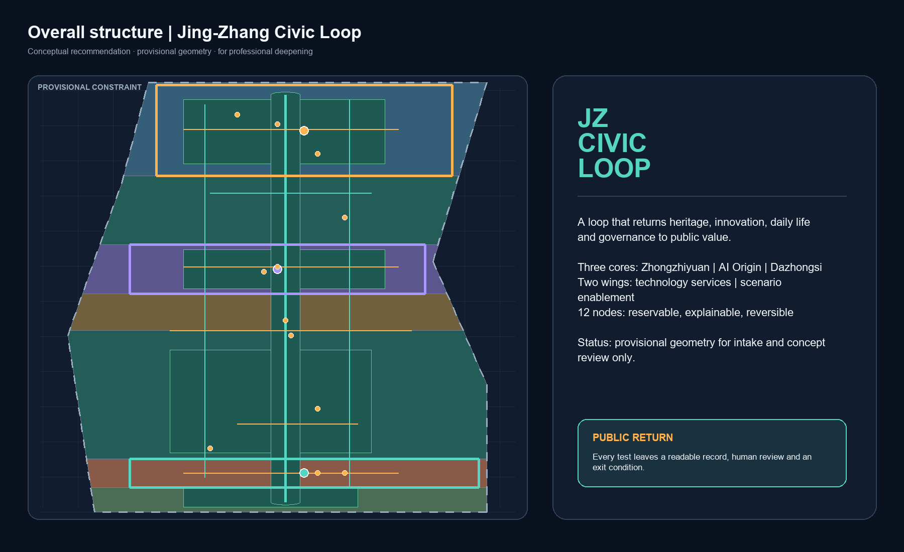
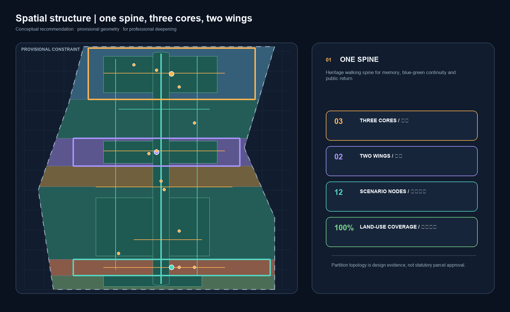
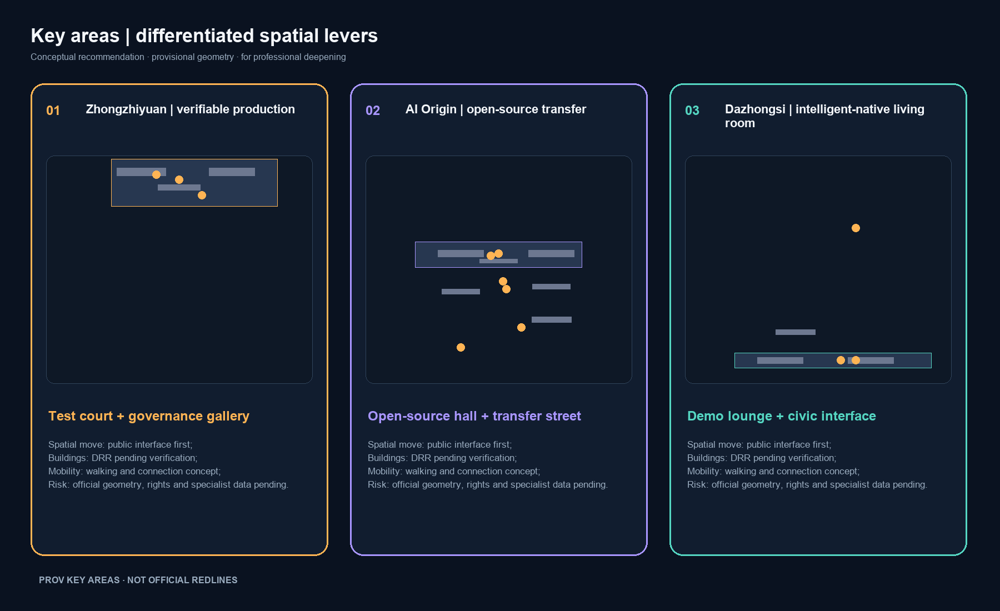
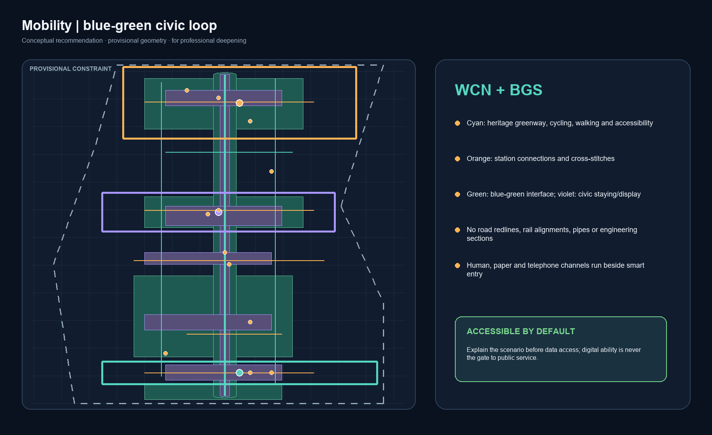
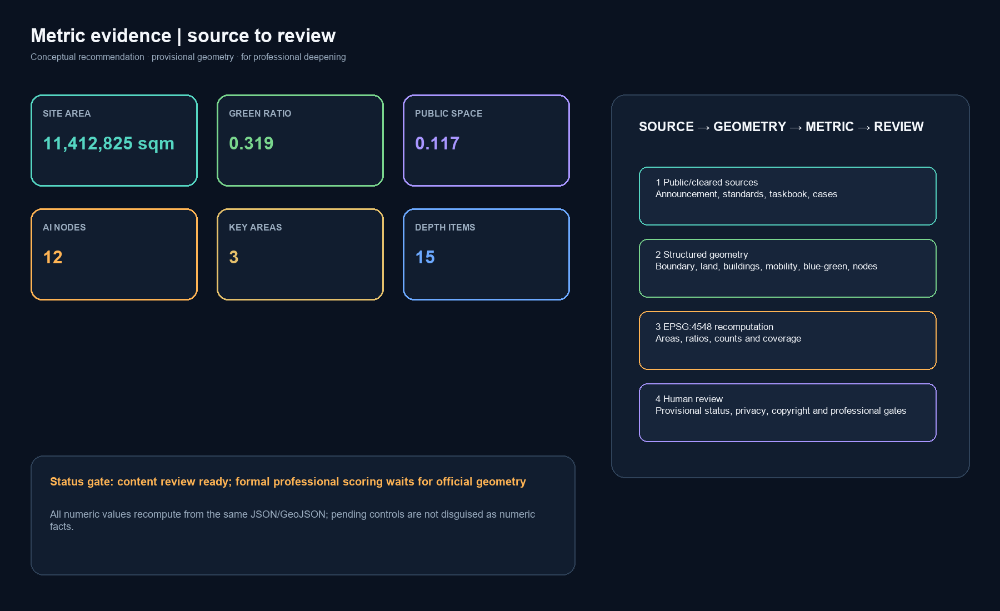

# Jing-Zhang Civic Loop / 京张共生环

## Design Basis and Source List

This proposal uses the official pre-qualification announcement for the project name, three scope levels, announced areas and design tasks. The cleared agent taskbook supplies the six agent tasks, the three positions, five functions, Three Zones and Two Wings, and the public-compliance boundary.[source:OFFICIAL-ANNOUNCEMENT] [source:AGENT-TASKBOOK] Neither document provides a statutory redline that this package can adopt directly. The package therefore uses the maintainer-provided rough provisional polygons only for generation, visualization, topology checks and conceptual discussion.[source:BOUNDARY-SOURCE]

The source registry is treated as a use-and-authority map: the announcement, professional standards and cleared taskbook support formal task interpretation; public case websites support background mechanisms; provisional geometry does not support an official redline, precise area or approval conclusion.[source:SOURCE-REGISTRY] The spatial argument follows the principles of urban-design management, regulatory detailed planning and national land-use classification, with the complete audit links stored in the three matrices.[standard:MOHURD-URBAN-DESIGN-MEASURES]

Geometry, metrics, drawings and HTML are generated from the same GeoJSON, matrices and self-check state. No third-party photographs, map screenshots, fonts, trademarks or portraits are embedded. This is an open co-creation recommendation, not a substitute for statutory planning, professional design, government review or engineering studies.[depth:existing_conditions_diagnosis]

## Three-Level Scope Framework

The Coordinated Research Area is approximately 43.6 km², described by the announcement as north to the North Fifth Ring Road, east to the Jingzang Expressway, south to Xizhimenwai Street and west to Wanquanhe Road. The Overall Design Area is approximately 11.4 km² of urban and industrial districts within 1–2 km of the Jing-Zhang Railway Heritage Park. The Key-Area Detailed Design Area is approximately 368.4 ha and includes, from north to south, the Zhongzhiyuan AI Independent Innovation Acceleration Area, Beijing AI Origin Community and Dazhongsi AI Industry Cluster.[source:OFFICIAL-ANNOUNCEMENT] These are announced task scales, not precise measurements of this provisional package.

This submission uses `PROV-SITE-001` as its overall design boundary and `PROV-KEY-001`, `PROV-KEY-002` and `PROV-KEY-003` as the three key areas. They retain `official_boundary=false` and `geometry_role=provisional_constraint`. The drawings therefore use a low-contrast dashed boundary and place emphasis on the spine, cross-links, nodes and public-space network.[data:geometry/site_boundary.geojson#SITE-001] [data:geometry/key_areas.geojson#PROV-KEY-001]

The three levels form a “strategy—space—experience—review” sequence: the strategic level defines coordinated resources and public value; the overall level organizes land use, renewal, blue-green space and mobility; the key-area level tests three differentiated cores; and the operating level returns user feedback to the next scenario gate. When official polygons arrive, the boundary and key areas must be replaced together, followed by recalculation of land use, buildings, roads, green space, public space, phasing, metrics, figures, PDFs and HTML. Until then no provisional polygon is called an official planning redline.[depth:three_level_scope_framework]

## Coordinated Research Area: Industry and Future City Research

### 1. Concept, naming and identity

“Civic Loop” is not an additional statutory boundary. It is a method for placing railway heritage, innovation production, everyday life and public governance in one feedback loop. The Chinese name “京张共生环” emphasizes continuity and shared maintenance; “Jing-Zhang Civic Loop” foregrounds public value, circulation and international communication. The proposed logo uses three open arcs: a fine railway-gold arc for memory, a cyan arc for the blue-green public spine and an orange arc for AI testing; three dots represent the three zones and two short wings represent the Zhongguancun Technology Services Wing and Xiaoyue River Scenario Enablement Wing. All marks are geometry drawn for this package, not borrowed corporate identifiers.[source:AGENT-TASKBOOK] [standard:PROJECT-AGENT-OPEN-CALL-TASKBOOK]

The visual system uses Railway Gold, Waterside Cyan, Experiment Orange and Governance Violet. Gold marks heritage, cyan public space and walking/cycling, orange reservable tests, and violet evidence and human review. Every figure carries a source and provisional-status note. The identity direction is a conceptual recommendation for professional deepening, not a registered trademark or official brand decision.

### 2. Three positions, five functions and the Three Zones and Two Wings loop

The three positions become three perceptible urban layers: the Centennial Jing-Zhang Cultural Belt is a readable memory layer; the Urban AI Life-Experience Belt is an accessible service layer; and the AI-Integrated Innovation Belt is a verifiable production layer. The five functions are expressed through production, learning, living, exhibition and governance interfaces: a Full-Stack Independent AI Innovation System, World-Class AI Innovation Ecosystem, AI-Enabled Scenario Paradigm, Intelligent AI Vitality City and global AI-governance discourse.[source:AGENT-TASKBOOK]

| Spatial unit | Role | Civic-loop action | Evidence |
| --- | --- | --- | --- |
| Zhongzhiyuan AI Independent Innovation Acceleration Area | Full-stack R&D, testing and safety governance | Turn models, standards and low-carbon tests into reservable public knowledge | [data:geometry/key_areas.geojson#PROV-KEY-001] |
| Beijing AI Origin Community | Near-campus research, open source and transfer | Turn research into contributions, talent services and everyday learning | [data:geometry/key_areas.geojson#PROV-KEY-002] |
| Dazhongsi AI Industry Cluster | AI-native consumption, business and international exchange | Turn products into testable city services and public feedback | [data:geometry/key_areas.geojson#PROV-KEY-003] |
| Zhongguancun Technology Services Wing | Conceptual support for capital, IP, legal and international services | Return needs, compliance and resources to the three cores | [source:OFFICIAL-ANNOUNCEMENT] |
| Xiaoyue River Scenario Enablement Wing | Conceptual community, education, health, legal and daily-life scenarios | Bring public problems into tests and return results to daily life | [data:geometry/public_space.geojson#PUBLIC-001] |

### 3. Global mechanisms and factor configuration

The following six cases are public mechanism references, not claims about existing Haidian institutions or outcomes. The transferable object is how rules, space and feedback are organized, not a copied city brand.[source:CASE-HELSINKI]

| Case | Publicly checkable mechanism | Civic-loop translation |
| --- | --- | --- |
| Helsinki AI Register | A public inventory and explanation of city AI use | Publish a scenario card, data purpose and human-review record at public nodes |
| Amsterdam Algorithm Register | Public algorithm registration and explanation | Give every urban agent a readable purpose, accountable role and appeal route |
| Singapore AI Verify | AI governance testing tools and assessment methods | Give Zhongzhiyuan reservable test records, risk levels and exit gates |
| Barcelona Decidim | An open participatory digital platform | Let the Origin Community preserve proposals, responses and version history |
| Mila, Montréal | An institution connecting research, talent and industry | Use the near-campus transfer street to connect learning, incubation and services |
| Seoul AI Hub | Public-facing entrepreneurship, education and exchange nodes | Build sustained small-scale courses and demonstrations rather than a one-off expo |

Eight factors follow a “permission—use—return” model. Land and space provide reversible public interfaces and shared-room prototypes. Industry and finance are only proposed service mechanisms. Talent moves through developer communities, near-campus learning and international visits. Compute and data use authorization, minimization, tiering and revocation. Scenarios enter through public calls, human review and small tests. Company lists, investment amounts, output values, fiscal arrangements and recruitment promises are not invented.[standard:MOHURD-CONTROL-DETAILED-PLANNING] [depth:overall_spatial_structure]

Regional coordination is framed as interfaces rather than promises. A later professional study could connect the loop with Beijing’s northern community, Future Science City, Huairou Science City, the Economic-Technological Development Area and the wider Beijing-Tianjin-Hebei innovation network through knowledge, talent, scenarios and events. This proposal does not claim that such organizational relations already exist.

## Overall Design Area: Urban Renewal and Regulatory-Plan-Level Urban Design

The conceptual structure is “one spine, three cores, two wings, five east-west stitches and twelve scenario nodes.” The Jing-Zhang heritage park and blue-green spaces form the public spine; the three key areas take differentiated innovation roles; the two wings connect technology services and daily-life scenarios; five cross-links connect campuses, districts, communities and stations; and twelve nodes turn AI capacity into reservable, explainable and reversible public interfaces.[data:geometry/roads.geojson#ROAD-001] [data:geometry/green_space.geojson#GREEN-001]

The land-use layer uses codes 0702, 05, 1401, 1403, 0804 and 0802 from the project subset of the national classification guide. Seven adjacent polygons cover the submitted boundary without overlap; this is a design-topology fact, not an approved parcel use.[standard:MNR-LAND-USE-CLASSIFICATION-GUIDE] [data:geometry/land_use.geojson#LU-001]

The renewal framework starts with public space, first-floor interface improvement, interior program substitution, reversible prototypes and professional review rather than naming demolition parcels. The project list separates public space, service facilities, scenario access and operations so that ownership, transport, heritage, municipal and fire conditions can later determine actual implementation objects. FAR, building height, coverage, setbacks and road redlines remain pending official regulatory conditions; no guessed value replaces a statutory control.[standard:MOHURD-CONTROL-DETAILED-PLANNING] [depth:development_intensity_controls]

Urban character follows a low-disturbance, legible and maintainable interface principle. Heritage nodes remain restrained; innovation interfaces may use detachable display components; public ground floors prioritize continuity, accessibility and reviewability. Materials and colors are directional recommendations, not unsupported height or character-control lines. Building design remains a professional and rights-holder task.[standard:MOHURD-URBAN-DESIGN-MEASURES] [depth:height_massing_character]

## Detailed Design of Key Areas

The following actions combine announced tasks with provisional intake geometry. Every spatial move is a conceptual recommendation, reference scheme or material for professional teams to deepen; it is not a parcel-level demolition, ownership decision or engineering commitment.

### A. Zhongzhiyuan: a garden-like verifiable production ground

`PROV-KEY-001` is in the northern part of the submitted corridor. The suggested sequence is “Qinghe interface—test court—research lane—governance gallery.” The interface hosts low-carbon walking and public knowledge; the test court hosts model evaluation, standards workshops and red-team demonstrations; the research lane provides a conceptual mix of shared laboratories, incubation and enterprise services; and the governance gallery makes risk notes, version records and human-review outcomes readable to visitors.[data:geometry/key_areas.geojson#PROV-KEY-001] [data:geometry/buildings.geojson#BLDG-001]

The DRR method is to retain recognizable structures, renovate first-floor and public interfaces, test detachable prototypes and leave any reconfiguration candidate for existing-condition review. Mobility is represented by a heritage greenway, cross-links and station guidance. Public space uses a garden-like Qinghe interface. River, ecology, flood, heritage, fire and road conditions must be verified from formal material. Priority scenarios are the safety-governance sandbox, edge-compute stop and low-carbon innovation gallery; only authorized aggregate records are retained.

### B. Beijing AI Origin Community: an open-source transfer courtyard

`PROV-KEY-002` is in the middle section. The suggested four-part relationship is “original research—open-source release—technology transfer—talent life,” arranged as adjacent courtyards that can be reused at different times. Low-disturbance first-floor renewal, evening learning and movable displays stitch campus, district and neighborhood routines. `buildings.geojson` expresses conceptual footprints and renewal classes; it does not imply that a campus or district has consented to alteration.[data:geometry/key_areas.geojson#PROV-KEY-002] [data:geometry/buildings.geojson#BLDG-004]

The transfer street provides an open-source hall, IP and legal guidance, demonstrations, talent services and shared learning. Station integration at Wudaokou and Qinghua Donglu Xikou is represented only as walking and connection logic, not an engineering alignment. Priority scenarios are the open-source hall, transfer street, AI life-service sample street and global AI week route. Operation uses reservation, human guidance, public feedback and version rollback.

### C. Dazhongsi: an urban intelligent-native living room

`PROV-KEY-003` is in the southern section. The proposed public interface is “international demo lounge—intelligent-device experience street—data commons lounge—four-quadrant civic interface.” The lounge serves enterprises, developers and international visitors; the experience street presents rights-cleared product prototypes; and the data lounge discusses authorization, auditability and public value without displaying personal data.[data:geometry/key_areas.geojson#PROV-KEY-003] [data:geometry/public_space.geojson#PUBLIC-003]

Mobility is a conceptual recommendation for continuous walking, orderly cycling parking, station connection and time-based night management. The four-quadrant interface requires transport, station and municipal review. Building and retail strategy prioritizes first-floor reprogramming and public-environment improvement; enterprise buildings, rights-controlled spaces and potential parcels are not assigned forced alterations. Priority scenarios are the international demo lounge, data commons lounge and public maintenance desk.

## AI Innovation Ecosystem, Personas, and AI+ Scenarios

### 1. Personas and spatial-operation mapping

| Persona | Need | Spatial response | Protection boundary |
| --- | --- | --- | --- |
| Open-source developer | Publish, collaborate, test and receive contribution credit | Origin open-source hall, public code wall and evening co-working court | No personal tracking; only voluntary public contributions |
| Startup team | Affordable trials, compliance guidance and real scenarios | Zhongzhiyuan test court, technology-services wing and edge-compute stop | Compute and data require separate authorization and human review |
| Enterprise visitor and international team | Demonstration, recruitment, business and exchange | Dazhongsi demo lounge, station connection and multilingual wayfinding | Rights-clear cases and marks; no implied partnership |
| University student or researcher | Learn, transfer and collaborate across campuses | Transfer street, learning court and cultural guide | Campus and research material is not default package data |
| Resident or older adult | Commute, leisure, daily services and offline support | Heritage walking loop, community nodes and human service desks | Smart and traditional channels run in parallel |
| Disabled user or caregiver | Safe movement, understandable information and assistance | Continuous accessible guidance, rest points and human review desk | Check against project-specific standards and user trials |

These are design hypotheses, not demographic statistics. Scenario operation uses public, aggregate, authorized or user-submitted data only.[source:AI-GOVERNANCE] [standard:BARRIER-FREE-ENVIRONMENT-LAW]

### 2. Twelve AI scenario cards

| ID and type | Scenario card | Space | Data boundary, human review and operation |
| --- | --- | --- | --- |
| 01 | Open-source hall | AI Origin Community | Voluntary public project summaries; editor and contributor confirmation before publication |
| 02 TVS | Safety-governance sandbox | Zhongzhiyuan | Authorized test sets and aggregate outcomes; safety, ethics and professional review |
| 03 TVS | Edge-compute stop | Spine and service node | Display resource status and energy bands only; manual admission and exit |
| 04 | AI walking navigation | Heritage park belt | Public network and anonymous congestion signals; no tracking, on-site correction |
| 05 | Dazhongsi international demo lounge | Dazhongsi | Rights-cleared product material; organizer review and visitor feedback |
| 06 TVS | Qinghe low-carbon innovation gallery | Zhongzhiyuan interface | Aggregate environmental readings; ecology and safety review before display |
| 07 | Near-campus transfer street | AI Origin Community | Public results and reservations; IP and legal confirmation before intake |
| 08 | Data commons lounge | Dazhongsi | Authorization, purpose and audit discussion; no personal-data exchange |
| 09 | AI life-service sample street | Community and retail edge | Health, education, legal and daily-life navigation with human fallback |
| 10 | Global AI week route | Three-core public system | Public-space approval, capacity control, pause and route rollback |
| 11 | Accessible heritage guide | Heritage and culture nodes | Large type, voice and human guide options; user testing and revision |
| 12 | Public maintenance desk | Spine and nodes | Facility tickets and scenario problems; no resident profiling |

Cards 02, 03 and 06 are testing-and-validation scenarios. Their records are conceptual operating evidence, not approved operations or proof of technical maturity.[standard:GENERATIVE-AI-INTERIM-MEASURES] [data:geometry/constraints.geojson#SCENARIO-02]

Every card follows “public/authorized input—minimum processing—explainable output—human review—public feedback—pause/exit.” Medical, payment and other listed public-service contexts retain traditional counters and offline channels. Accessibility, voice, large type and human help must be checked again during detailed design and engineering review.[standard:ELDERLY-SMART-TECH-PLAN-2020-45] [depth:traffic_rail_slow_parking]

## Land Use, Building Scale, and Retain-Renovate-Demolish Strategy

`land_use.geojson` uses seven adjacent zones covering the provisional site. The main codes are 0802 research, 1401 blue-green, 0804 near-campus education, 1403 public stitching space, 05 commercial services and 0702 community services.[data:geometry/land_use.geojson#LU-007] [standard:MNR-LAND-USE-CLASSIFICATION-GUIDE] Areas are recomputed from submitted geometry and do not approve parcel uses.

The building layer contains twelve conceptual footprints with types including AI R&D, laboratory, incubator, office, mixed use, education, residential, talent housing, community service, retail and culture. `renewal_class` distinguishes retain reference, renovate reference, new-build reference and reconfiguration candidate pending verification.[data:geometry/buildings.geojson#BLDG-001] Since existing-building surveys, ownership, floors, heights, regulatory conditions and fire information are absent, the proposal does not state a building height, FAR, coverage control or demolition parcel.

The DRR method has four professional gates: verify existing conditions and rights; assess retention and repair value; study first-floor and public-interface renewal; then let a qualified team assess reconfiguration or addition. All intensity and height metrics remain pending official controls. Footprint area and type counts are used only to discuss spatial supply.[metric:building_footprint_area_sqm] [depth:retain_renovate_demolish]

## Transport, Rail, Municipal Infrastructure, and Public Services

`roads.geojson` represents a heritage greenway, parallel walking/cycling lines, three cross-connections and local branches as a concept network. It does not represent road redlines, lane counts, sections, rail alignments or construction solutions.[data:geometry/roads.geojson#ROAD-001] The design focuses on walking continuity at the North Fifth Ring interface, the two park ends, Wudaokou, Qinghua Donglu Xikou, Dazhongsi station and enterprise surroundings; actual junction and station design requires transport evidence.

Transit integration uses a four-layer guidance system—station, connection, public court and scenario node. Parking is a conceptual combination of shared time windows, orderly bicycle parking and event-day management; no unsupported engineering number is supplied. Public services provide human desks, telephone/paper guidance, voice/large-type information and understandable scenario explanations, so a smart entry is never the only entry.[standard:BARRIER-FREE-ENVIRONMENT-LAW] [standard:ELDERLY-SMART-TECH-PLAN-2020-45]

Municipal and new-infrastructure work is an “adaptable service layer.” Edge compute, environmental sensing, distributed energy, stormwater and maintenance can be tested separately in later specialist studies. The spatial recommendation reserves removable service nodes and maintenance interfaces; it does not infer energy load, pipe capacity, flood level or fire feasibility.[data:geometry/constraints.geojson#GAP-MUNICIPAL-001] [depth:municipal_new_infrastructure]

## Blue-Green Network, Public Space, and Urban Character

The blue-green concept combines the heritage-park walking spine, Qinghe and Xiaoyue River scenario clues, cross-stitches and four public-court types. `green_space.geojson` represents a continuous green interface and `public_space.geojson` represents public staying, exhibition and service nodes. They are design overlays, not statutory green lines, blue lines or existing park boundaries.[data:geometry/green_space.geojson#GREEN-001] [data:geometry/public_space.geojson#PUBLIC-001]

The public-space component library includes detachable wayfinding columns, low information desks, adjustable shade seating, shared power and drinking points, accessible rest points, public code/contribution walls, quiet discussion booths and reusable exhibition frames. Components prioritize durability, maintenance, reversibility and unobstructed heritage reading; dimensions, materials, fire and heritage fit require professional review.[standard:MOHURD-URBAN-DESIGN-MEASURES] [depth:blue_green_public_space]

### Three AI pilgrimage landmarks and the cultural narrative

1. **Civic Mile Gate / 共生里程门**: a conceptual north/south gateway using mileage, a historical timeline and current scenario cards to connect railway movement with intelligent collaboration; it does not reproduce unlicensed historic imagery.
2. **Verifiable Signal Court / 可验证信号庭**: a public knowledge node in Zhongzhiyuan where gold, cyan, orange and violet signal status, data permission, human review and exit conditions; it is a governance-education device, not surveillance.
3. **Open Echo Platform / 开源回声台**: an Origin Community contribution display where contributor-confirmed versions, questions and responses become shared memory.
4. **Civic Return Window / 城市回报窗**: a Dazhongsi feedback node showing how a test may return a public-service improvement and allowing objections or pause requests.

The cultural narrative does not treat history as decoration. It translates the railway grammar of stations, lines, signals, maintenance and shared responsibility into a way to explain versioning, accountability and public return in an AI city. Zhongguancun innovation culture provides the contemporary setting of open collaboration and transfer; AI-native culture becomes credible through contestable and reversible public scenarios.[source:OFFICIAL-ANNOUNCEMENT] [source:AGENT-TASKBOOK]

Wayfinding uses a bilingual “line—station—node—status” grammar: gold for heritage, cyan for public walking/cycling, orange for reservable tests and violet for evidence and human review. Suggested international copy: **“A civic loop where every AI experiment returns a public benefit.”** This is communication copy, not an official slogan or trademark decision.

## Renewal Projects, Implementation Policy, and Phasing

The following are conceptual project items. Locations are represented through layers and node types; rights, responsible actors and funding remain to be confirmed by the organizer, rights holders and professional teams.

| ID | Concept project | Action | Dependencies and exit |
| --- | --- | --- | --- |
| JZ-01 | Heritage-park walking stitch | Connect the spine, cross-links and accessible nodes | Road/heritage review; pause if safety is not met |
| JZ-02 | Zhongzhiyuan Qinghe interface | Green public room, governance display and low-carbon test | River, ecology, flood and operation review |
| JZ-03 | Origin near-campus transfer street | Public release, legal, learning and talent services | Campus, rights, IP and public participation |
| JZ-04 | Dazhongsi four-quadrant civic interface | Station connection, walking continuity and bicycle order | Transport, station data and safety review |
| JZ-05 | AI public-service and edge nodes | Removable guidance, compute and environment prototypes | Energy, data security, maintenance and human fallback |
| JZ-06 | Global AI week route | Heritage—open source—industry—public-return route | Event permission, capacity and cancellation |
| JZ-07 | Public contribution and return ledger | Record public contributions, issues, responses and exits | Voluntary public content, editing and appeals |
| JZ-08 | Blue-green component maintenance | Inspect, repair, replace and seasonally adjust components | Maintenance budget, heritage and ecology |

Phasing is represented as three conceptual bands. Phase 1 starts with low-disturbance public space, guidance, human service and small open days. Phase 2 deepens the three cores and scenario tests after missing data is supplied. Phase 3 expands regional collaboration only after professional planning, rights coordination and operating evaluation. `phasing.geojson` expresses spatial relationships, not a development schedule, investment plan or approval promise.[data:geometry/phasing.geojson#PHASE-001] [depth:phasing_implementation]

A long-term operating loop is proposed: quarterly co-creation gates, an annual AI Public Week, developer repair days and an annual public-return report. Developers maintain open scenario cards; professional/public teams manage admission and human review; residents and visitors submit feedback through offline desks, telephone or a future operator-managed channel. Any scenario may pause, be reviewed or exit. The conversion pathway is only a possible mechanism—public demonstration, technical/ethical review, small test, public feedback and professional deepening—not a promise of investment or recruitment.[source:AGENT-TASKBOOK] [depth:renewal_project_list]

## Metrics, Area Recalculation, and Compliance Matrix

Spatial metrics are recomputed from the submitted GeoJSON in EPSG:4548. Because the overall and key-area geometry remains provisional, these are reproducible intake geometry results rather than precise official redline areas: the submitted overall boundary is 11,412,825.386 sqm; green space is 3,635,313.823 sqm with a ratio of 0.318529; public space is 1,340,946.761 sqm with a ratio of 0.117495; building footprints total 748,415.266 sqm; seven land-use polygons have coverage 1.000000 and there are three key areas.[metric:site_area_sqm] [metric:green_ratio]

The announced 43,600,000 sqm Coordinated Research Area, 11,400,000 sqm Overall Design Area and 3,684,000 sqm Key-Area area remain separately recorded as task-scale values.[source:OFFICIAL-ANNOUNCEMENT] FAR, building height, coverage, green-control ratio, setbacks, road redlines, public-service capacity, talent density and AI innovation index remain pending formal controls or operating data. They are not rendered as numeric facts in the web page or drawings.[metric:floor_area_ratio] [depth:metrics_recalculation]

`compliance_matrix.json` covers the 17 announcement tasks in sections 1.3–1.5 and the six tasks agent.1–agent.6. `standard_matrix.json` covers the five mandatory formal standards and adds AI governance, accessibility and elderly-service references. All 15 `design_depth_matrix.json` items are linked to proposal sections, layers, metrics, drawings, sources, assumptions and checks. The prose remains a human reading layer rather than an identifier dump.[data:geometry/land_use.geojson#LU-001] [data:geometry/phasing.geojson#PHASE-001]

The package status has three distinct axes: `package_state=ready_for_review` means the structure, bilingual displays, figures and machine gates are complete; missing organizer geometry does not block content review; official-geometry-dependent formal professional scoring still waits for official `SITE_BOUNDARY` and `KEY_AREA` material. The self-check records this threshold explicitly, so `formal-review-ready` is not presented as government approval or a professional score.[source:BOUNDARY-SOURCE] [depth:risk_missing_data]

## Risk, Copyright, and Compliance

The primary risk is not a lack of concept but a reader mistaking provisional data or scenario ideas for statutory planning. The risk package scores spatial dispute, technology maturity, data privacy, equity, implementation complexity, public acceptance, operations cost and policy uncertainty, with human/professional review paths for high-risk items.[source:SOURCE-REGISTRY] `constraints.geojson` marks data gaps and scenario nodes; it does not draw fabricated heritage, blue, road or municipal control lines.[data:geometry/constraints.geojson#GAP-BOUNDARY-001]

The proposal uses no personal data, private enterprise material or uncleared images. Scenarios accept only public, aggregate, authorized or voluntary information and must remain explainable, correctable and pausable. Public-facing generative-AI services follow the applicable scope, content safety, intellectual-property, transparency, complaint and human-handling boundaries. Accessible and elderly services retain traditional channels; detailed engineering compliance requires professional design and user participation.[standard:GENERATIVE-AI-INTERIM-MEASURES] [standard:ELDERLY-SMART-TECH-PLAN-2020-45]

When formal material arrives, the recalculation checklist is: replace the three official polygons; verify the three key areas; import official parcels, existing buildings, roads, transport, municipal, heritage and rights data; recompute every geometry and metric; regenerate bilingual figures, PDFs and HTML; refresh manifest hashes; and rerun all checks. Every spatial recommendation remains a conceptual recommendation, reference scheme or material for professional teams to deepen.[standard:MOHURD-CONTROL-DETAILED-PLANNING] [depth:risk_missing_data]

Copyright details are in `report/copyright_statement.md`. The package declares `COMMUNITY-DISPLAY-ONLY`; this does not override the intellectual-property terms of the official call. Figures are drawn locally with Pillow and ReportLab. Noto Sans SC is used as a local build dependency and is not redistributed in the package.[source:ASSET-GENERATOR]

## References

- Beijing Municipal Commission of Planning and Natural Resources, Haidian Branch: *Pre-qualification Announcement for the Centennial Jing-Zhang AI Innovation Belt International Urban Design Call* (2026-05-09).
- Cleared user extract: *Agent Open-Call Taskbook for the Centennial Jing-Zhang AI Innovation Belt* (2026-05-18).
- Ministry of Housing and Urban-Rural Development: *Measures for Urban Design Management* (2017-03-14).
- Ministry of Housing and Urban-Rural Development: *Measures for the Preparation and Approval of Regulatory Detailed Plans* (2010-12-01).
- Ministry of Natural Resources: *Guide to Land and Sea Use Classification for Territorial Spatial Planning* (2023-11-22).
- Cyberspace Administration and related ministries: *Interim Measures for Generative AI Services* (2023-07-13).
- Standing Committee of the National People’s Congress: *Law on the Construction of an Accessible Environment* (2023-06-28).
- General Office of the State Council: *Implementation Plan for Addressing Difficulties Older Adults Face with Smart Technology* (2020-11-24, background only).
- Public pages for Helsinki AI Register, Amsterdam Algorithm Register, AI Verify Foundation, Decidim, Mila and Seoul AI Hub (accessed 2026-08-10; mechanism cases only).

Complete provenance, licenses, transformations and limitations are in `sources.json`, `assumptions.json` and `report/copyright_statement.md`.[source:SOURCE-REGISTRY]
