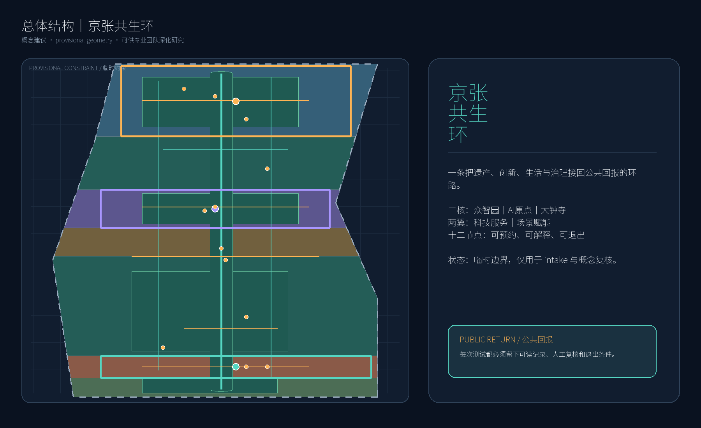
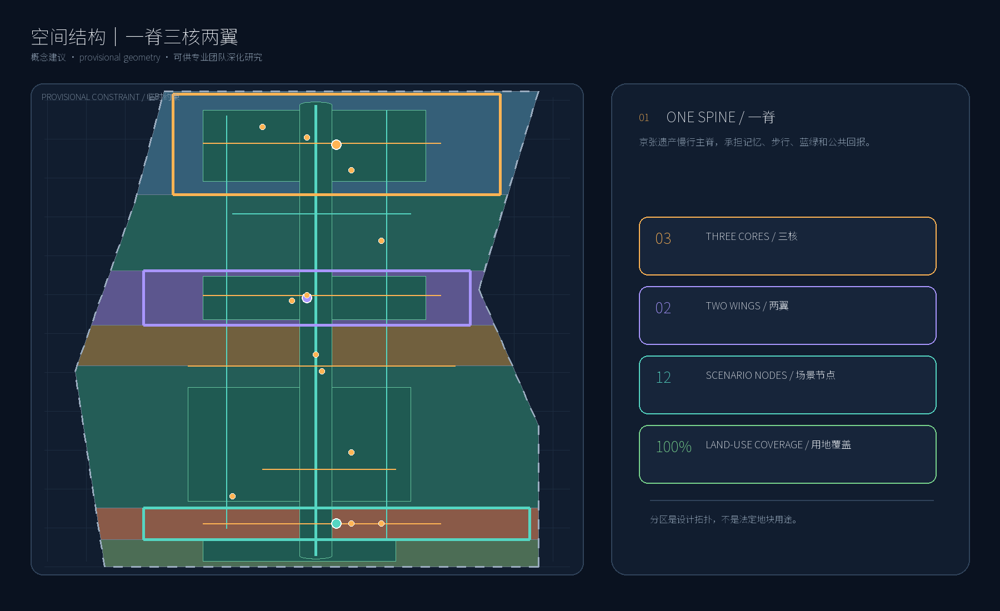
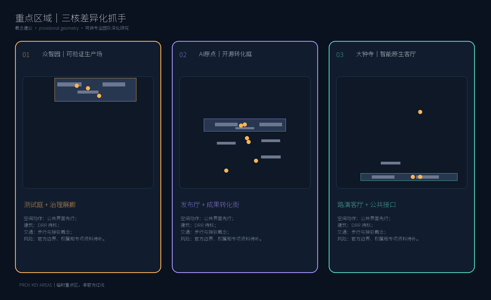
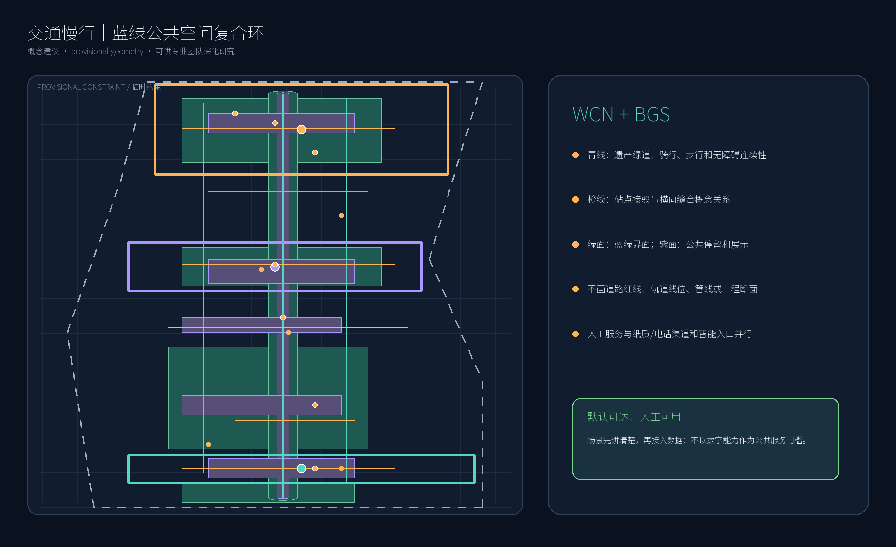
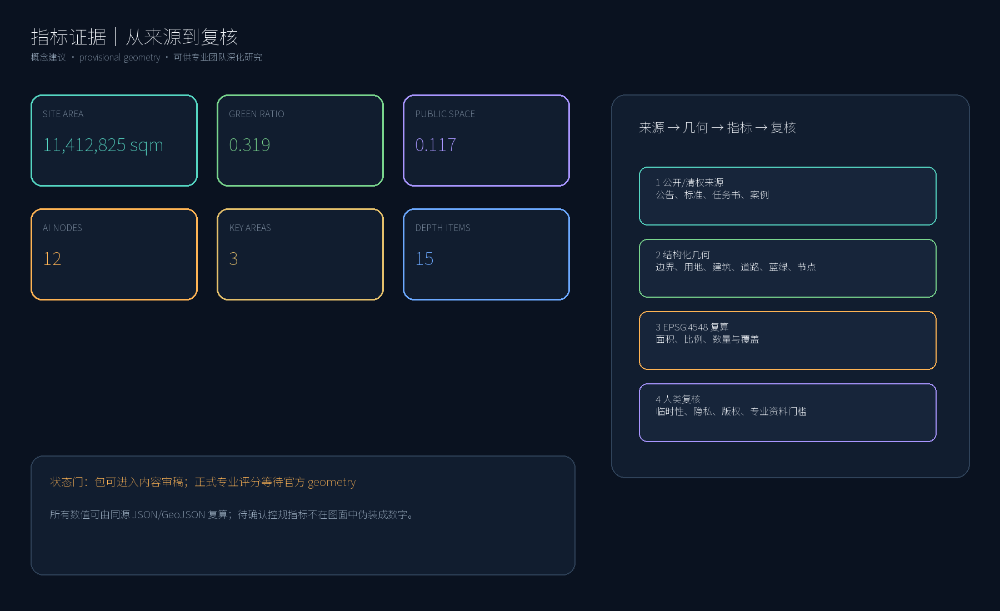

# 京张共生环 / Jing-Zhang Civic Loop

## 设计依据与资料清单

本方案把《百年京张AI创新带城市设计国际方案征集资格预审公告》作为项目名称、三层范围、公告面积和设计任务的依据，把面向智能体任务书作为六项 agent 任务、三大定位、五大功能、三区两翼和公共合规边界的依据。[source:OFFICIAL-ANNOUNCEMENT] [source:AGENT-TASKBOOK] 公告和任务书都不提供本方案可直接采用的法定红线；本包使用维护者提供的临时粗略 polygon，仅用于生成、可视化、拓扑自检和概念讨论。[source:BOUNDARY-SOURCE]

资料分层遵循仓库 source registry：官方公告、专业标准和清权任务书支撑 formal 任务判断；案例网页只支撑机制背景；临时边界不支撑官方红线、精确面积或审批结论。[source:SOURCE-REGISTRY] 方案的空间判断还按城市设计管理、控规编制审批和国土空间用地分类的原则组织，完整证据在三个矩阵中保存。[standard:MOHURD-URBAN-DESIGN-MEASURES]

几何、指标、图件和网页均由本次构建流程从同一组 GeoJSON、矩阵和自检状态派生；未嵌入第三方照片、地图截图、字体文件、商标或人物肖像。方案属于开放共创建议，不替代正式规划、专业设计、政府审定或工程论证。[depth:existing_conditions_diagnosis]

## 三层范围工作框架

统筹研究范围约 43.6 平方公里，公告文字四至为北五环路、京藏高速、西直门外大街和万泉河路；总体设计范围约 11.4 平方公里，是京张铁路遗址公园周边 1—2 公里的城市地区与产业区；重点区域范围约 368.4 公顷，自北向南为众智园 AI 自主创新加速区、北京 AI 原点社区和大钟寺 AI 产业集聚区。[source:OFFICIAL-ANNOUNCEMENT] 这三个数字是公告中的任务规模，不等于本包对临时 polygon 的精确测量。

本提交的总体设计边界采用 `PROV-SITE-001`，三处重点区采用 `PROV-KEY-001`、`PROV-KEY-002`、`PROV-KEY-003`；它们均保持 `official_boundary=false` 与 `geometry_role=provisional_constraint`。因此图面用低对比度虚线表示边界，把设计重点放在主脊、横向缝合、节点和公共空间网络上。[data:geometry/site_boundary.geojson#SITE-001] [data:geometry/key_areas.geojson#PROV-KEY-001]

三层工作形成一个“策略—空间—体验—复核”的递进：统筹层定义要素协同和公共价值，总体层组织用地、更新、蓝绿和交通，重点层验证三个差异化核心，运营层把使用反馈回流为下一轮场景准入。官方 polygon 到位后，应整体替换边界与重点区，再重算 land use、buildings、roads、green space、public space、phasing、指标、图件、PDF 和 HTML；在此之前不把任何临时边界称为 official redline。[depth:three_level_scope_framework]

## 统筹研究范围产业与未来城市研究

### 1. 总体概念、命名与识别

“共生环”不是新增法定范围，而是一种把铁路遗产、创新生产、日常生活和公共治理放进同一反馈回路的方法。中文主名“京张共生环”强调百年线路的连续性和城市共同维护；英文名 “Jing-Zhang Civic Loop” 把公共性、循环反馈和国际传播放在名称中。建议 Logo 由三条不闭合弧线组成：一条细金线代表铁路记忆，一条青线代表蓝绿主脊，一条橙线代表 AI 试验；三点表示三区，两个短翼表示中关村科技服务翼与小月河场景赋能翼。字体、图标和图形全部采用本包自绘几何，不借用企业标识。[source:AGENT-TASKBOOK] [standard:PROJECT-AGENT-OPEN-CALL-TASKBOOK]

视觉系统使用“铁路金—水岸青—实验橙—治理紫”四种语义色：金色只标识历史叙事，青色标识公共空间和慢行，橙色标识可预约测试，紫色标识证据与人工复核。每张图都附来源和 provisional 状态；Logo 方向是概念建议，可供专业团队深化，不构成注册商标或官方品牌决定。

### 2. 三大定位、五大功能与三区两翼回路

三大定位被转译为三种可感知的城市层：百年京张文化带是可阅读的记忆层，都市 AI 生活体验带是可进入的服务层，AI 融合创新带是可验证的生产层。五大功能通过“生产—学习—生活—展示—治理”五个接口落位：AI 全栈自主创新体系、世界级 AI 创新生态、AI+ 场景赋能新范式、智能化 AI 活力城市、AI 治理全球话语权。[source:AGENT-TASKBOOK]

| 空间单元 | 主要角色 | 共生环中的回路动作 | 设计证据 |
| --- | --- | --- | --- |
| 众智园 AI 自主创新加速区 | 全栈研发、测试与安全治理 | 把模型、标准和低碳测试转为可预约的公共知识 | [data:geometry/key_areas.geojson#PROV-KEY-001] |
| 北京 AI 原点社区 | 近校策源、开源协作与成果转化 | 把研究成果转为开源贡献、人才服务和日常学习 | [data:geometry/key_areas.geojson#PROV-KEY-002] |
| 大钟寺 AI 产业集聚区 | 智能原生消费、商务与国际交往 | 把企业产品转为可体验的城市服务与公众反馈 | [data:geometry/key_areas.geojson#PROV-KEY-003] |
| 中关村科技服务翼 | 资本、知识产权、法务和国际服务的概念支撑 | 把需求、合规和资源配置接回三核 | [source:OFFICIAL-ANNOUNCEMENT] |
| 小月河场景赋能翼 | 社区、教育、医疗、法律和生活服务的概念场景 | 把真实公共问题带入测试并把结果回馈日常 | [data:geometry/public_space.geojson#PUBLIC-001] |

### 3. 全球机制案例与要素配置

以下六个案例只作为公开机制参考，不把其机构、项目或效果写成海淀既成事实；转化重点是“如何组织规则、空间和反馈”，不是复制城市品牌。[source:CASE-HELSINKI]

| 案例 | 可核查的公开机制 | 转化为共生环的建议 |
| --- | --- | --- |
| Helsinki AI Register | 城市公开 AI 使用清单和说明 | 在公共体验节点提供“场景卡＋数据用途＋人工复核”登记页 |
| Amsterdam Algorithm Register | 面向公众的算法登记与解释 | 为每个城市智能体设置可读的用途、负责人和申诉入口 |
| Singapore AI Verify | AI 治理测试工具与评估方法 | 众智园设置可预约的测试记录、风险级别和退出门 |
| Barcelona Decidim | 开源参与式数字平台 | 原点社区把公众意见、方案版本和回应过程沉淀为开放记录 |
| Mila（Montréal） | 研究、人才和产业连接的 AI 生态机构 | 用近校成果转化街串联学习、孵化、服务和国际交流 |
| Seoul AI Hub | 面向创业、教育和公共交流的 AI 节点 | 以小尺度课程、演示和社区服务形成持续运营，而非一次展会 |

资源配置按八个要素建立“准入—使用—回馈”三栏：土地与空间提供可逆的公共界面和共享室内原型；产业与资金只作为待协商的服务机制建议；人才通过开发者社区、近校学习和国际访问形成流动；算力与数据采用授权、最小化、分级和可撤销原则；场景由公开征集、人工评审和小规模测试进入。任何企业名单、投资额、产值、财政或招商承诺都不在本包中虚构。[standard:MOHURD-CONTROL-DETAILED-PLANNING] [depth:overall_spatial_structure]

区域协同采用“接口而非承诺”原则：可在后续专业研究中把共生环与北纬社区、未来科学城、怀柔科学城、经开区及京津冀创新网络进行知识、人才、场景和活动互联，但本方案不声称已有组织关系或资源调度安排。这样既回应区域协同性，也把需要正式协调的事项留在专业深化清单中。

## 总体设计范围城市更新与控规深度城市设计

总体设计范围以“一脊、三核、两翼、五横向缝合、十二个场景节点”为概念结构。京张遗址公园及其周边蓝绿空间是公共主脊；三处重点区承担差异化创新角色；两翼把科技服务和生活场景接到主脊；五条横向缝合把学校、园区、社区和站点接入；十二个场景节点将抽象 AI 能力变成可预约、可解释、可退出的公共接口。[data:geometry/roads.geojson#ROAD-001] [data:geometry/green_space.geojson#GREEN-001]

用地层以现有 provisional site 为裁剪约束，采用项目分类表中的 0702、05、1401、1403、0804、0802 等代码形成连续分区；`land_use.geojson` 的 7 个面覆盖整个提交边界且不重叠。这里的“覆盖”是设计数据拓扑事实，不等于地块用途已获批准。[standard:MNR-LAND-USE-CLASSIFICATION-GUIDE] [data:geometry/land_use.geojson#LU-001]

更新框架不先指定拆除地块，而是以公共空间先行、首层界面改善、室内功能置换、可逆原型和专业复核为次序。更新项目清单把公共空间、服务设施、场景开放和运营机制分开列出，便于权属、交通、文保、市政和消防条件到位后再决定具体实施对象。建筑规模、容积率、建筑高度、密度、退线和道路红线均列为待正式控规条件，不以本包推测值替代法定指标。[standard:MOHURD-CONTROL-DETAILED-PLANNING] [depth:development_intensity_controls]

城市风貌采用“低扰动、可识别、可维护”的界面原则：历史节点保持克制，创新界面允许可拆卸展示组件，公共首层优先连续、可达和可复核；材料与色彩只做方向性建议，不给出没有依据的高度或风貌控制线。城市设计原则来自专业标准，具体建筑方案仍需专业团队与权属主体深化。[standard:MOHURD-URBAN-DESIGN-MEASURES] [depth:height_massing_character]

## 重点区域详细设计

三个重点区面积和边界使用公告与 provisional polygon 的组合信息；下述动作均为概念建议、参考方案或可供专业团队深化研究，不代表地块级拆改、权属同意或工程实施。

### A. 众智园 AI 自主创新加速区：花园型“可验证生产场”

`PROV-KEY-001` 位于提交范围北段。建议以“清河界面—测试庭—研发内街—治理展廊”四层关系组织空间：清河界面承担低碳、步行和公共知识展示；测试庭承接模型评估、标准工作坊和红队演示；研发内街提供共享实验、孵化和企业服务的概念组合；治理展廊把风险说明、版本记录和人工复核结果公开给访客。[data:geometry/key_areas.geojson#PROV-KEY-001] [data:geometry/buildings.geojson#BLDG-001]

建筑更新采用“保留可识别骨架、改造首层和公共界面、新建可逆原型、撤除候选待现状核查”的 DRR 方法，不判断具体建筑是否拆除。交通上以主脊绿道、横向接驳和站点导视形成低速网络；公共空间以清河文化和花园式停留为主，所有河道、文保、消防和道路条件待正式资料确认。AI 场景优先选择安全治理沙盒、端侧算力驿站和清河低碳创新廊，测试记录只保留经授权的聚合信息。

### B. 北京 AI 原点社区：近校“开源转化庭”

`PROV-KEY-002` 位于中段。建议以“原始研究—开源发布—成果转化—人才生活”形成四个相邻但可分时复用的公共庭院；通过低扰动首层更新、夜间学习和可移动展示把校区、园区、街区的日常流线缝合。`buildings.geojson` 只表达概念建筑基底和更新分类，不代表高校或园区已经同意改造。[data:geometry/key_areas.geojson#PROV-KEY-002] [data:geometry/buildings.geojson#BLDG-004]

近校成果转化街的空间服务包括开源发布厅、法务与知识产权咨询、成果演示、人才服务和社区共享学习；五道口、清华东路西口等站点的一体化只表达步行和接驳关系，不画工程线位。AI 场景优先选择开源发布厅、近校成果转化街、AI 生活服务样板街和全球 AI 活动周路线，运营采用预约、人工引导、公众反馈和版本回滚。

### C. 大钟寺 AI 产业集聚区：城市型“智能原生客厅”

`PROV-KEY-003` 位于南段。建议围绕大钟寺站周边形成“国际路演客厅—智能终端体验街—数据要素会客厅—四象限公共接口”的连续公共界面：路演客厅面向企业、开发者和国际访客；体验街展示可清权的智能终端和内容消费原型；数据会客厅只讨论授权、审计和公共价值，不展示个人数据。[data:geometry/key_areas.geojson#PROV-KEY-003] [data:geometry/public_space.geojson#PUBLIC-003]

交通策略以步行连续、非机动车有序停放、站点接驳和夜间分时管理为概念建议，四象限连通需交通专项、站点资料和市政条件复核。建筑与商业策略优先考虑既有空间的首层再编程和公共环境改善，企业建筑、产权空间和潜力地块不作强制改造结论。AI 场景优先选择大钟寺国际路演客厅、数据要素会客厅和公共维护台。

## AI 创新生态、人才画像与 AI+ 场景

### 1. 用户画像与空间—运营映射

| 用户画像 | 主要任务 | 共生环空间响应 | 保护边界 |
| --- | --- | --- | --- |
| 开源开发者 | 发布、协作、测试、获得贡献记录 | 原点社区开源发布厅、公共代码墙、夜间协作庭 | 不记录个人轨迹，只保留自愿提交的公开贡献 |
| 初创团队 | 低成本试验、合规咨询、找到场景 | 众智园测试庭、科技服务翼、端侧算力驿站 | 算力和数据服务需单独授权，结果由人复核 |
| 企业访客与国际团队 | 展示、招聘、商务与跨文化交流 | 大钟寺国际路演客厅、站点接驳和多语导视 | 企业案例与标识先完成清权，不暗示合作关系 |
| 高校师生 | 学习、成果转化、跨校协作 | 近校成果转化街、学习庭、文化导览 | 校园和科研资料不作为本包默认数据 |
| 周边居民与老年人 | 通勤、休闲、生活服务、线下办理 | 遗址公园慢行环、社区服务节点、人工服务台 | 智能服务与传统渠道并行，不以数字能力作门槛 |
| 无障碍使用者与照护者 | 安全通行、可理解信息、人工协助 | 连续无障碍导视、休息节点、人工复核台 | 需按具体工程标准和公众体验复核，不宣称现状已合规 |

这些画像是设计假设而非人口统计结论；场景运营只使用公开、聚合、获授权或由用户主动提交的数据。[source:AI-GOVERNANCE] [standard:BARRIER-FREE-ENVIRONMENT-LAW]

### 2. 十二张 AI 场景卡

| 编号与类型 | 场景卡 | 空间 | 数据边界、人工复核与运营 |
| --- | --- | --- | --- |
| 01 | 开源发布厅 | AI 原点社区 | 读取自愿公开的项目摘要；发布前由社区编辑和贡献者确认 |
| 02 TVS | 安全治理沙盒 | 众智园 | 使用授权测试集和聚合结果；安全、伦理与专业人员共同复核 |
| 03 TVS | 端侧算力驿站 | 主脊与创新服务节点 | 只显示资源状态和能耗区间；接入与退出由运营方人工审批 |
| 04 | AI 慢行导航 | 遗址公园活力带 | 识别公开路网和匿名拥堵信号；无个人跟踪，现场人员可修正 |
| 05 | 大钟寺国际路演客厅 | 大钟寺 | 仅使用清权产品资料；活动主办方审核发布、访客可反馈 |
| 06 TVS | 清河低碳创新廊 | 众智园清河界面 | 采用环境传感的聚合读数；生态和安全人员复核后展示 |
| 07 | 近校成果转化街 | AI 原点社区 | 连接公开成果与预约服务；知识产权和法务人员确认后入库 |
| 08 | 数据要素会客厅 | 大钟寺 | 讨论授权、用途和审计流程，不交换个人数据；人工主持 |
| 09 | AI 生活服务样板街 | 社区与商业交汇处 | 医疗、教育、法律、生活服务仅提供导航与材料清单；人工兜底 |
| 10 | 全球 AI 活动周路线 | 三核公共空间 | 活动路线由公共空间管理者确认；可暂停、可改线、可回滚 |
| 11 | 无障碍文化导览 | 遗址公园与文化节点 | 提供大字、语音和人工讲解选项；由使用者体验后修订 |
| 12 | 公共维护台 | 主脊和节点 | 受理设施报修与场景问题；只记录工单状态，不形成居民画像 |

其中 02、03、06 是产业测试验证场景（TVS），测试结果只作为概念运营记录，不是已批准运营或技术成熟度证明。[standard:GENERATIVE-AI-INTERIM-MEASURES] [data:geometry/constraints.geojson#SCENARIO-02]

每张场景卡遵循“公开资料/授权数据—最小化处理—可解释输出—人工复核—公众反馈—暂停/退出”的六步链。医疗健康、生活缴费和其他公共服务场所保留人工窗口与线下渠道；无障碍导视、语音、大字和人工协助需要在具体设计与工程标准阶段再次检验。[standard:ELDERLY-SMART-TECH-PLAN-2020-45] [depth:traffic_rail_slow_parking]

## 用地、建筑规模与拆改留方案

`land_use.geojson` 用 7 个相邻分区完整覆盖 provisional site，主要代码来自自然资源部分类指南的项目子集：北段 0802 研发、上中段 1401 蓝绿、原点近校段 0804、公共缝合段 1403、大钟寺段 05 商业服务和南端 0702 社区服务。[data:geometry/land_use.geojson#LU-007] [standard:MNR-LAND-USE-CLASSIFICATION-GUIDE] 面积是提交几何的复算值，不能替代地块用途审批。

建筑层表达 12 个概念建筑基底，属性区分 AI 研发、实验室、孵化、办公、混合、教育、居住、人才公寓、社区服务、商业和文化等类型；`renewal_class` 只表达“保留参考、改造参考、新建参考、重组候选待核”四种设计工作状态。[data:geometry/buildings.geojson#BLDG-001] 由于没有现状建筑调查、权属、楼层、高度、控规和消防资料，方案不写具体建筑高度、容积率、建筑密度或拆除地块。

DRR 采用四步专业深化门：先核查现状与权属，再判断保留与修缮价值；随后研究首层和公共界面的改造；最后才由专业团队论证重组或新增。所有强度和高度指标在 `metrics.json` 中保持待正式控规条件状态，现阶段只用建筑基底面积和类型数量帮助讨论空间供给。[metric:building_footprint_area_sqm] [depth:retain_renovate_demolish]

## 交通、轨道、市政与公共服务设施

`roads.geojson` 以一条遗产绿道、平行骑行/步行线、三处横向接驳和局部支路表达概念网络；它不表达道路红线、车道数、断面、轨道线位或施工方案。[data:geometry/roads.geojson#ROAD-001] 重点关注北五环界面、遗址公园南北端、五道口、清华东路西口、大钟寺站及重点企业周边的步行连续性，具体路口和站点方案待交通专项资料。

轨道站点一体化采用“站点—接驳—公共庭—场景节点”四层导视，停车策略优先采用共享时段、非机动车有序停放和活动日临时管理的概念组合；不在没有红线和交通断面时给出工程数字。公共服务设置线下人工台、电话/纸质导览、语音/大字信息和可理解的场景说明，避免把智能入口作为唯一入口。[standard:BARRIER-FREE-ENVIRONMENT-LAW] [standard:ELDERLY-SMART-TECH-PLAN-2020-45]

市政与新基建只提出“可插拔服务层”：端侧算力、环境传感、分布式能源、雨洪和设施维护可在后续专项中分别验证，空间上预留可撤除的服务节点和检修界面，不推断能源负荷、管线容量、防洪等级或消防可行性。[data:geometry/constraints.geojson#GAP-MUNICIPAL-001] [depth:municipal_new_infrastructure]

## 蓝绿空间、公共空间与城市风貌

蓝绿网络以遗址公园慢行主脊、清河和小月河相关场景线索、横向缝合和四类公共庭为概念骨架。`green_space.geojson` 表达连续绿色界面，`public_space.geojson` 表达公共停留、展示和服务节点；两者是设计叠加层，不能解释为法定绿线、蓝线或现状公园边界。[data:geometry/green_space.geojson#GREEN-001] [data:geometry/public_space.geojson#PUBLIC-001]

建议的公共空间组件库包括：可拆卸导视柱、低位信息台、可调遮阴座椅、共享电源与饮水点、无障碍休息点、公共代码/贡献墙、静音讨论舱和可回收展陈框。组件以耐久、可维护、可拆卸和不遮挡历史阅读为原则；尺寸、材料、消防和文保适配均由专业团队复核。[standard:MOHURD-URBAN-DESIGN-MEASURES] [depth:blue_green_public_space]

### 三个 AI 朝圣地标与文化叙事

1. **共生里程门 / Civic Mile Gate**：位于主脊南北端的概念门户，用里程刻度、历史时间线和当代场景卡把“从铁路运输到智能协作”的叙事连起来；不复刻未经授权的历史图像。
2. **可验证信号庭 / Verifiable Signal Court**：众智园的公共知识展示节点，以金、青、橙、紫四种信号表达场景状态、数据权限、人工复核和退出条件；它是治理教育装置，不是监控设施。
3. **开源回声台 / Open Echo Platform**：AI 原点社区的成果与贡献展示节点，展示经贡献者确认的版本、问题和回应，把科技文化转成可共同维护的公共记忆。
4. **城市回报窗 / Civic Return Window**：大钟寺的体验与反馈节点，访客可以看到一个测试如何转为公共服务改进，也可以提交反对或暂停意见。

“百年京张”叙事不把历史当装饰，而是借铁路的站、线、信号、检修和共同维护语法，解释 AI 城市如何面对版本、责任和公共回报；中关村创新文化提供开放协作和成果转化的当代语境，AI 新文化则通过可质询、可退出的公共场景获得可信度。[source:OFFICIAL-ANNOUNCEMENT] [source:AGENT-TASKBOOK]

导视系统采用中英双语的“线—站—节点—状态”语法：金线标历史，青线标公共慢行，橙点标可预约测试，紫框标证据与人工复核。国际传播短句建议为 **“A civic loop where every AI experiment returns a public benefit.”**，仅作为传播文案建议，不代表官方口号或品牌注册结果。

## 更新项目清单、实施政策与分期计划

以下项目是概念项目清单，位置通过图层和节点类型表达，责任主体与资金安排仍待组织方、权属主体和专业团队确认。

| 编号 | 概念项目 | 主要动作 | 依赖与退出条件 |
| --- | --- | --- | --- |
| JZ-01 | 遗址公园慢行断点缝合 | 连接主脊、横向步行和无障碍节点 | 道路/文保核查；不满足安全条件则暂停 |
| JZ-02 | 众智园清河创新界面 | 绿色公共客厅、治理展示和低碳测试 | 河道、生态、防洪和运营复核 |
| JZ-03 | 原点近校成果转化街 | 发布、法务、学习和人才服务复合界面 | 校园、权属、知识产权和公共参与 |
| JZ-04 | 大钟寺四象限公共接口 | 站点接驳、步行连续和非机动车秩序 | 交通专项、站点资料和安全复核 |
| JZ-05 | AI 公共服务与端侧节点 | 可撤除的导览、算力和环境服务原型 | 能源、数据安全、维护主体和人工兜底 |
| JZ-06 | 全球 AI 活动周路线 | 文化—开源—产业—公共回报体验路线 | 活动许可、容量管理和可取消机制 |
| JZ-07 | 公共贡献与回报账本 | 记录公开贡献、问题、回应和退出 | 只收集自愿公开内容，编辑和申诉机制 |
| JZ-08 | 蓝绿组件维护计划 | 组件巡检、修复、替换和季节性调整 | 维护预算、文保与生态条件 |

分期采用三段概念范围：一期先做低扰动公共空间、导视、人工服务和小规模开放日；二期在资料补齐后深化三核的空间与场景测试；三期以专业规划、权属协商和运营评估为前提扩展跨区域协同。`phasing.geojson` 只表达这三段空间关系，不是开发时序、投资计划或审批承诺。[data:geometry/phasing.geojson#PHASE-001] [depth:phasing_implementation]

长期运营建议建立“季度共创门—年度 AI 公共周—开发者维修日—年度公共回报报告”的循环。开发者社区负责提出和维护开源场景卡，专业/公共团队负责准入与人工复核，居民和访客通过线下台、电话或公开表单（未来由运营方另行实现）提交意见；任何场景都可暂停、复盘或退出。招引转化路径只写成可能的合作机制：公开展示→技术/伦理评审→小规模测试→公共反馈→专业深化，不把企业、资本或政策支持写成既定安排。[source:AGENT-TASKBOOK] [depth:renewal_project_list]

## 指标体系、面积复算与合规矩阵

空间指标从提交 GeoJSON 以 EPSG:4548 复算。由于总体和重点区 geometry 仍是 provisional，以下数值是可复算的 intake 几何结果，不是公告精确红线面积：总体设计边界为 11,412,825.386 平方米，绿地面积为 3,635,313.823 平方米、绿地比例为 0.318529，公共空间面积为 1,340,946.761 平方米、公共空间比例为 0.117495，建筑基底面积为 748,415.266 平方米；七个用地面覆盖率为 1.000000，重点区数量为 3。[metric:site_area_sqm] [metric:green_ratio]

公告中的 43,600,000 平方米统筹研究范围、11,400,000 平方米总体设计范围和 3,684,000 平方米重点区域范围作为任务规模记录；它们与临时 polygon 的测量值分开保存。[source:OFFICIAL-ANNOUNCEMENT] 待正式控规条件确认的 FAR、建筑高度、建筑密度、绿地控制率、退线、道路红线、公共服务容量、人才密度和 AI 创新指数保持待补状态，不在网页或图纸中用数字冒充已知事实。[metric:floor_area_ratio] [depth:metrics_recalculation]

`compliance_matrix.json` 覆盖公告 1.3、1.4、1.5 的 17 条任务和 agent.1—agent.6 的 6 条任务；`standard_matrix.json` 覆盖五项 mandatory formal 标准，并把 AI 治理、无障碍和适老服务列为补充依据；`design_depth_matrix.json` 的 15 项 formal 深度项均有正文、图层、指标、图纸、来源、假设和自检挂接。完整机器核验不以正文堆叠编号替代。[data:geometry/land_use.geojson#LU-001] [data:geometry/phasing.geojson#PHASE-001]

本包的状态应拆成三条轴理解：`package_state=ready_for_review` 只表示包结构、双语、图件和机器门禁已完成；provisional geometry 不因组织方数据缺口阻断内容审稿；但 official-geometry-dependent 的正式专业评分仍需 `SITE_BOUNDARY` 与 `KEY_AREA` 正式资料。自检中会保留这项明确的专业资料门槛，不把 `formal-review-ready` 误写成政府批准或正式评分结果。[source:BOUNDARY-SOURCE] [depth:risk_missing_data]

## 风险、版权与合规说明

最大风险不是概念不足，而是把临时数据或场景设想误读为正式规划。风险包把空间争议、技术成熟度、数据隐私、公平包容、实施复杂度、公众接受度、运维成本和政策不确定性逐项评分，并为高风险项设置人工/专业复核路径。[source:SOURCE-REGISTRY] `constraints.geojson` 只标出资料缺口和场景节点，不画伪造的文保线、蓝线、道路红线或市政管线。[data:geometry/constraints.geojson#GAP-BOUNDARY-001]

方案不使用个人隐私、企业内部资料或未清权图像；场景只接受公开、聚合、授权或自愿公开信息，结果须解释、可纠错、可暂停。生成式 AI 相关公共服务遵循适用范围、内容安全、知识产权、透明度、投诉和人工处理边界；无障碍和适老服务保留传统渠道，具体工程合规仍需专业设计和使用者参与。[standard:GENERATIVE-AI-INTERIM-MEASURES] [standard:ELDERLY-SMART-TECH-PLAN-2020-45]

正式资料到位后的重算清单为：替换三层 official polygon；复核三处 key area；导入官方地块、现状建筑、道路红线、轨道/交通、市政、文保和权属资料；重算所有 geometry 与 metrics；重新生成双语图件、PDF、HTML、manifest 哈希并重新自检。任何空间落地建议仍须标为概念建议、参考方案或可供专业团队深化研究。[standard:MOHURD-CONTROL-DETAILED-PLANNING] [depth:risk_missing_data]

版权说明详见 `report/copyright_statement.md`。本投稿许可声明为 `COMMUNITY-DISPLAY-ONLY`，不代表替代官方征集文件中的知识产权安排；如组织方采用或改编成果，应以正式征集规则和书面确认优先。图形资产由 Pillow/ReportLab 本地绘制，使用系统 Noto Sans SC 仅作构建依赖，不随包再分发。[source:ASSET-GENERATOR]

## 参考资料

- 北京市规划和自然资源委员会海淀分局：《百年京张AI创新带城市设计国际方案征集资格预审公告》（2026-05-09）。
- 用户提供清权摘录：《面向全球智能体开源征集任务书》（2026-05-18）。
- 住房和城乡建设部：《城市设计管理办法》（2017-03-14）。
- 住房和城乡建设部：《城市、镇控制性详细规划编制审批办法》（2010-12-01）。
- 自然资源部：《国土空间调查、规划、用途管制用地用海分类指南》（2023-11-22）。
- 国家互联网信息办公室等：《生成式人工智能服务管理暂行办法》（2023-07-13）。
- 全国人大常委会：《中华人民共和国无障碍环境建设法》（2023-06-28）。
- 国务院办公厅：《关于切实解决老年人运用智能技术困难实施方案》（2020-11-24，背景参照）。
- Helsinki AI Register、Amsterdam Algorithm Register、AI Verify Foundation、Decidim、Mila 和 Seoul AI Hub 的公开网页（访问 2026-08-10，仅作机制案例）。

完整来源、许可、转换方法和限制见包内 `sources.json`、`assumptions.json` 和 `report/copyright_statement.md`。[source:SOURCE-REGISTRY]
