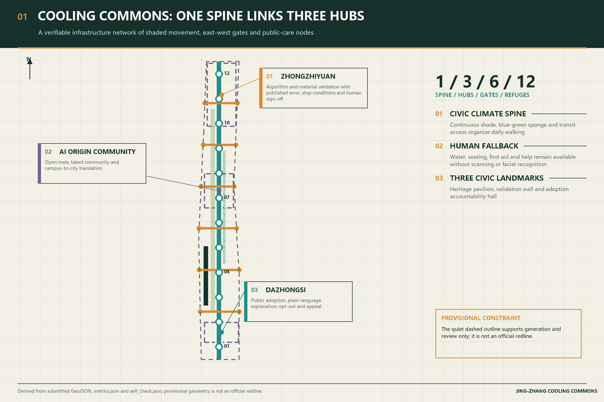
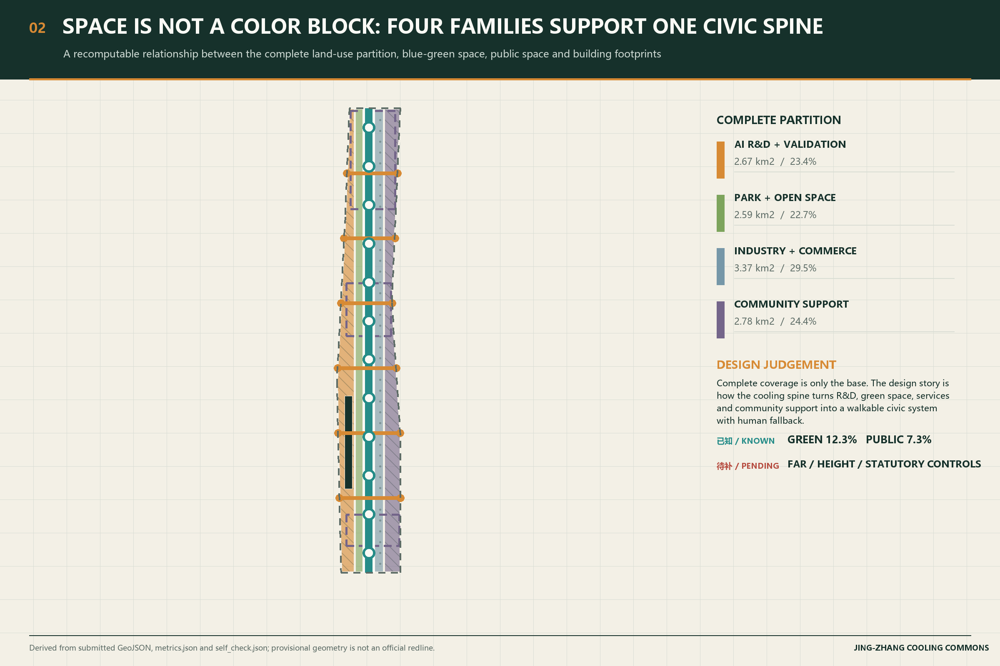
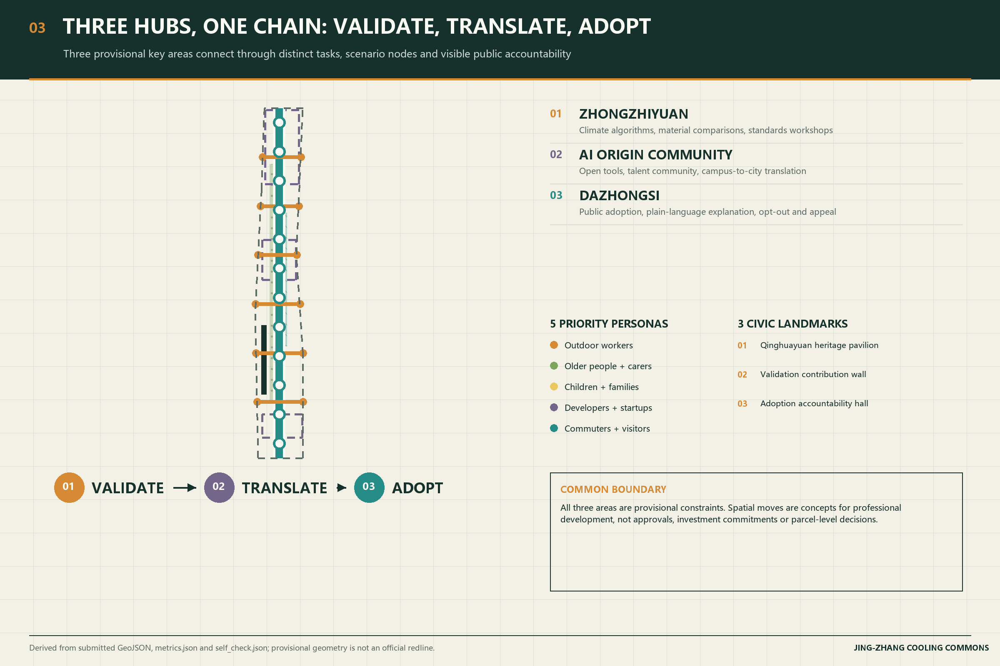
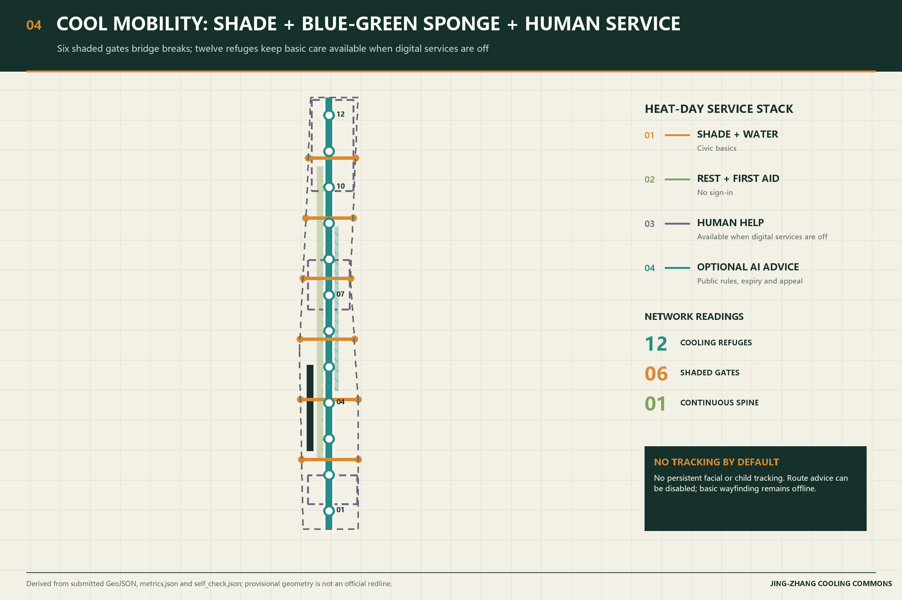
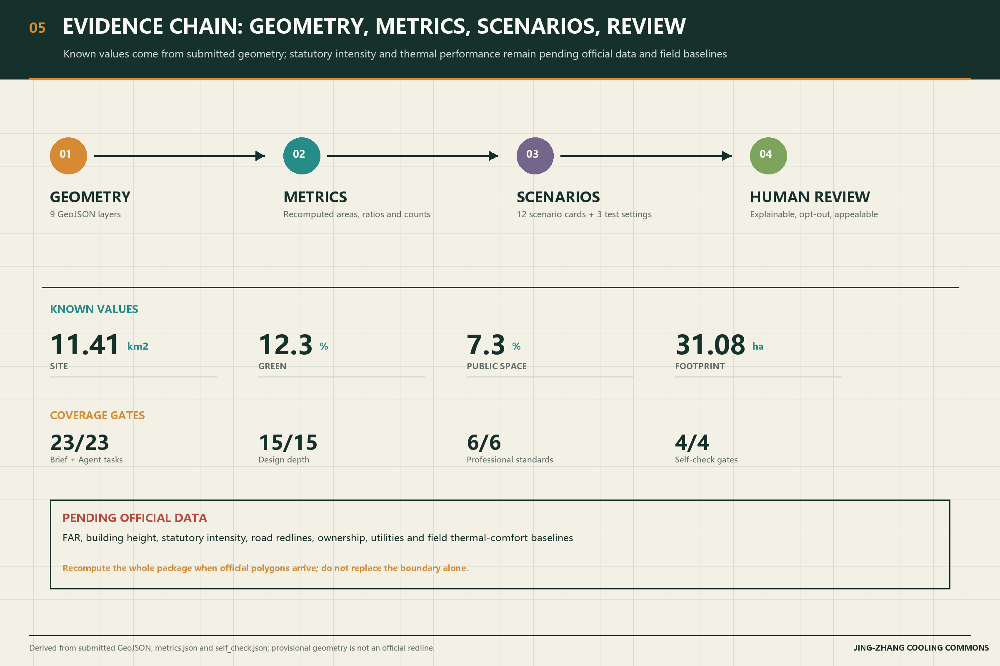

# JING-ZHANG COOLING COMMONS

## Design Basis and Source List

The proposal responds to the official prequalification announcement and the cleared Agent taskbook. It uses the repository's registered public sources and explicitly provisional geometry. Official site and key-area polygons are not yet in the repository, so the submitted boundary and three key-area outlines support generation, visualization, and intake review only; they are not official redlines, approval evidence, or precise-area bases. Every known area is recomputed from the submitted GeoJSON. Statutory FAR, height, ownership, road-redline, utility, heritage, and engineering controls remain pending official data and whole-package recalculation. [source:OFFICIAL-ANNOUNCEMENT] [source:AGENT-TASKBOOK] [depth:existing_conditions_diagnosis]

## Three-Level Scope Framework

The 43.6 km² coordinated research area frames the innovation ecosystem; the approximately 11.4 km² overall design area organizes renewal, mobility, services, and public space; the three provisional key areas support detailed concept design. Cooling Commons translates these nested scopes into one cooling spine, three hubs, six shaded east-west gates, twelve cooling refuges, and two supporting wings. This is a design method, not a new boundary. [data:geometry/site_boundary.geojson#SITE-001] [metric:site_area_sqm] [depth:three_level_scope_framework]

## Coordinated Research Area: Industry and Future City Research

The coordinated research area does not draw a new redline. It organizes existing campuses, firms, open-source communities, stations, and the Jing-Zhang heritage park into a verifiable chain: research origin, Zhongzhiyuan validation, Origin Community translation, Dazhongsi adoption, plus the Zhongguancun service wing and Xiaoyue River scenario wing. The identity is Jing-Zhang Cooling Commons. The logo direction uses two rail lines, a tree-canopy negative, and a water-drop node; it uses original geometry only. The three theme belts correspond to heritage, everyday cool walking, and AI fusion. [source:AGENT-TASKBOOK] [standard:PROJECT-AGENT-OPEN-CALL-TASKBOOK] [depth:overall_spatial_structure]

Beijing's master plan and ecological restoration plan are background only. They support connected greenways, ventilation corridors, blue networks, and shaded streets as citywide directions, not as proof that this site already cools. [source:BEIJING-MASTER-PLAN] [source:BEIJING-ECO-RESTORATION] [data:geometry/land_use.geojson#LU-001]

Global cases are used only for transferable mechanisms. They are not copied as form, metrics, or institutions, and they do not prove Jing-Zhang performance.

| Case | Verifiable fact | Transferable mechanism | Jing-Zhang placement |
| --- | --- | --- | --- |
| STATION F, Paris | A former freight hall now hosts about 1,000 startups a year under one service roof | Turn heritage transport buildings into mixed campuses, not closed museums | Origin Community open-tool street [source:CASE-STATION-F] |
| Punggol Digital District | About 50 ha of mixed industry-campus space with an Open Digital Platform | Publish data dictionaries and stop conditions before reuse | Zhongzhiyuan climate test field [source:CASE-PDD] |
| Kalasatama, Helsinki | About 170 ha of waterfront renewal for roughly 30,000 residents and more than 10,000 jobs; Smart Kalasatama separately developed a short agile-pilot model | Test reversible pilots before transferring them | 100-day refuge and material trials [source:CASE-KALASATAMA] [source:CASE-KALASATAMA-AGILE] |
| 22@ Barcelona | The city converted Poblenou into an innovation district that keeps living, working, and learning together | Do not let industrial conversion become a single-use office belt | Dazhongsi adoption room plus near-station living services [source:CASE-22AT] |
| Superilles, Barcelona | Some interior streets were returned to staying, greenery, and slow movement | Make crossings into shaded public rooms without new boulevards | Six shaded gates [source:CASE-SUPERILLES] |
| Quayside, Toronto | Waterfront Toronto created a digital advisory panel; Sidewalk Labs later withdrew | Digital governance precedes sensors; public data is not privately owned | Public adoption room for data, owners, expiry, and appeal [source:CASE-QUAYSIDE] |

AI may change routing advice, maintenance tickets, material tests, and public explanation. It may not replace drinking water, shade, seating, first aid, or staffed help. Talent density and scene-use metrics stay uncalibrated until field baselines exist. The annual Climate AI Co-creation Week is a conceptual suggestion for professional deepening, not a confirmed government program.

## Overall Design Area: Urban Renewal and Regulatory-Plan-Level Urban Design

Four complete land-use families - R&D, green/open space, industry and commercial service, and community support - provide a machine-reviewable partition without inventing statutory controls. The cooling spine overlays continuous shade, blue-green sponge functions, slow mobility, cooling refuges, and non-digital wayfinding. Building and parcel decisions remain conceptual until official existing-condition, ownership, regulatory, and engineering files are available. [data:geometry/land_use.geojson#LU-001] [data:geometry/buildings.geojson#BLDG-001] [depth:land_use_layout]

Known geometry supports area and ratio recomputation. FAR, building height, density, setbacks, road redlines, and utility capacity stay `unknown` and require professional confirmation. The design prefers reversible shade structures, tree-canopy continuity, ground-floor public interfaces, and low-risk pilots before capital-intensive construction. [standard:MOHURD-CONTROL-DETAILED-PLANNING] [metric:building_footprint_area_sqm] [depth:development_intensity_controls]

## Detailed Design of Key Areas

Zhongzhiyuan is the validation hub: climate algorithms, shade materials, low-carbon public interfaces, and safety-governance demonstrations are tested with declared baselines and stop conditions. Origin Community is the translation hub: open tools, talent life, near-campus walking, and a public model-card room connect research to use. Dazhongsi is the adoption hub: station arrival, commercial service, and a visible accountability hall make every AI service's data, owner, validity period, opt-out, and human appeal legible. Building form and retain-renovate-demolish decisions stay pending survey. [data:geometry/key_areas.geojson#PROV-KEY-001] [data:geometry/key_areas.geojson#PROV-KEY-002] [depth:three_key_area_detailed_design]

All three outlines remain provisional. The rectangular geometry must never be interpreted as parcel, street, ownership, or statutory boundaries. Official geometry triggers whole-package recalculation, not a cosmetic boundary replacement.

## AI Innovation Ecosystem, Personas, and AI+ Scenarios

Five priority personas are outdoor and frontline workers, older adults and caregivers, children and families, developers and start-ups, and commuters and visitors. Twelve scenario cards cover a cool-route adviser, refuge maintenance assistant, climate-material test field, open heat-risk toolbox, public adoption room, six shaded gates, Qinghe blue-green test corridor, no-tracking children's route, human-first elder station, heat-event switchboard, heritage cooling pavilion, and annual co-creation week. At least three industry tests compare materials, published rules, and service fallbacks before any scaling. [data:geometry/public_space.geojson#PUBLIC-001] [metric:public_space_ratio] [standard:PROJECT-AGENT-OPEN-CALL-TASKBOOK]

AI uses authorized aggregated readings and published rules. It does not require facial recognition, individual health scoring, children's trajectory retention, or mandatory QR codes. Every recommendation is optional, time-bounded, explainable, and subject to human review. Drinking water, shade, seating, first aid, and wayfinding remain usable without AI.

| Pilgrimage landmark | Location | Public function | Evidence |
| --- | --- | --- | --- |
| Tsinghuayuan Station cooling pavilion | Heritage node | Places railway history, shade, and a closable narrative device together; audio has a transcript and never autoplays | [data:geometry/public_space.geojson#PUBLIC-001] |
| Zhongzhiyuan validation wall | Climate-test entrance | Shows data dictionaries, error, stop conditions, and human sign-off, not personal rankings | [data:geometry/key_areas.geojson#PROV-KEY-001] |
| Dazhongsi adoption hall | Station public interface | Posts each AI service's data, owner, expiry, opt-out, and appeal path | [data:geometry/key_areas.geojson#PROV-KEY-003] |

## Land Use, Building Scale, and Retain-Renovate-Demolish Strategy

Land-use terminology follows the registered national classification reference. Existing building status, ownership, structural safety, heritage value, and approved controls are not available in sufficient detail, so no parcel is declared for demolition or construction. The current building layer is a conceptual footprint set used to test spatial relationships; professional teams must classify retain, renovate, demolish, and new-build decisions after verified surveys. [standard:MNR-LAND-USE-CLASSIFICATION-GUIDE] [data:geometry/buildings.geojson#BLDG-001] [depth:retain_renovate_demolish]

## Transport, Rail, Municipal Infrastructure, and Public Services

The cooling spine links the heritage park, transit stations, neighborhoods, campuses, and innovation districts. Six shaded gates organize waiting, crossing, seating, drinking water, and accessible slopes at major east-west interfaces. The system prioritizes walking and cycling comfort while preserving conventional signs and staffed help. Road redlines, crossings, parking, utilities, drainage, fire access, and energy capacity all require official and professional confirmation. [data:geometry/roads.geojson#ROAD-001] [depth:traffic_rail_slow_parking] [depth:municipal_new_infrastructure]

## Blue-Green Network, Public Space, and Urban Character

Shade, tree canopy, rain gardens, permeable surfaces, seating, and water access form a continuous public-care system rather than isolated smart objects. Known green-space and public-space ratios, about 12.3% and 7.3%, describe conceptual coverage, not statutory greening standards. Cooling refuges use a restrained rail-charcoal, leaf-green, cooling-teal, pale-stone, and amber palette. The three pilgrimage nodes distinguish documented railway history, testable climate work, and accountable AI services. Generated visualizations are labeled conceptual and never treated as observations or evidence of public consent. [data:geometry/green_space.geojson#GREEN-001] [data:geometry/public_space.geojson#PUBLIC-001] [depth:blue_green_public_space]

## Renewal Projects, Implementation Policy, and Phasing

Six coordinated project families are proposed as reference schemes: cooling-spine continuity, Qinghe climate-material interface, Origin Community open-tool street, Dazhongsi public adoption room, twelve cooling refuges, and the annual co-creation loop. Phase one uses reversible shade, seating, water, offline signs, and baseline measurement. Phase two deepens blue-green links and public-service adoption after professional review. Phase three recalculates geometry and capital projects using official controls and monitored pilot evidence. The 100-day open-call window is a submission period, not a construction timetable. No funding, responsible authority, approval, or construction commitment is claimed. [data:geometry/phasing.geojson#PHASE-001] [depth:renewal_project_list] [depth:phasing_implementation]

## Metrics, Area Recalculation, and Compliance Matrix

Known metrics stay limited to values recomputed in EPSG:4548 from the submitted geometry: about 1,141.3 ha overall, 12.3% green space, 7.3% public space, 31.08 ha conceptual building footprint, and three key areas. Thermal-comfort improvement, canopy coverage, shaded-route continuity, refuge catchments, maintenance response, and user outcomes remain pending field baselines. The compliance, professional-standard, and design-depth matrices hold exhaustive coverage; prose carries only claim-adjacent evidence. [metric:site_area_sqm] [metric:green_ratio] [metric:public_space_ratio] [depth:metrics_recalculation]

## Risk, Copyright, and Compliance

The largest risks are provisional geometry, absent statutory and engineering controls, heat-benefit claims without field measurements, surveillance creep, digital exclusion, generated-image misinterpretation, and uncertain operations. Mitigations are whole-package recalculation, human approval gates, aggregated data, explicit stop conditions, non-digital service equivalence, conceptual labels, rights records, and staged pilots. The offline HTML loads no remote scripts, tiles, fonts, trackers, forms, iframes, or APIs. [data:geometry/constraints.geojson#CONSTRAINTS] [source:SITE-PACKAGE] [depth:risk_missing_data]

## References

- Official announcement of the Centennial Jing-Zhang AI Innovation Belt urban design international call.
- Cleared Agent open-call taskbook and co-creation charter.
- Repository source registry, site package, professional-standard snapshots, terminology glossary, and provisional-geometry basis.
- Complete provenance, permissions, transformations, and limitations are recorded in `sources.json`; complete metrics and audit coverage are recorded in the structured package. [source:OFFICIAL-ANNOUNCEMENT] [source:AGENT-TASKBOOK] [source:SOURCE-REGISTRY]
