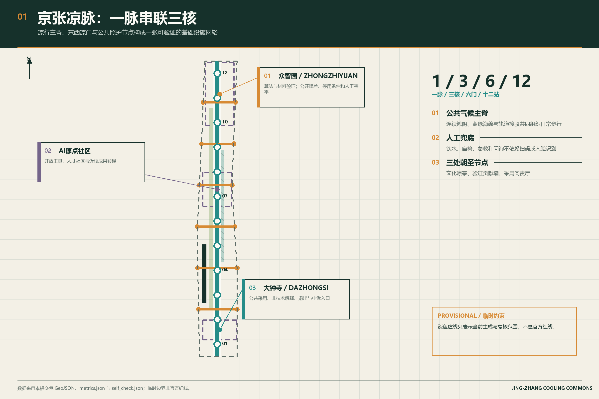
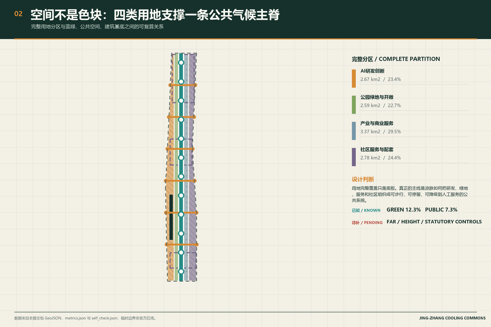
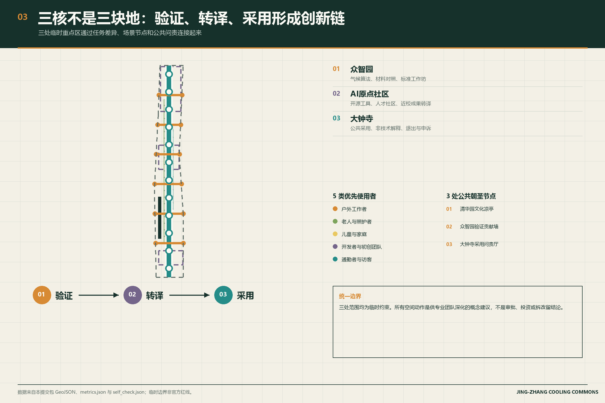
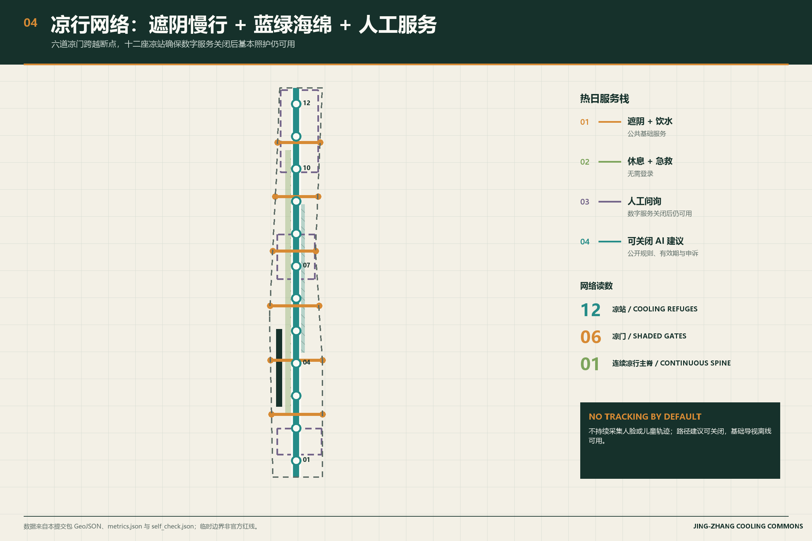
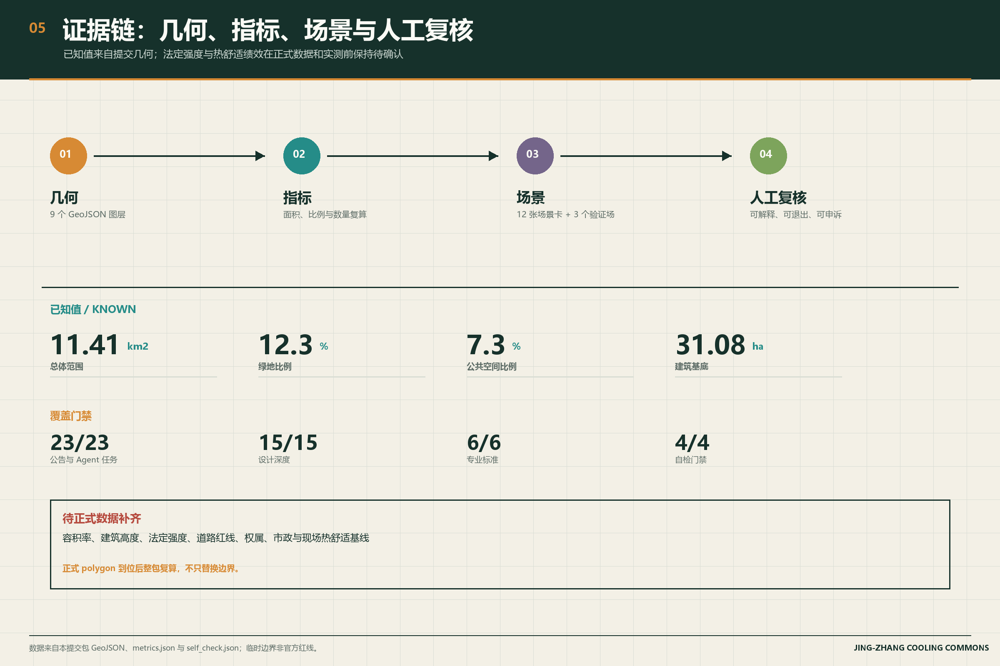

# 京张凉脉 JING-ZHANG COOLING COMMONS：面向热韧性与公共照护的AI创新带

## 方案总纲

京张凉脉把“世界级 AI 创新带”首先理解为一条在盛夏仍允许人安全步行、停留、工作和相遇的公共基础设施。设计以京张铁路遗址公园为连续凉行主脊，在众智园、北京 AI 原点社区和大钟寺形成“验证—转译—采用”三核，并布置十二座可步行抵达的凉站：饮水、遮阴、休息、急救、人工问询和非数字化导视是基础服务，AI 只在获得授权、使用聚合数据且可由人工复核时提供热风险提示、设施维护和路径建议。

空间结构概括为“一脉、三核、六门、十二站、两翼”。一脉是连续遮阴与蓝绿海绵复合的凉行主脊；三核分别承担气候算法与材料验证、开放工具与人才社区转译、公共服务采用与可见问责；六门是跨越主要交通界面的东西向遮阴缝合口；十二站是可停止、可降级到人工服务的公共凉站；中关村科技服务翼和小月河场景赋能翼连接专业服务与日常试点。Logo 方向取“铁轨双线 + 树冠负形 + 水滴节点”，只使用原创几何，不使用政府、企业或历史人物标识。

本方案的原创判断不是“多装传感器”，而是把 AI 城市的成功条件改写为三项可验证公共结果：高温时仍有连续可达的遮阴路径；数字服务关闭后基本服务仍可用；每项 AI 建议都能说明数据、责任、有效期和人工复核入口。北京总体规划提出绿道、通风廊道和蓝网的系统连接，生态修复规划把缓解热岛与路网林荫化列为方向；本方案只把这些市域方向作为设计背景，不据此声称场地已有降温成效。热舒适、客流和设施绩效在现场基线建立前均保持待验证。[source:BEIJING-MASTER-PLAN] [source:BEIJING-ECO-RESTORATION] [depth:overall_spatial_structure]

## 设计依据与资料清单

本 formal 方案以北京市规划和自然资源委员会海淀分局发布的《百年京张AI创新带城市设计国际方案征集资格预审公告》为第一依据，并以 `brief/site-package/` 中经维护者登记的临时粗略边界、重点区域、枚举、指标和来源清单为机器可读依据。AI agent 在生成方案前必须读取 `design_brief.json`、`allowed_design_space.json`、`sources.json`、`enums/`、`ranges/`、`schemas/`、`data/source_registry.json` 和 `data/processed/agent_fact_pack.md`，并用 `project_scope_summary.csv`、`agent_task_requirements.csv`、`source_use_matrix.csv`、`missing_data_checklist.csv` 建立任务、范围、资料用途和缺口清单。所有设计判断都要拆分为可追溯来源、可复算指标、可校验图层和可人工复核假设。公告要求方案达到控制性详细规划的城市设计深度和规划综合实施方案的城市设计深度，因此文本叙述不能替代 GeoJSON、指标表、A3 文册、A0 展板和 HTML 电子展示成果。

方案不是独立愿景文本，而是从公告、面向智能体任务书和场地资料出发组织成果；本节只把最关键依据放在判断旁边 [source:OFFICIAL-ANNOUNCEMENT] [source:AGENT-TASKBOOK] [depth:existing_conditions_diagnosis]。完整来源和标准覆盖分别保存在 `sources.json`、`standard_matrix.json` 与 `design_depth_matrix.json`，不在正文重复机器索引。

资料登记表的使用边界如下 [source:SOURCE-REGISTRY]：

- data/source_registry.json 登记公开、清权与临时资料的用途边界。
- 当前登记摘要：formal 可用资料 7 条，背景资料 1 条，provisional-only 资料 1 条。
- agent 不得把 background_only 或 provisional_only 资料升级为 official boundary、法定控规、正式评分依据或政府实施承诺。

`data/processed/agent_fact_pack.md` 是本方案的阅读导航层，不是新的权威来源 [source:PROCESSED-FACT-PACK]。它帮助 agent 把三层范围、三处重点区、公告任务、agent.1-agent.6、资料可用性和缺资料事项组织成可读方案；事实判断仍需回到已登记的原始材料 [source:OFFICIAL-ANNOUNCEMENT] [source:AGENT-TASKBOOK]，完整来源关系由 `sources.json` 保存。

官方 `SITE_BOUNDARY` 与三处 `KEY_AREA` 精确红线尚未进入仓库。本方案因此使用 `brief/site-package/geometry/provisional_boundaries.geojson` 生成可复核的概念包：`geometry/site_boundary.geojson` 与 `geometry/key_areas.geojson` 均标注为 `provisional_constraint`、`official_boundary=false`，只用于生成、自检、可视化和设计讨论，不能作为 official redline、审批依据、精确面积依据或法定控制结论。组织方数据缺口本身不阻断内容评分；官方 polygon 到位后，site boundary、key areas、land use、roads、green space、public space、buildings、phasing 和 metrics 必须整包复算，不能只替换边界文件。

当前可评分状态是：**临时边界，保留精度警示并待正式数据发布后复算；不阻断内容评分**。正文中的空间结构、场景、项目和指标一律按“概念建议、可复核、可替换官方边界后重算”写入。

边界解释可回到总体范围图层和面积复算 [data:geometry/site_boundary.geojson#SITE-001] [metric:site_area_sqm]。三处重点区则由独立图层和数量指标核对 [data:geometry/key_areas.geojson#PROV-KEY-001] [metric:key_area_count]。这意味着读者可以从正文进入证据，但不必先读一串机器编号。

## 三层范围工作框架

方案按照公告确定的三个层次组织工作：统筹研究范围关注 43.6 平方公里的AI产业生态、战略定位、创新链和未来城市形态；总体设计范围关注 11.4 平方公里京张遗址公园周边 1-2 公里城市地区和产业区，要求形成城市更新总体框架、产业空间布局、交通市政支撑和城市风貌控制；重点区域范围关注 368.4 公顷三处详细设计地区，要求明确功能业态、建筑规模、拆改留分类、公共空间连通和交通组织。三层范围在 `compliance_matrix.json` 中逐条映射，保证公告 1.3、1.4、1.5 与 agent.1-agent.6 的必选任务都有章节、图层、指标、图纸和 HTML 证据。

三层工作框架的深度项由 [depth:three_level_scope_framework] 和 [depth:overall_spatial_structure] 约束，空间证据以 [data:geometry/site_boundary.geojson#SITE-001] 与 [data:geometry/key_areas.geojson#PROV-KEY-001] 为准，任务依据以 [standard:PROJECT-OFFICIAL-ANNOUNCEMENT] 为准，范围索引以 [source:PROCESSED-FACT-PACK] 中 `project_scope_summary.csv` 的三层范围表为导航。

三层工作不是互相割裂的图纸集合。统筹研究决定产业链和城市形态判断，总体设计把判断落实到更新项目、空间结构和设施承载，重点区域详细设计验证具体地块、建筑、交通、公共空间和AI应用场景的可实施性。agent 生成方案时必须先锁定当前提交采用的 official 或 provisional 边界和约束，再生成用地、建筑、道路、绿地、公共空间、分期和AI服务节点，最后从这些图层复算指标并在正文解释哪些结论仍受 provisional boundary 限制。任何无法从结构化数据复算的面积、比例、规模或项目数量，不得写入正式结论。

本方案建议的总体概念为“京张凉脉”：以京张遗址公园为历史与公共气候主轴，以众智园、北京AI原点社区、大钟寺三处重点片区为气候创新锚点，以高校、企业、社区和轨道站点为日常网络，形成“一脉三核、六道凉门、十二座凉站、两翼协同”的空间组织。这里的“凉脉”不是额外画出的新红线，也不承诺未经实测的降温幅度；它把公告中的三层范围转译为可逐段验证的遮阴、蓝绿、慢行和公共照护工作方法。

| 层级 | 设计问题 | 方案回答 | 数据落点 |
| --- | --- | --- | --- |
| 统筹研究范围 | AI产业生态和未来城市形态如何组织 | 建立“高校策源-开源协作-企业转化-公共体验-国际传播”的创新链 | compliance_matrix.json、standard_matrix.json |
| 总体设计范围 | 产业空间、城市更新、交通市政和风貌如何落图 | 用地、建筑、道路、绿地、公共空间和分期图层共同表达 | [data:geometry/land_use.geojson#LU-001]、[data:geometry/roads.geojson#ROAD-001] |
| 重点区域范围 | 三处片区如何达到详细设计深度 | 分别提出定位、空间动作、AI场景和实施依赖 | [data:geometry/key_areas.geojson#PROV-KEY-001]、[data:geometry/key_areas.geojson#PROV-KEY-002]、[data:geometry/key_areas.geojson#PROV-KEY-003] |

## 统筹研究范围产业与未来城市研究

统筹研究范围不另画红线，而是把海淀已有的高校院所、企业、开源社区、轨道站点和京张遗址公园组织成一条可验证的创新链：高校与实验室负责策源，众智园负责算法与材料验证，原点社区负责开源工具和人才转译，大钟寺负责公共服务采用与可见问责，中关村科技服务翼和小月河场景赋能翼分别连接专业服务与日常试点。命名体系为“京张凉脉 / JING-ZHANG COOLING COMMONS”，英文名固定使用 Cooling Commons；Logo 方向取铁轨双线、树冠负形和水滴节点，只使用原创几何。三条主题带分别对应文化主脊、都市凉行生活和 AI 融合创新，视觉识别不得借用政府、企业或历史人物标识。[source:AGENT-TASKBOOK] [standard:PROJECT-AGENT-OPEN-CALL-TASKBOOK] [depth:overall_spatial_structure]

产业与空间的衔接落到已提交图层，而不是口号：研发与验证落在用地和公共空间连续界面上，人才生活落在近校慢行缝合处，采用与传播落在轨道到发节点。风貌、公共空间和建筑布局按城市设计办法统筹，但不新增法定控制。[standard:MOHURD-URBAN-DESIGN-MEASURES] [data:geometry/land_use.geojson#LU-001] [data:geometry/public_space.geojson#PUBLIC-001]

全球案例只取其可转化机制，不复制形态、指标或制度，也不把外地经验写成京张已经具备的成效。

| 案例 | 可核验事实 | 可转化机制 | 京张落点 |
| --- | --- | --- | --- |
| 巴黎 STATION F | 原货运站改造为创业校园，每年约千家初创企业共用一处服务屋顶 | 把遗产交通建筑做成可进入的混合校园，而不是封闭展馆 | 原点社区开源工具街：发布、食宿、法务与模型卡同层可达 [source:CASE-STATION-F] |
| 新加坡榜鹅数字区 | 约 50 公顷产学研混合区，Open Digital Platform 提供街区实时数据接口 | 先定义开放数据字典和停用条件，再允许企业与学生复用 | 众智园气候验证场：公开采样协议、误差和退出门槛 [source:CASE-PDD] |
| 赫尔辛基 Kalasatama | 约 170 公顷滨水更新区，约 3 万居民、超 1 万岗位；Smart Kalasatama 另形成短周期敏捷试点机制 | 先做可撤回试点，验证后再向其他街区转移 | 100 天凉站与材料对照测试，不把试点写成永久工程 [source:CASE-KALASATAMA] [source:CASE-KALASATAMA-AGILE] |
| 巴塞罗那 22@ | 市府把 Poblenou 工业区转为创新区，强调居住、工作、学习与产业并存 | 产业更新必须保留生活配套，避免单功能办公带 | 大钟寺采用客厅与近站生活服务，而不是纯展示大厅 [source:CASE-22AT] |
| 巴塞罗那 Superilles | 市政把部分街区内部道路还给停留、绿化和低速通行 | 在不新开大道的前提下，把交叉口改成可坐、可遮阴、可过街的公共房间 | 六道凉门：遮阴、等候、饮水、座椅和无障碍坡道 [source:CASE-SUPERILLES] |
| 多伦多 Quayside | Waterfront Toronto 设立数字战略顾问组审查滨水智能提案；Sidewalk Labs 后续退出 | 数字治理必须先于传感器部署，公共数据不得被单一企业独占 | 采用客厅公示数据、责任人、有效期和人工申诉入口 [source:CASE-QUAYSIDE] |

未来城市形态的判断因此很具体：人工智能可以改变路径建议、设施维护、材料验证和公共服务解释，但不能替代饮水、遮阴、座椅、急救和人工问询。产业战略指标、人才密度和场景使用频次在现场基线建立前一律待校准；全球活动、开发者社区和朝圣路线都只是概念建议，供专业团队深化研究，不是已确定的政府安排。

## 总体设计范围城市更新与控规深度城市设计

总体设计范围按控制性详细规划的城市设计深度组织，但不发明法定控规。提交包用完整无重叠的用地分区、示意建筑基底、慢行接驳和分期图层，表达“凉脉主脊 + 三核 + 六门 + 十二站”的更新框架：低效公共界面优先补遮阴、座椅、饮水和过街等候；产业与生活服务沿轨道和凉脉布置；建筑总规模、容积率、高度和承载能力在官方控规到位前保持待确认。`metrics.json` 只复算可从几何得到的面积、比例和图层数量。

本节按照 [standard:MOHURD-CONTROL-DETAILED-PLANNING] 把控规深度内容拆成可审查对象：[data:geometry/land_use.geojson#LU-001] 表达用地结构，[data:geometry/buildings.geojson#BLDG-001] 表达建筑基底，[data:geometry/roads.geojson#ROAD-001] 表达交通组织，[metric:building_footprint_area_sqm] 用于复核建筑基底面积，[depth:land_use_layout] 与 [depth:development_intensity_controls] 约束成果深度。

交通、轨道、市政和配套设施按同一原则布置：轨道站到凉脉的接驳优先步行和骑行舒适，六道凉门承担东西向缝合，十二座凉站承担短歇和人工服务。创新服务平台、人才生活服务、分布式能源和端侧算力只作为可关闭的轻量节点，不得压过基础公共服务。建筑高度、开发强度、道路红线、退线和设施标准一律写为“待正式控规条件确认”。

## 重点区域详细设计

重点区域详细设计是必选项，但当前三处边界仍是 provisional 矩形，只能支撑概念深度。众智园作为验证核，把清河界面做成气候材料对照场，同时容纳标准制定、安全治理和低碳公共界面测试，对外交通只讨论接驳舒适，不改线位。原点社区作为转译核，把近校慢行、开源工具街、成果发布和人才生活放在同一可读界面，拆改留保持待调查。大钟寺作为采用核，围绕车站四象限步行、商业服务和公共问责客厅组织智能终端与内容消费，不把数据要素交易写成已批准业态。

三处重点区域分别引用 [data:geometry/key_areas.geojson#PROV-KEY-001]、[data:geometry/key_areas.geojson#PROV-KEY-002]、[data:geometry/key_areas.geojson#PROV-KEY-003]，并由 [depth:three_key_area_detailed_design] 约束规划综合实施方案深度。矩形边不得解释为地块、道路或权属界。

三处重点区域已写入 `geometry/key_areas.geojson`，当前全部为 `provisional_constraint`。正文、HTML、sources、assumptions 和 self_check 均标明它们不能作为正式评分或审批依据。`compliance_matrix.json` 分别覆盖公告 1.5.3.1、1.5.3.2、1.5.3.3。功能业态、公共空间、慢行和实施项目已落到图层和项目表；建筑规模、形态和拆改留分类在权属与控规到位前只给方法，不给地块结论。

| 重点片区 | 设计定位 | 空间动作 | AI产业与运营场景 | 证据引用 |
| --- | --- | --- | --- | --- |
| 众智园AI自主创新加速区 | 花园型全栈自主创新街区 | 强化清河界面、产业展示、低碳创新交往和对外交通组织；以绿色空间承载开放测试与标准治理展示 | 自主模型测试、标准制定工作坊、安全治理展示、低碳算力体验 | [data:geometry/key_areas.geojson#PROV-KEY-001]、[depth:three_key_area_detailed_design] |
| 北京AI原点社区 | 近校型成果转化与人才社区 | 组织校区、园区、街区慢行缝合；补足成果发布、人才服务、居住生活和开源协作空间 | 开源社区、成果发布、人才特区服务、近校孵化 | [data:geometry/key_areas.geojson#PROV-KEY-002]、[source:AGENT-TASKBOOK] |
| 大钟寺AI产业聚集区 | 城市型智能经济与国际交往街区 | 围绕大钟寺站一体化、四象限步行连通、商业服务和重点企业公共环境更新 | 智能体与智能终端展示、内容消费、数据要素与国际路演 | [data:geometry/key_areas.geojson#PROV-KEY-003]、[metric:key_area_count] |

## AI 创新生态、人才画像与 AI+ 场景

方案先锁定五类优先使用者和十二张场景卡，而不是覆盖全部人群。研发办公、开源协作、成果发布、企业服务、人才居住、社交学习、消费生活、运动休闲和国际交往被收束到凉站、验证场、工具街和采用客厅四类空间。每个场景都写明服务对象、空间位置、数据来源、隐私边界、人工复核和运营主体；医疗、教育、法律和生活服务只做可关闭辅助，不采集个体病历、成绩或身份。

公共空间场景引用 [data:geometry/public_space.geojson#PUBLIC-001]，慢行与交通场景引用 [data:geometry/roads.geojson#ROAD-001]，开放空间场景引用 [data:geometry/green_space.geojson#GREEN-001] 和 [metric:public_space_ratio]、[metric:green_ratio]。产业测试验证至少三处：众智园气候材料对照、原点开源热风险工具复演、大钟寺公共采用客厅的服务降级演练。

| 用户画像 | 典型需求 | 空间响应 | 自检边界 |
| --- | --- | --- | --- |
| 户外与一线工作者 | 高温时的饮水、短歇、急救和可预期路径 | 物流与服务节点附近凉站、人工服务台、遮阴等候区 | 不用雇佣或健康数据进行个体风险评分 |
| 老年人与照护者 | 低体力步行、可坐可停、人工问询 | 连续座椅、无障碍饮水、非数字导视与人工兜底 | 不强制扫码，不以年龄画像推送商业内容 |
| 儿童与家庭 | 安全过街、低温材料、可看护活动空间 | 六道凉门、树荫游戏环、低速交叉口提示 | 不做人脸识别，不保存儿童轨迹 |
| 开发者与初创团队 | 公开数据、算法验证、责任边界 | 众智园气候验证场、原点开源工具间 | 只使用清权数据；模型建议必须可复演 |
| 通勤者与访客 | 遮阴接驳、方向明确、服务不中断 | 轨道站至凉脉的可读路径与大钟寺采用客厅 | 路径建议可关闭，基础导视不依赖手机 |

| 场景卡 | 空间载体 | 设计说明 |
| --- | --- | --- |
| 01 凉脉路径顾问 | 京张遗址公园主脊 | 用公开规则和聚合环境读数建议更短、更阴凉或更无障碍的路径；基础导视始终离线可用 |
| 02 凉站设施管家 | 十二座凉站 | 发现饮水、遮阳、座椅和急救设施的维护需求，工单由人工确认和关闭 |
| 03 气候材料验证场 | 众智园 | 对铺装、遮阳、树池和可拆设施进行对照测试，不把试验结果提前写成工程结论 |
| 04 开源热风险工具间 | AI原点社区 | 公开数据字典、模型卡、误差与停用条件，允许开发者复演和提出修正 |
| 05 公共采用客厅 | 大钟寺 | 用非技术语言展示AI服务的数据、责任人、有效期、退出和人工申诉入口 |
| 06 六道凉门 | 主要东西向交叉界面 | 把遮阴、过街等待、饮水、座椅和无障碍坡道组织成可分期实施的缝合节点 |
| 07 清河蓝绿实验廊 | 众智园临清河界面 | 在河道和防洪专业条件确认后，比较雨洪花园、树荫与公共活动的组合方式 |
| 08 儿童无追踪凉行 | 社区与学校联系段 | 只做现场安全提示和匿名计数，不做儿童身份识别或轨迹保存 |
| 09 长者人工优先站 | 社区服务节点 | 提供大字导视、人工问询、可坐可停和传统服务通道，AI为可选辅助 |
| 10 高温活动切换台 | 公园活动空间 | 根据公开阈值给出改时、缩短或转入室内的建议，最终决定由活动负责人作出 |
| 11 文化凉亭讲述 | 京张遗产节点 | 把铁路工程智慧、树荫停留和AI新文化并置；音频有文字稿且不自动播放 |
| 12 全球气候AI共创周 | 一带公共空间系统 | 以数据复核、材料测试、公众走查和开发者修复为年度循环，不虚构已确定活动 |

AI 治理遵守数据最小化、公开来源、可解释和人工复核。城市智能体可以提示慢行断点、设施维护和活动改期，但不能替代规划审批，不能输出未经授权的个人画像，不能声称获得官方实施承诺。

三处 AI 朝圣地标只作为公共解释节点，不作为打卡政绩或个人荣誉墙：

| 朝圣地标 | 位置 | 公共功能 | 证据 |
| --- | --- | --- | --- |
| 清华园车站文化凉亭 | 京张遗产节点 | 并置铁路工程史、树荫停留和可关闭的讲述装置；音频有文字稿且不自动播放 | [data:geometry/public_space.geojson#PUBLIC-001] |
| 众智园验证贡献墙 | 气候材料验证场入口 | 展示对照测试的数据字典、误差、停用条件和人工签字，不展示个人排名 | [data:geometry/key_areas.geojson#PROV-KEY-001] |
| 大钟寺采用问责厅 | 大钟寺站公共界面 | 公示每项 AI 服务的数据、责任人、有效期、退出和申诉入口 | [data:geometry/key_areas.geojson#PROV-KEY-003] |

## 用地、建筑规模与拆改留方案

用地按国土空间调查、规划和用途管制分类表达为完整、闭合、无缝的四类分区：研发验证、蓝绿开放、产业与商业服务、社区支撑。当前建筑图层只是关系测试用的概念基底，不是现状普查。缺少权属、结构安全、文保和控规前，任何地块都不宣布拆除或新建；正式深化时按“先调查、再分类、后校准”处理保留、改造、更新和新建。

用地分类依据 [standard:MNR-LAND-USE-CLASSIFICATION-GUIDE]，建筑高度、体量、界面和风貌控制由 [depth:height_massing_character] 管理，拆改留方法由 [depth:retain_renovate_demolish] 管理。用地和建筑的主要证据是 [data:geometry/land_use.geojson#LU-001]、[data:geometry/buildings.geojson#BLDG-001] 和 [metric:building_footprint_area_sqm]。

已知建筑基底约 31.08 公顷，只用于校核凉脉、公共界面和示意体量关系，不得外推容积率或总建筑规模。容积率、建筑高度、建筑密度、绿地率管控值、退线和建筑控制线在 `metrics.json` 中保持 `unknown`，并在 `assumptions.json` 写明复算路径。

## 交通、轨道、市政与公共服务设施

交通把凉脉当作南北向舒适主脊，把六道凉门当作东西向缝合口。北五环、遗址公园跨环路、五道口、清华东路西口、大钟寺站和企业门口先补遮阴等候、过街可读性和短歇，不改道路红线。道路和慢行图层保持在提交边界内；因为边界仍是 provisional，交通结论只作为临时设计讨论。

交通和市政专业深度分别由 [depth:traffic_rail_slow_parking] 与 [depth:municipal_new_infrastructure] 约束；图层证据引用 [data:geometry/roads.geojson#ROAD-001]、[data:geometry/public_space.geojson#PUBLIC-001] 和 [data:geometry/constraints.geojson#CONSTRAINTS]。当道路红线、管线、消防和市政条件缺失时，应通过 assumptions 说明待补，而不是把策略写成审定条件。

市政和公共服务先保证饮水、遮阴、座椅、急救和人工问询，再叠加可关闭的端侧算力与创新服务节点。设施标准、服务半径和能源容量在管线、排水、防洪、消防资料补齐前，一律列为正式深化前置条件。

## 蓝绿空间、公共空间与城市风貌

蓝绿空间以京张遗址公园为南北主脊，向清河、小月河、高校和企业界面伸出东西向遮阴枝。慢行断点、上跨环路和公园两端先做可撤回的树荫、座椅和雨水花园，再讨论停车、体育和创新交往的复合利用。已知绿地比例约 12.3%、公共空间比例约 7.3%，表达的是概念覆盖，不是法定绿地率。

蓝绿公共空间由设计深度项和绿地、公共空间图层共同校核 [depth:blue_green_public_space] [data:geometry/green_space.geojson#GREEN-001] [data:geometry/public_space.geojson#PUBLIC-001]。绿地与公共空间比例在正文解释设计意义，完整复算保存在 `metrics.json`；城市风貌、公共空间和建筑控制的统筹则回到专业标准矩阵 [standard:MOHURD-URBAN-DESIGN-MEASURES]。

城市风貌把京张铁路工程史、中关村开源协作习惯和可关闭的 AI 公共服务叠在同一条凉脉上。清华园车站文化凉亭讲铁路，众智园验证贡献墙讲对照测试，大钟寺采用问责厅讲责任和退出。色彩取轨枕炭色、树冠绿、凉脉青绿、浅石和琥珀提示色；导视必须同时有非数字版本。没有文保或控规依据时，不给出伪精确控制线，也不使用未清权的品牌、字体、肖像或企业标识。

## 更新项目清单、实施政策与分期计划

更新项目清单只提出概念建议和依赖条件，不指定资金、实施主体或政府承诺。`geometry/phasing.geojson` 表达分期讨论范围，`compliance_matrix.json` 把任务挂到章节、图层和图纸。权属、资金、审批路径缺失时，项目保持风险状态，不得写成已确定落地。

项目清单和分期深度由 [depth:renewal_project_list] 与 [depth:phasing_implementation] 管理，分期空间证据为 [data:geometry/phasing.geojson#PHASE-001]。

| 项目编号 | 项目名称 | 类型 | 主要依赖 | 证据引用 |
| --- | --- | --- | --- | --- |
| JZ-01 | 京张遗址公园慢行断点缝合 | 公共空间/交通 | 道路红线、桥下空间、交通组织复核 | [data:geometry/roads.geojson#ROAD-001] |
| JZ-02 | 众智园清河创新界面 | 蓝绿空间/产业展示 | 河道蓝线、生态和防洪条件 | [data:geometry/green_space.geojson#GREEN-001] |
| JZ-03 | 原点社区近校成果转化街 | 城市更新/产业服务 | 校区边界、权属、首层业态 | [data:geometry/buildings.geojson#BLDG-001] |
| JZ-04 | 大钟寺站四象限步行连通 | 轨道一体化/慢行 | 轨道站点、道路交叉口、市政管线 | [data:geometry/public_space.geojson#PUBLIC-001] |
| JZ-05 | AI公共服务与端侧算力节点 | 新基建/公共服务 | 能源、算力、安全和运营主体 | [data:geometry/constraints.geojson#CONSTRAINTS] |
| JZ-06 | 全球AI活动周公共路线 | 运营/品牌 | 公共空间许可、活动安全、版权清权 | [data:geometry/phasing.geojson#PHASE-001] |

征集的 100 天只用于提交和修订方案，不等于实施工期。近期试点用可拆遮阳、座椅、饮水、离线导视和基线测量；中期在专业复核后加密蓝绿缝合和公共采用客厅；长期等官方控规、市政和权属到位后再复算资本项目。年度“气候 AI 共创周”建议每年一次，对象是开发者、居民、一线工作者和评审者，内容限于数据复核、材料测试、公众走查和人工决策，不虚构已批准的国际节庆或招引指标。

## 指标体系、面积复算与合规矩阵

已知指标只保留能从提交几何复算的一类：总体设计范围约 1141.3 公顷、绿地比例约 12.3%、公共空间比例约 7.3%、建筑基底约 31.08 公顷、重点区 3 处。更新项目数量、AI 场景节点、慢行连通、产业空间和人才服务在现场基线前保持待校准。unknown 指标必须写原因和复算前置条件。

指标复算遵循统一的设计深度要求 [depth:metrics_recalculation]。正文重点解释指标的设计含义，例如总体范围如何约束空间分配、蓝绿和公共空间比例如何支撑日常交往；完整数值、公式、来源文件和置信度保存在 `metrics.json`。示例关键指标可由总体范围和绿地数据复核 [metric:site_area_sqm] [data:geometry/green_space.geojson#GREEN-001]。

合规矩阵是任务响应性的主控文件。每条公告任务和 agent_taskbook 任务必须对应到报告章节、图层、指标、图纸、HTML 页面、来源、假设和自检项。未能覆盖公告 1.3、1.4、1.5 或 agent.1-agent.6 的任一必选任务，方案不得进入 formal professional scoring。

三类指标已经分开存放：几何复算进 `metrics.json`，法定管控进 `assumptions.json`，任务覆盖进 `compliance_matrix.json`。运营愿景不得写成审定规划条件。

## 风险、版权与合规说明

主稿为中文，完整对照译文见 `proposal.en.md`；A3/A0、HTML 和含文字图件均提供语言副本，并优先使用赛事术语表。图片、图纸、数据和代码的来源、许可与授权记录在 `sources.json` 与 `report/copyright_statement.md`。离线 HTML 不加载远程脚本、瓦片、字体、iframe、表单或外部 API，也不跟踪评审者。

风险和缺资料清单由风险深度项、约束图层和场地包共同校核 [depth:risk_missing_data] [data:geometry/constraints.geojson#CONSTRAINTS] [source:SITE-PACKAGE]。`missing_data_checklist.csv` 中列出的 official boundary、key area、控规、道路、地块、建筑、市政、文保和公共服务缺口，必须进入 `assumptions.json`、自检和正文风险章节。任何缺少官方控规、道路红线、权属、市政、消防或文保条件的结论，都必须降级为待确认事项；完整专业核对保存在标准矩阵中。

本方案不声称官方批准、审定控规、最终土地权属、最终建设规模或保证实施。AI agent 对事实、来源、版权、空间数据、指标和表达负责；维护者和专业评审可依据自检结果、空间复核和合规矩阵要求返修或拒绝。

## 参考资料

- brief/public-brief.md
- brief/site-package/design_brief.json
- brief/site-package/allowed_design_space.json
- brief/site-package/enums/
- brief/site-package/ranges/planning_limits.json
- data/processed/agent_fact_pack.md
- data/processed/project_scope_summary.csv
- data/processed/agent_task_requirements.csv
- data/processed/source_use_matrix.csv
- data/processed/missing_data_checklist.csv
- 完整机器索引：见 `sources.json`、`metrics.json`、`compliance_matrix.json`、`standard_matrix.json` 与 `design_depth_matrix.json`
- 本节书目入口依据场地包登记，完整出处和许可见结构化来源清单 [source:SITE-PACKAGE]
