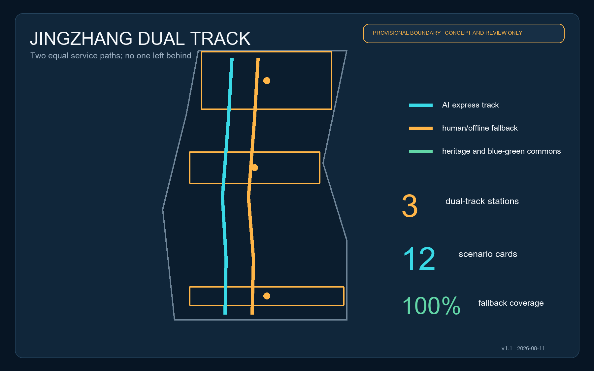
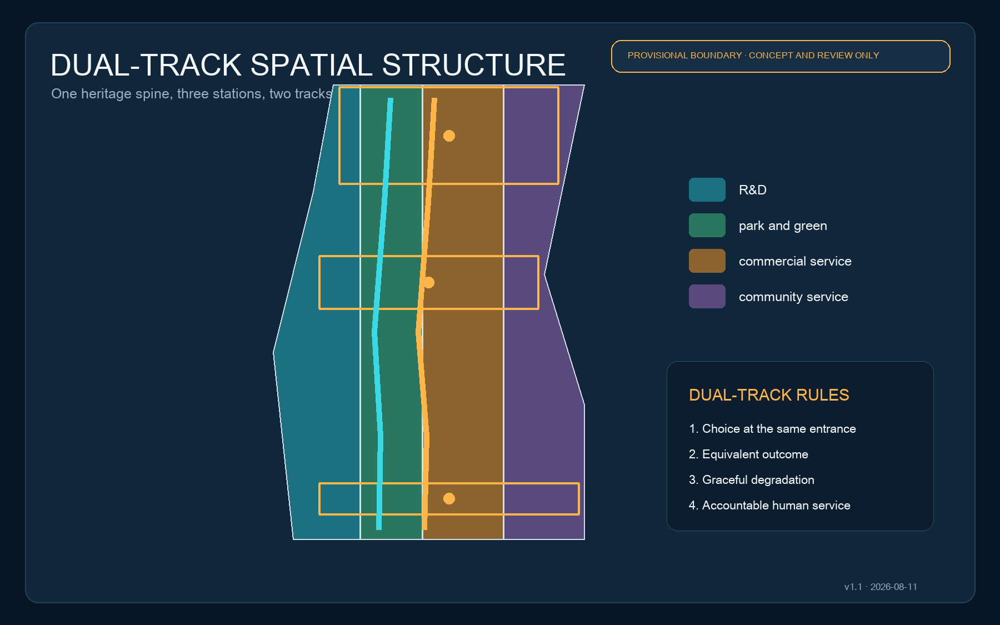
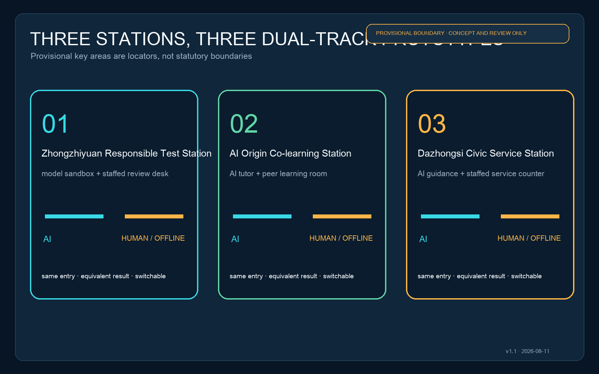
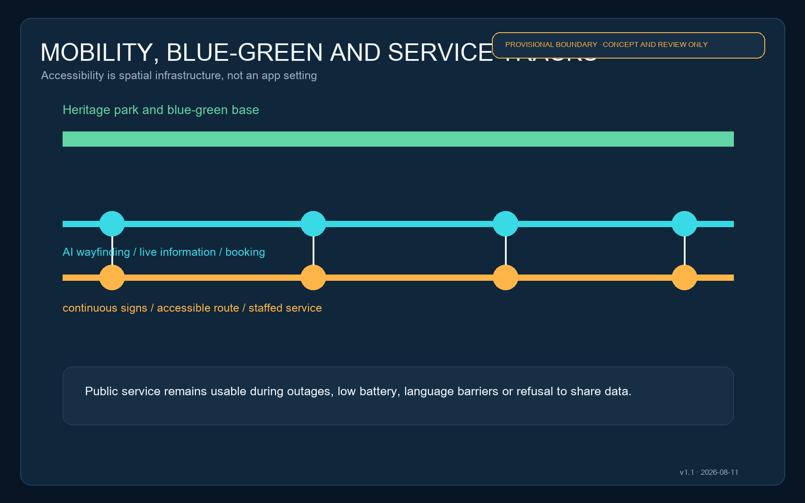
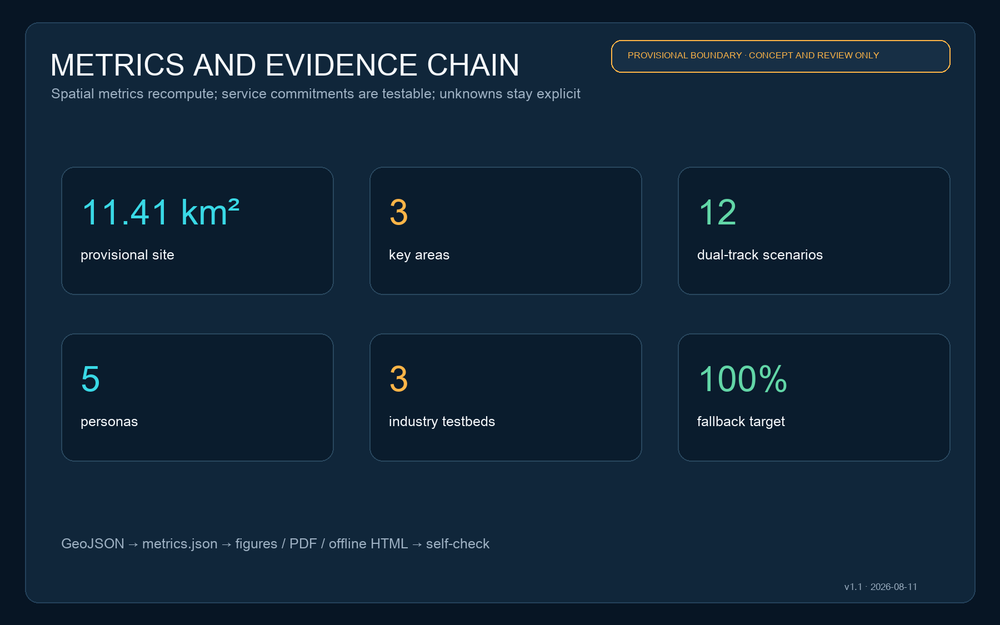

# JINGZHANG DUAL TRACK: An AI Urban Service Belt Accessible to Everyone

> The intelligence of an AI district is measured not only when everything works, but by how many people can still reach the same outcome during an outage, with low battery, without a smartphone, without consenting to data use, or when human help is needed.

**v1.1 design position:** the AI express and staffed/offline fallback tracks have equal width, equal standing and the same entrance.

## Design Basis and Source List

The proposal uses the public qualification announcement and the Agent taskbook as its task basis, with the repository's standards snapshots, source registry and provisional geometry as its evidence layer. The announced 43.6 km² coordinated research area, approximately 11.4 km² overall design area and 368.4 ha key-area scope are task facts; exact boundaries, parcels, roads, ownership, buildings and utilities remain pending official attachments [source:OFFICIAL-ANNOUNCEMENT] [source:AGENT-TASKBOOK] [source:SOURCE-REGISTRY].

The package uses `provisional_boundaries.geojson` only for topology, illustration and intake self-check. These geometries cannot support statutory planning, demolition, approval or precise-area conclusions. When official polygons arrive, every design layer and metric must be recomputed [data:geometry/site_boundary.geojson#SITE-001] [metric:site_area_sqm].

## Three-Level Scope Framework

At the research level, accessibility becomes part of the industrial ecosystem, governance and identity. At the overall-design level, paired entrances, continuous walking, the blue-green base and three service stations form one network. At the key-area level, ground floors, public space, station access and operational accountability are tested. The three levels share the same GeoJSON, metrics and matrices [depth:three_level_scope_framework] [standard:PROJECT-OFFICIAL-ANNOUNCEMENT].

The spatial structure is “one spine, three stations, two tracks and twelve nodes.” The heritage park is the cultural-public spine. Zhongzhiyuan, AI Origin Community and Dazhongsi are dual-track stations. The cyan AI express track carries booking, wayfinding, live inference and automated processing; the amber fallback track carries continuous signs, printed information, accessible routes and staffed service [data:geometry/roads.geojson#ROAD-AI-001] [data:geometry/roads.geojson#ROAD-HUMAN-001] [depth:overall_spatial_structure].

## Coordinated Research Area: Industry and Future City Research

The industrial strategy is an urban-service contract rather than another “AI park.” Before a model, terminal or agent enters public testing, its operator submits data-minimisation rules, human review points, an offline alternative, graceful degradation and exit conditions. Universities contribute research and evaluation methods; Zhongzhiyuan hosts full-stack and safety tests; AI Origin supports open-source transfer; Dazhongsi validates products and civic services; the two wings provide professional services and everyday feedback [standard:PROJECT-AGENT-OPEN-CALL-TASKBOOK] [source:AGENT-TASKBOOK].

Eight ecosystem cases are proposed: accessible edge wayfinding, offline multilingual signs, medical navigation without diagnosis, educational support with a teacher channel, legal information retrieval without legal advice, neighbourhood elderly contact, enterprise-service coordination and public-space maintenance. A shared dual-track acceptance sheet measures completion, successful human handover, no-consent usability, recovery time and grievance closure.

The identity “JINGZHANG DUAL TRACK” uses two equal parallel lines and three interchange dots. Cyan stands for machine capability; amber stands for human choice and accountability. Equal widths prevent the human service from appearing secondary. The three dots represent the three key areas and the public values of testing, learning and service.

## Overall Design Area: Urban Renewal and Regulatory-Plan-Level Urban Design

Low-disturbance renewal comes first. Dual-track entrances are inserted along the heritage park and at rail stations. Existing ground floors should host service counters, co-learning rooms, review desks and quiet waiting areas before new construction is considered. Demolition, height, FAR and road redlines remain pending formal plans, ownership and surveys [standard:MOHURD-CONTROL-DETAILED-PLANNING] [depth:retain_renovate_demolish].

The land-use layer partitions the provisional site into research, park-green, commercial-service and community-service concept zones. It expresses a functional method, not current or approved land use, and must be replaced parcel by parcel when official existing land use, regulatory plans and ownership data arrive [data:geometry/land_use.geojson#LU-001] [standard:MNR-LAND-USE-CLASSIFICATION-GUIDE].

Buildings use a retain-adapt-add-pending ledger. No demolition is proposed where structure and use are unknown. Reusable ground floors become service interfaces; reversible lightweight structures fill public-service gaps; structural safety, fire, heritage and ownership questions remain pending. The submitted footprints are conceptual components, not survey data [data:geometry/buildings.geojson#BLDG-ZZ-01] [depth:height_massing_character].

## Detailed Design of Key Areas

**Zhongzhiyuan Responsible Test Station:** A public test promenade faces the Qinghe green interface. The AI track provides booking, device access, model evaluation and result dashboards; the fallback track provides staffed registration, printed rules, observation and appeal. Flood, river and transport conditions require specialist verification [data:geometry/key_areas.geojson#PROV-KEY-001] [depth:three_key_area_detailed_design].

**AI Origin Co-learning Station:** An open-source hall, co-learning rooms, quiet seats, staffed tutor desk and multilingual signs support near-campus transfer. AI tutors may explain content but do not replace educators. Visitors without accounts still reach equivalent outcomes through timetables, queues and human support [data:geometry/key_areas.geojson#PROV-KEY-002] [source:AGENT-TASKBOOK].

**Dazhongsi Civic Service Station:** AI guidance, international demonstrations, terminal experience and a staffed one-stop counter cluster around the rail station and four-quadrant walking links. Every recommendation displays its basis and a route to human help. Cycling, crossings and station integration await formal road and passenger-flow data [data:geometry/key_areas.geojson#PROV-KEY-003] [metric:key_area_count].

## AI Innovation Ecosystem, Personas, and AI+ Scenarios

Five core personas are international developers travelling with equipment, start-ups needing low-cost tests, university students and researchers, nearby residents using daily services, and older people, children or disabled people requiring accessible or human assistance. The fifth persona is the stress-test baseline: a scenario passes only if it remains usable without extra personal data.

| Scenario | AI express track | Staffed/offline fallback | Place |
| --- | --- | --- | --- |
| 01 Responsible model test | Automated evaluation and risk hints | Staff evaluator and paper objection form | Zhongzhiyuan |
| 02 Open-source launch | Multilingual summary and matching | Human host and printed pack | AI Origin |
| 03 Accessible walking | Personal route and live alerts | Tactile/high-contrast signs and volunteers | Heritage park |
| 04 Rail interchange | Live interchange and crowd hints | Fixed board and service desk | Dazhongsi |
| 05 Community health navigation | Department information and booking help | Staff navigation; no diagnosis | Civic service point |
| 06 Co-learning | AI tutor and search | Teacher/peer learning room | AI Origin |
| 07 Legal information | Public-law search with sources | Legal-aid referral; no legal opinion | Three stations |
| 08 Elderly service contact | Voice process guidance | Phone, paper and in-person service | Neighbourhood point |
| 09 Enterprise coordination | Policy and process navigation | Specialist review and appeal | Dazhongsi |
| 10 Public-space maintenance | Assisted fault detection | Human inspection and resident report | Blue-green network |
| 11 Global AI Week | Multilingual itinerary and booking | Printed guide and volunteers | Spine and stations |
| 12 Night-time assistance | Optional lighting and help hints | Physical help point and staff | Walking nodes |

Three industry testbeds are a model-failure and human-takeover stress test at Zhongzhiyuan, a no-account/no-consent usability test at AI Origin, and a peak-flow multilingual service test at Dazhongsi. Only necessary data such as completion, wait time and failure type are recorded. Operators must separately assess applicable obligations for public-facing generative services [standard:PROJECT-AGENT-OPEN-CALL-TASKBOOK] [source:GEN-AI-MEASURES].

## Land Use, Building Scale, and Retain-Renovate-Demolish Strategy

The four concept zones cover research and testing, the continuous park base, enterprise and international exchange, and staffed civic/co-learning services. Areas and ratios derived from the provisional site only test internal consistency and are not planning controls [data:geometry/land_use.geojson#LU-002] [metric:green_ratio].

Six reversible building units pair a test hall with a review desk, an open-source hall with a co-learning room, and an AI guidance hall with a staffed service hall. Entrances have equal dignity and shared waiting areas. Height, scale, density, setback, fire and structural works remain pending official evidence and professional review [depth:development_intensity_controls] [metric:building_footprint_area_sqm].

## Transport, Rail, Municipal Infrastructure, and Public Services

The two road-centreline features are service-corridor concepts, not new road redlines. The AI track carries optional live information, booking and edge services. The fallback track carries continuous static signs, accessible resting points, water/toilet information, physical help points and staffed hours. They interchange at three stations and nine smaller nodes [data:geometry/roads.geojson#ROAD-AI-001] [depth:traffic_rail_slow_parking].

Municipal design follows three rules: usable offline, safe without power, and minimal data. Essential signs and help points do not depend on cloud systems; edge equipment can be shut down locally. Networks, energy, drainage, fire and equipment rooms are interface principles only until official utilities data arrive [depth:municipal_new_infrastructure] [data:geometry/constraints.geojson#CONSTRAINTS].

## Blue-Green Network, Public Space, and Urban Character

The blue-green base precedes smart devices. Continuous shade, sittable edges, accessible ramps, drinking-water and toilet information form the fallback track; AI adds route explanation, crowd hints and facility status. The public realm therefore retains basic quality when devices leave [data:geometry/green_space.geojson#GREEN-001] [depth:blue_green_public_space].

The character system translates parallel rails, platform warning lines, mileposts and interchange dots without copying historic buildings or unauthorised logos. Three pilgrimage landmarks are the Zhongzhiyuan Responsibility Milepost, AI Origin Open-source Contribution Wall and Dazhongsi Civic Interchange Bell. They display methods, contributors and verified results rather than corporate promotion [standard:MOHURD-URBAN-DESIGN-MEASURES] [data:geometry/public_space.geojson#PUBLIC-ZZ-01].

## Renewal Projects, Implementation Policy, and Phasing

| Phase | Projects | Acceptance gate |
| --- | --- | --- |
| Near term, 0-2 years | Dual-track signs, lightweight desks, no-account test days | All 12 scenarios have fallback and human handover |
| Mid term, 3-5 years | Reversible ground-floor works, walking repairs, three testbeds | Accessibility and peak takeover professionally verified |
| Long term, 5+ years | Station integration, blue-green works and community operation | Formal plans, traffic, utilities, ownership and funding confirmed |

Policy tools include a dual-track clause in scenario agreements, public service-failure logs, quarterly no-account drills, resident/developer reviews and an exit mechanism. An annual Dual Track Week publishes failures, repairs and the next test list instead of acting as a one-off technology festival [data:geometry/phasing.geojson#PHASE-001] [depth:phasing_implementation].

Operators own daily service and disclosure; the staffed-service lead may pause a system; professional bodies verify accessibility, safety and engineering; community representatives join quarterly reviews; developers access only authorised minimum data. Nothing here claims an approved, funded or built project.

## Metrics, Area Recalculation, and Compliance Matrix

Spatial metrics are recalculated in EPSG:4548. The provisional site is approximately 11.41 km² and contains three key areas; green and public-space ratios are internal checks only. FAR, total floor area, height, road redlines and utility capacity remain unknown. Service commitments are 12 scenarios, five personas, three testbeds and a 100% fallback-path target, which requires scenario-by-scenario operational testing [metric:site_area_sqm] [metric:fallback_coverage_ratio] [depth:metrics_recalculation].

The compliance matrix covers announcement clauses 1.3, 1.4 and 1.5 plus agent.1-agent.6. The standards and design-depth matrices connect every requirement to text, geometry, metrics, drawings and self-checks. Missing official evidence remains visible in assumptions instead of being hidden by a pass label.

## Risk, Copyright, and Compliance

The main spatial risk is misalignment between provisional and official boundaries, roads, parcels and buildings. The main operational risk is an advertised human route without staff or accountability. Technical risk is failure without graceful degradation. Equity risk is excluding people who cannot or will not use AI. Controls are full recalculation, accountable staffing, quarterly failure drills and same-entry/equivalent-outcome testing [depth:risk_missing_data] [source:ACCESSIBILITY-LAW].

This AI-generated proposal uses only public or cleared repository material. Figures, HTML and PDFs are generated from package data and original diagrams; no news image, remote map tile, third-party rendering or unauthorised mark is used. Machine data follows repository licensing; display follows `COMMUNITY-DISPLAY-ONLY` and the call's intellectual-property terms, subject to confirmation by rightsholders and organisers.

This is a concept for professional development, not a statutory plan, government approval, investment promise, engineering-feasibility conclusion, ownership judgment or demolition decision. Accessibility, generative AI, health, education, legal and public-safety scenarios require further review by the responsible professional bodies.

## References

- Haidian Branch, Beijing Municipal Commission of Planning and Natural Resources: official qualification announcement.
- Cleared summary of the global Agent open-call taskbook.
- MOHURD: Measures for Urban Design Administration and regulatory detailed planning rules.
- MNR: land-use classification guide.
- Barrier-Free Environment Construction Law and Interim Measures for Generative AI Services, used only within source-registry limitations.
- Complete provenance, limitations, formulae and coverage are in `sources.json`, `metrics.json`, `assumptions.json`, `standard_matrix.json`, `design_depth_matrix.json` and `compliance_matrix.json` [source:SITE-PACKAGE].
