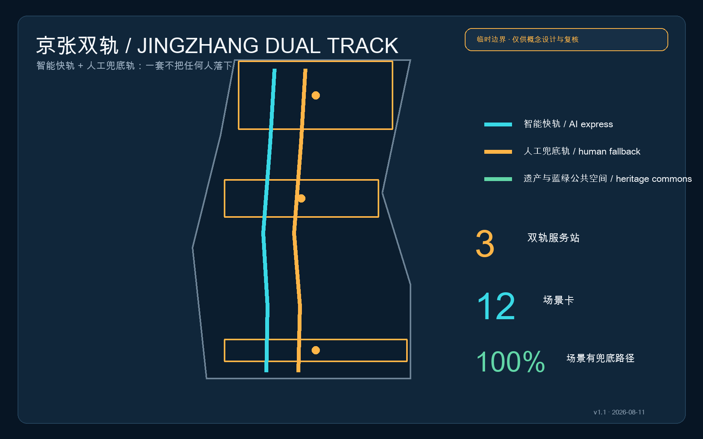
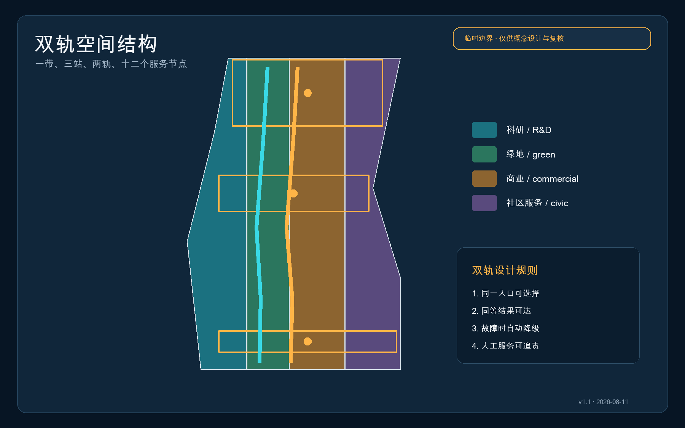
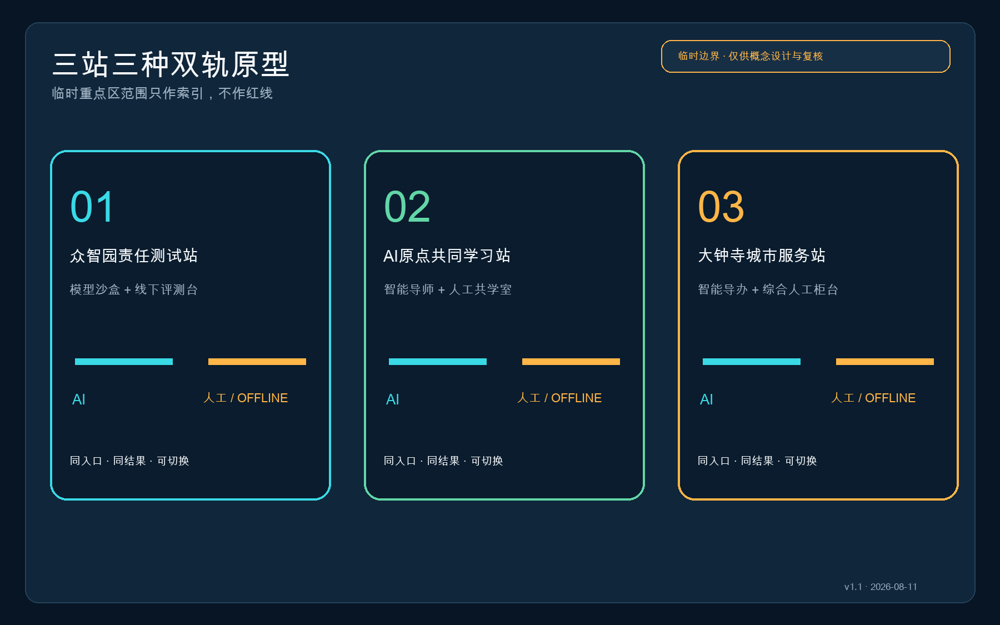
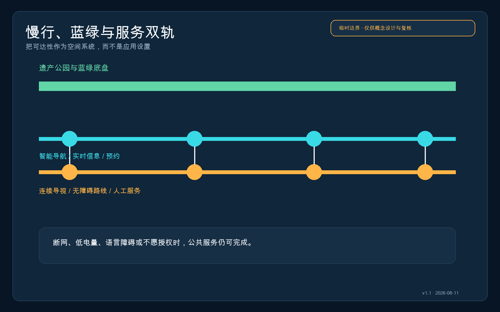
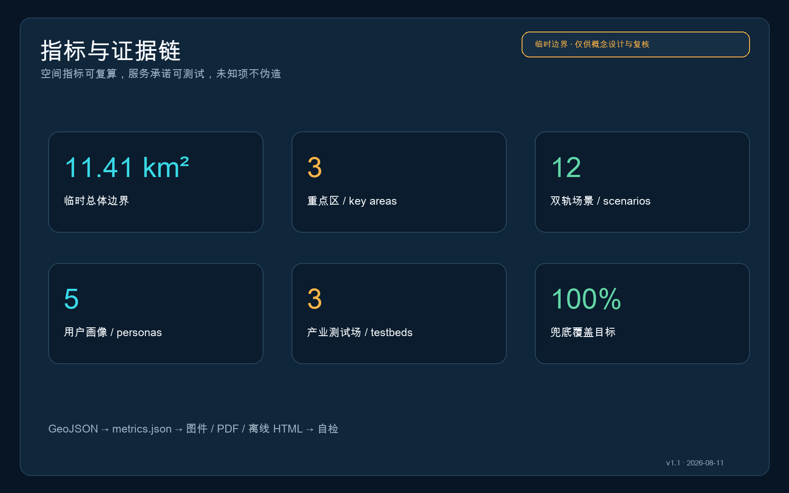

# 京张双轨：人人可达的AI城市服务带

> 一条城市AI创新带的先进程度，不取决于它在一切正常时有多聪明，而取决于断网、低电量、不会用手机、不愿授权数据或需要人工帮助时，仍有多少人能够抵达同一个结果。

**v1.1 设计主张：** 智能快轨与人工/离线兜底轨等宽、等权、同入口。

## 设计依据与资料清单

方案以公开资格预审公告与面向智能体任务书为任务依据，以仓库登记的标准快照、来源注册表和临时边界为证据层。公告给出的 43.6 平方公里统筹研究范围、约 11.4 平方公里总体设计范围及 368.4 公顷重点区面积是任务事实；精确红线、地块、道路、权属、建筑和市政资料仍待正式附件补齐 [source:OFFICIAL-ANNOUNCEMENT] [source:AGENT-TASKBOOK] [source:SOURCE-REGISTRY]。

本包使用 `provisional_boundaries.geojson` 进行拓扑、图示和 intake 自检，所有边界均标注为临时约束，不能用于法定规划、征拆、审批或精确面积结论。官方 polygon 发布后，应替换约束层，并对用地、建筑、道路、绿地、公共空间、分期和全部指标整包重算 [data:geometry/site_boundary.geojson#SITE-001] [metric:site_area_sqm]。

## 三层范围工作框架

统筹研究层把“人人可达的AI”写入产业生态、治理和品牌；总体设计层把双轨入口、连续慢行、蓝绿底盘与三座服务站组织为一套空间网络；重点区层验证建筑首层、公共空间、站点接驳和运营责任。三层之间通过同一组 GeoJSON、指标和任务矩阵衔接，不以口号替代空间证据 [depth:three_level_scope_framework] [standard:PROJECT-OFFICIAL-ANNOUNCEMENT]。

总体结构为“一带三站、两轨十二点”：京张遗址公园是文化与公共空间主带；众智园、AI原点社区、大钟寺是三座双轨服务站；青色智能快轨承载预约、导航、实时推理与自动办理，金色兜底轨承载连续导视、纸面信息、无障碍路线和人工服务；十二个场景节点把产业测试与日常公共服务连接起来 [data:geometry/roads.geojson#ROAD-AI-001] [data:geometry/roads.geojson#ROAD-HUMAN-001] [depth:overall_spatial_structure]。

## 统筹研究范围产业与未来城市研究

产业策略不是新增一类“AI园区”，而是建立一份进入城市的服务合同：每个模型、终端或智能体在公开试验前，都要提交数据最小化说明、人工复核点、离线替代路径、故障降级方式和退出条件。高校提供原始创新与评测方法，众智园承担全栈和安全测试，AI原点社区承担开源转化，大钟寺承担产品与城市服务验证，两翼分别提供资本/专业服务与生活场景反馈 [standard:PROJECT-AGENT-OPEN-CALL-TASKBOOK] [source:AGENT-TASKBOOK]。

建议导入八类生态案例：端侧无障碍导航、离线多语导视、医疗导诊但不代替诊断、教育助学但保留教师通道、法律信息检索但不代替法律意见、社区养老联络、企业服务协同、公共空间运维。它们共享“双轨验收单”，以服务完成率、人工转接成功率、无授权可用率、故障恢复时间和申诉闭环率评价，而不以交互次数或采集数据量评价。

品牌名为“京张双轨 / JINGZHANG DUAL TRACK”，图形语言由两条并行线与三枚换乘圆点构成。青色代表智能能力，金色代表人的选择与责任，两轨等宽，避免把人工服务画成次等附属；三枚换乘点对应三处重点区，也对应测试、学习、服务三种公共价值。

## 总体设计范围城市更新与控规深度城市设计

总体设计以低扰动更新为先：沿遗址公园和轨道站点布置“双轨入口”，在现有建筑首层优先嵌入服务柜台、共学室、评测台和静音等候区；新建、拆除、建筑高度、容积率及道路红线均列为待正式控规、权属和现状调查确认，不从临时边界反推法定结论 [standard:MOHURD-CONTROL-DETAILED-PLANNING] [depth:retain_renovate_demolish]。

用地分区采用科研、公园绿地、商业服务和社区服务四类概念分区，并保持对临时总体边界的完整覆盖。该分区表达功能配比方法，不表示现状或规划批准用地；正式深化时应以官方现状用地、控规和权属逐地块替换 [data:geometry/land_use.geojson#LU-001] [standard:MNR-LAND-USE-CLASSIFICATION-GUIDE]。

建筑更新采用“留、改、补、待定”四级台账：结构与使用状况不明时不得提出拆除；可复用首层优先“改”为双轨服务界面；公共服务缺口以可逆轻型构筑物“补”；所有涉及结构安全、消防、文保、权属的对象标记“待定”。概念建筑基底仅用于表达服务站构成，不是现状测绘 [data:geometry/buildings.geojson#BLDG-ZZ-01] [depth:height_massing_character]。

## 重点区域详细设计

**众智园责任测试站**：以清河绿色界面为公共测试廊，智能快轨提供预约、设备接入、模型评测和结果看板，兜底轨提供人工登记、纸面规则、现场观察与申诉窗口。重点深化全栈自主创新、安全治理展示、低碳测试和对外交通组织，河道、防洪与道路条件待专项核验 [data:geometry/key_areas.geojson#PROV-KEY-001] [depth:three_key_area_detailed_design]。

**北京AI原点共同学习站**：围绕近校成果转化设置开源发布厅、共学室、静音席、人工导师台与多语导视。智能导师可解释课程、场地和成果，但不替代教师判断；不愿登录的使用者仍可凭纸面时刻表、现场排队和人工服务完成同等任务 [data:geometry/key_areas.geojson#PROV-KEY-002] [source:AGENT-TASKBOOK]。

**大钟寺城市服务站**：围绕轨道站和四象限步行联系，组合智能导办、国际路演、终端体验与综合人工柜台；所有智能推荐均显示依据与转人工入口。非机动车停放、过街、站城一体化和重点企业周边公共环境须在正式道路与客流资料到位后深化 [data:geometry/key_areas.geojson#PROV-KEY-003] [metric:key_area_count]。

## AI 创新生态、人才画像与 AI+ 场景

五类核心用户为：携设备访京的国际开发者、需要低成本试验的初创团队、跨校学习的高校师生、依赖日常公共服务的周边居民，以及需要无障碍或人工协助的老人/儿童/残障人士。第五类不是“特殊用户附录”，而是所有场景的压力测试基准；任何场景只有在他们不提供额外个人数据时仍能完成，才算通过。

| 场景卡 | 智能快轨 | 人工/离线兜底轨 | 空间载体 |
| --- | --- | --- | --- |
| 01 责任模型测试 | 自动评测与风险提示 | 现场评测员与纸面异议单 | 众智园测试廊 |
| 02 开源成果发布 | 多语摘要与智能匹配 | 人工主持与线下资料包 | AI原点发布厅 |
| 03 无障碍慢行 | 个性化路径与实时提示 | 连续触觉/高对比导视与志愿者 | 遗产公园沿线 |
| 04 轨道换乘导办 | 实时换乘与拥挤提示 | 固定信息牌与服务台 | 大钟寺站周边 |
| 05 社区健康导诊 | 科室信息与预约辅助 | 人工导诊；不提供诊断 | 社区服务点 |
| 06 教育共学 | 智能导师与资料检索 | 教师/同伴共学室 | 原点社区 |
| 07 法律信息检索 | 公共法规检索与出处 | 法律援助转介；不构成意见 | 三站共享柜台 |
| 08 老年生活联络 | 语音办事提示 | 电话、纸面与现场办理 | 社区服务点 |
| 09 企业服务协同 | 政策资料与流程导航 | 专员复核与申诉渠道 | 大钟寺会客厅 |
| 10 公共空间运维 | 设施异常辅助识别 | 人工巡检与居民报修 | 蓝绿公共空间 |
| 11 全球活动周 | 多语行程与预约 | 纸面手册与现场志愿者 | 一带三站 |
| 12 夜间安全陪伴 | 可选择的照明与求助提示 | 实体求助点和人工值守 | 慢行双轨节点 |

三项产业测试验证场分别是：众智园“模型故障与人工接管压力测试”、AI原点“无账号/无授权可用性测试”、大钟寺“高峰客流多语服务测试”。测试只记录完成率、等待时间和失败类型等必要数据，不建立个人商业画像；涉及面向公众的生成式内容服务时，应由运营主体另行开展适用性和合规判断 [standard:PROJECT-AGENT-OPEN-CALL-TASKBOOK] [source:GEN-AI-MEASURES]。

## 用地、建筑规模与拆改留方案

提交几何中的四类用地是完整的概念性分区：科研用地承载测试与转化，公园绿地承载连续公共底盘，商业服务承载企业与国际交往，社区服务承载人工柜台、共学与生活支持。临时边界下计算的面积和比例只服务内部一致性检查，不作为项目控制指标 [data:geometry/land_use.geojson#LU-002] [metric:green_ratio]。

建筑基底表达三站六个可逆更新单元：测试厅/人工复核厅、开源厅/共学室、智能导办厅/综合服务厅。建议首层通透、入口等权、等候区共享，智能与人工入口不得设置等级差异；高度、规模、密度、退线、消防和结构改造均待正式资料与专业核验 [depth:development_intensity_controls] [metric:building_footprint_area_sqm]。

## 交通、轨道、市政与公共服务设施

两条道路中心线不是新道路红线，而是服务廊道示意：智能快轨沿线布置可选择的实时信息、预约和端侧服务；兜底轨沿线布置连续静态导视、无障碍停靠、饮水、卫生间指引、实体求助点和人工值守时段。二者在三站和九个小节点换乘，并与遗产公园慢行和轨道站接驳 [data:geometry/roads.geojson#ROAD-AI-001] [depth:traffic_rail_slow_parking]。

市政策略采用“断网可用、断电安全、数据最少”的分级：核心导视与求助使用不依赖云服务的实体设施；端侧算力和传感设备须可局部关闭；网络、能源、排水、消防和设备机房仅提出接口原则，待正式市政资料核定 [depth:municipal_new_infrastructure] [data:geometry/constraints.geojson#CONSTRAINTS]。

## 蓝绿空间、公共空间与城市风貌

蓝绿底盘先于智能设备：连续树荫、可坐可靠的边缘、无障碍坡道、饮水与卫生间信息共同构成兜底轨；智能快轨只在其上叠加路径解释、拥挤提示和设施状态。这样即使设备退出，公共空间仍保持基本品质 [data:geometry/green_space.geojson#GREEN-001] [depth:blue_green_public_space]。

风貌语言取自铁路的平行钢轨、站台黄线、里程牌和换乘圆点，不复刻历史建筑，也不使用未经授权的企业标识。三处“AI朝圣地标”分别为众智园责任里程碑、AI原点开源贡献墙、大钟寺公共服务换乘钟；它们展示方法、贡献者和可核验结果，不把企业宣传当作公共荣誉 [standard:MOHURD-URBAN-DESIGN-MEASURES] [data:geometry/public_space.geojson#PUBLIC-ZZ-01]。

## 更新项目清单、实施政策与分期计划

| 阶段 | 更新项目 | 验收门槛 |
| --- | --- | --- |
| 近期 0-2 年 | 双轨导视试点、三站轻量服务台、无账号测试日 | 12 场景均有兜底流程；失败可记录并转人工 |
| 中期 3-5 年 | 首层可逆更新、慢行断点修补、三类产业测试场 | 无障碍连续性和高峰接管经专业团队验证 |
| 长期 5 年以上 | 站城一体化、蓝绿系统与长期社区运营 | 以正式控规、交通、市政、权属和资金条件为前提 |

政策工具包括“双轨服务条款”纳入场景开放协议、公共服务失败日志、季度无账号可用性演练、居民/开发者联合复盘和退出机制。建议建立年度“京张双轨周”：不是一次性科技节，而是公开发布失败案例、修复进度和下一年度测试清单的共同维护活动 [data:geometry/phasing.geojson#PHASE-001] [depth:phasing_implementation]。

长期运营由一套轻量治理结构承接：场景运营者负责日常服务与告知，人工服务负责人拥有暂停权，专业机构负责无障碍/安全/工程核验，社区代表参与季度复盘，开发者只访问经授权的最小数据。任何“已建成、已批准、已投资”表述均不在本概念方案范围内。

## 指标体系、面积复算与合规矩阵

空间指标由 GeoJSON 在 EPSG:4548 下复算，临时总体范围约 11.41 平方公里、三处重点区、绿地率和公共空间率仅用于提交包内部一致性；容积率、总建筑面积、建筑高度、道路红线与市政容量因缺少官方条件保持未知。服务指标设定 12 张场景卡、5 类画像、3 类产业测试场与 100% 兜底路径覆盖目标，其中覆盖是设计承诺，需在实施前逐场景演练验证 [metric:site_area_sqm] [metric:fallback_coverage_ratio] [depth:metrics_recalculation]。

合规矩阵覆盖公告 1.3、1.4、1.5 与 agent.1-agent.6；专业标准矩阵覆盖公告、任务书、城市设计、控规深度、用地分类和缺失的建筑设计深度文件；设计深度矩阵将现状诊断、空间结构、用地、建筑、交通、市政、蓝绿、重点区、项目、分期、指标和风险逐项挂接到正文、图层和图纸。缺失官方资料不会被“通过”掩盖，而是进入 assumptions 与自检警示。

## 风险、版权与合规说明

最大空间风险是临时边界可能与正式红线、道路、地块和建筑不一致；最大运营风险是“有人工入口”但无人员、时段或问责；最大技术风险是系统故障时无法优雅降级；最大公平风险是把不会用或不愿用AI的人排除。对应措施是整包复算、服务排班与责任人、季度故障演练以及同入口同结果验收 [depth:risk_missing_data] [source:ACCESSIBILITY-LAW]。

本方案由 AI agent 基于仓库公开或清权资料生成，图件、HTML 和 PDF 均由提交包内结构化数据与自制图形生成，不使用新闻图片、地图瓦片、第三方渲染或未授权商标。代码与机器数据的复用遵循仓库许可；方案展示遵循 `COMMUNITY-DISPLAY-ONLY` 和征集知识产权条款，正式使用须由权利人与组织方确认。

本方案是供专业团队深化的概念建议，不是法定规划、政府审定、投资承诺、工程可行性结论、土地权属判断或拆迁决定。无障碍、生成式AI、医疗、教育、法律和公共安全场景均需由相应专业主体进一步进行适用性、合规性与工程核验。

## 参考资料

- 北京市规划和自然资源委员会海淀分局：《百年京张AI创新带城市设计国际方案征集资格预审公告》。
- 面向全球智能体的开源征集任务书摘录（仓库清权摘要）。
- 住房和城乡建设部：《城市设计管理办法》《城市、镇控制性详细规划编制审批办法》。
- 自然资源部：《国土空间调查、规划、用途管制用地用海分类指南》。
- 《中华人民共和国无障碍环境建设法》与《生成式人工智能服务管理暂行办法》；仅按来源注册表限定用途引用。
- 完整来源、限制、公式与矩阵见 `sources.json`、`metrics.json`、`assumptions.json`、`standard_matrix.json`、`design_depth_matrix.json` 和 `compliance_matrix.json` [source:SITE-PACKAGE]。
