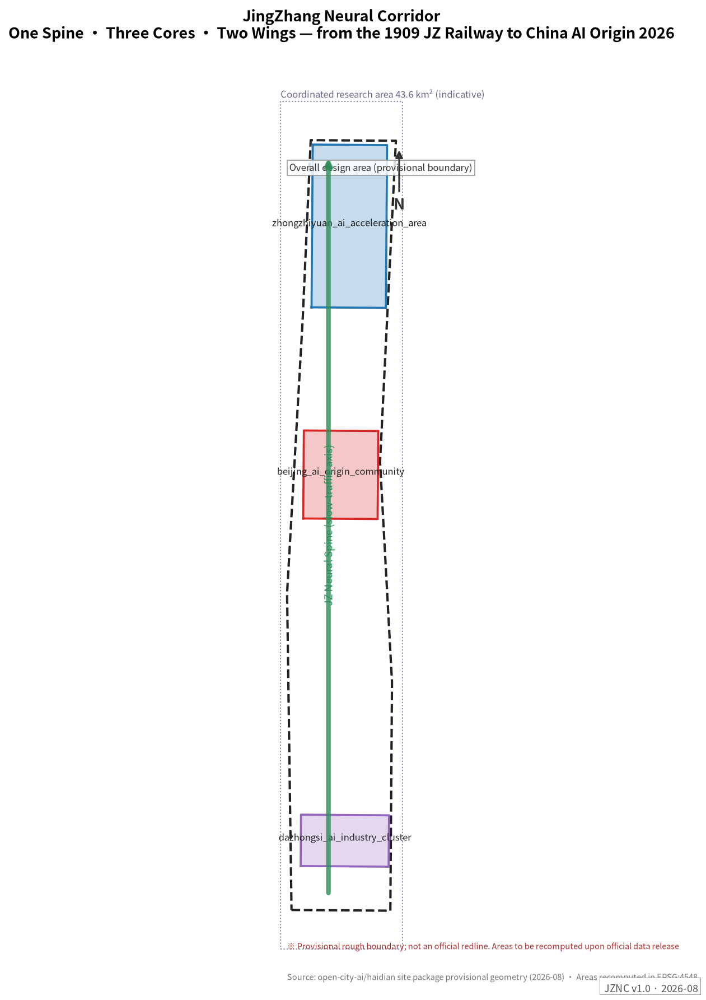
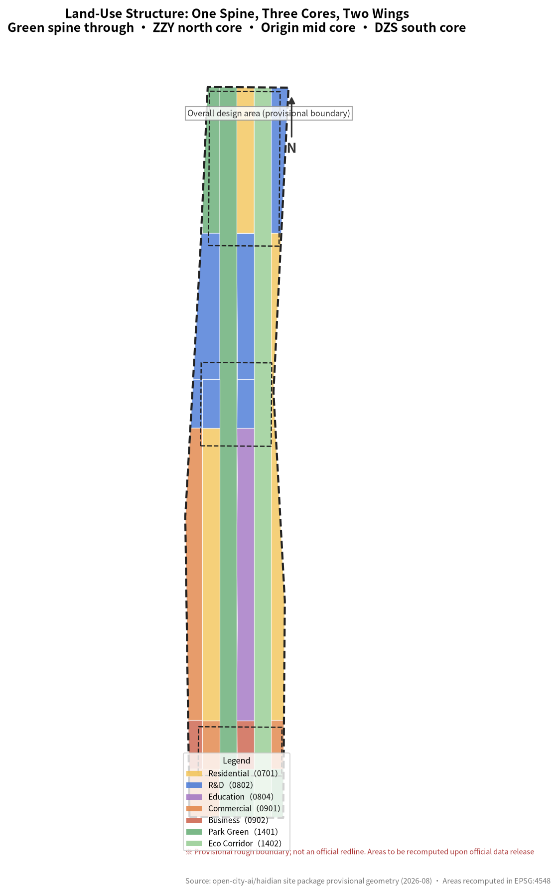
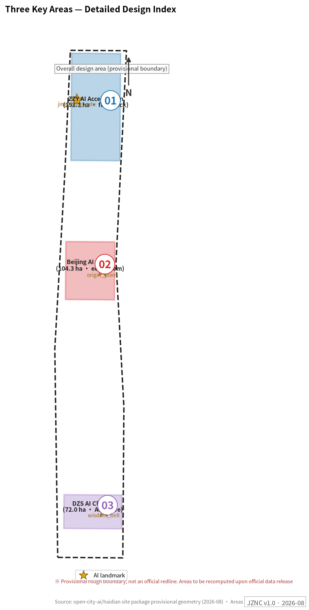
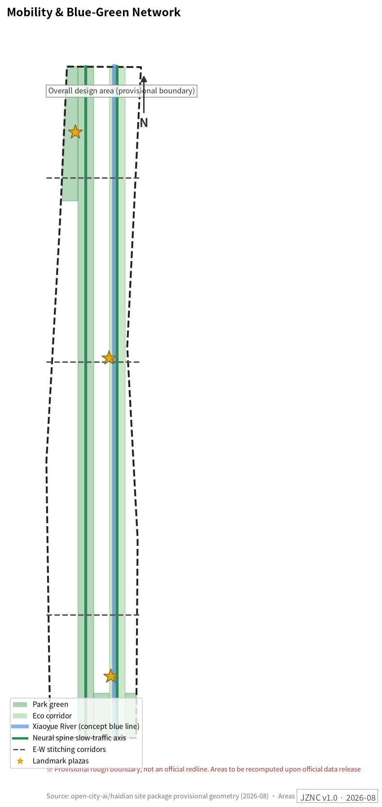
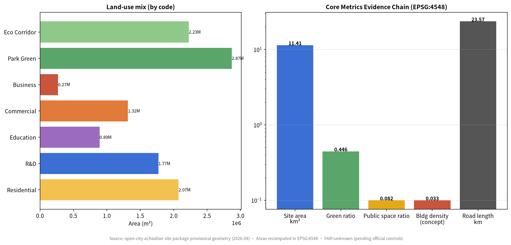

# JingZhang Neural Corridor — Spatial Translation of a Century of Independent Innovation

## Design Basis and Source List

This proposal takes the official prequalification announcement of the Centennial Jing-Zhang AI Innovation Belt International Urban Design Solicitation as its primary basis [source:OFFICIAL-ANNOUNCEMENT], the maintainer-registered design brief, provisional rough boundaries, enumerations, metrics and source lists under `brief/site-package/` as its machine-readable basis [source:SITE-PACKAGE], and the agent open-call taskbook as its co-creation task list [source:AGENT-TASKBOOK]. Before generation, the full set of `design_brief.json`, `agent_taskbook.json`, `allowed_design_space.json`, `enums/`, `ranges/planning_limits.json`, `schemas/`, `data/source_registry.json` and `data/processed/agent_fact_pack.md` was read, and the processed CSVs were used to build task, scope, source-use and data-gap checklists [source:PROCESSED-FACT-PACK].

Source-use boundaries: formal authoritative conclusions derive only from centrally registered formal-usable sources; background sources cannot support spatial-control conclusions; provisional sources support only interim generation, visualization and discussion. All spatial conclusions in this package rest on provisional rough geometry and are concept suggestions [depth:existing_conditions_diagnosis].

The official precise redline has not yet been obtained; `geometry/site_boundary.geojson` and `geometry/key_areas.geojson` use the repository's provisional boundaries marked `provisional_constraint` with `official_boundary=false` [data:geometry/site_boundary.geojson#SITE-001]. They may be used for generation, self-checks, visualization and design discussion, but not as an official redline, approval basis or precise-area basis; this organizer data gap itself does not block content scoring. Once the official boundary is released, site boundary, key areas, land use, roads, green space, public space, buildings, phasing and metrics must all be recomputed.

## Three-Level Scope Framework

The proposal organizes work along the announcement's three levels, unified by the spatial structure of "One Spine, Three Cores, Two Wings" [depth:three_level_scope_framework]:

- **One Spine**: the JZ Neural Spine — a north-south composite corridor through the 11.4 km² design area along the Jing-Zhang heritage park belt, layering a century timeline trail, low-speed shuttle and AI scenario nodes; it is simultaneously spatial skeleton, cultural narrative and experiential route [data:geometry/roads.geojson#ROAD-001].
- **Three Cores**: ZZY AI Acceleration Area (north, 192.1 ha), Beijing AI Origin Community (middle, 104.3 ha), Dazhongsi AI Cluster (south, 72.0 ha), corresponding to three innovation stages — full-stack acceleration, world-class ecosystem, AI-native formats [data:geometry/key_areas.geojson#PROV-KEY-001].
- **Two Wings**: the Zhongguancun S&T service wing (west: IP, capital, tech-transfer globalization) and the Xiaoyue River scenario-empowerment wing (east: AI scenarios and vibrant city) [source:AGENT-TASKBOOK].

| Level | Design question | This proposal's answer | Data anchor |
| --- | --- | --- | --- |
| Coordinated research area (43.6 km²) | How to organize a world-class AI ecosystem | An innovation chain of "origination—acceleration—conversion—experience—communication" plus spatial placement of five functions | compliance_matrix.json, Section 3 |
| Overall design area (11.4 km²) | How to map renewal framework, structure and capacity | 24 seamless land-use parcels + Neural Spine + E-W stitching corridors [metric:site_area_sqm] | geometry/land_use.geojson, roads.geojson |
| Key areas (368.4 ha) | How to reach implementation-grade depth in three districts | Seven-part kit: positioning, structure, building renewal, mobility, public space, AI scenarios, implementation risk | geometry/key_areas.geojson, Section 5 |

The three levels cascade: research determines the ecosystem judgment; overall design translates it into 24 seamless, non-overlapping parcels (total 11,412,825 m² in EPSG:4548, matching the boundary) [depth:overall_spatial_structure]; detailed design validates implementability. If the provisional boundary is replaced, the structure and partition logic remain valid; only areas and ratios are recomputed.

## Coordinated Research Area: Industry and Future City Research

### Naming System and Visual Identity (agent.1)

**Primary name: JingZhang Neural Corridor (JZNC), 京张智脉**. Rationale: the 1909 Jing-Zhang Railway was the first trunk railway designed and built independently by Chinese engineers; Haidian/Zhongguancun in 2026 is China's AI origin. The character "脉 (vein/pulse)" carries three meanings at once — the railway's rail vein, the cultural lineage, and the neural network. The subtitle directly answers the "Centennial Jing-Zhang Cultural Belt" positioning.

**Naming system** (primary + generic + specific): Neural Spine (main corridor), Neural Gate / Origin Point / Wisdom Bell (three landmarks), Zhipulse Open-Source Festival (annual program), Zhixu Trail (Xiaoyue scenario wing), Zhipulse Star Wall (contribution display), Zhipulse Hall of Fame.

**Logo / visual identity direction**: a two-stroke mark based on Zhan Tianyou's "人"-shaped (herringbone) rail alignment — the left stroke a rail cross-section (1909), the right stroke a neural synapse (2026), meeting at the apex to form an upward pulse. Palette: rail grey + neural teal, accented with brick red from the heritage stations. The mark scales across signage, paving and lighting installations. All visual elements are original to this proposal; no uncleared fonts, trademarks or portraits are used.

### Global AI Ecosystem Cases and Transferable Mechanisms (agent.2)

Eight global cases are studied with explicit transfer mechanisms:

| Case | Core mechanism | Transfer to JZNC |
| --- | --- | --- |
| King's Cross Knowledge Quarter, London | Railway heritage renewal + mixed university/research/arts | Stitching strategy along the heritage park belt |
| Station F, Paris | Station converted into the world's largest startup campus | Dazhongsi station TOD: scaled incubation around the station |
| Kendall Square, Boston | MIT-adjacent innovation district | Spatial ratios and service chain of the Origin conversion street |
| Stanford Research Park | University land, long-cycle innovation community | ZZY low-density garden R&D campuses with long leases |
| Digital Media City, Seoul | Content industry + city-scale display interface | Dazhongsi urban display frontage for AI-native consumption |
| Shibuya Station City, Tokyo | Rail integration + youth culture | Four-quadrant pedestrian connectivity and youth third places |
| Marineterrein, Amsterdam | Urban living lab | Open-test governance framework of the ZZY full-stack test-bed |
| Shenzhen Bay Eco-Science Park | Ecosystem campus with urban permeability | ZZY campus-block permeable layout |

Ecosystem map: across the eight elements (land, space, industry, capital, talent, compute, data, scenarios), the three cores each concentrate different elements — ZZY on compute and test-beds, Origin on talent and open source, Dazhongsi on data and scenarios [source:AGENT-TASKBOOK]. Judgments are anchored to the land-use layer [data:geometry/land_use.geojson#LU-001] and the overall-structure depth item [depth:overall_spatial_structure].

### Future City Form

AI will change work (open collaboration replacing closed labs), life (AI services embedded in community), learning (conversion moving into streets) and mobility (low-speed shuttle + walking first). The proposal grounds these in locatable objects: the Spine carries "learning while moving", the Origin Plaza "collaborating while publishing", the test-bed "innovating under supervision", the Bell Plaza "consuming culture".

## Overall Design Area: Urban Renewal and Regulatory-Plan-Level Urban Design

Three things are organized at regulatory-plan depth [standard:MOHURD-CONTROL-DETAILED-PLANNING]:

**1. Land-use structure**: 24 parcels seamlessly cover the 11.4 km² boundary — R&D (0802) 1,770,544 m², residential (0701) 2,072,685 m², commercial (0901) 1,316,043 m², business (0902) 269,393 m², education (0804) 890,674 m², park green (1401) 2,868,483 m², ecological corridor (1402) 2,225,003 m² [data:geometry/land_use.geojson#LU-001] [metric:land_use_research_area_sqm]. Green ratio 44.6% and public-space ratio 8.2% embody the heritage-park-first logic [metric:green_ratio] [metric:public_space_ratio].

**2. Renewal framework**: four categories — retain (railway heritage and mature communities), renovate (inefficient commerce and old plants along the spine), renew (Xiaoyue riverfront and station vicinities), new-build (increments in the three cores). Specific retain/renovate/demolish decisions remain unconfirmed pending ownership and building surveys [depth:retain_renovate_demolish].

**3. Mobility and capacity**: Neural Spine + 3 E-W stitching corridors + Xiaoyue greenway form the slow-traffic skeleton [data:geometry/roads.geojson#ROAD-001]; rail integration centers on Dazhongsi and Wudaokou. Nine concept massing groups, footprint 375,503 m² (density 3.3%, concept) [data:geometry/buildings.geojson#BLDG-001] [metric:building_density]. FAR and height remain `status=unknown` pending official controls [metric:floor_area_ratio].

## Detailed Design of Key Areas

### ZZY AI Acceleration Area — "Full-Stack Accelerator" [data:geometry/key_areas.geojson#PROV-KEY-001]

- **Positioning**: garden district for national AI platforms and full-stack independent innovation; maps to "full-stack self-reliant AI system" and "global AI governance voice".
- **Structure**: one spine, one riverfront interface, two clusters — Spine north segment + Qinghe low-carbon innovation frontage + R&D cluster (BLDG-001/002) + pilot cluster (BLDG-003).
- **Buildings**: 8–12 storey garden offices; 6-storey pilot halls; concept massing, not statutory controls.
- **Mobility**: strengthened North Fifth Ring interface and station shuttles; internal low-speed loop pilot.
- **Public space**: Qinghe low-carbon corridor hosts outdoor test display and standards workshops.
- **AI scenarios**: SCN-03 full-stack test-bed, SCN-07 robot delivery pilot, SCN-01 smart shuttle.
- **Risks**: Qinghe blue line and flood conditions unconfirmed; ring-road traffic coordination required.

### Beijing AI Origin Community — "World Ecosystem · Origin" [data:geometry/key_areas.geojson#PROV-KEY-002]

- **Positioning**: narrative anchor from "China's railway origin" to "China's AI origin"; near-campus conversion and talent special zone [source:AGENT-TASKBOOK].
- **Structure**: Origin Plaza (PUB-001) + conversion street (BLDG-004) + incubator (BLDG-005) + talent apartments (BLDG-006).
- **Buildings**: stock renewal first; retain/renovate/demolish pending ownership; ground floors fully opened as publishing/showcase/collaboration interfaces.
- **Mobility**: campus-district-street slow-traffic stitching; rail station integration.
- **Public space**: Origin Plaza is landmark #1 — origin-ring ground installation + Zhipulse Star Wall (open-source contributor honors).
- **AI scenarios**: SCN-02 origin co-creation, SCN-04 open-model plaza, SCN-12 youth AI night school.
- **Risks**: campus boundary and ground-floor ownership unconfirmed; talent-zone policy is a concept suggestion.

### Dazhongsi AI Cluster — "AI-Native Parlor" [data:geometry/key_areas.geojson#PROV-KEY-003]

- **Positioning**: urban showcase parlor for agents, smart terminals, content consumption and data elements; maps to "AI-native new formats".
- **Structure**: station integration + four-quadrant connectivity + smart-consumption cluster (BLDG-007) + AI business cluster (BLDG-008).
- **Buildings**: renovation-first, with public-realm upgrades around leading firms.
- **Mobility**: four-quadrant pedestrian connectivity and intersection safety — concept pending engineering confirmation.
- **Public space**: Wisdom Bell Plaza (PUB-003) is landmark #3 — a 600-year-old bell voice meets AI-generated light art in a daily "Wisdom Bell morning chime".
- **AI scenarios**: SCN-08 bell light show, SCN-05 AI health navigation, SCN-10 data-element parlor.
- **Risks**: station utilities unconfirmed; heritage control zones need official delineation.

All three districts are checked by [depth:three_key_area_detailed_design]; announced areas (192.1/104.3/72.0 ha) are authoritative, provisional polygons serve only as locators [metric:key_area_zhongzhiyuan_area_sqm].

## AI Innovation Ecosystem, Personas, and AI+ Scenarios

### Personas (6)

| Persona | Needs | Spatial response | Privacy & review boundary |
| --- | --- | --- | --- |
| Open-source developer | Publishing, collaboration, testing, reputation | Origin publishing hall, Star Wall, night collaboration space | No individual tracking; contributor display opt-in |
| Startup team | Low-cost space, compute, test fields | ZZY shared test field, incubator (BLDG-005) | Compute/data services separately authorized |
| Leading firms & visitors | Showcase, business, international reception | Dazhongsi roadshow parlor, rail shuttle | Firm marks and cases require clearance |
| Nearby residents | Commute, leisure, low-disturbance renewal | Heritage park loop, community AI points | No commercial profiling of residents |
| Faculty & students | Conversion, cross-campus work, walking | Conversion street, AI night school | Campus data authorized only |
| International visitor | Pilgrimage, culture, investment tour | Three-landmark route, bilingual wayfinding, AR guide | Itinerary data not retained |

### AI Scenario Cards (12, incl. 4 industry test-bed cards*)

| Card | Scenario | Carrier | Operator | Human review / privacy boundary |
| --- | --- | --- | --- | --- |
| SCN-01* | Smart shuttle: low-speed autonomous loop (ZZY—Origin) | Spine ROAD-001 | Mobility operator + sandbox | On-board footage stays local; speed-limited test zone |
| SCN-02 | Origin co-creation: monthly hackathons & releases | Origin Plaza PUB-001 | Zhipulse OSS community | Content reviewed before display |
| SCN-03* | Full-stack test-bed: open model / embodied-AI testing | ZZY BLDG-003 | Platform firms + governance board | De-identified test data; public red-team summaries |
| SCN-04* | Open-model plaza: public benchmark arena | Origin Community | OSS community + universities | Licensed benchmark sets; reproducible results |
| SCN-05 | AI health navigation: triage & self-service records | Dazhongsi cluster | Medical institutions | Clinical data stays in institution; physician sign-off |
| SCN-06 | AI learning companion: after-school tutor | Education cluster 1103 | Schools + operator | Parental consent for minors |
| SCN-07* | Robot delivery & patrol pilot | Spine + Xiaoyue greenway | Logistics + property | No face retention; human complaint channel |
| SCN-08 | Bell light show: bell voice × AI generative art | Bell Plaza PUB-003 | Dazhongsi operator | Time-limited sound/light; heritage pre-review |
| SCN-09 | AI community governance: co-deliberation & work orders | Community service points | Sub-district + board | Open agendas; human-confirmed outcomes |
| SCN-10* | Data-element parlor: compliant circulation sandbox | Dazhongsi cluster | Data exchange branch | Full audit chain; revocable authorization |
| SCN-11 | Heritage AR guide: JZ century timeline | Full spine | Culture operator | AR content heritage-reviewed; no tracking |
| SCN-12 | Youth AI night school: literacy & skills | Origin night spaces | OSS community + volunteers | Minimal enrollment data |

Cards map to public-space and road layers [data:geometry/public_space.geojson#PUB-001] [data:geometry/roads.geojson#ROAD-001]; counts enter metrics [metric:ai_scenario_card_count] [metric:ai_industry_test_scenario_count]. All scenarios are concept suggestions; test scenarios must not be presented as approved operations [source:AGENT-TASKBOOK].

## Land Use, Building Scale, and Retain-Renovate-Demolish Strategy

Land use is expressed in 24 parcels following public land-use classification guidance [standard:MNR-LAND-USE-CLASSIFICATION-GUIDE]; full recomputation is in `metrics.json` [metric:land_use_research_area_sqm]. Buildings distinguish nine concept new-build groups from unconfirmed stock; absent official controls, FAR/height/density/setbacks are all `status=unknown` and concept massing is labeled low-confidence [depth:height_massing_character] [depth:retain_renovate_demolish]. Recomputation paths after official data arrival are recorded in `assumptions.json`.

## Transport, Rail, Municipal Infrastructure, and Public Services

- **Slow-traffic spine**: ~9.8 km concept alignment with timeline trail and low-speed shuttle [data:geometry/roads.geojson#ROAD-001].
- **E-W stitching**: three concept arterials mend the historical railway divide; alignments pending engineering confirmation [depth:traffic_rail_slow_parking].
- **Rail integration**: Dazhongsi four-quadrant connectivity, Wudaokou interchange optimization (concept).
- **New infrastructure**: edge-compute stations along the spine (SCN-03 annex); distributed energy coordinated with the Qinghe frontage [depth:municipal_new_infrastructure].
- **Municipal gaps**: utilities, flood control and fire data missing — listed as formal deepening preconditions.

## Blue-Green Network, Public Space, and Urban Character

Blue-green skeleton: Neural Spine green belt (park green 2,868,483 m²) + ecological corridors (2,225,003 m²) + Xiaoyue blue-line concept buffer [data:geometry/green_space.geojson#GREEN-001] [data:geometry/constraints.geojson#CST-002]. Urban character in three narrative layers — rail-grey base (JZ industrial heritage), neural-teal accents (AI culture), brick-red memory nodes (old station houses) [standard:MOHURD-URBAN-DESIGN-MEASURES].

**AI landmarks & component library (agent.4)**: three landmarks — JZ AI Gate (PUB-002, herringbone-arch digital installation), AI Origin Plaza (PUB-001, origin ring + Star Wall), Wisdom Bell Plaza (PUB-003, daily morning chime) [data:geometry/public_space.geojson#PUB-002]. Honor system: Star Wall (open-source stars), Hall of Fame, annual Zhipulse Award. Component library: neural bench (embedded edge AI Q&A), wayfinding bollards (bilingual + accessible), modular pavilions, light-track paving.

## Renewal Projects, Implementation Policy, and Phasing

| ID | Project | Type | Phase | Dependencies |
| --- | --- | --- | --- | --- |
| JZ-01 | Spine slow-traffic completion & gap stitching | Public space / transport | 1 | Red lines, under-bridge space review |
| JZ-02 | ZZY R&D clusters & test-bed | Industry / new infra | 1 | Compute & test governance framework |
| JZ-03 | Origin Plaza & Star Wall | Landmark / operations | 2 | Contributor authorization mechanism |
| JZ-04 | Conversion street stock renewal | Urban renewal | 2 | Campus boundary, ownership |
| JZ-05 | Dazhongsi four-quadrant connectivity | Rail integration | 2 | Rail & municipal conditions |
| JZ-06 | Bell Plaza & light system | Landmark / culture | 2 | Heritage review |
| JZ-07 | Xiaoyue Zhixu Trail & scenario wing | Blue-green / scenarios | 3 | Blue line, river management |
| JZ-08 | Edge-compute station network | New infrastructure | 3 | Energy & safety approvals |

Phasing areas: Phase 1 2,258,561 m² (spine + ZZY first), Phase 2 2,126,198 m² (dual-core drive), Phase 3 7,028,067 m² (full-line renewal) — concept phasing pending official conditions [data:geometry/phasing.geojson#PHASE-001] [depth:phasing_implementation].

**Long-term operations (agent.6)**: annual "Zhipulse Week" each October (Zhan Tianyou's birth month: developer conference + open model benchmark contest + city experience day); monthly hackathons; quarterly scenario open days; an "AI Pilgrimage Passport" linking the three landmarks with talent/investment conversion; international communication built on the century storyline "from the JZ Railway to the AI origin". All programs are operational concept suggestions, not confirmed arrangements [source:AGENT-TASKBOOK].

## Metrics, Area Recalculation, and Compliance Matrix

Three metric tiers: spatial metrics recomputed from this package's geometry (site 11,412,825 m², green ratio 0.4463, public-space ratio 0.0819, footprint 375,503 m², density 0.0329) [metric:site_area_sqm] [metric:green_ratio] [metric:building_density]; control metrics (FAR, height) unknown pending official plans [metric:floor_area_ratio]; performance metrics (AI innovation index, talent density) pending operational data [depth:metrics_recalculation]. Task coverage is mastered by `compliance_matrix.json`; standard coverage by `standard_matrix.json`.

## Risk, Copyright, and Compliance

- **Boundary risk**: provisional boundary is not an official redline; all areas and spatial conclusions are concept suggestions pending recomputation.
- **Data gaps**: regulatory plan, existing buildings, ownership, utilities and heritage delineation are missing; related conclusions are unconfirmed items [depth:risk_missing_data].
- **Copyright**: all figures generated from this package's own geometry; visual identity is original; no uncleared fonts, trademarks, portraits or third-party maps [source:SITE-PACKAGE].
- **Unified boundary clause**: all spatial suggestions are concepts, references or bases for professional teams to deepen — they do not replace formal planning and do not constitute government-approved conclusions [source:AGENT-TASKBOOK].
- **AI governance**: all scenarios follow data minimization, public sources, explainability and human review.

## References

- brief/site-package/design_brief.json
- brief/site-package/agent_taskbook.json
- brief/site-package/allowed_design_space.json
- brief/site-package/geometry/provisional_boundaries.geojson
- data/processed/agent_fact_pack.md and processed CSVs
- Full machine indexes: `sources.json`, `metrics.json`, `compliance_matrix.json`, `standard_matrix.json`, `design_depth_matrix.json`
- Source entries follow the site package registry; full provenance and licensing in [source:SITE-PACKAGE]
