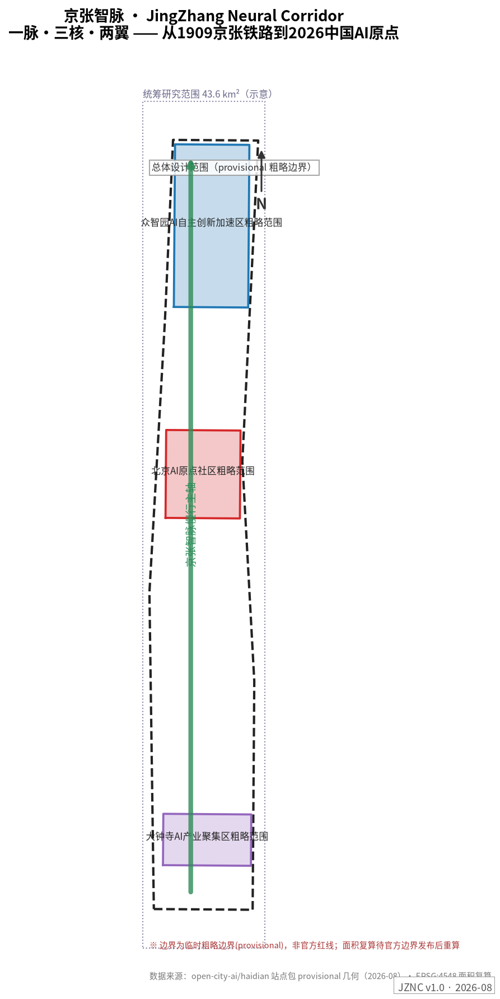
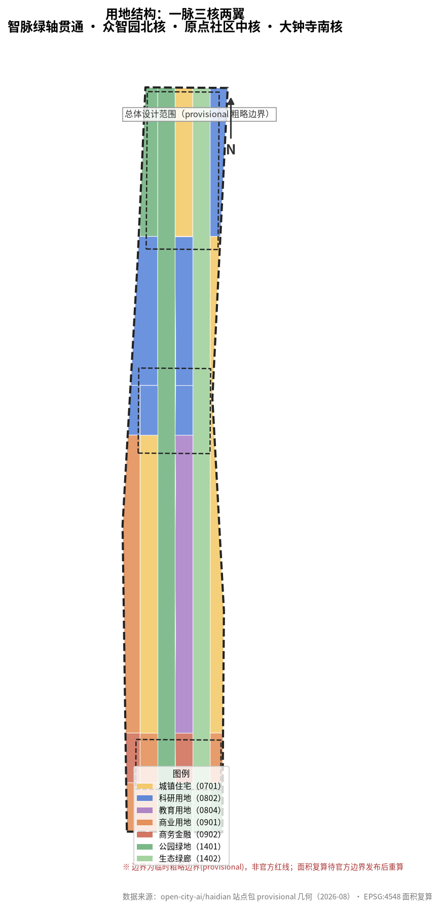
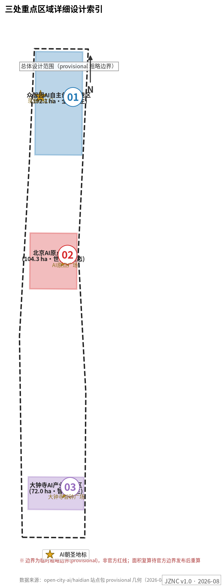
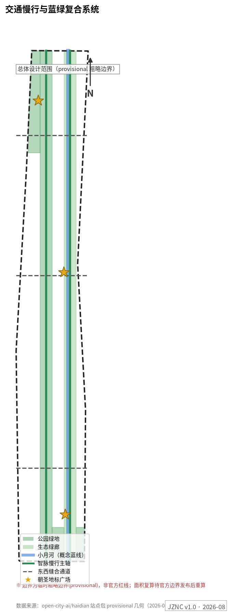
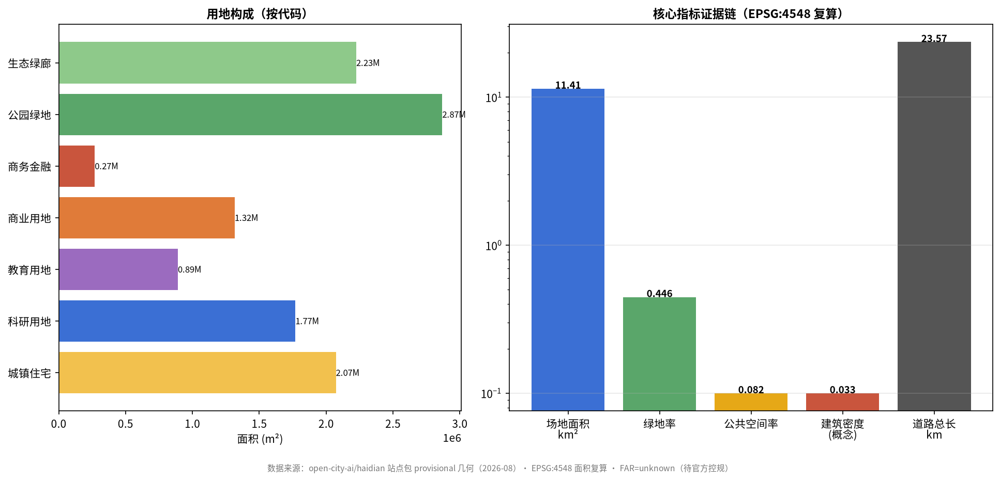

# 京张智脉 JingZhang Neural Corridor——百年自主创新脉的空间转译

## 设计依据与资料清单

本方案以北京市发布的《百年京张AI创新带城市设计国际方案征集资格预审公告》为第一依据 [source:OFFICIAL-ANNOUNCEMENT]，以 `brief/site-package/` 中经维护者登记的设计任务书、临时粗略边界、枚举、指标与来源清单为机器可读依据 [source:SITE-PACKAGE]，以面向智能体的开源征集任务书为共创任务清单 [source:AGENT-TASKBOOK]。生成前已完整读取 `design_brief.json`、`agent_taskbook.json`、`allowed_design_space.json`、`enums/`、`ranges/planning_limits.json`、`schemas/`、`data/source_registry.json` 与 `data/processed/agent_fact_pack.md`，并以 `project_scope_summary.csv`、`agent_task_requirements.csv`、`source_use_matrix.csv`、`missing_data_checklist.csv` 建立任务、范围、资料用途与缺口清单 [source:PROCESSED-FACT-PACK]。

资料用途边界：formal 权威结论只来自中央登记表中 formal 可用资料；背景资料不支撑空间控制结论；provisional 资料只支撑临时生成、可视化与讨论。本方案所有空间结论均基于 provisional 粗略边界，属概念建议 [depth:existing_conditions_diagnosis]。

当前官方精确红线尚未取得，本包 `geometry/site_boundary.geojson` 与 `geometry/key_areas.geojson` 使用 `brief/site-package/geometry/provisional_boundaries.geojson` 标注为 `provisional_constraint`、`official_boundary=false` 的临时边界 [data:geometry/site_boundary.geojson#SITE-001]。它可用于方案生成、自检、可视化与设计讨论，不能作为官方红线、审批依据或精确面积复算依据；该组织方数据缺口本身不阻断内容评分。官方边界发布后，site boundary、key areas、land use、roads、green space、public space、buildings、phasing 与 metrics 全部需要重算。

## 三层范围工作框架

方案按照公告三层范围组织工作，并以"一脉三核两翼"作为统一空间结构 [depth:three_level_scope_framework]：

- **一脉**：京张智脉慢行主轴——沿京张遗址公园绿带南北贯通 11.4 km² 设计范围的复合廊道，叠加百年时间轴步道、低速接驳与 AI 场景节点，是空间骨架、文化叙事与体验动线三合一的"神经主干" [data:geometry/roads.geojson#ROAD-001]。
- **三核**：众智园 AI 自主创新加速区（北核，192.1 ha）、北京 AI 原点社区（中核，104.3 ha）、大钟寺 AI 产业聚集区（南核，72.0 ha），对应"全栈自主加速—世界级生态—智能原生业态"三个创新阶段 [data:geometry/key_areas.geojson#PROV-KEY-001]。
- **两翼**：中关村科技服务翼（西侧，IP、资本、技术转移要素全球化配置）与小月河场景赋能翼（东侧，AI 场景与活力城市）[source:AGENT-TASKBOOK]。

| 层级 | 设计问题 | 本方案回答 | 数据落点 |
| --- | --- | --- | --- |
| 统筹研究范围（43.6 km²） | 世界级 AI 创新生态如何组织 | "策源—加速—转化—体验—传播"创新链 + 五大功能空间落位 | compliance_matrix.json、proposal 第 3 节 |
| 总体设计范围（11.4 km²） | 更新框架、空间结构与承载如何落图 | 24 个无缝用地分区 + 智脉轴 + 东西缝合通道 [metric:site_area_sqm] | geometry/land_use.geojson、roads.geojson |
| 重点区域范围（368.4 ha） | 三片区如何达到综合实施深度 | 定位+空间结构+建筑更新+交通慢行+公共空间+AI场景+实施风险七件套 | geometry/key_areas.geojson、第 5 节 |

三层范围逐级落实：统筹研究决定产业链与创新生态判断；总体设计把判断转译为 24 个无缝、无重叠的用地分区（EPSG:4548 复算总面积 11,412,825 m²，与边界面积一致）[depth:overall_spatial_structure]；重点区域详细设计验证具体地块、建筑、交通、公共空间与 AI 场景的可实施性。若 provisional 边界被官方红线替换，本节空间结构与分区逻辑保持不变，仅重算面积与比例。

## 统筹研究范围产业与未来城市研究

### 命名体系与视觉识别（agent.1）

**主名称：京张智脉（JingZhang Neural Corridor，简称 JZNC）**。命名逻辑：1909 年京张铁路是中国人自主设计建造的第一条干线铁路，2026 年中关村海淀是中国 AI 创新原点——"脉"字同时承载三层含义：铁路的**轨脉**、文化的**文脉**、智能的**神经脉络**。副题"百年自主创新脉的空间转译"直接回应三大定位中的"百年京张文化带"。

**命名体系**（主名+通名+专名三级）：智脉轴（主线廊道）、智脉之门/智脉原点/智脉智钟（三朝圣地标）、智脉开源节（年度活动品牌）、智语步道（小月河场景翼）、智脉星墙（贡献展示体系）、智脉名人堂（荣誉体系）。

**Logo/视觉识别方向**：以詹天佑"人"字形铁路为原型的双笔画图形——左笔为钢轨断面（代表 1909），右笔为神经元突触（代表 2026），两笔在人字顶点交汇形成向上的脉冲波形；主色"钢轨灰 + 神经元蓝绿"，辅色取京张铁路老站房的砖红。图形可在导视、铺装、灯光装置三个尺度延展。全部视觉元素为本方案原创生成，未使用任何未清权字体、商标或人物肖像。

### 世界级 AI 创新生态案例与可转化机制（agent.2）

本方案研究 8 个全球创新生态案例，并明确"哪些经验可转化为空间/运营/场景机制"：

| 案例 | 核心机制 | 对京张智脉的可转化点 |
| --- | --- | --- |
| 伦敦 King's Cross 知识区 | 铁路遗产更新 + 大学/科研/艺术混合 | 京张遗址公园沿线更新直接参照：遗产保护与新建业态的缝合策略 |
| 巴黎 Station F | 车站改造为全球最大创业园区 | 大钟寺站一体化：轨道站点上方/周边组织规模化孵化空间 |
| 波士顿 Kendall Square | MIT 近校创新区 | AI 原点社区"近校成果转化街"的空间配比与服务链 |
| 硅谷 Stanford Research Park | 校产土地长周期创新社区 | 众智园低密度花园型研发组团与长期租赁生态 |
| 首尔数字媒体城 DMC | 媒体内容产业 + 城市展示界面 | 大钟寺智能原生消费与内容产业的城市级展示面 |
| 东京涩谷站城开发 | 轨道一体化 + 青年文化 | 大钟寺站四象限步行连通与青年第三空间 |
| 阿姆斯特丹 Marineterrein | 城市 Living Lab 测试场 | 众智园"全栈中试验证场"的开放测试治理框架 |
| 深圳湾科技生态园 | 企业生态型园区 + 城市渗透 | 众智园研发组团的园区-街区渗透布局 |

生态图谱：以"土地、空间、产业、资金、人才、算力、数据、场景"八要素为轴，三核各承担不同要素密集区——众智园重算力与测试场，原点社区重人才与开源，大钟寺重数据与场景 [source:AGENT-TASKBOOK]。本节判断回接用地图层 [data:geometry/land_use.geojson#LU-001] 与总体结构深度项 [depth:overall_spatial_structure]。

### 未来城市形态

AI 将改变工作（开源协作替代封闭研发）、生活（AI 服务嵌入社区）、学习（成果转化前移到街区）与移动（低速接驳+慢行优先）。方案把这些判断落为可定位对象：智脉轴承载"移动中的学习"，原点广场承载"发布中的协作"，中试场承载"监管中的创新"，智钟广场承载"消费中的文化"。

## 总体设计范围城市更新与控规深度城市设计

总体城市设计以控规深度组织三件事 [standard:MOHURD-CONTROL-DETAILED-PLANNING]：

**1. 用地结构**：24 个用地分区无缝覆盖 11.4 km² 边界——科研用地（0802）177.1 万 m²、住宅（0701）207.3 万 m²、商业（0901）131.6 万 m²、商务（0902）26.9 万 m²、教育（0804）89.1 万 m²、公园绿地（1401）286.8 万 m²、生态绿廊（1402）222.5 万 m² [data:geometry/land_use.geojson#LU-001] [metric:land_use_research_area_sqm]。绿地率 44.6%、公共空间率 8.2%，体现"遗址公园带优先"的骨架逻辑 [metric:green_ratio] [metric:public_space_ratio]。

**2. 更新框架**：识别"保留—改造—更新—新建"四类对象。铁路遗址本体与现状成熟社区保留；沿轴低效商业与旧厂房改造；小月河沿岸与站点周边更新；三核增量新建。具体拆改留受限于权属与现状建筑资料缺失，统一记为待确认 [depth:retain_renovate_demolish]。

**3. 交通与承载**：智脉慢行主轴 + 3 条东西缝合通道 + 小月河绿道构成慢行网骨架 [data:geometry/roads.geojson#ROAD-001]；轨道一体化围绕大钟寺站与五道口组织。建筑概念体量 9 组、基底 37.6 万 m²（密度 3.3%，概念建议）[data:geometry/buildings.geojson#BLDG-001] [metric:building_density]。容积率、建筑高度因官方控规缺失为 `status=unknown` [metric:floor_area_ratio]。

## 重点区域详细设计

### 众智园 AI 自主创新加速区——"全栈自主·加速器" [data:geometry/key_areas.geojson#PROV-KEY-001]

- **定位**：国家 AI 平台与全栈自主创新加速的花园型街区；对应五大功能中的"AI 全栈自主创新体系"与"AI 治理全球话语权"。
- **空间结构**："一轴一带两组团"——智脉轴北段 + 清河低碳创新界面 + 研发组团（BLDG-001/002）与中试组团（BLDG-003）。
- **建筑更新**：研发组团以 8-12 层花园办公为主，中试基地 6 层大平层；概念体量非法定控制值。
- **交通慢行**：强化北五环对外交通界面与站点接驳；内部低速接驳环线试点。
- **公共空间**：清河低碳创新廊（GREEN 系列）承载户外测试展示与标准治理工作坊。
- **AI 场景**：SCN-03 全栈中试验证场、SCN-07 机器人配送试点、SCN-01 智轨接驳。
- **实施风险**：临清河蓝线与防洪条件待确认；对外交通组织需与环路管理部门复核。

### 北京 AI 原点社区——"世界生态·原点" [data:geometry/key_areas.geojson#PROV-KEY-002]

- **定位**：从"中国铁路原点"到"中国 AI 原点"的叙事锚点；近校成果转化与人才特区 [source:AGENT-TASKBOOK]。
- **空间结构**：原点广场（PUB-001）+ 近校成果转化街（BLDG-004）+ 孵化器（BLDG-005）+ 人才公寓（BLDG-006）。
- **建筑更新**：存量更新为主，拆改留待权属确认；首层全线开放为发布/展示/协作界面。
- **交通慢行**：校区-园区-街区慢行缝合，轨道站点一体化接驳。
- **公共空间**：AI 原点广场为朝圣地标之一——原点环地面装置 + 智脉星墙（开源贡献者荣誉展示）。
- **AI 场景**：SCN-02 原点共创、SCN-04 开源大模型广场、SCN-12 青年 AI 夜校。
- **实施风险**：校区边界与首层权属待确认；人才特区政策属概念建议。

### 大钟寺 AI 产业聚集区——"智能原生·会客厅" [data:geometry/key_areas.geojson#PROV-KEY-003]

- **定位**：智能体、智能终端、内容消费与数据要素的城市型展示客厅；对应"智能原生新业态"。
- **空间结构**：大钟寺站一体化 + 四象限步行连通 + 智能消费组团（BLDG-007）+ AI 商务组团（BLDG-008）。
- **建筑更新**：以改造与更新为主，重点企业周边公共环境提升。
- **交通慢行**：站区四象限步行连通 + 路口安全改造，概念方案待工程条件确认。
- **公共空间**：智钟广场（PUB-003）为朝圣地标——600 年钟声与 AI 生成光影的每日"智钟晨鸣"。
- **AI 场景**：SCN-08 智钟光影秀、SCN-05 AI 医疗导诊、SCN-10 数据要素会客厅。
- **实施风险**：站区管线与市政条件待确认；文保建控地带需官方划线。

三片区均由 [depth:three_key_area_detailed_design] 检查综合实施深度；分区面积以公告发布值为准（192.1/104.3/72.0 ha），provisional 多边形仅作定位示意 [metric:key_area_zhongzhiyuan_area_sqm]。

## AI 创新生态、人才画像与 AI+ 场景

### 用户画像（6 类）

| 画像 | 典型需求 | 空间响应 | 隐私与复核边界 |
| --- | --- | --- | --- |
| 开源开发者 | 发布、协作、测试、社区声誉 | 原点开源发布厅、智脉星墙、夜间协作空间 | 不采集个人行为轨迹；贡献展示需本人授权 |
| 初创团队 | 低成本空间、算力、试验场 | 众智园共享测试场、孵化器（BLDG-005） | 算力与数据服务另行授权 |
| 头部企业与访客 | 展示、商务、国际接待 | 大钟寺国际路演客厅、轨道接驳 | 企业标识与案例须清权 |
| 周边居民 | 通勤、休闲、低扰动更新 | 遗址公园慢行环、社区 AI 服务点 | 居民画像不用于商业推荐 |
| 高校师生 | 成果转化、跨校协作、慢行 | 近校转化街、AI 夜校 | 校园数据需授权 |
| 国际访客 | 朝圣体验、文化理解、投资考察 | 三地标朝圣路线、双语导视、AR 导览 | 行程数据不留存 |

### AI 场景卡（12 张，含 4 张产业测试验证场景*）

| 卡号 | 场景 | 载体 | 运营主体 | 人工复核/隐私边界 |
| --- | --- | --- | --- | --- |
| SCN-01* | 智轨接驳：低速无人接驳环线（众智园—原点社区） | 智脉轴 ROAD-001 | 交通运营方+监管沙盒 | 车内监控本地留存；测试期限速限区 |
| SCN-02 | 原点共创：开发者月度黑客松与成果发布 | 原点广场 PUB-001 | 智脉开源社 | 展示内容先审后发 |
| SCN-03* | 全栈中试验证场：模型/具身智能开放测试 | 众智园 BLDG-003 | 平台企业+治理委员会 | 测试数据脱敏；红队结果公开摘要 |
| SCN-04* | 开源大模型广场：公开评测与竞技场 | 原点社区 | 开源社区+高校 | 评测集授权使用；结果可复现 |
| SCN-05 | AI 医疗导诊：预诊分流与健康档案自助 | 大钟寺组团 | 医疗机构 | 医疗数据不出机构；医生终审 |
| SCN-06 | AI 教育伴学：课后学习伙伴 | 教育组团 1103 | 学校+运营方 | 未成年人数据家长授权 |
| SCN-07* | 机器人配送/巡检试点 | 智脉轴+小月河绿道 | 物流企业+物业 | 巡检影像不留人脸；投诉人工通道 |
| SCN-08 | 智钟光影秀：钟声×AI 生成艺术 | 智钟广场 PUB-003 | 大钟寺运营方 | 声光分时控制；文保部门前置审查 |
| SCN-09 | AI 社区治理：公共事项共议与工单 | 社区服务点 | 街道+治理委员会 | 议题公开；结论人工确认 |
| SCN-10* | 数据要素会客厅：合规流通沙盒 | 大钟寺组团 | 数据交易所分支 | 全链路审计；授权可撤回 |
| SCN-11 | 遗产 AR 导览：京张百年时间轴 | 智脉轴全线 | 文化运营方 | AR 内容文保审查；无行为追踪 |
| SCN-12 | 青年 AI 夜校：通识与技能课程 | 原点社区夜间空间 | 开源社+高校志愿者 | 报名信息最小化 |

场景卡映射公共空间与道路图层 [data:geometry/public_space.geojson#PUB-001] [data:geometry/roads.geojson#ROAD-001]；场景数量与产业测试场景数量进入指标 [metric:ai_scenario_card_count] [metric:ai_industry_test_scenario_count]。所有场景均为概念建议，测试类场景不得表述为已批准运营 [source:AGENT-TASKBOOK]。

## 用地、建筑规模与拆改留方案

用地方案按 24 分区表达，分类参照国土空间用途管制公开分类思路 [standard:MNR-LAND-USE-CLASSIFICATION-GUIDE]，完整复算见 `metrics.json` [metric:land_use_research_area_sqm]。建筑方案区分概念新建组团（9 组）与待确认存量对象；因缺少现状建筑、权属与控规资料，容积率/高度/密度/退线全部 `status=unknown`，概念体量标注为低置信度设计量 [depth:height_massing_character] [depth:retain_renovate_demolish]。官方控制条件补齐后的复算路径已写入 `assumptions.json`。

## 交通、轨道、市政与公共服务设施

- **慢行主轴**：智脉轴全长约 9.8 km 概念线位，叠加时间轴步道与低速接驳 [data:geometry/roads.geojson#ROAD-001]。
- **东西缝合**：3 条概念次干道弥合京张铁路历史分割，线位待工程条件确认 [depth:traffic_rail_slow_parking]。
- **轨道一体化**：大钟寺站四象限连通、五道口节点换乘优化（概念方案）。
- **新型基建**：端侧算力驿站沿轴布置（SCN-03 附属设施）；分布式能源与低碳策略与清河界面统筹 [depth:municipal_new_infrastructure]。
- **市政缺口**：管线、防洪、消防资料缺失，列为正式深化前置条件。

## 蓝绿空间、公共空间与城市风貌

蓝绿骨架：智脉绿轴（公园绿地 286.8 万 m²）+ 生态绿廊（222.5 万 m²）+ 小月河蓝线概念缓冲 [data:geometry/green_space.geojson#GREEN-001] [data:geometry/constraints.geojson#CST-002]。城市风貌三层叙事——钢轨灰基调（京张工业遗产）、神经元蓝绿点缀（AI 新文化）、砖红记忆节点（老站房）[standard:MOHURD-URBAN-DESIGN-MEASURES]。

**AI 朝圣地标与公共空间组件库（agent.4）**：三地标——京张 AI 之门（PUB-002，人字拱数字装置）、AI 原点广场（PUB-001，原点环+智脉星墙）、大钟寺智钟广场（PUB-003，每日智钟晨鸣）[data:geometry/public_space.geojson#PUB-002]。荣誉展示体系：智脉星墙（开源贡献星）、智脉名人堂、年度智脉奖。组件库：智脉座椅（内嵌端侧 AI 问答）、导视桩（双语+无障碍）、模块化展亭、光影轨道铺装。

## 更新项目清单、实施政策与分期计划

| 编号 | 项目 | 类型 | 分期 | 依赖 |
| --- | --- | --- | --- | --- |
| JZ-01 | 智脉轴慢行贯通与断点缝合 | 公共空间/交通 | 一期 | 道路红线与桥下空间复核 |
| JZ-02 | 众智园研发组团与中试场 | 产业/新基建 | 一期 | 算力与测试治理框架 |
| JZ-03 | AI 原点广场与星墙 | 朝圣地标/运营 | 二期 | 贡献者授权机制 |
| JZ-04 | 近校成果转化街存量更新 | 城市更新 | 二期 | 校区边界与权属 |
| JZ-05 | 大钟寺站四象限连通 | 轨道一体化 | 二期 | 轨道与市政条件 |
| JZ-06 | 智钟广场与光影系统 | 朝圣地标/文化 | 二期 | 文保审查 |
| JZ-07 | 小月河智语步道与场景翼 | 蓝绿/场景 | 三期 | 蓝线与河道管理 |
| JZ-08 | 端侧算力驿站网络 | 新基建 | 三期 | 能源与安全审批 |

分期面积：一期 225.9 万 m²（智脉轴+众智园先行）、二期 212.6 万 m²（双核驱动）、三期 702.8 万 m²（全线更新），概念分期待官方条件确认 [data:geometry/phasing.geojson#PHASE-001] [depth:phasing_implementation]。

**长期运营体系（agent.6）**：年度"京张智脉周"（10 月，纪念詹天佑诞辰：开发者大会+模型评测公开赛+城市体验日）；月度智脉黑客松；季度场景开放日；"AI 朝圣护照"串联三地标集章并对接人才与投资转化；国际传播以"从京张铁路到 AI 原点"百年故事线输出。全部活动体系为运营概念建议，不构成已确定安排 [source:AGENT-TASKBOOK]。

## 指标体系、面积复算与合规矩阵

三类指标分层：空间指标由本包几何复算（场地 11,412,825 m²、绿地率 0.4463、公共空间率 0.0819、建筑基底 375,503 m²、密度 0.0329）[metric:site_area_sqm] [metric:green_ratio] [metric:building_density]；管控指标（容积率、高度）unknown 待官方控规 [metric:floor_area_ratio]；绩效指标（AI 创新指数、人才密度）待运营数据校准 [depth:metrics_recalculation]。全部任务响应关系由 `compliance_matrix.json` 主控，专业标准覆盖由 `standard_matrix.json` 主控。

## 风险、版权与合规说明

- **边界风险**：provisional 边界非官方红线，所有面积与空间结论为概念建议，官方边界发布后全部重算。
- **数据缺口**：控规、现状建筑、权属、市政、文保划线缺失，相关结论统一为待确认事项 [depth:risk_missing_data]。
- **版权**：全部图件由本方案从自有几何数据生成；视觉识别为原创设计；未使用未清权字体、商标、肖像或第三方地图 [source:SITE-PACKAGE]。
- **统一边界条款**：本方案所有空间落地建议均为概念建议、参考方案或可供专业团队深化研究，不替代正式规划，不构成政府审定结论 [source:AGENT-TASKBOOK]。
- **AI 治理**：所有场景遵守数据最小化、公开来源、可解释与人工复核原则。

## 参考资料

- brief/site-package/design_brief.json
- brief/site-package/agent_taskbook.json
- brief/site-package/allowed_design_space.json
- brief/site-package/geometry/provisional_boundaries.geojson
- data/processed/agent_fact_pack.md 与 processed 系列 CSV
- 完整机器索引：`sources.json`、`metrics.json`、`compliance_matrix.json`、`standard_matrix.json`、`design_depth_matrix.json`
- 本节书目入口依据场地包登记，完整出处和许可见 [source:SITE-PACKAGE]
