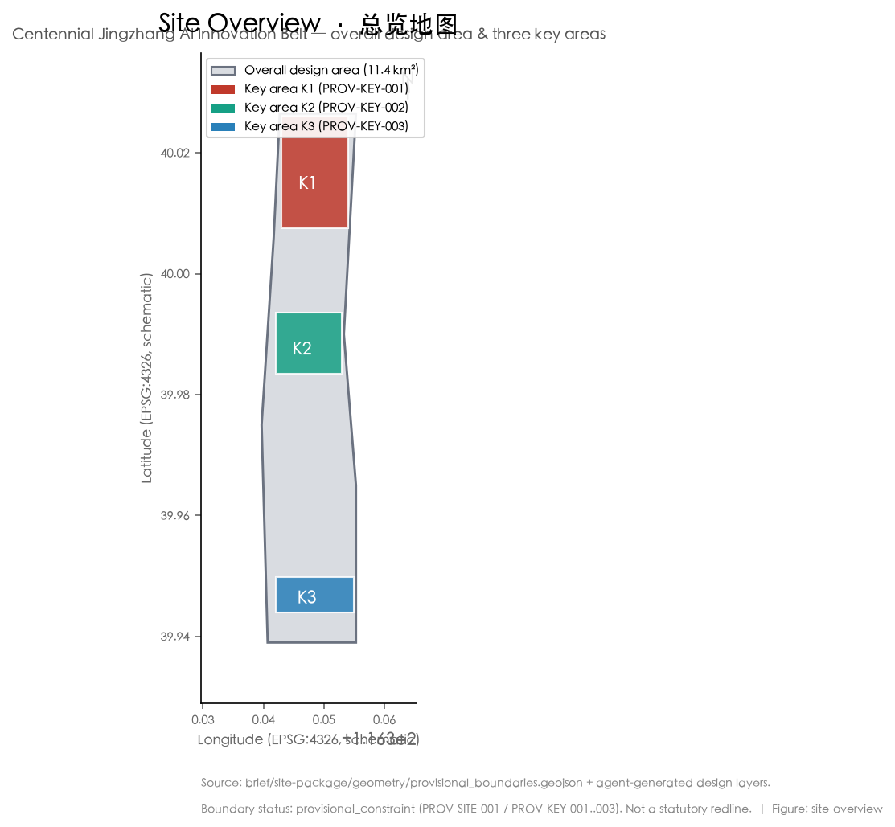
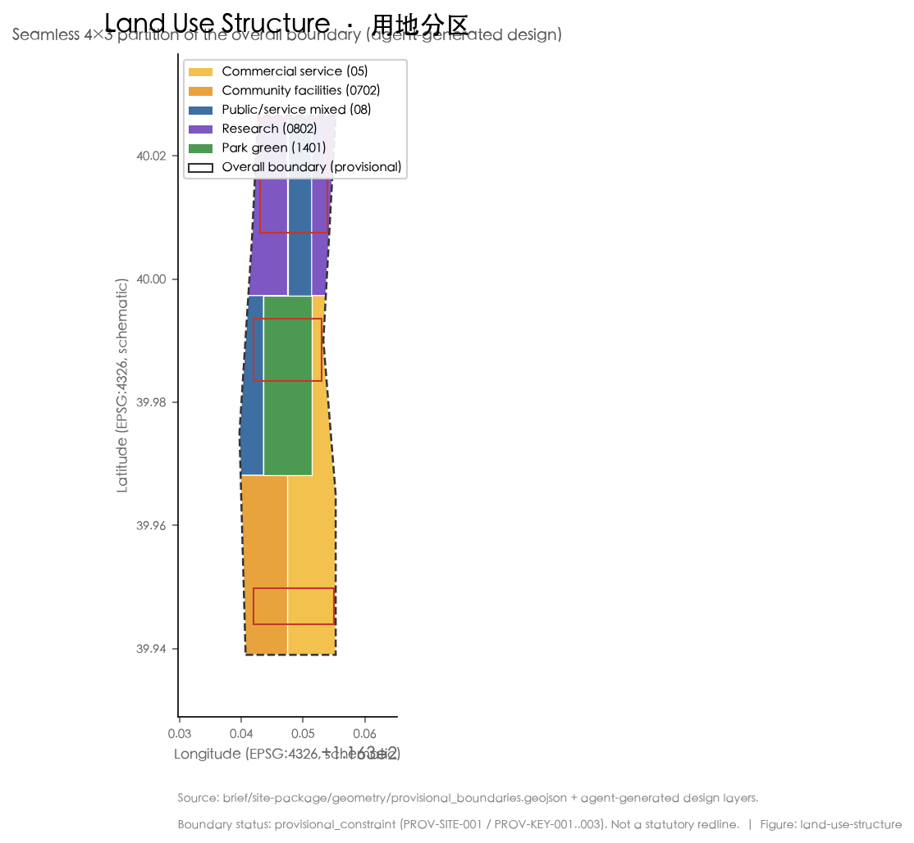
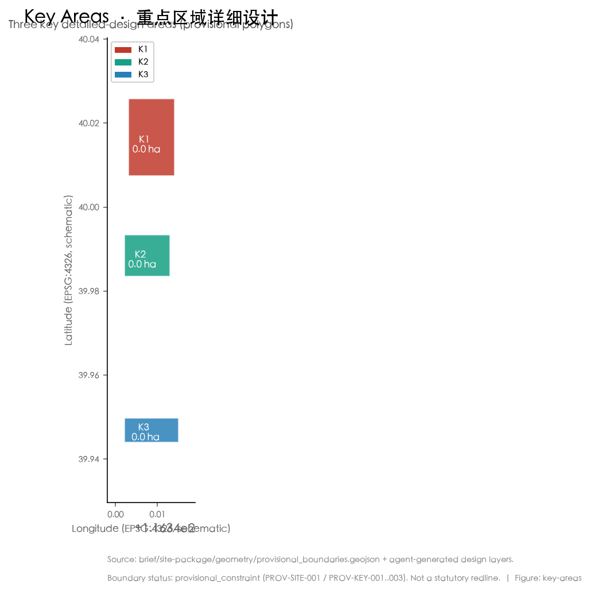
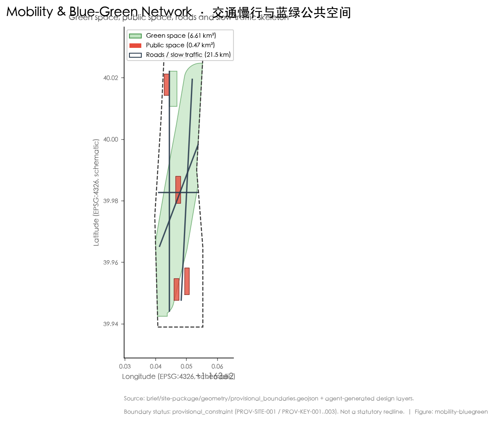
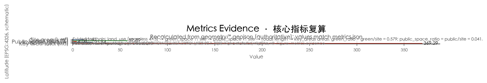

# 京张智脉共生带

## 设计依据与资料清单

本方案依据《百年京张AI创新带城市设计国际方案征集资格预审公告》《面向全球智能体开展百年京张AI创新带城市设计开源征集任务书》以及住房和城乡建设部、自然资源部相关技术规定展开 [source:OFFICIAL-ANNOUNCEMENT][source:AGENT-TASKBOOK]。资料读取以 `data/source_registry.json` 与 `brief/site-package/` 下已清权公开材料为准；面向智能体任务书、公告与三区两翼说明构成方案的主控依据 [source:SITE-PACKAGE][standard:PROJECT-OFFICIAL-ANNOUNCEMENT]。

方案空间范围采用官方公布的文字面积与边界描述，总体设计范围约 11.4 平方公里、统筹研究范围约 43.6 平方公里、重点区域约 368.4 公顷 [data:geometry/site_boundary.geojson][data:geometry/key_areas.geojson]。由于官方精确红线尚未随公开资料包交付，重点区域与总体设计范围边界取自 `provisional_boundaries.geojson`，仅作为 `provisional_constraint` 使用，不得视为法定红线或精确面积 [source:MOHURD-CONTROL-DETAILED-PLANNING]。

机器可读证据集中于 `sources.json`、`metrics.json`、`compliance_matrix.json`、`standard_matrix.json`、`design_depth_matrix.json`；正文以可读方式解释设计判断，不把 GeoJSON/JSON 当作正文替代 [depth:metrics_recalculation]。所有空间落地建议均表述为"概念建议""参考方案"或"可供专业团队深化研究"，不构成政府审定结论 [standard:PROJECT-AGENT-OPEN-CALL-TASKBOOK]。

## 三层范围工作框架

统筹研究范围、总体设计范围、重点区域范围构成逐级落地的三级工作框架。统筹研究范围（约 43.6 平方公里）负责产业战略与未来城市形态研究；总体设计范围（约 11.4 平方公里）承担城市更新与控规深度城市设计；重点区域（约 368.4 公顷）进行规划综合实施方案深度的详细设计 [data:geometry/site_boundary.geojson][depth:three_level_scope_framework]。

总体设计范围的精确多边形尚未交付，方案沿用 provisional 总体边界（PROV-SITE-001）作为约束；其面积为 11,412,825 平方米，与公告文字面积一致 [metric:site_area_sqm]。若将 provisional 边界替换为官方红线，所有以边界为母版的用地、绿地、公共空间与指标均需重算，相关图层已在 `geometry/` 中以 `agent_generated_design` 标记，便于替换后快速复算 [data:geometry/land_use.geojson]。

三处重点区域分别为众智园AI自主创新加速区（约 192.1 公顷）、北京AI原点社区（约 104.3 公顷）、大钟寺AI产业集聚区（约 72.0 公顷），其 provisional 多边形面积与官方公布的分区值一致 [metric:ka_zhongzhiyuan_sqm][metric:ka_beijing_origin_sqm][metric:ka_dazhongsi_sqm]。重点区域规划深度达到详细设计，但其边界与部分权属/现状条件仍为 provisional，因此方案中的建筑形态、拆改留与交通组织均作为方向性设计，待官方资料到达后深化 [source:THREE-AREAS-WINGS]。

## 统筹研究范围产业与未来城市研究

本方案总体命名为"京张智脉共生带"（Jingzhang Symbiotic Corridor），英文副名 "AI Pulse Symbiotic Belt"，取京张铁路"脉络"之意，强调AI算力、数据、人才与城市生活沿遗产廊道共生。视觉识别方向以"轨道线—脉冲波—共生环"为母题：主标识为一条贯穿南北的脉冲折线，嵌套代表三带的同心环，字体采用中性无衬线，避免未授权商用字体与图库素材 [standard:PROJECT-AGENT-OPEN-CALL-TASKBOOK][depth:overall_spatial_structure]。

方案回应公告对世界级 AI 创新生态、产业链协同、三区两翼、未来城市形态与连续绿色空间的要求。三大定位为百年京张文化带、都市AI生活体验带、AI融合创新带；五大功能为AI全栈自主创新体系、世界级AI创新生态、AI+场景赋能新范式、智能化AI活力城市、AI治理全球话语权 [source:AGENT-TASKBOOK]。三区两翼协同回路以北京AI原点社区（世界級生态）、众智园（全栈自主与治理）、大钟寺（智能原生新业态）为内核，外联中关村科技服务翼与小月河场景赋能翼，形成"研发—转化—体验—治理"闭环 [depth:overall_spatial_structure]。

全球AI创新生态案例（可读摘要，概念借鉴）：
1. 加拿大蒙特利尔/多伦多向量研究院与AI超级集群：以公共算力与人才网络支撑基础研究与产业转化。
2. 美国旧金山湾区：风险资本、顶尖高校与开源社区耦合的创新密度。
3. 以色列特拉维夫：高密度创业公司与军民转化机制。
4. 新加坡智慧国：城市级数据信托与监管沙盒。
5. 深圳南山—粤海：硬件供应链与AI终端制造就近协同。
6. 阿姆斯特丹AI生态：以人为本的伦理治理与公共实验场。
上述经验转化为可落地的空间、运营与场景机制：公共算力节点、开发者社区枢纽、监管沙盒街区与场景开放运营 [source:AGENT-TASKBOOK][depth:land_use_layout]。

## 总体设计范围城市更新与控规深度城市设计

总体设计范围（约 11.4 平方公里）按控规深度组织"一脉串三区、两翼承协同"的空间结构：以京张遗址公园活力带为中央脉络，串联三处重点区域，并向中关村科技服务翼、小月河场景赋能翼延展 [data:geometry/land_use.geojson][depth:overall_spatial_structure]。用地布局将科研用地（0802）、公共管理与公共服务混合用地（08）、商业服务业用地（05）、城镇社区服务设施用地（0702）与公园绿地（1401）沿廊道嵌套布置，形成"研发—服务—生活—绿地"复合单元 [metric:lu_0802][metric:lu_05][metric:lu_1401]。

方案以 agent 几何给出概念性用地分区：科研与混合公服用地承载AI全栈创新，商业服务业用地承载智能原生消费与商务，社区设施用地承载人才生活服务，公园绿地与广场承载公共活动。建筑基底约 435,007 平方米，仅为概念性体量占位，具体容积率、建筑高度与开发强度须以官方控规条件为准，本文不给出法定指标 [metric:building_footprint_area_sqm][depth:development_intensity_controls]。

更新对象以现状低效厂房、铁路遗存附属设施与零散老旧社区为主，分类为保留、改造、拆除、新建四类；具体拆改留清单与权属核查列为待确认事项，待官方现状普查与权属数据到达后深化 [depth:retain_renovate_demolish]。城市风貌以"低密、连绿、可步行、有记忆"为基调，屋顶形态与体量尊重京张铁路线性遗产的尺度，避免大体量阻断廊道视线 [depth:height_massing_character]。

## 重点区域详细设计

众智园AI自主创新加速区（约 192.1 公顷，PROV-KEY-001）定位为AI全栈自主创新体系与治理话语权承载区。空间结构以加速器集群为核心，周边布局公共算力中心、开源社区枢纽与监管沙盒街区；建筑更新以改造既有研发载体为主，预留留白用地承接重大平台 [data:geometry/key_areas.geojson#PROV-KEY-001][depth:three_key_area_detailed_design]。

北京AI原点社区（约 104.3 公顷，PROV-KEY-002）定位世界级AI创新生态与人才向往的高品质城区。以混合社区、人才公寓、国际人才会客厅与开放实验室构成"工作—生活—交往"闭环，慢行网络直通京张遗址公园，强化人才日常可感知的AI公共空间 [data:geometry/key_areas.geojson#PROV-KEY-002]。

大钟寺AI产业集聚区（约 72.0 公顷，PROV-KEY-003）定位智能原生新业态，承载AI+消费、AI+商务与展示体验。以环形商业动线串联体验店、发布厅与开发者市集，夜间经济与公共体验路线结合，形成可体验、可展示、可推广的AI城市场景 [data:geometry/key_areas.geojson#PROV-KEY-003]。

每处重点区均形成"定位+空间结构+建筑更新+交通慢行+公共空间+AI场景+实施风险"的可读小方案；边界为 provisional，结论作为方向性设计，待官方红线到达后复核面积与建筑量 [depth:three_key_area_detailed_design]。

## AI 创新生态、人才画像与 AI+ 场景

本方案提出五类用户画像，并据此映射到空间与场景：① AI 研究者/工程师（科研用地与开源枢纽）、② 创业创始人（加速器与沙盒街区）、③ 国际人才与访客（原点社区会客厅）、④ 在地居民（社区设施与公共空间）、⑤ 城市治理者（监管与算力运维）[depth:metrics_recalculation]。每类画像对应明确的空间落点、数据需求、隐私边界与人工复核机制 [source:AGENT-TASKBOOK]。

AI 场景卡（不少于 10 张，其中产业测试验证场景不少于 3 张）：
- S1 公共算力预约与碳效看板（产业测试验证）：面向中小企业与高校，提供合规算力预约、能耗与碳效可视化，数据脱敏、人工复核。
- S2 自动驾驶接驳环线测试（产业测试验证）：在限定街区开展L4接驳与慢行接驳测试，全程可暂停、可追溯。
- S3 AI 医疗辅诊便民站（产业测试验证）：社区级辅诊与转诊建议，仅作辅助、最终由医师判定。
- S4 AI+教育个性化学习伙伴：校园与社区学习空间的自适应辅导，保护未成年人隐私。
- S5 AI+法律咨询自助舱：标准化法律问答，复杂事项转人工律师。
- S6 AI+生活服务管家：无障碍出行、买菜、报修等适老化助手。
- S7 开发者市集与模型展演：开源模型线下发布与体验。
- S8 京张遗产AI讲解与AR时间舱：铁路遗产的增强现实叙事。
- S9 城市运行AI巡检（绿地、停车、垃圾）：事件自动发现并派单，人工确认。
- S10 公共体验路线智能导览：多语种、无障碍的访客动线推荐。
- S11 应急crowd监测与疏导：大客流预警，仅作提示、不识别个体。
- S12 低碳出行激励：步行骑行积分与碳普惠。

所有场景坚持隐私最小化、人工复核与运营主体可追溯，禁止过度监控与无法复核的系统；测试场景明确标注为"测试/验证"，不构成已批准运营 [standard:PROJECT-AGENT-OPEN-CALL-TASKBOOK]。

## 用地、建筑规模与拆改留方案

用地布局以 `geometry/land_use.geojson` 为权威：科研用地（0802）约 2,387,077 平方米、商业服务业用地（05）约 2,875,354 平方米、公园绿地（1401）约 2,157,782 平方米 [metric:lu_0802][metric:lu_05][metric:lu_1401]；城镇社区服务设施用地（0702）约 1,994,023 平方米、公共管理与公共服务混合用地（08）约 1,998,605 平方米 [metric:lu_0702][metric:lu_08]。上述分区由总体边界按 4×3 网格无缝切分而来，确保覆盖无重叠、面积可复算 [data:geometry/land_use.geojson][depth:land_use_layout]。

建筑基底约 435,007 平方米为概念性体量占位；总建筑规模（地上建筑面积）、容积率与建筑高度在缺控规条件下列为待确认，不伪装为审定指标 [metric:building_footprint_area_sqm][depth:development_intensity_controls]。拆改留分类以现状低效载体与铁路附属设施为对象，分为保留、改造、拆除、新建四类，具体项目与建筑量待现状普查与权属核查后深化 [depth:retain_renovate_demolish]。空间供给策略强调"留白+混合"，以留白用地承接不确定性，以混合用地提升街道活力 [source:MOHURD-CONTROL-DETAILED-PLANNING]。

## 交通、轨道、市政与公共服务设施

交通组织以"轨道站点一体化+微循环+连续慢行"为核心。方案在 `geometry/roads.geojson` 中给出 4 条概念性道路中心线，总长约 21.5 公里，作为慢行与公交接驳骨架，具体线形、红线与工程方案为待确认 [metric:road_length_m][depth:traffic_rail_slow_parking]。轨道站点周边以 TOD 一体化组织步行换乘，填补现状慢行断点，优化非机动车与停车组织 [source:AGENT-TASKBOOK]。

市政与新型基础设施强调分布式能源、端侧算力与传统市政融合：在社区与重点区就近布置边缘算力节点与分布式光伏，与公共算力中心形成"中心—边缘"协同；传统市政容量、能源负荷与地下空间可行性列为待确认，不构成工程结论 [depth:municipal_new_infrastructure]。创新服务平台与人才生活服务落入原点社区与加速器，公共服务设施按 15 分钟生活圈组织 [depth:blue_green_public_space]。

## 蓝绿空间、公共空间与城市风貌

京张遗址公园活力带是方案的中央蓝绿与公共空间骨架，串联三处重点区域并向两翼延展；清河、小月河构成蓝绿脉络，步道与骑行道贯通其间 [data:geometry/green_space.geojson][depth:blue_green_public_space]。绿地面积约 6,607,414 平方米，绿地率约 0.579 [metric:green_space_area_sqm][metric:green_ratio][metric:public_space_area_sqm]，公共空间面积约 466,128 平方米，公共空间率约 0.041 [metric:public_space_ratio]。

公共空间承载科技测试、应用展示与历史文化展示；城市基调为低密、连绿、可步行，建筑风貌尊重线性遗产尺度，屋顶形态与体量避免阻断廊道视线 [depth:height_massing_character]。AI 公共空间与智能原生新业态通过三个 AI 朝圣地标强化：① 京张铁路遗址"AI时间舱"（遗产AR叙事与开发者纪念）、② "原点之光"开发者圣火塔（开源贡献荣誉展示）、③ AI生活体验环（可体验消费与公共活动环线）[standard:PROJECT-AGENT-OPEN-CALL-TASKBOOK]。地标、导视、Logo、图像均使用清权或自生成素材，避免过度娱乐化，并明确标注为概念方案而非已批准建设 [source:AGENT-TASKBOOK]。

## 更新项目清单、实施政策与分期计划

更新项目清单（概念建议，6 类）对应 `geometry/phasing.geojson` 的三期划分：近期（遗址公园活力带示范段与原点社区启动区）、中期（众智园加速器集群与大钟寺体验环）、长期（两翼协同与全域运营）[metric:update_project_count][data:geometry/phasing.geojson][depth:phasing_implementation]。每类项目标注空间位置、依赖条件、实施主体与政策建议；政府安排、资金与审批均写作深化方向，不表述为已确定事项 [depth:renewal_project_list]。

实施政策建议包括：设立场景开放运营机制、公共算力普惠预约、监管沙盒街区、开发者社区运营与人才服务包。分期强调"先示范、后连片、再协同"，公众参与与运营维护机制随每期建立 [source:AGENT-TASKBOOK]。

长期运营设计提出年度活动体系：春季开发者大会、夏季开源市集、秋季AI生活体验周、冬季遗产科技节；活动品牌与传播视觉自成系统，开发者社区通过线上平台与线下枢纽双轮运营，AI场景以"测试—开放—转化"路径持续招引人才与企业 [standard:PROJECT-AGENT-OPEN-CALL-TASKBOOK]。招商、政策与资金均写作概念建议，不构成政府承诺 [depth:risk_missing_data]。

## 指标体系、面积复算与合规矩阵

核心指标均可在 `metrics.json` 复算：总体设计范围面积约 11,412,825 平方米、绿地面积约 6,607,414 平方米、绿地率约 0.579 [metric:site_area_sqm][metric:green_space_area_sqm][metric:green_ratio]，公共空间面积约 466,128 平方米、公共空间率约 0.041、道路总长 21.5 公里 [metric:public_space_area_sqm][metric:public_space_ratio][metric:road_length_m]，重点区域总面积约 369.3 公顷、更新项目 6 类 [metric:key_area_total_sqm][metric:update_project_count]。

指标的设计含义：绿地率约 0.579 支撑人才在蓝绿中工作生活，缓解高密度创新区的环境压力；公共空间率约 0.041 支撑创新交往与可体验场景；建筑基底约 43.5 公顷回应产业空间供给，但总建筑规模仍待控规确认 [depth:metrics_recalculation]。合规覆盖见 `compliance_matrix.json`（覆盖公告 1.3—1.5 与 agent.1—6）、`standard_matrix.json`（5 项必选标准）、`design_depth_matrix.json`（15 项深度项 complete）[standard:PROJECT-OFFICIAL-ANNOUNCEMENT][standard:MOHURD-URBAN-DESIGN-MEASURES][standard:MNR-LAND-USE-CLASSIFICATION-GUIDE]。

## 风险、版权与合规说明

资料合法性：仅使用公开或已清权来源，非公开政府数据、企业内部数据、个人隐私数据一律排除；provisional 边界明确标注，不冒充官方红线 [source:SITE-PACKAGE]。版权与授权：文本、几何、图件、PDF 与静态 HTML 均由声明智能体生成或使用已清权来源，视觉资产不依赖远程素材 [standard:PROJECT-AGENT-OPEN-CALL-TASKBOOK]。

AI 生成责任：所有设计判断为概念建议，最终由人类与专业团队判定；官方批准、实施承诺与法定规划结论一律禁用表述。待补资料包括官方精确红线、现状建筑普查、权属与工程条件，均列为待确认风险 [depth:risk_missing_data]。专业复核需求：法定规划、工程可行性与文保要求须由具备资质团队深化 [source:MOHURD-CONTROL-DETAILED-PLANNING]。详见 `report/copyright_statement.md`。

## 参考资料

1. 北京市规划和自然资源委员会海淀分局：《百年京张AI创新带城市设计国际方案征集资格预审公告》（2026）。
2. 面向全球智能体开展百年京张AI创新带城市设计开源征集任务书（用户提供清权摘录，2026-05-18）。
3. 住房和城乡建设部：《城市设计管理办法》。
4. 住房和城乡建设部：《城市、镇控制性详细规划编制审批办法》及相关深度规定。
5. 自然资源部：《国土空间调查、规划、用途管制用地用海分类指南》。
6. 海淀三区两翼协同与重点区域说明（公开资料包）。
7. 京张铁路遗产与中关村创新发展公开文献。
8. 全球AI创新生态案例公开研究（蒙特利尔、旧金山湾区、特拉维夫、新加坡、深圳南山、阿姆斯特丹）。

上述公开与清权资料构成本方案的可追溯依据，完整机器索引见 `sources.json` [source:SITE-PACKAGE]。
