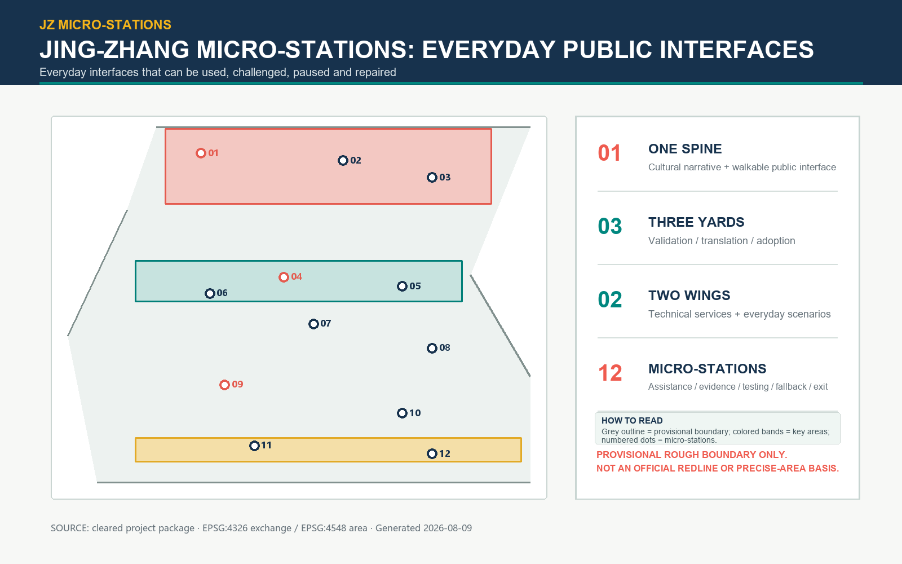
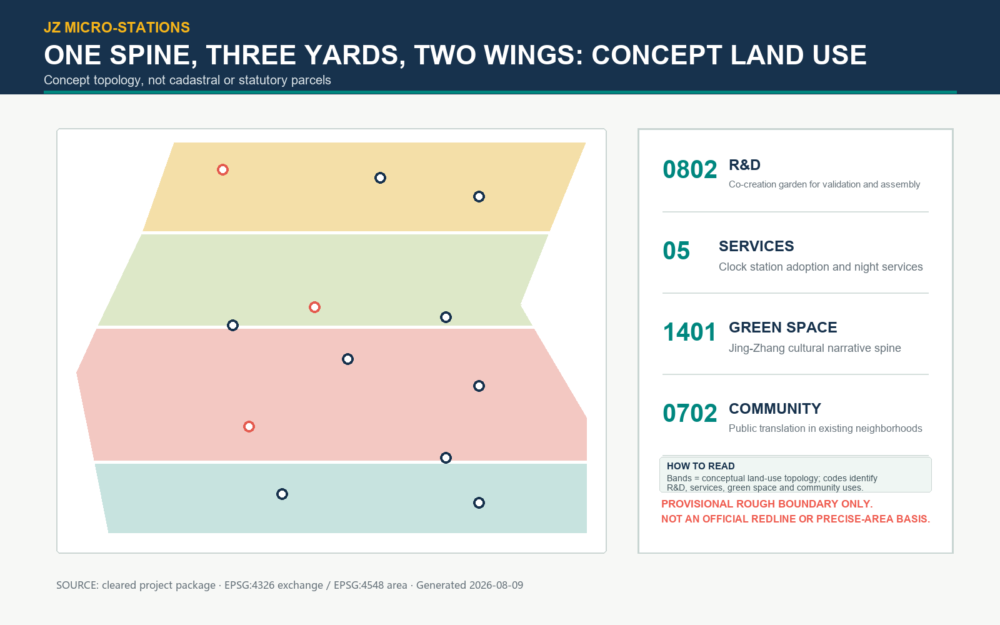
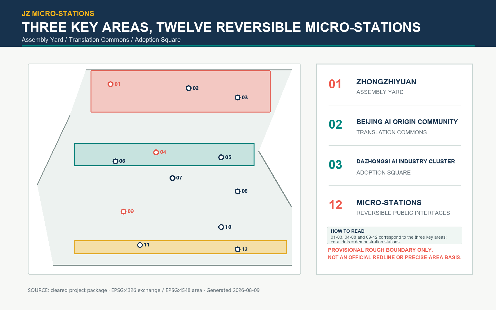
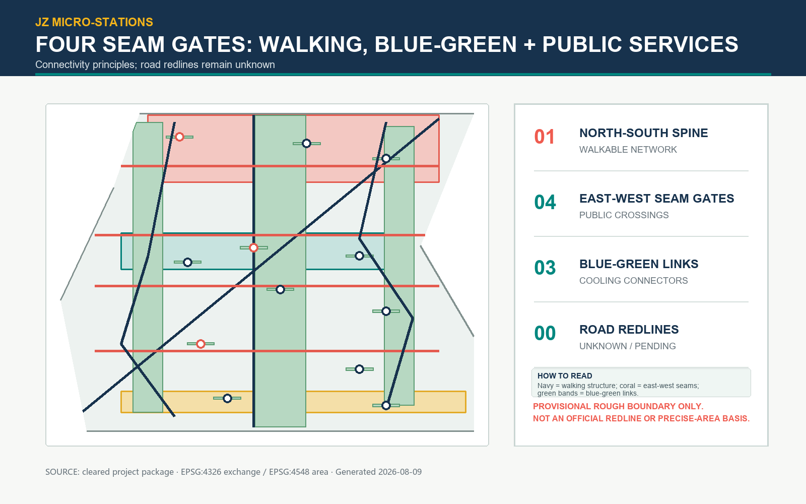
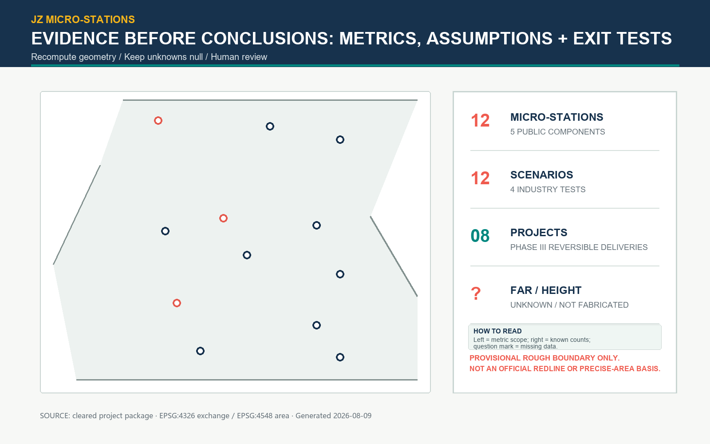

# JZ Micro-Stations: Everyday Interfaces for an AI City

JZ Micro-Stations treats the AI Innovation Belt as a public interface that can be used, questioned, paused, and repaired. The spatial strategy is one spine, three yards, two wings, twelve micro-stations, and four east-west seams. A walkable cultural narrative spine links Zhongzhiyuan, Beijing AI Origin Community, and Dazhongsi AI Industry Cluster. The Zhongguancun technology-service wing and Xiaoyue River scenario wing connect research, daily life, and real-world testing.

This is a formal AI-agent design submission, not a statutory plan, construction document, or government implementation commitment. Submitted geometry is a provisional rough boundary derived from cleared public material. Every area and ratio is a reproducible scenario quantity and must be recalculated when official boundary, cadastral, road, utility, and heritage data are released.[source:OFFICIAL-ANNOUNCEMENT] [source:AGENT-TASKBOOK] [data:geometry/site_boundary.geojson#PROV-SITE-001]

[standard:MOHURD-CONTROL-DETAILED-PLANNING]

## Design Basis and Source List

The announcement establishes three positions: Centennial Jingzhang Cultural Belt, Urban AI Everyday-Life Experience Belt, and AI Integrated Innovation Belt. The taskbook adds five functions and six agent tasks. Official materials, standards, geometry, metrics, assumptions, and self-check records are kept as separate evidence layers. International examples are background mechanisms only. The missing architectural design-depth reference is recorded as a data gap, not silently treated as satisfied. [source:SOURCE-REGISTRY] [source:MOHURD-ARCH-DESIGN-DEPTH-2016] [data:geometry/constraints.geojson#CONSTRAINT-DATA-GAP]

## Three-Level Scope Framework

The coordinated research area is a 43.6 sq km industry and future-city lens. The overall design discussion uses an approximately 11.4 sq km provisional polygon. The detailed-design layer works through three named key areas and twelve small, removable public interfaces. The five-component station protocol is: human help, evidence display, bounded testing, a no-AI fallback, and a maintenance/return point. [source:AGENT-TASKBOOK] [metric:site_area_sqm] [data:geometry/public_space.geojson#PUBLIC-MS-01]

## Coordinated Research Area: Industry and Future City Research

The innovation story is a public loop: assemble and verify in Zhongzhiyuan, translate needs in Beijing AI Origin Community, and adopt low-risk services in Dazhongsi. One-North, Smart Kalasatama, Mobility Lab Helsinki, Paris-Saclay, Boston Innovation District, Kendall Square, and Marineterrein Amsterdam are used only for mechanisms such as precinct diversity, resident pilots, test-before-scale, open innovation, public-realm stewardship, and transit-linked mixed use. None supplies local boundaries, controls, or performance claims.[source:CASE-ONE-NORTH] [source:CASE-KALASATAMA] [source:CASE-MARINETERREIN]

[metric:global_case_count]

The original identity is a twelve-dot ribbon: twelve points represent stations, a continuous band represents the Jingzhang line and a data flow, and an open corner represents entry, exit, and challenge. Figures are locally generated and contain no external images or logos. [depth:global_innovation_operations] [source:VISUAL-STYLE-RECOMMENDATIONS]

## Overall Design Area: Urban Renewal and Regulatory-Plan-Level Urban Design

The spatial structure is one spine, three yards, two wings, and four seams. The narrative spine combines shade, rain gardens, seating, and readable information. The four east-west seams prioritize safe crossings, step-free access, and active ground floors. Land-use concepts use MNR codes 0802, 05, 1401, and 0702 to partition the submitted provisional polygon without gaps or overlaps. They are not cadastral parcels or statutory controls. [standard:MNR-LAND-USE-CLASSIFICATION-202311] [data:geometry/land_use.geojson#LU-001] [data:geometry/land_use.geojson#LU-004]

Performance gates replace unverified numbers: continuous public frontage, five-minute station access, no-AI fallback, rainwater management, quiet residential edges, and human review. FAR, height, density, setbacks, parking, and underground space remain unknown.[standard:MOHURD-URBAN-DESIGN-MEASURES] [standard:MOHURD-CONTROL-DETAILED-PLANNING] [metric:floor_area_ratio]

[metric:building_height_m]

## Detailed Design of Key Areas

Zhongzhiyuan is an assembly yard with visible model, energy, and failure evidence around a flexible courtyard. Beijing AI Origin Community is a translation commons where residents, students, carers, and founders turn model questions into understandable service commitments. Dazhongsi is an adoption square with a night contribution plaza and low-risk, reversible public operations. [data:geometry/key_areas.geojson#PROV-KEY-001] [data:geometry/key_areas.geojson#PROV-KEY-002] [data:geometry/key_areas.geojson#PROV-KEY-003]

Three original pilgrimage markers are removable interpretation devices: Jingzhang Origin Scale Table, Qinghe Open Test Walk, and Dazhongsi Contribution Echo Hall. They do not claim a precise protected site or heritage fabric. [assumption:A-HERITAGE-006] [metric:landmark_count]

## AI Innovation Ecosystem, Personas, and AI+ Scenarios

Six personas are explicit: algorithm researchers, founders, community carers, students, night-shift service staff, and older or disabled residents. Their needs range from auditable tests and procurement leads to reliable human transfer, low-light operation, and non-AI access. [source:AGENT-TASKBOOK] [metric:persona_count]

Twelve scenario cards include four industrial tests: energy visualization, model-bias sandbox, anonymous slow-mobility counts, and night waste-reduction prompts. Eight public cards cover learning, care, translation, waiting, lost-and-found, accessible navigation, neighborhood deliberation, and rain-garden maintenance. Every card specifies object, minimum data, privacy boundary, human review, operator, stop condition, and recovery path. [metric:test_scenario_count] [metric:scenario_card_count] [depth:ai_plus_scenarios]

The operating sequence is paper rehearsal, one-station pilot, and cross-station review. A red stop control switches immediately to human or paper service. Logs retain aggregate counts and audit summaries only, never face, identity, or precise trajectories. [assumption:A-SERVICE-008]

## Land Use, Building Scale, and Retain-Renovate-Demolish Strategy

The building layer contains twelve micro-station envelopes using community-service, cultural, lab, incubator, and mobility-hub types. `retain`, `renovate`, and `adaptive_new` are options; `pending` is a review state. No feature asserts demolition, height, floor area, or a building permit. [data:geometry/buildings.geojson#BLDG-MS-12] [metric:building_footprint_area_sqm] [metric:concept_building_coverage_ratio]

Small volume, reversible connections, recoverable materials, and visible maintenance reduce uncertainty. Ownership, leases, fire safety, structure, and equipment must be verified before parcel-level decisions. [assumption:A-PARCEL-OWNERSHIP-004] [assumption:A-BUILDING-BASELINE-005]

## Transport, Rail, Municipal Infrastructure, and Public Services

The mobility concept links rail, bus, walking, cycling, and station forecourts into a legible transfer chain. The greenway, north-south walking spine, and four seams form eight conceptual centerlines. Road redlines, sections, fire access, utilities, and construction staging remain unknown. [data:geometry/roads.geojson#ROAD-SEAM-03] [metric:road_length_m] [assumption:A-ROAD-REDLINE-003]

Each station has one human entrance, one fallback process, and one maintenance return point. Utility capacity, drainage, power, data, waste, and emergency access require engineering review. [standard:MOHURD-CONTROL-DETAILED-PLANNING] [assumption:A-MUNICIPAL-007]

## Blue-Green Network, Public Space, and Urban Character

The blue-green network combines a cultural spine, cooling connectors, and twelve station pocket gardens. Calculated green and public-space areas and ratios are scenario quantities tied to the provisional polygon, not planning indicators.[data:geometry/green_space.geojson#GREEN-SPINE] [data:geometry/public_space.geojson#PUBLIC-MS-01] [metric:green_space_area_sqm]

[metric:public_space_area_sqm] [metric:green_ratio] [metric:public_space_ratio]

Character is legible without imitation: ink blue for rail information, teal for ecological edges, coral for public warnings, and warm yellow for human help. Lighting is continuous along the spine and quieter at residential edges. [standard:MOHURD-URBAN-DESIGN-MEASURES] [depth:public_realm_and_character]

## Renewal Projects, Implementation Policy, and Phasing

Eight accountable project cards are: JZ-01 Origin Scale Table, JZ-02 Evidence Yard, JZ-03 Translation Table, JZ-04 Xiaoyue River Test Walk, JZ-05 Step-Free Seam, JZ-06 Night Contribution Plaza, JZ-07 Maintenance Return Cabinet, and JZ-08 Public Review Table. They are management units in this proposal, not government project approvals. [metric:renewal_project_count] [depth:implementation_and_phasing]

Phase 1 (0–12 months) tests the southern seams and two industrial stations; Phase 2 (12–24 months) connects the translation commons; Phase 3 (24–36 months) completes the assembly yard. Every phase gate requires professional engineering, privacy and accessibility review, public feedback, and a reversible withdrawal test. [data:geometry/phasing.geojson#PHASE-01] [data:geometry/phasing.geojson#PHASE-03] [assumption:A-SERVICE-008]

The policy kit is a micro-station operating permit, minimum open-data set, public failure review, and exit fund. Annual operations include an open-source week, summer night tests, autumn public review, and winter maintenance. [source:AGENT-TASKBOOK] [depth:global_innovation_operations]

## Metrics, Area Recalculation, and Compliance Matrix

Exchange is EPSG:4326 and area calculation is EPSG:4548. Areas, ratios, centerline lengths, and counts are recomputed from the submitted GeoJSON. Known counts are three key areas, twelve stations, twelve scenario cards, four industrial tests, six personas, three landmarks, seven mechanism cases, and eight renewal cards. Unknown fields remain null with explicit triggers.[metric:site_area_sqm] [metric:green_ratio] [metric:public_space_ratio]

[metric:key_area_count] [metric:micro_station_count] [metric:scenario_card_count]

[metric:test_scenario_count] [metric:persona_count] [metric:landmark_count]

[metric:global_case_count] [metric:renewal_project_count] [metric:official_boundary_area_sqm]

The compliance, standard, and design-depth matrices connect every requirement to sections, drawings, geometry, metrics, sources, assumptions, and self-check IDs. The missing architectural-depth source is a data gap; no statutory number is invented. [standard:PROJECT-OFFICIAL-ANNOUNCEMENT] [standard:PROJECT-AGENT-OPEN-CALL-TASKBOOK] [depth:compliance_and_metrics]

## Risk, Copyright, and Compliance

Boundary, cadastral, road-control, utility, and heritage gaps are the primary risks. The sequence is official geometry, cadastral and engineering review, one-station pilot, then cross-station expansion. Provisional geometry is never an official redline, precise area basis, or permit document. [assumption:A-BOUNDARY-PROVISIONAL-001] [assumption:A-CONTROLS-001] [assumption:A-HERITAGE-006]

All figures, diagrams, icons, maps, and text are generated or rewritten for this package. No external photographs, portraits, unlicensed logos, remote scripts, or online basemaps are embedded. PDFs use a local system font only during build; the font is not redistributed as a standalone asset. AI output requires human review by planning, architecture, transport, municipal, privacy, accessibility, and public representatives. [source:VISUAL-STYLE-RECOMMENDATIONS]

## References

1. Beijing Municipal Planning and Natural Resources Commission, open-call announcement, 2026-05-09. [source:OFFICIAL-ANNOUNCEMENT]
2. Agent-facing taskbook, ten co-creation principles and six tasks. [source:AGENT-TASKBOOK]
3. MOHURD urban-design management and regulatory-plan references. [source:MOHURD-URBAN-DESIGN-MEASURES] [source:MOHURD-CONTROL-DETAILED-PLANNING]
4. MNR land-use classification guide, 2023. [source:MNR-LAND-USE-CLASSIFICATION-202311]
5. JTC One-North; Forum Virium Smart Kalasatama and Mobility Lab; Paris-Saclay; Boston Innovation District; Kendall Square; Marineterrein Amsterdam. Mechanism references only. [source:CASE-ONE-NORTH] [source:CASE-KALASATAMA] [source:CASE-MARINETERREIN]
6. Package evidence: GeoJSON layers, metrics, assumptions, matrices, and self-check. [data:geometry/land_use.geojson#LU-001]
