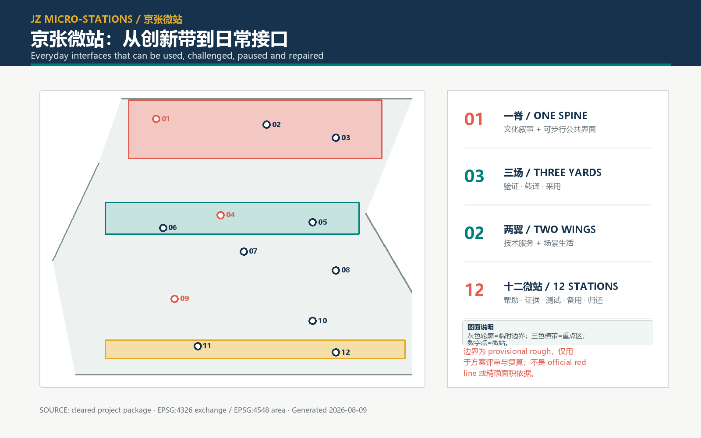
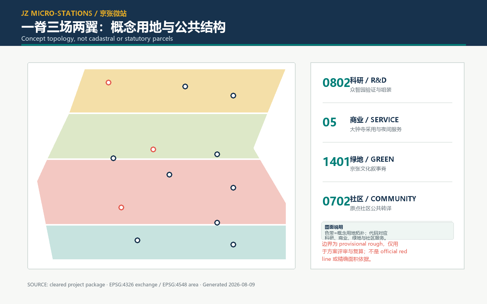
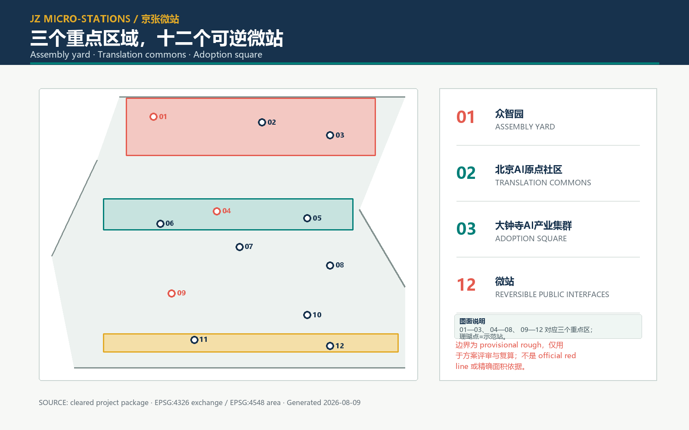
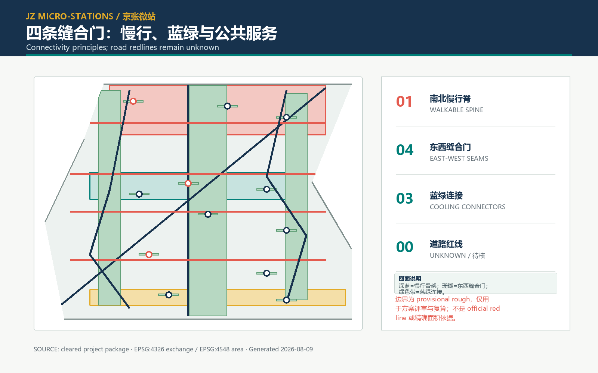
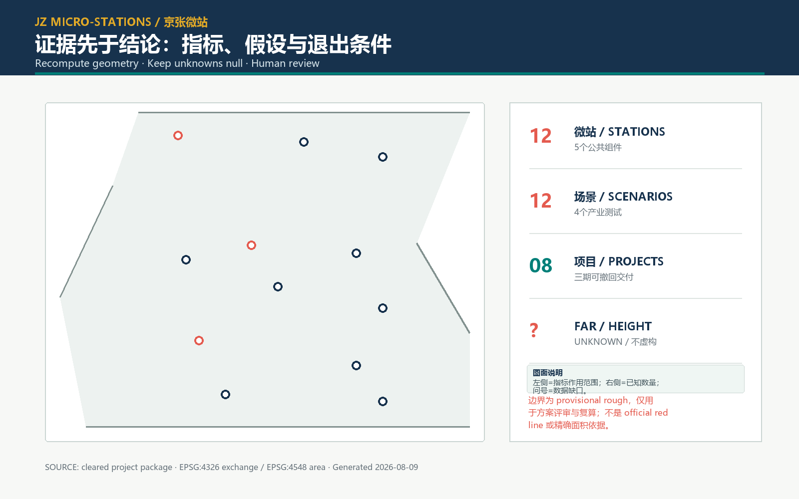

# 京张微站：AI城市的日常接口

京张微站把 AI 创新带理解为一条可以被使用、质询、暂停和修复的公共接口，而不是一组孤立的地标。空间策略是“一脊、三场、两翼、十二微站、四条缝合门”：以可步行的文化叙事脊串起众智园、北京AI原点社区、大钟寺AI产业集群三个重点区域；以中关村技术服务翼和小月河场景翼把研发、生活和验证连接起来；在每个关键节点设置可拆卸、可维护、可回收的微站。

本方案是正式设计深度的 AI 代理提案，不是法定控规、建筑施工图或政府实施承诺。提交几何来自公开资料中的临时粗略边界；所有面积和比例均为本次方案的可复算场景量，待组织方提供正式边界、权属、道路红线、地下管线和遗产清单后重算。[source:OFFICIAL-ANNOUNCEMENT] [source:AGENT-TASKBOOK] [data:geometry/site_boundary.geojson#PROV-SITE-001]

[standard:MOHURD-CONTROL-DETAILED-PLANNING]

## 设计依据与资料清单

公告确定了百年京张文化带、都市 AI 生活体验带和 AI 融合创新带三重定位，并提出总体研究、总体设计和重点区域详细设计三层工作范围。[source:OFFICIAL-ANNOUNCEMENT] [depth:three_level_scope_framework] [data:geometry/key_areas.geojson#PROV-KEY-001]

使用顺序是：项目输入与官方公告确定事实边界，任务书确定代理人任务，标准快照确定专业维度，几何与指标记录方案推导；国际案例仅作为机制背景，不替代北京本地规范。所有层均在 `sources.json` 标注 `usable_for` 和 `not_usable_for`。官方建筑设计深度资料在公开包中缺失，记录为数据缺口，不宣称已经满足施工深度。[source:SOURCE-REGISTRY] [source:MOHURD-ARCH-DESIGN-DEPTH-2016] [data:geometry/constraints.geojson#CONSTRAINT-DATA-GAP]

## 三层范围工作框架

第一层是 43.6 平方公里的产业与未来城市研究视野：追踪 AI 全栈自主创新、世界级创新生态、AI+ 场景范式、智能活力城市和全球治理声音五项功能；第二层是 11.4 平方公里左右的总体设计讨论边界，围绕公共空间、慢行、蓝绿和更新接口建立可实施的空间骨架；第三层是三个重点区域的详细设计接口，以微站为最小公共单元，逐项定义服务、数据、维护和退出条件。[source:AGENT-TASKBOOK] [metric:site_area_sqm] [data:geometry/site_boundary.geojson#PROV-SITE-001]

“微站”不是固定建筑类型，而是一套可拆卸的空间协议：每站包括人类帮助台、证据屏、受限测试台、无 AI 备用通道和维护归还柜五种最小组件。站点可在广场、绿地边缘、社区服务前场或既有建筑首层落位，所有新增体量均保留为设计选项，待权属和控制条件确认后再决定保留、改造或撤回。[depth:three_level_scope_framework] [data:geometry/public_space.geojson#PUBLIC-MS-01] [data:geometry/buildings.geojson#BLDG-MS-01]

## 统筹研究范围产业与未来城市研究

产业叙事不是“技术园区扩张”，而是把研究、转译、采用和治理排成一条公共回路。众智园作为验证组装场：把模型、算力、数据伦理和开源工具聚合在可以被看见的验证庭院；北京 AI 原点社区作为技术转译场：让居民、学生、照护者和创业团队把技术问题翻译成生活问题；大钟寺 AI 产业集群作为服务采用广场：让成熟服务进入夜间经济、社区照护和公共运维，并保留否决和暂停入口。[source:AGENT-TASKBOOK] [standard:MOHURD-URBAN-DESIGN-MEASURES] [data:geometry/key_areas.geojson#PROV-KEY-002]

国际案例只转译机制：One-North 的分区组合提示“工作—学习—生活”相邻组织；Smart Kalasatama 和 Mobility Lab Helsinki 提示居民参与、真实环境测试与气候目标要被写进运行制度；Paris-Saclay 提示孵化、开放创新和活动日历需要空间载体；Boston Innovation District 与 Kendall Square 提示公共空间治理、住房与交通必须和创新集群同步；Marineterrein Amsterdam 提示临时使用和“先测试、再扩展”可以降低一次性押注。它们不提供京张的边界、指标或绩效结论。[source:CASE-ONE-NORTH] [source:CASE-KALASATAMA] [source:CASE-MOBILITY-LAB]

[source:CASE-PARIS-SACLAY] [source:CASE-BOSTON-ID] [source:CASE-KENDALL]

[source:CASE-MARINETERREIN] [metric:global_case_count]

空间品牌采用原创“十二点一脊”标记：十二个等距点代表十二微站，细带代表京张线路与数据流，开口圆角代表任何人都可以进入、退出和质询。图形由本地绘制，不使用外部标志、人物照片或未清权底图；颜色为墨蓝、青绿、珊瑚和暖黄四类角色色，保证印刷与无障碍对比。[depth:global_innovation_operations] [source:VISUAL-STYLE-RECOMMENDATIONS]

## 总体设计范围城市更新与控规深度城市设计

总体骨架是一脊三场两翼。文化叙事脊沿南北慢行主线布置连续的遮荫、雨水花园、坐凳和信息节点；三场分别承担验证、转译、采用；中关村技术服务翼连接高校、研发和创业服务，小月河场景翼连接水岸、社区和夜间公共生活。四条东西向“缝合门”穿过站点集群，优先改善首层可达、无障碍连续和跨路口的安全感。[data:geometry/roads.geojson#ROAD-GREENWAY] [data:geometry/green_space.geojson#GREEN-SPINE] [depth:overall_spatial_structure]

用地层按 MNR 代码表达概念分区：0802 科研、05 商业服务、1401 公园绿地、0702 社区服务。四个单元共同覆盖提交的临时场地多边形，无缝隙、无重叠；这只是方案拓扑，不能替代地籍、控规或供地边界。[standard:MNR-LAND-USE-CLASSIFICATION-202311] [data:geometry/land_use.geojson#LU-001] [data:geometry/land_use.geojson#LU-004]

城市设计控制采用“性能门槛 + 选项库”而非未经证实的数值：首层连续开放、站点 5 分钟可达、无 AI 备用服务、雨水就地消纳、夜间照度与邻里安静并列为审查项；建筑高度、容积率、密度、退界、停车和地下空间保持未知。[standard:MOHURD-URBAN-DESIGN-MEASURES] [standard:MOHURD-CONTROL-DETAILED-PLANNING] [metric:floor_area_ratio]

[metric:building_height_m]

## 重点区域详细设计

**众智园 / 验证组装场。** 三个“看得见的验证”环绕一个可变庭院：模型演示、算力/能耗证据和失败复盘均在公开界面展示。微站 MS-01—03 采用人类帮助台、证据显示和受限测试，任何测试需要操作员、数据最小化、停止按钮和回滚脚本。[data:geometry/key_areas.geojson#PROV-KEY-001] [data:geometry/buildings.geojson#BLDG-MS-01] [depth:key_area_detailed_design]

**北京 AI 原点社区 / 技术转译场。** 把居民议事、学习、照护和创业辅导放在同一条慢行庭院。MS-04—08 的无 AI 备用通道与多语种图示优先于自动化效率；每周一次“问题翻译桌”把模型输出改写成可理解的服务承诺。[data:geometry/key_areas.geojson#PROV-KEY-002] [data:geometry/public_space.geojson#PUBLIC-MS-04] [standard:MOHURD-URBAN-DESIGN-MEASURES]

**大钟寺 AI 产业集群 / 服务采用广场。** 以夜间贡献广场、社区服务和小型发布台形成从试用到采用的软着陆。MS-09—12 只允许低风险、可撤回的公共运维和消费服务；“贡献回声厅”展示匿名化的社区反馈，不把任何未核实的历史遗产物件写入设计结论。[data:geometry/key_areas.geojson#PROV-KEY-003] [data:geometry/public_space.geojson#PUBLIC-PLAZA-02] [depth:heritage_and_landmark_design]

三个原创朝圣地标是可拆卸叙事装置：01 京张原点刻度台，以一条刻度带讲“时间—技术—公共选择”；02 清河开放测试廊，以透明维护柜讲失败也可被看见；03 大钟寺贡献回声厅，以可擦写墙面把居民反馈返回运营者。它们不声称位于具体文保点，也不复制铁路标志。[source:OFFICIAL-ANNOUNCEMENT] [assumption:A-HERITAGE-006] [metric:landmark_count]

## AI 创新生态、人才画像与 AI+ 场景

六类人才画像对应六种使用压力：算法研究者需要可审计测试；创业团队需要低门槛算力和采购线索；社区照护者需要可靠的人工转接；学生需要可理解的学习路径；夜班服务人员需要低照度、低干扰操作；老年人与残障者需要无 AI、无障碍和面对面入口。微站的成功标准不是“自动化率”，而是问题能否被解释、被拒绝、被修复。[source:AGENT-TASKBOOK] [metric:persona_count]

十二张场景卡按五个公共组件编排。四张标为**产业测试**，分别是：T01 能耗可视化（众智园）、T02 模型偏差沙盒（众智园）、T03 慢行安全匿名计数（北京 AI 原点社区）、T04 夜间垃圾减量提示（大钟寺）。每张卡都写明对象、最小数据、隐私边界、人类复核、操作员、停止条件和恢复路径；其余八张为学习、照护、翻译、候诊、失物、无障碍导航、社区议事和雨水花园维护场景，默认人工优先。[metric:test_scenario_count] [metric:scenario_card_count] [depth:ai_plus_scenarios]

产业测试运行“先小后大”：7 天纸面演练，30 天单站试点，90 天跨站复盘；达到公开的安全、可解释、投诉响应和能源门槛才允许扩大。任何人可按下红色停止按钮，服务立即切换到人工/纸质流程；日志只保留聚合计数和审计摘要，不采集人脸、身份证或精确轨迹。[standard:MOHURD-URBAN-DESIGN-MEASURES] [assumption:A-SERVICE-008]

## 用地、建筑规模与拆改留方案

建筑图层只表达十二个微站的体量包络，采用 `community_service`、`cultural`、`lab`、`incubator` 和 `mobility_hub` 等类型。`retain`、`renovate`、`adaptive_new` 是更新选项，`pending` 才能进入下一轮核查；没有一条记录被解释为拆迁决定、建筑高度或建设规模承诺。[data:geometry/buildings.geojson#BLDG-MS-12] [metric:building_footprint_area_sqm] [metric:concept_building_coverage_ratio]

方案用“小体量、可逆连接、可回收材料、首层可见维护”降低不确定性。保留既有可用房间，改造首层空置界面，新建仅限可拆卸站体；产权、租约、消防、结构和设备条件确认前不做地块层面结论。[assumption:A-PARCEL-OWNERSHIP-004] [assumption:A-BUILDING-BASELINE-005] [standard:MOHURD-CONTROL-DETAILED-PLANNING]

## 交通、轨道、市政与公共服务设施

交通策略不是重新画主干路，而是把轨道站点、公交、慢行、骑行和微站前场组织成可理解的换乘链。绿色主线、南北步行脊和四条东西缝合门构成 8 条概念中心线；所有道路均标记为设计网络，道路红线、断面、消防、地下管线和施工组织保持未知。[data:geometry/roads.geojson#ROAD-SEAM-03] [metric:road_length_m] [metric:road_segment_count] [assumption:A-ROAD-REDLINE-003]

公共服务采用“一个人类入口 + 一个备用流程 + 一个维护归还点”：社区服务、急救指引、夜间照明、饮水、厕所、垃圾分类和失物招领在站点牌上统一标识。市政数据只在匿名、聚合和最小用途前提下进入看板；电力、排水、通信和应急容量需要后续工程核验。[standard:MOHURD-CONTROL-DETAILED-PLANNING] [assumption:A-MUNICIPAL-007]

## 蓝绿空间、公共空间与城市风貌

蓝绿系统由文化叙事脊、东西冷却连接和十二个站点口袋绿地组成，雨水花园与可渗边缘优先在既有硬地改造中实现。提交几何计算得到的绿地面积和公共空间面积分别为 [metric:green_space_area_sqm] 与 [metric:public_space_area_sqm]，比值为 [metric:green_ratio] 和 [metric:public_space_ratio]；由于边界为临时几何，这些数值是方案场景量，不是规划指标。[data:geometry/green_space.geojson#GREEN-SPINE] [data:geometry/public_space.geojson#PUBLIC-MS-01] [assumption:A-BOUNDARY-PROVISIONAL-001]

风貌采用“可读而不仿古”：墨蓝的轨道信息、青绿的生态边缘、珊瑚色的公共警示、暖黄色的人工帮助。夜间照明沿主线连续、在住宅边缘降低亮度；材料和标识保持可替换，以便在公众反馈后退出。人行、坐憩、无障碍、儿童和老年人使用舒适度作为与视觉识别同等重要的审查项。[standard:MOHURD-URBAN-DESIGN-MEASURES] [depth:public_realm_and_character]

## 更新项目清单、实施政策与分期计划

八个更新项目形成一张可追责清单：JZ-01 原点刻度台、JZ-02 证据庭院、JZ-03 翻译桌、JZ-04 小月河测试廊、JZ-05 无障碍慢行门、JZ-06 夜间贡献广场、JZ-07 维护归还柜、JZ-08 公开复盘台。每项写明责任人、最小数据、预算触发、公众参与和退出条件；数量为本提案管理单元，不是政府项目立项数量。[metric:renewal_project_count] [depth:implementation_and_phasing]

分三期：第一期（0—12 个月）先做南侧缝合门、2 个产业测试站和纸面演练；第二期（12—24 个月）连通北京 AI 原点社区，增加人工服务与雨水花园；第三期（24—36 个月）完成众智园验证庭院和跨站复盘。每一期的阶段闸门是专业工程复核、隐私/无障碍复核、公众评议和可逆撤回测试，不以“完成建设面积”作为唯一成功标准。[data:geometry/phasing.geojson#PHASE-01] [data:geometry/phasing.geojson#PHASE-03] [assumption:A-SERVICE-008]

实施政策建议建立“微站运营许可 + 开放数据最小集 + 失败复盘公开 + 退出基金”四件套：运营者必须公布服务边界和人工转接；数据只保留聚合结果；每 30 天公开一次失败与投诉修复；停用站点的材料和设备回收有预算。年度节奏为春季开源周、夏季夜间试验、秋季公众复盘、冬季维护季，并由跨机构运营委员会而非单一技术供应商决定扩展。[source:AGENT-TASKBOOK] [depth:global_innovation_operations]

## 指标体系、面积复算与合规矩阵

当前提交包以 EPSG:4326 交换、EPSG:4548 面积复算。`site_area_sqm`、`green_space_area_sqm`、`public_space_area_sqm`、`building_footprint_area_sqm` 和 `road_length_m` 均由 GeoJSON 重算；`green_ratio`、`public_space_ratio` 和概念建筑覆盖率为这些量的公式结果。[metric:site_area_sqm] [metric:green_space_area_sqm] [metric:public_space_area_sqm]

[metric:building_footprint_area_sqm] [metric:road_length_m] [data:geometry/land_use.geojson#LU-001]

已知计数包括 3 个重点区域、12 个微站、12 张场景卡、4 个产业测试、6 类人才、3 个原创地标、7 个机制案例和 8 个更新项目。[metric:key_area_count] [metric:micro_station_count] [metric:scenario_card_count]

[metric:test_scenario_count] [metric:persona_count] [metric:landmark_count]

[metric:global_case_count] [metric:renewal_project_count] 未知项包括法定边界面积、容积率、总建筑面积、建筑高度、权属、道路红线和市政容量；这些字段保持 `null`，并在 `assumptions.json` 设定补数触发条件。[metric:floor_area_ratio] [metric:total_floor_area_sqm] [metric:building_height_m]

[metric:official_boundary_area_sqm] [data:geometry/constraints.geojson#CONSTRAINT-DATA-GAP]

`compliance_matrix.json` 覆盖公告 1.3/1.4/1.5、任务 agent.1—agent.6、三层范围、重点区域和风貌要求；`standard_matrix.json` 将五项必需标准标为已响应，将缺失建筑设计深度标准标为数据缺口；`design_depth_matrix.json` 用章节、图纸、图层、指标和自检 ID 串联证据。[depth:compliance_and_metrics] [standard:PROJECT-OFFICIAL-ANNOUNCEMENT] [standard:PROJECT-AGENT-OPEN-CALL-TASKBOOK]

## 风险、版权与合规说明

首要风险是边界、权属、道路控制、市政容量和遗产清单缺失。风险缓解顺序是：先锁定官方几何，再做权属与工程核查，再做单站小试，最后才考虑跨站扩展。任何方案文字中的“应”“建议”都是设计选项，不是审批结论；临时几何不能作为官方红线、精确面积或许可依据。[assumption:A-BOUNDARY-PROVISIONAL-001] [assumption:A-CONTROLS-001] [assumption:A-HERITAGE-006]

本包的图纸、图标、地图和文字由代理人生成或改写；未嵌入外部图片、人物肖像、未清权标志、远程脚本或在线地图。PDF 构建时仅调用本机系统字体，不把字体作为独立文件分发；案例网址仅用于机制核查。AI 生成内容必须经过规划、建筑、交通、市政、隐私、无障碍和公众代表的人类复核后才能进入实施流程。[source:CASE-MARINETERREIN] [source:VISUAL-STYLE-RECOMMENDATIONS]

自检结果将由 `self_check_submission.py` 重新生成；正式包以 `manifest.json` 哈希为准。若官方资料更新，必须同步更新来源、假设、几何、指标、双语 HTML 和图纸，不能只替换叙事。[data:geometry/site_boundary.geojson#PROV-SITE-001]

## 参考资料

1. 北京市规划和自然资源委员会，《百年京张AI创新带城市设计国际方案征集资格预审公告》，2026-05-09。[source:OFFICIAL-ANNOUNCEMENT]
2. 面向智能体任务书，《百年京张 AI 创新带十条共创原则与六项任务》，项目清权材料。[source:AGENT-TASKBOOK]
3. 住房和城乡建设部，《城市设计管理办法》相关公开快照。[source:MOHURD-URBAN-DESIGN-MEASURES]
4. 住房和城乡建设部，《城市、镇控制性详细规划编制审批办法》相关公开快照。[source:MOHURD-CONTROL-DETAILED-PLANNING]
5. 自然资源部，《国土空间调查、规划、用途管制用地用海分类指南》，2023。[source:MNR-LAND-USE-CLASSIFICATION-202311]
6. JTC Singapore, One-North estate page; Forum Virium Helsinki, Smart Kalasatama and Mobility Lab; Paris-Saclay innovation guide; BPDA Boston Innovation District; City of Cambridge Kendall Square; City of Amsterdam Marineterrein。以上均为机制背景，详见 `sources.json`。[source:CASE-ONE-NORTH] [source:CASE-KALASATAMA] [source:CASE-MOBILITY-LAB]
7. 本提交包 `geometry/*.geojson`、`metrics.json`、`assumptions.json`、`compliance_matrix.json`、`standard_matrix.json`、`design_depth_matrix.json` 与 `self_check.json`。[data:geometry/land_use.geojson#LU-001]
