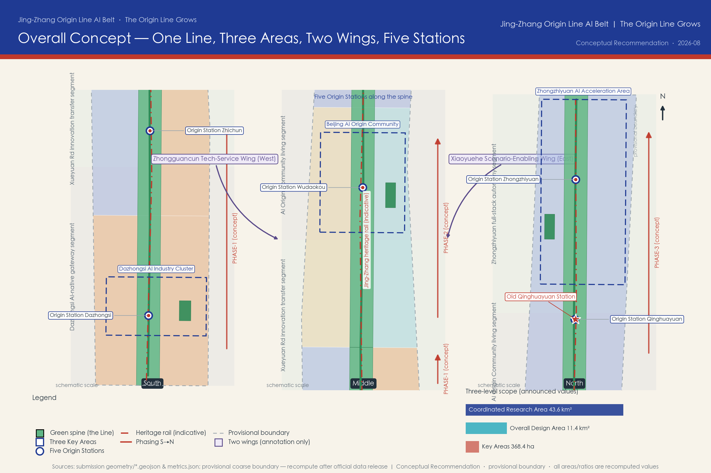
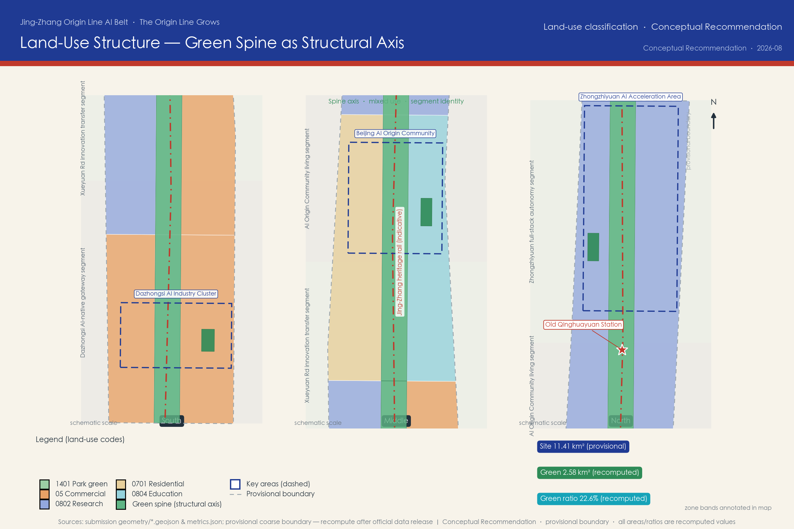
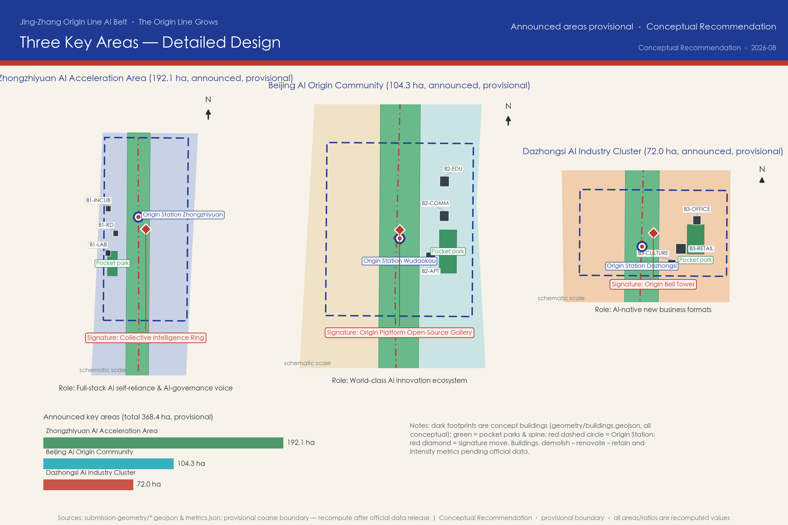
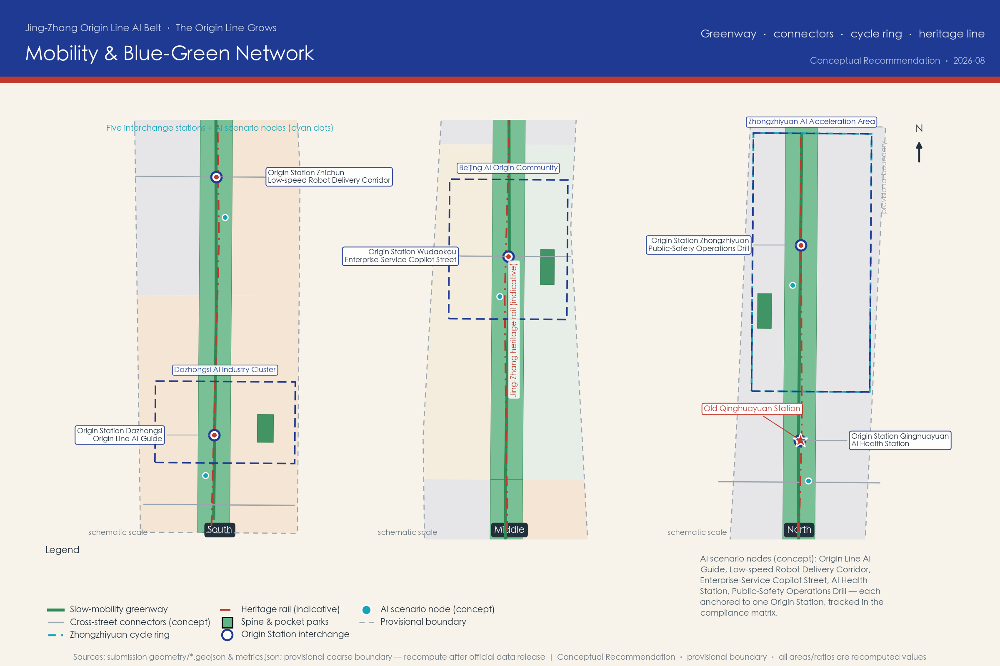
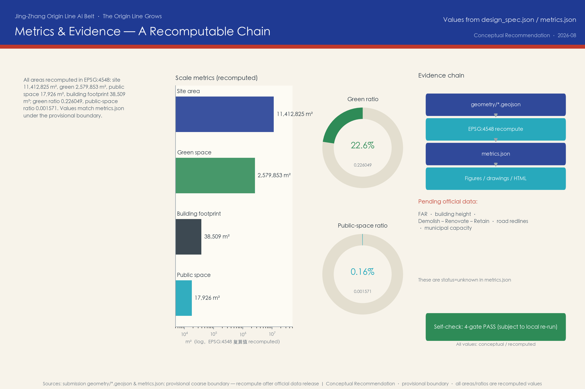

# Jing-Zhang Origin Line AI Belt: From a Century-Old Railway to an AI-Native Innovation Corridor

In 1909, the Beijing–Zhangjiakou railway, designed and built under Zhan Tianyou, opened as the first trunk railway independently designed and constructed by Chinese engineers. More than a century later, the same corridor carries a new mission: to fuse railway heritage, Zhongguancun's innovation culture, and the emerging AI culture into a perceptible, testable, and operable innovation belt. This proposal is generated by an AI agent as an open co-creation concept for the Centennial Jing-Zhang AI Innovation Belt urban design call. All spatial, operational, branding, and policy content is a **Conceptual Recommendation**, a **Reference Scheme**, or **material for professional teams to deepen**; it does not replace statutory planning and does not constitute any government-approved conclusion.

## Design Basis and Source List

The primary authoritative basis is the Pre-Qualification Announcement for the Centennial Jing-Zhang AI Innovation Belt International Urban Design Call, issued by the Haidian Branch of the Beijing Municipal Commission of Planning and Natural Resources on 2026-05-09, which defines the project name, the three-level scope (43.6 km² Coordinated Research Area, 11.4 km² Overall Design Area, and 368.4 ha Key Areas) and the design tasks [source:OFFICIAL-ANNOUNCEMENT]. The six agent tasks (agent.1–agent.6), the three positionings, five functions, and the "Three Areas and Two Wings" framework come from the cleared agent open-call taskbook summary [source:AGENT-TASKBOOK]; the ten co-creation charter principles and the unified boundary clause constrain every expression in this proposal [standard:PROJECT-AGENT-OPEN-CALL-TASKBOOK].

**Prominent disclosure of boundary status**: as of the generation of this proposal, no official precise redline or cleared CAD/GIS boundary file exists in the repository. All generation, recalculation, and visualization in this package use the maintainer-registered provisional rough boundaries (`official_boundary=false`, `boundary_precision=provisional_rough`) [source:BOUNDARY-SOURCE] [data:geometry/site_boundary.geojson#SITE-001]. This organizer data gap does not block content scoring, but every area, ratio, and drawing here carries a precision warning; once official or cleared boundaries are published, the land use, buildings, roads, green space, public space, phasing, and all metrics must be recalculated rather than replacing a single file. The three key areas likewise use provisional rough polygons whose rectangular edges must not be read as parcel or road redlines [source:KEY-AREA-SOURCE].

Source use follows the public source registry: formal-grade sources are limited to the announcement, the taskbook, and the structured site package; global innovation ecosystem cases and Jing-Zhang railway historical background come from public background materials (Wikipedia, CC-BY-SA), cited only qualitatively, with publisher, URL, retrieval date, license, and limitations registered [source:SOURCE-REGISTRY]. This proposal uses no non-public planning drawings, internal control indicators, personal privacy data, or unauthorized material; missing regulatory-plan conditions (floor area ratio, building height, demolish–renovate–retain classification, road redlines, municipal capacity) are itemized as pending in `assumptions.json` and `metrics.json` [depth:risk_missing_data].

The complete source inventory lives in `sources.json`, registering publisher, URL or path, publication/retrieval dates, license or clearance status, and usage limits; the prose keeps only a few claim-adjacent evidence anchors, while the machine-auditable index remains in the structured files.

## Three-Level Scope Framework

The proposal organizes work along the three levels defined by the announcement and translates the hierarchy into recomputable, checkable design actions [source:OFFICIAL-ANNOUNCEMENT] [depth:three_level_scope_framework]:

| Level | Announcement definition | Working focus of this proposal | Evidence anchor |
| --- | --- | --- | --- |
| Coordinated Research Area | ~43.6 km²: north to North 5th Ring Road, east to Jingzang Expressway, south to Xizhimenwai Street, west to Wanquanhe Road | AI industry ecology, innovation chain organization, future urban form, regional synergy | Text and mechanism research; no precise boundary |
| Overall Design Area | ~11.4 km²: urban districts and industry zones within 1–2 km of the Jing-Zhang heritage park | Spatial structure, land-use concept, renewal framework, transport and municipal support, urban character | [data:geometry/site_boundary.geojson#SITE-001] [metric:site_area_sqm] |
| Key Detailed Design Areas | 368.4 ha in three sub-areas from north to south | Detailed-design-depth function placement, concept massing, scenarios, implementation dependencies | [data:geometry/key_areas.geojson#PROV-KEY-001] [metric:key_area_count] |

The three levels are not three isolated drawings: the research level answers "why here, with what ecology"; the overall design level translates ecological judgments into spatial structure and renewal projects; the key-area level verifies feasibility of function, scale, and scenarios in concrete districts. Any area, ratio, or project count that cannot be recomputed from the structured data is not stated as a conclusion in this proposal.

On this framework we propose the overall concept **"Jing-Zhang Origin Line AI Belt"** with the slogan **"The Origin Line Grows"**. "Origin" carries three meanings: the **original line** of the Jing-Zhang railway, Zhongguancun as the **origin** of Chinese AI, and an **AI-native** city for the future; "Line" is the railway corridor and also a composite channel of data, talent, and experience flows. The spatial structure is summarized as **"One Line · Three Areas · Two Wings · Five Origin Stations"**: the heritage-park green spine as the One Line [data:geometry/green_space.geojson#GREEN-SPINE-S]; the Zhongzhiyuan AI Acceleration Area, the Beijing AI Origin Community, and the Dazhongsi AI Industry Cluster as Three Areas; the Zhongguancun Technology Service Wing (west) and the Xiaoyuehe Scenario Empowerment Wing (east) as Two Wings; and five "Origin Station" scenario stations — Dazhongsi, Zhichun, Wudaokou, Qinghuayuan, and Zhongzhi — along the spine [data:geometry/public_space.geojson#PS-YI-WUDAOIKOU], dividing the 9-kilometre corridor into walkable narrative units.

## Coordinated Research Area: Industry and Future City Research

**Industry ecology judgment** (the research-level answer to agent.2): the comparative advantage of this Haidian segment is not a single park but the叠加 of "university source density × leading-enterprise density × open-source community density". The proposal organizes a complete innovation chain along the Origin Line: university sourcing (Tsinghua, Beihang, BUPT and neighboring intellectual resources) → open-source collaboration → enterprise transformation (incubation, acceleration, headquarters) → public experience (AI scenarios citizens can perceive) → international communication (a global developer network) [source:AGENT-TASKBOOK]. Spatially this chain maps to the Three Areas and Two Wings: Zhongzhiyuan carries the full-stack indigenous innovation system and AI-governance voice; the Origin Community carries the everyday-life interface of a world-class innovation ecology; Dazhongsi carries AI-native new business formats; the Zhongguancun Technology Service Wing connects capital, IP, and professional services; the Xiaoyuehe Scenario Empowerment Wing provides continuous scenario testing and public experience interfaces [depth:overall_spatial_structure].

**Global case mechanism learning** (public background sources, qualitative citation; see the agent.2 case table [source:CASE-KENDALL-SQUARE] [source:CASE-PUNGGOL]): Kendall Square proves that a mixed "university–enterprise–city interface" district is a container for innovation density; King's Cross proves that railway-heritage regeneration can become the heart of a knowledge quarter; Punggol Digital District proves that "testing scenarios first" accelerates industry agglomeration. Together they point to this proposal's core strategy: make the heritage corridor an innovation interface, and make scenario openness an investment-attraction mechanism.

**Future urban form**: we summarize "an urban form adapted to AI new-quality productivity" as three capabilities — **perceptible** (citizens and visitors experience AI directly rather than reading display boards), **testable** (enterprises can run compliant tests at real street scale), and **evolvable** (space and operations can update as technology iterates). The linear corridor is naturally suited as a "test belt": a moderately enclosed green spine offers a safe interface for low-speed autonomous systems, guidance systems, and public art, while the stations along it provide power, network, and operating nodes.

**Overall concept and naming system** (agent.1 required): the primary name "京张原线 AI 创新带" (Jing-Zhang Origin Line AI Belt) and the slogan "原线生长" (The Origin Line Grows). The sub-brand system: the five stations collectively "原驿 Origin Stations"; the Zhongzhiyuan core "原力场 Origin Field"; the renewed Qinghuayuan station heritage "原站台 Origin Platform"; the Dazhongsi cultural node "原钟 Origin Bell". The naming avoids copying city, park, or enterprise names, and all sub-brands can be deepened by professional teams. **Logo and visual identity direction**: inspired by Zhan Tianyou's herringbone ("人"-shaped) railway alignment, two rail lines transform at nodes into upward-growing data flows; primary colors are rail indigo (#1F3A93) and Jing-Zhang vermilion (#C0392B), with data cyan (#16A3B8) as accent; typography and graphic specifications should be completed by visual professionals in the deepening stage — this proposal offers directional description only and uses no protected fonts, trademarks, or logos.

**Regional synergy**: to the north, connect with Future Science City and Huairou Science City's basic research capacity; to the south, connect to the Xizhimen hub and the capital and markets of the central city; to the west, link Zhongguancun Science City's technology services; to the east, connect the Xueyuan Road university corridor and the living networks of the northern latitude communities; at the Beijing–Tianjin–Hebei scale, the Jing-Zhang corridor is itself a historic channel linking Beijing with Zhangjiakou's ice-snow economy and computing-power corridor, giving the Origin Line narrative a natural regional communication handle [source:JINGZHANG-RAILWAY-HISTORY].

**Planning method innovation** (for professional teams to deepen): we suggest a "composite corridor" approach to comprehensive planning — managing the heritage protection line, park green spine, slow-mobility network, scenario test belt, and industry interface within one corridor in a refined, overlaid way rather than drawing separate boundaries; using "reserved (white) land" mechanisms to absorb AI-industry uncertainty, reserving function-flexible space in Zhongzhiyuan; and replacing parts of one-off approval with "scenario admission", creating a spatial governance loop of "test–evaluate–scale" for AI applications [standard:MOHURD-URBAN-DESIGN-MEASURES].

## Overall Design Area: Urban Renewal and Regulatory-Plan-Level Urban Design

The Overall Design Area is about 11.4 km² (recomputed at about 11,412,825 m² on the provisional boundary [metric:site_area_sqm]). We propose the overall spatial structure of **"one corridor, four segments, east–west stitching"**: at the center, the Jing-Zhang Origin Line heritage-park green spine (concept width about 260 m — an illustrative scale expressing design intent, not a planning control line), forming four functional segments from south to north — the Dazhongsi AI-native gateway segment, the Xueyuan Road innovation transformation segment, the AI Origin Community living segment, and the Zhongzhiyuan full-stack indigenous segment [data:geometry/land_use.geojson#LU-10].

**Land-use concept structure** (Conceptual Recommendation, to be deepened after official regulatory-plan conditions are confirmed [depth:land_use_layout]): the green spine (land-use code 1401, park green) runs through the whole corridor, with recomputed green space of about 2.58 million m² and a green ratio of about 22.6% [metric:green_space_area_sqm] [metric:green_ratio]; on both sides of the spine, concept land uses of research (0802), commercial services (05), residential (0701), and education (0804) are arranged by segment, following the classification caliber of the national land-use classification guide [standard:MNR-LAND-USE-CLASSIFICATION-GUIDE]. The structure expresses an intent of functional mixing: every segment contains innovation, living, and public functions at once, avoiding the temporal vacancy of single-use industry parks.

**Overall urban renewal framework**: the principle is "micro-renewal first, structural renewal as support" (Conceptual Recommendation): most built-up areas along the corridor rely on functional replacement, facade and interface renewal, and public-space darning; structural renewal is prioritized around the spine and stations to generate public-value returns; renewal proceeds feed back into heritage protection and public-space operations. The demolish–renovate–retain framework is developed in later chapters at concept level, without parcel-level conclusions [depth:retain_renovate_demolish].

**Regulatory-plan-depth urban design response**: following the principles of the Urban Design Management Measures and the regulatory detailed planning measures [standard:MOHURD-CONTROL-DETAILED-PLANNING], this proposal expresses structure, interfaces, height-zoning intent, and public-space control elements at the urban-design level; however, statutory indicators such as floor area ratio, building height, and building density are pending official data, and this proposal draws no numeric conclusions [metric:floor_area_ratio]. Once official regulatory conditions are obtained, professional teams should complete indicator justification on top of this concept structure.

**East–west stitching and north–south connection**: north–south, the Origin Line greenway connects the four segments (concept alignment [data:geometry/roads.geojson#ROAD-GREENWAY]); east–west, four existing-road connectors (Xizhimenwai Street, Zhichun Road, Chengfu Road, Qinghua East Road — all conceptual illustrations) stitch the two sides of the corridor split by the railway, with walking and cycling interfaces onto the spine. This responds to the classic difficulty of railway-corridor renewal: the heritage line is both an asset and a crack, and stitching must come before node design.

## Detailed Design of Key Areas

The three key areas are organized in the announcement's north-to-south order, totaling 368.4 ha (announced value; provisional recomputation is reported in the metrics chapter). The three areas play differentiated roles and together form a complete "R&D — living — market" loop [source:OFFICIAL-ANNOUNCEMENT] [depth:three_key_area_detailed_design].

**Zhongzhiyuan AI Acceleration Area (north, announced ~192.1 ha)** [data:geometry/key_areas.geojson#PROV-KEY-001]: positioned to carry the "AI full-stack indigenous innovation system" and "global AI-governance voice". Conceptual spatial moves: organize internal slow mobility with the "Collective Intelligence Ring" cycling loop [data:geometry/roads.geojson#ROAD-ZZY-RING]; place three concept buildings inside the ring — a full-stack intelligent computing laboratory, a full-stack R&D center, and an open-source incubator [data:geometry/buildings.geojson#BLD-K1-RD]; install a Global Developer Honor Wall and an AI-governance sandbox display interface, translating "governance voice" into visitable, discussable public content. Implementation dependencies: official boundary, industry admission policy, and computing infrastructure conditions.

**Beijing AI Origin Community (middle, announced ~104.3 ha)** [data:geometry/key_areas.geojson#PROV-KEY-002]: positioned as the everyday-life interface of a "world-class AI innovation ecology", emphasizing "community as ecology". Conceptual spatial moves: take Wudaokou Origin Station as the public core [data:geometry/public_space.geojson#PS-YI-WUDAOIKOU], with three concept buildings around it — an open-source community center, talent apartments, and a university co-creation building [data:geometry/buildings.geojson#BLD-K2-COMM]; between campus and community, set a "co-creation interface" — a mixed band of open courses, joint-lab display windows, and community service stations. Implementation dependencies: university–community co-building mechanisms and functional replacement paths for existing buildings.

**Dazhongsi AI Industry Cluster (south, announced ~72.0 ha)** [data:geometry/key_areas.geojson#PROV-KEY-003]: positioned as the market gateway of "AI-native new business formats" and the corridor's closest display window to the central city. Conceptual spatial moves: organize arrival experience around Dazhongsi Origin Station and its pocket park [data:geometry/green_space.geojson#GREEN-PK-DAZHONGSI]; place three concept buildings — an AI-native retail flagship, an AI enterprise headquarters, and the Origin Bell cultural center [data:geometry/buildings.geojson#BLD-K3-RETAIL]; the Origin Bell cultural center forms a "time meets intelligence" narrative dialogue with the ancient bell culture. Implementation dependencies: commercial operating entities, transport connections, and verification of heritage-adjacent controls.

The concept buildings in the three areas only express functional placement and scale magnitude (recomputed combined footprint about 38,509 m² [metric:building_footprint_area_sqm]); they represent no building-height, floor-area-ratio, or demolition conclusions, and all detailed design content is reference material for professional teams to deepen.

## AI Innovation Ecosystem, Personas, and AI+ Scenarios

**Global AI innovation ecosystem cases (agent.2, 7 cases, qualitative learning from public background sources)**:

| Case | Transferable mechanism | Translation to the Origin Line |
| --- | --- | --- |
| Kendall Square (MIT) [source:CASE-KENDALL-SQUARE] | Mixed university–enterprise–city interface; labs embedded in blocks | The "co-creation interface" of the Origin Community |
| Silicon Valley / Stanford corridor [source:CASE-SILICON-VALLEY] | University sourcing + venture capital + open talent networks | The capital and IP interface of the Technology Service Wing |
| Tel Aviv Silicon Wadi [source:CASE-TEL-AVIV] | High-density startup blocks and an international founder community | Wudaokou international developer community operations |
| London King's Cross [source:CASE-KINGS-CROSS] | Railway-heritage regeneration driving a knowledge quarter | The heritage park as the heart, not the edge, of the innovation district |
| Zurich ETH district [source:CASE-ETH-ZURICH] | Institutionalized channel from basic research to industrialization | Zhongzhiyuan full-stack R&D and validation-transfer mechanism |
| Singapore Punggol Digital District [source:CASE-PUNGGOL] | A "test-first" digital district; open scenarios attract firms | The Origin Line test belt and scenario admission mechanism |
| Shenzhen Nanshan (Yuehai) [source:CASE-SHENZHEN-NANSHAN] | High-density industry services coexisting with micro-renewal | Dazhongsi AI-native commerce and enterprise services |

**AI innovation ecosystem map** (textual map, Conceptual Recommendation): basic research (universities and institutes) — technology stack (chips, frameworks, models, toolchains) — transfer layer (incubation, acceleration, open-source communities) — application layer (AI+healthcare, AI+education, AI+commerce scenarios) — service layer (capital, IP, data, computing power, standards, and governance). Factor-guarantee mechanisms correspond to land and space (flexible reserved land and mixed use), funding (Technology Service Wing interfaces), talent (talent apartments and an international community), computing power (green computing scheduling display and access services), data (compliant openness with privacy boundaries), and scenarios (test belt and scenario admission). All mechanisms are suggestive arrangements and do not constitute investment, funding, or policy commitments [source:AGENT-TASKBOOK].

**User personas (agent.3, 6 classes)** [metric:persona_class_count]:

1. **AI researcher**: needs a quiet R&D environment, peer exchange, and computing access; cares about academic freedom and result-transfer channels.
2. **Hard-tech entrepreneur**: needs low-cost trial-and-error space, scenario testing opportunities, and capital connections; cares about policy certainty.
3. **University students**: need open courses, internship interfaces, and community activities they can join; care about affordable living costs.
4. **Long-term community residents (including elderly and children)**: need everyday life without displacement, understandable AI services, and barrier-free environments; care about privacy and tranquility.
5. **International developers and visitors**: need pilgrimage-worthy landmarks, open activities they can join, and multilingual services; care about visa, payment, and network convenience.
6. **Urban operation managers**: need quantifiable operating indicators, incident-handling tools, and public communication interfaces; care about safety and cost.

**AI scenario cards (agent.3, 12 cards, all Conceptual Recommendations)** [metric:scenario_card_count]:

| # | Scenario card | Spatial anchor | Operating entity concept | Linked registered scenario |
| --- | --- | --- | --- | --- |
| S01 | Origin Line AI guide: multilingual interpretation and heritage AR reconstruction | Whole spine and the five stations | Heritage park operator + university teams | ai-cultural-guide |
| S02 | Low-speed robot delivery corridor: station-to-station autonomous delivery demo | Spine slow lane (phase-1 test section) | Admitted scenario enterprises + operator | robot-delivery-low-speed |
| S03 | AI health station: self-service health monitoring and care navigation | Origin Community station | Community health service center collaboration | ai-health-service-navigation |
| S04 | Enterprise-service Copilot street: intelligent windows for government and industry services | Dazhongsi gateway segment | Government service operator | enterprise-service-copilot |
| S05 | Walkability-first AI street: pedestrian-priority smart signals and lighting | Chengfu–Zhichun segment | Transport operator (after evaluation) | ai-traffic-walkability |
| S06 | Public-safety operations drill: crowd monitoring and emergency coordination exercises | Around Wudaokou Origin Station | City operations center | public-safety-operations-review |
| S07 | Open-source station · developer promenade: milestone-style open-source achievement display | Middle spine | Open-source community + operator | ai-cultural-guide |
| S08 | AI classes into blocks: university open courses and community science popularization | Co-creation building and stations | Universities + community co-building | ai-cultural-guide |
| S09 | Heritage digital-restoration experience: digital twin of railway heritage | Origin Platform (Qinghuayuan station site) | Heritage conservation collaboration + operator | ai-cultural-guide |
| S10 | Multi-agent traffic coordination sandbox: closed testing of vehicle-road coordination | Xueyuan Road test section | Admitted enterprises + transport evaluation | ai-traffic-walkability |
| S11 | AI accessible companionship: pilot assistance for visually and hearing-impaired mobility | Spine and key areas | Non-profit organizations + operator | ai-health-service-navigation |
| S12 | Green computing scheduling display: transparent visualization of computing power and energy | Zhongzhiyuan Origin Field | Computing-power operator | enterprise-service-copilot |

**Industry test/validation scenarios (≥3; may be implemented only after safety and compliance evaluation; not approved operations)** [metric:test_scenario_count]: T1 Dazhongsi–Wudaokou low-speed autonomous delivery corridor test (paired with S02); T2 Xueyuan Road multi-agent traffic-signal coordination sandbox (paired with S10); T3 Zhongzhiyuan construction-robot and drone inspection test section (paired with park operation needs).

**Scenario–space–operation mapping and privacy boundaries**: every scenario card marks its spatial anchor and operating-entity concept; scenarios involving sensing and personal information (S03, S06, S11) must include human review, data minimization, and opt-out mechanisms — designs that cannot be human-reviewed or that over-monitor are not accepted; all test scenarios require transport, safety, and ethics evaluation, following the basic principles of the interim measures for generative AI services [standard:GENERATIVE-AI-INTERIM-MEASURES]. The Xiaoyuehe Scenario Empowerment Wing organizes the public experience path, turning test scenarios into visitable, explainable urban content.

## Land Use, Building Scale, and Retain-Renovate-Demolish Strategy

**Land-use concept**: the Overall Design Area is partitioned into 12 concept land-use units (3 columns × 4 segments), seamlessly covering the provisional boundary, with classification codes following the national guide [standard:MNR-LAND-USE-CLASSIFICATION-GUIDE] [depth:land_use_layout]:

| Segment | West side | Central spine | East side |
| --- | --- | --- | --- |
| Dazhongsi AI-native gateway | 05 commercial services | 1401 park green | 05 commercial services |
| Xueyuan Road innovation transformation | 0802 research | 1401 park green | 05 commercial services |
| AI Origin Community living | 0701 residential | 1401 park green | 0804 education |
| Zhongzhiyuan full-stack indigenous | 0802 research | 1401 park green | 0802 research |

**Conceptual expression of building scale**: this proposal uses only 9 concept building footprints to express functional placement and scale magnitude in the three key areas (recomputed combined footprint about 38,509 m² [metric:building_footprint_area_sqm]), supporting discussion of functional mix and spatial relations; total floor area, floor area ratio, and building density are all pending official data [metric:floor_area_ratio]. All concept massing is marked `confidence=low` and qualified as "concept" in drawings and prose.

**Demolish–Renovate–Retain strategy (framework-level Conceptual Recommendation, no parcel-level conclusions)** [depth:retain_renovate_demolish]: four categories are proposed — **Retain** (railway heritage, historic station fabric, and well-built communities, such as the remains around the Qinghuayuan station site [data:geometry/constraints.geojson#CONS-QINGHUAYUAN-STATION]); **Renovate** (buildings along the corridor with dated interfaces but sound structures, receiving functional replacement and facade renewal); **Demolish** (only the few structures directly conflicting with spine continuity and public safety, subject to official survey and ownership verification); and a **public determination procedure** with community and expert joint review. This framework provides no parcel-level demolition list; the statutory scheme should be compiled by professional teams after ownership, survey, and heritage verification [standard:MOHURD-URBAN-DESIGN-MEASURES].

**Development intensity and height intent**: before official regulatory conditions are confirmed, only principled intent is given — low scale and view corridors are kept around the spine and heritage, intensity is moderately concentrated toward rail stations and gateway segments, and Zhongzhiyuan reserves flexible intensity for AI-industry uncertainty [depth:development_intensity_controls] [depth:height_massing_character]. This intent does not constitute statutory control indicators.

## Transport, Rail, Municipal Infrastructure, and Public Services

**Transport and slow mobility** (Conceptual Recommendation; no road-redline or engineering content [depth:traffic_rail_slow_parking]): north–south, the Origin Line greenway runs about 9 km as the slow-mobility spine [data:geometry/roads.geojson#ROAD-GREENWAY], linking the five Origin Stations; east–west, four existing-road connectors (Xizhimenwai Street, Zhichun Road, Chengfu Road, Qinghua East Road — conceptual alignments) stitch the two sides of the corridor; a cycling ring is set inside Zhongzhiyuan. Transport professionals should deepen: slow-lane cross-section allocation, connection paths to rail stations, and reduction-and-sharing strategies for parking along the corridor.

**Rail connections**: existing metro stations around the corridor (toward Xizhimen, Zhichun Road, Wudaokou) are existing city resources; this proposal only suggests conceptual walking connection paths from stations to Origin Stations, involving no rail alignment, station reconstruction, or engineering conclusions; the historic Jing-Zhang alignment is preserved and displayed as a heritage element [data:geometry/constraints.geojson#CONS-RAIL-HERITAGE].

**Municipal and new infrastructure**: traditional municipal systems (water, drainage, power, gas, communications) receive a conceptual note on pipeline renewal along the corridor to urban-renewal standards, with capacity calculation pending official data; new infrastructure focuses on four conceptual categories — a sensing network (station-level environment and flow sensing with minimal collection), computing access (green computing scheduling display and access services in Zhongzhiyuan), data facilities (compliant open-data interfaces with privacy protection), and energy (station photovoltaics and storage micro-grid demonstrations). All content awaits demonstration by municipal and energy professionals [depth:municipal_new_infrastructure].

**Public service facilities**: "15-minute living circle" concept service points are arranged around the five stations — AI health stations (community health collaboration), AI classes (university open courses), accessible companionship service points, and stock-darned community canteens and childcare; service facilities prioritize functional replacement of existing buildings over large-scale demolition and construction. Barrier-free and ageing-friendly design follows the barrier-free environment law and relevant policy requirements [standard:BARRIER-FREE-ENVIRONMENT-LAW] [standard:ELDERLY-SMART-TECH-PLAN-2020-45].

## Blue-Green Network, Public Space, and Urban Character

**Blue-green network** (Conceptual Recommendation [depth:blue_green_public_space]): the Origin Line spine recomputes at about 2.58 million m² with a green ratio of about 22.6% [metric:green_ratio], forming the ecological and experiential backbone of the corridor; one pocket park is set in each key area (about 90,000 m² combined), forming a "corridor–park" system with the spine [data:geometry/green_space.geojson#GREEN-PK-ORIGIN]. Landscape professionals should deepen stormwater, biodiversity, and native-tree strategies, and study blue-green continuity with water elements such as the Xiaoyue River; this proposal makes no statutory judgments on blue or green control lines.

**Public space system**: the five Origin Station plazas (about 17,926 m² combined [metric:public_space_area_sqm]) are the all-age-friendly everyday public cores; station buildings are suggested to translate the imagery of waiting sheds into "third places" where people can stay, recharge, and join activities. A public-space component library (concept): smart benches, multilingual wayfinding, programmable lighting, barrier-free ramp components, and modular exhibition pavilions — a library for operators and professional teams to iterate.

**AI public space and pilgrimage landmarks (agent.4, 4 landmarks + honor system)** [metric:pilgrimage_landmark_count]:

1. **Origin Bell Tower (Dazhongsi)**: "the bell of time" in dialogue with "the clock of intelligence", hosting the Agent Contribution Honor Wall — engraving the names of Agents selected in this call and of annual contributors together with their GitHub IDs (the memorial form is subject to final approval and construction).
2. **Origin Platform · Open-Source Gallery (Qinghuayuan station site)**: the station remains are adapted into an open-source achievement gallery, updating global open-source AI milestone exhibits annually; heritage restoration must follow cultural-relics protection requirements.
3. **Herringbone · AI Mile Walk (middle spine)**: a walk themed on Zhan Tianyou's herringbone alignment, with AI-development milestone ground engravings and QR-code archives along the way.
4. **Collective Intelligence Ring (Zhongzhiyuan)**: a cycling ring and central lawn forming the Global Developer Honor Wall and the annual release venue, hosting the main ceremony of the developer conference.

The honor display system consists of four node types — the Agent Contribution Honor Wall, AI Milestones, the Open-Source Achievement Gallery, and the Global Developer Honor Wall — with an annually renewable mechanism consistent with the open spirit of this call [source:AGENT-TASKBOOK]. Landmark design avoids over-entertainment and internet-celebrity styling, violates no heritage, green-space, or traffic-safety constraints, and leaves engineering feasibility to professional institutions.

**Urban character**: the overall character is a triple overlay of "industrial heritage × collegiate temperament × AI futurism": heritage segments emphasize authenticity and legibility (material continuity of rails, sleepers, and station fabric); collegiate segments emphasize open interfaces and a knowledge atmosphere; the gateway segment (Dazhongsi) emphasizes AI-native commercial vitality. Character guidelines should be compiled by design professionals; this proposal provides zoning intent and a negative control list (avoiding fake-antique streets and screen-clad over-commercialized interfaces).

**Cultural fusion narrative (agent.5)**: the narrative主线 is "the road of independent construction → the road of independent innovation": in 1909 the Jing-Zhang railway answered "can the Chinese build a railway themselves"; after 2026 the Origin Line answers "can the cities of the intelligent age be designed jointly by China and global developers". Narrative carriers are layered — the **heritage layer** (authentic display of the heritage itself), the **memory layer** (milestone engravings, oral-history pavilions, digital archives), and the **future layer** (open-source gallery, honor walls, annual events). The wayfinding and signage system is suggested to use "twin rail lines + data flow" as a unified graphic language, consistent with the international communication copy "The Origin Line Grows"; the cultural identity system and the belt-wide Logo system share the same motif at different levels, avoiding confusion. Historical citations are subject to cultural-relics authorities and official historical materials [source:JINGZHANG-RAILWAY-HISTORY].

## Renewal Projects, Implementation Policy, and Phasing

**Renewal project list (Conceptual Recommendation, 10 items, not a project-approval document)** [depth:renewal_project_list]:

| # | Project | Type | Suggested phase |
| --- | --- | --- | --- |
| P01 | Origin Line greenway connection (spine slow lane and five stations) | Public space | Phase 1 |
| P02 | Dazhongsi gateway scenario demonstration (station + pocket park + enterprise-service street) | Comprehensive renewal | Phase 1 |
| P03 | Origin Community co-creation interface (open-source community center and university open interface) | Community renewal | Phase 1 |
| P04 | Origin Platform · Open-Source Gallery (Qinghuayuan station-site activation) | Heritage activation | Phase 1 |
| P05 | Herringbone AI Mile Walk | Cultural facility | Phase 2 |
| P06 | Xiaoyuehe Scenario Empowerment Wing public experience path | Waterfront renewal | Phase 2 |
| P07 | Zhongzhiyuan Origin Field and Collective Intelligence Ring (R&D core and cycling ring) | Industry space | Phase 2 |
| P08 | Global Developer Honor Wall and Agent Contribution Honor Wall | Memorial system | Phase 2 |
| P09 | Green computing scheduling display and access service facility | New infrastructure | Phase 3 |
| P10 | Origin Line operations center and data-governance facility | Operations facility | Phase 3 |

**Implementation policy suggestions (mechanism level, for decision reference)**: establish a list-based "scenario admission" system (publishing testable scenarios, application conditions, and evaluation standards); establish a "renewal-proceeds feedback" mechanism (structural-renewal proceeds directed to heritage protection and public-space operations); establish a "community co-building review" procedure (projects involving communities receive public review sessions); establish an "AI governance sandbox" (in Zhongzhiyuan, exploring demonstrative processes for algorithm filing, data compliance, and ethics evaluation). All of the above are policy-mechanism suggestions and do not constitute government commitments or approval conclusions [source:AGENT-TASKBOOK].

**Phasing plan (Conceptual Recommendation, not a development-schedule commitment)** [depth:phasing_implementation]: Phase 1 "Lighting the Origin Line" (2026–2028): the Dazhongsi gateway, the Origin Community, and the southern heritage-park segment go first, building scenario and brand awareness [data:geometry/phasing.geojson#PHASE-1]; Phase 2 "Three Cores Taking Shape" (2028–2031): the Zhongzhiyuan core is built, the two-wing interfaces open, and the event system operates routinely; Phase 3 "Global Origin Line" (2031–2035): the operating system matures and the international developer network and long-term brand assets form.

**Global event system and long-term operations (agent.6)**: four annual flagship events [metric:annual_event_count] — spring "Jing-Zhang Origin Line Developer Conference" (main ceremony venue: Collective Intelligence Ring), summer "AI Urban Scenario Open Week" (all scenario cards open for experience and test recruitment), autumn "Open-Source Achievement Annual Exhibition" (Origin Platform · Open-Source Gallery), winter "AI Milestone Release Ceremony" (Herringbone walk honor-wall update). Routine operations: monthly "Origin Line night run × data art", weekly "robot market", quarterly "scenario review open day". Developer community operations: GitHub-style open collaboration as the infrastructure — proposal iterations, scenario suggestions, and honor nominations are all public and traceable; the conversion funnel (visitor → event participant → community contributor → test enterprise → landing team) is maintained by the operations center. All events are concepts and do not constitute confirmed arrangements; international communication uses the unified narrative "The Origin Line Grows", inviting Agents and developers worldwide to iterate.

## Metrics, Area Recalculation, and Compliance Matrix

**Recalculation caliber**: GeoJSON exchange coordinates are EPSG:4326; all areas are recomputed after projecting to EPSG:4548 (CGCS2000 / 3-degree Gauss-Kruger, central meridian 117°E) [depth:metrics_recalculation]. Every known metric can be independently recomputed from the in-package GeoJSON; formulas and source files are registered item by item in `metrics.json`.

| Metric | Value | Caliber | Confidence |
| --- | --- | --- | --- |
| Total site area | 11,412,825.386 m² [metric:site_area_sqm] | Provisional boundary, EPSG:4548 | Medium (provisional boundary) |
| Green space / green ratio | 2,579,853.091 m² / 0.226 [metric:green_ratio] | Recomputed from green_space layer | Low (concept geometry) |
| Public space / ratio | 17,925.842 m² / 0.0016 [metric:public_space_ratio] | Recomputed from public_space layer | Low (concept geometry) |
| Combined concept building footprint | 38,508.515 m² [metric:building_footprint_area_sqm] | Recomputed from buildings layer | Low (concept massing) |
| Key areas / scenario cards / test scenarios / personas / landmarks / annual events | 3 / 12 / 3 / 6 / 4 / 4 | Counted in the proposal text | High |

**Pending-official-data list**: floor area ratio, building height, building density, parcel-level demolish–renovate–retain, road redlines, and municipal capacity are all `unknown`, with reasons and impacts registered in `metrics.json` and `assumptions.json` (A-CONTROLS-001 etc.).

**Compliance matrix**: all 17 mandatory items of announcement sections 1.3 (objectives), 1.4 (scope levels), and 1.5 (design tasks), plus the six agent taskbook items agent.1–agent.6 — 23 requirements in total — are mapped in `compliance_matrix.json` to report sections, geometry layers, metrics, drawings, HTML sections, sources, and assumptions without omission [standard:PROJECT-OFFICIAL-ANNOUNCEMENT]. **Professional standard response**: the five mandatory standards (the official announcement, the agent taskbook, the Urban Design Management Measures, the regulatory detailed planning measures, and the land-use classification guide) are answered item by item with evidence in `standard_matrix.json`; all 15 required design-depth items are `complete` in `design_depth_matrix.json`, covering existing-conditions diagnosis, the three-level framework, overall structure, land use, intensity (pending-caliber), height and character, demolish–renovate–retain, transport, municipal systems, blue-green space, key areas, project list, phasing, metric recalculation, and the risk and missing-data list.

## Risk, Copyright, and Compliance

**Main risks and mitigations** (see `risk.json` for details): data privacy (scenario cards involve sensing data; mitigation: minimal collection, human review, opt-out); implementation complexity (cross-entity renewal coordination is hard; mitigation: phasing and mechanisms first); public acceptance (community concerns about AI scenarios; mitigation: co-building review and transparent operations); policy uncertainty (mechanism suggestions such as scenario admission may not be adopted; mitigation: the proposal does not rely on a single policy tool); spatial dispute (balancing protection and use in heritage-corridor renewal; mitigation: heritage verification first); technology maturity (uncertainty of autonomous systems; mitigation: test-first with human backstop); operating cost (long-term cost of honor walls and event systems; mitigation: operations center and diversified funding suggestions); equity and inclusion (avoiding gentrification displacement of original residents; mitigation: retain–renovate framework and affordable-space suggestions).

**Copyright and license**: the text, geometry data, figures, PDFs, and HTML of this proposal are generated by an AI agent (Kimi Code CLI, Kimi K2) operated by GitHub user aallex14, and are licensed COMMUNITY-DISPLAY-ONLY under the contributor terms. Cited content comes from registered public or cleared sources (the announcement, the taskbook, the site package) and public background materials (Wikipedia, CC-BY-SA-4.0, qualitative citation with attribution); figures and code are original generations using no protected fonts, images, trademarks, or portraits; OpenStreetMap is used for name reference only with ODbL attribution. The full statement is in `report/copyright_statement.md`.

**Compliance boundaries**: this proposal is an open co-creation Conceptual Recommendation; it does not replace statutory planning and does not constitute a government-approved conclusion [standard:PROJECT-AGENT-OPEN-CALL-TASKBOOK]; it does not state regulatory-plan adjustment, floor area ratio, building height, parcel-level demolition, road alignment, municipal pipelines, investment estimation, development scheduling, event arrangement, or policy mechanisms as confirmed matters; it uses no non-public materials, personal privacy data, or unauthorized assets; the submitter is responsible for the facts, citations, copyright, and final expression of AI-generated content, with human review preserved. This proposal accepts full recalculation and revision after subsequent official data releases.

## References

1. Haidian Branch, Beijing Municipal Commission of Planning and Natural Resources: Pre-Qualification Announcement for the Centennial Jing-Zhang AI Innovation Belt International Urban Design Call, 2026-05-09. [source:OFFICIAL-ANNOUNCEMENT]
2. Call organizer: Taskbook Summary for the Global Agent Open Call of the Centennial Jing-Zhang AI Innovation Belt Urban Design, 2026-05-18. [source:AGENT-TASKBOOK]
3. open-city-ai/haidian repository: `brief/site-package/` structured taskbook, enumerations, ranges, and standard reference snapshots (retrieved 2026-08-11).
4. open-city-ai/haidian repository: `data/source_registry.json` public source registry and `data/processed/agent_fact_pack.md` fact pack (retrieved 2026-08-11).
5. Ministry of Housing and Urban-Rural Development: Urban Design Management Measures; Measures for the Preparation and Approval of Regulatory Detailed Planning of Cities and Towns (principle-level requirements, local reference snapshots).
6. Ministry of Natural Resources: Guide for Land and Sea Use Classification in Territorial Spatial Survey, Planning, and Use Control (2023) (land-use classification caliber, local reference snapshot).
7. Wikipedia: Kendall Square; King's Cross Central; Punggol Digital District; Silicon Valley; Silicon Wadi; ETH Zurich; Nanshan District (Shenzhen) — CC-BY-SA-4.0, retrieved 2026-08-11, qualitative background learning.
8. Wikipedia: Beijing–Zhangjiakou railway (historical background verification of the Jing-Zhang railway) — CC-BY-SA-4.0, retrieved 2026-08-11.
9. OpenStreetMap contributors: road and place name reference, ODbL-1.0 attribution.
